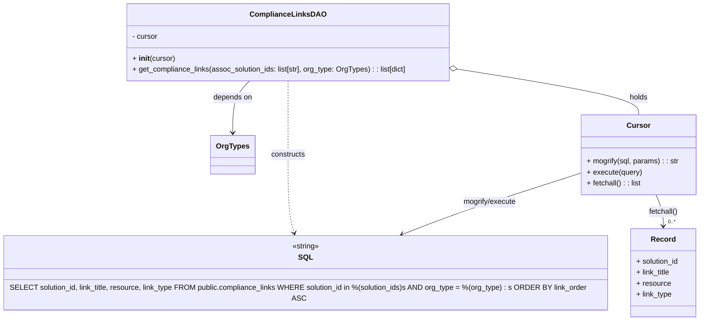

# Diagram: common/support_service/support_service/db/dao/compliance_links_dao.py

> Auto-generated by Obscura crawlers

## Mermaid

### SVG

<svg id="container" width="1537.078125" xmlns="http://www.w3.org/2000/svg" class="classDiagram" height="698" viewBox="0 0 1537.078125 698" role="graphics-document document" aria-roledescription="class"><g><defs><marker id="container_class-aggregationStart" class="marker aggregation class" refX="18" refY="7" markerWidth="190" markerHeight="240" orient="auto"><path d="M 18,7 L9,13 L1,7 L9,1 Z"></path></marker></defs><defs><marker id="container_class-aggregationEnd" class="marker aggregation class" refX="1" refY="7" markerWidth="20" markerHeight="28" orient="auto"><path d="M 18,7 L9,13 L1,7 L9,1 Z"></path></marker></defs><defs><marker id="container_class-extensionStart" class="marker extension class" refX="18" refY="7" markerWidth="190" markerHeight="240" orient="auto"><path d="M 1,7 L18,13 V 1 Z"></path></marker></defs><defs><marker id="container_class-extensionEnd" class="marker extension class" refX="1" refY="7" markerWidth="20" markerHeight="28" orient="auto"><path d="M 1,1 V 13 L18,7 Z"></path></marker></defs><defs><marker id="container_class-compositionStart" class="marker composition class" refX="18" refY="7" markerWidth="190" markerHeight="240" orient="auto"><path d="M 18,7 L9,13 L1,7 L9,1 Z"></path></marker></defs><defs><marker id="container_class-compositionEnd" class="marker composition class" refX="1" refY="7" markerWidth="20" markerHeight="28" orient="auto"><path d="M 18,7 L9,13 L1,7 L9,1 Z"></path></marker></defs><defs><marker id="container_class-dependencyStart" class="marker dependency class" refX="6" refY="7" markerWidth="190" markerHeight="240" orient="auto"><path d="M 5,7 L9,13 L1,7 L9,1 Z"></path></marker></defs><defs><marker id="container_class-dependencyEnd" class="marker dependency class" refX="13" refY="7" markerWidth="20" markerHeight="28" orient="auto"><path d="M 18,7 L9,13 L14,7 L9,1 Z"></path></marker></defs><defs><marker id="container_class-lollipopStart" class="marker lollipop class" refX="13" refY="7" markerWidth="190" markerHeight="240" orient="auto"><circle stroke="black" fill="transparent" cx="7" cy="7" r="6"></circle></marker></defs><defs><marker id="container_class-lollipopEnd" class="marker lollipop class" refX="1" refY="7" markerWidth="190" markerHeight="240" orient="auto"><circle stroke="black" fill="transparent" cx="7" cy="7" r="6"></circle></marker></defs><g class="root"><g class="clusters"></g><g class="edgePaths"><path d="M549.261,176L543.191,182.167C537.122,188.333,524.983,200.667,518.913,219.5C512.844,238.333,512.844,263.667,512.844,276.333L512.844,289" id="id_ComplianceLinksDAO_OrgTypes_1" class="edge-thickness-normal edge-pattern-solid relation" style=";;;" data-edge="true" data-et="edge" data-id="id_ComplianceLinksDAO_OrgTypes_1" data-points="W3sieCI6NTQ5LjI2MDg0NzEwNzQzOCwieSI6MTc2fSx7IngiOjUxMi44NDM3NSwieSI6MjEzfSx7IngiOjUxMi44NDM3NSwieSI6Mjk1fV0=" marker-end="url(#container_class-dependencyEnd)"></path><path d="M1001.38,150.105L1068.031,160.587C1134.681,171.07,1267.981,192.035,1334.631,208.684C1401.281,225.333,1401.281,237.667,1401.281,243.833L1401.281,250" id="id_ComplianceLinksDAO_Cursor_2" class="edge-thickness-normal edge-pattern-solid relation" style=";;;" data-edge="true" data-et="edge" data-id="id_ComplianceLinksDAO_Cursor_2" data-points="W3sieCI6OTg0LjMzOTg0Mzc1LCJ5IjoxNDcuNDI0NzQ4MTYxOTg4N30seyJ4IjoxNDAxLjI4MTI1LCJ5IjoyMTN9LHsieCI6MTQwMS4yODEyNSwieSI6MjUwfV0=" marker-start="url(#container_class-aggregationStart)"></path><path d="M631.938,176L631.938,182.167C631.938,188.333,631.938,200.667,631.938,227.5C631.938,254.333,631.938,295.667,631.938,337C631.938,378.333,631.938,419.667,634.537,449.042C637.136,478.417,642.335,495.834,644.934,504.542L647.534,513.251" id="id_ComplianceLinksDAO_SQL_3" class="edge-thickness-normal edge-pattern-dashed relation" style=";;;" data-edge="true" data-et="edge" data-id="id_ComplianceLinksDAO_SQL_3" data-points="W3sieCI6NjMxLjkzNzUsInkiOjE3Nn0seyJ4Ijo2MzEuOTM3NSwieSI6MjEzfSx7IngiOjYzMS45Mzc1LCJ5IjozMzd9LHsieCI6NjMxLjkzNzUsInkiOjQ2MX0seyJ4Ijo2NDkuMjQ5OTQxMjU5Mzk4NSwieSI6NTE5fV0=" marker-end="url(#container_class-dependencyEnd)"></path><path d="M1276.758,376.313L1232.05,390.427C1187.342,404.542,1097.927,432.771,1029.665,456.185C961.403,479.599,914.294,498.198,890.739,507.497L867.185,516.797" id="id_Cursor_SQL_4" class="edge-thickness-normal edge-pattern-solid relation" style=";;;" data-edge="true" data-et="edge" data-id="id_Cursor_SQL_4" data-points="W3sieCI6MTI3Ni43NTc4MTI1LCJ5IjozNzYuMzEyODkyMjIxNzAyODR9LHsieCI6MTAwOC41MTE3MTg3NSwieSI6NDYxfSx7IngiOjg2MS42MDM4MjQwMTMxNTc5LCJ5Ijo1MTl9XQ==" marker-end="url(#container_class-dependencyEnd)"></path><path d="M1440.498,424L1443.277,430.167C1446.057,436.333,1451.616,448.667,1454.396,460C1457.176,471.333,1457.176,481.667,1457.176,486.833L1457.176,492" id="id_Cursor_Record_5" class="edge-thickness-normal edge-pattern-solid relation" style=";;;" data-edge="true" data-et="edge" data-id="id_Cursor_Record_5" data-points="W3sieCI6MTQ0MC40OTc1NzQzNDQ3NTgsInkiOjQyNH0seyJ4IjoxNDU3LjE3NTc4MTI1LCJ5Ijo0NjF9LHsieCI6MTQ1Ny4xNzU3ODEyNSwieSI6NDk4fV0=" marker-end="url(#container_class-dependencyEnd)"></path></g><g class="edgeLabels"><g class="edgeLabel" transform="translate(512.84375, 213)"><g class="label" data-id="id_ComplianceLinksDAO_OrgTypes_1" transform="translate(-42.9453125, -12)"><foreignObject width="85.890625" height="24">

depends on

</foreignObject></g></g><g class="edgeLabel" transform="translate(1401.28125, 213)"><g class="label" data-id="id_ComplianceLinksDAO_Cursor_2" transform="translate(-20.1875, -12)"><foreignObject width="40.375" height="24">

holds

</foreignObject></g></g><g class="edgeLabel" transform="translate(631.9375, 337)"><g class="label" data-id="id_ComplianceLinksDAO_SQL_3" transform="translate(-37.84375, -12)"><foreignObject width="75.6875" height="24">

constructs

</foreignObject></g></g><g class="edgeLabel" transform="translate(1067.32722, 442.43155)"><g class="label" data-id="id_Cursor_SQL_4" transform="translate(-59.3984375, -12)"><foreignObject width="118.796875" height="24">

mogrify/execute

</foreignObject></g></g><g class="edgeLabel" transform="translate(1457.17578125, 461)"><g class="label" data-id="id_Cursor_Record_5" transform="translate(-32.390625, -12)"><foreignObject width="64.78125" height="24">

fetchall()

</foreignObject></g></g><g class="edgeTerminals" transform="translate(1467.175780625, 475.49999946428574)"><g class="inner" transform="translate(0, 0)"></g><foreignObject style="width: 36px; height: 12px;">
0..*
</foreignObject></g></g><g class="nodes"><g class="node default" id="classId-ComplianceLinksDAO-0" transform="translate(631.9375, 92)"><g class="basic label-container"><path d="M-352.40234375 -84 L352.40234375 -84 L352.40234375 84 L-352.40234375 84" stroke="none" stroke-width="0" fill="#ECECFF" style=""></path><path d="M-352.40234375 -84 C-193.0305681872236 -84, -33.65879262444719 -84, 352.40234375 -84 M-352.40234375 -84 C-181.88262898511695 -84, -11.362914220233904 -84, 352.40234375 -84 M352.40234375 -84 C352.40234375 -41.10563448384785, 352.40234375 1.7887310323042982, 352.40234375 84 M352.40234375 -84 C352.40234375 -17.177736440562228, 352.40234375 49.644527118875544, 352.40234375 84 M352.40234375 84 C207.6914937038433 84, 62.980643657686585 84, -352.40234375 84 M352.40234375 84 C92.82039573246408 84, -166.76155228507184 84, -352.40234375 84 M-352.40234375 84 C-352.40234375 23.34860559043289, -352.40234375 -37.30278881913422, -352.40234375 -84 M-352.40234375 84 C-352.40234375 38.327164053160885, -352.40234375 -7.3456718936782295, -352.40234375 -84" stroke="#9370DB" stroke-width="1.3" fill="none" stroke-dasharray="0 0" style=""></path></g><g class="annotation-group text" transform="translate(0, -60)"></g><g class="label-group text" transform="translate(-76.8828125, -60)"><g class="label" style="font-weight: bolder" transform="translate(0,-12)"><foreignObject width="153.765625" height="24">

ComplianceLinksDAO

</foreignObject></g></g><g class="members-group text" transform="translate(-340.40234375, -12)"><g class="label" style="" transform="translate(0,-12)"><foreignObject width="56.421875" height="24">

- cursor

</foreignObject></g></g><g class="methods-group text" transform="translate(-340.40234375, 36)"><g class="label" style="" transform="translate(0,-12)"><foreignObject width="92.78125" height="24">

+ <strong>init</strong>(cursor)

</foreignObject></g><g class="label" style="" transform="translate(0,12)"><foreignObject width="603.921875" height="24">

+ get_compliance_links(assoc_solution_ids: list[str], org_type: OrgTypes) : : list[dict]

</foreignObject></g></g><g class="divider" style=""><path d="M-352.40234375 -36 C-94.28684782331067 -36, 163.82864810337867 -36, 352.40234375 -36 M-352.40234375 -36 C-200.53026426193688 -36, -48.65818477387376 -36, 352.40234375 -36" stroke="#9370DB" stroke-width="1.3" fill="none" stroke-dasharray="0 0" style=""></path></g><g class="divider" style=""><path d="M-352.40234375 12 C-166.94881334442474 12, 18.50471706115053 12, 352.40234375 12 M-352.40234375 12 C-193.26641393936683 12, -34.130484128733656 12, 352.40234375 12" stroke="#9370DB" stroke-width="1.3" fill="none" stroke-dasharray="0 0" style=""></path></g></g><g class="node default" id="classId-OrgTypes-1" transform="translate(512.84375, 337)"><g class="basic label-container"><path d="M-46.25 -42 L46.25 -42 L46.25 42 L-46.25 42" stroke="none" stroke-width="0" fill="#ECECFF" style=""></path><path d="M-46.25 -42 C-20.872894956330967 -42, 4.504210087338066 -42, 46.25 -42 M-46.25 -42 C-9.88849577826361 -42, 26.47300844347278 -42, 46.25 -42 M46.25 -42 C46.25 -16.319843741248185, 46.25 9.36031251750363, 46.25 42 M46.25 -42 C46.25 -13.608188329138915, 46.25 14.78362334172217, 46.25 42 M46.25 42 C25.004051676770164 42, 3.758103353540328 42, -46.25 42 M46.25 42 C20.34697046606601 42, -5.556059067867977 42, -46.25 42 M-46.25 42 C-46.25 14.098847618834139, -46.25 -13.802304762331723, -46.25 -42 M-46.25 42 C-46.25 23.944351270184754, -46.25 5.888702540369508, -46.25 -42" stroke="#9370DB" stroke-width="1.3" fill="none" stroke-dasharray="0 0" style=""></path></g><g class="annotation-group text" transform="translate(0, -18)"></g><g class="label-group text" transform="translate(-34.25, -18)"><g class="label" style="font-weight: bolder" transform="translate(0,-12)"><foreignObject width="68.5" height="24">

OrgTypes

</foreignObject></g></g><g class="members-group text" transform="translate(-34.25, 30)"></g><g class="methods-group text" transform="translate(-34.25, 60)"></g><g class="divider" style=""><path d="M-46.25 6 C-21.214090984276943 6, 3.8218180314461137 6, 46.25 6 M-46.25 6 C-13.936774983389078 6, 18.376450033221843 6, 46.25 6" stroke="#9370DB" stroke-width="1.3" fill="none" stroke-dasharray="0 0" style=""></path></g><g class="divider" style=""><path d="M-46.25 24 C-14.512442836849306 24, 17.225114326301387 24, 46.25 24 M-46.25 24 C-15.876171976515547 24, 14.497656046968906 24, 46.25 24" stroke="#9370DB" stroke-width="1.3" fill="none" stroke-dasharray="0 0" style=""></path></g></g><g class="node default" id="classId-Cursor-2" transform="translate(1401.28125, 337)"><g class="basic label-container"><path d="M-124.5234375 -87 L124.5234375 -87 L124.5234375 87 L-124.5234375 87" stroke="none" stroke-width="0" fill="#ECECFF" style=""></path><path d="M-124.5234375 -87 C-51.20919936861959 -87, 22.105038762760813 -87, 124.5234375 -87 M-124.5234375 -87 C-51.0649874128206 -87, 22.3934626743588 -87, 124.5234375 -87 M124.5234375 -87 C124.5234375 -26.8585964493698, 124.5234375 33.2828071012604, 124.5234375 87 M124.5234375 -87 C124.5234375 -19.57869154744391, 124.5234375 47.84261690511218, 124.5234375 87 M124.5234375 87 C56.87541048314338 87, -10.772616533713233 87, -124.5234375 87 M124.5234375 87 C70.44681805003736 87, 16.37019860007473 87, -124.5234375 87 M-124.5234375 87 C-124.5234375 42.61820383999316, -124.5234375 -1.7635923200136858, -124.5234375 -87 M-124.5234375 87 C-124.5234375 49.83662442206426, -124.5234375 12.673248844128523, -124.5234375 -87" stroke="#9370DB" stroke-width="1.3" fill="none" stroke-dasharray="0 0" style=""></path></g><g class="annotation-group text" transform="translate(0, -63)"></g><g class="label-group text" transform="translate(-23.90625, -63)"><g class="label" style="font-weight: bolder" transform="translate(0,-12)"><foreignObject width="47.8125" height="24">

Cursor

</foreignObject></g></g><g class="members-group text" transform="translate(-112.5234375, -15)"></g><g class="methods-group text" transform="translate(-112.5234375, 15)"><g class="label" style="" transform="translate(0,-12)"><foreignObject width="201.140625" height="24">

+ mogrify(sql, params) : : str

</foreignObject></g><g class="label" style="" transform="translate(0,12)"><foreignObject width="120.21875" height="24">

+ execute(query)

</foreignObject></g><g class="label" style="" transform="translate(0,36)"><foreignObject width="119.84375" height="24">

+ fetchall() : : list

</foreignObject></g></g><g class="divider" style=""><path d="M-124.5234375 -39 C-64.87692345698929 -39, -5.230409413978592 -39, 124.5234375 -39 M-124.5234375 -39 C-56.49649221239727 -39, 11.530453075205457 -39, 124.5234375 -39" stroke="#9370DB" stroke-width="1.3" fill="none" stroke-dasharray="0 0" style=""></path></g><g class="divider" style=""><path d="M-124.5234375 -15 C-28.420598392963754 -15, 67.68224071407249 -15, 124.5234375 -15 M-124.5234375 -15 C-70.72185316584259 -15, -16.920268831685163 -15, 124.5234375 -15" stroke="#9370DB" stroke-width="1.3" fill="none" stroke-dasharray="0 0" style=""></path></g></g><g class="node default" id="classId-SQL-3" transform="translate(671.63671875, 594)"><g class="basic label-container"><path d="M-663.63671875 -75 L663.63671875 -75 L663.63671875 75 L-663.63671875 75" stroke="none" stroke-width="0" fill="#ECECFF" style=""></path><path d="M-663.63671875 -75 C-135.64796993053653 -75, 392.34077888892693 -75, 663.63671875 -75 M-663.63671875 -75 C-260.1978706066714 -75, 143.24097753665717 -75, 663.63671875 -75 M663.63671875 -75 C663.63671875 -36.11502480485907, 663.63671875 2.7699503902818634, 663.63671875 75 M663.63671875 -75 C663.63671875 -24.07319198703309, 663.63671875 26.853616025933817, 663.63671875 75 M663.63671875 75 C392.142763757307 75, 120.64880876461405 75, -663.63671875 75 M663.63671875 75 C389.983786216733 75, 116.33085368346599 75, -663.63671875 75 M-663.63671875 75 C-663.63671875 17.58909747501999, -663.63671875 -39.82180504996002, -663.63671875 -75 M-663.63671875 75 C-663.63671875 34.42272866525164, -663.63671875 -6.1545426694967205, -663.63671875 -75" stroke="#9370DB" stroke-width="1.3" fill="none" stroke-dasharray="0 0" style=""></path></g><g class="annotation-group text" transform="translate(-29.9453125, -51)"><g class="label" style="" transform="translate(0,-12)"><foreignObject width="59.890625" height="24">

«string»

</foreignObject></g></g><g class="label-group text" transform="translate(-14.203125, -27)"><g class="label" style="font-weight: bolder" transform="translate(0,-12)"><foreignObject width="28.40625" height="24">

SQL

</foreignObject></g></g><g class="members-group text" transform="translate(-651.63671875, 21)"></g><g class="methods-group text" transform="translate(-651.63671875, 51)"><g class="label" style="" transform="translate(0,-12)"><foreignObject width="1273.328125" height="24">

SELECT solution_id, link_title, resource, link_type FROM public.compliance_links WHERE solution_id in %(solution_ids)s AND org_type = %(org_type) : s ORDER BY link_order ASC

</foreignObject></g></g><g class="divider" style=""><path d="M-663.63671875 -3 C-261.7525983067946 -3, 140.1315221364108 -3, 663.63671875 -3 M-663.63671875 -3 C-138.3900699220676 -3, 386.8565789058648 -3, 663.63671875 -3" stroke="#9370DB" stroke-width="1.3" fill="none" stroke-dasharray="0 0" style=""></path></g><g class="divider" style=""><path d="M-663.63671875 21 C-301.6438135632872 21, 60.34909162342558 21, 663.63671875 21 M-663.63671875 21 C-198.71487670512676 21, 266.2069653397465 21, 663.63671875 21" stroke="#9370DB" stroke-width="1.3" fill="none" stroke-dasharray="0 0" style=""></path></g></g><g class="node default" id="classId-Record-4" transform="translate(1457.17578125, 594)"><g class="basic label-container"><path d="M-71.90234375 -96 L71.90234375 -96 L71.90234375 96 L-71.90234375 96" stroke="none" stroke-width="0" fill="#ECECFF" style=""></path><path d="M-71.90234375 -96 C-30.876062682535405 -96, 10.15021838492919 -96, 71.90234375 -96 M-71.90234375 -96 C-21.4808961207653 -96, 28.940551508469397 -96, 71.90234375 -96 M71.90234375 -96 C71.90234375 -56.17861190517481, 71.90234375 -16.357223810349623, 71.90234375 96 M71.90234375 -96 C71.90234375 -22.37969855693504, 71.90234375 51.24060288612992, 71.90234375 96 M71.90234375 96 C21.907452431618985 96, -28.08743888676203 96, -71.90234375 96 M71.90234375 96 C41.57235903411655 96, 11.242374318233104 96, -71.90234375 96 M-71.90234375 96 C-71.90234375 31.50761263489656, -71.90234375 -32.98477473020688, -71.90234375 -96 M-71.90234375 96 C-71.90234375 37.215218654876935, -71.90234375 -21.56956269024613, -71.90234375 -96" stroke="#9370DB" stroke-width="1.3" fill="none" stroke-dasharray="0 0" style=""></path></g><g class="annotation-group text" transform="translate(0, -72)"></g><g class="label-group text" transform="translate(-25.3515625, -72)"><g class="label" style="font-weight: bolder" transform="translate(0,-12)"><foreignObject width="50.703125" height="24">

Record

</foreignObject></g></g><g class="members-group text" transform="translate(-59.90234375, -24)"><g class="label" style="" transform="translate(0,-12)"><foreignObject width="94.453125" height="24">

+ solution_id

</foreignObject></g><g class="label" style="" transform="translate(0,12)"><foreignObject width="76.234375" height="24">

+ link_title

</foreignObject></g><g class="label" style="" transform="translate(0,36)"><foreignObject width="74.515625" height="24">

+ resource

</foreignObject></g><g class="label" style="" transform="translate(0,60)"><foreignObject width="78.796875" height="24">

+ link_type

</foreignObject></g></g><g class="methods-group text" transform="translate(-59.90234375, 96)"></g><g class="divider" style=""><path d="M-71.90234375 -48 C-20.73387641550346 -48, 30.43459091899308 -48, 71.90234375 -48 M-71.90234375 -48 C-39.03498915142001 -48, -6.167634552840013 -48, 71.90234375 -48" stroke="#9370DB" stroke-width="1.3" fill="none" stroke-dasharray="0 0" style=""></path></g><g class="divider" style=""><path d="M-71.90234375 72 C-23.75267488848091 72, 24.396993973038178 72, 71.90234375 72 M-71.90234375 72 C-17.469971655016337 72, 36.962400439967325 72, 71.90234375 72" stroke="#9370DB" stroke-width="1.3" fill="none" stroke-dasharray="0 0" style=""></path></g></g></g></g></g></svg>
