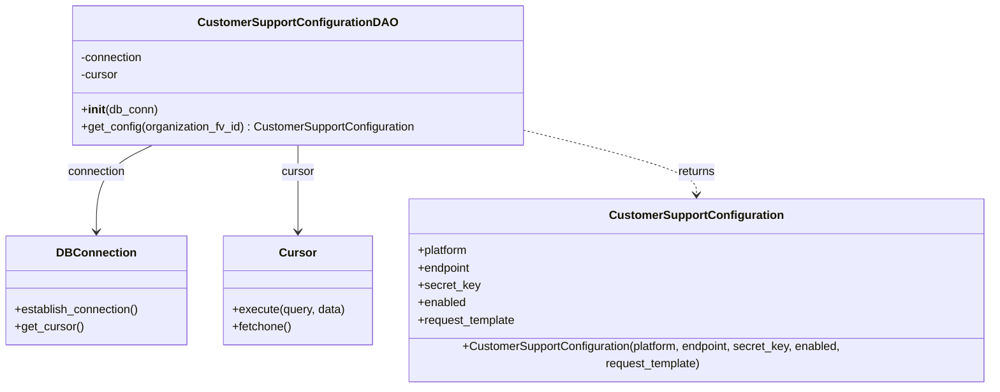

# Diagram: common/support_service/support_service/db/dao/customer_support_configuration_dao.py

> Auto-generated by Obscura crawlers

## Mermaid

### SVG

<svg id="container" width="1374.953125" xmlns="http://www.w3.org/2000/svg" class="classDiagram" height="522" viewBox="0 0 1374.953125 522" role="graphics-document document" aria-roledescription="class"><g><defs><marker id="container_class-aggregationStart" class="marker aggregation class" refX="18" refY="7" markerWidth="190" markerHeight="240" orient="auto"><path d="M 18,7 L9,13 L1,7 L9,1 Z"></path></marker></defs><defs><marker id="container_class-aggregationEnd" class="marker aggregation class" refX="1" refY="7" markerWidth="20" markerHeight="28" orient="auto"><path d="M 18,7 L9,13 L1,7 L9,1 Z"></path></marker></defs><defs><marker id="container_class-extensionStart" class="marker extension class" refX="18" refY="7" markerWidth="190" markerHeight="240" orient="auto"><path d="M 1,7 L18,13 V 1 Z"></path></marker></defs><defs><marker id="container_class-extensionEnd" class="marker extension class" refX="1" refY="7" markerWidth="20" markerHeight="28" orient="auto"><path d="M 1,1 V 13 L18,7 Z"></path></marker></defs><defs><marker id="container_class-compositionStart" class="marker composition class" refX="18" refY="7" markerWidth="190" markerHeight="240" orient="auto"><path d="M 18,7 L9,13 L1,7 L9,1 Z"></path></marker></defs><defs><marker id="container_class-compositionEnd" class="marker composition class" refX="1" refY="7" markerWidth="20" markerHeight="28" orient="auto"><path d="M 18,7 L9,13 L1,7 L9,1 Z"></path></marker></defs><defs><marker id="container_class-dependencyStart" class="marker dependency class" refX="6" refY="7" markerWidth="190" markerHeight="240" orient="auto"><path d="M 5,7 L9,13 L1,7 L9,1 Z"></path></marker></defs><defs><marker id="container_class-dependencyEnd" class="marker dependency class" refX="13" refY="7" markerWidth="20" markerHeight="28" orient="auto"><path d="M 18,7 L9,13 L14,7 L9,1 Z"></path></marker></defs><defs><marker id="container_class-lollipopStart" class="marker lollipop class" refX="13" refY="7" markerWidth="190" markerHeight="240" orient="auto"><circle stroke="black" fill="transparent" cx="7" cy="7" r="6"></circle></marker></defs><defs><marker id="container_class-lollipopEnd" class="marker lollipop class" refX="1" refY="7" markerWidth="190" markerHeight="240" orient="auto"><circle stroke="black" fill="transparent" cx="7" cy="7" r="6"></circle></marker></defs><g class="root"><g class="clusters"></g><g class="edgePaths"><path d="M209.187,200L196.376,206.167C183.565,212.333,157.943,224.667,145.131,243.5C132.32,262.333,132.32,287.667,132.32,300.333L132.32,313" id="id_CustomerSupportConfigurationDAO_DBConnection_1" class="edge-thickness-normal edge-pattern-solid relation" style=";;;" data-edge="true" data-et="edge" data-id="id_CustomerSupportConfigurationDAO_DBConnection_1" data-points="W3sieCI6MjA5LjE4NzAzMDA3NTE4Nzk4LCJ5IjoyMDB9LHsieCI6MTMyLjMyMDMxMjUsInkiOjIzN30seyJ4IjoxMzIuMzIwMzEyNSwieSI6MzE5fV0=" marker-end="url(#container_class-dependencyEnd)"></path><path d="M408.625,200L408.625,206.167C408.625,212.333,408.625,224.667,408.625,243.5C408.625,262.333,408.625,287.667,408.625,300.333L408.625,313" id="id_CustomerSupportConfigurationDAO_Cursor_2" class="edge-thickness-normal edge-pattern-solid relation" style=";;;" data-edge="true" data-et="edge" data-id="id_CustomerSupportConfigurationDAO_Cursor_2" data-points="W3sieCI6NDA4LjYyNSwieSI6MjAwfSx7IngiOjQwOC42MjUsInkiOjIzN30seyJ4Ijo0MDguNjI1LCJ5IjozMTl9XQ==" marker-end="url(#container_class-dependencyEnd)"></path><path d="M716.734,177.814L757.909,187.679C799.083,197.543,881.432,217.271,922.607,232.302C963.781,247.333,963.781,257.667,963.781,262.833L963.781,268" id="id_CustomerSupportConfigurationDAO_CustomerSupportConfiguration_3" class="edge-thickness-normal edge-pattern-dashed relation" style=";;;" data-edge="true" data-et="edge" data-id="id_CustomerSupportConfigurationDAO_CustomerSupportConfiguration_3" data-points="W3sieCI6NzE2LjczNDM3NSwieSI6MTc3LjgxNDQzODUwMjY3Mzh9LHsieCI6OTYzLjc4MTI1LCJ5IjoyMzd9LHsieCI6OTYzLjc4MTI1LCJ5IjoyNzR9XQ==" marker-end="url(#container_class-dependencyEnd)"></path></g><g class="edgeLabels"><g class="edgeLabel" transform="translate(132.3203125, 237)"><g class="label" data-id="id_CustomerSupportConfigurationDAO_DBConnection_1" transform="translate(-40.40625, -12)"><foreignObject width="80.8125" height="24">

connection

</foreignObject></g></g><g class="edgeLabel" transform="translate(408.625, 237)"><g class="label" data-id="id_CustomerSupportConfigurationDAO_Cursor_2" transform="translate(-22.8671875, -12)"><foreignObject width="45.734375" height="24">

cursor

</foreignObject></g></g><g class="edgeLabel" transform="translate(963.78125, 237)"><g class="label" data-id="id_CustomerSupportConfigurationDAO_CustomerSupportConfiguration_3" transform="translate(-26.265625, -12)"><foreignObject width="52.53125" height="24">

returns

</foreignObject></g></g></g><g class="nodes"><g class="node default" id="classId-CustomerSupportConfigurationDAO-0" transform="translate(408.625, 104)"><g class="basic label-container"><path d="M-308.109375 -96 L308.109375 -96 L308.109375 96 L-308.109375 96" stroke="none" stroke-width="0" fill="#ECECFF" style=""></path><path d="M-308.109375 -96 C-132.27638684107163 -96, 43.556601317856746 -96, 308.109375 -96 M-308.109375 -96 C-90.53225968777886 -96, 127.04485562444228 -96, 308.109375 -96 M308.109375 -96 C308.109375 -47.290174322071294, 308.109375 1.419651355857411, 308.109375 96 M308.109375 -96 C308.109375 -57.19155393334211, 308.109375 -18.383107866684213, 308.109375 96 M308.109375 96 C142.13934773314497 96, -23.830679533710054 96, -308.109375 96 M308.109375 96 C141.7789298914775 96, -24.551515217044994 96, -308.109375 96 M-308.109375 96 C-308.109375 26.350235938312807, -308.109375 -43.29952812337439, -308.109375 -96 M-308.109375 96 C-308.109375 52.97206810320087, -308.109375 9.944136206401737, -308.109375 -96" stroke="#9370DB" stroke-width="1.3" fill="none" stroke-dasharray="0 0" style=""></path></g><g class="annotation-group text" transform="translate(0, -72)"></g><g class="label-group text" transform="translate(-129.25, -72)"><g class="label" style="font-weight: bolder" transform="translate(0,-12)"><foreignObject width="258.5" height="24">

CustomerSupportConfigurationDAO

</foreignObject></g></g><g class="members-group text" transform="translate(-296.109375, -24)"><g class="label" style="" transform="translate(0,-12)"><foreignObject width="87.25" height="24">

-connection

</foreignObject></g><g class="label" style="" transform="translate(0,12)"><foreignObject width="52.1875" height="24">

-cursor

</foreignObject></g></g><g class="methods-group text" transform="translate(-296.109375, 48)"><g class="label" style="" transform="translate(0,-12)"><foreignObject width="104.96875" height="24">

+<strong>init</strong>(db_conn)

</foreignObject></g><g class="label" style="" transform="translate(0,12)"><foreignObject width="462.96875" height="24">

+get_config(organization_fv_id) : CustomerSupportConfiguration

</foreignObject></g></g><g class="divider" style=""><path d="M-308.109375 -48 C-141.22302111706264 -48, 25.663332765874713 -48, 308.109375 -48 M-308.109375 -48 C-178.37012732464564 -48, -48.63087964929127 -48, 308.109375 -48" stroke="#9370DB" stroke-width="1.3" fill="none" stroke-dasharray="0 0" style=""></path></g><g class="divider" style=""><path d="M-308.109375 24 C-115.34152978693828 24, 77.42631542612344 24, 308.109375 24 M-308.109375 24 C-66.41925880543221 24, 175.27085738913559 24, 308.109375 24" stroke="#9370DB" stroke-width="1.3" fill="none" stroke-dasharray="0 0" style=""></path></g></g><g class="node default" id="classId-CustomerSupportConfiguration-1" transform="translate(963.78125, 394)"><g class="basic label-container"><path d="M-403.171875 -120 L403.171875 -120 L403.171875 120 L-403.171875 120" stroke="none" stroke-width="0" fill="#ECECFF" style=""></path><path d="M-403.171875 -120 C-236.20422060433316 -120, -69.23656620866632 -120, 403.171875 -120 M-403.171875 -120 C-229.6250243976051 -120, -56.078173795210205 -120, 403.171875 -120 M403.171875 -120 C403.171875 -70.1022670596625, 403.171875 -20.204534119325004, 403.171875 120 M403.171875 -120 C403.171875 -62.46061449830176, 403.171875 -4.921228996603517, 403.171875 120 M403.171875 120 C158.39371391349817 120, -86.38444717300365 120, -403.171875 120 M403.171875 120 C130.790302598888 120, -141.59126980222402 120, -403.171875 120 M-403.171875 120 C-403.171875 53.29310955631743, -403.171875 -13.413780887365135, -403.171875 -120 M-403.171875 120 C-403.171875 41.36115709426994, -403.171875 -37.27768581146012, -403.171875 -120" stroke="#9370DB" stroke-width="1.3" fill="none" stroke-dasharray="0 0" style=""></path></g><g class="annotation-group text" transform="translate(0, -96)"></g><g class="label-group text" transform="translate(-113.953125, -96)"><g class="label" style="font-weight: bolder" transform="translate(0,-12)"><foreignObject width="227.90625" height="24">

CustomerSupportConfiguration

</foreignObject></g></g><g class="members-group text" transform="translate(-391.171875, -48)"><g class="label" style="" transform="translate(0,-12)"><foreignObject width="71.015625" height="24">

+platform

</foreignObject></g><g class="label" style="" transform="translate(0,12)"><foreignObject width="74.171875" height="24">

+endpoint

</foreignObject></g><g class="label" style="" transform="translate(0,36)"><foreignObject width="84.921875" height="24">

+secret_key

</foreignObject></g><g class="label" style="" transform="translate(0,60)"><foreignObject width="67.1875" height="24">

+enabled

</foreignObject></g><g class="label" style="" transform="translate(0,84)"><foreignObject width="136.296875" height="24">

+request_template

</foreignObject></g></g><g class="methods-group text" transform="translate(-391.171875, 96)"><g class="label" style="" transform="translate(0,-12)"><foreignObject width="668.390625" height="24">

+CustomerSupportConfiguration(platform, endpoint, secret_key, enabled, request_template)

</foreignObject></g></g><g class="divider" style=""><path d="M-403.171875 -72 C-209.92863870840466 -72, -16.685402416809325 -72, 403.171875 -72 M-403.171875 -72 C-131.45842870489696 -72, 140.25501759020608 -72, 403.171875 -72" stroke="#9370DB" stroke-width="1.3" fill="none" stroke-dasharray="0 0" style=""></path></g><g class="divider" style=""><path d="M-403.171875 72 C-80.89990073454163 72, 241.37207353091674 72, 403.171875 72 M-403.171875 72 C-138.29338594458915 72, 126.5851031108217 72, 403.171875 72" stroke="#9370DB" stroke-width="1.3" fill="none" stroke-dasharray="0 0" style=""></path></g></g><g class="node default" id="classId-DBConnection-2" transform="translate(132.3203125, 394)"><g class="basic label-container"><path d="M-124.3203125 -75 L124.3203125 -75 L124.3203125 75 L-124.3203125 75" stroke="none" stroke-width="0" fill="#ECECFF" style=""></path><path d="M-124.3203125 -75 C-44.64527395504797 -75, 35.02976458990406 -75, 124.3203125 -75 M-124.3203125 -75 C-30.09878909045733 -75, 64.12273431908534 -75, 124.3203125 -75 M124.3203125 -75 C124.3203125 -25.3899491824575, 124.3203125 24.220101635085, 124.3203125 75 M124.3203125 -75 C124.3203125 -17.700811614520354, 124.3203125 39.59837677095929, 124.3203125 75 M124.3203125 75 C46.89000554499479 75, -30.540301410010414 75, -124.3203125 75 M124.3203125 75 C28.52811910387976 75, -67.26407429224048 75, -124.3203125 75 M-124.3203125 75 C-124.3203125 37.862966974151284, -124.3203125 0.7259339483025684, -124.3203125 -75 M-124.3203125 75 C-124.3203125 42.128773160116154, -124.3203125 9.257546320232308, -124.3203125 -75" stroke="#9370DB" stroke-width="1.3" fill="none" stroke-dasharray="0 0" style=""></path></g><g class="annotation-group text" transform="translate(0, -51)"></g><g class="label-group text" transform="translate(-51.375, -51)"><g class="label" style="font-weight: bolder" transform="translate(0,-12)"><foreignObject width="102.75" height="24">

DBConnection

</foreignObject></g></g><g class="members-group text" transform="translate(-112.3203125, -3)"></g><g class="methods-group text" transform="translate(-112.3203125, 27)"><g class="label" style="" transform="translate(0,-12)"><foreignObject width="173.265625" height="24">

+establish_connection()

</foreignObject></g><g class="label" style="" transform="translate(0,12)"><foreignObject width="94.640625" height="24">

+get_cursor()

</foreignObject></g></g><g class="divider" style=""><path d="M-124.3203125 -27 C-63.94001421939532 -27, -3.559715938790646 -27, 124.3203125 -27 M-124.3203125 -27 C-38.13070051426425 -27, 48.058911471471504 -27, 124.3203125 -27" stroke="#9370DB" stroke-width="1.3" fill="none" stroke-dasharray="0 0" style=""></path></g><g class="divider" style=""><path d="M-124.3203125 -3 C-27.07132814947694 -3, 70.17765620104612 -3, 124.3203125 -3 M-124.3203125 -3 C-50.34268361059969 -3, 23.634945278800615 -3, 124.3203125 -3" stroke="#9370DB" stroke-width="1.3" fill="none" stroke-dasharray="0 0" style=""></path></g></g><g class="node default" id="classId-Cursor-3" transform="translate(408.625, 394)"><g class="basic label-container"><path d="M-101.984375 -75 L101.984375 -75 L101.984375 75 L-101.984375 75" stroke="none" stroke-width="0" fill="#ECECFF" style=""></path><path d="M-101.984375 -75 C-33.99796387717541 -75, 33.98844724564918 -75, 101.984375 -75 M-101.984375 -75 C-45.20964226473122 -75, 11.565090470537555 -75, 101.984375 -75 M101.984375 -75 C101.984375 -37.56394230283561, 101.984375 -0.12788460567122684, 101.984375 75 M101.984375 -75 C101.984375 -23.607880732080275, 101.984375 27.78423853583945, 101.984375 75 M101.984375 75 C45.17215683060246 75, -11.640061338795078 75, -101.984375 75 M101.984375 75 C60.23257372461005 75, 18.480772449220098 75, -101.984375 75 M-101.984375 75 C-101.984375 40.20239134517623, -101.984375 5.404782690352462, -101.984375 -75 M-101.984375 75 C-101.984375 24.8033467402716, -101.984375 -25.3933065194568, -101.984375 -75" stroke="#9370DB" stroke-width="1.3" fill="none" stroke-dasharray="0 0" style=""></path></g><g class="annotation-group text" transform="translate(0, -51)"></g><g class="label-group text" transform="translate(-23.90625, -51)"><g class="label" style="font-weight: bolder" transform="translate(0,-12)"><foreignObject width="47.8125" height="24">

Cursor

</foreignObject></g></g><g class="members-group text" transform="translate(-89.984375, -3)"></g><g class="methods-group text" transform="translate(-89.984375, 27)"><g class="label" style="" transform="translate(0,-12)"><foreignObject width="156.0625" height="24">

+execute(query, data)

</foreignObject></g><g class="label" style="" transform="translate(0,12)"><foreignObject width="82.046875" height="24">

+fetchone()

</foreignObject></g></g><g class="divider" style=""><path d="M-101.984375 -27 C-34.16671076355556 -27, 33.65095347288889 -27, 101.984375 -27 M-101.984375 -27 C-47.6958709970389 -27, 6.592633005922195 -27, 101.984375 -27" stroke="#9370DB" stroke-width="1.3" fill="none" stroke-dasharray="0 0" style=""></path></g><g class="divider" style=""><path d="M-101.984375 -3 C-40.3856129256356 -3, 21.213149148728803 -3, 101.984375 -3 M-101.984375 -3 C-34.635188698081635 -3, 32.71399760383673 -3, 101.984375 -3" stroke="#9370DB" stroke-width="1.3" fill="none" stroke-dasharray="0 0" style=""></path></g></g></g></g></g></svg>
