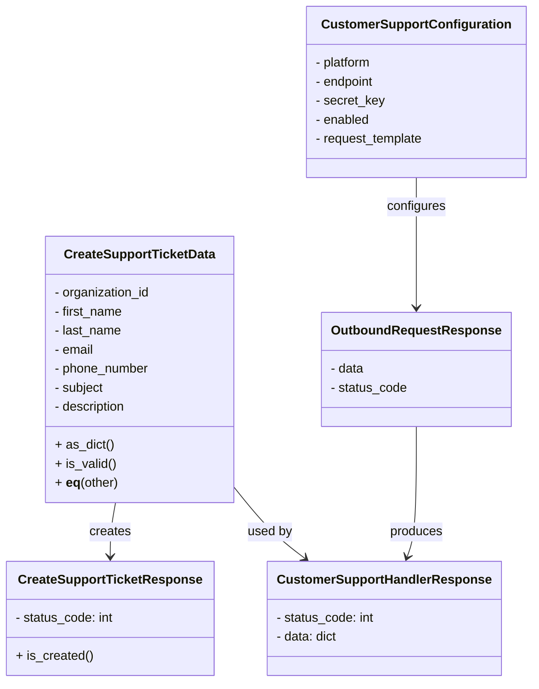

# Diagram: common/support_service/support_service/db/models/customer_support.py

> Auto-generated by Obscura crawlers

## Mermaid

### SVG

<svg id="container" width="665.4296875" xmlns="http://www.w3.org/2000/svg" class="classDiagram" height="860" viewBox="0 0 665.4296875 860" role="graphics-document document" aria-roledescription="class"><g><defs><marker id="container_class-aggregationStart" class="marker aggregation class" refX="18" refY="7" markerWidth="190" markerHeight="240" orient="auto"><path d="M 18,7 L9,13 L1,7 L9,1 Z"></path></marker></defs><defs><marker id="container_class-aggregationEnd" class="marker aggregation class" refX="1" refY="7" markerWidth="20" markerHeight="28" orient="auto"><path d="M 18,7 L9,13 L1,7 L9,1 Z"></path></marker></defs><defs><marker id="container_class-extensionStart" class="marker extension class" refX="18" refY="7" markerWidth="190" markerHeight="240" orient="auto"><path d="M 1,7 L18,13 V 1 Z"></path></marker></defs><defs><marker id="container_class-extensionEnd" class="marker extension class" refX="1" refY="7" markerWidth="20" markerHeight="28" orient="auto"><path d="M 1,1 V 13 L18,7 Z"></path></marker></defs><defs><marker id="container_class-compositionStart" class="marker composition class" refX="18" refY="7" markerWidth="190" markerHeight="240" orient="auto"><path d="M 18,7 L9,13 L1,7 L9,1 Z"></path></marker></defs><defs><marker id="container_class-compositionEnd" class="marker composition class" refX="1" refY="7" markerWidth="20" markerHeight="28" orient="auto"><path d="M 18,7 L9,13 L1,7 L9,1 Z"></path></marker></defs><defs><marker id="container_class-dependencyStart" class="marker dependency class" refX="6" refY="7" markerWidth="190" markerHeight="240" orient="auto"><path d="M 5,7 L9,13 L1,7 L9,1 Z"></path></marker></defs><defs><marker id="container_class-dependencyEnd" class="marker dependency class" refX="13" refY="7" markerWidth="20" markerHeight="28" orient="auto"><path d="M 18,7 L9,13 L14,7 L9,1 Z"></path></marker></defs><defs><marker id="container_class-lollipopStart" class="marker lollipop class" refX="13" refY="7" markerWidth="190" markerHeight="240" orient="auto"><circle stroke="black" fill="transparent" cx="7" cy="7" r="6"></circle></marker></defs><defs><marker id="container_class-lollipopEnd" class="marker lollipop class" refX="1" refY="7" markerWidth="190" markerHeight="240" orient="auto"><circle stroke="black" fill="transparent" cx="7" cy="7" r="6"></circle></marker></defs><g class="root"><g class="clusters"></g><g class="edgePaths"><path d="M144.909,634L143.789,640.167C142.669,646.333,140.428,658.667,139.308,670C138.188,681.333,138.188,691.667,138.188,696.833L138.188,702" id="id_CreateSupportTicketData_CreateSupportTicketResponse_1" class="edge-thickness-normal edge-pattern-solid relation" style=";;;" data-edge="true" data-et="edge" data-id="id_CreateSupportTicketData_CreateSupportTicketResponse_1" data-points="W3sieCI6MTQ0LjkwOTI2MDY3MDczMTcsInkiOjYzNH0seyJ4IjoxMzguMTg3NSwieSI6NjcxfSx7IngiOjEzOC4xODc1LCJ5Ijo3MDh9XQ==" marker-end="url(#container_class-dependencyEnd)"></path><path d="M518.953,224L518.953,230.167C518.953,236.333,518.953,248.667,518.953,276C518.953,303.333,518.953,345.667,518.953,366.833L518.953,388" id="id_CustomerSupportConfiguration_OutboundRequestResponse_2" class="edge-thickness-normal edge-pattern-solid relation" style=";;;" data-edge="true" data-et="edge" data-id="id_CustomerSupportConfiguration_OutboundRequestResponse_2" data-points="W3sieCI6NTE4Ljk1MzEyNSwieSI6MjI0fSx7IngiOjUxOC45NTMxMjUsInkiOjI2MX0seyJ4Ijo1MTguOTUzMTI1LCJ5IjozOTR9XQ==" marker-end="url(#container_class-dependencyEnd)"></path><path d="M295.328,618.996L302.12,627.663C308.913,636.331,322.497,653.665,336.529,667.89C350.56,682.115,365.038,693.231,372.278,698.789L379.517,704.346" id="id_CreateSupportTicketData_CustomerSupportHandlerResponse_3" class="edge-thickness-normal edge-pattern-solid relation" style=";;;" data-edge="true" data-et="edge" data-id="id_CreateSupportTicketData_CustomerSupportHandlerResponse_3" data-points="W3sieCI6Mjk1LjMyODEyNSwieSI6NjE4Ljk5NjA4NTI5Njc2Mzd9LHsieCI6MzM2LjA4MjAzMTI1LCJ5Ijo2NzF9LHsieCI6Mzg0LjI3NTkxMDI2Mzc2MTUsInkiOjcwOH1d" marker-end="url(#container_class-dependencyEnd)"></path><path d="M518.953,538L518.953,560.167C518.953,582.333,518.953,626.667,516.991,654.064C515.028,681.461,511.104,691.922,509.141,697.152L507.179,702.382" id="id_OutboundRequestResponse_CustomerSupportHandlerResponse_4" class="edge-thickness-normal edge-pattern-solid relation" style=";;;" data-edge="true" data-et="edge" data-id="id_OutboundRequestResponse_CustomerSupportHandlerResponse_4" data-points="W3sieCI6NTE4Ljk1MzEyNSwieSI6NTM4fSx7IngiOjUxOC45NTMxMjUsInkiOjY3MX0seyJ4Ijo1MDUuMDcxNDk1MTI2MTQ2OCwieSI6NzA4fV0=" marker-end="url(#container_class-dependencyEnd)"></path></g><g class="edgeLabels"><g class="edgeLabel" transform="translate(138.1875, 671)"><g class="label" data-id="id_CreateSupportTicketData_CreateSupportTicketResponse_1" transform="translate(-26.171875, -12)"><foreignObject width="52.34375" height="24">

creates

</foreignObject></g></g><g class="edgeLabel" transform="translate(518.953125, 261)"><g class="label" data-id="id_CustomerSupportConfiguration_OutboundRequestResponse_2" transform="translate(-37.3046875, -12)"><foreignObject width="74.609375" height="24">

configures

</foreignObject></g></g><g class="edgeLabel" transform="translate(334.44393, 668.90971)"><g class="label" data-id="id_CreateSupportTicketData_CustomerSupportHandlerResponse_3" transform="translate(-28.3125, -12)"><foreignObject width="56.625" height="24">

used by

</foreignObject></g></g><g class="edgeLabel" transform="translate(518.953125, 671)"><g class="label" data-id="id_OutboundRequestResponse_CustomerSupportHandlerResponse_4" transform="translate(-33.4765625, -12)"><foreignObject width="66.953125" height="24">

produces

</foreignObject></g></g></g><g class="nodes"><g class="node default" id="classId-CreateSupportTicketData-0" transform="translate(175.4296875, 466)"><g class="basic label-container"><path d="M-119.8984375 -168 L119.8984375 -168 L119.8984375 168 L-119.8984375 168" stroke="none" stroke-width="0" fill="#ECECFF" style=""></path><path d="M-119.8984375 -168 C-46.962594215252025 -168, 25.97324906949595 -168, 119.8984375 -168 M-119.8984375 -168 C-26.10574341811659 -168, 67.68695066376682 -168, 119.8984375 -168 M119.8984375 -168 C119.8984375 -88.8664075434224, 119.8984375 -9.732815086844795, 119.8984375 168 M119.8984375 -168 C119.8984375 -53.74791741551442, 119.8984375 60.504165168971156, 119.8984375 168 M119.8984375 168 C25.286654328096688 168, -69.32512884380662 168, -119.8984375 168 M119.8984375 168 C62.20314946116354 168, 4.507861422327082 168, -119.8984375 168 M-119.8984375 168 C-119.8984375 60.65872132941141, -119.8984375 -46.68255734117719, -119.8984375 -168 M-119.8984375 168 C-119.8984375 49.49046154050444, -119.8984375 -69.01907691899112, -119.8984375 -168" stroke="#9370DB" stroke-width="1.3" fill="none" stroke-dasharray="0 0" style=""></path></g><g class="annotation-group text" transform="translate(0, -144)"></g><g class="label-group text" transform="translate(-92.34375, -144)"><g class="label" style="font-weight: bolder" transform="translate(0,-12)"><foreignObject width="184.6875" height="24">

CreateSupportTicketData

</foreignObject></g></g><g class="members-group text" transform="translate(-107.8984375, -96)"><g class="label" style="" transform="translate(0,-12)"><foreignObject width="123.453125" height="24">

- organization_id

</foreignObject></g><g class="label" style="" transform="translate(0,12)"><foreignObject width="87.90625" height="24">

- first_name

</foreignObject></g><g class="label" style="" transform="translate(0,36)"><foreignObject width="85.921875" height="24">

- last_name

</foreignObject></g><g class="label" style="" transform="translate(0,60)"><foreignObject width="51.03125" height="24">

- email

</foreignObject></g><g class="label" style="" transform="translate(0,84)"><foreignObject width="121.8125" height="24">

- phone_number

</foreignObject></g><g class="label" style="" transform="translate(0,108)"><foreignObject width="63.609375" height="24">

- subject

</foreignObject></g><g class="label" style="" transform="translate(0,132)"><foreignObject width="93.296875" height="24">

- description

</foreignObject></g></g><g class="methods-group text" transform="translate(-107.8984375, 96)"><g class="label" style="" transform="translate(0,-12)"><foreignObject width="73.796875" height="24">

+ as_dict()

</foreignObject></g><g class="label" style="" transform="translate(0,12)"><foreignObject width="77.03125" height="24">

+ is_valid()

</foreignObject></g><g class="label" style="" transform="translate(0,36)"><foreignObject width="80.4375" height="24">

+ <strong>eq</strong>(other)

</foreignObject></g></g><g class="divider" style=""><path d="M-119.8984375 -120 C-27.159592603001272 -120, 65.57925229399746 -120, 119.8984375 -120 M-119.8984375 -120 C-36.701403895659624 -120, 46.49562970868075 -120, 119.8984375 -120" stroke="#9370DB" stroke-width="1.3" fill="none" stroke-dasharray="0 0" style=""></path></g><g class="divider" style=""><path d="M-119.8984375 72 C-39.4851102424947 72, 40.9282170150106 72, 119.8984375 72 M-119.8984375 72 C-63.660774611651796 72, -7.423111723303592 72, 119.8984375 72" stroke="#9370DB" stroke-width="1.3" fill="none" stroke-dasharray="0 0" style=""></path></g></g><g class="node default" id="classId-CustomerSupportConfiguration-1" transform="translate(518.953125, 116)"><g class="basic label-container"><path d="M-138.4765625 -108 L138.4765625 -108 L138.4765625 108 L-138.4765625 108" stroke="none" stroke-width="0" fill="#ECECFF" style=""></path><path d="M-138.4765625 -108 C-55.20344714763537 -108, 28.069668204729254 -108, 138.4765625 -108 M-138.4765625 -108 C-74.07746308156537 -108, -9.678363663130739 -108, 138.4765625 -108 M138.4765625 -108 C138.4765625 -50.12708336700205, 138.4765625 7.745833265995898, 138.4765625 108 M138.4765625 -108 C138.4765625 -54.77245967006267, 138.4765625 -1.5449193401253467, 138.4765625 108 M138.4765625 108 C68.72430531805873 108, -1.0279518638825493 108, -138.4765625 108 M138.4765625 108 C61.225433722030445 108, -16.02569505593911 108, -138.4765625 108 M-138.4765625 108 C-138.4765625 39.28296574940889, -138.4765625 -29.434068501182225, -138.4765625 -108 M-138.4765625 108 C-138.4765625 28.520679099596222, -138.4765625 -50.958641800807555, -138.4765625 -108" stroke="#9370DB" stroke-width="1.3" fill="none" stroke-dasharray="0 0" style=""></path></g><g class="annotation-group text" transform="translate(0, -84)"></g><g class="label-group text" transform="translate(-113.953125, -84)"><g class="label" style="font-weight: bolder" transform="translate(0,-12)"><foreignObject width="227.90625" height="24">

CustomerSupportConfiguration

</foreignObject></g></g><g class="members-group text" transform="translate(-126.4765625, -36)"><g class="label" style="" transform="translate(0,-12)"><foreignObject width="73.71875" height="24">

- platform

</foreignObject></g><g class="label" style="" transform="translate(0,12)"><foreignObject width="76.875" height="24">

- endpoint

</foreignObject></g><g class="label" style="" transform="translate(0,36)"><foreignObject width="87.625" height="24">

- secret_key

</foreignObject></g><g class="label" style="" transform="translate(0,60)"><foreignObject width="69.890625" height="24">

- enabled

</foreignObject></g><g class="label" style="" transform="translate(0,84)"><foreignObject width="139" height="24">

- request_template

</foreignObject></g></g><g class="methods-group text" transform="translate(-126.4765625, 108)"></g><g class="divider" style=""><path d="M-138.4765625 -60 C-50.43634480488511 -60, 37.60387289022978 -60, 138.4765625 -60 M-138.4765625 -60 C-53.741968381098744 -60, 30.992625737802513 -60, 138.4765625 -60" stroke="#9370DB" stroke-width="1.3" fill="none" stroke-dasharray="0 0" style=""></path></g><g class="divider" style=""><path d="M-138.4765625 84 C-76.73651252140428 84, -14.996462542808572 84, 138.4765625 84 M-138.4765625 84 C-74.5272538677564 84, -10.577945235512814 84, 138.4765625 84" stroke="#9370DB" stroke-width="1.3" fill="none" stroke-dasharray="0 0" style=""></path></g></g><g class="node default" id="classId-CreateSupportTicketResponse-2" transform="translate(138.1875, 780)"><g class="basic label-container"><path d="M-130.1875 -72 L130.1875 -72 L130.1875 72 L-130.1875 72" stroke="none" stroke-width="0" fill="#ECECFF" style=""></path><path d="M-130.1875 -72 C-71.35768575901673 -72, -12.527871518033464 -72, 130.1875 -72 M-130.1875 -72 C-46.54084984265158 -72, 37.105800314696836 -72, 130.1875 -72 M130.1875 -72 C130.1875 -32.86568242384514, 130.1875 6.268635152309713, 130.1875 72 M130.1875 -72 C130.1875 -30.490956417100797, 130.1875 11.018087165798406, 130.1875 72 M130.1875 72 C66.69381416754463 72, 3.2001283350892606 72, -130.1875 72 M130.1875 72 C29.723334021073384 72, -70.74083195785323 72, -130.1875 72 M-130.1875 72 C-130.1875 35.721052210696506, -130.1875 -0.5578955786069884, -130.1875 -72 M-130.1875 72 C-130.1875 18.20613309284399, -130.1875 -35.58773381431202, -130.1875 -72" stroke="#9370DB" stroke-width="1.3" fill="none" stroke-dasharray="0 0" style=""></path></g><g class="annotation-group text" transform="translate(0, -48)"></g><g class="label-group text" transform="translate(-110.890625, -48)"><g class="label" style="font-weight: bolder" transform="translate(0,-12)"><foreignObject width="221.78125" height="24">

CreateSupportTicketResponse

</foreignObject></g></g><g class="members-group text" transform="translate(-118.1875, 0)"><g class="label" style="" transform="translate(0,-12)"><foreignObject width="125.484375" height="24">

- status_code: int

</foreignObject></g></g><g class="methods-group text" transform="translate(-118.1875, 48)"><g class="label" style="" transform="translate(0,-12)"><foreignObject width="96.703125" height="24">

+ is_created()

</foreignObject></g></g><g class="divider" style=""><path d="M-130.1875 -24 C-63.75154010642666 -24, 2.6844197871466804 -24, 130.1875 -24 M-130.1875 -24 C-63.79709208909061 -24, 2.593315821818777 -24, 130.1875 -24" stroke="#9370DB" stroke-width="1.3" fill="none" stroke-dasharray="0 0" style=""></path></g><g class="divider" style=""><path d="M-130.1875 24 C-51.04145414925688 24, 28.104591701486243 24, 130.1875 24 M-130.1875 24 C-57.85736696170284 24, 14.472766076594326 24, 130.1875 24" stroke="#9370DB" stroke-width="1.3" fill="none" stroke-dasharray="0 0" style=""></path></g></g><g class="node default" id="classId-CustomerSupportHandlerResponse-3" transform="translate(478.05859375, 780)"><g class="basic label-container"><path d="M-141.1171875 -72 L141.1171875 -72 L141.1171875 72 L-141.1171875 72" stroke="none" stroke-width="0" fill="#ECECFF" style=""></path><path d="M-141.1171875 -72 C-80.80523981335605 -72, -20.493292126712106 -72, 141.1171875 -72 M-141.1171875 -72 C-61.198963922058596 -72, 18.71925965588281 -72, 141.1171875 -72 M141.1171875 -72 C141.1171875 -32.37694905572535, 141.1171875 7.246101888549305, 141.1171875 72 M141.1171875 -72 C141.1171875 -41.379666215559546, 141.1171875 -10.759332431119091, 141.1171875 72 M141.1171875 72 C38.54160056730413 72, -64.03398636539174 72, -141.1171875 72 M141.1171875 72 C46.93943820593063 72, -47.238311088138744 72, -141.1171875 72 M-141.1171875 72 C-141.1171875 33.128795440664334, -141.1171875 -5.742409118671333, -141.1171875 -72 M-141.1171875 72 C-141.1171875 34.734454224543086, -141.1171875 -2.5310915509138283, -141.1171875 -72" stroke="#9370DB" stroke-width="1.3" fill="none" stroke-dasharray="0 0" style=""></path></g><g class="annotation-group text" transform="translate(0, -48)"></g><g class="label-group text" transform="translate(-129.1171875, -48)"><g class="label" style="font-weight: bolder" transform="translate(0,-12)"><foreignObject width="258.234375" height="24">

CustomerSupportHandlerResponse

</foreignObject></g></g><g class="members-group text" transform="translate(-129.1171875, 0)"><g class="label" style="" transform="translate(0,-12)"><foreignObject width="125.484375" height="24">

- status_code: int

</foreignObject></g><g class="label" style="" transform="translate(0,12)"><foreignObject width="78.921875" height="24">

- data: dict

</foreignObject></g></g><g class="methods-group text" transform="translate(-129.1171875, 72)"></g><g class="divider" style=""><path d="M-141.1171875 -24 C-73.65084234347715 -24, -6.184497186954303 -24, 141.1171875 -24 M-141.1171875 -24 C-62.554464056086516 -24, 16.008259387826968 -24, 141.1171875 -24" stroke="#9370DB" stroke-width="1.3" fill="none" stroke-dasharray="0 0" style=""></path></g><g class="divider" style=""><path d="M-141.1171875 48 C-49.37161291496572 48, 42.37396167006855 48, 141.1171875 48 M-141.1171875 48 C-58.523429211197936 48, 24.07032907760413 48, 141.1171875 48" stroke="#9370DB" stroke-width="1.3" fill="none" stroke-dasharray="0 0" style=""></path></g></g><g class="node default" id="classId-OutboundRequestResponse-4" transform="translate(518.953125, 466)"><g class="basic label-container"><path d="M-114.0546875 -72 L114.0546875 -72 L114.0546875 72 L-114.0546875 72" stroke="none" stroke-width="0" fill="#ECECFF" style=""></path><path d="M-114.0546875 -72 C-46.37786234373105 -72, 21.298962812537894 -72, 114.0546875 -72 M-114.0546875 -72 C-61.994699283324415 -72, -9.93471106664883 -72, 114.0546875 -72 M114.0546875 -72 C114.0546875 -21.07476479126622, 114.0546875 29.850470417467562, 114.0546875 72 M114.0546875 -72 C114.0546875 -14.821578926779885, 114.0546875 42.35684214644023, 114.0546875 72 M114.0546875 72 C49.420959701958125 72, -15.21276809608375 72, -114.0546875 72 M114.0546875 72 C31.422576414984093 72, -51.209534670031815 72, -114.0546875 72 M-114.0546875 72 C-114.0546875 36.90438081285193, -114.0546875 1.8087616257038661, -114.0546875 -72 M-114.0546875 72 C-114.0546875 18.258851059503584, -114.0546875 -35.48229788099283, -114.0546875 -72" stroke="#9370DB" stroke-width="1.3" fill="none" stroke-dasharray="0 0" style=""></path></g><g class="annotation-group text" transform="translate(0, -48)"></g><g class="label-group text" transform="translate(-102.0546875, -48)"><g class="label" style="font-weight: bolder" transform="translate(0,-12)"><foreignObject width="204.109375" height="24">

OutboundRequestResponse

</foreignObject></g></g><g class="members-group text" transform="translate(-102.0546875, 0)"><g class="label" style="" transform="translate(0,-12)"><foreignObject width="43.328125" height="24">

- data

</foreignObject></g><g class="label" style="" transform="translate(0,12)"><foreignObject width="97.734375" height="24">

- status_code

</foreignObject></g></g><g class="methods-group text" transform="translate(-102.0546875, 72)"></g><g class="divider" style=""><path d="M-114.0546875 -24 C-52.31532358263137 -24, 9.424040334737256 -24, 114.0546875 -24 M-114.0546875 -24 C-47.30355163394967 -24, 19.447584232100667 -24, 114.0546875 -24" stroke="#9370DB" stroke-width="1.3" fill="none" stroke-dasharray="0 0" style=""></path></g><g class="divider" style=""><path d="M-114.0546875 48 C-42.60854791853528 48, 28.83759166292944 48, 114.0546875 48 M-114.0546875 48 C-54.0907320237928 48, 5.873223452414393 48, 114.0546875 48" stroke="#9370DB" stroke-width="1.3" fill="none" stroke-dasharray="0 0" style=""></path></g></g></g></g></g></svg>
