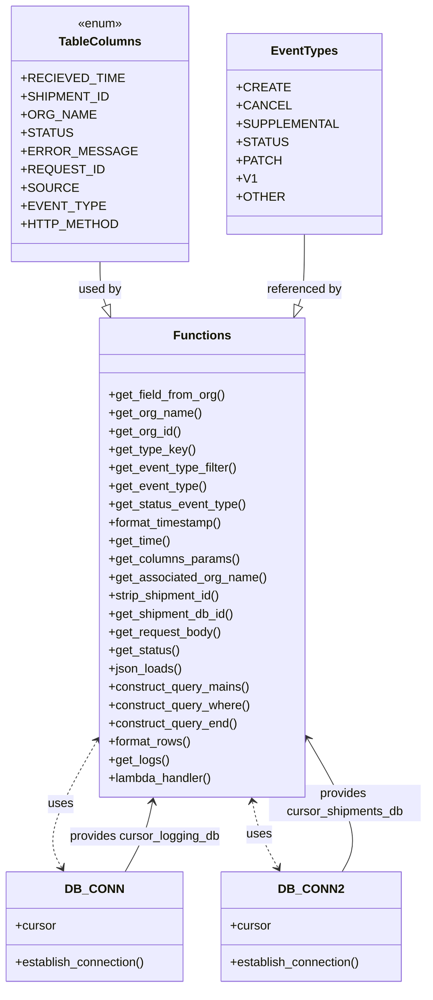

# Diagram: common/support_service/support_service/get_api_logs.py


> Auto-generated by Obscura crawlers

## Diagram 1



### SVG

<svg id="container" width="559.23828125" xmlns="http://www.w3.org/2000/svg" class="classDiagram" height="1298" viewBox="0 0 559.23828125 1298" role="graphics-document document" aria-roledescription="class"><style>#container{font-family:"trebuchet ms",verdana,arial,sans-serif;font-size:16px;fill:#333;}@keyframes edge-animation-frame{from{stroke-dashoffset:0;}}@keyframes dash{to{stroke-dashoffset:0;}}#container .edge-animation-slow{stroke-dasharray:9,5!important;stroke-dashoffset:900;animation:dash 50s linear infinite;stroke-linecap:round;}#container .edge-animation-fast{stroke-dasharray:9,5!important;stroke-dashoffset:900;animation:dash 20s linear infinite;stroke-linecap:round;}#container .error-icon{fill:#552222;}#container .error-text{fill:#552222;stroke:#552222;}#container .edge-thickness-normal{stroke-width:1px;}#container .edge-thickness-thick{stroke-width:3.5px;}#container .edge-pattern-solid{stroke-dasharray:0;}#container .edge-thickness-invisible{stroke-width:0;fill:none;}#container .edge-pattern-dashed{stroke-dasharray:3;}#container .edge-pattern-dotted{stroke-dasharray:2;}#container .marker{fill:#333333;stroke:#333333;}#container .marker.cross{stroke:#333333;}#container svg{font-family:"trebuchet ms",verdana,arial,sans-serif;font-size:16px;}#container p{margin:0;}#container g.classGroup text{fill:#9370DB;stroke:none;font-family:"trebuchet ms",verdana,arial,sans-serif;font-size:10px;}#container g.classGroup text .title{font-weight:bolder;}#container .nodeLabel,#container .edgeLabel{color:#131300;}#container .edgeLabel .label rect{fill:#ECECFF;}#container .label text{fill:#131300;}#container .labelBkg{background:#ECECFF;}#container .edgeLabel .label span{background:#ECECFF;}#container .classTitle{font-weight:bolder;}#container .node rect,#container .node circle,#container .node ellipse,#container .node polygon,#container .node path{fill:#ECECFF;stroke:#9370DB;stroke-width:1px;}#container .divider{stroke:#9370DB;stroke-width:1;}#container g.clickable{cursor:pointer;}#container g.classGroup rect{fill:#ECECFF;stroke:#9370DB;}#container g.classGroup line{stroke:#9370DB;stroke-width:1;}#container .classLabel .box{stroke:none;stroke-width:0;fill:#ECECFF;opacity:0.5;}#container .classLabel .label{fill:#9370DB;font-size:10px;}#container .relation{stroke:#333333;stroke-width:1;fill:none;}#container .dashed-line{stroke-dasharray:3;}#container .dotted-line{stroke-dasharray:1 2;}#container #compositionStart,#container .composition{fill:#333333!important;stroke:#333333!important;stroke-width:1;}#container #compositionEnd,#container .composition{fill:#333333!important;stroke:#333333!important;stroke-width:1;}#container #dependencyStart,#container .dependency{fill:#333333!important;stroke:#333333!important;stroke-width:1;}#container #dependencyStart,#container .dependency{fill:#333333!important;stroke:#333333!important;stroke-width:1;}#container #extensionStart,#container .extension{fill:transparent!important;stroke:#333333!important;stroke-width:1;}#container #extensionEnd,#container .extension{fill:transparent!important;stroke:#333333!important;stroke-width:1;}#container #aggregationStart,#container .aggregation{fill:transparent!important;stroke:#333333!important;stroke-width:1;}#container #aggregationEnd,#container .aggregation{fill:transparent!important;stroke:#333333!important;stroke-width:1;}#container #lollipopStart,#container .lollipop{fill:#ECECFF!important;stroke:#333333!important;stroke-width:1;}#container #lollipopEnd,#container .lollipop{fill:#ECECFF!important;stroke:#333333!important;stroke-width:1;}#container .edgeTerminals{font-size:11px;line-height:initial;}#container .classTitleText{text-anchor:middle;font-size:18px;fill:#333;}#container .label-icon{display:inline-block;height:1em;overflow:visible;vertical-align:-0.125em;}#container .node .label-icon path{fill:currentColor;stroke:revert;stroke-width:revert;}#container :root{--mermaid-font-family:"trebuchet ms",verdana,arial,sans-serif;}</style><g><defs><marker id="container_class-aggregationStart" class="marker aggregation class" refX="18" refY="7" markerWidth="190" markerHeight="240" orient="auto"><path d="M 18,7 L9,13 L1,7 L9,1 Z"></path></marker></defs><defs><marker id="container_class-aggregationEnd" class="marker aggregation class" refX="1" refY="7" markerWidth="20" markerHeight="28" orient="auto"><path d="M 18,7 L9,13 L1,7 L9,1 Z"></path></marker></defs><defs><marker id="container_class-extensionStart" class="marker extension class" refX="18" refY="7" markerWidth="190" markerHeight="240" orient="auto"><path d="M 1,7 L18,13 V 1 Z"></path></marker></defs><defs><marker id="container_class-extensionEnd" class="marker extension class" refX="1" refY="7" markerWidth="20" markerHeight="28" orient="auto"><path d="M 1,1 V 13 L18,7 Z"></path></marker></defs><defs><marker id="container_class-compositionStart" class="marker composition class" refX="18" refY="7" markerWidth="190" markerHeight="240" orient="auto"><path d="M 18,7 L9,13 L1,7 L9,1 Z"></path></marker></defs><defs><marker id="container_class-compositionEnd" class="marker composition class" refX="1" refY="7" markerWidth="20" markerHeight="28" orient="auto"><path d="M 18,7 L9,13 L1,7 L9,1 Z"></path></marker></defs><defs><marker id="container_class-dependencyStart" class="marker dependency class" refX="6" refY="7" markerWidth="190" markerHeight="240" orient="auto"><path d="M 5,7 L9,13 L1,7 L9,1 Z"></path></marker></defs><defs><marker id="container_class-dependencyEnd" class="marker dependency class" refX="13" refY="7" markerWidth="20" markerHeight="28" orient="auto"><path d="M 18,7 L9,13 L14,7 L9,1 Z"></path></marker></defs><defs><marker id="container_class-lollipopStart" class="marker lollipop class" refX="13" refY="7" markerWidth="190" markerHeight="240" orient="auto"><circle stroke="black" fill="transparent" cx="7" cy="7" r="6"></circle></marker></defs><defs><marker id="container_class-lollipopEnd" class="marker lollipop class" refX="1" refY="7" markerWidth="190" markerHeight="240" orient="auto"><circle stroke="black" fill="transparent" cx="7" cy="7" r="6"></circle></marker></defs><g class="root"><g class="clusters"></g><g class="edgePaths"><path d="M143.211,344L143.211,350.167C143.211,356.333,143.211,368.667,144.41,378.284C145.61,387.902,148.009,394.804,149.209,398.255L150.408,401.706" id="id_TableColumns_Functions_1" class="edge-thickness-normal edge-pattern-solid relation" style=";;;" data-edge="true" data-et="edge" data-id="id_TableColumns_Functions_1" data-points="W3sieCI6MTQzLjIxMDkzNzUsInkiOjM0NH0seyJ4IjoxNDMuMjEwOTM3NSwieSI6MzgxfSx7IngiOjE1Ni4wNzE1NDk4NDkwNzY3LCJ5Ijo0MTh9XQ==" marker-end="url(#container_class-extensionEnd)"></path><path d="M387.91,308L387.91,320.167C387.91,332.333,387.91,356.667,386.711,372.284C385.511,387.902,383.112,394.804,381.913,398.255L380.713,401.706" id="id_EventTypes_Functions_2" class="edge-thickness-normal edge-pattern-solid relation" style=";;;" data-edge="true" data-et="edge" data-id="id_EventTypes_Functions_2" data-points="W3sieCI6Mzg3LjkxMDE1NjI1LCJ5IjozMDh9LHsieCI6Mzg3LjkxMDE1NjI1LCJ5IjozODF9LHsieCI6Mzc1LjA0OTU0MzkwMDkyMzMsInkiOjQxOH1d" marker-end="url(#container_class-extensionEnd)"></path><path d="M164.359,1146L168.956,1137.833C173.552,1129.667,182.745,1113.333,188.795,1097.98C194.845,1082.627,197.752,1068.254,199.205,1061.067L200.659,1053.881" id="id_DB_CONN_Functions_3" class="edge-thickness-normal edge-pattern-solid relation" style=";;;" data-edge="true" data-et="edge" data-id="id_DB_CONN_Functions_3" data-points="W3sieCI6MTY0LjM1OTE4MTMwMTY1Mjg4LCJ5IjoxMTQ2fSx7IngiOjE5MS45Mzc1LCJ5IjoxMDk3fSx7IngiOjIwMS44NDgyOTQ3NzE2MzQ2LCJ5IjoxMDQ4fV0=" marker-end="url(#container_class-dependencyEnd)"></path><path d="M448.183,1146L452.79,1137.833C457.396,1129.667,466.608,1113.333,458.831,1083.728C451.053,1054.123,426.286,1011.246,413.902,989.808L401.519,968.37" id="id_DB_CONN2_Functions_4" class="edge-thickness-normal edge-pattern-solid relation" style=";;;" data-edge="true" data-et="edge" data-id="id_DB_CONN2_Functions_4" data-points="W3sieCI6NDQ4LjE4MzQ2NDYxNzc2ODYsInkiOjExNDZ9LHsieCI6NDc1LjgyMDMxMjUsInkiOjEwOTd9LHsieCI6Mzk4LjUxNzU3ODEyNSwieSI6OTYzLjE3NDEzMzU1ODc0OX1d" marker-end="url(#container_class-dependencyEnd)"></path><path d="M129.607,968.848L117.295,990.207C104.983,1011.565,80.359,1054.283,72.152,1082.937C63.946,1111.59,72.158,1126.181,76.264,1133.476L80.37,1140.771" id="id_Functions_DB_CONN_5" class="edge-thickness-normal edge-pattern-dashed relation" style=";;;" data-edge="true" data-et="edge" data-id="id_Functions_DB_CONN_5" data-points="W3sieCI6MTMyLjYwMzUxNTYyNSwieSI6OTYzLjY0OTc3NTIwNDU0OTl9LHsieCI6NTUuNzM0Mzc1LCJ5IjoxMDk3fSx7IngiOjgzLjMxMjY5MzY5ODM0NzEsInkiOjExNDZ9XQ==" marker-start="url(#container_class-dependencyStart)" marker-end="url(#container_class-dependencyEnd)"></path><path d="M330.59,1053.88L332.046,1061.067C333.502,1068.254,336.415,1082.627,341.987,1097.109C347.558,1111.591,355.788,1126.183,359.903,1133.478L364.017,1140.774" id="id_Functions_DB_CONN2_6" class="edge-thickness-normal edge-pattern-dashed relation" style=";;;" data-edge="true" data-et="edge" data-id="id_Functions_DB_CONN2_6" data-points="W3sieCI6MzI5LjM5Nzg3NDA5ODU1NzcsInkiOjEwNDh9LHsieCI6MzM5LjMyODEyNSwieSI6MTA5N30seyJ4IjozNjYuOTY0OTcyODgyMjMxNCwieSI6MTE0Nn1d" marker-start="url(#container_class-dependencyStart)" marker-end="url(#container_class-dependencyEnd)"></path></g><g class="edgeLabels"><g class="edgeLabel" transform="translate(143.2109375, 381)"><g class="label" data-id="id_TableColumns_Functions_1" transform="translate(-28.3125, -12)"><foreignObject width="56.625" height="24"><div xmlns="http://www.w3.org/1999/xhtml" class="labelBkg" style="display: table-cell; white-space: nowrap; line-height: 1.5; max-width: 200px; text-align: center;"><span class="edgeLabel"><p>used by</p></span></div></foreignObject></g></g><g class="edgeLabel" transform="translate(387.91015625, 381)"><g class="label" data-id="id_EventTypes_Functions_2" transform="translate(-49.6484375, -12)"><foreignObject width="99.296875" height="24"><div xmlns="http://www.w3.org/1999/xhtml" class="labelBkg" style="display: table-cell; white-space: nowrap; line-height: 1.5; max-width: 200px; text-align: center;"><span class="edgeLabel"><p>referenced by</p></span></div></foreignObject></g></g><g class="edgeLabel" transform="translate(190.40831, 1099.717)"><g class="label" data-id="id_DB_CONN_Functions_3" transform="translate(-99.7109375, -12)"><foreignObject width="199.421875" height="24"><div xmlns="http://www.w3.org/1999/xhtml" class="labelBkg" style="display: table-cell; white-space: nowrap; line-height: 1.5; max-width: 200px; text-align: center;"><span class="edgeLabel"><p>provides cursor_logging_db</p></span></div></foreignObject></g></g><g class="edgeLabel" transform="translate(451.23831, 1054.44383)"><g class="label" data-id="id_DB_CONN2_Functions_4" transform="translate(-100, -24)"><foreignObject width="200" height="48"><div xmlns="http://www.w3.org/1999/xhtml" class="labelBkg" style="display: table; white-space: break-spaces; line-height: 1.5; max-width: 200px; text-align: center; width: 200px;"><span class="edgeLabel"><p>provides cursor_shipments_db</p></span></div></foreignObject></g></g><g class="edgeLabel" transform="translate(80.12853, 1054.68177)"><g class="label" data-id="id_Functions_DB_CONN_5" transform="translate(-16.4921875, -12)"><foreignObject width="32.984375" height="24"><div xmlns="http://www.w3.org/1999/xhtml" class="labelBkg" style="display: table-cell; white-space: nowrap; line-height: 1.5; max-width: 200px; text-align: center;"><span class="edgeLabel"><p>uses</p></span></div></foreignObject></g></g><g class="edgeLabel" transform="translate(339.328125, 1097)"><g class="label" data-id="id_Functions_DB_CONN2_6" transform="translate(-16.4921875, -12)"><foreignObject width="32.984375" height="24"><div xmlns="http://www.w3.org/1999/xhtml" class="labelBkg" style="display: table-cell; white-space: nowrap; line-height: 1.5; max-width: 200px; text-align: center;"><span class="edgeLabel"><p>uses</p></span></div></foreignObject></g></g></g><g class="nodes"><g class="node default" id="classId-TableColumns-0" transform="translate(143.2109375, 176)"><g class="basic label-container"><path d="M-102.828125 -168 L102.828125 -168 L102.828125 168 L-102.828125 168" stroke="none" stroke-width="0" fill="#ECECFF" style=""></path><path d="M-102.828125 -168 C-33.07236630012852 -168, 36.68339239974296 -168, 102.828125 -168 M-102.828125 -168 C-52.79642819949461 -168, -2.764731398989227 -168, 102.828125 -168 M102.828125 -168 C102.828125 -83.5078057180547, 102.828125 0.9843885638906045, 102.828125 168 M102.828125 -168 C102.828125 -93.006543096768, 102.828125 -18.013086193535997, 102.828125 168 M102.828125 168 C47.75208678545815 168, -7.323951429083706 168, -102.828125 168 M102.828125 168 C50.938669457142026 168, -0.9507860857159471 168, -102.828125 168 M-102.828125 168 C-102.828125 80.79932845469571, -102.828125 -6.401343090608577, -102.828125 -168 M-102.828125 168 C-102.828125 58.82612803504911, -102.828125 -50.34774392990178, -102.828125 -168" stroke="#9370DB" stroke-width="1.3" fill="none" stroke-dasharray="0 0" style=""></path></g><g class="annotation-group text" transform="translate(-29.53125, -144)"><g class="label" style="" transform="translate(0,-12)"><foreignObject width="59.0625" height="24"><div xmlns="http://www.w3.org/1999/xhtml" style="display: table-cell; white-space: nowrap; line-height: 1.5; max-width: 109px; text-align: center;"><span class="nodeLabel markdown-node-label" style=""><p>«enum»</p></span></div></foreignObject></g></g><g class="label-group text" transform="translate(-51.140625, -120)"><g class="label" style="font-weight: bolder" transform="translate(0,-12)"><foreignObject width="102.28125" height="24"><div xmlns="http://www.w3.org/1999/xhtml" style="display: table-cell; white-space: nowrap; line-height: 1.5; max-width: 152px; text-align: center;"><span class="nodeLabel markdown-node-label" style=""><p>TableColumns</p></span></div></foreignObject></g></g><g class="members-group text" transform="translate(-90.828125, -72)"><g class="label" style="" transform="translate(0,-12)"><foreignObject width="116.921875" height="24"><div xmlns="http://www.w3.org/1999/xhtml" style="display: table-cell; white-space: nowrap; line-height: 1.5; max-width: 174px; text-align: center;"><span class="nodeLabel markdown-node-label" style=""><p>+RECIEVED_TIME</p></span></div></foreignObject></g><g class="label" style="" transform="translate(0,12)"><foreignObject width="103.234375" height="24"><div xmlns="http://www.w3.org/1999/xhtml" style="display: table-cell; white-space: nowrap; line-height: 1.5; max-width: 161px; text-align: center;"><span class="nodeLabel markdown-node-label" style=""><p>+SHIPMENT_ID</p></span></div></foreignObject></g><g class="label" style="" transform="translate(0,36)"><foreignObject width="88.125" height="24"><div xmlns="http://www.w3.org/1999/xhtml" style="display: table-cell; white-space: nowrap; line-height: 1.5; max-width: 145px; text-align: center;"><span class="nodeLabel markdown-node-label" style=""><p>+ORG_NAME</p></span></div></foreignObject></g><g class="label" style="" transform="translate(0,60)"><foreignObject width="59.03125" height="24"><div xmlns="http://www.w3.org/1999/xhtml" style="display: table-cell; white-space: nowrap; line-height: 1.5; max-width: 117px; text-align: center;"><span class="nodeLabel markdown-node-label" style=""><p>+STATUS</p></span></div></foreignObject></g><g class="label" style="" transform="translate(0,84)"><foreignObject width="130.515625" height="24"><div xmlns="http://www.w3.org/1999/xhtml" style="display: table-cell; white-space: nowrap; line-height: 1.5; max-width: 188px; text-align: center;"><span class="nodeLabel markdown-node-label" style=""><p>+ERROR_MESSAGE</p></span></div></foreignObject></g><g class="label" style="" transform="translate(0,108)"><foreignObject width="95.265625" height="24"><div xmlns="http://www.w3.org/1999/xhtml" style="display: table-cell; white-space: nowrap; line-height: 1.5; max-width: 153px; text-align: center;"><span class="nodeLabel markdown-node-label" style=""><p>+REQUEST_ID</p></span></div></foreignObject></g><g class="label" style="" transform="translate(0,132)"><foreignObject width="64.796875" height="24"><div xmlns="http://www.w3.org/1999/xhtml" style="display: table-cell; white-space: nowrap; line-height: 1.5; max-width: 122px; text-align: center;"><span class="nodeLabel markdown-node-label" style=""><p>+SOURCE</p></span></div></foreignObject></g><g class="label" style="" transform="translate(0,156)"><foreignObject width="94.859375" height="24"><div xmlns="http://www.w3.org/1999/xhtml" style="display: table-cell; white-space: nowrap; line-height: 1.5; max-width: 152px; text-align: center;"><span class="nodeLabel markdown-node-label" style=""><p>+EVENT_TYPE</p></span></div></foreignObject></g><g class="label" style="" transform="translate(0,180)"><foreignObject width="112.96875" height="24"><div xmlns="http://www.w3.org/1999/xhtml" style="display: table-cell; white-space: nowrap; line-height: 1.5; max-width: 170px; text-align: center;"><span class="nodeLabel markdown-node-label" style=""><p>+HTTP_METHOD</p></span></div></foreignObject></g></g><g class="methods-group text" transform="translate(-90.828125, 168)"></g><g class="divider" style=""><path d="M-102.828125 -96 C-20.952890248870958 -96, 60.922344502258085 -96, 102.828125 -96 M-102.828125 -96 C-29.08486936745109 -96, 44.65838626509782 -96, 102.828125 -96" stroke="#9370DB" stroke-width="1.3" fill="none" stroke-dasharray="0 0" style=""></path></g><g class="divider" style=""><path d="M-102.828125 144 C-40.80662243924729 144, 21.214880121505416 144, 102.828125 144 M-102.828125 144 C-20.894705552069397 144, 61.03871389586121 144, 102.828125 144" stroke="#9370DB" stroke-width="1.3" fill="none" stroke-dasharray="0 0" style=""></path></g></g><g class="node default" id="classId-EventTypes-1" transform="translate(387.91015625, 176)"><g class="basic label-container"><path d="M-91.87109375 -132 L91.87109375 -132 L91.87109375 132 L-91.87109375 132" stroke="none" stroke-width="0" fill="#ECECFF" style=""></path><path d="M-91.87109375 -132 C-39.83753360000154 -132, 12.196026549996915 -132, 91.87109375 -132 M-91.87109375 -132 C-33.642394577972816 -132, 24.58630459405437 -132, 91.87109375 -132 M91.87109375 -132 C91.87109375 -30.50623967147773, 91.87109375 70.98752065704454, 91.87109375 132 M91.87109375 -132 C91.87109375 -35.60349510262702, 91.87109375 60.793009794745956, 91.87109375 132 M91.87109375 132 C34.11563715798381 132, -23.639819434032376 132, -91.87109375 132 M91.87109375 132 C19.629282405457076 132, -52.61252893908585 132, -91.87109375 132 M-91.87109375 132 C-91.87109375 30.150763468932126, -91.87109375 -71.69847306213575, -91.87109375 -132 M-91.87109375 132 C-91.87109375 50.13919798104209, -91.87109375 -31.721604037915824, -91.87109375 -132" stroke="#9370DB" stroke-width="1.3" fill="none" stroke-dasharray="0 0" style=""></path></g><g class="annotation-group text" transform="translate(0, -108)"></g><g class="label-group text" transform="translate(-41.4140625, -108)"><g class="label" style="font-weight: bolder" transform="translate(0,-12)"><foreignObject width="82.828125" height="24"><div xmlns="http://www.w3.org/1999/xhtml" style="display: table-cell; white-space: nowrap; line-height: 1.5; max-width: 131px; text-align: center;"><span class="nodeLabel markdown-node-label" style=""><p>EventTypes</p></span></div></foreignObject></g></g><g class="members-group text" transform="translate(-79.87109375, -60)"><g class="label" style="" transform="translate(0,-12)"><foreignObject width="60.390625" height="24"><div xmlns="http://www.w3.org/1999/xhtml" style="display: table-cell; white-space: nowrap; line-height: 1.5; max-width: 118px; text-align: center;"><span class="nodeLabel markdown-node-label" style=""><p>+CREATE</p></span></div></foreignObject></g><g class="label" style="" transform="translate(0,12)"><foreignObject width="62.53125" height="24"><div xmlns="http://www.w3.org/1999/xhtml" style="display: table-cell; white-space: nowrap; line-height: 1.5; max-width: 120px; text-align: center;"><span class="nodeLabel markdown-node-label" style=""><p>+CANCEL</p></span></div></foreignObject></g><g class="label" style="" transform="translate(0,36)"><foreignObject width="118.328125" height="24"><div xmlns="http://www.w3.org/1999/xhtml" style="display: table-cell; white-space: nowrap; line-height: 1.5; max-width: 176px; text-align: center;"><span class="nodeLabel markdown-node-label" style=""><p>+SUPPLEMENTAL</p></span></div></foreignObject></g><g class="label" style="" transform="translate(0,60)"><foreignObject width="59.03125" height="24"><div xmlns="http://www.w3.org/1999/xhtml" style="display: table-cell; white-space: nowrap; line-height: 1.5; max-width: 117px; text-align: center;"><span class="nodeLabel markdown-node-label" style=""><p>+STATUS</p></span></div></foreignObject></g><g class="label" style="" transform="translate(0,84)"><foreignObject width="52.25" height="24"><div xmlns="http://www.w3.org/1999/xhtml" style="display: table-cell; white-space: nowrap; line-height: 1.5; max-width: 110px; text-align: center;"><span class="nodeLabel markdown-node-label" style=""><p>+PATCH</p></span></div></foreignObject></g><g class="label" style="" transform="translate(0,108)"><foreignObject width="23.09375" height="24"><div xmlns="http://www.w3.org/1999/xhtml" style="display: table-cell; white-space: nowrap; line-height: 1.5; max-width: 80px; text-align: center;"><span class="nodeLabel markdown-node-label" style=""><p>+V1</p></span></div></foreignObject></g><g class="label" style="" transform="translate(0,132)"><foreignObject width="55.890625" height="24"><div xmlns="http://www.w3.org/1999/xhtml" style="display: table-cell; white-space: nowrap; line-height: 1.5; max-width: 114px; text-align: center;"><span class="nodeLabel markdown-node-label" style=""><p>+OTHER</p></span></div></foreignObject></g></g><g class="methods-group text" transform="translate(-79.87109375, 132)"></g><g class="divider" style=""><path d="M-91.87109375 -84 C-23.09384749570617 -84, 45.68339875858766 -84, 91.87109375 -84 M-91.87109375 -84 C-37.755922059122966 -84, 16.359249631754068 -84, 91.87109375 -84" stroke="#9370DB" stroke-width="1.3" fill="none" stroke-dasharray="0 0" style=""></path></g><g class="divider" style=""><path d="M-91.87109375 108 C-41.24042496198021 108, 9.39024382603958 108, 91.87109375 108 M-91.87109375 108 C-41.3609666853962 108, 9.1491603792076 108, 91.87109375 108" stroke="#9370DB" stroke-width="1.3" fill="none" stroke-dasharray="0 0" style=""></path></g></g><g class="node default" id="classId-DB_CONN-2" transform="translate(123.8359375, 1218)"><g class="basic label-container"><path d="M-115.8359375 -72 L115.8359375 -72 L115.8359375 72 L-115.8359375 72" stroke="none" stroke-width="0" fill="#ECECFF" style=""></path><path d="M-115.8359375 -72 C-23.7657174234468 -72, 68.3045026531064 -72, 115.8359375 -72 M-115.8359375 -72 C-65.39564491349904 -72, -14.955352326998081 -72, 115.8359375 -72 M115.8359375 -72 C115.8359375 -37.47933290348383, 115.8359375 -2.958665806967659, 115.8359375 72 M115.8359375 -72 C115.8359375 -29.226954359089888, 115.8359375 13.546091281820225, 115.8359375 72 M115.8359375 72 C36.4981391534688 72, -42.8396591930624 72, -115.8359375 72 M115.8359375 72 C57.64992460190215 72, -0.5360882961957003 72, -115.8359375 72 M-115.8359375 72 C-115.8359375 22.629174697134438, -115.8359375 -26.741650605731124, -115.8359375 -72 M-115.8359375 72 C-115.8359375 29.377131146410306, -115.8359375 -13.245737707179387, -115.8359375 -72" stroke="#9370DB" stroke-width="1.3" fill="none" stroke-dasharray="0 0" style=""></path></g><g class="annotation-group text" transform="translate(0, -48)"></g><g class="label-group text" transform="translate(-34.40625, -48)"><g class="label" style="font-weight: bolder" transform="translate(0,-12)"><foreignObject width="68.8125" height="24"><div xmlns="http://www.w3.org/1999/xhtml" style="display: table-cell; white-space: nowrap; line-height: 1.5; max-width: 119px; text-align: center;"><span class="nodeLabel markdown-node-label" style=""><p>DB_CONN</p></span></div></foreignObject></g></g><g class="members-group text" transform="translate(-103.8359375, 0)"><g class="label" style="" transform="translate(0,-12)"><foreignObject width="53.71875" height="24"><div xmlns="http://www.w3.org/1999/xhtml" style="display: table-cell; white-space: nowrap; line-height: 1.5; max-width: 112px; text-align: center;"><span class="nodeLabel markdown-node-label" style=""><p>+cursor</p></span></div></foreignObject></g></g><g class="methods-group text" transform="translate(-103.8359375, 48)"><g class="label" style="" transform="translate(0,-12)"><foreignObject width="173.265625" height="24"><div xmlns="http://www.w3.org/1999/xhtml" style="display: table-cell; white-space: nowrap; line-height: 1.5; max-width: 231px; text-align: center;"><span class="nodeLabel markdown-node-label" style=""><p>+establish_connection()</p></span></div></foreignObject></g></g><g class="divider" style=""><path d="M-115.8359375 -24 C-62.73846443386879 -24, -9.640991367737584 -24, 115.8359375 -24 M-115.8359375 -24 C-57.62255613664268 -24, 0.5908252267146423 -24, 115.8359375 -24" stroke="#9370DB" stroke-width="1.3" fill="none" stroke-dasharray="0 0" style=""></path></g><g class="divider" style=""><path d="M-115.8359375 24 C-52.91181227464666 24, 10.012312950706686 24, 115.8359375 24 M-115.8359375 24 C-51.60183546619703 24, 12.632266567605939 24, 115.8359375 24" stroke="#9370DB" stroke-width="1.3" fill="none" stroke-dasharray="0 0" style=""></path></g></g><g class="node default" id="classId-DB_CONN2-3" transform="translate(407.57421875, 1218)"><g class="basic label-container"><path d="M-117.90234375 -72 L117.90234375 -72 L117.90234375 72 L-117.90234375 72" stroke="none" stroke-width="0" fill="#ECECFF" style=""></path><path d="M-117.90234375 -72 C-28.17427522065738 -72, 61.55379330868524 -72, 117.90234375 -72 M-117.90234375 -72 C-54.2619792034683 -72, 9.3783853430634 -72, 117.90234375 -72 M117.90234375 -72 C117.90234375 -25.050326498522182, 117.90234375 21.899347002955636, 117.90234375 72 M117.90234375 -72 C117.90234375 -34.43482997924028, 117.90234375 3.130340041519446, 117.90234375 72 M117.90234375 72 C54.57131407725732 72, -8.75971559548536 72, -117.90234375 72 M117.90234375 72 C62.22172055826771 72, 6.541097366535425 72, -117.90234375 72 M-117.90234375 72 C-117.90234375 17.927941927235786, -117.90234375 -36.14411614552843, -117.90234375 -72 M-117.90234375 72 C-117.90234375 31.498766842609086, -117.90234375 -9.002466314781827, -117.90234375 -72" stroke="#9370DB" stroke-width="1.3" fill="none" stroke-dasharray="0 0" style=""></path></g><g class="annotation-group text" transform="translate(0, -48)"></g><g class="label-group text" transform="translate(-38.5390625, -48)"><g class="label" style="font-weight: bolder" transform="translate(0,-12)"><foreignObject width="77.078125" height="24"><div xmlns="http://www.w3.org/1999/xhtml" style="display: table-cell; white-space: nowrap; line-height: 1.5; max-width: 127px; text-align: center;"><span class="nodeLabel markdown-node-label" style=""><p>DB_CONN2</p></span></div></foreignObject></g></g><g class="members-group text" transform="translate(-105.90234375, 0)"><g class="label" style="" transform="translate(0,-12)"><foreignObject width="53.71875" height="24"><div xmlns="http://www.w3.org/1999/xhtml" style="display: table-cell; white-space: nowrap; line-height: 1.5; max-width: 112px; text-align: center;"><span class="nodeLabel markdown-node-label" style=""><p>+cursor</p></span></div></foreignObject></g></g><g class="methods-group text" transform="translate(-105.90234375, 48)"><g class="label" style="" transform="translate(0,-12)"><foreignObject width="173.265625" height="24"><div xmlns="http://www.w3.org/1999/xhtml" style="display: table-cell; white-space: nowrap; line-height: 1.5; max-width: 231px; text-align: center;"><span class="nodeLabel markdown-node-label" style=""><p>+establish_connection()</p></span></div></foreignObject></g></g><g class="divider" style=""><path d="M-117.90234375 -24 C-66.62786815271829 -24, -15.3533925554366 -24, 117.90234375 -24 M-117.90234375 -24 C-51.29464757072661 -24, 15.31304860854678 -24, 117.90234375 -24" stroke="#9370DB" stroke-width="1.3" fill="none" stroke-dasharray="0 0" style=""></path></g><g class="divider" style=""><path d="M-117.90234375 24 C-41.29221346338268 24, 35.31791682323464 24, 117.90234375 24 M-117.90234375 24 C-48.71798604247536 24, 20.46637166504928 24, 117.90234375 24" stroke="#9370DB" stroke-width="1.3" fill="none" stroke-dasharray="0 0" style=""></path></g></g><g class="node default" id="classId-Functions-4" transform="translate(265.560546875, 733)"><g class="basic label-container"><path d="M-132.95703125 -315 L132.95703125 -315 L132.95703125 315 L-132.95703125 315" stroke="none" stroke-width="0" fill="#ECECFF" style=""></path><path d="M-132.95703125 -315 C-33.55587917766857 -315, 65.84527289466286 -315, 132.95703125 -315 M-132.95703125 -315 C-64.10208971024494 -315, 4.752851829510121 -315, 132.95703125 -315 M132.95703125 -315 C132.95703125 -103.75815485665785, 132.95703125 107.4836902866843, 132.95703125 315 M132.95703125 -315 C132.95703125 -140.24310027317154, 132.95703125 34.51379945365693, 132.95703125 315 M132.95703125 315 C44.72870855146867 315, -43.49961414706266 315, -132.95703125 315 M132.95703125 315 C36.505211229737114 315, -59.94660879052577 315, -132.95703125 315 M-132.95703125 315 C-132.95703125 72.80772618004255, -132.95703125 -169.3845476399149, -132.95703125 -315 M-132.95703125 315 C-132.95703125 104.40705604266083, -132.95703125 -106.18588791467835, -132.95703125 -315" stroke="#9370DB" stroke-width="1.3" fill="none" stroke-dasharray="0 0" style=""></path></g><g class="annotation-group text" transform="translate(0, -291)"></g><g class="label-group text" transform="translate(-35.1328125, -291)"><g class="label" style="font-weight: bolder" transform="translate(0,-12)"><foreignObject width="70.265625" height="24"><div xmlns="http://www.w3.org/1999/xhtml" style="display: table-cell; white-space: nowrap; line-height: 1.5; max-width: 120px; text-align: center;"><span class="nodeLabel markdown-node-label" style=""><p>Functions</p></span></div></foreignObject></g></g><g class="members-group text" transform="translate(-120.95703125, -243)"></g><g class="methods-group text" transform="translate(-120.95703125, -213)"><g class="label" style="" transform="translate(0,-12)"><foreignObject width="154.734375" height="24"><div xmlns="http://www.w3.org/1999/xhtml" style="display: table-cell; white-space: nowrap; line-height: 1.5; max-width: 212px; text-align: center;"><span class="nodeLabel markdown-node-label" style=""><p>+get_field_from_org()</p></span></div></foreignObject></g><g class="label" style="" transform="translate(0,12)"><foreignObject width="121.421875" height="24"><div xmlns="http://www.w3.org/1999/xhtml" style="display: table-cell; white-space: nowrap; line-height: 1.5; max-width: 179px; text-align: center;"><span class="nodeLabel markdown-node-label" style=""><p>+get_org_name()</p></span></div></foreignObject></g><g class="label" style="" transform="translate(0,36)"><foreignObject width="94.984375" height="24"><div xmlns="http://www.w3.org/1999/xhtml" style="display: table-cell; white-space: nowrap; line-height: 1.5; max-width: 152px; text-align: center;"><span class="nodeLabel markdown-node-label" style=""><p>+get_org_id()</p></span></div></foreignObject></g><g class="label" style="" transform="translate(0,60)"><foreignObject width="113.28125" height="24"><div xmlns="http://www.w3.org/1999/xhtml" style="display: table-cell; white-space: nowrap; line-height: 1.5; max-width: 171px; text-align: center;"><span class="nodeLabel markdown-node-label" style=""><p>+get_type_key()</p></span></div></foreignObject></g><g class="label" style="" transform="translate(0,84)"><foreignObject width="171.046875" height="24"><div xmlns="http://www.w3.org/1999/xhtml" style="display: table-cell; white-space: nowrap; line-height: 1.5; max-width: 228px; text-align: center;"><span class="nodeLabel markdown-node-label" style=""><p>+get_event_type_filter()</p></span></div></foreignObject></g><g class="label" style="" transform="translate(0,108)"><foreignObject width="129.046875" height="24"><div xmlns="http://www.w3.org/1999/xhtml" style="display: table-cell; white-space: nowrap; line-height: 1.5; max-width: 186px; text-align: center;"><span class="nodeLabel markdown-node-label" style=""><p>+get_event_type()</p></span></div></foreignObject></g><g class="label" style="" transform="translate(0,132)"><foreignObject width="181.453125" height="24"><div xmlns="http://www.w3.org/1999/xhtml" style="display: table-cell; white-space: nowrap; line-height: 1.5; max-width: 239px; text-align: center;"><span class="nodeLabel markdown-node-label" style=""><p>+get_status_event_type()</p></span></div></foreignObject></g><g class="label" style="" transform="translate(0,156)"><foreignObject width="152.8125" height="24"><div xmlns="http://www.w3.org/1999/xhtml" style="display: table-cell; white-space: nowrap; line-height: 1.5; max-width: 210px; text-align: center;"><span class="nodeLabel markdown-node-label" style=""><p>+format_timestamp()</p></span></div></foreignObject></g><g class="label" style="" transform="translate(0,180)"><foreignObject width="81.640625" height="24"><div xmlns="http://www.w3.org/1999/xhtml" style="display: table-cell; white-space: nowrap; line-height: 1.5; max-width: 139px; text-align: center;"><span class="nodeLabel markdown-node-label" style=""><p>+get_time()</p></span></div></foreignObject></g><g class="label" style="" transform="translate(0,204)"><foreignObject width="171.703125" height="24"><div xmlns="http://www.w3.org/1999/xhtml" style="display: table-cell; white-space: nowrap; line-height: 1.5; max-width: 229px; text-align: center;"><span class="nodeLabel markdown-node-label" style=""><p>+get_columns_params()</p></span></div></foreignObject></g><g class="label" style="" transform="translate(0,228)"><foreignObject width="206.78125" height="24"><div xmlns="http://www.w3.org/1999/xhtml" style="display: table-cell; white-space: nowrap; line-height: 1.5; max-width: 264px; text-align: center;"><span class="nodeLabel markdown-node-label" style=""><p>+get_associated_org_name()</p></span></div></foreignObject></g><g class="label" style="" transform="translate(0,252)"><foreignObject width="150.640625" height="24"><div xmlns="http://www.w3.org/1999/xhtml" style="display: table-cell; white-space: nowrap; line-height: 1.5; max-width: 208px; text-align: center;"><span class="nodeLabel markdown-node-label" style=""><p>+strip_shipment_id()</p></span></div></foreignObject></g><g class="label" style="" transform="translate(0,276)"><foreignObject width="166.84375" height="24"><div xmlns="http://www.w3.org/1999/xhtml" style="display: table-cell; white-space: nowrap; line-height: 1.5; max-width: 224px; text-align: center;"><span class="nodeLabel markdown-node-label" style=""><p>+get_shipment_db_id()</p></span></div></foreignObject></g><g class="label" style="" transform="translate(0,300)"><foreignObject width="149.109375" height="24"><div xmlns="http://www.w3.org/1999/xhtml" style="display: table-cell; white-space: nowrap; line-height: 1.5; max-width: 206px; text-align: center;"><span class="nodeLabel markdown-node-label" style=""><p>+get_request_body()</p></span></div></foreignObject></g><g class="label" style="" transform="translate(0,324)"><foreignObject width="93.640625" height="24"><div xmlns="http://www.w3.org/1999/xhtml" style="display: table-cell; white-space: nowrap; line-height: 1.5; max-width: 151px; text-align: center;"><span class="nodeLabel markdown-node-label" style=""><p>+get_status()</p></span></div></foreignObject></g><g class="label" style="" transform="translate(0,348)"><foreignObject width="96.5625" height="24"><div xmlns="http://www.w3.org/1999/xhtml" style="display: table-cell; white-space: nowrap; line-height: 1.5; max-width: 154px; text-align: center;"><span class="nodeLabel markdown-node-label" style=""><p>+json_loads()</p></span></div></foreignObject></g><g class="label" style="" transform="translate(0,372)"><foreignObject width="187.828125" height="24"><div xmlns="http://www.w3.org/1999/xhtml" style="display: table-cell; white-space: nowrap; line-height: 1.5; max-width: 245px; text-align: center;"><span class="nodeLabel markdown-node-label" style=""><p>+construct_query_mains()</p></span></div></foreignObject></g><g class="label" style="" transform="translate(0,396)"><foreignObject width="187.71875" height="24"><div xmlns="http://www.w3.org/1999/xhtml" style="display: table-cell; white-space: nowrap; line-height: 1.5; max-width: 245px; text-align: center;"><span class="nodeLabel markdown-node-label" style=""><p>+construct_query_where()</p></span></div></foreignObject></g><g class="label" style="" transform="translate(0,420)"><foreignObject width="171.40625" height="24"><div xmlns="http://www.w3.org/1999/xhtml" style="display: table-cell; white-space: nowrap; line-height: 1.5; max-width: 229px; text-align: center;"><span class="nodeLabel markdown-node-label" style=""><p>+construct_query_end()</p></span></div></foreignObject></g><g class="label" style="" transform="translate(0,444)"><foreignObject width="109.34375" height="24"><div xmlns="http://www.w3.org/1999/xhtml" style="display: table-cell; white-space: nowrap; line-height: 1.5; max-width: 167px; text-align: center;"><span class="nodeLabel markdown-node-label" style=""><p>+format_rows()</p></span></div></foreignObject></g><g class="label" style="" transform="translate(0,468)"><foreignObject width="78.71875" height="24"><div xmlns="http://www.w3.org/1999/xhtml" style="display: table-cell; white-space: nowrap; line-height: 1.5; max-width: 136px; text-align: center;"><span class="nodeLabel markdown-node-label" style=""><p>+get_logs()</p></span></div></foreignObject></g><g class="label" style="" transform="translate(0,492)"><foreignObject width="138.015625" height="24"><div xmlns="http://www.w3.org/1999/xhtml" style="display: table-cell; white-space: nowrap; line-height: 1.5; max-width: 195px; text-align: center;"><span class="nodeLabel markdown-node-label" style=""><p>+lambda_handler()</p></span></div></foreignObject></g></g><g class="divider" style=""><path d="M-132.95703125 -267 C-72.30578313739315 -267, -11.654535024786284 -267, 132.95703125 -267 M-132.95703125 -267 C-50.95718458798329 -267, 31.042662074033416 -267, 132.95703125 -267" stroke="#9370DB" stroke-width="1.3" fill="none" stroke-dasharray="0 0" style=""></path></g><g class="divider" style=""><path d="M-132.95703125 -243 C-68.23420600552782 -243, -3.511380761055648 -243, 132.95703125 -243 M-132.95703125 -243 C-53.98407486460701 -243, 24.98888152078598 -243, 132.95703125 -243" stroke="#9370DB" stroke-width="1.3" fill="none" stroke-dasharray="0 0" style=""></path></g></g></g></g></g></svg>

## Diagram 2

```mermaid
flowchart LR
    A[lambda_handler(event, context, audit_refs)] --> B[DB_CONN.establish_connection()]
    B --> C[cursor_logging_db = DB_CONN.cursor]
    A --> D[DB_CONN2.establish_connection()]
    D --> E[cursor_shipments_db = DB_CONN2.cursor]
    C & E --> F[get_logs(cursor_logging_db, cursor_shipments_db, event)]
    F --> G[get_type_key(event)]
    F --> H[get_field_from_org(...)] 
    F --> I[parse_accept_header -> version]
    F --> J[construct_query_mains(type_key,is_shipper,page_size,version,alias)]
    F --> K[get_columns_params(event, alias, version)]
    K --> L[construct_query_where(type_key, columns_params, is_shipper, alias, version)]
    J & L --> M[construct_query_end(sort_column, reverse_sort, page_size, offset, version)]
    J & L & M --> N[cursor.mogrify(inner + where + end, param_values) => query]
    N --> O[cursor.execute(query)]
    O --> P{version in VERSION_TYPE_COUNT?}
    P -->|yes| Q[count = cursor.fetchone().total_count]
    P -->|no| R[api_logs = format_rows(cursor, shipments_cursor, cursor.fetchall(), version)]
    Q & R --> S[make_response({meta, data})]
    S --> T[return response]
```

> SVG rendering failed for this diagram.
