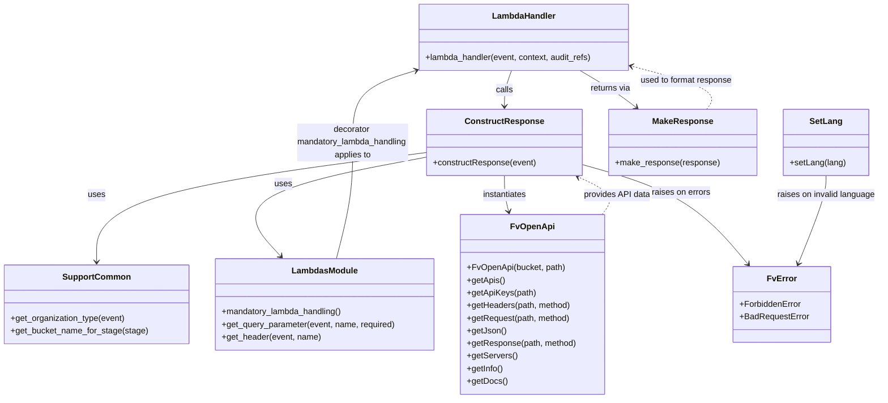

# Diagram: common/support_service/support_service/get_api_sample.py

> Auto-generated by Obscura crawlers

## Mermaid

### SVG

<svg id="container" width="1657.626953125" xmlns="http://www.w3.org/2000/svg" class="classDiagram" height="758" viewBox="0 0 1657.626953125 758" role="graphics-document document" aria-roledescription="class"><g><defs><marker id="container_class-aggregationStart" class="marker aggregation class" refX="18" refY="7" markerWidth="190" markerHeight="240" orient="auto"><path d="M 18,7 L9,13 L1,7 L9,1 Z"></path></marker></defs><defs><marker id="container_class-aggregationEnd" class="marker aggregation class" refX="1" refY="7" markerWidth="20" markerHeight="28" orient="auto"><path d="M 18,7 L9,13 L1,7 L9,1 Z"></path></marker></defs><defs><marker id="container_class-extensionStart" class="marker extension class" refX="18" refY="7" markerWidth="190" markerHeight="240" orient="auto"><path d="M 1,7 L18,13 V 1 Z"></path></marker></defs><defs><marker id="container_class-extensionEnd" class="marker extension class" refX="1" refY="7" markerWidth="20" markerHeight="28" orient="auto"><path d="M 1,1 V 13 L18,7 Z"></path></marker></defs><defs><marker id="container_class-compositionStart" class="marker composition class" refX="18" refY="7" markerWidth="190" markerHeight="240" orient="auto"><path d="M 18,7 L9,13 L1,7 L9,1 Z"></path></marker></defs><defs><marker id="container_class-compositionEnd" class="marker composition class" refX="1" refY="7" markerWidth="20" markerHeight="28" orient="auto"><path d="M 18,7 L9,13 L1,7 L9,1 Z"></path></marker></defs><defs><marker id="container_class-dependencyStart" class="marker dependency class" refX="6" refY="7" markerWidth="190" markerHeight="240" orient="auto"><path d="M 5,7 L9,13 L1,7 L9,1 Z"></path></marker></defs><defs><marker id="container_class-dependencyEnd" class="marker dependency class" refX="13" refY="7" markerWidth="20" markerHeight="28" orient="auto"><path d="M 18,7 L9,13 L14,7 L9,1 Z"></path></marker></defs><defs><marker id="container_class-lollipopStart" class="marker lollipop class" refX="13" refY="7" markerWidth="190" markerHeight="240" orient="auto"><circle stroke="black" fill="transparent" cx="7" cy="7" r="6"></circle></marker></defs><defs><marker id="container_class-lollipopEnd" class="marker lollipop class" refX="1" refY="7" markerWidth="190" markerHeight="240" orient="auto"><circle stroke="black" fill="transparent" cx="7" cy="7" r="6"></circle></marker></defs><g class="root"><g class="clusters"></g><g class="edgePaths"><path d="M967.079,134L964.755,140.167C962.431,146.333,957.783,158.667,955.459,170C953.135,181.333,953.135,191.667,953.135,196.833L953.135,202" id="id_LambdaHandler_ConstructResponse_1" class="edge-thickness-normal edge-pattern-solid relation" style=";;;" data-edge="true" data-et="edge" data-id="id_LambdaHandler_ConstructResponse_1" data-points="W3sieCI6OTY3LjA3OTE0MDYyNSwieSI6MTM0fSx7IngiOjk1My4xMzQ3NjU2MjUsInkiOjE3MX0seyJ4Ijo5NTMuMTM0NzY1NjI1LCJ5IjoyMDh9XQ==" marker-end="url(#container_class-dependencyEnd)"></path><path d="M1096.155,134L1106.466,140.167C1116.776,146.333,1137.397,158.667,1154.902,170.389C1172.407,182.111,1186.797,193.222,1193.992,198.778L1201.186,204.333" id="id_LambdaHandler_MakeResponse_2" class="edge-thickness-normal edge-pattern-solid relation" style=";;;" data-edge="true" data-et="edge" data-id="id_LambdaHandler_MakeResponse_2" data-points="W3sieCI6MTA5Ni4xNTUzMTI1LCJ5IjoxMzR9LHsieCI6MTE1OC4wMTc1NzgxMjUsInkiOjE3MX0seyJ4IjoxMjA1LjkzNTQ2ODc1LCJ5IjoyMDh9XQ==" marker-end="url(#container_class-dependencyEnd)"></path><path d="M807.244,289.883L702.791,303.402C598.337,316.922,389.43,343.961,284.977,378.647C180.523,413.333,180.523,455.667,180.523,476.833L180.523,498" id="id_ConstructResponse_SupportCommon_3" class="edge-thickness-normal edge-pattern-solid relation" style=";;;" data-edge="true" data-et="edge" data-id="id_ConstructResponse_SupportCommon_3" data-points="W3sieCI6ODA3LjI0NDE0MDYyNSwieSI6Mjg5Ljg4Mjc5NjUyMjU0ODA2fSx7IngiOjE4MC41MjM0Mzc1LCJ5IjozNzF9LHsieCI6MTgwLjUyMzQzNzUsInkiOjUwNH1d" marker-end="url(#container_class-dependencyEnd)"></path><path d="M807.244,298.487L743.098,310.572C678.951,322.658,550.658,346.829,504.15,378.341C457.642,409.853,492.919,448.705,510.558,468.132L528.196,487.558" id="id_ConstructResponse_LambdasModule_4" class="edge-thickness-normal edge-pattern-solid relation" style=";;;" data-edge="true" data-et="edge" data-id="id_ConstructResponse_LambdasModule_4" data-points="W3sieCI6ODA3LjI0NDE0MDYyNSwieSI6Mjk4LjQ4NjYyMzkzMTkzODR9LHsieCI6NDIyLjM2NTIzNDM3NSwieSI6MzcxfSx7IngiOjUzMi4yMjk0MDc2NzcyODM3LCJ5Ijo0OTJ9XQ==" marker-end="url(#container_class-dependencyEnd)"></path><path d="M953.135,334L953.135,340.167C953.135,346.333,953.135,358.667,954.435,370.03C955.735,381.393,958.336,391.786,959.636,396.983L960.936,402.179" id="id_ConstructResponse_FvOpenApi_5" class="edge-thickness-normal edge-pattern-solid relation" style=";;;" data-edge="true" data-et="edge" data-id="id_ConstructResponse_FvOpenApi_5" data-points="W3sieCI6OTUzLjEzNDc2NTYyNSwieSI6MzM0fSx7IngiOjk1My4xMzQ3NjU2MjUsInkiOjM3MX0seyJ4Ijo5NjIuMzkyNzU2NTM1NDU2OCwieSI6NDA4fV0=" marker-end="url(#container_class-dependencyEnd)"></path><path d="M1099.025,312.79L1132.894,322.492C1166.762,332.194,1234.499,351.597,1286.05,383.187C1337.6,414.778,1372.964,458.555,1390.646,480.444L1408.327,502.333" id="id_ConstructResponse_FvError_6" class="edge-thickness-normal edge-pattern-solid relation" style=";;;" data-edge="true" data-et="edge" data-id="id_ConstructResponse_FvError_6" data-points="W3sieCI6MTA5OS4wMjUzOTA2MjUsInkiOjMxMi43OTAzMDk5NDc0MDk2NH0seyJ4IjoxMzAyLjIzNjMyODEyNSwieSI6MzcxfSx7IngiOjE0MTIuMDk3ODA2NDkwMzg0NSwieSI6NTA3fV0=" marker-end="url(#container_class-dependencyEnd)"></path><path d="M1555.557,334L1555.557,340.167C1555.557,346.333,1555.557,358.667,1546.641,386.575C1537.725,414.483,1519.894,457.966,1510.978,479.707L1502.062,501.449" id="id_SetLang_FvError_7" class="edge-thickness-normal edge-pattern-solid relation" style=";;;" data-edge="true" data-et="edge" data-id="id_SetLang_FvError_7" data-points="W3sieCI6MTU1NS41NTY2NDA2MjUsInkiOjMzNH0seyJ4IjoxNTU1LjU1NjY0MDYyNSwieSI6MzcxfSx7IngiOjE0OTkuNzg1NjA2OTcxMTUzOCwieSI6NTA3fV0=" marker-end="url(#container_class-dependencyEnd)"></path><path d="M632.991,492L638.037,471.833C643.083,451.667,653.176,411.333,658.222,374.5C663.268,337.667,663.268,304.333,663.268,271C663.268,237.667,663.268,204.333,683.245,181.568C703.222,158.802,743.176,146.604,763.153,140.506L783.131,134.407" id="id_LambdasModule_LambdaHandler_8" class="edge-thickness-normal edge-pattern-solid relation" style=";;;" data-edge="true" data-et="edge" data-id="id_LambdasModule_LambdaHandler_8" data-points="W3sieCI6NjMyLjk5MTQ0NTY4ODEwMSwieSI6NDkyfSx7IngiOjY2My4yNjc1NzgxMjUsInkiOjM3MX0seyJ4Ijo2NjMuMjY3NTc4MTI1LCJ5IjoyNzF9LHsieCI6NjYzLjI2NzU3ODEyNSwieSI6MTcxfSx7IngiOjc4OC44NjkxNDA2MjUsInkiOjEzMi42NTQ3ODA5Mjg3NTcxM31d" marker-end="url(#container_class-dependencyEnd)"></path><path d="M1134.305,408L1138.961,401.833C1143.618,395.667,1152.931,383.333,1145.595,371.431C1138.258,359.53,1114.272,348.059,1102.279,342.324L1090.287,336.589" id="id_FvOpenApi_ConstructResponse_9" class="edge-thickness-normal edge-pattern-dashed relation" style=";;;" data-edge="true" data-et="edge" data-id="id_FvOpenApi_ConstructResponse_9" data-points="W3sieCI6MTEzNC4zMDQ3OTA3OTAyNjQ0LCJ5Ijo0MDh9LHsieCI6MTE2Mi4yNDQxNDA2MjUsInkiOjM3MX0seyJ4IjoxMDg0Ljg3MzY3MTg3NTAwMDEsInkiOjMzNH1d" marker-end="url(#container_class-dependencyEnd)"></path><path d="M1334.106,208L1338.665,201.833C1343.225,195.667,1352.344,183.333,1329.754,169.842C1307.165,156.35,1252.866,141.7,1225.717,134.375L1198.568,127.051" id="id_MakeResponse_LambdaHandler_10" class="edge-thickness-normal edge-pattern-dashed relation" style=";;;" data-edge="true" data-et="edge" data-id="id_MakeResponse_LambdaHandler_10" data-points="W3sieCI6MTMzNC4xMDYwMTU2MjUsInkiOjIwOH0seyJ4IjoxMzYxLjQ2Mjg5MDYyNSwieSI6MTcxfSx7IngiOjExOTIuNzc1MzkwNjI1LCJ5IjoxMjUuNDg3NTg0ODQwNDM2NzR9XQ==" marker-end="url(#container_class-dependencyEnd)"></path></g><g class="edgeLabels"><g class="edgeLabel" transform="translate(953.134765625, 171)"><g class="label" data-id="id_LambdaHandler_ConstructResponse_1" transform="translate(-16.4453125, -12)"><foreignObject width="32.890625" height="24">

calls

</foreignObject></g></g><g class="edgeLabel" transform="translate(1153.06459, 168.0376)"><g class="label" data-id="id_LambdaHandler_MakeResponse_2" transform="translate(-38.9296875, -12)"><foreignObject width="77.859375" height="24">

returns via

</foreignObject></g></g><g class="edgeLabel" transform="translate(180.5234375, 371)"><g class="label" data-id="id_ConstructResponse_SupportCommon_3" transform="translate(-16.4921875, -12)"><foreignObject width="32.984375" height="24">

uses

</foreignObject></g></g><g class="edgeLabel" transform="translate(534.49983, 349.8732)"><g class="label" data-id="id_ConstructResponse_LambdasModule_4" transform="translate(-16.4921875, -12)"><foreignObject width="32.984375" height="24">

uses

</foreignObject></g></g><g class="edgeLabel" transform="translate(953.134765625, 371)"><g class="label" data-id="id_ConstructResponse_FvOpenApi_5" transform="translate(-42.9140625, -12)"><foreignObject width="85.828125" height="24">

instantiates

</foreignObject></g></g><g class="edgeLabel" transform="translate(1284.66615, 365.96703)"><g class="label" data-id="id_ConstructResponse_FvError_6" transform="translate(-56.5234375, -12)"><foreignObject width="113.046875" height="24">

raises on errors

</foreignObject></g></g><g class="edgeLabel" transform="translate(1555.556640625, 371)"><g class="label" data-id="id_SetLang_FvError_7" transform="translate(-94.0703125, -12)"><foreignObject width="188.140625" height="24">

raises on invalid language

</foreignObject></g></g><g class="edgeLabel" transform="translate(663.267578125, 271)"><g class="label" data-id="id_LambdasModule_LambdaHandler_8" transform="translate(-108.9765625, -36)"><foreignObject width="217.953125" height="72">

decorator mandatory_lambda_handling applies to

</foreignObject></g></g><g class="edgeLabel" transform="translate(1162.244140625, 371)"><g class="label" data-id="id_FvOpenApi_ConstructResponse_9" transform="translate(-63.46875, -12)"><foreignObject width="126.9375" height="24">

provides API data

</foreignObject></g></g><g class="edgeLabel" transform="translate(1299.33245, 154.23701)"><g class="label" data-id="id_MakeResponse_LambdaHandler_10" transform="translate(-88.9453125, -12)"><foreignObject width="177.890625" height="24">

used to format response

</foreignObject></g></g></g><g class="nodes"><g class="node default" id="classId-LambdaHandler-0" transform="translate(990.822265625, 71)"><g class="basic label-container"><path d="M-201.953125 -63 L201.953125 -63 L201.953125 63 L-201.953125 63" stroke="none" stroke-width="0" fill="#ECECFF" style=""></path><path d="M-201.953125 -63 C-110.15955271349304 -63, -18.365980426986084 -63, 201.953125 -63 M-201.953125 -63 C-89.87796398738759 -63, 22.197197025224824 -63, 201.953125 -63 M201.953125 -63 C201.953125 -16.708599261508503, 201.953125 29.582801476982993, 201.953125 63 M201.953125 -63 C201.953125 -36.48886944268128, 201.953125 -9.977738885362548, 201.953125 63 M201.953125 63 C98.88895845552582 63, -4.175208088948352 63, -201.953125 63 M201.953125 63 C71.79073738265214 63, -58.37165023469572 63, -201.953125 63 M-201.953125 63 C-201.953125 35.08184310838959, -201.953125 7.163686216779183, -201.953125 -63 M-201.953125 63 C-201.953125 27.637457418093852, -201.953125 -7.725085163812295, -201.953125 -63" stroke="#9370DB" stroke-width="1.3" fill="none" stroke-dasharray="0 0" style=""></path></g><g class="annotation-group text" transform="translate(0, -39)"></g><g class="label-group text" transform="translate(-58.21875, -39)"><g class="label" style="font-weight: bolder" transform="translate(0,-12)"><foreignObject width="116.4375" height="24">

LambdaHandler

</foreignObject></g></g><g class="members-group text" transform="translate(-189.953125, 9)"></g><g class="methods-group text" transform="translate(-189.953125, 39)"><g class="label" style="" transform="translate(0,-12)"><foreignObject width="321.6875" height="24">

+lambda_handler(event, context, audit_refs)

</foreignObject></g></g><g class="divider" style=""><path d="M-201.953125 -15 C-70.75894633371502 -15, 60.43523233256997 -15, 201.953125 -15 M-201.953125 -15 C-81.3998800276036 -15, 39.1533649447928 -15, 201.953125 -15" stroke="#9370DB" stroke-width="1.3" fill="none" stroke-dasharray="0 0" style=""></path></g><g class="divider" style=""><path d="M-201.953125 9 C-80.89430743506817 9, 40.16451012986366 9, 201.953125 9 M-201.953125 9 C-86.66800287298084 9, 28.61711925403833 9, 201.953125 9" stroke="#9370DB" stroke-width="1.3" fill="none" stroke-dasharray="0 0" style=""></path></g></g><g class="node default" id="classId-ConstructResponse-1" transform="translate(953.134765625, 271)"><g class="basic label-container"><path d="M-145.890625 -63 L145.890625 -63 L145.890625 63 L-145.890625 63" stroke="none" stroke-width="0" fill="#ECECFF" style=""></path><path d="M-145.890625 -63 C-57.87176638132206 -63, 30.147092237355878 -63, 145.890625 -63 M-145.890625 -63 C-57.17486475583324 -63, 31.54089548833352 -63, 145.890625 -63 M145.890625 -63 C145.890625 -21.46543830043491, 145.890625 20.069123399130177, 145.890625 63 M145.890625 -63 C145.890625 -18.586342437335595, 145.890625 25.82731512532881, 145.890625 63 M145.890625 63 C68.66505401067305 63, -8.560516978653908 63, -145.890625 63 M145.890625 63 C46.48487996654289 63, -52.92086506691422 63, -145.890625 63 M-145.890625 63 C-145.890625 24.653015302640256, -145.890625 -13.693969394719488, -145.890625 -63 M-145.890625 63 C-145.890625 15.37417709876933, -145.890625 -32.25164580246134, -145.890625 -63" stroke="#9370DB" stroke-width="1.3" fill="none" stroke-dasharray="0 0" style=""></path></g><g class="annotation-group text" transform="translate(0, -39)"></g><g class="label-group text" transform="translate(-70.828125, -39)"><g class="label" style="font-weight: bolder" transform="translate(0,-12)"><foreignObject width="141.65625" height="24">

ConstructResponse

</foreignObject></g></g><g class="members-group text" transform="translate(-133.890625, 9)"></g><g class="methods-group text" transform="translate(-133.890625, 39)"><g class="label" style="" transform="translate(0,-12)"><foreignObject width="196.953125" height="24">

+constructResponse(event)

</foreignObject></g></g><g class="divider" style=""><path d="M-145.890625 -15 C-35.69251182990212 -15, 74.50560134019577 -15, 145.890625 -15 M-145.890625 -15 C-42.38962277611485 -15, 61.111379447770304 -15, 145.890625 -15" stroke="#9370DB" stroke-width="1.3" fill="none" stroke-dasharray="0 0" style=""></path></g><g class="divider" style=""><path d="M-145.890625 9 C-52.73299389387087 9, 40.42463721225826 9, 145.890625 9 M-145.890625 9 C-55.27666783925417 9, 35.33728932149165 9, 145.890625 9" stroke="#9370DB" stroke-width="1.3" fill="none" stroke-dasharray="0 0" style=""></path></g></g><g class="node default" id="classId-SetLang-2" transform="translate(1555.556640625, 271)"><g class="basic label-container"><path d="M-79.53125 -63 L79.53125 -63 L79.53125 63 L-79.53125 63" stroke="none" stroke-width="0" fill="#ECECFF" style=""></path><path d="M-79.53125 -63 C-18.011667445062713 -63, 43.507915109874574 -63, 79.53125 -63 M-79.53125 -63 C-16.894179976427978 -63, 45.742890047144044 -63, 79.53125 -63 M79.53125 -63 C79.53125 -18.087727409022975, 79.53125 26.82454518195405, 79.53125 63 M79.53125 -63 C79.53125 -13.80998196389426, 79.53125 35.38003607221148, 79.53125 63 M79.53125 63 C27.757760194495617 63, -24.015729611008766 63, -79.53125 63 M79.53125 63 C43.447675347487205 63, 7.364100694974411 63, -79.53125 63 M-79.53125 63 C-79.53125 26.209943599309568, -79.53125 -10.580112801380864, -79.53125 -63 M-79.53125 63 C-79.53125 16.956791579256866, -79.53125 -29.08641684148627, -79.53125 -63" stroke="#9370DB" stroke-width="1.3" fill="none" stroke-dasharray="0 0" style=""></path></g><g class="annotation-group text" transform="translate(0, -39)"></g><g class="label-group text" transform="translate(-29.515625, -39)"><g class="label" style="font-weight: bolder" transform="translate(0,-12)"><foreignObject width="59.03125" height="24">

SetLang

</foreignObject></g></g><g class="members-group text" transform="translate(-67.53125, 9)"></g><g class="methods-group text" transform="translate(-67.53125, 39)"><g class="label" style="" transform="translate(0,-12)"><foreignObject width="105.546875" height="24">

+setLang(lang)

</foreignObject></g></g><g class="divider" style=""><path d="M-79.53125 -15 C-24.036046723006784 -15, 31.459156553986432 -15, 79.53125 -15 M-79.53125 -15 C-28.065449053636456 -15, 23.400351892727087 -15, 79.53125 -15" stroke="#9370DB" stroke-width="1.3" fill="none" stroke-dasharray="0 0" style=""></path></g><g class="divider" style=""><path d="M-79.53125 9 C-26.003693584506784 9, 27.52386283098643 9, 79.53125 9 M-79.53125 9 C-41.514569584525105 9, -3.497889169050211 9, 79.53125 9" stroke="#9370DB" stroke-width="1.3" fill="none" stroke-dasharray="0 0" style=""></path></g></g><g class="node default" id="classId-FvOpenApi-3" transform="translate(1005.1796875, 579)"><g class="basic label-container"><path d="M-135.78125 -171 L135.78125 -171 L135.78125 171 L-135.78125 171" stroke="none" stroke-width="0" fill="#ECECFF" style=""></path><path d="M-135.78125 -171 C-37.84489995743276 -171, 60.09145008513448 -171, 135.78125 -171 M-135.78125 -171 C-67.0883326122956 -171, 1.6045847754087958 -171, 135.78125 -171 M135.78125 -171 C135.78125 -85.70230978523006, 135.78125 -0.4046195704601132, 135.78125 171 M135.78125 -171 C135.78125 -68.55207966666607, 135.78125 33.89584066666785, 135.78125 171 M135.78125 171 C43.63773123105547 171, -48.50578753788906 171, -135.78125 171 M135.78125 171 C30.21582010837649 171, -75.34960978324702 171, -135.78125 171 M-135.78125 171 C-135.78125 62.31746181069984, -135.78125 -46.36507637860032, -135.78125 -171 M-135.78125 171 C-135.78125 43.65616804995817, -135.78125 -83.68766390008366, -135.78125 -171" stroke="#9370DB" stroke-width="1.3" fill="none" stroke-dasharray="0 0" style=""></path></g><g class="annotation-group text" transform="translate(0, -147)"></g><g class="label-group text" transform="translate(-38.8125, -147)"><g class="label" style="font-weight: bolder" transform="translate(0,-12)"><foreignObject width="77.625" height="24">

FvOpenApi

</foreignObject></g></g><g class="members-group text" transform="translate(-123.78125, -99)"></g><g class="methods-group text" transform="translate(-123.78125, -69)"><g class="label" style="" transform="translate(0,-12)"><foreignObject width="185.734375" height="24">

+FvOpenApi(bucket, path)

</foreignObject></g><g class="label" style="" transform="translate(0,12)"><foreignObject width="71.578125" height="24">

+getApis()

</foreignObject></g><g class="label" style="" transform="translate(0,36)"><foreignObject width="130.390625" height="24">

+getApiKeys(path)

</foreignObject></g><g class="label" style="" transform="translate(0,60)"><foreignObject width="198.53125" height="24">

+getHeaders(path, method)

</foreignObject></g><g class="label" style="" transform="translate(0,84)"><foreignObject width="197.703125" height="24">

+getRequest(path, method)

</foreignObject></g><g class="label" style="" transform="translate(0,108)"><foreignObject width="71.984375" height="24">

+getJson()

</foreignObject></g><g class="label" style="" transform="translate(0,132)"><foreignObject width="208.75" height="24">

+getResponse(path, method)

</foreignObject></g><g class="label" style="" transform="translate(0,156)"><foreignObject width="94.46875" height="24">

+getServers()

</foreignObject></g><g class="label" style="" transform="translate(0,180)"><foreignObject width="69.5625" height="24">

+getInfo()

</foreignObject></g><g class="label" style="" transform="translate(0,204)"><foreignObject width="75.6875" height="24">

+getDocs()

</foreignObject></g></g><g class="divider" style=""><path d="M-135.78125 -123 C-60.540248092803736 -123, 14.700753814392527 -123, 135.78125 -123 M-135.78125 -123 C-78.07220957562168 -123, -20.36316915124337 -123, 135.78125 -123" stroke="#9370DB" stroke-width="1.3" fill="none" stroke-dasharray="0 0" style=""></path></g><g class="divider" style=""><path d="M-135.78125 -99 C-69.27394838529906 -99, -2.766646770598129 -99, 135.78125 -99 M-135.78125 -99 C-30.222777610312207 -99, 75.33569477937559 -99, 135.78125 -99" stroke="#9370DB" stroke-width="1.3" fill="none" stroke-dasharray="0 0" style=""></path></g></g><g class="node default" id="classId-SupportCommon-4" transform="translate(180.5234375, 579)"><g class="basic label-container"><path d="M-172.5234375 -75 L172.5234375 -75 L172.5234375 75 L-172.5234375 75" stroke="none" stroke-width="0" fill="#ECECFF" style=""></path><path d="M-172.5234375 -75 C-96.20753167056873 -75, -19.891625841137454 -75, 172.5234375 -75 M-172.5234375 -75 C-64.59995719501475 -75, 43.323523109970495 -75, 172.5234375 -75 M172.5234375 -75 C172.5234375 -31.23374812408499, 172.5234375 12.53250375183002, 172.5234375 75 M172.5234375 -75 C172.5234375 -36.38594722341087, 172.5234375 2.228105553178267, 172.5234375 75 M172.5234375 75 C65.1017886205319 75, -42.31986025893619 75, -172.5234375 75 M172.5234375 75 C84.20628916471905 75, -4.110859170561895 75, -172.5234375 75 M-172.5234375 75 C-172.5234375 25.759463014860692, -172.5234375 -23.481073970278615, -172.5234375 -75 M-172.5234375 75 C-172.5234375 32.61607615511088, -172.5234375 -9.767847689778236, -172.5234375 -75" stroke="#9370DB" stroke-width="1.3" fill="none" stroke-dasharray="0 0" style=""></path></g><g class="annotation-group text" transform="translate(0, -51)"></g><g class="label-group text" transform="translate(-61.59375, -51)"><g class="label" style="font-weight: bolder" transform="translate(0,-12)"><foreignObject width="123.1875" height="24">

SupportCommon

</foreignObject></g></g><g class="members-group text" transform="translate(-160.5234375, -3)"></g><g class="methods-group text" transform="translate(-160.5234375, 27)"><g class="label" style="" transform="translate(0,-12)"><foreignObject width="219.40625" height="24">

+get_organization_type(event)

</foreignObject></g><g class="label" style="" transform="translate(0,12)"><foreignObject width="259.453125" height="24">

+get_bucket_name_for_stage(stage)

</foreignObject></g></g><g class="divider" style=""><path d="M-172.5234375 -27 C-67.60459775002687 -27, 37.31424199994626 -27, 172.5234375 -27 M-172.5234375 -27 C-102.24925644071277 -27, -31.97507538142554 -27, 172.5234375 -27" stroke="#9370DB" stroke-width="1.3" fill="none" stroke-dasharray="0 0" style=""></path></g><g class="divider" style=""><path d="M-172.5234375 -3 C-70.49670714953201 -3, 31.53002320093597 -3, 172.5234375 -3 M-172.5234375 -3 C-78.73307314052633 -3, 15.057291218947341 -3, 172.5234375 -3" stroke="#9370DB" stroke-width="1.3" fill="none" stroke-dasharray="0 0" style=""></path></g></g><g class="node default" id="classId-LambdasModule-5" transform="translate(611.22265625, 579)"><g class="basic label-container"><path d="M-208.17578125 -87 L208.17578125 -87 L208.17578125 87 L-208.17578125 87" stroke="none" stroke-width="0" fill="#ECECFF" style=""></path><path d="M-208.17578125 -87 C-69.36370210143821 -87, 69.44837704712359 -87, 208.17578125 -87 M-208.17578125 -87 C-113.14020428775352 -87, -18.10462732550704 -87, 208.17578125 -87 M208.17578125 -87 C208.17578125 -34.22730777727835, 208.17578125 18.545384445443304, 208.17578125 87 M208.17578125 -87 C208.17578125 -40.96623852775387, 208.17578125 5.067522944492254, 208.17578125 87 M208.17578125 87 C119.79444636459705 87, 31.4131114791941 87, -208.17578125 87 M208.17578125 87 C47.77928551161315 87, -112.6172102267737 87, -208.17578125 87 M-208.17578125 87 C-208.17578125 50.12206311041436, -208.17578125 13.244126220828718, -208.17578125 -87 M-208.17578125 87 C-208.17578125 45.64052674068925, -208.17578125 4.281053481378507, -208.17578125 -87" stroke="#9370DB" stroke-width="1.3" fill="none" stroke-dasharray="0 0" style=""></path></g><g class="annotation-group text" transform="translate(0, -63)"></g><g class="label-group text" transform="translate(-60.0078125, -63)"><g class="label" style="font-weight: bolder" transform="translate(0,-12)"><foreignObject width="120.015625" height="24">

LambdasModule

</foreignObject></g></g><g class="members-group text" transform="translate(-196.17578125, -15)"></g><g class="methods-group text" transform="translate(-196.17578125, 15)"><g class="label" style="" transform="translate(0,-12)"><foreignObject width="232.078125" height="24">

+mandatory_lambda_handling()

</foreignObject></g><g class="label" style="" transform="translate(0,12)"><foreignObject width="332.34375" height="24">

+get_query_parameter(event, name, required)

</foreignObject></g><g class="label" style="" transform="translate(0,36)"><foreignObject width="189.34375" height="24">

+get_header(event, name)

</foreignObject></g></g><g class="divider" style=""><path d="M-208.17578125 -39 C-93.15926394991955 -39, 21.857253350160903 -39, 208.17578125 -39 M-208.17578125 -39 C-46.91508833562244 -39, 114.34560457875511 -39, 208.17578125 -39" stroke="#9370DB" stroke-width="1.3" fill="none" stroke-dasharray="0 0" style=""></path></g><g class="divider" style=""><path d="M-208.17578125 -15 C-77.56916604058762 -15, 53.037449168824764 -15, 208.17578125 -15 M-208.17578125 -15 C-92.02056569291364 -15, 24.13464986417273 -15, 208.17578125 -15" stroke="#9370DB" stroke-width="1.3" fill="none" stroke-dasharray="0 0" style=""></path></g></g><g class="node default" id="classId-MakeResponse-6" transform="translate(1287.525390625, 271)"><g class="basic label-container"><path d="M-138.5 -63 L138.5 -63 L138.5 63 L-138.5 63" stroke="none" stroke-width="0" fill="#ECECFF" style=""></path><path d="M-138.5 -63 C-68.86661498416471 -63, 0.7667700316705748 -63, 138.5 -63 M-138.5 -63 C-38.80618319916822 -63, 60.887633601663566 -63, 138.5 -63 M138.5 -63 C138.5 -29.43622543586153, 138.5 4.127549128276939, 138.5 63 M138.5 -63 C138.5 -32.787927539899535, 138.5 -2.5758550797990694, 138.5 63 M138.5 63 C82.88738221974751 63, 27.27476443949503 63, -138.5 63 M138.5 63 C39.49920845458199 63, -59.50158309083602 63, -138.5 63 M-138.5 63 C-138.5 18.698869944024317, -138.5 -25.602260111951367, -138.5 -63 M-138.5 63 C-138.5 20.618699745930506, -138.5 -21.762600508138988, -138.5 -63" stroke="#9370DB" stroke-width="1.3" fill="none" stroke-dasharray="0 0" style=""></path></g><g class="annotation-group text" transform="translate(0, -39)"></g><g class="label-group text" transform="translate(-54.84375, -39)"><g class="label" style="font-weight: bolder" transform="translate(0,-12)"><foreignObject width="109.6875" height="24">

MakeResponse

</foreignObject></g></g><g class="members-group text" transform="translate(-126.5, 9)"></g><g class="methods-group text" transform="translate(-126.5, 39)"><g class="label" style="" transform="translate(0,-12)"><foreignObject width="198.15625" height="24">

+make_response(response)

</foreignObject></g></g><g class="divider" style=""><path d="M-138.5 -15 C-42.95312138868047 -15, 52.593757222639056 -15, 138.5 -15 M-138.5 -15 C-70.48250460579675 -15, -2.4650092115934967 -15, 138.5 -15" stroke="#9370DB" stroke-width="1.3" fill="none" stroke-dasharray="0 0" style=""></path></g><g class="divider" style=""><path d="M-138.5 9 C-63.14813146654021 9, 12.203737066919587 9, 138.5 9 M-138.5 9 C-66.95114500683064 9, 4.597709986338714 9, 138.5 9" stroke="#9370DB" stroke-width="1.3" fill="none" stroke-dasharray="0 0" style=""></path></g></g><g class="node default" id="classId-FvError-7" transform="translate(1470.259765625, 579)"><g class="basic label-container"><path d="M-90.3515625 -72 L90.3515625 -72 L90.3515625 72 L-90.3515625 72" stroke="none" stroke-width="0" fill="#ECECFF" style=""></path><path d="M-90.3515625 -72 C-43.99393775158159 -72, 2.363686996836819 -72, 90.3515625 -72 M-90.3515625 -72 C-38.781749163298336 -72, 12.788064173403328 -72, 90.3515625 -72 M90.3515625 -72 C90.3515625 -18.065186453615944, 90.3515625 35.86962709276811, 90.3515625 72 M90.3515625 -72 C90.3515625 -40.46735168791827, 90.3515625 -8.934703375836541, 90.3515625 72 M90.3515625 72 C52.637882129053736 72, 14.924201758107472 72, -90.3515625 72 M90.3515625 72 C36.45192153120563 72, -17.447719437588745 72, -90.3515625 72 M-90.3515625 72 C-90.3515625 15.180313288673872, -90.3515625 -41.639373422652255, -90.3515625 -72 M-90.3515625 72 C-90.3515625 25.880331263220285, -90.3515625 -20.23933747355943, -90.3515625 -72" stroke="#9370DB" stroke-width="1.3" fill="none" stroke-dasharray="0 0" style=""></path></g><g class="annotation-group text" transform="translate(0, -48)"></g><g class="label-group text" transform="translate(-25.90625, -48)"><g class="label" style="font-weight: bolder" transform="translate(0,-12)"><foreignObject width="51.8125" height="24">

FvError

</foreignObject></g></g><g class="members-group text" transform="translate(-78.3515625, 0)"><g class="label" style="" transform="translate(0,-12)"><foreignObject width="117.84375" height="24">

+ForbiddenError

</foreignObject></g><g class="label" style="" transform="translate(0,12)"><foreignObject width="130.796875" height="24">

+BadRequestError

</foreignObject></g></g><g class="methods-group text" transform="translate(-78.3515625, 72)"></g><g class="divider" style=""><path d="M-90.3515625 -24 C-30.1677321493734 -24, 30.0160982012532 -24, 90.3515625 -24 M-90.3515625 -24 C-53.1864351836857 -24, -16.021307867371405 -24, 90.3515625 -24" stroke="#9370DB" stroke-width="1.3" fill="none" stroke-dasharray="0 0" style=""></path></g><g class="divider" style=""><path d="M-90.3515625 48 C-51.59719494220542 48, -12.842827384410839 48, 90.3515625 48 M-90.3515625 48 C-18.387057345130415 48, 53.57744780973917 48, 90.3515625 48" stroke="#9370DB" stroke-width="1.3" fill="none" stroke-dasharray="0 0" style=""></path></g></g></g></g></g></svg>
