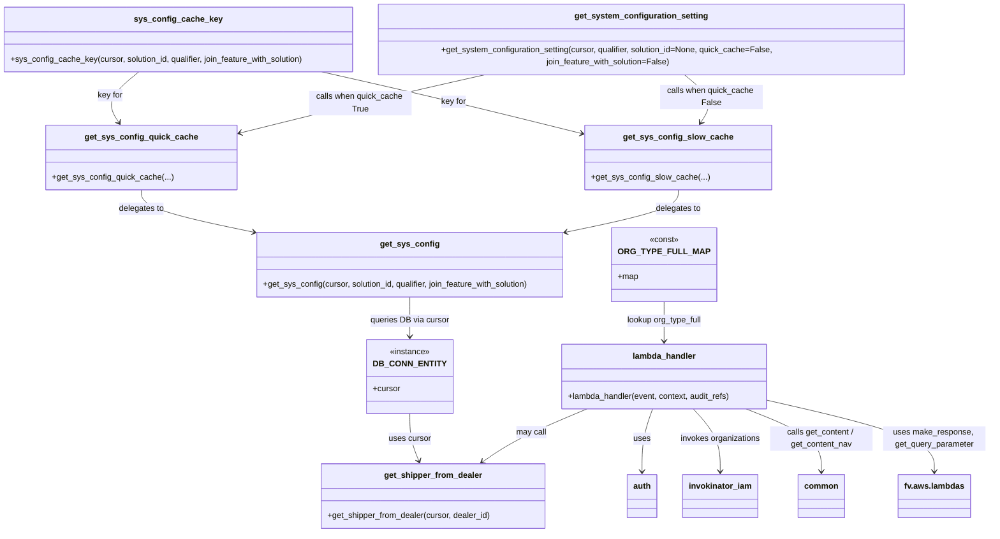

# Diagram: common/support_service/support_service/get_content.py


> Auto-generated by Obscura crawlers

## Diagram 1



> SVG rendering failed for this diagram.

## Diagram 2

```mermaid
flowchart TD
    Start([start]) --> ParseEvent{extract file, org info}
    ParseEvent --> Auth[get org_type via auth.get_user_org_types]
    Auth --> GetOrgId[get org_id via auth.get_organization_id]
    GetOrgId --> DecideOrgType{org_type == "DL"?}
    DecideOrgType -- DL --> GetShipperDB[get_shipper_from_dealer(DB_CONN_ENTITY.cursor, org_id)]
    GetShipperDB --> NoShipper{shipper_solution_id found?}
    NoShipper -- no --> ErrorBadRequest[raise BadRequestError]
    NoShipper -- yes --> InvokeOrgsDL[invokinator_iam.invoke_get_organizations(solutions=[shipper_solution_id])]
    DecideOrgType -- SH --> InvokeOrgsSH[invokinator_iam.invoke_get_organizations(organization_ids=[org_id])]
    InvokeOrgsDL --> ExtractFVIDDL[shipper_org_fv_id = org.fv_id]
    InvokeOrgsSH --> ExtractFVIDSH[shipper_org_fv_id = org.fv_id]
    ExtractFVIDDL --> BuildPath
    ExtractFVIDSH --> BuildPath
    DecideOrgType -- other --> BuildPath
    BuildPath --> CheckExtension{file_extension == "json"?}
    CheckExtension -- yes --> UseNav[content_function = common.get_content_nav]
    CheckExtension -- no --> UseContent[content_function = common.get_content]
    UseNav --> BuildRequestedPathNav{shipper_org_fv_id ?}
    UseContent --> BuildRequestedPathContent{shipper_org_fv_id ?}
    BuildRequestedPathNav --> TryFetchNav[try content_function(stage, requested_path, event, file_type)]
    BuildRequestedPathContent --> TryFetchContent[try content_function(stage, requested_path, event, file_type)]
    TryFetchNav --> SuccessNav[make_response(body=content, content_type=file_type)]
    TryFetchContent --> SuccessContent[make_response(body=content, content_type=file_type)]
    TryFetchContent -- exception and shipper_org_fv_id --> FallbackPath[requested_path = generic org path]
    FallbackPath --> RetryFetch[content_function(stage, requested_path, event, file_type)]
    RetryFetch --> SuccessContent
    TryFetchNav -- exception --> FallbackNav{shipper_org_fv_id?}
    FallbackNav -- yes --> FallbackPathNav[use generic nav path] --> RetryFetchNav[content_function(...)]
    RetryFetchNav --> SuccessNav
    FallbackNav -- no --> RaiseError[raise exception]
    SuccessNav --> ReturnResponse[return response]
    SuccessContent --> ReturnResponse
    ErrorBadRequest --> End([end])
    RaiseError --> ReturnEmpty[make_response(body={}, status_code=204)] --> End
    ReturnResponse --> End
```

> SVG rendering failed for this diagram.
