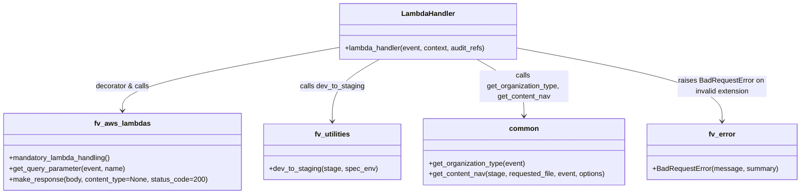

# Diagram: common/support_service/support_service/get_content_nav.py


> Auto-generated by Obscura crawlers

## Diagram 1

```mermaid
flowchart TD
    Start([Invoke lambda_handler(event, context, audit_refs)]) --> Stage[Get AWS_STAGE & SPECIFIED_ENV]
    Stage --> DevToStaging[fv.utilities.dev_to_staging(stage, spec_env)]
    DevToStaging --> OrgType[common.get_organization_type(event)]
    OrgType --> RequestedFile[Get query param "file"\nrequested_file = f"nav/{org_type}/nav/{requested_file}"]
    RequestedFile --> CheckExt{file extension valid?}
    CheckExt -->|no| Error[Raise fv.error.BadRequestError("Requested file type must be json or yaml")]
    CheckExt -->|yes| ContentNav[common.get_content_nav(stage, requested_file, event, None)]
    ContentNav --> ContentType{type1 == ".json"}
    ContentType -->|true| CTJson[set Content-Type = "application/json"]
    ContentType -->|false| CTYaml[set Content-Type = "text/x-yaml"]
    CTJson --> MakeResponse
    CTYaml --> MakeResponse
    MakeResponse[Try fv.aws.lambdas.make_response(content_nav, content_type)] -->|success| Return[Return response]
    MakeResponse -->|exception| EmptyResp[fv.aws.lambdas.make_response(body={}, status_code=204)] --> Return
```

> SVG rendering failed for this diagram.

## Diagram 2



### SVG

<svg id="container" width="1786.640625" xmlns="http://www.w3.org/2000/svg" class="classDiagram" height="438" viewBox="0 0 1786.640625 438" role="graphics-document document" aria-roledescription="class"><style>#container{font-family:"trebuchet ms",verdana,arial,sans-serif;font-size:16px;fill:#333;}@keyframes edge-animation-frame{from{stroke-dashoffset:0;}}@keyframes dash{to{stroke-dashoffset:0;}}#container .edge-animation-slow{stroke-dasharray:9,5!important;stroke-dashoffset:900;animation:dash 50s linear infinite;stroke-linecap:round;}#container .edge-animation-fast{stroke-dasharray:9,5!important;stroke-dashoffset:900;animation:dash 20s linear infinite;stroke-linecap:round;}#container .error-icon{fill:#552222;}#container .error-text{fill:#552222;stroke:#552222;}#container .edge-thickness-normal{stroke-width:1px;}#container .edge-thickness-thick{stroke-width:3.5px;}#container .edge-pattern-solid{stroke-dasharray:0;}#container .edge-thickness-invisible{stroke-width:0;fill:none;}#container .edge-pattern-dashed{stroke-dasharray:3;}#container .edge-pattern-dotted{stroke-dasharray:2;}#container .marker{fill:#333333;stroke:#333333;}#container .marker.cross{stroke:#333333;}#container svg{font-family:"trebuchet ms",verdana,arial,sans-serif;font-size:16px;}#container p{margin:0;}#container g.classGroup text{fill:#9370DB;stroke:none;font-family:"trebuchet ms",verdana,arial,sans-serif;font-size:10px;}#container g.classGroup text .title{font-weight:bolder;}#container .nodeLabel,#container .edgeLabel{color:#131300;}#container .edgeLabel .label rect{fill:#ECECFF;}#container .label text{fill:#131300;}#container .labelBkg{background:#ECECFF;}#container .edgeLabel .label span{background:#ECECFF;}#container .classTitle{font-weight:bolder;}#container .node rect,#container .node circle,#container .node ellipse,#container .node polygon,#container .node path{fill:#ECECFF;stroke:#9370DB;stroke-width:1px;}#container .divider{stroke:#9370DB;stroke-width:1;}#container g.clickable{cursor:pointer;}#container g.classGroup rect{fill:#ECECFF;stroke:#9370DB;}#container g.classGroup line{stroke:#9370DB;stroke-width:1;}#container .classLabel .box{stroke:none;stroke-width:0;fill:#ECECFF;opacity:0.5;}#container .classLabel .label{fill:#9370DB;font-size:10px;}#container .relation{stroke:#333333;stroke-width:1;fill:none;}#container .dashed-line{stroke-dasharray:3;}#container .dotted-line{stroke-dasharray:1 2;}#container #compositionStart,#container .composition{fill:#333333!important;stroke:#333333!important;stroke-width:1;}#container #compositionEnd,#container .composition{fill:#333333!important;stroke:#333333!important;stroke-width:1;}#container #dependencyStart,#container .dependency{fill:#333333!important;stroke:#333333!important;stroke-width:1;}#container #dependencyStart,#container .dependency{fill:#333333!important;stroke:#333333!important;stroke-width:1;}#container #extensionStart,#container .extension{fill:transparent!important;stroke:#333333!important;stroke-width:1;}#container #extensionEnd,#container .extension{fill:transparent!important;stroke:#333333!important;stroke-width:1;}#container #aggregationStart,#container .aggregation{fill:transparent!important;stroke:#333333!important;stroke-width:1;}#container #aggregationEnd,#container .aggregation{fill:transparent!important;stroke:#333333!important;stroke-width:1;}#container #lollipopStart,#container .lollipop{fill:#ECECFF!important;stroke:#333333!important;stroke-width:1;}#container #lollipopEnd,#container .lollipop{fill:#ECECFF!important;stroke:#333333!important;stroke-width:1;}#container .edgeTerminals{font-size:11px;line-height:initial;}#container .classTitleText{text-anchor:middle;font-size:18px;fill:#333;}#container .label-icon{display:inline-block;height:1em;overflow:visible;vertical-align:-0.125em;}#container .node .label-icon path{fill:currentColor;stroke:revert;stroke-width:revert;}#container :root{--mermaid-font-family:"trebuchet ms",verdana,arial,sans-serif;}</style><g><defs><marker id="container_class-aggregationStart" class="marker aggregation class" refX="18" refY="7" markerWidth="190" markerHeight="240" orient="auto"><path d="M 18,7 L9,13 L1,7 L9,1 Z"></path></marker></defs><defs><marker id="container_class-aggregationEnd" class="marker aggregation class" refX="1" refY="7" markerWidth="20" markerHeight="28" orient="auto"><path d="M 18,7 L9,13 L1,7 L9,1 Z"></path></marker></defs><defs><marker id="container_class-extensionStart" class="marker extension class" refX="18" refY="7" markerWidth="190" markerHeight="240" orient="auto"><path d="M 1,7 L18,13 V 1 Z"></path></marker></defs><defs><marker id="container_class-extensionEnd" class="marker extension class" refX="1" refY="7" markerWidth="20" markerHeight="28" orient="auto"><path d="M 1,1 V 13 L18,7 Z"></path></marker></defs><defs><marker id="container_class-compositionStart" class="marker composition class" refX="18" refY="7" markerWidth="190" markerHeight="240" orient="auto"><path d="M 18,7 L9,13 L1,7 L9,1 Z"></path></marker></defs><defs><marker id="container_class-compositionEnd" class="marker composition class" refX="1" refY="7" markerWidth="20" markerHeight="28" orient="auto"><path d="M 18,7 L9,13 L1,7 L9,1 Z"></path></marker></defs><defs><marker id="container_class-dependencyStart" class="marker dependency class" refX="6" refY="7" markerWidth="190" markerHeight="240" orient="auto"><path d="M 5,7 L9,13 L1,7 L9,1 Z"></path></marker></defs><defs><marker id="container_class-dependencyEnd" class="marker dependency class" refX="13" refY="7" markerWidth="20" markerHeight="28" orient="auto"><path d="M 18,7 L9,13 L14,7 L9,1 Z"></path></marker></defs><defs><marker id="container_class-lollipopStart" class="marker lollipop class" refX="13" refY="7" markerWidth="190" markerHeight="240" orient="auto"><circle stroke="black" fill="transparent" cx="7" cy="7" r="6"></circle></marker></defs><defs><marker id="container_class-lollipopEnd" class="marker lollipop class" refX="1" refY="7" markerWidth="190" markerHeight="240" orient="auto"><circle stroke="black" fill="transparent" cx="7" cy="7" r="6"></circle></marker></defs><g class="root"><g class="clusters"></g><g class="edgePaths"><path d="M752.559,107.745L672.631,122.287C592.703,136.83,432.848,165.915,352.92,189.624C272.992,213.333,272.992,231.667,272.992,240.833L272.992,250" id="id_LambdaHandler_fv_aws_lambdas_1" class="edge-thickness-normal edge-pattern-solid relation" style=";;;" data-edge="true" data-et="edge" data-id="id_LambdaHandler_fv_aws_lambdas_1" data-points="W3sieCI6NzUyLjU1ODU5Mzc1LCJ5IjoxMDcuNzQ0NjM2NTgzMDAzMjh9LHsieCI6MjcyLjk5MjE4NzUsInkiOjE5NX0seyJ4IjoyNzIuOTkyMTg3NSwieSI6MjU2fV0=" marker-end="url(#container_class-dependencyEnd)"></path><path d="M845.399,134L827.791,144.167C810.183,154.333,774.966,174.667,757.358,198C739.75,221.333,739.75,247.667,739.75,260.833L739.75,274" id="id_LambdaHandler_fv_utilities_2" class="edge-thickness-normal edge-pattern-solid relation" style=";;;" data-edge="true" data-et="edge" data-id="id_LambdaHandler_fv_utilities_2" data-points="W3sieCI6ODQ1LjM5ODkxMDAzMDI0MiwieSI6MTM0fSx7IngiOjczOS43NSwieSI6MTk1fSx7IngiOjczOS43NSwieSI6MjgwfV0=" marker-end="url(#container_class-dependencyEnd)"></path><path d="M1063.625,134L1081.233,144.167C1098.841,154.333,1134.057,174.667,1151.665,196C1169.273,217.333,1169.273,239.667,1169.273,250.833L1169.273,262" id="id_LambdaHandler_common_3" class="edge-thickness-normal edge-pattern-solid relation" style=";;;" data-edge="true" data-et="edge" data-id="id_LambdaHandler_common_3" data-points="W3sieCI6MTA2My42MjQ1Mjc0Njk3NTgsInkiOjEzNH0seyJ4IjoxMTY5LjI3MzQzNzUsInkiOjE5NX0seyJ4IjoxMTY5LjI3MzQzNzUsInkiOjI2OH1d" marker-end="url(#container_class-dependencyEnd)"></path><path d="M1156.465,109.039L1232.527,123.366C1308.589,137.693,1460.712,166.346,1536.774,193.84C1612.836,221.333,1612.836,247.667,1612.836,260.833L1612.836,274" id="id_LambdaHandler_fv_error_4" class="edge-thickness-normal edge-pattern-solid relation" style=";;;" data-edge="true" data-et="edge" data-id="id_LambdaHandler_fv_error_4" data-points="W3sieCI6MTE1Ni40NjQ4NDM3NSwieSI6MTA5LjAzOTI5MjQ3NDM4MTU3fSx7IngiOjE2MTIuODM1OTM3NSwieSI6MTk1fSx7IngiOjE2MTIuODM1OTM3NSwieSI6MjgwfV0=" marker-end="url(#container_class-dependencyEnd)"></path></g><g class="edgeLabels"><g class="edgeLabel" transform="translate(272.9921875, 195)"><g class="label" data-id="id_LambdaHandler_fv_aws_lambdas_1" transform="translate(-61.6875, -12)"><foreignObject width="123.375" height="24"><div xmlns="http://www.w3.org/1999/xhtml" class="labelBkg" style="display: table-cell; white-space: nowrap; line-height: 1.5; max-width: 200px; text-align: center;"><span class="edgeLabel"><p>decorator &amp; calls</p></span></div></foreignObject></g></g><g class="edgeLabel" transform="translate(739.75, 195)"><g class="label" data-id="id_LambdaHandler_fv_utilities_2" transform="translate(-72.9140625, -12)"><foreignObject width="145.828125" height="24"><div xmlns="http://www.w3.org/1999/xhtml" class="labelBkg" style="display: table-cell; white-space: nowrap; line-height: 1.5; max-width: 200px; text-align: center;"><span class="edgeLabel"><p>calls dev_to_staging</p></span></div></foreignObject></g></g><g class="edgeLabel" transform="translate(1169.2734375, 195)"><g class="label" data-id="id_LambdaHandler_common_3" transform="translate(-100, -36)"><foreignObject width="200" height="72"><div xmlns="http://www.w3.org/1999/xhtml" class="labelBkg" style="display: table; white-space: break-spaces; line-height: 1.5; max-width: 200px; text-align: center; width: 200px;"><span class="edgeLabel"><p>calls get_organization_type, get_content_nav</p></span></div></foreignObject></g></g><g class="edgeLabel" transform="translate(1612.8359375, 195)"><g class="label" data-id="id_LambdaHandler_fv_error_4" transform="translate(-100, -24)"><foreignObject width="200" height="48"><div xmlns="http://www.w3.org/1999/xhtml" class="labelBkg" style="display: table; white-space: break-spaces; line-height: 1.5; max-width: 200px; text-align: center; width: 200px;"><span class="edgeLabel"><p>raises BadRequestError on invalid extension</p></span></div></foreignObject></g></g></g><g class="nodes"><g class="node default" id="classId-LambdaHandler-0" transform="translate(954.51171875, 71)"><g class="basic label-container"><path d="M-201.953125 -63 L201.953125 -63 L201.953125 63 L-201.953125 63" stroke="none" stroke-width="0" fill="#ECECFF" style=""></path><path d="M-201.953125 -63 C-70.97403868274714 -63, 60.00504763450573 -63, 201.953125 -63 M-201.953125 -63 C-54.45209388887395 -63, 93.0489372222521 -63, 201.953125 -63 M201.953125 -63 C201.953125 -32.531193984546064, 201.953125 -2.0623879690921356, 201.953125 63 M201.953125 -63 C201.953125 -22.460068826562527, 201.953125 18.079862346874947, 201.953125 63 M201.953125 63 C116.8081472501226 63, 31.663169500245203 63, -201.953125 63 M201.953125 63 C48.299260738092556 63, -105.35460352381489 63, -201.953125 63 M-201.953125 63 C-201.953125 29.87579858825712, -201.953125 -3.248402823485762, -201.953125 -63 M-201.953125 63 C-201.953125 19.718489049825855, -201.953125 -23.56302190034829, -201.953125 -63" stroke="#9370DB" stroke-width="1.3" fill="none" stroke-dasharray="0 0" style=""></path></g><g class="annotation-group text" transform="translate(0, -39)"></g><g class="label-group text" transform="translate(-58.21875, -39)"><g class="label" style="font-weight: bolder" transform="translate(0,-12)"><foreignObject width="116.4375" height="24"><div xmlns="http://www.w3.org/1999/xhtml" style="display: table-cell; white-space: nowrap; line-height: 1.5; max-width: 167px; text-align: center;"><span class="nodeLabel markdown-node-label" style=""><p>LambdaHandler</p></span></div></foreignObject></g></g><g class="members-group text" transform="translate(-189.953125, 9)"></g><g class="methods-group text" transform="translate(-189.953125, 39)"><g class="label" style="" transform="translate(0,-12)"><foreignObject width="321.6875" height="24"><div xmlns="http://www.w3.org/1999/xhtml" style="display: table-cell; white-space: nowrap; line-height: 1.5; max-width: 379px; text-align: center;"><span class="nodeLabel markdown-node-label" style=""><p>+lambda_handler(event, context, audit_refs)</p></span></div></foreignObject></g></g><g class="divider" style=""><path d="M-201.953125 -15 C-110.53307009636217 -15, -19.113015192724333 -15, 201.953125 -15 M-201.953125 -15 C-92.8732418901408 -15, 16.206641219718392 -15, 201.953125 -15" stroke="#9370DB" stroke-width="1.3" fill="none" stroke-dasharray="0 0" style=""></path></g><g class="divider" style=""><path d="M-201.953125 9 C-48.29065727608054 9, 105.37181044783893 9, 201.953125 9 M-201.953125 9 C-108.34579127832392 9, -14.73845755664783 9, 201.953125 9" stroke="#9370DB" stroke-width="1.3" fill="none" stroke-dasharray="0 0" style=""></path></g></g><g class="node default" id="classId-fv_aws_lambdas-1" transform="translate(272.9921875, 343)"><g class="basic label-container"><path d="M-264.9921875 -87 L264.9921875 -87 L264.9921875 87 L-264.9921875 87" stroke="none" stroke-width="0" fill="#ECECFF" style=""></path><path d="M-264.9921875 -87 C-146.7952401947303 -87, -28.598292889460595 -87, 264.9921875 -87 M-264.9921875 -87 C-54.80499353688944 -87, 155.38220042622112 -87, 264.9921875 -87 M264.9921875 -87 C264.9921875 -38.281001023040986, 264.9921875 10.437997953918028, 264.9921875 87 M264.9921875 -87 C264.9921875 -50.84574660502759, 264.9921875 -14.691493210055185, 264.9921875 87 M264.9921875 87 C138.2310835971609 87, 11.469979694321808 87, -264.9921875 87 M264.9921875 87 C63.3513851336196 87, -138.2894172327608 87, -264.9921875 87 M-264.9921875 87 C-264.9921875 31.558496134450927, -264.9921875 -23.883007731098147, -264.9921875 -87 M-264.9921875 87 C-264.9921875 31.507769701295196, -264.9921875 -23.98446059740961, -264.9921875 -87" stroke="#9370DB" stroke-width="1.3" fill="none" stroke-dasharray="0 0" style=""></path></g><g class="annotation-group text" transform="translate(0, -63)"></g><g class="label-group text" transform="translate(-60.0625, -63)"><g class="label" style="font-weight: bolder" transform="translate(0,-12)"><foreignObject width="120.125" height="24"><div xmlns="http://www.w3.org/1999/xhtml" style="display: table-cell; white-space: nowrap; line-height: 1.5; max-width: 168px; text-align: center;"><span class="nodeLabel markdown-node-label" style=""><p>fv_aws_lambdas</p></span></div></foreignObject></g></g><g class="members-group text" transform="translate(-252.9921875, -15)"></g><g class="methods-group text" transform="translate(-252.9921875, 15)"><g class="label" style="" transform="translate(0,-12)"><foreignObject width="232.078125" height="24"><div xmlns="http://www.w3.org/1999/xhtml" style="display: table-cell; white-space: nowrap; line-height: 1.5; max-width: 289px; text-align: center;"><span class="nodeLabel markdown-node-label" style=""><p>+mandatory_lambda_handling()</p></span></div></foreignObject></g><g class="label" style="" transform="translate(0,12)"><foreignObject width="262.625" height="24"><div xmlns="http://www.w3.org/1999/xhtml" style="display: table-cell; white-space: nowrap; line-height: 1.5; max-width: 320px; text-align: center;"><span class="nodeLabel markdown-node-label" style=""><p>+get_query_parameter(event, name)</p></span></div></foreignObject></g><g class="label" style="" transform="translate(0,36)"><foreignObject width="445.921875" height="24"><div xmlns="http://www.w3.org/1999/xhtml" style="display: table-cell; white-space: nowrap; line-height: 1.5; max-width: 503px; text-align: center;"><span class="nodeLabel markdown-node-label" style=""><p>+make_response(body, content_type=None, status_code=200)</p></span></div></foreignObject></g></g><g class="divider" style=""><path d="M-264.9921875 -39 C-136.19672951179666 -39, -7.401271523593323 -39, 264.9921875 -39 M-264.9921875 -39 C-65.45241668488134 -39, 134.08735413023732 -39, 264.9921875 -39" stroke="#9370DB" stroke-width="1.3" fill="none" stroke-dasharray="0 0" style=""></path></g><g class="divider" style=""><path d="M-264.9921875 -15 C-121.47972917077283 -15, 22.032729158454345 -15, 264.9921875 -15 M-264.9921875 -15 C-112.52256233005915 -15, 39.94706283988171 -15, 264.9921875 -15" stroke="#9370DB" stroke-width="1.3" fill="none" stroke-dasharray="0 0" style=""></path></g></g><g class="node default" id="classId-fv_utilities-2" transform="translate(739.75, 343)"><g class="basic label-container"><path d="M-151.765625 -63 L151.765625 -63 L151.765625 63 L-151.765625 63" stroke="none" stroke-width="0" fill="#ECECFF" style=""></path><path d="M-151.765625 -63 C-69.17166567509254 -63, 13.422293649814918 -63, 151.765625 -63 M-151.765625 -63 C-81.55191327733343 -63, -11.338201554666853 -63, 151.765625 -63 M151.765625 -63 C151.765625 -18.686313899207157, 151.765625 25.627372201585686, 151.765625 63 M151.765625 -63 C151.765625 -28.83171025212625, 151.765625 5.3365794957475, 151.765625 63 M151.765625 63 C69.0056956417916 63, -13.754233716416792 63, -151.765625 63 M151.765625 63 C69.38119212794285 63, -13.003240744114294 63, -151.765625 63 M-151.765625 63 C-151.765625 35.075496930955964, -151.765625 7.150993861911928, -151.765625 -63 M-151.765625 63 C-151.765625 12.686331180261796, -151.765625 -37.62733763947641, -151.765625 -63" stroke="#9370DB" stroke-width="1.3" fill="none" stroke-dasharray="0 0" style=""></path></g><g class="annotation-group text" transform="translate(0, -39)"></g><g class="label-group text" transform="translate(-38.890625, -39)"><g class="label" style="font-weight: bolder" transform="translate(0,-12)"><foreignObject width="77.78125" height="24"><div xmlns="http://www.w3.org/1999/xhtml" style="display: table-cell; white-space: nowrap; line-height: 1.5; max-width: 126px; text-align: center;"><span class="nodeLabel markdown-node-label" style=""><p>fv_utilities</p></span></div></foreignObject></g></g><g class="members-group text" transform="translate(-139.765625, 9)"></g><g class="methods-group text" transform="translate(-139.765625, 39)"><g class="label" style="" transform="translate(0,-12)"><foreignObject width="240.640625" height="24"><div xmlns="http://www.w3.org/1999/xhtml" style="display: table-cell; white-space: nowrap; line-height: 1.5; max-width: 298px; text-align: center;"><span class="nodeLabel markdown-node-label" style=""><p>+dev_to_staging(stage, spec_env)</p></span></div></foreignObject></g></g><g class="divider" style=""><path d="M-151.765625 -15 C-46.6228391567698 -15, 58.5199466864604 -15, 151.765625 -15 M-151.765625 -15 C-78.04478842048681 -15, -4.323951840973621 -15, 151.765625 -15" stroke="#9370DB" stroke-width="1.3" fill="none" stroke-dasharray="0 0" style=""></path></g><g class="divider" style=""><path d="M-151.765625 9 C-56.375842668514764 9, 39.01393966297047 9, 151.765625 9 M-151.765625 9 C-84.47061345879919 9, -17.175601917598385 9, 151.765625 9" stroke="#9370DB" stroke-width="1.3" fill="none" stroke-dasharray="0 0" style=""></path></g></g><g class="node default" id="classId-common-3" transform="translate(1169.2734375, 343)"><g class="basic label-container"><path d="M-227.7578125 -75 L227.7578125 -75 L227.7578125 75 L-227.7578125 75" stroke="none" stroke-width="0" fill="#ECECFF" style=""></path><path d="M-227.7578125 -75 C-71.7907409251043 -75, 84.1763306497914 -75, 227.7578125 -75 M-227.7578125 -75 C-126.1540754409797 -75, -24.550338381959392 -75, 227.7578125 -75 M227.7578125 -75 C227.7578125 -43.351871705114405, 227.7578125 -11.703743410228817, 227.7578125 75 M227.7578125 -75 C227.7578125 -38.37217796591713, 227.7578125 -1.7443559318342636, 227.7578125 75 M227.7578125 75 C49.28400057440223 75, -129.18981135119554 75, -227.7578125 75 M227.7578125 75 C133.87806939629525 75, 39.99832629259046 75, -227.7578125 75 M-227.7578125 75 C-227.7578125 28.475841187945583, -227.7578125 -18.048317624108833, -227.7578125 -75 M-227.7578125 75 C-227.7578125 23.156982639021457, -227.7578125 -28.686034721957085, -227.7578125 -75" stroke="#9370DB" stroke-width="1.3" fill="none" stroke-dasharray="0 0" style=""></path></g><g class="annotation-group text" transform="translate(0, -51)"></g><g class="label-group text" transform="translate(-31.15625, -51)"><g class="label" style="font-weight: bolder" transform="translate(0,-12)"><foreignObject width="62.3125" height="24"><div xmlns="http://www.w3.org/1999/xhtml" style="display: table-cell; white-space: nowrap; line-height: 1.5; max-width: 113px; text-align: center;"><span class="nodeLabel markdown-node-label" style=""><p>common</p></span></div></foreignObject></g></g><g class="members-group text" transform="translate(-215.7578125, -3)"></g><g class="methods-group text" transform="translate(-215.7578125, 27)"><g class="label" style="" transform="translate(0,-12)"><foreignObject width="219.40625" height="24"><div xmlns="http://www.w3.org/1999/xhtml" style="display: table-cell; white-space: nowrap; line-height: 1.5; max-width: 277px; text-align: center;"><span class="nodeLabel markdown-node-label" style=""><p>+get_organization_type(event)</p></span></div></foreignObject></g><g class="label" style="" transform="translate(0,12)"><foreignObject width="400.359375" height="24"><div xmlns="http://www.w3.org/1999/xhtml" style="display: table-cell; white-space: nowrap; line-height: 1.5; max-width: 458px; text-align: center;"><span class="nodeLabel markdown-node-label" style=""><p>+get_content_nav(stage, requested_file, event, options)</p></span></div></foreignObject></g></g><g class="divider" style=""><path d="M-227.7578125 -27 C-125.458661377927 -27, -23.159510255854002 -27, 227.7578125 -27 M-227.7578125 -27 C-125.71540975519817 -27, -23.673007010396333 -27, 227.7578125 -27" stroke="#9370DB" stroke-width="1.3" fill="none" stroke-dasharray="0 0" style=""></path></g><g class="divider" style=""><path d="M-227.7578125 -3 C-53.09764339353703 -3, 121.56252571292595 -3, 227.7578125 -3 M-227.7578125 -3 C-135.69737499926882 -3, -43.636937498537634 -3, 227.7578125 -3" stroke="#9370DB" stroke-width="1.3" fill="none" stroke-dasharray="0 0" style=""></path></g></g><g class="node default" id="classId-fv_error-4" transform="translate(1612.8359375, 343)"><g class="basic label-container"><path d="M-165.8046875 -63 L165.8046875 -63 L165.8046875 63 L-165.8046875 63" stroke="none" stroke-width="0" fill="#ECECFF" style=""></path><path d="M-165.8046875 -63 C-98.00395643594126 -63, -30.203225371882525 -63, 165.8046875 -63 M-165.8046875 -63 C-42.51467409845813 -63, 80.77533930308374 -63, 165.8046875 -63 M165.8046875 -63 C165.8046875 -35.25397569289299, 165.8046875 -7.5079513857859865, 165.8046875 63 M165.8046875 -63 C165.8046875 -16.56603435294749, 165.8046875 29.86793129410502, 165.8046875 63 M165.8046875 63 C65.21892356827969 63, -35.366840363440616 63, -165.8046875 63 M165.8046875 63 C81.91099982584703 63, -1.9826878483059431 63, -165.8046875 63 M-165.8046875 63 C-165.8046875 25.83906050871392, -165.8046875 -11.321878982572159, -165.8046875 -63 M-165.8046875 63 C-165.8046875 30.79531676702753, -165.8046875 -1.4093664659449416, -165.8046875 -63" stroke="#9370DB" stroke-width="1.3" fill="none" stroke-dasharray="0 0" style=""></path></g><g class="annotation-group text" transform="translate(0, -39)"></g><g class="label-group text" transform="translate(-29.1875, -39)"><g class="label" style="font-weight: bolder" transform="translate(0,-12)"><foreignObject width="58.375" height="24"><div xmlns="http://www.w3.org/1999/xhtml" style="display: table-cell; white-space: nowrap; line-height: 1.5; max-width: 108px; text-align: center;"><span class="nodeLabel markdown-node-label" style=""><p>fv_error</p></span></div></foreignObject></g></g><g class="members-group text" transform="translate(-153.8046875, 9)"></g><g class="methods-group text" transform="translate(-153.8046875, 39)"><g class="label" style="" transform="translate(0,-12)"><foreignObject width="278.421875" height="24"><div xmlns="http://www.w3.org/1999/xhtml" style="display: table-cell; white-space: nowrap; line-height: 1.5; max-width: 336px; text-align: center;"><span class="nodeLabel markdown-node-label" style=""><p>+BadRequestError(message, summary)</p></span></div></foreignObject></g></g><g class="divider" style=""><path d="M-165.8046875 -15 C-53.753355326720765 -15, 58.29797684655847 -15, 165.8046875 -15 M-165.8046875 -15 C-51.38291598396329 -15, 63.03885553207343 -15, 165.8046875 -15" stroke="#9370DB" stroke-width="1.3" fill="none" stroke-dasharray="0 0" style=""></path></g><g class="divider" style=""><path d="M-165.8046875 9 C-53.59256435349701 9, 58.61955879300598 9, 165.8046875 9 M-165.8046875 9 C-58.26212374796751 9, 49.280440004064985 9, 165.8046875 9" stroke="#9370DB" stroke-width="1.3" fill="none" stroke-dasharray="0 0" style=""></path></g></g></g></g></g></svg>
