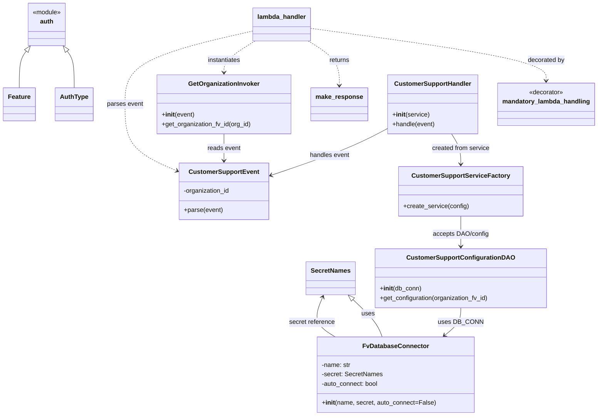

# Diagram: common/support_service/support_service/lambdas/customer_support_ticket.py


> Auto-generated by Obscura crawlers

## Diagram 1



### SVG

<svg id="container" width="1493.625" xmlns="http://www.w3.org/2000/svg" class="classDiagram" height="1056" viewBox="0 0 1493.625 1056" role="graphics-document document" aria-roledescription="class"><style>#container{font-family:"trebuchet ms",verdana,arial,sans-serif;font-size:16px;fill:#333;}@keyframes edge-animation-frame{from{stroke-dashoffset:0;}}@keyframes dash{to{stroke-dashoffset:0;}}#container .edge-animation-slow{stroke-dasharray:9,5!important;stroke-dashoffset:900;animation:dash 50s linear infinite;stroke-linecap:round;}#container .edge-animation-fast{stroke-dasharray:9,5!important;stroke-dashoffset:900;animation:dash 20s linear infinite;stroke-linecap:round;}#container .error-icon{fill:#552222;}#container .error-text{fill:#552222;stroke:#552222;}#container .edge-thickness-normal{stroke-width:1px;}#container .edge-thickness-thick{stroke-width:3.5px;}#container .edge-pattern-solid{stroke-dasharray:0;}#container .edge-thickness-invisible{stroke-width:0;fill:none;}#container .edge-pattern-dashed{stroke-dasharray:3;}#container .edge-pattern-dotted{stroke-dasharray:2;}#container .marker{fill:#333333;stroke:#333333;}#container .marker.cross{stroke:#333333;}#container svg{font-family:"trebuchet ms",verdana,arial,sans-serif;font-size:16px;}#container p{margin:0;}#container g.classGroup text{fill:#9370DB;stroke:none;font-family:"trebuchet ms",verdana,arial,sans-serif;font-size:10px;}#container g.classGroup text .title{font-weight:bolder;}#container .nodeLabel,#container .edgeLabel{color:#131300;}#container .edgeLabel .label rect{fill:#ECECFF;}#container .label text{fill:#131300;}#container .labelBkg{background:#ECECFF;}#container .edgeLabel .label span{background:#ECECFF;}#container .classTitle{font-weight:bolder;}#container .node rect,#container .node circle,#container .node ellipse,#container .node polygon,#container .node path{fill:#ECECFF;stroke:#9370DB;stroke-width:1px;}#container .divider{stroke:#9370DB;stroke-width:1;}#container g.clickable{cursor:pointer;}#container g.classGroup rect{fill:#ECECFF;stroke:#9370DB;}#container g.classGroup line{stroke:#9370DB;stroke-width:1;}#container .classLabel .box{stroke:none;stroke-width:0;fill:#ECECFF;opacity:0.5;}#container .classLabel .label{fill:#9370DB;font-size:10px;}#container .relation{stroke:#333333;stroke-width:1;fill:none;}#container .dashed-line{stroke-dasharray:3;}#container .dotted-line{stroke-dasharray:1 2;}#container #compositionStart,#container .composition{fill:#333333!important;stroke:#333333!important;stroke-width:1;}#container #compositionEnd,#container .composition{fill:#333333!important;stroke:#333333!important;stroke-width:1;}#container #dependencyStart,#container .dependency{fill:#333333!important;stroke:#333333!important;stroke-width:1;}#container #dependencyStart,#container .dependency{fill:#333333!important;stroke:#333333!important;stroke-width:1;}#container #extensionStart,#container .extension{fill:transparent!important;stroke:#333333!important;stroke-width:1;}#container #extensionEnd,#container .extension{fill:transparent!important;stroke:#333333!important;stroke-width:1;}#container #aggregationStart,#container .aggregation{fill:transparent!important;stroke:#333333!important;stroke-width:1;}#container #aggregationEnd,#container .aggregation{fill:transparent!important;stroke:#333333!important;stroke-width:1;}#container #lollipopStart,#container .lollipop{fill:#ECECFF!important;stroke:#333333!important;stroke-width:1;}#container #lollipopEnd,#container .lollipop{fill:#ECECFF!important;stroke:#333333!important;stroke-width:1;}#container .edgeTerminals{font-size:11px;line-height:initial;}#container .classTitleText{text-anchor:middle;font-size:18px;fill:#333;}#container .label-icon{display:inline-block;height:1em;overflow:visible;vertical-align:-0.125em;}#container .node .label-icon path{fill:currentColor;stroke:revert;stroke-width:revert;}#container :root{--mermaid-font-family:"trebuchet ms",verdana,arial,sans-serif;}</style><g><defs><marker id="container_class-aggregationStart" class="marker aggregation class" refX="18" refY="7" markerWidth="190" markerHeight="240" orient="auto"><path d="M 18,7 L9,13 L1,7 L9,1 Z"></path></marker></defs><defs><marker id="container_class-aggregationEnd" class="marker aggregation class" refX="1" refY="7" markerWidth="20" markerHeight="28" orient="auto"><path d="M 18,7 L9,13 L1,7 L9,1 Z"></path></marker></defs><defs><marker id="container_class-extensionStart" class="marker extension class" refX="18" refY="7" markerWidth="190" markerHeight="240" orient="auto"><path d="M 1,7 L18,13 V 1 Z"></path></marker></defs><defs><marker id="container_class-extensionEnd" class="marker extension class" refX="1" refY="7" markerWidth="20" markerHeight="28" orient="auto"><path d="M 1,1 V 13 L18,7 Z"></path></marker></defs><defs><marker id="container_class-compositionStart" class="marker composition class" refX="18" refY="7" markerWidth="190" markerHeight="240" orient="auto"><path d="M 18,7 L9,13 L1,7 L9,1 Z"></path></marker></defs><defs><marker id="container_class-compositionEnd" class="marker composition class" refX="1" refY="7" markerWidth="20" markerHeight="28" orient="auto"><path d="M 18,7 L9,13 L1,7 L9,1 Z"></path></marker></defs><defs><marker id="container_class-dependencyStart" class="marker dependency class" refX="6" refY="7" markerWidth="190" markerHeight="240" orient="auto"><path d="M 5,7 L9,13 L1,7 L9,1 Z"></path></marker></defs><defs><marker id="container_class-dependencyEnd" class="marker dependency class" refX="13" refY="7" markerWidth="20" markerHeight="28" orient="auto"><path d="M 18,7 L9,13 L14,7 L9,1 Z"></path></marker></defs><defs><marker id="container_class-lollipopStart" class="marker lollipop class" refX="13" refY="7" markerWidth="190" markerHeight="240" orient="auto"><circle stroke="black" fill="transparent" cx="7" cy="7" r="6"></circle></marker></defs><defs><marker id="container_class-lollipopEnd" class="marker lollipop class" refX="1" refY="7" markerWidth="190" markerHeight="240" orient="auto"><circle stroke="black" fill="transparent" cx="7" cy="7" r="6"></circle></marker></defs><g class="root"><g class="clusters"></g><g class="edgePaths"><path d="M886.897,760.867L897.118,770.556C907.339,780.245,927.781,799.622,940.079,815.478C952.376,831.333,956.53,843.667,958.607,849.833L960.684,856" id="id_SecretNames_FvDatabaseConnector_1" class="edge-thickness-normal edge-pattern-solid relation" style=";;;" data-edge="true" data-et="edge" data-id="id_SecretNames_FvDatabaseConnector_1" data-points="W3sieCI6ODc0LjM3NzQ0MTQwNjI1LCJ5Ijo3NDl9LHsieCI6OTQ4LjIyMjY1NjI1LCJ5Ijo4MTl9LHsieCI6OTYwLjY4Mzg1ODA4MjcwNjgsInkiOjg1Nn1d" marker-start="url(#container_class-extensionStart)"></path><path d="M165.843,129.828L168.724,133.69C171.604,137.552,177.364,145.276,180.245,160.805C183.125,176.333,183.125,199.667,183.125,211.333L183.125,223" id="id_auth_AuthType_2" class="edge-thickness-normal edge-pattern-solid relation" style=";;;" data-edge="true" data-et="edge" data-id="id_auth_AuthType_2" data-points="W3sieCI6MTU1LjUzMDY0OTAzODQ2MTU1LCJ5IjoxMTZ9LHsieCI6MTgzLjEyNSwieSI6MTUzfSx7IngiOjE4My4xMjUsInkiOjIyM31d" marker-start="url(#container_class-extensionStart)"></path><path d="M64.672,129.828L61.792,133.69C58.912,137.552,53.151,145.276,50.271,160.805C47.391,176.333,47.391,199.667,47.391,211.333L47.391,223" id="id_auth_Feature_3" class="edge-thickness-normal edge-pattern-solid relation" style=";;;" data-edge="true" data-et="edge" data-id="id_auth_Feature_3" data-points="W3sieCI6NzQuOTg0OTc1OTYxNTM4NDUsInkiOjExNn0seyJ4Ijo0Ny4zOTA2MjUsInkiOjE1M30seyJ4Ijo0Ny4zOTA2MjUsInkiOjIyM31d" marker-start="url(#container_class-extensionStart)"></path><path d="M841.217,856L831.466,849.833C821.715,843.667,802.213,831.333,797.006,814.421C791.799,797.509,800.886,776.018,805.43,765.272L809.974,754.526" id="id_FvDatabaseConnector_SecretNames_4" class="edge-thickness-normal edge-pattern-solid relation" style=";;;" data-edge="true" data-et="edge" data-id="id_FvDatabaseConnector_SecretNames_4" data-points="W3sieCI6ODQxLjIxNjc1MjgxOTU0ODksInkiOjg1Nn0seyJ4Ijo3ODIuNzEwOTM3NSwieSI6ODE5fSx7IngiOjgxMi4zMTA1NDY4NzUsInkiOjc0OX1d" marker-end="url(#container_class-dependencyEnd)"></path><path d="M777.963,71.921L876.002,85.434C974.04,98.947,1170.118,125.974,1268.157,148.153C1366.195,170.333,1366.195,187.667,1366.195,196.333L1366.195,205" id="id_lambda_handler_mandatory_lambda_handling_5" class="edge-thickness-normal edge-pattern-dashed relation" style=";;;" data-edge="true" data-et="edge" data-id="id_lambda_handler_mandatory_lambda_handling_5" data-points="W3sieCI6Nzc3Ljk2Mjg5MDYyNSwieSI6NzEuOTIwODk5ODA5Nzc4NX0seyJ4IjoxMzY2LjE5NTMxMjUsInkiOjE1M30seyJ4IjoxMzY2LjE5NTMxMjUsInkiOjIxMX1d" marker-end="url(#container_class-dependencyEnd)"></path><path d="M772.717,104L785.693,112.167C798.668,120.333,824.619,136.667,837.595,155.5C850.57,174.333,850.57,195.667,850.57,206.333L850.57,217" id="id_lambda_handler_make_response_6" class="edge-thickness-normal edge-pattern-dashed relation" style=";;;" data-edge="true" data-et="edge" data-id="id_lambda_handler_make_response_6" data-points="W3sieCI6NzcyLjcxNzM5NzgzNjUzODUsInkiOjEwNH0seyJ4Ijo4NTAuNTcwMzEyNSwieSI6MTUzfSx7IngiOjg1MC41NzAzMTI1LCJ5IjoyMjN9XQ==" marker-end="url(#container_class-dependencyEnd)"></path><path d="M639.255,104L626.28,112.167C613.304,120.333,587.353,136.667,574.378,150C561.402,163.333,561.402,173.667,561.402,178.833L561.402,184" id="id_lambda_handler_GetOrganizationInvoker_7" class="edge-thickness-normal edge-pattern-dashed relation" style=";;;" data-edge="true" data-et="edge" data-id="id_lambda_handler_GetOrganizationInvoker_7" data-points="W3sieCI6NjM5LjI1NTI1ODQxMzQ2MTUsInkiOjEwNH0seyJ4Ijo1NjEuNDAyMzQzNzUsInkiOjE1M30seyJ4Ijo1NjEuNDAyMzQzNzUsInkiOjE5MH1d" marker-end="url(#container_class-dependencyEnd)"></path><path d="M561.402,340L561.402,346.167C561.402,352.333,561.402,364.667,561.402,376C561.402,387.333,561.402,397.667,561.402,402.833L561.402,408" id="id_GetOrganizationInvoker_CustomerSupportEvent_8" class="edge-thickness-normal edge-pattern-solid relation" style=";;;" data-edge="true" data-et="edge" data-id="id_GetOrganizationInvoker_CustomerSupportEvent_8" data-points="W3sieCI6NTYxLjQwMjM0Mzc1LCJ5IjozNDB9LHsieCI6NTYxLjQwMjM0Mzc1LCJ5IjozNzd9LHsieCI6NTYxLjQwMjM0Mzc1LCJ5Ijo0MTR9XQ==" marker-end="url(#container_class-dependencyEnd)"></path><path d="M634.01,78.565L580.106,90.971C526.202,103.377,418.394,128.188,364.49,159.261C310.586,190.333,310.586,227.667,310.586,265C310.586,302.333,310.586,339.667,332.472,367.844C354.357,396.022,398.128,415.044,420.014,424.555L441.9,434.066" id="id_lambda_handler_CustomerSupportEvent_9" class="edge-thickness-normal edge-pattern-dashed relation" style=";;;" data-edge="true" data-et="edge" data-id="id_lambda_handler_CustomerSupportEvent_9" data-points="W3sieCI6NjM0LjAwOTc2NTYyNSwieSI6NzguNTY1MTUxMDI4Njc0NDV9LHsieCI6MzEwLjU4NTkzNzUsInkiOjE1M30seyJ4IjozMTAuNTg1OTM3NSwieSI6MjY1fSx7IngiOjMxMC41ODU5Mzc1LCJ5IjozNzd9LHsieCI6NDQ3LjQwMjM0Mzc1LCJ5Ijo0MzYuNDU3Nzg2MjkxNjQxMzZ9XQ==" marker-end="url(#container_class-dependencyEnd)"></path><path d="M1155.961,782L1155.961,788.167C1155.961,794.333,1155.961,806.667,1149.181,818.368C1142.4,830.069,1128.839,841.137,1122.059,846.672L1115.278,852.206" id="id_CustomerSupportConfigurationDAO_FvDatabaseConnector_10" class="edge-thickness-normal edge-pattern-solid relation" style=";;;" data-edge="true" data-et="edge" data-id="id_CustomerSupportConfigurationDAO_FvDatabaseConnector_10" data-points="W3sieCI6MTE1NS45NjA5Mzc1LCJ5Ijo3ODJ9LHsieCI6MTE1NS45NjA5Mzc1LCJ5Ijo4MTl9LHsieCI6MTExMC42MzAyODY2NTQxMzUzLCJ5Ijo4NTZ9XQ==" marker-end="url(#container_class-dependencyEnd)"></path><path d="M1155.961,549L1155.961,556.667C1155.961,564.333,1155.961,579.667,1155.961,592.5C1155.961,605.333,1155.961,615.667,1155.961,620.833L1155.961,626" id="id_CustomerSupportServiceFactory_CustomerSupportConfigurationDAO_11" class="edge-thickness-normal edge-pattern-solid relation" style=";;;" data-edge="true" data-et="edge" data-id="id_CustomerSupportServiceFactory_CustomerSupportConfigurationDAO_11" data-points="W3sieCI6MTE1NS45NjA5Mzc1LCJ5Ijo1NDl9LHsieCI6MTE1NS45NjA5Mzc1LCJ5Ijo1OTV9LHsieCI6MTE1NS45NjA5Mzc1LCJ5Ijo2MzJ9XQ==" marker-end="url(#container_class-dependencyEnd)"></path><path d="M1131.991,340L1135.986,346.167C1139.981,352.333,1147.971,364.667,1151.966,377.5C1155.961,390.333,1155.961,403.667,1155.961,410.333L1155.961,417" id="id_CustomerSupportHandler_CustomerSupportServiceFactory_12" class="edge-thickness-normal edge-pattern-solid relation" style=";;;" data-edge="true" data-et="edge" data-id="id_CustomerSupportHandler_CustomerSupportServiceFactory_12" data-points="W3sieCI6MTEzMS45OTA2ODc3NzkwMTgsInkiOjM0MH0seyJ4IjoxMTU1Ljk2MDkzNzUsInkiOjM3N30seyJ4IjoxMTU1Ljk2MDkzNzUsInkiOjQyM31d" marker-end="url(#container_class-dependencyEnd)"></path><path d="M970.039,327.161L954.891,335.468C939.742,343.774,909.445,360.387,861.285,380.018C813.125,399.649,747.101,422.298,714.089,433.622L681.078,444.946" id="id_CustomerSupportHandler_CustomerSupportEvent_13" class="edge-thickness-normal edge-pattern-solid relation" style=";;;" data-edge="true" data-et="edge" data-id="id_CustomerSupportHandler_CustomerSupportEvent_13" data-points="W3sieCI6OTcwLjAzOTA2MjUsInkiOjMyNy4xNjEyOTU4NzQ4NDk0fSx7IngiOjg3OS4xNDg0Mzc1LCJ5IjozNzd9LHsieCI6Njc1LjQwMjM0Mzc1LCJ5Ijo0NDYuODkzMzAzNjY0NzI4MzZ9XQ==" marker-end="url(#container_class-dependencyEnd)"></path></g><g class="edgeLabels"><g class="edgeLabel" transform="translate(925.46742, 797.42966)"><g class="label" data-id="id_SecretNames_FvDatabaseConnector_1" transform="translate(-16.4921875, -12)"><foreignObject width="32.984375" height="24"><div xmlns="http://www.w3.org/1999/xhtml" class="labelBkg" style="display: table-cell; white-space: nowrap; line-height: 1.5; max-width: 200px; text-align: center;"><span class="edgeLabel"><p>uses</p></span></div></foreignObject></g></g><g class="edgeLabel"><g class="label" data-id="id_auth_AuthType_2" transform="translate(0, 0)"><foreignObject width="0" height="0"><div xmlns="http://www.w3.org/1999/xhtml" class="labelBkg" style="display: table-cell; white-space: nowrap; line-height: 1.5; max-width: 200px; text-align: center;"><span class="edgeLabel"></span></div></foreignObject></g></g><g class="edgeLabel"><g class="label" data-id="id_auth_Feature_3" transform="translate(0, 0)"><foreignObject width="0" height="0"><div xmlns="http://www.w3.org/1999/xhtml" class="labelBkg" style="display: table-cell; white-space: nowrap; line-height: 1.5; max-width: 200px; text-align: center;"><span class="edgeLabel"></span></div></foreignObject></g></g><g class="edgeLabel" transform="translate(784.03066, 815.87899)"><g class="label" data-id="id_FvDatabaseConnector_SecretNames_4" transform="translate(-58.2265625, -12)"><foreignObject width="116.453125" height="24"><div xmlns="http://www.w3.org/1999/xhtml" class="labelBkg" style="display: table-cell; white-space: nowrap; line-height: 1.5; max-width: 200px; text-align: center;"><span class="edgeLabel"><p>secret reference</p></span></div></foreignObject></g></g><g class="edgeLabel" transform="translate(1366.1953125, 153)"><g class="label" data-id="id_lambda_handler_mandatory_lambda_handling_5" transform="translate(-47.328125, -12)"><foreignObject width="94.65625" height="24"><div xmlns="http://www.w3.org/1999/xhtml" class="labelBkg" style="display: table-cell; white-space: nowrap; line-height: 1.5; max-width: 200px; text-align: center;"><span class="edgeLabel"><p>decorated by</p></span></div></foreignObject></g></g><g class="edgeLabel" transform="translate(850.5703125, 153)"><g class="label" data-id="id_lambda_handler_make_response_6" transform="translate(-26.265625, -12)"><foreignObject width="52.53125" height="24"><div xmlns="http://www.w3.org/1999/xhtml" class="labelBkg" style="display: table-cell; white-space: nowrap; line-height: 1.5; max-width: 200px; text-align: center;"><span class="edgeLabel"><p>returns</p></span></div></foreignObject></g></g><g class="edgeLabel" transform="translate(561.40234375, 153)"><g class="label" data-id="id_lambda_handler_GetOrganizationInvoker_7" transform="translate(-42.9140625, -12)"><foreignObject width="85.828125" height="24"><div xmlns="http://www.w3.org/1999/xhtml" class="labelBkg" style="display: table-cell; white-space: nowrap; line-height: 1.5; max-width: 200px; text-align: center;"><span class="edgeLabel"><p>instantiates</p></span></div></foreignObject></g></g><g class="edgeLabel" transform="translate(561.40234375, 377)"><g class="label" data-id="id_GetOrganizationInvoker_CustomerSupportEvent_8" transform="translate(-42.2890625, -12)"><foreignObject width="84.578125" height="24"><div xmlns="http://www.w3.org/1999/xhtml" class="labelBkg" style="display: table-cell; white-space: nowrap; line-height: 1.5; max-width: 200px; text-align: center;"><span class="edgeLabel"><p>reads event</p></span></div></foreignObject></g></g><g class="edgeLabel" transform="translate(310.5859375, 265)"><g class="label" data-id="id_lambda_handler_CustomerSupportEvent_9" transform="translate(-46.1171875, -12)"><foreignObject width="92.234375" height="24"><div xmlns="http://www.w3.org/1999/xhtml" class="labelBkg" style="display: table-cell; white-space: nowrap; line-height: 1.5; max-width: 200px; text-align: center;"><span class="edgeLabel"><p>parses event</p></span></div></foreignObject></g></g><g class="edgeLabel" transform="translate(1155.9609375, 819)"><g class="label" data-id="id_CustomerSupportConfigurationDAO_FvDatabaseConnector_10" transform="translate(-53.09375, -12)"><foreignObject width="106.1875" height="24"><div xmlns="http://www.w3.org/1999/xhtml" class="labelBkg" style="display: table-cell; white-space: nowrap; line-height: 1.5; max-width: 200px; text-align: center;"><span class="edgeLabel"><p>uses DB_CONN</p></span></div></foreignObject></g></g><g class="edgeLabel" transform="translate(1155.9609375, 595)"><g class="label" data-id="id_CustomerSupportServiceFactory_CustomerSupportConfigurationDAO_11" transform="translate(-70.1953125, -12)"><foreignObject width="140.390625" height="24"><div xmlns="http://www.w3.org/1999/xhtml" class="labelBkg" style="display: table-cell; white-space: nowrap; line-height: 1.5; max-width: 200px; text-align: center;"><span class="edgeLabel"><p>accepts DAO/config</p></span></div></foreignObject></g></g><g class="edgeLabel" transform="translate(1155.9609375, 377)"><g class="label" data-id="id_CustomerSupportHandler_CustomerSupportServiceFactory_12" transform="translate(-73.9140625, -12)"><foreignObject width="147.828125" height="24"><div xmlns="http://www.w3.org/1999/xhtml" class="labelBkg" style="display: table-cell; white-space: nowrap; line-height: 1.5; max-width: 200px; text-align: center;"><span class="edgeLabel"><p>created from service</p></span></div></foreignObject></g></g><g class="edgeLabel" transform="translate(826.3001, 395.12916)"><g class="label" data-id="id_CustomerSupportHandler_CustomerSupportEvent_13" transform="translate(-51.203125, -12)"><foreignObject width="102.40625" height="24"><div xmlns="http://www.w3.org/1999/xhtml" class="labelBkg" style="display: table-cell; white-space: nowrap; line-height: 1.5; max-width: 200px; text-align: center;"><span class="edgeLabel"><p>handles event</p></span></div></foreignObject></g></g></g><g class="nodes"><g class="node default" id="classId-SecretNames-0" transform="translate(830.0703125, 707)"><g class="basic label-container"><path d="M-60.03125 -42 L60.03125 -42 L60.03125 42 L-60.03125 42" stroke="none" stroke-width="0" fill="#ECECFF" style=""></path><path d="M-60.03125 -42 C-27.36385340298741 -42, 5.303543194025181 -42, 60.03125 -42 M-60.03125 -42 C-14.53113977411428 -42, 30.96897045177144 -42, 60.03125 -42 M60.03125 -42 C60.03125 -14.535006849392751, 60.03125 12.929986301214498, 60.03125 42 M60.03125 -42 C60.03125 -13.3999377977932, 60.03125 15.2001244044136, 60.03125 42 M60.03125 42 C12.326440188969592 42, -35.378369622060816 42, -60.03125 42 M60.03125 42 C14.267145900319662 42, -31.496958199360677 42, -60.03125 42 M-60.03125 42 C-60.03125 20.51613476696022, -60.03125 -0.9677304660795585, -60.03125 -42 M-60.03125 42 C-60.03125 12.374771290592449, -60.03125 -17.250457418815103, -60.03125 -42" stroke="#9370DB" stroke-width="1.3" fill="none" stroke-dasharray="0 0" style=""></path></g><g class="annotation-group text" transform="translate(0, -18)"></g><g class="label-group text" transform="translate(-48.03125, -18)"><g class="label" style="font-weight: bolder" transform="translate(0,-12)"><foreignObject width="96.0625" height="24"><div xmlns="http://www.w3.org/1999/xhtml" style="display: table-cell; white-space: nowrap; line-height: 1.5; max-width: 145px; text-align: center;"><span class="nodeLabel markdown-node-label" style=""><p>SecretNames</p></span></div></foreignObject></g></g><g class="members-group text" transform="translate(-48.03125, 30)"></g><g class="methods-group text" transform="translate(-48.03125, 60)"></g><g class="divider" style=""><path d="M-60.03125 6 C-18.294181943075316 6, 23.44288611384937 6, 60.03125 6 M-60.03125 6 C-32.58025693264059 6, -5.129263865281175 6, 60.03125 6" stroke="#9370DB" stroke-width="1.3" fill="none" stroke-dasharray="0 0" style=""></path></g><g class="divider" style=""><path d="M-60.03125 24 C-19.76276767751012 24, 20.50571464497976 24, 60.03125 24 M-60.03125 24 C-16.397815252227467 24, 27.235619495545066 24, 60.03125 24" stroke="#9370DB" stroke-width="1.3" fill="none" stroke-dasharray="0 0" style=""></path></g></g><g class="node default" id="classId-FvDatabaseConnector-1" transform="translate(993.015625, 952)"><g class="basic label-container"><path d="M-194.58984375 -96 L194.58984375 -96 L194.58984375 96 L-194.58984375 96" stroke="none" stroke-width="0" fill="#ECECFF" style=""></path><path d="M-194.58984375 -96 C-96.17782410779421 -96, 2.234195534411583 -96, 194.58984375 -96 M-194.58984375 -96 C-40.93636073691019 -96, 112.71712227617962 -96, 194.58984375 -96 M194.58984375 -96 C194.58984375 -37.246018265692136, 194.58984375 21.507963468615728, 194.58984375 96 M194.58984375 -96 C194.58984375 -24.7421969972809, 194.58984375 46.5156060054382, 194.58984375 96 M194.58984375 96 C95.7492457656608 96, -3.091352218678395 96, -194.58984375 96 M194.58984375 96 C69.62676759938573 96, -55.33630855122854 96, -194.58984375 96 M-194.58984375 96 C-194.58984375 46.19499098662084, -194.58984375 -3.6100180267583255, -194.58984375 -96 M-194.58984375 96 C-194.58984375 57.43096186083859, -194.58984375 18.861923721677186, -194.58984375 -96" stroke="#9370DB" stroke-width="1.3" fill="none" stroke-dasharray="0 0" style=""></path></g><g class="annotation-group text" transform="translate(0, -72)"></g><g class="label-group text" transform="translate(-79.3046875, -72)"><g class="label" style="font-weight: bolder" transform="translate(0,-12)"><foreignObject width="158.609375" height="24"><div xmlns="http://www.w3.org/1999/xhtml" style="display: table-cell; white-space: nowrap; line-height: 1.5; max-width: 207px; text-align: center;"><span class="nodeLabel markdown-node-label" style=""><p>FvDatabaseConnector</p></span></div></foreignObject></g></g><g class="members-group text" transform="translate(-182.58984375, -24)"><g class="label" style="" transform="translate(0,-12)"><foreignObject width="74.46875" height="24"><div xmlns="http://www.w3.org/1999/xhtml" style="display: table-cell; white-space: nowrap; line-height: 1.5; max-width: 133px; text-align: center;"><span class="nodeLabel markdown-node-label" style=""><p>-name: str</p></span></div></foreignObject></g><g class="label" style="" transform="translate(0,12)"><foreignObject width="153.453125" height="24"><div xmlns="http://www.w3.org/1999/xhtml" style="display: table-cell; white-space: nowrap; line-height: 1.5; max-width: 211px; text-align: center;"><span class="nodeLabel markdown-node-label" style=""><p>-secret: SecretNames</p></span></div></foreignObject></g><g class="label" style="" transform="translate(0,36)"><foreignObject width="145.390625" height="24"><div xmlns="http://www.w3.org/1999/xhtml" style="display: table-cell; white-space: nowrap; line-height: 1.5; max-width: 203px; text-align: center;"><span class="nodeLabel markdown-node-label" style=""><p>-auto_connect: bool</p></span></div></foreignObject></g></g><g class="methods-group text" transform="translate(-182.58984375, 72)"><g class="label" style="" transform="translate(0,-12)"><foreignObject width="285.875" height="24"><div xmlns="http://www.w3.org/1999/xhtml" style="display: table-cell; white-space: nowrap; line-height: 1.5; max-width: 375px; text-align: center;"><span class="nodeLabel markdown-node-label" style=""><p>+<strong>init</strong>(name, secret, auto_connect=False)</p></span></div></foreignObject></g></g><g class="divider" style=""><path d="M-194.58984375 -48 C-72.57769360173694 -48, 49.43445654652612 -48, 194.58984375 -48 M-194.58984375 -48 C-63.633578352266426 -48, 67.32268704546715 -48, 194.58984375 -48" stroke="#9370DB" stroke-width="1.3" fill="none" stroke-dasharray="0 0" style=""></path></g><g class="divider" style=""><path d="M-194.58984375 48 C-70.16680813525915 48, 54.25622747948171 48, 194.58984375 48 M-194.58984375 48 C-77.45995871855429 48, 39.66992631289142 48, 194.58984375 48" stroke="#9370DB" stroke-width="1.3" fill="none" stroke-dasharray="0 0" style=""></path></g></g><g class="node default" id="classId-auth-2" transform="translate(115.2578125, 62)"><g class="basic label-container"><path d="M-48.6015625 -54 L48.6015625 -54 L48.6015625 54 L-48.6015625 54" stroke="none" stroke-width="0" fill="#ECECFF" style=""></path><path d="M-48.6015625 -54 C-13.059682203412493 -54, 22.482198093175015 -54, 48.6015625 -54 M-48.6015625 -54 C-10.691249782010388 -54, 27.219062935979224 -54, 48.6015625 -54 M48.6015625 -54 C48.6015625 -20.188845186950516, 48.6015625 13.622309626098968, 48.6015625 54 M48.6015625 -54 C48.6015625 -27.19042510400445, 48.6015625 -0.38085020800890135, 48.6015625 54 M48.6015625 54 C26.91988153816095 54, 5.238200576321901 54, -48.6015625 54 M48.6015625 54 C19.928602315366632 54, -8.744357869266736 54, -48.6015625 54 M-48.6015625 54 C-48.6015625 13.160043731640698, -48.6015625 -27.679912536718604, -48.6015625 -54 M-48.6015625 54 C-48.6015625 27.062199858048867, -48.6015625 0.12439971609773437, -48.6015625 -54" stroke="#9370DB" stroke-width="1.3" fill="none" stroke-dasharray="0 0" style=""></path></g><g class="annotation-group text" transform="translate(-36.6015625, -30)"><g class="label" style="" transform="translate(0,-12)"><foreignObject width="73.203125" height="24"><div xmlns="http://www.w3.org/1999/xhtml" style="display: table-cell; white-space: nowrap; line-height: 1.5; max-width: 123px; text-align: center;"><span class="nodeLabel markdown-node-label" style=""><p>«module»</p></span></div></foreignObject></g></g><g class="label-group text" transform="translate(-16.6640625, -6)"><g class="label" style="font-weight: bolder" transform="translate(0,-12)"><foreignObject width="33.328125" height="24"><div xmlns="http://www.w3.org/1999/xhtml" style="display: table-cell; white-space: nowrap; line-height: 1.5; max-width: 83px; text-align: center;"><span class="nodeLabel markdown-node-label" style=""><p>auth</p></span></div></foreignObject></g></g><g class="members-group text" transform="translate(-36.6015625, 42)"></g><g class="methods-group text" transform="translate(-36.6015625, 72)"></g><g class="divider" style=""><path d="M-48.6015625 18 C-27.373141489008216 18, -6.144720478016431 18, 48.6015625 18 M-48.6015625 18 C-23.25059535910244 18, 2.1003717817951184 18, 48.6015625 18" stroke="#9370DB" stroke-width="1.3" fill="none" stroke-dasharray="0 0" style=""></path></g><g class="divider" style=""><path d="M-48.6015625 36 C-26.289282425075463 36, -3.9770023501509257 36, 48.6015625 36 M-48.6015625 36 C-24.778442782809435 36, -0.9553230656188703 36, 48.6015625 36" stroke="#9370DB" stroke-width="1.3" fill="none" stroke-dasharray="0 0" style=""></path></g></g><g class="node default" id="classId-AuthType-3" transform="translate(183.125, 265)"><g class="basic label-container"><path d="M-46.34375 -42 L46.34375 -42 L46.34375 42 L-46.34375 42" stroke="none" stroke-width="0" fill="#ECECFF" style=""></path><path d="M-46.34375 -42 C-16.44701507366536 -42, 13.449719852669283 -42, 46.34375 -42 M-46.34375 -42 C-22.23506668833124 -42, 1.8736166233375187 -42, 46.34375 -42 M46.34375 -42 C46.34375 -24.462641877492597, 46.34375 -6.925283754985195, 46.34375 42 M46.34375 -42 C46.34375 -11.226588622923153, 46.34375 19.546822754153695, 46.34375 42 M46.34375 42 C13.95665761468517 42, -18.43043477062966 42, -46.34375 42 M46.34375 42 C14.299940900495095 42, -17.74386819900981 42, -46.34375 42 M-46.34375 42 C-46.34375 19.939964942855703, -46.34375 -2.1200701142885947, -46.34375 -42 M-46.34375 42 C-46.34375 21.785451190050864, -46.34375 1.5709023801017281, -46.34375 -42" stroke="#9370DB" stroke-width="1.3" fill="none" stroke-dasharray="0 0" style=""></path></g><g class="annotation-group text" transform="translate(0, -18)"></g><g class="label-group text" transform="translate(-34.34375, -18)"><g class="label" style="font-weight: bolder" transform="translate(0,-12)"><foreignObject width="68.6875" height="24"><div xmlns="http://www.w3.org/1999/xhtml" style="display: table-cell; white-space: nowrap; line-height: 1.5; max-width: 117px; text-align: center;"><span class="nodeLabel markdown-node-label" style=""><p>AuthType</p></span></div></foreignObject></g></g><g class="members-group text" transform="translate(-34.34375, 30)"></g><g class="methods-group text" transform="translate(-34.34375, 60)"></g><g class="divider" style=""><path d="M-46.34375 6 C-15.45701847676214 6, 15.429713046475719 6, 46.34375 6 M-46.34375 6 C-11.505180466954357 6, 23.333389066091286 6, 46.34375 6" stroke="#9370DB" stroke-width="1.3" fill="none" stroke-dasharray="0 0" style=""></path></g><g class="divider" style=""><path d="M-46.34375 24 C-25.05824135941238 24, -3.772732718824763 24, 46.34375 24 M-46.34375 24 C-10.956644219018088 24, 24.430461561963824 24, 46.34375 24" stroke="#9370DB" stroke-width="1.3" fill="none" stroke-dasharray="0 0" style=""></path></g></g><g class="node default" id="classId-Feature-4" transform="translate(47.390625, 265)"><g class="basic label-container"><path d="M-39.390625 -42 L39.390625 -42 L39.390625 42 L-39.390625 42" stroke="none" stroke-width="0" fill="#ECECFF" style=""></path><path d="M-39.390625 -42 C-21.5532806346538 -42, -3.7159362693075977 -42, 39.390625 -42 M-39.390625 -42 C-8.0959491387168 -42, 23.1987267225664 -42, 39.390625 -42 M39.390625 -42 C39.390625 -15.395742439335905, 39.390625 11.20851512132819, 39.390625 42 M39.390625 -42 C39.390625 -19.494634460086647, 39.390625 3.010731079826705, 39.390625 42 M39.390625 42 C17.822180141066198 42, -3.7462647178676036 42, -39.390625 42 M39.390625 42 C21.40781273610409 42, 3.4250004722081826 42, -39.390625 42 M-39.390625 42 C-39.390625 8.468732681944047, -39.390625 -25.062534636111906, -39.390625 -42 M-39.390625 42 C-39.390625 13.160563908850868, -39.390625 -15.678872182298264, -39.390625 -42" stroke="#9370DB" stroke-width="1.3" fill="none" stroke-dasharray="0 0" style=""></path></g><g class="annotation-group text" transform="translate(0, -18)"></g><g class="label-group text" transform="translate(-27.390625, -18)"><g class="label" style="font-weight: bolder" transform="translate(0,-12)"><foreignObject width="54.78125" height="24"><div xmlns="http://www.w3.org/1999/xhtml" style="display: table-cell; white-space: nowrap; line-height: 1.5; max-width: 104px; text-align: center;"><span class="nodeLabel markdown-node-label" style=""><p>Feature</p></span></div></foreignObject></g></g><g class="members-group text" transform="translate(-27.390625, 30)"></g><g class="methods-group text" transform="translate(-27.390625, 60)"></g><g class="divider" style=""><path d="M-39.390625 6 C-15.288133960058069 6, 8.814357079883862 6, 39.390625 6 M-39.390625 6 C-12.354888865245744 6, 14.680847269508511 6, 39.390625 6" stroke="#9370DB" stroke-width="1.3" fill="none" stroke-dasharray="0 0" style=""></path></g><g class="divider" style=""><path d="M-39.390625 24 C-19.614729729332453 24, 0.16116554133509453 24, 39.390625 24 M-39.390625 24 C-15.116928013922006 24, 9.156768972155987 24, 39.390625 24" stroke="#9370DB" stroke-width="1.3" fill="none" stroke-dasharray="0 0" style=""></path></g></g><g class="node default" id="classId-mandatory_lambda_handling-5" transform="translate(1366.1953125, 265)"><g class="basic label-container"><path d="M-119.4296875 -54 L119.4296875 -54 L119.4296875 54 L-119.4296875 54" stroke="none" stroke-width="0" fill="#ECECFF" style=""></path><path d="M-119.4296875 -54 C-61.93056045209607 -54, -4.431433404192134 -54, 119.4296875 -54 M-119.4296875 -54 C-31.341595668435133 -54, 56.746496163129734 -54, 119.4296875 -54 M119.4296875 -54 C119.4296875 -27.127396923844213, 119.4296875 -0.2547938476884255, 119.4296875 54 M119.4296875 -54 C119.4296875 -25.269648651055885, 119.4296875 3.4607026978882303, 119.4296875 54 M119.4296875 54 C70.39284560763844 54, 21.35600371527687 54, -119.4296875 54 M119.4296875 54 C48.946022558092054 54, -21.537642383815893 54, -119.4296875 54 M-119.4296875 54 C-119.4296875 24.46697219374266, -119.4296875 -5.066055612514681, -119.4296875 -54 M-119.4296875 54 C-119.4296875 23.184622267884407, -119.4296875 -7.630755464231186, -119.4296875 -54" stroke="#9370DB" stroke-width="1.3" fill="none" stroke-dasharray="0 0" style=""></path></g><g class="annotation-group text" transform="translate(-44.0625, -30)"><g class="label" style="" transform="translate(0,-12)"><foreignObject width="88.125" height="24"><div xmlns="http://www.w3.org/1999/xhtml" style="display: table-cell; white-space: nowrap; line-height: 1.5; max-width: 138px; text-align: center;"><span class="nodeLabel markdown-node-label" style=""><p>«decorator»</p></span></div></foreignObject></g></g><g class="label-group text" transform="translate(-107.4296875, -6)"><g class="label" style="font-weight: bolder" transform="translate(0,-12)"><foreignObject width="214.859375" height="24"><div xmlns="http://www.w3.org/1999/xhtml" style="display: table-cell; white-space: nowrap; line-height: 1.5; max-width: 264px; text-align: center;"><span class="nodeLabel markdown-node-label" style=""><p>mandatory_lambda_handling</p></span></div></foreignObject></g></g><g class="members-group text" transform="translate(-107.4296875, 42)"></g><g class="methods-group text" transform="translate(-107.4296875, 72)"></g><g class="divider" style=""><path d="M-119.4296875 18 C-39.018652801171015 18, 41.39238189765797 18, 119.4296875 18 M-119.4296875 18 C-58.696538884766795 18, 2.0366097304664095 18, 119.4296875 18" stroke="#9370DB" stroke-width="1.3" fill="none" stroke-dasharray="0 0" style=""></path></g><g class="divider" style=""><path d="M-119.4296875 36 C-27.064574156457326 36, 65.30053918708535 36, 119.4296875 36 M-119.4296875 36 C-68.78066935669352 36, -18.131651213387045 36, 119.4296875 36" stroke="#9370DB" stroke-width="1.3" fill="none" stroke-dasharray="0 0" style=""></path></g></g><g class="node default" id="classId-make_response-6" transform="translate(850.5703125, 265)"><g class="basic label-container"><path d="M-69.46875 -42 L69.46875 -42 L69.46875 42 L-69.46875 42" stroke="none" stroke-width="0" fill="#ECECFF" style=""></path><path d="M-69.46875 -42 C-25.98471501955587 -42, 17.499319960888258 -42, 69.46875 -42 M-69.46875 -42 C-25.53643472008904 -42, 18.39588055982192 -42, 69.46875 -42 M69.46875 -42 C69.46875 -22.986803727512886, 69.46875 -3.973607455025771, 69.46875 42 M69.46875 -42 C69.46875 -24.576019168345724, 69.46875 -7.152038336691447, 69.46875 42 M69.46875 42 C20.343669673185765 42, -28.78141065362847 42, -69.46875 42 M69.46875 42 C25.508941279410152 42, -18.450867441179696 42, -69.46875 42 M-69.46875 42 C-69.46875 18.796874157671304, -69.46875 -4.406251684657391, -69.46875 -42 M-69.46875 42 C-69.46875 22.179287559641875, -69.46875 2.358575119283749, -69.46875 -42" stroke="#9370DB" stroke-width="1.3" fill="none" stroke-dasharray="0 0" style=""></path></g><g class="annotation-group text" transform="translate(0, -18)"></g><g class="label-group text" transform="translate(-57.46875, -18)"><g class="label" style="font-weight: bolder" transform="translate(0,-12)"><foreignObject width="114.9375" height="24"><div xmlns="http://www.w3.org/1999/xhtml" style="display: table-cell; white-space: nowrap; line-height: 1.5; max-width: 164px; text-align: center;"><span class="nodeLabel markdown-node-label" style=""><p>make_response</p></span></div></foreignObject></g></g><g class="members-group text" transform="translate(-57.46875, 30)"></g><g class="methods-group text" transform="translate(-57.46875, 60)"></g><g class="divider" style=""><path d="M-69.46875 6 C-21.922759472247996 6, 25.623231055504007 6, 69.46875 6 M-69.46875 6 C-23.07648771723334 6, 23.315774565533317 6, 69.46875 6" stroke="#9370DB" stroke-width="1.3" fill="none" stroke-dasharray="0 0" style=""></path></g><g class="divider" style=""><path d="M-69.46875 24 C-19.10457172872735 24, 31.2596065425453 24, 69.46875 24 M-69.46875 24 C-27.376748172069007 24, 14.715253655861986 24, 69.46875 24" stroke="#9370DB" stroke-width="1.3" fill="none" stroke-dasharray="0 0" style=""></path></g></g><g class="node default" id="classId-GetOrganizationInvoker-7" transform="translate(561.40234375, 265)"><g class="basic label-container"><path d="M-169.69921875 -75 L169.69921875 -75 L169.69921875 75 L-169.69921875 75" stroke="none" stroke-width="0" fill="#ECECFF" style=""></path><path d="M-169.69921875 -75 C-52.554594029337025 -75, 64.59003069132595 -75, 169.69921875 -75 M-169.69921875 -75 C-60.75810850276876 -75, 48.18300174446247 -75, 169.69921875 -75 M169.69921875 -75 C169.69921875 -28.2673358994098, 169.69921875 18.465328201180398, 169.69921875 75 M169.69921875 -75 C169.69921875 -34.47000505823095, 169.69921875 6.059989883538094, 169.69921875 75 M169.69921875 75 C64.95005914079275 75, -39.79910046841451 75, -169.69921875 75 M169.69921875 75 C93.93713412507995 75, 18.1750495001599 75, -169.69921875 75 M-169.69921875 75 C-169.69921875 25.206279788124547, -169.69921875 -24.587440423750905, -169.69921875 -75 M-169.69921875 75 C-169.69921875 41.89101851105054, -169.69921875 8.782037022101079, -169.69921875 -75" stroke="#9370DB" stroke-width="1.3" fill="none" stroke-dasharray="0 0" style=""></path></g><g class="annotation-group text" transform="translate(0, -51)"></g><g class="label-group text" transform="translate(-86.9140625, -51)"><g class="label" style="font-weight: bolder" transform="translate(0,-12)"><foreignObject width="173.828125" height="24"><div xmlns="http://www.w3.org/1999/xhtml" style="display: table-cell; white-space: nowrap; line-height: 1.5; max-width: 222px; text-align: center;"><span class="nodeLabel markdown-node-label" style=""><p>GetOrganizationInvoker</p></span></div></foreignObject></g></g><g class="members-group text" transform="translate(-157.69921875, -3)"></g><g class="methods-group text" transform="translate(-157.69921875, 27)"><g class="label" style="" transform="translate(0,-12)"><foreignObject width="83.140625" height="24"><div xmlns="http://www.w3.org/1999/xhtml" style="display: table-cell; white-space: nowrap; line-height: 1.5; max-width: 172px; text-align: center;"><span class="nodeLabel markdown-node-label" style=""><p>+<strong>init</strong>(event)</p></span></div></foreignObject></g><g class="label" style="" transform="translate(0,12)"><foreignObject width="228.484375" height="24"><div xmlns="http://www.w3.org/1999/xhtml" style="display: table-cell; white-space: nowrap; line-height: 1.5; max-width: 286px; text-align: center;"><span class="nodeLabel markdown-node-label" style=""><p>+get_organization_fv_id(org_id)</p></span></div></foreignObject></g></g><g class="divider" style=""><path d="M-169.69921875 -27 C-41.04464165195546 -27, 87.60993544608908 -27, 169.69921875 -27 M-169.69921875 -27 C-96.76520508717073 -27, -23.831191424341455 -27, 169.69921875 -27" stroke="#9370DB" stroke-width="1.3" fill="none" stroke-dasharray="0 0" style=""></path></g><g class="divider" style=""><path d="M-169.69921875 -3 C-72.79928209574204 -3, 24.100654558515913 -3, 169.69921875 -3 M-169.69921875 -3 C-41.8934806574193 -3, 85.9122574351614 -3, 169.69921875 -3" stroke="#9370DB" stroke-width="1.3" fill="none" stroke-dasharray="0 0" style=""></path></g></g><g class="node default" id="classId-CustomerSupportEvent-8" transform="translate(561.40234375, 486)"><g class="basic label-container"><path d="M-114 -72 L114 -72 L114 72 L-114 72" stroke="none" stroke-width="0" fill="#ECECFF" style=""></path><path d="M-114 -72 C-59.38109288251885 -72, -4.7621857650376995 -72, 114 -72 M-114 -72 C-51.86081522946448 -72, 10.278369541071044 -72, 114 -72 M114 -72 C114 -27.79330900462137, 114 16.41338199075726, 114 72 M114 -72 C114 -19.15103201005831, 114 33.69793597988338, 114 72 M114 72 C54.52333814101496 72, -4.953323717970079 72, -114 72 M114 72 C54.87731785900715 72, -4.245364281985701 72, -114 72 M-114 72 C-114 29.062637246137292, -114 -13.874725507725415, -114 -72 M-114 72 C-114 28.36324679436227, -114 -15.273506411275463, -114 -72" stroke="#9370DB" stroke-width="1.3" fill="none" stroke-dasharray="0 0" style=""></path></g><g class="annotation-group text" transform="translate(0, -48)"></g><g class="label-group text" transform="translate(-84.796875, -48)"><g class="label" style="font-weight: bolder" transform="translate(0,-12)"><foreignObject width="169.59375" height="24"><div xmlns="http://www.w3.org/1999/xhtml" style="display: table-cell; white-space: nowrap; line-height: 1.5; max-width: 217px; text-align: center;"><span class="nodeLabel markdown-node-label" style=""><p>CustomerSupportEvent</p></span></div></foreignObject></g></g><g class="members-group text" transform="translate(-102, 0)"><g class="label" style="" transform="translate(0,-12)"><foreignObject width="119.203125" height="24"><div xmlns="http://www.w3.org/1999/xhtml" style="display: table-cell; white-space: nowrap; line-height: 1.5; max-width: 177px; text-align: center;"><span class="nodeLabel markdown-node-label" style=""><p>-organization_id</p></span></div></foreignObject></g></g><g class="methods-group text" transform="translate(-102, 48)"><g class="label" style="" transform="translate(0,-12)"><foreignObject width="98.875" height="24"><div xmlns="http://www.w3.org/1999/xhtml" style="display: table-cell; white-space: nowrap; line-height: 1.5; max-width: 156px; text-align: center;"><span class="nodeLabel markdown-node-label" style=""><p>+parse(event)</p></span></div></foreignObject></g></g><g class="divider" style=""><path d="M-114 -24 C-38.31396125830257 -24, 37.37207748339486 -24, 114 -24 M-114 -24 C-62.60117358520113 -24, -11.202347170402263 -24, 114 -24" stroke="#9370DB" stroke-width="1.3" fill="none" stroke-dasharray="0 0" style=""></path></g><g class="divider" style=""><path d="M-114 24 C-54.56270633772575 24, 4.8745873245485 24, 114 24 M-114 24 C-41.024442148478485 24, 31.95111570304303 24, 114 24" stroke="#9370DB" stroke-width="1.3" fill="none" stroke-dasharray="0 0" style=""></path></g></g><g class="node default" id="classId-CustomerSupportConfigurationDAO-9" transform="translate(1155.9609375, 707)"><g class="basic label-container"><path d="M-215.859375 -75 L215.859375 -75 L215.859375 75 L-215.859375 75" stroke="none" stroke-width="0" fill="#ECECFF" style=""></path><path d="M-215.859375 -75 C-97.75813190953154 -75, 20.343111180936916 -75, 215.859375 -75 M-215.859375 -75 C-48.61936735049511 -75, 118.62064029900978 -75, 215.859375 -75 M215.859375 -75 C215.859375 -44.61446288144467, 215.859375 -14.228925762889347, 215.859375 75 M215.859375 -75 C215.859375 -22.993944469498864, 215.859375 29.012111061002273, 215.859375 75 M215.859375 75 C88.8407783916147 75, -38.17781821677059 75, -215.859375 75 M215.859375 75 C67.00518383452109 75, -81.84900733095782 75, -215.859375 75 M-215.859375 75 C-215.859375 25.234742354933424, -215.859375 -24.530515290133152, -215.859375 -75 M-215.859375 75 C-215.859375 39.21218995661353, -215.859375 3.4243799132270567, -215.859375 -75" stroke="#9370DB" stroke-width="1.3" fill="none" stroke-dasharray="0 0" style=""></path></g><g class="annotation-group text" transform="translate(0, -51)"></g><g class="label-group text" transform="translate(-129.25, -51)"><g class="label" style="font-weight: bolder" transform="translate(0,-12)"><foreignObject width="258.5" height="24"><div xmlns="http://www.w3.org/1999/xhtml" style="display: table-cell; white-space: nowrap; line-height: 1.5; max-width: 305px; text-align: center;"><span class="nodeLabel markdown-node-label" style=""><p>CustomerSupportConfigurationDAO</p></span></div></foreignObject></g></g><g class="members-group text" transform="translate(-203.859375, -3)"></g><g class="methods-group text" transform="translate(-203.859375, 27)"><g class="label" style="" transform="translate(0,-12)"><foreignObject width="104.96875" height="24"><div xmlns="http://www.w3.org/1999/xhtml" style="display: table-cell; white-space: nowrap; line-height: 1.5; max-width: 194px; text-align: center;"><span class="nodeLabel markdown-node-label" style=""><p>+<strong>init</strong>(db_conn)</p></span></div></foreignObject></g><g class="label" style="" transform="translate(0,12)"><foreignObject width="278.46875" height="24"><div xmlns="http://www.w3.org/1999/xhtml" style="display: table-cell; white-space: nowrap; line-height: 1.5; max-width: 336px; text-align: center;"><span class="nodeLabel markdown-node-label" style=""><p>+get_configuration(organization_fv_id)</p></span></div></foreignObject></g></g><g class="divider" style=""><path d="M-215.859375 -27 C-92.4128982110418 -27, 31.033578577916387 -27, 215.859375 -27 M-215.859375 -27 C-98.73870959784561 -27, 18.381955804308774 -27, 215.859375 -27" stroke="#9370DB" stroke-width="1.3" fill="none" stroke-dasharray="0 0" style=""></path></g><g class="divider" style=""><path d="M-215.859375 -3 C-55.682512451985986 -3, 104.49435009602803 -3, 215.859375 -3 M-215.859375 -3 C-125.51293912493593 -3, -35.16650324987185 -3, 215.859375 -3" stroke="#9370DB" stroke-width="1.3" fill="none" stroke-dasharray="0 0" style=""></path></g></g><g class="node default" id="classId-CustomerSupportServiceFactory-10" transform="translate(1155.9609375, 486)"><g class="basic label-container"><path d="M-153.71484375 -63 L153.71484375 -63 L153.71484375 63 L-153.71484375 63" stroke="none" stroke-width="0" fill="#ECECFF" style=""></path><path d="M-153.71484375 -63 C-74.33038012597392 -63, 5.054083498052165 -63, 153.71484375 -63 M-153.71484375 -63 C-70.54029393011143 -63, 12.634255889777137 -63, 153.71484375 -63 M153.71484375 -63 C153.71484375 -20.87767209250096, 153.71484375 21.244655814998083, 153.71484375 63 M153.71484375 -63 C153.71484375 -29.88560293465259, 153.71484375 3.2287941306948227, 153.71484375 63 M153.71484375 63 C39.564071267048476 63, -74.58670121590305 63, -153.71484375 63 M153.71484375 63 C49.66515970722014 63, -54.38452433555972 63, -153.71484375 63 M-153.71484375 63 C-153.71484375 23.956449004317847, -153.71484375 -15.087101991364307, -153.71484375 -63 M-153.71484375 63 C-153.71484375 25.68252376710435, -153.71484375 -11.6349524657913, -153.71484375 -63" stroke="#9370DB" stroke-width="1.3" fill="none" stroke-dasharray="0 0" style=""></path></g><g class="annotation-group text" transform="translate(0, -39)"></g><g class="label-group text" transform="translate(-117.8359375, -39)"><g class="label" style="font-weight: bolder" transform="translate(0,-12)"><foreignObject width="235.671875" height="24"><div xmlns="http://www.w3.org/1999/xhtml" style="display: table-cell; white-space: nowrap; line-height: 1.5; max-width: 282px; text-align: center;"><span class="nodeLabel markdown-node-label" style=""><p>CustomerSupportServiceFactory</p></span></div></foreignObject></g></g><g class="members-group text" transform="translate(-141.71484375, 9)"></g><g class="methods-group text" transform="translate(-141.71484375, 39)"><g class="label" style="" transform="translate(0,-12)"><foreignObject width="165.59375" height="24"><div xmlns="http://www.w3.org/1999/xhtml" style="display: table-cell; white-space: nowrap; line-height: 1.5; max-width: 223px; text-align: center;"><span class="nodeLabel markdown-node-label" style=""><p>+create_service(config)</p></span></div></foreignObject></g></g><g class="divider" style=""><path d="M-153.71484375 -15 C-89.83547013651102 -15, -25.956096523022026 -15, 153.71484375 -15 M-153.71484375 -15 C-57.16795343431798 -15, 39.37893688136404 -15, 153.71484375 -15" stroke="#9370DB" stroke-width="1.3" fill="none" stroke-dasharray="0 0" style=""></path></g><g class="divider" style=""><path d="M-153.71484375 9 C-89.39540507457718 9, -25.075966399154368 9, 153.71484375 9 M-153.71484375 9 C-60.74292526001635 9, 32.2289932299673 9, 153.71484375 9" stroke="#9370DB" stroke-width="1.3" fill="none" stroke-dasharray="0 0" style=""></path></g></g><g class="node default" id="classId-CustomerSupportHandler-11" transform="translate(1083.40234375, 265)"><g class="basic label-container"><path d="M-113.36328125 -75 L113.36328125 -75 L113.36328125 75 L-113.36328125 75" stroke="none" stroke-width="0" fill="#ECECFF" style=""></path><path d="M-113.36328125 -75 C-26.74019871273444 -75, 59.88288382453112 -75, 113.36328125 -75 M-113.36328125 -75 C-23.378609715441755 -75, 66.60606181911649 -75, 113.36328125 -75 M113.36328125 -75 C113.36328125 -17.10643594937168, 113.36328125 40.78712810125664, 113.36328125 75 M113.36328125 -75 C113.36328125 -39.63047439845709, 113.36328125 -4.260948796914178, 113.36328125 75 M113.36328125 75 C45.555542448176155 75, -22.25219635364769 75, -113.36328125 75 M113.36328125 75 C50.19579221900454 75, -12.971696811990924 75, -113.36328125 75 M-113.36328125 75 C-113.36328125 32.24652016497121, -113.36328125 -10.506959670057583, -113.36328125 -75 M-113.36328125 75 C-113.36328125 44.507752984833175, -113.36328125 14.015505969666343, -113.36328125 -75" stroke="#9370DB" stroke-width="1.3" fill="none" stroke-dasharray="0 0" style=""></path></g><g class="annotation-group text" transform="translate(0, -51)"></g><g class="label-group text" transform="translate(-93.6796875, -51)"><g class="label" style="font-weight: bolder" transform="translate(0,-12)"><foreignObject width="187.359375" height="24"><div xmlns="http://www.w3.org/1999/xhtml" style="display: table-cell; white-space: nowrap; line-height: 1.5; max-width: 236px; text-align: center;"><span class="nodeLabel markdown-node-label" style=""><p>CustomerSupportHandler</p></span></div></foreignObject></g></g><g class="members-group text" transform="translate(-101.36328125, -3)"></g><g class="methods-group text" transform="translate(-101.36328125, 27)"><g class="label" style="" transform="translate(0,-12)"><foreignObject width="93.59375" height="24"><div xmlns="http://www.w3.org/1999/xhtml" style="display: table-cell; white-space: nowrap; line-height: 1.5; max-width: 182px; text-align: center;"><span class="nodeLabel markdown-node-label" style=""><p>+<strong>init</strong>(service)</p></span></div></foreignObject></g><g class="label" style="" transform="translate(0,12)"><foreignObject width="109.046875" height="24"><div xmlns="http://www.w3.org/1999/xhtml" style="display: table-cell; white-space: nowrap; line-height: 1.5; max-width: 166px; text-align: center;"><span class="nodeLabel markdown-node-label" style=""><p>+handle(event)</p></span></div></foreignObject></g></g><g class="divider" style=""><path d="M-113.36328125 -27 C-33.98441792656688 -27, 45.394445396866246 -27, 113.36328125 -27 M-113.36328125 -27 C-51.75064067625561 -27, 9.861999897488786 -27, 113.36328125 -27" stroke="#9370DB" stroke-width="1.3" fill="none" stroke-dasharray="0 0" style=""></path></g><g class="divider" style=""><path d="M-113.36328125 -3 C-51.005645323480934 -3, 11.351990603038132 -3, 113.36328125 -3 M-113.36328125 -3 C-63.20420724395102 -3, -13.045133237902036 -3, 113.36328125 -3" stroke="#9370DB" stroke-width="1.3" fill="none" stroke-dasharray="0 0" style=""></path></g></g><g class="node default" id="classId-lambda_handler-12" transform="translate(705.986328125, 62)"><g class="basic label-container"><path d="M-71.9765625 -42 L71.9765625 -42 L71.9765625 42 L-71.9765625 42" stroke="none" stroke-width="0" fill="#ECECFF" style=""></path><path d="M-71.9765625 -42 C-41.13834512370847 -42, -10.300127747416937 -42, 71.9765625 -42 M-71.9765625 -42 C-41.3825061966161 -42, -10.788449893232197 -42, 71.9765625 -42 M71.9765625 -42 C71.9765625 -15.306788012283594, 71.9765625 11.386423975432812, 71.9765625 42 M71.9765625 -42 C71.9765625 -13.117914241035713, 71.9765625 15.764171517928574, 71.9765625 42 M71.9765625 42 C27.310510931169247 42, -17.355540637661505 42, -71.9765625 42 M71.9765625 42 C15.174797797596703 42, -41.626966904806594 42, -71.9765625 42 M-71.9765625 42 C-71.9765625 21.220339841584767, -71.9765625 0.44067968316953454, -71.9765625 -42 M-71.9765625 42 C-71.9765625 20.458341367337606, -71.9765625 -1.0833172653247871, -71.9765625 -42" stroke="#9370DB" stroke-width="1.3" fill="none" stroke-dasharray="0 0" style=""></path></g><g class="annotation-group text" transform="translate(0, -18)"></g><g class="label-group text" transform="translate(-59.9765625, -18)"><g class="label" style="font-weight: bolder" transform="translate(0,-12)"><foreignObject width="119.953125" height="24"><div xmlns="http://www.w3.org/1999/xhtml" style="display: table-cell; white-space: nowrap; line-height: 1.5; max-width: 170px; text-align: center;"><span class="nodeLabel markdown-node-label" style=""><p>lambda_handler</p></span></div></foreignObject></g></g><g class="members-group text" transform="translate(-59.9765625, 30)"></g><g class="methods-group text" transform="translate(-59.9765625, 60)"></g><g class="divider" style=""><path d="M-71.9765625 6 C-27.401205259449576 6, 17.17415198110085 6, 71.9765625 6 M-71.9765625 6 C-33.63268872934698 6, 4.711185041306038 6, 71.9765625 6" stroke="#9370DB" stroke-width="1.3" fill="none" stroke-dasharray="0 0" style=""></path></g><g class="divider" style=""><path d="M-71.9765625 24 C-30.453559736509803 24, 11.069443026980395 24, 71.9765625 24 M-71.9765625 24 C-15.436896888540751 24, 41.1027687229185 24, 71.9765625 24" stroke="#9370DB" stroke-width="1.3" fill="none" stroke-dasharray="0 0" style=""></path></g></g></g></g></g></svg>

## Diagram 2

```mermaid
flowchart LR
    Start((lambda_handler(event, context, audit_refs)))
    Start --> Invoker["Create GetOrganizationInvoker(event)"]
    Start --> Parse["request_data = CustomerSupportEvent.parse(event)"]
    Parse --> OrgID["organization_fv_id = invoker.get_organization_fv_id(request_data.organization_id)"]
    OrgID --> LoadConfig["config = get_organization_config_for_customer_support( CustomerSupportConfigurationDAO(DB_CONN), organization_fv_id )"]
    LoadConfig --> Service["support_service = CustomerSupportServiceFactory.create_service(config)"]
    Service --> Handler["handler = CustomerSupportHandler(support_service)"]
    Handler --> Handle["response = handler.handle(request_data)"]
    Handle --> Respond["return make_response(response.data, status_code=response.status_code)"]
    Respond --> End((Return HTTP response))
```

> SVG rendering failed for this diagram.
