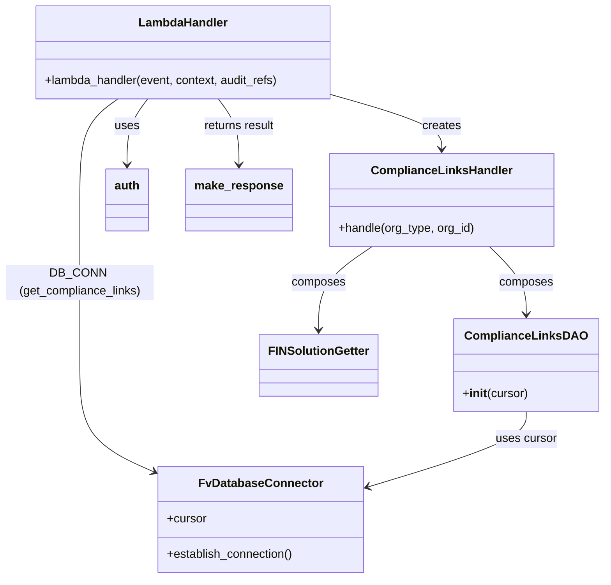

# Diagram: common/support_service/support_service/lambdas/get_compliance_links.py


> Auto-generated by Obscura crawlers

## Diagram 1



### SVG

<svg id="container" width="803.548828125" xmlns="http://www.w3.org/2000/svg" class="classDiagram" height="784" viewBox="0 0 803.548828125 784" role="graphics-document document" aria-roledescription="class"><style>#container{font-family:"trebuchet ms",verdana,arial,sans-serif;font-size:16px;fill:#333;}@keyframes edge-animation-frame{from{stroke-dashoffset:0;}}@keyframes dash{to{stroke-dashoffset:0;}}#container .edge-animation-slow{stroke-dasharray:9,5!important;stroke-dashoffset:900;animation:dash 50s linear infinite;stroke-linecap:round;}#container .edge-animation-fast{stroke-dasharray:9,5!important;stroke-dashoffset:900;animation:dash 20s linear infinite;stroke-linecap:round;}#container .error-icon{fill:#552222;}#container .error-text{fill:#552222;stroke:#552222;}#container .edge-thickness-normal{stroke-width:1px;}#container .edge-thickness-thick{stroke-width:3.5px;}#container .edge-pattern-solid{stroke-dasharray:0;}#container .edge-thickness-invisible{stroke-width:0;fill:none;}#container .edge-pattern-dashed{stroke-dasharray:3;}#container .edge-pattern-dotted{stroke-dasharray:2;}#container .marker{fill:#333333;stroke:#333333;}#container .marker.cross{stroke:#333333;}#container svg{font-family:"trebuchet ms",verdana,arial,sans-serif;font-size:16px;}#container p{margin:0;}#container g.classGroup text{fill:#9370DB;stroke:none;font-family:"trebuchet ms",verdana,arial,sans-serif;font-size:10px;}#container g.classGroup text .title{font-weight:bolder;}#container .nodeLabel,#container .edgeLabel{color:#131300;}#container .edgeLabel .label rect{fill:#ECECFF;}#container .label text{fill:#131300;}#container .labelBkg{background:#ECECFF;}#container .edgeLabel .label span{background:#ECECFF;}#container .classTitle{font-weight:bolder;}#container .node rect,#container .node circle,#container .node ellipse,#container .node polygon,#container .node path{fill:#ECECFF;stroke:#9370DB;stroke-width:1px;}#container .divider{stroke:#9370DB;stroke-width:1;}#container g.clickable{cursor:pointer;}#container g.classGroup rect{fill:#ECECFF;stroke:#9370DB;}#container g.classGroup line{stroke:#9370DB;stroke-width:1;}#container .classLabel .box{stroke:none;stroke-width:0;fill:#ECECFF;opacity:0.5;}#container .classLabel .label{fill:#9370DB;font-size:10px;}#container .relation{stroke:#333333;stroke-width:1;fill:none;}#container .dashed-line{stroke-dasharray:3;}#container .dotted-line{stroke-dasharray:1 2;}#container #compositionStart,#container .composition{fill:#333333!important;stroke:#333333!important;stroke-width:1;}#container #compositionEnd,#container .composition{fill:#333333!important;stroke:#333333!important;stroke-width:1;}#container #dependencyStart,#container .dependency{fill:#333333!important;stroke:#333333!important;stroke-width:1;}#container #dependencyStart,#container .dependency{fill:#333333!important;stroke:#333333!important;stroke-width:1;}#container #extensionStart,#container .extension{fill:transparent!important;stroke:#333333!important;stroke-width:1;}#container #extensionEnd,#container .extension{fill:transparent!important;stroke:#333333!important;stroke-width:1;}#container #aggregationStart,#container .aggregation{fill:transparent!important;stroke:#333333!important;stroke-width:1;}#container #aggregationEnd,#container .aggregation{fill:transparent!important;stroke:#333333!important;stroke-width:1;}#container #lollipopStart,#container .lollipop{fill:#ECECFF!important;stroke:#333333!important;stroke-width:1;}#container #lollipopEnd,#container .lollipop{fill:#ECECFF!important;stroke:#333333!important;stroke-width:1;}#container .edgeTerminals{font-size:11px;line-height:initial;}#container .classTitleText{text-anchor:middle;font-size:18px;fill:#333;}#container .label-icon{display:inline-block;height:1em;overflow:visible;vertical-align:-0.125em;}#container .node .label-icon path{fill:currentColor;stroke:revert;stroke-width:revert;}#container :root{--mermaid-font-family:"trebuchet ms",verdana,arial,sans-serif;}</style><g><defs><marker id="container_class-aggregationStart" class="marker aggregation class" refX="18" refY="7" markerWidth="190" markerHeight="240" orient="auto"><path d="M 18,7 L9,13 L1,7 L9,1 Z"></path></marker></defs><defs><marker id="container_class-aggregationEnd" class="marker aggregation class" refX="1" refY="7" markerWidth="20" markerHeight="28" orient="auto"><path d="M 18,7 L9,13 L1,7 L9,1 Z"></path></marker></defs><defs><marker id="container_class-extensionStart" class="marker extension class" refX="18" refY="7" markerWidth="190" markerHeight="240" orient="auto"><path d="M 1,7 L18,13 V 1 Z"></path></marker></defs><defs><marker id="container_class-extensionEnd" class="marker extension class" refX="1" refY="7" markerWidth="20" markerHeight="28" orient="auto"><path d="M 1,1 V 13 L18,7 Z"></path></marker></defs><defs><marker id="container_class-compositionStart" class="marker composition class" refX="18" refY="7" markerWidth="190" markerHeight="240" orient="auto"><path d="M 18,7 L9,13 L1,7 L9,1 Z"></path></marker></defs><defs><marker id="container_class-compositionEnd" class="marker composition class" refX="1" refY="7" markerWidth="20" markerHeight="28" orient="auto"><path d="M 18,7 L9,13 L1,7 L9,1 Z"></path></marker></defs><defs><marker id="container_class-dependencyStart" class="marker dependency class" refX="6" refY="7" markerWidth="190" markerHeight="240" orient="auto"><path d="M 5,7 L9,13 L1,7 L9,1 Z"></path></marker></defs><defs><marker id="container_class-dependencyEnd" class="marker dependency class" refX="13" refY="7" markerWidth="20" markerHeight="28" orient="auto"><path d="M 18,7 L9,13 L14,7 L9,1 Z"></path></marker></defs><defs><marker id="container_class-lollipopStart" class="marker lollipop class" refX="13" refY="7" markerWidth="190" markerHeight="240" orient="auto"><circle stroke="black" fill="transparent" cx="7" cy="7" r="6"></circle></marker></defs><defs><marker id="container_class-lollipopEnd" class="marker lollipop class" refX="1" refY="7" markerWidth="190" markerHeight="240" orient="auto"><circle stroke="black" fill="transparent" cx="7" cy="7" r="6"></circle></marker></defs><g class="root"><g class="clusters"></g><g class="edgePaths"><path d="M199.069,134L194.501,140.167C189.934,146.333,180.799,158.667,176.231,173.5C171.664,188.333,171.664,205.667,171.664,214.333L171.664,223" id="id_LambdaHandler_auth_1" class="edge-thickness-normal edge-pattern-solid relation" style=";;;" data-edge="true" data-et="edge" data-id="id_LambdaHandler_auth_1" data-points="W3sieCI6MTk5LjA2ODYzMjgxMjUsInkiOjEzNH0seyJ4IjoxNzEuNjY0MDYyNSwieSI6MTcxfSx7IngiOjE3MS42NjQwNjI1LCJ5IjoyMjl9XQ==" marker-end="url(#container_class-dependencyEnd)"></path><path d="M158.96,134L150.467,140.167C141.974,146.333,124.987,158.667,116.493,181.5C108,204.333,108,237.667,108,273C108,308.333,108,345.667,108,383C108,420.333,108,457.667,108,493C108,528.333,108,561.667,124.182,585.657C140.363,609.647,172.727,624.294,188.909,631.618L205.09,638.941" id="id_LambdaHandler_FvDatabaseConnector_2" class="edge-thickness-normal edge-pattern-solid relation" style=";;;" data-edge="true" data-et="edge" data-id="id_LambdaHandler_FvDatabaseConnector_2" data-points="W3sieCI6MTU4Ljk2MDI3MzQzNzUsInkiOjEzNH0seyJ4IjoxMDgsInkiOjE3MX0seyJ4IjoxMDgsInkiOjI3MX0seyJ4IjoxMDgsInkiOjM4M30seyJ4IjoxMDgsInkiOjQ5NX0seyJ4IjoxMDgsInkiOjU5NX0seyJ4IjoyMTAuNTU2NjQwNjI1LCJ5Ijo2NDEuNDE1MDA3NTgyNDU0MX1d" marker-end="url(#container_class-dependencyEnd)"></path><path d="M447.684,129.715L471.35,136.596C495.017,143.477,542.35,157.238,566.017,169.286C589.684,181.333,589.684,191.667,589.684,196.833L589.684,202" id="id_LambdaHandler_ComplianceLinksHandler_3" class="edge-thickness-normal edge-pattern-solid relation" style=";;;" data-edge="true" data-et="edge" data-id="id_LambdaHandler_ComplianceLinksHandler_3" data-points="W3sieCI6NDQ3LjY4MzU5Mzc1LCJ5IjoxMjkuNzE1MzA0NTkyNzQwNjd9LHsieCI6NTg5LjY4MzU5Mzc1LCJ5IjoxNzF9LHsieCI6NTg5LjY4MzU5Mzc1LCJ5IjoyMDh9XQ==" marker-end="url(#container_class-dependencyEnd)"></path><path d="M498.213,334L486.355,342.167C474.498,350.333,450.783,366.667,438.926,385.5C427.068,404.333,427.068,425.667,427.068,436.333L427.068,447" id="id_ComplianceLinksHandler_FINSolutionGetter_4" class="edge-thickness-normal edge-pattern-solid relation" style=";;;" data-edge="true" data-et="edge" data-id="id_ComplianceLinksHandler_FINSolutionGetter_4" data-points="W3sieCI6NDk4LjIxMjUyNDQxNDA2MjUsInkiOjMzNH0seyJ4Ijo0MjcuMDY4MzU5Mzc1LCJ5IjozODN9LHsieCI6NDI3LjA2ODM1OTM3NSwieSI6NDUzfV0=" marker-end="url(#container_class-dependencyEnd)"></path><path d="M652.21,334L660.315,342.167C668.421,350.333,684.631,366.667,692.737,382C700.842,397.333,700.842,411.667,700.842,418.833L700.842,426" id="id_ComplianceLinksHandler_ComplianceLinksDAO_5" class="edge-thickness-normal edge-pattern-solid relation" style=";;;" data-edge="true" data-et="edge" data-id="id_ComplianceLinksHandler_ComplianceLinksDAO_5" data-points="W3sieCI6NjUyLjIxMDA4MzAwNzgxMjUsInkiOjMzNH0seyJ4Ijo3MDAuODQxNzk2ODc1LCJ5IjozODN9LHsieCI6NzAwLjg0MTc5Njg3NSwieSI6NDMyfV0=" marker-end="url(#container_class-dependencyEnd)"></path><path d="M700.842,558L700.842,564.167C700.842,570.333,700.842,582.667,666.178,599.567C631.514,616.468,562.186,637.936,527.522,648.67L492.858,659.404" id="id_ComplianceLinksDAO_FvDatabaseConnector_6" class="edge-thickness-normal edge-pattern-solid relation" style=";;;" data-edge="true" data-et="edge" data-id="id_ComplianceLinksDAO_FvDatabaseConnector_6" data-points="W3sieCI6NzAwLjg0MTc5Njg3NSwieSI6NTU4fSx7IngiOjcwMC44NDE3OTY4NzUsInkiOjU5NX0seyJ4Ijo0ODcuMTI2OTUzMTI1LCJ5Ijo2NjEuMTc4NzQ0MjI5NDAzNH1d" marker-end="url(#container_class-dependencyEnd)"></path><path d="M292.392,134L296.96,140.167C301.527,146.333,310.662,158.667,315.229,173.5C319.797,188.333,319.797,205.667,319.797,214.333L319.797,223" id="id_LambdaHandler_make_response_7" class="edge-thickness-normal edge-pattern-solid relation" style=";;;" data-edge="true" data-et="edge" data-id="id_LambdaHandler_make_response_7" data-points="W3sieCI6MjkyLjM5MjMwNDY4NzUsInkiOjEzNH0seyJ4IjozMTkuNzk2ODc1LCJ5IjoxNzF9LHsieCI6MzE5Ljc5Njg3NSwieSI6MjI5fV0=" marker-end="url(#container_class-dependencyEnd)"></path></g><g class="edgeLabels"><g class="edgeLabel" transform="translate(171.6640625, 171)"><g class="label" data-id="id_LambdaHandler_auth_1" transform="translate(-16.4921875, -12)"><foreignObject width="32.984375" height="24"><div xmlns="http://www.w3.org/1999/xhtml" class="labelBkg" style="display: table-cell; white-space: nowrap; line-height: 1.5; max-width: 200px; text-align: center;"><span class="edgeLabel"><p>uses</p></span></div></foreignObject></g></g><g class="edgeLabel" transform="translate(108, 383)"><g class="label" data-id="id_LambdaHandler_FvDatabaseConnector_2" transform="translate(-100, -24)"><foreignObject width="200" height="48"><div xmlns="http://www.w3.org/1999/xhtml" class="labelBkg" style="display: table; white-space: break-spaces; line-height: 1.5; max-width: 200px; text-align: center; width: 200px;"><span class="edgeLabel"><p>DB_CONN (get_compliance_links)</p></span></div></foreignObject></g></g><g class="edgeLabel" transform="translate(589.68359375, 171)"><g class="label" data-id="id_LambdaHandler_ComplianceLinksHandler_3" transform="translate(-26.171875, -12)"><foreignObject width="52.34375" height="24"><div xmlns="http://www.w3.org/1999/xhtml" class="labelBkg" style="display: table-cell; white-space: nowrap; line-height: 1.5; max-width: 200px; text-align: center;"><span class="edgeLabel"><p>creates</p></span></div></foreignObject></g></g><g class="edgeLabel" transform="translate(427.068359375, 383)"><g class="label" data-id="id_ComplianceLinksHandler_FINSolutionGetter_4" transform="translate(-36.453125, -12)"><foreignObject width="72.90625" height="24"><div xmlns="http://www.w3.org/1999/xhtml" class="labelBkg" style="display: table-cell; white-space: nowrap; line-height: 1.5; max-width: 200px; text-align: center;"><span class="edgeLabel"><p>composes</p></span></div></foreignObject></g></g><g class="edgeLabel" transform="translate(700.841796875, 383)"><g class="label" data-id="id_ComplianceLinksHandler_ComplianceLinksDAO_5" transform="translate(-36.453125, -12)"><foreignObject width="72.90625" height="24"><div xmlns="http://www.w3.org/1999/xhtml" class="labelBkg" style="display: table-cell; white-space: nowrap; line-height: 1.5; max-width: 200px; text-align: center;"><span class="edgeLabel"><p>composes</p></span></div></foreignObject></g></g><g class="edgeLabel" transform="translate(700.841796875, 595)"><g class="label" data-id="id_ComplianceLinksDAO_FvDatabaseConnector_6" transform="translate(-41.4765625, -12)"><foreignObject width="82.953125" height="24"><div xmlns="http://www.w3.org/1999/xhtml" class="labelBkg" style="display: table-cell; white-space: nowrap; line-height: 1.5; max-width: 200px; text-align: center;"><span class="edgeLabel"><p>uses cursor</p></span></div></foreignObject></g></g><g class="edgeLabel" transform="translate(319.796875, 171)"><g class="label" data-id="id_LambdaHandler_make_response_7" transform="translate(-49.21875, -12)"><foreignObject width="98.4375" height="24"><div xmlns="http://www.w3.org/1999/xhtml" class="labelBkg" style="display: table-cell; white-space: nowrap; line-height: 1.5; max-width: 200px; text-align: center;"><span class="edgeLabel"><p>returns result</p></span></div></foreignObject></g></g></g><g class="nodes"><g class="node default" id="classId-LambdaHandler-0" transform="translate(245.73046875, 71)"><g class="basic label-container"><path d="M-201.953125 -63 L201.953125 -63 L201.953125 63 L-201.953125 63" stroke="none" stroke-width="0" fill="#ECECFF" style=""></path><path d="M-201.953125 -63 C-111.48105541555286 -63, -21.00898583110572 -63, 201.953125 -63 M-201.953125 -63 C-46.02482722124071 -63, 109.90347055751857 -63, 201.953125 -63 M201.953125 -63 C201.953125 -25.11145367665523, 201.953125 12.777092646689539, 201.953125 63 M201.953125 -63 C201.953125 -24.9031580253628, 201.953125 13.193683949274401, 201.953125 63 M201.953125 63 C109.9477691552189 63, 17.942413310437786 63, -201.953125 63 M201.953125 63 C84.32399968139114 63, -33.305125637217714 63, -201.953125 63 M-201.953125 63 C-201.953125 31.229824774967454, -201.953125 -0.5403504500650911, -201.953125 -63 M-201.953125 63 C-201.953125 27.305042467445766, -201.953125 -8.389915065108468, -201.953125 -63" stroke="#9370DB" stroke-width="1.3" fill="none" stroke-dasharray="0 0" style=""></path></g><g class="annotation-group text" transform="translate(0, -39)"></g><g class="label-group text" transform="translate(-58.21875, -39)"><g class="label" style="font-weight: bolder" transform="translate(0,-12)"><foreignObject width="116.4375" height="24"><div xmlns="http://www.w3.org/1999/xhtml" style="display: table-cell; white-space: nowrap; line-height: 1.5; max-width: 167px; text-align: center;"><span class="nodeLabel markdown-node-label" style=""><p>LambdaHandler</p></span></div></foreignObject></g></g><g class="members-group text" transform="translate(-189.953125, 9)"></g><g class="methods-group text" transform="translate(-189.953125, 39)"><g class="label" style="" transform="translate(0,-12)"><foreignObject width="321.6875" height="24"><div xmlns="http://www.w3.org/1999/xhtml" style="display: table-cell; white-space: nowrap; line-height: 1.5; max-width: 379px; text-align: center;"><span class="nodeLabel markdown-node-label" style=""><p>+lambda_handler(event, context, audit_refs)</p></span></div></foreignObject></g></g><g class="divider" style=""><path d="M-201.953125 -15 C-110.36968600172452 -15, -18.786247003449034 -15, 201.953125 -15 M-201.953125 -15 C-119.76504230222459 -15, -37.57695960444917 -15, 201.953125 -15" stroke="#9370DB" stroke-width="1.3" fill="none" stroke-dasharray="0 0" style=""></path></g><g class="divider" style=""><path d="M-201.953125 9 C-109.38477283860968 9, -16.816420677219355 9, 201.953125 9 M-201.953125 9 C-98.59147333883907 9, 4.770178322321868 9, 201.953125 9" stroke="#9370DB" stroke-width="1.3" fill="none" stroke-dasharray="0 0" style=""></path></g></g><g class="node default" id="classId-FvDatabaseConnector-1" transform="translate(348.841796875, 704)"><g class="basic label-container"><path d="M-138.28515625 -72 L138.28515625 -72 L138.28515625 72 L-138.28515625 72" stroke="none" stroke-width="0" fill="#ECECFF" style=""></path><path d="M-138.28515625 -72 C-58.127414859288066 -72, 22.030326531423867 -72, 138.28515625 -72 M-138.28515625 -72 C-73.6185081298492 -72, -8.951860009698407 -72, 138.28515625 -72 M138.28515625 -72 C138.28515625 -22.5322639144839, 138.28515625 26.935472171032202, 138.28515625 72 M138.28515625 -72 C138.28515625 -19.012831019848306, 138.28515625 33.97433796030339, 138.28515625 72 M138.28515625 72 C57.91167262017498 72, -22.461811009650035 72, -138.28515625 72 M138.28515625 72 C78.23558649387343 72, 18.186016737746854 72, -138.28515625 72 M-138.28515625 72 C-138.28515625 41.954665297080766, -138.28515625 11.909330594161531, -138.28515625 -72 M-138.28515625 72 C-138.28515625 36.93429098685673, -138.28515625 1.8685819737134608, -138.28515625 -72" stroke="#9370DB" stroke-width="1.3" fill="none" stroke-dasharray="0 0" style=""></path></g><g class="annotation-group text" transform="translate(0, -48)"></g><g class="label-group text" transform="translate(-79.3046875, -48)"><g class="label" style="font-weight: bolder" transform="translate(0,-12)"><foreignObject width="158.609375" height="24"><div xmlns="http://www.w3.org/1999/xhtml" style="display: table-cell; white-space: nowrap; line-height: 1.5; max-width: 207px; text-align: center;"><span class="nodeLabel markdown-node-label" style=""><p>FvDatabaseConnector</p></span></div></foreignObject></g></g><g class="members-group text" transform="translate(-126.28515625, 0)"><g class="label" style="" transform="translate(0,-12)"><foreignObject width="53.71875" height="24"><div xmlns="http://www.w3.org/1999/xhtml" style="display: table-cell; white-space: nowrap; line-height: 1.5; max-width: 112px; text-align: center;"><span class="nodeLabel markdown-node-label" style=""><p>+cursor</p></span></div></foreignObject></g></g><g class="methods-group text" transform="translate(-126.28515625, 48)"><g class="label" style="" transform="translate(0,-12)"><foreignObject width="173.265625" height="24"><div xmlns="http://www.w3.org/1999/xhtml" style="display: table-cell; white-space: nowrap; line-height: 1.5; max-width: 231px; text-align: center;"><span class="nodeLabel markdown-node-label" style=""><p>+establish_connection()</p></span></div></foreignObject></g></g><g class="divider" style=""><path d="M-138.28515625 -24 C-67.79943965209054 -24, 2.6862769458189177 -24, 138.28515625 -24 M-138.28515625 -24 C-29.716855083552232 -24, 78.85144608289554 -24, 138.28515625 -24" stroke="#9370DB" stroke-width="1.3" fill="none" stroke-dasharray="0 0" style=""></path></g><g class="divider" style=""><path d="M-138.28515625 24 C-44.39124552162187 24, 49.50266520675626 24, 138.28515625 24 M-138.28515625 24 C-75.35403567708079 24, -12.422915104161575 24, 138.28515625 24" stroke="#9370DB" stroke-width="1.3" fill="none" stroke-dasharray="0 0" style=""></path></g></g><g class="node default" id="classId-ComplianceLinksHandler-2" transform="translate(589.68359375, 271)"><g class="basic label-container"><path d="M-150.41796875 -63 L150.41796875 -63 L150.41796875 63 L-150.41796875 63" stroke="none" stroke-width="0" fill="#ECECFF" style=""></path><path d="M-150.41796875 -63 C-49.11138861469121 -63, 52.195191520617584 -63, 150.41796875 -63 M-150.41796875 -63 C-62.333645952416944 -63, 25.75067684516611 -63, 150.41796875 -63 M150.41796875 -63 C150.41796875 -14.188246473157974, 150.41796875 34.62350705368405, 150.41796875 63 M150.41796875 -63 C150.41796875 -33.68286431153999, 150.41796875 -4.365728623079974, 150.41796875 63 M150.41796875 63 C56.35061365027222 63, -37.716741449455554 63, -150.41796875 63 M150.41796875 63 C68.01397765999945 63, -14.39001343000109 63, -150.41796875 63 M-150.41796875 63 C-150.41796875 16.43757742757429, -150.41796875 -30.12484514485142, -150.41796875 -63 M-150.41796875 63 C-150.41796875 23.452646512531707, -150.41796875 -16.094706974936585, -150.41796875 -63" stroke="#9370DB" stroke-width="1.3" fill="none" stroke-dasharray="0 0" style=""></path></g><g class="annotation-group text" transform="translate(0, -39)"></g><g class="label-group text" transform="translate(-90.6796875, -39)"><g class="label" style="font-weight: bolder" transform="translate(0,-12)"><foreignObject width="181.359375" height="24"><div xmlns="http://www.w3.org/1999/xhtml" style="display: table-cell; white-space: nowrap; line-height: 1.5; max-width: 231px; text-align: center;"><span class="nodeLabel markdown-node-label" style=""><p>ComplianceLinksHandler</p></span></div></foreignObject></g></g><g class="members-group text" transform="translate(-138.41796875, 9)"></g><g class="methods-group text" transform="translate(-138.41796875, 39)"><g class="label" style="" transform="translate(0,-12)"><foreignObject width="186.15625" height="24"><div xmlns="http://www.w3.org/1999/xhtml" style="display: table-cell; white-space: nowrap; line-height: 1.5; max-width: 244px; text-align: center;"><span class="nodeLabel markdown-node-label" style=""><p>+handle(org_type, org_id)</p></span></div></foreignObject></g></g><g class="divider" style=""><path d="M-150.41796875 -15 C-87.4260678347965 -15, -24.43416691959301 -15, 150.41796875 -15 M-150.41796875 -15 C-45.21564907682914 -15, 59.986670596341725 -15, 150.41796875 -15" stroke="#9370DB" stroke-width="1.3" fill="none" stroke-dasharray="0 0" style=""></path></g><g class="divider" style=""><path d="M-150.41796875 9 C-42.454127545290916 9, 65.50971365941817 9, 150.41796875 9 M-150.41796875 9 C-44.91791353842049 9, 60.582141673159015 9, 150.41796875 9" stroke="#9370DB" stroke-width="1.3" fill="none" stroke-dasharray="0 0" style=""></path></g></g><g class="node default" id="classId-ComplianceLinksDAO-3" transform="translate(700.841796875, 495)"><g class="basic label-container"><path d="M-94.70703125 -63 L94.70703125 -63 L94.70703125 63 L-94.70703125 63" stroke="none" stroke-width="0" fill="#ECECFF" style=""></path><path d="M-94.70703125 -63 C-31.14826371170073 -63, 32.41050382659854 -63, 94.70703125 -63 M-94.70703125 -63 C-28.293796312515738 -63, 38.119438624968524 -63, 94.70703125 -63 M94.70703125 -63 C94.70703125 -27.86986085748444, 94.70703125 7.26027828503112, 94.70703125 63 M94.70703125 -63 C94.70703125 -30.141471681079416, 94.70703125 2.717056637841168, 94.70703125 63 M94.70703125 63 C41.79506796003899 63, -11.116895329922016 63, -94.70703125 63 M94.70703125 63 C20.422808960996576 63, -53.86141332800685 63, -94.70703125 63 M-94.70703125 63 C-94.70703125 14.075035358321642, -94.70703125 -34.849929283356715, -94.70703125 -63 M-94.70703125 63 C-94.70703125 19.51631317689894, -94.70703125 -23.96737364620212, -94.70703125 -63" stroke="#9370DB" stroke-width="1.3" fill="none" stroke-dasharray="0 0" style=""></path></g><g class="annotation-group text" transform="translate(0, -39)"></g><g class="label-group text" transform="translate(-76.8828125, -39)"><g class="label" style="font-weight: bolder" transform="translate(0,-12)"><foreignObject width="153.765625" height="24"><div xmlns="http://www.w3.org/1999/xhtml" style="display: table-cell; white-space: nowrap; line-height: 1.5; max-width: 202px; text-align: center;"><span class="nodeLabel markdown-node-label" style=""><p>ComplianceLinksDAO</p></span></div></foreignObject></g></g><g class="members-group text" transform="translate(-82.70703125, 9)"></g><g class="methods-group text" transform="translate(-82.70703125, 39)"><g class="label" style="" transform="translate(0,-12)"><foreignObject width="88.53125" height="24"><div xmlns="http://www.w3.org/1999/xhtml" style="display: table-cell; white-space: nowrap; line-height: 1.5; max-width: 177px; text-align: center;"><span class="nodeLabel markdown-node-label" style=""><p>+<strong>init</strong>(cursor)</p></span></div></foreignObject></g></g><g class="divider" style=""><path d="M-94.70703125 -15 C-50.22940779039504 -15, -5.751784330790073 -15, 94.70703125 -15 M-94.70703125 -15 C-25.39243912586157 -15, 43.92215299827686 -15, 94.70703125 -15" stroke="#9370DB" stroke-width="1.3" fill="none" stroke-dasharray="0 0" style=""></path></g><g class="divider" style=""><path d="M-94.70703125 9 C-29.07423366657389 9, 36.55856391685222 9, 94.70703125 9 M-94.70703125 9 C-38.33211540942196 9, 18.04280043115608 9, 94.70703125 9" stroke="#9370DB" stroke-width="1.3" fill="none" stroke-dasharray="0 0" style=""></path></g></g><g class="node default" id="classId-FINSolutionGetter-4" transform="translate(427.068359375, 495)"><g class="basic label-container"><path d="M-77.609375 -42 L77.609375 -42 L77.609375 42 L-77.609375 42" stroke="none" stroke-width="0" fill="#ECECFF" style=""></path><path d="M-77.609375 -42 C-45.44970867019748 -42, -13.290042340394962 -42, 77.609375 -42 M-77.609375 -42 C-44.27553011285114 -42, -10.941685225702287 -42, 77.609375 -42 M77.609375 -42 C77.609375 -18.4333704538216, 77.609375 5.133259092356802, 77.609375 42 M77.609375 -42 C77.609375 -12.667311344275198, 77.609375 16.665377311449603, 77.609375 42 M77.609375 42 C28.73677660201033 42, -20.13582179597934 42, -77.609375 42 M77.609375 42 C34.67994129485822 42, -8.249492410283565 42, -77.609375 42 M-77.609375 42 C-77.609375 19.84390086253385, -77.609375 -2.3121982749322996, -77.609375 -42 M-77.609375 42 C-77.609375 19.35370805739912, -77.609375 -3.2925838852017577, -77.609375 -42" stroke="#9370DB" stroke-width="1.3" fill="none" stroke-dasharray="0 0" style=""></path></g><g class="annotation-group text" transform="translate(0, -18)"></g><g class="label-group text" transform="translate(-65.609375, -18)"><g class="label" style="font-weight: bolder" transform="translate(0,-12)"><foreignObject width="131.21875" height="24"><div xmlns="http://www.w3.org/1999/xhtml" style="display: table-cell; white-space: nowrap; line-height: 1.5; max-width: 180px; text-align: center;"><span class="nodeLabel markdown-node-label" style=""><p>FINSolutionGetter</p></span></div></foreignObject></g></g><g class="members-group text" transform="translate(-65.609375, 30)"></g><g class="methods-group text" transform="translate(-65.609375, 60)"></g><g class="divider" style=""><path d="M-77.609375 6 C-28.43515081889573 6, 20.739073362208543 6, 77.609375 6 M-77.609375 6 C-22.872653042081105 6, 31.86406891583779 6, 77.609375 6" stroke="#9370DB" stroke-width="1.3" fill="none" stroke-dasharray="0 0" style=""></path></g><g class="divider" style=""><path d="M-77.609375 24 C-18.70717967227393 24, 40.19501565545214 24, 77.609375 24 M-77.609375 24 C-25.802582077450964 24, 26.004210845098072 24, 77.609375 24" stroke="#9370DB" stroke-width="1.3" fill="none" stroke-dasharray="0 0" style=""></path></g></g><g class="node default" id="classId-auth-5" transform="translate(171.6640625, 271)"><g class="basic label-container"><path d="M-28.6640625 -42 L28.6640625 -42 L28.6640625 42 L-28.6640625 42" stroke="none" stroke-width="0" fill="#ECECFF" style=""></path><path d="M-28.6640625 -42 C-13.492298816846386 -42, 1.679464866307228 -42, 28.6640625 -42 M-28.6640625 -42 C-6.3570795660711745 -42, 15.949903367857651 -42, 28.6640625 -42 M28.6640625 -42 C28.6640625 -24.10100287026502, 28.6640625 -6.202005740530041, 28.6640625 42 M28.6640625 -42 C28.6640625 -19.954929103772365, 28.6640625 2.0901417924552703, 28.6640625 42 M28.6640625 42 C14.086669514892037 42, -0.49072347021592577 42, -28.6640625 42 M28.6640625 42 C6.608124404654902 42, -15.447813690690197 42, -28.6640625 42 M-28.6640625 42 C-28.6640625 13.232762311130038, -28.6640625 -15.534475377739923, -28.6640625 -42 M-28.6640625 42 C-28.6640625 22.396392068914274, -28.6640625 2.792784137828548, -28.6640625 -42" stroke="#9370DB" stroke-width="1.3" fill="none" stroke-dasharray="0 0" style=""></path></g><g class="annotation-group text" transform="translate(0, -18)"></g><g class="label-group text" transform="translate(-16.6640625, -18)"><g class="label" style="font-weight: bolder" transform="translate(0,-12)"><foreignObject width="33.328125" height="24"><div xmlns="http://www.w3.org/1999/xhtml" style="display: table-cell; white-space: nowrap; line-height: 1.5; max-width: 83px; text-align: center;"><span class="nodeLabel markdown-node-label" style=""><p>auth</p></span></div></foreignObject></g></g><g class="members-group text" transform="translate(-16.6640625, 30)"></g><g class="methods-group text" transform="translate(-16.6640625, 60)"></g><g class="divider" style=""><path d="M-28.6640625 6 C-15.490609409876694 6, -2.317156319753387 6, 28.6640625 6 M-28.6640625 6 C-13.836858028156128 6, 0.9903464436877449 6, 28.6640625 6" stroke="#9370DB" stroke-width="1.3" fill="none" stroke-dasharray="0 0" style=""></path></g><g class="divider" style=""><path d="M-28.6640625 24 C-6.523607789524579 24, 15.616846920950842 24, 28.6640625 24 M-28.6640625 24 C-11.479980295958413 24, 5.7041019080831745 24, 28.6640625 24" stroke="#9370DB" stroke-width="1.3" fill="none" stroke-dasharray="0 0" style=""></path></g></g><g class="node default" id="classId-make_response-6" transform="translate(319.796875, 271)"><g class="basic label-container"><path d="M-69.46875 -42 L69.46875 -42 L69.46875 42 L-69.46875 42" stroke="none" stroke-width="0" fill="#ECECFF" style=""></path><path d="M-69.46875 -42 C-39.27780493051249 -42, -9.086859861024983 -42, 69.46875 -42 M-69.46875 -42 C-29.865234746935577 -42, 9.738280506128845 -42, 69.46875 -42 M69.46875 -42 C69.46875 -9.470768543012149, 69.46875 23.058462913975703, 69.46875 42 M69.46875 -42 C69.46875 -25.04391577720562, 69.46875 -8.087831554411238, 69.46875 42 M69.46875 42 C17.096287843761658 42, -35.276174312476684 42, -69.46875 42 M69.46875 42 C30.783436907263813 42, -7.901876185472375 42, -69.46875 42 M-69.46875 42 C-69.46875 12.624091701826806, -69.46875 -16.751816596346387, -69.46875 -42 M-69.46875 42 C-69.46875 12.010228506970627, -69.46875 -17.979542986058746, -69.46875 -42" stroke="#9370DB" stroke-width="1.3" fill="none" stroke-dasharray="0 0" style=""></path></g><g class="annotation-group text" transform="translate(0, -18)"></g><g class="label-group text" transform="translate(-57.46875, -18)"><g class="label" style="font-weight: bolder" transform="translate(0,-12)"><foreignObject width="114.9375" height="24"><div xmlns="http://www.w3.org/1999/xhtml" style="display: table-cell; white-space: nowrap; line-height: 1.5; max-width: 164px; text-align: center;"><span class="nodeLabel markdown-node-label" style=""><p>make_response</p></span></div></foreignObject></g></g><g class="members-group text" transform="translate(-57.46875, 30)"></g><g class="methods-group text" transform="translate(-57.46875, 60)"></g><g class="divider" style=""><path d="M-69.46875 6 C-33.74733475615923 6, 1.9740804876815332 6, 69.46875 6 M-69.46875 6 C-36.577522443201694 6, -3.686294886403388 6, 69.46875 6" stroke="#9370DB" stroke-width="1.3" fill="none" stroke-dasharray="0 0" style=""></path></g><g class="divider" style=""><path d="M-69.46875 24 C-41.61838292582587 24, -13.768015851651747 24, 69.46875 24 M-69.46875 24 C-13.963666029461294 24, 41.54141794107741 24, 69.46875 24" stroke="#9370DB" stroke-width="1.3" fill="none" stroke-dasharray="0 0" style=""></path></g></g></g></g></g></svg>

## Diagram 2

```mermaid
flowchart TD
    Event[Incoming event] --> Auth[auth checks\nget_organization_id / get_user_org_types]
    Auth --> DB_CONN[DB_CONN.establish_connection()]
    DB_CONN --> Cursor[DB_CONN.cursor]
    Cursor --> DAO[ComplianceLinksDAO(cursor)]
    DAO --> Handler[ComplianceLinksHandler(FINSolutionGetter, DAO)]
    Handler --> Business[handler.handle(org_type, org_id)]
    Business --> Response[make_response(compliance_links, 200)]
    Response --> Return[Lambda returns HTTP 200]
```

> SVG rendering failed for this diagram.
