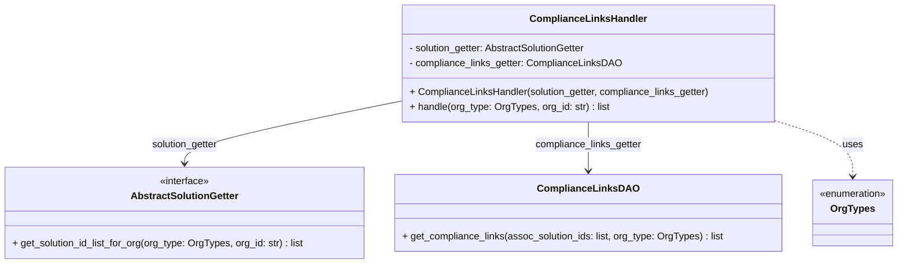

# Diagram: common/support_service/support_service/service/compliance_links_handler.py

> Auto-generated by Obscura crawlers

## Mermaid

### SVG

<svg id="container" width="1468.7890625" xmlns="http://www.w3.org/2000/svg" class="classDiagram" height="432" viewBox="0 0 1468.7890625 432" role="graphics-document document" aria-roledescription="class"><g><defs><marker id="container_class-aggregationStart" class="marker aggregation class" refX="18" refY="7" markerWidth="190" markerHeight="240" orient="auto"><path d="M 18,7 L9,13 L1,7 L9,1 Z"></path></marker></defs><defs><marker id="container_class-aggregationEnd" class="marker aggregation class" refX="1" refY="7" markerWidth="20" markerHeight="28" orient="auto"><path d="M 18,7 L9,13 L1,7 L9,1 Z"></path></marker></defs><defs><marker id="container_class-extensionStart" class="marker extension class" refX="18" refY="7" markerWidth="190" markerHeight="240" orient="auto"><path d="M 1,7 L18,13 V 1 Z"></path></marker></defs><defs><marker id="container_class-extensionEnd" class="marker extension class" refX="1" refY="7" markerWidth="20" markerHeight="28" orient="auto"><path d="M 1,1 V 13 L18,7 Z"></path></marker></defs><defs><marker id="container_class-compositionStart" class="marker composition class" refX="18" refY="7" markerWidth="190" markerHeight="240" orient="auto"><path d="M 18,7 L9,13 L1,7 L9,1 Z"></path></marker></defs><defs><marker id="container_class-compositionEnd" class="marker composition class" refX="1" refY="7" markerWidth="20" markerHeight="28" orient="auto"><path d="M 18,7 L9,13 L1,7 L9,1 Z"></path></marker></defs><defs><marker id="container_class-dependencyStart" class="marker dependency class" refX="6" refY="7" markerWidth="190" markerHeight="240" orient="auto"><path d="M 5,7 L9,13 L1,7 L9,1 Z"></path></marker></defs><defs><marker id="container_class-dependencyEnd" class="marker dependency class" refX="13" refY="7" markerWidth="20" markerHeight="28" orient="auto"><path d="M 18,7 L9,13 L14,7 L9,1 Z"></path></marker></defs><defs><marker id="container_class-lollipopStart" class="marker lollipop class" refX="13" refY="7" markerWidth="190" markerHeight="240" orient="auto"><circle stroke="black" fill="transparent" cx="7" cy="7" r="6"></circle></marker></defs><defs><marker id="container_class-lollipopEnd" class="marker lollipop class" refX="1" refY="7" markerWidth="190" markerHeight="240" orient="auto"><circle stroke="black" fill="transparent" cx="7" cy="7" r="6"></circle></marker></defs><g class="root"><g class="clusters"></g><g class="edgePaths"><path d="M655.273,165.743L596.443,177.619C537.612,189.495,419.951,213.248,361.12,230.291C302.289,247.333,302.289,257.667,302.289,262.833L302.289,268" id="id_ComplianceLinksHandler_AbstractSolutionGetter_1" class="edge-thickness-normal edge-pattern-solid relation" style=";;;" data-edge="true" data-et="edge" data-id="id_ComplianceLinksHandler_AbstractSolutionGetter_1" data-points="W3sieCI6NjU1LjI3MzQzNzUsInkiOjE2NS43NDMwNDM4MjExMTA3NX0seyJ4IjozMDIuMjg5MDYyNSwieSI6MjM3fSx7IngiOjMwMi4yODkwNjI1LCJ5IjoyNzR9XQ==" marker-end="url(#container_class-dependencyEnd)"></path><path d="M961.129,200L961.129,206.167C961.129,212.333,961.129,224.667,961.129,238C961.129,251.333,961.129,265.667,961.129,272.833L961.129,280" id="id_ComplianceLinksHandler_ComplianceLinksDAO_2" class="edge-thickness-normal edge-pattern-solid relation" style=";;;" data-edge="true" data-et="edge" data-id="id_ComplianceLinksHandler_ComplianceLinksDAO_2" data-points="W3sieCI6OTYxLjEyODkwNjI1LCJ5IjoyMDB9LHsieCI6OTYxLjEyODkwNjI1LCJ5IjoyMzd9LHsieCI6OTYxLjEyODkwNjI1LCJ5IjoyODZ9XQ==" marker-end="url(#container_class-dependencyEnd)"></path><path d="M1266.984,198.141L1288.026,204.617C1309.068,211.094,1351.151,224.047,1372.193,239.19C1393.234,254.333,1393.234,271.667,1393.234,280.333L1393.234,289" id="id_ComplianceLinksHandler_OrgTypes_3" class="edge-thickness-normal edge-pattern-dashed relation" style=";;;" data-edge="true" data-et="edge" data-id="id_ComplianceLinksHandler_OrgTypes_3" data-points="W3sieCI6MTI2Ni45ODQzNzUsInkiOjE5OC4xNDA4NTI4MzcyMTYwMn0seyJ4IjoxMzkzLjIzNDM3NSwieSI6MjM3fSx7IngiOjEzOTMuMjM0Mzc1LCJ5IjoyOTV9XQ==" marker-end="url(#container_class-dependencyEnd)"></path></g><g class="edgeLabels"><g class="edgeLabel" transform="translate(302.2890625, 237)"><g class="label" data-id="id_ComplianceLinksHandler_AbstractSolutionGetter_1" transform="translate(-55.640625, -12)"><foreignObject width="111.28125" height="24">

solution_getter

</foreignObject></g></g><g class="edgeLabel" transform="translate(961.12890625, 237)"><g class="label" data-id="id_ComplianceLinksHandler_ComplianceLinksDAO_2" transform="translate(-88.1796875, -12)"><foreignObject width="176.359375" height="24">

compliance_links_getter

</foreignObject></g></g><g class="edgeLabel" transform="translate(1393.234375, 237)"><g class="label" data-id="id_ComplianceLinksHandler_OrgTypes_3" transform="translate(-16.4921875, -12)"><foreignObject width="32.984375" height="24">

uses

</foreignObject></g></g></g><g class="nodes"><g class="node default" id="classId-ComplianceLinksHandler-0" transform="translate(961.12890625, 104)"><g class="basic label-container"><path d="M-305.85546875 -96 L305.85546875 -96 L305.85546875 96 L-305.85546875 96" stroke="none" stroke-width="0" fill="#ECECFF" style=""></path><path d="M-305.85546875 -96 C-106.82558802054365 -96, 92.2042927089127 -96, 305.85546875 -96 M-305.85546875 -96 C-63.49636239887019 -96, 178.86274395225962 -96, 305.85546875 -96 M305.85546875 -96 C305.85546875 -31.305068756999688, 305.85546875 33.389862486000624, 305.85546875 96 M305.85546875 -96 C305.85546875 -54.01343540480255, 305.85546875 -12.0268708096051, 305.85546875 96 M305.85546875 96 C176.51685100724023 96, 47.17823326448047 96, -305.85546875 96 M305.85546875 96 C62.839967687772145 96, -180.1755333744557 96, -305.85546875 96 M-305.85546875 96 C-305.85546875 45.28115371459894, -305.85546875 -5.437692570802113, -305.85546875 -96 M-305.85546875 96 C-305.85546875 47.228174107563916, -305.85546875 -1.5436517848721678, -305.85546875 -96" stroke="#9370DB" stroke-width="1.3" fill="none" stroke-dasharray="0 0" style=""></path></g><g class="annotation-group text" transform="translate(0, -72)"></g><g class="label-group text" transform="translate(-90.6796875, -72)"><g class="label" style="font-weight: bolder" transform="translate(0,-12)"><foreignObject width="181.359375" height="24">

ComplianceLinksHandler

</foreignObject></g></g><g class="members-group text" transform="translate(-293.85546875, -24)"><g class="label" style="" transform="translate(0,-12)"><foreignObject width="295.96875" height="24">

- solution_getter: AbstractSolutionGetter

</foreignObject></g><g class="label" style="" transform="translate(0,12)"><foreignObject width="347.484375" height="24">

- compliance_links_getter: ComplianceLinksDAO

</foreignObject></g></g><g class="methods-group text" transform="translate(-293.85546875, 48)"><g class="label" style="" transform="translate(0,-12)"><foreignObject width="497.03125" height="24">

+ ComplianceLinksHandler(solution_getter, compliance_links_getter)

</foreignObject></g><g class="label" style="" transform="translate(0,12)"><foreignObject width="327.4375" height="24">

+ handle(org_type: OrgTypes, org_id: str) : list

</foreignObject></g></g><g class="divider" style=""><path d="M-305.85546875 -48 C-128.97548974925698 -48, 47.90448925148604 -48, 305.85546875 -48 M-305.85546875 -48 C-68.50722397335844 -48, 168.84102080328313 -48, 305.85546875 -48" stroke="#9370DB" stroke-width="1.3" fill="none" stroke-dasharray="0 0" style=""></path></g><g class="divider" style=""><path d="M-305.85546875 24 C-159.74089098868626 24, -13.62631322737252 24, 305.85546875 24 M-305.85546875 24 C-146.96945364848136 24, 11.916561453037275 24, 305.85546875 24" stroke="#9370DB" stroke-width="1.3" fill="none" stroke-dasharray="0 0" style=""></path></g></g><g class="node default" id="classId-AbstractSolutionGetter-1" transform="translate(302.2890625, 349)"><g class="basic label-container"><path d="M-294.2890625 -75 L294.2890625 -75 L294.2890625 75 L-294.2890625 75" stroke="none" stroke-width="0" fill="#ECECFF" style=""></path><path d="M-294.2890625 -75 C-99.0252021517004 -75, 96.2386581965992 -75, 294.2890625 -75 M-294.2890625 -75 C-147.71395418565942 -75, -1.1388458713188356 -75, 294.2890625 -75 M294.2890625 -75 C294.2890625 -35.232248985526645, 294.2890625 4.535502028946709, 294.2890625 75 M294.2890625 -75 C294.2890625 -28.86639077334464, 294.2890625 17.26721845331072, 294.2890625 75 M294.2890625 75 C94.55806465516804 75, -105.17293318966392 75, -294.2890625 75 M294.2890625 75 C122.73106558322607 75, -48.82693133354786 75, -294.2890625 75 M-294.2890625 75 C-294.2890625 43.491371476862454, -294.2890625 11.982742953724902, -294.2890625 -75 M-294.2890625 75 C-294.2890625 19.233891540753582, -294.2890625 -36.532216918492836, -294.2890625 -75" stroke="#9370DB" stroke-width="1.3" fill="none" stroke-dasharray="0 0" style=""></path></g><g class="annotation-group text" transform="translate(-41.015625, -51)"><g class="label" style="" transform="translate(0,-12)"><foreignObject width="82.03125" height="24">

«interface»

</foreignObject></g></g><g class="label-group text" transform="translate(-84.75, -27)"><g class="label" style="font-weight: bolder" transform="translate(0,-12)"><foreignObject width="169.5" height="24">

AbstractSolutionGetter

</foreignObject></g></g><g class="members-group text" transform="translate(-282.2890625, 21)"></g><g class="methods-group text" transform="translate(-282.2890625, 51)"><g class="label" style="" transform="translate(0,-12)"><foreignObject width="479.828125" height="24">

+ get_solution_id_list_for_org(org_type: OrgTypes, org_id: str) : list

</foreignObject></g></g><g class="divider" style=""><path d="M-294.2890625 -3 C-80.63015866823929 -3, 133.02874516352142 -3, 294.2890625 -3 M-294.2890625 -3 C-106.19599325710854 -3, 81.89707598578292 -3, 294.2890625 -3" stroke="#9370DB" stroke-width="1.3" fill="none" stroke-dasharray="0 0" style=""></path></g><g class="divider" style=""><path d="M-294.2890625 21 C-147.27185211592092 21, -0.25464173184184347 21, 294.2890625 21 M-294.2890625 21 C-170.94211490879647 21, -47.59516731759294 21, 294.2890625 21" stroke="#9370DB" stroke-width="1.3" fill="none" stroke-dasharray="0 0" style=""></path></g></g><g class="node default" id="classId-ComplianceLinksDAO-2" transform="translate(961.12890625, 349)"><g class="basic label-container"><path d="M-314.55078125 -63 L314.55078125 -63 L314.55078125 63 L-314.55078125 63" stroke="none" stroke-width="0" fill="#ECECFF" style=""></path><path d="M-314.55078125 -63 C-125.78198048793965 -63, 62.9868202741207 -63, 314.55078125 -63 M-314.55078125 -63 C-153.850628538944 -63, 6.849524172112012 -63, 314.55078125 -63 M314.55078125 -63 C314.55078125 -30.23873799420101, 314.55078125 2.52252401159798, 314.55078125 63 M314.55078125 -63 C314.55078125 -28.212461819904647, 314.55078125 6.575076360190707, 314.55078125 63 M314.55078125 63 C135.46576873544885 63, -43.619243779102305 63, -314.55078125 63 M314.55078125 63 C106.28655403440789 63, -101.97767318118423 63, -314.55078125 63 M-314.55078125 63 C-314.55078125 25.890749083189334, -314.55078125 -11.218501833621332, -314.55078125 -63 M-314.55078125 63 C-314.55078125 17.158860009224163, -314.55078125 -28.682279981551673, -314.55078125 -63" stroke="#9370DB" stroke-width="1.3" fill="none" stroke-dasharray="0 0" style=""></path></g><g class="annotation-group text" transform="translate(0, -39)"></g><g class="label-group text" transform="translate(-76.8828125, -39)"><g class="label" style="font-weight: bolder" transform="translate(0,-12)"><foreignObject width="153.765625" height="24">

ComplianceLinksDAO

</foreignObject></g></g><g class="members-group text" transform="translate(-302.55078125, 9)"></g><g class="methods-group text" transform="translate(-302.55078125, 39)"><g class="label" style="" transform="translate(0,-12)"><foreignObject width="528.21875" height="24">

+ get_compliance_links(assoc_solution_ids: list, org_type: OrgTypes) : list

</foreignObject></g></g><g class="divider" style=""><path d="M-314.55078125 -15 C-80.66120068759983 -15, 153.22837987480034 -15, 314.55078125 -15 M-314.55078125 -15 C-117.2822660191159 -15, 79.98624921176821 -15, 314.55078125 -15" stroke="#9370DB" stroke-width="1.3" fill="none" stroke-dasharray="0 0" style=""></path></g><g class="divider" style=""><path d="M-314.55078125 9 C-100.64421989663546 9, 113.26234145672908 9, 314.55078125 9 M-314.55078125 9 C-126.52733777080195 9, 61.4961057083961 9, 314.55078125 9" stroke="#9370DB" stroke-width="1.3" fill="none" stroke-dasharray="0 0" style=""></path></g></g><g class="node default" id="classId-OrgTypes-3" transform="translate(1393.234375, 349)"><g class="basic label-container"><path d="M-67.5546875 -54 L67.5546875 -54 L67.5546875 54 L-67.5546875 54" stroke="none" stroke-width="0" fill="#ECECFF" style=""></path><path d="M-67.5546875 -54 C-19.950040783736775 -54, 27.65460593252645 -54, 67.5546875 -54 M-67.5546875 -54 C-25.674006528673885 -54, 16.20667444265223 -54, 67.5546875 -54 M67.5546875 -54 C67.5546875 -26.406267865384574, 67.5546875 1.1874642692308512, 67.5546875 54 M67.5546875 -54 C67.5546875 -12.358022513517923, 67.5546875 29.283954972964153, 67.5546875 54 M67.5546875 54 C35.567516791086945 54, 3.5803460821738895 54, -67.5546875 54 M67.5546875 54 C25.17847498690621 54, -17.19773752618758 54, -67.5546875 54 M-67.5546875 54 C-67.5546875 14.640472899808103, -67.5546875 -24.719054200383795, -67.5546875 -54 M-67.5546875 54 C-67.5546875 19.54298970685477, -67.5546875 -14.914020586290462, -67.5546875 -54" stroke="#9370DB" stroke-width="1.3" fill="none" stroke-dasharray="0 0" style=""></path></g><g class="annotation-group text" transform="translate(-55.5546875, -30)"><g class="label" style="" transform="translate(0,-12)"><foreignObject width="111.109375" height="24">

«enumeration»

</foreignObject></g></g><g class="label-group text" transform="translate(-34.25, -6)"><g class="label" style="font-weight: bolder" transform="translate(0,-12)"><foreignObject width="68.5" height="24">

OrgTypes

</foreignObject></g></g><g class="members-group text" transform="translate(-55.5546875, 42)"></g><g class="methods-group text" transform="translate(-55.5546875, 72)"></g><g class="divider" style=""><path d="M-67.5546875 18 C-14.33837633389701 18, 38.87793483220598 18, 67.5546875 18 M-67.5546875 18 C-23.43932829380885 18, 20.676030912382302 18, 67.5546875 18" stroke="#9370DB" stroke-width="1.3" fill="none" stroke-dasharray="0 0" style=""></path></g><g class="divider" style=""><path d="M-67.5546875 36 C-27.36032978420272 36, 12.834027931594562 36, 67.5546875 36 M-67.5546875 36 C-36.78551740016309 36, -6.016347300326174 36, 67.5546875 36" stroke="#9370DB" stroke-width="1.3" fill="none" stroke-dasharray="0 0" style=""></path></g></g></g></g></g></svg>
