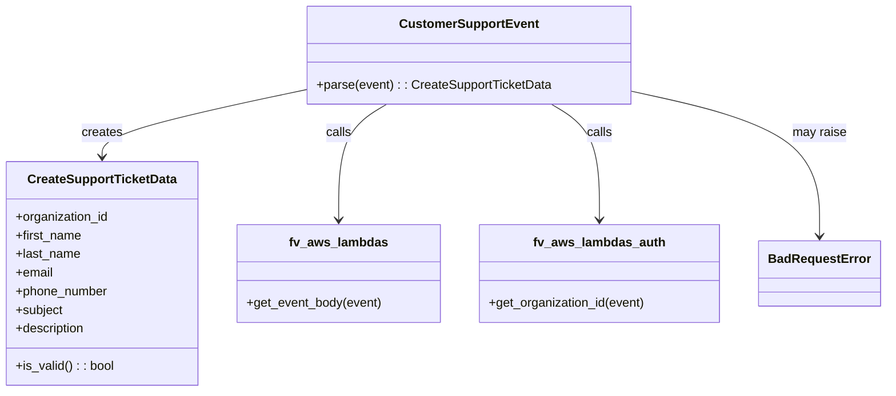

# Diagram: common/support_service/support_service/service/customer_support_event.py


> Auto-generated by Obscura crawlers

## Diagram 1



### SVG

<svg id="container" width="1121.828125" xmlns="http://www.w3.org/2000/svg" class="classDiagram" height="504" viewBox="0 0 1121.828125 504" role="graphics-document document" aria-roledescription="class"><style>#container{font-family:"trebuchet ms",verdana,arial,sans-serif;font-size:16px;fill:#333;}@keyframes edge-animation-frame{from{stroke-dashoffset:0;}}@keyframes dash{to{stroke-dashoffset:0;}}#container .edge-animation-slow{stroke-dasharray:9,5!important;stroke-dashoffset:900;animation:dash 50s linear infinite;stroke-linecap:round;}#container .edge-animation-fast{stroke-dasharray:9,5!important;stroke-dashoffset:900;animation:dash 20s linear infinite;stroke-linecap:round;}#container .error-icon{fill:#552222;}#container .error-text{fill:#552222;stroke:#552222;}#container .edge-thickness-normal{stroke-width:1px;}#container .edge-thickness-thick{stroke-width:3.5px;}#container .edge-pattern-solid{stroke-dasharray:0;}#container .edge-thickness-invisible{stroke-width:0;fill:none;}#container .edge-pattern-dashed{stroke-dasharray:3;}#container .edge-pattern-dotted{stroke-dasharray:2;}#container .marker{fill:#333333;stroke:#333333;}#container .marker.cross{stroke:#333333;}#container svg{font-family:"trebuchet ms",verdana,arial,sans-serif;font-size:16px;}#container p{margin:0;}#container g.classGroup text{fill:#9370DB;stroke:none;font-family:"trebuchet ms",verdana,arial,sans-serif;font-size:10px;}#container g.classGroup text .title{font-weight:bolder;}#container .nodeLabel,#container .edgeLabel{color:#131300;}#container .edgeLabel .label rect{fill:#ECECFF;}#container .label text{fill:#131300;}#container .labelBkg{background:#ECECFF;}#container .edgeLabel .label span{background:#ECECFF;}#container .classTitle{font-weight:bolder;}#container .node rect,#container .node circle,#container .node ellipse,#container .node polygon,#container .node path{fill:#ECECFF;stroke:#9370DB;stroke-width:1px;}#container .divider{stroke:#9370DB;stroke-width:1;}#container g.clickable{cursor:pointer;}#container g.classGroup rect{fill:#ECECFF;stroke:#9370DB;}#container g.classGroup line{stroke:#9370DB;stroke-width:1;}#container .classLabel .box{stroke:none;stroke-width:0;fill:#ECECFF;opacity:0.5;}#container .classLabel .label{fill:#9370DB;font-size:10px;}#container .relation{stroke:#333333;stroke-width:1;fill:none;}#container .dashed-line{stroke-dasharray:3;}#container .dotted-line{stroke-dasharray:1 2;}#container #compositionStart,#container .composition{fill:#333333!important;stroke:#333333!important;stroke-width:1;}#container #compositionEnd,#container .composition{fill:#333333!important;stroke:#333333!important;stroke-width:1;}#container #dependencyStart,#container .dependency{fill:#333333!important;stroke:#333333!important;stroke-width:1;}#container #dependencyStart,#container .dependency{fill:#333333!important;stroke:#333333!important;stroke-width:1;}#container #extensionStart,#container .extension{fill:transparent!important;stroke:#333333!important;stroke-width:1;}#container #extensionEnd,#container .extension{fill:transparent!important;stroke:#333333!important;stroke-width:1;}#container #aggregationStart,#container .aggregation{fill:transparent!important;stroke:#333333!important;stroke-width:1;}#container #aggregationEnd,#container .aggregation{fill:transparent!important;stroke:#333333!important;stroke-width:1;}#container #lollipopStart,#container .lollipop{fill:#ECECFF!important;stroke:#333333!important;stroke-width:1;}#container #lollipopEnd,#container .lollipop{fill:#ECECFF!important;stroke:#333333!important;stroke-width:1;}#container .edgeTerminals{font-size:11px;line-height:initial;}#container .classTitleText{text-anchor:middle;font-size:18px;fill:#333;}#container .label-icon{display:inline-block;height:1em;overflow:visible;vertical-align:-0.125em;}#container .node .label-icon path{fill:currentColor;stroke:revert;stroke-width:revert;}#container :root{--mermaid-font-family:"trebuchet ms",verdana,arial,sans-serif;}</style><g><defs><marker id="container_class-aggregationStart" class="marker aggregation class" refX="18" refY="7" markerWidth="190" markerHeight="240" orient="auto"><path d="M 18,7 L9,13 L1,7 L9,1 Z"></path></marker></defs><defs><marker id="container_class-aggregationEnd" class="marker aggregation class" refX="1" refY="7" markerWidth="20" markerHeight="28" orient="auto"><path d="M 18,7 L9,13 L1,7 L9,1 Z"></path></marker></defs><defs><marker id="container_class-extensionStart" class="marker extension class" refX="18" refY="7" markerWidth="190" markerHeight="240" orient="auto"><path d="M 1,7 L18,13 V 1 Z"></path></marker></defs><defs><marker id="container_class-extensionEnd" class="marker extension class" refX="1" refY="7" markerWidth="20" markerHeight="28" orient="auto"><path d="M 1,1 V 13 L18,7 Z"></path></marker></defs><defs><marker id="container_class-compositionStart" class="marker composition class" refX="18" refY="7" markerWidth="190" markerHeight="240" orient="auto"><path d="M 18,7 L9,13 L1,7 L9,1 Z"></path></marker></defs><defs><marker id="container_class-compositionEnd" class="marker composition class" refX="1" refY="7" markerWidth="20" markerHeight="28" orient="auto"><path d="M 18,7 L9,13 L1,7 L9,1 Z"></path></marker></defs><defs><marker id="container_class-dependencyStart" class="marker dependency class" refX="6" refY="7" markerWidth="190" markerHeight="240" orient="auto"><path d="M 5,7 L9,13 L1,7 L9,1 Z"></path></marker></defs><defs><marker id="container_class-dependencyEnd" class="marker dependency class" refX="13" refY="7" markerWidth="20" markerHeight="28" orient="auto"><path d="M 18,7 L9,13 L14,7 L9,1 Z"></path></marker></defs><defs><marker id="container_class-lollipopStart" class="marker lollipop class" refX="13" refY="7" markerWidth="190" markerHeight="240" orient="auto"><circle stroke="black" fill="transparent" cx="7" cy="7" r="6"></circle></marker></defs><defs><marker id="container_class-lollipopEnd" class="marker lollipop class" refX="1" refY="7" markerWidth="190" markerHeight="240" orient="auto"><circle stroke="black" fill="transparent" cx="7" cy="7" r="6"></circle></marker></defs><g class="root"><g class="clusters"></g><g class="edgePaths"><path d="M391.5,114.782L347.785,124.151C304.07,133.521,216.641,152.261,172.926,166.797C129.211,181.333,129.211,191.667,129.211,196.833L129.211,202" id="id_CustomerSupportEvent_CreateSupportTicketData_1" class="edge-thickness-normal edge-pattern-solid relation" style=";;;" data-edge="true" data-et="edge" data-id="id_CustomerSupportEvent_CreateSupportTicketData_1" data-points="W3sieCI6MzkxLjUsInkiOjExNC43ODE3MTEwMTMyNDUzN30seyJ4IjoxMjkuMjEwOTM3NSwieSI6MTcxfSx7IngiOjEyOS4yMTA5Mzc1LCJ5IjoyMDh9XQ==" marker-end="url(#container_class-dependencyEnd)"></path><path d="M491.053,134L480.803,140.167C470.553,146.333,450.054,158.667,439.804,183.5C429.555,208.333,429.555,245.667,429.555,264.333L429.555,283" id="id_CustomerSupportEvent_fv_aws_lambdas_2" class="edge-thickness-normal edge-pattern-solid relation" style=";;;" data-edge="true" data-et="edge" data-id="id_CustomerSupportEvent_fv_aws_lambdas_2" data-points="W3sieCI6NDkxLjA1MjczNDM3NSwieSI6MTM0fSx7IngiOjQyOS41NTQ2ODc1LCJ5IjoxNzF9LHsieCI6NDI5LjU1NDY4NzUsInkiOjI4OX1d" marker-end="url(#container_class-dependencyEnd)"></path><path d="M700.479,134L710.728,140.167C720.978,146.333,741.477,158.667,751.727,183.5C761.977,208.333,761.977,245.667,761.977,264.333L761.977,283" id="id_CustomerSupportEvent_fv_aws_lambdas_auth_3" class="edge-thickness-normal edge-pattern-solid relation" style=";;;" data-edge="true" data-et="edge" data-id="id_CustomerSupportEvent_fv_aws_lambdas_auth_3" data-points="W3sieCI6NzAwLjQ3ODUxNTYyNSwieSI6MTM0fSx7IngiOjc2MS45NzY1NjI1LCJ5IjoxNzF9LHsieCI6NzYxLjk3NjU2MjUsInkiOjI4OX1d" marker-end="url(#container_class-dependencyEnd)"></path><path d="M800.031,117.028L839.951,126.024C879.87,135.019,959.708,153.009,999.628,184.171C1039.547,215.333,1039.547,259.667,1039.547,281.833L1039.547,304" id="id_CustomerSupportEvent_BadRequestError_4" class="edge-thickness-normal edge-pattern-solid relation" style=";;;" data-edge="true" data-et="edge" data-id="id_CustomerSupportEvent_BadRequestError_4" data-points="W3sieCI6ODAwLjAzMTI1LCJ5IjoxMTcuMDI4NDQ4NzAwNzk1NzJ9LHsieCI6MTAzOS41NDY4NzUsInkiOjE3MX0seyJ4IjoxMDM5LjU0Njg3NSwieSI6MzEwfV0=" marker-end="url(#container_class-dependencyEnd)"></path></g><g class="edgeLabels"><g class="edgeLabel" transform="translate(129.2109375, 171)"><g class="label" data-id="id_CustomerSupportEvent_CreateSupportTicketData_1" transform="translate(-26.171875, -12)"><foreignObject width="52.34375" height="24"><div xmlns="http://www.w3.org/1999/xhtml" class="labelBkg" style="display: table-cell; white-space: nowrap; line-height: 1.5; max-width: 200px; text-align: center;"><span class="edgeLabel"><p>creates</p></span></div></foreignObject></g></g><g class="edgeLabel" transform="translate(429.5546875, 171)"><g class="label" data-id="id_CustomerSupportEvent_fv_aws_lambdas_2" transform="translate(-16.4453125, -12)"><foreignObject width="32.890625" height="24"><div xmlns="http://www.w3.org/1999/xhtml" class="labelBkg" style="display: table-cell; white-space: nowrap; line-height: 1.5; max-width: 200px; text-align: center;"><span class="edgeLabel"><p>calls</p></span></div></foreignObject></g></g><g class="edgeLabel" transform="translate(761.9765625, 171)"><g class="label" data-id="id_CustomerSupportEvent_fv_aws_lambdas_auth_3" transform="translate(-16.4453125, -12)"><foreignObject width="32.890625" height="24"><div xmlns="http://www.w3.org/1999/xhtml" class="labelBkg" style="display: table-cell; white-space: nowrap; line-height: 1.5; max-width: 200px; text-align: center;"><span class="edgeLabel"><p>calls</p></span></div></foreignObject></g></g><g class="edgeLabel" transform="translate(1039.546875, 171)"><g class="label" data-id="id_CustomerSupportEvent_BadRequestError_4" transform="translate(-34.65625, -12)"><foreignObject width="69.3125" height="24"><div xmlns="http://www.w3.org/1999/xhtml" class="labelBkg" style="display: table-cell; white-space: nowrap; line-height: 1.5; max-width: 200px; text-align: center;"><span class="edgeLabel"><p>may raise</p></span></div></foreignObject></g></g></g><g class="nodes"><g class="node default" id="classId-CustomerSupportEvent-0" transform="translate(595.765625, 71)"><g class="basic label-container"><path d="M-204.265625 -63 L204.265625 -63 L204.265625 63 L-204.265625 63" stroke="none" stroke-width="0" fill="#ECECFF" style=""></path><path d="M-204.265625 -63 C-121.91852909555764 -63, -39.57143319111529 -63, 204.265625 -63 M-204.265625 -63 C-53.26732030699759 -63, 97.73098438600482 -63, 204.265625 -63 M204.265625 -63 C204.265625 -30.021761256189343, 204.265625 2.9564774876213136, 204.265625 63 M204.265625 -63 C204.265625 -30.29609285392955, 204.265625 2.4078142921408983, 204.265625 63 M204.265625 63 C79.0240134342572 63, -46.2175981314856 63, -204.265625 63 M204.265625 63 C58.82742985652493 63, -86.61076528695014 63, -204.265625 63 M-204.265625 63 C-204.265625 14.77548486915169, -204.265625 -33.44903026169662, -204.265625 -63 M-204.265625 63 C-204.265625 30.234799081689985, -204.265625 -2.5304018366200296, -204.265625 -63" stroke="#9370DB" stroke-width="1.3" fill="none" stroke-dasharray="0 0" style=""></path></g><g class="annotation-group text" transform="translate(0, -39)"></g><g class="label-group text" transform="translate(-84.796875, -39)"><g class="label" style="font-weight: bolder" transform="translate(0,-12)"><foreignObject width="169.59375" height="24"><div xmlns="http://www.w3.org/1999/xhtml" style="display: table-cell; white-space: nowrap; line-height: 1.5; max-width: 217px; text-align: center;"><span class="nodeLabel markdown-node-label" style=""><p>CustomerSupportEvent</p></span></div></foreignObject></g></g><g class="members-group text" transform="translate(-192.265625, 9)"></g><g class="methods-group text" transform="translate(-192.265625, 39)"><g class="label" style="" transform="translate(0,-12)"><foreignObject width="299.734375" height="24"><div xmlns="http://www.w3.org/1999/xhtml" style="display: table-cell; white-space: nowrap; line-height: 1.5; max-width: 357px; text-align: center;"><span class="nodeLabel markdown-node-label" style=""><p>+parse(event) : : CreateSupportTicketData</p></span></div></foreignObject></g></g><g class="divider" style=""><path d="M-204.265625 -15 C-96.04902529247455 -15, 12.167574415050893 -15, 204.265625 -15 M-204.265625 -15 C-47.25645869373699 -15, 109.75270761252602 -15, 204.265625 -15" stroke="#9370DB" stroke-width="1.3" fill="none" stroke-dasharray="0 0" style=""></path></g><g class="divider" style=""><path d="M-204.265625 9 C-116.63215640101038 9, -28.998687802020754 9, 204.265625 9 M-204.265625 9 C-55.493132243812994 9, 93.27936051237401 9, 204.265625 9" stroke="#9370DB" stroke-width="1.3" fill="none" stroke-dasharray="0 0" style=""></path></g></g><g class="node default" id="classId-CreateSupportTicketData-1" transform="translate(129.2109375, 352)"><g class="basic label-container"><path d="M-121.2109375 -144 L121.2109375 -144 L121.2109375 144 L-121.2109375 144" stroke="none" stroke-width="0" fill="#ECECFF" style=""></path><path d="M-121.2109375 -144 C-27.058992440629524 -144, 67.09295261874095 -144, 121.2109375 -144 M-121.2109375 -144 C-59.54271605554458 -144, 2.125505388910838 -144, 121.2109375 -144 M121.2109375 -144 C121.2109375 -70.37640411625014, 121.2109375 3.2471917674997144, 121.2109375 144 M121.2109375 -144 C121.2109375 -72.52408643505764, 121.2109375 -1.0481728701152804, 121.2109375 144 M121.2109375 144 C29.136679587962277 144, -62.937578324075446 144, -121.2109375 144 M121.2109375 144 C59.304652028816825 144, -2.6016334423663494 144, -121.2109375 144 M-121.2109375 144 C-121.2109375 55.2865817503847, -121.2109375 -33.4268364992306, -121.2109375 -144 M-121.2109375 144 C-121.2109375 35.49166691787218, -121.2109375 -73.01666616425564, -121.2109375 -144" stroke="#9370DB" stroke-width="1.3" fill="none" stroke-dasharray="0 0" style=""></path></g><g class="annotation-group text" transform="translate(0, -120)"></g><g class="label-group text" transform="translate(-92.34375, -120)"><g class="label" style="font-weight: bolder" transform="translate(0,-12)"><foreignObject width="184.6875" height="24"><div xmlns="http://www.w3.org/1999/xhtml" style="display: table-cell; white-space: nowrap; line-height: 1.5; max-width: 230px; text-align: center;"><span class="nodeLabel markdown-node-label" style=""><p>CreateSupportTicketData</p></span></div></foreignObject></g></g><g class="members-group text" transform="translate(-109.2109375, -72)"><g class="label" style="" transform="translate(0,-12)"><foreignObject width="120.75" height="24"><div xmlns="http://www.w3.org/1999/xhtml" style="display: table-cell; white-space: nowrap; line-height: 1.5; max-width: 178px; text-align: center;"><span class="nodeLabel markdown-node-label" style=""><p>+organization_id</p></span></div></foreignObject></g><g class="label" style="" transform="translate(0,12)"><foreignObject width="84.96875" height="24"><div xmlns="http://www.w3.org/1999/xhtml" style="display: table-cell; white-space: nowrap; line-height: 1.5; max-width: 142px; text-align: center;"><span class="nodeLabel markdown-node-label" style=""><p>+first_name</p></span></div></foreignObject></g><g class="label" style="" transform="translate(0,36)"><foreignObject width="83.21875" height="24"><div xmlns="http://www.w3.org/1999/xhtml" style="display: table-cell; white-space: nowrap; line-height: 1.5; max-width: 141px; text-align: center;"><span class="nodeLabel markdown-node-label" style=""><p>+last_name</p></span></div></foreignObject></g><g class="label" style="" transform="translate(0,60)"><foreignObject width="48.328125" height="24"><div xmlns="http://www.w3.org/1999/xhtml" style="display: table-cell; white-space: nowrap; line-height: 1.5; max-width: 106px; text-align: center;"><span class="nodeLabel markdown-node-label" style=""><p>+email</p></span></div></foreignObject></g><g class="label" style="" transform="translate(0,84)"><foreignObject width="119.109375" height="24"><div xmlns="http://www.w3.org/1999/xhtml" style="display: table-cell; white-space: nowrap; line-height: 1.5; max-width: 177px; text-align: center;"><span class="nodeLabel markdown-node-label" style=""><p>+phone_number</p></span></div></foreignObject></g><g class="label" style="" transform="translate(0,108)"><foreignObject width="60.90625" height="24"><div xmlns="http://www.w3.org/1999/xhtml" style="display: table-cell; white-space: nowrap; line-height: 1.5; max-width: 118px; text-align: center;"><span class="nodeLabel markdown-node-label" style=""><p>+subject</p></span></div></foreignObject></g><g class="label" style="" transform="translate(0,132)"><foreignObject width="90.59375" height="24"><div xmlns="http://www.w3.org/1999/xhtml" style="display: table-cell; white-space: nowrap; line-height: 1.5; max-width: 148px; text-align: center;"><span class="nodeLabel markdown-node-label" style=""><p>+description</p></span></div></foreignObject></g></g><g class="methods-group text" transform="translate(-109.2109375, 120)"><g class="label" style="" transform="translate(0,-12)"><foreignObject width="126.078125" height="24"><div xmlns="http://www.w3.org/1999/xhtml" style="display: table-cell; white-space: nowrap; line-height: 1.5; max-width: 184px; text-align: center;"><span class="nodeLabel markdown-node-label" style=""><p>+is_valid() : : bool</p></span></div></foreignObject></g></g><g class="divider" style=""><path d="M-121.2109375 -96 C-53.89554373160246 -96, 13.419850036795083 -96, 121.2109375 -96 M-121.2109375 -96 C-28.76882334345676 -96, 63.67329081308648 -96, 121.2109375 -96" stroke="#9370DB" stroke-width="1.3" fill="none" stroke-dasharray="0 0" style=""></path></g><g class="divider" style=""><path d="M-121.2109375 96 C-38.18122913595268 96, 44.84847922809465 96, 121.2109375 96 M-121.2109375 96 C-27.14202591831331 96, 66.92688566337338 96, 121.2109375 96" stroke="#9370DB" stroke-width="1.3" fill="none" stroke-dasharray="0 0" style=""></path></g></g><g class="node default" id="classId-fv_aws_lambdas-2" transform="translate(429.5546875, 352)"><g class="basic label-container"><path d="M-129.1328125 -63 L129.1328125 -63 L129.1328125 63 L-129.1328125 63" stroke="none" stroke-width="0" fill="#ECECFF" style=""></path><path d="M-129.1328125 -63 C-72.96095661486925 -63, -16.789100729738507 -63, 129.1328125 -63 M-129.1328125 -63 C-46.90106973842427 -63, 35.33067302315146 -63, 129.1328125 -63 M129.1328125 -63 C129.1328125 -24.21034152499356, 129.1328125 14.579316950012881, 129.1328125 63 M129.1328125 -63 C129.1328125 -36.16277472772387, 129.1328125 -9.325549455447735, 129.1328125 63 M129.1328125 63 C37.54238103194383 63, -54.048050436112334 63, -129.1328125 63 M129.1328125 63 C26.98473639518737 63, -75.16333970962526 63, -129.1328125 63 M-129.1328125 63 C-129.1328125 22.242726700038297, -129.1328125 -18.514546599923406, -129.1328125 -63 M-129.1328125 63 C-129.1328125 13.165382918940836, -129.1328125 -36.66923416211833, -129.1328125 -63" stroke="#9370DB" stroke-width="1.3" fill="none" stroke-dasharray="0 0" style=""></path></g><g class="annotation-group text" transform="translate(0, -39)"></g><g class="label-group text" transform="translate(-60.0625, -39)"><g class="label" style="font-weight: bolder" transform="translate(0,-12)"><foreignObject width="120.125" height="24"><div xmlns="http://www.w3.org/1999/xhtml" style="display: table-cell; white-space: nowrap; line-height: 1.5; max-width: 168px; text-align: center;"><span class="nodeLabel markdown-node-label" style=""><p>fv_aws_lambdas</p></span></div></foreignObject></g></g><g class="members-group text" transform="translate(-117.1328125, 9)"></g><g class="methods-group text" transform="translate(-117.1328125, 39)"><g class="label" style="" transform="translate(0,-12)"><foreignObject width="174.203125" height="24"><div xmlns="http://www.w3.org/1999/xhtml" style="display: table-cell; white-space: nowrap; line-height: 1.5; max-width: 232px; text-align: center;"><span class="nodeLabel markdown-node-label" style=""><p>+get_event_body(event)</p></span></div></foreignObject></g></g><g class="divider" style=""><path d="M-129.1328125 -15 C-26.058857945738097 -15, 77.0150966085238 -15, 129.1328125 -15 M-129.1328125 -15 C-38.73193296753918 -15, 51.66894656492164 -15, 129.1328125 -15" stroke="#9370DB" stroke-width="1.3" fill="none" stroke-dasharray="0 0" style=""></path></g><g class="divider" style=""><path d="M-129.1328125 9 C-40.59541779684804 9, 47.94197690630392 9, 129.1328125 9 M-129.1328125 9 C-63.280174197491704 9, 2.572464105016593 9, 129.1328125 9" stroke="#9370DB" stroke-width="1.3" fill="none" stroke-dasharray="0 0" style=""></path></g></g><g class="node default" id="classId-fv_aws_lambdas_auth-3" transform="translate(761.9765625, 352)"><g class="basic label-container"><path d="M-153.2890625 -63 L153.2890625 -63 L153.2890625 63 L-153.2890625 63" stroke="none" stroke-width="0" fill="#ECECFF" style=""></path><path d="M-153.2890625 -63 C-71.63916337821925 -63, 10.010735743561497 -63, 153.2890625 -63 M-153.2890625 -63 C-53.416989768545065 -63, 46.45508296290987 -63, 153.2890625 -63 M153.2890625 -63 C153.2890625 -33.95508120399491, 153.2890625 -4.910162407989809, 153.2890625 63 M153.2890625 -63 C153.2890625 -31.799548014077818, 153.2890625 -0.5990960281556355, 153.2890625 63 M153.2890625 63 C36.31611192360302 63, -80.65683865279397 63, -153.2890625 63 M153.2890625 63 C63.92915810742623 63, -25.430746285147535 63, -153.2890625 63 M-153.2890625 63 C-153.2890625 26.749889913665385, -153.2890625 -9.50022017266923, -153.2890625 -63 M-153.2890625 63 C-153.2890625 23.170583929508346, -153.2890625 -16.658832140983307, -153.2890625 -63" stroke="#9370DB" stroke-width="1.3" fill="none" stroke-dasharray="0 0" style=""></path></g><g class="annotation-group text" transform="translate(0, -39)"></g><g class="label-group text" transform="translate(-80.5625, -39)"><g class="label" style="font-weight: bolder" transform="translate(0,-12)"><foreignObject width="161.125" height="24"><div xmlns="http://www.w3.org/1999/xhtml" style="display: table-cell; white-space: nowrap; line-height: 1.5; max-width: 209px; text-align: center;"><span class="nodeLabel markdown-node-label" style=""><p>fv_aws_lambdas_auth</p></span></div></foreignObject></g></g><g class="members-group text" transform="translate(-141.2890625, 9)"></g><g class="methods-group text" transform="translate(-141.2890625, 39)"><g class="label" style="" transform="translate(0,-12)"><foreignObject width="202.015625" height="24"><div xmlns="http://www.w3.org/1999/xhtml" style="display: table-cell; white-space: nowrap; line-height: 1.5; max-width: 259px; text-align: center;"><span class="nodeLabel markdown-node-label" style=""><p>+get_organization_id(event)</p></span></div></foreignObject></g></g><g class="divider" style=""><path d="M-153.2890625 -15 C-71.85874436040487 -15, 9.57157377919026 -15, 153.2890625 -15 M-153.2890625 -15 C-32.892635952888185 -15, 87.50379059422363 -15, 153.2890625 -15" stroke="#9370DB" stroke-width="1.3" fill="none" stroke-dasharray="0 0" style=""></path></g><g class="divider" style=""><path d="M-153.2890625 9 C-71.13422553809717 9, 11.020611423805661 9, 153.2890625 9 M-153.2890625 9 C-60.14369249075412 9, 33.00167751849176 9, 153.2890625 9" stroke="#9370DB" stroke-width="1.3" fill="none" stroke-dasharray="0 0" style=""></path></g></g><g class="node default" id="classId-BadRequestError-4" transform="translate(1039.546875, 352)"><g class="basic label-container"><path d="M-74.28125 -42 L74.28125 -42 L74.28125 42 L-74.28125 42" stroke="none" stroke-width="0" fill="#ECECFF" style=""></path><path d="M-74.28125 -42 C-16.76454351527056 -42, 40.75216296945888 -42, 74.28125 -42 M-74.28125 -42 C-17.139314915880405 -42, 40.00262016823919 -42, 74.28125 -42 M74.28125 -42 C74.28125 -12.192706746988986, 74.28125 17.61458650602203, 74.28125 42 M74.28125 -42 C74.28125 -22.69864492968507, 74.28125 -3.39728985937014, 74.28125 42 M74.28125 42 C44.24641048932938 42, 14.211570978658749 42, -74.28125 42 M74.28125 42 C40.41590498997912 42, 6.550559979958237 42, -74.28125 42 M-74.28125 42 C-74.28125 12.667867551830035, -74.28125 -16.66426489633993, -74.28125 -42 M-74.28125 42 C-74.28125 16.042810357166076, -74.28125 -9.914379285667849, -74.28125 -42" stroke="#9370DB" stroke-width="1.3" fill="none" stroke-dasharray="0 0" style=""></path></g><g class="annotation-group text" transform="translate(0, -18)"></g><g class="label-group text" transform="translate(-62.28125, -18)"><g class="label" style="font-weight: bolder" transform="translate(0,-12)"><foreignObject width="124.5625" height="24"><div xmlns="http://www.w3.org/1999/xhtml" style="display: table-cell; white-space: nowrap; line-height: 1.5; max-width: 174px; text-align: center;"><span class="nodeLabel markdown-node-label" style=""><p>BadRequestError</p></span></div></foreignObject></g></g><g class="members-group text" transform="translate(-62.28125, 30)"></g><g class="methods-group text" transform="translate(-62.28125, 60)"></g><g class="divider" style=""><path d="M-74.28125 6 C-32.69470192785289 6, 8.89184614429422 6, 74.28125 6 M-74.28125 6 C-21.64502096735415 6, 30.9912080652917 6, 74.28125 6" stroke="#9370DB" stroke-width="1.3" fill="none" stroke-dasharray="0 0" style=""></path></g><g class="divider" style=""><path d="M-74.28125 24 C-29.47892223909369 24, 15.323405521812617 24, 74.28125 24 M-74.28125 24 C-29.964253081344893 24, 14.352743837310214 24, 74.28125 24" stroke="#9370DB" stroke-width="1.3" fill="none" stroke-dasharray="0 0" style=""></path></g></g></g></g></g></svg>

## Diagram 2

```mermaid
flowchart TD
    Event[Incoming event] --> GetBody[get_event_body(event)]
    GetBody --> Build[Create CreateSupportTicketData\n(organization_id, firstName, lastName,\nemail, phoneNumber, subject, description)]
    Build --> Validate{customer_support_ticket_data.is_valid()}
    Validate -- yes --> Return[Return CreateSupportTicketData]
    Validate -- no --> Error[raise BadRequestError("Invalid data provided")]
    Event --> Auth[get_organization_id(event)]
    Auth --> Build
```

> SVG rendering failed for this diagram.
