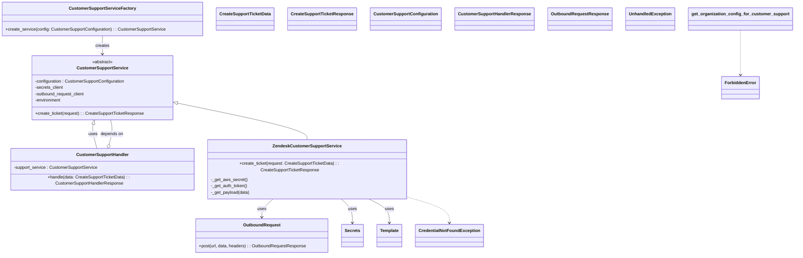
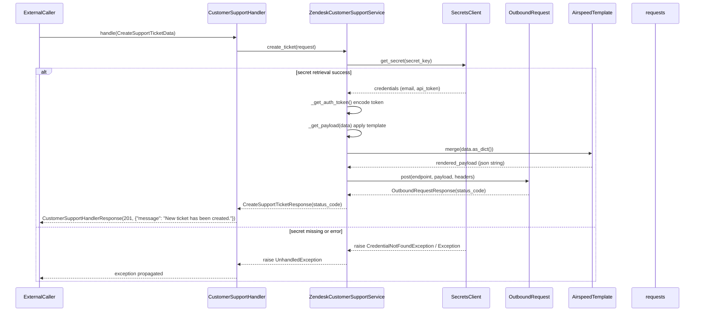

# Diagram: common/support_service/support_service/service/customer_support_handler.py

> Auto-generated by Obscura crawlers

## Diagram 1

### SVG

<svg id="container" width="2866.5703125" xmlns="http://www.w3.org/2000/svg" class="classDiagram" height="928" viewBox="0 0 2866.5703125 928" role="graphics-document document" aria-roledescription="class"><g><defs><marker id="container_class-aggregationStart" class="marker aggregation class" refX="18" refY="7" markerWidth="190" markerHeight="240" orient="auto"><path d="M 18,7 L9,13 L1,7 L9,1 Z"></path></marker></defs><defs><marker id="container_class-aggregationEnd" class="marker aggregation class" refX="1" refY="7" markerWidth="20" markerHeight="28" orient="auto"><path d="M 18,7 L9,13 L1,7 L9,1 Z"></path></marker></defs><defs><marker id="container_class-extensionStart" class="marker extension class" refX="18" refY="7" markerWidth="190" markerHeight="240" orient="auto"><path d="M 1,7 L18,13 V 1 Z"></path></marker></defs><defs><marker id="container_class-extensionEnd" class="marker extension class" refX="1" refY="7" markerWidth="20" markerHeight="28" orient="auto"><path d="M 1,1 V 13 L18,7 Z"></path></marker></defs><defs><marker id="container_class-compositionStart" class="marker composition class" refX="18" refY="7" markerWidth="190" markerHeight="240" orient="auto"><path d="M 18,7 L9,13 L1,7 L9,1 Z"></path></marker></defs><defs><marker id="container_class-compositionEnd" class="marker composition class" refX="1" refY="7" markerWidth="20" markerHeight="28" orient="auto"><path d="M 18,7 L9,13 L1,7 L9,1 Z"></path></marker></defs><defs><marker id="container_class-dependencyStart" class="marker dependency class" refX="6" refY="7" markerWidth="190" markerHeight="240" orient="auto"><path d="M 5,7 L9,13 L1,7 L9,1 Z"></path></marker></defs><defs><marker id="container_class-dependencyEnd" class="marker dependency class" refX="13" refY="7" markerWidth="20" markerHeight="28" orient="auto"><path d="M 18,7 L9,13 L14,7 L9,1 Z"></path></marker></defs><defs><marker id="container_class-lollipopStart" class="marker lollipop class" refX="13" refY="7" markerWidth="190" markerHeight="240" orient="auto"><circle stroke="black" fill="transparent" cx="7" cy="7" r="6"></circle></marker></defs><defs><marker id="container_class-lollipopEnd" class="marker lollipop class" refX="1" refY="7" markerWidth="190" markerHeight="240" orient="auto"><circle stroke="black" fill="transparent" cx="7" cy="7" r="6"></circle></marker></defs><g class="root"><g class="clusters"></g><g class="edgePaths"><path d="M654.64,385.072L735.381,401.727C816.121,418.382,977.601,451.691,1058.342,474.512C1139.082,497.333,1139.082,509.667,1139.082,515.833L1139.082,522" id="id_CustomerSupportService_ZendeskCustomerSupportService_1" class="edge-thickness-normal edge-pattern-solid relation" style=";;;" data-edge="true" data-et="edge" data-id="id_CustomerSupportService_ZendeskCustomerSupportService_1" data-points="W3sieCI6NjM3Ljc0NjA5Mzc1LCJ5IjozODEuNTg3NjI3Mjc4Njk5M30seyJ4IjoxMTM5LjA4MjAzMTI1LCJ5Ijo0ODV9LHsieCI6MTEzOS4wODIwMzEyNSwieSI6NTIyfV0=" marker-start="url(#container_class-extensionStart)"></path><path d="M343.368,464.723L342.513,468.103C341.658,471.482,339.948,478.241,342.208,492.287C344.469,506.333,350.699,527.667,353.814,538.333L356.929,549" id="id_CustomerSupportService_CustomerSupportHandler_2" class="edge-thickness-normal edge-pattern-solid relation" style=";;;" data-edge="true" data-et="edge" data-id="id_CustomerSupportService_CustomerSupportHandler_2" data-points="W3sieCI6MzQ3LjU5ODc1MDk5NTIyMjkzLCJ5Ijo0NDh9LHsieCI6MzM4LjIzODI4MTI1LCJ5Ijo0ODV9LHsieCI6MzU2LjkyOTQ1NzcyMDU4ODIzLCJ5Ijo1NDl9XQ==" marker-start="url(#container_class-extensionStart)"></path><path d="M403.82,532.442L406.13,524.535C408.439,516.628,413.057,500.814,413.806,486.74C414.556,472.667,411.435,460.333,409.875,454.167L408.315,448" id="id_CustomerSupportHandler_CustomerSupportService_3" class="edge-thickness-normal edge-pattern-solid relation" style=";;;" data-edge="true" data-et="edge" data-id="id_CustomerSupportHandler_CustomerSupportService_3" data-points="W3sieCI6Mzk4Ljk4NDYwNDc3OTQxMTc3LCJ5Ijo1NDl9LHsieCI6NDE3LjY3NTc4MTI1LCJ5Ijo0ODV9LHsieCI6NDA4LjMxNTMxMTUwNDc3NzA3LCJ5Ijo0NDh9XQ==" marker-start="url(#container_class-aggregationStart)"></path><path d="M1017.246,720L1009.657,726.167C1002.067,732.333,986.889,744.667,979.3,756C971.711,767.333,971.711,777.667,971.711,782.833L971.711,788" id="id_ZendeskCustomerSupportService_OutboundRequest_4" class="edge-thickness-normal edge-pattern-solid relation" style=";;;" data-edge="true" data-et="edge" data-id="id_ZendeskCustomerSupportService_OutboundRequest_4" data-points="W3sieCI6MTAxNy4yNDU3MjAzNTg0NTU5LCJ5Ijo3MjB9LHsieCI6OTcxLjcxMDkzNzUsInkiOjc1N30seyJ4Ijo5NzEuNzEwOTM3NSwieSI6Nzk0fV0=" marker-end="url(#container_class-dependencyEnd)"></path><path d="M1260.918,720L1268.507,726.167C1276.097,732.333,1291.275,744.667,1298.864,759.5C1306.453,774.333,1306.453,791.667,1306.453,800.333L1306.453,809" id="id_ZendeskCustomerSupportService_Secrets_5" class="edge-thickness-normal edge-pattern-solid relation" style=";;;" data-edge="true" data-et="edge" data-id="id_ZendeskCustomerSupportService_Secrets_5" data-points="W3sieCI6MTI2MC45MTgzNDIxNDE1NDQxLCJ5Ijo3MjB9LHsieCI6MTMwNi40NTMxMjUsInkiOjc1N30seyJ4IjoxMzA2LjQ1MzEyNSwieSI6ODE1fV0=" marker-end="url(#container_class-dependencyEnd)"></path><path d="M1359.247,720L1372.961,726.167C1386.675,732.333,1414.103,744.667,1427.817,759.5C1441.531,774.333,1441.531,791.667,1441.531,800.333L1441.531,809" id="id_ZendeskCustomerSupportService_Template_6" class="edge-thickness-normal edge-pattern-solid relation" style=";;;" data-edge="true" data-et="edge" data-id="id_ZendeskCustomerSupportService_Template_6" data-points="W3sieCI6MTM1OS4yNDcyNzEzNjk0ODU0LCJ5Ijo3MjB9LHsieCI6MTQ0MS41MzEyNSwieSI6NzU3fSx7IngiOjE0NDEuNTMxMjUsInkiOjgxNX1d" marker-end="url(#container_class-dependencyEnd)"></path><path d="M377.957,134L377.957,140.167C377.957,146.333,377.957,158.667,377.957,170C377.957,181.333,377.957,191.667,377.957,196.833L377.957,202" id="id_CustomerSupportServiceFactory_CustomerSupportService_7" class="edge-thickness-normal edge-pattern-solid relation" style=";;;" data-edge="true" data-et="edge" data-id="id_CustomerSupportServiceFactory_CustomerSupportService_7" data-points="W3sieCI6Mzc3Ljk1NzAzMTI1LCJ5IjoxMzR9LHsieCI6Mzc3Ljk1NzAzMTI1LCJ5IjoxNzF9LHsieCI6Mzc3Ljk1NzAzMTI1LCJ5IjoyMDh9XQ==" marker-end="url(#container_class-dependencyEnd)"></path><path d="M1508.531,717.783L1533.482,724.319C1558.432,730.855,1608.333,743.928,1633.284,759.13C1658.234,774.333,1658.234,791.667,1658.234,800.333L1658.234,809" id="id_ZendeskCustomerSupportService_CredentialNotFoundException_8" class="edge-thickness-normal edge-pattern-dashed relation" style=";;;" data-edge="true" data-et="edge" data-id="id_ZendeskCustomerSupportService_CredentialNotFoundException_8" data-points="W3sieCI6MTUwOC41MzEyNSwieSI6NzE3Ljc4Mjk0Njk2MTMxNzZ9LHsieCI6MTY1OC4yMzQzNzUsInkiOjc1N30seyJ4IjoxNjU4LjIzNDM3NSwieSI6ODE1fV0=" marker-end="url(#container_class-dependencyEnd)"></path><path d="M2674.094,113L2674.094,122.667C2674.094,132.333,2674.094,151.667,2674.094,179.5C2674.094,207.333,2674.094,243.667,2674.094,261.833L2674.094,280" id="id_get_organization_config_for_customer_support_ForbiddenError_9" class="edge-thickness-normal edge-pattern-dashed relation" style=";;;" data-edge="true" data-et="edge" data-id="id_get_organization_config_for_customer_support_ForbiddenError_9" data-points="W3sieCI6MjY3NC4wOTM3NSwieSI6MTEzfSx7IngiOjI2NzQuMDkzNzUsInkiOjE3MX0seyJ4IjoyNjc0LjA5Mzc1LCJ5IjoyODZ9XQ==" marker-end="url(#container_class-dependencyEnd)"></path></g><g class="edgeLabels"><g class="edgeLabel"><g class="label" data-id="id_CustomerSupportService_ZendeskCustomerSupportService_1" transform="translate(0, 0)"><foreignObject width="0" height="0">

</foreignObject></g></g><g class="edgeLabel" transform="translate(342.23421, 498.68237)"><g class="label" data-id="id_CustomerSupportService_CustomerSupportHandler_2" transform="translate(-16.4921875, -12)"><foreignObject width="32.984375" height="24">

uses

</foreignObject></g></g><g class="edgeLabel" transform="translate(413.67985, 498.68237)"><g class="label" data-id="id_CustomerSupportHandler_CustomerSupportService_3" transform="translate(-42.9453125, -12)"><foreignObject width="85.890625" height="24">

depends on

</foreignObject></g></g><g class="edgeLabel" transform="translate(971.7109375, 757)"><g class="label" data-id="id_ZendeskCustomerSupportService_OutboundRequest_4" transform="translate(-16.4921875, -12)"><foreignObject width="32.984375" height="24">

uses

</foreignObject></g></g><g class="edgeLabel" transform="translate(1306.453125, 757)"><g class="label" data-id="id_ZendeskCustomerSupportService_Secrets_5" transform="translate(-16.4921875, -12)"><foreignObject width="32.984375" height="24">

uses

</foreignObject></g></g><g class="edgeLabel" transform="translate(1441.53125, 757)"><g class="label" data-id="id_ZendeskCustomerSupportService_Template_6" transform="translate(-16.4921875, -12)"><foreignObject width="32.984375" height="24">

uses

</foreignObject></g></g><g class="edgeLabel" transform="translate(377.95703125, 171)"><g class="label" data-id="id_CustomerSupportServiceFactory_CustomerSupportService_7" transform="translate(-26.171875, -12)"><foreignObject width="52.34375" height="24">

creates

</foreignObject></g></g><g class="edgeLabel"><g class="label" data-id="id_ZendeskCustomerSupportService_CredentialNotFoundException_8" transform="translate(0, 0)"><foreignObject width="0" height="0">

</foreignObject></g></g><g class="edgeLabel"><g class="label" data-id="id_get_organization_config_for_customer_support_ForbiddenError_9" transform="translate(0, 0)"><foreignObject width="0" height="0">

</foreignObject></g></g></g><g class="nodes"><g class="node default" id="classId-OutboundRequest-0" transform="translate(971.7109375, 857)"><g class="basic label-container"><path d="M-245.578125 -63 L245.578125 -63 L245.578125 63 L-245.578125 63" stroke="none" stroke-width="0" fill="#ECECFF" style=""></path><path d="M-245.578125 -63 C-125.6898004273796 -63, -5.80147585475919 -63, 245.578125 -63 M-245.578125 -63 C-98.81656270864676 -63, 47.94499958270649 -63, 245.578125 -63 M245.578125 -63 C245.578125 -16.736634665476835, 245.578125 29.52673066904633, 245.578125 63 M245.578125 -63 C245.578125 -16.21655560639031, 245.578125 30.566888787219384, 245.578125 63 M245.578125 63 C121.79116932748312 63, -1.995786345033764 63, -245.578125 63 M245.578125 63 C89.6273874760181 63, -66.3233500479638 63, -245.578125 63 M-245.578125 63 C-245.578125 33.7788786550866, -245.578125 4.557757310173201, -245.578125 -63 M-245.578125 63 C-245.578125 22.545640624234828, -245.578125 -17.908718751530344, -245.578125 -63" stroke="#9370DB" stroke-width="1.3" fill="none" stroke-dasharray="0 0" style=""></path></g><g class="annotation-group text" transform="translate(0, -39)"></g><g class="label-group text" transform="translate(-66.609375, -39)"><g class="label" style="font-weight: bolder" transform="translate(0,-12)"><foreignObject width="133.21875" height="24">

OutboundRequest

</foreignObject></g></g><g class="members-group text" transform="translate(-233.578125, 9)"></g><g class="methods-group text" transform="translate(-233.578125, 39)"><g class="label" style="" transform="translate(0,-12)"><foreignObject width="400.546875" height="24">

+post(url, data, headers) : : OutboundRequestResponse

</foreignObject></g></g><g class="divider" style=""><path d="M-245.578125 -15 C-67.32435012038422 -15, 110.92942475923155 -15, 245.578125 -15 M-245.578125 -15 C-132.57550057076813 -15, -19.572876141536256 -15, 245.578125 -15" stroke="#9370DB" stroke-width="1.3" fill="none" stroke-dasharray="0 0" style=""></path></g><g class="divider" style=""><path d="M-245.578125 9 C-75.77245279468934 9, 94.03321941062131 9, 245.578125 9 M-245.578125 9 C-63.69863592841952 9, 118.18085314316096 9, 245.578125 9" stroke="#9370DB" stroke-width="1.3" fill="none" stroke-dasharray="0 0" style=""></path></g></g><g class="node default" id="classId-CustomerSupportService-1" transform="translate(377.95703125, 328)"><g class="basic label-container"><path d="M-259.7890625 -120 L259.7890625 -120 L259.7890625 120 L-259.7890625 120" stroke="none" stroke-width="0" fill="#ECECFF" style=""></path><path d="M-259.7890625 -120 C-82.06076543534658 -120, 95.66753162930684 -120, 259.7890625 -120 M-259.7890625 -120 C-125.86254929796439 -120, 8.063963904071215 -120, 259.7890625 -120 M259.7890625 -120 C259.7890625 -71.65662679394924, 259.7890625 -23.313253587898473, 259.7890625 120 M259.7890625 -120 C259.7890625 -34.337698095978965, 259.7890625 51.32460380804207, 259.7890625 120 M259.7890625 120 C145.45051809739323 120, 31.111973694786457 120, -259.7890625 120 M259.7890625 120 C70.27460446328652 120, -119.23985357342696 120, -259.7890625 120 M-259.7890625 120 C-259.7890625 36.74308866256479, -259.7890625 -46.513822674870426, -259.7890625 -120 M-259.7890625 120 C-259.7890625 69.7568464425539, -259.7890625 19.5136928851078, -259.7890625 -120" stroke="#9370DB" stroke-width="1.3" fill="none" stroke-dasharray="0 0" style=""></path></g><g class="annotation-group text" transform="translate(-38.609375, -96)"><g class="label" style="" transform="translate(0,-12)"><foreignObject width="77.21875" height="24">

«abstract»

</foreignObject></g></g><g class="label-group text" transform="translate(-91.234375, -72)"><g class="label" style="font-weight: bolder" transform="translate(0,-12)"><foreignObject width="182.46875" height="24">

CustomerSupportService

</foreignObject></g></g><g class="members-group text" transform="translate(-247.7890625, -24)"><g class="label" style="" transform="translate(0,-12)"><foreignObject width="339.484375" height="24">

-configuration : CustomerSupportConfiguration

</foreignObject></g><g class="label" style="" transform="translate(0,12)"><foreignObject width="106.359375" height="24">

-secrets_client

</foreignObject></g><g class="label" style="" transform="translate(0,36)"><foreignObject width="190.296875" height="24">

-outbound_request_client

</foreignObject></g><g class="label" style="" transform="translate(0,60)"><foreignObject width="98.828125" height="24">

-environment

</foreignObject></g></g><g class="methods-group text" transform="translate(-247.7890625, 96)"><g class="label" style="" transform="translate(0,-12)"><foreignObject width="404.34375" height="24">

+create_ticket(request) : : CreateSupportTicketResponse

</foreignObject></g></g><g class="divider" style=""><path d="M-259.7890625 -48 C-128.69279790832758 -48, 2.4034666833448455 -48, 259.7890625 -48 M-259.7890625 -48 C-148.34335349320904 -48, -36.89764448641807 -48, 259.7890625 -48" stroke="#9370DB" stroke-width="1.3" fill="none" stroke-dasharray="0 0" style=""></path></g><g class="divider" style=""><path d="M-259.7890625 72 C-147.37859094154481 72, -34.9681193830896 72, 259.7890625 72 M-259.7890625 72 C-98.44136168963382 72, 62.906339120732355 72, 259.7890625 72" stroke="#9370DB" stroke-width="1.3" fill="none" stroke-dasharray="0 0" style=""></path></g></g><g class="node default" id="classId-CustomerSupportHandler-2" transform="translate(377.95703125, 621)"><g class="basic label-container"><path d="M-341.67578125 -72 L341.67578125 -72 L341.67578125 72 L-341.67578125 72" stroke="none" stroke-width="0" fill="#ECECFF" style=""></path><path d="M-341.67578125 -72 C-154.13979446367014 -72, 33.396192322659715 -72, 341.67578125 -72 M-341.67578125 -72 C-123.80015149521358 -72, 94.07547825957283 -72, 341.67578125 -72 M341.67578125 -72 C341.67578125 -23.71063781251189, 341.67578125 24.57872437497622, 341.67578125 72 M341.67578125 -72 C341.67578125 -18.9068882674178, 341.67578125 34.1862234651644, 341.67578125 72 M341.67578125 72 C75.28847651882722 72, -191.09882821234555 72, -341.67578125 72 M341.67578125 72 C166.11196316726964 72, -9.451854915460729 72, -341.67578125 72 M-341.67578125 72 C-341.67578125 23.909121362220837, -341.67578125 -24.181757275558326, -341.67578125 -72 M-341.67578125 72 C-341.67578125 24.249459318955296, -341.67578125 -23.50108136208941, -341.67578125 -72" stroke="#9370DB" stroke-width="1.3" fill="none" stroke-dasharray="0 0" style=""></path></g><g class="annotation-group text" transform="translate(0, -48)"></g><g class="label-group text" transform="translate(-93.6796875, -48)"><g class="label" style="font-weight: bolder" transform="translate(0,-12)"><foreignObject width="187.359375" height="24">

CustomerSupportHandler

</foreignObject></g></g><g class="members-group text" transform="translate(-329.67578125, 0)"><g class="label" style="" transform="translate(0,-12)"><foreignObject width="314.328125" height="24">

-support_service : CustomerSupportService

</foreignObject></g></g><g class="methods-group text" transform="translate(-329.67578125, 48)"><g class="label" style="" transform="translate(0,-12)"><foreignObject width="565.671875" height="24">

+handle(data: CreateSupportTicketData) : : CustomerSupportHandlerResponse

</foreignObject></g></g><g class="divider" style=""><path d="M-341.67578125 -24 C-137.080048521734 -24, 67.515684206532 -24, 341.67578125 -24 M-341.67578125 -24 C-121.53875166848653 -24, 98.59827791302695 -24, 341.67578125 -24" stroke="#9370DB" stroke-width="1.3" fill="none" stroke-dasharray="0 0" style=""></path></g><g class="divider" style=""><path d="M-341.67578125 24 C-80.80860304649912 24, 180.05857515700177 24, 341.67578125 24 M-341.67578125 24 C-107.97060880089396 24, 125.73456364821209 24, 341.67578125 24" stroke="#9370DB" stroke-width="1.3" fill="none" stroke-dasharray="0 0" style=""></path></g></g><g class="node default" id="classId-ZendeskCustomerSupportService-3" transform="translate(1139.08203125, 621)"><g class="basic label-container"><path d="M-369.44921875 -99 L369.44921875 -99 L369.44921875 99 L-369.44921875 99" stroke="none" stroke-width="0" fill="#ECECFF" style=""></path><path d="M-369.44921875 -99 C-90.03086554526107 -99, 189.38748765947787 -99, 369.44921875 -99 M-369.44921875 -99 C-217.62447346552494 -99, -65.79972818104989 -99, 369.44921875 -99 M369.44921875 -99 C369.44921875 -44.240439337558044, 369.44921875 10.519121324883912, 369.44921875 99 M369.44921875 -99 C369.44921875 -36.21634626184618, 369.44921875 26.567307476307633, 369.44921875 99 M369.44921875 99 C85.49610664750878 99, -198.45700545498244 99, -369.44921875 99 M369.44921875 99 C205.9476733051108 99, 42.44612786022162 99, -369.44921875 99 M-369.44921875 99 C-369.44921875 41.32723152288411, -369.44921875 -16.345536954231775, -369.44921875 -99 M-369.44921875 99 C-369.44921875 23.7471906076766, -369.44921875 -51.5056187846468, -369.44921875 -99" stroke="#9370DB" stroke-width="1.3" fill="none" stroke-dasharray="0 0" style=""></path></g><g class="annotation-group text" transform="translate(0, -75)"></g><g class="label-group text" transform="translate(-121.9453125, -75)"><g class="label" style="font-weight: bolder" transform="translate(0,-12)"><foreignObject width="243.890625" height="24">

ZendeskCustomerSupportService

</foreignObject></g></g><g class="members-group text" transform="translate(-357.44921875, -27)"></g><g class="methods-group text" transform="translate(-357.44921875, 3)"><g class="label" style="" transform="translate(0,-12)"><foreignObject width="592.953125" height="24">

+create_ticket(request: CreateSupportTicketData) : : CreateSupportTicketResponse

</foreignObject></g><g class="label" style="" transform="translate(0,12)"><foreignObject width="134.171875" height="24">

-_get_aws_secret()

</foreignObject></g><g class="label" style="" transform="translate(0,36)"><foreignObject width="136.765625" height="24">

-_get_auth_token()

</foreignObject></g><g class="label" style="" transform="translate(0,60)"><foreignObject width="145.265625" height="24">

-_get_payload(data)

</foreignObject></g></g><g class="divider" style=""><path d="M-369.44921875 -51 C-106.12655608403225 -51, 157.1961065819355 -51, 369.44921875 -51 M-369.44921875 -51 C-210.6482242474434 -51, -51.84722974488682 -51, 369.44921875 -51" stroke="#9370DB" stroke-width="1.3" fill="none" stroke-dasharray="0 0" style=""></path></g><g class="divider" style=""><path d="M-369.44921875 -27 C-217.62385205821553 -27, -65.79848536643107 -27, 369.44921875 -27 M-369.44921875 -27 C-103.46968050501556 -27, 162.50985773996888 -27, 369.44921875 -27" stroke="#9370DB" stroke-width="1.3" fill="none" stroke-dasharray="0 0" style=""></path></g></g><g class="node default" id="classId-CustomerSupportServiceFactory-4" transform="translate(377.95703125, 71)"><g class="basic label-container"><path d="M-369.95703125 -63 L369.95703125 -63 L369.95703125 63 L-369.95703125 63" stroke="none" stroke-width="0" fill="#ECECFF" style=""></path><path d="M-369.95703125 -63 C-146.8112868348794 -63, 76.33445758024118 -63, 369.95703125 -63 M-369.95703125 -63 C-171.74757588061914 -63, 26.461879488761724 -63, 369.95703125 -63 M369.95703125 -63 C369.95703125 -37.03316520917807, 369.95703125 -11.066330418356145, 369.95703125 63 M369.95703125 -63 C369.95703125 -23.103854409135685, 369.95703125 16.79229118172863, 369.95703125 63 M369.95703125 63 C120.71678662875985 63, -128.5234579924803 63, -369.95703125 63 M369.95703125 63 C105.7173483454913 63, -158.5223345590174 63, -369.95703125 63 M-369.95703125 63 C-369.95703125 37.09074840614227, -369.95703125 11.181496812284536, -369.95703125 -63 M-369.95703125 63 C-369.95703125 19.07331532793482, -369.95703125 -24.853369344130357, -369.95703125 -63" stroke="#9370DB" stroke-width="1.3" fill="none" stroke-dasharray="0 0" style=""></path></g><g class="annotation-group text" transform="translate(0, -39)"></g><g class="label-group text" transform="translate(-117.8359375, -39)"><g class="label" style="font-weight: bolder" transform="translate(0,-12)"><foreignObject width="235.671875" height="24">

CustomerSupportServiceFactory

</foreignObject></g></g><g class="members-group text" transform="translate(-357.95703125, 9)"></g><g class="methods-group text" transform="translate(-357.95703125, 39)"><g class="label" style="" transform="translate(0,-12)"><foreignObject width="598.078125" height="24">

+create_service(config: CustomerSupportConfiguration) : : CustomerSupportService

</foreignObject></g></g><g class="divider" style=""><path d="M-369.95703125 -15 C-120.100700354552 -15, 129.755630540896 -15, 369.95703125 -15 M-369.95703125 -15 C-113.60067703278628 -15, 142.75567718442744 -15, 369.95703125 -15" stroke="#9370DB" stroke-width="1.3" fill="none" stroke-dasharray="0 0" style=""></path></g><g class="divider" style=""><path d="M-369.95703125 9 C-87.92060363032834 9, 194.1158239893433 9, 369.95703125 9 M-369.95703125 9 C-205.72570525057975 9, -41.4943792511595 9, 369.95703125 9" stroke="#9370DB" stroke-width="1.3" fill="none" stroke-dasharray="0 0" style=""></path></g></g><g class="node default" id="classId-CreateSupportTicketData-5" transform="translate(902.2578125, 71)"><g class="basic label-container"><path d="M-104.34375 -42 L104.34375 -42 L104.34375 42 L-104.34375 42" stroke="none" stroke-width="0" fill="#ECECFF" style=""></path><path d="M-104.34375 -42 C-42.3097811596897 -42, 19.724187680620602 -42, 104.34375 -42 M-104.34375 -42 C-48.88811916908985 -42, 6.567511661820305 -42, 104.34375 -42 M104.34375 -42 C104.34375 -11.363750488829034, 104.34375 19.272499022341933, 104.34375 42 M104.34375 -42 C104.34375 -12.288281289322818, 104.34375 17.423437421354365, 104.34375 42 M104.34375 42 C39.47652763281401 42, -25.390694734371976 42, -104.34375 42 M104.34375 42 C42.81756215906092 42, -18.70862568187816 42, -104.34375 42 M-104.34375 42 C-104.34375 24.91283087313529, -104.34375 7.825661746270583, -104.34375 -42 M-104.34375 42 C-104.34375 10.389049447633376, -104.34375 -21.22190110473325, -104.34375 -42" stroke="#9370DB" stroke-width="1.3" fill="none" stroke-dasharray="0 0" style=""></path></g><g class="annotation-group text" transform="translate(0, -18)"></g><g class="label-group text" transform="translate(-92.34375, -18)"><g class="label" style="font-weight: bolder" transform="translate(0,-12)"><foreignObject width="184.6875" height="24">

CreateSupportTicketData

</foreignObject></g></g><g class="members-group text" transform="translate(-92.34375, 30)"></g><g class="methods-group text" transform="translate(-92.34375, 60)"></g><g class="divider" style=""><path d="M-104.34375 6 C-28.391879150475475 6, 47.55999169904905 6, 104.34375 6 M-104.34375 6 C-25.703575103215485 6, 52.93659979356903 6, 104.34375 6" stroke="#9370DB" stroke-width="1.3" fill="none" stroke-dasharray="0 0" style=""></path></g><g class="divider" style=""><path d="M-104.34375 24 C-37.91762870915166 24, 28.508492581696686 24, 104.34375 24 M-104.34375 24 C-22.97458088933945 24, 58.3945882213211 24, 104.34375 24" stroke="#9370DB" stroke-width="1.3" fill="none" stroke-dasharray="0 0" style=""></path></g></g><g class="node default" id="classId-CreateSupportTicketResponse-6" transform="translate(1179.4921875, 71)"><g class="basic label-container"><path d="M-122.890625 -42 L122.890625 -42 L122.890625 42 L-122.890625 42" stroke="none" stroke-width="0" fill="#ECECFF" style=""></path><path d="M-122.890625 -42 C-33.25418825880979 -42, 56.38224848238042 -42, 122.890625 -42 M-122.890625 -42 C-43.925790848492724 -42, 35.03904330301455 -42, 122.890625 -42 M122.890625 -42 C122.890625 -10.126880446800634, 122.890625 21.746239106398733, 122.890625 42 M122.890625 -42 C122.890625 -15.413469850742409, 122.890625 11.173060298515182, 122.890625 42 M122.890625 42 C61.6761940093065 42, 0.4617630186129986 42, -122.890625 42 M122.890625 42 C52.480959982420416 42, -17.92870503515917 42, -122.890625 42 M-122.890625 42 C-122.890625 21.56752137583593, -122.890625 1.135042751671861, -122.890625 -42 M-122.890625 42 C-122.890625 9.26302902748536, -122.890625 -23.47394194502928, -122.890625 -42" stroke="#9370DB" stroke-width="1.3" fill="none" stroke-dasharray="0 0" style=""></path></g><g class="annotation-group text" transform="translate(0, -18)"></g><g class="label-group text" transform="translate(-110.890625, -18)"><g class="label" style="font-weight: bolder" transform="translate(0,-12)"><foreignObject width="221.78125" height="24">

CreateSupportTicketResponse

</foreignObject></g></g><g class="members-group text" transform="translate(-110.890625, 30)"></g><g class="methods-group text" transform="translate(-110.890625, 60)"></g><g class="divider" style=""><path d="M-122.890625 6 C-36.276897155744436 6, 50.33683068851113 6, 122.890625 6 M-122.890625 6 C-50.16317138864578 6, 22.564282222708442 6, 122.890625 6" stroke="#9370DB" stroke-width="1.3" fill="none" stroke-dasharray="0 0" style=""></path></g><g class="divider" style=""><path d="M-122.890625 24 C-37.94233401783711 24, 47.005956964325776 24, 122.890625 24 M-122.890625 24 C-33.82993816366529 24, 55.23074867266942 24, 122.890625 24" stroke="#9370DB" stroke-width="1.3" fill="none" stroke-dasharray="0 0" style=""></path></g></g><g class="node default" id="classId-CustomerSupportConfiguration-7" transform="translate(1478.3359375, 71)"><g class="basic label-container"><path d="M-125.953125 -42 L125.953125 -42 L125.953125 42 L-125.953125 42" stroke="none" stroke-width="0" fill="#ECECFF" style=""></path><path d="M-125.953125 -42 C-42.089567330128375 -42, 41.77399033974325 -42, 125.953125 -42 M-125.953125 -42 C-47.252380767975964 -42, 31.44836346404807 -42, 125.953125 -42 M125.953125 -42 C125.953125 -17.984496986575095, 125.953125 6.031006026849809, 125.953125 42 M125.953125 -42 C125.953125 -11.692963040270172, 125.953125 18.614073919459656, 125.953125 42 M125.953125 42 C40.7311085299919 42, -44.4909079400162 42, -125.953125 42 M125.953125 42 C55.243906158096095 42, -15.46531268380781 42, -125.953125 42 M-125.953125 42 C-125.953125 11.42351242962464, -125.953125 -19.15297514075072, -125.953125 -42 M-125.953125 42 C-125.953125 16.451824361720934, -125.953125 -9.096351276558131, -125.953125 -42" stroke="#9370DB" stroke-width="1.3" fill="none" stroke-dasharray="0 0" style=""></path></g><g class="annotation-group text" transform="translate(0, -18)"></g><g class="label-group text" transform="translate(-113.953125, -18)"><g class="label" style="font-weight: bolder" transform="translate(0,-12)"><foreignObject width="227.90625" height="24">

CustomerSupportConfiguration

</foreignObject></g></g><g class="members-group text" transform="translate(-113.953125, 30)"></g><g class="methods-group text" transform="translate(-113.953125, 60)"></g><g class="divider" style=""><path d="M-125.953125 6 C-64.67423181585603 6, -3.3953386317120646 6, 125.953125 6 M-125.953125 6 C-50.202783096521074 6, 25.547558806957852 6, 125.953125 6" stroke="#9370DB" stroke-width="1.3" fill="none" stroke-dasharray="0 0" style=""></path></g><g class="divider" style=""><path d="M-125.953125 24 C-72.71959182903922 24, -19.48605865807845 24, 125.953125 24 M-125.953125 24 C-35.047966760369306 24, 55.85719147926139 24, 125.953125 24" stroke="#9370DB" stroke-width="1.3" fill="none" stroke-dasharray="0 0" style=""></path></g></g><g class="node default" id="classId-CustomerSupportHandlerResponse-8" transform="translate(1795.40625, 71)"><g class="basic label-container"><path d="M-141.1171875 -42 L141.1171875 -42 L141.1171875 42 L-141.1171875 42" stroke="none" stroke-width="0" fill="#ECECFF" style=""></path><path d="M-141.1171875 -42 C-35.45394747705414 -42, 70.20929254589171 -42, 141.1171875 -42 M-141.1171875 -42 C-75.04658160592908 -42, -8.975975711858155 -42, 141.1171875 -42 M141.1171875 -42 C141.1171875 -16.655798566680485, 141.1171875 8.68840286663903, 141.1171875 42 M141.1171875 -42 C141.1171875 -15.30764661793788, 141.1171875 11.384706764124239, 141.1171875 42 M141.1171875 42 C70.25769349877163 42, -0.6018005024567401 42, -141.1171875 42 M141.1171875 42 C33.251600139639464 42, -74.61398722072107 42, -141.1171875 42 M-141.1171875 42 C-141.1171875 10.329847110798749, -141.1171875 -21.340305778402502, -141.1171875 -42 M-141.1171875 42 C-141.1171875 10.292228789084156, -141.1171875 -21.415542421831688, -141.1171875 -42" stroke="#9370DB" stroke-width="1.3" fill="none" stroke-dasharray="0 0" style=""></path></g><g class="annotation-group text" transform="translate(0, -18)"></g><g class="label-group text" transform="translate(-129.1171875, -18)"><g class="label" style="font-weight: bolder" transform="translate(0,-12)"><foreignObject width="258.234375" height="24">

CustomerSupportHandlerResponse

</foreignObject></g></g><g class="members-group text" transform="translate(-129.1171875, 30)"></g><g class="methods-group text" transform="translate(-129.1171875, 60)"></g><g class="divider" style=""><path d="M-141.1171875 6 C-84.56165444395525 6, -28.006121387910497 6, 141.1171875 6 M-141.1171875 6 C-35.213092340052896 6, 70.69100281989421 6, 141.1171875 6" stroke="#9370DB" stroke-width="1.3" fill="none" stroke-dasharray="0 0" style=""></path></g><g class="divider" style=""><path d="M-141.1171875 24 C-73.92130017924516 24, -6.72541285849033 24, 141.1171875 24 M-141.1171875 24 C-45.305437291238874 24, 50.50631291752225 24, 141.1171875 24" stroke="#9370DB" stroke-width="1.3" fill="none" stroke-dasharray="0 0" style=""></path></g></g><g class="node default" id="classId-OutboundRequestResponse-9" transform="translate(2100.578125, 71)"><g class="basic label-container"><path d="M-114.0546875 -42 L114.0546875 -42 L114.0546875 42 L-114.0546875 42" stroke="none" stroke-width="0" fill="#ECECFF" style=""></path><path d="M-114.0546875 -42 C-61.09745966200788 -42, -8.140231824015757 -42, 114.0546875 -42 M-114.0546875 -42 C-26.640628613270707 -42, 60.77343027345859 -42, 114.0546875 -42 M114.0546875 -42 C114.0546875 -14.254270114464749, 114.0546875 13.491459771070502, 114.0546875 42 M114.0546875 -42 C114.0546875 -20.849145360510857, 114.0546875 0.3017092789782865, 114.0546875 42 M114.0546875 42 C59.397633879861175 42, 4.74058025972235 42, -114.0546875 42 M114.0546875 42 C66.21094756485536 42, 18.367207629710705 42, -114.0546875 42 M-114.0546875 42 C-114.0546875 23.30803754021754, -114.0546875 4.616075080435081, -114.0546875 -42 M-114.0546875 42 C-114.0546875 10.800074575332818, -114.0546875 -20.399850849334364, -114.0546875 -42" stroke="#9370DB" stroke-width="1.3" fill="none" stroke-dasharray="0 0" style=""></path></g><g class="annotation-group text" transform="translate(0, -18)"></g><g class="label-group text" transform="translate(-102.0546875, -18)"><g class="label" style="font-weight: bolder" transform="translate(0,-12)"><foreignObject width="204.109375" height="24">

OutboundRequestResponse

</foreignObject></g></g><g class="members-group text" transform="translate(-102.0546875, 30)"></g><g class="methods-group text" transform="translate(-102.0546875, 60)"></g><g class="divider" style=""><path d="M-114.0546875 6 C-31.586770256152533 6, 50.88114698769493 6, 114.0546875 6 M-114.0546875 6 C-33.33818412624778 6, 47.378319247504436 6, 114.0546875 6" stroke="#9370DB" stroke-width="1.3" fill="none" stroke-dasharray="0 0" style=""></path></g><g class="divider" style=""><path d="M-114.0546875 24 C-59.66267845800844 24, -5.2706694160168865 24, 114.0546875 24 M-114.0546875 24 C-24.98560054194664 24, 64.08348641610672 24, 114.0546875 24" stroke="#9370DB" stroke-width="1.3" fill="none" stroke-dasharray="0 0" style=""></path></g></g><g class="node default" id="classId-CredentialNotFoundException-10" transform="translate(1658.234375, 857)"><g class="basic label-container"><path d="M-120.7890625 -42 L120.7890625 -42 L120.7890625 42 L-120.7890625 42" stroke="none" stroke-width="0" fill="#ECECFF" style=""></path><path d="M-120.7890625 -42 C-43.99486852724236 -42, 32.79932544551528 -42, 120.7890625 -42 M-120.7890625 -42 C-59.48511874576366 -42, 1.818825008472686 -42, 120.7890625 -42 M120.7890625 -42 C120.7890625 -14.589519491108309, 120.7890625 12.820961017783382, 120.7890625 42 M120.7890625 -42 C120.7890625 -21.149557433214085, 120.7890625 -0.29911486642816953, 120.7890625 42 M120.7890625 42 C54.98371294140169 42, -10.821636617196617 42, -120.7890625 42 M120.7890625 42 C44.133382728175405 42, -32.52229704364919 42, -120.7890625 42 M-120.7890625 42 C-120.7890625 9.646714352359908, -120.7890625 -22.706571295280185, -120.7890625 -42 M-120.7890625 42 C-120.7890625 24.176874088350598, -120.7890625 6.353748176701195, -120.7890625 -42" stroke="#9370DB" stroke-width="1.3" fill="none" stroke-dasharray="0 0" style=""></path></g><g class="annotation-group text" transform="translate(0, -18)"></g><g class="label-group text" transform="translate(-108.7890625, -18)"><g class="label" style="font-weight: bolder" transform="translate(0,-12)"><foreignObject width="217.578125" height="24">

CredentialNotFoundException

</foreignObject></g></g><g class="members-group text" transform="translate(-108.7890625, 30)"></g><g class="methods-group text" transform="translate(-108.7890625, 60)"></g><g class="divider" style=""><path d="M-120.7890625 6 C-35.607386105679694 6, 49.57429028864061 6, 120.7890625 6 M-120.7890625 6 C-26.306355326764347 6, 68.1763518464713 6, 120.7890625 6" stroke="#9370DB" stroke-width="1.3" fill="none" stroke-dasharray="0 0" style=""></path></g><g class="divider" style=""><path d="M-120.7890625 24 C-69.01567654921614 24, -17.242290598432277 24, 120.7890625 24 M-120.7890625 24 C-51.186348060644846 24, 18.416366378710308 24, 120.7890625 24" stroke="#9370DB" stroke-width="1.3" fill="none" stroke-dasharray="0 0" style=""></path></g></g><g class="node default" id="classId-ForbiddenError-11" transform="translate(2674.09375, 328)"><g class="basic label-container"><path d="M-67.3515625 -42 L67.3515625 -42 L67.3515625 42 L-67.3515625 42" stroke="none" stroke-width="0" fill="#ECECFF" style=""></path><path d="M-67.3515625 -42 C-15.185332192995858 -42, 36.98089811400828 -42, 67.3515625 -42 M-67.3515625 -42 C-23.033575747808122 -42, 21.284411004383756 -42, 67.3515625 -42 M67.3515625 -42 C67.3515625 -22.643196214105373, 67.3515625 -3.286392428210746, 67.3515625 42 M67.3515625 -42 C67.3515625 -24.910749450400445, 67.3515625 -7.82149890080089, 67.3515625 42 M67.3515625 42 C34.064786359833704 42, 0.7780102196674079 42, -67.3515625 42 M67.3515625 42 C32.38363179719612 42, -2.584298905607767 42, -67.3515625 42 M-67.3515625 42 C-67.3515625 10.495528884428673, -67.3515625 -21.008942231142655, -67.3515625 -42 M-67.3515625 42 C-67.3515625 20.84571729163832, -67.3515625 -0.30856541672336135, -67.3515625 -42" stroke="#9370DB" stroke-width="1.3" fill="none" stroke-dasharray="0 0" style=""></path></g><g class="annotation-group text" transform="translate(0, -18)"></g><g class="label-group text" transform="translate(-55.3515625, -18)"><g class="label" style="font-weight: bolder" transform="translate(0,-12)"><foreignObject width="110.703125" height="24">

ForbiddenError

</foreignObject></g></g><g class="members-group text" transform="translate(-55.3515625, 30)"></g><g class="methods-group text" transform="translate(-55.3515625, 60)"></g><g class="divider" style=""><path d="M-67.3515625 6 C-32.70767700992758 6, 1.9362084801448418 6, 67.3515625 6 M-67.3515625 6 C-35.47460764333468 6, -3.5976527866693644 6, 67.3515625 6" stroke="#9370DB" stroke-width="1.3" fill="none" stroke-dasharray="0 0" style=""></path></g><g class="divider" style=""><path d="M-67.3515625 24 C-15.72201108525097 24, 35.90754032949806 24, 67.3515625 24 M-67.3515625 24 C-16.089389188642564 24, 35.17278412271487 24, 67.3515625 24" stroke="#9370DB" stroke-width="1.3" fill="none" stroke-dasharray="0 0" style=""></path></g></g><g class="node default" id="classId-UnhandledException-12" transform="translate(2352.125, 71)"><g class="basic label-container"><path d="M-87.4921875 -42 L87.4921875 -42 L87.4921875 42 L-87.4921875 42" stroke="none" stroke-width="0" fill="#ECECFF" style=""></path><path d="M-87.4921875 -42 C-17.715708850704686 -42, 52.06076979859063 -42, 87.4921875 -42 M-87.4921875 -42 C-46.40263664907636 -42, -5.313085798152727 -42, 87.4921875 -42 M87.4921875 -42 C87.4921875 -20.884291939614016, 87.4921875 0.23141612077196783, 87.4921875 42 M87.4921875 -42 C87.4921875 -19.445103368881192, 87.4921875 3.1097932622376163, 87.4921875 42 M87.4921875 42 C37.408763798289975 42, -12.67465990342005 42, -87.4921875 42 M87.4921875 42 C40.06835201182545 42, -7.355483476349093 42, -87.4921875 42 M-87.4921875 42 C-87.4921875 23.457116215111725, -87.4921875 4.91423243022345, -87.4921875 -42 M-87.4921875 42 C-87.4921875 19.628836346162334, -87.4921875 -2.742327307675332, -87.4921875 -42" stroke="#9370DB" stroke-width="1.3" fill="none" stroke-dasharray="0 0" style=""></path></g><g class="annotation-group text" transform="translate(0, -18)"></g><g class="label-group text" transform="translate(-75.4921875, -18)"><g class="label" style="font-weight: bolder" transform="translate(0,-12)"><foreignObject width="150.984375" height="24">

UnhandledException

</foreignObject></g></g><g class="members-group text" transform="translate(-75.4921875, 30)"></g><g class="methods-group text" transform="translate(-75.4921875, 60)"></g><g class="divider" style=""><path d="M-87.4921875 6 C-26.70649621984562 6, 34.07919506030876 6, 87.4921875 6 M-87.4921875 6 C-37.75246152883453 6, 11.98726444233094 6, 87.4921875 6" stroke="#9370DB" stroke-width="1.3" fill="none" stroke-dasharray="0 0" style=""></path></g><g class="divider" style=""><path d="M-87.4921875 24 C-25.278066322198704 24, 36.93605485560259 24, 87.4921875 24 M-87.4921875 24 C-28.355193138963955 24, 30.78180122207209 24, 87.4921875 24" stroke="#9370DB" stroke-width="1.3" fill="none" stroke-dasharray="0 0" style=""></path></g></g><g class="node default" id="classId-Secrets-13" transform="translate(1306.453125, 857)"><g class="basic label-container"><path d="M-39.1640625 -42 L39.1640625 -42 L39.1640625 42 L-39.1640625 42" stroke="none" stroke-width="0" fill="#ECECFF" style=""></path><path d="M-39.1640625 -42 C-19.44190601200461 -42, 0.28025047599078334 -42, 39.1640625 -42 M-39.1640625 -42 C-12.03695204591833 -42, 15.09015840816334 -42, 39.1640625 -42 M39.1640625 -42 C39.1640625 -8.43837436164128, 39.1640625 25.12325127671744, 39.1640625 42 M39.1640625 -42 C39.1640625 -14.61653421680483, 39.1640625 12.76693156639034, 39.1640625 42 M39.1640625 42 C16.416887058193126 42, -6.330288383613748 42, -39.1640625 42 M39.1640625 42 C19.89678170316094 42, 0.6295009063218799 42, -39.1640625 42 M-39.1640625 42 C-39.1640625 13.679568679764742, -39.1640625 -14.640862640470516, -39.1640625 -42 M-39.1640625 42 C-39.1640625 24.82940071078897, -39.1640625 7.658801421577941, -39.1640625 -42" stroke="#9370DB" stroke-width="1.3" fill="none" stroke-dasharray="0 0" style=""></path></g><g class="annotation-group text" transform="translate(0, -18)"></g><g class="label-group text" transform="translate(-27.1640625, -18)"><g class="label" style="font-weight: bolder" transform="translate(0,-12)"><foreignObject width="54.328125" height="24">

Secrets

</foreignObject></g></g><g class="members-group text" transform="translate(-27.1640625, 30)"></g><g class="methods-group text" transform="translate(-27.1640625, 60)"></g><g class="divider" style=""><path d="M-39.1640625 6 C-15.666049060502466 6, 7.8319643789950675 6, 39.1640625 6 M-39.1640625 6 C-13.41341336435287 6, 12.33723577129426 6, 39.1640625 6" stroke="#9370DB" stroke-width="1.3" fill="none" stroke-dasharray="0 0" style=""></path></g><g class="divider" style=""><path d="M-39.1640625 24 C-18.987389237451126 24, 1.1892840250977486 24, 39.1640625 24 M-39.1640625 24 C-21.045275354152015 24, -2.926488208304029 24, 39.1640625 24" stroke="#9370DB" stroke-width="1.3" fill="none" stroke-dasharray="0 0" style=""></path></g></g><g class="node default" id="classId-Template-14" transform="translate(1441.53125, 857)"><g class="basic label-container"><path d="M-45.9140625 -42 L45.9140625 -42 L45.9140625 42 L-45.9140625 42" stroke="none" stroke-width="0" fill="#ECECFF" style=""></path><path d="M-45.9140625 -42 C-14.118441395443874 -42, 17.677179709112252 -42, 45.9140625 -42 M-45.9140625 -42 C-11.760014068287376 -42, 22.39403436342525 -42, 45.9140625 -42 M45.9140625 -42 C45.9140625 -12.261591413144767, 45.9140625 17.476817173710465, 45.9140625 42 M45.9140625 -42 C45.9140625 -24.13401092041103, 45.9140625 -6.268021840822058, 45.9140625 42 M45.9140625 42 C25.673099765112802 42, 5.432137030225604 42, -45.9140625 42 M45.9140625 42 C10.930398473701985 42, -24.05326555259603 42, -45.9140625 42 M-45.9140625 42 C-45.9140625 21.03947668212311, -45.9140625 0.07895336424621746, -45.9140625 -42 M-45.9140625 42 C-45.9140625 19.729845277013304, -45.9140625 -2.540309445973392, -45.9140625 -42" stroke="#9370DB" stroke-width="1.3" fill="none" stroke-dasharray="0 0" style=""></path></g><g class="annotation-group text" transform="translate(0, -18)"></g><g class="label-group text" transform="translate(-33.9140625, -18)"><g class="label" style="font-weight: bolder" transform="translate(0,-12)"><foreignObject width="67.828125" height="24">

Template

</foreignObject></g></g><g class="members-group text" transform="translate(-33.9140625, 30)"></g><g class="methods-group text" transform="translate(-33.9140625, 60)"></g><g class="divider" style=""><path d="M-45.9140625 6 C-13.81933537259684 6, 18.27539175480632 6, 45.9140625 6 M-45.9140625 6 C-24.83854660431096 6, -3.763030708621919 6, 45.9140625 6" stroke="#9370DB" stroke-width="1.3" fill="none" stroke-dasharray="0 0" style=""></path></g><g class="divider" style=""><path d="M-45.9140625 24 C-23.63619882557428 24, -1.3583351511485589 24, 45.9140625 24 M-45.9140625 24 C-21.33739945081589 24, 3.2392635983682183 24, 45.9140625 24" stroke="#9370DB" stroke-width="1.3" fill="none" stroke-dasharray="0 0" style=""></path></g></g><g class="node default" id="classId-get_organization_config_for_customer_support-15" transform="translate(2674.09375, 71)"><g class="basic label-container"><path d="M-184.4765625 -42 L184.4765625 -42 L184.4765625 42 L-184.4765625 42" stroke="none" stroke-width="0" fill="#ECECFF" style=""></path><path d="M-184.4765625 -42 C-107.93480832588408 -42, -31.393054151768155 -42, 184.4765625 -42 M-184.4765625 -42 C-105.27718261300653 -42, -26.07780272601306 -42, 184.4765625 -42 M184.4765625 -42 C184.4765625 -10.56871782216324, 184.4765625 20.86256435567352, 184.4765625 42 M184.4765625 -42 C184.4765625 -23.905141626109444, 184.4765625 -5.810283252218888, 184.4765625 42 M184.4765625 42 C100.56780460213366 42, 16.659046704267325 42, -184.4765625 42 M184.4765625 42 C36.97101920466244 42, -110.53452409067512 42, -184.4765625 42 M-184.4765625 42 C-184.4765625 14.185755369085523, -184.4765625 -13.628489261828953, -184.4765625 -42 M-184.4765625 42 C-184.4765625 13.977242054691967, -184.4765625 -14.045515890616066, -184.4765625 -42" stroke="#9370DB" stroke-width="1.3" fill="none" stroke-dasharray="0 0" style=""></path></g><g class="annotation-group text" transform="translate(0, -18)"></g><g class="label-group text" transform="translate(-172.4765625, -18)"><g class="label" style="font-weight: bolder" transform="translate(0,-12)"><foreignObject width="344.953125" height="24">

get_organization_config_for_customer_support

</foreignObject></g></g><g class="members-group text" transform="translate(-172.4765625, 30)"></g><g class="methods-group text" transform="translate(-172.4765625, 60)"></g><g class="divider" style=""><path d="M-184.4765625 6 C-74.30368252823372 6, 35.869197443532556 6, 184.4765625 6 M-184.4765625 6 C-96.29974421407475 6, -8.122925928149499 6, 184.4765625 6" stroke="#9370DB" stroke-width="1.3" fill="none" stroke-dasharray="0 0" style=""></path></g><g class="divider" style=""><path d="M-184.4765625 24 C-82.59051064415166 24, 19.295541211696673 24, 184.4765625 24 M-184.4765625 24 C-97.41360242702325 24, -10.3506423540465 24, 184.4765625 24" stroke="#9370DB" stroke-width="1.3" fill="none" stroke-dasharray="0 0" style=""></path></g></g></g></g></g></svg>

## Diagram 2

### SVG

<svg id="container" width="2332" xmlns="http://www.w3.org/2000/svg" height="1051" viewBox="-50 -10 2332 1051" role="graphics-document document" aria-roledescription="sequence"><g><rect x="2082" y="965" fill="#eaeaea" stroke="#666" width="150" height="65" name="Requests" rx="3" ry="3" class="actor actor-bottom"></rect><text x="2157" y="997.5" dominant-baseline="central" alignment-baseline="central" class="actor actor-box" style="text-anchor: middle; font-size: 16px; font-weight: 400;"><tspan x="2157" dy="0">requests</tspan></text></g><g><rect x="1881" y="965" fill="#eaeaea" stroke="#666" width="151" height="65" name="TemplateEngine" rx="3" ry="3" class="actor actor-bottom"></rect><text x="1956.5" y="997.5" dominant-baseline="central" alignment-baseline="central" class="actor actor-box" style="text-anchor: middle; font-size: 16px; font-weight: 400;"><tspan x="1956.5" dy="0">AirspeedTemplate</tspan></text></g><g><rect x="1679" y="965" fill="#eaeaea" stroke="#666" width="152" height="65" name="Outbound" rx="3" ry="3" class="actor actor-bottom"></rect><text x="1755" y="997.5" dominant-baseline="central" alignment-baseline="central" class="actor actor-box" style="text-anchor: middle; font-size: 16px; font-weight: 400;"><tspan x="1755" dy="0">OutboundRequest</tspan></text></g><g><rect x="1479" y="965" fill="#eaeaea" stroke="#666" width="150" height="65" name="Secrets" rx="3" ry="3" class="actor actor-bottom"></rect><text x="1554" y="997.5" dominant-baseline="central" alignment-baseline="central" class="actor actor-box" style="text-anchor: middle; font-size: 16px; font-weight: 400;"><tspan x="1554" dy="0">SecretsClient</tspan></text></g><g><rect x="1011.5" y="965" fill="#eaeaea" stroke="#666" width="259" height="65" name="Service" rx="3" ry="3" class="actor actor-bottom"></rect><text x="1141" y="997.5" dominant-baseline="central" alignment-baseline="central" class="actor actor-box" style="text-anchor: middle; font-size: 16px; font-weight: 400;"><tspan x="1141" dy="0">ZendeskCustomerSupportService</tspan></text></g><g><rect x="653" y="965" fill="#eaeaea" stroke="#666" width="206" height="65" name="Handler" rx="3" ry="3" class="actor actor-bottom"></rect><text x="756" y="997.5" dominant-baseline="central" alignment-baseline="central" class="actor actor-box" style="text-anchor: middle; font-size: 16px; font-weight: 400;"><tspan x="756" dy="0">CustomerSupportHandler</tspan></text></g><g><rect x="0" y="965" fill="#eaeaea" stroke="#666" width="150" height="65" name="Caller" rx="3" ry="3" class="actor actor-bottom"></rect><text x="75" y="997.5" dominant-baseline="central" alignment-baseline="central" class="actor actor-box" style="text-anchor: middle; font-size: 16px; font-weight: 400;"><tspan x="75" dy="0">ExternalCaller</tspan></text></g><g><line id="actor6" x1="2157" y1="65" x2="2157" y2="965" class="actor-line 200" stroke-width="0.5px" stroke="#999" name="Requests"></line><g id="root-6"><rect x="2082" y="0" fill="#eaeaea" stroke="#666" width="150" height="65" name="Requests" rx="3" ry="3" class="actor actor-top"></rect><text x="2157" y="32.5" dominant-baseline="central" alignment-baseline="central" class="actor actor-box" style="text-anchor: middle; font-size: 16px; font-weight: 400;"><tspan x="2157" dy="0">requests</tspan></text></g></g><g><line id="actor5" x1="1956.5" y1="65" x2="1956.5" y2="965" class="actor-line 200" stroke-width="0.5px" stroke="#999" name="TemplateEngine"></line><g id="root-5"><rect x="1881" y="0" fill="#eaeaea" stroke="#666" width="151" height="65" name="TemplateEngine" rx="3" ry="3" class="actor actor-top"></rect><text x="1956.5" y="32.5" dominant-baseline="central" alignment-baseline="central" class="actor actor-box" style="text-anchor: middle; font-size: 16px; font-weight: 400;"><tspan x="1956.5" dy="0">AirspeedTemplate</tspan></text></g></g><g><line id="actor4" x1="1755" y1="65" x2="1755" y2="965" class="actor-line 200" stroke-width="0.5px" stroke="#999" name="Outbound"></line><g id="root-4"><rect x="1679" y="0" fill="#eaeaea" stroke="#666" width="152" height="65" name="Outbound" rx="3" ry="3" class="actor actor-top"></rect><text x="1755" y="32.5" dominant-baseline="central" alignment-baseline="central" class="actor actor-box" style="text-anchor: middle; font-size: 16px; font-weight: 400;"><tspan x="1755" dy="0">OutboundRequest</tspan></text></g></g><g><line id="actor3" x1="1554" y1="65" x2="1554" y2="965" class="actor-line 200" stroke-width="0.5px" stroke="#999" name="Secrets"></line><g id="root-3"><rect x="1479" y="0" fill="#eaeaea" stroke="#666" width="150" height="65" name="Secrets" rx="3" ry="3" class="actor actor-top"></rect><text x="1554" y="32.5" dominant-baseline="central" alignment-baseline="central" class="actor actor-box" style="text-anchor: middle; font-size: 16px; font-weight: 400;"><tspan x="1554" dy="0">SecretsClient</tspan></text></g></g><g><line id="actor2" x1="1141" y1="65" x2="1141" y2="965" class="actor-line 200" stroke-width="0.5px" stroke="#999" name="Service"></line><g id="root-2"><rect x="1011.5" y="0" fill="#eaeaea" stroke="#666" width="259" height="65" name="Service" rx="3" ry="3" class="actor actor-top"></rect><text x="1141" y="32.5" dominant-baseline="central" alignment-baseline="central" class="actor actor-box" style="text-anchor: middle; font-size: 16px; font-weight: 400;"><tspan x="1141" dy="0">ZendeskCustomerSupportService</tspan></text></g></g><g><line id="actor1" x1="756" y1="65" x2="756" y2="965" class="actor-line 200" stroke-width="0.5px" stroke="#999" name="Handler"></line><g id="root-1"><rect x="653" y="0" fill="#eaeaea" stroke="#666" width="206" height="65" name="Handler" rx="3" ry="3" class="actor actor-top"></rect><text x="756" y="32.5" dominant-baseline="central" alignment-baseline="central" class="actor actor-box" style="text-anchor: middle; font-size: 16px; font-weight: 400;"><tspan x="756" dy="0">CustomerSupportHandler</tspan></text></g></g><g><line id="actor0" x1="75" y1="65" x2="75" y2="965" class="actor-line 200" stroke-width="0.5px" stroke="#999" name="Caller"></line><g id="root-0"><rect x="0" y="0" fill="#eaeaea" stroke="#666" width="150" height="65" name="Caller" rx="3" ry="3" class="actor actor-top"></rect><text x="75" y="32.5" dominant-baseline="central" alignment-baseline="central" class="actor actor-box" style="text-anchor: middle; font-size: 16px; font-weight: 400;"><tspan x="75" dy="0">ExternalCaller</tspan></text></g></g><g></g><defs><symbol id="computer" width="24" height="24"><path transform="scale(.5)" d="M2 2v13h20v-13h-20zm18 11h-16v-9h16v9zm-10.228 6l.466-1h3.524l.467 1h-4.457zm14.228 3h-24l2-6h2.104l-1.33 4h18.45l-1.297-4h2.073l2 6zm-5-10h-14v-7h14v7z"></path></symbol></defs><defs><symbol id="database" fill-rule="evenodd" clip-rule="evenodd"><path transform="scale(.5)" d="M12.258.001l.256.004.255.005.253.008.251.01.249.012.247.015.246.016.242.019.241.02.239.023.236.024.233.027.231.028.229.031.225.032.223.034.22.036.217.038.214.04.211.041.208.043.205.045.201.046.198.048.194.05.191.051.187.053.183.054.18.056.175.057.172.059.168.06.163.061.16.063.155.064.15.066.074.033.073.033.071.034.07.034.069.035.068.035.067.035.066.035.064.036.064.036.062.036.06.036.06.037.058.037.058.037.055.038.055.038.053.038.052.038.051.039.05.039.048.039.047.039.045.04.044.04.043.04.041.04.04.041.039.041.037.041.036.041.034.041.033.042.032.042.03.042.029.042.027.042.026.043.024.043.023.043.021.043.02.043.018.044.017.043.015.044.013.044.012.044.011.045.009.044.007.045.006.045.004.045.002.045.001.045v17l-.001.045-.002.045-.004.045-.006.045-.007.045-.009.044-.011.045-.012.044-.013.044-.015.044-.017.043-.018.044-.02.043-.021.043-.023.043-.024.043-.026.043-.027.042-.029.042-.03.042-.032.042-.033.042-.034.041-.036.041-.037.041-.039.041-.04.041-.041.04-.043.04-.044.04-.045.04-.047.039-.048.039-.05.039-.051.039-.052.038-.053.038-.055.038-.055.038-.058.037-.058.037-.06.037-.06.036-.062.036-.064.036-.064.036-.066.035-.067.035-.068.035-.069.035-.07.034-.071.034-.073.033-.074.033-.15.066-.155.064-.16.063-.163.061-.168.06-.172.059-.175.057-.18.056-.183.054-.187.053-.191.051-.194.05-.198.048-.201.046-.205.045-.208.043-.211.041-.214.04-.217.038-.22.036-.223.034-.225.032-.229.031-.231.028-.233.027-.236.024-.239.023-.241.02-.242.019-.246.016-.247.015-.249.012-.251.01-.253.008-.255.005-.256.004-.258.001-.258-.001-.256-.004-.255-.005-.253-.008-.251-.01-.249-.012-.247-.015-.245-.016-.243-.019-.241-.02-.238-.023-.236-.024-.234-.027-.231-.028-.228-.031-.226-.032-.223-.034-.22-.036-.217-.038-.214-.04-.211-.041-.208-.043-.204-.045-.201-.046-.198-.048-.195-.05-.19-.051-.187-.053-.184-.054-.179-.056-.176-.057-.172-.059-.167-.06-.164-.061-.159-.063-.155-.064-.151-.066-.074-.033-.072-.033-.072-.034-.07-.034-.069-.035-.068-.035-.067-.035-.066-.035-.064-.036-.063-.036-.062-.036-.061-.036-.06-.037-.058-.037-.057-.037-.056-.038-.055-.038-.053-.038-.052-.038-.051-.039-.049-.039-.049-.039-.046-.039-.046-.04-.044-.04-.043-.04-.041-.04-.04-.041-.039-.041-.037-.041-.036-.041-.034-.041-.033-.042-.032-.042-.03-.042-.029-.042-.027-.042-.026-.043-.024-.043-.023-.043-.021-.043-.02-.043-.018-.044-.017-.043-.015-.044-.013-.044-.012-.044-.011-.045-.009-.044-.007-.045-.006-.045-.004-.045-.002-.045-.001-.045v-17l.001-.045.002-.045.004-.045.006-.045.007-.045.009-.044.011-.045.012-.044.013-.044.015-.044.017-.043.018-.044.02-.043.021-.043.023-.043.024-.043.026-.043.027-.042.029-.042.03-.042.032-.042.033-.042.034-.041.036-.041.037-.041.039-.041.04-.041.041-.04.043-.04.044-.04.046-.04.046-.039.049-.039.049-.039.051-.039.052-.038.053-.038.055-.038.056-.038.057-.037.058-.037.06-.037.061-.036.062-.036.063-.036.064-.036.066-.035.067-.035.068-.035.069-.035.07-.034.072-.034.072-.033.074-.033.151-.066.155-.064.159-.063.164-.061.167-.06.172-.059.176-.057.179-.056.184-.054.187-.053.19-.051.195-.05.198-.048.201-.046.204-.045.208-.043.211-.041.214-.04.217-.038.22-.036.223-.034.226-.032.228-.031.231-.028.234-.027.236-.024.238-.023.241-.02.243-.019.245-.016.247-.015.249-.012.251-.01.253-.008.255-.005.256-.004.258-.001.258.001zm-9.258 20.499v.01l.001.021.003.021.004.022.005.021.006.022.007.022.009.023.01.022.011.023.012.023.013.023.015.023.016.024.017.023.018.024.019.024.021.024.022.025.023.024.024.025.052.049.056.05.061.051.066.051.07.051.075.051.079.052.084.052.088.052.092.052.097.052.102.051.105.052.11.052.114.051.119.051.123.051.127.05.131.05.135.05.139.048.144.049.147.047.152.047.155.047.16.045.163.045.167.043.171.043.176.041.178.041.183.039.187.039.19.037.194.035.197.035.202.033.204.031.209.03.212.029.216.027.219.025.222.024.226.021.23.02.233.018.236.016.24.015.243.012.246.01.249.008.253.005.256.004.259.001.26-.001.257-.004.254-.005.25-.008.247-.011.244-.012.241-.014.237-.016.233-.018.231-.021.226-.021.224-.024.22-.026.216-.027.212-.028.21-.031.205-.031.202-.034.198-.034.194-.036.191-.037.187-.039.183-.04.179-.04.175-.042.172-.043.168-.044.163-.045.16-.046.155-.046.152-.047.148-.048.143-.049.139-.049.136-.05.131-.05.126-.05.123-.051.118-.052.114-.051.11-.052.106-.052.101-.052.096-.052.092-.052.088-.053.083-.051.079-.052.074-.052.07-.051.065-.051.06-.051.056-.05.051-.05.023-.024.023-.025.021-.024.02-.024.019-.024.018-.024.017-.024.015-.023.014-.024.013-.023.012-.023.01-.023.01-.022.008-.022.006-.022.006-.022.004-.022.004-.021.001-.021.001-.021v-4.127l-.077.055-.08.053-.083.054-.085.053-.087.052-.09.052-.093.051-.095.05-.097.05-.1.049-.102.049-.105.048-.106.047-.109.047-.111.046-.114.045-.115.045-.118.044-.12.043-.122.042-.124.042-.126.041-.128.04-.13.04-.132.038-.134.038-.135.037-.138.037-.139.035-.142.035-.143.034-.144.033-.147.032-.148.031-.15.03-.151.03-.153.029-.154.027-.156.027-.158.026-.159.025-.161.024-.162.023-.163.022-.165.021-.166.02-.167.019-.169.018-.169.017-.171.016-.173.015-.173.014-.175.013-.175.012-.177.011-.178.01-.179.008-.179.008-.181.006-.182.005-.182.004-.184.003-.184.002h-.37l-.184-.002-.184-.003-.182-.004-.182-.005-.181-.006-.179-.008-.179-.008-.178-.01-.176-.011-.176-.012-.175-.013-.173-.014-.172-.015-.171-.016-.17-.017-.169-.018-.167-.019-.166-.02-.165-.021-.163-.022-.162-.023-.161-.024-.159-.025-.157-.026-.156-.027-.155-.027-.153-.029-.151-.03-.15-.03-.148-.031-.146-.032-.145-.033-.143-.034-.141-.035-.14-.035-.137-.037-.136-.037-.134-.038-.132-.038-.13-.04-.128-.04-.126-.041-.124-.042-.122-.042-.12-.044-.117-.043-.116-.045-.113-.045-.112-.046-.109-.047-.106-.047-.105-.048-.102-.049-.1-.049-.097-.05-.095-.05-.093-.052-.09-.051-.087-.052-.085-.053-.083-.054-.08-.054-.077-.054v4.127zm0-5.654v.011l.001.021.003.021.004.021.005.022.006.022.007.022.009.022.01.022.011.023.012.023.013.023.015.024.016.023.017.024.018.024.019.024.021.024.022.024.023.025.024.024.052.05.056.05.061.05.066.051.07.051.075.052.079.051.084.052.088.052.092.052.097.052.102.052.105.052.11.051.114.051.119.052.123.05.127.051.131.05.135.049.139.049.144.048.147.048.152.047.155.046.16.045.163.045.167.044.171.042.176.042.178.04.183.04.187.038.19.037.194.036.197.034.202.033.204.032.209.03.212.028.216.027.219.025.222.024.226.022.23.02.233.018.236.016.24.014.243.012.246.01.249.008.253.006.256.003.259.001.26-.001.257-.003.254-.006.25-.008.247-.01.244-.012.241-.015.237-.016.233-.018.231-.02.226-.022.224-.024.22-.025.216-.027.212-.029.21-.03.205-.032.202-.033.198-.035.194-.036.191-.037.187-.039.183-.039.179-.041.175-.042.172-.043.168-.044.163-.045.16-.045.155-.047.152-.047.148-.048.143-.048.139-.05.136-.049.131-.05.126-.051.123-.051.118-.051.114-.052.11-.052.106-.052.101-.052.096-.052.092-.052.088-.052.083-.052.079-.052.074-.051.07-.052.065-.051.06-.05.056-.051.051-.049.023-.025.023-.024.021-.025.02-.024.019-.024.018-.024.017-.024.015-.023.014-.023.013-.024.012-.022.01-.023.01-.023.008-.022.006-.022.006-.022.004-.021.004-.022.001-.021.001-.021v-4.139l-.077.054-.08.054-.083.054-.085.052-.087.053-.09.051-.093.051-.095.051-.097.05-.1.049-.102.049-.105.048-.106.047-.109.047-.111.046-.114.045-.115.044-.118.044-.12.044-.122.042-.124.042-.126.041-.128.04-.13.039-.132.039-.134.038-.135.037-.138.036-.139.036-.142.035-.143.033-.144.033-.147.033-.148.031-.15.03-.151.03-.153.028-.154.028-.156.027-.158.026-.159.025-.161.024-.162.023-.163.022-.165.021-.166.02-.167.019-.169.018-.169.017-.171.016-.173.015-.173.014-.175.013-.175.012-.177.011-.178.009-.179.009-.179.007-.181.007-.182.005-.182.004-.184.003-.184.002h-.37l-.184-.002-.184-.003-.182-.004-.182-.005-.181-.007-.179-.007-.179-.009-.178-.009-.176-.011-.176-.012-.175-.013-.173-.014-.172-.015-.171-.016-.17-.017-.169-.018-.167-.019-.166-.02-.165-.021-.163-.022-.162-.023-.161-.024-.159-.025-.157-.026-.156-.027-.155-.028-.153-.028-.151-.03-.15-.03-.148-.031-.146-.033-.145-.033-.143-.033-.141-.035-.14-.036-.137-.036-.136-.037-.134-.038-.132-.039-.13-.039-.128-.04-.126-.041-.124-.042-.122-.043-.12-.043-.117-.044-.116-.044-.113-.046-.112-.046-.109-.046-.106-.047-.105-.048-.102-.049-.1-.049-.097-.05-.095-.051-.093-.051-.09-.051-.087-.053-.085-.052-.083-.054-.08-.054-.077-.054v4.139zm0-5.666v.011l.001.02.003.022.004.021.005.022.006.021.007.022.009.023.01.022.011.023.012.023.013.023.015.023.016.024.017.024.018.023.019.024.021.025.022.024.023.024.024.025.052.05.056.05.061.05.066.051.07.051.075.052.079.051.084.052.088.052.092.052.097.052.102.052.105.051.11.052.114.051.119.051.123.051.127.05.131.05.135.05.139.049.144.048.147.048.152.047.155.046.16.045.163.045.167.043.171.043.176.042.178.04.183.04.187.038.19.037.194.036.197.034.202.033.204.032.209.03.212.028.216.027.219.025.222.024.226.021.23.02.233.018.236.017.24.014.243.012.246.01.249.008.253.006.256.003.259.001.26-.001.257-.003.254-.006.25-.008.247-.01.244-.013.241-.014.237-.016.233-.018.231-.02.226-.022.224-.024.22-.025.216-.027.212-.029.21-.03.205-.032.202-.033.198-.035.194-.036.191-.037.187-.039.183-.039.179-.041.175-.042.172-.043.168-.044.163-.045.16-.045.155-.047.152-.047.148-.048.143-.049.139-.049.136-.049.131-.051.126-.05.123-.051.118-.052.114-.051.11-.052.106-.052.101-.052.096-.052.092-.052.088-.052.083-.052.079-.052.074-.052.07-.051.065-.051.06-.051.056-.05.051-.049.023-.025.023-.025.021-.024.02-.024.019-.024.018-.024.017-.024.015-.023.014-.024.013-.023.012-.023.01-.022.01-.023.008-.022.006-.022.006-.022.004-.022.004-.021.001-.021.001-.021v-4.153l-.077.054-.08.054-.083.053-.085.053-.087.053-.09.051-.093.051-.095.051-.097.05-.1.049-.102.048-.105.048-.106.048-.109.046-.111.046-.114.046-.115.044-.118.044-.12.043-.122.043-.124.042-.126.041-.128.04-.13.039-.132.039-.134.038-.135.037-.138.036-.139.036-.142.034-.143.034-.144.033-.147.032-.148.032-.15.03-.151.03-.153.028-.154.028-.156.027-.158.026-.159.024-.161.024-.162.023-.163.023-.165.021-.166.02-.167.019-.169.018-.169.017-.171.016-.173.015-.173.014-.175.013-.175.012-.177.01-.178.01-.179.009-.179.007-.181.006-.182.006-.182.004-.184.003-.184.001-.185.001-.185-.001-.184-.001-.184-.003-.182-.004-.182-.006-.181-.006-.179-.007-.179-.009-.178-.01-.176-.01-.176-.012-.175-.013-.173-.014-.172-.015-.171-.016-.17-.017-.169-.018-.167-.019-.166-.02-.165-.021-.163-.023-.162-.023-.161-.024-.159-.024-.157-.026-.156-.027-.155-.028-.153-.028-.151-.03-.15-.03-.148-.032-.146-.032-.145-.033-.143-.034-.141-.034-.14-.036-.137-.036-.136-.037-.134-.038-.132-.039-.13-.039-.128-.041-.126-.041-.124-.041-.122-.043-.12-.043-.117-.044-.116-.044-.113-.046-.112-.046-.109-.046-.106-.048-.105-.048-.102-.048-.1-.05-.097-.049-.095-.051-.093-.051-.09-.052-.087-.052-.085-.053-.083-.053-.08-.054-.077-.054v4.153zm8.74-8.179l-.257.004-.254.005-.25.008-.247.011-.244.012-.241.014-.237.016-.233.018-.231.021-.226.022-.224.023-.22.026-.216.027-.212.028-.21.031-.205.032-.202.033-.198.034-.194.036-.191.038-.187.038-.183.04-.179.041-.175.042-.172.043-.168.043-.163.045-.16.046-.155.046-.152.048-.148.048-.143.048-.139.049-.136.05-.131.05-.126.051-.123.051-.118.051-.114.052-.11.052-.106.052-.101.052-.096.052-.092.052-.088.052-.083.052-.079.052-.074.051-.07.052-.065.051-.06.05-.056.05-.051.05-.023.025-.023.024-.021.024-.02.025-.019.024-.018.024-.017.023-.015.024-.014.023-.013.023-.012.023-.01.023-.01.022-.008.022-.006.023-.006.021-.004.022-.004.021-.001.021-.001.021.001.021.001.021.004.021.004.022.006.021.006.023.008.022.01.022.01.023.012.023.013.023.014.023.015.024.017.023.018.024.019.024.02.025.021.024.023.024.023.025.051.05.056.05.06.05.065.051.07.052.074.051.079.052.083.052.088.052.092.052.096.052.101.052.106.052.11.052.114.052.118.051.123.051.126.051.131.05.136.05.139.049.143.048.148.048.152.048.155.046.16.046.163.045.168.043.172.043.175.042.179.041.183.04.187.038.191.038.194.036.198.034.202.033.205.032.21.031.212.028.216.027.22.026.224.023.226.022.231.021.233.018.237.016.241.014.244.012.247.011.25.008.254.005.257.004.26.001.26-.001.257-.004.254-.005.25-.008.247-.011.244-.012.241-.014.237-.016.233-.018.231-.021.226-.022.224-.023.22-.026.216-.027.212-.028.21-.031.205-.032.202-.033.198-.034.194-.036.191-.038.187-.038.183-.04.179-.041.175-.042.172-.043.168-.043.163-.045.16-.046.155-.046.152-.048.148-.048.143-.048.139-.049.136-.05.131-.05.126-.051.123-.051.118-.051.114-.052.11-.052.106-.052.101-.052.096-.052.092-.052.088-.052.083-.052.079-.052.074-.051.07-.052.065-.051.06-.05.056-.05.051-.05.023-.025.023-.024.021-.024.02-.025.019-.024.018-.024.017-.023.015-.024.014-.023.013-.023.012-.023.01-.023.01-.022.008-.022.006-.023.006-.021.004-.022.004-.021.001-.021.001-.021-.001-.021-.001-.021-.004-.021-.004-.022-.006-.021-.006-.023-.008-.022-.01-.022-.01-.023-.012-.023-.013-.023-.014-.023-.015-.024-.017-.023-.018-.024-.019-.024-.02-.025-.021-.024-.023-.024-.023-.025-.051-.05-.056-.05-.06-.05-.065-.051-.07-.052-.074-.051-.079-.052-.083-.052-.088-.052-.092-.052-.096-.052-.101-.052-.106-.052-.11-.052-.114-.052-.118-.051-.123-.051-.126-.051-.131-.05-.136-.05-.139-.049-.143-.048-.148-.048-.152-.048-.155-.046-.16-.046-.163-.045-.168-.043-.172-.043-.175-.042-.179-.041-.183-.04-.187-.038-.191-.038-.194-.036-.198-.034-.202-.033-.205-.032-.21-.031-.212-.028-.216-.027-.22-.026-.224-.023-.226-.022-.231-.021-.233-.018-.237-.016-.241-.014-.244-.012-.247-.011-.25-.008-.254-.005-.257-.004-.26-.001-.26.001z"></path></symbol></defs><defs><symbol id="clock" width="24" height="24"><path transform="scale(.5)" d="M12 2c5.514 0 10 4.486 10 10s-4.486 10-10 10-10-4.486-10-10 4.486-10 10-10zm0-2c-6.627 0-12 5.373-12 12s5.373 12 12 12 12-5.373 12-12-5.373-12-12-12zm5.848 12.459c.202.038.202.333.001.372-1.907.361-6.045 1.111-6.547 1.111-.719 0-1.301-.582-1.301-1.301 0-.512.77-5.447 1.125-7.445.034-.192.312-.181.343.014l.985 6.238 5.394 1.011z"></path></symbol></defs><defs><marker id="arrowhead" refX="7.9" refY="5" markerUnits="userSpaceOnUse" markerWidth="12" markerHeight="12" orient="auto-start-reverse"><path d="M -1 0 L 10 5 L 0 10 z"></path></marker></defs><defs><marker id="crosshead" markerWidth="15" markerHeight="8" orient="auto" refX="4" refY="4.5"><path fill="none" stroke="#000000" stroke-width="1pt" d="M 1,2 L 6,7 M 6,2 L 1,7" style="stroke-dasharray: 0, 0;"></path></marker></defs><defs><marker id="filled-head" refX="15.5" refY="7" markerWidth="20" markerHeight="28" orient="auto"><path d="M 18,7 L9,13 L14,7 L9,1 Z"></path></marker></defs><defs><marker id="sequencenumber" refX="15" refY="15" markerWidth="60" markerHeight="40" orient="auto"><circle cx="15" cy="15" r="6"></circle></marker></defs><g><line x1="64" y1="219" x2="1967.5" y2="219" class="loopLine"></line><line x1="1967.5" y1="219" x2="1967.5" y2="945" class="loopLine"></line><line x1="64" y1="945" x2="1967.5" y2="945" class="loopLine"></line><line x1="64" y1="219" x2="64" y2="945" class="loopLine"></line><line x1="64" y1="761" x2="1967.5" y2="761" class="loopLine" style="stroke-dasharray: 3, 3;"></line><polygon points="64,219 114,219 114,232 105.6,239 64,239" class="labelBox"></polygon><text x="89" y="232" text-anchor="middle" dominant-baseline="middle" alignment-baseline="middle" class="labelText" style="font-size: 16px; font-weight: 400;">alt</text><text x="1040.75" y="237" text-anchor="middle" class="loopText" style="font-size: 16px; font-weight: 400;"><tspan x="1040.75">[secret retrieval success]</tspan></text><text x="1015.75" y="779" text-anchor="middle" class="loopText" style="font-size: 16px; font-weight: 400;">[secret missing or error]</text></g><text x="414" y="80" text-anchor="middle" dominant-baseline="middle" alignment-baseline="middle" class="messageText" dy="1em" style="font-size: 16px; font-weight: 400;">handle(CreateSupportTicketData)</text><line x1="76" y1="113" x2="752" y2="113" class="messageLine0" stroke-width="2" stroke="none" marker-end="url(#arrowhead)" style="fill: none;"></line><text x="947" y="128" text-anchor="middle" dominant-baseline="middle" alignment-baseline="middle" class="messageText" dy="1em" style="font-size: 16px; font-weight: 400;">create_ticket(request)</text><line x1="757" y1="161" x2="1137" y2="161" class="messageLine0" stroke-width="2" stroke="none" marker-end="url(#arrowhead)" style="fill: none;"></line><text x="1346" y="176" text-anchor="middle" dominant-baseline="middle" alignment-baseline="middle" class="messageText" dy="1em" style="font-size: 16px; font-weight: 400;">get_secret(secret_key)</text><line x1="1142" y1="209" x2="1550" y2="209" class="messageLine0" stroke-width="2" stroke="none" marker-end="url(#arrowhead)" style="fill: none;"></line><text x="1349" y="269" text-anchor="middle" dominant-baseline="middle" alignment-baseline="middle" class="messageText" dy="1em" style="font-size: 16px; font-weight: 400;">credentials (email, api_token)</text><line x1="1553" y1="302" x2="1145" y2="302" class="messageLine1" stroke-width="2" stroke="none" marker-end="url(#arrowhead)" style="stroke-dasharray: 3, 3; fill: none;"></line><text x="1142" y="317" text-anchor="middle" dominant-baseline="middle" alignment-baseline="middle" class="messageText" dy="1em" style="font-size: 16px; font-weight: 400;">_get_auth_token() encode token</text><path d="M 1142,350 C 1202,340 1202,380 1142,370" class="messageLine0" stroke-width="2" stroke="none" marker-end="url(#arrowhead)" style="fill: none;"></path><text x="1142" y="395" text-anchor="middle" dominant-baseline="middle" alignment-baseline="middle" class="messageText" dy="1em" style="font-size: 16px; font-weight: 400;">_get_payload(data) apply template</text><path d="M 1142,428 C 1202,418 1202,458 1142,448" class="messageLine0" stroke-width="2" stroke="none" marker-end="url(#arrowhead)" style="fill: none;"></path><text x="1547" y="473" text-anchor="middle" dominant-baseline="middle" alignment-baseline="middle" class="messageText" dy="1em" style="font-size: 16px; font-weight: 400;">merge(data.as_dict())</text><line x1="1142" y1="506" x2="1952.5" y2="506" class="messageLine0" stroke-width="2" stroke="none" marker-end="url(#arrowhead)" style="fill: none;"></line><text x="1550" y="521" text-anchor="middle" dominant-baseline="middle" alignment-baseline="middle" class="messageText" dy="1em" style="font-size: 16px; font-weight: 400;">rendered_payload (json string)</text><line x1="1955.5" y1="554" x2="1145" y2="554" class="messageLine1" stroke-width="2" stroke="none" marker-end="url(#arrowhead)" style="stroke-dasharray: 3, 3; fill: none;"></line><text x="1447" y="569" text-anchor="middle" dominant-baseline="middle" alignment-baseline="middle" class="messageText" dy="1em" style="font-size: 16px; font-weight: 400;">post(endpoint, payload, headers)</text><line x1="1142" y1="602" x2="1751" y2="602" class="messageLine0" stroke-width="2" stroke="none" marker-end="url(#arrowhead)" style="fill: none;"></line><text x="1450" y="617" text-anchor="middle" dominant-baseline="middle" alignment-baseline="middle" class="messageText" dy="1em" style="font-size: 16px; font-weight: 400;">OutboundRequestResponse(status_code)</text><line x1="1754" y1="650" x2="1145" y2="650" class="messageLine1" stroke-width="2" stroke="none" marker-end="url(#arrowhead)" style="stroke-dasharray: 3, 3; fill: none;"></line><text x="950" y="665" text-anchor="middle" dominant-baseline="middle" alignment-baseline="middle" class="messageText" dy="1em" style="font-size: 16px; font-weight: 400;">CreateSupportTicketResponse(status_code)</text><line x1="1140" y1="698" x2="760" y2="698" class="messageLine1" stroke-width="2" stroke="none" marker-end="url(#arrowhead)" style="stroke-dasharray: 3, 3; fill: none;"></line><text x="417" y="713" text-anchor="middle" dominant-baseline="middle" alignment-baseline="middle" class="messageText" dy="1em" style="font-size: 16px; font-weight: 400;">CustomerSupportHandlerResponse(201, {"message": "New ticket has been created."})</text><line x1="755" y1="746" x2="79" y2="746" class="messageLine1" stroke-width="2" stroke="none" marker-end="url(#arrowhead)" style="stroke-dasharray: 3, 3; fill: none;"></line><text x="1349" y="806" text-anchor="middle" dominant-baseline="middle" alignment-baseline="middle" class="messageText" dy="1em" style="font-size: 16px; font-weight: 400;">raise CredentialNotFoundException / Exception</text><line x1="1553" y1="839" x2="1145" y2="839" class="messageLine1" stroke-width="2" stroke="none" marker-end="url(#arrowhead)" style="stroke-dasharray: 3, 3; fill: none;"></line><text x="950" y="854" text-anchor="middle" dominant-baseline="middle" alignment-baseline="middle" class="messageText" dy="1em" style="font-size: 16px; font-weight: 400;">raise UnhandledException</text><line x1="1140" y1="887" x2="760" y2="887" class="messageLine1" stroke-width="2" stroke="none" marker-end="url(#arrowhead)" style="stroke-dasharray: 3, 3; fill: none;"></line><text x="417" y="902" text-anchor="middle" dominant-baseline="middle" alignment-baseline="middle" class="messageText" dy="1em" style="font-size: 16px; font-weight: 400;">exception propagated</text><line x1="755" y1="935" x2="79" y2="935" class="messageLine1" stroke-width="2" stroke="none" marker-end="url(#arrowhead)" style="stroke-dasharray: 3, 3; fill: none;"></line></svg>
