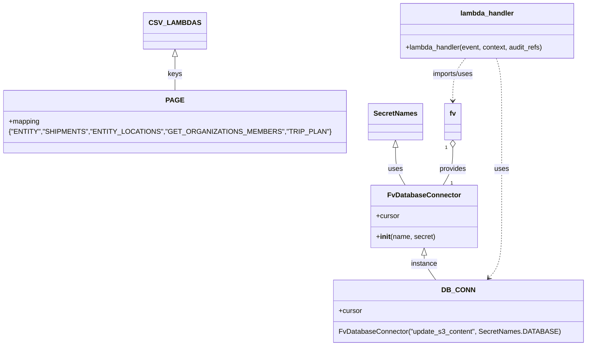

# Diagram: common/support_service/support_service/update_csv_export.py


> Auto-generated by Obscura crawlers

## Diagram 1



### SVG

<svg id="container" width="1233.916015625" xmlns="http://www.w3.org/2000/svg" class="classDiagram" height="796" viewBox="0 0 1233.916015625 796" role="graphics-document document" aria-roledescription="class"><style>#container{font-family:"trebuchet ms",verdana,arial,sans-serif;font-size:16px;fill:#333;}@keyframes edge-animation-frame{from{stroke-dashoffset:0;}}@keyframes dash{to{stroke-dashoffset:0;}}#container .edge-animation-slow{stroke-dasharray:9,5!important;stroke-dashoffset:900;animation:dash 50s linear infinite;stroke-linecap:round;}#container .edge-animation-fast{stroke-dasharray:9,5!important;stroke-dashoffset:900;animation:dash 20s linear infinite;stroke-linecap:round;}#container .error-icon{fill:#552222;}#container .error-text{fill:#552222;stroke:#552222;}#container .edge-thickness-normal{stroke-width:1px;}#container .edge-thickness-thick{stroke-width:3.5px;}#container .edge-pattern-solid{stroke-dasharray:0;}#container .edge-thickness-invisible{stroke-width:0;fill:none;}#container .edge-pattern-dashed{stroke-dasharray:3;}#container .edge-pattern-dotted{stroke-dasharray:2;}#container .marker{fill:#333333;stroke:#333333;}#container .marker.cross{stroke:#333333;}#container svg{font-family:"trebuchet ms",verdana,arial,sans-serif;font-size:16px;}#container p{margin:0;}#container g.classGroup text{fill:#9370DB;stroke:none;font-family:"trebuchet ms",verdana,arial,sans-serif;font-size:10px;}#container g.classGroup text .title{font-weight:bolder;}#container .nodeLabel,#container .edgeLabel{color:#131300;}#container .edgeLabel .label rect{fill:#ECECFF;}#container .label text{fill:#131300;}#container .labelBkg{background:#ECECFF;}#container .edgeLabel .label span{background:#ECECFF;}#container .classTitle{font-weight:bolder;}#container .node rect,#container .node circle,#container .node ellipse,#container .node polygon,#container .node path{fill:#ECECFF;stroke:#9370DB;stroke-width:1px;}#container .divider{stroke:#9370DB;stroke-width:1;}#container g.clickable{cursor:pointer;}#container g.classGroup rect{fill:#ECECFF;stroke:#9370DB;}#container g.classGroup line{stroke:#9370DB;stroke-width:1;}#container .classLabel .box{stroke:none;stroke-width:0;fill:#ECECFF;opacity:0.5;}#container .classLabel .label{fill:#9370DB;font-size:10px;}#container .relation{stroke:#333333;stroke-width:1;fill:none;}#container .dashed-line{stroke-dasharray:3;}#container .dotted-line{stroke-dasharray:1 2;}#container #compositionStart,#container .composition{fill:#333333!important;stroke:#333333!important;stroke-width:1;}#container #compositionEnd,#container .composition{fill:#333333!important;stroke:#333333!important;stroke-width:1;}#container #dependencyStart,#container .dependency{fill:#333333!important;stroke:#333333!important;stroke-width:1;}#container #dependencyStart,#container .dependency{fill:#333333!important;stroke:#333333!important;stroke-width:1;}#container #extensionStart,#container .extension{fill:transparent!important;stroke:#333333!important;stroke-width:1;}#container #extensionEnd,#container .extension{fill:transparent!important;stroke:#333333!important;stroke-width:1;}#container #aggregationStart,#container .aggregation{fill:transparent!important;stroke:#333333!important;stroke-width:1;}#container #aggregationEnd,#container .aggregation{fill:transparent!important;stroke:#333333!important;stroke-width:1;}#container #lollipopStart,#container .lollipop{fill:#ECECFF!important;stroke:#333333!important;stroke-width:1;}#container #lollipopEnd,#container .lollipop{fill:#ECECFF!important;stroke:#333333!important;stroke-width:1;}#container .edgeTerminals{font-size:11px;line-height:initial;}#container .classTitleText{text-anchor:middle;font-size:18px;fill:#333;}#container .label-icon{display:inline-block;height:1em;overflow:visible;vertical-align:-0.125em;}#container .node .label-icon path{fill:currentColor;stroke:revert;stroke-width:revert;}#container :root{--mermaid-font-family:"trebuchet ms",verdana,arial,sans-serif;}</style><g><defs><marker id="container_class-aggregationStart" class="marker aggregation class" refX="18" refY="7" markerWidth="190" markerHeight="240" orient="auto"><path d="M 18,7 L9,13 L1,7 L9,1 Z"></path></marker></defs><defs><marker id="container_class-aggregationEnd" class="marker aggregation class" refX="1" refY="7" markerWidth="20" markerHeight="28" orient="auto"><path d="M 18,7 L9,13 L1,7 L9,1 Z"></path></marker></defs><defs><marker id="container_class-extensionStart" class="marker extension class" refX="18" refY="7" markerWidth="190" markerHeight="240" orient="auto"><path d="M 1,7 L18,13 V 1 Z"></path></marker></defs><defs><marker id="container_class-extensionEnd" class="marker extension class" refX="1" refY="7" markerWidth="20" markerHeight="28" orient="auto"><path d="M 1,1 V 13 L18,7 Z"></path></marker></defs><defs><marker id="container_class-compositionStart" class="marker composition class" refX="18" refY="7" markerWidth="190" markerHeight="240" orient="auto"><path d="M 18,7 L9,13 L1,7 L9,1 Z"></path></marker></defs><defs><marker id="container_class-compositionEnd" class="marker composition class" refX="1" refY="7" markerWidth="20" markerHeight="28" orient="auto"><path d="M 18,7 L9,13 L1,7 L9,1 Z"></path></marker></defs><defs><marker id="container_class-dependencyStart" class="marker dependency class" refX="6" refY="7" markerWidth="190" markerHeight="240" orient="auto"><path d="M 5,7 L9,13 L1,7 L9,1 Z"></path></marker></defs><defs><marker id="container_class-dependencyEnd" class="marker dependency class" refX="13" refY="7" markerWidth="20" markerHeight="28" orient="auto"><path d="M 18,7 L9,13 L14,7 L9,1 Z"></path></marker></defs><defs><marker id="container_class-lollipopStart" class="marker lollipop class" refX="13" refY="7" markerWidth="190" markerHeight="240" orient="auto"><circle stroke="black" fill="transparent" cx="7" cy="7" r="6"></circle></marker></defs><defs><marker id="container_class-lollipopEnd" class="marker lollipop class" refX="1" refY="7" markerWidth="190" markerHeight="240" orient="auto"><circle stroke="black" fill="transparent" cx="7" cy="7" r="6"></circle></marker></defs><g class="root"><g class="clusters"></g><g class="edgePaths"><path d="M937.141,339.25L937.141,347.542C937.141,355.833,937.141,372.417,933.492,386.875C929.843,401.333,922.546,413.667,918.897,419.833L915.249,426" id="id_fv_FvDatabaseConnector_1" class="edge-thickness-normal edge-pattern-solid relation" style=";;;" data-edge="true" data-et="edge" data-id="id_fv_FvDatabaseConnector_1" data-points="W3sieCI6OTM3LjE0MDYyNSwieSI6MzIyfSx7IngiOjkzNy4xNDA2MjUsInkiOjM4OX0seyJ4Ijo5MTUuMjQ4NzgxNTM2Njk3MywieSI6NDI2fV0=" marker-start="url(#container_class-aggregationStart)"></path><path d="M872.648,587.25L872.648,590.542C872.648,593.833,872.648,600.417,877.013,609.875C881.377,619.333,890.106,631.667,894.47,637.833L898.834,644" id="id_FvDatabaseConnector_DB_CONN_2" class="edge-thickness-normal edge-pattern-solid relation" style=";;;" data-edge="true" data-et="edge" data-id="id_FvDatabaseConnector_DB_CONN_2" data-points="W3sieCI6ODcyLjY0ODQzNzUsInkiOjU3MH0seyJ4Ijo4NzIuNjQ4NDM3NSwieSI6NjA3fSx7IngiOjg5OC44MzQ0NTAyNTgwMjc2LCJ5Ijo2NDR9XQ==" marker-start="url(#container_class-extensionStart)"></path><path d="M353.063,130.25L353.063,137.042C353.063,143.833,353.063,157.417,353.063,170.375C353.063,183.333,353.063,195.667,353.063,201.833L353.063,208" id="id_CSV_LAMBDAS_PAGE_3" class="edge-thickness-normal edge-pattern-solid relation" style=";;;" data-edge="true" data-et="edge" data-id="id_CSV_LAMBDAS_PAGE_3" data-points="W3sieCI6MzUzLjA2MjUsInkiOjExM30seyJ4IjozNTMuMDYyNSwieSI6MTcxfSx7IngiOjM1My4wNjI1LCJ5IjoyMDh9XQ==" marker-start="url(#container_class-extensionStart)"></path><path d="M808.156,339.25L808.156,347.542C808.156,355.833,808.156,372.417,811.805,386.875C815.454,401.333,822.751,413.667,826.399,419.833L830.048,426" id="id_SecretNames_FvDatabaseConnector_4" class="edge-thickness-normal edge-pattern-solid relation" style=";;;" data-edge="true" data-et="edge" data-id="id_SecretNames_FvDatabaseConnector_4" data-points="W3sieCI6ODA4LjE1NjI1LCJ5IjozMjJ9LHsieCI6ODA4LjE1NjI1LCJ5IjozODl9LHsieCI6ODMwLjA0ODA5MzQ2MzMwMjcsInkiOjQyNn1d" marker-start="url(#container_class-extensionStart)"></path><path d="M965.683,134L960.926,140.167C956.169,146.333,946.655,158.667,941.898,175C937.141,191.333,937.141,211.667,937.141,221.833L937.141,232" id="id_lambda_handler_fv_5" class="edge-thickness-normal edge-pattern-dashed relation" style=";;;" data-edge="true" data-et="edge" data-id="id_lambda_handler_fv_5" data-points="W3sieCI6OTY1LjY4MzM3ODkwNjI1LCJ5IjoxMzR9LHsieCI6OTM3LjE0MDYyNSwieSI6MTcxfSx7IngiOjkzNy4xNDA2MjUsInkiOjIzOH1d" marker-end="url(#container_class-dependencyEnd)"></path><path d="M1035.91,134L1038.027,140.167C1040.144,146.333,1044.378,158.667,1046.494,183C1048.611,207.333,1048.611,243.667,1048.611,280C1048.611,316.333,1048.611,352.667,1048.611,389C1048.611,425.333,1048.611,461.667,1048.611,498C1048.611,534.333,1048.611,570.667,1043.692,594.259C1038.773,617.852,1028.935,628.703,1024.016,634.129L1019.097,639.555" id="id_lambda_handler_DB_CONN_6" class="edge-thickness-normal edge-pattern-dashed relation" style=";;;" data-edge="true" data-et="edge" data-id="id_lambda_handler_DB_CONN_6" data-points="W3sieCI6MTAzNS45MDk5MjE4NzUsInkiOjEzNH0seyJ4IjoxMDQ4LjYxMTMyODEyNSwieSI6MTcxfSx7IngiOjEwNDguNjExMzI4MTI1LCJ5IjoyODB9LHsieCI6MTA0OC42MTEzMjgxMjUsInkiOjM4OX0seyJ4IjoxMDQ4LjYxMTMyODEyNSwieSI6NDk4fSx7IngiOjEwNDguNjExMzI4MTI1LCJ5Ijo2MDd9LHsieCI6MTAxNS4wNjY4MTgzNzcyOTM1LCJ5Ijo2NDR9XQ==" marker-end="url(#container_class-dependencyEnd)"></path></g><g class="edgeLabels"><g class="edgeLabel" transform="translate(937.140625, 389)"><g class="label" data-id="id_fv_FvDatabaseConnector_1" transform="translate(-31.3125, -12)"><foreignObject width="62.625" height="24"><div xmlns="http://www.w3.org/1999/xhtml" class="labelBkg" style="display: table-cell; white-space: nowrap; line-height: 1.5; max-width: 200px; text-align: center;"><span class="edgeLabel"><p>provides</p></span></div></foreignObject></g></g><g class="edgeLabel" transform="translate(872.6484375, 607)"><g class="label" data-id="id_FvDatabaseConnector_DB_CONN_2" transform="translate(-30.578125, -12)"><foreignObject width="61.15625" height="24"><div xmlns="http://www.w3.org/1999/xhtml" class="labelBkg" style="display: table-cell; white-space: nowrap; line-height: 1.5; max-width: 200px; text-align: center;"><span class="edgeLabel"><p>instance</p></span></div></foreignObject></g></g><g class="edgeLabel" transform="translate(353.0625, 171)"><g class="label" data-id="id_CSV_LAMBDAS_PAGE_3" transform="translate(-15.96875, -12)"><foreignObject width="31.9375" height="24"><div xmlns="http://www.w3.org/1999/xhtml" class="labelBkg" style="display: table-cell; white-space: nowrap; line-height: 1.5; max-width: 200px; text-align: center;"><span class="edgeLabel"><p>keys</p></span></div></foreignObject></g></g><g class="edgeLabel" transform="translate(808.15625, 389)"><g class="label" data-id="id_SecretNames_FvDatabaseConnector_4" transform="translate(-16.4921875, -12)"><foreignObject width="32.984375" height="24"><div xmlns="http://www.w3.org/1999/xhtml" class="labelBkg" style="display: table-cell; white-space: nowrap; line-height: 1.5; max-width: 200px; text-align: center;"><span class="edgeLabel"><p>uses</p></span></div></foreignObject></g></g><g class="edgeLabel" transform="translate(937.140625, 171)"><g class="label" data-id="id_lambda_handler_fv_5" transform="translate(-48.65625, -12)"><foreignObject width="97.3125" height="24"><div xmlns="http://www.w3.org/1999/xhtml" class="labelBkg" style="display: table-cell; white-space: nowrap; line-height: 1.5; max-width: 200px; text-align: center;"><span class="edgeLabel"><p>imports/uses</p></span></div></foreignObject></g></g><g class="edgeLabel" transform="translate(1048.611328125, 389)"><g class="label" data-id="id_lambda_handler_DB_CONN_6" transform="translate(-16.4921875, -12)"><foreignObject width="32.984375" height="24"><div xmlns="http://www.w3.org/1999/xhtml" class="labelBkg" style="display: table-cell; white-space: nowrap; line-height: 1.5; max-width: 200px; text-align: center;"><span class="edgeLabel"><p>uses</p></span></div></foreignObject></g></g><g class="edgeTerminals" transform="translate(922.1406275, 339.5000021428571)"><g class="inner" transform="translate(0, 0)"><foreignObject style="width: 9px; height: 12px;"><div xmlns="http://www.w3.org/1999/xhtml" style="display: inline-block; padding-right: 1px; white-space: nowrap;"><span class="edgeLabel">1</span></div></foreignObject></g></g><g class="edgeTerminals" transform="translate(932.0696407606079, 413.5770487832536)"><g class="inner" transform="translate(0, 0)"></g><foreignObject style="width: 9px; height: 12px;"><div xmlns="http://www.w3.org/1999/xhtml" style="display: inline-block; padding-right: 1px; white-space: nowrap;"><span class="edgeLabel">1</span></div></foreignObject></g></g><g class="nodes"><g class="node default" id="classId-fv-0" transform="translate(937.140625, 280)"><g class="basic label-container"><path d="M-18.953125 -42 L18.953125 -42 L18.953125 42 L-18.953125 42" stroke="none" stroke-width="0" fill="#ECECFF" style=""></path><path d="M-18.953125 -42 C-8.852668592080256 -42, 1.2477878158394873 -42, 18.953125 -42 M-18.953125 -42 C-10.793631690613191 -42, -2.634138381226382 -42, 18.953125 -42 M18.953125 -42 C18.953125 -22.00031227009626, 18.953125 -2.0006245401925185, 18.953125 42 M18.953125 -42 C18.953125 -15.858856651501792, 18.953125 10.282286696996415, 18.953125 42 M18.953125 42 C4.927360319135506 42, -9.098404361728988 42, -18.953125 42 M18.953125 42 C5.3002842610043785 42, -8.352556477991243 42, -18.953125 42 M-18.953125 42 C-18.953125 25.075244759510543, -18.953125 8.150489519021086, -18.953125 -42 M-18.953125 42 C-18.953125 20.122849223956983, -18.953125 -1.7543015520860337, -18.953125 -42" stroke="#9370DB" stroke-width="1.3" fill="none" stroke-dasharray="0 0" style=""></path></g><g class="annotation-group text" transform="translate(0, -18)"></g><g class="label-group text" transform="translate(-6.953125, -18)"><g class="label" style="font-weight: bolder" transform="translate(0,-12)"><foreignObject width="13.90625" height="24"><div xmlns="http://www.w3.org/1999/xhtml" style="display: table-cell; white-space: nowrap; line-height: 1.5; max-width: 63px; text-align: center;"><span class="nodeLabel markdown-node-label" style=""><p>fv</p></span></div></foreignObject></g></g><g class="members-group text" transform="translate(-6.953125, 30)"></g><g class="methods-group text" transform="translate(-6.953125, 60)"></g><g class="divider" style=""><path d="M-18.953125 6 C-9.631123691382607 6, -0.30912238276521364 6, 18.953125 6 M-18.953125 6 C-6.044581705446719 6, 6.863961589106562 6, 18.953125 6" stroke="#9370DB" stroke-width="1.3" fill="none" stroke-dasharray="0 0" style=""></path></g><g class="divider" style=""><path d="M-18.953125 24 C-4.6367296101783 24, 9.6796657796434 24, 18.953125 24 M-18.953125 24 C-5.507732624403253 24, 7.937659751193493 24, 18.953125 24" stroke="#9370DB" stroke-width="1.3" fill="none" stroke-dasharray="0 0" style=""></path></g></g><g class="node default" id="classId-FvDatabaseConnector-1" transform="translate(872.6484375, 498)"><g class="basic label-container"><path d="M-119.28515625 -72 L119.28515625 -72 L119.28515625 72 L-119.28515625 72" stroke="none" stroke-width="0" fill="#ECECFF" style=""></path><path d="M-119.28515625 -72 C-26.93077681482295 -72, 65.4236026203541 -72, 119.28515625 -72 M-119.28515625 -72 C-52.64114231208586 -72, 14.002871625828277 -72, 119.28515625 -72 M119.28515625 -72 C119.28515625 -41.38319863985062, 119.28515625 -10.766397279701245, 119.28515625 72 M119.28515625 -72 C119.28515625 -29.594263072557908, 119.28515625 12.811473854884184, 119.28515625 72 M119.28515625 72 C68.21502138441666 72, 17.144886518833317 72, -119.28515625 72 M119.28515625 72 C57.180930629357974 72, -4.9232949912840525 72, -119.28515625 72 M-119.28515625 72 C-119.28515625 26.777036211249992, -119.28515625 -18.445927577500015, -119.28515625 -72 M-119.28515625 72 C-119.28515625 42.77917357508409, -119.28515625 13.558347150168174, -119.28515625 -72" stroke="#9370DB" stroke-width="1.3" fill="none" stroke-dasharray="0 0" style=""></path></g><g class="annotation-group text" transform="translate(0, -48)"></g><g class="label-group text" transform="translate(-79.3046875, -48)"><g class="label" style="font-weight: bolder" transform="translate(0,-12)"><foreignObject width="158.609375" height="24"><div xmlns="http://www.w3.org/1999/xhtml" style="display: table-cell; white-space: nowrap; line-height: 1.5; max-width: 207px; text-align: center;"><span class="nodeLabel markdown-node-label" style=""><p>FvDatabaseConnector</p></span></div></foreignObject></g></g><g class="members-group text" transform="translate(-107.28515625, 0)"><g class="label" style="" transform="translate(0,-12)"><foreignObject width="53.71875" height="24"><div xmlns="http://www.w3.org/1999/xhtml" style="display: table-cell; white-space: nowrap; line-height: 1.5; max-width: 112px; text-align: center;"><span class="nodeLabel markdown-node-label" style=""><p>+cursor</p></span></div></foreignObject></g></g><g class="methods-group text" transform="translate(-107.28515625, 48)"><g class="label" style="" transform="translate(0,-12)"><foreignObject width="135.265625" height="24"><div xmlns="http://www.w3.org/1999/xhtml" style="display: table-cell; white-space: nowrap; line-height: 1.5; max-width: 224px; text-align: center;"><span class="nodeLabel markdown-node-label" style=""><p>+<strong>init</strong>(name, secret)</p></span></div></foreignObject></g></g><g class="divider" style=""><path d="M-119.28515625 -24 C-29.296777330815644 -24, 60.69160158836871 -24, 119.28515625 -24 M-119.28515625 -24 C-35.062783047720686 -24, 49.15959015455863 -24, 119.28515625 -24" stroke="#9370DB" stroke-width="1.3" fill="none" stroke-dasharray="0 0" style=""></path></g><g class="divider" style=""><path d="M-119.28515625 24 C-60.57371904770717 24, -1.8622818454143442 24, 119.28515625 24 M-119.28515625 24 C-53.062960809048164 24, 13.159234631903672 24, 119.28515625 24" stroke="#9370DB" stroke-width="1.3" fill="none" stroke-dasharray="0 0" style=""></path></g></g><g class="node default" id="classId-CSV_LAMBDAS-2" transform="translate(353.0625, 71)"><g class="basic label-container"><path d="M-63.734375 -42 L63.734375 -42 L63.734375 42 L-63.734375 42" stroke="none" stroke-width="0" fill="#ECECFF" style=""></path><path d="M-63.734375 -42 C-23.461300947958563 -42, 16.811773104082874 -42, 63.734375 -42 M-63.734375 -42 C-17.633046923790445 -42, 28.46828115241911 -42, 63.734375 -42 M63.734375 -42 C63.734375 -16.66359886700504, 63.734375 8.672802265989922, 63.734375 42 M63.734375 -42 C63.734375 -13.191937632931321, 63.734375 15.616124734137358, 63.734375 42 M63.734375 42 C31.204542041022926 42, -1.325290917954149 42, -63.734375 42 M63.734375 42 C19.066390005762045 42, -25.60159498847591 42, -63.734375 42 M-63.734375 42 C-63.734375 17.02338870886456, -63.734375 -7.953222582270882, -63.734375 -42 M-63.734375 42 C-63.734375 21.482033321978854, -63.734375 0.9640666439577075, -63.734375 -42" stroke="#9370DB" stroke-width="1.3" fill="none" stroke-dasharray="0 0" style=""></path></g><g class="annotation-group text" transform="translate(0, -18)"></g><g class="label-group text" transform="translate(-51.734375, -18)"><g class="label" style="font-weight: bolder" transform="translate(0,-12)"><foreignObject width="103.46875" height="24"><div xmlns="http://www.w3.org/1999/xhtml" style="display: table-cell; white-space: nowrap; line-height: 1.5; max-width: 151px; text-align: center;"><span class="nodeLabel markdown-node-label" style=""><p>CSV_LAMBDAS</p></span></div></foreignObject></g></g><g class="members-group text" transform="translate(-51.734375, 30)"></g><g class="methods-group text" transform="translate(-51.734375, 60)"></g><g class="divider" style=""><path d="M-63.734375 6 C-35.42330903677386 6, -7.11224307354771 6, 63.734375 6 M-63.734375 6 C-37.35308068156519 6, -10.971786363130384 6, 63.734375 6" stroke="#9370DB" stroke-width="1.3" fill="none" stroke-dasharray="0 0" style=""></path></g><g class="divider" style=""><path d="M-63.734375 24 C-32.027163434925114 24, -0.3199518698502217 24, 63.734375 24 M-63.734375 24 C-34.64638640952188 24, -5.558397819043755 24, 63.734375 24" stroke="#9370DB" stroke-width="1.3" fill="none" stroke-dasharray="0 0" style=""></path></g></g><g class="node default" id="classId-SecretNames-3" transform="translate(808.15625, 280)"><g class="basic label-container"><path d="M-60.03125 -42 L60.03125 -42 L60.03125 42 L-60.03125 42" stroke="none" stroke-width="0" fill="#ECECFF" style=""></path><path d="M-60.03125 -42 C-12.409740994959783 -42, 35.211768010080434 -42, 60.03125 -42 M-60.03125 -42 C-18.751742433502223 -42, 22.527765132995555 -42, 60.03125 -42 M60.03125 -42 C60.03125 -16.705224954887846, 60.03125 8.589550090224307, 60.03125 42 M60.03125 -42 C60.03125 -24.854918199885542, 60.03125 -7.709836399771085, 60.03125 42 M60.03125 42 C22.641164031269476 42, -14.748921937461049 42, -60.03125 42 M60.03125 42 C31.609656682447692 42, 3.1880633648953847 42, -60.03125 42 M-60.03125 42 C-60.03125 9.648724143363772, -60.03125 -22.702551713272456, -60.03125 -42 M-60.03125 42 C-60.03125 11.825202230688653, -60.03125 -18.349595538622694, -60.03125 -42" stroke="#9370DB" stroke-width="1.3" fill="none" stroke-dasharray="0 0" style=""></path></g><g class="annotation-group text" transform="translate(0, -18)"></g><g class="label-group text" transform="translate(-48.03125, -18)"><g class="label" style="font-weight: bolder" transform="translate(0,-12)"><foreignObject width="96.0625" height="24"><div xmlns="http://www.w3.org/1999/xhtml" style="display: table-cell; white-space: nowrap; line-height: 1.5; max-width: 145px; text-align: center;"><span class="nodeLabel markdown-node-label" style=""><p>SecretNames</p></span></div></foreignObject></g></g><g class="members-group text" transform="translate(-48.03125, 30)"></g><g class="methods-group text" transform="translate(-48.03125, 60)"></g><g class="divider" style=""><path d="M-60.03125 6 C-15.647988035016084 6, 28.735273929967832 6, 60.03125 6 M-60.03125 6 C-33.40916354889241 6, -6.787077097784817 6, 60.03125 6" stroke="#9370DB" stroke-width="1.3" fill="none" stroke-dasharray="0 0" style=""></path></g><g class="divider" style=""><path d="M-60.03125 24 C-25.08120350061592 24, 9.868842998768159 24, 60.03125 24 M-60.03125 24 C-18.42420979730155 24, 23.1828304053969 24, 60.03125 24" stroke="#9370DB" stroke-width="1.3" fill="none" stroke-dasharray="0 0" style=""></path></g></g><g class="node default" id="classId-DB_CONN-4" transform="translate(949.791015625, 716)"><g class="basic label-container"><path d="M-276.125 -72 L276.125 -72 L276.125 72 L-276.125 72" stroke="none" stroke-width="0" fill="#ECECFF" style=""></path><path d="M-276.125 -72 C-121.56578187501705 -72, 32.993436249965896 -72, 276.125 -72 M-276.125 -72 C-154.62350773873163 -72, -33.12201547746329 -72, 276.125 -72 M276.125 -72 C276.125 -30.095299660920425, 276.125 11.80940067815915, 276.125 72 M276.125 -72 C276.125 -26.091869768432495, 276.125 19.81626046313501, 276.125 72 M276.125 72 C87.70175716358781 72, -100.72148567282437 72, -276.125 72 M276.125 72 C115.39346786776215 72, -45.33806426447569 72, -276.125 72 M-276.125 72 C-276.125 24.712694518548837, -276.125 -22.574610962902327, -276.125 -72 M-276.125 72 C-276.125 27.062864409351256, -276.125 -17.874271181297487, -276.125 -72" stroke="#9370DB" stroke-width="1.3" fill="none" stroke-dasharray="0 0" style=""></path></g><g class="annotation-group text" transform="translate(0, -48)"></g><g class="label-group text" transform="translate(-34.40625, -48)"><g class="label" style="font-weight: bolder" transform="translate(0,-12)"><foreignObject width="68.8125" height="24"><div xmlns="http://www.w3.org/1999/xhtml" style="display: table-cell; white-space: nowrap; line-height: 1.5; max-width: 119px; text-align: center;"><span class="nodeLabel markdown-node-label" style=""><p>DB_CONN</p></span></div></foreignObject></g></g><g class="members-group text" transform="translate(-264.125, 0)"><g class="label" style="" transform="translate(0,-12)"><foreignObject width="53.71875" height="24"><div xmlns="http://www.w3.org/1999/xhtml" style="display: table-cell; white-space: nowrap; line-height: 1.5; max-width: 112px; text-align: center;"><span class="nodeLabel markdown-node-label" style=""><p>+cursor</p></span></div></foreignObject></g></g><g class="methods-group text" transform="translate(-264.125, 48)"><g class="label" style="" transform="translate(0,-12)"><foreignObject width="493.84375" height="24"><div xmlns="http://www.w3.org/1999/xhtml" style="display: table-cell; white-space: nowrap; line-height: 1.5; max-width: 544px; text-align: center;"><span class="nodeLabel markdown-node-label" style=""><p>FvDatabaseConnector("update_s3_content", SecretNames.DATABASE)</p></span></div></foreignObject></g></g><g class="divider" style=""><path d="M-276.125 -24 C-161.71164794666782 -24, -47.29829589333568 -24, 276.125 -24 M-276.125 -24 C-153.80949362451105 -24, -31.49398724902207 -24, 276.125 -24" stroke="#9370DB" stroke-width="1.3" fill="none" stroke-dasharray="0 0" style=""></path></g><g class="divider" style=""><path d="M-276.125 24 C-108.25526169381979 24, 59.61447661236042 24, 276.125 24 M-276.125 24 C-67.82104320014125 24, 140.4829135997175 24, 276.125 24" stroke="#9370DB" stroke-width="1.3" fill="none" stroke-dasharray="0 0" style=""></path></g></g><g class="node default" id="classId-PAGE-5" transform="translate(353.0625, 280)"><g class="basic label-container"><path d="M-345.0625 -72 L345.0625 -72 L345.0625 72 L-345.0625 72" stroke="none" stroke-width="0" fill="#ECECFF" style=""></path><path d="M-345.0625 -72 C-125.99719186425162 -72, 93.06811627149676 -72, 345.0625 -72 M-345.0625 -72 C-175.70986456472258 -72, -6.357229129445159 -72, 345.0625 -72 M345.0625 -72 C345.0625 -39.08497842253735, 345.0625 -6.169956845074694, 345.0625 72 M345.0625 -72 C345.0625 -21.214585490529885, 345.0625 29.57082901894023, 345.0625 72 M345.0625 72 C145.75668944580468 72, -53.549121108390636 72, -345.0625 72 M345.0625 72 C109.93941352562311 72, -125.18367294875378 72, -345.0625 72 M-345.0625 72 C-345.0625 23.482637175293185, -345.0625 -25.03472564941363, -345.0625 -72 M-345.0625 72 C-345.0625 28.494720465244626, -345.0625 -15.010559069510748, -345.0625 -72" stroke="#9370DB" stroke-width="1.3" fill="none" stroke-dasharray="0 0" style=""></path></g><g class="annotation-group text" transform="translate(0, -48)"></g><g class="label-group text" transform="translate(-18.328125, -48)"><g class="label" style="font-weight: bolder" transform="translate(0,-12)"><foreignObject width="36.65625" height="24"><div xmlns="http://www.w3.org/1999/xhtml" style="display: table-cell; white-space: nowrap; line-height: 1.5; max-width: 86px; text-align: center;"><span class="nodeLabel markdown-node-label" style=""><p>PAGE</p></span></div></foreignObject></g></g><g class="members-group text" transform="translate(-333.0625, 0)"><g class="label" style="" transform="translate(0,-12)"><foreignObject width="71.625" height="24"><div xmlns="http://www.w3.org/1999/xhtml" style="display: table-cell; white-space: nowrap; line-height: 1.5; max-width: 130px; text-align: center;"><span class="nodeLabel markdown-node-label" style=""><p>+mapping</p></span></div></foreignObject></g><g class="label" style="" transform="translate(0,12)"><foreignObject width="647.796875" height="24"><div xmlns="http://www.w3.org/1999/xhtml" style="display: table-cell; white-space: nowrap; line-height: 1.5; max-width: 698px; text-align: center;"><span class="nodeLabel markdown-node-label" style=""><p>{"ENTITY","SHIPMENTS","ENTITY_LOCATIONS","GET_ORGANIZATIONS_MEMBERS","TRIP_PLAN"}</p></span></div></foreignObject></g></g><g class="methods-group text" transform="translate(-333.0625, 72)"></g><g class="divider" style=""><path d="M-345.0625 -24 C-107.42981677783149 -24, 130.20286644433702 -24, 345.0625 -24 M-345.0625 -24 C-176.22418580018996 -24, -7.3858716003799145 -24, 345.0625 -24" stroke="#9370DB" stroke-width="1.3" fill="none" stroke-dasharray="0 0" style=""></path></g><g class="divider" style=""><path d="M-345.0625 48 C-127.154854973022 48, 90.752790053956 48, 345.0625 48 M-345.0625 48 C-140.53921774726948 48, 63.98406450546105 48, 345.0625 48" stroke="#9370DB" stroke-width="1.3" fill="none" stroke-dasharray="0 0" style=""></path></g></g><g class="node default" id="classId-lambda_handler-6" transform="translate(1014.283203125, 71)"><g class="basic label-container"><path d="M-202.83203125 -63 L202.83203125 -63 L202.83203125 63 L-202.83203125 63" stroke="none" stroke-width="0" fill="#ECECFF" style=""></path><path d="M-202.83203125 -63 C-85.42555994067963 -63, 31.980911368640733 -63, 202.83203125 -63 M-202.83203125 -63 C-80.70499858957164 -63, 41.42203407085671 -63, 202.83203125 -63 M202.83203125 -63 C202.83203125 -23.04622141855677, 202.83203125 16.907557162886462, 202.83203125 63 M202.83203125 -63 C202.83203125 -33.3588744845032, 202.83203125 -3.7177489690063936, 202.83203125 63 M202.83203125 63 C57.419645465552435 63, -87.99274031889513 63, -202.83203125 63 M202.83203125 63 C101.7761800138316 63, 0.7203287776632123 63, -202.83203125 63 M-202.83203125 63 C-202.83203125 25.66392777310361, -202.83203125 -11.672144453792782, -202.83203125 -63 M-202.83203125 63 C-202.83203125 33.24835340202776, -202.83203125 3.4967068040555276, -202.83203125 -63" stroke="#9370DB" stroke-width="1.3" fill="none" stroke-dasharray="0 0" style=""></path></g><g class="annotation-group text" transform="translate(0, -39)"></g><g class="label-group text" transform="translate(-59.9765625, -39)"><g class="label" style="font-weight: bolder" transform="translate(0,-12)"><foreignObject width="119.953125" height="24"><div xmlns="http://www.w3.org/1999/xhtml" style="display: table-cell; white-space: nowrap; line-height: 1.5; max-width: 170px; text-align: center;"><span class="nodeLabel markdown-node-label" style=""><p>lambda_handler</p></span></div></foreignObject></g></g><g class="members-group text" transform="translate(-190.83203125, 9)"></g><g class="methods-group text" transform="translate(-190.83203125, 39)"><g class="label" style="" transform="translate(0,-12)"><foreignObject width="321.6875" height="24"><div xmlns="http://www.w3.org/1999/xhtml" style="display: table-cell; white-space: nowrap; line-height: 1.5; max-width: 379px; text-align: center;"><span class="nodeLabel markdown-node-label" style=""><p>+lambda_handler(event, context, audit_refs)</p></span></div></foreignObject></g></g><g class="divider" style=""><path d="M-202.83203125 -15 C-77.26581643875019 -15, 48.300398372499615 -15, 202.83203125 -15 M-202.83203125 -15 C-74.87468042755593 -15, 53.08267039488814 -15, 202.83203125 -15" stroke="#9370DB" stroke-width="1.3" fill="none" stroke-dasharray="0 0" style=""></path></g><g class="divider" style=""><path d="M-202.83203125 9 C-48.56906337772142 9, 105.69390449455716 9, 202.83203125 9 M-202.83203125 9 C-102.56509683745426 9, -2.2981624249085257 9, 202.83203125 9" stroke="#9370DB" stroke-width="1.3" fill="none" stroke-dasharray="0 0" style=""></path></g></g></g></g></g></svg>

## Diagram 2

```mermaid
flowchart TD
Start([Start]) --> GetFile[Get path parameter "file"]
GetFile --> GetBody[Parse event body]
GetBody --> Check{requested_file and len(body) <= 1 and body.status == "CANCELED"}
Check -- Yes --> ExecuteSQL[Execute UPDATE process_s3_content SQL returning row]
ExecuteSQL --> Fetch[Fetch one row from cursor]
Fetch --> Found{row found?}
Found -- Yes --> ToJSON[Convert row to dict and map target -> type using PAGE]
ToJSON --> Response[Return make_response(res_to_json, 201)]
Found -- No --> NotFound[Raise BadRequestError: "Export Not found"]
Check -- No --> BadRequest[Raise BadRequestError: "Bad Request"]
Response --> End([End])
NotFound --> End
BadRequest --> End
```

> SVG rendering failed for this diagram.
