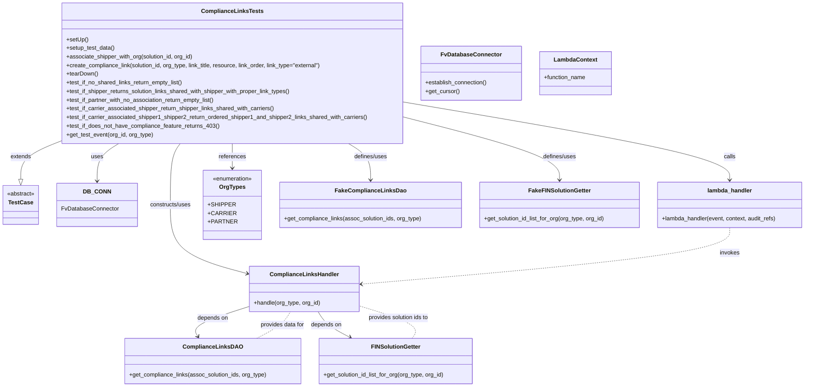

# Diagram: common/support_service/tests/integration/test_partner_portal_get_compliance_links.py

> Auto-generated by Obscura crawlers

## Mermaid

```mermaid
classDiagram
    class ComplianceLinksTests {
        +setUp()
        +setup_test_data()
        +associate_shipper_with_org(solution_id, org_id)
        +create_compliance_link(solution_id, org_type, link_title, resource, link_order, link_type="external")
        +tearDown()
        +test_if_no_shared_links_return_empty_list()
        +test_if_shipper_returns_solution_links_shared_with_shipper_with_proper_link_types()
        +test_if_partner_with_no_association_return_empty_list()
        +test_if_carrier_associated_shipper_return_shipper_links_shared_with_carriers()
        +test_if_carrier_associated_shipper1_shipper2_return_ordered_shipper1_and_shipper2_links_shared_with_carriers()
        +test_if_does_not_have_compliance_feature_returns_403()
        +get_test_event(org_id, org_type)
    }
    class TestCase <<abstract>> {}
    ComplianceLinksTests --|> TestCase : extends

    class FvDatabaseConnector {
        +establish_connection()
        +get_cursor()
    }
    DB_CONN : FvDatabaseConnector
    ComplianceLinksTests --> DB_CONN : uses

    class ComplianceLinksHandler {
        +handle(org_type, org_id)
    }
    class ComplianceLinksDAO {
        +get_compliance_links(assoc_solution_ids, org_type)
    }
    class FINSolutionGetter {
        +get_solution_id_list_for_org(org_type, org_id)
    }
    ComplianceLinksHandler --> ComplianceLinksDAO : depends on
    ComplianceLinksHandler --> FINSolutionGetter : depends on
    ComplianceLinksTests --> ComplianceLinksHandler : constructs/uses

    class LambdaContext {
        +function_name
    }
    class lambda_handler {
        +lambda_handler(event, context, audit_refs)
    }
    lambda_handler ..> ComplianceLinksHandler : invokes
    ComplianceLinksTests --> lambda_handler : calls

    class OrgTypes {
        <<enumeration>>
        +SHIPPER
        +CARRIER
        +PARTNER
    }
    ComplianceLinksTests --> OrgTypes : references

    class FakeComplianceLinksDao {
        +get_compliance_links(assoc_solution_ids, org_type)
    }
    class FakeFINSolutionGetter {
        +get_solution_id_list_for_org(org_type, org_id)
    }
    ComplianceLinksTests --> FakeComplianceLinksDao : defines/uses
    ComplianceLinksTests --> FakeFINSolutionGetter : defines/uses

    ComplianceLinksDAO .. ComplianceLinksHandler : provides data for
    FINSolutionGetter .. ComplianceLinksHandler : provides solution ids to
```

> SVG rendering failed for this diagram.
