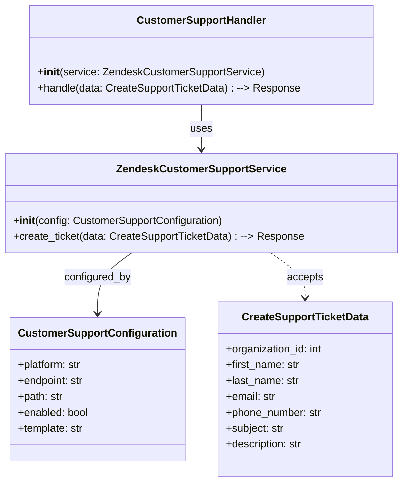
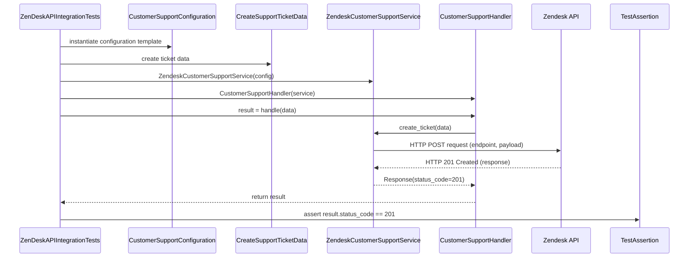

# Diagram: common/support_service/tests/integration/test_zendesk_api_integration.py

> Auto-generated by Obscura crawlers

## Diagram 1

### SVG

<svg id="container" width="602.0234375" xmlns="http://www.w3.org/2000/svg" class="classDiagram" height="728" viewBox="0 0 602.0234375 728" role="graphics-document document" aria-roledescription="class"><g><defs><marker id="container_class-aggregationStart" class="marker aggregation class" refX="18" refY="7" markerWidth="190" markerHeight="240" orient="auto"><path d="M 18,7 L9,13 L1,7 L9,1 Z"></path></marker></defs><defs><marker id="container_class-aggregationEnd" class="marker aggregation class" refX="1" refY="7" markerWidth="20" markerHeight="28" orient="auto"><path d="M 18,7 L9,13 L1,7 L9,1 Z"></path></marker></defs><defs><marker id="container_class-extensionStart" class="marker extension class" refX="18" refY="7" markerWidth="190" markerHeight="240" orient="auto"><path d="M 1,7 L18,13 V 1 Z"></path></marker></defs><defs><marker id="container_class-extensionEnd" class="marker extension class" refX="1" refY="7" markerWidth="20" markerHeight="28" orient="auto"><path d="M 1,1 V 13 L18,7 Z"></path></marker></defs><defs><marker id="container_class-compositionStart" class="marker composition class" refX="18" refY="7" markerWidth="190" markerHeight="240" orient="auto"><path d="M 18,7 L9,13 L1,7 L9,1 Z"></path></marker></defs><defs><marker id="container_class-compositionEnd" class="marker composition class" refX="1" refY="7" markerWidth="20" markerHeight="28" orient="auto"><path d="M 18,7 L9,13 L1,7 L9,1 Z"></path></marker></defs><defs><marker id="container_class-dependencyStart" class="marker dependency class" refX="6" refY="7" markerWidth="190" markerHeight="240" orient="auto"><path d="M 5,7 L9,13 L1,7 L9,1 Z"></path></marker></defs><defs><marker id="container_class-dependencyEnd" class="marker dependency class" refX="13" refY="7" markerWidth="20" markerHeight="28" orient="auto"><path d="M 18,7 L9,13 L14,7 L9,1 Z"></path></marker></defs><defs><marker id="container_class-lollipopStart" class="marker lollipop class" refX="13" refY="7" markerWidth="190" markerHeight="240" orient="auto"><circle stroke="black" fill="transparent" cx="7" cy="7" r="6"></circle></marker></defs><defs><marker id="container_class-lollipopEnd" class="marker lollipop class" refX="1" refY="7" markerWidth="190" markerHeight="240" orient="auto"><circle stroke="black" fill="transparent" cx="7" cy="7" r="6"></circle></marker></defs><g class="root"><g class="clusters"></g><g class="edgePaths"><path d="M301.012,158L301.012,164.167C301.012,170.333,301.012,182.667,301.012,194C301.012,205.333,301.012,215.667,301.012,220.833L301.012,226" id="id_CustomerSupportHandler_ZendeskCustomerSupportService_1" class="edge-thickness-normal edge-pattern-solid relation" style=";;;" data-edge="true" data-et="edge" data-id="id_CustomerSupportHandler_ZendeskCustomerSupportService_1" data-points="W3sieCI6MzAxLjAxMTcxODc1LCJ5IjoxNTh9LHsieCI6MzAxLjAxMTcxODc1LCJ5IjoxOTV9LHsieCI6MzAxLjAxMTcxODc1LCJ5IjoyMzJ9XQ==" marker-end="url(#container_class-dependencyEnd)"></path><path d="M197.764,382L189.275,388.167C180.785,394.333,163.807,406.667,155.317,422C146.828,437.333,146.828,455.667,146.828,464.833L146.828,474" id="id_ZendeskCustomerSupportService_CustomerSupportConfiguration_2" class="edge-thickness-normal edge-pattern-solid relation" style=";;;" data-edge="true" data-et="edge" data-id="id_ZendeskCustomerSupportService_CustomerSupportConfiguration_2" data-points="W3sieCI6MTk3Ljc2Mzc3NjUwNjY5NjQ0LCJ5IjozODJ9LHsieCI6MTQ2LjgyODEyNSwieSI6NDE5fSx7IngiOjE0Ni44MjgxMjUsInkiOjQ4MH1d" marker-end="url(#container_class-dependencyEnd)"></path><path d="M404.26,382L412.749,388.167C421.238,394.333,438.217,406.667,446.706,418C455.195,429.333,455.195,439.667,455.195,444.833L455.195,450" id="id_ZendeskCustomerSupportService_CreateSupportTicketData_3" class="edge-thickness-normal edge-pattern-dashed relation" style=";;;" data-edge="true" data-et="edge" data-id="id_ZendeskCustomerSupportService_CreateSupportTicketData_3" data-points="W3sieCI6NDA0LjI1OTY2MDk5MzMwMzU2LCJ5IjozODJ9LHsieCI6NDU1LjE5NTMxMjUsInkiOjQxOX0seyJ4Ijo0NTUuMTk1MzEyNSwieSI6NDU2fV0=" marker-end="url(#container_class-dependencyEnd)"></path></g><g class="edgeLabels"><g class="edgeLabel" transform="translate(301.01171875, 195)"><g class="label" data-id="id_CustomerSupportHandler_ZendeskCustomerSupportService_1" transform="translate(-16.4921875, -12)"><foreignObject width="32.984375" height="24">

uses

</foreignObject></g></g><g class="edgeLabel" transform="translate(146.828125, 419)"><g class="label" data-id="id_ZendeskCustomerSupportService_CustomerSupportConfiguration_2" transform="translate(-51.171875, -12)"><foreignObject width="102.34375" height="24">

configured_by

</foreignObject></g></g><g class="edgeLabel" transform="translate(455.1953125, 419)"><g class="label" data-id="id_ZendeskCustomerSupportService_CreateSupportTicketData_3" transform="translate(-27.421875, -12)"><foreignObject width="54.84375" height="24">

accepts

</foreignObject></g></g></g><g class="nodes"><g class="node default" id="classId-CustomerSupportConfiguration-0" transform="translate(146.828125, 588)"><g class="basic label-container"><path d="M-125.953125 -108 L125.953125 -108 L125.953125 108 L-125.953125 108" stroke="none" stroke-width="0" fill="#ECECFF" style=""></path><path d="M-125.953125 -108 C-63.19943736706134 -108, -0.4457497341226855 -108, 125.953125 -108 M-125.953125 -108 C-49.60717517413964 -108, 26.738774651720718 -108, 125.953125 -108 M125.953125 -108 C125.953125 -34.190580773808136, 125.953125 39.61883845238373, 125.953125 108 M125.953125 -108 C125.953125 -30.569603918754765, 125.953125 46.86079216249047, 125.953125 108 M125.953125 108 C51.27505200877688 108, -23.403020982446236 108, -125.953125 108 M125.953125 108 C36.14264508706266 108, -53.66783482587468 108, -125.953125 108 M-125.953125 108 C-125.953125 30.458674770582448, -125.953125 -47.082650458835104, -125.953125 -108 M-125.953125 108 C-125.953125 61.53200551298296, -125.953125 15.064011025965925, -125.953125 -108" stroke="#9370DB" stroke-width="1.3" fill="none" stroke-dasharray="0 0" style=""></path></g><g class="annotation-group text" transform="translate(0, -84)"></g><g class="label-group text" transform="translate(-113.953125, -84)"><g class="label" style="font-weight: bolder" transform="translate(0,-12)"><foreignObject width="227.90625" height="24">

CustomerSupportConfiguration

</foreignObject></g></g><g class="members-group text" transform="translate(-113.953125, -36)"><g class="label" style="" transform="translate(0,-12)"><foreignObject width="98.515625" height="24">

+platform: str

</foreignObject></g><g class="label" style="" transform="translate(0,12)"><foreignObject width="101.734375" height="24">

+endpoint: str

</foreignObject></g><g class="label" style="" transform="translate(0,36)"><foreignObject width="68.703125" height="24">

+path: str

</foreignObject></g><g class="label" style="" transform="translate(0,60)"><foreignObject width="108.15625" height="24">

+enabled: bool

</foreignObject></g><g class="label" style="" transform="translate(0,84)"><foreignObject width="100.453125" height="24">

+template: str

</foreignObject></g></g><g class="methods-group text" transform="translate(-113.953125, 108)"></g><g class="divider" style=""><path d="M-125.953125 -60 C-35.934902642077205 -60, 54.08331971584559 -60, 125.953125 -60 M-125.953125 -60 C-72.34423289723568 -60, -18.735340794471355 -60, 125.953125 -60" stroke="#9370DB" stroke-width="1.3" fill="none" stroke-dasharray="0 0" style=""></path></g><g class="divider" style=""><path d="M-125.953125 84 C-31.644543692396354 84, 62.66403761520729 84, 125.953125 84 M-125.953125 84 C-59.15106097391546 84, 7.651003052169074 84, 125.953125 84" stroke="#9370DB" stroke-width="1.3" fill="none" stroke-dasharray="0 0" style=""></path></g></g><g class="node default" id="classId-CreateSupportTicketData-1" transform="translate(455.1953125, 588)"><g class="basic label-container"><path d="M-132.4140625 -132 L132.4140625 -132 L132.4140625 132 L-132.4140625 132" stroke="none" stroke-width="0" fill="#ECECFF" style=""></path><path d="M-132.4140625 -132 C-41.0854244269711 -132, 50.2432136460578 -132, 132.4140625 -132 M-132.4140625 -132 C-60.32225751295434 -132, 11.769547474091326 -132, 132.4140625 -132 M132.4140625 -132 C132.4140625 -34.939883268312855, 132.4140625 62.12023346337429, 132.4140625 132 M132.4140625 -132 C132.4140625 -54.184092772992614, 132.4140625 23.631814454014773, 132.4140625 132 M132.4140625 132 C37.28984780891578 132, -57.83436688216844 132, -132.4140625 132 M132.4140625 132 C41.995676863834376 132, -48.42270877233125 132, -132.4140625 132 M-132.4140625 132 C-132.4140625 39.07464740017144, -132.4140625 -53.850705199657114, -132.4140625 -132 M-132.4140625 132 C-132.4140625 34.9837265948737, -132.4140625 -62.0325468102526, -132.4140625 -132" stroke="#9370DB" stroke-width="1.3" fill="none" stroke-dasharray="0 0" style=""></path></g><g class="annotation-group text" transform="translate(0, -108)"></g><g class="label-group text" transform="translate(-92.34375, -108)"><g class="label" style="font-weight: bolder" transform="translate(0,-12)"><foreignObject width="184.6875" height="24">

CreateSupportTicketData

</foreignObject></g></g><g class="members-group text" transform="translate(-120.4140625, -60)"><g class="label" style="" transform="translate(0,-12)"><foreignObject width="148.484375" height="24">

+organization_id: int

</foreignObject></g><g class="label" style="" transform="translate(0,12)"><foreignObject width="112.46875" height="24">

+first_name: str

</foreignObject></g><g class="label" style="" transform="translate(0,36)"><foreignObject width="110.734375" height="24">

+last_name: str

</foreignObject></g><g class="label" style="" transform="translate(0,60)"><foreignObject width="75.984375" height="24">

+email: str

</foreignObject></g><g class="label" style="" transform="translate(0,84)"><foreignObject width="146.78125" height="24">

+phone_number: str

</foreignObject></g><g class="label" style="" transform="translate(0,108)"><foreignObject width="88.46875" height="24">

+subject: str

</foreignObject></g><g class="label" style="" transform="translate(0,132)"><foreignObject width="118.109375" height="24">

+description: str

</foreignObject></g></g><g class="methods-group text" transform="translate(-120.4140625, 132)"></g><g class="divider" style=""><path d="M-132.4140625 -84 C-54.78999133787785 -84, 22.8340798242443 -84, 132.4140625 -84 M-132.4140625 -84 C-64.18743692144068 -84, 4.039188657118643 -84, 132.4140625 -84" stroke="#9370DB" stroke-width="1.3" fill="none" stroke-dasharray="0 0" style=""></path></g><g class="divider" style=""><path d="M-132.4140625 108 C-40.6502232245753 108, 51.1136160508494 108, 132.4140625 108 M-132.4140625 108 C-46.00768440811136 108, 40.39869368377728 108, 132.4140625 108" stroke="#9370DB" stroke-width="1.3" fill="none" stroke-dasharray="0 0" style=""></path></g></g><g class="node default" id="classId-ZendeskCustomerSupportService-2" transform="translate(301.01171875, 307)"><g class="basic label-container"><path d="M-293.01171875 -75 L293.01171875 -75 L293.01171875 75 L-293.01171875 75" stroke="none" stroke-width="0" fill="#ECECFF" style=""></path><path d="M-293.01171875 -75 C-163.8987856934555 -75, -34.78585263691099 -75, 293.01171875 -75 M-293.01171875 -75 C-111.23906479505436 -75, 70.53358915989128 -75, 293.01171875 -75 M293.01171875 -75 C293.01171875 -26.782860132436504, 293.01171875 21.434279735126992, 293.01171875 75 M293.01171875 -75 C293.01171875 -34.069303527334256, 293.01171875 6.861392945331488, 293.01171875 75 M293.01171875 75 C72.93842072118068 75, -147.13487730763865 75, -293.01171875 75 M293.01171875 75 C158.5318166544861 75, 24.051914558972214 75, -293.01171875 75 M-293.01171875 75 C-293.01171875 44.15224209205719, -293.01171875 13.30448418411438, -293.01171875 -75 M-293.01171875 75 C-293.01171875 16.531029415774057, -293.01171875 -41.937941168451886, -293.01171875 -75" stroke="#9370DB" stroke-width="1.3" fill="none" stroke-dasharray="0 0" style=""></path></g><g class="annotation-group text" transform="translate(0, -51)"></g><g class="label-group text" transform="translate(-121.9453125, -51)"><g class="label" style="font-weight: bolder" transform="translate(0,-12)"><foreignObject width="243.890625" height="24">

ZendeskCustomerSupportService

</foreignObject></g></g><g class="members-group text" transform="translate(-281.01171875, -3)"></g><g class="methods-group text" transform="translate(-281.01171875, 27)"><g class="label" style="" transform="translate(0,-12)"><foreignObject width="319.109375" height="24">

+<strong>init</strong>(config: CustomerSupportConfiguration)

</foreignObject></g><g class="label" style="" transform="translate(0,12)"><foreignObject width="440.078125" height="24">

+create_ticket(data: CreateSupportTicketData) : --&gt; Response

</foreignObject></g></g><g class="divider" style=""><path d="M-293.01171875 -27 C-75.2810272705388 -27, 142.4496642089224 -27, 293.01171875 -27 M-293.01171875 -27 C-155.20958693598973 -27, -17.407455121979467 -27, 293.01171875 -27" stroke="#9370DB" stroke-width="1.3" fill="none" stroke-dasharray="0 0" style=""></path></g><g class="divider" style=""><path d="M-293.01171875 -3 C-68.29037185951236 -3, 156.43097503097528 -3, 293.01171875 -3 M-293.01171875 -3 C-100.99666850961256 -3, 91.01838173077488 -3, 293.01171875 -3" stroke="#9370DB" stroke-width="1.3" fill="none" stroke-dasharray="0 0" style=""></path></g></g><g class="node default" id="classId-CustomerSupportHandler-3" transform="translate(301.01171875, 83)"><g class="basic label-container"><path d="M-257.54296875 -75 L257.54296875 -75 L257.54296875 75 L-257.54296875 75" stroke="none" stroke-width="0" fill="#ECECFF" style=""></path><path d="M-257.54296875 -75 C-151.83031189840716 -75, -46.11765504681432 -75, 257.54296875 -75 M-257.54296875 -75 C-110.3713991446227 -75, 36.8001704607546 -75, 257.54296875 -75 M257.54296875 -75 C257.54296875 -22.102338110953227, 257.54296875 30.795323778093547, 257.54296875 75 M257.54296875 -75 C257.54296875 -23.545384690845232, 257.54296875 27.909230618309536, 257.54296875 75 M257.54296875 75 C97.76548644292257 75, -62.01199586415487 75, -257.54296875 75 M257.54296875 75 C88.16730306468685 75, -81.2083626206263 75, -257.54296875 75 M-257.54296875 75 C-257.54296875 35.16145236571525, -257.54296875 -4.677095268569502, -257.54296875 -75 M-257.54296875 75 C-257.54296875 24.73249506722331, -257.54296875 -25.535009865553377, -257.54296875 -75" stroke="#9370DB" stroke-width="1.3" fill="none" stroke-dasharray="0 0" style=""></path></g><g class="annotation-group text" transform="translate(0, -51)"></g><g class="label-group text" transform="translate(-93.6796875, -51)"><g class="label" style="font-weight: bolder" transform="translate(0,-12)"><foreignObject width="187.359375" height="24">

CustomerSupportHandler

</foreignObject></g></g><g class="members-group text" transform="translate(-245.54296875, -3)"></g><g class="methods-group text" transform="translate(-245.54296875, 27)"><g class="label" style="" transform="translate(0,-12)"><foreignObject width="341.0625" height="24">

+<strong>init</strong>(service: ZendeskCustomerSupportService)

</foreignObject></g><g class="label" style="" transform="translate(0,12)"><foreignObject width="397.40625" height="24">

+handle(data: CreateSupportTicketData) : --&gt; Response

</foreignObject></g></g><g class="divider" style=""><path d="M-257.54296875 -27 C-66.39219423136117 -27, 124.75858028727765 -27, 257.54296875 -27 M-257.54296875 -27 C-116.8584405277769 -27, 23.826087694446187 -27, 257.54296875 -27" stroke="#9370DB" stroke-width="1.3" fill="none" stroke-dasharray="0 0" style=""></path></g><g class="divider" style=""><path d="M-257.54296875 -3 C-110.22841170607782 -3, 37.08614533784436 -3, 257.54296875 -3 M-257.54296875 -3 C-144.98877776690216 -3, -32.43458678380429 -3, 257.54296875 -3" stroke="#9370DB" stroke-width="1.3" fill="none" stroke-dasharray="0 0" style=""></path></g></g></g></g></g></svg>

## Diagram 2

### SVG

<svg id="container" width="1866" xmlns="http://www.w3.org/2000/svg" height="699" viewBox="-50 -10 1866 699" role="graphics-document document" aria-roledescription="sequence"><g><rect x="1616" y="613" fill="#eaeaea" stroke="#666" width="150" height="65" name="Assert" rx="3" ry="3" class="actor actor-bottom"></rect><text x="1691" y="645.5" dominant-baseline="central" alignment-baseline="central" class="actor actor-box" style="text-anchor: middle; font-size: 16px; font-weight: 400;"><tspan x="1691" dy="0">TestAssertion</tspan></text></g><g><rect x="1416" y="613" fill="#eaeaea" stroke="#666" width="150" height="65" name="Zendesk" rx="3" ry="3" class="actor actor-bottom"></rect><text x="1491" y="645.5" dominant-baseline="central" alignment-baseline="central" class="actor actor-box" style="text-anchor: middle; font-size: 16px; font-weight: 400;"><tspan x="1491" dy="0">Zendesk API</tspan></text></g><g><rect x="1160" y="613" fill="#eaeaea" stroke="#666" width="206" height="65" name="Handler" rx="3" ry="3" class="actor actor-bottom"></rect><text x="1263" y="645.5" dominant-baseline="central" alignment-baseline="central" class="actor actor-box" style="text-anchor: middle; font-size: 16px; font-weight: 400;"><tspan x="1263" dy="0">CustomerSupportHandler</tspan></text></g><g><rect x="851" y="613" fill="#eaeaea" stroke="#666" width="259" height="65" name="Service" rx="3" ry="3" class="actor actor-bottom"></rect><text x="980.5" y="645.5" dominant-baseline="central" alignment-baseline="central" class="actor actor-box" style="text-anchor: middle; font-size: 16px; font-weight: 400;"><tspan x="980.5" dy="0">ZendeskCustomerSupportService</tspan></text></g><g><rect x="601" y="613" fill="#eaeaea" stroke="#666" width="200" height="65" name="Data" rx="3" ry="3" class="actor actor-bottom"></rect><text x="701" y="645.5" dominant-baseline="central" alignment-baseline="central" class="actor actor-box" style="text-anchor: middle; font-size: 16px; font-weight: 400;"><tspan x="701" dy="0">CreateSupportTicketData</tspan></text></g><g><rect x="306" y="613" fill="#eaeaea" stroke="#666" width="245" height="65" name="Config" rx="3" ry="3" class="actor actor-bottom"></rect><text x="428.5" y="645.5" dominant-baseline="central" alignment-baseline="central" class="actor actor-box" style="text-anchor: middle; font-size: 16px; font-weight: 400;"><tspan x="428.5" dy="0">CustomerSupportConfiguration</tspan></text></g><g><rect x="0" y="613" fill="#eaeaea" stroke="#666" width="221" height="65" name="Test" rx="3" ry="3" class="actor actor-bottom"></rect><text x="110.5" y="645.5" dominant-baseline="central" alignment-baseline="central" class="actor actor-box" style="text-anchor: middle; font-size: 16px; font-weight: 400;"><tspan x="110.5" dy="0">ZenDeskAPIIntegrationTests</tspan></text></g><g><line id="actor6" x1="1691" y1="65" x2="1691" y2="613" class="actor-line 200" stroke-width="0.5px" stroke="#999" name="Assert"></line><g id="root-6"><rect x="1616" y="0" fill="#eaeaea" stroke="#666" width="150" height="65" name="Assert" rx="3" ry="3" class="actor actor-top"></rect><text x="1691" y="32.5" dominant-baseline="central" alignment-baseline="central" class="actor actor-box" style="text-anchor: middle; font-size: 16px; font-weight: 400;"><tspan x="1691" dy="0">TestAssertion</tspan></text></g></g><g><line id="actor5" x1="1491" y1="65" x2="1491" y2="613" class="actor-line 200" stroke-width="0.5px" stroke="#999" name="Zendesk"></line><g id="root-5"><rect x="1416" y="0" fill="#eaeaea" stroke="#666" width="150" height="65" name="Zendesk" rx="3" ry="3" class="actor actor-top"></rect><text x="1491" y="32.5" dominant-baseline="central" alignment-baseline="central" class="actor actor-box" style="text-anchor: middle; font-size: 16px; font-weight: 400;"><tspan x="1491" dy="0">Zendesk API</tspan></text></g></g><g><line id="actor4" x1="1263" y1="65" x2="1263" y2="613" class="actor-line 200" stroke-width="0.5px" stroke="#999" name="Handler"></line><g id="root-4"><rect x="1160" y="0" fill="#eaeaea" stroke="#666" width="206" height="65" name="Handler" rx="3" ry="3" class="actor actor-top"></rect><text x="1263" y="32.5" dominant-baseline="central" alignment-baseline="central" class="actor actor-box" style="text-anchor: middle; font-size: 16px; font-weight: 400;"><tspan x="1263" dy="0">CustomerSupportHandler</tspan></text></g></g><g><line id="actor3" x1="980.5" y1="65" x2="980.5" y2="613" class="actor-line 200" stroke-width="0.5px" stroke="#999" name="Service"></line><g id="root-3"><rect x="851" y="0" fill="#eaeaea" stroke="#666" width="259" height="65" name="Service" rx="3" ry="3" class="actor actor-top"></rect><text x="980.5" y="32.5" dominant-baseline="central" alignment-baseline="central" class="actor actor-box" style="text-anchor: middle; font-size: 16px; font-weight: 400;"><tspan x="980.5" dy="0">ZendeskCustomerSupportService</tspan></text></g></g><g><line id="actor2" x1="701" y1="65" x2="701" y2="613" class="actor-line 200" stroke-width="0.5px" stroke="#999" name="Data"></line><g id="root-2"><rect x="601" y="0" fill="#eaeaea" stroke="#666" width="200" height="65" name="Data" rx="3" ry="3" class="actor actor-top"></rect><text x="701" y="32.5" dominant-baseline="central" alignment-baseline="central" class="actor actor-box" style="text-anchor: middle; font-size: 16px; font-weight: 400;"><tspan x="701" dy="0">CreateSupportTicketData</tspan></text></g></g><g><line id="actor1" x1="428.5" y1="65" x2="428.5" y2="613" class="actor-line 200" stroke-width="0.5px" stroke="#999" name="Config"></line><g id="root-1"><rect x="306" y="0" fill="#eaeaea" stroke="#666" width="245" height="65" name="Config" rx="3" ry="3" class="actor actor-top"></rect><text x="428.5" y="32.5" dominant-baseline="central" alignment-baseline="central" class="actor actor-box" style="text-anchor: middle; font-size: 16px; font-weight: 400;"><tspan x="428.5" dy="0">CustomerSupportConfiguration</tspan></text></g></g><g><line id="actor0" x1="110.5" y1="65" x2="110.5" y2="613" class="actor-line 200" stroke-width="0.5px" stroke="#999" name="Test"></line><g id="root-0"><rect x="0" y="0" fill="#eaeaea" stroke="#666" width="221" height="65" name="Test" rx="3" ry="3" class="actor actor-top"></rect><text x="110.5" y="32.5" dominant-baseline="central" alignment-baseline="central" class="actor actor-box" style="text-anchor: middle; font-size: 16px; font-weight: 400;"><tspan x="110.5" dy="0">ZenDeskAPIIntegrationTests</tspan></text></g></g><g></g><defs><symbol id="computer" width="24" height="24"><path transform="scale(.5)" d="M2 2v13h20v-13h-20zm18 11h-16v-9h16v9zm-10.228 6l.466-1h3.524l.467 1h-4.457zm14.228 3h-24l2-6h2.104l-1.33 4h18.45l-1.297-4h2.073l2 6zm-5-10h-14v-7h14v7z"></path></symbol></defs><defs><symbol id="database" fill-rule="evenodd" clip-rule="evenodd"><path transform="scale(.5)" d="M12.258.001l.256.004.255.005.253.008.251.01.249.012.247.015.246.016.242.019.241.02.239.023.236.024.233.027.231.028.229.031.225.032.223.034.22.036.217.038.214.04.211.041.208.043.205.045.201.046.198.048.194.05.191.051.187.053.183.054.18.056.175.057.172.059.168.06.163.061.16.063.155.064.15.066.074.033.073.033.071.034.07.034.069.035.068.035.067.035.066.035.064.036.064.036.062.036.06.036.06.037.058.037.058.037.055.038.055.038.053.038.052.038.051.039.05.039.048.039.047.039.045.04.044.04.043.04.041.04.04.041.039.041.037.041.036.041.034.041.033.042.032.042.03.042.029.042.027.042.026.043.024.043.023.043.021.043.02.043.018.044.017.043.015.044.013.044.012.044.011.045.009.044.007.045.006.045.004.045.002.045.001.045v17l-.001.045-.002.045-.004.045-.006.045-.007.045-.009.044-.011.045-.012.044-.013.044-.015.044-.017.043-.018.044-.02.043-.021.043-.023.043-.024.043-.026.043-.027.042-.029.042-.03.042-.032.042-.033.042-.034.041-.036.041-.037.041-.039.041-.04.041-.041.04-.043.04-.044.04-.045.04-.047.039-.048.039-.05.039-.051.039-.052.038-.053.038-.055.038-.055.038-.058.037-.058.037-.06.037-.06.036-.062.036-.064.036-.064.036-.066.035-.067.035-.068.035-.069.035-.07.034-.071.034-.073.033-.074.033-.15.066-.155.064-.16.063-.163.061-.168.06-.172.059-.175.057-.18.056-.183.054-.187.053-.191.051-.194.05-.198.048-.201.046-.205.045-.208.043-.211.041-.214.04-.217.038-.22.036-.223.034-.225.032-.229.031-.231.028-.233.027-.236.024-.239.023-.241.02-.242.019-.246.016-.247.015-.249.012-.251.01-.253.008-.255.005-.256.004-.258.001-.258-.001-.256-.004-.255-.005-.253-.008-.251-.01-.249-.012-.247-.015-.245-.016-.243-.019-.241-.02-.238-.023-.236-.024-.234-.027-.231-.028-.228-.031-.226-.032-.223-.034-.22-.036-.217-.038-.214-.04-.211-.041-.208-.043-.204-.045-.201-.046-.198-.048-.195-.05-.19-.051-.187-.053-.184-.054-.179-.056-.176-.057-.172-.059-.167-.06-.164-.061-.159-.063-.155-.064-.151-.066-.074-.033-.072-.033-.072-.034-.07-.034-.069-.035-.068-.035-.067-.035-.066-.035-.064-.036-.063-.036-.062-.036-.061-.036-.06-.037-.058-.037-.057-.037-.056-.038-.055-.038-.053-.038-.052-.038-.051-.039-.049-.039-.049-.039-.046-.039-.046-.04-.044-.04-.043-.04-.041-.04-.04-.041-.039-.041-.037-.041-.036-.041-.034-.041-.033-.042-.032-.042-.03-.042-.029-.042-.027-.042-.026-.043-.024-.043-.023-.043-.021-.043-.02-.043-.018-.044-.017-.043-.015-.044-.013-.044-.012-.044-.011-.045-.009-.044-.007-.045-.006-.045-.004-.045-.002-.045-.001-.045v-17l.001-.045.002-.045.004-.045.006-.045.007-.045.009-.044.011-.045.012-.044.013-.044.015-.044.017-.043.018-.044.02-.043.021-.043.023-.043.024-.043.026-.043.027-.042.029-.042.03-.042.032-.042.033-.042.034-.041.036-.041.037-.041.039-.041.04-.041.041-.04.043-.04.044-.04.046-.04.046-.039.049-.039.049-.039.051-.039.052-.038.053-.038.055-.038.056-.038.057-.037.058-.037.06-.037.061-.036.062-.036.063-.036.064-.036.066-.035.067-.035.068-.035.069-.035.07-.034.072-.034.072-.033.074-.033.151-.066.155-.064.159-.063.164-.061.167-.06.172-.059.176-.057.179-.056.184-.054.187-.053.19-.051.195-.05.198-.048.201-.046.204-.045.208-.043.211-.041.214-.04.217-.038.22-.036.223-.034.226-.032.228-.031.231-.028.234-.027.236-.024.238-.023.241-.02.243-.019.245-.016.247-.015.249-.012.251-.01.253-.008.255-.005.256-.004.258-.001.258.001zm-9.258 20.499v.01l.001.021.003.021.004.022.005.021.006.022.007.022.009.023.01.022.011.023.012.023.013.023.015.023.016.024.017.023.018.024.019.024.021.024.022.025.023.024.024.025.052.049.056.05.061.051.066.051.07.051.075.051.079.052.084.052.088.052.092.052.097.052.102.051.105.052.11.052.114.051.119.051.123.051.127.05.131.05.135.05.139.048.144.049.147.047.152.047.155.047.16.045.163.045.167.043.171.043.176.041.178.041.183.039.187.039.19.037.194.035.197.035.202.033.204.031.209.03.212.029.216.027.219.025.222.024.226.021.23.02.233.018.236.016.24.015.243.012.246.01.249.008.253.005.256.004.259.001.26-.001.257-.004.254-.005.25-.008.247-.011.244-.012.241-.014.237-.016.233-.018.231-.021.226-.021.224-.024.22-.026.216-.027.212-.028.21-.031.205-.031.202-.034.198-.034.194-.036.191-.037.187-.039.183-.04.179-.04.175-.042.172-.043.168-.044.163-.045.16-.046.155-.046.152-.047.148-.048.143-.049.139-.049.136-.05.131-.05.126-.05.123-.051.118-.052.114-.051.11-.052.106-.052.101-.052.096-.052.092-.052.088-.053.083-.051.079-.052.074-.052.07-.051.065-.051.06-.051.056-.05.051-.05.023-.024.023-.025.021-.024.02-.024.019-.024.018-.024.017-.024.015-.023.014-.024.013-.023.012-.023.01-.023.01-.022.008-.022.006-.022.006-.022.004-.022.004-.021.001-.021.001-.021v-4.127l-.077.055-.08.053-.083.054-.085.053-.087.052-.09.052-.093.051-.095.05-.097.05-.1.049-.102.049-.105.048-.106.047-.109.047-.111.046-.114.045-.115.045-.118.044-.12.043-.122.042-.124.042-.126.041-.128.04-.13.04-.132.038-.134.038-.135.037-.138.037-.139.035-.142.035-.143.034-.144.033-.147.032-.148.031-.15.03-.151.03-.153.029-.154.027-.156.027-.158.026-.159.025-.161.024-.162.023-.163.022-.165.021-.166.02-.167.019-.169.018-.169.017-.171.016-.173.015-.173.014-.175.013-.175.012-.177.011-.178.01-.179.008-.179.008-.181.006-.182.005-.182.004-.184.003-.184.002h-.37l-.184-.002-.184-.003-.182-.004-.182-.005-.181-.006-.179-.008-.179-.008-.178-.01-.176-.011-.176-.012-.175-.013-.173-.014-.172-.015-.171-.016-.17-.017-.169-.018-.167-.019-.166-.02-.165-.021-.163-.022-.162-.023-.161-.024-.159-.025-.157-.026-.156-.027-.155-.027-.153-.029-.151-.03-.15-.03-.148-.031-.146-.032-.145-.033-.143-.034-.141-.035-.14-.035-.137-.037-.136-.037-.134-.038-.132-.038-.13-.04-.128-.04-.126-.041-.124-.042-.122-.042-.12-.044-.117-.043-.116-.045-.113-.045-.112-.046-.109-.047-.106-.047-.105-.048-.102-.049-.1-.049-.097-.05-.095-.05-.093-.052-.09-.051-.087-.052-.085-.053-.083-.054-.08-.054-.077-.054v4.127zm0-5.654v.011l.001.021.003.021.004.021.005.022.006.022.007.022.009.022.01.022.011.023.012.023.013.023.015.024.016.023.017.024.018.024.019.024.021.024.022.024.023.025.024.024.052.05.056.05.061.05.066.051.07.051.075.052.079.051.084.052.088.052.092.052.097.052.102.052.105.052.11.051.114.051.119.052.123.05.127.051.131.05.135.049.139.049.144.048.147.048.152.047.155.046.16.045.163.045.167.044.171.042.176.042.178.04.183.04.187.038.19.037.194.036.197.034.202.033.204.032.209.03.212.028.216.027.219.025.222.024.226.022.23.02.233.018.236.016.24.014.243.012.246.01.249.008.253.006.256.003.259.001.26-.001.257-.003.254-.006.25-.008.247-.01.244-.012.241-.015.237-.016.233-.018.231-.02.226-.022.224-.024.22-.025.216-.027.212-.029.21-.03.205-.032.202-.033.198-.035.194-.036.191-.037.187-.039.183-.039.179-.041.175-.042.172-.043.168-.044.163-.045.16-.045.155-.047.152-.047.148-.048.143-.048.139-.05.136-.049.131-.05.126-.051.123-.051.118-.051.114-.052.11-.052.106-.052.101-.052.096-.052.092-.052.088-.052.083-.052.079-.052.074-.051.07-.052.065-.051.06-.05.056-.051.051-.049.023-.025.023-.024.021-.025.02-.024.019-.024.018-.024.017-.024.015-.023.014-.023.013-.024.012-.022.01-.023.01-.023.008-.022.006-.022.006-.022.004-.021.004-.022.001-.021.001-.021v-4.139l-.077.054-.08.054-.083.054-.085.052-.087.053-.09.051-.093.051-.095.051-.097.05-.1.049-.102.049-.105.048-.106.047-.109.047-.111.046-.114.045-.115.044-.118.044-.12.044-.122.042-.124.042-.126.041-.128.04-.13.039-.132.039-.134.038-.135.037-.138.036-.139.036-.142.035-.143.033-.144.033-.147.033-.148.031-.15.03-.151.03-.153.028-.154.028-.156.027-.158.026-.159.025-.161.024-.162.023-.163.022-.165.021-.166.02-.167.019-.169.018-.169.017-.171.016-.173.015-.173.014-.175.013-.175.012-.177.011-.178.009-.179.009-.179.007-.181.007-.182.005-.182.004-.184.003-.184.002h-.37l-.184-.002-.184-.003-.182-.004-.182-.005-.181-.007-.179-.007-.179-.009-.178-.009-.176-.011-.176-.012-.175-.013-.173-.014-.172-.015-.171-.016-.17-.017-.169-.018-.167-.019-.166-.02-.165-.021-.163-.022-.162-.023-.161-.024-.159-.025-.157-.026-.156-.027-.155-.028-.153-.028-.151-.03-.15-.03-.148-.031-.146-.033-.145-.033-.143-.033-.141-.035-.14-.036-.137-.036-.136-.037-.134-.038-.132-.039-.13-.039-.128-.04-.126-.041-.124-.042-.122-.043-.12-.043-.117-.044-.116-.044-.113-.046-.112-.046-.109-.046-.106-.047-.105-.048-.102-.049-.1-.049-.097-.05-.095-.051-.093-.051-.09-.051-.087-.053-.085-.052-.083-.054-.08-.054-.077-.054v4.139zm0-5.666v.011l.001.02.003.022.004.021.005.022.006.021.007.022.009.023.01.022.011.023.012.023.013.023.015.023.016.024.017.024.018.023.019.024.021.025.022.024.023.024.024.025.052.05.056.05.061.05.066.051.07.051.075.052.079.051.084.052.088.052.092.052.097.052.102.052.105.051.11.052.114.051.119.051.123.051.127.05.131.05.135.05.139.049.144.048.147.048.152.047.155.046.16.045.163.045.167.043.171.043.176.042.178.04.183.04.187.038.19.037.194.036.197.034.202.033.204.032.209.03.212.028.216.027.219.025.222.024.226.021.23.02.233.018.236.017.24.014.243.012.246.01.249.008.253.006.256.003.259.001.26-.001.257-.003.254-.006.25-.008.247-.01.244-.013.241-.014.237-.016.233-.018.231-.02.226-.022.224-.024.22-.025.216-.027.212-.029.21-.03.205-.032.202-.033.198-.035.194-.036.191-.037.187-.039.183-.039.179-.041.175-.042.172-.043.168-.044.163-.045.16-.045.155-.047.152-.047.148-.048.143-.049.139-.049.136-.049.131-.051.126-.05.123-.051.118-.052.114-.051.11-.052.106-.052.101-.052.096-.052.092-.052.088-.052.083-.052.079-.052.074-.052.07-.051.065-.051.06-.051.056-.05.051-.049.023-.025.023-.025.021-.024.02-.024.019-.024.018-.024.017-.024.015-.023.014-.024.013-.023.012-.023.01-.022.01-.023.008-.022.006-.022.006-.022.004-.022.004-.021.001-.021.001-.021v-4.153l-.077.054-.08.054-.083.053-.085.053-.087.053-.09.051-.093.051-.095.051-.097.05-.1.049-.102.048-.105.048-.106.048-.109.046-.111.046-.114.046-.115.044-.118.044-.12.043-.122.043-.124.042-.126.041-.128.04-.13.039-.132.039-.134.038-.135.037-.138.036-.139.036-.142.034-.143.034-.144.033-.147.032-.148.032-.15.03-.151.03-.153.028-.154.028-.156.027-.158.026-.159.024-.161.024-.162.023-.163.023-.165.021-.166.02-.167.019-.169.018-.169.017-.171.016-.173.015-.173.014-.175.013-.175.012-.177.01-.178.01-.179.009-.179.007-.181.006-.182.006-.182.004-.184.003-.184.001-.185.001-.185-.001-.184-.001-.184-.003-.182-.004-.182-.006-.181-.006-.179-.007-.179-.009-.178-.01-.176-.01-.176-.012-.175-.013-.173-.014-.172-.015-.171-.016-.17-.017-.169-.018-.167-.019-.166-.02-.165-.021-.163-.023-.162-.023-.161-.024-.159-.024-.157-.026-.156-.027-.155-.028-.153-.028-.151-.03-.15-.03-.148-.032-.146-.032-.145-.033-.143-.034-.141-.034-.14-.036-.137-.036-.136-.037-.134-.038-.132-.039-.13-.039-.128-.041-.126-.041-.124-.041-.122-.043-.12-.043-.117-.044-.116-.044-.113-.046-.112-.046-.109-.046-.106-.048-.105-.048-.102-.048-.1-.05-.097-.049-.095-.051-.093-.051-.09-.052-.087-.052-.085-.053-.083-.053-.08-.054-.077-.054v4.153zm8.74-8.179l-.257.004-.254.005-.25.008-.247.011-.244.012-.241.014-.237.016-.233.018-.231.021-.226.022-.224.023-.22.026-.216.027-.212.028-.21.031-.205.032-.202.033-.198.034-.194.036-.191.038-.187.038-.183.04-.179.041-.175.042-.172.043-.168.043-.163.045-.16.046-.155.046-.152.048-.148.048-.143.048-.139.049-.136.05-.131.05-.126.051-.123.051-.118.051-.114.052-.11.052-.106.052-.101.052-.096.052-.092.052-.088.052-.083.052-.079.052-.074.051-.07.052-.065.051-.06.05-.056.05-.051.05-.023.025-.023.024-.021.024-.02.025-.019.024-.018.024-.017.023-.015.024-.014.023-.013.023-.012.023-.01.023-.01.022-.008.022-.006.023-.006.021-.004.022-.004.021-.001.021-.001.021.001.021.001.021.004.021.004.022.006.021.006.023.008.022.01.022.01.023.012.023.013.023.014.023.015.024.017.023.018.024.019.024.02.025.021.024.023.024.023.025.051.05.056.05.06.05.065.051.07.052.074.051.079.052.083.052.088.052.092.052.096.052.101.052.106.052.11.052.114.052.118.051.123.051.126.051.131.05.136.05.139.049.143.048.148.048.152.048.155.046.16.046.163.045.168.043.172.043.175.042.179.041.183.04.187.038.191.038.194.036.198.034.202.033.205.032.21.031.212.028.216.027.22.026.224.023.226.022.231.021.233.018.237.016.241.014.244.012.247.011.25.008.254.005.257.004.26.001.26-.001.257-.004.254-.005.25-.008.247-.011.244-.012.241-.014.237-.016.233-.018.231-.021.226-.022.224-.023.22-.026.216-.027.212-.028.21-.031.205-.032.202-.033.198-.034.194-.036.191-.038.187-.038.183-.04.179-.041.175-.042.172-.043.168-.043.163-.045.16-.046.155-.046.152-.048.148-.048.143-.048.139-.049.136-.05.131-.05.126-.051.123-.051.118-.051.114-.052.11-.052.106-.052.101-.052.096-.052.092-.052.088-.052.083-.052.079-.052.074-.051.07-.052.065-.051.06-.05.056-.05.051-.05.023-.025.023-.024.021-.024.02-.025.019-.024.018-.024.017-.023.015-.024.014-.023.013-.023.012-.023.01-.023.01-.022.008-.022.006-.023.006-.021.004-.022.004-.021.001-.021.001-.021-.001-.021-.001-.021-.004-.021-.004-.022-.006-.021-.006-.023-.008-.022-.01-.022-.01-.023-.012-.023-.013-.023-.014-.023-.015-.024-.017-.023-.018-.024-.019-.024-.02-.025-.021-.024-.023-.024-.023-.025-.051-.05-.056-.05-.06-.05-.065-.051-.07-.052-.074-.051-.079-.052-.083-.052-.088-.052-.092-.052-.096-.052-.101-.052-.106-.052-.11-.052-.114-.052-.118-.051-.123-.051-.126-.051-.131-.05-.136-.05-.139-.049-.143-.048-.148-.048-.152-.048-.155-.046-.16-.046-.163-.045-.168-.043-.172-.043-.175-.042-.179-.041-.183-.04-.187-.038-.191-.038-.194-.036-.198-.034-.202-.033-.205-.032-.21-.031-.212-.028-.216-.027-.22-.026-.224-.023-.226-.022-.231-.021-.233-.018-.237-.016-.241-.014-.244-.012-.247-.011-.25-.008-.254-.005-.257-.004-.26-.001-.26.001z"></path></symbol></defs><defs><symbol id="clock" width="24" height="24"><path transform="scale(.5)" d="M12 2c5.514 0 10 4.486 10 10s-4.486 10-10 10-10-4.486-10-10 4.486-10 10-10zm0-2c-6.627 0-12 5.373-12 12s5.373 12 12 12 12-5.373 12-12-5.373-12-12-12zm5.848 12.459c.202.038.202.333.001.372-1.907.361-6.045 1.111-6.547 1.111-.719 0-1.301-.582-1.301-1.301 0-.512.77-5.447 1.125-7.445.034-.192.312-.181.343.014l.985 6.238 5.394 1.011z"></path></symbol></defs><defs><marker id="arrowhead" refX="7.9" refY="5" markerUnits="userSpaceOnUse" markerWidth="12" markerHeight="12" orient="auto-start-reverse"><path d="M -1 0 L 10 5 L 0 10 z"></path></marker></defs><defs><marker id="crosshead" markerWidth="15" markerHeight="8" orient="auto" refX="4" refY="4.5"><path fill="none" stroke="#000000" stroke-width="1pt" d="M 1,2 L 6,7 M 6,2 L 1,7" style="stroke-dasharray: 0, 0;"></path></marker></defs><defs><marker id="filled-head" refX="15.5" refY="7" markerWidth="20" markerHeight="28" orient="auto"><path d="M 18,7 L9,13 L14,7 L9,1 Z"></path></marker></defs><defs><marker id="sequencenumber" refX="15" refY="15" markerWidth="60" markerHeight="40" orient="auto"><circle cx="15" cy="15" r="6"></circle></marker></defs><text x="268" y="80" text-anchor="middle" dominant-baseline="middle" alignment-baseline="middle" class="messageText" dy="1em" style="font-size: 16px; font-weight: 400;">instantiate configuration template</text><line x1="111.5" y1="113" x2="424.5" y2="113" class="messageLine0" stroke-width="2" stroke="none" marker-end="url(#arrowhead)" style="fill: none;"></line><text x="404" y="128" text-anchor="middle" dominant-baseline="middle" alignment-baseline="middle" class="messageText" dy="1em" style="font-size: 16px; font-weight: 400;">create ticket data</text><line x1="111.5" y1="161" x2="697" y2="161" class="messageLine0" stroke-width="2" stroke="none" marker-end="url(#arrowhead)" style="fill: none;"></line><text x="544" y="176" text-anchor="middle" dominant-baseline="middle" alignment-baseline="middle" class="messageText" dy="1em" style="font-size: 16px; font-weight: 400;">ZendeskCustomerSupportService(config)</text><line x1="111.5" y1="209" x2="976.5" y2="209" class="messageLine0" stroke-width="2" stroke="none" marker-end="url(#arrowhead)" style="fill: none;"></line><text x="685" y="224" text-anchor="middle" dominant-baseline="middle" alignment-baseline="middle" class="messageText" dy="1em" style="font-size: 16px; font-weight: 400;">CustomerSupportHandler(service)</text><line x1="111.5" y1="257" x2="1259" y2="257" class="messageLine0" stroke-width="2" stroke="none" marker-end="url(#arrowhead)" style="fill: none;"></line><text x="685" y="272" text-anchor="middle" dominant-baseline="middle" alignment-baseline="middle" class="messageText" dy="1em" style="font-size: 16px; font-weight: 400;">result = handle(data)</text><line x1="111.5" y1="305" x2="1259" y2="305" class="messageLine0" stroke-width="2" stroke="none" marker-end="url(#arrowhead)" style="fill: none;"></line><text x="1123" y="320" text-anchor="middle" dominant-baseline="middle" alignment-baseline="middle" class="messageText" dy="1em" style="font-size: 16px; font-weight: 400;">create_ticket(data)</text><line x1="1262" y1="353" x2="984.5" y2="353" class="messageLine0" stroke-width="2" stroke="none" marker-end="url(#arrowhead)" style="fill: none;"></line><text x="1234" y="368" text-anchor="middle" dominant-baseline="middle" alignment-baseline="middle" class="messageText" dy="1em" style="font-size: 16px; font-weight: 400;">HTTP POST request (endpoint, payload)</text><line x1="981.5" y1="401" x2="1487" y2="401" class="messageLine0" stroke-width="2" stroke="none" marker-end="url(#arrowhead)" style="fill: none;"></line><text x="1237" y="416" text-anchor="middle" dominant-baseline="middle" alignment-baseline="middle" class="messageText" dy="1em" style="font-size: 16px; font-weight: 400;">HTTP 201 Created (response)</text><line x1="1490" y1="449" x2="984.5" y2="449" class="messageLine1" stroke-width="2" stroke="none" marker-end="url(#arrowhead)" style="stroke-dasharray: 3, 3; fill: none;"></line><text x="1120" y="464" text-anchor="middle" dominant-baseline="middle" alignment-baseline="middle" class="messageText" dy="1em" style="font-size: 16px; font-weight: 400;">Response(status_code=201)</text><line x1="981.5" y1="497" x2="1259" y2="497" class="messageLine1" stroke-width="2" stroke="none" marker-end="url(#arrowhead)" style="stroke-dasharray: 3, 3; fill: none;"></line><text x="688" y="512" text-anchor="middle" dominant-baseline="middle" alignment-baseline="middle" class="messageText" dy="1em" style="font-size: 16px; font-weight: 400;">return result</text><line x1="1262" y1="545" x2="114.5" y2="545" class="messageLine1" stroke-width="2" stroke="none" marker-end="url(#arrowhead)" style="stroke-dasharray: 3, 3; fill: none;"></line><text x="899" y="560" text-anchor="middle" dominant-baseline="middle" alignment-baseline="middle" class="messageText" dy="1em" style="font-size: 16px; font-weight: 400;">assert result.status_code == 201</text><line x1="111.5" y1="593" x2="1687" y2="593" class="messageLine0" stroke-width="2" stroke="none" marker-end="url(#arrowhead)" style="fill: none;"></line></svg>
