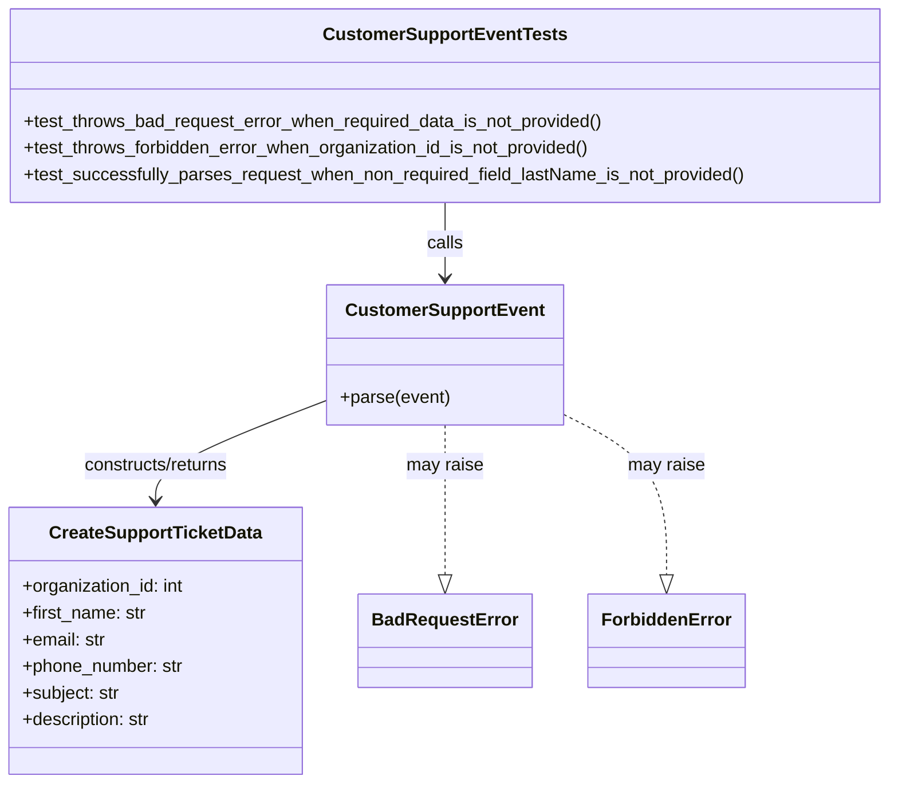
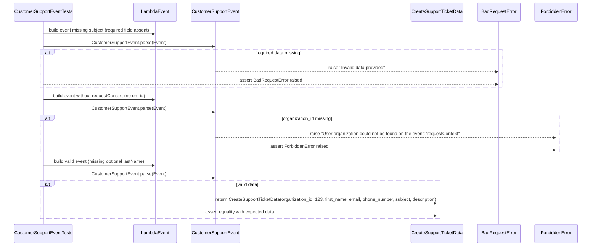

# Diagram: common/support_service/tests/unit/test_customer_support_event.py

> Auto-generated by Obscura crawlers

## Diagram 1

### SVG

<svg id="container" width="799.171875" xmlns="http://www.w3.org/2000/svg" class="classDiagram" height="704" viewBox="0 0 799.171875 704" role="graphics-document document" aria-roledescription="class"><g><defs><marker id="container_class-aggregationStart" class="marker aggregation class" refX="18" refY="7" markerWidth="190" markerHeight="240" orient="auto"><path d="M 18,7 L9,13 L1,7 L9,1 Z"></path></marker></defs><defs><marker id="container_class-aggregationEnd" class="marker aggregation class" refX="1" refY="7" markerWidth="20" markerHeight="28" orient="auto"><path d="M 18,7 L9,13 L1,7 L9,1 Z"></path></marker></defs><defs><marker id="container_class-extensionStart" class="marker extension class" refX="18" refY="7" markerWidth="190" markerHeight="240" orient="auto"><path d="M 1,7 L18,13 V 1 Z"></path></marker></defs><defs><marker id="container_class-extensionEnd" class="marker extension class" refX="1" refY="7" markerWidth="20" markerHeight="28" orient="auto"><path d="M 1,1 V 13 L18,7 Z"></path></marker></defs><defs><marker id="container_class-compositionStart" class="marker composition class" refX="18" refY="7" markerWidth="190" markerHeight="240" orient="auto"><path d="M 18,7 L9,13 L1,7 L9,1 Z"></path></marker></defs><defs><marker id="container_class-compositionEnd" class="marker composition class" refX="1" refY="7" markerWidth="20" markerHeight="28" orient="auto"><path d="M 18,7 L9,13 L1,7 L9,1 Z"></path></marker></defs><defs><marker id="container_class-dependencyStart" class="marker dependency class" refX="6" refY="7" markerWidth="190" markerHeight="240" orient="auto"><path d="M 5,7 L9,13 L1,7 L9,1 Z"></path></marker></defs><defs><marker id="container_class-dependencyEnd" class="marker dependency class" refX="13" refY="7" markerWidth="20" markerHeight="28" orient="auto"><path d="M 18,7 L9,13 L14,7 L9,1 Z"></path></marker></defs><defs><marker id="container_class-lollipopStart" class="marker lollipop class" refX="13" refY="7" markerWidth="190" markerHeight="240" orient="auto"><circle stroke="black" fill="transparent" cx="7" cy="7" r="6"></circle></marker></defs><defs><marker id="container_class-lollipopEnd" class="marker lollipop class" refX="1" refY="7" markerWidth="190" markerHeight="240" orient="auto"><circle stroke="black" fill="transparent" cx="7" cy="7" r="6"></circle></marker></defs><g class="root"><g class="clusters"></g><g class="edgePaths"><path d="M399.586,182L399.586,188.167C399.586,194.333,399.586,206.667,399.586,218C399.586,229.333,399.586,239.667,399.586,244.833L399.586,250" id="id_CustomerSupportEventTests_CustomerSupportEvent_1" class="edge-thickness-normal edge-pattern-solid relation" style=";;;" data-edge="true" data-et="edge" data-id="id_CustomerSupportEventTests_CustomerSupportEvent_1" data-points="W3sieCI6Mzk5LjU4NTkzNzUsInkiOjE4Mn0seyJ4IjozOTkuNTg1OTM3NSwieSI6MjE5fSx7IngiOjM5OS41ODU5Mzc1LCJ5IjoyNTZ9XQ==" marker-end="url(#container_class-dependencyEnd)"></path><path d="M295.75,359.451L270.273,369.376C244.797,379.301,193.844,399.15,168.367,414.242C142.891,429.333,142.891,439.667,142.891,444.833L142.891,450" id="id_CustomerSupportEvent_CreateSupportTicketData_2" class="edge-thickness-normal edge-pattern-solid relation" style=";;;" data-edge="true" data-et="edge" data-id="id_CustomerSupportEvent_CreateSupportTicketData_2" data-points="W3sieCI6Mjk1Ljc1LCJ5IjozNTkuNDUxMDQ1NDM5MzI4fSx7IngiOjE0Mi44OTA2MjUsInkiOjQxOX0seyJ4IjoxNDIuODkwNjI1LCJ5Ijo0NTZ9XQ==" marker-end="url(#container_class-dependencyEnd)"></path><path d="M399.586,382L399.586,388.167C399.586,394.333,399.586,406.667,399.586,429.125C399.586,451.583,399.586,484.167,399.586,500.458L399.586,516.75" id="id_CustomerSupportEvent_BadRequestError_3" class="edge-thickness-normal edge-pattern-dashed relation" style=";;;" data-edge="true" data-et="edge" data-id="id_CustomerSupportEvent_BadRequestError_3" data-points="W3sieCI6Mzk5LjU4NTkzNzUsInkiOjM4Mn0seyJ4IjozOTkuNTg1OTM3NSwieSI6NDE5fSx7IngiOjM5OS41ODU5Mzc1LCJ5Ijo1MzR9XQ==" marker-end="url(#container_class-extensionEnd)"></path><path d="M503.422,373.185L518.055,380.821C532.688,388.457,561.953,403.728,576.586,427.656C591.219,451.583,591.219,484.167,591.219,500.458L591.219,516.75" id="id_CustomerSupportEvent_ForbiddenError_4" class="edge-thickness-normal edge-pattern-dashed relation" style=";;;" data-edge="true" data-et="edge" data-id="id_CustomerSupportEvent_ForbiddenError_4" data-points="W3sieCI6NTAzLjQyMTg3NSwieSI6MzczLjE4NDg0MjQzMTQwNzczfSx7IngiOjU5MS4yMTg3NSwieSI6NDE5fSx7IngiOjU5MS4yMTg3NSwieSI6NTM0fV0=" marker-end="url(#container_class-extensionEnd)"></path></g><g class="edgeLabels"><g class="edgeLabel" transform="translate(399.5859375, 219)"><g class="label" data-id="id_CustomerSupportEventTests_CustomerSupportEvent_1" transform="translate(-16.4453125, -12)"><foreignObject width="32.890625" height="24">

calls

</foreignObject></g></g><g class="edgeLabel" transform="translate(142.890625, 419)"><g class="label" data-id="id_CustomerSupportEvent_CreateSupportTicketData_2" transform="translate(-68.03125, -12)"><foreignObject width="136.0625" height="24">

constructs/returns

</foreignObject></g></g><g class="edgeLabel" transform="translate(399.5859375, 419)"><g class="label" data-id="id_CustomerSupportEvent_BadRequestError_3" transform="translate(-34.65625, -12)"><foreignObject width="69.3125" height="24">

may raise

</foreignObject></g></g><g class="edgeLabel" transform="translate(591.21875, 419)"><g class="label" data-id="id_CustomerSupportEvent_ForbiddenError_4" transform="translate(-34.65625, -12)"><foreignObject width="69.3125" height="24">

may raise

</foreignObject></g></g></g><g class="nodes"><g class="node default" id="classId-CustomerSupportEvent-0" transform="translate(399.5859375, 319)"><g class="basic label-container"><path d="M-103.8359375 -63 L103.8359375 -63 L103.8359375 63 L-103.8359375 63" stroke="none" stroke-width="0" fill="#ECECFF" style=""></path><path d="M-103.8359375 -63 C-58.48104598240651 -63, -13.126154464813027 -63, 103.8359375 -63 M-103.8359375 -63 C-61.62044514295336 -63, -19.404952785906715 -63, 103.8359375 -63 M103.8359375 -63 C103.8359375 -20.48214358093542, 103.8359375 22.035712838129157, 103.8359375 63 M103.8359375 -63 C103.8359375 -30.171966887948628, 103.8359375 2.6560662241027444, 103.8359375 63 M103.8359375 63 C32.73996793686493 63, -38.35600162627014 63, -103.8359375 63 M103.8359375 63 C49.7224566903171 63, -4.391024119365795 63, -103.8359375 63 M-103.8359375 63 C-103.8359375 36.28434396845719, -103.8359375 9.56868793691438, -103.8359375 -63 M-103.8359375 63 C-103.8359375 22.185383844421835, -103.8359375 -18.62923231115633, -103.8359375 -63" stroke="#9370DB" stroke-width="1.3" fill="none" stroke-dasharray="0 0" style=""></path></g><g class="annotation-group text" transform="translate(0, -39)"></g><g class="label-group text" transform="translate(-84.796875, -39)"><g class="label" style="font-weight: bolder" transform="translate(0,-12)"><foreignObject width="169.59375" height="24">

CustomerSupportEvent

</foreignObject></g></g><g class="members-group text" transform="translate(-91.8359375, 9)"></g><g class="methods-group text" transform="translate(-91.8359375, 39)"><g class="label" style="" transform="translate(0,-12)"><foreignObject width="98.875" height="24">

+parse(event)

</foreignObject></g></g><g class="divider" style=""><path d="M-103.8359375 -15 C-22.937976234594103 -15, 57.959985030811794 -15, 103.8359375 -15 M-103.8359375 -15 C-22.034364847018423 -15, 59.76720780596315 -15, 103.8359375 -15" stroke="#9370DB" stroke-width="1.3" fill="none" stroke-dasharray="0 0" style=""></path></g><g class="divider" style=""><path d="M-103.8359375 9 C-32.32550127086502 9, 39.18493495826996 9, 103.8359375 9 M-103.8359375 9 C-27.825590317081463 9, 48.18475686583707 9, 103.8359375 9" stroke="#9370DB" stroke-width="1.3" fill="none" stroke-dasharray="0 0" style=""></path></g></g><g class="node default" id="classId-CreateSupportTicketData-1" transform="translate(142.890625, 576)"><g class="basic label-container"><path d="M-132.4140625 -120 L132.4140625 -120 L132.4140625 120 L-132.4140625 120" stroke="none" stroke-width="0" fill="#ECECFF" style=""></path><path d="M-132.4140625 -120 C-33.46791479118187 -120, 65.47823291763626 -120, 132.4140625 -120 M-132.4140625 -120 C-62.335181552237884 -120, 7.7436993955242315 -120, 132.4140625 -120 M132.4140625 -120 C132.4140625 -59.50434283052457, 132.4140625 0.9913143389508576, 132.4140625 120 M132.4140625 -120 C132.4140625 -37.567680177987086, 132.4140625 44.86463964402583, 132.4140625 120 M132.4140625 120 C40.474382324663836 120, -51.46529785067233 120, -132.4140625 120 M132.4140625 120 C57.148860932256824 120, -18.116340635486353 120, -132.4140625 120 M-132.4140625 120 C-132.4140625 61.04660281708095, -132.4140625 2.0932056341619045, -132.4140625 -120 M-132.4140625 120 C-132.4140625 39.17030257586393, -132.4140625 -41.65939484827214, -132.4140625 -120" stroke="#9370DB" stroke-width="1.3" fill="none" stroke-dasharray="0 0" style=""></path></g><g class="annotation-group text" transform="translate(0, -96)"></g><g class="label-group text" transform="translate(-92.34375, -96)"><g class="label" style="font-weight: bolder" transform="translate(0,-12)"><foreignObject width="184.6875" height="24">

CreateSupportTicketData

</foreignObject></g></g><g class="members-group text" transform="translate(-120.4140625, -48)"><g class="label" style="" transform="translate(0,-12)"><foreignObject width="148.484375" height="24">

+organization_id: int

</foreignObject></g><g class="label" style="" transform="translate(0,12)"><foreignObject width="112.46875" height="24">

+first_name: str

</foreignObject></g><g class="label" style="" transform="translate(0,36)"><foreignObject width="75.984375" height="24">

+email: str

</foreignObject></g><g class="label" style="" transform="translate(0,60)"><foreignObject width="146.78125" height="24">

+phone_number: str

</foreignObject></g><g class="label" style="" transform="translate(0,84)"><foreignObject width="88.46875" height="24">

+subject: str

</foreignObject></g><g class="label" style="" transform="translate(0,108)"><foreignObject width="118.109375" height="24">

+description: str

</foreignObject></g></g><g class="methods-group text" transform="translate(-120.4140625, 120)"></g><g class="divider" style=""><path d="M-132.4140625 -72 C-77.41721520654357 -72, -22.420367913087148 -72, 132.4140625 -72 M-132.4140625 -72 C-33.66610260459362 -72, 65.08185729081276 -72, 132.4140625 -72" stroke="#9370DB" stroke-width="1.3" fill="none" stroke-dasharray="0 0" style=""></path></g><g class="divider" style=""><path d="M-132.4140625 96 C-62.028132502815055 96, 8.35779749436989 96, 132.4140625 96 M-132.4140625 96 C-52.44438045725545 96, 27.525301585489103 96, 132.4140625 96" stroke="#9370DB" stroke-width="1.3" fill="none" stroke-dasharray="0 0" style=""></path></g></g><g class="node default" id="classId-BadRequestError-2" transform="translate(399.5859375, 576)"><g class="basic label-container"><path d="M-74.28125 -42 L74.28125 -42 L74.28125 42 L-74.28125 42" stroke="none" stroke-width="0" fill="#ECECFF" style=""></path><path d="M-74.28125 -42 C-16.18001269077717 -42, 41.92122461844566 -42, 74.28125 -42 M-74.28125 -42 C-17.1827112445352 -42, 39.9158275109296 -42, 74.28125 -42 M74.28125 -42 C74.28125 -16.30605161753672, 74.28125 9.387896764926559, 74.28125 42 M74.28125 -42 C74.28125 -16.659581794619402, 74.28125 8.680836410761195, 74.28125 42 M74.28125 42 C25.498334226039788 42, -23.284581547920425 42, -74.28125 42 M74.28125 42 C29.207318032280014 42, -15.866613935439972 42, -74.28125 42 M-74.28125 42 C-74.28125 18.127665855475172, -74.28125 -5.744668289049656, -74.28125 -42 M-74.28125 42 C-74.28125 9.964609397227477, -74.28125 -22.070781205545046, -74.28125 -42" stroke="#9370DB" stroke-width="1.3" fill="none" stroke-dasharray="0 0" style=""></path></g><g class="annotation-group text" transform="translate(0, -18)"></g><g class="label-group text" transform="translate(-62.28125, -18)"><g class="label" style="font-weight: bolder" transform="translate(0,-12)"><foreignObject width="124.5625" height="24">

BadRequestError

</foreignObject></g></g><g class="members-group text" transform="translate(-62.28125, 30)"></g><g class="methods-group text" transform="translate(-62.28125, 60)"></g><g class="divider" style=""><path d="M-74.28125 6 C-20.928087388753553 6, 32.42507522249289 6, 74.28125 6 M-74.28125 6 C-27.075064973048555 6, 20.13112005390289 6, 74.28125 6" stroke="#9370DB" stroke-width="1.3" fill="none" stroke-dasharray="0 0" style=""></path></g><g class="divider" style=""><path d="M-74.28125 24 C-20.37239076014898 24, 33.53646847970204 24, 74.28125 24 M-74.28125 24 C-24.971383580183193 24, 24.338482839633613 24, 74.28125 24" stroke="#9370DB" stroke-width="1.3" fill="none" stroke-dasharray="0 0" style=""></path></g></g><g class="node default" id="classId-ForbiddenError-3" transform="translate(591.21875, 576)"><g class="basic label-container"><path d="M-67.3515625 -42 L67.3515625 -42 L67.3515625 42 L-67.3515625 42" stroke="none" stroke-width="0" fill="#ECECFF" style=""></path><path d="M-67.3515625 -42 C-15.147504330289777 -42, 37.056553839420445 -42, 67.3515625 -42 M-67.3515625 -42 C-28.1305161167435 -42, 11.090530266513 -42, 67.3515625 -42 M67.3515625 -42 C67.3515625 -23.251579010643862, 67.3515625 -4.5031580212877245, 67.3515625 42 M67.3515625 -42 C67.3515625 -22.536843096889257, 67.3515625 -3.0736861937785136, 67.3515625 42 M67.3515625 42 C15.520562725397482 42, -36.310437049205035 42, -67.3515625 42 M67.3515625 42 C28.660856722043448 42, -10.029849055913104 42, -67.3515625 42 M-67.3515625 42 C-67.3515625 13.37541649575342, -67.3515625 -15.24916700849316, -67.3515625 -42 M-67.3515625 42 C-67.3515625 9.717348099154705, -67.3515625 -22.56530380169059, -67.3515625 -42" stroke="#9370DB" stroke-width="1.3" fill="none" stroke-dasharray="0 0" style=""></path></g><g class="annotation-group text" transform="translate(0, -18)"></g><g class="label-group text" transform="translate(-55.3515625, -18)"><g class="label" style="font-weight: bolder" transform="translate(0,-12)"><foreignObject width="110.703125" height="24">

ForbiddenError

</foreignObject></g></g><g class="members-group text" transform="translate(-55.3515625, 30)"></g><g class="methods-group text" transform="translate(-55.3515625, 60)"></g><g class="divider" style=""><path d="M-67.3515625 6 C-28.622966848916874 6, 10.105628802166251 6, 67.3515625 6 M-67.3515625 6 C-32.17333731278231 6, 3.004887874435383 6, 67.3515625 6" stroke="#9370DB" stroke-width="1.3" fill="none" stroke-dasharray="0 0" style=""></path></g><g class="divider" style=""><path d="M-67.3515625 24 C-20.49343540438163 24, 26.364691691236743 24, 67.3515625 24 M-67.3515625 24 C-34.627663482860164 24, -1.9037644657203288 24, 67.3515625 24" stroke="#9370DB" stroke-width="1.3" fill="none" stroke-dasharray="0 0" style=""></path></g></g><g class="node default" id="classId-CustomerSupportEventTests-4" transform="translate(399.5859375, 95)"><g class="basic label-container"><path d="M-391.5859375 -87 L391.5859375 -87 L391.5859375 87 L-391.5859375 87" stroke="none" stroke-width="0" fill="#ECECFF" style=""></path><path d="M-391.5859375 -87 C-80.34776676096686 -87, 230.89040397806627 -87, 391.5859375 -87 M-391.5859375 -87 C-167.42858251011043 -87, 56.72877247977914 -87, 391.5859375 -87 M391.5859375 -87 C391.5859375 -25.662029700247388, 391.5859375 35.675940599505225, 391.5859375 87 M391.5859375 -87 C391.5859375 -46.16036861150878, 391.5859375 -5.320737223017559, 391.5859375 87 M391.5859375 87 C81.6091544827259 87, -228.3676285345482 87, -391.5859375 87 M391.5859375 87 C99.50896844932652 87, -192.56800060134697 87, -391.5859375 87 M-391.5859375 87 C-391.5859375 18.292225111255192, -391.5859375 -50.415549777489616, -391.5859375 -87 M-391.5859375 87 C-391.5859375 29.120617719767083, -391.5859375 -28.758764560465835, -391.5859375 -87" stroke="#9370DB" stroke-width="1.3" fill="none" stroke-dasharray="0 0" style=""></path></g><g class="annotation-group text" transform="translate(0, -63)"></g><g class="label-group text" transform="translate(-103.90625, -63)"><g class="label" style="font-weight: bolder" transform="translate(0,-12)"><foreignObject width="207.8125" height="24">

CustomerSupportEventTests

</foreignObject></g></g><g class="members-group text" transform="translate(-379.5859375, -15)"></g><g class="methods-group text" transform="translate(-379.5859375, 15)"><g class="label" style="" transform="translate(0,-12)"><foreignObject width="528.484375" height="24">

+test_throws_bad_request_error_when_required_data_is_not_provided()

</foreignObject></g><g class="label" style="" transform="translate(0,12)"><foreignObject width="518.9375" height="24">

+test_throws_forbidden_error_when_organization_id_is_not_provided()

</foreignObject></g><g class="label" style="" transform="translate(0,36)"><foreignObject width="655.265625" height="24">

+test_successfully_parses_request_when_non_required_field_lastName_is_not_provided()

</foreignObject></g></g><g class="divider" style=""><path d="M-391.5859375 -39 C-87.87613198651121 -39, 215.83367352697758 -39, 391.5859375 -39 M-391.5859375 -39 C-163.82671411807308 -39, 63.93250926385383 -39, 391.5859375 -39" stroke="#9370DB" stroke-width="1.3" fill="none" stroke-dasharray="0 0" style=""></path></g><g class="divider" style=""><path d="M-391.5859375 -15 C-181.57181943926255 -15, 28.44229862147489 -15, 391.5859375 -15 M-391.5859375 -15 C-89.64805590643726 -15, 212.28982568712547 -15, 391.5859375 -15" stroke="#9370DB" stroke-width="1.3" fill="none" stroke-dasharray="0 0" style=""></path></g></g></g></g></g></svg>

## Diagram 2

### SVG

<svg id="container" width="2222.5" xmlns="http://www.w3.org/2000/svg" height="912" viewBox="-50 -10 2222.5 912" role="graphics-document document" aria-roledescription="sequence"><g><rect x="1972.5" y="826" fill="#eaeaea" stroke="#666" width="150" height="65" name="Forbid" rx="3" ry="3" class="actor actor-bottom"></rect><text x="2047.5" y="858.5" dominant-baseline="central" alignment-baseline="central" class="actor actor-box" style="text-anchor: middle; font-size: 16px; font-weight: 400;"><tspan x="2047.5" dy="0">ForbiddenError</tspan></text></g><g><rect x="1772.5" y="826" fill="#eaeaea" stroke="#666" width="150" height="65" name="BadReq" rx="3" ry="3" class="actor actor-bottom"></rect><text x="1847.5" y="858.5" dominant-baseline="central" alignment-baseline="central" class="actor actor-box" style="text-anchor: middle; font-size: 16px; font-weight: 400;"><tspan x="1847.5" dy="0">BadRequestError</tspan></text></g><g><rect x="1522.5" y="826" fill="#eaeaea" stroke="#666" width="200" height="65" name="Data" rx="3" ry="3" class="actor actor-bottom"></rect><text x="1622.5" y="858.5" dominant-baseline="central" alignment-baseline="central" class="actor actor-box" style="text-anchor: middle; font-size: 16px; font-weight: 400;"><tspan x="1622.5" dy="0">CreateSupportTicketData</tspan></text></g><g><rect x="672" y="826" fill="#eaeaea" stroke="#666" width="187" height="65" name="Parser" rx="3" ry="3" class="actor actor-bottom"></rect><text x="765.5" y="858.5" dominant-baseline="central" alignment-baseline="central" class="actor actor-box" style="text-anchor: middle; font-size: 16px; font-weight: 400;"><tspan x="765.5" dy="0">CustomerSupportEvent</tspan></text></g><g><rect x="472" y="826" fill="#eaeaea" stroke="#666" width="150" height="65" name="Event" rx="3" ry="3" class="actor actor-bottom"></rect><text x="547" y="858.5" dominant-baseline="central" alignment-baseline="central" class="actor actor-box" style="text-anchor: middle; font-size: 16px; font-weight: 400;"><tspan x="547" dy="0">LambdaEvent</tspan></text></g><g><rect x="0" y="826" fill="#eaeaea" stroke="#666" width="224" height="65" name="Tests" rx="3" ry="3" class="actor actor-bottom"></rect><text x="112" y="858.5" dominant-baseline="central" alignment-baseline="central" class="actor actor-box" style="text-anchor: middle; font-size: 16px; font-weight: 400;"><tspan x="112" dy="0">CustomerSupportEventTests</tspan></text></g><g><line id="actor5" x1="2047.5" y1="65" x2="2047.5" y2="826" class="actor-line 200" stroke-width="0.5px" stroke="#999" name="Forbid"></line><g id="root-5"><rect x="1972.5" y="0" fill="#eaeaea" stroke="#666" width="150" height="65" name="Forbid" rx="3" ry="3" class="actor actor-top"></rect><text x="2047.5" y="32.5" dominant-baseline="central" alignment-baseline="central" class="actor actor-box" style="text-anchor: middle; font-size: 16px; font-weight: 400;"><tspan x="2047.5" dy="0">ForbiddenError</tspan></text></g></g><g><line id="actor4" x1="1847.5" y1="65" x2="1847.5" y2="826" class="actor-line 200" stroke-width="0.5px" stroke="#999" name="BadReq"></line><g id="root-4"><rect x="1772.5" y="0" fill="#eaeaea" stroke="#666" width="150" height="65" name="BadReq" rx="3" ry="3" class="actor actor-top"></rect><text x="1847.5" y="32.5" dominant-baseline="central" alignment-baseline="central" class="actor actor-box" style="text-anchor: middle; font-size: 16px; font-weight: 400;"><tspan x="1847.5" dy="0">BadRequestError</tspan></text></g></g><g><line id="actor3" x1="1622.5" y1="65" x2="1622.5" y2="826" class="actor-line 200" stroke-width="0.5px" stroke="#999" name="Data"></line><g id="root-3"><rect x="1522.5" y="0" fill="#eaeaea" stroke="#666" width="200" height="65" name="Data" rx="3" ry="3" class="actor actor-top"></rect><text x="1622.5" y="32.5" dominant-baseline="central" alignment-baseline="central" class="actor actor-box" style="text-anchor: middle; font-size: 16px; font-weight: 400;"><tspan x="1622.5" dy="0">CreateSupportTicketData</tspan></text></g></g><g><line id="actor2" x1="765.5" y1="65" x2="765.5" y2="826" class="actor-line 200" stroke-width="0.5px" stroke="#999" name="Parser"></line><g id="root-2"><rect x="672" y="0" fill="#eaeaea" stroke="#666" width="187" height="65" name="Parser" rx="3" ry="3" class="actor actor-top"></rect><text x="765.5" y="32.5" dominant-baseline="central" alignment-baseline="central" class="actor actor-box" style="text-anchor: middle; font-size: 16px; font-weight: 400;"><tspan x="765.5" dy="0">CustomerSupportEvent</tspan></text></g></g><g><line id="actor1" x1="547" y1="65" x2="547" y2="826" class="actor-line 200" stroke-width="0.5px" stroke="#999" name="Event"></line><g id="root-1"><rect x="472" y="0" fill="#eaeaea" stroke="#666" width="150" height="65" name="Event" rx="3" ry="3" class="actor actor-top"></rect><text x="547" y="32.5" dominant-baseline="central" alignment-baseline="central" class="actor actor-box" style="text-anchor: middle; font-size: 16px; font-weight: 400;"><tspan x="547" dy="0">LambdaEvent</tspan></text></g></g><g><line id="actor0" x1="112" y1="65" x2="112" y2="826" class="actor-line 200" stroke-width="0.5px" stroke="#999" name="Tests"></line><g id="root-0"><rect x="0" y="0" fill="#eaeaea" stroke="#666" width="224" height="65" name="Tests" rx="3" ry="3" class="actor actor-top"></rect><text x="112" y="32.5" dominant-baseline="central" alignment-baseline="central" class="actor actor-box" style="text-anchor: middle; font-size: 16px; font-weight: 400;"><tspan x="112" dy="0">CustomerSupportEventTests</tspan></text></g></g><g></g><defs><symbol id="computer" width="24" height="24"><path transform="scale(.5)" d="M2 2v13h20v-13h-20zm18 11h-16v-9h16v9zm-10.228 6l.466-1h3.524l.467 1h-4.457zm14.228 3h-24l2-6h2.104l-1.33 4h18.45l-1.297-4h2.073l2 6zm-5-10h-14v-7h14v7z"></path></symbol></defs><defs><symbol id="database" fill-rule="evenodd" clip-rule="evenodd"><path transform="scale(.5)" d="M12.258.001l.256.004.255.005.253.008.251.01.249.012.247.015.246.016.242.019.241.02.239.023.236.024.233.027.231.028.229.031.225.032.223.034.22.036.217.038.214.04.211.041.208.043.205.045.201.046.198.048.194.05.191.051.187.053.183.054.18.056.175.057.172.059.168.06.163.061.16.063.155.064.15.066.074.033.073.033.071.034.07.034.069.035.068.035.067.035.066.035.064.036.064.036.062.036.06.036.06.037.058.037.058.037.055.038.055.038.053.038.052.038.051.039.05.039.048.039.047.039.045.04.044.04.043.04.041.04.04.041.039.041.037.041.036.041.034.041.033.042.032.042.03.042.029.042.027.042.026.043.024.043.023.043.021.043.02.043.018.044.017.043.015.044.013.044.012.044.011.045.009.044.007.045.006.045.004.045.002.045.001.045v17l-.001.045-.002.045-.004.045-.006.045-.007.045-.009.044-.011.045-.012.044-.013.044-.015.044-.017.043-.018.044-.02.043-.021.043-.023.043-.024.043-.026.043-.027.042-.029.042-.03.042-.032.042-.033.042-.034.041-.036.041-.037.041-.039.041-.04.041-.041.04-.043.04-.044.04-.045.04-.047.039-.048.039-.05.039-.051.039-.052.038-.053.038-.055.038-.055.038-.058.037-.058.037-.06.037-.06.036-.062.036-.064.036-.064.036-.066.035-.067.035-.068.035-.069.035-.07.034-.071.034-.073.033-.074.033-.15.066-.155.064-.16.063-.163.061-.168.06-.172.059-.175.057-.18.056-.183.054-.187.053-.191.051-.194.05-.198.048-.201.046-.205.045-.208.043-.211.041-.214.04-.217.038-.22.036-.223.034-.225.032-.229.031-.231.028-.233.027-.236.024-.239.023-.241.02-.242.019-.246.016-.247.015-.249.012-.251.01-.253.008-.255.005-.256.004-.258.001-.258-.001-.256-.004-.255-.005-.253-.008-.251-.01-.249-.012-.247-.015-.245-.016-.243-.019-.241-.02-.238-.023-.236-.024-.234-.027-.231-.028-.228-.031-.226-.032-.223-.034-.22-.036-.217-.038-.214-.04-.211-.041-.208-.043-.204-.045-.201-.046-.198-.048-.195-.05-.19-.051-.187-.053-.184-.054-.179-.056-.176-.057-.172-.059-.167-.06-.164-.061-.159-.063-.155-.064-.151-.066-.074-.033-.072-.033-.072-.034-.07-.034-.069-.035-.068-.035-.067-.035-.066-.035-.064-.036-.063-.036-.062-.036-.061-.036-.06-.037-.058-.037-.057-.037-.056-.038-.055-.038-.053-.038-.052-.038-.051-.039-.049-.039-.049-.039-.046-.039-.046-.04-.044-.04-.043-.04-.041-.04-.04-.041-.039-.041-.037-.041-.036-.041-.034-.041-.033-.042-.032-.042-.03-.042-.029-.042-.027-.042-.026-.043-.024-.043-.023-.043-.021-.043-.02-.043-.018-.044-.017-.043-.015-.044-.013-.044-.012-.044-.011-.045-.009-.044-.007-.045-.006-.045-.004-.045-.002-.045-.001-.045v-17l.001-.045.002-.045.004-.045.006-.045.007-.045.009-.044.011-.045.012-.044.013-.044.015-.044.017-.043.018-.044.02-.043.021-.043.023-.043.024-.043.026-.043.027-.042.029-.042.03-.042.032-.042.033-.042.034-.041.036-.041.037-.041.039-.041.04-.041.041-.04.043-.04.044-.04.046-.04.046-.039.049-.039.049-.039.051-.039.052-.038.053-.038.055-.038.056-.038.057-.037.058-.037.06-.037.061-.036.062-.036.063-.036.064-.036.066-.035.067-.035.068-.035.069-.035.07-.034.072-.034.072-.033.074-.033.151-.066.155-.064.159-.063.164-.061.167-.06.172-.059.176-.057.179-.056.184-.054.187-.053.19-.051.195-.05.198-.048.201-.046.204-.045.208-.043.211-.041.214-.04.217-.038.22-.036.223-.034.226-.032.228-.031.231-.028.234-.027.236-.024.238-.023.241-.02.243-.019.245-.016.247-.015.249-.012.251-.01.253-.008.255-.005.256-.004.258-.001.258.001zm-9.258 20.499v.01l.001.021.003.021.004.022.005.021.006.022.007.022.009.023.01.022.011.023.012.023.013.023.015.023.016.024.017.023.018.024.019.024.021.024.022.025.023.024.024.025.052.049.056.05.061.051.066.051.07.051.075.051.079.052.084.052.088.052.092.052.097.052.102.051.105.052.11.052.114.051.119.051.123.051.127.05.131.05.135.05.139.048.144.049.147.047.152.047.155.047.16.045.163.045.167.043.171.043.176.041.178.041.183.039.187.039.19.037.194.035.197.035.202.033.204.031.209.03.212.029.216.027.219.025.222.024.226.021.23.02.233.018.236.016.24.015.243.012.246.01.249.008.253.005.256.004.259.001.26-.001.257-.004.254-.005.25-.008.247-.011.244-.012.241-.014.237-.016.233-.018.231-.021.226-.021.224-.024.22-.026.216-.027.212-.028.21-.031.205-.031.202-.034.198-.034.194-.036.191-.037.187-.039.183-.04.179-.04.175-.042.172-.043.168-.044.163-.045.16-.046.155-.046.152-.047.148-.048.143-.049.139-.049.136-.05.131-.05.126-.05.123-.051.118-.052.114-.051.11-.052.106-.052.101-.052.096-.052.092-.052.088-.053.083-.051.079-.052.074-.052.07-.051.065-.051.06-.051.056-.05.051-.05.023-.024.023-.025.021-.024.02-.024.019-.024.018-.024.017-.024.015-.023.014-.024.013-.023.012-.023.01-.023.01-.022.008-.022.006-.022.006-.022.004-.022.004-.021.001-.021.001-.021v-4.127l-.077.055-.08.053-.083.054-.085.053-.087.052-.09.052-.093.051-.095.05-.097.05-.1.049-.102.049-.105.048-.106.047-.109.047-.111.046-.114.045-.115.045-.118.044-.12.043-.122.042-.124.042-.126.041-.128.04-.13.04-.132.038-.134.038-.135.037-.138.037-.139.035-.142.035-.143.034-.144.033-.147.032-.148.031-.15.03-.151.03-.153.029-.154.027-.156.027-.158.026-.159.025-.161.024-.162.023-.163.022-.165.021-.166.02-.167.019-.169.018-.169.017-.171.016-.173.015-.173.014-.175.013-.175.012-.177.011-.178.01-.179.008-.179.008-.181.006-.182.005-.182.004-.184.003-.184.002h-.37l-.184-.002-.184-.003-.182-.004-.182-.005-.181-.006-.179-.008-.179-.008-.178-.01-.176-.011-.176-.012-.175-.013-.173-.014-.172-.015-.171-.016-.17-.017-.169-.018-.167-.019-.166-.02-.165-.021-.163-.022-.162-.023-.161-.024-.159-.025-.157-.026-.156-.027-.155-.027-.153-.029-.151-.03-.15-.03-.148-.031-.146-.032-.145-.033-.143-.034-.141-.035-.14-.035-.137-.037-.136-.037-.134-.038-.132-.038-.13-.04-.128-.04-.126-.041-.124-.042-.122-.042-.12-.044-.117-.043-.116-.045-.113-.045-.112-.046-.109-.047-.106-.047-.105-.048-.102-.049-.1-.049-.097-.05-.095-.05-.093-.052-.09-.051-.087-.052-.085-.053-.083-.054-.08-.054-.077-.054v4.127zm0-5.654v.011l.001.021.003.021.004.021.005.022.006.022.007.022.009.022.01.022.011.023.012.023.013.023.015.024.016.023.017.024.018.024.019.024.021.024.022.024.023.025.024.024.052.05.056.05.061.05.066.051.07.051.075.052.079.051.084.052.088.052.092.052.097.052.102.052.105.052.11.051.114.051.119.052.123.05.127.051.131.05.135.049.139.049.144.048.147.048.152.047.155.046.16.045.163.045.167.044.171.042.176.042.178.04.183.04.187.038.19.037.194.036.197.034.202.033.204.032.209.03.212.028.216.027.219.025.222.024.226.022.23.02.233.018.236.016.24.014.243.012.246.01.249.008.253.006.256.003.259.001.26-.001.257-.003.254-.006.25-.008.247-.01.244-.012.241-.015.237-.016.233-.018.231-.02.226-.022.224-.024.22-.025.216-.027.212-.029.21-.03.205-.032.202-.033.198-.035.194-.036.191-.037.187-.039.183-.039.179-.041.175-.042.172-.043.168-.044.163-.045.16-.045.155-.047.152-.047.148-.048.143-.048.139-.05.136-.049.131-.05.126-.051.123-.051.118-.051.114-.052.11-.052.106-.052.101-.052.096-.052.092-.052.088-.052.083-.052.079-.052.074-.051.07-.052.065-.051.06-.05.056-.051.051-.049.023-.025.023-.024.021-.025.02-.024.019-.024.018-.024.017-.024.015-.023.014-.023.013-.024.012-.022.01-.023.01-.023.008-.022.006-.022.006-.022.004-.021.004-.022.001-.021.001-.021v-4.139l-.077.054-.08.054-.083.054-.085.052-.087.053-.09.051-.093.051-.095.051-.097.05-.1.049-.102.049-.105.048-.106.047-.109.047-.111.046-.114.045-.115.044-.118.044-.12.044-.122.042-.124.042-.126.041-.128.04-.13.039-.132.039-.134.038-.135.037-.138.036-.139.036-.142.035-.143.033-.144.033-.147.033-.148.031-.15.03-.151.03-.153.028-.154.028-.156.027-.158.026-.159.025-.161.024-.162.023-.163.022-.165.021-.166.02-.167.019-.169.018-.169.017-.171.016-.173.015-.173.014-.175.013-.175.012-.177.011-.178.009-.179.009-.179.007-.181.007-.182.005-.182.004-.184.003-.184.002h-.37l-.184-.002-.184-.003-.182-.004-.182-.005-.181-.007-.179-.007-.179-.009-.178-.009-.176-.011-.176-.012-.175-.013-.173-.014-.172-.015-.171-.016-.17-.017-.169-.018-.167-.019-.166-.02-.165-.021-.163-.022-.162-.023-.161-.024-.159-.025-.157-.026-.156-.027-.155-.028-.153-.028-.151-.03-.15-.03-.148-.031-.146-.033-.145-.033-.143-.033-.141-.035-.14-.036-.137-.036-.136-.037-.134-.038-.132-.039-.13-.039-.128-.04-.126-.041-.124-.042-.122-.043-.12-.043-.117-.044-.116-.044-.113-.046-.112-.046-.109-.046-.106-.047-.105-.048-.102-.049-.1-.049-.097-.05-.095-.051-.093-.051-.09-.051-.087-.053-.085-.052-.083-.054-.08-.054-.077-.054v4.139zm0-5.666v.011l.001.02.003.022.004.021.005.022.006.021.007.022.009.023.01.022.011.023.012.023.013.023.015.023.016.024.017.024.018.023.019.024.021.025.022.024.023.024.024.025.052.05.056.05.061.05.066.051.07.051.075.052.079.051.084.052.088.052.092.052.097.052.102.052.105.051.11.052.114.051.119.051.123.051.127.05.131.05.135.05.139.049.144.048.147.048.152.047.155.046.16.045.163.045.167.043.171.043.176.042.178.04.183.04.187.038.19.037.194.036.197.034.202.033.204.032.209.03.212.028.216.027.219.025.222.024.226.021.23.02.233.018.236.017.24.014.243.012.246.01.249.008.253.006.256.003.259.001.26-.001.257-.003.254-.006.25-.008.247-.01.244-.013.241-.014.237-.016.233-.018.231-.02.226-.022.224-.024.22-.025.216-.027.212-.029.21-.03.205-.032.202-.033.198-.035.194-.036.191-.037.187-.039.183-.039.179-.041.175-.042.172-.043.168-.044.163-.045.16-.045.155-.047.152-.047.148-.048.143-.049.139-.049.136-.049.131-.051.126-.05.123-.051.118-.052.114-.051.11-.052.106-.052.101-.052.096-.052.092-.052.088-.052.083-.052.079-.052.074-.052.07-.051.065-.051.06-.051.056-.05.051-.049.023-.025.023-.025.021-.024.02-.024.019-.024.018-.024.017-.024.015-.023.014-.024.013-.023.012-.023.01-.022.01-.023.008-.022.006-.022.006-.022.004-.022.004-.021.001-.021.001-.021v-4.153l-.077.054-.08.054-.083.053-.085.053-.087.053-.09.051-.093.051-.095.051-.097.05-.1.049-.102.048-.105.048-.106.048-.109.046-.111.046-.114.046-.115.044-.118.044-.12.043-.122.043-.124.042-.126.041-.128.04-.13.039-.132.039-.134.038-.135.037-.138.036-.139.036-.142.034-.143.034-.144.033-.147.032-.148.032-.15.03-.151.03-.153.028-.154.028-.156.027-.158.026-.159.024-.161.024-.162.023-.163.023-.165.021-.166.02-.167.019-.169.018-.169.017-.171.016-.173.015-.173.014-.175.013-.175.012-.177.01-.178.01-.179.009-.179.007-.181.006-.182.006-.182.004-.184.003-.184.001-.185.001-.185-.001-.184-.001-.184-.003-.182-.004-.182-.006-.181-.006-.179-.007-.179-.009-.178-.01-.176-.01-.176-.012-.175-.013-.173-.014-.172-.015-.171-.016-.17-.017-.169-.018-.167-.019-.166-.02-.165-.021-.163-.023-.162-.023-.161-.024-.159-.024-.157-.026-.156-.027-.155-.028-.153-.028-.151-.03-.15-.03-.148-.032-.146-.032-.145-.033-.143-.034-.141-.034-.14-.036-.137-.036-.136-.037-.134-.038-.132-.039-.13-.039-.128-.041-.126-.041-.124-.041-.122-.043-.12-.043-.117-.044-.116-.044-.113-.046-.112-.046-.109-.046-.106-.048-.105-.048-.102-.048-.1-.05-.097-.049-.095-.051-.093-.051-.09-.052-.087-.052-.085-.053-.083-.053-.08-.054-.077-.054v4.153zm8.74-8.179l-.257.004-.254.005-.25.008-.247.011-.244.012-.241.014-.237.016-.233.018-.231.021-.226.022-.224.023-.22.026-.216.027-.212.028-.21.031-.205.032-.202.033-.198.034-.194.036-.191.038-.187.038-.183.04-.179.041-.175.042-.172.043-.168.043-.163.045-.16.046-.155.046-.152.048-.148.048-.143.048-.139.049-.136.05-.131.05-.126.051-.123.051-.118.051-.114.052-.11.052-.106.052-.101.052-.096.052-.092.052-.088.052-.083.052-.079.052-.074.051-.07.052-.065.051-.06.05-.056.05-.051.05-.023.025-.023.024-.021.024-.02.025-.019.024-.018.024-.017.023-.015.024-.014.023-.013.023-.012.023-.01.023-.01.022-.008.022-.006.023-.006.021-.004.022-.004.021-.001.021-.001.021.001.021.001.021.004.021.004.022.006.021.006.023.008.022.01.022.01.023.012.023.013.023.014.023.015.024.017.023.018.024.019.024.02.025.021.024.023.024.023.025.051.05.056.05.06.05.065.051.07.052.074.051.079.052.083.052.088.052.092.052.096.052.101.052.106.052.11.052.114.052.118.051.123.051.126.051.131.05.136.05.139.049.143.048.148.048.152.048.155.046.16.046.163.045.168.043.172.043.175.042.179.041.183.04.187.038.191.038.194.036.198.034.202.033.205.032.21.031.212.028.216.027.22.026.224.023.226.022.231.021.233.018.237.016.241.014.244.012.247.011.25.008.254.005.257.004.26.001.26-.001.257-.004.254-.005.25-.008.247-.011.244-.012.241-.014.237-.016.233-.018.231-.021.226-.022.224-.023.22-.026.216-.027.212-.028.21-.031.205-.032.202-.033.198-.034.194-.036.191-.038.187-.038.183-.04.179-.041.175-.042.172-.043.168-.043.163-.045.16-.046.155-.046.152-.048.148-.048.143-.048.139-.049.136-.05.131-.05.126-.051.123-.051.118-.051.114-.052.11-.052.106-.052.101-.052.096-.052.092-.052.088-.052.083-.052.079-.052.074-.051.07-.052.065-.051.06-.05.056-.05.051-.05.023-.025.023-.024.021-.024.02-.025.019-.024.018-.024.017-.023.015-.024.014-.023.013-.023.012-.023.01-.023.01-.022.008-.022.006-.023.006-.021.004-.022.004-.021.001-.021.001-.021-.001-.021-.001-.021-.004-.021-.004-.022-.006-.021-.006-.023-.008-.022-.01-.022-.01-.023-.012-.023-.013-.023-.014-.023-.015-.024-.017-.023-.018-.024-.019-.024-.02-.025-.021-.024-.023-.024-.023-.025-.051-.05-.056-.05-.06-.05-.065-.051-.07-.052-.074-.051-.079-.052-.083-.052-.088-.052-.092-.052-.096-.052-.101-.052-.106-.052-.11-.052-.114-.052-.118-.051-.123-.051-.126-.051-.131-.05-.136-.05-.139-.049-.143-.048-.148-.048-.152-.048-.155-.046-.16-.046-.163-.045-.168-.043-.172-.043-.175-.042-.179-.041-.183-.04-.187-.038-.191-.038-.194-.036-.198-.034-.202-.033-.205-.032-.21-.031-.212-.028-.216-.027-.22-.026-.224-.023-.226-.022-.231-.021-.233-.018-.237-.016-.241-.014-.244-.012-.247-.011-.25-.008-.254-.005-.257-.004-.26-.001-.26.001z"></path></symbol></defs><defs><symbol id="clock" width="24" height="24"><path transform="scale(.5)" d="M12 2c5.514 0 10 4.486 10 10s-4.486 10-10 10-10-4.486-10-10 4.486-10 10-10zm0-2c-6.627 0-12 5.373-12 12s5.373 12 12 12 12-5.373 12-12-5.373-12-12-12zm5.848 12.459c.202.038.202.333.001.372-1.907.361-6.045 1.111-6.547 1.111-.719 0-1.301-.582-1.301-1.301 0-.512.77-5.447 1.125-7.445.034-.192.312-.181.343.014l.985 6.238 5.394 1.011z"></path></symbol></defs><defs><marker id="arrowhead" refX="7.9" refY="5" markerUnits="userSpaceOnUse" markerWidth="12" markerHeight="12" orient="auto-start-reverse"><path d="M -1 0 L 10 5 L 0 10 z"></path></marker></defs><defs><marker id="crosshead" markerWidth="15" markerHeight="8" orient="auto" refX="4" refY="4.5"><path fill="none" stroke="#000000" stroke-width="1pt" d="M 1,2 L 6,7 M 6,2 L 1,7" style="stroke-dasharray: 0, 0;"></path></marker></defs><defs><marker id="filled-head" refX="15.5" refY="7" markerWidth="20" markerHeight="28" orient="auto"><path d="M 18,7 L9,13 L14,7 L9,1 Z"></path></marker></defs><defs><marker id="sequencenumber" refX="15" refY="15" markerWidth="60" markerHeight="40" orient="auto"><circle cx="15" cy="15" r="6"></circle></marker></defs><g><line x1="101" y1="171" x2="1858.5" y2="171" class="loopLine"></line><line x1="1858.5" y1="171" x2="1858.5" y2="312" class="loopLine"></line><line x1="101" y1="312" x2="1858.5" y2="312" class="loopLine"></line><line x1="101" y1="171" x2="101" y2="312" class="loopLine"></line><polygon points="101,171 151,171 151,184 142.6,191 101,191" class="labelBox"></polygon><text x="126" y="184" text-anchor="middle" dominant-baseline="middle" alignment-baseline="middle" class="labelText" style="font-size: 16px; font-weight: 400;">alt</text><text x="1004.75" y="189" text-anchor="middle" class="loopText" style="font-size: 16px; font-weight: 400;"><tspan x="1004.75">[required data missing]</tspan></text></g><g><line x1="101" y1="418" x2="2058.5" y2="418" class="loopLine"></line><line x1="2058.5" y1="418" x2="2058.5" y2="559" class="loopLine"></line><line x1="101" y1="559" x2="2058.5" y2="559" class="loopLine"></line><line x1="101" y1="418" x2="101" y2="559" class="loopLine"></line><polygon points="101,418 151,418 151,431 142.6,438 101,438" class="labelBox"></polygon><text x="126" y="431" text-anchor="middle" dominant-baseline="middle" alignment-baseline="middle" class="labelText" style="font-size: 16px; font-weight: 400;">alt</text><text x="1104.75" y="436" text-anchor="middle" class="loopText" style="font-size: 16px; font-weight: 400;"><tspan x="1104.75">[organization_id missing]</tspan></text></g><g><line x1="101" y1="665" x2="1633.5" y2="665" class="loopLine"></line><line x1="1633.5" y1="665" x2="1633.5" y2="806" class="loopLine"></line><line x1="101" y1="806" x2="1633.5" y2="806" class="loopLine"></line><line x1="101" y1="665" x2="101" y2="806" class="loopLine"></line><polygon points="101,665 151,665 151,678 142.6,685 101,685" class="labelBox"></polygon><text x="126" y="678" text-anchor="middle" dominant-baseline="middle" alignment-baseline="middle" class="labelText" style="font-size: 16px; font-weight: 400;">alt</text><text x="892.25" y="683" text-anchor="middle" class="loopText" style="font-size: 16px; font-weight: 400;"><tspan x="892.25">[valid data]</tspan></text></g><text x="328" y="80" text-anchor="middle" dominant-baseline="middle" alignment-baseline="middle" class="messageText" dy="1em" style="font-size: 16px; font-weight: 400;">build event missing subject (required field absent)</text><line x1="113" y1="113" x2="543" y2="113" class="messageLine0" stroke-width="2" stroke="none" marker-end="url(#arrowhead)" style="fill: none;"></line><text x="437" y="128" text-anchor="middle" dominant-baseline="middle" alignment-baseline="middle" class="messageText" dy="1em" style="font-size: 16px; font-weight: 400;">CustomerSupportEvent.parse(Event)</text><line x1="113" y1="161" x2="761.5" y2="161" class="messageLine0" stroke-width="2" stroke="none" marker-end="url(#arrowhead)" style="fill: none;"></line><text x="1305" y="221" text-anchor="middle" dominant-baseline="middle" alignment-baseline="middle" class="messageText" dy="1em" style="font-size: 16px; font-weight: 400;">raise "Invalid data provided"</text><line x1="766.5" y1="254" x2="1843.5" y2="254" class="messageLine1" stroke-width="2" stroke="none" marker-end="url(#arrowhead)" style="stroke-dasharray: 3, 3; fill: none;"></line><text x="978" y="269" text-anchor="middle" dominant-baseline="middle" alignment-baseline="middle" class="messageText" dy="1em" style="font-size: 16px; font-weight: 400;">assert BadRequestError raised</text><line x1="113" y1="302" x2="1843.5" y2="302" class="messageLine1" stroke-width="2" stroke="none" marker-end="url(#arrowhead)" style="stroke-dasharray: 3, 3; fill: none;"></line><text x="328" y="327" text-anchor="middle" dominant-baseline="middle" alignment-baseline="middle" class="messageText" dy="1em" style="font-size: 16px; font-weight: 400;">build event without requestContext (no org id)</text><line x1="113" y1="360" x2="543" y2="360" class="messageLine0" stroke-width="2" stroke="none" marker-end="url(#arrowhead)" style="fill: none;"></line><text x="437" y="375" text-anchor="middle" dominant-baseline="middle" alignment-baseline="middle" class="messageText" dy="1em" style="font-size: 16px; font-weight: 400;">CustomerSupportEvent.parse(Event)</text><line x1="113" y1="408" x2="761.5" y2="408" class="messageLine0" stroke-width="2" stroke="none" marker-end="url(#arrowhead)" style="fill: none;"></line><text x="1405" y="468" text-anchor="middle" dominant-baseline="middle" alignment-baseline="middle" class="messageText" dy="1em" style="font-size: 16px; font-weight: 400;">raise "User organization could not be found on the event: 'requestContext'"</text><line x1="766.5" y1="501" x2="2043.5" y2="501" class="messageLine1" stroke-width="2" stroke="none" marker-end="url(#arrowhead)" style="stroke-dasharray: 3, 3; fill: none;"></line><text x="1078" y="516" text-anchor="middle" dominant-baseline="middle" alignment-baseline="middle" class="messageText" dy="1em" style="font-size: 16px; font-weight: 400;">assert ForbiddenError raised</text><line x1="113" y1="549" x2="2043.5" y2="549" class="messageLine1" stroke-width="2" stroke="none" marker-end="url(#arrowhead)" style="stroke-dasharray: 3, 3; fill: none;"></line><text x="328" y="574" text-anchor="middle" dominant-baseline="middle" alignment-baseline="middle" class="messageText" dy="1em" style="font-size: 16px; font-weight: 400;">build valid event (missing optional lastName)</text><line x1="113" y1="607" x2="543" y2="607" class="messageLine0" stroke-width="2" stroke="none" marker-end="url(#arrowhead)" style="fill: none;"></line><text x="437" y="622" text-anchor="middle" dominant-baseline="middle" alignment-baseline="middle" class="messageText" dy="1em" style="font-size: 16px; font-weight: 400;">CustomerSupportEvent.parse(Event)</text><line x1="113" y1="655" x2="761.5" y2="655" class="messageLine0" stroke-width="2" stroke="none" marker-end="url(#arrowhead)" style="fill: none;"></line><text x="1193" y="715" text-anchor="middle" dominant-baseline="middle" alignment-baseline="middle" class="messageText" dy="1em" style="font-size: 16px; font-weight: 400;">return CreateSupportTicketData(organization_id=123, first_name, email, phone_number, subject, description)</text><line x1="766.5" y1="748" x2="1618.5" y2="748" class="messageLine1" stroke-width="2" stroke="none" marker-end="url(#arrowhead)" style="stroke-dasharray: 3, 3; fill: none;"></line><text x="866" y="763" text-anchor="middle" dominant-baseline="middle" alignment-baseline="middle" class="messageText" dy="1em" style="font-size: 16px; font-weight: 400;">assert equality with expected data</text><line x1="113" y1="796" x2="1618.5" y2="796" class="messageLine1" stroke-width="2" stroke="none" marker-end="url(#arrowhead)" style="stroke-dasharray: 3, 3; fill: none;"></line></svg>
