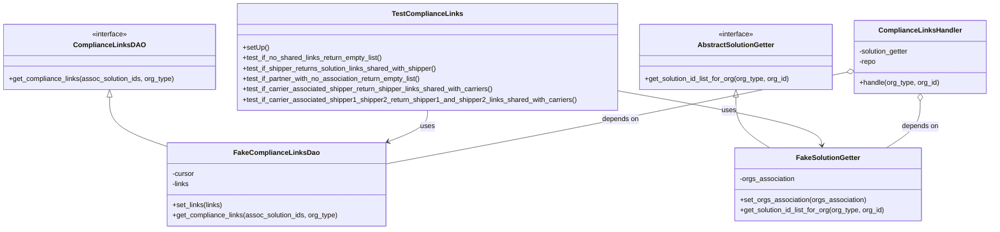

# Diagram: common/support_service/tests/unit/test_partner_portal_compliance.py

> Auto-generated by Obscura crawlers

## Mermaid

### SVG

<svg id="container" width="2278.7890625" xmlns="http://www.w3.org/2000/svg" class="classDiagram" height="528" viewBox="0 0 2278.7890625 528" role="graphics-document document" aria-roledescription="class"><g><defs><marker id="container_class-aggregationStart" class="marker aggregation class" refX="18" refY="7" markerWidth="190" markerHeight="240" orient="auto"><path d="M 18,7 L9,13 L1,7 L9,1 Z"></path></marker></defs><defs><marker id="container_class-aggregationEnd" class="marker aggregation class" refX="1" refY="7" markerWidth="20" markerHeight="28" orient="auto"><path d="M 18,7 L9,13 L1,7 L9,1 Z"></path></marker></defs><defs><marker id="container_class-extensionStart" class="marker extension class" refX="18" refY="7" markerWidth="190" markerHeight="240" orient="auto"><path d="M 1,7 L18,13 V 1 Z"></path></marker></defs><defs><marker id="container_class-extensionEnd" class="marker extension class" refX="1" refY="7" markerWidth="20" markerHeight="28" orient="auto"><path d="M 1,1 V 13 L18,7 Z"></path></marker></defs><defs><marker id="container_class-compositionStart" class="marker composition class" refX="18" refY="7" markerWidth="190" markerHeight="240" orient="auto"><path d="M 18,7 L9,13 L1,7 L9,1 Z"></path></marker></defs><defs><marker id="container_class-compositionEnd" class="marker composition class" refX="1" refY="7" markerWidth="20" markerHeight="28" orient="auto"><path d="M 18,7 L9,13 L1,7 L9,1 Z"></path></marker></defs><defs><marker id="container_class-dependencyStart" class="marker dependency class" refX="6" refY="7" markerWidth="190" markerHeight="240" orient="auto"><path d="M 5,7 L9,13 L1,7 L9,1 Z"></path></marker></defs><defs><marker id="container_class-dependencyEnd" class="marker dependency class" refX="13" refY="7" markerWidth="20" markerHeight="28" orient="auto"><path d="M 18,7 L9,13 L14,7 L9,1 Z"></path></marker></defs><defs><marker id="container_class-lollipopStart" class="marker lollipop class" refX="13" refY="7" markerWidth="190" markerHeight="240" orient="auto"><circle stroke="black" fill="transparent" cx="7" cy="7" r="6"></circle></marker></defs><defs><marker id="container_class-lollipopEnd" class="marker lollipop class" refX="1" refY="7" markerWidth="190" markerHeight="240" orient="auto"><circle stroke="black" fill="transparent" cx="7" cy="7" r="6"></circle></marker></defs><g class="root"><g class="clusters"></g><g class="edgePaths"><path d="M250.449,223.25L250.449,234.542C250.449,245.833,250.449,268.417,272.825,287.45C295.201,306.483,339.952,321.967,362.327,329.708L384.703,337.45" id="id_ComplianceLinksDAO_FakeComplianceLinksDao_1" class="edge-thickness-normal edge-pattern-solid relation" style=";;;" data-edge="true" data-et="edge" data-id="id_ComplianceLinksDAO_FakeComplianceLinksDao_1" data-points="W3sieCI6MjUwLjQ0OTIxODc1LCJ5IjoyMDZ9LHsieCI6MjUwLjQ0OTIxODc1LCJ5IjoyOTF9LHsieCI6Mzg0LjcwMzEyNSwieSI6MzM3LjQ0OTc4NjA5NjgwMDF9XQ==" marker-start="url(#container_class-extensionStart)"></path><path d="M1696.305,223.25L1696.305,234.542C1696.305,245.833,1696.305,268.417,1709.324,287.875C1722.344,307.333,1748.383,323.667,1761.403,331.833L1774.422,340" id="id_AbstractSolutionGetter_FakeSolutionGetter_2" class="edge-thickness-normal edge-pattern-solid relation" style=";;;" data-edge="true" data-et="edge" data-id="id_AbstractSolutionGetter_FakeSolutionGetter_2" data-points="W3sieCI6MTY5Ni4zMDQ2ODc1LCJ5IjoyMDZ9LHsieCI6MTY5Ni4zMDQ2ODc1LCJ5IjoyOTF9LHsieCI6MTc3NC40MjIxODMzODgxNTgsInkiOjM0MH1d" marker-start="url(#container_class-extensionStart)"></path><path d="M982.777,254L982.777,260.167C982.777,266.333,982.777,278.667,967.418,290.705C952.058,302.743,921.339,314.486,905.98,320.358L890.62,326.229" id="id_TestComplianceLinks_FakeComplianceLinksDao_3" class="edge-thickness-normal edge-pattern-solid relation" style=";;;" data-edge="true" data-et="edge" data-id="id_TestComplianceLinks_FakeComplianceLinksDao_3" data-points="W3sieCI6OTgyLjc3NzM0Mzc1LCJ5IjoyNTR9LHsieCI6OTgyLjc3NzM0Mzc1LCJ5IjoyOTF9LHsieCI6ODg1LjAxNTYyNSwieSI6MzI4LjM3MTc2NTA3NTcyOTV9XQ==" marker-end="url(#container_class-dependencyEnd)"></path><path d="M1422.656,208.847L1500.024,222.539C1577.393,236.231,1732.129,263.616,1810.656,284.487C1889.183,305.359,1891.502,319.718,1892.661,326.897L1893.82,334.077" id="id_TestComplianceLinks_FakeSolutionGetter_4" class="edge-thickness-normal edge-pattern-solid relation" style=";;;" data-edge="true" data-et="edge" data-id="id_TestComplianceLinks_FakeSolutionGetter_4" data-points="W3sieCI6MTQyMi42NTYyNSwieSI6MjA4Ljg0NzEwNTA1NDUxNTg1fSx7IngiOjE4ODYuODY1MjM0Mzc1LCJ5IjoyOTF9LHsieCI6MTg5NC43NzYyMTI5OTM0MjEsInkiOjM0MH1d" marker-end="url(#container_class-dependencyEnd)"></path><path d="M2120.371,232.25L2120.371,242.042C2120.371,251.833,2120.371,271.417,2107.352,289.375C2094.332,307.333,2068.293,323.667,2055.273,331.833L2042.254,340" id="id_ComplianceLinksHandler_FakeSolutionGetter_5" class="edge-thickness-normal edge-pattern-solid relation" style=";;;" data-edge="true" data-et="edge" data-id="id_ComplianceLinksHandler_FakeSolutionGetter_5" data-points="W3sieCI6MjEyMC4zNzEwOTM3NSwieSI6MjE1fSx7IngiOjIxMjAuMzcxMDkzNzUsInkiOjI5MX0seyJ4IjoyMDQyLjI1MzU5Nzg2MTg0MiwieSI6MzQwfV0=" marker-start="url(#container_class-aggregationStart)"></path><path d="M1953.062,165.649L1852.182,186.541C1751.303,207.433,1549.545,249.216,1371.538,284.497C1193.53,319.777,1039.273,348.555,962.144,362.943L885.016,377.332" id="id_ComplianceLinksHandler_FakeComplianceLinksDao_6" class="edge-thickness-normal edge-pattern-solid relation" style=";;;" data-edge="true" data-et="edge" data-id="id_ComplianceLinksHandler_FakeComplianceLinksDao_6" data-points="W3sieCI6MTk2OS45NTMxMjUsInkiOjE2Mi4xNTExNDQwNjU1NDcwN30seyJ4IjoxMzQ3Ljc4NzEwOTM3NSwieSI6MjkxfSx7IngiOjg4NS4wMTU2MjUsInkiOjM3Ny4zMzIxODI3MDgyOTczNX1d" marker-start="url(#container_class-aggregationStart)"></path></g><g class="edgeLabels"><g class="edgeLabel"><g class="label" data-id="id_ComplianceLinksDAO_FakeComplianceLinksDao_1" transform="translate(0, 0)"><foreignObject width="0" height="0">

</foreignObject></g></g><g class="edgeLabel"><g class="label" data-id="id_AbstractSolutionGetter_FakeSolutionGetter_2" transform="translate(0, 0)"><foreignObject width="0" height="0">

</foreignObject></g></g><g class="edgeLabel" transform="translate(982.77734375, 291)"><g class="label" data-id="id_TestComplianceLinks_FakeComplianceLinksDao_3" transform="translate(-16.4921875, -12)"><foreignObject width="32.984375" height="24">

uses

</foreignObject></g></g><g class="edgeLabel" transform="translate(1679.19825, 254.24836)"><g class="label" data-id="id_TestComplianceLinks_FakeSolutionGetter_4" transform="translate(-16.4921875, -12)"><foreignObject width="32.984375" height="24">

uses

</foreignObject></g></g><g class="edgeLabel" transform="translate(2120.37109375, 291)"><g class="label" data-id="id_ComplianceLinksHandler_FakeSolutionGetter_5" transform="translate(-42.9453125, -12)"><foreignObject width="85.890625" height="24">

depends on

</foreignObject></g></g><g class="edgeLabel" transform="translate(1428.38321, 274.30877)"><g class="label" data-id="id_ComplianceLinksHandler_FakeComplianceLinksDao_6" transform="translate(-42.9453125, -12)"><foreignObject width="85.890625" height="24">

depends on

</foreignObject></g></g></g><g class="nodes"><g class="node default" id="classId-ComplianceLinksDAO-0" transform="translate(250.44921875, 131)"><g class="basic label-container"><path d="M-242.44921875 -75 L242.44921875 -75 L242.44921875 75 L-242.44921875 75" stroke="none" stroke-width="0" fill="#ECECFF" style=""></path><path d="M-242.44921875 -75 C-89.4675264158567 -75, 63.51416591828661 -75, 242.44921875 -75 M-242.44921875 -75 C-79.25669414786154 -75, 83.93583045427692 -75, 242.44921875 -75 M242.44921875 -75 C242.44921875 -24.73618719316338, 242.44921875 25.527625613673237, 242.44921875 75 M242.44921875 -75 C242.44921875 -25.2593596817622, 242.44921875 24.481280636475603, 242.44921875 75 M242.44921875 75 C105.68328695786192 75, -31.082644834276152 75, -242.44921875 75 M242.44921875 75 C64.17737061255497 75, -114.09447752489007 75, -242.44921875 75 M-242.44921875 75 C-242.44921875 41.773359651266496, -242.44921875 8.546719302532992, -242.44921875 -75 M-242.44921875 75 C-242.44921875 31.072647072232904, -242.44921875 -12.854705855534192, -242.44921875 -75" stroke="#9370DB" stroke-width="1.3" fill="none" stroke-dasharray="0 0" style=""></path></g><g class="annotation-group text" transform="translate(-41.015625, -51)"><g class="label" style="" transform="translate(0,-12)"><foreignObject width="82.03125" height="24">

«interface»

</foreignObject></g></g><g class="label-group text" transform="translate(-76.8828125, -27)"><g class="label" style="font-weight: bolder" transform="translate(0,-12)"><foreignObject width="153.765625" height="24">

ComplianceLinksDAO

</foreignObject></g></g><g class="members-group text" transform="translate(-230.44921875, 21)"></g><g class="methods-group text" transform="translate(-230.44921875, 51)"><g class="label" style="" transform="translate(0,-12)"><foreignObject width="384.015625" height="24">

+get_compliance_links(assoc_solution_ids, org_type)

</foreignObject></g></g><g class="divider" style=""><path d="M-242.44921875 -3 C-126.36022822408792 -3, -10.271237698175838 -3, 242.44921875 -3 M-242.44921875 -3 C-105.92957147097516 -3, 30.590075808049676 -3, 242.44921875 -3" stroke="#9370DB" stroke-width="1.3" fill="none" stroke-dasharray="0 0" style=""></path></g><g class="divider" style=""><path d="M-242.44921875 21 C-116.59478924078617 21, 9.25964026842766 21, 242.44921875 21 M-242.44921875 21 C-95.40366442185422 21, 51.64188990629157 21, 242.44921875 21" stroke="#9370DB" stroke-width="1.3" fill="none" stroke-dasharray="0 0" style=""></path></g></g><g class="node default" id="classId-AbstractSolutionGetter-1" transform="translate(1696.3046875, 131)"><g class="basic label-container"><path d="M-223.6484375 -75 L223.6484375 -75 L223.6484375 75 L-223.6484375 75" stroke="none" stroke-width="0" fill="#ECECFF" style=""></path><path d="M-223.6484375 -75 C-56.00037342281385 -75, 111.6476906543723 -75, 223.6484375 -75 M-223.6484375 -75 C-82.99276385978652 -75, 57.66290978042696 -75, 223.6484375 -75 M223.6484375 -75 C223.6484375 -35.925379044727265, 223.6484375 3.14924191054547, 223.6484375 75 M223.6484375 -75 C223.6484375 -23.565616005435494, 223.6484375 27.86876798912901, 223.6484375 75 M223.6484375 75 C126.82566977655205 75, 30.002902053104094 75, -223.6484375 75 M223.6484375 75 C97.38354765007506 75, -28.881342199849882 75, -223.6484375 75 M-223.6484375 75 C-223.6484375 18.06268695965546, -223.6484375 -38.87462608068908, -223.6484375 -75 M-223.6484375 75 C-223.6484375 39.6730313270945, -223.6484375 4.346062654188998, -223.6484375 -75" stroke="#9370DB" stroke-width="1.3" fill="none" stroke-dasharray="0 0" style=""></path></g><g class="annotation-group text" transform="translate(-41.015625, -51)"><g class="label" style="" transform="translate(0,-12)"><foreignObject width="82.03125" height="24">

«interface»

</foreignObject></g></g><g class="label-group text" transform="translate(-84.75, -27)"><g class="label" style="font-weight: bolder" transform="translate(0,-12)"><foreignObject width="169.5" height="24">

AbstractSolutionGetter

</foreignObject></g></g><g class="members-group text" transform="translate(-211.6484375, 21)"></g><g class="methods-group text" transform="translate(-211.6484375, 51)"><g class="label" style="" transform="translate(0,-12)"><foreignObject width="338.546875" height="24">

+get_solution_id_list_for_org(org_type, org_id)

</foreignObject></g></g><g class="divider" style=""><path d="M-223.6484375 -3 C-101.47602787260342 -3, 20.69638175479315 -3, 223.6484375 -3 M-223.6484375 -3 C-93.23048479455193 -3, 37.187467910896146 -3, 223.6484375 -3" stroke="#9370DB" stroke-width="1.3" fill="none" stroke-dasharray="0 0" style=""></path></g><g class="divider" style=""><path d="M-223.6484375 21 C-72.66642770914544 21, 78.31558208170912 21, 223.6484375 21 M-223.6484375 21 C-122.3475510583768 21, -21.04666461675359 21, 223.6484375 21" stroke="#9370DB" stroke-width="1.3" fill="none" stroke-dasharray="0 0" style=""></path></g></g><g class="node default" id="classId-FakeComplianceLinksDao-2" transform="translate(634.859375, 424)"><g class="basic label-container"><path d="M-250.15625 -96 L250.15625 -96 L250.15625 96 L-250.15625 96" stroke="none" stroke-width="0" fill="#ECECFF" style=""></path><path d="M-250.15625 -96 C-93.73695457092941 -96, 62.682340858141174 -96, 250.15625 -96 M-250.15625 -96 C-92.22191165022093 -96, 65.71242669955814 -96, 250.15625 -96 M250.15625 -96 C250.15625 -48.38597114194698, 250.15625 -0.7719422838939636, 250.15625 96 M250.15625 -96 C250.15625 -26.263844852404034, 250.15625 43.47231029519193, 250.15625 96 M250.15625 96 C99.03453807348302 96, -52.08717385303396 96, -250.15625 96 M250.15625 96 C120.39550072144098 96, -9.365248557118036 96, -250.15625 96 M-250.15625 96 C-250.15625 51.98146196307717, -250.15625 7.962923926154346, -250.15625 -96 M-250.15625 96 C-250.15625 43.90322487356461, -250.15625 -8.193550252870779, -250.15625 -96" stroke="#9370DB" stroke-width="1.3" fill="none" stroke-dasharray="0 0" style=""></path></g><g class="annotation-group text" transform="translate(0, -72)"></g><g class="label-group text" transform="translate(-92.296875, -72)"><g class="label" style="font-weight: bolder" transform="translate(0,-12)"><foreignObject width="184.59375" height="24">

FakeComplianceLinksDao

</foreignObject></g></g><g class="members-group text" transform="translate(-238.15625, -24)"><g class="label" style="" transform="translate(0,-12)"><foreignObject width="52.1875" height="24">

-cursor

</foreignObject></g><g class="label" style="" transform="translate(0,12)"><foreignObject width="40.609375" height="24">

-links

</foreignObject></g></g><g class="methods-group text" transform="translate(-238.15625, 48)"><g class="label" style="" transform="translate(0,-12)"><foreignObject width="116.8125" height="24">

+set_links(links)

</foreignObject></g><g class="label" style="" transform="translate(0,12)"><foreignObject width="384.015625" height="24">

+get_compliance_links(assoc_solution_ids, org_type)

</foreignObject></g></g><g class="divider" style=""><path d="M-250.15625 -48 C-150.00496219378584 -48, -49.85367438757169 -48, 250.15625 -48 M-250.15625 -48 C-86.72784920352612 -48, 76.70055159294776 -48, 250.15625 -48" stroke="#9370DB" stroke-width="1.3" fill="none" stroke-dasharray="0 0" style=""></path></g><g class="divider" style=""><path d="M-250.15625 24 C-93.72361887907368 24, 62.70901224185263 24, 250.15625 24 M-250.15625 24 C-115.5783889254848 24, 18.999472149030396 24, 250.15625 24" stroke="#9370DB" stroke-width="1.3" fill="none" stroke-dasharray="0 0" style=""></path></g></g><g class="node default" id="classId-FakeSolutionGetter-3" transform="translate(1908.337890625, 424)"><g class="basic label-container"><path d="M-216.5703125 -84 L216.5703125 -84 L216.5703125 84 L-216.5703125 84" stroke="none" stroke-width="0" fill="#ECECFF" style=""></path><path d="M-216.5703125 -84 C-50.34681491587591 -84, 115.87668266824818 -84, 216.5703125 -84 M-216.5703125 -84 C-46.2999448048333 -84, 123.9704228903334 -84, 216.5703125 -84 M216.5703125 -84 C216.5703125 -36.16549692462293, 216.5703125 11.669006150754143, 216.5703125 84 M216.5703125 -84 C216.5703125 -47.04773096735434, 216.5703125 -10.09546193470868, 216.5703125 84 M216.5703125 84 C86.34793467665179 84, -43.87444314669642 84, -216.5703125 84 M216.5703125 84 C48.95823531531735 84, -118.6538418693653 84, -216.5703125 84 M-216.5703125 84 C-216.5703125 39.652838377803654, -216.5703125 -4.694323244392692, -216.5703125 -84 M-216.5703125 84 C-216.5703125 36.429615757571455, -216.5703125 -11.140768484857091, -216.5703125 -84" stroke="#9370DB" stroke-width="1.3" fill="none" stroke-dasharray="0 0" style=""></path></g><g class="annotation-group text" transform="translate(0, -60)"></g><g class="label-group text" transform="translate(-70.59375, -60)"><g class="label" style="font-weight: bolder" transform="translate(0,-12)"><foreignObject width="141.1875" height="24">

FakeSolutionGetter

</foreignObject></g></g><g class="members-group text" transform="translate(-204.5703125, -12)"><g class="label" style="" transform="translate(0,-12)"><foreignObject width="127.640625" height="24">

-orgs_association

</foreignObject></g></g><g class="methods-group text" transform="translate(-204.5703125, 36)"><g class="label" style="" transform="translate(0,-12)"><foreignObject width="290.703125" height="24">

+set_orgs_association(orgs_association)

</foreignObject></g><g class="label" style="" transform="translate(0,12)"><foreignObject width="338.546875" height="24">

+get_solution_id_list_for_org(org_type, org_id)

</foreignObject></g></g><g class="divider" style=""><path d="M-216.5703125 -36 C-119.66105030649774 -36, -22.751788112995484 -36, 216.5703125 -36 M-216.5703125 -36 C-129.11121913277287 -36, -41.65212576554575 -36, 216.5703125 -36" stroke="#9370DB" stroke-width="1.3" fill="none" stroke-dasharray="0 0" style=""></path></g><g class="divider" style=""><path d="M-216.5703125 12 C-77.50874806895098 12, 61.55281636209804 12, 216.5703125 12 M-216.5703125 12 C-86.66619687914215 12, 43.2379187417157 12, 216.5703125 12" stroke="#9370DB" stroke-width="1.3" fill="none" stroke-dasharray="0 0" style=""></path></g></g><g class="node default" id="classId-ComplianceLinksHandler-4" transform="translate(2120.37109375, 131)"><g class="basic label-container"><path d="M-150.41796875 -84 L150.41796875 -84 L150.41796875 84 L-150.41796875 84" stroke="none" stroke-width="0" fill="#ECECFF" style=""></path><path d="M-150.41796875 -84 C-70.815863301213 -84, 8.786242147574 -84, 150.41796875 -84 M-150.41796875 -84 C-81.54242648386116 -84, -12.666884217722327 -84, 150.41796875 -84 M150.41796875 -84 C150.41796875 -18.664254223298443, 150.41796875 46.671491553403115, 150.41796875 84 M150.41796875 -84 C150.41796875 -36.345384078439956, 150.41796875 11.309231843120088, 150.41796875 84 M150.41796875 84 C34.23632409320692 84, -81.94532056358617 84, -150.41796875 84 M150.41796875 84 C42.99223359852269 84, -64.43350155295462 84, -150.41796875 84 M-150.41796875 84 C-150.41796875 20.288228902992707, -150.41796875 -43.42354219401459, -150.41796875 -84 M-150.41796875 84 C-150.41796875 19.162856509980458, -150.41796875 -45.674286980039085, -150.41796875 -84" stroke="#9370DB" stroke-width="1.3" fill="none" stroke-dasharray="0 0" style=""></path></g><g class="annotation-group text" transform="translate(0, -60)"></g><g class="label-group text" transform="translate(-90.6796875, -60)"><g class="label" style="font-weight: bolder" transform="translate(0,-12)"><foreignObject width="181.359375" height="24">

ComplianceLinksHandler

</foreignObject></g></g><g class="members-group text" transform="translate(-138.41796875, -12)"><g class="label" style="" transform="translate(0,-12)"><foreignObject width="117.734375" height="24">

-solution_getter

</foreignObject></g><g class="label" style="" transform="translate(0,12)"><foreignObject width="39.71875" height="24">

-repo

</foreignObject></g></g><g class="methods-group text" transform="translate(-138.41796875, 60)"><g class="label" style="" transform="translate(0,-12)"><foreignObject width="186.15625" height="24">

+handle(org_type, org_id)

</foreignObject></g></g><g class="divider" style=""><path d="M-150.41796875 -36 C-79.65391198342512 -36, -8.889855216850236 -36, 150.41796875 -36 M-150.41796875 -36 C-65.87589074376966 -36, 18.66618726246068 -36, 150.41796875 -36" stroke="#9370DB" stroke-width="1.3" fill="none" stroke-dasharray="0 0" style=""></path></g><g class="divider" style=""><path d="M-150.41796875 36 C-40.23190433476405 36, 69.9541600804719 36, 150.41796875 36 M-150.41796875 36 C-70.9728461652261 36, 8.472276419547796 36, 150.41796875 36" stroke="#9370DB" stroke-width="1.3" fill="none" stroke-dasharray="0 0" style=""></path></g></g><g class="node default" id="classId-TestComplianceLinks-5" transform="translate(982.77734375, 131)"><g class="basic label-container"><path d="M-439.87890625 -123 L439.87890625 -123 L439.87890625 123 L-439.87890625 123" stroke="none" stroke-width="0" fill="#ECECFF" style=""></path><path d="M-439.87890625 -123 C-206.92549537929486 -123, 26.027915491410283 -123, 439.87890625 -123 M-439.87890625 -123 C-174.3925371923325 -123, 91.093831865335 -123, 439.87890625 -123 M439.87890625 -123 C439.87890625 -68.61343243067321, 439.87890625 -14.226864861346442, 439.87890625 123 M439.87890625 -123 C439.87890625 -62.779159319330304, 439.87890625 -2.5583186386606087, 439.87890625 123 M439.87890625 123 C202.33247134621845 123, -35.21396355756309 123, -439.87890625 123 M439.87890625 123 C183.07988940195867 123, -73.71912744608267 123, -439.87890625 123 M-439.87890625 123 C-439.87890625 30.96749862886064, -439.87890625 -61.06500274227872, -439.87890625 -123 M-439.87890625 123 C-439.87890625 37.34013931760758, -439.87890625 -48.31972136478484, -439.87890625 -123" stroke="#9370DB" stroke-width="1.3" fill="none" stroke-dasharray="0 0" style=""></path></g><g class="annotation-group text" transform="translate(0, -99)"></g><g class="label-group text" transform="translate(-76.8359375, -99)"><g class="label" style="font-weight: bolder" transform="translate(0,-12)"><foreignObject width="153.671875" height="24">

TestComplianceLinks

</foreignObject></g></g><g class="members-group text" transform="translate(-427.87890625, -51)"></g><g class="methods-group text" transform="translate(-427.87890625, -21)"><g class="label" style="" transform="translate(0,-12)"><foreignObject width="60.421875" height="24">

+setUp()

</foreignObject></g><g class="label" style="" transform="translate(0,12)"><foreignObject width="327.078125" height="24">

+test_if_no_shared_links_return_empty_list()

</foreignObject></g><g class="label" style="" transform="translate(0,36)"><foreignObject width="457.046875" height="24">

+test_if_shipper_returns_solution_links_shared_with_shipper()

</foreignObject></g><g class="label" style="" transform="translate(0,60)"><foreignObject width="418.21875" height="24">

+test_if_partner_with_no_association_return_empty_list()

</foreignObject></g><g class="label" style="" transform="translate(0,84)"><foreignObject width="583.6875" height="24">

+test_if_carrier_associated_shipper_return_shipper_links_shared_with_carriers()

</foreignObject></g><g class="label" style="" transform="translate(0,108)"><foreignObject width="778.921875" height="24">

+test_if_carrier_associated_shipper1_shipper2_return_shipper1_and_shipper2_links_shared_with_carriers()

</foreignObject></g></g><g class="divider" style=""><path d="M-439.87890625 -75 C-204.797095753174 -75, 30.28471474365199 -75, 439.87890625 -75 M-439.87890625 -75 C-186.68203421798233 -75, 66.51483781403533 -75, 439.87890625 -75" stroke="#9370DB" stroke-width="1.3" fill="none" stroke-dasharray="0 0" style=""></path></g><g class="divider" style=""><path d="M-439.87890625 -51 C-109.8112282718738 -51, 220.2564497062524 -51, 439.87890625 -51 M-439.87890625 -51 C-157.88079136554524 -51, 124.11732351890953 -51, 439.87890625 -51" stroke="#9370DB" stroke-width="1.3" fill="none" stroke-dasharray="0 0" style=""></path></g></g></g></g></g></svg>
