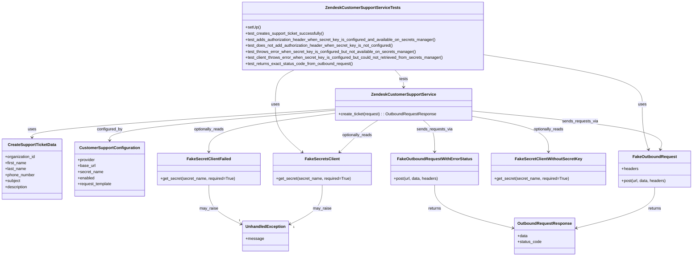

# Diagram: common/support_service/tests/unit/test_zendesk_customer_support_service.py

> Auto-generated by Obscura crawlers

## Mermaid

### SVG

<svg id="container" width="2718.123046875" xmlns="http://www.w3.org/2000/svg" class="classDiagram" height="1018" viewBox="0 0 2718.123046875 1018" role="graphics-document document" aria-roledescription="class"><g><defs><marker id="container_class-aggregationStart" class="marker aggregation class" refX="18" refY="7" markerWidth="190" markerHeight="240" orient="auto"><path d="M 18,7 L9,13 L1,7 L9,1 Z"></path></marker></defs><defs><marker id="container_class-aggregationEnd" class="marker aggregation class" refX="1" refY="7" markerWidth="20" markerHeight="28" orient="auto"><path d="M 18,7 L9,13 L1,7 L9,1 Z"></path></marker></defs><defs><marker id="container_class-extensionStart" class="marker extension class" refX="18" refY="7" markerWidth="190" markerHeight="240" orient="auto"><path d="M 1,7 L18,13 V 1 Z"></path></marker></defs><defs><marker id="container_class-extensionEnd" class="marker extension class" refX="1" refY="7" markerWidth="20" markerHeight="28" orient="auto"><path d="M 1,1 V 13 L18,7 Z"></path></marker></defs><defs><marker id="container_class-compositionStart" class="marker composition class" refX="18" refY="7" markerWidth="190" markerHeight="240" orient="auto"><path d="M 18,7 L9,13 L1,7 L9,1 Z"></path></marker></defs><defs><marker id="container_class-compositionEnd" class="marker composition class" refX="1" refY="7" markerWidth="20" markerHeight="28" orient="auto"><path d="M 18,7 L9,13 L1,7 L9,1 Z"></path></marker></defs><defs><marker id="container_class-dependencyStart" class="marker dependency class" refX="6" refY="7" markerWidth="190" markerHeight="240" orient="auto"><path d="M 5,7 L9,13 L1,7 L9,1 Z"></path></marker></defs><defs><marker id="container_class-dependencyEnd" class="marker dependency class" refX="13" refY="7" markerWidth="20" markerHeight="28" orient="auto"><path d="M 18,7 L9,13 L14,7 L9,1 Z"></path></marker></defs><defs><marker id="container_class-lollipopStart" class="marker lollipop class" refX="13" refY="7" markerWidth="190" markerHeight="240" orient="auto"><circle stroke="black" fill="transparent" cx="7" cy="7" r="6"></circle></marker></defs><defs><marker id="container_class-lollipopEnd" class="marker lollipop class" refX="1" refY="7" markerWidth="190" markerHeight="240" orient="auto"><circle stroke="black" fill="transparent" cx="7" cy="7" r="6"></circle></marker></defs><g class="root"><g class="clusters"></g><g class="edgePaths"><path d="M1315.793,433.372L1117.585,446.977C919.378,460.581,522.962,487.791,324.755,506.562C126.547,525.333,126.547,535.667,126.547,540.833L126.547,546" id="id_ZendeskCustomerSupportService_CreateSupportTicketData_1" class="edge-thickness-normal edge-pattern-solid relation" style=";;;" data-edge="true" data-et="edge" data-id="id_ZendeskCustomerSupportService_CreateSupportTicketData_1" data-points="W3sieCI6MTMxNS43OTI5Njg3NSwieSI6NDMzLjM3MTgxNzQyMTMzMzczfSx7IngiOjEyNi41NDY4NzUsInkiOjUxNX0seyJ4IjoxMjYuNTQ2ODc1LCJ5Ijo1NTJ9XQ==" marker-end="url(#container_class-dependencyEnd)"></path><path d="M1315.793,438.25L1168.531,451.042C1021.268,463.833,726.743,489.417,579.481,509.375C432.219,529.333,432.219,543.667,432.219,550.833L432.219,558" id="id_ZendeskCustomerSupportService_CustomerSupportConfiguration_2" class="edge-thickness-normal edge-pattern-solid relation" style=";;;" data-edge="true" data-et="edge" data-id="id_ZendeskCustomerSupportService_CustomerSupportConfiguration_2" data-points="W3sieCI6MTMxNS43OTI5Njg3NSwieSI6NDM4LjI0OTg0MDUyNDQzNzF9LHsieCI6NDMyLjIxODc1LCJ5Ijo1MTV9LHsieCI6NDMyLjIxODc1LCJ5Ijo1NjR9XQ==" marker-end="url(#container_class-dependencyEnd)"></path><path d="M1482.92,478L1473.08,484.167C1463.239,490.333,1443.558,502.667,1418.507,523.799C1393.455,544.931,1363.033,574.861,1347.822,589.827L1332.612,604.792" id="id_ZendeskCustomerSupportService_FakeSecretsClient_3" class="edge-thickness-normal edge-pattern-solid relation" style=";;;" data-edge="true" data-et="edge" data-id="id_ZendeskCustomerSupportService_FakeSecretsClient_3" data-points="W3sieCI6MTQ4Mi45MjAxMzY3MTg3NSwieSI6NDc4fSx7IngiOjE0MjMuODc2OTUzMTI1LCJ5Ijo1MTV9LHsieCI6MTMyOC4zMzQ1MzE3NDc2MTE0LCJ5Ijo2MDl9XQ==" marker-end="url(#container_class-dependencyEnd)"></path><path d="M1851.113,462.095L1901.226,470.913C1951.339,479.73,2051.565,497.365,2101.678,520.849C2151.791,544.333,2151.791,573.667,2151.791,588.333L2151.791,603" id="id_ZendeskCustomerSupportService_FakeSecretClientWithoutSecretKey_4" class="edge-thickness-normal edge-pattern-solid relation" style=";;;" data-edge="true" data-et="edge" data-id="id_ZendeskCustomerSupportService_FakeSecretClientWithoutSecretKey_4" data-points="W3sieCI6MTg1MS4xMTMyODEyNSwieSI6NDYyLjA5NTI1MTAyMzIzNDU0fSx7IngiOjIxNTEuNzkxMDE1NjI1LCJ5Ijo1MTV9LHsieCI6MjE1MS43OTEwMTU2MjUsInkiOjYwOX1d" marker-end="url(#container_class-dependencyEnd)"></path><path d="M1315.793,450.088L1233.264,460.906C1150.736,471.725,985.678,493.363,903.15,518.848C820.621,544.333,820.621,573.667,820.621,588.333L820.621,603" id="id_ZendeskCustomerSupportService_FakeSecretClientFailed_5" class="edge-thickness-normal edge-pattern-solid relation" style=";;;" data-edge="true" data-et="edge" data-id="id_ZendeskCustomerSupportService_FakeSecretClientFailed_5" data-points="W3sieCI6MTMxNS43OTI5Njg3NSwieSI6NDUwLjA4NzY5MjM0NzA4MjQ1fSx7IngiOjgyMC42MjEwOTM3NSwieSI6NTE1fSx7IngiOjgyMC42MjEwOTM3NSwieSI6NjA5fV0=" marker-end="url(#container_class-dependencyEnd)"></path><path d="M1851.113,440.995L1978.116,453.329C2105.118,465.663,2359.122,490.332,2482.298,515.872C2605.474,541.412,2597.822,567.825,2593.996,581.031L2590.169,594.237" id="id_ZendeskCustomerSupportService_FakeOutboundRequest_6" class="edge-thickness-normal edge-pattern-solid relation" style=";;;" data-edge="true" data-et="edge" data-id="id_ZendeskCustomerSupportService_FakeOutboundRequest_6" data-points="W3sieCI6MTg1MS4xMTMyODEyNSwieSI6NDQwLjk5NDY1NDcwODk5NjV9LHsieCI6MjYxMy4xMjY5NTMxMjUsInkiOjUxNX0seyJ4IjoyNTg4LjQ5OTUzOTcwOTM5NSwieSI6NjAwfV0=" marker-end="url(#container_class-dependencyEnd)"></path><path d="M1661.126,478L1668.729,484.167C1676.332,490.333,1691.538,502.667,1699.141,523.5C1706.744,544.333,1706.744,573.667,1706.744,588.333L1706.744,603" id="id_ZendeskCustomerSupportService_FakeOutboundRequestWithErrorStatus_7" class="edge-thickness-normal edge-pattern-solid relation" style=";;;" data-edge="true" data-et="edge" data-id="id_ZendeskCustomerSupportService_FakeOutboundRequestWithErrorStatus_7" data-points="W3sieCI6MTY2MS4xMjY0NjQ4NDM3NSwieSI6NDc4fSx7IngiOjE3MDYuNzQ0MTQwNjI1LCJ5Ijo1MTV9LHsieCI6MTcwNi43NDQxNDA2MjUsInkiOjYwOX1d" marker-end="url(#container_class-dependencyEnd)"></path><path d="M2567.639,744L2567.639,758.167C2567.639,772.333,2567.639,800.667,2515.876,827.941C2464.113,855.215,2360.588,881.43,2308.825,894.538L2257.063,907.646" id="id_FakeOutboundRequest_OutboundRequestResponse_8" class="edge-thickness-normal edge-pattern-solid relation" style=";;;" data-edge="true" data-et="edge" data-id="id_FakeOutboundRequest_OutboundRequestResponse_8" data-points="W3sieCI6MjU2Ny42Mzg2NzE4NzUsInkiOjc0NH0seyJ4IjoyNTY3LjYzODY3MTg3NSwieSI6ODI5fSx7IngiOjIyNTEuMjQ2MDkzNzUsInkiOjkwOS4xMTg1MDQwOTk1NjkzfV0=" marker-end="url(#container_class-dependencyEnd)"></path><path d="M1706.744,735L1706.744,750.667C1706.744,766.333,1706.744,797.667,1758.507,826.441C1810.27,855.215,1913.795,881.43,1965.558,894.538L2017.32,907.646" id="id_FakeOutboundRequestWithErrorStatus_OutboundRequestResponse_9" class="edge-thickness-normal edge-pattern-solid relation" style=";;;" data-edge="true" data-et="edge" data-id="id_FakeOutboundRequestWithErrorStatus_OutboundRequestResponse_9" data-points="W3sieCI6MTcwNi43NDQxNDA2MjUsInkiOjczNX0seyJ4IjoxNzA2Ljc0NDE0MDYyNSwieSI6ODI5fSx7IngiOjIwMjMuMTM2NzE4NzUsInkiOjkwOS4xMTg1MDQwOTk1NjkzfV0=" marker-end="url(#container_class-dependencyEnd)"></path><path d="M1264.301,735L1264.301,750.667C1264.301,766.333,1264.301,797.667,1242.807,823.894C1221.313,850.122,1178.326,871.243,1156.832,881.804L1135.338,892.365" id="id_FakeSecretsClient_UnhandledException_10" class="edge-thickness-normal edge-pattern-solid relation" style=";;;" data-edge="true" data-et="edge" data-id="id_FakeSecretsClient_UnhandledException_10" data-points="W3sieCI6MTI2NC4zMDA3ODEyNSwieSI6NzM1fSx7IngiOjEyNjQuMzAwNzgxMjUsInkiOjgyOX0seyJ4IjoxMTI5Ljk1MzEyNSwieSI6ODk1LjAxMTExMDkxNTQ2MTl9XQ==" marker-end="url(#container_class-dependencyEnd)"></path><path d="M820.621,735L820.621,750.667C820.621,766.333,820.621,797.667,842.115,823.894C863.609,850.122,906.596,871.243,928.09,881.804L949.584,892.365" id="id_FakeSecretClientFailed_UnhandledException_11" class="edge-thickness-normal edge-pattern-solid relation" style=";;;" data-edge="true" data-et="edge" data-id="id_FakeSecretClientFailed_UnhandledException_11" data-points="W3sieCI6ODIwLjYyMTA5Mzc1LCJ5Ijo3MzV9LHsieCI6ODIwLjYyMTA5Mzc1LCJ5Ijo4Mjl9LHsieCI6OTU0Ljk2ODc1LCJ5Ijo4OTUuMDExMTEwOTE1NDYxOX1d" marker-end="url(#container_class-dependencyEnd)"></path><path d="M1549.126,278L1554.847,284.167C1560.568,290.333,1572.011,302.667,1577.732,314C1583.453,325.333,1583.453,335.667,1583.453,340.833L1583.453,346" id="id_ZendeskCustomerSupportServiceTests_ZendeskCustomerSupportService_12" class="edge-thickness-normal edge-pattern-solid relation" style=";;;" data-edge="true" data-et="edge" data-id="id_ZendeskCustomerSupportServiceTests_ZendeskCustomerSupportService_12" data-points="W3sieCI6MTU0OS4xMjU2OTI2NzgwNTIyLCJ5IjoyNzh9LHsieCI6MTU4My40NTMxMjUsInkiOjMxNX0seyJ4IjoxNTgzLjQ1MzEyNSwieSI6MzUyfV0=" marker-end="url(#container_class-dependencyEnd)"></path><path d="M1902.221,218.109L2005.066,234.257C2107.911,250.406,2313.601,282.703,2416.446,315.518C2519.291,348.333,2519.291,381.667,2519.291,415C2519.291,448.333,2519.291,481.667,2523.359,511.544C2527.428,541.422,2535.564,567.844,2539.632,581.055L2543.701,594.266" id="id_ZendeskCustomerSupportServiceTests_FakeOutboundRequest_13" class="edge-thickness-normal edge-pattern-solid relation" style=";;;" data-edge="true" data-et="edge" data-id="id_ZendeskCustomerSupportServiceTests_FakeOutboundRequest_13" data-points="W3sieCI6MTkwMi4yMjA3MDMxMjUsInkiOjIxOC4xMDg2OTg5MDgwODk4Mn0seyJ4IjoyNTE5LjI5MTAxNTYyNSwieSI6MzE1fSx7IngiOjI1MTkuMjkxMDE1NjI1LCJ5Ijo0MTV9LHsieCI6MjUxOS4yOTEwMTU2MjUsInkiOjUxNX0seyJ4IjoyNTQ1LjQ2NjQ5ODMwODEyMSwieSI6NjAwfV0=" marker-end="url(#container_class-dependencyEnd)"></path><path d="M1156.169,278L1143.94,284.167C1131.711,290.333,1107.254,302.667,1095.026,325.5C1082.797,348.333,1082.797,381.667,1082.797,415C1082.797,448.333,1082.797,481.667,1100.152,513.346C1117.508,545.025,1152.219,575.05,1169.575,590.062L1186.93,605.075" id="id_ZendeskCustomerSupportServiceTests_FakeSecretsClient_14" class="edge-thickness-normal edge-pattern-solid relation" style=";;;" data-edge="true" data-et="edge" data-id="id_ZendeskCustomerSupportServiceTests_FakeSecretsClient_14" data-points="W3sieCI6MTE1Ni4xNjg3NTIyNzEwNzU2LCJ5IjoyNzh9LHsieCI6MTA4Mi43OTY4NzUsInkiOjMxNX0seyJ4IjoxMDgyLjc5Njg3NSwieSI6NDE1fSx7IngiOjEwODIuNzk2ODc1LCJ5Ijo1MTV9LHsieCI6MTE5MS40NjgwMDM1ODI4MDI2LCJ5Ijo2MDl9XQ==" marker-end="url(#container_class-dependencyEnd)"></path></g><g class="edgeLabels"><g class="edgeLabel" transform="translate(126.546875, 515)"><g class="label" data-id="id_ZendeskCustomerSupportService_CreateSupportTicketData_1" transform="translate(-16.4921875, -12)"><foreignObject width="32.984375" height="24">

uses

</foreignObject></g></g><g class="edgeLabel" transform="translate(432.21875, 515)"><g class="label" data-id="id_ZendeskCustomerSupportService_CustomerSupportConfiguration_2" transform="translate(-51.171875, -12)"><foreignObject width="102.34375" height="24">

configured_by

</foreignObject></g></g><g class="edgeLabel" transform="translate(1400.94047, 537.5662)"><g class="label" data-id="id_ZendeskCustomerSupportService_FakeSecretsClient_3" transform="translate(-60.671875, -12)"><foreignObject width="121.34375" height="24">

optionally_reads

</foreignObject></g></g><g class="edgeLabel" transform="translate(2151.791015625, 515)"><g class="label" data-id="id_ZendeskCustomerSupportService_FakeSecretClientWithoutSecretKey_4" transform="translate(-60.671875, -12)"><foreignObject width="121.34375" height="24">

optionally_reads

</foreignObject></g></g><g class="edgeLabel" transform="translate(820.62109375, 515)"><g class="label" data-id="id_ZendeskCustomerSupportService_FakeSecretClientFailed_5" transform="translate(-60.671875, -12)"><foreignObject width="121.34375" height="24">

optionally_reads

</foreignObject></g></g><g class="edgeLabel" transform="translate(2276.16082, 482.27448)"><g class="label" data-id="id_ZendeskCustomerSupportService_FakeOutboundRequest_6" transform="translate(-70.9765625, -12)"><foreignObject width="141.953125" height="24">

sends_requests_via

</foreignObject></g></g><g class="edgeLabel" transform="translate(1706.744140625, 515)"><g class="label" data-id="id_ZendeskCustomerSupportService_FakeOutboundRequestWithErrorStatus_7" transform="translate(-70.9765625, -12)"><foreignObject width="141.953125" height="24">

sends_requests_via

</foreignObject></g></g><g class="edgeLabel" transform="translate(2567.638671875, 829)"><g class="label" data-id="id_FakeOutboundRequest_OutboundRequestResponse_8" transform="translate(-26.265625, -12)"><foreignObject width="52.53125" height="24">

returns

</foreignObject></g></g><g class="edgeLabel" transform="translate(1706.744140625, 829)"><g class="label" data-id="id_FakeOutboundRequestWithErrorStatus_OutboundRequestResponse_9" transform="translate(-26.265625, -12)"><foreignObject width="52.53125" height="24">

returns

</foreignObject></g></g><g class="edgeLabel" transform="translate(1264.30078125, 829)"><g class="label" data-id="id_FakeSecretsClient_UnhandledException_10" transform="translate(-36.4609375, -12)"><foreignObject width="72.921875" height="24">

may_raise

</foreignObject></g></g><g class="edgeLabel" transform="translate(820.62109375, 829)"><g class="label" data-id="id_FakeSecretClientFailed_UnhandledException_11" transform="translate(-36.4609375, -12)"><foreignObject width="72.921875" height="24">

may_raise

</foreignObject></g></g><g class="edgeLabel" transform="translate(1583.453125, 315)"><g class="label" data-id="id_ZendeskCustomerSupportServiceTests_ZendeskCustomerSupportService_12" transform="translate(-17.4921875, -12)"><foreignObject width="34.984375" height="24">

tests

</foreignObject></g></g><g class="edgeLabel" transform="translate(2519.291015625, 415)"><g class="label" data-id="id_ZendeskCustomerSupportServiceTests_FakeOutboundRequest_13" transform="translate(-16.4921875, -12)"><foreignObject width="32.984375" height="24">

uses

</foreignObject></g></g><g class="edgeLabel" transform="translate(1082.796875, 415)"><g class="label" data-id="id_ZendeskCustomerSupportServiceTests_FakeSecretsClient_14" transform="translate(-16.4921875, -12)"><foreignObject width="32.984375" height="24">

uses

</foreignObject></g></g><g class="edgeTerminals" transform="translate(1147.2744298647574, 895.7564943713975)"><g class="inner" transform="translate(0, 0)"></g><foreignObject style="width: 9px; height: 12px;">
1
</foreignObject></g><g class="edgeTerminals" transform="translate(940.8771132128852, 868.8311169607884)"><g class="inner" transform="translate(0, 0)"></g><foreignObject style="width: 9px; height: 12px;">
1
</foreignObject></g></g><g class="nodes"><g class="node default" id="classId-ZendeskCustomerSupportServiceTests-0" transform="translate(1423.876953125, 143)"><g class="basic label-container"><path d="M-478.34375 -135 L478.34375 -135 L478.34375 135 L-478.34375 135" stroke="none" stroke-width="0" fill="#ECECFF" style=""></path><path d="M-478.34375 -135 C-130.32787638013735 -135, 217.6879972397253 -135, 478.34375 -135 M-478.34375 -135 C-108.91315866339943 -135, 260.51743267320114 -135, 478.34375 -135 M478.34375 -135 C478.34375 -76.28767276976359, 478.34375 -17.575345539527177, 478.34375 135 M478.34375 -135 C478.34375 -79.66144698534481, 478.34375 -24.32289397068962, 478.34375 135 M478.34375 135 C161.2435003016472 135, -155.8567493967056 135, -478.34375 135 M478.34375 135 C127.86621934130682 135, -222.61131131738637 135, -478.34375 135 M-478.34375 135 C-478.34375 71.73677766129614, -478.34375 8.473555322592304, -478.34375 -135 M-478.34375 135 C-478.34375 55.753520044404496, -478.34375 -23.492959911191008, -478.34375 -135" stroke="#9370DB" stroke-width="1.3" fill="none" stroke-dasharray="0 0" style=""></path></g><g class="annotation-group text" transform="translate(0, -111)"></g><g class="label-group text" transform="translate(-141.0625, -111)"><g class="label" style="font-weight: bolder" transform="translate(0,-12)"><foreignObject width="282.125" height="24">

ZendeskCustomerSupportServiceTests

</foreignObject></g></g><g class="members-group text" transform="translate(-466.34375, -63)"></g><g class="methods-group text" transform="translate(-466.34375, -33)"><g class="label" style="" transform="translate(0,-12)"><foreignObject width="60.421875" height="24">

+setUp()

</foreignObject></g><g class="label" style="" transform="translate(0,12)"><foreignObject width="314.71875" height="24">

+test_creates_support_ticket_successfully()

</foreignObject></g><g class="label" style="" transform="translate(0,36)"><foreignObject width="755.59375" height="24">

+test_adds_authorization_header_when_secret_key_is_configured_and_available_on_secrets_manager()

</foreignObject></g><g class="label" style="" transform="translate(0,60)"><foreignObject width="590.25" height="24">

+test_does_not_add_authorization_header_when_secret_key_is_not_configured()

</foreignObject></g><g class="label" style="" transform="translate(0,84)"><foreignObject width="678.515625" height="24">

+test_throws_error_when_secret_key_is_configured_but_not_available_on_secrets_manager()

</foreignObject></g><g class="label" style="" transform="translate(0,108)"><foreignObject width="791.625" height="24">

+test_client_throws_error_when_secret_key_is_configured_but_could_not_retrieved_from_secrets_manager()

</foreignObject></g><g class="label" style="" transform="translate(0,132)"><foreignObject width="432.8125" height="24">

+test_returns_exact_status_code_from_outbound_request()

</foreignObject></g></g><g class="divider" style=""><path d="M-478.34375 -87 C-271.07514843847673 -87, -63.80654687695352 -87, 478.34375 -87 M-478.34375 -87 C-218.08207065320323 -87, 42.179608693593536 -87, 478.34375 -87" stroke="#9370DB" stroke-width="1.3" fill="none" stroke-dasharray="0 0" style=""></path></g><g class="divider" style=""><path d="M-478.34375 -63 C-277.01392707773886 -63, -75.68410415547771 -63, 478.34375 -63 M-478.34375 -63 C-197.75487561548096 -63, 82.83399876903809 -63, 478.34375 -63" stroke="#9370DB" stroke-width="1.3" fill="none" stroke-dasharray="0 0" style=""></path></g></g><g class="node default" id="classId-CreateSupportTicketData-1" transform="translate(126.546875, 672)"><g class="basic label-container"><path d="M-118.546875 -120 L118.546875 -120 L118.546875 120 L-118.546875 120" stroke="none" stroke-width="0" fill="#ECECFF" style=""></path><path d="M-118.546875 -120 C-31.522932809749463 -120, 55.501009380501074 -120, 118.546875 -120 M-118.546875 -120 C-64.32331427881654 -120, -10.099753557633079 -120, 118.546875 -120 M118.546875 -120 C118.546875 -32.488010133552166, 118.546875 55.02397973289567, 118.546875 120 M118.546875 -120 C118.546875 -45.19758209353648, 118.546875 29.604835812927035, 118.546875 120 M118.546875 120 C67.20613104484605 120, 15.865387089692092 120, -118.546875 120 M118.546875 120 C39.3213681166834 120, -39.904138766633196 120, -118.546875 120 M-118.546875 120 C-118.546875 52.95904665832377, -118.546875 -14.081906683352457, -118.546875 -120 M-118.546875 120 C-118.546875 47.578077462739884, -118.546875 -24.84384507452023, -118.546875 -120" stroke="#9370DB" stroke-width="1.3" fill="none" stroke-dasharray="0 0" style=""></path></g><g class="annotation-group text" transform="translate(0, -96)"></g><g class="label-group text" transform="translate(-92.34375, -96)"><g class="label" style="font-weight: bolder" transform="translate(0,-12)"><foreignObject width="184.6875" height="24">

CreateSupportTicketData

</foreignObject></g></g><g class="members-group text" transform="translate(-106.546875, -48)"><g class="label" style="" transform="translate(0,-12)"><foreignObject width="120.75" height="24">

+organization_id

</foreignObject></g><g class="label" style="" transform="translate(0,12)"><foreignObject width="84.96875" height="24">

+first_name

</foreignObject></g><g class="label" style="" transform="translate(0,36)"><foreignObject width="83.21875" height="24">

+last_name

</foreignObject></g><g class="label" style="" transform="translate(0,60)"><foreignObject width="119.109375" height="24">

+phone_number

</foreignObject></g><g class="label" style="" transform="translate(0,84)"><foreignObject width="60.90625" height="24">

+subject

</foreignObject></g><g class="label" style="" transform="translate(0,108)"><foreignObject width="90.59375" height="24">

+description

</foreignObject></g></g><g class="methods-group text" transform="translate(-106.546875, 120)"></g><g class="divider" style=""><path d="M-118.546875 -72 C-55.548886616202005 -72, 7.449101767595991 -72, 118.546875 -72 M-118.546875 -72 C-64.41569113121814 -72, -10.284507262436279 -72, 118.546875 -72" stroke="#9370DB" stroke-width="1.3" fill="none" stroke-dasharray="0 0" style=""></path></g><g class="divider" style=""><path d="M-118.546875 96 C-64.50019144780535 96, -10.453507895610684 96, 118.546875 96 M-118.546875 96 C-31.044359316863392 96, 56.458156366273215 96, 118.546875 96" stroke="#9370DB" stroke-width="1.3" fill="none" stroke-dasharray="0 0" style=""></path></g></g><g class="node default" id="classId-CustomerSupportConfiguration-2" transform="translate(432.21875, 672)"><g class="basic label-container"><path d="M-137.125 -108 L137.125 -108 L137.125 108 L-137.125 108" stroke="none" stroke-width="0" fill="#ECECFF" style=""></path><path d="M-137.125 -108 C-79.40006627426939 -108, -21.67513254853877 -108, 137.125 -108 M-137.125 -108 C-71.90894797334064 -108, -6.69289594668129 -108, 137.125 -108 M137.125 -108 C137.125 -31.079628215930626, 137.125 45.84074356813875, 137.125 108 M137.125 -108 C137.125 -33.54104226529796, 137.125 40.91791546940408, 137.125 108 M137.125 108 C64.45586768925153 108, -8.213264621496933 108, -137.125 108 M137.125 108 C50.82024491675308 108, -35.484510166493834 108, -137.125 108 M-137.125 108 C-137.125 24.701240552164847, -137.125 -58.597518895670305, -137.125 -108 M-137.125 108 C-137.125 33.70635490518791, -137.125 -40.587290189624184, -137.125 -108" stroke="#9370DB" stroke-width="1.3" fill="none" stroke-dasharray="0 0" style=""></path></g><g class="annotation-group text" transform="translate(0, -84)"></g><g class="label-group text" transform="translate(-113.953125, -84)"><g class="label" style="font-weight: bolder" transform="translate(0,-12)"><foreignObject width="227.90625" height="24">

CustomerSupportConfiguration

</foreignObject></g></g><g class="members-group text" transform="translate(-125.125, -36)"><g class="label" style="" transform="translate(0,-12)"><foreignObject width="69.3125" height="24">

+provider

</foreignObject></g><g class="label" style="" transform="translate(0,12)"><foreignObject width="69.921875" height="24">

+base_url

</foreignObject></g><g class="label" style="" transform="translate(0,36)"><foreignObject width="100.859375" height="24">

+secret_name

</foreignObject></g><g class="label" style="" transform="translate(0,60)"><foreignObject width="67.1875" height="24">

+enabled

</foreignObject></g><g class="label" style="" transform="translate(0,84)"><foreignObject width="136.296875" height="24">

+request_template

</foreignObject></g></g><g class="methods-group text" transform="translate(-125.125, 108)"></g><g class="divider" style=""><path d="M-137.125 -60 C-50.33959529623337 -60, 36.44580940753326 -60, 137.125 -60 M-137.125 -60 C-77.72576302198446 -60, -18.326526043968926 -60, 137.125 -60" stroke="#9370DB" stroke-width="1.3" fill="none" stroke-dasharray="0 0" style=""></path></g><g class="divider" style=""><path d="M-137.125 84 C-79.10646500874407 84, -21.087930017488148 84, 137.125 84 M-137.125 84 C-54.24527063591384 84, 28.63445872817232 84, 137.125 84" stroke="#9370DB" stroke-width="1.3" fill="none" stroke-dasharray="0 0" style=""></path></g></g><g class="node default" id="classId-ZendeskCustomerSupportService-3" transform="translate(1583.453125, 415)"><g class="basic label-container"><path d="M-267.66015625 -63 L267.66015625 -63 L267.66015625 63 L-267.66015625 63" stroke="none" stroke-width="0" fill="#ECECFF" style=""></path><path d="M-267.66015625 -63 C-111.32093594611902 -63, 45.01828435776196 -63, 267.66015625 -63 M-267.66015625 -63 C-124.67512787144952 -63, 18.309900507100963 -63, 267.66015625 -63 M267.66015625 -63 C267.66015625 -14.707957169651102, 267.66015625 33.584085660697795, 267.66015625 63 M267.66015625 -63 C267.66015625 -30.65211363371398, 267.66015625 1.6957727325720384, 267.66015625 63 M267.66015625 63 C55.607314436072926 63, -156.44552737785415 63, -267.66015625 63 M267.66015625 63 C55.323674808973266 63, -157.01280663205347 63, -267.66015625 63 M-267.66015625 63 C-267.66015625 35.110364995021044, -267.66015625 7.220729990042095, -267.66015625 -63 M-267.66015625 63 C-267.66015625 22.54117845643559, -267.66015625 -17.917643087128823, -267.66015625 -63" stroke="#9370DB" stroke-width="1.3" fill="none" stroke-dasharray="0 0" style=""></path></g><g class="annotation-group text" transform="translate(0, -39)"></g><g class="label-group text" transform="translate(-121.9453125, -39)"><g class="label" style="font-weight: bolder" transform="translate(0,-12)"><foreignObject width="243.890625" height="24">

ZendeskCustomerSupportService

</foreignObject></g></g><g class="members-group text" transform="translate(-255.66015625, 9)"></g><g class="methods-group text" transform="translate(-255.66015625, 39)"><g class="label" style="" transform="translate(0,-12)"><foreignObject width="389.375" height="24">

+create_ticket(request) : : OutboundRequestResponse

</foreignObject></g></g><g class="divider" style=""><path d="M-267.66015625 -15 C-71.70870787590033 -15, 124.24274049819934 -15, 267.66015625 -15 M-267.66015625 -15 C-54.56522308492421 -15, 158.52971008015157 -15, 267.66015625 -15" stroke="#9370DB" stroke-width="1.3" fill="none" stroke-dasharray="0 0" style=""></path></g><g class="divider" style=""><path d="M-267.66015625 9 C-133.7503206374153 9, 0.15951497516937252 9, 267.66015625 9 M-267.66015625 9 C-102.43717590222556 9, 62.78580444554888 9, 267.66015625 9" stroke="#9370DB" stroke-width="1.3" fill="none" stroke-dasharray="0 0" style=""></path></g></g><g class="node default" id="classId-OutboundRequestResponse-4" transform="translate(2137.19140625, 938)"><g class="basic label-container"><path d="M-114.0546875 -72 L114.0546875 -72 L114.0546875 72 L-114.0546875 72" stroke="none" stroke-width="0" fill="#ECECFF" style=""></path><path d="M-114.0546875 -72 C-25.065016723713413 -72, 63.924654052573175 -72, 114.0546875 -72 M-114.0546875 -72 C-25.80337667575452 -72, 62.44793414849096 -72, 114.0546875 -72 M114.0546875 -72 C114.0546875 -34.68559486639073, 114.0546875 2.6288102672185403, 114.0546875 72 M114.0546875 -72 C114.0546875 -31.085989448409883, 114.0546875 9.828021103180234, 114.0546875 72 M114.0546875 72 C23.79501898076684 72, -66.46464953846632 72, -114.0546875 72 M114.0546875 72 C29.982162033745112 72, -54.090363432509776 72, -114.0546875 72 M-114.0546875 72 C-114.0546875 21.33596364616419, -114.0546875 -29.328072707671623, -114.0546875 -72 M-114.0546875 72 C-114.0546875 33.91632516768499, -114.0546875 -4.167349664630024, -114.0546875 -72" stroke="#9370DB" stroke-width="1.3" fill="none" stroke-dasharray="0 0" style=""></path></g><g class="annotation-group text" transform="translate(0, -48)"></g><g class="label-group text" transform="translate(-102.0546875, -48)"><g class="label" style="font-weight: bolder" transform="translate(0,-12)"><foreignObject width="204.109375" height="24">

OutboundRequestResponse

</foreignObject></g></g><g class="members-group text" transform="translate(-102.0546875, 0)"><g class="label" style="" transform="translate(0,-12)"><foreignObject width="40.625" height="24">

+data

</foreignObject></g><g class="label" style="" transform="translate(0,12)"><foreignObject width="95.03125" height="24">

+status_code

</foreignObject></g></g><g class="methods-group text" transform="translate(-102.0546875, 72)"></g><g class="divider" style=""><path d="M-114.0546875 -24 C-23.570771672561065 -24, 66.91314415487787 -24, 114.0546875 -24 M-114.0546875 -24 C-27.877355562582366 -24, 58.29997637483527 -24, 114.0546875 -24" stroke="#9370DB" stroke-width="1.3" fill="none" stroke-dasharray="0 0" style=""></path></g><g class="divider" style=""><path d="M-114.0546875 48 C-25.251327310789804 48, 63.55203287842039 48, 114.0546875 48 M-114.0546875 48 C-57.55954462849493 48, -1.0644017569898665 48, 114.0546875 48" stroke="#9370DB" stroke-width="1.3" fill="none" stroke-dasharray="0 0" style=""></path></g></g><g class="node default" id="classId-FakeOutboundRequest-5" transform="translate(2567.638671875, 672)"><g class="basic label-container"><path d="M-142.484375 -72 L142.484375 -72 L142.484375 72 L-142.484375 72" stroke="none" stroke-width="0" fill="#ECECFF" style=""></path><path d="M-142.484375 -72 C-54.64939328628897 -72, 33.18558842742206 -72, 142.484375 -72 M-142.484375 -72 C-62.73007538438654 -72, 17.024224231226924 -72, 142.484375 -72 M142.484375 -72 C142.484375 -37.38896152460256, 142.484375 -2.777923049205114, 142.484375 72 M142.484375 -72 C142.484375 -18.44604776373106, 142.484375 35.10790447253788, 142.484375 72 M142.484375 72 C79.22296475331355 72, 15.961554506627095 72, -142.484375 72 M142.484375 72 C52.22183781758655 72, -38.04069936482691 72, -142.484375 72 M-142.484375 72 C-142.484375 39.57859889506395, -142.484375 7.157197790127896, -142.484375 -72 M-142.484375 72 C-142.484375 27.796532004958422, -142.484375 -16.406935990083156, -142.484375 -72" stroke="#9370DB" stroke-width="1.3" fill="none" stroke-dasharray="0 0" style=""></path></g><g class="annotation-group text" transform="translate(0, -48)"></g><g class="label-group text" transform="translate(-83.140625, -48)"><g class="label" style="font-weight: bolder" transform="translate(0,-12)"><foreignObject width="166.28125" height="24">

FakeOutboundRequest

</foreignObject></g></g><g class="members-group text" transform="translate(-130.484375, 0)"><g class="label" style="" transform="translate(0,-12)"><foreignObject width="66.328125" height="24">

+headers

</foreignObject></g></g><g class="methods-group text" transform="translate(-130.484375, 48)"><g class="label" style="" transform="translate(0,-12)"><foreignObject width="177.828125" height="24">

+post(url, data, headers)

</foreignObject></g></g><g class="divider" style=""><path d="M-142.484375 -24 C-77.32444186165502 -24, -12.164508723310036 -24, 142.484375 -24 M-142.484375 -24 C-74.87086619902128 -24, -7.257357398042558 -24, 142.484375 -24" stroke="#9370DB" stroke-width="1.3" fill="none" stroke-dasharray="0 0" style=""></path></g><g class="divider" style=""><path d="M-142.484375 24 C-78.61451401256753 24, -14.744653025135037 24, 142.484375 24 M-142.484375 24 C-64.88460474087776 24, 12.715165518244476 24, 142.484375 24" stroke="#9370DB" stroke-width="1.3" fill="none" stroke-dasharray="0 0" style=""></path></g></g><g class="node default" id="classId-FakeOutboundRequestWithErrorStatus-6" transform="translate(1706.744140625, 672)"><g class="basic label-container"><path d="M-171.68359375 -63 L171.68359375 -63 L171.68359375 63 L-171.68359375 63" stroke="none" stroke-width="0" fill="#ECECFF" style=""></path><path d="M-171.68359375 -63 C-50.586365252886424 -63, 70.51086324422715 -63, 171.68359375 -63 M-171.68359375 -63 C-72.30135627771072 -63, 27.080881194578552 -63, 171.68359375 -63 M171.68359375 -63 C171.68359375 -19.630421468828274, 171.68359375 23.739157062343452, 171.68359375 63 M171.68359375 -63 C171.68359375 -37.74948148781138, 171.68359375 -12.49896297562276, 171.68359375 63 M171.68359375 63 C74.90375532281931 63, -21.876083104361385 63, -171.68359375 63 M171.68359375 63 C76.80226296082256 63, -18.07906782835488 63, -171.68359375 63 M-171.68359375 63 C-171.68359375 37.16493875885537, -171.68359375 11.329877517710734, -171.68359375 -63 M-171.68359375 63 C-171.68359375 32.38867004961477, -171.68359375 1.7773400992295336, -171.68359375 -63" stroke="#9370DB" stroke-width="1.3" fill="none" stroke-dasharray="0 0" style=""></path></g><g class="annotation-group text" transform="translate(0, -39)"></g><g class="label-group text" transform="translate(-141.5390625, -39)"><g class="label" style="font-weight: bolder" transform="translate(0,-12)"><foreignObject width="283.078125" height="24">

FakeOutboundRequestWithErrorStatus

</foreignObject></g></g><g class="members-group text" transform="translate(-159.68359375, 9)"></g><g class="methods-group text" transform="translate(-159.68359375, 39)"><g class="label" style="" transform="translate(0,-12)"><foreignObject width="177.828125" height="24">

+post(url, data, headers)

</foreignObject></g></g><g class="divider" style=""><path d="M-171.68359375 -15 C-54.97381292646284 -15, 61.73596789707432 -15, 171.68359375 -15 M-171.68359375 -15 C-67.52950515783617 -15, 36.62458343432766 -15, 171.68359375 -15" stroke="#9370DB" stroke-width="1.3" fill="none" stroke-dasharray="0 0" style=""></path></g><g class="divider" style=""><path d="M-171.68359375 9 C-51.76296301554915 9, 68.1576677189017 9, 171.68359375 9 M-171.68359375 9 C-75.05275833846441 9, 21.57807707307117 9, 171.68359375 9" stroke="#9370DB" stroke-width="1.3" fill="none" stroke-dasharray="0 0" style=""></path></g></g><g class="node default" id="classId-FakeSecretsClient-7" transform="translate(1264.30078125, 672)"><g class="basic label-container"><path d="M-192.40234375 -63 L192.40234375 -63 L192.40234375 63 L-192.40234375 63" stroke="none" stroke-width="0" fill="#ECECFF" style=""></path><path d="M-192.40234375 -63 C-78.48158674250976 -63, 35.439170264980476 -63, 192.40234375 -63 M-192.40234375 -63 C-90.40402169715692 -63, 11.594300355686158 -63, 192.40234375 -63 M192.40234375 -63 C192.40234375 -26.2846658981451, 192.40234375 10.4306682037098, 192.40234375 63 M192.40234375 -63 C192.40234375 -29.120137847067305, 192.40234375 4.75972430586539, 192.40234375 63 M192.40234375 63 C59.666864833419396 63, -73.06861408316121 63, -192.40234375 63 M192.40234375 63 C56.705016125273886 63, -78.99231149945223 63, -192.40234375 63 M-192.40234375 63 C-192.40234375 14.653318684179219, -192.40234375 -33.69336263164156, -192.40234375 -63 M-192.40234375 63 C-192.40234375 30.74756060574012, -192.40234375 -1.5048787885197612, -192.40234375 -63" stroke="#9370DB" stroke-width="1.3" fill="none" stroke-dasharray="0 0" style=""></path></g><g class="annotation-group text" transform="translate(0, -39)"></g><g class="label-group text" transform="translate(-64.9609375, -39)"><g class="label" style="font-weight: bolder" transform="translate(0,-12)"><foreignObject width="129.921875" height="24">

FakeSecretsClient

</foreignObject></g></g><g class="members-group text" transform="translate(-180.40234375, 9)"></g><g class="methods-group text" transform="translate(-180.40234375, 39)"><g class="label" style="" transform="translate(0,-12)"><foreignObject width="295.84375" height="24">

+get_secret(secret_name, required=True)

</foreignObject></g></g><g class="divider" style=""><path d="M-192.40234375 -15 C-100.64151077213057 -15, -8.880677794261146 -15, 192.40234375 -15 M-192.40234375 -15 C-42.13270901250843 -15, 108.13692572498314 -15, 192.40234375 -15" stroke="#9370DB" stroke-width="1.3" fill="none" stroke-dasharray="0 0" style=""></path></g><g class="divider" style=""><path d="M-192.40234375 9 C-82.57312921638183 9, 27.25608531723634 9, 192.40234375 9 M-192.40234375 9 C-98.89803657824594 9, -5.393729406491872 9, 192.40234375 9" stroke="#9370DB" stroke-width="1.3" fill="none" stroke-dasharray="0 0" style=""></path></g></g><g class="node default" id="classId-FakeSecretClientWithoutSecretKey-8" transform="translate(2151.791015625, 672)"><g class="basic label-container"><path d="M-223.36328125 -63 L223.36328125 -63 L223.36328125 63 L-223.36328125 63" stroke="none" stroke-width="0" fill="#ECECFF" style=""></path><path d="M-223.36328125 -63 C-120.59907104215725 -63, -17.834860834314497 -63, 223.36328125 -63 M-223.36328125 -63 C-108.38706088417952 -63, 6.589159481640962 -63, 223.36328125 -63 M223.36328125 -63 C223.36328125 -15.098683909772937, 223.36328125 32.802632180454125, 223.36328125 63 M223.36328125 -63 C223.36328125 -16.932131225800617, 223.36328125 29.135737548398765, 223.36328125 63 M223.36328125 63 C101.5448355716859 63, -20.27361010662821 63, -223.36328125 63 M223.36328125 63 C100.33661669055078 63, -22.690047868898432 63, -223.36328125 63 M-223.36328125 63 C-223.36328125 14.91321516236603, -223.36328125 -33.17356967526794, -223.36328125 -63 M-223.36328125 63 C-223.36328125 19.657058141461278, -223.36328125 -23.685883717077445, -223.36328125 -63" stroke="#9370DB" stroke-width="1.3" fill="none" stroke-dasharray="0 0" style=""></path></g><g class="annotation-group text" transform="translate(0, -39)"></g><g class="label-group text" transform="translate(-126.8828125, -39)"><g class="label" style="font-weight: bolder" transform="translate(0,-12)"><foreignObject width="253.765625" height="24">

FakeSecretClientWithoutSecretKey

</foreignObject></g></g><g class="members-group text" transform="translate(-211.36328125, 9)"></g><g class="methods-group text" transform="translate(-211.36328125, 39)"><g class="label" style="" transform="translate(0,-12)"><foreignObject width="295.84375" height="24">

+get_secret(secret_name, required=True)

</foreignObject></g></g><g class="divider" style=""><path d="M-223.36328125 -15 C-74.0086728562456 -15, 75.34593553750881 -15, 223.36328125 -15 M-223.36328125 -15 C-86.36075420211029 -15, 50.64177284577943 -15, 223.36328125 -15" stroke="#9370DB" stroke-width="1.3" fill="none" stroke-dasharray="0 0" style=""></path></g><g class="divider" style=""><path d="M-223.36328125 9 C-75.53346194232233 9, 72.29635736535533 9, 223.36328125 9 M-223.36328125 9 C-95.74377492429966 9, 31.875731401400685 9, 223.36328125 9" stroke="#9370DB" stroke-width="1.3" fill="none" stroke-dasharray="0 0" style=""></path></g></g><g class="node default" id="classId-FakeSecretClientFailed-9" transform="translate(820.62109375, 672)"><g class="basic label-container"><path d="M-201.27734375 -63 L201.27734375 -63 L201.27734375 63 L-201.27734375 63" stroke="none" stroke-width="0" fill="#ECECFF" style=""></path><path d="M-201.27734375 -63 C-54.268528557636984 -63, 92.74028663472603 -63, 201.27734375 -63 M-201.27734375 -63 C-93.9003363542854 -63, 13.4766710414292 -63, 201.27734375 -63 M201.27734375 -63 C201.27734375 -21.013845082385792, 201.27734375 20.972309835228415, 201.27734375 63 M201.27734375 -63 C201.27734375 -21.992439822500742, 201.27734375 19.015120354998515, 201.27734375 63 M201.27734375 63 C66.71522993714524 63, -67.84688387570952 63, -201.27734375 63 M201.27734375 63 C62.72523425393925 63, -75.8268752421215 63, -201.27734375 63 M-201.27734375 63 C-201.27734375 26.61466576470756, -201.27734375 -9.77066847058488, -201.27734375 -63 M-201.27734375 63 C-201.27734375 33.974656438912945, -201.27734375 4.949312877825896, -201.27734375 -63" stroke="#9370DB" stroke-width="1.3" fill="none" stroke-dasharray="0 0" style=""></path></g><g class="annotation-group text" transform="translate(0, -39)"></g><g class="label-group text" transform="translate(-82.7109375, -39)"><g class="label" style="font-weight: bolder" transform="translate(0,-12)"><foreignObject width="165.421875" height="24">

FakeSecretClientFailed

</foreignObject></g></g><g class="members-group text" transform="translate(-189.27734375, 9)"></g><g class="methods-group text" transform="translate(-189.27734375, 39)"><g class="label" style="" transform="translate(0,-12)"><foreignObject width="295.84375" height="24">

+get_secret(secret_name, required=True)

</foreignObject></g></g><g class="divider" style=""><path d="M-201.27734375 -15 C-75.04255337741499 -15, 51.19223699517002 -15, 201.27734375 -15 M-201.27734375 -15 C-50.33761102066495 -15, 100.6021217086701 -15, 201.27734375 -15" stroke="#9370DB" stroke-width="1.3" fill="none" stroke-dasharray="0 0" style=""></path></g><g class="divider" style=""><path d="M-201.27734375 9 C-86.07176553593929 9, 29.133812678121416 9, 201.27734375 9 M-201.27734375 9 C-108.75075319983088 9, -16.224162649661764 9, 201.27734375 9" stroke="#9370DB" stroke-width="1.3" fill="none" stroke-dasharray="0 0" style=""></path></g></g><g class="node default" id="classId-UnhandledException-10" transform="translate(1042.4609375, 938)"><g class="basic label-container"><path d="M-87.4921875 -60 L87.4921875 -60 L87.4921875 60 L-87.4921875 60" stroke="none" stroke-width="0" fill="#ECECFF" style=""></path><path d="M-87.4921875 -60 C-46.300736783623066 -60, -5.109286067246131 -60, 87.4921875 -60 M-87.4921875 -60 C-49.31988157971052 -60, -11.147575659421037 -60, 87.4921875 -60 M87.4921875 -60 C87.4921875 -14.317620944007658, 87.4921875 31.364758111984685, 87.4921875 60 M87.4921875 -60 C87.4921875 -31.491972927173094, 87.4921875 -2.9839458543461888, 87.4921875 60 M87.4921875 60 C51.09674275389775 60, 14.7012980077955 60, -87.4921875 60 M87.4921875 60 C41.018722177206335 60, -5.454743145587329 60, -87.4921875 60 M-87.4921875 60 C-87.4921875 23.020554361534373, -87.4921875 -13.958891276931254, -87.4921875 -60 M-87.4921875 60 C-87.4921875 24.20365550826581, -87.4921875 -11.592688983468378, -87.4921875 -60" stroke="#9370DB" stroke-width="1.3" fill="none" stroke-dasharray="0 0" style=""></path></g><g class="annotation-group text" transform="translate(0, -36)"></g><g class="label-group text" transform="translate(-75.4921875, -36)"><g class="label" style="font-weight: bolder" transform="translate(0,-12)"><foreignObject width="150.984375" height="24">

UnhandledException

</foreignObject></g></g><g class="members-group text" transform="translate(-75.4921875, 12)"><g class="label" style="" transform="translate(0,-12)"><foreignObject width="70.375" height="24">

+message

</foreignObject></g></g><g class="methods-group text" transform="translate(-75.4921875, 60)"></g><g class="divider" style=""><path d="M-87.4921875 -12 C-23.301108932834254 -12, 40.88996963433149 -12, 87.4921875 -12 M-87.4921875 -12 C-31.172009127626453 -12, 25.148169244747095 -12, 87.4921875 -12" stroke="#9370DB" stroke-width="1.3" fill="none" stroke-dasharray="0 0" style=""></path></g><g class="divider" style=""><path d="M-87.4921875 36 C-40.91407243026244 36, 5.664042639475113 36, 87.4921875 36 M-87.4921875 36 C-42.155204998849804 36, 3.181777502300392 36, 87.4921875 36" stroke="#9370DB" stroke-width="1.3" fill="none" stroke-dasharray="0 0" style=""></path></g></g></g></g></g></svg>
