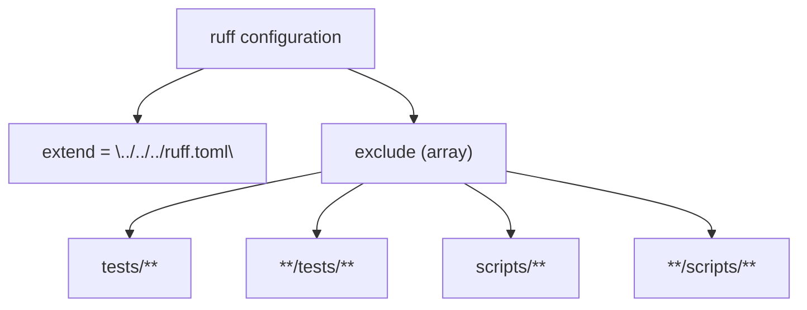

# Diagram: container_tracking_core/container_tracking_service/.ruff.toml

> Auto-generated by Obscura crawlers

## Mermaid

```mermaid
flowchart TD
  cfg[ruff configuration]
  cfg --> ext["extend = \"../../../ruff.toml\""]
  cfg --> excl["exclude (array)"]
  excl --> e1["tests/**"]
  excl --> e2["**/tests/**"]
  excl --> e3["scripts/**"]
  excl --> e4["**/scripts/**"]
```

> SVG rendering failed for this diagram.
