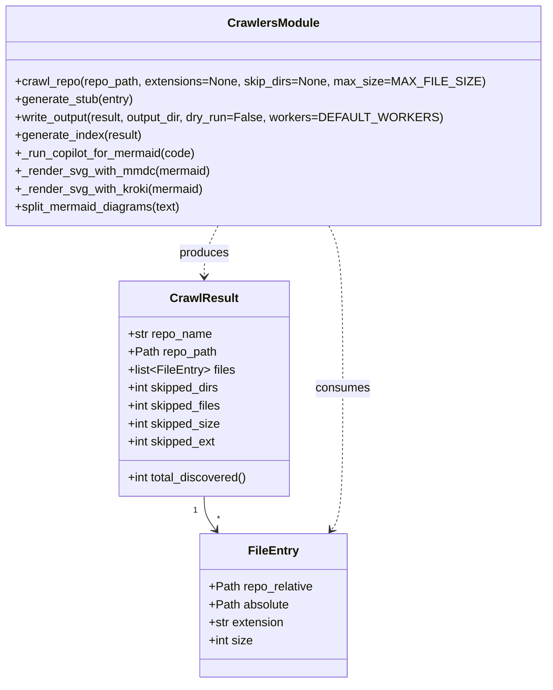
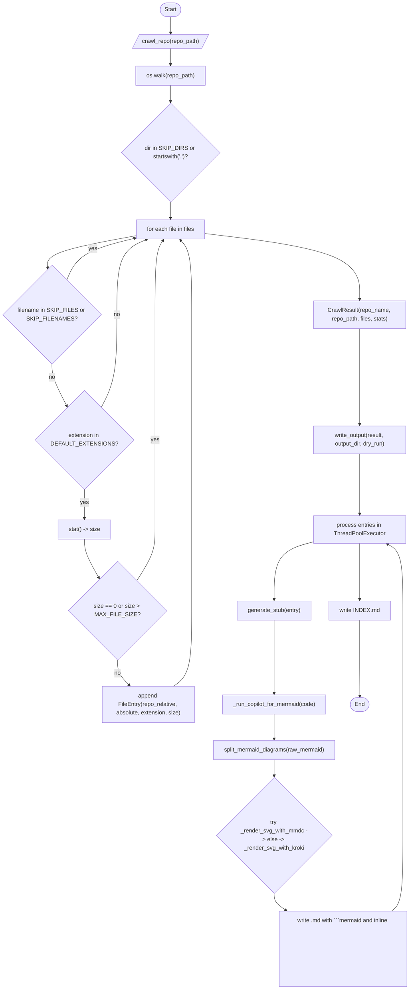

# Diagram: container_tracking_core/container_tracking_service/config/config.dev.yml


> Auto-generated by Obscura crawlers

## Diagram 1



> SVG rendering failed for this diagram.

## Diagram 2



### SVG

<svg id="container" width="1156.4296875" xmlns="http://www.w3.org/2000/svg" class="flowchart" height="2781" viewBox="0.5 0 1156.4296875 2781" role="graphics-document document" aria-roledescription="flowchart-v2"><style>#container{font-family:"trebuchet ms",verdana,arial,sans-serif;font-size:16px;fill:#333;}@keyframes edge-animation-frame{from{stroke-dashoffset:0;}}@keyframes dash{to{stroke-dashoffset:0;}}#container .edge-animation-slow{stroke-dasharray:9,5!important;stroke-dashoffset:900;animation:dash 50s linear infinite;stroke-linecap:round;}#container .edge-animation-fast{stroke-dasharray:9,5!important;stroke-dashoffset:900;animation:dash 20s linear infinite;stroke-linecap:round;}#container .error-icon{fill:#552222;}#container .error-text{fill:#552222;stroke:#552222;}#container .edge-thickness-normal{stroke-width:1px;}#container .edge-thickness-thick{stroke-width:3.5px;}#container .edge-pattern-solid{stroke-dasharray:0;}#container .edge-thickness-invisible{stroke-width:0;fill:none;}#container .edge-pattern-dashed{stroke-dasharray:3;}#container .edge-pattern-dotted{stroke-dasharray:2;}#container .marker{fill:#333333;stroke:#333333;}#container .marker.cross{stroke:#333333;}#container svg{font-family:"trebuchet ms",verdana,arial,sans-serif;font-size:16px;}#container p{margin:0;}#container .label{font-family:"trebuchet ms",verdana,arial,sans-serif;color:#333;}#container .cluster-label text{fill:#333;}#container .cluster-label span{color:#333;}#container .cluster-label span p{background-color:transparent;}#container .label text,#container span{fill:#333;color:#333;}#container .node rect,#container .node circle,#container .node ellipse,#container .node polygon,#container .node path{fill:#ECECFF;stroke:#9370DB;stroke-width:1px;}#container .rough-node .label text,#container .node .label text,#container .image-shape .label,#container .icon-shape .label{text-anchor:middle;}#container .node .katex path{fill:#000;stroke:#000;stroke-width:1px;}#container .rough-node .label,#container .node .label,#container .image-shape .label,#container .icon-shape .label{text-align:center;}#container .node.clickable{cursor:pointer;}#container .root .anchor path{fill:#333333!important;stroke-width:0;stroke:#333333;}#container .arrowheadPath{fill:#333333;}#container .edgePath .path{stroke:#333333;stroke-width:2.0px;}#container .flowchart-link{stroke:#333333;fill:none;}#container .edgeLabel{background-color:rgba(232,232,232, 0.8);text-align:center;}#container .edgeLabel p{background-color:rgba(232,232,232, 0.8);}#container .edgeLabel rect{opacity:0.5;background-color:rgba(232,232,232, 0.8);fill:rgba(232,232,232, 0.8);}#container .labelBkg{background-color:rgba(232, 232, 232, 0.5);}#container .cluster rect{fill:#ffffde;stroke:#aaaa33;stroke-width:1px;}#container .cluster text{fill:#333;}#container .cluster span{color:#333;}#container div.mermaidTooltip{position:absolute;text-align:center;max-width:200px;padding:2px;font-family:"trebuchet ms",verdana,arial,sans-serif;font-size:12px;background:hsl(80, 100%, 96.2745098039%);border:1px solid #aaaa33;border-radius:2px;pointer-events:none;z-index:100;}#container .flowchartTitleText{text-anchor:middle;font-size:18px;fill:#333;}#container rect.text{fill:none;stroke-width:0;}#container .icon-shape,#container .image-shape{background-color:rgba(232,232,232, 0.8);text-align:center;}#container .icon-shape p,#container .image-shape p{background-color:rgba(232,232,232, 0.8);padding:2px;}#container .icon-shape rect,#container .image-shape rect{opacity:0.5;background-color:rgba(232,232,232, 0.8);fill:rgba(232,232,232, 0.8);}#container .label-icon{display:inline-block;height:1em;overflow:visible;vertical-align:-0.125em;}#container .node .label-icon path{fill:currentColor;stroke:revert;stroke-width:revert;}#container :root{--mermaid-font-family:"trebuchet ms",verdana,arial,sans-serif;}</style><g><marker id="container_flowchart-v2-pointEnd" class="marker flowchart-v2" viewBox="0 0 10 10" refX="5" refY="5" markerUnits="userSpaceOnUse" markerWidth="8" markerHeight="8" orient="auto"><path d="M 0 0 L 10 5 L 0 10 z" class="arrowMarkerPath" style="stroke-width: 1; stroke-dasharray: 1, 0;"></path></marker><marker id="container_flowchart-v2-pointStart" class="marker flowchart-v2" viewBox="0 0 10 10" refX="4.5" refY="5" markerUnits="userSpaceOnUse" markerWidth="8" markerHeight="8" orient="auto"><path d="M 0 5 L 10 10 L 10 0 z" class="arrowMarkerPath" style="stroke-width: 1; stroke-dasharray: 1, 0;"></path></marker><marker id="container_flowchart-v2-circleEnd" class="marker flowchart-v2" viewBox="0 0 10 10" refX="11" refY="5" markerUnits="userSpaceOnUse" markerWidth="11" markerHeight="11" orient="auto"><circle cx="5" cy="5" r="5" class="arrowMarkerPath" style="stroke-width: 1; stroke-dasharray: 1, 0;"></circle></marker><marker id="container_flowchart-v2-circleStart" class="marker flowchart-v2" viewBox="0 0 10 10" refX="-1" refY="5" markerUnits="userSpaceOnUse" markerWidth="11" markerHeight="11" orient="auto"><circle cx="5" cy="5" r="5" class="arrowMarkerPath" style="stroke-width: 1; stroke-dasharray: 1, 0;"></circle></marker><marker id="container_flowchart-v2-crossEnd" class="marker cross flowchart-v2" viewBox="0 0 11 11" refX="12" refY="5.2" markerUnits="userSpaceOnUse" markerWidth="11" markerHeight="11" orient="auto"><path d="M 1,1 l 9,9 M 10,1 l -9,9" class="arrowMarkerPath" style="stroke-width: 2; stroke-dasharray: 1, 0;"></path></marker><marker id="container_flowchart-v2-crossStart" class="marker cross flowchart-v2" viewBox="0 0 11 11" refX="-1" refY="5.2" markerUnits="userSpaceOnUse" markerWidth="11" markerHeight="11" orient="auto"><path d="M 1,1 l 9,9 M 10,1 l -9,9" class="arrowMarkerPath" style="stroke-width: 2; stroke-dasharray: 1, 0;"></path></marker><g class="root"><g class="clusters"></g><g class="edgePaths"><path d="M482.496,47.5L482.413,51.583C482.329,55.667,482.163,63.833,482.15,71.5C482.137,79.167,482.277,86.334,482.347,89.917L482.418,93.501" id="L_Start_Crawl_0" class="edge-thickness-normal edge-pattern-solid edge-thickness-normal edge-pattern-solid flowchart-link" style=";" data-edge="true" data-et="edge" data-id="L_Start_Crawl_0" data-points="W3sieCI6NDgyLjQ5NjA5Mzc1LCJ5Ijo0Ny41fSx7IngiOjQ4MS45OTYwOTM3NSwieSI6NzJ9LHsieCI6NDgyLjQ5NjA5Mzc1LCJ5Ijo5Ny41fV0=" marker-end="url(#container_flowchart-v2-pointEnd)"></path><path d="M482.496,136.5L482.413,140.583C482.329,144.667,482.163,152.833,482.079,160.417C481.996,168,481.996,175,481.996,178.5L481.996,182" id="L_Crawl_Walk_0" class="edge-thickness-normal edge-pattern-solid edge-thickness-normal edge-pattern-solid flowchart-link" style=";" data-edge="true" data-et="edge" data-id="L_Crawl_Walk_0" data-points="W3sieCI6NDgyLjQ5NjA5Mzc1LCJ5IjoxMzYuNX0seyJ4Ijo0ODEuOTk2MDkzNzUsInkiOjE2MX0seyJ4Ijo0ODEuOTk2MDkzNzUsInkiOjE4Nn1d" marker-end="url(#container_flowchart-v2-pointEnd)"></path><path d="M481.996,240L481.996,244.167C481.996,248.333,481.996,256.667,481.996,264.333C481.996,272,481.996,279,481.996,282.5L481.996,286" id="L_Walk_PruneDirs_0" class="edge-thickness-normal edge-pattern-solid edge-thickness-normal edge-pattern-solid flowchart-link" style=";" data-edge="true" data-et="edge" data-id="L_Walk_PruneDirs_0" data-points="W3sieCI6NDgxLjk5NjA5Mzc1LCJ5IjoyNDB9LHsieCI6NDgxLjk5NjA5Mzc1LCJ5IjoyNjV9LHsieCI6NDgxLjk5NjA5Mzc1LCJ5IjoyOTB9XQ==" marker-end="url(#container_flowchart-v2-pointEnd)"></path><path d="M481.996,568L481.996,572.167C481.996,576.333,481.996,584.667,481.996,592.333C481.996,600,481.996,607,481.996,610.5L481.996,614" id="L_PruneDirs_ForFile_0" class="edge-thickness-normal edge-pattern-solid edge-thickness-normal edge-pattern-solid flowchart-link" style=";" data-edge="true" data-et="edge" data-id="L_PruneDirs_ForFile_0" data-points="W3sieCI6NDgxLjk5NjA5Mzc1LCJ5Ijo1Njh9LHsieCI6NDgxLjk5NjA5Mzc1LCJ5Ijo1OTN9LHsieCI6NDgxLjk5NjA5Mzc1LCJ5Ijo2MTh9XQ==" marker-end="url(#container_flowchart-v2-pointEnd)"></path><path d="M382.801,663.087L340.833,670.739C298.866,678.391,214.931,693.696,173.639,708.782C132.348,723.867,133.7,738.735,134.376,746.169L135.052,753.602" id="L_ForFile_SkipFile_0" class="edge-thickness-normal edge-pattern-solid edge-thickness-normal edge-pattern-solid flowchart-link" style=";" data-edge="true" data-et="edge" data-id="L_ForFile_SkipFile_0" data-points="W3sieCI6MzgyLjgwMDc4MTI1LCJ5Ijo2NjMuMDg2ODk0NTg2ODk0Nn0seyJ4IjoxMzAuOTk2MDkzNzUsInkiOjcwOX0seyJ4IjoxMzUuNDE0MDc0NDIwNjg2NDMsInkiOjc1Ny41ODU5MjU1NzkzMTM1fV0=" marker-end="url(#container_flowchart-v2-pointEnd)"></path><path d="M188.797,787.797L194.444,774.664C200.091,761.531,211.385,735.266,243.072,715.706C274.759,696.147,326.838,683.293,352.878,676.867L378.917,670.44" id="L_SkipFile_ForFile_0" class="edge-thickness-normal edge-pattern-solid edge-thickness-normal edge-pattern-solid flowchart-link" style=";" data-edge="true" data-et="edge" data-id="L_SkipFile_ForFile_0" data-points="W3sieCI6MTg4Ljc5NzA4MjEwNDYwOTY0LCJ5Ijo3ODcuNzk3MDgyMTA0NjA5N30seyJ4IjoyMjIuNjc5Njg3NSwieSI6NzA5fSx7IngiOjM4Mi44MDA3ODEyNSwieSI6NjY5LjQ4MTY3NTA3NzIwMTJ9XQ==" marker-end="url(#container_flowchart-v2-pointEnd)"></path><path d="M147,1024L147,1030.167C147,1036.333,147,1048.667,154.038,1068.344C161.076,1088.02,175.151,1115.041,182.189,1128.551L189.227,1142.061" id="L_SkipFile_CheckExt_0" class="edge-thickness-normal edge-pattern-solid edge-thickness-normal edge-pattern-solid flowchart-link" style=";" data-edge="true" data-et="edge" data-id="L_SkipFile_CheckExt_0" data-points="W3sieCI6MTQ3LCJ5IjoxMDI0fSx7IngiOjE0NywieSI6MTA2MX0seyJ4IjoxOTEuMDc1MDc0NDgwMjIzMTIsInkiOjExNDUuNjA4NTE5MjY5Nzc3fV0=" marker-end="url(#container_flowchart-v2-pointEnd)"></path><path d="M286.292,1145.609L293.638,1131.507C300.984,1117.406,315.675,1089.203,323.021,1045.768C330.367,1002.333,330.367,943.667,330.367,885C330.367,826.333,330.367,767.667,344.363,732.426C358.359,697.185,386.351,685.37,400.347,679.463L414.342,673.555" id="L_CheckExt_ForFile_0" class="edge-thickness-normal edge-pattern-solid edge-thickness-normal edge-pattern-solid flowchart-link" style=";" data-edge="true" data-et="edge" data-id="L_CheckExt_ForFile_0" data-points="W3sieCI6Mjg2LjI5MjExMzAxOTc3NjksInkiOjExNDUuNjA4NTE5MjY5Nzc3fSx7IngiOjMzMC4zNjcxODc1LCJ5IjoxMDYxfSx7IngiOjMzMC4zNjcxODc1LCJ5Ijo4ODV9LHsieCI6MzMwLjM2NzE4NzUsInkiOjcwOX0seyJ4Ijo0MTguMDI3NjQ4OTI1NzgxMjUsInkiOjY3Mn1d" marker-end="url(#container_flowchart-v2-pointEnd)"></path><path d="M238.684,1376L238.684,1382.167C238.684,1388.333,238.684,1400.667,238.684,1414.333C238.684,1428,238.684,1443,238.684,1450.5L238.684,1458" id="L_CheckExt_StatFile_0" class="edge-thickness-normal edge-pattern-solid edge-thickness-normal edge-pattern-solid flowchart-link" style=";" data-edge="true" data-et="edge" data-id="L_CheckExt_StatFile_0" data-points="W3sieCI6MjM4LjY4MzU5Mzc1LCJ5IjoxMzc2fSx7IngiOjIzOC42ODM1OTM3NSwieSI6MTQxM30seyJ4IjoyMzguNjgzNTkzNzUsInkiOjE0NjJ9XQ==" marker-end="url(#container_flowchart-v2-pointEnd)"></path><path d="M238.684,1516L238.684,1522.167C238.684,1528.333,238.684,1540.667,245.472,1558.804C252.26,1576.941,265.837,1600.881,272.625,1612.851L279.413,1624.822" id="L_StatFile_CheckSize_0" class="edge-thickness-normal edge-pattern-solid edge-thickness-normal edge-pattern-solid flowchart-link" style=";" data-edge="true" data-et="edge" data-id="L_StatFile_CheckSize_0" data-points="W3sieCI6MjM4LjY4MzU5Mzc1LCJ5IjoxNTE2fSx7IngiOjIzOC42ODM1OTM3NSwieSI6MTU1M30seyJ4IjoyODEuMzg2NTQwOTMxNDA2MSwieSI6MTYyOC4zMDA5NTkwNjg1OTR9XQ==" marker-end="url(#container_flowchart-v2-pointEnd)"></path><path d="M386.373,1632.685L394.986,1619.404C403.6,1606.123,420.827,1579.562,429.441,1555.614C438.055,1531.667,438.055,1510.333,438.055,1487C438.055,1463.667,438.055,1438.333,438.055,1396.333C438.055,1354.333,438.055,1295.667,438.055,1237C438.055,1178.333,438.055,1119.667,438.055,1061C438.055,1002.333,438.055,943.667,438.055,885C438.055,826.333,438.055,767.667,441.911,732.716C445.768,697.766,453.481,686.532,457.338,680.915L461.194,675.298" id="L_CheckSize_ForFile_0" class="edge-thickness-normal edge-pattern-solid edge-thickness-normal edge-pattern-solid flowchart-link" style=";" data-edge="true" data-et="edge" data-id="L_CheckSize_ForFile_0" data-points="W3sieCI6Mzg2LjM3MjUzNDgxOTU0NTIsInkiOjE2MzIuNjg1MDM0ODE5NTQ1fSx7IngiOjQzOC4wNTQ2ODc1LCJ5IjoxNTUzfSx7IngiOjQzOC4wNTQ2ODc1LCJ5IjoxNDg5fSx7IngiOjQzOC4wNTQ2ODc1LCJ5IjoxNDEzfSx7IngiOjQzOC4wNTQ2ODc1LCJ5IjoxMjM3fSx7IngiOjQzOC4wNTQ2ODc1LCJ5IjoxMDYxfSx7IngiOjQzOC4wNTQ2ODc1LCJ5Ijo4ODV9LHsieCI6NDM4LjA1NDY4NzUsInkiOjcwOX0seyJ4Ijo0NjMuNDU4MzEyOTg4MjgxMjUsInkiOjY3Mn1d" marker-end="url(#container_flowchart-v2-pointEnd)"></path><path d="M331.688,1856L331.688,1862.167C331.688,1868.333,331.688,1880.667,337.315,1892.526C342.943,1904.385,354.199,1915.77,359.827,1921.463L365.455,1927.155" id="L_CheckSize_AddEntry_0" class="edge-thickness-normal edge-pattern-solid edge-thickness-normal edge-pattern-solid flowchart-link" style=";" data-edge="true" data-et="edge" data-id="L_CheckSize_AddEntry_0" data-points="W3sieCI6MzMxLjY4NzUsInkiOjE4NTZ9LHsieCI6MzMxLjY4NzUsInkiOjE4OTN9LHsieCI6MzY4LjI2NzA0NTQ1NDU0NTQ0LCJ5IjoxOTMwfV0=" marker-end="url(#container_flowchart-v2-pointEnd)"></path><path d="M489.607,1930L498.182,1923.833C506.758,1917.667,523.908,1905.333,532.483,1869.833C541.059,1834.333,541.059,1775.667,541.059,1719C541.059,1662.333,541.059,1607.667,541.059,1569.667C541.059,1531.667,541.059,1510.333,541.059,1487C541.059,1463.667,541.059,1438.333,541.059,1396.333C541.059,1354.333,541.059,1295.667,541.059,1237C541.059,1178.333,541.059,1119.667,541.059,1061C541.059,1002.333,541.059,943.667,541.059,885C541.059,826.333,541.059,767.667,535.82,732.657C530.581,697.647,520.103,686.293,514.865,680.616L509.626,674.94" id="L_AddEntry_ForFile_0" class="edge-thickness-normal edge-pattern-solid edge-thickness-normal edge-pattern-solid flowchart-link" style=";" data-edge="true" data-et="edge" data-id="L_AddEntry_ForFile_0" data-points="W3sieCI6NDg5LjYwNzExMTE1MDU2ODIsInkiOjE5MzB9LHsieCI6NTQxLjA1ODU5Mzc1LCJ5IjoxODkzfSx7IngiOjU0MS4wNTg1OTM3NSwieSI6MTcxN30seyJ4Ijo1NDEuMDU4NTkzNzUsInkiOjE1NTN9LHsieCI6NTQxLjA1ODU5Mzc1LCJ5IjoxNDg5fSx7IngiOjU0MS4wNTg1OTM3NSwieSI6MTQxM30seyJ4Ijo1NDEuMDU4NTkzNzUsInkiOjEyMzd9LHsieCI6NTQxLjA1ODU5Mzc1LCJ5IjoxMDYxfSx7IngiOjU0MS4wNTg1OTM3NSwieSI6ODg1fSx7IngiOjU0MS4wNTg1OTM3NSwieSI6NzA5fSx7IngiOjUwNi45MTMwODU5Mzc1LCJ5Ijo2NzJ9XQ==" marker-end="url(#container_flowchart-v2-pointEnd)"></path><path d="M581.191,656.859L653.882,665.549C726.573,674.239,871.954,691.62,944.645,722.476C1017.336,753.333,1017.336,797.667,1017.336,819.833L1017.336,842" id="L_ForFile_Result_0" class="edge-thickness-normal edge-pattern-solid edge-thickness-normal edge-pattern-solid flowchart-link" style=";" data-edge="true" data-et="edge" data-id="L_ForFile_Result_0" data-points="W3sieCI6NTgxLjE5MTQwNjI1LCJ5Ijo2NTYuODU4ODIyMTU1OTAyOH0seyJ4IjoxMDE3LjMzNTkzNzUsInkiOjcwOX0seyJ4IjoxMDE3LjMzNTkzNzUsInkiOjg0Nn1d" marker-end="url(#container_flowchart-v2-pointEnd)"></path><path d="M1017.336,924L1017.336,946.833C1017.336,969.667,1017.336,1015.333,1017.336,1060.333C1017.336,1105.333,1017.336,1149.667,1017.336,1171.833L1017.336,1194" id="L_Result_WriteOutput_0" class="edge-thickness-normal edge-pattern-solid edge-thickness-normal edge-pattern-solid flowchart-link" style=";" data-edge="true" data-et="edge" data-id="L_Result_WriteOutput_0" data-points="W3sieCI6MTAxNy4zMzU5Mzc1LCJ5Ijo5MjR9LHsieCI6MTAxNy4zMzU5Mzc1LCJ5IjoxMDYxfSx7IngiOjEwMTcuMzM1OTM3NSwieSI6MTE5OH1d" marker-end="url(#container_flowchart-v2-pointEnd)"></path><path d="M1017.336,1276L1017.336,1298.833C1017.336,1321.667,1017.336,1367.333,1017.336,1395.667C1017.336,1424,1017.336,1435,1017.336,1440.5L1017.336,1446" id="L_WriteOutput_ProcessLoop_0" class="edge-thickness-normal edge-pattern-solid edge-thickness-normal edge-pattern-solid flowchart-link" style=";" data-edge="true" data-et="edge" data-id="L_WriteOutput_ProcessLoop_0" data-points="W3sieCI6MTAxNy4zMzU5Mzc1LCJ5IjoxMjc2fSx7IngiOjEwMTcuMzM1OTM3NSwieSI6MTQxM30seyJ4IjoxMDE3LjMzNTkzNzUsInkiOjE0NTB9XQ==" marker-end="url(#container_flowchart-v2-pointEnd)"></path><path d="M887.336,1523.469L868.773,1528.391C850.211,1533.313,813.086,1543.156,794.523,1570.245C775.961,1597.333,775.961,1641.667,775.961,1663.833L775.961,1686" id="L_ProcessLoop_GenStub_0" class="edge-thickness-normal edge-pattern-solid edge-thickness-normal edge-pattern-solid flowchart-link" style=";" data-edge="true" data-et="edge" data-id="L_ProcessLoop_GenStub_0" data-points="W3sieCI6ODg3LjMzNTkzNzUsInkiOjE1MjMuNDY5MTg2OTQ5NzY3fSx7IngiOjc3NS45NjA5Mzc1LCJ5IjoxNTUzfSx7IngiOjc3NS45NjA5Mzc1LCJ5IjoxNjkwfV0=" marker-end="url(#container_flowchart-v2-pointEnd)"></path><path d="M775.961,1744L775.961,1768.833C775.961,1793.667,775.961,1843.333,775.961,1877.667C775.961,1912,775.961,1931,775.961,1940.5L775.961,1950" id="L_GenStub_RunCopilot_0" class="edge-thickness-normal edge-pattern-solid edge-thickness-normal edge-pattern-solid flowchart-link" style=";" data-edge="true" data-et="edge" data-id="L_GenStub_RunCopilot_0" data-points="W3sieCI6Nzc1Ljk2MDkzNzUsInkiOjE3NDR9LHsieCI6Nzc1Ljk2MDkzNzUsInkiOjE4OTN9LHsieCI6Nzc1Ljk2MDkzNzUsInkiOjE5NTR9XQ==" marker-end="url(#container_flowchart-v2-pointEnd)"></path><path d="M775.961,2008L775.961,2016.167C775.961,2024.333,775.961,2040.667,775.961,2052.333C775.961,2064,775.961,2071,775.961,2074.5L775.961,2078" id="L_RunCopilot_SplitDiagrams_0" class="edge-thickness-normal edge-pattern-solid edge-thickness-normal edge-pattern-solid flowchart-link" style=";" data-edge="true" data-et="edge" data-id="L_RunCopilot_SplitDiagrams_0" data-points="W3sieCI6Nzc1Ljk2MDkzNzUsInkiOjIwMDh9LHsieCI6Nzc1Ljk2MDkzNzUsInkiOjIwNTd9LHsieCI6Nzc1Ljk2MDkzNzUsInkiOjIwODJ9XQ==" marker-end="url(#container_flowchart-v2-pointEnd)"></path><path d="M775.961,2136L775.961,2140.167C775.961,2144.333,775.961,2152.667,775.961,2160.333C775.961,2168,775.961,2175,775.961,2178.5L775.961,2182" id="L_SplitDiagrams_RenderSVG_0" class="edge-thickness-normal edge-pattern-solid edge-thickness-normal edge-pattern-solid flowchart-link" style=";" data-edge="true" data-et="edge" data-id="L_SplitDiagrams_RenderSVG_0" data-points="W3sieCI6Nzc1Ljk2MDkzNzUsInkiOjIxMzZ9LHsieCI6Nzc1Ljk2MDkzNzUsInkiOjIxNjF9LHsieCI6Nzc1Ljk2MDkzNzUsInkiOjIxODZ9XQ==" marker-end="url(#container_flowchart-v2-pointEnd)"></path><path d="M775.961,2512L775.961,2516.167C775.961,2520.333,775.961,2528.667,781.57,2536.627C787.179,2544.586,798.397,2552.173,804.006,2555.966L809.615,2559.759" id="L_RenderSVG_WriteMD_0" class="edge-thickness-normal edge-pattern-solid edge-thickness-normal edge-pattern-solid flowchart-link" style=";" data-edge="true" data-et="edge" data-id="L_RenderSVG_WriteMD_0" data-points="W3sieCI6Nzc1Ljk2MDkzNzUsInkiOjI1MTJ9LHsieCI6Nzc1Ljk2MDkzNzUsInkiOjI1Mzd9LHsieCI6ODEyLjkyODEzMDk4NjU5MDEsInkiOjI1NjJ9XQ==" marker-end="url(#container_flowchart-v2-pointEnd)"></path><path d="M1105.453,2562L1110.845,2557.833C1116.237,2553.667,1127.021,2545.333,1132.413,2509.833C1137.805,2474.333,1137.805,2411.667,1137.805,2349C1137.805,2286.333,1137.805,2223.667,1137.805,2183.667C1137.805,2143.667,1137.805,2126.333,1137.805,2109C1137.805,2091.667,1137.805,2074.333,1137.805,2053C1137.805,2031.667,1137.805,2006.333,1137.805,1979C1137.805,1951.667,1137.805,1922.333,1137.805,1878.333C1137.805,1834.333,1137.805,1775.667,1137.805,1719C1137.805,1662.333,1137.805,1607.667,1130.55,1576.479C1123.296,1545.292,1108.788,1537.584,1101.533,1533.731L1094.279,1529.877" id="L_WriteMD_ProcessLoop_0" class="edge-thickness-normal edge-pattern-solid edge-thickness-normal edge-pattern-solid flowchart-link" style=";" data-edge="true" data-et="edge" data-id="L_WriteMD_ProcessLoop_0" data-points="W3sieCI6MTEwNS40NTMxNTQ5MzI5NTAyLCJ5IjoyNTYyfSx7IngiOjExMzcuODA0Njg3NSwieSI6MjUzN30seyJ4IjoxMTM3LjgwNDY4NzUsInkiOjIzNDl9LHsieCI6MTEzNy44MDQ2ODc1LCJ5IjoyMTYxfSx7IngiOjExMzcuODA0Njg3NSwieSI6MjEwOX0seyJ4IjoxMTM3LjgwNDY4NzUsInkiOjIwNTd9LHsieCI6MTEzNy44MDQ2ODc1LCJ5IjoxOTgxfSx7IngiOjExMzcuODA0Njg3NSwieSI6MTg5M30seyJ4IjoxMTM3LjgwNDY4NzUsInkiOjE3MTd9LHsieCI6MTEzNy44MDQ2ODc1LCJ5IjoxNTUzfSx7IngiOjEwOTAuNzQ2NTgyMDMxMjUsInkiOjE1Mjh9XQ==" marker-end="url(#container_flowchart-v2-pointEnd)"></path><path d="M1017.336,1528L1017.336,1532.167C1017.336,1536.333,1017.336,1544.667,1017.336,1571C1017.336,1597.333,1017.336,1641.667,1017.336,1663.833L1017.336,1686" id="L_ProcessLoop_Index_0" class="edge-thickness-normal edge-pattern-solid edge-thickness-normal edge-pattern-solid flowchart-link" style=";" data-edge="true" data-et="edge" data-id="L_ProcessLoop_Index_0" data-points="W3sieCI6MTAxNy4zMzU5Mzc1LCJ5IjoxNTI4fSx7IngiOjEwMTcuMzM1OTM3NSwieSI6MTU1M30seyJ4IjoxMDE3LjMzNTkzNzUsInkiOjE2OTB9XQ==" marker-end="url(#container_flowchart-v2-pointEnd)"></path><path d="M1017.336,1744L1017.336,1768.833C1017.336,1793.667,1017.336,1843.333,1017.414,1879C1017.493,1914.667,1017.65,1936.333,1017.728,1947.167L1017.807,1958" id="L_Index_End_0" class="edge-thickness-normal edge-pattern-solid edge-thickness-normal edge-pattern-solid flowchart-link" style=";" data-edge="true" data-et="edge" data-id="L_Index_End_0" data-points="W3sieCI6MTAxNy4zMzU5Mzc1LCJ5IjoxNzQ0fSx7IngiOjEwMTcuMzM1OTM3NSwieSI6MTg5M30seyJ4IjoxMDE3LjgzNTkzNzUsInkiOjE5NjJ9XQ==" marker-end="url(#container_flowchart-v2-pointEnd)"></path></g><g class="edgeLabels"><g class="edgeLabel"><g class="label" data-id="L_Start_Crawl_0" transform="translate(0, 0)"><foreignObject width="0" height="0"><div xmlns="http://www.w3.org/1999/xhtml" class="labelBkg" style="display: table-cell; white-space: nowrap; line-height: 1.5; max-width: 200px; text-align: center;"><span class="edgeLabel"></span></div></foreignObject></g></g><g class="edgeLabel"><g class="label" data-id="L_Crawl_Walk_0" transform="translate(0, 0)"><foreignObject width="0" height="0"><div xmlns="http://www.w3.org/1999/xhtml" class="labelBkg" style="display: table-cell; white-space: nowrap; line-height: 1.5; max-width: 200px; text-align: center;"><span class="edgeLabel"></span></div></foreignObject></g></g><g class="edgeLabel"><g class="label" data-id="L_Walk_PruneDirs_0" transform="translate(0, 0)"><foreignObject width="0" height="0"><div xmlns="http://www.w3.org/1999/xhtml" class="labelBkg" style="display: table-cell; white-space: nowrap; line-height: 1.5; max-width: 200px; text-align: center;"><span class="edgeLabel"></span></div></foreignObject></g></g><g class="edgeLabel"><g class="label" data-id="L_PruneDirs_ForFile_0" transform="translate(0, 0)"><foreignObject width="0" height="0"><div xmlns="http://www.w3.org/1999/xhtml" class="labelBkg" style="display: table-cell; white-space: nowrap; line-height: 1.5; max-width: 200px; text-align: center;"><span class="edgeLabel"></span></div></foreignObject></g></g><g class="edgeLabel"><g class="label" data-id="L_ForFile_SkipFile_0" transform="translate(0, 0)"><foreignObject width="0" height="0"><div xmlns="http://www.w3.org/1999/xhtml" class="labelBkg" style="display: table-cell; white-space: nowrap; line-height: 1.5; max-width: 200px; text-align: center;"><span class="edgeLabel"></span></div></foreignObject></g></g><g class="edgeLabel" transform="translate(261.10307, 699.517)"><g class="label" data-id="L_SkipFile_ForFile_0" transform="translate(-12.0078125, -12)"><foreignObject width="24.015625" height="24"><div xmlns="http://www.w3.org/1999/xhtml" class="labelBkg" style="display: table-cell; white-space: nowrap; line-height: 1.5; max-width: 200px; text-align: center;"><span class="edgeLabel"><p>yes</p></span></div></foreignObject></g></g><g class="edgeLabel" transform="translate(147, 1061)"><g class="label" data-id="L_SkipFile_CheckExt_0" transform="translate(-9.3671875, -12)"><foreignObject width="18.734375" height="24"><div xmlns="http://www.w3.org/1999/xhtml" class="labelBkg" style="display: table-cell; white-space: nowrap; line-height: 1.5; max-width: 200px; text-align: center;"><span class="edgeLabel"><p>no</p></span></div></foreignObject></g></g><g class="edgeLabel" transform="translate(330.3671875, 885)"><g class="label" data-id="L_CheckExt_ForFile_0" transform="translate(-9.3671875, -12)"><foreignObject width="18.734375" height="24"><div xmlns="http://www.w3.org/1999/xhtml" class="labelBkg" style="display: table-cell; white-space: nowrap; line-height: 1.5; max-width: 200px; text-align: center;"><span class="edgeLabel"><p>no</p></span></div></foreignObject></g></g><g class="edgeLabel" transform="translate(238.68359375, 1413)"><g class="label" data-id="L_CheckExt_StatFile_0" transform="translate(-12.0078125, -12)"><foreignObject width="24.015625" height="24"><div xmlns="http://www.w3.org/1999/xhtml" class="labelBkg" style="display: table-cell; white-space: nowrap; line-height: 1.5; max-width: 200px; text-align: center;"><span class="edgeLabel"><p>yes</p></span></div></foreignObject></g></g><g class="edgeLabel"><g class="label" data-id="L_StatFile_CheckSize_0" transform="translate(0, 0)"><foreignObject width="0" height="0"><div xmlns="http://www.w3.org/1999/xhtml" class="labelBkg" style="display: table-cell; white-space: nowrap; line-height: 1.5; max-width: 200px; text-align: center;"><span class="edgeLabel"></span></div></foreignObject></g></g><g class="edgeLabel" transform="translate(438.0546875, 1237)"><g class="label" data-id="L_CheckSize_ForFile_0" transform="translate(-12.0078125, -12)"><foreignObject width="24.015625" height="24"><div xmlns="http://www.w3.org/1999/xhtml" class="labelBkg" style="display: table-cell; white-space: nowrap; line-height: 1.5; max-width: 200px; text-align: center;"><span class="edgeLabel"><p>yes</p></span></div></foreignObject></g></g><g class="edgeLabel" transform="translate(331.6875, 1893)"><g class="label" data-id="L_CheckSize_AddEntry_0" transform="translate(-9.3671875, -12)"><foreignObject width="18.734375" height="24"><div xmlns="http://www.w3.org/1999/xhtml" class="labelBkg" style="display: table-cell; white-space: nowrap; line-height: 1.5; max-width: 200px; text-align: center;"><span class="edgeLabel"><p>no</p></span></div></foreignObject></g></g><g class="edgeLabel"><g class="label" data-id="L_AddEntry_ForFile_0" transform="translate(0, 0)"><foreignObject width="0" height="0"><div xmlns="http://www.w3.org/1999/xhtml" class="labelBkg" style="display: table-cell; white-space: nowrap; line-height: 1.5; max-width: 200px; text-align: center;"><span class="edgeLabel"></span></div></foreignObject></g></g><g class="edgeLabel"><g class="label" data-id="L_ForFile_Result_0" transform="translate(0, 0)"><foreignObject width="0" height="0"><div xmlns="http://www.w3.org/1999/xhtml" class="labelBkg" style="display: table-cell; white-space: nowrap; line-height: 1.5; max-width: 200px; text-align: center;"><span class="edgeLabel"></span></div></foreignObject></g></g><g class="edgeLabel"><g class="label" data-id="L_Result_WriteOutput_0" transform="translate(0, 0)"><foreignObject width="0" height="0"><div xmlns="http://www.w3.org/1999/xhtml" class="labelBkg" style="display: table-cell; white-space: nowrap; line-height: 1.5; max-width: 200px; text-align: center;"><span class="edgeLabel"></span></div></foreignObject></g></g><g class="edgeLabel"><g class="label" data-id="L_WriteOutput_ProcessLoop_0" transform="translate(0, 0)"><foreignObject width="0" height="0"><div xmlns="http://www.w3.org/1999/xhtml" class="labelBkg" style="display: table-cell; white-space: nowrap; line-height: 1.5; max-width: 200px; text-align: center;"><span class="edgeLabel"></span></div></foreignObject></g></g><g class="edgeLabel"><g class="label" data-id="L_ProcessLoop_GenStub_0" transform="translate(0, 0)"><foreignObject width="0" height="0"><div xmlns="http://www.w3.org/1999/xhtml" class="labelBkg" style="display: table-cell; white-space: nowrap; line-height: 1.5; max-width: 200px; text-align: center;"><span class="edgeLabel"></span></div></foreignObject></g></g><g class="edgeLabel"><g class="label" data-id="L_GenStub_RunCopilot_0" transform="translate(0, 0)"><foreignObject width="0" height="0"><div xmlns="http://www.w3.org/1999/xhtml" class="labelBkg" style="display: table-cell; white-space: nowrap; line-height: 1.5; max-width: 200px; text-align: center;"><span class="edgeLabel"></span></div></foreignObject></g></g><g class="edgeLabel"><g class="label" data-id="L_RunCopilot_SplitDiagrams_0" transform="translate(0, 0)"><foreignObject width="0" height="0"><div xmlns="http://www.w3.org/1999/xhtml" class="labelBkg" style="display: table-cell; white-space: nowrap; line-height: 1.5; max-width: 200px; text-align: center;"><span class="edgeLabel"></span></div></foreignObject></g></g><g class="edgeLabel"><g class="label" data-id="L_SplitDiagrams_RenderSVG_0" transform="translate(0, 0)"><foreignObject width="0" height="0"><div xmlns="http://www.w3.org/1999/xhtml" class="labelBkg" style="display: table-cell; white-space: nowrap; line-height: 1.5; max-width: 200px; text-align: center;"><span class="edgeLabel"></span></div></foreignObject></g></g><g class="edgeLabel"><g class="label" data-id="L_RenderSVG_WriteMD_0" transform="translate(0, 0)"><foreignObject width="0" height="0"><div xmlns="http://www.w3.org/1999/xhtml" class="labelBkg" style="display: table-cell; white-space: nowrap; line-height: 1.5; max-width: 200px; text-align: center;"><span class="edgeLabel"></span></div></foreignObject></g></g><g class="edgeLabel"><g class="label" data-id="L_WriteMD_ProcessLoop_0" transform="translate(0, 0)"><foreignObject width="0" height="0"><div xmlns="http://www.w3.org/1999/xhtml" class="labelBkg" style="display: table-cell; white-space: nowrap; line-height: 1.5; max-width: 200px; text-align: center;"><span class="edgeLabel"></span></div></foreignObject></g></g><g class="edgeLabel"><g class="label" data-id="L_ProcessLoop_Index_0" transform="translate(0, 0)"><foreignObject width="0" height="0"><div xmlns="http://www.w3.org/1999/xhtml" class="labelBkg" style="display: table-cell; white-space: nowrap; line-height: 1.5; max-width: 200px; text-align: center;"><span class="edgeLabel"></span></div></foreignObject></g></g><g class="edgeLabel"><g class="label" data-id="L_Index_End_0" transform="translate(0, 0)"><foreignObject width="0" height="0"><div xmlns="http://www.w3.org/1999/xhtml" class="labelBkg" style="display: table-cell; white-space: nowrap; line-height: 1.5; max-width: 200px; text-align: center;"><span class="edgeLabel"></span></div></foreignObject></g></g></g><g class="nodes"><g class="node default" id="flowchart-Start-0" transform="translate(481.99609375, 27.5)"><g class="basic label-container outer-path"><path d="M-10.3984375 -19.5 C-3.1580036331070254 -19.5, 4.082430233785949 -19.5, 10.3984375 -19.5 C10.3984375 -19.5, 10.398437499999998 -19.5, 10.398437499999998 -19.5 C10.72237032901226 -19.489612104670577, 11.046303158024523 -19.479224209341158, 11.6478067896239 -19.45993515863156 C12.0456364808275 -19.421557006781352, 12.4434661720311 -19.383178854931145, 12.892042152847864 -19.3399052695533 C13.288510252843347 -19.275807381802064, 13.68497835283883 -19.211709494050833, 14.126030759676757 -19.140403561325776 C14.427424820313485 -19.071612333765493, 14.728818880950213 -19.00282110620521, 15.34470188623539 -18.862249829261074 C15.630651035452058 -18.77738162275128, 15.916600184668726 -18.69251341624149, 16.543047751460602 -18.50658706670804 C16.819178426617402 -18.404968425726356, 17.095309101774205 -18.303349784744672, 17.716144095147794 -18.074876768247425 C18.014232546161825 -17.94292185346324, 18.312320997175853 -17.810966938679055, 18.85917041279238 -17.568892924097174 C19.251739819339676 -17.364089716154158, 19.64430922588697 -17.15928650821114, 19.967429764076783 -16.990714730406097 C20.361251638401804 -16.751977595836046, 20.75507351272682 -16.513240461265998, 21.036368073605697 -16.342718045390892 C21.430627053184114 -16.06770004843314, 21.824886032762535 -15.792682051475387, 22.061592844578712 -15.627565626425154 C22.429922234319587 -15.33383273976351, 22.798251624060462 -15.040099853101864, 23.03889120850187 -14.848196188198123 C23.376111455491028 -14.541941682241376, 23.713331702480186 -14.235687176284628, 23.964247236767985 -14.007812326905688 C24.301768304779554 -13.659294113188706, 24.63928937279112 -13.310775899471723, 24.833858442968648 -13.10986736009568 C25.00143395289456 -12.91302363082007, 25.169009462820465 -12.71617990154446, 25.644151408126582 -12.158051136245305 C25.824613833527362 -11.916247926673426, 26.00507625892814 -11.674444717101547, 26.391796464640635 -11.156274872382312 C26.539232542353087 -10.929773464885697, 26.686668620065543 -10.703272057389082, 27.073721378604247 -10.108655082055241 C27.31595675848222 -9.678541636089857, 27.55819213836019 -9.248428190124475, 27.6871239742735 -9.019496659696287 C27.867724357530086 -8.644476099634826, 28.04832474078667 -8.269455539573366, 28.22948364880834 -7.893275190886684 C28.32350047647142 -7.661051808867169, 28.417517304134503 -7.428828426847653, 28.698571729970325 -6.734618561215508 C28.807646325952643 -6.406103256793565, 28.91672092193496 -6.077587952371623, 29.09246063421488 -5.548287939305138 C29.169191896697814 -5.255678379918182, 29.24592315918075 -4.963068820531226, 29.40953178754556 -4.339158212148133 C29.483689728830214 -3.9583728569378853, 29.557847670114864 -3.577587501727637, 29.648482276581777 -3.1121979531509023 C29.70406106393272 -2.68113985372995, 29.759639851283662 -2.2500817543089973, 29.808330202509367 -1.872449005199798 C29.830419280996754 -1.5283937777755088, 29.85250835948414 -1.1843385503512194, 29.888418715913414 -0.6250057626472757 C29.888418715913414 -0.14412738598147207, 29.888418715913414 0.33675099068433156, 29.888418715913414 0.625005762647271 C29.86369125097235 1.0101559887547675, 29.83896378603129 1.3953062148622641, 29.808330202509367 1.8724490051997846 C29.764409007951286 2.2130931169713954, 29.720487813393202 2.5537372287430067, 29.648482276581777 3.1121979531508885 C29.570474896805298 3.5127493614375638, 29.492467517028818 3.913300769724239, 29.40953178754556 4.339158212148129 C29.300206182207305 4.7560641273199735, 29.19088057686905 5.172970042491818, 29.092460634214884 5.548287939305125 C29.003589684022707 5.815953081620973, 28.91471873383053 6.08361822393682, 28.69857172997033 6.734618561215495 C28.56444755451841 7.065907867696258, 28.430323379066493 7.3971971741770215, 28.229483648808344 7.893275190886679 C28.020012958430247 8.328245561411578, 27.81054226805215 8.763215931936475, 27.687123974273504 9.019496659696284 C27.47417888472487 9.39760222921841, 27.26123379517624 9.775707798740537, 27.07372137860425 10.108655082055236 C26.88830348277592 10.393506761724073, 26.70288558694759 10.67835844139291, 26.39179646464064 11.156274872382301 C26.197404435596397 11.416742481823427, 26.003012406552152 11.677210091264552, 25.644151408126582 12.158051136245302 C25.341442040239553 12.51363078441639, 25.038732672352527 12.86921043258748, 24.83385844296866 13.10986736009567 C24.568098458636708 13.384286363218905, 24.30233847430476 13.65870536634214, 23.96424723676799 14.007812326905684 C23.718259333316738 14.231212032336838, 23.47227142986549 14.454611737767992, 23.038891208501887 14.848196188198111 C22.696115522798223 15.121550675902702, 22.35333983709456 15.394905163607294, 22.061592844578715 15.627565626425152 C21.730637769896404 15.858425559709257, 21.399682695214093 16.089285492993362, 21.036368073605708 16.34271804539089 C20.70311815204794 16.544736106233128, 20.36986823049017 16.746754167075363, 19.967429764076787 16.990714730406093 C19.56781188123105 17.199195123919242, 19.168193998385313 17.407675517432395, 18.859170412792388 17.56889292409717 C18.423272218752615 17.761852124138073, 17.987374024712842 17.954811324178973, 17.716144095147804 18.07487676824742 C17.341379745682296 18.212793513134397, 16.966615396216792 18.350710258021373, 16.543047751460616 18.506587066708033 C16.261236003958825 18.590227314106517, 15.979424256457031 18.673867561505002, 15.344701886235413 18.86224982926107 C14.874244472753434 18.9696286638668, 14.403787059271453 19.07700749847253, 14.126030759676766 19.140403561325773 C13.756968809898963 19.20007063524768, 13.38790686012116 19.259737709169592, 12.892042152847878 19.3399052695533 C12.404400009921428 19.386947520605933, 11.916757866994978 19.433989771658567, 11.6478067896239 19.45993515863156 C11.339712239222681 19.469815151193263, 11.031617688821463 19.479695143754967, 10.398437500000004 19.5 C10.398437500000002 19.5, 10.398437500000002 19.5, 10.3984375 19.5 C4.874620719435024 19.5, -0.6491960611299525 19.5, -10.398437499999996 19.5 C-10.710223733460541 19.490001622348007, -11.022009966921084 19.480003244696018, -11.647806789623893 19.45993515863156 C-11.89693144091294 19.435902403137934, -12.146056092201986 19.41186964764431, -12.892042152847871 19.3399052695533 C-13.290680698555322 19.27545648097141, -13.689319244262773 19.211007692389522, -14.126030759676759 19.140403561325773 C-14.377334661831773 19.08304508557011, -14.628638563986787 19.025686609814446, -15.344701886235388 18.862249829261074 C-15.625233834333624 18.77898941960776, -15.905765782431862 18.69572900995445, -16.54304775146059 18.506587066708043 C-16.87027726739016 18.386163579969477, -17.19750678331973 18.265740093230907, -17.716144095147797 18.074876768247425 C-18.15925359635467 17.878725336439476, -18.60236309756154 17.682573904631525, -18.85917041279238 17.568892924097174 C-19.12927816585145 17.42797788233853, -19.399385918910514 17.28706284057989, -19.96742976407678 16.990714730406097 C-20.28418618586184 16.79869512605264, -20.600942607646903 16.60667552169918, -21.036368073605686 16.3427180453909 C-21.318031576106193 16.146241779063054, -21.5996950786067 15.949765512735206, -22.061592844578712 15.627565626425156 C-22.376147489902205 15.376716667430326, -22.6907021352257 15.125867708435496, -23.03889120850187 14.848196188198125 C-23.244399300995124 14.661559176041916, -23.449907393488377 14.474922163885706, -23.964247236767974 14.007812326905697 C-24.181437509183105 13.783545538984086, -24.398627781598236 13.559278751062475, -24.833858442968655 13.109867360095677 C-25.13101543884901 12.760809844022546, -25.42817243472936 12.411752327949415, -25.64415140812658 12.158051136245307 C-25.917811121564704 11.791372051150992, -26.19147083500283 11.424692966056677, -26.391796464640635 11.156274872382316 C-26.661590771303707 10.741798367432555, -26.931385077966777 10.327321862482794, -27.073721378604244 10.108655082055249 C-27.206129202674056 9.873551582673224, -27.338537026743868 9.6384480832912, -27.6871239742735 9.019496659696289 C-27.86509591878681 8.64993410892482, -28.043067863300116 8.28037155815335, -28.22948364880834 7.893275190886686 C-28.399962660045443 7.472188737143586, -28.570441671282545 7.051102283400486, -28.698571729970325 6.73461856121551 C-28.80345525499455 6.418726094762871, -28.908338780018774 6.102833628310232, -29.09246063421488 5.5482879393051325 C-29.203788654028315 5.123745949887508, -29.31511667384175 4.699203960469884, -29.409531787545557 4.339158212148136 C-29.46095418068502 4.075115091503621, -29.51237657382449 3.811071970859106, -29.648482276581777 3.112197953150904 C-29.683029637111847 2.844255447027648, -29.717576997641917 2.5763129409043923, -29.808330202509364 1.872449005199809 C-29.83076225915957 1.5230516160426357, -29.853194315809773 1.1736542268854626, -29.888418715913414 0.6250057626472781 C-29.888418715913414 0.17478405237152023, -29.888418715913414 -0.2754376579042377, -29.888418715913414 -0.6250057626472687 C-29.86255490329985 -1.0278555209973574, -29.83669109068628 -1.430705279347446, -29.808330202509367 -1.8724490051997822 C-29.75901375997164 -2.254937594889312, -29.70969731743391 -2.637426184578842, -29.648482276581777 -3.112197953150895 C-29.581387338844763 -3.4567162779103597, -29.514292401107745 -3.801234602669824, -29.40953178754556 -4.339158212148126 C-29.312491843442515 -4.709213576390849, -29.215451899339474 -5.079268940633573, -29.092460634214884 -5.548287939305123 C-28.99954622387217 -5.8281313393564975, -28.906631813529458 -6.107974739407873, -28.698571729970332 -6.734618561215485 C-28.556670372920628 -7.085117656604357, -28.414769015870924 -7.435616751993229, -28.229483648808344 -7.893275190886676 C-28.077551989834248 -8.208764531563116, -27.925620330860156 -8.524253872239557, -27.687123974273504 -9.019496659696282 C-27.478860742053193 -9.38928911744251, -27.270597509832882 -9.759081575188741, -27.073721378604247 -10.108655082055243 C-26.886780980644613 -10.395845733846834, -26.699840582684974 -10.683036385638424, -26.39179646464064 -11.156274872382308 C-26.14865745459713 -11.482058995421118, -25.90551844455362 -11.80784311845993, -25.644151408126586 -12.158051136245302 C-25.450433460305973 -12.38560326061889, -25.256715512485357 -12.613155384992478, -24.833858442968662 -13.10986736009567 C-24.52456334466392 -13.429239942695142, -24.21526824635918 -13.748612525294615, -23.964247236767996 -14.007812326905677 C-23.65840240303458 -14.285572512691505, -23.352557569301162 -14.563332698477334, -23.038891208501887 -14.848196188198107 C-22.77332810658186 -15.059975695048395, -22.507765004661834 -15.271755201898683, -22.06159284457872 -15.627565626425149 C-21.704208947369416 -15.876861162218797, -21.34682505016011 -16.126156698012444, -21.03636807360571 -16.342718045390885 C-20.617459812803517 -16.59666269486737, -20.19855155200132 -16.850607344343853, -19.96742976407679 -16.99071473040609 C-19.701103127928743 -17.129657165894173, -19.434776491780696 -17.26859960138226, -18.859170412792388 -17.56889292409717 C-18.571100644437436 -17.696412865261845, -18.283030876082485 -17.823932806426516, -17.716144095147804 -18.07487676824742 C-17.352527926239183 -18.208690879636812, -16.988911757330563 -18.342504991026203, -16.54304775146062 -18.506587066708033 C-16.27204592665347 -18.58701898579319, -16.001044101846315 -18.667450904878343, -15.344701886235413 -18.862249829261067 C-14.907458320873793 -18.96204781977394, -14.470214755512172 -19.061845810286815, -14.126030759676768 -19.140403561325773 C-13.643099023494704 -19.218480219240142, -13.16016728731264 -19.296556877154508, -12.89204215284788 -19.3399052695533 C-12.413322763159762 -19.38608675333221, -11.934603373471644 -19.432268237111124, -11.647806789623903 -19.45993515863156 C-11.344646719033733 -19.469656912030107, -11.041486648443561 -19.47937866542865, -10.398437500000005 -19.5 C-10.398437500000004 -19.5, -10.398437500000002 -19.5, -10.3984375 -19.5" stroke="none" stroke-width="0" fill="#ECECFF" style=""></path><path d="M-10.3984375 -19.5 C-6.101751117314193 -19.5, -1.8050647346283863 -19.5, 10.3984375 -19.5 M-10.3984375 -19.5 C-5.938981080484797 -19.5, -1.4795246609695933 -19.5, 10.3984375 -19.5 M10.3984375 -19.5 C10.3984375 -19.5, 10.398437499999998 -19.5, 10.398437499999998 -19.5 M10.3984375 -19.5 C10.3984375 -19.5, 10.398437499999998 -19.5, 10.398437499999998 -19.5 M10.398437499999998 -19.5 C10.858242970666732 -19.485254933512774, 11.318048441333465 -19.470509867025545, 11.6478067896239 -19.45993515863156 M10.398437499999998 -19.5 C10.704250108335915 -19.490193184878798, 11.010062716671829 -19.4803863697576, 11.6478067896239 -19.45993515863156 M11.6478067896239 -19.45993515863156 C11.960682857577533 -19.429752380644597, 12.273558925531164 -19.399569602657635, 12.892042152847864 -19.3399052695533 M11.6478067896239 -19.45993515863156 C12.060335323220245 -19.42013902713367, 12.472863856816593 -19.380342895635778, 12.892042152847864 -19.3399052695533 M12.892042152847864 -19.3399052695533 C13.16251242470517 -19.296177733527696, 13.432982696562476 -19.252450197502093, 14.126030759676757 -19.140403561325776 M12.892042152847864 -19.3399052695533 C13.248572508936476 -19.282264206515098, 13.60510286502509 -19.224623143476897, 14.126030759676757 -19.140403561325776 M14.126030759676757 -19.140403561325776 C14.528267746412476 -19.04859559394499, 14.930504733148195 -18.956787626564203, 15.34470188623539 -18.862249829261074 M14.126030759676757 -19.140403561325776 C14.448717329483777 -19.066752457493983, 14.771403899290798 -18.993101353662187, 15.34470188623539 -18.862249829261074 M15.34470188623539 -18.862249829261074 C15.655207797419477 -18.770093304700424, 15.965713708603563 -18.677936780139778, 16.543047751460602 -18.50658706670804 M15.34470188623539 -18.862249829261074 C15.718753396836767 -18.751233304351032, 16.092804907438147 -18.640216779440987, 16.543047751460602 -18.50658706670804 M16.543047751460602 -18.50658706670804 C16.827604803408732 -18.401867441174574, 17.112161855356863 -18.297147815641107, 17.716144095147794 -18.074876768247425 M16.543047751460602 -18.50658706670804 C16.903796147389944 -18.373828322284425, 17.264544543319285 -18.24106957786081, 17.716144095147794 -18.074876768247425 M17.716144095147794 -18.074876768247425 C18.133827354966638 -17.889980779259304, 18.55151061478548 -17.705084790271183, 18.85917041279238 -17.568892924097174 M17.716144095147794 -18.074876768247425 C18.112569033241265 -17.89939120768142, 18.508993971334736 -17.72390564711541, 18.85917041279238 -17.568892924097174 M18.85917041279238 -17.568892924097174 C19.178000553782827 -17.40255944376291, 19.49683069477327 -17.236225963428648, 19.967429764076783 -16.990714730406097 M18.85917041279238 -17.568892924097174 C19.174311659880736 -17.404483937348783, 19.489452906969095 -17.240074950600388, 19.967429764076783 -16.990714730406097 M19.967429764076783 -16.990714730406097 C20.394109718539347 -16.732058834561155, 20.82078967300191 -16.473402938716212, 21.036368073605697 -16.342718045390892 M19.967429764076783 -16.990714730406097 C20.28382598950737 -16.798913479199467, 20.60022221493796 -16.60711222799284, 21.036368073605697 -16.342718045390892 M21.036368073605697 -16.342718045390892 C21.243976682238085 -16.19789926724076, 21.45158529087047 -16.053080489090625, 22.061592844578712 -15.627565626425154 M21.036368073605697 -16.342718045390892 C21.408291470410134 -16.083280384084475, 21.78021486721457 -15.823842722778057, 22.061592844578712 -15.627565626425154 M22.061592844578712 -15.627565626425154 C22.316523118141003 -15.424265517238716, 22.571453391703294 -15.220965408052278, 23.03889120850187 -14.848196188198123 M22.061592844578712 -15.627565626425154 C22.266579021548377 -15.464094605203107, 22.471565198518043 -15.300623583981059, 23.03889120850187 -14.848196188198123 M23.03889120850187 -14.848196188198123 C23.324521725123713 -14.588794110371504, 23.610152241745556 -14.329392032544886, 23.964247236767985 -14.007812326905688 M23.03889120850187 -14.848196188198123 C23.40391697710199 -14.516689443208087, 23.76894274570211 -14.18518269821805, 23.964247236767985 -14.007812326905688 M23.964247236767985 -14.007812326905688 C24.16565973569918 -13.799837385485535, 24.367072234630374 -13.59186244406538, 24.833858442968648 -13.10986736009568 M23.964247236767985 -14.007812326905688 C24.284220029062826 -13.677414148606456, 24.604192821357667 -13.347015970307224, 24.833858442968648 -13.10986736009568 M24.833858442968648 -13.10986736009568 C25.084776535280085 -12.81512469122275, 25.33569462759152 -12.52038202234982, 25.644151408126582 -12.158051136245305 M24.833858442968648 -13.10986736009568 C25.133372600963412 -12.758040987276642, 25.432886758958173 -12.406214614457603, 25.644151408126582 -12.158051136245305 M25.644151408126582 -12.158051136245305 C25.82727235901752 -11.912685744713267, 26.010393309908462 -11.667320353181227, 26.391796464640635 -11.156274872382312 M25.644151408126582 -12.158051136245305 C25.793743175402685 -11.957611796185683, 25.943334942678785 -11.75717245612606, 26.391796464640635 -11.156274872382312 M26.391796464640635 -11.156274872382312 C26.57995227178246 -10.867217025703818, 26.768108078924286 -10.578159179025324, 27.073721378604247 -10.108655082055241 M26.391796464640635 -11.156274872382312 C26.623441331563996 -10.800406151431687, 26.85508619848736 -10.444537430481065, 27.073721378604247 -10.108655082055241 M27.073721378604247 -10.108655082055241 C27.301842394309453 -9.703603118912957, 27.52996341001466 -9.298551155770673, 27.6871239742735 -9.019496659696287 M27.073721378604247 -10.108655082055241 C27.24438330506121 -9.805627550236922, 27.41504523151817 -9.502600018418603, 27.6871239742735 -9.019496659696287 M27.6871239742735 -9.019496659696287 C27.89813305045654 -8.581331798131245, 28.10914212663958 -8.143166936566201, 28.22948364880834 -7.893275190886684 M27.6871239742735 -9.019496659696287 C27.816947254895297 -8.749915839711912, 27.946770535517093 -8.480335019727535, 28.22948364880834 -7.893275190886684 M28.22948364880834 -7.893275190886684 C28.379111994714382 -7.523690283631498, 28.52874034062042 -7.154105376376312, 28.698571729970325 -6.734618561215508 M28.22948364880834 -7.893275190886684 C28.36582076934942 -7.5565198672513105, 28.5021578898905 -7.219764543615937, 28.698571729970325 -6.734618561215508 M28.698571729970325 -6.734618561215508 C28.810365054729335 -6.3979148788887725, 28.922158379488344 -6.061211196562037, 29.09246063421488 -5.548287939305138 M28.698571729970325 -6.734618561215508 C28.813703619132873 -6.3878596548333215, 28.928835508295418 -6.041100748451135, 29.09246063421488 -5.548287939305138 M29.09246063421488 -5.548287939305138 C29.169769200805863 -5.253476869149017, 29.247077767396846 -4.958665798992895, 29.40953178754556 -4.339158212148133 M29.09246063421488 -5.548287939305138 C29.17653279228304 -5.227684363487444, 29.260604950351205 -4.90708078766975, 29.40953178754556 -4.339158212148133 M29.40953178754556 -4.339158212148133 C29.494815606934612 -3.9012438243269694, 29.580099426323663 -3.4633294365058056, 29.648482276581777 -3.1121979531509023 M29.40953178754556 -4.339158212148133 C29.460439146073064 -4.077759685383435, 29.511346504600567 -3.816361158618736, 29.648482276581777 -3.1121979531509023 M29.648482276581777 -3.1121979531509023 C29.70508983884001 -2.673160878703576, 29.761697401098246 -2.2341238042562495, 29.808330202509367 -1.872449005199798 M29.648482276581777 -3.1121979531509023 C29.711141727980422 -2.6262236216112256, 29.773801179379067 -2.140249290071549, 29.808330202509367 -1.872449005199798 M29.808330202509367 -1.872449005199798 C29.839246285335395 -1.390906060171508, 29.870162368161424 -0.9093631151432182, 29.888418715913414 -0.6250057626472757 M29.808330202509367 -1.872449005199798 C29.82755044055334 -1.573078283368009, 29.846770678597313 -1.2737075615362201, 29.888418715913414 -0.6250057626472757 M29.888418715913414 -0.6250057626472757 C29.888418715913414 -0.23427868526051587, 29.888418715913414 0.15644839212624395, 29.888418715913414 0.625005762647271 M29.888418715913414 -0.6250057626472757 C29.888418715913414 -0.2532340457336625, 29.888418715913414 0.11853767117995073, 29.888418715913414 0.625005762647271 M29.888418715913414 0.625005762647271 C29.863364766761954 1.015241243865014, 29.838310817610495 1.4054767250827571, 29.808330202509367 1.8724490051997846 M29.888418715913414 0.625005762647271 C29.8604151437965 1.0611840024447365, 29.832411571679593 1.497362242242202, 29.808330202509367 1.8724490051997846 M29.808330202509367 1.8724490051997846 C29.767549423644844 2.1887366729973627, 29.726768644780325 2.5050243407949404, 29.648482276581777 3.1121979531508885 M29.808330202509367 1.8724490051997846 C29.750182007488384 2.3234349231226497, 29.6920338124674 2.7744208410455147, 29.648482276581777 3.1121979531508885 M29.648482276581777 3.1121979531508885 C29.563606716235377 3.548016017073623, 29.478731155888976 3.983834080996358, 29.40953178754556 4.339158212148129 M29.648482276581777 3.1121979531508885 C29.600615579191544 3.357983327619666, 29.55274888180131 3.603768702088444, 29.40953178754556 4.339158212148129 M29.40953178754556 4.339158212148129 C29.34178839911608 4.597493112400014, 29.274045010686596 4.855828012651898, 29.092460634214884 5.548287939305125 M29.40953178754556 4.339158212148129 C29.315443013890242 4.697959484428306, 29.221354240234927 5.056760756708485, 29.092460634214884 5.548287939305125 M29.092460634214884 5.548287939305125 C28.947578904631257 5.984648625042244, 28.802697175047626 6.421009310779362, 28.69857172997033 6.734618561215495 M29.092460634214884 5.548287939305125 C28.97204308979161 5.910966397177819, 28.85162554536834 6.273644855050512, 28.69857172997033 6.734618561215495 M28.69857172997033 6.734618561215495 C28.57010596713051 7.051931479146413, 28.441640204290685 7.36924439707733, 28.229483648808344 7.893275190886679 M28.69857172997033 6.734618561215495 C28.544008408031754 7.116392954682315, 28.38944508609318 7.498167348149134, 28.229483648808344 7.893275190886679 M28.229483648808344 7.893275190886679 C28.039030820435286 8.288754564041051, 27.848577992062232 8.684233937195422, 27.687123974273504 9.019496659696284 M28.229483648808344 7.893275190886679 C28.06129454132847 8.242523471239044, 27.893105433848593 8.591771751591411, 27.687123974273504 9.019496659696284 M27.687123974273504 9.019496659696284 C27.5176316155904 9.320447505500539, 27.348139256907295 9.621398351304796, 27.07372137860425 10.108655082055236 M27.687123974273504 9.019496659696284 C27.535486120711916 9.288745023692597, 27.383848267150324 9.557993387688912, 27.07372137860425 10.108655082055236 M27.07372137860425 10.108655082055236 C26.829263189821717 10.484208506240233, 26.584805001039182 10.859761930425227, 26.39179646464064 11.156274872382301 M27.07372137860425 10.108655082055236 C26.895514185811457 10.382429185516612, 26.71730699301866 10.656203288977988, 26.39179646464064 11.156274872382301 M26.39179646464064 11.156274872382301 C26.171426350768275 11.451550748840896, 25.951056236895905 11.74682662529949, 25.644151408126582 12.158051136245302 M26.39179646464064 11.156274872382301 C26.204101661653713 11.407768809036467, 26.016406858666784 11.659262745690633, 25.644151408126582 12.158051136245302 M25.644151408126582 12.158051136245302 C25.351407618528185 12.501924649101097, 25.058663828929785 12.845798161956894, 24.83385844296866 13.10986736009567 M25.644151408126582 12.158051136245302 C25.37196669291923 12.4777747904769, 25.099781977711878 12.7974984447085, 24.83385844296866 13.10986736009567 M24.83385844296866 13.10986736009567 C24.520021627644816 13.433929638399269, 24.20618481232097 13.757991916702867, 23.96424723676799 14.007812326905684 M24.83385844296866 13.10986736009567 C24.538355856398805 13.4149980419426, 24.242853269828952 13.720128723789527, 23.96424723676799 14.007812326905684 M23.96424723676799 14.007812326905684 C23.696646997955256 14.250839783481078, 23.429046759142526 14.493867240056472, 23.038891208501887 14.848196188198111 M23.96424723676799 14.007812326905684 C23.74715947617297 14.204965687250688, 23.53007171557795 14.40211904759569, 23.038891208501887 14.848196188198111 M23.038891208501887 14.848196188198111 C22.697608462140966 15.120360096505648, 22.35632571578005 15.392524004813184, 22.061592844578715 15.627565626425152 M23.038891208501887 14.848196188198111 C22.664306569969728 15.146917469311642, 22.28972193143757 15.445638750425175, 22.061592844578715 15.627565626425152 M22.061592844578715 15.627565626425152 C21.69521649986808 15.88313390431895, 21.328840155157447 16.138702182212747, 21.036368073605708 16.34271804539089 M22.061592844578715 15.627565626425152 C21.799361006207338 15.810487205039703, 21.53712916783596 15.993408783654251, 21.036368073605708 16.34271804539089 M21.036368073605708 16.34271804539089 C20.625841194863376 16.591581851808215, 20.215314316121045 16.84044565822554, 19.967429764076787 16.990714730406093 M21.036368073605708 16.34271804539089 C20.801277307442422 16.485231449385765, 20.566186541279137 16.627744853380637, 19.967429764076787 16.990714730406093 M19.967429764076787 16.990714730406093 C19.576765994575332 17.194523768722917, 19.186102225073874 17.398332807039736, 18.859170412792388 17.56889292409717 M19.967429764076787 16.990714730406093 C19.69728099564787 17.131651169856916, 19.427132227218955 17.272587609307735, 18.859170412792388 17.56889292409717 M18.859170412792388 17.56889292409717 C18.453109097060775 17.748644223190595, 18.047047781329166 17.928395522284024, 17.716144095147804 18.07487676824742 M18.859170412792388 17.56889292409717 C18.452320104015303 17.74899348700718, 18.04546979523822 17.92909404991719, 17.716144095147804 18.07487676824742 M17.716144095147804 18.07487676824742 C17.42370561488138 18.182496832257144, 17.13126713461496 18.290116896266863, 16.543047751460616 18.506587066708033 M17.716144095147804 18.07487676824742 C17.25201662968068 18.24567996588658, 16.787889164213556 18.416483163525744, 16.543047751460616 18.506587066708033 M16.543047751460616 18.506587066708033 C16.252873432977548 18.592709281277727, 15.962699114494479 18.678831495847426, 15.344701886235413 18.86224982926107 M16.543047751460616 18.506587066708033 C16.06481724743756 18.648523370018935, 15.586586743414502 18.790459673329842, 15.344701886235413 18.86224982926107 M15.344701886235413 18.86224982926107 C14.903080752690439 18.96304697114549, 14.461459619145467 19.063844113029912, 14.126030759676766 19.140403561325773 M15.344701886235413 18.86224982926107 C14.96596930945835 18.9486930684494, 14.587236732681287 19.035136307637732, 14.126030759676766 19.140403561325773 M14.126030759676766 19.140403561325773 C13.669952835632788 19.214138703148077, 13.213874911588809 19.287873844970385, 12.892042152847878 19.3399052695533 M14.126030759676766 19.140403561325773 C13.641033522466804 19.21881415342813, 13.156036285256842 19.29722474553049, 12.892042152847878 19.3399052695533 M12.892042152847878 19.3399052695533 C12.422595082671906 19.38519226382047, 11.953148012495934 19.43047925808764, 11.6478067896239 19.45993515863156 M12.892042152847878 19.3399052695533 C12.503830012740712 19.37735562781603, 12.115617872633544 19.41480598607876, 11.6478067896239 19.45993515863156 M11.6478067896239 19.45993515863156 C11.251241699697726 19.47265222919837, 10.854676609771552 19.485369299765182, 10.398437500000004 19.5 M11.6478067896239 19.45993515863156 C11.315938595905521 19.470577525661856, 10.984070402187143 19.481219892692152, 10.398437500000004 19.5 M10.398437500000004 19.5 C10.398437500000004 19.5, 10.398437500000002 19.5, 10.3984375 19.5 M10.398437500000004 19.5 C10.398437500000002 19.5, 10.398437500000002 19.5, 10.3984375 19.5 M10.3984375 19.5 C5.592366495907514 19.5, 0.7862954918150287 19.5, -10.398437499999996 19.5 M10.3984375 19.5 C2.620005972810125 19.5, -5.15842555437975 19.5, -10.398437499999996 19.5 M-10.398437499999996 19.5 C-10.869348275857885 19.484898807990458, -11.340259051715774 19.469797615980916, -11.647806789623893 19.45993515863156 M-10.398437499999996 19.5 C-10.674895539576603 19.49113452876371, -10.951353579153208 19.482269057527418, -11.647806789623893 19.45993515863156 M-11.647806789623893 19.45993515863156 C-12.055200117740622 19.4206344142303, -12.462593445857353 19.38133366982904, -12.892042152847871 19.3399052695533 M-11.647806789623893 19.45993515863156 C-12.019644330184178 19.42406443829378, -12.391481870744464 19.388193717955996, -12.892042152847871 19.3399052695533 M-12.892042152847871 19.3399052695533 C-13.187825418336752 19.292085325022537, -13.483608683825635 19.24426538049178, -14.126030759676759 19.140403561325773 M-12.892042152847871 19.3399052695533 C-13.249612878213131 19.282096007678632, -13.607183603578392 19.22428674580397, -14.126030759676759 19.140403561325773 M-14.126030759676759 19.140403561325773 C-14.522883939956042 19.04982441263605, -14.919737120235324 18.959245263946325, -15.344701886235388 18.862249829261074 M-14.126030759676759 19.140403561325773 C-14.600233726364813 19.032169828642775, -15.074436693052869 18.923936095959778, -15.344701886235388 18.862249829261074 M-15.344701886235388 18.862249829261074 C-15.614215335412412 18.782259652250296, -15.883728784589435 18.70226947523952, -16.54304775146059 18.506587066708043 M-15.344701886235388 18.862249829261074 C-15.720785805255588 18.750630096200656, -16.096869724275788 18.639010363140233, -16.54304775146059 18.506587066708043 M-16.54304775146059 18.506587066708043 C-16.879410631948097 18.38280241738426, -17.215773512435607 18.259017768060474, -17.716144095147797 18.074876768247425 M-16.54304775146059 18.506587066708043 C-16.979152946512233 18.34609632361681, -17.41525814156387 18.185605580525575, -17.716144095147797 18.074876768247425 M-17.716144095147797 18.074876768247425 C-18.158251970807108 17.879168726357214, -18.600359846466418 17.683460684467004, -18.85917041279238 17.568892924097174 M-17.716144095147797 18.074876768247425 C-18.122001587744347 17.895215695609693, -18.527859080340896 17.715554622971958, -18.85917041279238 17.568892924097174 M-18.85917041279238 17.568892924097174 C-19.15240255664238 17.41591390247478, -19.445634700492377 17.26293488085239, -19.96742976407678 16.990714730406097 M-18.85917041279238 17.568892924097174 C-19.2052464791454 17.388345261953102, -19.55132254549842 17.207797599809034, -19.96742976407678 16.990714730406097 M-19.96742976407678 16.990714730406097 C-20.387027460854487 16.73635214078968, -20.806625157632194 16.481989551173264, -21.036368073605686 16.3427180453909 M-19.96742976407678 16.990714730406097 C-20.18423619387474 16.85928539856657, -20.4010426236727 16.727856066727043, -21.036368073605686 16.3427180453909 M-21.036368073605686 16.3427180453909 C-21.24266067973882 16.198817253615417, -21.448953285871948 16.054916461839934, -22.061592844578712 15.627565626425156 M-21.036368073605686 16.3427180453909 C-21.311619714718276 16.15071441600226, -21.58687135583087 15.958710786613615, -22.061592844578712 15.627565626425156 M-22.061592844578712 15.627565626425156 C-22.282439496502146 15.451446298492442, -22.50328614842558 15.275326970559728, -23.03889120850187 14.848196188198125 M-22.061592844578712 15.627565626425156 C-22.303281027900468 15.434825731818723, -22.544969211222224 15.24208583721229, -23.03889120850187 14.848196188198125 M-23.03889120850187 14.848196188198125 C-23.325353943731766 14.588038311450969, -23.61181667896166 14.327880434703815, -23.964247236767974 14.007812326905697 M-23.03889120850187 14.848196188198125 C-23.31805139409471 14.59467029381647, -23.597211579687546 14.341144399434816, -23.964247236767974 14.007812326905697 M-23.964247236767974 14.007812326905697 C-24.14735857637541 13.81873483504045, -24.330469915982842 13.629657343175205, -24.833858442968655 13.109867360095677 M-23.964247236767974 14.007812326905697 C-24.192786615962525 13.771826654455339, -24.42132599515708 13.53584098200498, -24.833858442968655 13.109867360095677 M-24.833858442968655 13.109867360095677 C-25.015699049631216 12.896267036486195, -25.197539656293777 12.682666712876713, -25.64415140812658 12.158051136245307 M-24.833858442968655 13.109867360095677 C-25.081380799522954 12.819113515665915, -25.328903156077253 12.528359671236153, -25.64415140812658 12.158051136245307 M-25.64415140812658 12.158051136245307 C-25.927797860816636 11.777990730364065, -26.211444313506693 11.397930324482822, -26.391796464640635 11.156274872382316 M-25.64415140812658 12.158051136245307 C-25.879344775784006 11.842913450140935, -26.114538143441433 11.527775764036566, -26.391796464640635 11.156274872382316 M-26.391796464640635 11.156274872382316 C-26.62109895210235 10.804004675301737, -26.850401439564063 10.45173447822116, -27.073721378604244 10.108655082055249 M-26.391796464640635 11.156274872382316 C-26.650084119720674 10.75947567423268, -26.90837177480071 10.362676476083045, -27.073721378604244 10.108655082055249 M-27.073721378604244 10.108655082055249 C-27.30066472274548 9.705694194026965, -27.52760806688672 9.302733305998682, -27.6871239742735 9.019496659696289 M-27.073721378604244 10.108655082055249 C-27.253921688272538 9.788691184979173, -27.43412199794083 9.468727287903098, -27.6871239742735 9.019496659696289 M-27.6871239742735 9.019496659696289 C-27.849717651932036 8.681867409090955, -28.01231132959057 8.344238158485622, -28.22948364880834 7.893275190886686 M-27.6871239742735 9.019496659696289 C-27.874169138887524 8.631093373249872, -28.06121430350155 8.242690086803456, -28.22948364880834 7.893275190886686 M-28.22948364880834 7.893275190886686 C-28.328204807180377 7.649432021064003, -28.426925965552414 7.40558885124132, -28.698571729970325 6.73461856121551 M-28.22948364880834 7.893275190886686 C-28.339054346333306 7.622633449594696, -28.448625043858275 7.351991708302706, -28.698571729970325 6.73461856121551 M-28.698571729970325 6.73461856121551 C-28.792204284029488 6.452612226710848, -28.885836838088654 6.1706058922061855, -29.09246063421488 5.5482879393051325 M-28.698571729970325 6.73461856121551 C-28.82849364862747 6.343314442466767, -28.95841556728462 5.952010323718024, -29.09246063421488 5.5482879393051325 M-29.09246063421488 5.5482879393051325 C-29.202225973374244 5.129705128491559, -29.311991312533607 4.711122317677987, -29.409531787545557 4.339158212148136 M-29.09246063421488 5.5482879393051325 C-29.219193143016824 5.065001957026556, -29.34592565181877 4.58171597474798, -29.409531787545557 4.339158212148136 M-29.409531787545557 4.339158212148136 C-29.501953802392357 3.864590699309576, -29.594375817239158 3.3900231864710166, -29.648482276581777 3.112197953150904 M-29.409531787545557 4.339158212148136 C-29.476588447805913 3.99483643414138, -29.54364510806627 3.6505146561346247, -29.648482276581777 3.112197953150904 M-29.648482276581777 3.112197953150904 C-29.695387558260858 2.748409850943485, -29.742292839939935 2.3846217487360666, -29.808330202509364 1.872449005199809 M-29.648482276581777 3.112197953150904 C-29.70025808055286 2.7106350418401273, -29.752033884523943 2.3090721305293505, -29.808330202509364 1.872449005199809 M-29.808330202509364 1.872449005199809 C-29.83240724857168 1.4974295781374365, -29.856484294633997 1.1224101510750637, -29.888418715913414 0.6250057626472781 M-29.808330202509364 1.872449005199809 C-29.82882033636304 1.5532986310904249, -29.849310470216718 1.2341482569810407, -29.888418715913414 0.6250057626472781 M-29.888418715913414 0.6250057626472781 C-29.888418715913414 0.14229280172525555, -29.888418715913414 -0.34042015919676705, -29.888418715913414 -0.6250057626472687 M-29.888418715913414 0.6250057626472781 C-29.888418715913414 0.25046327231951465, -29.888418715913414 -0.12407921800824884, -29.888418715913414 -0.6250057626472687 M-29.888418715913414 -0.6250057626472687 C-29.85711023173413 -1.1126606754931845, -29.82580174755485 -1.6003155883391003, -29.808330202509367 -1.8724490051997822 M-29.888418715913414 -0.6250057626472687 C-29.861021266125114 -1.0517431579234768, -29.833623816336814 -1.478480553199685, -29.808330202509367 -1.8724490051997822 M-29.808330202509367 -1.8724490051997822 C-29.773879809188 -2.139639452800678, -29.73942941586663 -2.4068299004015743, -29.648482276581777 -3.112197953150895 M-29.808330202509367 -1.8724490051997822 C-29.767950901783912 -2.1856228878315758, -29.72757160105846 -2.498796770463369, -29.648482276581777 -3.112197953150895 M-29.648482276581777 -3.112197953150895 C-29.573057255681256 -3.4994894943912658, -29.49763223478073 -3.8867810356316363, -29.40953178754556 -4.339158212148126 M-29.648482276581777 -3.112197953150895 C-29.577216637171492 -3.4781319495244767, -29.50595099776121 -3.844065945898058, -29.40953178754556 -4.339158212148126 M-29.40953178754556 -4.339158212148126 C-29.319285635625672 -4.68330590234832, -29.229039483705783 -5.0274535925485155, -29.092460634214884 -5.548287939305123 M-29.40953178754556 -4.339158212148126 C-29.33346252995565 -4.629243259963244, -29.25739327236574 -4.91932830777836, -29.092460634214884 -5.548287939305123 M-29.092460634214884 -5.548287939305123 C-29.00635171572644 -5.807634282199322, -28.92024279723799 -6.066980625093521, -28.698571729970332 -6.734618561215485 M-29.092460634214884 -5.548287939305123 C-28.95003319324102 -5.9772566987874205, -28.807605752267154 -6.406225458269718, -28.698571729970332 -6.734618561215485 M-28.698571729970332 -6.734618561215485 C-28.59369031598455 -6.993677681504563, -28.488808901998766 -7.252736801793641, -28.229483648808344 -7.893275190886676 M-28.698571729970332 -6.734618561215485 C-28.561555411794405 -7.073051516140328, -28.424539093618478 -7.411484471065172, -28.229483648808344 -7.893275190886676 M-28.229483648808344 -7.893275190886676 C-28.102758187150926 -8.156423323508811, -27.97603272549351 -8.419571456130946, -27.687123974273504 -9.019496659696282 M-28.229483648808344 -7.893275190886676 C-28.093823231419865 -8.174976950261788, -27.958162814031386 -8.456678709636902, -27.687123974273504 -9.019496659696282 M-27.687123974273504 -9.019496659696282 C-27.50916953238478 -9.335472791110954, -27.331215090496062 -9.651448922525624, -27.073721378604247 -10.108655082055243 M-27.687123974273504 -9.019496659696282 C-27.511827535990733 -9.33075323655654, -27.336531097707958 -9.642009813416799, -27.073721378604247 -10.108655082055243 M-27.073721378604247 -10.108655082055243 C-26.838658945631888 -10.469774102202107, -26.603596512659532 -10.830893122348972, -26.39179646464064 -11.156274872382308 M-27.073721378604247 -10.108655082055243 C-26.80918617509354 -10.515052192296041, -26.544650971582833 -10.92144930253684, -26.39179646464064 -11.156274872382308 M-26.39179646464064 -11.156274872382308 C-26.1114841522575 -11.531867833998717, -25.831171839874354 -11.907460795615126, -25.644151408126586 -12.158051136245302 M-26.39179646464064 -11.156274872382308 C-26.114853286901553 -11.527353500510163, -25.83791010916247 -11.898432128638017, -25.644151408126586 -12.158051136245302 M-25.644151408126586 -12.158051136245302 C-25.40047379965875 -12.444288720800339, -25.156796191190917 -12.730526305355376, -24.833858442968662 -13.10986736009567 M-25.644151408126586 -12.158051136245302 C-25.474139115564906 -12.357757249061748, -25.304126823003227 -12.557463361878197, -24.833858442968662 -13.10986736009567 M-24.833858442968662 -13.10986736009567 C-24.6007863038595 -13.350533479304373, -24.36771416475034 -13.591199598513075, -23.964247236767996 -14.007812326905677 M-24.833858442968662 -13.10986736009567 C-24.625497933323444 -13.325016693020341, -24.417137423678227 -13.54016602594501, -23.964247236767996 -14.007812326905677 M-23.964247236767996 -14.007812326905677 C-23.67119896074472 -14.273951017557518, -23.378150684721444 -14.54008970820936, -23.038891208501887 -14.848196188198107 M-23.964247236767996 -14.007812326905677 C-23.600435102573194 -14.33821688123981, -23.236622968378395 -14.668621435573941, -23.038891208501887 -14.848196188198107 M-23.038891208501887 -14.848196188198107 C-22.71144003337226 -15.10932978652226, -22.383988858242628 -15.370463384846412, -22.06159284457872 -15.627565626425149 M-23.038891208501887 -14.848196188198107 C-22.769395864562796 -15.063111553417246, -22.499900520623704 -15.278026918636382, -22.06159284457872 -15.627565626425149 M-22.06159284457872 -15.627565626425149 C-21.76191744624245 -15.83660621156562, -21.462242047906184 -16.04564679670609, -21.03636807360571 -16.342718045390885 M-22.06159284457872 -15.627565626425149 C-21.802354572920994 -15.80839902248967, -21.543116301263268 -15.989232418554192, -21.03636807360571 -16.342718045390885 M-21.03636807360571 -16.342718045390885 C-20.788045689517606 -16.493252533929404, -20.539723305429497 -16.643787022467922, -19.96742976407679 -16.99071473040609 M-21.03636807360571 -16.342718045390885 C-20.673614578155917 -16.562621346108713, -20.310861082706122 -16.78252464682654, -19.96742976407679 -16.99071473040609 M-19.96742976407679 -16.99071473040609 C-19.683930294941923 -17.138616221863675, -19.400430825807057 -17.28651771332126, -18.859170412792388 -17.56889292409717 M-19.96742976407679 -16.99071473040609 C-19.70355121368679 -17.128380001122274, -19.439672663296793 -17.266045271838458, -18.859170412792388 -17.56889292409717 M-18.859170412792388 -17.56889292409717 C-18.594926427738173 -17.685865897761357, -18.330682442683962 -17.802838871425543, -17.716144095147804 -18.07487676824742 M-18.859170412792388 -17.56889292409717 C-18.43122959059088 -17.75832963167232, -18.00328876838937 -17.94776633924747, -17.716144095147804 -18.07487676824742 M-17.716144095147804 -18.07487676824742 C-17.349537236072077 -18.209791481263945, -16.98293037699635 -18.34470619428047, -16.54304775146062 -18.506587066708033 M-17.716144095147804 -18.07487676824742 C-17.477045184635088 -18.1628673775222, -17.23794627412237 -18.25085798679698, -16.54304775146062 -18.506587066708033 M-16.54304775146062 -18.506587066708033 C-16.17881198265644 -18.614690330976547, -15.814576213852263 -18.72279359524506, -15.344701886235413 -18.862249829261067 M-16.54304775146062 -18.506587066708033 C-16.232406574014927 -18.598783737585098, -15.921765396569239 -18.690980408462167, -15.344701886235413 -18.862249829261067 M-15.344701886235413 -18.862249829261067 C-14.971304519448683 -18.947475341584603, -14.597907152661952 -19.032700853908143, -14.126030759676768 -19.140403561325773 M-15.344701886235413 -18.862249829261067 C-15.091090724626104 -18.9201349219309, -14.837479563016794 -18.97802001460073, -14.126030759676768 -19.140403561325773 M-14.126030759676768 -19.140403561325773 C-13.677235911735796 -19.212961231884844, -13.228441063794824 -19.285518902443915, -12.89204215284788 -19.3399052695533 M-14.126030759676768 -19.140403561325773 C-13.853944185827473 -19.184392408522832, -13.581857611978176 -19.228381255719892, -12.89204215284788 -19.3399052695533 M-12.89204215284788 -19.3399052695533 C-12.47472726740528 -19.380163134657366, -12.057412381962681 -19.420420999761436, -11.647806789623903 -19.45993515863156 M-12.89204215284788 -19.3399052695533 C-12.516574114003433 -19.37612621969424, -12.141106075158987 -19.41234716983518, -11.647806789623903 -19.45993515863156 M-11.647806789623903 -19.45993515863156 C-11.286507065455435 -19.47152133755839, -10.925207341286965 -19.483107516485223, -10.398437500000005 -19.5 M-11.647806789623903 -19.45993515863156 C-11.28986675510007 -19.471413598850727, -10.931926720576236 -19.482892039069895, -10.398437500000005 -19.5 M-10.398437500000005 -19.5 C-10.398437500000004 -19.5, -10.398437500000004 -19.5, -10.3984375 -19.5 M-10.398437500000005 -19.5 C-10.398437500000004 -19.5, -10.398437500000002 -19.5, -10.3984375 -19.5" stroke="#9370DB" stroke-width="1.3" fill="none" stroke-dasharray="0 0" style=""></path></g><g class="label" style="" transform="translate(-17.5234375, -12)"><rect></rect><foreignObject width="35.046875" height="24"><div xmlns="http://www.w3.org/1999/xhtml" style="display: table-cell; white-space: nowrap; line-height: 1.5; max-width: 200px; text-align: center;"><span class="nodeLabel"><p>Start</p></span></div></foreignObject></g></g><g class="node default" id="flowchart-Crawl-1" transform="translate(481.99609375, 116.5)"><polygon points="-19.5,0 179.46875,0 198.96875,-39 0,-39" class="label-container" transform="translate(-89.734375,19.5)"></polygon><g class="label" style="" transform="translate(-82.234375, -12)"><rect></rect><foreignObject width="164.46875" height="24"><div xmlns="http://www.w3.org/1999/xhtml" style="display: table-cell; white-space: nowrap; line-height: 1.5; max-width: 200px; text-align: center;"><span class="nodeLabel"><p>crawl_repo(repo_path)</p></span></div></foreignObject></g></g><g class="node default" id="flowchart-Walk-2" transform="translate(481.99609375, 213)"><rect class="basic label-container" style="" x="-98.9375" y="-27" width="197.875" height="54"></rect><g class="label" style="" transform="translate(-68.9375, -12)"><rect></rect><foreignObject width="137.875" height="24"><div xmlns="http://www.w3.org/1999/xhtml" style="display: table-cell; white-space: nowrap; line-height: 1.5; max-width: 200px; text-align: center;"><span class="nodeLabel"><p>os.walk(repo_path)</p></span></div></foreignObject></g></g><g class="node default" id="flowchart-PruneDirs-3" transform="translate(481.99609375, 429)"><polygon points="139,0 278,-139 139,-278 0,-139" class="label-container" transform="translate(-138.5, 139)"></polygon><g class="label" style="" transform="translate(-100, -24)"><rect></rect><foreignObject width="200" height="48"><div xmlns="http://www.w3.org/1999/xhtml" style="display: table; white-space: break-spaces; line-height: 1.5; max-width: 200px; text-align: center; width: 200px;"><span class="nodeLabel"><p>dir in SKIP_DIRS or startswith('.')?</p></span></div></foreignObject></g></g><g class="node default" id="flowchart-ForFile-4" transform="translate(481.99609375, 645)"><rect class="basic label-container" style="" x="-99.1953125" y="-27" width="198.390625" height="54"></rect><g class="label" style="" transform="translate(-69.1953125, -12)"><rect></rect><foreignObject width="138.390625" height="24"><div xmlns="http://www.w3.org/1999/xhtml" style="display: table-cell; white-space: nowrap; line-height: 1.5; max-width: 200px; text-align: center;"><span class="nodeLabel"><p>for each file in files</p></span></div></foreignObject></g></g><g class="node default" id="flowchart-SkipFile-5" transform="translate(147, 885)"><polygon points="139,0 278,-139 139,-278 0,-139" class="label-container" transform="translate(-138.5, 139)"></polygon><g class="label" style="" transform="translate(-100, -24)"><rect></rect><foreignObject width="200" height="48"><div xmlns="http://www.w3.org/1999/xhtml" style="display: table; white-space: break-spaces; line-height: 1.5; max-width: 200px; text-align: center; width: 200px;"><span class="nodeLabel"><p>filename in SKIP_FILES or SKIP_FILENAMES?</p></span></div></foreignObject></g></g><g class="node default" id="flowchart-CheckExt-6" transform="translate(238.68359375, 1237)"><polygon points="139,0 278,-139 139,-278 0,-139" class="label-container" transform="translate(-138.5, 139)"></polygon><g class="label" style="" transform="translate(-100, -24)"><rect></rect><foreignObject width="200" height="48"><div xmlns="http://www.w3.org/1999/xhtml" style="display: table; white-space: break-spaces; line-height: 1.5; max-width: 200px; text-align: center; width: 200px;"><span class="nodeLabel"><p>extension in DEFAULT_EXTENSIONS?</p></span></div></foreignObject></g></g><g class="node default" id="flowchart-StatFile-7" transform="translate(238.68359375, 1489)"><rect class="basic label-container" style="" x="-74.25" y="-27" width="148.5" height="54"></rect><g class="label" style="" transform="translate(-44.25, -12)"><rect></rect><foreignObject width="88.5" height="24"><div xmlns="http://www.w3.org/1999/xhtml" style="display: table-cell; white-space: nowrap; line-height: 1.5; max-width: 200px; text-align: center;"><span class="nodeLabel"><p>stat() -&gt; size</p></span></div></foreignObject></g></g><g class="node default" id="flowchart-CheckSize-8" transform="translate(331.6875, 1717)"><polygon points="139,0 278,-139 139,-278 0,-139" class="label-container" transform="translate(-138.5, 139)"></polygon><g class="label" style="" transform="translate(-100, -24)"><rect></rect><foreignObject width="200" height="48"><div xmlns="http://www.w3.org/1999/xhtml" style="display: table; white-space: break-spaces; line-height: 1.5; max-width: 200px; text-align: center; width: 200px;"><span class="nodeLabel"><p>size == 0 or size &gt; MAX_FILE_SIZE?</p></span></div></foreignObject></g></g><g class="node default" id="flowchart-AddEntry-9" transform="translate(418.6875, 1981)"><rect class="basic label-container" style="" x="-130" y="-51" width="260" height="102"></rect><g class="label" style="" transform="translate(-100, -36)"><rect></rect><foreignObject width="200" height="72"><div xmlns="http://www.w3.org/1999/xhtml" style="display: table; white-space: break-spaces; line-height: 1.5; max-width: 200px; text-align: center; width: 200px;"><span class="nodeLabel"><p>append FileEntry(repo_relative, absolute, extension, size)</p></span></div></foreignObject></g></g><g class="node default" id="flowchart-Result-10" transform="translate(1017.3359375, 885)"><rect class="basic label-container" style="" x="-130" y="-39" width="260" height="78"></rect><g class="label" style="" transform="translate(-100, -24)"><rect></rect><foreignObject width="200" height="48"><div xmlns="http://www.w3.org/1999/xhtml" style="display: table; white-space: break-spaces; line-height: 1.5; max-width: 200px; text-align: center; width: 200px;"><span class="nodeLabel"><p>CrawlResult(repo_name, repo_path, files, stats)</p></span></div></foreignObject></g></g><g class="node default" id="flowchart-WriteOutput-11" transform="translate(1017.3359375, 1237)"><rect class="basic label-container" style="" x="-130" y="-39" width="260" height="78"></rect><g class="label" style="" transform="translate(-100, -24)"><rect></rect><foreignObject width="200" height="48"><div xmlns="http://www.w3.org/1999/xhtml" style="display: table; white-space: break-spaces; line-height: 1.5; max-width: 200px; text-align: center; width: 200px;"><span class="nodeLabel"><p>write_output(result, output_dir, dry_run)</p></span></div></foreignObject></g></g><g class="node default" id="flowchart-ProcessLoop-12" transform="translate(1017.3359375, 1489)"><rect class="basic label-container" style="" x="-130" y="-39" width="260" height="78"></rect><g class="label" style="" transform="translate(-100, -24)"><rect></rect><foreignObject width="200" height="48"><div xmlns="http://www.w3.org/1999/xhtml" style="display: table; white-space: break-spaces; line-height: 1.5; max-width: 200px; text-align: center; width: 200px;"><span class="nodeLabel"><p>process entries in ThreadPoolExecutor</p></span></div></foreignObject></g></g><g class="node default" id="flowchart-GenStub-13" transform="translate(775.9609375, 1717)"><rect class="basic label-container" style="" x="-105.90625" y="-27" width="211.8125" height="54"></rect><g class="label" style="" transform="translate(-75.90625, -12)"><rect></rect><foreignObject width="151.8125" height="24"><div xmlns="http://www.w3.org/1999/xhtml" style="display: table-cell; white-space: nowrap; line-height: 1.5; max-width: 200px; text-align: center;"><span class="nodeLabel"><p>generate_stub(entry)</p></span></div></foreignObject></g></g><g class="node default" id="flowchart-RunCopilot-14" transform="translate(775.9609375, 1981)"><rect class="basic label-container" style="" x="-148.8984375" y="-27" width="297.796875" height="54"></rect><g class="label" style="" transform="translate(-118.8984375, -12)"><rect></rect><foreignObject width="237.796875" height="24"><div xmlns="http://www.w3.org/1999/xhtml" style="display: table; white-space: break-spaces; line-height: 1.5; max-width: 200px; text-align: center; width: 200px;"><span class="nodeLabel"><p>_run_copilot_for_mermaid(code)</p></span></div></foreignObject></g></g><g class="node default" id="flowchart-SplitDiagrams-15" transform="translate(775.9609375, 2109)"><rect class="basic label-container" style="" x="-174.5078125" y="-27" width="349.015625" height="54"></rect><g class="label" style="" transform="translate(-144.5078125, -12)"><rect></rect><foreignObject width="289.015625" height="24"><div xmlns="http://www.w3.org/1999/xhtml" style="display: table; white-space: break-spaces; line-height: 1.5; max-width: 200px; text-align: center; width: 200px;"><span class="nodeLabel"><p>split_mermaid_diagrams(raw_mermaid)</p></span></div></foreignObject></g></g><g class="node default" id="flowchart-RenderSVG-16" transform="translate(775.9609375, 2349)"><polygon points="163,0 326,-163 163,-326 0,-163" class="label-container" transform="translate(-162.5, 163)"></polygon><g class="label" style="" transform="translate(-100, -48)"><rect></rect><foreignObject width="200" height="96"><div xmlns="http://www.w3.org/1999/xhtml" style="display: table; white-space: break-spaces; line-height: 1.5; max-width: 200px; text-align: center; width: 200px;"><span class="nodeLabel"><p>try _render_svg_with_mmdc -&gt; else -&gt; _render_svg_with_kroki</p></span></div></foreignObject></g></g><g class="node default" id="flowchart-WriteMD-17" transform="translate(968.9296875, 2667.5)"><rect class="basic label-container" style="" x="-180" y="-105.5" width="360" height="211"></rect><g class="label" style="" transform="translate(-150, -90.5)"><rect></rect><foreignObject width="300" height="181"><div xmlns="http://www.w3.org/1999/xhtml" style="display: table; white-space: break-spaces; line-height: 1.5; max-width: 200px; text-align: center; width: 200px;"><span class="nodeLabel"><p>write .md with ```mermaid and inline <svg></svg></p></span></div></foreignObject></g></g><g class="node default" id="flowchart-Index-18" transform="translate(1017.3359375, 1717)"><rect class="basic label-container" style="" x="-85.46875" y="-27" width="170.9375" height="54"></rect><g class="label" style="" transform="translate(-55.46875, -12)"><rect></rect><foreignObject width="110.9375" height="24"><div xmlns="http://www.w3.org/1999/xhtml" style="display: table-cell; white-space: nowrap; line-height: 1.5; max-width: 200px; text-align: center;"><span class="nodeLabel"><p>write INDEX.md</p></span></div></foreignObject></g></g><g class="node default" id="flowchart-End-19" transform="translate(1017.3359375, 1981)"><g class="basic label-container outer-path"><path d="M-6.5546875 -19.5 C-2.8255986963775577 -19.5, 0.9034901072448847 -19.5, 6.5546875 -19.5 C6.5546875 -19.5, 6.554687499999999 -19.5, 6.554687499999999 -19.5 C6.929453293141023 -19.48798199045133, 7.304219086282046 -19.475963980902662, 7.8040567896239 -19.45993515863156 C8.127718419343557 -19.428711910472565, 8.451380049063214 -19.39748866231357, 9.048292152847864 -19.3399052695533 C9.506178559966612 -19.26587774621246, 9.96406496708536 -19.191850222871626, 10.282280759676757 -19.140403561325776 C10.665485469791285 -19.052939586886566, 11.048690179905815 -18.965475612447353, 11.50095188623539 -18.862249829261074 C11.774114191998859 -18.781176690768678, 12.04727649776233 -18.700103552276286, 12.699297751460602 -18.50658706670804 C13.082997181025277 -18.365382129749594, 13.466696610589954 -18.224177192791146, 13.872394095147794 -18.074876768247425 C14.180043437784569 -17.938689530355624, 14.487692780421343 -17.80250229246382, 15.015420412792382 -17.568892924097174 C15.31945504217287 -17.410278252692848, 15.623489671553356 -17.251663581288522, 16.123679764076783 -16.990714730406097 C16.446447500111503 -16.79505103202809, 16.76921523614622 -16.599387333650085, 17.192618073605697 -16.342718045390892 C17.56869388383034 -16.08038384023762, 17.944769694054976 -15.818049635084348, 18.217842844578712 -15.627565626425154 C18.439668380371852 -15.450665664655544, 18.661493916164993 -15.273765702885932, 19.19514120850187 -14.848196188198123 C19.38794504612101 -14.67309684418242, 19.580748883740153 -14.497997500166713, 20.120497236767985 -14.007812326905688 C20.42599138369635 -13.692364538666233, 20.731485530624717 -13.37691675042678, 20.990108442968648 -13.10986736009568 C21.300134308134936 -12.745693337899887, 21.610160173301225 -12.381519315704091, 21.800401408126582 -12.158051136245305 C22.098648052445373 -11.758427803686377, 22.396894696764168 -11.358804471127447, 22.548046464640635 -11.156274872382312 C22.737132116047782 -10.865788535214138, 22.926217767454926 -10.575302198045966, 23.229971378604247 -10.108655082055241 C23.36522361266036 -9.868501044714801, 23.50047584671647 -9.62834700737436, 23.8433739742735 -9.019496659696287 C24.028748741037063 -8.634561990127146, 24.214123507800622 -8.249627320558005, 24.38573364880834 -7.893275190886684 C24.484482217136897 -7.649364317941458, 24.583230785465457 -7.405453444996232, 24.854821729970325 -6.734618561215508 C24.940666655068114 -6.476067324352335, 25.026511580165906 -6.217516087489161, 25.24871063421488 -5.548287939305138 C25.365106868039963 -5.104418653283257, 25.481503101865044 -4.660549367261376, 25.56578178754556 -4.339158212148133 C25.648271368995594 -3.9155916455814204, 25.730760950445628 -3.492025079014707, 25.804732276581777 -3.1121979531509023 C25.860280438925273 -2.68137737524011, 25.915828601268768 -2.2505567973293177, 25.964580202509367 -1.872449005199798 C25.981819088494984 -1.6039394409955006, 25.9990579744806 -1.3354298767912034, 26.044668715913414 -0.6250057626472757 C26.044668715913414 -0.16124588881695184, 26.044668715913414 0.302513985013372, 26.044668715913414 0.625005762647271 C26.024140916493046 0.9447428083609397, 26.003613117072682 1.2644798540746083, 25.964580202509367 1.8724490051997846 C25.90534650636523 2.3318538554773833, 25.846112810221094 2.791258705754982, 25.804732276581777 3.1121979531508885 C25.733374561830832 3.4786047369386406, 25.662016847079887 3.845011520726392, 25.56578178754556 4.339158212148129 C25.463447380466327 4.729403658353826, 25.361112973387097 5.119649104559523, 25.248710634214884 5.548287939305125 C25.152218619311974 5.838906514277936, 25.055726604409063 6.129525089250747, 24.85482172997033 6.734618561215495 C24.74587342179968 7.003722988769242, 24.63692511362903 7.27282741632299, 24.385733648808344 7.893275190886679 C24.24565453953506 8.184152458505446, 24.105575430261776 8.475029726124212, 23.843373974273504 9.019496659696284 C23.696929372928963 9.279523878507415, 23.550484771584426 9.539551097318547, 23.22997137860425 10.108655082055236 C23.079549953539274 10.339742784763335, 22.9291285284743 10.570830487471433, 22.54804646464064 11.156274872382301 C22.289335480964333 11.502924021453081, 22.030624497288024 11.849573170523861, 21.800401408126582 12.158051136245302 C21.529476453691714 12.476295003791122, 21.258551499256846 12.794538871336943, 20.99010844296866 13.10986736009567 C20.6837386362548 13.426219338956649, 20.377368829540945 13.742571317817626, 20.12049723676799 14.007812326905684 C19.78206960284062 14.315163349734005, 19.44364196891326 14.622514372562328, 19.195141208501887 14.848196188198111 C18.858658383291772 15.11653228711915, 18.522175558081653 15.384868386040186, 18.217842844578715 15.627565626425152 C17.921853067331966 15.834035281841539, 17.62586329008522 16.040504937257925, 17.192618073605708 16.34271804539089 C16.88912552096437 16.526697014322274, 16.585632968323033 16.710675983253658, 16.123679764076787 16.990714730406093 C15.858567610149448 17.129023571297548, 15.593455456222108 17.267332412189, 15.015420412792386 17.56889292409717 C14.737863634745963 17.691759076309037, 14.460306856699539 17.8146252285209, 13.872394095147804 18.07487676824742 C13.55740268234995 18.19079651990573, 13.242411269552095 18.306716271564042, 12.699297751460616 18.506587066708033 C12.308426490489785 18.62259560523906, 11.917555229518953 18.738604143770086, 11.500951886235413 18.86224982926107 C11.02885011568351 18.970003977637578, 10.556748345131604 19.077758126014086, 10.282280759676766 19.140403561325773 C9.864448721452316 19.20795540493005, 9.446616683227868 19.27550724853433, 9.048292152847878 19.3399052695533 C8.673220846342296 19.37608794740265, 8.298149539836713 19.412270625252, 7.804056789623901 19.45993515863156 C7.348751472186314 19.474535913963745, 6.893446154748728 19.48913666929593, 6.5546875000000036 19.5 C6.554687500000003 19.5, 6.554687500000001 19.5, 6.5546875 19.5 C3.4007960959141617 19.5, 0.2469046918283233 19.5, -6.5546874999999964 19.5 C-6.821471158401559 19.491444767337953, -7.088254816803121 19.482889534675902, -7.8040567896238935 19.45993515863156 C-8.165644631628332 19.425053214386395, -8.527232473632772 19.39017127014123, -9.048292152847871 19.3399052695533 C-9.446888504912124 19.275463302512428, -9.845484856976375 19.211021335471553, -10.282280759676759 19.140403561325773 C-10.672525119143957 19.05133283285982, -11.062769478611155 18.96226210439387, -11.500951886235388 18.862249829261074 C-11.896494658660517 18.744854810651677, -12.292037431085644 18.62745979204228, -12.699297751460593 18.506587066708043 C-12.983022372471051 18.40217378345455, -13.266746993481508 18.297760500201054, -13.872394095147797 18.074876768247425 C-14.305000645845467 17.88337468107094, -14.73760719654314 17.69187259389446, -15.01542041279238 17.568892924097174 C-15.357279646407012 17.39054518089171, -15.699138880021644 17.212197437686246, -16.12367976407678 16.990714730406097 C-16.409596534430776 16.81739030398406, -16.69551330478477 16.64406587756202, -17.192618073605686 16.3427180453909 C-17.506987781609766 16.12342734593258, -17.821357489613842 15.904136646474258, -18.217842844578712 15.627565626425156 C-18.576450813653306 15.341585314047002, -18.9350587827279 15.05560500166885, -19.19514120850187 14.848196188198125 C-19.536981165317666 14.537746184007649, -19.878821122133463 14.22729617981717, -20.120497236767974 14.007812326905697 C-20.40119433662101 13.717969525646952, -20.681891436474043 13.428126724388205, -20.990108442968655 13.109867360095677 C-21.259517905695013 12.79340367534459, -21.528927368421375 12.476939990593504, -21.80040140812658 12.158051136245307 C-21.98673719481473 11.908378157622572, -22.17307298150288 11.658705178999838, -22.548046464640635 11.156274872382316 C-22.763090194141604 10.825909956542068, -22.978133923642574 10.495545040701819, -23.229971378604244 10.108655082055249 C-23.45719778138434 9.705191594750875, -23.684424184164442 9.3017281074465, -23.8433739742735 9.019496659696289 C-24.00662786226409 8.680496468210212, -24.169881750254675 8.341496276724135, -24.38573364880834 7.893275190886686 C-24.549151102435758 7.489630920965439, -24.71256855606317 7.085986651044192, -24.854821729970325 6.73461856121551 C-24.988789729833112 6.331128290530878, -25.1227577296959 5.927638019846246, -25.24871063421488 5.5482879393051325 C-25.33179936549448 5.231434596052096, -25.414888096774078 4.914581252799058, -25.565781787545557 4.339158212148136 C-25.653600447687708 3.888227952798588, -25.74141910782986 3.4372976934490405, -25.804732276581777 3.112197953150904 C-25.867583352133337 2.624737422521695, -25.930434427684894 2.137276891892486, -25.964580202509364 1.872449005199809 C-25.98214405085624 1.5988778899140144, -25.999707899203116 1.3253067746282199, -26.044668715913414 0.6250057626472781 C-26.044668715913414 0.3406460223415472, -26.044668715913414 0.056286282035816315, -26.044668715913414 -0.6250057626472687 C-26.025361672147405 -0.9257285536680753, -26.0060546283814 -1.2264513446888818, -25.964580202509367 -1.8724490051997822 C-25.91724882610269 -2.2395418139725347, -25.86991744969601 -2.6066346227452875, -25.804732276581777 -3.112197953150895 C-25.709529745889235 -3.601042827195119, -25.614327215196692 -4.089887701239343, -25.56578178754556 -4.339158212148126 C-25.489011830314833 -4.631915331378824, -25.412241873084106 -4.924672450609522, -25.248710634214884 -5.548287939305123 C-25.118161814094698 -5.941480185377351, -24.987612993974512 -6.3346724314495795, -24.854821729970332 -6.734618561215485 C-24.757138747709043 -6.9758974159728595, -24.65945576544775 -7.217176270730234, -24.385733648808344 -7.893275190886676 C-24.215437557008112 -8.246898669262507, -24.04514146520788 -8.600522147638335, -23.843373974273504 -9.019496659696282 C-23.712386491422247 -9.252078199419616, -23.58139900857099 -9.484659739142952, -23.229971378604247 -10.108655082055243 C-23.05204418433905 -10.3819990325881, -22.87411699007385 -10.655342983120955, -22.54804646464064 -11.156274872382308 C-22.352230205109812 -11.41865082092539, -22.156413945578983 -11.68102676946847, -21.800401408126586 -12.158051136245302 C-21.624379750859607 -12.364816190787131, -21.44835809359263 -12.571581245328959, -20.990108442968662 -13.10986736009567 C-20.790535837959947 -13.315942459982764, -20.59096323295123 -13.522017559869857, -20.120497236767996 -14.007812326905677 C-19.92293321650726 -14.187234742848947, -19.725369196246522 -14.366657158792217, -19.195141208501887 -14.848196188198107 C-18.914731396607376 -15.071815551165503, -18.63432158471286 -15.295434914132898, -18.21784284457872 -15.627565626425149 C-17.988996311409934 -15.787199061356938, -17.76014977824115 -15.946832496288728, -17.19261807360571 -16.342718045390885 C-16.864153201821846 -16.541835380940107, -16.53568833003798 -16.740952716489332, -16.12367976407679 -16.99071473040609 C-15.899677139981682 -17.10757675591598, -15.675674515886573 -17.22443878142587, -15.01542041279239 -17.56889292409717 C-14.769311719056333 -17.67783794225911, -14.523203025320278 -17.786782960421053, -13.872394095147806 -18.07487676824742 C-13.430013569879465 -18.23767689086692, -12.987633044611124 -18.400477013486416, -12.699297751460618 -18.506587066708033 C-12.26796427473915 -18.634604578483344, -11.836630798017682 -18.762622090258652, -11.500951886235413 -18.862249829261067 C-11.123340570953193 -18.948437147830116, -10.745729255670975 -19.034624466399165, -10.282280759676768 -19.140403561325773 C-9.85359180099714 -19.209710667632567, -9.424902842317511 -19.279017773939366, -9.04829215284788 -19.3399052695533 C-8.5721514853794 -19.38583798710105, -8.096010817910921 -19.4317707046488, -7.804056789623903 -19.45993515863156 C-7.37431256371239 -19.47371621951015, -6.944568337800877 -19.48749728038874, -6.554687500000006 -19.5 C-6.5546875000000036 -19.5, -6.554687500000002 -19.5, -6.5546875 -19.5" stroke="none" stroke-width="0" fill="#ECECFF" style=""></path><path d="M-6.5546875 -19.5 C-2.6582544115422055 -19.5, 1.238178676915589 -19.5, 6.5546875 -19.5 M-6.5546875 -19.5 C-2.961010854456428 -19.5, 0.6326657910871436 -19.5, 6.5546875 -19.5 M6.5546875 -19.5 C6.5546875 -19.5, 6.554687499999999 -19.5, 6.554687499999999 -19.5 M6.5546875 -19.5 C6.5546875 -19.5, 6.5546875 -19.5, 6.554687499999999 -19.5 M6.554687499999999 -19.5 C7.040916559543177 -19.4844075804479, 7.5271456190863555 -19.4688151608958, 7.8040567896239 -19.45993515863156 M6.554687499999999 -19.5 C6.933197616291458 -19.48786191729578, 7.311707732582916 -19.47572383459156, 7.8040567896239 -19.45993515863156 M7.8040567896239 -19.45993515863156 C8.190195525905878 -19.422684819142212, 8.576334262187855 -19.38543447965286, 9.048292152847864 -19.3399052695533 M7.8040567896239 -19.45993515863156 C8.252464238790848 -19.416677831299282, 8.700871687957799 -19.373420503967004, 9.048292152847864 -19.3399052695533 M9.048292152847864 -19.3399052695533 C9.523570756592807 -19.263065910740437, 9.998849360337752 -19.186226551927575, 10.282280759676757 -19.140403561325776 M9.048292152847864 -19.3399052695533 C9.395591188365275 -19.28375665483509, 9.742890223882684 -19.22760804011688, 10.282280759676757 -19.140403561325776 M10.282280759676757 -19.140403561325776 C10.562135418025276 -19.07652856178004, 10.841990076373797 -19.012653562234306, 11.50095188623539 -18.862249829261074 M10.282280759676757 -19.140403561325776 C10.768537664579611 -19.02941859590455, 11.254794569482465 -18.918433630483317, 11.50095188623539 -18.862249829261074 M11.50095188623539 -18.862249829261074 C11.972554774659672 -18.722280567470825, 12.444157663083955 -18.582311305680577, 12.699297751460602 -18.50658706670804 M11.50095188623539 -18.862249829261074 C11.965346314028972 -18.724420000748033, 12.429740741822553 -18.586590172234995, 12.699297751460602 -18.50658706670804 M12.699297751460602 -18.50658706670804 C13.020898551565624 -18.388234999424185, 13.342499351670645 -18.269882932140327, 13.872394095147794 -18.074876768247425 M12.699297751460602 -18.50658706670804 C13.097711030997992 -18.359967296946294, 13.496124310535384 -18.213347527184553, 13.872394095147794 -18.074876768247425 M13.872394095147794 -18.074876768247425 C14.167450599856648 -17.94426400615305, 14.462507104565503 -17.813651244058672, 15.015420412792382 -17.568892924097174 M13.872394095147794 -18.074876768247425 C14.223305897277227 -17.919538522873488, 14.57421769940666 -17.76420027749955, 15.015420412792382 -17.568892924097174 M15.015420412792382 -17.568892924097174 C15.290014641891936 -17.425637290661935, 15.564608870991492 -17.282381657226694, 16.123679764076783 -16.990714730406097 M15.015420412792382 -17.568892924097174 C15.24651659659021 -17.448330193034018, 15.47761278038804 -17.32776746197086, 16.123679764076783 -16.990714730406097 M16.123679764076783 -16.990714730406097 C16.494121769280415 -16.766150609892794, 16.864563774484047 -16.54158648937949, 17.192618073605697 -16.342718045390892 M16.123679764076783 -16.990714730406097 C16.392454447861333 -16.82778193760054, 16.66122913164588 -16.66484914479498, 17.192618073605697 -16.342718045390892 M17.192618073605697 -16.342718045390892 C17.421847239597987 -16.182817702365334, 17.65107640559028 -16.022917359339772, 18.217842844578712 -15.627565626425154 M17.192618073605697 -16.342718045390892 C17.511439730688217 -16.12032185897722, 17.83026138777074 -15.897925672563547, 18.217842844578712 -15.627565626425154 M18.217842844578712 -15.627565626425154 C18.479361642620002 -15.419011344294715, 18.74088044066129 -15.210457062164274, 19.19514120850187 -14.848196188198123 M18.217842844578712 -15.627565626425154 C18.54209211502014 -15.36898546188358, 18.866341385461567 -15.110405297342007, 19.19514120850187 -14.848196188198123 M19.19514120850187 -14.848196188198123 C19.38025007566254 -14.68008521275504, 19.565358942823213 -14.511974237311957, 20.120497236767985 -14.007812326905688 M19.19514120850187 -14.848196188198123 C19.490033427844363 -14.580382877011836, 19.784925647186853 -14.31256956582555, 20.120497236767985 -14.007812326905688 M20.120497236767985 -14.007812326905688 C20.298538100651573 -13.823970517519113, 20.476578964535157 -13.640128708132538, 20.990108442968648 -13.10986736009568 M20.120497236767985 -14.007812326905688 C20.375329035997506 -13.744677572121391, 20.63016083522703 -13.481542817337095, 20.990108442968648 -13.10986736009568 M20.990108442968648 -13.10986736009568 C21.19923742689284 -12.864212555802036, 21.40836641081703 -12.61855775150839, 21.800401408126582 -12.158051136245305 M20.990108442968648 -13.10986736009568 C21.19731415500934 -12.866471740393662, 21.404519867050034 -12.623076120691644, 21.800401408126582 -12.158051136245305 M21.800401408126582 -12.158051136245305 C22.051144995184224 -11.822077572798774, 22.301888582241865 -11.486104009352243, 22.548046464640635 -11.156274872382312 M21.800401408126582 -12.158051136245305 C22.02867583783438 -11.85218419666522, 22.256950267542177 -11.546317257085136, 22.548046464640635 -11.156274872382312 M22.548046464640635 -11.156274872382312 C22.73612214867162 -10.867340116318136, 22.924197832702603 -10.57840536025396, 23.229971378604247 -10.108655082055241 M22.548046464640635 -11.156274872382312 C22.810625730252028 -10.752882607997728, 23.073204995863424 -10.349490343613143, 23.229971378604247 -10.108655082055241 M23.229971378604247 -10.108655082055241 C23.357137402769368 -9.882858929193791, 23.484303426934492 -9.657062776332342, 23.8433739742735 -9.019496659696287 M23.229971378604247 -10.108655082055241 C23.469203376904918 -9.683874444205715, 23.708435375205593 -9.259093806356189, 23.8433739742735 -9.019496659696287 M23.8433739742735 -9.019496659696287 C23.98032113469437 -8.735122950882523, 24.11726829511524 -8.45074924206876, 24.38573364880834 -7.893275190886684 M23.8433739742735 -9.019496659696287 C24.00739395209873 -8.678905666276876, 24.17141392992396 -8.338314672857464, 24.38573364880834 -7.893275190886684 M24.38573364880834 -7.893275190886684 C24.54668447652152 -7.4957235346625675, 24.707635304234703 -7.09817187843845, 24.854821729970325 -6.734618561215508 M24.38573364880834 -7.893275190886684 C24.515210828017782 -7.573464054968404, 24.64468800722722 -7.253652919050122, 24.854821729970325 -6.734618561215508 M24.854821729970325 -6.734618561215508 C24.966161569279873 -6.399280704809456, 25.077501408589423 -6.063942848403404, 25.24871063421488 -5.548287939305138 M24.854821729970325 -6.734618561215508 C24.974888222180322 -6.3729974166766254, 25.09495471439032 -6.011376272137743, 25.24871063421488 -5.548287939305138 M25.24871063421488 -5.548287939305138 C25.357667621514235 -5.132787724475692, 25.46662460881359 -4.717287509646248, 25.56578178754556 -4.339158212148133 M25.24871063421488 -5.548287939305138 C25.341383003100244 -5.194888032286503, 25.434055371985608 -4.841488125267867, 25.56578178754556 -4.339158212148133 M25.56578178754556 -4.339158212148133 C25.647917462154073 -3.9174088824144078, 25.73005313676258 -3.4956595526806824, 25.804732276581777 -3.1121979531509023 M25.56578178754556 -4.339158212148133 C25.653106278133983 -3.8907654090142034, 25.740430768722405 -3.4423726058802737, 25.804732276581777 -3.1121979531509023 M25.804732276581777 -3.1121979531509023 C25.864411271740284 -2.649339451652092, 25.92409026689879 -2.1864809501532814, 25.964580202509367 -1.872449005199798 M25.804732276581777 -3.1121979531509023 C25.84305439978078 -2.814979133178605, 25.881376522979785 -2.517760313206308, 25.964580202509367 -1.872449005199798 M25.964580202509367 -1.872449005199798 C25.992896807419474 -1.4313950269728104, 26.021213412329576 -0.9903410487458228, 26.044668715913414 -0.6250057626472757 M25.964580202509367 -1.872449005199798 C25.989887121468062 -1.478273315040813, 26.015194040426756 -1.084097624881828, 26.044668715913414 -0.6250057626472757 M26.044668715913414 -0.6250057626472757 C26.044668715913414 -0.37261603442416114, 26.044668715913414 -0.12022630620104657, 26.044668715913414 0.625005762647271 M26.044668715913414 -0.6250057626472757 C26.044668715913414 -0.20525322005273033, 26.044668715913414 0.21449932254181503, 26.044668715913414 0.625005762647271 M26.044668715913414 0.625005762647271 C26.02767768086581 0.889654848430341, 26.010686645818208 1.154303934213411, 25.964580202509367 1.8724490051997846 M26.044668715913414 0.625005762647271 C26.0239929714676 0.9470471715513682, 26.003317227021785 1.2690885804554655, 25.964580202509367 1.8724490051997846 M25.964580202509367 1.8724490051997846 C25.924627152473935 2.1823169716524866, 25.884674102438503 2.492184938105188, 25.804732276581777 3.1121979531508885 M25.964580202509367 1.8724490051997846 C25.928295151668713 2.153868694226168, 25.892010100828056 2.4352883832525514, 25.804732276581777 3.1121979531508885 M25.804732276581777 3.1121979531508885 C25.73612809660951 3.4644659178099273, 25.667523916637236 3.816733882468966, 25.56578178754556 4.339158212148129 M25.804732276581777 3.1121979531508885 C25.71947539194041 3.549974036735371, 25.63421850729904 3.987750120319853, 25.56578178754556 4.339158212148129 M25.56578178754556 4.339158212148129 C25.487621188189596 4.637218452510472, 25.40946058883363 4.9352786928728145, 25.248710634214884 5.548287939305125 M25.56578178754556 4.339158212148129 C25.493904896402654 4.613255949717716, 25.422028005259744 4.887353687287302, 25.248710634214884 5.548287939305125 M25.248710634214884 5.548287939305125 C25.105038235893073 5.981006311962418, 24.96136583757126 6.413724684619711, 24.85482172997033 6.734618561215495 M25.248710634214884 5.548287939305125 C25.157313888671045 5.82356037478934, 25.065917143127205 6.098832810273555, 24.85482172997033 6.734618561215495 M24.85482172997033 6.734618561215495 C24.675982325034365 7.1763553490320025, 24.4971429200984 7.61809213684851, 24.385733648808344 7.893275190886679 M24.85482172997033 6.734618561215495 C24.746241613810962 7.002813547382861, 24.6376614976516 7.271008533550229, 24.385733648808344 7.893275190886679 M24.385733648808344 7.893275190886679 C24.20877941393509 8.260724445815077, 24.031825179061837 8.628173700743474, 23.843373974273504 9.019496659696284 M24.385733648808344 7.893275190886679 C24.209191312026736 8.259869130614572, 24.032648975245124 8.626463070342464, 23.843373974273504 9.019496659696284 M23.843373974273504 9.019496659696284 C23.717103620319975 9.243702459400607, 23.590833266366445 9.467908259104929, 23.22997137860425 10.108655082055236 M23.843373974273504 9.019496659696284 C23.662616375181397 9.340450080576012, 23.48185877608929 9.661403501455741, 23.22997137860425 10.108655082055236 M23.22997137860425 10.108655082055236 C23.015031566381175 10.438860353050945, 22.800091754158096 10.769065624046652, 22.54804646464064 11.156274872382301 M23.22997137860425 10.108655082055236 C22.99892213067832 10.46360877227971, 22.76787288275239 10.818562462504184, 22.54804646464064 11.156274872382301 M22.54804646464064 11.156274872382301 C22.345046625695666 11.428276162902792, 22.14204678675069 11.700277453423283, 21.800401408126582 12.158051136245302 M22.54804646464064 11.156274872382301 C22.25836201505615 11.544425644029255, 21.968677565471655 11.932576415676209, 21.800401408126582 12.158051136245302 M21.800401408126582 12.158051136245302 C21.596182842890972 12.397937883336601, 21.391964277655365 12.637824630427898, 20.99010844296866 13.10986736009567 M21.800401408126582 12.158051136245302 C21.627675095954576 12.360945290928129, 21.45494878378257 12.563839445610956, 20.99010844296866 13.10986736009567 M20.99010844296866 13.10986736009567 C20.658380634665008 13.452403557528761, 20.326652826361354 13.794939754961852, 20.12049723676799 14.007812326905684 M20.99010844296866 13.10986736009567 C20.805165940400595 13.300835678059041, 20.620223437832532 13.49180399602241, 20.12049723676799 14.007812326905684 M20.12049723676799 14.007812326905684 C19.78860447073645 14.309228555614148, 19.456711704704908 14.61064478432261, 19.195141208501887 14.848196188198111 M20.12049723676799 14.007812326905684 C19.823603526748208 14.277443338968544, 19.526709816728427 14.547074351031403, 19.195141208501887 14.848196188198111 M19.195141208501887 14.848196188198111 C18.91584207731487 15.070929812857734, 18.63654294612785 15.293663437517356, 18.217842844578715 15.627565626425152 M19.195141208501887 14.848196188198111 C18.93734071888759 15.053785218306366, 18.679540229273293 15.259374248414623, 18.217842844578715 15.627565626425152 M18.217842844578715 15.627565626425152 C17.898413509298923 15.850385702843278, 17.57898417401913 16.073205779261404, 17.192618073605708 16.34271804539089 M18.217842844578715 15.627565626425152 C17.941132430130292 15.820586832943592, 17.664422015681872 16.01360803946203, 17.192618073605708 16.34271804539089 M17.192618073605708 16.34271804539089 C16.935735348660778 16.49844186286296, 16.67885262371585 16.654165680335034, 16.123679764076787 16.990714730406093 M17.192618073605708 16.34271804539089 C16.9137163796289 16.511789891287908, 16.634814685652096 16.68086173718493, 16.123679764076787 16.990714730406093 M16.123679764076787 16.990714730406093 C15.739945744488809 17.190908522631773, 15.35621172490083 17.39110231485745, 15.015420412792386 17.56889292409717 M16.123679764076787 16.990714730406093 C15.693980839463178 17.214888384141716, 15.264281914849569 17.43906203787734, 15.015420412792386 17.56889292409717 M15.015420412792386 17.56889292409717 C14.747779813462689 17.68736947814413, 14.48013921413299 17.80584603219109, 13.872394095147804 18.07487676824742 M15.015420412792386 17.56889292409717 C14.650834379651398 17.730284345908274, 14.28624834651041 17.891675767719374, 13.872394095147804 18.07487676824742 M13.872394095147804 18.07487676824742 C13.570356696478008 18.186029322961012, 13.268319297808212 18.297181877674603, 12.699297751460616 18.506587066708033 M13.872394095147804 18.07487676824742 C13.541133416276837 18.196783760212085, 13.20987273740587 18.318690752176746, 12.699297751460616 18.506587066708033 M12.699297751460616 18.506587066708033 C12.345500263968196 18.611592303874875, 11.991702776475776 18.71659754104172, 11.500951886235413 18.86224982926107 M12.699297751460616 18.506587066708033 C12.32054734271485 18.618998199922313, 11.941796933969083 18.731409333136593, 11.500951886235413 18.86224982926107 M11.500951886235413 18.86224982926107 C11.212001662903338 18.928200832160194, 10.923051439571262 18.994151835059316, 10.282280759676766 19.140403561325773 M11.500951886235413 18.86224982926107 C11.189154259748767 18.933415602836984, 10.877356633262123 19.004581376412897, 10.282280759676766 19.140403561325773 M10.282280759676766 19.140403561325773 C9.924680350868432 19.198217622189315, 9.567079942060095 19.25603168305286, 9.048292152847878 19.3399052695533 M10.282280759676766 19.140403561325773 C9.889459627417006 19.203911835616154, 9.496638495157246 19.26742010990653, 9.048292152847878 19.3399052695533 M9.048292152847878 19.3399052695533 C8.727382480190329 19.370863039724224, 8.406472807532781 19.40182080989515, 7.804056789623901 19.45993515863156 M9.048292152847878 19.3399052695533 C8.617733408595743 19.381440753788652, 8.187174664343608 19.422976238024006, 7.804056789623901 19.45993515863156 M7.804056789623901 19.45993515863156 C7.343851341896128 19.474693051604625, 6.883645894168357 19.48945094457769, 6.5546875000000036 19.5 M7.804056789623901 19.45993515863156 C7.397521250207549 19.472971962107216, 6.990985710791198 19.486008765582877, 6.5546875000000036 19.5 M6.5546875000000036 19.5 C6.554687500000003 19.5, 6.554687500000002 19.5, 6.5546875 19.5 M6.5546875000000036 19.5 C6.554687500000003 19.5, 6.554687500000002 19.5, 6.5546875 19.5 M6.5546875 19.5 C2.0851503839347814 19.5, -2.3843867321304373 19.5, -6.5546874999999964 19.5 M6.5546875 19.5 C3.4854131933449692 19.5, 0.4161388866899385 19.5, -6.5546874999999964 19.5 M-6.5546874999999964 19.5 C-7.021568827729309 19.485028024549095, -7.488450155458622 19.470056049098194, -7.8040567896238935 19.45993515863156 M-6.5546874999999964 19.5 C-6.9130591894208075 19.488507717448453, -7.271430878841618 19.477015434896902, -7.8040567896238935 19.45993515863156 M-7.8040567896238935 19.45993515863156 C-8.119146785285725 19.429538805701224, -8.434236780947556 19.39914245277089, -9.048292152847871 19.3399052695533 M-7.8040567896238935 19.45993515863156 C-8.09397352528722 19.431967239818004, -8.383890260950547 19.403999321004452, -9.048292152847871 19.3399052695533 M-9.048292152847871 19.3399052695533 C-9.33366937820377 19.293767692891194, -9.619046603559667 19.247630116229086, -10.282280759676759 19.140403561325773 M-9.048292152847871 19.3399052695533 C-9.296711346247099 19.299742780884127, -9.545130539646326 19.25958029221496, -10.282280759676759 19.140403561325773 M-10.282280759676759 19.140403561325773 C-10.544878145569056 19.080467421603945, -10.807475531461352 19.020531281882114, -11.500951886235388 18.862249829261074 M-10.282280759676759 19.140403561325773 C-10.711657689165424 19.042401079116306, -11.141034618654091 18.94439859690684, -11.500951886235388 18.862249829261074 M-11.500951886235388 18.862249829261074 C-11.74773380430205 18.789006251363613, -11.99451572236871 18.71576267346615, -12.699297751460593 18.506587066708043 M-11.500951886235388 18.862249829261074 C-11.930805933660817 18.734671404335145, -12.360659981086247 18.60709297940922, -12.699297751460593 18.506587066708043 M-12.699297751460593 18.506587066708043 C-12.948714249539627 18.414799489834124, -13.198130747618661 18.323011912960204, -13.872394095147797 18.074876768247425 M-12.699297751460593 18.506587066708043 C-13.124736622334868 18.350021629512497, -13.550175493209146 18.193456192316955, -13.872394095147797 18.074876768247425 M-13.872394095147797 18.074876768247425 C-14.11171475162742 17.968936612818936, -14.351035408107045 17.862996457390445, -15.01542041279238 17.568892924097174 M-13.872394095147797 18.074876768247425 C-14.183216169836058 17.93728505599218, -14.494038244524319 17.79969334373694, -15.01542041279238 17.568892924097174 M-15.01542041279238 17.568892924097174 C-15.260153529357584 17.44121581394415, -15.504886645922788 17.313538703791124, -16.12367976407678 16.990714730406097 M-15.01542041279238 17.568892924097174 C-15.456535063528195 17.33876369335572, -15.89764971426401 17.108634462614262, -16.12367976407678 16.990714730406097 M-16.12367976407678 16.990714730406097 C-16.34059809974822 16.859217560568435, -16.55751643541966 16.72772039073077, -17.192618073605686 16.3427180453909 M-16.12367976407678 16.990714730406097 C-16.3669054505768 16.843269889896995, -16.61013113707682 16.695825049387892, -17.192618073605686 16.3427180453909 M-17.192618073605686 16.3427180453909 C-17.424054776514016 16.181277820175445, -17.65549147942235 16.019837594959988, -18.217842844578712 15.627565626425156 M-17.192618073605686 16.3427180453909 C-17.602498250750006 16.056803377241916, -18.012378427894326 15.770888709092937, -18.217842844578712 15.627565626425156 M-18.217842844578712 15.627565626425156 C-18.495829684873474 15.405878518830582, -18.773816525168236 15.184191411236005, -19.19514120850187 14.848196188198125 M-18.217842844578712 15.627565626425156 C-18.48284326948905 15.416234839516632, -18.747843694399386 15.204904052608107, -19.19514120850187 14.848196188198125 M-19.19514120850187 14.848196188198125 C-19.404155660037492 14.658374793532813, -19.613170111573115 14.468553398867503, -20.120497236767974 14.007812326905697 M-19.19514120850187 14.848196188198125 C-19.538399006478173 14.536458538179696, -19.88165680445448 14.224720888161265, -20.120497236767974 14.007812326905697 M-20.120497236767974 14.007812326905697 C-20.34958985434664 13.771255390402025, -20.578682471925305 13.534698453898354, -20.990108442968655 13.109867360095677 M-20.120497236767974 14.007812326905697 C-20.454319798103565 13.663113124984708, -20.788142359439156 13.31841392306372, -20.990108442968655 13.109867360095677 M-20.990108442968655 13.109867360095677 C-21.30579124807322 12.73904837435938, -21.62147405317778 12.368229388623082, -21.80040140812658 12.158051136245307 M-20.990108442968655 13.109867360095677 C-21.311144980940373 12.732759575097589, -21.632181518912095 12.3556517900995, -21.80040140812658 12.158051136245307 M-21.80040140812658 12.158051136245307 C-21.991062014438732 11.902583293325579, -22.18172262075089 11.647115450405852, -22.548046464640635 11.156274872382316 M-21.80040140812658 12.158051136245307 C-21.95834210107833 11.946424996383094, -22.116282794030077 11.73479885652088, -22.548046464640635 11.156274872382316 M-22.548046464640635 11.156274872382316 C-22.752253030696508 10.842558749779585, -22.95645959675238 10.528842627176852, -23.229971378604244 10.108655082055249 M-22.548046464640635 11.156274872382316 C-22.81289213225268 10.749400805910575, -23.07773779986473 10.342526739438833, -23.229971378604244 10.108655082055249 M-23.229971378604244 10.108655082055249 C-23.467285449723487 9.687279918127537, -23.70459952084273 9.265904754199827, -23.8433739742735 9.019496659696289 M-23.229971378604244 10.108655082055249 C-23.414659296751136 9.780722981705788, -23.59934721489803 9.452790881356325, -23.8433739742735 9.019496659696289 M-23.8433739742735 9.019496659696289 C-23.972084249965732 8.752227018262644, -24.100794525657964 8.484957376829001, -24.38573364880834 7.893275190886686 M-23.8433739742735 9.019496659696289 C-24.002760443582666 8.688527245851684, -24.162146912891835 8.357557832007078, -24.38573364880834 7.893275190886686 M-24.38573364880834 7.893275190886686 C-24.516286754849737 7.570806494891846, -24.64683986089113 7.248337798897005, -24.854821729970325 6.73461856121551 M-24.38573364880834 7.893275190886686 C-24.519458897408256 7.562971241443096, -24.653184146008172 7.2326672919995065, -24.854821729970325 6.73461856121551 M-24.854821729970325 6.73461856121551 C-24.953194159160233 6.438336478013587, -25.051566588350145 6.142054394811665, -25.24871063421488 5.5482879393051325 M-24.854821729970325 6.73461856121551 C-25.00620923454087 6.278663517772281, -25.157596739111412 5.822708474329052, -25.24871063421488 5.5482879393051325 M-25.24871063421488 5.5482879393051325 C-25.315105888753436 5.2950940578642784, -25.38150114329199 5.041900176423424, -25.565781787545557 4.339158212148136 M-25.24871063421488 5.5482879393051325 C-25.37217274830549 5.077473389458905, -25.495634862396102 4.606658839612677, -25.565781787545557 4.339158212148136 M-25.565781787545557 4.339158212148136 C-25.63401246889301 3.9888080839885722, -25.702243150240466 3.638457955829009, -25.804732276581777 3.112197953150904 M-25.565781787545557 4.339158212148136 C-25.61568531648333 4.08291413816725, -25.665588845421105 3.8266700641863634, -25.804732276581777 3.112197953150904 M-25.804732276581777 3.112197953150904 C-25.840102373606925 2.8378744652395334, -25.875472470632072 2.5635509773281626, -25.964580202509364 1.872449005199809 M-25.804732276581777 3.112197953150904 C-25.84186924185854 2.8241709839876123, -25.8790062071353 2.5361440148243206, -25.964580202509364 1.872449005199809 M-25.964580202509364 1.872449005199809 C-25.994902160954986 1.4001600269649, -26.02522411940061 0.9278710487299908, -26.044668715913414 0.6250057626472781 M-25.964580202509364 1.872449005199809 C-25.98101462724907 1.6164695742499804, -25.997449051988777 1.3604901433001517, -26.044668715913414 0.6250057626472781 M-26.044668715913414 0.6250057626472781 C-26.044668715913414 0.2759675885675313, -26.044668715913414 -0.07307058551221557, -26.044668715913414 -0.6250057626472687 M-26.044668715913414 0.6250057626472781 C-26.044668715913414 0.359330762468523, -26.044668715913414 0.09365576228976791, -26.044668715913414 -0.6250057626472687 M-26.044668715913414 -0.6250057626472687 C-26.025431141137727 -0.9246465180694516, -26.006193566362043 -1.2242872734916346, -25.964580202509367 -1.8724490051997822 M-26.044668715913414 -0.6250057626472687 C-26.0252146621835 -0.9280183525202133, -26.005760608453585 -1.2310309423931578, -25.964580202509367 -1.8724490051997822 M-25.964580202509367 -1.8724490051997822 C-25.92789527743211 -2.1569700398411396, -25.891210352354857 -2.4414910744824976, -25.804732276581777 -3.112197953150895 M-25.964580202509367 -1.8724490051997822 C-25.902748552134526 -2.35200307546663, -25.840916901759687 -2.831557145733478, -25.804732276581777 -3.112197953150895 M-25.804732276581777 -3.112197953150895 C-25.738635639767526 -3.4515902136629295, -25.67253900295328 -3.790982474174964, -25.56578178754556 -4.339158212148126 M-25.804732276581777 -3.112197953150895 C-25.723528703761215 -3.529161137203298, -25.642325130940648 -3.9461243212557005, -25.56578178754556 -4.339158212148126 M-25.56578178754556 -4.339158212148126 C-25.458961387829785 -4.746510692518466, -25.352140988114012 -5.153863172888808, -25.248710634214884 -5.548287939305123 M-25.56578178754556 -4.339158212148126 C-25.44836370035303 -4.786924267934137, -25.3309456131605 -5.234690323720148, -25.248710634214884 -5.548287939305123 M-25.248710634214884 -5.548287939305123 C-25.15185859589888 -5.839990847436228, -25.055006557582878 -6.131693755567334, -24.854821729970332 -6.734618561215485 M-25.248710634214884 -5.548287939305123 C-25.118254448153287 -5.94120118635211, -24.987798262091694 -6.334114433399098, -24.854821729970332 -6.734618561215485 M-24.854821729970332 -6.734618561215485 C-24.691883842781387 -7.137078292761926, -24.52894595559244 -7.539538024308365, -24.385733648808344 -7.893275190886676 M-24.854821729970332 -6.734618561215485 C-24.726004903680806 -7.052798612654521, -24.597188077391284 -7.370978664093557, -24.385733648808344 -7.893275190886676 M-24.385733648808344 -7.893275190886676 C-24.246156515731222 -8.183110094193543, -24.1065793826541 -8.472944997500411, -23.843373974273504 -9.019496659696282 M-24.385733648808344 -7.893275190886676 C-24.190089756600898 -8.299533919164132, -23.99444586439345 -8.705792647441585, -23.843373974273504 -9.019496659696282 M-23.843373974273504 -9.019496659696282 C-23.666942579883244 -9.332768466052153, -23.490511185492984 -9.646040272408023, -23.229971378604247 -10.108655082055243 M-23.843373974273504 -9.019496659696282 C-23.673255895149907 -9.321558535503696, -23.503137816026314 -9.62362041131111, -23.229971378604247 -10.108655082055243 M-23.229971378604247 -10.108655082055243 C-22.95781751151172 -10.526756505455342, -22.685663644419193 -10.944857928855441, -22.54804646464064 -11.156274872382308 M-23.229971378604247 -10.108655082055243 C-23.079053460900976 -10.340505530782707, -22.928135543197705 -10.57235597951017, -22.54804646464064 -11.156274872382308 M-22.54804646464064 -11.156274872382308 C-22.384295962329954 -11.375685627500976, -22.220545460019267 -11.595096382619644, -21.800401408126586 -12.158051136245302 M-22.54804646464064 -11.156274872382308 C-22.275120382402143 -11.521970958504301, -22.002194300163644 -11.887667044626294, -21.800401408126586 -12.158051136245302 M-21.800401408126586 -12.158051136245302 C-21.538993331361393 -12.465115937754641, -21.277585254596204 -12.77218073926398, -20.990108442968662 -13.10986736009567 M-21.800401408126586 -12.158051136245302 C-21.521910203515784 -12.485182751779606, -21.243418998904986 -12.81231436731391, -20.990108442968662 -13.10986736009567 M-20.990108442968662 -13.10986736009567 C-20.72591114530888 -13.382672760930928, -20.4617138476491 -13.655478161766188, -20.120497236767996 -14.007812326905677 M-20.990108442968662 -13.10986736009567 C-20.776280986564082 -13.330661764394058, -20.5624535301595 -13.551456168692447, -20.120497236767996 -14.007812326905677 M-20.120497236767996 -14.007812326905677 C-19.831745584355325 -14.2700489376768, -19.54299393194265 -14.532285548447922, -19.195141208501887 -14.848196188198107 M-20.120497236767996 -14.007812326905677 C-19.87626341177305 -14.22961902469319, -19.632029586778103 -14.4514257224807, -19.195141208501887 -14.848196188198107 M-19.195141208501887 -14.848196188198107 C-18.956090066425492 -15.038833112585978, -18.7170389243491 -15.22947003697385, -18.21784284457872 -15.627565626425149 M-19.195141208501887 -14.848196188198107 C-18.95165449847143 -15.042370359993924, -18.708167788440974 -15.236544531789741, -18.21784284457872 -15.627565626425149 M-18.21784284457872 -15.627565626425149 C-17.917493225522847 -15.83707651875307, -17.617143606466975 -16.046587411080992, -17.19261807360571 -16.342718045390885 M-18.21784284457872 -15.627565626425149 C-17.819028949792937 -15.90576093505246, -17.42021505500715 -16.18395624367977, -17.19261807360571 -16.342718045390885 M-17.19261807360571 -16.342718045390885 C-16.963129153715066 -16.481835577255183, -16.733640233824417 -16.620953109119483, -16.12367976407679 -16.99071473040609 M-17.19261807360571 -16.342718045390885 C-16.80276452918889 -16.57904955505009, -16.41291098477207 -16.815381064709293, -16.12367976407679 -16.99071473040609 M-16.12367976407679 -16.99071473040609 C-15.852414812465573 -17.13223348190817, -15.581149860854357 -17.273752233410246, -15.01542041279239 -17.56889292409717 M-16.12367976407679 -16.99071473040609 C-15.837152066645869 -17.140196046626052, -15.55062436921495 -17.289677362846014, -15.01542041279239 -17.56889292409717 M-15.01542041279239 -17.56889292409717 C-14.705570849687946 -17.706054134322788, -14.395721286583505 -17.843215344548405, -13.872394095147806 -18.07487676824742 M-15.01542041279239 -17.56889292409717 C-14.783625905169373 -17.671501476682113, -14.551831397546358 -17.774110029267057, -13.872394095147806 -18.07487676824742 M-13.872394095147806 -18.07487676824742 C-13.626561552100142 -18.165345416540077, -13.380729009052478 -18.255814064832734, -12.699297751460618 -18.506587066708033 M-13.872394095147806 -18.07487676824742 C-13.410297524368719 -18.244932577868, -12.948200953589632 -18.414988387488577, -12.699297751460618 -18.506587066708033 M-12.699297751460618 -18.506587066708033 C-12.221476011878872 -18.648402050878403, -11.743654272297128 -18.790217035048773, -11.500951886235413 -18.862249829261067 M-12.699297751460618 -18.506587066708033 C-12.29843462138983 -18.625561139539535, -11.897571491319042 -18.744535212371037, -11.500951886235413 -18.862249829261067 M-11.500951886235413 -18.862249829261067 C-11.212327390199993 -18.928126487030298, -10.923702894164576 -18.994003144799528, -10.282280759676768 -19.140403561325773 M-11.500951886235413 -18.862249829261067 C-11.160864248285058 -18.939872613343997, -10.820776610334704 -19.017495397426924, -10.282280759676768 -19.140403561325773 M-10.282280759676768 -19.140403561325773 C-9.898611057438403 -19.202432303380693, -9.514941355200039 -19.264461045435613, -9.04829215284788 -19.3399052695533 M-10.282280759676768 -19.140403561325773 C-9.89111938319524 -19.203643499173527, -9.499958006713713 -19.26688343702128, -9.04829215284788 -19.3399052695533 M-9.04829215284788 -19.3399052695533 C-8.729482793949645 -19.37066042498186, -8.41067343505141 -19.401415580410422, -7.804056789623903 -19.45993515863156 M-9.04829215284788 -19.3399052695533 C-8.795716715018335 -19.364270918274308, -8.543141277188788 -19.38863656699532, -7.804056789623903 -19.45993515863156 M-7.804056789623903 -19.45993515863156 C-7.474374741690559 -19.470507420221605, -7.144692693757214 -19.48107968181165, -6.554687500000006 -19.5 M-7.804056789623903 -19.45993515863156 C-7.529749077830215 -19.468731673041212, -7.255441366036527 -19.477528187450865, -6.554687500000006 -19.5 M-6.554687500000006 -19.5 C-6.5546875000000036 -19.5, -6.554687500000002 -19.5, -6.5546875 -19.5 M-6.554687500000006 -19.5 C-6.554687500000004 -19.5, -6.554687500000003 -19.5, -6.5546875 -19.5" stroke="#9370DB" stroke-width="1.3" fill="none" stroke-dasharray="0 0" style=""></path></g><g class="label" style="" transform="translate(-13.6796875, -12)"><rect></rect><foreignObject width="27.359375" height="24"><div xmlns="http://www.w3.org/1999/xhtml" style="display: table-cell; white-space: nowrap; line-height: 1.5; max-width: 200px; text-align: center;"><span class="nodeLabel"><p>End</p></span></div></foreignObject></g></g></g></g></g></svg>
