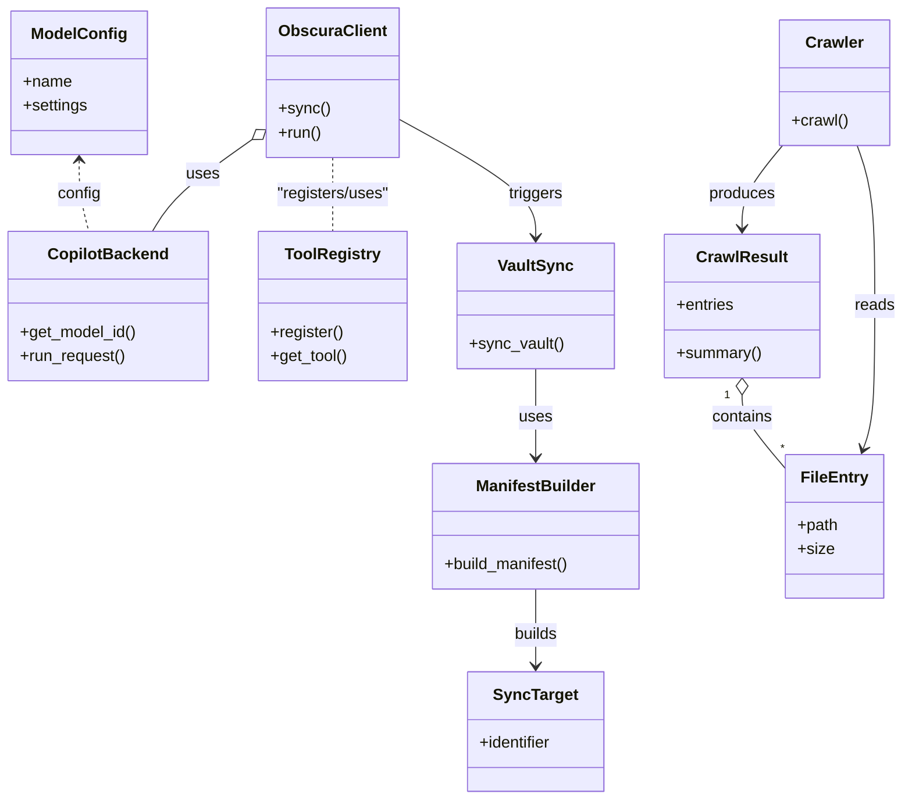

# Diagram: container_tracking_core/container_tracking_service/config/config.prod-a.yml

> Auto-generated by Obscura crawlers

## Mermaid

```mermaid
classDiagram
    class ModelConfig {
        +name
        +settings
    }
    class CopilotBackend {
        +get_model_id()
        +run_request()
    }
    class ObscuraClient {
        +sync()
        +run()
    }
    class ToolRegistry {
        +register()
        +get_tool()
    }
    class FileEntry {
        +path
        +size
    }
    class CrawlResult {
        +entries
        +summary()
    }
    class Crawler {
        +crawl()
    }
    class SyncTarget {
        +identifier
    }
    class ManifestBuilder {
        +build_manifest()
    }
    class VaultSync {
        +sync_vault()
    }

    ModelConfig <.. CopilotBackend : config
    ObscuraClient o-- CopilotBackend : uses
    ObscuraClient .. ToolRegistry : "registers/uses"
    Crawler --> CrawlResult : produces
    CrawlResult "1" o-- "*" FileEntry : contains
    Crawler --> FileEntry : reads
    ManifestBuilder --> SyncTarget : builds
    VaultSync --> ManifestBuilder : uses
    ObscuraClient --> VaultSync : triggers
```

> SVG rendering failed for this diagram.
