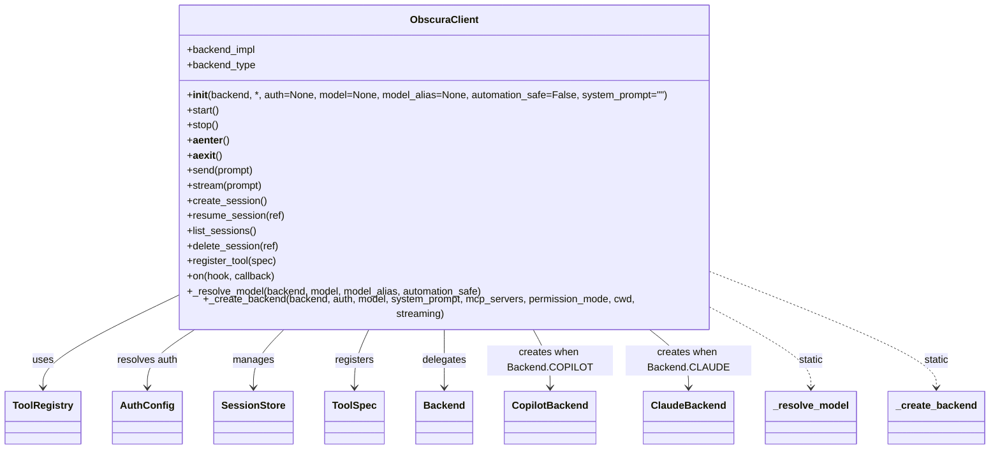

# Diagram: container_tracking_core/container_tracking_service/config/config.prod-b.yml


> Auto-generated by Obscura crawlers

## Diagram 1

```mermaid
classDiagram
    class FileEntry {
        +Path repo_relative
        +Path absolute
        +str extension
        +int size
    }
    class CrawlResult {
        +str repo_name
        +Path repo_path
        +list~FileEntry~ files
        +int skipped_dirs
        +int skipped_files
        +int skipped_size
        +int skipped_ext
        +int total_discovered()
    }
    class CrawlersModule {
        +crawl_repo(repo_path, extensions=None, max_size=100000)
        +_run_copilot_for_mermaid(code)
        +_render_svg_with_mmdc(mermaid)
        +_render_svg_with_kroki(mermaid)
        +generate_stub(entry)
        +generate_index(result)
        +write_output(result, output_dir, dry_run=False)
    }
    CrawlersModule --> CrawlResult : produces
    CrawlResult o-- FileEntry : contains
    CrawlersModule ..> "_render_svg_with_mmdc" : renders
    CrawlersModule ..> "_run_copilot_for_mermaid" : generates
```

> SVG rendering failed for this diagram.

## Diagram 2



### SVG

<svg id="container" width="1527.5078125" xmlns="http://www.w3.org/2000/svg" class="classDiagram" height="702" viewBox="0 0 1527.5078125 702" role="graphics-document document" aria-roledescription="class"><style>#container{font-family:"trebuchet ms",verdana,arial,sans-serif;font-size:16px;fill:#333;}@keyframes edge-animation-frame{from{stroke-dashoffset:0;}}@keyframes dash{to{stroke-dashoffset:0;}}#container .edge-animation-slow{stroke-dasharray:9,5!important;stroke-dashoffset:900;animation:dash 50s linear infinite;stroke-linecap:round;}#container .edge-animation-fast{stroke-dasharray:9,5!important;stroke-dashoffset:900;animation:dash 20s linear infinite;stroke-linecap:round;}#container .error-icon{fill:#552222;}#container .error-text{fill:#552222;stroke:#552222;}#container .edge-thickness-normal{stroke-width:1px;}#container .edge-thickness-thick{stroke-width:3.5px;}#container .edge-pattern-solid{stroke-dasharray:0;}#container .edge-thickness-invisible{stroke-width:0;fill:none;}#container .edge-pattern-dashed{stroke-dasharray:3;}#container .edge-pattern-dotted{stroke-dasharray:2;}#container .marker{fill:#333333;stroke:#333333;}#container .marker.cross{stroke:#333333;}#container svg{font-family:"trebuchet ms",verdana,arial,sans-serif;font-size:16px;}#container p{margin:0;}#container g.classGroup text{fill:#9370DB;stroke:none;font-family:"trebuchet ms",verdana,arial,sans-serif;font-size:10px;}#container g.classGroup text .title{font-weight:bolder;}#container .nodeLabel,#container .edgeLabel{color:#131300;}#container .edgeLabel .label rect{fill:#ECECFF;}#container .label text{fill:#131300;}#container .labelBkg{background:#ECECFF;}#container .edgeLabel .label span{background:#ECECFF;}#container .classTitle{font-weight:bolder;}#container .node rect,#container .node circle,#container .node ellipse,#container .node polygon,#container .node path{fill:#ECECFF;stroke:#9370DB;stroke-width:1px;}#container .divider{stroke:#9370DB;stroke-width:1;}#container g.clickable{cursor:pointer;}#container g.classGroup rect{fill:#ECECFF;stroke:#9370DB;}#container g.classGroup line{stroke:#9370DB;stroke-width:1;}#container .classLabel .box{stroke:none;stroke-width:0;fill:#ECECFF;opacity:0.5;}#container .classLabel .label{fill:#9370DB;font-size:10px;}#container .relation{stroke:#333333;stroke-width:1;fill:none;}#container .dashed-line{stroke-dasharray:3;}#container .dotted-line{stroke-dasharray:1 2;}#container #compositionStart,#container .composition{fill:#333333!important;stroke:#333333!important;stroke-width:1;}#container #compositionEnd,#container .composition{fill:#333333!important;stroke:#333333!important;stroke-width:1;}#container #dependencyStart,#container .dependency{fill:#333333!important;stroke:#333333!important;stroke-width:1;}#container #dependencyStart,#container .dependency{fill:#333333!important;stroke:#333333!important;stroke-width:1;}#container #extensionStart,#container .extension{fill:transparent!important;stroke:#333333!important;stroke-width:1;}#container #extensionEnd,#container .extension{fill:transparent!important;stroke:#333333!important;stroke-width:1;}#container #aggregationStart,#container .aggregation{fill:transparent!important;stroke:#333333!important;stroke-width:1;}#container #aggregationEnd,#container .aggregation{fill:transparent!important;stroke:#333333!important;stroke-width:1;}#container #lollipopStart,#container .lollipop{fill:#ECECFF!important;stroke:#333333!important;stroke-width:1;}#container #lollipopEnd,#container .lollipop{fill:#ECECFF!important;stroke:#333333!important;stroke-width:1;}#container .edgeTerminals{font-size:11px;line-height:initial;}#container .classTitleText{text-anchor:middle;font-size:18px;fill:#333;}#container .label-icon{display:inline-block;height:1em;overflow:visible;vertical-align:-0.125em;}#container .node .label-icon path{fill:currentColor;stroke:revert;stroke-width:revert;}#container :root{--mermaid-font-family:"trebuchet ms",verdana,arial,sans-serif;}</style><g><defs><marker id="container_class-aggregationStart" class="marker aggregation class" refX="18" refY="7" markerWidth="190" markerHeight="240" orient="auto"><path d="M 18,7 L9,13 L1,7 L9,1 Z"></path></marker></defs><defs><marker id="container_class-aggregationEnd" class="marker aggregation class" refX="1" refY="7" markerWidth="20" markerHeight="28" orient="auto"><path d="M 18,7 L9,13 L1,7 L9,1 Z"></path></marker></defs><defs><marker id="container_class-extensionStart" class="marker extension class" refX="18" refY="7" markerWidth="190" markerHeight="240" orient="auto"><path d="M 1,7 L18,13 V 1 Z"></path></marker></defs><defs><marker id="container_class-extensionEnd" class="marker extension class" refX="1" refY="7" markerWidth="20" markerHeight="28" orient="auto"><path d="M 1,1 V 13 L18,7 Z"></path></marker></defs><defs><marker id="container_class-compositionStart" class="marker composition class" refX="18" refY="7" markerWidth="190" markerHeight="240" orient="auto"><path d="M 18,7 L9,13 L1,7 L9,1 Z"></path></marker></defs><defs><marker id="container_class-compositionEnd" class="marker composition class" refX="1" refY="7" markerWidth="20" markerHeight="28" orient="auto"><path d="M 18,7 L9,13 L1,7 L9,1 Z"></path></marker></defs><defs><marker id="container_class-dependencyStart" class="marker dependency class" refX="6" refY="7" markerWidth="190" markerHeight="240" orient="auto"><path d="M 5,7 L9,13 L1,7 L9,1 Z"></path></marker></defs><defs><marker id="container_class-dependencyEnd" class="marker dependency class" refX="13" refY="7" markerWidth="20" markerHeight="28" orient="auto"><path d="M 18,7 L9,13 L14,7 L9,1 Z"></path></marker></defs><defs><marker id="container_class-lollipopStart" class="marker lollipop class" refX="13" refY="7" markerWidth="190" markerHeight="240" orient="auto"><circle stroke="black" fill="transparent" cx="7" cy="7" r="6"></circle></marker></defs><defs><marker id="container_class-lollipopEnd" class="marker lollipop class" refX="1" refY="7" markerWidth="190" markerHeight="240" orient="auto"><circle stroke="black" fill="transparent" cx="7" cy="7" r="6"></circle></marker></defs><g class="root"><g class="clusters"></g><g class="edgePaths"><path d="M257.691,467.076L225.71,482.73C193.729,498.384,129.767,529.692,97.786,552.513C65.805,575.333,65.805,589.667,65.805,596.833L65.805,604" id="id_ObscuraClient_ToolRegistry_1" class="edge-thickness-normal edge-pattern-solid relation" style=";;;" data-edge="true" data-et="edge" data-id="id_ObscuraClient_ToolRegistry_1" data-points="W3sieCI6MjU3LjY5MTQwNjI1LCJ5Ijo0NjcuMDc2MzU5Njg2NDU1OH0seyJ4Ijo2NS44MDQ2ODc1LCJ5Ijo1NjF9LHsieCI6NjUuODA0Njg3NSwieSI6NjEwfV0=" marker-end="url(#container_class-dependencyEnd)"></path><path d="M299.643,512L287.292,520.167C274.942,528.333,250.24,544.667,237.89,560C225.539,575.333,225.539,589.667,225.539,596.833L225.539,604" id="id_ObscuraClient_AuthConfig_2" class="edge-thickness-normal edge-pattern-solid relation" style=";;;" data-edge="true" data-et="edge" data-id="id_ObscuraClient_AuthConfig_2" data-points="W3sieCI6Mjk5LjY0MzE2ODYwNDY1MTIsInkiOjUxMn0seyJ4IjoyMjUuNTM5MDYyNSwieSI6NTYxfSx7IngiOjIyNS41MzkwNjI1LCJ5Ijo2MTB9XQ==" marker-end="url(#container_class-dependencyEnd)"></path><path d="M435.036,512L427.073,520.167C419.11,528.333,403.184,544.667,395.221,560C387.258,575.333,387.258,589.667,387.258,596.833L387.258,604" id="id_ObscuraClient_SessionStore_3" class="edge-thickness-normal edge-pattern-solid relation" style=";;;" data-edge="true" data-et="edge" data-id="id_ObscuraClient_SessionStore_3" data-points="W3sieCI6NDM1LjAzNTYxMDQ2NTExNjMsInkiOjUxMn0seyJ4IjozODcuMjU3ODEyNSwieSI6NTYxfSx7IngiOjM4Ny4yNTc4MTI1LCJ5Ijo2MTB9XQ==" marker-end="url(#container_class-dependencyEnd)"></path><path d="M564.797,512L561.039,520.167C557.281,528.333,549.766,544.667,546.008,560C542.25,575.333,542.25,589.667,542.25,596.833L542.25,604" id="id_ObscuraClient_ToolSpec_4" class="edge-thickness-normal edge-pattern-solid relation" style=";;;" data-edge="true" data-et="edge" data-id="id_ObscuraClient_ToolSpec_4" data-points="W3sieCI6NTY0Ljc5NjUxMTYyNzkwNywieSI6NTEyfSx7IngiOjU0Mi4yNSwieSI6NTYxfSx7IngiOjU0Mi4yNSwieSI6NjEwfV0=" marker-end="url(#container_class-dependencyEnd)"></path><path d="M680.75,512L680.75,520.167C680.75,528.333,680.75,544.667,680.75,560C680.75,575.333,680.75,589.667,680.75,596.833L680.75,604" id="id_ObscuraClient_Backend_5" class="edge-thickness-normal edge-pattern-solid relation" style=";;;" data-edge="true" data-et="edge" data-id="id_ObscuraClient_Backend_5" data-points="W3sieCI6NjgwLjc1LCJ5Ijo1MTJ9LHsieCI6NjgwLjc1LCJ5Ijo1NjF9LHsieCI6NjgwLjc1LCJ5Ijo2MTB9XQ==" marker-end="url(#container_class-dependencyEnd)"></path><path d="M817.078,512L821.496,520.167C825.914,528.333,834.75,544.667,839.168,560C843.586,575.333,843.586,589.667,843.586,596.833L843.586,604" id="id_ObscuraClient_CopilotBackend_6" class="edge-thickness-normal edge-pattern-solid relation" style=";;;" data-edge="true" data-et="edge" data-id="id_ObscuraClient_CopilotBackend_6" data-points="W3sieCI6ODE3LjA3Nzc2MTYyNzkwNywieSI6NTEyfSx7IngiOjg0My41ODU5Mzc1LCJ5Ijo1NjF9LHsieCI6ODQzLjU4NTkzNzUsInkiOjYxMH1d" marker-end="url(#container_class-dependencyEnd)"></path><path d="M1001.264,512L1011.651,520.167C1022.038,528.333,1042.812,544.667,1053.199,560C1063.586,575.333,1063.586,589.667,1063.586,596.833L1063.586,604" id="id_ObscuraClient_ClaudeBackend_7" class="edge-thickness-normal edge-pattern-solid relation" style=";;;" data-edge="true" data-et="edge" data-id="id_ObscuraClient_ClaudeBackend_7" data-points="W3sieCI6MTAwMS4yNjM4MDgxMzk1MzQ4LCJ5Ijo1MTJ9LHsieCI6MTA2My41ODU5Mzc1LCJ5Ijo1NjF9LHsieCI6MTA2My41ODU5Mzc1LCJ5Ijo2MTB9XQ==" marker-end="url(#container_class-dependencyEnd)"></path><path d="M1103.809,483.004L1128.469,496.004C1153.13,509.003,1202.452,535.001,1227.113,555.167C1251.773,575.333,1251.773,589.667,1251.773,596.833L1251.773,604" id="id_ObscuraClient__resolve_model_8" class="edge-thickness-normal edge-pattern-dashed relation" style=";;;" data-edge="true" data-et="edge" data-id="id_ObscuraClient__resolve_model_8" data-points="W3sieCI6MTEwMy44MDg1OTM3NSwieSI6NDgzLjAwNDIyMDc2NTg5NDU2fSx7IngiOjEyNTEuNzczNDM3NSwieSI6NTYxfSx7IngiOjEyNTEuNzczNDM3NSwieSI6NjEwfV0=" marker-end="url(#container_class-dependencyEnd)"></path><path d="M1103.809,426.497L1160.769,448.915C1217.729,471.332,1331.65,516.166,1388.61,545.75C1445.57,575.333,1445.57,589.667,1445.57,596.833L1445.57,604" id="id_ObscuraClient__create_backend_9" class="edge-thickness-normal edge-pattern-dashed relation" style=";;;" data-edge="true" data-et="edge" data-id="id_ObscuraClient__create_backend_9" data-points="W3sieCI6MTEwMy44MDg1OTM3NSwieSI6NDI2LjQ5NzQ1NjUxMDQxNH0seyJ4IjoxNDQ1LjU3MDMxMjUsInkiOjU2MX0seyJ4IjoxNDQ1LjU3MDMxMjUsInkiOjYxMH1d" marker-end="url(#container_class-dependencyEnd)"></path></g><g class="edgeLabels"><g class="edgeLabel" transform="translate(65.8046875, 561)"><g class="label" data-id="id_ObscuraClient_ToolRegistry_1" transform="translate(-16.4921875, -12)"><foreignObject width="32.984375" height="24"><div xmlns="http://www.w3.org/1999/xhtml" class="labelBkg" style="display: table-cell; white-space: nowrap; line-height: 1.5; max-width: 200px; text-align: center;"><span class="edgeLabel"><p>uses</p></span></div></foreignObject></g></g><g class="edgeLabel" transform="translate(225.5390625, 561)"><g class="label" data-id="id_ObscuraClient_AuthConfig_2" transform="translate(-48.5859375, -12)"><foreignObject width="97.171875" height="24"><div xmlns="http://www.w3.org/1999/xhtml" class="labelBkg" style="display: table-cell; white-space: nowrap; line-height: 1.5; max-width: 200px; text-align: center;"><span class="edgeLabel"><p>resolves auth</p></span></div></foreignObject></g></g><g class="edgeLabel" transform="translate(387.2578125, 561)"><g class="label" data-id="id_ObscuraClient_SessionStore_3" transform="translate(-32.296875, -12)"><foreignObject width="64.59375" height="24"><div xmlns="http://www.w3.org/1999/xhtml" class="labelBkg" style="display: table-cell; white-space: nowrap; line-height: 1.5; max-width: 200px; text-align: center;"><span class="edgeLabel"><p>manages</p></span></div></foreignObject></g></g><g class="edgeLabel" transform="translate(542.25, 561)"><g class="label" data-id="id_ObscuraClient_ToolSpec_4" transform="translate(-31.1953125, -12)"><foreignObject width="62.390625" height="24"><div xmlns="http://www.w3.org/1999/xhtml" class="labelBkg" style="display: table-cell; white-space: nowrap; line-height: 1.5; max-width: 200px; text-align: center;"><span class="edgeLabel"><p>registers</p></span></div></foreignObject></g></g><g class="edgeLabel" transform="translate(680.75, 561)"><g class="label" data-id="id_ObscuraClient_Backend_5" transform="translate(-35.0390625, -12)"><foreignObject width="70.078125" height="24"><div xmlns="http://www.w3.org/1999/xhtml" class="labelBkg" style="display: table-cell; white-space: nowrap; line-height: 1.5; max-width: 200px; text-align: center;"><span class="edgeLabel"><p>delegates</p></span></div></foreignObject></g></g><g class="edgeLabel" transform="translate(843.5859375, 561)"><g class="label" data-id="id_ObscuraClient_CopilotBackend_6" transform="translate(-100, -24)"><foreignObject width="200" height="48"><div xmlns="http://www.w3.org/1999/xhtml" class="labelBkg" style="display: table; white-space: break-spaces; line-height: 1.5; max-width: 200px; text-align: center; width: 200px;"><span class="edgeLabel"><p>creates when Backend.COPILOT</p></span></div></foreignObject></g></g><g class="edgeLabel" transform="translate(1063.5859375, 561)"><g class="label" data-id="id_ObscuraClient_ClaudeBackend_7" transform="translate(-100, -24)"><foreignObject width="200" height="48"><div xmlns="http://www.w3.org/1999/xhtml" class="labelBkg" style="display: table; white-space: break-spaces; line-height: 1.5; max-width: 200px; text-align: center; width: 200px;"><span class="edgeLabel"><p>creates when Backend.CLAUDE</p></span></div></foreignObject></g></g><g class="edgeLabel" transform="translate(1251.7734375, 561)"><g class="label" data-id="id_ObscuraClient__resolve_model_8" transform="translate(-19.890625, -12)"><foreignObject width="39.78125" height="24"><div xmlns="http://www.w3.org/1999/xhtml" class="labelBkg" style="display: table-cell; white-space: nowrap; line-height: 1.5; max-width: 200px; text-align: center;"><span class="edgeLabel"><p>static</p></span></div></foreignObject></g></g><g class="edgeLabel" transform="translate(1445.5703125, 561)"><g class="label" data-id="id_ObscuraClient__create_backend_9" transform="translate(-19.890625, -12)"><foreignObject width="39.78125" height="24"><div xmlns="http://www.w3.org/1999/xhtml" class="labelBkg" style="display: table-cell; white-space: nowrap; line-height: 1.5; max-width: 200px; text-align: center;"><span class="edgeLabel"><p>static</p></span></div></foreignObject></g></g></g><g class="nodes"><g class="node default" id="classId-ObscuraClient-0" transform="translate(680.75, 260)"><g class="basic label-container"><path d="M-423.05859375 -252 L423.05859375 -252 L423.05859375 252 L-423.05859375 252" stroke="none" stroke-width="0" fill="#ECECFF" style=""></path><path d="M-423.05859375 -252 C-104.67320505324534 -252, 213.71218364350932 -252, 423.05859375 -252 M-423.05859375 -252 C-92.77285998301022 -252, 237.51287378397956 -252, 423.05859375 -252 M423.05859375 -252 C423.05859375 -72.27859994808838, 423.05859375 107.44280010382323, 423.05859375 252 M423.05859375 -252 C423.05859375 -145.6792580121194, 423.05859375 -39.35851602423878, 423.05859375 252 M423.05859375 252 C164.7084629169035 252, -93.641667916193 252, -423.05859375 252 M423.05859375 252 C185.47588663666997 252, -52.10682047666006 252, -423.05859375 252 M-423.05859375 252 C-423.05859375 112.83258694918206, -423.05859375 -26.334826101635883, -423.05859375 -252 M-423.05859375 252 C-423.05859375 148.0952231793391, -423.05859375 44.1904463586782, -423.05859375 -252" stroke="#9370DB" stroke-width="1.3" fill="none" stroke-dasharray="0 0" style=""></path></g><g class="annotation-group text" transform="translate(0, -228)"></g><g class="label-group text" transform="translate(-51.0859375, -228)"><g class="label" style="font-weight: bolder" transform="translate(0,-12)"><foreignObject width="102.171875" height="24"><div xmlns="http://www.w3.org/1999/xhtml" style="display: table-cell; white-space: nowrap; line-height: 1.5; max-width: 151px; text-align: center;"><span class="nodeLabel markdown-node-label" style=""><p>ObscuraClient</p></span></div></foreignObject></g></g><g class="members-group text" transform="translate(-411.05859375, -180)"><g class="label" style="" transform="translate(0,-12)"><foreignObject width="110.140625" height="24"><div xmlns="http://www.w3.org/1999/xhtml" style="display: table-cell; white-space: nowrap; line-height: 1.5; max-width: 168px; text-align: center;"><span class="nodeLabel markdown-node-label" style=""><p>+backend_impl</p></span></div></foreignObject></g><g class="label" style="" transform="translate(0,12)"><foreignObject width="109.1875" height="24"><div xmlns="http://www.w3.org/1999/xhtml" style="display: table-cell; white-space: nowrap; line-height: 1.5; max-width: 167px; text-align: center;"><span class="nodeLabel markdown-node-label" style=""><p>+backend_type</p></span></div></foreignObject></g></g><g class="methods-group text" transform="translate(-411.05859375, -108)"><g class="label" style="" transform="translate(0,-12)"><foreignObject width="763.484375" height="24"><div xmlns="http://www.w3.org/1999/xhtml" style="display: table-cell; white-space: nowrap; line-height: 1.5; max-width: 852px; text-align: center;"><span class="nodeLabel markdown-node-label" style=""><p>+<strong>init</strong>(backend, *, auth=None, model=None, model_alias=None, automation_safe=False, system_prompt="")</p></span></div></foreignObject></g><g class="label" style="" transform="translate(0,12)"><foreignObject width="52.15625" height="24"><div xmlns="http://www.w3.org/1999/xhtml" style="display: table-cell; white-space: nowrap; line-height: 1.5; max-width: 110px; text-align: center;"><span class="nodeLabel markdown-node-label" style=""><p>+start()</p></span></div></foreignObject></g><g class="label" style="" transform="translate(0,36)"><foreignObject width="50.21875" height="24"><div xmlns="http://www.w3.org/1999/xhtml" style="display: table-cell; white-space: nowrap; line-height: 1.5; max-width: 108px; text-align: center;"><span class="nodeLabel markdown-node-label" style=""><p>+stop()</p></span></div></foreignObject></g><g class="label" style="" transform="translate(0,60)"><foreignObject width="66.328125" height="24"><div xmlns="http://www.w3.org/1999/xhtml" style="display: table-cell; white-space: nowrap; line-height: 1.5; max-width: 153px; text-align: center;"><span class="nodeLabel markdown-node-label" style=""><p>+<strong>aenter</strong>()</p></span></div></foreignObject></g><g class="label" style="" transform="translate(0,84)"><foreignObject width="54.640625" height="24"><div xmlns="http://www.w3.org/1999/xhtml" style="display: table-cell; white-space: nowrap; line-height: 1.5; max-width: 142px; text-align: center;"><span class="nodeLabel markdown-node-label" style=""><p>+<strong>aexit</strong>()</p></span></div></foreignObject></g><g class="label" style="" transform="translate(0,108)"><foreignObject width="107.03125" height="24"><div xmlns="http://www.w3.org/1999/xhtml" style="display: table-cell; white-space: nowrap; line-height: 1.5; max-width: 164px; text-align: center;"><span class="nodeLabel markdown-node-label" style=""><p>+send(prompt)</p></span></div></foreignObject></g><g class="label" style="" transform="translate(0,132)"><foreignObject width="121.8125" height="24"><div xmlns="http://www.w3.org/1999/xhtml" style="display: table-cell; white-space: nowrap; line-height: 1.5; max-width: 179px; text-align: center;"><span class="nodeLabel markdown-node-label" style=""><p>+stream(prompt)</p></span></div></foreignObject></g><g class="label" style="" transform="translate(0,156)"><foreignObject width="125.4375" height="24"><div xmlns="http://www.w3.org/1999/xhtml" style="display: table-cell; white-space: nowrap; line-height: 1.5; max-width: 183px; text-align: center;"><span class="nodeLabel markdown-node-label" style=""><p>+create_session()</p></span></div></foreignObject></g><g class="label" style="" transform="translate(0,180)"><foreignObject width="155.25" height="24"><div xmlns="http://www.w3.org/1999/xhtml" style="display: table-cell; white-space: nowrap; line-height: 1.5; max-width: 213px; text-align: center;"><span class="nodeLabel markdown-node-label" style=""><p>+resume_session(ref)</p></span></div></foreignObject></g><g class="label" style="" transform="translate(0,204)"><foreignObject width="110.8125" height="24"><div xmlns="http://www.w3.org/1999/xhtml" style="display: table-cell; white-space: nowrap; line-height: 1.5; max-width: 168px; text-align: center;"><span class="nodeLabel markdown-node-label" style=""><p>+list_sessions()</p></span></div></foreignObject></g><g class="label" style="" transform="translate(0,228)"><foreignObject width="147.5" height="24"><div xmlns="http://www.w3.org/1999/xhtml" style="display: table-cell; white-space: nowrap; line-height: 1.5; max-width: 205px; text-align: center;"><span class="nodeLabel markdown-node-label" style=""><p>+delete_session(ref)</p></span></div></foreignObject></g><g class="label" style="" transform="translate(0,252)"><foreignObject width="142.484375" height="24"><div xmlns="http://www.w3.org/1999/xhtml" style="display: table-cell; white-space: nowrap; line-height: 1.5; max-width: 200px; text-align: center;"><span class="nodeLabel markdown-node-label" style=""><p>+register_tool(spec)</p></span></div></foreignObject></g><g class="label" style="" transform="translate(0,276)"><foreignObject width="140.78125" height="24"><div xmlns="http://www.w3.org/1999/xhtml" style="display: table-cell; white-space: nowrap; line-height: 1.5; max-width: 198px; text-align: center;"><span class="nodeLabel markdown-node-label" style=""><p>+on(hook, callback)</p></span></div></foreignObject></g><g class="label" style="" transform="translate(0,300)"><foreignObject width="473.828125" height="24"><div xmlns="http://www.w3.org/1999/xhtml" style="display: table-cell; white-space: nowrap; line-height: 1.5; max-width: 531px; text-align: center;"><span class="nodeLabel markdown-node-label" style=""><p>+_resolve_model(backend, model, model_alias, automation_safe)</p></span></div></foreignObject></g><g class="label" style="" transform="translate(0,324)"><foreignObject width="771.03125" height="24"><div xmlns="http://www.w3.org/1999/xhtml" style="display: table-cell; white-space: nowrap; line-height: 1.5; max-width: 828px; text-align: center;"><span class="nodeLabel markdown-node-label" style=""><p>+_create_backend(backend, auth, model, system_prompt, mcp_servers, permission_mode, cwd, streaming)</p></span></div></foreignObject></g></g><g class="divider" style=""><path d="M-423.05859375 -204 C-118.18380162227419 -204, 186.69099050545162 -204, 423.05859375 -204 M-423.05859375 -204 C-85.40599925417331 -204, 252.24659524165338 -204, 423.05859375 -204" stroke="#9370DB" stroke-width="1.3" fill="none" stroke-dasharray="0 0" style=""></path></g><g class="divider" style=""><path d="M-423.05859375 -132 C-105.24149416021379 -132, 212.57560542957242 -132, 423.05859375 -132 M-423.05859375 -132 C-190.17077260850982 -132, 42.71704853298036 -132, 423.05859375 -132" stroke="#9370DB" stroke-width="1.3" fill="none" stroke-dasharray="0 0" style=""></path></g></g><g class="node default" id="classId-ToolRegistry-1" transform="translate(65.8046875, 652)"><g class="basic label-container"><path d="M-57.8046875 -42 L57.8046875 -42 L57.8046875 42 L-57.8046875 42" stroke="none" stroke-width="0" fill="#ECECFF" style=""></path><path d="M-57.8046875 -42 C-18.217795369544675 -42, 21.36909676091065 -42, 57.8046875 -42 M-57.8046875 -42 C-18.95887334812892 -42, 19.886940803742164 -42, 57.8046875 -42 M57.8046875 -42 C57.8046875 -23.652250702293593, 57.8046875 -5.304501404587185, 57.8046875 42 M57.8046875 -42 C57.8046875 -21.603848588200993, 57.8046875 -1.207697176401986, 57.8046875 42 M57.8046875 42 C19.261151838091287 42, -19.282383823817426 42, -57.8046875 42 M57.8046875 42 C23.66170186294478 42, -10.481283774110437 42, -57.8046875 42 M-57.8046875 42 C-57.8046875 24.44392890613456, -57.8046875 6.887857812269118, -57.8046875 -42 M-57.8046875 42 C-57.8046875 24.441459111366793, -57.8046875 6.882918222733586, -57.8046875 -42" stroke="#9370DB" stroke-width="1.3" fill="none" stroke-dasharray="0 0" style=""></path></g><g class="annotation-group text" transform="translate(0, -18)"></g><g class="label-group text" transform="translate(-45.8046875, -18)"><g class="label" style="font-weight: bolder" transform="translate(0,-12)"><foreignObject width="91.609375" height="24"><div xmlns="http://www.w3.org/1999/xhtml" style="display: table-cell; white-space: nowrap; line-height: 1.5; max-width: 139px; text-align: center;"><span class="nodeLabel markdown-node-label" style=""><p>ToolRegistry</p></span></div></foreignObject></g></g><g class="members-group text" transform="translate(-45.8046875, 30)"></g><g class="methods-group text" transform="translate(-45.8046875, 60)"></g><g class="divider" style=""><path d="M-57.8046875 6 C-29.960355120180587 6, -2.116022740361174 6, 57.8046875 6 M-57.8046875 6 C-28.688036272903318 6, 0.42861495419336393 6, 57.8046875 6" stroke="#9370DB" stroke-width="1.3" fill="none" stroke-dasharray="0 0" style=""></path></g><g class="divider" style=""><path d="M-57.8046875 24 C-11.876994937442483 24, 34.050697625115035 24, 57.8046875 24 M-57.8046875 24 C-32.97678481473908 24, -8.14888212947816 24, 57.8046875 24" stroke="#9370DB" stroke-width="1.3" fill="none" stroke-dasharray="0 0" style=""></path></g></g><g class="node default" id="classId-Backend-2" transform="translate(680.75, 652)"><g class="basic label-container"><path d="M-43.296875 -42 L43.296875 -42 L43.296875 42 L-43.296875 42" stroke="none" stroke-width="0" fill="#ECECFF" style=""></path><path d="M-43.296875 -42 C-12.856193951780952 -42, 17.584487096438096 -42, 43.296875 -42 M-43.296875 -42 C-17.93470590539141 -42, 7.427463189217178 -42, 43.296875 -42 M43.296875 -42 C43.296875 -18.21391883861576, 43.296875 5.572162322768477, 43.296875 42 M43.296875 -42 C43.296875 -9.562721349924871, 43.296875 22.874557300150258, 43.296875 42 M43.296875 42 C19.854847789697743 42, -3.587179420604514 42, -43.296875 42 M43.296875 42 C16.868008472072702 42, -9.560858055854595 42, -43.296875 42 M-43.296875 42 C-43.296875 16.26932299625771, -43.296875 -9.46135400748458, -43.296875 -42 M-43.296875 42 C-43.296875 17.154982534992374, -43.296875 -7.690034930015251, -43.296875 -42" stroke="#9370DB" stroke-width="1.3" fill="none" stroke-dasharray="0 0" style=""></path></g><g class="annotation-group text" transform="translate(0, -18)"></g><g class="label-group text" transform="translate(-31.296875, -18)"><g class="label" style="font-weight: bolder" transform="translate(0,-12)"><foreignObject width="62.59375" height="24"><div xmlns="http://www.w3.org/1999/xhtml" style="display: table-cell; white-space: nowrap; line-height: 1.5; max-width: 112px; text-align: center;"><span class="nodeLabel markdown-node-label" style=""><p>Backend</p></span></div></foreignObject></g></g><g class="members-group text" transform="translate(-31.296875, 30)"></g><g class="methods-group text" transform="translate(-31.296875, 60)"></g><g class="divider" style=""><path d="M-43.296875 6 C-23.84394468284719 6, -4.391014365694382 6, 43.296875 6 M-43.296875 6 C-18.352425781838313 6, 6.592023436323373 6, 43.296875 6" stroke="#9370DB" stroke-width="1.3" fill="none" stroke-dasharray="0 0" style=""></path></g><g class="divider" style=""><path d="M-43.296875 24 C-11.579796562955362 24, 20.137281874089275 24, 43.296875 24 M-43.296875 24 C-12.096112097460498 24, 19.104650805079004 24, 43.296875 24" stroke="#9370DB" stroke-width="1.3" fill="none" stroke-dasharray="0 0" style=""></path></g></g><g class="node default" id="classId-CopilotBackend-3" transform="translate(843.5859375, 652)"><g class="basic label-container"><path d="M-69.5390625 -42 L69.5390625 -42 L69.5390625 42 L-69.5390625 42" stroke="none" stroke-width="0" fill="#ECECFF" style=""></path><path d="M-69.5390625 -42 C-35.524163244512714 -42, -1.5092639890254276 -42, 69.5390625 -42 M-69.5390625 -42 C-14.370381442319832 -42, 40.798299615360335 -42, 69.5390625 -42 M69.5390625 -42 C69.5390625 -15.569933107270714, 69.5390625 10.860133785458572, 69.5390625 42 M69.5390625 -42 C69.5390625 -17.333021534838842, 69.5390625 7.333956930322316, 69.5390625 42 M69.5390625 42 C34.99920436426657 42, 0.45934622853313556 42, -69.5390625 42 M69.5390625 42 C39.84962512124429 42, 10.160187742488574 42, -69.5390625 42 M-69.5390625 42 C-69.5390625 16.16584116598016, -69.5390625 -9.668317668039677, -69.5390625 -42 M-69.5390625 42 C-69.5390625 24.789208181807155, -69.5390625 7.578416363614309, -69.5390625 -42" stroke="#9370DB" stroke-width="1.3" fill="none" stroke-dasharray="0 0" style=""></path></g><g class="annotation-group text" transform="translate(0, -18)"></g><g class="label-group text" transform="translate(-57.5390625, -18)"><g class="label" style="font-weight: bolder" transform="translate(0,-12)"><foreignObject width="115.078125" height="24"><div xmlns="http://www.w3.org/1999/xhtml" style="display: table-cell; white-space: nowrap; line-height: 1.5; max-width: 164px; text-align: center;"><span class="nodeLabel markdown-node-label" style=""><p>CopilotBackend</p></span></div></foreignObject></g></g><g class="members-group text" transform="translate(-57.5390625, 30)"></g><g class="methods-group text" transform="translate(-57.5390625, 60)"></g><g class="divider" style=""><path d="M-69.5390625 6 C-17.432404171048056 6, 34.67425415790389 6, 69.5390625 6 M-69.5390625 6 C-38.850768527315 6, -8.162474554629988 6, 69.5390625 6" stroke="#9370DB" stroke-width="1.3" fill="none" stroke-dasharray="0 0" style=""></path></g><g class="divider" style=""><path d="M-69.5390625 24 C-19.65349770997178 24, 30.23206708005644 24, 69.5390625 24 M-69.5390625 24 C-28.402104767343857 24, 12.734852965312285 24, 69.5390625 24" stroke="#9370DB" stroke-width="1.3" fill="none" stroke-dasharray="0 0" style=""></path></g></g><g class="node default" id="classId-ClaudeBackend-4" transform="translate(1063.5859375, 652)"><g class="basic label-container"><path d="M-68.328125 -42 L68.328125 -42 L68.328125 42 L-68.328125 42" stroke="none" stroke-width="0" fill="#ECECFF" style=""></path><path d="M-68.328125 -42 C-35.91889957726281 -42, -3.5096741545256265 -42, 68.328125 -42 M-68.328125 -42 C-36.196398953791615 -42, -4.06467290758323 -42, 68.328125 -42 M68.328125 -42 C68.328125 -20.838804727729347, 68.328125 0.32239054454130667, 68.328125 42 M68.328125 -42 C68.328125 -24.69423420930532, 68.328125 -7.388468418610643, 68.328125 42 M68.328125 42 C32.856277423019876 42, -2.615570153960249 42, -68.328125 42 M68.328125 42 C25.099523234912468 42, -18.129078530175065 42, -68.328125 42 M-68.328125 42 C-68.328125 9.519865489971906, -68.328125 -22.960269020056188, -68.328125 -42 M-68.328125 42 C-68.328125 12.527066696998268, -68.328125 -16.945866606003463, -68.328125 -42" stroke="#9370DB" stroke-width="1.3" fill="none" stroke-dasharray="0 0" style=""></path></g><g class="annotation-group text" transform="translate(0, -18)"></g><g class="label-group text" transform="translate(-56.328125, -18)"><g class="label" style="font-weight: bolder" transform="translate(0,-12)"><foreignObject width="112.65625" height="24"><div xmlns="http://www.w3.org/1999/xhtml" style="display: table-cell; white-space: nowrap; line-height: 1.5; max-width: 162px; text-align: center;"><span class="nodeLabel markdown-node-label" style=""><p>ClaudeBackend</p></span></div></foreignObject></g></g><g class="members-group text" transform="translate(-56.328125, 30)"></g><g class="methods-group text" transform="translate(-56.328125, 60)"></g><g class="divider" style=""><path d="M-68.328125 6 C-33.63482843006321 6, 1.0584681398735825 6, 68.328125 6 M-68.328125 6 C-17.117521556297817 6, 34.09308188740437 6, 68.328125 6" stroke="#9370DB" stroke-width="1.3" fill="none" stroke-dasharray="0 0" style=""></path></g><g class="divider" style=""><path d="M-68.328125 24 C-34.98350164419458 24, -1.638878288389165 24, 68.328125 24 M-68.328125 24 C-15.426630203952229 24, 37.47486459209554 24, 68.328125 24" stroke="#9370DB" stroke-width="1.3" fill="none" stroke-dasharray="0 0" style=""></path></g></g><g class="node default" id="classId-AuthConfig-5" transform="translate(225.5390625, 652)"><g class="basic label-container"><path d="M-51.9296875 -42 L51.9296875 -42 L51.9296875 42 L-51.9296875 42" stroke="none" stroke-width="0" fill="#ECECFF" style=""></path><path d="M-51.9296875 -42 C-25.828973291674124 -42, 0.27174091665175126 -42, 51.9296875 -42 M-51.9296875 -42 C-18.516985174925544 -42, 14.895717150148911 -42, 51.9296875 -42 M51.9296875 -42 C51.9296875 -11.654934646748849, 51.9296875 18.690130706502302, 51.9296875 42 M51.9296875 -42 C51.9296875 -8.574007309254604, 51.9296875 24.851985381490792, 51.9296875 42 M51.9296875 42 C21.865282914031972 42, -8.199121671936055 42, -51.9296875 42 M51.9296875 42 C26.131097302016464 42, 0.3325071040329277 42, -51.9296875 42 M-51.9296875 42 C-51.9296875 21.55194004735585, -51.9296875 1.1038800947116982, -51.9296875 -42 M-51.9296875 42 C-51.9296875 23.06265641253442, -51.9296875 4.125312825068839, -51.9296875 -42" stroke="#9370DB" stroke-width="1.3" fill="none" stroke-dasharray="0 0" style=""></path></g><g class="annotation-group text" transform="translate(0, -18)"></g><g class="label-group text" transform="translate(-39.9296875, -18)"><g class="label" style="font-weight: bolder" transform="translate(0,-12)"><foreignObject width="79.859375" height="24"><div xmlns="http://www.w3.org/1999/xhtml" style="display: table-cell; white-space: nowrap; line-height: 1.5; max-width: 129px; text-align: center;"><span class="nodeLabel markdown-node-label" style=""><p>AuthConfig</p></span></div></foreignObject></g></g><g class="members-group text" transform="translate(-39.9296875, 30)"></g><g class="methods-group text" transform="translate(-39.9296875, 60)"></g><g class="divider" style=""><path d="M-51.9296875 6 C-23.0324133816437 6, 5.8648607367126 6, 51.9296875 6 M-51.9296875 6 C-21.455320476988884 6, 9.019046546022231 6, 51.9296875 6" stroke="#9370DB" stroke-width="1.3" fill="none" stroke-dasharray="0 0" style=""></path></g><g class="divider" style=""><path d="M-51.9296875 24 C-14.248158969636897 24, 23.433369560726206 24, 51.9296875 24 M-51.9296875 24 C-16.47187988643718 24, 18.98592772712564 24, 51.9296875 24" stroke="#9370DB" stroke-width="1.3" fill="none" stroke-dasharray="0 0" style=""></path></g></g><g class="node default" id="classId-SessionStore-6" transform="translate(387.2578125, 652)"><g class="basic label-container"><path d="M-59.7890625 -42 L59.7890625 -42 L59.7890625 42 L-59.7890625 42" stroke="none" stroke-width="0" fill="#ECECFF" style=""></path><path d="M-59.7890625 -42 C-20.117197359993256 -42, 19.55466778001349 -42, 59.7890625 -42 M-59.7890625 -42 C-27.382730463480577 -42, 5.023601573038846 -42, 59.7890625 -42 M59.7890625 -42 C59.7890625 -15.714459424589627, 59.7890625 10.571081150820746, 59.7890625 42 M59.7890625 -42 C59.7890625 -16.634550284285602, 59.7890625 8.730899431428796, 59.7890625 42 M59.7890625 42 C13.720512479483638 42, -32.348037541032724 42, -59.7890625 42 M59.7890625 42 C27.573923664119945 42, -4.641215171760109 42, -59.7890625 42 M-59.7890625 42 C-59.7890625 13.172395849788494, -59.7890625 -15.655208300423013, -59.7890625 -42 M-59.7890625 42 C-59.7890625 21.815821159747152, -59.7890625 1.6316423194943042, -59.7890625 -42" stroke="#9370DB" stroke-width="1.3" fill="none" stroke-dasharray="0 0" style=""></path></g><g class="annotation-group text" transform="translate(0, -18)"></g><g class="label-group text" transform="translate(-47.7890625, -18)"><g class="label" style="font-weight: bolder" transform="translate(0,-12)"><foreignObject width="95.578125" height="24"><div xmlns="http://www.w3.org/1999/xhtml" style="display: table-cell; white-space: nowrap; line-height: 1.5; max-width: 143px; text-align: center;"><span class="nodeLabel markdown-node-label" style=""><p>SessionStore</p></span></div></foreignObject></g></g><g class="members-group text" transform="translate(-47.7890625, 30)"></g><g class="methods-group text" transform="translate(-47.7890625, 60)"></g><g class="divider" style=""><path d="M-59.7890625 6 C-29.268959786356124 6, 1.2511429272877521 6, 59.7890625 6 M-59.7890625 6 C-14.857966830613186 6, 30.073128838773627 6, 59.7890625 6" stroke="#9370DB" stroke-width="1.3" fill="none" stroke-dasharray="0 0" style=""></path></g><g class="divider" style=""><path d="M-59.7890625 24 C-35.62807523053489 24, -11.467087961069787 24, 59.7890625 24 M-59.7890625 24 C-25.77390283008807 24, 8.241256839823862 24, 59.7890625 24" stroke="#9370DB" stroke-width="1.3" fill="none" stroke-dasharray="0 0" style=""></path></g></g><g class="node default" id="classId-ToolSpec-7" transform="translate(542.25, 652)"><g class="basic label-container"><path d="M-45.203125 -42 L45.203125 -42 L45.203125 42 L-45.203125 42" stroke="none" stroke-width="0" fill="#ECECFF" style=""></path><path d="M-45.203125 -42 C-16.237927627189983 -42, 12.727269745620035 -42, 45.203125 -42 M-45.203125 -42 C-23.465765512921624 -42, -1.728406025843249 -42, 45.203125 -42 M45.203125 -42 C45.203125 -24.61548372275728, 45.203125 -7.230967445514558, 45.203125 42 M45.203125 -42 C45.203125 -14.39125205359436, 45.203125 13.217495892811279, 45.203125 42 M45.203125 42 C19.728133784197485 42, -5.746857431605029 42, -45.203125 42 M45.203125 42 C15.203028215225032 42, -14.797068569549936 42, -45.203125 42 M-45.203125 42 C-45.203125 14.2969380172404, -45.203125 -13.4061239655192, -45.203125 -42 M-45.203125 42 C-45.203125 17.249688774410238, -45.203125 -7.500622451179524, -45.203125 -42" stroke="#9370DB" stroke-width="1.3" fill="none" stroke-dasharray="0 0" style=""></path></g><g class="annotation-group text" transform="translate(0, -18)"></g><g class="label-group text" transform="translate(-33.203125, -18)"><g class="label" style="font-weight: bolder" transform="translate(0,-12)"><foreignObject width="66.40625" height="24"><div xmlns="http://www.w3.org/1999/xhtml" style="display: table-cell; white-space: nowrap; line-height: 1.5; max-width: 116px; text-align: center;"><span class="nodeLabel markdown-node-label" style=""><p>ToolSpec</p></span></div></foreignObject></g></g><g class="members-group text" transform="translate(-33.203125, 30)"></g><g class="methods-group text" transform="translate(-33.203125, 60)"></g><g class="divider" style=""><path d="M-45.203125 6 C-25.532594180833996 6, -5.8620633616679925 6, 45.203125 6 M-45.203125 6 C-18.065392416075806 6, 9.072340167848388 6, 45.203125 6" stroke="#9370DB" stroke-width="1.3" fill="none" stroke-dasharray="0 0" style=""></path></g><g class="divider" style=""><path d="M-45.203125 24 C-21.574919239862552 24, 2.053286520274895 24, 45.203125 24 M-45.203125 24 C-19.931793520270062 24, 5.339537959459875 24, 45.203125 24" stroke="#9370DB" stroke-width="1.3" fill="none" stroke-dasharray="0 0" style=""></path></g></g><g class="node default" id="classId-_resolve_model-8" transform="translate(1251.7734375, 652)"><g class="basic label-container"><path d="M-69.859375 -42 L69.859375 -42 L69.859375 42 L-69.859375 42" stroke="none" stroke-width="0" fill="#ECECFF" style=""></path><path d="M-69.859375 -42 C-40.150345967794706 -42, -10.44131693558942 -42, 69.859375 -42 M-69.859375 -42 C-21.602676175745778 -42, 26.654022648508445 -42, 69.859375 -42 M69.859375 -42 C69.859375 -21.99559944697904, 69.859375 -1.991198893958078, 69.859375 42 M69.859375 -42 C69.859375 -13.419272397429307, 69.859375 15.161455205141387, 69.859375 42 M69.859375 42 C19.90613526728201 42, -30.04710446543598 42, -69.859375 42 M69.859375 42 C16.163398402264946 42, -37.53257819547011 42, -69.859375 42 M-69.859375 42 C-69.859375 22.608485543270096, -69.859375 3.216971086540191, -69.859375 -42 M-69.859375 42 C-69.859375 22.420175767457135, -69.859375 2.8403515349142694, -69.859375 -42" stroke="#9370DB" stroke-width="1.3" fill="none" stroke-dasharray="0 0" style=""></path></g><g class="annotation-group text" transform="translate(0, -18)"></g><g class="label-group text" transform="translate(-57.859375, -18)"><g class="label" style="font-weight: bolder" transform="translate(0,-12)"><foreignObject width="115.71875" height="24"><div xmlns="http://www.w3.org/1999/xhtml" style="display: table-cell; white-space: nowrap; line-height: 1.5; max-width: 165px; text-align: center;"><span class="nodeLabel markdown-node-label" style=""><p>_resolve_model</p></span></div></foreignObject></g></g><g class="members-group text" transform="translate(-57.859375, 30)"></g><g class="methods-group text" transform="translate(-57.859375, 60)"></g><g class="divider" style=""><path d="M-69.859375 6 C-38.12585215964963 6, -6.3923293192992645 6, 69.859375 6 M-69.859375 6 C-25.158747888214236 6, 19.541879223571527 6, 69.859375 6" stroke="#9370DB" stroke-width="1.3" fill="none" stroke-dasharray="0 0" style=""></path></g><g class="divider" style=""><path d="M-69.859375 24 C-39.4005975996229 24, -8.941820199245797 24, 69.859375 24 M-69.859375 24 C-27.41710838837868 24, 15.025158223242641 24, 69.859375 24" stroke="#9370DB" stroke-width="1.3" fill="none" stroke-dasharray="0 0" style=""></path></g></g><g class="node default" id="classId-_create_backend-9" transform="translate(1445.5703125, 652)"><g class="basic label-container"><path d="M-73.9375 -42 L73.9375 -42 L73.9375 42 L-73.9375 42" stroke="none" stroke-width="0" fill="#ECECFF" style=""></path><path d="M-73.9375 -42 C-18.656225176192116 -42, 36.62504964761577 -42, 73.9375 -42 M-73.9375 -42 C-16.06064551322404 -42, 41.81620897355192 -42, 73.9375 -42 M73.9375 -42 C73.9375 -14.31218366250021, 73.9375 13.37563267499958, 73.9375 42 M73.9375 -42 C73.9375 -13.350172430317329, 73.9375 15.299655139365342, 73.9375 42 M73.9375 42 C28.956791109924502 42, -16.023917780150995 42, -73.9375 42 M73.9375 42 C15.462614562744236 42, -43.01227087451153 42, -73.9375 42 M-73.9375 42 C-73.9375 17.637474729234473, -73.9375 -6.725050541531054, -73.9375 -42 M-73.9375 42 C-73.9375 23.19556235863156, -73.9375 4.391124717263118, -73.9375 -42" stroke="#9370DB" stroke-width="1.3" fill="none" stroke-dasharray="0 0" style=""></path></g><g class="annotation-group text" transform="translate(0, -18)"></g><g class="label-group text" transform="translate(-61.9375, -18)"><g class="label" style="font-weight: bolder" transform="translate(0,-12)"><foreignObject width="123.875" height="24"><div xmlns="http://www.w3.org/1999/xhtml" style="display: table-cell; white-space: nowrap; line-height: 1.5; max-width: 172px; text-align: center;"><span class="nodeLabel markdown-node-label" style=""><p>_create_backend</p></span></div></foreignObject></g></g><g class="members-group text" transform="translate(-61.9375, 30)"></g><g class="methods-group text" transform="translate(-61.9375, 60)"></g><g class="divider" style=""><path d="M-73.9375 6 C-20.15758924213928 6, 33.62232151572144 6, 73.9375 6 M-73.9375 6 C-35.315258643609845 6, 3.306982712780311 6, 73.9375 6" stroke="#9370DB" stroke-width="1.3" fill="none" stroke-dasharray="0 0" style=""></path></g><g class="divider" style=""><path d="M-73.9375 24 C-20.52654138248417 24, 32.88441723503166 24, 73.9375 24 M-73.9375 24 C-34.781695908145814 24, 4.374108183708373 24, 73.9375 24" stroke="#9370DB" stroke-width="1.3" fill="none" stroke-dasharray="0 0" style=""></path></g></g></g></g></g></svg>
