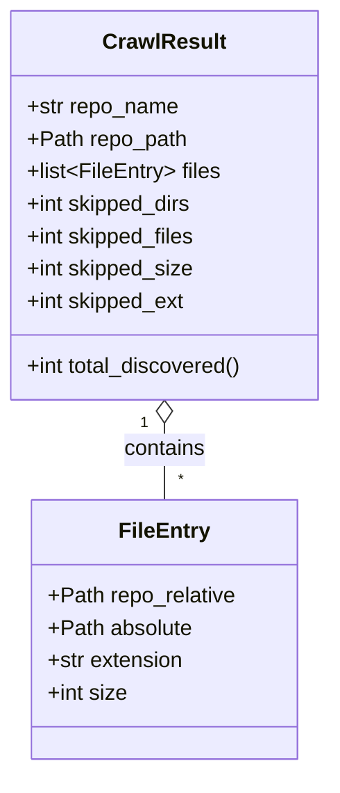

# Diagram: container_tracking_core/container_tracking_service/config/config.qa.yml


> Auto-generated by Obscura crawlers

## Diagram 1



> SVG rendering failed for this diagram.

## Diagram 2

```mermaid
flowchart TD
    CLI[CLI: main()] --> CrawlRepo[crawl_repo(repo_path)]
    CrawlRepo --> CrawlResultObj[CrawlResult]
    CrawlResultObj --> WriteOut[write_output(result)]
    WriteOut --> ProcessEntry[_process_entry / generate_stub]
    ProcessEntry --> RunCopilot[_run_copilot_for_mermaid(code)]
    RunCopilot --> SplitDiags[split_mermaid_diagrams(raw_mermaid)]
    SplitDiags -->|diagrams| ForEachDiags[Per-diagram render]
    ForEachDiags --> TryMMDC[_render_svg_with_mmdc(diagram)]
    TryMMDC --> MmdcOK{mmdc returned SVG?}
    MmdcOK -- yes --> EmbedSVG[embed SVG in Markdown]
    MmdcOK -- no --> Kroki[_render_svg_with_kroki(diagram)]
    Kroki --> EmbedSVG
    EmbedSVG --> WriteMarkdown[write .md file]
    WriteMarkdown --> Index[generate_index(result) & write INDEX.md]
```

> SVG rendering failed for this diagram.
