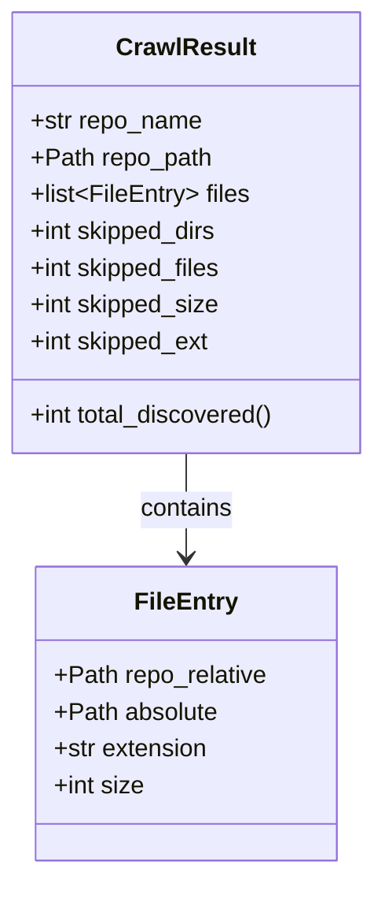
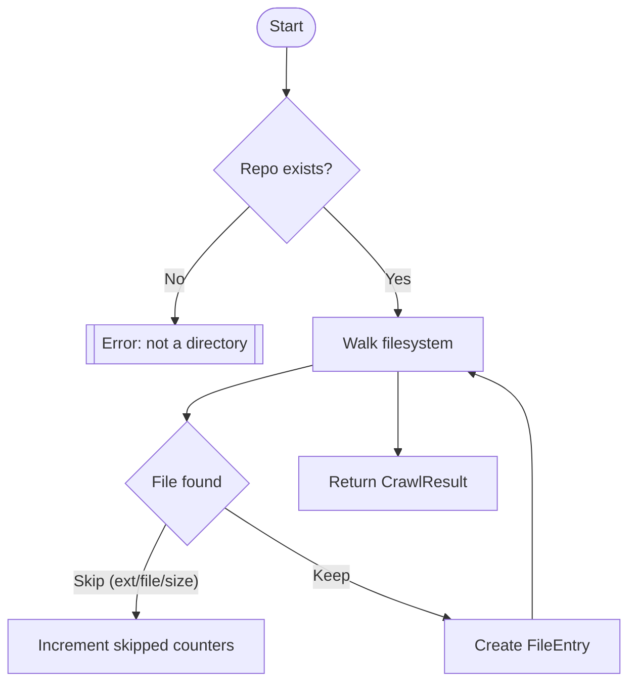
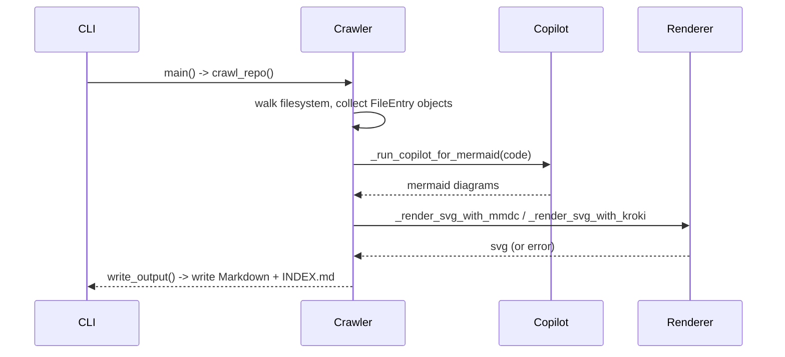

# Diagram: container_tracking_core/container_tracking_service/config/config.staging1.yml

> Auto-generated by Obscura crawlers

## Diagram 1

### SVG

<svg id="container" width="246" xmlns="http://www.w3.org/2000/svg" class="classDiagram" height="570" viewBox="0 0 246 570" role="graphics-document document" aria-roledescription="class"><g><defs><marker id="container_class-aggregationStart" class="marker aggregation class" refX="18" refY="7" markerWidth="190" markerHeight="240" orient="auto"><path d="M 18,7 L9,13 L1,7 L9,1 Z"></path></marker></defs><defs><marker id="container_class-aggregationEnd" class="marker aggregation class" refX="1" refY="7" markerWidth="20" markerHeight="28" orient="auto"><path d="M 18,7 L9,13 L1,7 L9,1 Z"></path></marker></defs><defs><marker id="container_class-extensionStart" class="marker extension class" refX="18" refY="7" markerWidth="190" markerHeight="240" orient="auto"><path d="M 1,7 L18,13 V 1 Z"></path></marker></defs><defs><marker id="container_class-extensionEnd" class="marker extension class" refX="1" refY="7" markerWidth="20" markerHeight="28" orient="auto"><path d="M 1,1 V 13 L18,7 Z"></path></marker></defs><defs><marker id="container_class-compositionStart" class="marker composition class" refX="18" refY="7" markerWidth="190" markerHeight="240" orient="auto"><path d="M 18,7 L9,13 L1,7 L9,1 Z"></path></marker></defs><defs><marker id="container_class-compositionEnd" class="marker composition class" refX="1" refY="7" markerWidth="20" markerHeight="28" orient="auto"><path d="M 18,7 L9,13 L1,7 L9,1 Z"></path></marker></defs><defs><marker id="container_class-dependencyStart" class="marker dependency class" refX="6" refY="7" markerWidth="190" markerHeight="240" orient="auto"><path d="M 5,7 L9,13 L1,7 L9,1 Z"></path></marker></defs><defs><marker id="container_class-dependencyEnd" class="marker dependency class" refX="13" refY="7" markerWidth="20" markerHeight="28" orient="auto"><path d="M 18,7 L9,13 L14,7 L9,1 Z"></path></marker></defs><defs><marker id="container_class-lollipopStart" class="marker lollipop class" refX="13" refY="7" markerWidth="190" markerHeight="240" orient="auto"><circle stroke="black" fill="transparent" cx="7" cy="7" r="6"></circle></marker></defs><defs><marker id="container_class-lollipopEnd" class="marker lollipop class" refX="1" refY="7" markerWidth="190" markerHeight="240" orient="auto"><circle stroke="black" fill="transparent" cx="7" cy="7" r="6"></circle></marker></defs><g class="root"><g class="clusters"></g><g class="edgePaths"><path d="M123,296L123,302.167C123,308.333,123,320.667,123,332C123,343.333,123,353.667,123,358.833L123,364" id="id_CrawlResult_FileEntry_1" class="edge-thickness-normal edge-pattern-solid relation" style=";;;" data-edge="true" data-et="edge" data-id="id_CrawlResult_FileEntry_1" data-points="W3sieCI6MTIzLCJ5IjoyOTZ9LHsieCI6MTIzLCJ5IjozMzN9LHsieCI6MTIzLCJ5IjozNzB9XQ==" marker-end="url(#container_class-dependencyEnd)"></path></g><g class="edgeLabels"><g class="edgeLabel" transform="translate(123, 333)"><g class="label" data-id="id_CrawlResult_FileEntry_1" transform="translate(-30.890625, -12)"><foreignObject width="61.78125" height="24">

contains

</foreignObject></g></g></g><g class="nodes"><g class="node default" id="classId-FileEntry-0" transform="translate(123, 466)"><g class="basic label-container"><path d="M-98.0859375 -96 L98.0859375 -96 L98.0859375 96 L-98.0859375 96" stroke="none" stroke-width="0" fill="#ECECFF" style=""></path><path d="M-98.0859375 -96 C-44.35071019320053 -96, 9.384517113598946 -96, 98.0859375 -96 M-98.0859375 -96 C-22.411122281793226 -96, 53.26369293641355 -96, 98.0859375 -96 M98.0859375 -96 C98.0859375 -55.98057926144233, 98.0859375 -15.96115852288466, 98.0859375 96 M98.0859375 -96 C98.0859375 -33.8781840359901, 98.0859375 28.243631928019795, 98.0859375 96 M98.0859375 96 C30.80203175358716 96, -36.48187399282568 96, -98.0859375 96 M98.0859375 96 C51.82207548128283 96, 5.558213462565661 96, -98.0859375 96 M-98.0859375 96 C-98.0859375 52.069220701682724, -98.0859375 8.138441403365448, -98.0859375 -96 M-98.0859375 96 C-98.0859375 39.04951653005787, -98.0859375 -17.900966939884256, -98.0859375 -96" stroke="#9370DB" stroke-width="1.3" fill="none" stroke-dasharray="0 0" style=""></path></g><g class="annotation-group text" transform="translate(0, -72)"></g><g class="label-group text" transform="translate(-31.859375, -72)"><g class="label" style="font-weight: bolder" transform="translate(0,-12)"><foreignObject width="63.71875" height="24">

FileEntry

</foreignObject></g></g><g class="members-group text" transform="translate(-86.0859375, -24)"><g class="label" style="" transform="translate(0,-12)"><foreignObject width="140.3125" height="24">

+Path repo_relative

</foreignObject></g><g class="label" style="" transform="translate(0,12)"><foreignObject width="107.78125" height="24">

+Path absolute

</foreignObject></g><g class="label" style="" transform="translate(0,36)"><foreignObject width="102.328125" height="24">

+str extension

</foreignObject></g><g class="label" style="" transform="translate(0,60)"><foreignObject width="59.484375" height="24">

+int size

</foreignObject></g></g><g class="methods-group text" transform="translate(-86.0859375, 96)"></g><g class="divider" style=""><path d="M-98.0859375 -48 C-55.0612066351352 -48, -12.0364757702704 -48, 98.0859375 -48 M-98.0859375 -48 C-48.17857160860606 -48, 1.7287942827878737 -48, 98.0859375 -48" stroke="#9370DB" stroke-width="1.3" fill="none" stroke-dasharray="0 0" style=""></path></g><g class="divider" style=""><path d="M-98.0859375 72 C-31.957477472426774 72, 34.17098255514645 72, 98.0859375 72 M-98.0859375 72 C-46.84482141875054 72, 4.396294662498917 72, 98.0859375 72" stroke="#9370DB" stroke-width="1.3" fill="none" stroke-dasharray="0 0" style=""></path></g></g><g class="node default" id="classId-CrawlResult-1" transform="translate(123, 152)"><g class="basic label-container"><path d="M-115 -144 L115 -144 L115 144 L-115 144" stroke="none" stroke-width="0" fill="#ECECFF" style=""></path><path d="M-115 -144 C-24.739668824719416 -144, 65.52066235056117 -144, 115 -144 M-115 -144 C-31.356034740897414 -144, 52.28793051820517 -144, 115 -144 M115 -144 C115 -70.0684651401528, 115 3.8630697196944084, 115 144 M115 -144 C115 -58.22211685371332, 115 27.555766292573367, 115 144 M115 144 C59.02115573850735 144, 3.0423114770147066 144, -115 144 M115 144 C29.527182331905763 144, -55.945635336188474 144, -115 144 M-115 144 C-115 31.80717370724541, -115 -80.38565258550918, -115 -144 M-115 144 C-115 69.30884214768095, -115 -5.382315704638103, -115 -144" stroke="#9370DB" stroke-width="1.3" fill="none" stroke-dasharray="0 0" style=""></path></g><g class="annotation-group text" transform="translate(0, -120)"></g><g class="label-group text" transform="translate(-43.28125, -120)"><g class="label" style="font-weight: bolder" transform="translate(0,-12)"><foreignObject width="86.5625" height="24">

CrawlResult

</foreignObject></g></g><g class="members-group text" transform="translate(-103, -72)"><g class="label" style="" transform="translate(0,-12)"><foreignObject width="113.4375" height="24">

+str repo_name

</foreignObject></g><g class="label" style="" transform="translate(0,12)"><foreignObject width="118.96875" height="24">

+Path repo_path

</foreignObject></g><g class="label" style="" transform="translate(0,36)"><foreignObject width="143.421875" height="24">

+list&lt;FileEntry&gt; files

</foreignObject></g><g class="label" style="" transform="translate(0,60)"><foreignObject width="124.859375" height="24">

+int skipped_dirs

</foreignObject></g><g class="label" style="" transform="translate(0,84)"><foreignObject width="127.375" height="24">

+int skipped_files

</foreignObject></g><g class="label" style="" transform="translate(0,108)"><foreignObject width="125.265625" height="24">

+int skipped_size

</foreignObject></g><g class="label" style="" transform="translate(0,132)"><foreignObject width="119.484375" height="24">

+int skipped_ext

</foreignObject></g></g><g class="methods-group text" transform="translate(-103, 120)"><g class="label" style="" transform="translate(0,-12)"><foreignObject width="162.71875" height="24">

+int total_discovered()

</foreignObject></g></g><g class="divider" style=""><path d="M-115 -96 C-52.51576878153563 -96, 9.968462436928746 -96, 115 -96 M-115 -96 C-46.029485305517426 -96, 22.94102938896515 -96, 115 -96" stroke="#9370DB" stroke-width="1.3" fill="none" stroke-dasharray="0 0" style=""></path></g><g class="divider" style=""><path d="M-115 96 C-46.18394064408105 96, 22.632118711837904 96, 115 96 M-115 96 C-24.517610421185495 96, 65.96477915762901 96, 115 96" stroke="#9370DB" stroke-width="1.3" fill="none" stroke-dasharray="0 0" style=""></path></g></g></g></g></g></svg>

## Diagram 2

### SVG

<svg id="container" width="630.53515625" xmlns="http://www.w3.org/2000/svg" class="flowchart" height="704.875" viewBox="0 0 630.53515625 704.875" role="graphics-document document" aria-roledescription="flowchart-v2"><g><marker id="container_flowchart-v2-pointEnd" class="marker flowchart-v2" viewBox="0 0 10 10" refX="5" refY="5" markerUnits="userSpaceOnUse" markerWidth="8" markerHeight="8" orient="auto"><path d="M 0 0 L 10 5 L 0 10 z" class="arrowMarkerPath" style="stroke-width: 1; stroke-dasharray: 1, 0;"></path></marker><marker id="container_flowchart-v2-pointStart" class="marker flowchart-v2" viewBox="0 0 10 10" refX="4.5" refY="5" markerUnits="userSpaceOnUse" markerWidth="8" markerHeight="8" orient="auto"><path d="M 0 5 L 10 10 L 10 0 z" class="arrowMarkerPath" style="stroke-width: 1; stroke-dasharray: 1, 0;"></path></marker><marker id="container_flowchart-v2-circleEnd" class="marker flowchart-v2" viewBox="0 0 10 10" refX="11" refY="5" markerUnits="userSpaceOnUse" markerWidth="11" markerHeight="11" orient="auto"><circle cx="5" cy="5" r="5" class="arrowMarkerPath" style="stroke-width: 1; stroke-dasharray: 1, 0;"></circle></marker><marker id="container_flowchart-v2-circleStart" class="marker flowchart-v2" viewBox="0 0 10 10" refX="-1" refY="5" markerUnits="userSpaceOnUse" markerWidth="11" markerHeight="11" orient="auto"><circle cx="5" cy="5" r="5" class="arrowMarkerPath" style="stroke-width: 1; stroke-dasharray: 1, 0;"></circle></marker><marker id="container_flowchart-v2-crossEnd" class="marker cross flowchart-v2" viewBox="0 0 11 11" refX="12" refY="5.2" markerUnits="userSpaceOnUse" markerWidth="11" markerHeight="11" orient="auto"><path d="M 1,1 l 9,9 M 10,1 l -9,9" class="arrowMarkerPath" style="stroke-width: 2; stroke-dasharray: 1, 0;"></path></marker><marker id="container_flowchart-v2-crossStart" class="marker cross flowchart-v2" viewBox="0 0 11 11" refX="-1" refY="5.2" markerUnits="userSpaceOnUse" markerWidth="11" markerHeight="11" orient="auto"><path d="M 1,1 l 9,9 M 10,1 l -9,9" class="arrowMarkerPath" style="stroke-width: 2; stroke-dasharray: 1, 0;"></path></marker><g class="root"><g class="clusters"></g><g class="edgePaths"><path d="M289.5,47.5L289.417,51.583C289.333,55.667,289.167,63.833,289.083,71.417C289,79,289,86,289,89.5L289,93" id="L_Start_CheckRepo_0" class="edge-thickness-normal edge-pattern-solid edge-thickness-normal edge-pattern-solid flowchart-link" style=";" data-edge="true" data-et="edge" data-id="L_Start_CheckRepo_0" data-points="W3sieCI6Mjg5LjUsInkiOjQ3LjV9LHsieCI6Mjg5LCJ5Ijo3Mn0seyJ4IjoyODksInkiOjk3fV0=" marker-end="url(#container_flowchart-v2-pointEnd)"></path><path d="M252.36,204.047L239.586,216.321C226.812,228.594,201.263,253.141,188.565,272.248C175.867,291.354,176.019,305.021,176.094,311.854L176.17,318.688" id="L_CheckRepo_Error_0" class="edge-thickness-normal edge-pattern-solid edge-thickness-normal edge-pattern-solid flowchart-link" style=";" data-edge="true" data-et="edge" data-id="L_CheckRepo_Error_0" data-points="W3sieCI6MjUyLjM1OTg3NzAxMTM0MjY2LCJ5IjoyMDQuMDQ3Mzc3MDExMzQyNjZ9LHsieCI6MTc1LjcxNDg0Mzc1LCJ5IjoyNzcuNjg3NX0seyJ4IjoxNzYuMjE0ODQzNzUsInkiOjMyMi42ODc1fV0=" marker-end="url(#container_flowchart-v2-pointEnd)"></path><path d="M325.64,204.047L338.414,216.321C351.188,228.594,376.737,253.141,389.511,270.914C402.285,288.688,402.285,299.688,402.285,305.188L402.285,310.688" id="L_CheckRepo_Walk_0" class="edge-thickness-normal edge-pattern-solid edge-thickness-normal edge-pattern-solid flowchart-link" style=";" data-edge="true" data-et="edge" data-id="L_CheckRepo_Walk_0" data-points="W3sieCI6MzI1LjY0MDEyMjk4ODY1NzM3LCJ5IjoyMDQuMDQ3Mzc3MDExMzQyNjZ9LHsieCI6NDAyLjI4NTE1NjI1LCJ5IjoyNzcuNjg3NX0seyJ4Ijo0MDIuMjg1MTU2MjUsInkiOjMxNC42ODc1fV0=" marker-end="url(#container_flowchart-v2-pointEnd)"></path><path d="M316.613,362.713L295.578,367.875C274.543,373.038,232.473,383.363,211.438,392.025C190.402,400.688,190.402,407.688,190.402,411.188L190.402,414.688" id="L_Walk_FileLoop_0" class="edge-thickness-normal edge-pattern-solid edge-thickness-normal edge-pattern-solid flowchart-link" style=";" data-edge="true" data-et="edge" data-id="L_Walk_FileLoop_0" data-points="W3sieCI6MzE2LjYxMzI4MTI1LCJ5IjozNjIuNzEyOTc4NDExNTYzfSx7IngiOjE5MC40MDIzNDM3NSwieSI6MzkzLjY4NzV9LHsieCI6MTkwLjQwMjM0Mzc1LCJ5Ijo0MTguNjg3NX1d" marker-end="url(#container_flowchart-v2-pointEnd)"></path><path d="M168.721,523.194L163.601,532.974C158.481,542.754,148.24,562.315,143.12,577.595C138,592.875,138,603.875,138,609.375L138,614.875" id="L_FileLoop_Increment_0" class="edge-thickness-normal edge-pattern-solid edge-thickness-normal edge-pattern-solid flowchart-link" style=";" data-edge="true" data-et="edge" data-id="L_FileLoop_Increment_0" data-points="W3sieCI6MTY4LjcyMTM5MjQ4OTcyMTgsInkiOjUyMy4xOTQwNDg3Mzk3MjE4fSx7IngiOjEzOCwieSI6NTgxLjg3NX0seyJ4IjoxMzgsInkiOjYxOC44NzV9XQ==" marker-end="url(#container_flowchart-v2-pointEnd)"></path><path d="M228.622,506.655L247.885,519.192C267.148,531.729,305.673,556.802,344.935,577.26C384.196,597.717,424.193,613.56,444.191,621.481L464.189,629.402" id="L_FileLoop_CreateEntry_0" class="edge-thickness-normal edge-pattern-solid edge-thickness-normal edge-pattern-solid flowchart-link" style=";" data-edge="true" data-et="edge" data-id="L_FileLoop_CreateEntry_0" data-points="W3sieCI6MjI4LjYyMjAzNjExNTY4NDA0LCJ5Ijo1MDYuNjU1MzA3NjM0MzE1OTN9LHsieCI6MzQ0LjE5OTIxODc1LCJ5Ijo1ODEuODc1fSx7IngiOjQ2Ny45MDgxMDAzMjg5NDc0LCJ5Ijo2MzAuODc1fV0=" marker-end="url(#container_flowchart-v2-pointEnd)"></path><path d="M536.074,630.875L536.074,622.708C536.074,614.542,536.074,598.208,536.074,573.359C536.074,548.51,536.074,515.146,536.074,483.781C536.074,452.417,536.074,423.052,525.975,404.445C515.876,385.837,495.679,377.987,485.58,374.062L475.481,370.137" id="L_CreateEntry_Walk_0" class="edge-thickness-normal edge-pattern-solid edge-thickness-normal edge-pattern-solid flowchart-link" style=";" data-edge="true" data-et="edge" data-id="L_CreateEntry_Walk_0" data-points="W3sieCI6NTM2LjA3NDIxODc1LCJ5Ijo2MzAuODc1fSx7IngiOjUzNi4wNzQyMTg3NSwieSI6NTgxLjg3NX0seyJ4Ijo1MzYuMDc0MjE4NzUsInkiOjQ4MS43ODEyNX0seyJ4Ijo1MzYuMDc0MjE4NzUsInkiOjM5My42ODc1fSx7IngiOjQ3MS43NTI1NTQwODY1Mzg0NSwieSI6MzY4LjY4NzV9XQ==" marker-end="url(#container_flowchart-v2-pointEnd)"></path><path d="M402.285,368.688L402.285,372.854C402.285,377.021,402.285,385.354,402.285,399.036C402.285,412.719,402.285,431.75,402.285,441.266L402.285,450.781" id="L_Walk_Return_0" class="edge-thickness-normal edge-pattern-solid edge-thickness-normal edge-pattern-solid flowchart-link" style=";" data-edge="true" data-et="edge" data-id="L_Walk_Return_0" data-points="W3sieCI6NDAyLjI4NTE1NjI1LCJ5IjozNjguNjg3NX0seyJ4Ijo0MDIuMjg1MTU2MjUsInkiOjM5My42ODc1fSx7IngiOjQwMi4yODUxNTYyNSwieSI6NDU0Ljc4MTI1fV0=" marker-end="url(#container_flowchart-v2-pointEnd)"></path></g><g class="edgeLabels"><g class="edgeLabel"><g class="label" data-id="L_Start_CheckRepo_0" transform="translate(0, 0)"><foreignObject width="0" height="0">

</foreignObject></g></g><g class="edgeLabel" transform="translate(175.71484375, 277.6875)"><g class="label" data-id="L_CheckRepo_Error_0" transform="translate(-10.140625, -12)"><foreignObject width="20.28125" height="24">

No

</foreignObject></g></g><g class="edgeLabel" transform="translate(402.28515625, 277.6875)"><g class="label" data-id="L_CheckRepo_Walk_0" transform="translate(-12.03125, -12)"><foreignObject width="24.0625" height="24">

Yes

</foreignObject></g></g><g class="edgeLabel"><g class="label" data-id="L_Walk_FileLoop_0" transform="translate(0, 0)"><foreignObject width="0" height="0">

</foreignObject></g></g><g class="edgeLabel" transform="translate(138, 581.875)"><g class="label" data-id="L_FileLoop_Increment_0" transform="translate(-66.7265625, -12)"><foreignObject width="133.453125" height="24">

Skip (ext/file/size)

</foreignObject></g></g><g class="edgeLabel" transform="translate(342.17131, 580.5552)"><g class="label" data-id="L_FileLoop_CreateEntry_0" transform="translate(-18.078125, -12)"><foreignObject width="36.15625" height="24">

Keep

</foreignObject></g></g><g class="edgeLabel"><g class="label" data-id="L_CreateEntry_Walk_0" transform="translate(0, 0)"><foreignObject width="0" height="0">

</foreignObject></g></g><g class="edgeLabel"><g class="label" data-id="L_Walk_Return_0" transform="translate(0, 0)"><foreignObject width="0" height="0">

</foreignObject></g></g></g><g class="nodes"><g class="node default" id="flowchart-Start-0" transform="translate(289, 27.5)"><g class="basic label-container outer-path"><path d="M-10.3984375 -19.5 C-2.334933137496396 -19.5, 5.728571225007208 -19.5, 10.3984375 -19.5 C10.3984375 -19.5, 10.398437499999998 -19.5, 10.398437499999998 -19.5 C10.750604800049173 -19.48870668013949, 11.102772100098347 -19.477413360278977, 11.6478067896239 -19.45993515863156 C12.062020161939516 -19.419976492768736, 12.476233534255133 -19.380017826905913, 12.892042152847864 -19.3399052695533 C13.380545984495075 -19.260927758456372, 13.869049816142287 -19.18195024735945, 14.126030759676757 -19.140403561325776 C14.388012143928794 -19.08060801995855, 14.649993528180831 -19.020812478591324, 15.34470188623539 -18.862249829261074 C15.654698617091416 -18.770244426749052, 15.964695347947444 -18.67823902423703, 16.543047751460602 -18.50658706670804 C16.827719816310694 -18.401825115363486, 17.112391881160786 -18.29706316401893, 17.716144095147794 -18.074876768247425 C18.076029446674198 -17.915566198746333, 18.4359147982006 -17.756255629245242, 18.85917041279238 -17.568892924097174 C19.264331325806523 -17.357520735295648, 19.669492238820666 -17.14614854649412, 19.967429764076783 -16.990714730406097 C20.26801059615917 -16.808500863588716, 20.568591428241557 -16.626286996771334, 21.036368073605697 -16.342718045390892 C21.263806319420357 -16.184066970753562, 21.491244565235014 -16.025415896116236, 22.061592844578712 -15.627565626425154 C22.3853507886516 -15.369377281587749, 22.709108732724488 -15.111188936750342, 23.03889120850187 -14.848196188198123 C23.231961358451674 -14.672854986369948, 23.425031508401478 -14.497513784541775, 23.964247236767985 -14.007812326905688 C24.264040465583616 -13.698251204671713, 24.56383369439925 -13.388690082437739, 24.833858442968648 -13.10986736009568 C25.14479480603805 -12.744623815254089, 25.45573116910745 -12.379380270412497, 25.644151408126582 -12.158051136245305 C25.87040872429994 -11.854886945038547, 26.096666040473295 -11.551722753831791, 26.391796464640635 -11.156274872382312 C26.5496178790253 -10.913818798903812, 26.70743929340996 -10.671362725425311, 27.073721378604247 -10.108655082055241 C27.29508751974999 -9.7155970826985, 27.51645366089574 -9.322539083341756, 27.6871239742735 -9.019496659696287 C27.860547693560612 -8.659378595923448, 28.033971412847723 -8.299260532150607, 28.22948364880834 -7.893275190886684 C28.337020782360828 -7.627656391923002, 28.444557915913315 -7.36203759295932, 28.698571729970325 -6.734618561215508 C28.821189509879122 -6.36531334462033, 28.94380728978792 -5.996008128025152, 29.09246063421488 -5.548287939305138 C29.1961663180423 -5.152813220543489, 29.299872001869726 -4.75733850178184, 29.40953178754556 -4.339158212148133 C29.4655500879285 -4.051516079153719, 29.52156838831144 -3.7638739461593045, 29.648482276581777 -3.1121979531509023 C29.68670045650155 -2.815785296726385, 29.724918636421325 -2.5193726403018672, 29.808330202509367 -1.872449005199798 C29.83855389871888 -1.4016905406081444, 29.868777594928392 -0.9309320760164909, 29.888418715913414 -0.6250057626472757 C29.888418715913414 -0.22030493305397464, 29.888418715913414 0.18439589653932642, 29.888418715913414 0.625005762647271 C29.871172335618546 0.8936320567674412, 29.853925955323678 1.1622583508876114, 29.808330202509367 1.8724490051997846 C29.775443710476843 2.1275101432316523, 29.74255721844432 2.38257128126352, 29.648482276581777 3.1121979531508885 C29.596442990214953 3.3794086901374656, 29.54440370384813 3.646619427124043, 29.40953178754556 4.339158212148129 C29.34592398524747 4.581722330106648, 29.28231618294938 4.824286448065167, 29.092460634214884 5.548287939305125 C28.935720185429858 6.02036519784654, 28.77897973664483 6.4924424563879555, 28.69857172997033 6.734618561215495 C28.558255521024048 7.081202310142161, 28.417939312077763 7.4277860590688265, 28.229483648808344 7.893275190886679 C28.04545997201286 8.27540429322841, 27.86143629521738 8.657533395570143, 27.687123974273504 9.019496659696284 C27.490066177034123 9.36939273296054, 27.293008379794742 9.719288806224796, 27.07372137860425 10.108655082055236 C26.816776567435507 10.503391311353045, 26.55983175626676 10.898127540650853, 26.39179646464064 11.156274872382301 C26.13759603918403 11.496880284358998, 25.883395613727412 11.837485696335694, 25.644151408126582 12.158051136245302 C25.418242214819767 12.423416929300743, 25.19233302151295 12.688782722356182, 24.83385844296866 13.10986736009567 C24.524427337835956 13.429380380911383, 24.21499623270325 13.748893401727095, 23.96424723676799 14.007812326905684 C23.684360214072694 14.261998315512734, 23.4044731913774 14.516184304119786, 23.038891208501887 14.848196188198111 C22.722197580031114 15.100750929332163, 22.405503951560345 15.353305670466215, 22.061592844578715 15.627565626425152 C21.66898631898694 15.901430943015406, 21.27637979339516 16.17529625960566, 21.036368073605708 16.34271804539089 C20.714624818803994 16.537760697224925, 20.39288156400228 16.732803349058962, 19.967429764076787 16.990714730406093 C19.65274826764262 17.15488386553268, 19.33806677120846 17.319053000659263, 18.859170412792388 17.56889292409717 C18.556160253946594 17.7030265329412, 18.253150095100796 17.837160141785237, 17.716144095147804 18.07487676824742 C17.330652678390543 18.216741173057684, 16.94516126163328 18.35860557786795, 16.543047751460616 18.506587066708033 C16.146636159381714 18.624239946430144, 15.75022456730281 18.741892826152256, 15.344701886235413 18.86224982926107 C15.015283821362408 18.937437352914564, 14.685865756489402 19.012624876568058, 14.126030759676766 19.140403561325773 C13.8194991134435 19.189961220700347, 13.512967467210235 19.23951888007492, 12.892042152847878 19.3399052695533 C12.482824638308829 19.379381991024815, 12.07360712376978 19.41885871249633, 11.6478067896239 19.45993515863156 C11.195763679743244 19.474431301316894, 10.74372056986259 19.488927444002233, 10.398437500000004 19.5 C10.398437500000002 19.5, 10.398437500000002 19.5, 10.3984375 19.5 C5.452680517661452 19.5, 0.5069235353229047 19.5, -10.398437499999996 19.5 C-10.880035482481675 19.48455609007542, -11.361633464963353 19.469112180150837, -11.647806789623893 19.45993515863156 C-11.906093863093066 19.43501851528964, -12.164380936562239 19.410101871947724, -12.892042152847871 19.3399052695533 C-13.263064074907271 19.279921322512713, -13.634085996966673 19.219937375472128, -14.126030759676759 19.140403561325773 C-14.400579660283285 19.077739566361345, -14.675128560889808 19.015075571396913, -15.344701886235388 18.862249829261074 C-15.80954754939972 18.72428607645858, -16.274393212564053 18.586322323656084, -16.54304775146059 18.506587066708043 C-16.828521168612827 18.40153021030868, -17.11399458576506 18.296473353909317, -17.716144095147797 18.074876768247425 C-18.16088947960674 17.878001179450536, -18.60563486406569 17.681125590653643, -18.85917041279238 17.568892924097174 C-19.214561271999905 17.38348574048732, -19.56995213120743 17.198078556877462, -19.96742976407678 16.990714730406097 C-20.35353364972744 16.75665628592638, -20.739637535378098 16.522597841446665, -21.036368073605686 16.3427180453909 C-21.388526901937528 16.097067291456586, -21.740685730269366 15.851416537522272, -22.061592844578712 15.627565626425156 C-22.39097245301347 15.364894153857927, -22.72035206144823 15.1022226812907, -23.03889120850187 14.848196188198125 C-23.30916519400102 14.602740505625587, -23.579439179500174 14.357284823053046, -23.964247236767974 14.007812326905697 C-24.22629543143241 13.737226051357773, -24.48834362609684 13.466639775809849, -24.833858442968655 13.109867360095677 C-25.0922974023939 12.806290252761402, -25.350736361819145 12.502713145427126, -25.64415140812658 12.158051136245307 C-25.88003926793316 11.841982893930606, -26.115927127739738 11.525914651615905, -26.391796464640635 11.156274872382316 C-26.652189369746086 10.75624144485486, -26.912582274851534 10.356208017327404, -27.073721378604244 10.108655082055249 C-27.22075668068912 9.847579014264715, -27.367791982773994 9.586502946474182, -27.6871239742735 9.019496659696289 C-27.889320273805904 8.599631717409505, -28.091516573338307 8.17976677512272, -28.22948364880834 7.893275190886686 C-28.35235323097689 7.5897849474085985, -28.475222813145443 7.286294703930511, -28.698571729970325 6.73461856121551 C-28.83013544778024 6.338369605003803, -28.961699165590154 5.942120648792095, -29.09246063421488 5.5482879393051325 C-29.19259139877199 5.166445937100999, -29.2927221633291 4.7846039348968645, -29.409531787545557 4.339158212148136 C-29.46443765039066 4.05722821079676, -29.51934351323576 3.775298209445384, -29.648482276581777 3.112197953150904 C-29.681281126633028 2.857816549018917, -29.714079976684282 2.60343514488693, -29.808330202509364 1.872449005199809 C-29.833249248043828 1.4843147567090216, -29.85816829357829 1.096180508218234, -29.888418715913414 0.6250057626472781 C-29.888418715913414 0.23193070062769305, -29.888418715913414 -0.16114436139189203, -29.888418715913414 -0.6250057626472687 C-29.869093158585603 -0.9260169173370241, -29.849767601257792 -1.2270280720267794, -29.808330202509367 -1.8724490051997822 C-29.764020771087498 -2.216104205420886, -29.71971133966563 -2.55975940564199, -29.648482276581777 -3.112197953150895 C-29.578223771086343 -3.472960529729562, -29.507965265590904 -3.8337231063082293, -29.40953178754556 -4.339158212148126 C-29.314018239978605 -4.703392764854301, -29.21850469241165 -5.0676273175604765, -29.092460634214884 -5.548287939305123 C-28.98537280453206 -5.870819420181221, -28.87828497484923 -6.19335090105732, -28.698571729970332 -6.734618561215485 C-28.602121022173186 -6.972853674222011, -28.505670314376044 -7.211088787228538, -28.229483648808344 -7.893275190886676 C-28.110779468626387 -8.139766960897088, -27.99207528844443 -8.3862587309075, -27.687123974273504 -9.019496659696282 C-27.531144577717377 -9.296453872908298, -27.37516518116125 -9.573411086120315, -27.073721378604247 -10.108655082055243 C-26.888334602614663 -10.39345895329492, -26.70294782662508 -10.678262824534595, -26.39179646464064 -11.156274872382308 C-26.133498066093278 -11.50237119496758, -25.875199667545914 -11.848467517552852, -25.644151408126586 -12.158051136245302 C-25.3480752878756 -12.505838994300614, -25.05199916762461 -12.853626852355925, -24.833858442968662 -13.10986736009567 C-24.50827696665498 -13.446056965125878, -24.182695490341292 -13.782246570156085, -23.964247236767996 -14.007812326905677 C-23.68719644413089 -14.259422526416415, -23.410145651493785 -14.511032725927153, -23.038891208501887 -14.848196188198107 C-22.75319272352679 -15.076033127209767, -22.467494238551694 -15.303870066221428, -22.06159284457872 -15.627565626425149 C-21.69165594340612 -15.885617594372809, -21.32171904223352 -16.14366956232047, -21.03636807360571 -16.342718045390885 C-20.76379483042222 -16.507953547226894, -20.491221587238734 -16.6731890490629, -19.96742976407679 -16.99071473040609 C-19.59328252797851 -17.185907103825823, -19.219135291880225 -17.381099477245552, -18.859170412792388 -17.56889292409717 C-18.40490672987256 -17.7699819812724, -17.95064304695273 -17.971071038447633, -17.716144095147804 -18.07487676824742 C-17.355770857781 -18.20749745085209, -16.995397620414195 -18.340118133456766, -16.54304775146062 -18.506587066708033 C-16.09797504591137 -18.638682309480746, -15.65290234036212 -18.770777552253456, -15.344701886235413 -18.862249829261067 C-14.961081649015265 -18.949808645050567, -14.577461411795117 -19.03736746084007, -14.126030759676768 -19.140403561325773 C-13.783583266780285 -19.195767816257305, -13.441135773883804 -19.251132071188838, -12.89204215284788 -19.3399052695533 C-12.43888618563582 -19.38362068071046, -11.985730218423761 -19.42733609186762, -11.647806789623903 -19.45993515863156 C-11.381394428995309 -19.468478484496718, -11.114982068366714 -19.477021810361872, -10.398437500000005 -19.5 C-10.398437500000004 -19.5, -10.398437500000002 -19.5, -10.3984375 -19.5" stroke="none" stroke-width="0" fill="#ECECFF" style=""></path><path d="M-10.3984375 -19.5 C-6.225596119456328 -19.5, -2.0527547389126557 -19.5, 10.3984375 -19.5 M-10.3984375 -19.5 C-3.421540164554216 -19.5, 3.5553571708915683 -19.5, 10.3984375 -19.5 M10.3984375 -19.5 C10.3984375 -19.5, 10.398437499999998 -19.5, 10.398437499999998 -19.5 M10.3984375 -19.5 C10.3984375 -19.5, 10.3984375 -19.5, 10.398437499999998 -19.5 M10.398437499999998 -19.5 C10.75584249927811 -19.48853871731978, 11.11324749855622 -19.47707743463956, 11.6478067896239 -19.45993515863156 M10.398437499999998 -19.5 C10.781569332543622 -19.4877137078512, 11.164701165087248 -19.475427415702395, 11.6478067896239 -19.45993515863156 M11.6478067896239 -19.45993515863156 C12.027233975885698 -19.423332274300837, 12.406661162147497 -19.386729389970117, 12.892042152847864 -19.3399052695533 M11.6478067896239 -19.45993515863156 C12.009530172790937 -19.42504013889345, 12.371253555957974 -19.390145119155342, 12.892042152847864 -19.3399052695533 M12.892042152847864 -19.3399052695533 C13.173302283553605 -19.294433312825685, 13.454562414259346 -19.24896135609807, 14.126030759676757 -19.140403561325776 M12.892042152847864 -19.3399052695533 C13.247780959498986 -19.282392178089594, 13.603519766150107 -19.22487908662589, 14.126030759676757 -19.140403561325776 M14.126030759676757 -19.140403561325776 C14.577091795786647 -19.037451823282034, 15.028152831896536 -18.93450008523829, 15.34470188623539 -18.862249829261074 M14.126030759676757 -19.140403561325776 C14.398634630326274 -19.078183506756528, 14.671238500975791 -19.01596345218728, 15.34470188623539 -18.862249829261074 M15.34470188623539 -18.862249829261074 C15.651492507185427 -18.771195983339936, 15.958283128135465 -18.680142137418795, 16.543047751460602 -18.50658706670804 M15.34470188623539 -18.862249829261074 C15.776833625877028 -18.733995397241227, 16.208965365518665 -18.605740965221376, 16.543047751460602 -18.50658706670804 M16.543047751460602 -18.50658706670804 C16.982854232886773 -18.34473421601666, 17.422660714312943 -18.182881365325283, 17.716144095147794 -18.074876768247425 M16.543047751460602 -18.50658706670804 C16.879166894291608 -18.382892115094933, 17.21528603712261 -18.259197163481826, 17.716144095147794 -18.074876768247425 M17.716144095147794 -18.074876768247425 C18.02415016308476 -17.938531618647108, 18.332156231021727 -17.80218646904679, 18.85917041279238 -17.568892924097174 M17.716144095147794 -18.074876768247425 C17.954513617250036 -17.969357651793402, 18.192883139352276 -17.863838535339383, 18.85917041279238 -17.568892924097174 M18.85917041279238 -17.568892924097174 C19.266863411477136 -17.35619974782317, 19.674556410161887 -17.14350657154916, 19.967429764076783 -16.990714730406097 M18.85917041279238 -17.568892924097174 C19.25011027196902 -17.364939849973652, 19.641050131145658 -17.160986775850134, 19.967429764076783 -16.990714730406097 M19.967429764076783 -16.990714730406097 C20.209112907781666 -16.844204988404396, 20.45079605148655 -16.69769524640269, 21.036368073605697 -16.342718045390892 M19.967429764076783 -16.990714730406097 C20.247851708097492 -16.82072129999848, 20.5282736521182 -16.650727869590863, 21.036368073605697 -16.342718045390892 M21.036368073605697 -16.342718045390892 C21.430210755095747 -16.067990439958333, 21.824053436585793 -15.793262834525773, 22.061592844578712 -15.627565626425154 M21.036368073605697 -16.342718045390892 C21.24364185138526 -16.198132830749095, 21.450915629164818 -16.0535476161073, 22.061592844578712 -15.627565626425154 M22.061592844578712 -15.627565626425154 C22.42598910886819 -15.336969302646136, 22.790385373157665 -15.046372978867119, 23.03889120850187 -14.848196188198123 M22.061592844578712 -15.627565626425154 C22.35288675621732 -15.395266483549902, 22.644180667855927 -15.16296734067465, 23.03889120850187 -14.848196188198123 M23.03889120850187 -14.848196188198123 C23.397289401328848 -14.522708432169209, 23.755687594155823 -14.197220676140295, 23.964247236767985 -14.007812326905688 M23.03889120850187 -14.848196188198123 C23.352097668875402 -14.563750367875711, 23.665304129248934 -14.279304547553298, 23.964247236767985 -14.007812326905688 M23.964247236767985 -14.007812326905688 C24.18989328425855 -13.774814256986648, 24.415539331749113 -13.541816187067607, 24.833858442968648 -13.10986736009568 M23.964247236767985 -14.007812326905688 C24.227148500589156 -13.736345187415152, 24.490049764410323 -13.464878047924616, 24.833858442968648 -13.10986736009568 M24.833858442968648 -13.10986736009568 C25.140929807556923 -12.749163862394663, 25.4480011721452 -12.388460364693646, 25.644151408126582 -12.158051136245305 M24.833858442968648 -13.10986736009568 C25.042686793272622 -12.864565697158879, 25.251515143576597 -12.619264034222079, 25.644151408126582 -12.158051136245305 M25.644151408126582 -12.158051136245305 C25.877689539382285 -11.845131316124105, 26.111227670637984 -11.532211496002905, 26.391796464640635 -11.156274872382312 M25.644151408126582 -12.158051136245305 C25.91084312969649 -11.800708525457278, 26.1775348512664 -11.443365914669249, 26.391796464640635 -11.156274872382312 M26.391796464640635 -11.156274872382312 C26.634372010793328 -10.783613692837084, 26.876947556946018 -10.410952513291855, 27.073721378604247 -10.108655082055241 M26.391796464640635 -11.156274872382312 C26.532395174637443 -10.940277497787234, 26.672993884634256 -10.724280123192155, 27.073721378604247 -10.108655082055241 M27.073721378604247 -10.108655082055241 C27.243140497406607 -9.807834281075587, 27.41255961620897 -9.507013480095935, 27.6871239742735 -9.019496659696287 M27.073721378604247 -10.108655082055241 C27.27199586937166 -9.75659864622838, 27.47027036013908 -9.404542210401518, 27.6871239742735 -9.019496659696287 M27.6871239742735 -9.019496659696287 C27.888540058218204 -8.601251851771302, 28.089956142162908 -8.183007043846317, 28.22948364880834 -7.893275190886684 M27.6871239742735 -9.019496659696287 C27.880172220846525 -8.61862784511663, 28.07322046741955 -8.217759030536971, 28.22948364880834 -7.893275190886684 M28.22948364880834 -7.893275190886684 C28.35066339390182 -7.593958877654802, 28.4718431389953 -7.2946425644229205, 28.698571729970325 -6.734618561215508 M28.22948364880834 -7.893275190886684 C28.40094990812392 -7.469750215302607, 28.572416167439496 -7.04622523971853, 28.698571729970325 -6.734618561215508 M28.698571729970325 -6.734618561215508 C28.788725069955216 -6.463091065165073, 28.87887840994011 -6.191563569114637, 29.09246063421488 -5.548287939305138 M28.698571729970325 -6.734618561215508 C28.796216020384566 -6.440529515992744, 28.893860310798804 -6.1464404707699805, 29.09246063421488 -5.548287939305138 M29.09246063421488 -5.548287939305138 C29.207306882667773 -5.11032941927532, 29.32215313112067 -4.672370899245502, 29.40953178754556 -4.339158212148133 M29.09246063421488 -5.548287939305138 C29.212109269180843 -5.092015838133505, 29.331757904146805 -4.635743736961872, 29.40953178754556 -4.339158212148133 M29.40953178754556 -4.339158212148133 C29.464052045323456 -4.059208211319196, 29.518572303101354 -3.7792582104902586, 29.648482276581777 -3.1121979531509023 M29.40953178754556 -4.339158212148133 C29.472423688987515 -4.016221590451777, 29.53531559042947 -3.6932849687554214, 29.648482276581777 -3.1121979531509023 M29.648482276581777 -3.1121979531509023 C29.709490589317355 -2.639029527027764, 29.770498902052935 -2.165861100904625, 29.808330202509367 -1.872449005199798 M29.648482276581777 -3.1121979531509023 C29.684040203143365 -2.836417696446034, 29.719598129704952 -2.5606374397411655, 29.808330202509367 -1.872449005199798 M29.808330202509367 -1.872449005199798 C29.824782591264068 -1.6161897702161292, 29.841234980018772 -1.3599305352324604, 29.888418715913414 -0.6250057626472757 M29.808330202509367 -1.872449005199798 C29.829546129009525 -1.5419938247721814, 29.850762055509684 -1.2115386443445648, 29.888418715913414 -0.6250057626472757 M29.888418715913414 -0.6250057626472757 C29.888418715913414 -0.19709987033413123, 29.888418715913414 0.23080602197901323, 29.888418715913414 0.625005762647271 M29.888418715913414 -0.6250057626472757 C29.888418715913414 -0.16838269965353814, 29.888418715913414 0.2882403633401994, 29.888418715913414 0.625005762647271 M29.888418715913414 0.625005762647271 C29.87179986764175 0.8838577389713027, 29.85518101937009 1.1427097152953343, 29.808330202509367 1.8724490051997846 M29.888418715913414 0.625005762647271 C29.869179587520122 0.9246707169177102, 29.84994045912683 1.2243356711881495, 29.808330202509367 1.8724490051997846 M29.808330202509367 1.8724490051997846 C29.748062727964417 2.33987163661145, 29.68779525341947 2.807294268023115, 29.648482276581777 3.1121979531508885 M29.808330202509367 1.8724490051997846 C29.755769782845803 2.280097240881564, 29.703209363182236 2.6877454765633435, 29.648482276581777 3.1121979531508885 M29.648482276581777 3.1121979531508885 C29.571076892111968 3.5096582427695546, 29.493671507642162 3.9071185323882207, 29.40953178754556 4.339158212148129 M29.648482276581777 3.1121979531508885 C29.598299483954452 3.3698759871552215, 29.54811669132713 3.627554021159555, 29.40953178754556 4.339158212148129 M29.40953178754556 4.339158212148129 C29.31338048710494 4.705824792965432, 29.21722918666432 5.072491373782735, 29.092460634214884 5.548287939305125 M29.40953178754556 4.339158212148129 C29.298169329583477 4.763831529152146, 29.186806871621393 5.188504846156162, 29.092460634214884 5.548287939305125 M29.092460634214884 5.548287939305125 C29.00952823231565 5.798067120341802, 28.926595830416417 6.047846301378479, 28.69857172997033 6.734618561215495 M29.092460634214884 5.548287939305125 C28.962665852759613 5.939209141058375, 28.832871071304343 6.330130342811623, 28.69857172997033 6.734618561215495 M28.69857172997033 6.734618561215495 C28.528554278524282 7.154564953351037, 28.358536827078236 7.57451134548658, 28.229483648808344 7.893275190886679 M28.69857172997033 6.734618561215495 C28.598800682280658 6.98105497795097, 28.499029634590983 7.227491394686447, 28.229483648808344 7.893275190886679 M28.229483648808344 7.893275190886679 C28.04508122149418 8.276190776784418, 27.860678794180014 8.659106362682158, 27.687123974273504 9.019496659696284 M28.229483648808344 7.893275190886679 C28.04506033146785 8.276234155371064, 27.860637014127356 8.65919311985545, 27.687123974273504 9.019496659696284 M27.687123974273504 9.019496659696284 C27.468436277913877 9.407798809113329, 27.24974858155425 9.796100958530374, 27.07372137860425 10.108655082055236 M27.687123974273504 9.019496659696284 C27.52199858883893 9.31269350229378, 27.35687320340436 9.605890344891275, 27.07372137860425 10.108655082055236 M27.07372137860425 10.108655082055236 C26.931604961434132 10.326984062429956, 26.789488544264014 10.545313042804677, 26.39179646464064 11.156274872382301 M27.07372137860425 10.108655082055236 C26.838622083768495 10.469830731923075, 26.603522788932736 10.831006381790914, 26.39179646464064 11.156274872382301 M26.39179646464064 11.156274872382301 C26.149657281801584 11.480719318053278, 25.907518098962527 11.805163763724257, 25.644151408126582 12.158051136245302 M26.39179646464064 11.156274872382301 C26.175609417387655 11.445945820656133, 25.95942237013467 11.735616768929965, 25.644151408126582 12.158051136245302 M25.644151408126582 12.158051136245302 C25.4076130715662 12.435902525781767, 25.171074735005813 12.713753915318234, 24.83385844296866 13.10986736009567 M25.644151408126582 12.158051136245302 C25.430738189339095 12.408738446589243, 25.217324970551612 12.659425756933185, 24.83385844296866 13.10986736009567 M24.83385844296866 13.10986736009567 C24.558722511271295 13.393967798653291, 24.28358657957393 13.67806823721091, 23.96424723676799 14.007812326905684 M24.83385844296866 13.10986736009567 C24.63474567803424 13.31546763735248, 24.435632913099823 13.52106791460929, 23.96424723676799 14.007812326905684 M23.96424723676799 14.007812326905684 C23.744183998004015 14.207667937796893, 23.52412075924004 14.407523548688102, 23.038891208501887 14.848196188198111 M23.96424723676799 14.007812326905684 C23.655154129930654 14.288522508379895, 23.34606102309332 14.569232689854104, 23.038891208501887 14.848196188198111 M23.038891208501887 14.848196188198111 C22.658020119388155 15.151930746360973, 22.27714903027442 15.455665304523833, 22.061592844578715 15.627565626425152 M23.038891208501887 14.848196188198111 C22.817631128641402 15.024645213908842, 22.59637104878092 15.201094239619575, 22.061592844578715 15.627565626425152 M22.061592844578715 15.627565626425152 C21.798563472749418 15.81104352985528, 21.535534100920124 15.994521433285406, 21.036368073605708 16.34271804539089 M22.061592844578715 15.627565626425152 C21.694702338203292 15.883492561238608, 21.327811831827866 16.139419496052064, 21.036368073605708 16.34271804539089 M21.036368073605708 16.34271804539089 C20.618856826214948 16.595815817127598, 20.201345578824192 16.848913588864306, 19.967429764076787 16.990714730406093 M21.036368073605708 16.34271804539089 C20.61429326523796 16.598582274610308, 20.19221845687022 16.854446503829728, 19.967429764076787 16.990714730406093 M19.967429764076787 16.990714730406093 C19.721143474414184 17.119202129969175, 19.474857184751585 17.247689529532256, 18.859170412792388 17.56889292409717 M19.967429764076787 16.990714730406093 C19.724993622173994 17.11719351034902, 19.482557480271204 17.243672290291947, 18.859170412792388 17.56889292409717 M18.859170412792388 17.56889292409717 C18.61240462667236 17.678128817565543, 18.36563884055234 17.787364711033913, 17.716144095147804 18.07487676824742 M18.859170412792388 17.56889292409717 C18.42780143561043 17.759847174189563, 17.996432458428473 17.950801424281952, 17.716144095147804 18.07487676824742 M17.716144095147804 18.07487676824742 C17.356259557435273 18.20731760486183, 16.99637501972274 18.339758441476242, 16.543047751460616 18.506587066708033 M17.716144095147804 18.07487676824742 C17.29414891204919 18.23017489650842, 16.87215372895058 18.38547302476942, 16.543047751460616 18.506587066708033 M16.543047751460616 18.506587066708033 C16.146250368282764 18.624354447203253, 15.749452985104915 18.742121827698472, 15.344701886235413 18.86224982926107 M16.543047751460616 18.506587066708033 C16.271492572489645 18.587183218404395, 15.999937393518675 18.66777937010076, 15.344701886235413 18.86224982926107 M15.344701886235413 18.86224982926107 C14.981529504921179 18.945141555374775, 14.618357123606945 19.02803328148848, 14.126030759676766 19.140403561325773 M15.344701886235413 18.86224982926107 C14.876664931126987 18.969076210038004, 14.408627976018563 19.075902590814938, 14.126030759676766 19.140403561325773 M14.126030759676766 19.140403561325773 C13.735299673884795 19.203573933111795, 13.344568588092825 19.266744304897813, 12.892042152847878 19.3399052695533 M14.126030759676766 19.140403561325773 C13.663989407538224 19.21510282395533, 13.201948055399683 19.289802086584892, 12.892042152847878 19.3399052695533 M12.892042152847878 19.3399052695533 C12.592429748772462 19.36880851783782, 12.292817344697045 19.397711766122338, 11.6478067896239 19.45993515863156 M12.892042152847878 19.3399052695533 C12.61089090348537 19.367027592445453, 12.329739654122859 19.394149915337604, 11.6478067896239 19.45993515863156 M11.6478067896239 19.45993515863156 C11.334895931390633 19.469969600811062, 11.021985073157365 19.480004042990565, 10.398437500000004 19.5 M11.6478067896239 19.45993515863156 C11.191094184051586 19.474581042955105, 10.73438157847927 19.48922692727865, 10.398437500000004 19.5 M10.398437500000004 19.5 C10.398437500000002 19.5, 10.398437500000002 19.5, 10.3984375 19.5 M10.398437500000004 19.5 C10.398437500000002 19.5, 10.398437500000002 19.5, 10.3984375 19.5 M10.3984375 19.5 C2.746477800947499 19.5, -4.905481898105002 19.5, -10.398437499999996 19.5 M10.3984375 19.5 C4.487867598488454 19.5, -1.422702303023092 19.5, -10.398437499999996 19.5 M-10.398437499999996 19.5 C-10.830736562892437 19.48613701047212, -11.263035625784877 19.47227402094424, -11.647806789623893 19.45993515863156 M-10.398437499999996 19.5 C-10.728147633135581 19.489426837772186, -11.057857766271164 19.478853675544368, -11.647806789623893 19.45993515863156 M-11.647806789623893 19.45993515863156 C-12.025097799474514 19.423538348670096, -12.402388809325137 19.387141538708633, -12.892042152847871 19.3399052695533 M-11.647806789623893 19.45993515863156 C-12.037600499209825 19.422332228263326, -12.427394208795757 19.384729297895095, -12.892042152847871 19.3399052695533 M-12.892042152847871 19.3399052695533 C-13.318697061049049 19.27092701275356, -13.745351969250224 19.201948755953826, -14.126030759676759 19.140403561325773 M-12.892042152847871 19.3399052695533 C-13.26107907483519 19.280242241930463, -13.630115996822507 19.220579214307623, -14.126030759676759 19.140403561325773 M-14.126030759676759 19.140403561325773 C-14.467811615641722 19.06239431128029, -14.809592471606685 18.984385061234807, -15.344701886235388 18.862249829261074 M-14.126030759676759 19.140403561325773 C-14.44382114805429 19.06786997895469, -14.761611536431822 18.995336396583607, -15.344701886235388 18.862249829261074 M-15.344701886235388 18.862249829261074 C-15.76356999868401 18.737931972169914, -16.182438111132633 18.61361411507875, -16.54304775146059 18.506587066708043 M-15.344701886235388 18.862249829261074 C-15.599690340821011 18.786570594401773, -15.854678795406635 18.710891359542472, -16.54304775146059 18.506587066708043 M-16.54304775146059 18.506587066708043 C-16.850802797571 18.393330364882953, -17.158557843681407 18.280073663057863, -17.716144095147797 18.074876768247425 M-16.54304775146059 18.506587066708043 C-16.91979201391005 18.367941695540857, -17.29653627635951 18.22929632437367, -17.716144095147797 18.074876768247425 M-17.716144095147797 18.074876768247425 C-17.951455288527338 17.970711483196844, -18.18676648190688 17.866546198146263, -18.85917041279238 17.568892924097174 M-17.716144095147797 18.074876768247425 C-18.077686242952133 17.914832784181208, -18.439228390756472 17.75478880011499, -18.85917041279238 17.568892924097174 M-18.85917041279238 17.568892924097174 C-19.176554179016804 17.403314016551896, -19.493937945241225 17.23773510900662, -19.96742976407678 16.990714730406097 M-18.85917041279238 17.568892924097174 C-19.1450886423492 17.419729566876747, -19.43100687190602 17.27056620965632, -19.96742976407678 16.990714730406097 M-19.96742976407678 16.990714730406097 C-20.280539902929682 16.80090552419405, -20.593650041782585 16.611096317982003, -21.036368073605686 16.3427180453909 M-19.96742976407678 16.990714730406097 C-20.26679663072956 16.8092367765662, -20.56616349738234 16.627758822726296, -21.036368073605686 16.3427180453909 M-21.036368073605686 16.3427180453909 C-21.285565676491018 16.168888585208457, -21.53476327937635 15.995059125026014, -22.061592844578712 15.627565626425156 M-21.036368073605686 16.3427180453909 C-21.268199282087807 16.18100263016504, -21.500030490569923 16.019287214939183, -22.061592844578712 15.627565626425156 M-22.061592844578712 15.627565626425156 C-22.398644654643636 15.358775777223732, -22.73569646470856 15.089985928022308, -23.03889120850187 14.848196188198125 M-22.061592844578712 15.627565626425156 C-22.44724213251687 15.320020581853026, -22.83289142045503 15.012475537280896, -23.03889120850187 14.848196188198125 M-23.03889120850187 14.848196188198125 C-23.299277688828006 14.611720076214667, -23.559664169154143 14.375243964231206, -23.964247236767974 14.007812326905697 M-23.03889120850187 14.848196188198125 C-23.287628585744766 14.622299483416489, -23.53636596298766 14.396402778634853, -23.964247236767974 14.007812326905697 M-23.964247236767974 14.007812326905697 C-24.278031507507826 13.683804305199063, -24.59181577824768 13.359796283492427, -24.833858442968655 13.109867360095677 M-23.964247236767974 14.007812326905697 C-24.307157383846192 13.65372944660078, -24.650067530924414 13.299646566295861, -24.833858442968655 13.109867360095677 M-24.833858442968655 13.109867360095677 C-25.069890360830144 12.832610838778972, -25.305922278691636 12.555354317462267, -25.64415140812658 12.158051136245307 M-24.833858442968655 13.109867360095677 C-25.12840715578451 12.763873681725613, -25.42295586860037 12.417880003355549, -25.64415140812658 12.158051136245307 M-25.64415140812658 12.158051136245307 C-25.92206305614528 11.78567484617223, -26.199974704163978 11.413298556099152, -26.391796464640635 11.156274872382316 M-25.64415140812658 12.158051136245307 C-25.927757948968353 11.778044208604722, -26.211364489810126 11.398037280964136, -26.391796464640635 11.156274872382316 M-26.391796464640635 11.156274872382316 C-26.586256605436134 10.857531876261158, -26.78071674623163 10.558788880140002, -27.073721378604244 10.108655082055249 M-26.391796464640635 11.156274872382316 C-26.593419464454833 10.846527801311474, -26.79504246426903 10.536780730240633, -27.073721378604244 10.108655082055249 M-27.073721378604244 10.108655082055249 C-27.246584475686117 9.801719148899705, -27.41944757276799 9.494783215744164, -27.6871239742735 9.019496659696289 M-27.073721378604244 10.108655082055249 C-27.216515753330214 9.855109210230914, -27.359310128056183 9.60156333840658, -27.6871239742735 9.019496659696289 M-27.6871239742735 9.019496659696289 C-27.85825715032067 8.664134957970957, -28.029390326367842 8.308773256245626, -28.22948364880834 7.893275190886686 M-27.6871239742735 9.019496659696289 C-27.855105556380625 8.67067931022077, -28.023087138487753 8.321861960745252, -28.22948364880834 7.893275190886686 M-28.22948364880834 7.893275190886686 C-28.368584639589383 7.549693054322814, -28.50768563037042 7.206110917758943, -28.698571729970325 6.73461856121551 M-28.22948364880834 7.893275190886686 C-28.354680788379675 7.584035835623467, -28.47987792795101 7.274796480360248, -28.698571729970325 6.73461856121551 M-28.698571729970325 6.73461856121551 C-28.789089559444353 6.461993280897311, -28.87960738891838 6.189368000579113, -29.09246063421488 5.5482879393051325 M-28.698571729970325 6.73461856121551 C-28.843217539019463 6.298968430539439, -28.987863348068604 5.863318299863368, -29.09246063421488 5.5482879393051325 M-29.09246063421488 5.5482879393051325 C-29.183703379751705 5.200339805717159, -29.27494612528853 4.852391672129186, -29.409531787545557 4.339158212148136 M-29.09246063421488 5.5482879393051325 C-29.20075552084265 5.135312601292684, -29.30905040747042 4.7223372632802345, -29.409531787545557 4.339158212148136 M-29.409531787545557 4.339158212148136 C-29.468937090785232 4.03412453532769, -29.528342394024907 3.729090858507244, -29.648482276581777 3.112197953150904 M-29.409531787545557 4.339158212148136 C-29.46348365292677 4.062126786146407, -29.51743551830798 3.7850953601446786, -29.648482276581777 3.112197953150904 M-29.648482276581777 3.112197953150904 C-29.706625474060008 2.66125079518275, -29.76476867153824 2.2103036372145968, -29.808330202509364 1.872449005199809 M-29.648482276581777 3.112197953150904 C-29.700825385254223 2.7062351386033465, -29.753168493926665 2.3002723240557885, -29.808330202509364 1.872449005199809 M-29.808330202509364 1.872449005199809 C-29.825295773695217 1.6081965396175668, -29.84226134488107 1.3439440740353246, -29.888418715913414 0.6250057626472781 M-29.808330202509364 1.872449005199809 C-29.837748768139665 1.4142310992690836, -29.867167333769967 0.9560131933383582, -29.888418715913414 0.6250057626472781 M-29.888418715913414 0.6250057626472781 C-29.888418715913414 0.15760040509597528, -29.888418715913414 -0.3098049524553276, -29.888418715913414 -0.6250057626472687 M-29.888418715913414 0.6250057626472781 C-29.888418715913414 0.16736345184830054, -29.888418715913414 -0.29027885895067707, -29.888418715913414 -0.6250057626472687 M-29.888418715913414 -0.6250057626472687 C-29.859414894724072 -1.0767636891343504, -29.83041107353473 -1.528521615621432, -29.808330202509367 -1.8724490051997822 M-29.888418715913414 -0.6250057626472687 C-29.871552877772864 -0.8877048055458581, -29.854687039632314 -1.1504038484444474, -29.808330202509367 -1.8724490051997822 M-29.808330202509367 -1.8724490051997822 C-29.75926518166472 -2.2529876178865966, -29.710200160820076 -2.633526230573411, -29.648482276581777 -3.112197953150895 M-29.808330202509367 -1.8724490051997822 C-29.746111822731628 -2.3550024723471483, -29.68389344295389 -2.8375559394945142, -29.648482276581777 -3.112197953150895 M-29.648482276581777 -3.112197953150895 C-29.588784790002958 -3.4187319296648715, -29.52908730342414 -3.7252659061788473, -29.40953178754556 -4.339158212148126 M-29.648482276581777 -3.112197953150895 C-29.584235089339423 -3.4420936809925586, -29.519987902097068 -3.771989408834222, -29.40953178754556 -4.339158212148126 M-29.40953178754556 -4.339158212148126 C-29.316572448127253 -4.693652462182687, -29.22361310870895 -5.048146712217247, -29.092460634214884 -5.548287939305123 M-29.40953178754556 -4.339158212148126 C-29.336205516038667 -4.618783065211014, -29.26287924453177 -4.898407918273902, -29.092460634214884 -5.548287939305123 M-29.092460634214884 -5.548287939305123 C-28.990099641714675 -5.856582939706408, -28.887738649214466 -6.164877940107693, -28.698571729970332 -6.734618561215485 M-29.092460634214884 -5.548287939305123 C-29.008318462646432 -5.801710753834863, -28.92417629107798 -6.055133568364603, -28.698571729970332 -6.734618561215485 M-28.698571729970332 -6.734618561215485 C-28.56971956062397 -7.052885910688224, -28.440867391277607 -7.3711532601609635, -28.229483648808344 -7.893275190886676 M-28.698571729970332 -6.734618561215485 C-28.553834803448822 -7.092121568021723, -28.409097876927312 -7.44962457482796, -28.229483648808344 -7.893275190886676 M-28.229483648808344 -7.893275190886676 C-28.059276523957383 -8.24671392748876, -27.88906939910642 -8.600152664090842, -27.687123974273504 -9.019496659696282 M-28.229483648808344 -7.893275190886676 C-28.06846652929993 -8.227630684760342, -27.907449409791518 -8.561986178634008, -27.687123974273504 -9.019496659696282 M-27.687123974273504 -9.019496659696282 C-27.520840904636035 -9.314749087824255, -27.35455783499857 -9.610001515952229, -27.073721378604247 -10.108655082055243 M-27.687123974273504 -9.019496659696282 C-27.44495610332549 -9.449490236720505, -27.20278823237748 -9.879483813744727, -27.073721378604247 -10.108655082055243 M-27.073721378604247 -10.108655082055243 C-26.868781860930863 -10.42349721516754, -26.66384234325748 -10.738339348279839, -26.39179646464064 -11.156274872382308 M-27.073721378604247 -10.108655082055243 C-26.930832797204744 -10.328170314041426, -26.787944215805243 -10.547685546027608, -26.39179646464064 -11.156274872382308 M-26.39179646464064 -11.156274872382308 C-26.18458788821677 -11.433915487700645, -25.977379311792898 -11.711556103018983, -25.644151408126586 -12.158051136245302 M-26.39179646464064 -11.156274872382308 C-26.13382763897155 -11.501929597335403, -25.875858813302457 -11.847584322288496, -25.644151408126586 -12.158051136245302 M-25.644151408126586 -12.158051136245302 C-25.467574973807032 -12.365467863480797, -25.290998539487475 -12.57288459071629, -24.833858442968662 -13.10986736009567 M-25.644151408126586 -12.158051136245302 C-25.440868361839957 -12.396838969546593, -25.23758531555333 -12.635626802847884, -24.833858442968662 -13.10986736009567 M-24.833858442968662 -13.10986736009567 C-24.498695272928504 -13.455950850570146, -24.16353210288835 -13.802034341044621, -23.964247236767996 -14.007812326905677 M-24.833858442968662 -13.10986736009567 C-24.518225033295554 -13.435784769568022, -24.202591623622446 -13.761702179040372, -23.964247236767996 -14.007812326905677 M-23.964247236767996 -14.007812326905677 C-23.768024295439474 -14.186016810445714, -23.57180135411095 -14.364221293985752, -23.038891208501887 -14.848196188198107 M-23.964247236767996 -14.007812326905677 C-23.62804947831821 -14.313138235824532, -23.291851719868426 -14.618464144743385, -23.038891208501887 -14.848196188198107 M-23.038891208501887 -14.848196188198107 C-22.82101493656909 -15.021946717133421, -22.60313866463629 -15.195697246068736, -22.06159284457872 -15.627565626425149 M-23.038891208501887 -14.848196188198107 C-22.69403977415559 -15.123206030207207, -22.3491883398093 -15.398215872216305, -22.06159284457872 -15.627565626425149 M-22.06159284457872 -15.627565626425149 C-21.796009210029382 -15.812825272956525, -21.53042557548004 -15.998084919487903, -21.03636807360571 -16.342718045390885 M-22.06159284457872 -15.627565626425149 C-21.848427200679097 -15.776260751817526, -21.635261556779476 -15.924955877209905, -21.03636807360571 -16.342718045390885 M-21.03636807360571 -16.342718045390885 C-20.685015945191527 -16.555709770409855, -20.333663816777342 -16.76870149542883, -19.96742976407679 -16.99071473040609 M-21.03636807360571 -16.342718045390885 C-20.803854158605112 -16.483669347067682, -20.571340243604514 -16.624620648744475, -19.96742976407679 -16.99071473040609 M-19.96742976407679 -16.99071473040609 C-19.628186658173 -17.167697641460517, -19.288943552269213 -17.344680552514944, -18.859170412792388 -17.56889292409717 M-19.96742976407679 -16.99071473040609 C-19.54128856535164 -17.21303232082454, -19.115147366626488 -17.435349911242984, -18.859170412792388 -17.56889292409717 M-18.859170412792388 -17.56889292409717 C-18.509234910366207 -17.72379899055338, -18.159299407940026 -17.87870505700959, -17.716144095147804 -18.07487676824742 M-18.859170412792388 -17.56889292409717 C-18.51201762418925 -17.72256716569019, -18.164864835586116 -17.87624140728321, -17.716144095147804 -18.07487676824742 M-17.716144095147804 -18.07487676824742 C-17.388706715634637 -18.195376750706224, -17.061269336121466 -18.315876733165027, -16.54304775146062 -18.506587066708033 M-17.716144095147804 -18.07487676824742 C-17.37689142394032 -18.199724887269088, -17.03763875273284 -18.32457300629076, -16.54304775146062 -18.506587066708033 M-16.54304775146062 -18.506587066708033 C-16.294207954288918 -18.580441412321843, -16.045368157117217 -18.654295757935657, -15.344701886235413 -18.862249829261067 M-16.54304775146062 -18.506587066708033 C-16.203201808569307 -18.607451558670416, -15.863355865677995 -18.708316050632803, -15.344701886235413 -18.862249829261067 M-15.344701886235413 -18.862249829261067 C-15.046489185969739 -18.930314932076975, -14.748276485704064 -18.99838003489288, -14.126030759676768 -19.140403561325773 M-15.344701886235413 -18.862249829261067 C-14.941360174370265 -18.95430994294364, -14.538018462505116 -19.046370056626213, -14.126030759676768 -19.140403561325773 M-14.126030759676768 -19.140403561325773 C-13.80807558553729 -19.191808088101443, -13.490120411397811 -19.243212614877113, -12.89204215284788 -19.3399052695533 M-14.126030759676768 -19.140403561325773 C-13.869760192635503 -19.181835399197077, -13.613489625594239 -19.223267237068377, -12.89204215284788 -19.3399052695533 M-12.89204215284788 -19.3399052695533 C-12.555407318481207 -19.37238002716203, -12.218772484114533 -19.404854784770762, -11.647806789623903 -19.45993515863156 M-12.89204215284788 -19.3399052695533 C-12.429118039076904 -19.384563002061082, -11.966193925305927 -19.42922073456887, -11.647806789623903 -19.45993515863156 M-11.647806789623903 -19.45993515863156 C-11.302485818994999 -19.471008930033133, -10.957164848366093 -19.48208270143471, -10.398437500000005 -19.5 M-11.647806789623903 -19.45993515863156 C-11.261570840709735 -19.472320993750568, -10.875334891795568 -19.484706828869577, -10.398437500000005 -19.5 M-10.398437500000005 -19.5 C-10.398437500000004 -19.5, -10.398437500000002 -19.5, -10.3984375 -19.5 M-10.398437500000005 -19.5 C-10.398437500000004 -19.5, -10.398437500000002 -19.5, -10.3984375 -19.5" stroke="#9370DB" stroke-width="1.3" fill="none" stroke-dasharray="0 0" style=""></path></g><g class="label" style="" transform="translate(-17.5234375, -12)"><rect></rect><foreignObject width="35.046875" height="24">

Start

</foreignObject></g></g><g class="node default" id="flowchart-CheckRepo-1" transform="translate(289, 168.84375)"><polygon points="71.84375,0 143.6875,-71.84375 71.84375,-143.6875 0,-71.84375" class="label-container" transform="translate(-71.34375, 71.84375)"></polygon><g class="label" style="" transform="translate(-44.84375, -12)"><rect></rect><foreignObject width="89.6875" height="24">

Repo exists?

</foreignObject></g></g><g class="node default" id="flowchart-Error-3" transform="translate(175.71484375, 341.6875)"><polygon points="0,0 165.796875,0 165.796875,-39 0,-39 0,0 -8,0 173.796875,0 173.796875,-39 -8,-39 -8,0" class="label-container" transform="translate(-82.8984375,19.5)"></polygon><g class="label" style="" transform="translate(-75.3984375, -12)"><rect></rect><foreignObject width="150.796875" height="24">

Error: not a directory

</foreignObject></g></g><g class="node default" id="flowchart-Walk-5" transform="translate(402.28515625, 341.6875)"><rect class="basic label-container" style="" x="-85.671875" y="-27" width="171.34375" height="54"></rect><g class="label" style="" transform="translate(-55.671875, -12)"><rect></rect><foreignObject width="111.34375" height="24">

Walk filesystem

</foreignObject></g></g><g class="node default" id="flowchart-FileLoop-7" transform="translate(190.40234375, 481.78125)"><polygon points="63.09375,0 126.1875,-63.09375 63.09375,-126.1875 0,-63.09375" class="label-container" transform="translate(-62.59375, 63.09375)"></polygon><g class="label" style="" transform="translate(-36.09375, -12)"><rect></rect><foreignObject width="72.1875" height="24">

File found

</foreignObject></g></g><g class="node default" id="flowchart-Increment-9" transform="translate(138, 657.875)"><rect class="basic label-container" style="" x="-130" y="-39" width="260" height="78"></rect><g class="label" style="" transform="translate(-100, -24)"><rect></rect><foreignObject width="200" height="48">

Increment skipped counters

</foreignObject></g></g><g class="node default" id="flowchart-CreateEntry-11" transform="translate(536.07421875, 657.875)"><rect class="basic label-container" style="" x="-86.4609375" y="-27" width="172.921875" height="54"></rect><g class="label" style="" transform="translate(-56.4609375, -12)"><rect></rect><foreignObject width="112.921875" height="24">

Create FileEntry

</foreignObject></g></g><g class="node default" id="flowchart-Return-15" transform="translate(402.28515625, 481.78125)"><rect class="basic label-container" style="" x="-98.7890625" y="-27" width="197.578125" height="54"></rect><g class="label" style="" transform="translate(-68.7890625, -12)"><rect></rect><foreignObject width="137.578125" height="24">

Return CrawlResult

</foreignObject></g></g></g></g></g></svg>

## Diagram 3

> SVG rendering failed for this diagram.
