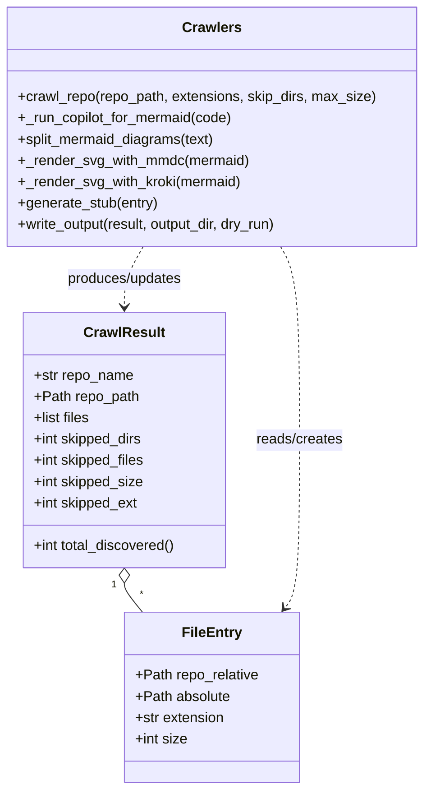

# Diagram: container_tracking_core/container_tracking_service/config/config.test.yml


> Auto-generated by Obscura crawlers

## Diagram 1

```mermaid
flowchart TD
    Vault[Vault\n(skills/, instructions/, agents/)] -->|sync/copy| Sync[sync.py]
    Sync --> Repo[Target Repos]
    Repo --> Crawlers[Crawlers\n(crawlers.py / crawl.py / crawl_repo)]
    Crawlers --> Copilot[copilot -p\n(copilot_batch_diagrammer)]
    Copilot --> Split[split_mermaid_diagrams]
    Split --> RendererMMDC[mmdc (local CLI)]
    Split --> RendererKroki[Kroki (https://kroki.io)]
    RendererMMDC --> Output[Markdown + inline SVG]
    RendererKroki --> Output
    Crawlers --> Index[generate_index / INDEX.md]
    Output --> Obsidian[Obsidian vault / vault/crawlers/{repo}]
    Repo -->|symlink| Vault
```

> SVG rendering failed for this diagram.

## Diagram 2



> SVG rendering failed for this diagram.
