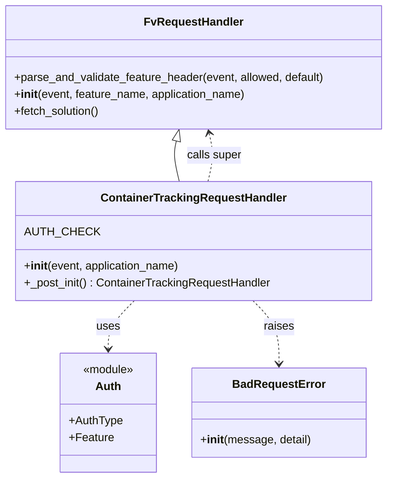

# Diagram: container_tracking_core/container_tracking_service/container_tracking_service/api/ContainerTrackingRequestHandler.py


> Auto-generated by Obscura crawlers

## Diagram 1



> SVG rendering failed for this diagram.

## Diagram 2

```mermaid
flowchart TD
    Event([Incoming event])
    Event --> Parse[/parse_and_validate_feature_header(event, [CONTAINER_TRACKING, SURGICAL_TOTE_TRACKING], CONTAINER_TRACKING)/]
    Parse -->|no feature_name| Raise[/"raise BadRequestError('Invalid Container Tracking request, feature name not found')"/]
    Parse -->|feature_name found| SuperInit[super().__init__(event, feature_name, application_name)]
    SuperInit --> PostInit[_post_init() : ContainerTrackingRequestHandler]
    PostInit --> Fetch[fetch_solution()]
    Fetch --> Return([ContainerTrackingRequestHandler instance returned])
```

> SVG rendering failed for this diagram.
