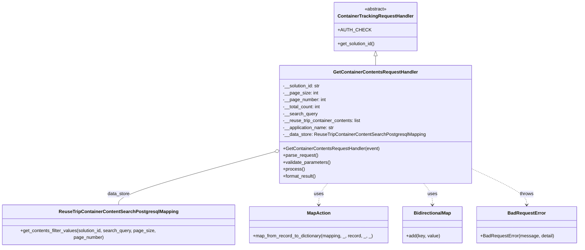
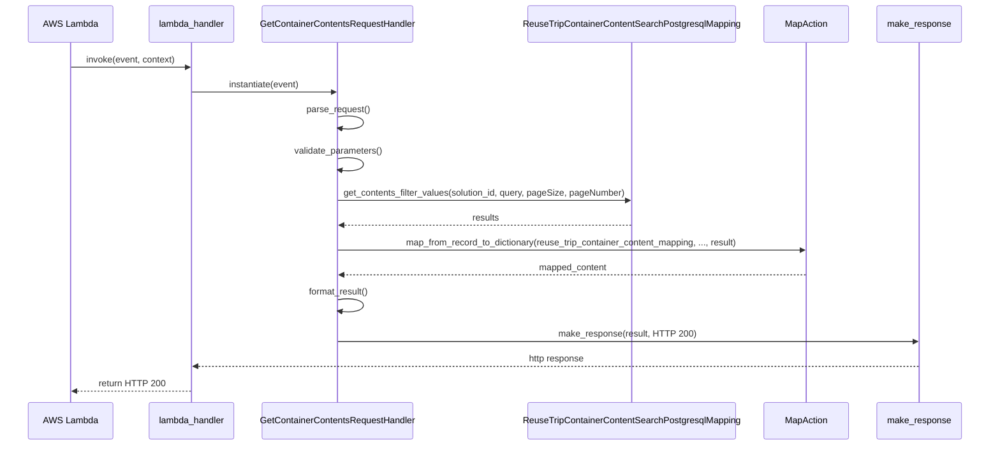

# Diagram: container_tracking_core/container_tracking_service/container_tracking_service/api/advanced_search_filters_dynamic/container_contents/container_contents_handler.py

> Auto-generated by Obscura crawlers

## Diagram 1

### SVG

<svg id="container" width="1988.6953125" xmlns="http://www.w3.org/2000/svg" class="classDiagram" height="842" viewBox="0 0 1988.6953125 842" role="graphics-document document" aria-roledescription="class"><g><defs><marker id="container_class-aggregationStart" class="marker aggregation class" refX="18" refY="7" markerWidth="190" markerHeight="240" orient="auto"><path d="M 18,7 L9,13 L1,7 L9,1 Z"></path></marker></defs><defs><marker id="container_class-aggregationEnd" class="marker aggregation class" refX="1" refY="7" markerWidth="20" markerHeight="28" orient="auto"><path d="M 18,7 L9,13 L1,7 L9,1 Z"></path></marker></defs><defs><marker id="container_class-extensionStart" class="marker extension class" refX="18" refY="7" markerWidth="190" markerHeight="240" orient="auto"><path d="M 1,7 L18,13 V 1 Z"></path></marker></defs><defs><marker id="container_class-extensionEnd" class="marker extension class" refX="1" refY="7" markerWidth="20" markerHeight="28" orient="auto"><path d="M 1,1 V 13 L18,7 Z"></path></marker></defs><defs><marker id="container_class-compositionStart" class="marker composition class" refX="18" refY="7" markerWidth="190" markerHeight="240" orient="auto"><path d="M 18,7 L9,13 L1,7 L9,1 Z"></path></marker></defs><defs><marker id="container_class-compositionEnd" class="marker composition class" refX="1" refY="7" markerWidth="20" markerHeight="28" orient="auto"><path d="M 18,7 L9,13 L1,7 L9,1 Z"></path></marker></defs><defs><marker id="container_class-dependencyStart" class="marker dependency class" refX="6" refY="7" markerWidth="190" markerHeight="240" orient="auto"><path d="M 5,7 L9,13 L1,7 L9,1 Z"></path></marker></defs><defs><marker id="container_class-dependencyEnd" class="marker dependency class" refX="13" refY="7" markerWidth="20" markerHeight="28" orient="auto"><path d="M 18,7 L9,13 L14,7 L9,1 Z"></path></marker></defs><defs><marker id="container_class-lollipopStart" class="marker lollipop class" refX="13" refY="7" markerWidth="190" markerHeight="240" orient="auto"><circle stroke="black" fill="transparent" cx="7" cy="7" r="6"></circle></marker></defs><defs><marker id="container_class-lollipopEnd" class="marker lollipop class" refX="1" refY="7" markerWidth="190" markerHeight="240" orient="auto"><circle stroke="black" fill="transparent" cx="7" cy="7" r="6"></circle></marker></defs><g class="root"><g class="clusters"></g><g class="edgePaths"><path d="M1293.563,193.25L1293.563,194.542C1293.563,195.833,1293.563,198.417,1293.563,203.875C1293.563,209.333,1293.563,217.667,1293.563,221.833L1293.563,226" id="id_ContainerTrackingRequestHandler_GetContainerContentsRequestHandler_1" class="edge-thickness-normal edge-pattern-solid relation" style=";;;" data-edge="true" data-et="edge" data-id="id_ContainerTrackingRequestHandler_GetContainerContentsRequestHandler_1" data-points="W3sieCI6MTI5My41NjI1LCJ5IjoxNzZ9LHsieCI6MTI5My41NjI1LCJ5IjoyMDF9LHsieCI6MTI5My41NjI1LCJ5IjoyMjZ9XQ==" marker-start="url(#container_class-extensionStart)"></path><path d="M948.535,523.853L858.376,548.377C768.217,572.902,587.9,621.951,497.741,652.642C407.582,683.333,407.582,695.667,407.582,701.833L407.582,708" id="id_GetContainerContentsRequestHandler_ReuseTripContainerContentSearchPostgresqlMapping_2" class="edge-thickness-normal edge-pattern-solid relation" style=";;;" data-edge="true" data-et="edge" data-id="id_GetContainerContentsRequestHandler_ReuseTripContainerContentSearchPostgresqlMapping_2" data-points="W3sieCI6OTY1LjE3OTY4NzUsInkiOjUxOS4zMjUwNTkxOTAyNTF9LHsieCI6NDA3LjU4MjAzMTI1LCJ5Ijo2NzF9LHsieCI6NDA3LjU4MjAzMTI1LCJ5Ijo3MDh9XQ==" marker-start="url(#container_class-aggregationStart)"></path><path d="M1127.67,634L1122.656,640.167C1117.641,646.333,1107.611,658.667,1102.597,670C1097.582,681.333,1097.582,691.667,1097.582,696.833L1097.582,702" id="id_GetContainerContentsRequestHandler_MapAction_3" class="edge-thickness-normal edge-pattern-dashed relation" style=";;;" data-edge="true" data-et="edge" data-id="id_GetContainerContentsRequestHandler_MapAction_3" data-points="W3sieCI6MTEyNy42NzAzMTg5ODM0MDI1LCJ5Ijo2MzR9LHsieCI6MTA5Ny41ODIwMzEyNSwieSI6NjcxfSx7IngiOjEwOTcuNTgyMDMxMjUsInkiOjcwOH1d" marker-end="url(#container_class-dependencyEnd)"></path><path d="M1459.455,634L1464.469,640.167C1469.484,646.333,1479.514,658.667,1484.528,670C1489.543,681.333,1489.543,691.667,1489.543,696.833L1489.543,702" id="id_GetContainerContentsRequestHandler_BidirectionalMap_4" class="edge-thickness-normal edge-pattern-dashed relation" style=";;;" data-edge="true" data-et="edge" data-id="id_GetContainerContentsRequestHandler_BidirectionalMap_4" data-points="W3sieCI6MTQ1OS40NTQ2ODEwMTY1OTc1LCJ5Ijo2MzR9LHsieCI6MTQ4OS41NDI5Njg3NSwieSI6NjcxfSx7IngiOjE0ODkuNTQyOTY4NzUsInkiOjcwOH1d" marker-end="url(#container_class-dependencyEnd)"></path><path d="M1621.945,582.979L1653.436,597.649C1684.927,612.319,1747.909,641.66,1779.4,661.496C1810.891,681.333,1810.891,691.667,1810.891,696.833L1810.891,702" id="id_GetContainerContentsRequestHandler_BadRequestError_5" class="edge-thickness-normal edge-pattern-dashed relation" style=";;;" data-edge="true" data-et="edge" data-id="id_GetContainerContentsRequestHandler_BadRequestError_5" data-points="W3sieCI6MTYyMS45NDUzMTI1LCJ5Ijo1ODIuOTc4ODQyNjEwNzcwNX0seyJ4IjoxODEwLjg5MDYyNSwieSI6NjcxfSx7IngiOjE4MTAuODkwNjI1LCJ5Ijo3MDh9XQ==" marker-end="url(#container_class-dependencyEnd)"></path></g><g class="edgeLabels"><g class="edgeLabel"><g class="label" data-id="id_ContainerTrackingRequestHandler_GetContainerContentsRequestHandler_1" transform="translate(0, 0)"><foreignObject width="0" height="0">

</foreignObject></g></g><g class="edgeLabel" transform="translate(407.58203125, 671)"><g class="label" data-id="id_GetContainerContentsRequestHandler_ReuseTripContainerContentSearchPostgresqlMapping_2" transform="translate(-38.8671875, -12)"><foreignObject width="77.734375" height="24">

data_store

</foreignObject></g></g><g class="edgeLabel" transform="translate(1097.58203125, 671)"><g class="label" data-id="id_GetContainerContentsRequestHandler_MapAction_3" transform="translate(-16.4921875, -12)"><foreignObject width="32.984375" height="24">

uses

</foreignObject></g></g><g class="edgeLabel" transform="translate(1489.54296875, 671)"><g class="label" data-id="id_GetContainerContentsRequestHandler_BidirectionalMap_4" transform="translate(-16.4921875, -12)"><foreignObject width="32.984375" height="24">

uses

</foreignObject></g></g><g class="edgeLabel" transform="translate(1810.890625, 671)"><g class="label" data-id="id_GetContainerContentsRequestHandler_BadRequestError_5" transform="translate(-24.5703125, -12)"><foreignObject width="49.140625" height="24">

throws

</foreignObject></g></g></g><g class="nodes"><g class="node default" id="classId-ContainerTrackingRequestHandler-0" transform="translate(1293.5625, 92)"><g class="basic label-container"><path d="M-140.52734375 -84 L140.52734375 -84 L140.52734375 84 L-140.52734375 84" stroke="none" stroke-width="0" fill="#ECECFF" style=""></path><path d="M-140.52734375 -84 C-72.1523546456418 -84, -3.7773655412835865 -84, 140.52734375 -84 M-140.52734375 -84 C-48.74116501749786 -84, 43.04501371500427 -84, 140.52734375 -84 M140.52734375 -84 C140.52734375 -37.400877800329134, 140.52734375 9.198244399341732, 140.52734375 84 M140.52734375 -84 C140.52734375 -18.196982885684093, 140.52734375 47.60603422863181, 140.52734375 84 M140.52734375 84 C44.95579945868336 84, -50.61574483263328 84, -140.52734375 84 M140.52734375 84 C66.75365076758402 84, -7.02004221483196 84, -140.52734375 84 M-140.52734375 84 C-140.52734375 38.98964817023368, -140.52734375 -6.020703659532643, -140.52734375 -84 M-140.52734375 84 C-140.52734375 38.81925940130479, -140.52734375 -6.361481197390418, -140.52734375 -84" stroke="#9370DB" stroke-width="1.3" fill="none" stroke-dasharray="0 0" style=""></path></g><g class="annotation-group text" transform="translate(-38.609375, -60)"><g class="label" style="" transform="translate(0,-12)"><foreignObject width="77.21875" height="24">

«abstract»

</foreignObject></g></g><g class="label-group text" transform="translate(-125.5859375, -36)"><g class="label" style="font-weight: bolder" transform="translate(0,-12)"><foreignObject width="251.171875" height="24">

ContainerTrackingRequestHandler

</foreignObject></g></g><g class="members-group text" transform="translate(-128.52734375, 12)"><g class="label" style="" transform="translate(0,-12)"><foreignObject width="100.859375" height="24">

+AUTH_CHECK

</foreignObject></g></g><g class="methods-group text" transform="translate(-128.52734375, 60)"><g class="label" style="" transform="translate(0,-12)"><foreignObject width="131.46875" height="24">

+get_solution_id()

</foreignObject></g></g><g class="divider" style=""><path d="M-140.52734375 -12 C-81.15170824915496 -12, -21.77607274830993 -12, 140.52734375 -12 M-140.52734375 -12 C-60.66331766237121 -12, 19.200708425257574 -12, 140.52734375 -12" stroke="#9370DB" stroke-width="1.3" fill="none" stroke-dasharray="0 0" style=""></path></g><g class="divider" style=""><path d="M-140.52734375 36 C-61.69990067973045 36, 17.127542390539105 36, 140.52734375 36 M-140.52734375 36 C-28.546349352905082 36, 83.43464504418984 36, 140.52734375 36" stroke="#9370DB" stroke-width="1.3" fill="none" stroke-dasharray="0 0" style=""></path></g></g><g class="node default" id="classId-GetContainerContentsRequestHandler-1" transform="translate(1293.5625, 430)"><g class="basic label-container"><path d="M-328.3828125 -204 L328.3828125 -204 L328.3828125 204 L-328.3828125 204" stroke="none" stroke-width="0" fill="#ECECFF" style=""></path><path d="M-328.3828125 -204 C-69.14518277934656 -204, 190.0924469413069 -204, 328.3828125 -204 M-328.3828125 -204 C-150.7884651959976 -204, 26.805882108004823 -204, 328.3828125 -204 M328.3828125 -204 C328.3828125 -52.12155614591492, 328.3828125 99.75688770817015, 328.3828125 204 M328.3828125 -204 C328.3828125 -84.45061036485245, 328.3828125 35.0987792702951, 328.3828125 204 M328.3828125 204 C67.97600994599492 204, -192.43079260801017 204, -328.3828125 204 M328.3828125 204 C106.0526847034088 204, -116.2774430931824 204, -328.3828125 204 M-328.3828125 204 C-328.3828125 90.21004351214323, -328.3828125 -23.57991297571354, -328.3828125 -204 M-328.3828125 204 C-328.3828125 46.292126452074854, -328.3828125 -111.41574709585029, -328.3828125 -204" stroke="#9370DB" stroke-width="1.3" fill="none" stroke-dasharray="0 0" style=""></path></g><g class="annotation-group text" transform="translate(0, -180)"></g><g class="label-group text" transform="translate(-139.984375, -180)"><g class="label" style="font-weight: bolder" transform="translate(0,-12)"><foreignObject width="279.96875" height="24">

GetContainerContentsRequestHandler

</foreignObject></g></g><g class="members-group text" transform="translate(-316.3828125, -132)"><g class="label" style="" transform="translate(0,-12)"><foreignObject width="131.390625" height="24">

-__solution_id: str

</foreignObject></g><g class="label" style="" transform="translate(0,12)"><foreignObject width="119.65625" height="24">

-__page_size: int

</foreignObject></g><g class="label" style="" transform="translate(0,36)"><foreignObject width="149.03125" height="24">

-__page_number: int

</foreignObject></g><g class="label" style="" transform="translate(0,60)"><foreignObject width="132.0625" height="24">

-__total_count: int

</foreignObject></g><g class="label" style="" transform="translate(0,84)"><foreignObject width="118.765625" height="24">

-__search_query

</foreignObject></g><g class="label" style="" transform="translate(0,108)"><foreignObject width="272.28125" height="24">

-__reuse_trip_container_contents: list

</foreignObject></g><g class="label" style="" transform="translate(0,132)"><foreignObject width="179.78125" height="24">

-__application_name: str

</foreignObject></g><g class="label" style="" transform="translate(0,156)"><foreignObject width="492.78125" height="24">

-__data_store: ReuseTripContainerContentSearchPostgresqlMapping

</foreignObject></g></g><g class="methods-group text" transform="translate(-316.3828125, 84)"><g class="label" style="" transform="translate(0,-12)"><foreignObject width="335.078125" height="24">

+GetContainerContentsRequestHandler(event)

</foreignObject></g><g class="label" style="" transform="translate(0,12)"><foreignObject width="121.796875" height="24">

+parse_request()

</foreignObject></g><g class="label" style="" transform="translate(0,36)"><foreignObject width="166.546875" height="24">

+validate_parameters()

</foreignObject></g><g class="label" style="" transform="translate(0,60)"><foreignObject width="73.734375" height="24">

+process()

</foreignObject></g><g class="label" style="" transform="translate(0,84)"><foreignObject width="117.015625" height="24">

+format_result()

</foreignObject></g></g><g class="divider" style=""><path d="M-328.3828125 -156 C-156.06371701579405 -156, 16.25537846841189 -156, 328.3828125 -156 M-328.3828125 -156 C-162.09583657466922 -156, 4.191139350661558 -156, 328.3828125 -156" stroke="#9370DB" stroke-width="1.3" fill="none" stroke-dasharray="0 0" style=""></path></g><g class="divider" style=""><path d="M-328.3828125 60 C-122.7221415610617 60, 82.93852937787659 60, 328.3828125 60 M-328.3828125 60 C-173.51294396081337 60, -18.643075421626747 60, 328.3828125 60" stroke="#9370DB" stroke-width="1.3" fill="none" stroke-dasharray="0 0" style=""></path></g></g><g class="node default" id="classId-ReuseTripContainerContentSearchPostgresqlMapping-2" transform="translate(407.58203125, 771)"><g class="basic label-container"><path d="M-399.58203125 -63 L399.58203125 -63 L399.58203125 63 L-399.58203125 63" stroke="none" stroke-width="0" fill="#ECECFF" style=""></path><path d="M-399.58203125 -63 C-123.86883862637148 -63, 151.84435399725703 -63, 399.58203125 -63 M-399.58203125 -63 C-235.8266663551901 -63, -72.0713014603802 -63, 399.58203125 -63 M399.58203125 -63 C399.58203125 -26.77849464423192, 399.58203125 9.44301071153616, 399.58203125 63 M399.58203125 -63 C399.58203125 -28.38147713526201, 399.58203125 6.23704572947598, 399.58203125 63 M399.58203125 63 C117.7244321730339 63, -164.1331669039322 63, -399.58203125 63 M399.58203125 63 C160.53767088898263 63, -78.50668947203474 63, -399.58203125 63 M-399.58203125 63 C-399.58203125 18.989818769307078, -399.58203125 -25.020362461385844, -399.58203125 -63 M-399.58203125 63 C-399.58203125 13.847792026183278, -399.58203125 -35.304415947633444, -399.58203125 -63" stroke="#9370DB" stroke-width="1.3" fill="none" stroke-dasharray="0 0" style=""></path></g><g class="annotation-group text" transform="translate(0, -39)"></g><g class="label-group text" transform="translate(-195.9140625, -39)"><g class="label" style="font-weight: bolder" transform="translate(0,-12)"><foreignObject width="391.828125" height="24">

ReuseTripContainerContentSearchPostgresqlMapping

</foreignObject></g></g><g class="members-group text" transform="translate(-387.58203125, 9)"></g><g class="methods-group text" transform="translate(-387.58203125, 39)"><g class="label" style="" transform="translate(0,-12)"><foreignObject width="579.25" height="24">

+get_contents_filter_values(solution_id, search_query, page_size, page_number)

</foreignObject></g></g><g class="divider" style=""><path d="M-399.58203125 -15 C-217.62265941998666 -15, -35.66328758997332 -15, 399.58203125 -15 M-399.58203125 -15 C-205.7682146756903 -15, -11.954398101380605 -15, 399.58203125 -15" stroke="#9370DB" stroke-width="1.3" fill="none" stroke-dasharray="0 0" style=""></path></g><g class="divider" style=""><path d="M-399.58203125 9 C-146.02601142978384 9, 107.53000839043233 9, 399.58203125 9 M-399.58203125 9 C-108.74178835870089 9, 182.09845453259823 9, 399.58203125 9" stroke="#9370DB" stroke-width="1.3" fill="none" stroke-dasharray="0 0" style=""></path></g></g><g class="node default" id="classId-BidirectionalMap-3" transform="translate(1489.54296875, 771)"><g class="basic label-container"><path d="M-101.54296875 -63 L101.54296875 -63 L101.54296875 63 L-101.54296875 63" stroke="none" stroke-width="0" fill="#ECECFF" style=""></path><path d="M-101.54296875 -63 C-26.815846152011304 -63, 47.91127644597739 -63, 101.54296875 -63 M-101.54296875 -63 C-31.03407544089046 -63, 39.47481786821908 -63, 101.54296875 -63 M101.54296875 -63 C101.54296875 -14.843447242523716, 101.54296875 33.31310551495257, 101.54296875 63 M101.54296875 -63 C101.54296875 -34.20008070135142, 101.54296875 -5.400161402702835, 101.54296875 63 M101.54296875 63 C22.662168181110488 63, -56.218632387779024 63, -101.54296875 63 M101.54296875 63 C37.180556622515766 63, -27.181855504968468 63, -101.54296875 63 M-101.54296875 63 C-101.54296875 21.375323102179586, -101.54296875 -20.24935379564083, -101.54296875 -63 M-101.54296875 63 C-101.54296875 12.976053534785173, -101.54296875 -37.047892930429654, -101.54296875 -63" stroke="#9370DB" stroke-width="1.3" fill="none" stroke-dasharray="0 0" style=""></path></g><g class="annotation-group text" transform="translate(0, -39)"></g><g class="label-group text" transform="translate(-62.2265625, -39)"><g class="label" style="font-weight: bolder" transform="translate(0,-12)"><foreignObject width="124.453125" height="24">

BidirectionalMap

</foreignObject></g></g><g class="members-group text" transform="translate(-89.54296875, 9)"></g><g class="methods-group text" transform="translate(-89.54296875, 39)"><g class="label" style="" transform="translate(0,-12)"><foreignObject width="116.859375" height="24">

+add(key, value)

</foreignObject></g></g><g class="divider" style=""><path d="M-101.54296875 -15 C-31.518906542438245 -15, 38.50515566512351 -15, 101.54296875 -15 M-101.54296875 -15 C-59.176580234210356 -15, -16.81019171842071 -15, 101.54296875 -15" stroke="#9370DB" stroke-width="1.3" fill="none" stroke-dasharray="0 0" style=""></path></g><g class="divider" style=""><path d="M-101.54296875 9 C-46.760704953000946 9, 8.021558843998108 9, 101.54296875 9 M-101.54296875 9 C-37.24353387204118 9, 27.055901005917633 9, 101.54296875 9" stroke="#9370DB" stroke-width="1.3" fill="none" stroke-dasharray="0 0" style=""></path></g></g><g class="node default" id="classId-MapAction-4" transform="translate(1097.58203125, 771)"><g class="basic label-container"><path d="M-240.41796875 -63 L240.41796875 -63 L240.41796875 63 L-240.41796875 63" stroke="none" stroke-width="0" fill="#ECECFF" style=""></path><path d="M-240.41796875 -63 C-113.45149892544282 -63, 13.51497089911436 -63, 240.41796875 -63 M-240.41796875 -63 C-142.3732553985119 -63, -44.32854204702383 -63, 240.41796875 -63 M240.41796875 -63 C240.41796875 -35.052486498793996, 240.41796875 -7.104972997587986, 240.41796875 63 M240.41796875 -63 C240.41796875 -34.79220189742155, 240.41796875 -6.584403794843105, 240.41796875 63 M240.41796875 63 C102.55985557139923 63, -35.29825760720155 63, -240.41796875 63 M240.41796875 63 C90.57487206287351 63, -59.26822462425298 63, -240.41796875 63 M-240.41796875 63 C-240.41796875 33.77240578198901, -240.41796875 4.544811563978016, -240.41796875 -63 M-240.41796875 63 C-240.41796875 29.273518206193245, -240.41796875 -4.45296358761351, -240.41796875 -63" stroke="#9370DB" stroke-width="1.3" fill="none" stroke-dasharray="0 0" style=""></path></g><g class="annotation-group text" transform="translate(0, -39)"></g><g class="label-group text" transform="translate(-38.6328125, -39)"><g class="label" style="font-weight: bolder" transform="translate(0,-12)"><foreignObject width="77.265625" height="24">

MapAction

</foreignObject></g></g><g class="members-group text" transform="translate(-228.41796875, 9)"></g><g class="methods-group text" transform="translate(-228.41796875, 39)"><g class="label" style="" transform="translate(0,-12)"><foreignObject width="418.203125" height="24">

+map_from_record_to_dictionary(mapping, _, record, _, _)

</foreignObject></g></g><g class="divider" style=""><path d="M-240.41796875 -15 C-90.6032994398407 -15, 59.211369870318606 -15, 240.41796875 -15 M-240.41796875 -15 C-80.69308917408776 -15, 79.03179040182448 -15, 240.41796875 -15" stroke="#9370DB" stroke-width="1.3" fill="none" stroke-dasharray="0 0" style=""></path></g><g class="divider" style=""><path d="M-240.41796875 9 C-95.50912025909284 9, 49.39972823181432 9, 240.41796875 9 M-240.41796875 9 C-51.703453064265574 9, 137.01106262146885 9, 240.41796875 9" stroke="#9370DB" stroke-width="1.3" fill="none" stroke-dasharray="0 0" style=""></path></g></g><g class="node default" id="classId-BadRequestError-5" transform="translate(1810.890625, 771)"><g class="basic label-container"><path d="M-169.8046875 -63 L169.8046875 -63 L169.8046875 63 L-169.8046875 63" stroke="none" stroke-width="0" fill="#ECECFF" style=""></path><path d="M-169.8046875 -63 C-73.2727393281799 -63, 23.25920884364021 -63, 169.8046875 -63 M-169.8046875 -63 C-75.9447430374208 -63, 17.915201425158386 -63, 169.8046875 -63 M169.8046875 -63 C169.8046875 -12.719977319430043, 169.8046875 37.56004536113991, 169.8046875 63 M169.8046875 -63 C169.8046875 -33.73202351054401, 169.8046875 -4.464047021088028, 169.8046875 63 M169.8046875 63 C41.84182179568927 63, -86.12104390862146 63, -169.8046875 63 M169.8046875 63 C72.46375087225717 63, -24.87718575548567 63, -169.8046875 63 M-169.8046875 63 C-169.8046875 35.59460729090947, -169.8046875 8.189214581818945, -169.8046875 -63 M-169.8046875 63 C-169.8046875 36.12705892989961, -169.8046875 9.254117859799223, -169.8046875 -63" stroke="#9370DB" stroke-width="1.3" fill="none" stroke-dasharray="0 0" style=""></path></g><g class="annotation-group text" transform="translate(0, -39)"></g><g class="label-group text" transform="translate(-62.28125, -39)"><g class="label" style="font-weight: bolder" transform="translate(0,-12)"><foreignObject width="124.5625" height="24">

BadRequestError

</foreignObject></g></g><g class="members-group text" transform="translate(-157.8046875, 9)"></g><g class="methods-group text" transform="translate(-157.8046875, 39)"><g class="label" style="" transform="translate(0,-12)"><foreignObject width="253.328125" height="24">

+BadRequestError(message, detail)

</foreignObject></g></g><g class="divider" style=""><path d="M-169.8046875 -15 C-44.671549885199966 -15, 80.46158772960007 -15, 169.8046875 -15 M-169.8046875 -15 C-85.59053070651467 -15, -1.3763739130293402 -15, 169.8046875 -15" stroke="#9370DB" stroke-width="1.3" fill="none" stroke-dasharray="0 0" style=""></path></g><g class="divider" style=""><path d="M-169.8046875 9 C-92.28747649148241 9, -14.770265482964817 9, 169.8046875 9 M-169.8046875 9 C-49.41559653120072 9, 70.97349443759856 9, 169.8046875 9" stroke="#9370DB" stroke-width="1.3" fill="none" stroke-dasharray="0 0" style=""></path></g></g></g></g></g></svg>

## Diagram 2

> SVG rendering failed for this diagram.
