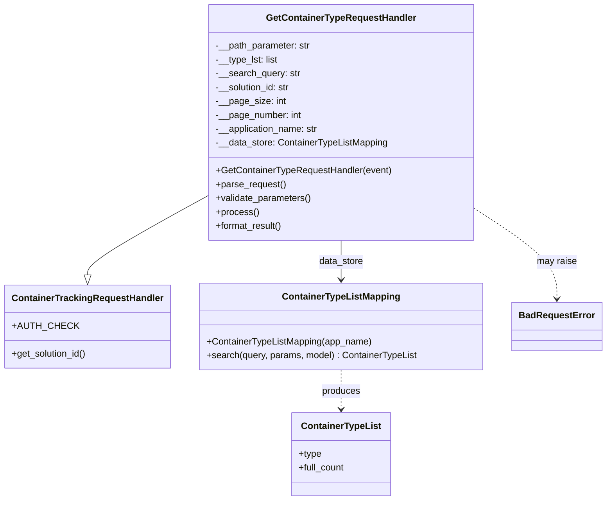

# Diagram: container_tracking_core/container_tracking_service/container_tracking_service/api/advanced_search_filters_dynamic/container_type/container_type_handler.py


> Auto-generated by Obscura crawlers

## Diagram 1



### SVG

<svg id="container" width="1032.234375" xmlns="http://www.w3.org/2000/svg" class="classDiagram" height="866" viewBox="0 0 1032.234375 866" role="graphics-document document" aria-roledescription="class"><style>#container{font-family:"trebuchet ms",verdana,arial,sans-serif;font-size:16px;fill:#333;}@keyframes edge-animation-frame{from{stroke-dashoffset:0;}}@keyframes dash{to{stroke-dashoffset:0;}}#container .edge-animation-slow{stroke-dasharray:9,5!important;stroke-dashoffset:900;animation:dash 50s linear infinite;stroke-linecap:round;}#container .edge-animation-fast{stroke-dasharray:9,5!important;stroke-dashoffset:900;animation:dash 20s linear infinite;stroke-linecap:round;}#container .error-icon{fill:#552222;}#container .error-text{fill:#552222;stroke:#552222;}#container .edge-thickness-normal{stroke-width:1px;}#container .edge-thickness-thick{stroke-width:3.5px;}#container .edge-pattern-solid{stroke-dasharray:0;}#container .edge-thickness-invisible{stroke-width:0;fill:none;}#container .edge-pattern-dashed{stroke-dasharray:3;}#container .edge-pattern-dotted{stroke-dasharray:2;}#container .marker{fill:#333333;stroke:#333333;}#container .marker.cross{stroke:#333333;}#container svg{font-family:"trebuchet ms",verdana,arial,sans-serif;font-size:16px;}#container p{margin:0;}#container g.classGroup text{fill:#9370DB;stroke:none;font-family:"trebuchet ms",verdana,arial,sans-serif;font-size:10px;}#container g.classGroup text .title{font-weight:bolder;}#container .nodeLabel,#container .edgeLabel{color:#131300;}#container .edgeLabel .label rect{fill:#ECECFF;}#container .label text{fill:#131300;}#container .labelBkg{background:#ECECFF;}#container .edgeLabel .label span{background:#ECECFF;}#container .classTitle{font-weight:bolder;}#container .node rect,#container .node circle,#container .node ellipse,#container .node polygon,#container .node path{fill:#ECECFF;stroke:#9370DB;stroke-width:1px;}#container .divider{stroke:#9370DB;stroke-width:1;}#container g.clickable{cursor:pointer;}#container g.classGroup rect{fill:#ECECFF;stroke:#9370DB;}#container g.classGroup line{stroke:#9370DB;stroke-width:1;}#container .classLabel .box{stroke:none;stroke-width:0;fill:#ECECFF;opacity:0.5;}#container .classLabel .label{fill:#9370DB;font-size:10px;}#container .relation{stroke:#333333;stroke-width:1;fill:none;}#container .dashed-line{stroke-dasharray:3;}#container .dotted-line{stroke-dasharray:1 2;}#container #compositionStart,#container .composition{fill:#333333!important;stroke:#333333!important;stroke-width:1;}#container #compositionEnd,#container .composition{fill:#333333!important;stroke:#333333!important;stroke-width:1;}#container #dependencyStart,#container .dependency{fill:#333333!important;stroke:#333333!important;stroke-width:1;}#container #dependencyStart,#container .dependency{fill:#333333!important;stroke:#333333!important;stroke-width:1;}#container #extensionStart,#container .extension{fill:transparent!important;stroke:#333333!important;stroke-width:1;}#container #extensionEnd,#container .extension{fill:transparent!important;stroke:#333333!important;stroke-width:1;}#container #aggregationStart,#container .aggregation{fill:transparent!important;stroke:#333333!important;stroke-width:1;}#container #aggregationEnd,#container .aggregation{fill:transparent!important;stroke:#333333!important;stroke-width:1;}#container #lollipopStart,#container .lollipop{fill:#ECECFF!important;stroke:#333333!important;stroke-width:1;}#container #lollipopEnd,#container .lollipop{fill:#ECECFF!important;stroke:#333333!important;stroke-width:1;}#container .edgeTerminals{font-size:11px;line-height:initial;}#container .classTitleText{text-anchor:middle;font-size:18px;fill:#333;}#container .label-icon{display:inline-block;height:1em;overflow:visible;vertical-align:-0.125em;}#container .node .label-icon path{fill:currentColor;stroke:revert;stroke-width:revert;}#container :root{--mermaid-font-family:"trebuchet ms",verdana,arial,sans-serif;}</style><g><defs><marker id="container_class-aggregationStart" class="marker aggregation class" refX="18" refY="7" markerWidth="190" markerHeight="240" orient="auto"><path d="M 18,7 L9,13 L1,7 L9,1 Z"></path></marker></defs><defs><marker id="container_class-aggregationEnd" class="marker aggregation class" refX="1" refY="7" markerWidth="20" markerHeight="28" orient="auto"><path d="M 18,7 L9,13 L1,7 L9,1 Z"></path></marker></defs><defs><marker id="container_class-extensionStart" class="marker extension class" refX="18" refY="7" markerWidth="190" markerHeight="240" orient="auto"><path d="M 1,7 L18,13 V 1 Z"></path></marker></defs><defs><marker id="container_class-extensionEnd" class="marker extension class" refX="1" refY="7" markerWidth="20" markerHeight="28" orient="auto"><path d="M 1,1 V 13 L18,7 Z"></path></marker></defs><defs><marker id="container_class-compositionStart" class="marker composition class" refX="18" refY="7" markerWidth="190" markerHeight="240" orient="auto"><path d="M 18,7 L9,13 L1,7 L9,1 Z"></path></marker></defs><defs><marker id="container_class-compositionEnd" class="marker composition class" refX="1" refY="7" markerWidth="20" markerHeight="28" orient="auto"><path d="M 18,7 L9,13 L1,7 L9,1 Z"></path></marker></defs><defs><marker id="container_class-dependencyStart" class="marker dependency class" refX="6" refY="7" markerWidth="190" markerHeight="240" orient="auto"><path d="M 5,7 L9,13 L1,7 L9,1 Z"></path></marker></defs><defs><marker id="container_class-dependencyEnd" class="marker dependency class" refX="13" refY="7" markerWidth="20" markerHeight="28" orient="auto"><path d="M 18,7 L9,13 L14,7 L9,1 Z"></path></marker></defs><defs><marker id="container_class-lollipopStart" class="marker lollipop class" refX="13" refY="7" markerWidth="190" markerHeight="240" orient="auto"><circle stroke="black" fill="transparent" cx="7" cy="7" r="6"></circle></marker></defs><defs><marker id="container_class-lollipopEnd" class="marker lollipop class" refX="1" refY="7" markerWidth="190" markerHeight="240" orient="auto"><circle stroke="black" fill="transparent" cx="7" cy="7" r="6"></circle></marker></defs><g class="root"><g class="clusters"></g><g class="edgePaths"><path d="M355.746,337.888L321.21,357.073C286.673,376.259,217.6,414.629,183.064,437.606C148.527,460.583,148.527,468.167,148.527,471.958L148.527,475.75" id="id_GetContainerTypeRequestHandler_ContainerTrackingRequestHandler_1" class="edge-thickness-normal edge-pattern-solid relation" style=";;;" data-edge="true" data-et="edge" data-id="id_GetContainerTypeRequestHandler_ContainerTrackingRequestHandler_1" data-points="W3sieCI6MzU1Ljc0NjA5Mzc1LCJ5IjozMzcuODg4MDA4NDk5NzU2OX0seyJ4IjoxNDguNTI3MzQzNzUsInkiOjQ1M30seyJ4IjoxNDguNTI3MzQzNzUsInkiOjQ5M31d" marker-end="url(#container_class-extensionEnd)"></path><path d="M582.363,416L582.363,422.167C582.363,428.333,582.363,440.667,582.363,452C582.363,463.333,582.363,473.667,582.363,478.833L582.363,484" id="id_GetContainerTypeRequestHandler_ContainerTypeListMapping_2" class="edge-thickness-normal edge-pattern-solid relation" style=";;;" data-edge="true" data-et="edge" data-id="id_GetContainerTypeRequestHandler_ContainerTypeListMapping_2" data-points="W3sieCI6NTgyLjM2MzI4MTI1LCJ5Ijo0MTZ9LHsieCI6NTgyLjM2MzI4MTI1LCJ5Ijo0NTN9LHsieCI6NTgyLjM2MzI4MTI1LCJ5Ijo0OTB9XQ==" marker-end="url(#container_class-dependencyEnd)"></path><path d="M582.363,640L582.363,646.167C582.363,652.333,582.363,664.667,582.363,676C582.363,687.333,582.363,697.667,582.363,702.833L582.363,708" id="id_ContainerTypeListMapping_ContainerTypeList_3" class="edge-thickness-normal edge-pattern-dashed relation" style=";;;" data-edge="true" data-et="edge" data-id="id_ContainerTypeListMapping_ContainerTypeList_3" data-points="W3sieCI6NTgyLjM2MzI4MTI1LCJ5Ijo2NDB9LHsieCI6NTgyLjM2MzI4MTI1LCJ5Ijo2Nzd9LHsieCI6NTgyLjM2MzI4MTI1LCJ5Ijo3MTR9XQ==" marker-end="url(#container_class-dependencyEnd)"></path><path d="M808.98,360.575L832.476,375.979C855.971,391.383,902.962,422.192,926.458,448.263C949.953,474.333,949.953,495.667,949.953,506.333L949.953,517" id="id_GetContainerTypeRequestHandler_BadRequestError_4" class="edge-thickness-normal edge-pattern-dashed relation" style=";;;" data-edge="true" data-et="edge" data-id="id_GetContainerTypeRequestHandler_BadRequestError_4" data-points="W3sieCI6ODA4Ljk4MDQ2ODc1LCJ5IjozNjAuNTc1MjIwNzY4NzMyMTV9LHsieCI6OTQ5Ljk1MzEyNSwieSI6NDUzfSx7IngiOjk0OS45NTMxMjUsInkiOjUyM31d" marker-end="url(#container_class-dependencyEnd)"></path></g><g class="edgeLabels"><g class="edgeLabel"><g class="label" data-id="id_GetContainerTypeRequestHandler_ContainerTrackingRequestHandler_1" transform="translate(0, 0)"><foreignObject width="0" height="0"><div xmlns="http://www.w3.org/1999/xhtml" class="labelBkg" style="display: table-cell; white-space: nowrap; line-height: 1.5; max-width: 200px; text-align: center;"><span class="edgeLabel"></span></div></foreignObject></g></g><g class="edgeLabel" transform="translate(582.36328125, 453)"><g class="label" data-id="id_GetContainerTypeRequestHandler_ContainerTypeListMapping_2" transform="translate(-38.8671875, -12)"><foreignObject width="77.734375" height="24"><div xmlns="http://www.w3.org/1999/xhtml" class="labelBkg" style="display: table-cell; white-space: nowrap; line-height: 1.5; max-width: 200px; text-align: center;"><span class="edgeLabel"><p>data_store</p></span></div></foreignObject></g></g><g class="edgeLabel" transform="translate(582.36328125, 677)"><g class="label" data-id="id_ContainerTypeListMapping_ContainerTypeList_3" transform="translate(-33.4765625, -12)"><foreignObject width="66.953125" height="24"><div xmlns="http://www.w3.org/1999/xhtml" class="labelBkg" style="display: table-cell; white-space: nowrap; line-height: 1.5; max-width: 200px; text-align: center;"><span class="edgeLabel"><p>produces</p></span></div></foreignObject></g></g><g class="edgeLabel" transform="translate(949.953125, 453)"><g class="label" data-id="id_GetContainerTypeRequestHandler_BadRequestError_4" transform="translate(-34.65625, -12)"><foreignObject width="69.3125" height="24"><div xmlns="http://www.w3.org/1999/xhtml" class="labelBkg" style="display: table-cell; white-space: nowrap; line-height: 1.5; max-width: 200px; text-align: center;"><span class="edgeLabel"><p>may raise</p></span></div></foreignObject></g></g></g><g class="nodes"><g class="node default" id="classId-ContainerTrackingRequestHandler-0" transform="translate(148.52734375, 565)"><g class="basic label-container"><path d="M-140.52734375 -72 L140.52734375 -72 L140.52734375 72 L-140.52734375 72" stroke="none" stroke-width="0" fill="#ECECFF" style=""></path><path d="M-140.52734375 -72 C-29.812344064328116 -72, 80.90265562134377 -72, 140.52734375 -72 M-140.52734375 -72 C-76.69767650058847 -72, -12.868009251176957 -72, 140.52734375 -72 M140.52734375 -72 C140.52734375 -22.72464904821726, 140.52734375 26.550701903565482, 140.52734375 72 M140.52734375 -72 C140.52734375 -20.65951216729293, 140.52734375 30.680975665414138, 140.52734375 72 M140.52734375 72 C55.064254952672584 72, -30.39883384465483 72, -140.52734375 72 M140.52734375 72 C40.143938127564326 72, -60.23946749487135 72, -140.52734375 72 M-140.52734375 72 C-140.52734375 24.472932837048987, -140.52734375 -23.054134325902027, -140.52734375 -72 M-140.52734375 72 C-140.52734375 19.643763524743605, -140.52734375 -32.71247295051279, -140.52734375 -72" stroke="#9370DB" stroke-width="1.3" fill="none" stroke-dasharray="0 0" style=""></path></g><g class="annotation-group text" transform="translate(0, -48)"></g><g class="label-group text" transform="translate(-125.5859375, -48)"><g class="label" style="font-weight: bolder" transform="translate(0,-12)"><foreignObject width="251.171875" height="24"><div xmlns="http://www.w3.org/1999/xhtml" style="display: table-cell; white-space: nowrap; line-height: 1.5; max-width: 299px; text-align: center;"><span class="nodeLabel markdown-node-label" style=""><p>ContainerTrackingRequestHandler</p></span></div></foreignObject></g></g><g class="members-group text" transform="translate(-128.52734375, 0)"><g class="label" style="" transform="translate(0,-12)"><foreignObject width="100.859375" height="24"><div xmlns="http://www.w3.org/1999/xhtml" style="display: table-cell; white-space: nowrap; line-height: 1.5; max-width: 159px; text-align: center;"><span class="nodeLabel markdown-node-label" style=""><p>+AUTH_CHECK</p></span></div></foreignObject></g></g><g class="methods-group text" transform="translate(-128.52734375, 48)"><g class="label" style="" transform="translate(0,-12)"><foreignObject width="131.46875" height="24"><div xmlns="http://www.w3.org/1999/xhtml" style="display: table-cell; white-space: nowrap; line-height: 1.5; max-width: 189px; text-align: center;"><span class="nodeLabel markdown-node-label" style=""><p>+get_solution_id()</p></span></div></foreignObject></g></g><g class="divider" style=""><path d="M-140.52734375 -24 C-38.2862093366153 -24, 63.9549250767694 -24, 140.52734375 -24 M-140.52734375 -24 C-67.58200784686157 -24, 5.363328056276856 -24, 140.52734375 -24" stroke="#9370DB" stroke-width="1.3" fill="none" stroke-dasharray="0 0" style=""></path></g><g class="divider" style=""><path d="M-140.52734375 24 C-59.4130994009803 24, 21.7011449480394 24, 140.52734375 24 M-140.52734375 24 C-31.574631407187056 24, 77.37808093562589 24, 140.52734375 24" stroke="#9370DB" stroke-width="1.3" fill="none" stroke-dasharray="0 0" style=""></path></g></g><g class="node default" id="classId-GetContainerTypeRequestHandler-1" transform="translate(582.36328125, 212)"><g class="basic label-container"><path d="M-226.6171875 -204 L226.6171875 -204 L226.6171875 204 L-226.6171875 204" stroke="none" stroke-width="0" fill="#ECECFF" style=""></path><path d="M-226.6171875 -204 C-98.08423932148511 -204, 30.44870885702977 -204, 226.6171875 -204 M-226.6171875 -204 C-113.65316969318478 -204, -0.689151886369558 -204, 226.6171875 -204 M226.6171875 -204 C226.6171875 -55.08555561975135, 226.6171875 93.8288887604973, 226.6171875 204 M226.6171875 -204 C226.6171875 -93.50824136996536, 226.6171875 16.983517260069277, 226.6171875 204 M226.6171875 204 C121.79413757326746 204, 16.971087646534926 204, -226.6171875 204 M226.6171875 204 C56.74760134224229 204, -113.12198481551542 204, -226.6171875 204 M-226.6171875 204 C-226.6171875 62.18922629608531, -226.6171875 -79.62154740782938, -226.6171875 -204 M-226.6171875 204 C-226.6171875 85.77329488022683, -226.6171875 -32.45341023954634, -226.6171875 -204" stroke="#9370DB" stroke-width="1.3" fill="none" stroke-dasharray="0 0" style=""></path></g><g class="annotation-group text" transform="translate(0, -180)"></g><g class="label-group text" transform="translate(-124.671875, -180)"><g class="label" style="font-weight: bolder" transform="translate(0,-12)"><foreignObject width="249.34375" height="24"><div xmlns="http://www.w3.org/1999/xhtml" style="display: table-cell; white-space: nowrap; line-height: 1.5; max-width: 297px; text-align: center;"><span class="nodeLabel markdown-node-label" style=""><p>GetContainerTypeRequestHandler</p></span></div></foreignObject></g></g><g class="members-group text" transform="translate(-214.6171875, -132)"><g class="label" style="" transform="translate(0,-12)"><foreignObject width="166.078125" height="24"><div xmlns="http://www.w3.org/1999/xhtml" style="display: table-cell; white-space: nowrap; line-height: 1.5; max-width: 224px; text-align: center;"><span class="nodeLabel markdown-node-label" style=""><p>-__path_parameter: str</p></span></div></foreignObject></g><g class="label" style="" transform="translate(0,12)"><foreignObject width="109.5" height="24"><div xmlns="http://www.w3.org/1999/xhtml" style="display: table-cell; white-space: nowrap; line-height: 1.5; max-width: 167px; text-align: center;"><span class="nodeLabel markdown-node-label" style=""><p>-__type_lst: list</p></span></div></foreignObject></g><g class="label" style="" transform="translate(0,36)"><foreignObject width="146.328125" height="24"><div xmlns="http://www.w3.org/1999/xhtml" style="display: table-cell; white-space: nowrap; line-height: 1.5; max-width: 205px; text-align: center;"><span class="nodeLabel markdown-node-label" style=""><p>-__search_query: str</p></span></div></foreignObject></g><g class="label" style="" transform="translate(0,60)"><foreignObject width="131.390625" height="24"><div xmlns="http://www.w3.org/1999/xhtml" style="display: table-cell; white-space: nowrap; line-height: 1.5; max-width: 190px; text-align: center;"><span class="nodeLabel markdown-node-label" style=""><p>-__solution_id: str</p></span></div></foreignObject></g><g class="label" style="" transform="translate(0,84)"><foreignObject width="119.65625" height="24"><div xmlns="http://www.w3.org/1999/xhtml" style="display: table-cell; white-space: nowrap; line-height: 1.5; max-width: 177px; text-align: center;"><span class="nodeLabel markdown-node-label" style=""><p>-__page_size: int</p></span></div></foreignObject></g><g class="label" style="" transform="translate(0,108)"><foreignObject width="149.03125" height="24"><div xmlns="http://www.w3.org/1999/xhtml" style="display: table-cell; white-space: nowrap; line-height: 1.5; max-width: 207px; text-align: center;"><span class="nodeLabel markdown-node-label" style=""><p>-__page_number: int</p></span></div></foreignObject></g><g class="label" style="" transform="translate(0,132)"><foreignObject width="179.78125" height="24"><div xmlns="http://www.w3.org/1999/xhtml" style="display: table-cell; white-space: nowrap; line-height: 1.5; max-width: 238px; text-align: center;"><span class="nodeLabel markdown-node-label" style=""><p>-__application_name: str</p></span></div></foreignObject></g><g class="label" style="" transform="translate(0,156)"><foreignObject width="299.484375" height="24"><div xmlns="http://www.w3.org/1999/xhtml" style="display: table-cell; white-space: nowrap; line-height: 1.5; max-width: 358px; text-align: center;"><span class="nodeLabel markdown-node-label" style=""><p>-__data_store: ContainerTypeListMapping</p></span></div></foreignObject></g></g><g class="methods-group text" transform="translate(-214.6171875, 84)"><g class="label" style="" transform="translate(0,-12)"><foreignObject width="304.5625" height="24"><div xmlns="http://www.w3.org/1999/xhtml" style="display: table-cell; white-space: nowrap; line-height: 1.5; max-width: 362px; text-align: center;"><span class="nodeLabel markdown-node-label" style=""><p>+GetContainerTypeRequestHandler(event)</p></span></div></foreignObject></g><g class="label" style="" transform="translate(0,12)"><foreignObject width="121.796875" height="24"><div xmlns="http://www.w3.org/1999/xhtml" style="display: table-cell; white-space: nowrap; line-height: 1.5; max-width: 179px; text-align: center;"><span class="nodeLabel markdown-node-label" style=""><p>+parse_request()</p></span></div></foreignObject></g><g class="label" style="" transform="translate(0,36)"><foreignObject width="166.546875" height="24"><div xmlns="http://www.w3.org/1999/xhtml" style="display: table-cell; white-space: nowrap; line-height: 1.5; max-width: 224px; text-align: center;"><span class="nodeLabel markdown-node-label" style=""><p>+validate_parameters()</p></span></div></foreignObject></g><g class="label" style="" transform="translate(0,60)"><foreignObject width="73.734375" height="24"><div xmlns="http://www.w3.org/1999/xhtml" style="display: table-cell; white-space: nowrap; line-height: 1.5; max-width: 131px; text-align: center;"><span class="nodeLabel markdown-node-label" style=""><p>+process()</p></span></div></foreignObject></g><g class="label" style="" transform="translate(0,84)"><foreignObject width="117.015625" height="24"><div xmlns="http://www.w3.org/1999/xhtml" style="display: table-cell; white-space: nowrap; line-height: 1.5; max-width: 174px; text-align: center;"><span class="nodeLabel markdown-node-label" style=""><p>+format_result()</p></span></div></foreignObject></g></g><g class="divider" style=""><path d="M-226.6171875 -156 C-127.66596613147391 -156, -28.714744762947817 -156, 226.6171875 -156 M-226.6171875 -156 C-135.91910843398085 -156, -45.22102936796168 -156, 226.6171875 -156" stroke="#9370DB" stroke-width="1.3" fill="none" stroke-dasharray="0 0" style=""></path></g><g class="divider" style=""><path d="M-226.6171875 60 C-67.76671859308777 60, 91.08375031382445 60, 226.6171875 60 M-226.6171875 60 C-75.25328406587883 60, 76.11061936824234 60, 226.6171875 60" stroke="#9370DB" stroke-width="1.3" fill="none" stroke-dasharray="0 0" style=""></path></g></g><g class="node default" id="classId-ContainerTypeListMapping-2" transform="translate(582.36328125, 565)"><g class="basic label-container"><path d="M-243.30859375 -75 L243.30859375 -75 L243.30859375 75 L-243.30859375 75" stroke="none" stroke-width="0" fill="#ECECFF" style=""></path><path d="M-243.30859375 -75 C-55.06849816804569 -75, 133.17159741390861 -75, 243.30859375 -75 M-243.30859375 -75 C-115.63385726701561 -75, 12.040879215968772 -75, 243.30859375 -75 M243.30859375 -75 C243.30859375 -34.964549377987304, 243.30859375 5.070901244025393, 243.30859375 75 M243.30859375 -75 C243.30859375 -22.302974218807122, 243.30859375 30.394051562385755, 243.30859375 75 M243.30859375 75 C56.65001380517063 75, -130.00856613965874 75, -243.30859375 75 M243.30859375 75 C68.44568732973138 75, -106.41721909053723 75, -243.30859375 75 M-243.30859375 75 C-243.30859375 27.65526559043058, -243.30859375 -19.68946881913884, -243.30859375 -75 M-243.30859375 75 C-243.30859375 25.97403585317828, -243.30859375 -23.051928293643442, -243.30859375 -75" stroke="#9370DB" stroke-width="1.3" fill="none" stroke-dasharray="0 0" style=""></path></g><g class="annotation-group text" transform="translate(0, -51)"></g><g class="label-group text" transform="translate(-97.7578125, -51)"><g class="label" style="font-weight: bolder" transform="translate(0,-12)"><foreignObject width="195.515625" height="24"><div xmlns="http://www.w3.org/1999/xhtml" style="display: table-cell; white-space: nowrap; line-height: 1.5; max-width: 243px; text-align: center;"><span class="nodeLabel markdown-node-label" style=""><p>ContainerTypeListMapping</p></span></div></foreignObject></g></g><g class="members-group text" transform="translate(-231.30859375, -3)"></g><g class="methods-group text" transform="translate(-231.30859375, 27)"><g class="label" style="" transform="translate(0,-12)"><foreignObject width="286.921875" height="24"><div xmlns="http://www.w3.org/1999/xhtml" style="display: table-cell; white-space: nowrap; line-height: 1.5; max-width: 344px; text-align: center;"><span class="nodeLabel markdown-node-label" style=""><p>+ContainerTypeListMapping(app_name)</p></span></div></foreignObject></g><g class="label" style="" transform="translate(0,12)"><foreignObject width="364.859375" height="24"><div xmlns="http://www.w3.org/1999/xhtml" style="display: table-cell; white-space: nowrap; line-height: 1.5; max-width: 422px; text-align: center;"><span class="nodeLabel markdown-node-label" style=""><p>+search(query, params, model) : ContainerTypeList</p></span></div></foreignObject></g></g><g class="divider" style=""><path d="M-243.30859375 -27 C-62.36377771461014 -27, 118.58103832077973 -27, 243.30859375 -27 M-243.30859375 -27 C-49.83976857942693 -27, 143.62905659114614 -27, 243.30859375 -27" stroke="#9370DB" stroke-width="1.3" fill="none" stroke-dasharray="0 0" style=""></path></g><g class="divider" style=""><path d="M-243.30859375 -3 C-143.8248389666211 -3, -44.3410841832422 -3, 243.30859375 -3 M-243.30859375 -3 C-69.56018590453442 -3, 104.18822194093116 -3, 243.30859375 -3" stroke="#9370DB" stroke-width="1.3" fill="none" stroke-dasharray="0 0" style=""></path></g></g><g class="node default" id="classId-ContainerTypeList-3" transform="translate(582.36328125, 786)"><g class="basic label-container"><path d="M-85.59375 -72 L85.59375 -72 L85.59375 72 L-85.59375 72" stroke="none" stroke-width="0" fill="#ECECFF" style=""></path><path d="M-85.59375 -72 C-48.06319352419545 -72, -10.532637048390896 -72, 85.59375 -72 M-85.59375 -72 C-48.8577611828958 -72, -12.1217723657916 -72, 85.59375 -72 M85.59375 -72 C85.59375 -38.99981175663647, 85.59375 -5.999623513272937, 85.59375 72 M85.59375 -72 C85.59375 -15.223028977611477, 85.59375 41.553942044777045, 85.59375 72 M85.59375 72 C36.7901996704582 72, -12.0133506590836 72, -85.59375 72 M85.59375 72 C28.164770921295776 72, -29.264208157408447 72, -85.59375 72 M-85.59375 72 C-85.59375 36.211831312640946, -85.59375 0.42366262528189225, -85.59375 -72 M-85.59375 72 C-85.59375 26.261269246537147, -85.59375 -19.477461506925707, -85.59375 -72" stroke="#9370DB" stroke-width="1.3" fill="none" stroke-dasharray="0 0" style=""></path></g><g class="annotation-group text" transform="translate(0, -48)"></g><g class="label-group text" transform="translate(-66.25, -48)"><g class="label" style="font-weight: bolder" transform="translate(0,-12)"><foreignObject width="132.5" height="24"><div xmlns="http://www.w3.org/1999/xhtml" style="display: table-cell; white-space: nowrap; line-height: 1.5; max-width: 180px; text-align: center;"><span class="nodeLabel markdown-node-label" style=""><p>ContainerTypeList</p></span></div></foreignObject></g></g><g class="members-group text" transform="translate(-73.59375, 0)"><g class="label" style="" transform="translate(0,-12)"><foreignObject width="39.703125" height="24"><div xmlns="http://www.w3.org/1999/xhtml" style="display: table-cell; white-space: nowrap; line-height: 1.5; max-width: 97px; text-align: center;"><span class="nodeLabel markdown-node-label" style=""><p>+type</p></span></div></foreignObject></g><g class="label" style="" transform="translate(0,12)"><foreignObject width="80.9375" height="24"><div xmlns="http://www.w3.org/1999/xhtml" style="display: table-cell; white-space: nowrap; line-height: 1.5; max-width: 139px; text-align: center;"><span class="nodeLabel markdown-node-label" style=""><p>+full_count</p></span></div></foreignObject></g></g><g class="methods-group text" transform="translate(-73.59375, 72)"></g><g class="divider" style=""><path d="M-85.59375 -24 C-39.08501266216737 -24, 7.423724675665255 -24, 85.59375 -24 M-85.59375 -24 C-49.44200132161052 -24, -13.290252643221038 -24, 85.59375 -24" stroke="#9370DB" stroke-width="1.3" fill="none" stroke-dasharray="0 0" style=""></path></g><g class="divider" style=""><path d="M-85.59375 48 C-27.10358022950939 48, 31.38658954098122 48, 85.59375 48 M-85.59375 48 C-49.11940497588399 48, -12.645059951767976 48, 85.59375 48" stroke="#9370DB" stroke-width="1.3" fill="none" stroke-dasharray="0 0" style=""></path></g></g><g class="node default" id="classId-BadRequestError-4" transform="translate(949.953125, 565)"><g class="basic label-container"><path d="M-74.28125 -42 L74.28125 -42 L74.28125 42 L-74.28125 42" stroke="none" stroke-width="0" fill="#ECECFF" style=""></path><path d="M-74.28125 -42 C-36.56142172814176 -42, 1.158406543716481 -42, 74.28125 -42 M-74.28125 -42 C-30.351293324543462 -42, 13.578663350913075 -42, 74.28125 -42 M74.28125 -42 C74.28125 -17.262638395214225, 74.28125 7.47472320957155, 74.28125 42 M74.28125 -42 C74.28125 -14.616517036588935, 74.28125 12.766965926822131, 74.28125 42 M74.28125 42 C28.408686513507533 42, -17.463876972984934 42, -74.28125 42 M74.28125 42 C22.2306314157508 42, -29.8199871684984 42, -74.28125 42 M-74.28125 42 C-74.28125 13.213585626558086, -74.28125 -15.572828746883829, -74.28125 -42 M-74.28125 42 C-74.28125 17.5883086444834, -74.28125 -6.823382711033197, -74.28125 -42" stroke="#9370DB" stroke-width="1.3" fill="none" stroke-dasharray="0 0" style=""></path></g><g class="annotation-group text" transform="translate(0, -18)"></g><g class="label-group text" transform="translate(-62.28125, -18)"><g class="label" style="font-weight: bolder" transform="translate(0,-12)"><foreignObject width="124.5625" height="24"><div xmlns="http://www.w3.org/1999/xhtml" style="display: table-cell; white-space: nowrap; line-height: 1.5; max-width: 174px; text-align: center;"><span class="nodeLabel markdown-node-label" style=""><p>BadRequestError</p></span></div></foreignObject></g></g><g class="members-group text" transform="translate(-62.28125, 30)"></g><g class="methods-group text" transform="translate(-62.28125, 60)"></g><g class="divider" style=""><path d="M-74.28125 6 C-19.884035793116077 6, 34.51317841376785 6, 74.28125 6 M-74.28125 6 C-29.044633214785947 6, 16.191983570428107 6, 74.28125 6" stroke="#9370DB" stroke-width="1.3" fill="none" stroke-dasharray="0 0" style=""></path></g><g class="divider" style=""><path d="M-74.28125 24 C-21.819292674541146 24, 30.64266465091771 24, 74.28125 24 M-74.28125 24 C-35.383375857427424 24, 3.5144982851451516 24, 74.28125 24" stroke="#9370DB" stroke-width="1.3" fill="none" stroke-dasharray="0 0" style=""></path></g></g></g></g></g></svg>

## Diagram 2

```mermaid
flowchart TD
LH([lambda_handler(event, context, audit_refs)]) --> H[GetContainerTypeRequestHandler(event)]
H --> P[parse_request()]
P --> V[validate_parameters()]
V --> PR[process()]
PR --> Q["build SQL query\n(uses __path_parameter, __search_query,\n__solution_id, pageSize, pageNumber)"]
Q --> S[ContainerTypeListMapping.search(query, {}, ContainerTypeList())]
S --> F[format_result()\ncompute meta and data list]
F --> R[make_response(type_data, HTTP 200)]
R --> RESP([HTTP 200 response])
```

> SVG rendering failed for this diagram.
