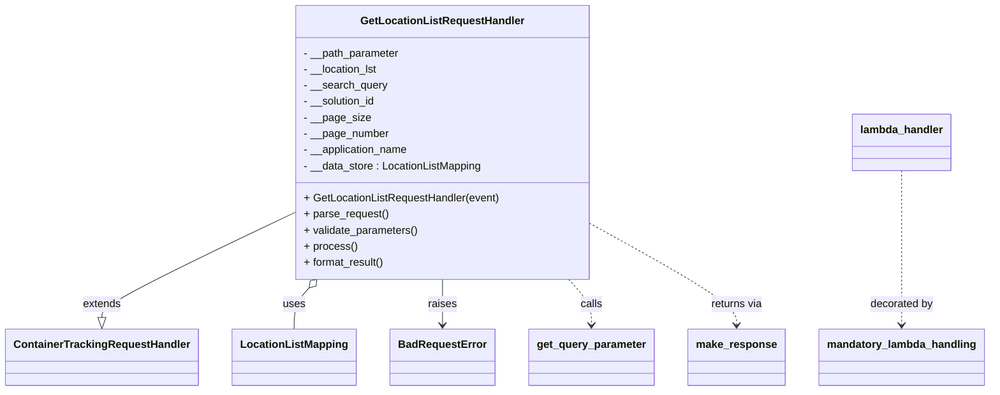

# Diagram: container_tracking_core/container_tracking_service/container_tracking_service/api/advanced_search_filters_dynamic/location_list/location_list_handler.py


> Auto-generated by Obscura crawlers

## Diagram 1



> SVG rendering failed for this diagram.

## Diagram 2

```mermaid
sequenceDiagram
participant Client as event/context
participant Lambda as lambda_handler
participant Decorator as mandatory_lambda_handling
participant Handler as GetLocationListRequestHandler
participant QueryParam as get_query_parameter
participant DataStore as LocationListMapping
participant Response as make_response
participant Error as BadRequestError

Client->>Lambda: invoke(event, context)
Lambda->>Decorator: decorator wrapper(auth_check)
Decorator->>Handler: instantiate(event)
Handler->>Handler: parse_request()
Handler->>QueryParam: get_query_parameter("filter_name", "query", "pageSize", "pageNumber")
QueryParam-->>Handler: parameters
Handler->>Handler: validate_parameters()
alt validation fails
Handler-->>Error: raise BadRequestError
Error-->>Lambda: error propagated
else validation succeeds
Handler->>Handler: process()
Handler->>DataStore: retrieve_list_of_locations(filter, query, pageSize, pageNumber, solution_id)
DataStore-->>Handler: location_list
Handler->>Handler: format_result()
Handler->>Response: make_response(result, 200)
Response-->>Lambda: HTTP response
Lambda-->>Client: return response
```

> SVG rendering failed for this diagram.
