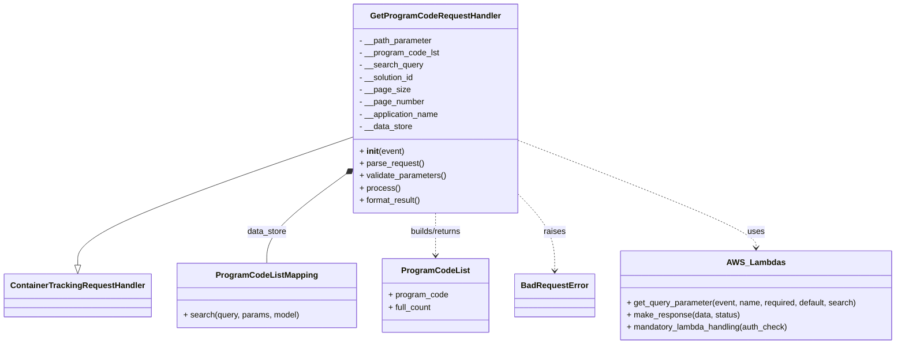
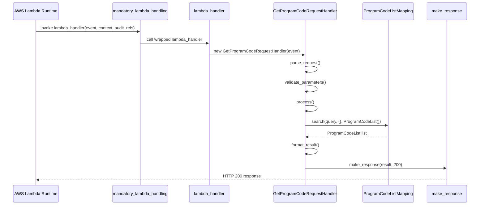

# Diagram: container_tracking_core/container_tracking_service/container_tracking_service/api/advanced_search_filters_dynamic/program_code/program_code_handler.py


> Auto-generated by Obscura crawlers

## Diagram 1



### SVG

<svg id="container" width="1715.828125" xmlns="http://www.w3.org/2000/svg" class="classDiagram" height="672" viewBox="0 0 1715.828125 672" role="graphics-document document" aria-roledescription="class"><style>#container{font-family:"trebuchet ms",verdana,arial,sans-serif;font-size:16px;fill:#333;}@keyframes edge-animation-frame{from{stroke-dashoffset:0;}}@keyframes dash{to{stroke-dashoffset:0;}}#container .edge-animation-slow{stroke-dasharray:9,5!important;stroke-dashoffset:900;animation:dash 50s linear infinite;stroke-linecap:round;}#container .edge-animation-fast{stroke-dasharray:9,5!important;stroke-dashoffset:900;animation:dash 20s linear infinite;stroke-linecap:round;}#container .error-icon{fill:#552222;}#container .error-text{fill:#552222;stroke:#552222;}#container .edge-thickness-normal{stroke-width:1px;}#container .edge-thickness-thick{stroke-width:3.5px;}#container .edge-pattern-solid{stroke-dasharray:0;}#container .edge-thickness-invisible{stroke-width:0;fill:none;}#container .edge-pattern-dashed{stroke-dasharray:3;}#container .edge-pattern-dotted{stroke-dasharray:2;}#container .marker{fill:#333333;stroke:#333333;}#container .marker.cross{stroke:#333333;}#container svg{font-family:"trebuchet ms",verdana,arial,sans-serif;font-size:16px;}#container p{margin:0;}#container g.classGroup text{fill:#9370DB;stroke:none;font-family:"trebuchet ms",verdana,arial,sans-serif;font-size:10px;}#container g.classGroup text .title{font-weight:bolder;}#container .nodeLabel,#container .edgeLabel{color:#131300;}#container .edgeLabel .label rect{fill:#ECECFF;}#container .label text{fill:#131300;}#container .labelBkg{background:#ECECFF;}#container .edgeLabel .label span{background:#ECECFF;}#container .classTitle{font-weight:bolder;}#container .node rect,#container .node circle,#container .node ellipse,#container .node polygon,#container .node path{fill:#ECECFF;stroke:#9370DB;stroke-width:1px;}#container .divider{stroke:#9370DB;stroke-width:1;}#container g.clickable{cursor:pointer;}#container g.classGroup rect{fill:#ECECFF;stroke:#9370DB;}#container g.classGroup line{stroke:#9370DB;stroke-width:1;}#container .classLabel .box{stroke:none;stroke-width:0;fill:#ECECFF;opacity:0.5;}#container .classLabel .label{fill:#9370DB;font-size:10px;}#container .relation{stroke:#333333;stroke-width:1;fill:none;}#container .dashed-line{stroke-dasharray:3;}#container .dotted-line{stroke-dasharray:1 2;}#container #compositionStart,#container .composition{fill:#333333!important;stroke:#333333!important;stroke-width:1;}#container #compositionEnd,#container .composition{fill:#333333!important;stroke:#333333!important;stroke-width:1;}#container #dependencyStart,#container .dependency{fill:#333333!important;stroke:#333333!important;stroke-width:1;}#container #dependencyStart,#container .dependency{fill:#333333!important;stroke:#333333!important;stroke-width:1;}#container #extensionStart,#container .extension{fill:transparent!important;stroke:#333333!important;stroke-width:1;}#container #extensionEnd,#container .extension{fill:transparent!important;stroke:#333333!important;stroke-width:1;}#container #aggregationStart,#container .aggregation{fill:transparent!important;stroke:#333333!important;stroke-width:1;}#container #aggregationEnd,#container .aggregation{fill:transparent!important;stroke:#333333!important;stroke-width:1;}#container #lollipopStart,#container .lollipop{fill:#ECECFF!important;stroke:#333333!important;stroke-width:1;}#container #lollipopEnd,#container .lollipop{fill:#ECECFF!important;stroke:#333333!important;stroke-width:1;}#container .edgeTerminals{font-size:11px;line-height:initial;}#container .classTitleText{text-anchor:middle;font-size:18px;fill:#333;}#container .label-icon{display:inline-block;height:1em;overflow:visible;vertical-align:-0.125em;}#container .node .label-icon path{fill:currentColor;stroke:revert;stroke-width:revert;}#container :root{--mermaid-font-family:"trebuchet ms",verdana,arial,sans-serif;}</style><g><defs><marker id="container_class-aggregationStart" class="marker aggregation class" refX="18" refY="7" markerWidth="190" markerHeight="240" orient="auto"><path d="M 18,7 L9,13 L1,7 L9,1 Z"></path></marker></defs><defs><marker id="container_class-aggregationEnd" class="marker aggregation class" refX="1" refY="7" markerWidth="20" markerHeight="28" orient="auto"><path d="M 18,7 L9,13 L1,7 L9,1 Z"></path></marker></defs><defs><marker id="container_class-extensionStart" class="marker extension class" refX="18" refY="7" markerWidth="190" markerHeight="240" orient="auto"><path d="M 1,7 L18,13 V 1 Z"></path></marker></defs><defs><marker id="container_class-extensionEnd" class="marker extension class" refX="1" refY="7" markerWidth="20" markerHeight="28" orient="auto"><path d="M 1,1 V 13 L18,7 Z"></path></marker></defs><defs><marker id="container_class-compositionStart" class="marker composition class" refX="18" refY="7" markerWidth="190" markerHeight="240" orient="auto"><path d="M 18,7 L9,13 L1,7 L9,1 Z"></path></marker></defs><defs><marker id="container_class-compositionEnd" class="marker composition class" refX="1" refY="7" markerWidth="20" markerHeight="28" orient="auto"><path d="M 18,7 L9,13 L1,7 L9,1 Z"></path></marker></defs><defs><marker id="container_class-dependencyStart" class="marker dependency class" refX="6" refY="7" markerWidth="190" markerHeight="240" orient="auto"><path d="M 5,7 L9,13 L1,7 L9,1 Z"></path></marker></defs><defs><marker id="container_class-dependencyEnd" class="marker dependency class" refX="13" refY="7" markerWidth="20" markerHeight="28" orient="auto"><path d="M 18,7 L9,13 L14,7 L9,1 Z"></path></marker></defs><defs><marker id="container_class-lollipopStart" class="marker lollipop class" refX="13" refY="7" markerWidth="190" markerHeight="240" orient="auto"><circle stroke="black" fill="transparent" cx="7" cy="7" r="6"></circle></marker></defs><defs><marker id="container_class-lollipopEnd" class="marker lollipop class" refX="1" refY="7" markerWidth="190" markerHeight="240" orient="auto"><circle stroke="black" fill="transparent" cx="7" cy="7" r="6"></circle></marker></defs><g class="root"><g class="clusters"></g><g class="edgePaths"><path d="M671.254,267.666L583.643,298.555C496.031,329.444,320.809,391.222,233.197,432.903C145.586,474.583,145.586,496.167,145.586,506.958L145.586,517.75" id="id_GetProgramCodeRequestHandler_ContainerTrackingRequestHandler_1" class="edge-thickness-normal edge-pattern-solid relation" style=";;;" data-edge="true" data-et="edge" data-id="id_GetProgramCodeRequestHandler_ContainerTrackingRequestHandler_1" data-points="W3sieCI6NjcxLjI1MzkwNjI1LCJ5IjoyNjcuNjY1OTE4MDUyNDYwMTR9LHsieCI6MTQ1LjU4NTkzNzUsInkiOjQ1M30seyJ4IjoxNDUuNTg1OTM3NSwieSI6NTM1fV0=" marker-end="url(#container_class-extensionEnd)"></path><path d="M657.419,339.885L632.104,358.738C606.79,377.59,556.16,415.295,530.846,444.314C505.531,473.333,505.531,493.667,505.531,503.833L505.531,514" id="id_GetProgramCodeRequestHandler_ProgramCodeListMapping_2" class="edge-thickness-normal edge-pattern-solid relation" style=";;;" data-edge="true" data-et="edge" data-id="id_GetProgramCodeRequestHandler_ProgramCodeListMapping_2" data-points="W3sieCI6NjcxLjI1MzkwNjI1LCJ5IjozMjkuNTgyMTkwNjIzMzQwMjR9LHsieCI6NTA1LjUzMTI1LCJ5Ijo0NTN9LHsieCI6NTA1LjUzMTI1LCJ5Ijo1MTR9XQ==" marker-start="url(#container_class-compositionStart)"></path><path d="M829.141,416L829.141,422.167C829.141,428.333,829.141,440.667,829.141,454.5C829.141,468.333,829.141,483.667,829.141,491.333L829.141,499" id="id_GetProgramCodeRequestHandler_ProgramCodeList_3" class="edge-thickness-normal edge-pattern-dashed relation" style=";;;" data-edge="true" data-et="edge" data-id="id_GetProgramCodeRequestHandler_ProgramCodeList_3" data-points="W3sieCI6ODI5LjE0MDYyNSwieSI6NDE2fSx7IngiOjgyOS4xNDA2MjUsInkiOjQ1M30seyJ4Ijo4MjkuMTQwNjI1LCJ5Ijo1MDV9XQ==" marker-end="url(#container_class-dependencyEnd)"></path><path d="M987.027,380.716L998.301,392.763C1009.576,404.811,1032.124,428.905,1043.398,453.619C1054.672,478.333,1054.672,503.667,1054.672,516.333L1054.672,529" id="id_GetProgramCodeRequestHandler_BadRequestError_4" class="edge-thickness-normal edge-pattern-dashed relation" style=";;;" data-edge="true" data-et="edge" data-id="id_GetProgramCodeRequestHandler_BadRequestError_4" data-points="W3sieCI6OTg3LjAyNzM0Mzc1LCJ5IjozODAuNzE1ODYxODUzOTU1OTd9LHsieCI6MTA1NC42NzE4NzUsInkiOjQ1M30seyJ4IjoxMDU0LjY3MTg3NSwieSI6NTM1fV0=" marker-end="url(#container_class-dependencyEnd)"></path><path d="M987.027,273.947L1063.088,303.789C1139.148,333.631,1291.27,393.316,1367.33,428.324C1443.391,463.333,1443.391,473.667,1443.391,478.833L1443.391,484" id="id_GetProgramCodeRequestHandler_AWS_Lambdas_5" class="edge-thickness-normal edge-pattern-dashed relation" style=";;;" data-edge="true" data-et="edge" data-id="id_GetProgramCodeRequestHandler_AWS_Lambdas_5" data-points="W3sieCI6OTg3LjAyNzM0Mzc1LCJ5IjoyNzMuOTQ2NjAwMjc0NzI1MjZ9LHsieCI6MTQ0My4zOTA2MjUsInkiOjQ1M30seyJ4IjoxNDQzLjM5MDYyNSwieSI6NDkwfV0=" marker-end="url(#container_class-dependencyEnd)"></path></g><g class="edgeLabels"><g class="edgeLabel"><g class="label" data-id="id_GetProgramCodeRequestHandler_ContainerTrackingRequestHandler_1" transform="translate(0, 0)"><foreignObject width="0" height="0"><div xmlns="http://www.w3.org/1999/xhtml" class="labelBkg" style="display: table-cell; white-space: nowrap; line-height: 1.5; max-width: 200px; text-align: center;"><span class="edgeLabel"></span></div></foreignObject></g></g><g class="edgeLabel" transform="translate(505.53125, 453)"><g class="label" data-id="id_GetProgramCodeRequestHandler_ProgramCodeListMapping_2" transform="translate(-38.8671875, -12)"><foreignObject width="77.734375" height="24"><div xmlns="http://www.w3.org/1999/xhtml" class="labelBkg" style="display: table-cell; white-space: nowrap; line-height: 1.5; max-width: 200px; text-align: center;"><span class="edgeLabel"><p>data_store</p></span></div></foreignObject></g></g><g class="edgeLabel" transform="translate(829.140625, 453)"><g class="label" data-id="id_GetProgramCodeRequestHandler_ProgramCodeList_3" transform="translate(-52.6796875, -12)"><foreignObject width="105.359375" height="24"><div xmlns="http://www.w3.org/1999/xhtml" class="labelBkg" style="display: table-cell; white-space: nowrap; line-height: 1.5; max-width: 200px; text-align: center;"><span class="edgeLabel"><p>builds/returns</p></span></div></foreignObject></g></g><g class="edgeLabel" transform="translate(1054.671875, 453)"><g class="label" data-id="id_GetProgramCodeRequestHandler_BadRequestError_4" transform="translate(-21.25, -12)"><foreignObject width="42.5" height="24"><div xmlns="http://www.w3.org/1999/xhtml" class="labelBkg" style="display: table-cell; white-space: nowrap; line-height: 1.5; max-width: 200px; text-align: center;"><span class="edgeLabel"><p>raises</p></span></div></foreignObject></g></g><g class="edgeLabel" transform="translate(1443.390625, 453)"><g class="label" data-id="id_GetProgramCodeRequestHandler_AWS_Lambdas_5" transform="translate(-16.4921875, -12)"><foreignObject width="32.984375" height="24"><div xmlns="http://www.w3.org/1999/xhtml" class="labelBkg" style="display: table-cell; white-space: nowrap; line-height: 1.5; max-width: 200px; text-align: center;"><span class="edgeLabel"><p>uses</p></span></div></foreignObject></g></g></g><g class="nodes"><g class="node default" id="classId-GetProgramCodeRequestHandler-0" transform="translate(829.140625, 212)"><g class="basic label-container"><path d="M-157.88671875 -204 L157.88671875 -204 L157.88671875 204 L-157.88671875 204" stroke="none" stroke-width="0" fill="#ECECFF" style=""></path><path d="M-157.88671875 -204 C-45.094608734028924 -204, 67.69750128194215 -204, 157.88671875 -204 M-157.88671875 -204 C-71.11971386332863 -204, 15.647291023342746 -204, 157.88671875 -204 M157.88671875 -204 C157.88671875 -43.55817838280831, 157.88671875 116.88364323438338, 157.88671875 204 M157.88671875 -204 C157.88671875 -66.268516184969, 157.88671875 71.462967630062, 157.88671875 204 M157.88671875 204 C70.7564522961069 204, -16.3738141577862 204, -157.88671875 204 M157.88671875 204 C58.99114162593946 204, -39.904435498121074 204, -157.88671875 204 M-157.88671875 204 C-157.88671875 78.54046744450415, -157.88671875 -46.91906511099171, -157.88671875 -204 M-157.88671875 204 C-157.88671875 74.46619686314565, -157.88671875 -55.06760627370869, -157.88671875 -204" stroke="#9370DB" stroke-width="1.3" fill="none" stroke-dasharray="0 0" style=""></path></g><g class="annotation-group text" transform="translate(0, -180)"></g><g class="label-group text" transform="translate(-120.8203125, -180)"><g class="label" style="font-weight: bolder" transform="translate(0,-12)"><foreignObject width="241.640625" height="24"><div xmlns="http://www.w3.org/1999/xhtml" style="display: table-cell; white-space: nowrap; line-height: 1.5; max-width: 289px; text-align: center;"><span class="nodeLabel markdown-node-label" style=""><p>GetProgramCodeRequestHandler</p></span></div></foreignObject></g></g><g class="members-group text" transform="translate(-145.88671875, -132)"><g class="label" style="" transform="translate(0,-12)"><foreignObject width="143.921875" height="24"><div xmlns="http://www.w3.org/1999/xhtml" style="display: table-cell; white-space: nowrap; line-height: 1.5; max-width: 202px; text-align: center;"><span class="nodeLabel markdown-node-label" style=""><p>- __path_parameter</p></span></div></foreignObject></g><g class="label" style="" transform="translate(0,12)"><foreignObject width="156.8125" height="24"><div xmlns="http://www.w3.org/1999/xhtml" style="display: table-cell; white-space: nowrap; line-height: 1.5; max-width: 214px; text-align: center;"><span class="nodeLabel markdown-node-label" style=""><p>- __program_code_lst</p></span></div></foreignObject></g><g class="label" style="" transform="translate(0,36)"><foreignObject width="124.28125" height="24"><div xmlns="http://www.w3.org/1999/xhtml" style="display: table-cell; white-space: nowrap; line-height: 1.5; max-width: 182px; text-align: center;"><span class="nodeLabel markdown-node-label" style=""><p>- __search_query</p></span></div></foreignObject></g><g class="label" style="" transform="translate(0,60)"><foreignObject width="109.40625" height="24"><div xmlns="http://www.w3.org/1999/xhtml" style="display: table-cell; white-space: nowrap; line-height: 1.5; max-width: 167px; text-align: center;"><span class="nodeLabel markdown-node-label" style=""><p>- __solution_id</p></span></div></foreignObject></g><g class="label" style="" transform="translate(0,84)"><foreignObject width="97.4375" height="24"><div xmlns="http://www.w3.org/1999/xhtml" style="display: table-cell; white-space: nowrap; line-height: 1.5; max-width: 155px; text-align: center;"><span class="nodeLabel markdown-node-label" style=""><p>- __page_size</p></span></div></foreignObject></g><g class="label" style="" transform="translate(0,108)"><foreignObject width="126.640625" height="24"><div xmlns="http://www.w3.org/1999/xhtml" style="display: table-cell; white-space: nowrap; line-height: 1.5; max-width: 185px; text-align: center;"><span class="nodeLabel markdown-node-label" style=""><p>- __page_number</p></span></div></foreignObject></g><g class="label" style="" transform="translate(0,132)"><foreignObject width="157.796875" height="24"><div xmlns="http://www.w3.org/1999/xhtml" style="display: table-cell; white-space: nowrap; line-height: 1.5; max-width: 215px; text-align: center;"><span class="nodeLabel markdown-node-label" style=""><p>- __application_name</p></span></div></foreignObject></g><g class="label" style="" transform="translate(0,156)"><foreignObject width="104.578125" height="24"><div xmlns="http://www.w3.org/1999/xhtml" style="display: table-cell; white-space: nowrap; line-height: 1.5; max-width: 162px; text-align: center;"><span class="nodeLabel markdown-node-label" style=""><p>- __data_store</p></span></div></foreignObject></g></g><g class="methods-group text" transform="translate(-145.88671875, 84)"><g class="label" style="" transform="translate(0,-12)"><foreignObject width="87.390625" height="24"><div xmlns="http://www.w3.org/1999/xhtml" style="display: table-cell; white-space: nowrap; line-height: 1.5; max-width: 177px; text-align: center;"><span class="nodeLabel markdown-node-label" style=""><p>+ <strong>init</strong>(event)</p></span></div></foreignObject></g><g class="label" style="" transform="translate(0,12)"><foreignObject width="126.046875" height="24"><div xmlns="http://www.w3.org/1999/xhtml" style="display: table-cell; white-space: nowrap; line-height: 1.5; max-width: 183px; text-align: center;"><span class="nodeLabel markdown-node-label" style=""><p>+ parse_request()</p></span></div></foreignObject></g><g class="label" style="" transform="translate(0,36)"><foreignObject width="170.953125" height="24"><div xmlns="http://www.w3.org/1999/xhtml" style="display: table-cell; white-space: nowrap; line-height: 1.5; max-width: 228px; text-align: center;"><span class="nodeLabel markdown-node-label" style=""><p>+ validate_parameters()</p></span></div></foreignObject></g><g class="label" style="" transform="translate(0,60)"><foreignObject width="77.96875" height="24"><div xmlns="http://www.w3.org/1999/xhtml" style="display: table-cell; white-space: nowrap; line-height: 1.5; max-width: 135px; text-align: center;"><span class="nodeLabel markdown-node-label" style=""><p>+ process()</p></span></div></foreignObject></g><g class="label" style="" transform="translate(0,84)"><foreignObject width="121.5" height="24"><div xmlns="http://www.w3.org/1999/xhtml" style="display: table-cell; white-space: nowrap; line-height: 1.5; max-width: 179px; text-align: center;"><span class="nodeLabel markdown-node-label" style=""><p>+ format_result()</p></span></div></foreignObject></g></g><g class="divider" style=""><path d="M-157.88671875 -156 C-81.66195976040248 -156, -5.437200770804964 -156, 157.88671875 -156 M-157.88671875 -156 C-81.8689847598219 -156, -5.851250769643798 -156, 157.88671875 -156" stroke="#9370DB" stroke-width="1.3" fill="none" stroke-dasharray="0 0" style=""></path></g><g class="divider" style=""><path d="M-157.88671875 60 C-81.28605283625846 60, -4.685386922516926 60, 157.88671875 60 M-157.88671875 60 C-93.7437453762986 60, -29.60077200259721 60, 157.88671875 60" stroke="#9370DB" stroke-width="1.3" fill="none" stroke-dasharray="0 0" style=""></path></g></g><g class="node default" id="classId-ContainerTrackingRequestHandler-1" transform="translate(145.5859375, 577)"><g class="basic label-container"><path d="M-137.5859375 -42 L137.5859375 -42 L137.5859375 42 L-137.5859375 42" stroke="none" stroke-width="0" fill="#ECECFF" style=""></path><path d="M-137.5859375 -42 C-56.64549981493907 -42, 24.294937870121856 -42, 137.5859375 -42 M-137.5859375 -42 C-39.2951321058614 -42, 58.9956732882772 -42, 137.5859375 -42 M137.5859375 -42 C137.5859375 -24.575208492293754, 137.5859375 -7.150416984587508, 137.5859375 42 M137.5859375 -42 C137.5859375 -20.451037252624687, 137.5859375 1.0979254947506263, 137.5859375 42 M137.5859375 42 C61.75020622801189 42, -14.085525043976219 42, -137.5859375 42 M137.5859375 42 C39.19484461048182 42, -59.196248279036354 42, -137.5859375 42 M-137.5859375 42 C-137.5859375 11.7694640363727, -137.5859375 -18.4610719272546, -137.5859375 -42 M-137.5859375 42 C-137.5859375 24.552221455854365, -137.5859375 7.10444291170873, -137.5859375 -42" stroke="#9370DB" stroke-width="1.3" fill="none" stroke-dasharray="0 0" style=""></path></g><g class="annotation-group text" transform="translate(0, -18)"></g><g class="label-group text" transform="translate(-125.5859375, -18)"><g class="label" style="font-weight: bolder" transform="translate(0,-12)"><foreignObject width="251.171875" height="24"><div xmlns="http://www.w3.org/1999/xhtml" style="display: table-cell; white-space: nowrap; line-height: 1.5; max-width: 299px; text-align: center;"><span class="nodeLabel markdown-node-label" style=""><p>ContainerTrackingRequestHandler</p></span></div></foreignObject></g></g><g class="members-group text" transform="translate(-125.5859375, 30)"></g><g class="methods-group text" transform="translate(-125.5859375, 60)"></g><g class="divider" style=""><path d="M-137.5859375 6 C-45.524587458631586 6, 46.53676258273683 6, 137.5859375 6 M-137.5859375 6 C-78.97892338623925 6, -20.371909272478504 6, 137.5859375 6" stroke="#9370DB" stroke-width="1.3" fill="none" stroke-dasharray="0 0" style=""></path></g><g class="divider" style=""><path d="M-137.5859375 24 C-30.521298834370967 24, 76.54333983125807 24, 137.5859375 24 M-137.5859375 24 C-68.00529050501657 24, 1.5753564899668504 24, 137.5859375 24" stroke="#9370DB" stroke-width="1.3" fill="none" stroke-dasharray="0 0" style=""></path></g></g><g class="node default" id="classId-ProgramCodeListMapping-2" transform="translate(505.53125, 577)"><g class="basic label-container"><path d="M-172.359375 -63 L172.359375 -63 L172.359375 63 L-172.359375 63" stroke="none" stroke-width="0" fill="#ECECFF" style=""></path><path d="M-172.359375 -63 C-73.45879837773768 -63, 25.44177824452464 -63, 172.359375 -63 M-172.359375 -63 C-51.50958030407233 -63, 69.34021439185534 -63, 172.359375 -63 M172.359375 -63 C172.359375 -15.29010598478309, 172.359375 32.41978803043382, 172.359375 63 M172.359375 -63 C172.359375 -22.507282641672035, 172.359375 17.98543471665593, 172.359375 63 M172.359375 63 C75.96359556704222 63, -20.43218386591556 63, -172.359375 63 M172.359375 63 C78.80121023465588 63, -14.756954530688233 63, -172.359375 63 M-172.359375 63 C-172.359375 19.62354251466145, -172.359375 -23.752914970677097, -172.359375 -63 M-172.359375 63 C-172.359375 13.49949952570173, -172.359375 -36.00100094859654, -172.359375 -63" stroke="#9370DB" stroke-width="1.3" fill="none" stroke-dasharray="0 0" style=""></path></g><g class="annotation-group text" transform="translate(0, -39)"></g><g class="label-group text" transform="translate(-93.90625, -39)"><g class="label" style="font-weight: bolder" transform="translate(0,-12)"><foreignObject width="187.8125" height="24"><div xmlns="http://www.w3.org/1999/xhtml" style="display: table-cell; white-space: nowrap; line-height: 1.5; max-width: 235px; text-align: center;"><span class="nodeLabel markdown-node-label" style=""><p>ProgramCodeListMapping</p></span></div></foreignObject></g></g><g class="members-group text" transform="translate(-160.359375, 9)"></g><g class="methods-group text" transform="translate(-160.359375, 39)"><g class="label" style="" transform="translate(0,-12)"><foreignObject width="226.8125" height="24"><div xmlns="http://www.w3.org/1999/xhtml" style="display: table-cell; white-space: nowrap; line-height: 1.5; max-width: 284px; text-align: center;"><span class="nodeLabel markdown-node-label" style=""><p>+ search(query, params, model)</p></span></div></foreignObject></g></g><g class="divider" style=""><path d="M-172.359375 -15 C-50.024575116306934 -15, 72.31022476738613 -15, 172.359375 -15 M-172.359375 -15 C-77.45380786760045 -15, 17.451759264799108 -15, 172.359375 -15" stroke="#9370DB" stroke-width="1.3" fill="none" stroke-dasharray="0 0" style=""></path></g><g class="divider" style=""><path d="M-172.359375 9 C-70.05574959074129 9, 32.24787581851743 9, 172.359375 9 M-172.359375 9 C-49.58767890018078 9, 73.18401719963845 9, 172.359375 9" stroke="#9370DB" stroke-width="1.3" fill="none" stroke-dasharray="0 0" style=""></path></g></g><g class="node default" id="classId-ProgramCodeList-3" transform="translate(829.140625, 577)"><g class="basic label-container"><path d="M-101.25 -72 L101.25 -72 L101.25 72 L-101.25 72" stroke="none" stroke-width="0" fill="#ECECFF" style=""></path><path d="M-101.25 -72 C-43.517150760266844 -72, 14.215698479466312 -72, 101.25 -72 M-101.25 -72 C-41.648834900485014 -72, 17.952330199029973 -72, 101.25 -72 M101.25 -72 C101.25 -34.42566616108119, 101.25 3.148667677837622, 101.25 72 M101.25 -72 C101.25 -30.607852754313548, 101.25 10.784294491372904, 101.25 72 M101.25 72 C56.020828683457694 72, 10.791657366915388 72, -101.25 72 M101.25 72 C20.557949524028075 72, -60.13410095194385 72, -101.25 72 M-101.25 72 C-101.25 19.476632215344836, -101.25 -33.04673556931033, -101.25 -72 M-101.25 72 C-101.25 23.639226271171715, -101.25 -24.72154745765657, -101.25 -72" stroke="#9370DB" stroke-width="1.3" fill="none" stroke-dasharray="0 0" style=""></path></g><g class="annotation-group text" transform="translate(0, -48)"></g><g class="label-group text" transform="translate(-62.40625, -48)"><g class="label" style="font-weight: bolder" transform="translate(0,-12)"><foreignObject width="124.8125" height="24"><div xmlns="http://www.w3.org/1999/xhtml" style="display: table-cell; white-space: nowrap; line-height: 1.5; max-width: 173px; text-align: center;"><span class="nodeLabel markdown-node-label" style=""><p>ProgramCodeList</p></span></div></foreignObject></g></g><g class="members-group text" transform="translate(-89.25, 0)"><g class="label" style="" transform="translate(0,-12)"><foreignObject width="116.09375" height="24"><div xmlns="http://www.w3.org/1999/xhtml" style="display: table-cell; white-space: nowrap; line-height: 1.5; max-width: 173px; text-align: center;"><span class="nodeLabel markdown-node-label" style=""><p>+ program_code</p></span></div></foreignObject></g><g class="label" style="" transform="translate(0,12)"><foreignObject width="85.421875" height="24"><div xmlns="http://www.w3.org/1999/xhtml" style="display: table-cell; white-space: nowrap; line-height: 1.5; max-width: 143px; text-align: center;"><span class="nodeLabel markdown-node-label" style=""><p>+ full_count</p></span></div></foreignObject></g></g><g class="methods-group text" transform="translate(-89.25, 72)"></g><g class="divider" style=""><path d="M-101.25 -24 C-46.95991603371907 -24, 7.330167932561864 -24, 101.25 -24 M-101.25 -24 C-56.4202677055775 -24, -11.590535411155003 -24, 101.25 -24" stroke="#9370DB" stroke-width="1.3" fill="none" stroke-dasharray="0 0" style=""></path></g><g class="divider" style=""><path d="M-101.25 48 C-51.69471545485831 48, -2.139430909716623 48, 101.25 48 M-101.25 48 C-23.070898900589754 48, 55.10820219882049 48, 101.25 48" stroke="#9370DB" stroke-width="1.3" fill="none" stroke-dasharray="0 0" style=""></path></g></g><g class="node default" id="classId-BadRequestError-4" transform="translate(1054.671875, 577)"><g class="basic label-container"><path d="M-74.28125 -42 L74.28125 -42 L74.28125 42 L-74.28125 42" stroke="none" stroke-width="0" fill="#ECECFF" style=""></path><path d="M-74.28125 -42 C-26.77332355231102 -42, 20.73460289537796 -42, 74.28125 -42 M-74.28125 -42 C-26.518568209808848 -42, 21.244113580382304 -42, 74.28125 -42 M74.28125 -42 C74.28125 -8.46552375233751, 74.28125 25.06895249532498, 74.28125 42 M74.28125 -42 C74.28125 -13.434997390564007, 74.28125 15.130005218871986, 74.28125 42 M74.28125 42 C33.18291030295076 42, -7.9154293940984815 42, -74.28125 42 M74.28125 42 C18.197384903784055 42, -37.88648019243189 42, -74.28125 42 M-74.28125 42 C-74.28125 18.910392546118253, -74.28125 -4.179214907763495, -74.28125 -42 M-74.28125 42 C-74.28125 11.219682097478046, -74.28125 -19.56063580504391, -74.28125 -42" stroke="#9370DB" stroke-width="1.3" fill="none" stroke-dasharray="0 0" style=""></path></g><g class="annotation-group text" transform="translate(0, -18)"></g><g class="label-group text" transform="translate(-62.28125, -18)"><g class="label" style="font-weight: bolder" transform="translate(0,-12)"><foreignObject width="124.5625" height="24"><div xmlns="http://www.w3.org/1999/xhtml" style="display: table-cell; white-space: nowrap; line-height: 1.5; max-width: 174px; text-align: center;"><span class="nodeLabel markdown-node-label" style=""><p>BadRequestError</p></span></div></foreignObject></g></g><g class="members-group text" transform="translate(-62.28125, 30)"></g><g class="methods-group text" transform="translate(-62.28125, 60)"></g><g class="divider" style=""><path d="M-74.28125 6 C-20.8110321677445 6, 32.659185664511 6, 74.28125 6 M-74.28125 6 C-40.50055953871907 6, -6.719869077438133 6, 74.28125 6" stroke="#9370DB" stroke-width="1.3" fill="none" stroke-dasharray="0 0" style=""></path></g><g class="divider" style=""><path d="M-74.28125 24 C-39.52252942001177 24, -4.763808840023543 24, 74.28125 24 M-74.28125 24 C-26.737396626065703 24, 20.806456747868594 24, 74.28125 24" stroke="#9370DB" stroke-width="1.3" fill="none" stroke-dasharray="0 0" style=""></path></g></g><g class="node default" id="classId-AWS_Lambdas-5" transform="translate(1443.390625, 577)"><g class="basic label-container"><path d="M-264.4375 -87 L264.4375 -87 L264.4375 87 L-264.4375 87" stroke="none" stroke-width="0" fill="#ECECFF" style=""></path><path d="M-264.4375 -87 C-58.60268417612707 -87, 147.23213164774586 -87, 264.4375 -87 M-264.4375 -87 C-87.47890419965049 -87, 89.47969160069903 -87, 264.4375 -87 M264.4375 -87 C264.4375 -40.54859233001926, 264.4375 5.902815339961478, 264.4375 87 M264.4375 -87 C264.4375 -39.47526302955772, 264.4375 8.049473940884553, 264.4375 87 M264.4375 87 C72.05285818802463 87, -120.33178362395074 87, -264.4375 87 M264.4375 87 C84.68741821755756 87, -95.06266356488487 87, -264.4375 87 M-264.4375 87 C-264.4375 48.373202464815215, -264.4375 9.74640492963043, -264.4375 -87 M-264.4375 87 C-264.4375 31.69209186188897, -264.4375 -23.615816276222063, -264.4375 -87" stroke="#9370DB" stroke-width="1.3" fill="none" stroke-dasharray="0 0" style=""></path></g><g class="annotation-group text" transform="translate(0, -63)"></g><g class="label-group text" transform="translate(-52.828125, -63)"><g class="label" style="font-weight: bolder" transform="translate(0,-12)"><foreignObject width="105.65625" height="24"><div xmlns="http://www.w3.org/1999/xhtml" style="display: table-cell; white-space: nowrap; line-height: 1.5; max-width: 154px; text-align: center;"><span class="nodeLabel markdown-node-label" style=""><p>AWS_Lambdas</p></span></div></foreignObject></g></g><g class="members-group text" transform="translate(-252.4375, -15)"></g><g class="methods-group text" transform="translate(-252.4375, 15)"><g class="label" style="" transform="translate(0,-12)"><foreignObject width="452.046875" height="24"><div xmlns="http://www.w3.org/1999/xhtml" style="display: table-cell; white-space: nowrap; line-height: 1.5; max-width: 509px; text-align: center;"><span class="nodeLabel markdown-node-label" style=""><p>+ get_query_parameter(event, name, required, default, search)</p></span></div></foreignObject></g><g class="label" style="" transform="translate(0,12)"><foreignObject width="221.203125" height="24"><div xmlns="http://www.w3.org/1999/xhtml" style="display: table-cell; white-space: nowrap; line-height: 1.5; max-width: 279px; text-align: center;"><span class="nodeLabel markdown-node-label" style=""><p>+ make_response(data, status)</p></span></div></foreignObject></g><g class="label" style="" transform="translate(0,36)"><foreignObject width="319.0625" height="24"><div xmlns="http://www.w3.org/1999/xhtml" style="display: table-cell; white-space: nowrap; line-height: 1.5; max-width: 376px; text-align: center;"><span class="nodeLabel markdown-node-label" style=""><p>+ mandatory_lambda_handling(auth_check)</p></span></div></foreignObject></g></g><g class="divider" style=""><path d="M-264.4375 -39 C-70.93147077864802 -39, 122.57455844270396 -39, 264.4375 -39 M-264.4375 -39 C-91.11714684835502 -39, 82.20320630328996 -39, 264.4375 -39" stroke="#9370DB" stroke-width="1.3" fill="none" stroke-dasharray="0 0" style=""></path></g><g class="divider" style=""><path d="M-264.4375 -15 C-96.29554646295082 -15, 71.84640707409835 -15, 264.4375 -15 M-264.4375 -15 C-72.13614055363726 -15, 120.16521889272548 -15, 264.4375 -15" stroke="#9370DB" stroke-width="1.3" fill="none" stroke-dasharray="0 0" style=""></path></g></g></g></g></g></svg>

## Diagram 2



> SVG rendering failed for this diagram.

## Diagram 3

```mermaid
flowchart TD
A[lambda_handler entry] --> B[mandatory_lambda_handling decorator]
B --> C[Instantiate GetProgramCodeRequestHandler]
C --> D[parse_request() - read query params]
D --> E[validate_parameters() - type checks]
E --> F[process() - build SQL query]
F --> G[ProgramCodeListMapping.search(query, {}, ProgramCodeList())]
G --> H[format_result() - build meta & results]
H --> I[make_response(data, http.HTTPStatus.OK)]
I --> J[Return HTTP response]
```

> SVG rendering failed for this diagram.
