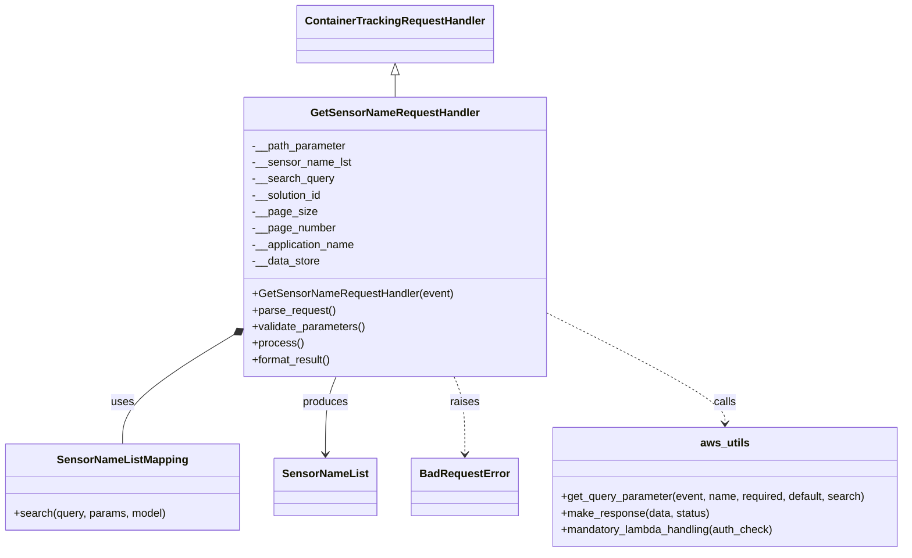
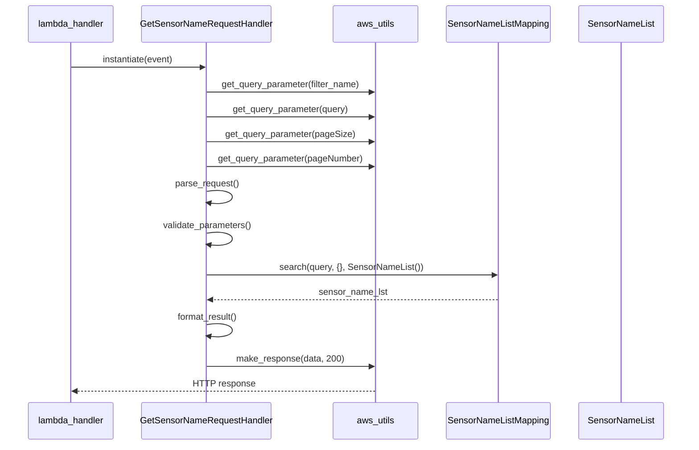

# Diagram: container_tracking_core/container_tracking_service/container_tracking_service/api/advanced_search_filters_dynamic/sensor_name/sensor_name_handler.py

> Auto-generated by Obscura crawlers

## Diagram 1

### SVG

<svg id="container" width="1301.2265625" xmlns="http://www.w3.org/2000/svg" class="classDiagram" height="806" viewBox="0 0 1301.2265625 806" role="graphics-document document" aria-roledescription="class"><g><defs><marker id="container_class-aggregationStart" class="marker aggregation class" refX="18" refY="7" markerWidth="190" markerHeight="240" orient="auto"><path d="M 18,7 L9,13 L1,7 L9,1 Z"></path></marker></defs><defs><marker id="container_class-aggregationEnd" class="marker aggregation class" refX="1" refY="7" markerWidth="20" markerHeight="28" orient="auto"><path d="M 18,7 L9,13 L1,7 L9,1 Z"></path></marker></defs><defs><marker id="container_class-extensionStart" class="marker extension class" refX="18" refY="7" markerWidth="190" markerHeight="240" orient="auto"><path d="M 1,7 L18,13 V 1 Z"></path></marker></defs><defs><marker id="container_class-extensionEnd" class="marker extension class" refX="1" refY="7" markerWidth="20" markerHeight="28" orient="auto"><path d="M 1,1 V 13 L18,7 Z"></path></marker></defs><defs><marker id="container_class-compositionStart" class="marker composition class" refX="18" refY="7" markerWidth="190" markerHeight="240" orient="auto"><path d="M 18,7 L9,13 L1,7 L9,1 Z"></path></marker></defs><defs><marker id="container_class-compositionEnd" class="marker composition class" refX="1" refY="7" markerWidth="20" markerHeight="28" orient="auto"><path d="M 18,7 L9,13 L1,7 L9,1 Z"></path></marker></defs><defs><marker id="container_class-dependencyStart" class="marker dependency class" refX="6" refY="7" markerWidth="190" markerHeight="240" orient="auto"><path d="M 5,7 L9,13 L1,7 L9,1 Z"></path></marker></defs><defs><marker id="container_class-dependencyEnd" class="marker dependency class" refX="13" refY="7" markerWidth="20" markerHeight="28" orient="auto"><path d="M 18,7 L9,13 L14,7 L9,1 Z"></path></marker></defs><defs><marker id="container_class-lollipopStart" class="marker lollipop class" refX="13" refY="7" markerWidth="190" markerHeight="240" orient="auto"><circle stroke="black" fill="transparent" cx="7" cy="7" r="6"></circle></marker></defs><defs><marker id="container_class-lollipopEnd" class="marker lollipop class" refX="1" refY="7" markerWidth="190" markerHeight="240" orient="auto"><circle stroke="black" fill="transparent" cx="7" cy="7" r="6"></circle></marker></defs><g class="root"><g class="clusters"></g><g class="edgePaths"><path d="M565.039,109.25L565.039,110.542C565.039,111.833,565.039,114.417,565.039,119.875C565.039,125.333,565.039,133.667,565.039,137.833L565.039,142" id="id_ContainerTrackingRequestHandler_GetSensorNameRequestHandler_1" class="edge-thickness-normal edge-pattern-solid relation" style=";;;" data-edge="true" data-et="edge" data-id="id_ContainerTrackingRequestHandler_GetSensorNameRequestHandler_1" data-points="W3sieCI6NTY1LjAzOTA2MjUsInkiOjkyfSx7IngiOjU2NS4wMzkwNjI1LCJ5IjoxMTd9LHsieCI6NTY1LjAzOTA2MjUsInkiOjE0Mn1d" marker-start="url(#container_class-extensionStart)"></path><path d="M333.309,489.847L307.224,506.039C281.14,522.231,228.97,554.616,202.885,580.975C176.801,607.333,176.801,627.667,176.801,637.833L176.801,648" id="id_GetSensorNameRequestHandler_SensorNameListMapping_2" class="edge-thickness-normal edge-pattern-solid relation" style=";;;" data-edge="true" data-et="edge" data-id="id_GetSensorNameRequestHandler_SensorNameListMapping_2" data-points="W3sieCI6MzQ3Ljk2NDg0Mzc1LCJ5Ijo0ODAuNzQ5NDI5MDExMjU4OH0seyJ4IjoxNzYuODAwNzgxMjUsInkiOjU4N30seyJ4IjoxNzYuODAwNzgxMjUsInkiOjY0OH1d" marker-start="url(#container_class-compositionStart)"></path><path d="M482.164,550L479.659,556.167C477.154,562.333,472.143,574.667,469.638,593.5C467.133,612.333,467.133,637.667,467.133,650.333L467.133,663" id="id_GetSensorNameRequestHandler_SensorNameList_3" class="edge-thickness-normal edge-pattern-solid relation" style=";;;" data-edge="true" data-et="edge" data-id="id_GetSensorNameRequestHandler_SensorNameList_3" data-points="W3sieCI6NDgyLjE2NDA2MjUsInkiOjU1MH0seyJ4Ijo0NjcuMTMyODEyNSwieSI6NTg3fSx7IngiOjQ2Ny4xMzI4MTI1LCJ5Ijo2Njl9XQ==" marker-end="url(#container_class-dependencyEnd)"></path><path d="M647.914,550L650.419,556.167C652.924,562.333,657.935,574.667,660.44,593.5C662.945,612.333,662.945,637.667,662.945,650.333L662.945,663" id="id_GetSensorNameRequestHandler_BadRequestError_4" class="edge-thickness-normal edge-pattern-dashed relation" style=";;;" data-edge="true" data-et="edge" data-id="id_GetSensorNameRequestHandler_BadRequestError_4" data-points="W3sieCI6NjQ3LjkxNDA2MjUsInkiOjU1MH0seyJ4Ijo2NjIuOTQ1MzEyNSwieSI6NTg3fSx7IngiOjY2Mi45NDUzMTI1LCJ5Ijo2Njl9XQ==" marker-end="url(#container_class-dependencyEnd)"></path><path d="M782.113,456.093L825.132,477.911C868.151,499.729,954.189,543.364,997.208,570.349C1040.227,597.333,1040.227,607.667,1040.227,612.833L1040.227,618" id="id_GetSensorNameRequestHandler_aws_utils_5" class="edge-thickness-normal edge-pattern-dashed relation" style=";;;" data-edge="true" data-et="edge" data-id="id_GetSensorNameRequestHandler_aws_utils_5" data-points="W3sieCI6NzgyLjExMzI4MTI1LCJ5Ijo0NTYuMDkzMTQ1Nzk3NzExNDN9LHsieCI6MTA0MC4yMjY1NjI1LCJ5Ijo1ODd9LHsieCI6MTA0MC4yMjY1NjI1LCJ5Ijo2MjR9XQ==" marker-end="url(#container_class-dependencyEnd)"></path></g><g class="edgeLabels"><g class="edgeLabel"><g class="label" data-id="id_ContainerTrackingRequestHandler_GetSensorNameRequestHandler_1" transform="translate(0, 0)"><foreignObject width="0" height="0">

</foreignObject></g></g><g class="edgeLabel" transform="translate(176.80078125, 587)"><g class="label" data-id="id_GetSensorNameRequestHandler_SensorNameListMapping_2" transform="translate(-16.4921875, -12)"><foreignObject width="32.984375" height="24">

uses

</foreignObject></g></g><g class="edgeLabel" transform="translate(467.1328125, 587)"><g class="label" data-id="id_GetSensorNameRequestHandler_SensorNameList_3" transform="translate(-33.4765625, -12)"><foreignObject width="66.953125" height="24">

produces

</foreignObject></g></g><g class="edgeLabel" transform="translate(662.9453125, 587)"><g class="label" data-id="id_GetSensorNameRequestHandler_BadRequestError_4" transform="translate(-21.25, -12)"><foreignObject width="42.5" height="24">

raises

</foreignObject></g></g><g class="edgeLabel" transform="translate(1040.2265625, 587)"><g class="label" data-id="id_GetSensorNameRequestHandler_aws_utils_5" transform="translate(-16.4453125, -12)"><foreignObject width="32.890625" height="24">

calls

</foreignObject></g></g></g><g class="nodes"><g class="node default" id="classId-GetSensorNameRequestHandler-0" transform="translate(565.0390625, 346)"><g class="basic label-container"><path d="M-217.07421875 -204 L217.07421875 -204 L217.07421875 204 L-217.07421875 204" stroke="none" stroke-width="0" fill="#ECECFF" style=""></path><path d="M-217.07421875 -204 C-105.3136893731188 -204, 6.446840003762389 -204, 217.07421875 -204 M-217.07421875 -204 C-69.03507554769652 -204, 79.00406765460696 -204, 217.07421875 -204 M217.07421875 -204 C217.07421875 -121.05680944347148, 217.07421875 -38.11361888694296, 217.07421875 204 M217.07421875 -204 C217.07421875 -63.010907671580696, 217.07421875 77.97818465683861, 217.07421875 204 M217.07421875 204 C95.79407064775046 204, -25.486077454499082 204, -217.07421875 204 M217.07421875 204 C55.872571710360006 204, -105.32907532927999 204, -217.07421875 204 M-217.07421875 204 C-217.07421875 43.285081343475184, -217.07421875 -117.42983731304963, -217.07421875 -204 M-217.07421875 204 C-217.07421875 78.15886103043205, -217.07421875 -47.6822779391359, -217.07421875 -204" stroke="#9370DB" stroke-width="1.3" fill="none" stroke-dasharray="0 0" style=""></path></g><g class="annotation-group text" transform="translate(0, -180)"></g><g class="label-group text" transform="translate(-117.9453125, -180)"><g class="label" style="font-weight: bolder" transform="translate(0,-12)"><foreignObject width="235.890625" height="24">

GetSensorNameRequestHandler

</foreignObject></g></g><g class="members-group text" transform="translate(-205.07421875, -132)"><g class="label" style="" transform="translate(0,-12)"><foreignObject width="138.40625" height="24">

-__path_parameter

</foreignObject></g><g class="label" style="" transform="translate(0,12)"><foreignObject width="143.546875" height="24">

-__sensor_name_lst

</foreignObject></g><g class="label" style="" transform="translate(0,36)"><foreignObject width="118.765625" height="24">

-__search_query

</foreignObject></g><g class="label" style="" transform="translate(0,60)"><foreignObject width="103.875" height="24">

-__solution_id

</foreignObject></g><g class="label" style="" transform="translate(0,84)"><foreignObject width="91.90625" height="24">

-__page_size

</foreignObject></g><g class="label" style="" transform="translate(0,108)"><foreignObject width="121.125" height="24">

-__page_number

</foreignObject></g><g class="label" style="" transform="translate(0,132)"><foreignObject width="152.28125" height="24">

-__application_name

</foreignObject></g><g class="label" style="" transform="translate(0,156)"><foreignObject width="99.0625" height="24">

-__data_store

</foreignObject></g></g><g class="methods-group text" transform="translate(-205.07421875, 84)"><g class="label" style="" transform="translate(0,-12)"><foreignObject width="292.203125" height="24">

+GetSensorNameRequestHandler(event)

</foreignObject></g><g class="label" style="" transform="translate(0,12)"><foreignObject width="121.796875" height="24">

+parse_request()

</foreignObject></g><g class="label" style="" transform="translate(0,36)"><foreignObject width="166.546875" height="24">

+validate_parameters()

</foreignObject></g><g class="label" style="" transform="translate(0,60)"><foreignObject width="73.734375" height="24">

+process()

</foreignObject></g><g class="label" style="" transform="translate(0,84)"><foreignObject width="117.015625" height="24">

+format_result()

</foreignObject></g></g><g class="divider" style=""><path d="M-217.07421875 -156 C-112.3293140645738 -156, -7.584409379147587 -156, 217.07421875 -156 M-217.07421875 -156 C-81.38212265392292 -156, 54.30997344215416 -156, 217.07421875 -156" stroke="#9370DB" stroke-width="1.3" fill="none" stroke-dasharray="0 0" style=""></path></g><g class="divider" style=""><path d="M-217.07421875 60 C-55.95485880995733 60, 105.16450113008534 60, 217.07421875 60 M-217.07421875 60 C-59.882919180895215 60, 97.30838038820957 60, 217.07421875 60" stroke="#9370DB" stroke-width="1.3" fill="none" stroke-dasharray="0 0" style=""></path></g></g><g class="node default" id="classId-ContainerTrackingRequestHandler-1" transform="translate(565.0390625, 50)"><g class="basic label-container"><path d="M-137.5859375 -42 L137.5859375 -42 L137.5859375 42 L-137.5859375 42" stroke="none" stroke-width="0" fill="#ECECFF" style=""></path><path d="M-137.5859375 -42 C-28.03174247658687 -42, 81.52245254682626 -42, 137.5859375 -42 M-137.5859375 -42 C-39.01375444448445 -42, 59.558428611031104 -42, 137.5859375 -42 M137.5859375 -42 C137.5859375 -18.800514482896563, 137.5859375 4.398971034206873, 137.5859375 42 M137.5859375 -42 C137.5859375 -9.81449305390234, 137.5859375 22.37101389219532, 137.5859375 42 M137.5859375 42 C70.06756541312471 42, 2.549193326249423 42, -137.5859375 42 M137.5859375 42 C72.02987157224368 42, 6.473805644487356 42, -137.5859375 42 M-137.5859375 42 C-137.5859375 21.91476418939497, -137.5859375 1.829528378789938, -137.5859375 -42 M-137.5859375 42 C-137.5859375 25.03664674037079, -137.5859375 8.073293480741583, -137.5859375 -42" stroke="#9370DB" stroke-width="1.3" fill="none" stroke-dasharray="0 0" style=""></path></g><g class="annotation-group text" transform="translate(0, -18)"></g><g class="label-group text" transform="translate(-125.5859375, -18)"><g class="label" style="font-weight: bolder" transform="translate(0,-12)"><foreignObject width="251.171875" height="24">

ContainerTrackingRequestHandler

</foreignObject></g></g><g class="members-group text" transform="translate(-125.5859375, 30)"></g><g class="methods-group text" transform="translate(-125.5859375, 60)"></g><g class="divider" style=""><path d="M-137.5859375 6 C-66.67738614578492 6, 4.231165208430156 6, 137.5859375 6 M-137.5859375 6 C-67.59335828539669 6, 2.3992209292066207 6, 137.5859375 6" stroke="#9370DB" stroke-width="1.3" fill="none" stroke-dasharray="0 0" style=""></path></g><g class="divider" style=""><path d="M-137.5859375 24 C-42.742984971981784 24, 52.09996755603643 24, 137.5859375 24 M-137.5859375 24 C-58.66634767055143 24, 20.253242158897137 24, 137.5859375 24" stroke="#9370DB" stroke-width="1.3" fill="none" stroke-dasharray="0 0" style=""></path></g></g><g class="node default" id="classId-SensorNameListMapping-2" transform="translate(176.80078125, 711)"><g class="basic label-container"><path d="M-168.80078125 -63 L168.80078125 -63 L168.80078125 63 L-168.80078125 63" stroke="none" stroke-width="0" fill="#ECECFF" style=""></path><path d="M-168.80078125 -63 C-40.10159141991289 -63, 88.59759841017421 -63, 168.80078125 -63 M-168.80078125 -63 C-46.778236868116096 -63, 75.24430751376781 -63, 168.80078125 -63 M168.80078125 -63 C168.80078125 -24.9617883562523, 168.80078125 13.076423287495402, 168.80078125 63 M168.80078125 -63 C168.80078125 -22.36532465872554, 168.80078125 18.269350682548918, 168.80078125 63 M168.80078125 63 C81.61421276126835 63, -5.572355727463304 63, -168.80078125 63 M168.80078125 63 C41.973904467407635 63, -84.85297231518473 63, -168.80078125 63 M-168.80078125 63 C-168.80078125 27.68199090393145, -168.80078125 -7.636018192137101, -168.80078125 -63 M-168.80078125 63 C-168.80078125 27.342592440187005, -168.80078125 -8.31481511962599, -168.80078125 -63" stroke="#9370DB" stroke-width="1.3" fill="none" stroke-dasharray="0 0" style=""></path></g><g class="annotation-group text" transform="translate(0, -39)"></g><g class="label-group text" transform="translate(-91.0390625, -39)"><g class="label" style="font-weight: bolder" transform="translate(0,-12)"><foreignObject width="182.078125" height="24">

SensorNameListMapping

</foreignObject></g></g><g class="members-group text" transform="translate(-156.80078125, 9)"></g><g class="methods-group text" transform="translate(-156.80078125, 39)"><g class="label" style="" transform="translate(0,-12)"><foreignObject width="222.5625" height="24">

+search(query, params, model)

</foreignObject></g></g><g class="divider" style=""><path d="M-168.80078125 -15 C-88.62273154166236 -15, -8.444681833324722 -15, 168.80078125 -15 M-168.80078125 -15 C-46.69767242701624 -15, 75.40543639596751 -15, 168.80078125 -15" stroke="#9370DB" stroke-width="1.3" fill="none" stroke-dasharray="0 0" style=""></path></g><g class="divider" style=""><path d="M-168.80078125 9 C-70.41332738755757 9, 27.974126474884855 9, 168.80078125 9 M-168.80078125 9 C-60.514979680531 9, 47.770821888938 9, 168.80078125 9" stroke="#9370DB" stroke-width="1.3" fill="none" stroke-dasharray="0 0" style=""></path></g></g><g class="node default" id="classId-SensorNameList-3" transform="translate(467.1328125, 711)"><g class="basic label-container"><path d="M-71.53125 -42 L71.53125 -42 L71.53125 42 L-71.53125 42" stroke="none" stroke-width="0" fill="#ECECFF" style=""></path><path d="M-71.53125 -42 C-18.94553245118611 -42, 33.64018509762778 -42, 71.53125 -42 M-71.53125 -42 C-39.975651829909864 -42, -8.420053659819722 -42, 71.53125 -42 M71.53125 -42 C71.53125 -25.114313584490855, 71.53125 -8.22862716898171, 71.53125 42 M71.53125 -42 C71.53125 -17.693478641412355, 71.53125 6.61304271717529, 71.53125 42 M71.53125 42 C31.727932288310896 42, -8.075385423378208 42, -71.53125 42 M71.53125 42 C34.390398246744574 42, -2.7504535065108513 42, -71.53125 42 M-71.53125 42 C-71.53125 12.717761446833485, -71.53125 -16.56447710633303, -71.53125 -42 M-71.53125 42 C-71.53125 10.14417189762905, -71.53125 -21.7116562047419, -71.53125 -42" stroke="#9370DB" stroke-width="1.3" fill="none" stroke-dasharray="0 0" style=""></path></g><g class="annotation-group text" transform="translate(0, -18)"></g><g class="label-group text" transform="translate(-59.53125, -18)"><g class="label" style="font-weight: bolder" transform="translate(0,-12)"><foreignObject width="119.0625" height="24">

SensorNameList

</foreignObject></g></g><g class="members-group text" transform="translate(-59.53125, 30)"></g><g class="methods-group text" transform="translate(-59.53125, 60)"></g><g class="divider" style=""><path d="M-71.53125 6 C-16.817381222425368 6, 37.896487555149264 6, 71.53125 6 M-71.53125 6 C-15.565573433132393 6, 40.400103133735215 6, 71.53125 6" stroke="#9370DB" stroke-width="1.3" fill="none" stroke-dasharray="0 0" style=""></path></g><g class="divider" style=""><path d="M-71.53125 24 C-37.583166143369894 24, -3.635082286739788 24, 71.53125 24 M-71.53125 24 C-16.154970918277492 24, 39.221308163445016 24, 71.53125 24" stroke="#9370DB" stroke-width="1.3" fill="none" stroke-dasharray="0 0" style=""></path></g></g><g class="node default" id="classId-BadRequestError-4" transform="translate(662.9453125, 711)"><g class="basic label-container"><path d="M-74.28125 -42 L74.28125 -42 L74.28125 42 L-74.28125 42" stroke="none" stroke-width="0" fill="#ECECFF" style=""></path><path d="M-74.28125 -42 C-33.251564640099836 -42, 7.778120719800327 -42, 74.28125 -42 M-74.28125 -42 C-36.355665412591144 -42, 1.5699191748177128 -42, 74.28125 -42 M74.28125 -42 C74.28125 -17.017307534493607, 74.28125 7.965384931012785, 74.28125 42 M74.28125 -42 C74.28125 -12.126764049402375, 74.28125 17.74647190119525, 74.28125 42 M74.28125 42 C33.50821070650673 42, -7.264828586986539 42, -74.28125 42 M74.28125 42 C24.8712578804585 42, -24.538734239083 42, -74.28125 42 M-74.28125 42 C-74.28125 13.0939436058855, -74.28125 -15.812112788229001, -74.28125 -42 M-74.28125 42 C-74.28125 22.525029581541286, -74.28125 3.0500591630825724, -74.28125 -42" stroke="#9370DB" stroke-width="1.3" fill="none" stroke-dasharray="0 0" style=""></path></g><g class="annotation-group text" transform="translate(0, -18)"></g><g class="label-group text" transform="translate(-62.28125, -18)"><g class="label" style="font-weight: bolder" transform="translate(0,-12)"><foreignObject width="124.5625" height="24">

BadRequestError

</foreignObject></g></g><g class="members-group text" transform="translate(-62.28125, 30)"></g><g class="methods-group text" transform="translate(-62.28125, 60)"></g><g class="divider" style=""><path d="M-74.28125 6 C-39.485222288588254 6, -4.689194577176508 6, 74.28125 6 M-74.28125 6 C-43.48048437268973 6, -12.67971874537946 6, 74.28125 6" stroke="#9370DB" stroke-width="1.3" fill="none" stroke-dasharray="0 0" style=""></path></g><g class="divider" style=""><path d="M-74.28125 24 C-17.7178613951408 24, 38.8455272097184 24, 74.28125 24 M-74.28125 24 C-23.604278876650227 24, 27.072692246699546 24, 74.28125 24" stroke="#9370DB" stroke-width="1.3" fill="none" stroke-dasharray="0 0" style=""></path></g></g><g class="node default" id="classId-aws_utils-5" transform="translate(1040.2265625, 711)"><g class="basic label-container"><path d="M-253 -87 L253 -87 L253 87 L-253 87" stroke="none" stroke-width="0" fill="#ECECFF" style=""></path><path d="M-253 -87 C-86.32791803035798 -87, 80.34416393928404 -87, 253 -87 M-253 -87 C-81.01945510606217 -87, 90.96108978787566 -87, 253 -87 M253 -87 C253 -43.76382965338903, 253 -0.5276593067780624, 253 87 M253 -87 C253 -45.41434376623703, 253 -3.8286875324740635, 253 87 M253 87 C90.29912430640036 87, -72.40175138719928 87, -253 87 M253 87 C149.48414118244233 87, 45.96828236488466 87, -253 87 M-253 87 C-253 24.90957645896905, -253 -37.1808470820619, -253 -87 M-253 87 C-253 30.872255771634364, -253 -25.25548845673127, -253 -87" stroke="#9370DB" stroke-width="1.3" fill="none" stroke-dasharray="0 0" style=""></path></g><g class="annotation-group text" transform="translate(0, -63)"></g><g class="label-group text" transform="translate(-34.203125, -63)"><g class="label" style="font-weight: bolder" transform="translate(0,-12)"><foreignObject width="68.40625" height="24">

aws_utils

</foreignObject></g></g><g class="members-group text" transform="translate(-241, -15)"></g><g class="methods-group text" transform="translate(-241, 15)"><g class="label" style="" transform="translate(0,-12)"><foreignObject width="447.796875" height="24">

+get_query_parameter(event, name, required, default, search)

</foreignObject></g><g class="label" style="" transform="translate(0,12)"><foreignObject width="216.96875" height="24">

+make_response(data, status)

</foreignObject></g><g class="label" style="" transform="translate(0,36)"><foreignObject width="314.828125" height="24">

+mandatory_lambda_handling(auth_check)

</foreignObject></g></g><g class="divider" style=""><path d="M-253 -39 C-76.23243621816985 -39, 100.5351275636603 -39, 253 -39 M-253 -39 C-136.42292303490274 -39, -19.845846069805503 -39, 253 -39" stroke="#9370DB" stroke-width="1.3" fill="none" stroke-dasharray="0 0" style=""></path></g><g class="divider" style=""><path d="M-253 -15 C-84.67869379903306 -15, 83.64261240193389 -15, 253 -15 M-253 -15 C-62.64139192948605 -15, 127.7172161410279 -15, 253 -15" stroke="#9370DB" stroke-width="1.3" fill="none" stroke-dasharray="0 0" style=""></path></g></g></g></g></g></svg>

## Diagram 2

### SVG

<svg id="container" width="1282" xmlns="http://www.w3.org/2000/svg" height="837" viewBox="-50 -10 1282 837" role="graphics-document document" aria-roledescription="sequence"><g><rect x="1032" y="751" fill="#eaeaea" stroke="#666" width="150" height="65" name="Model" rx="3" ry="3" class="actor actor-bottom"></rect><text x="1107" y="783.5" dominant-baseline="central" alignment-baseline="central" class="actor actor-box" style="text-anchor: middle; font-size: 16px; font-weight: 400;"><tspan x="1107" dy="0">SensorNameList</tspan></text></g><g><rect x="781" y="751" fill="#eaeaea" stroke="#666" width="201" height="65" name="DataStore" rx="3" ry="3" class="actor actor-bottom"></rect><text x="881.5" y="783.5" dominant-baseline="central" alignment-baseline="central" class="actor actor-box" style="text-anchor: middle; font-size: 16px; font-weight: 400;"><tspan x="881.5" dy="0">SensorNameListMapping</tspan></text></g><g><rect x="581" y="751" fill="#eaeaea" stroke="#666" width="150" height="65" name="Utils" rx="3" ry="3" class="actor actor-bottom"></rect><text x="656" y="783.5" dominant-baseline="central" alignment-baseline="central" class="actor actor-box" style="text-anchor: middle; font-size: 16px; font-weight: 400;"><tspan x="656" dy="0">aws_utils</tspan></text></g><g><rect x="200" y="751" fill="#eaeaea" stroke="#666" width="254" height="65" name="Handler" rx="3" ry="3" class="actor actor-bottom"></rect><text x="327" y="783.5" dominant-baseline="central" alignment-baseline="central" class="actor actor-box" style="text-anchor: middle; font-size: 16px; font-weight: 400;"><tspan x="327" dy="0">GetSensorNameRequestHandler</tspan></text></g><g><rect x="0" y="751" fill="#eaeaea" stroke="#666" width="150" height="65" name="Lambda" rx="3" ry="3" class="actor actor-bottom"></rect><text x="75" y="783.5" dominant-baseline="central" alignment-baseline="central" class="actor actor-box" style="text-anchor: middle; font-size: 16px; font-weight: 400;"><tspan x="75" dy="0">lambda_handler</tspan></text></g><g><line id="actor4" x1="1107" y1="65" x2="1107" y2="751" class="actor-line 200" stroke-width="0.5px" stroke="#999" name="Model"></line><g id="root-4"><rect x="1032" y="0" fill="#eaeaea" stroke="#666" width="150" height="65" name="Model" rx="3" ry="3" class="actor actor-top"></rect><text x="1107" y="32.5" dominant-baseline="central" alignment-baseline="central" class="actor actor-box" style="text-anchor: middle; font-size: 16px; font-weight: 400;"><tspan x="1107" dy="0">SensorNameList</tspan></text></g></g><g><line id="actor3" x1="881.5" y1="65" x2="881.5" y2="751" class="actor-line 200" stroke-width="0.5px" stroke="#999" name="DataStore"></line><g id="root-3"><rect x="781" y="0" fill="#eaeaea" stroke="#666" width="201" height="65" name="DataStore" rx="3" ry="3" class="actor actor-top"></rect><text x="881.5" y="32.5" dominant-baseline="central" alignment-baseline="central" class="actor actor-box" style="text-anchor: middle; font-size: 16px; font-weight: 400;"><tspan x="881.5" dy="0">SensorNameListMapping</tspan></text></g></g><g><line id="actor2" x1="656" y1="65" x2="656" y2="751" class="actor-line 200" stroke-width="0.5px" stroke="#999" name="Utils"></line><g id="root-2"><rect x="581" y="0" fill="#eaeaea" stroke="#666" width="150" height="65" name="Utils" rx="3" ry="3" class="actor actor-top"></rect><text x="656" y="32.5" dominant-baseline="central" alignment-baseline="central" class="actor actor-box" style="text-anchor: middle; font-size: 16px; font-weight: 400;"><tspan x="656" dy="0">aws_utils</tspan></text></g></g><g><line id="actor1" x1="327" y1="65" x2="327" y2="751" class="actor-line 200" stroke-width="0.5px" stroke="#999" name="Handler"></line><g id="root-1"><rect x="200" y="0" fill="#eaeaea" stroke="#666" width="254" height="65" name="Handler" rx="3" ry="3" class="actor actor-top"></rect><text x="327" y="32.5" dominant-baseline="central" alignment-baseline="central" class="actor actor-box" style="text-anchor: middle; font-size: 16px; font-weight: 400;"><tspan x="327" dy="0">GetSensorNameRequestHandler</tspan></text></g></g><g><line id="actor0" x1="75" y1="65" x2="75" y2="751" class="actor-line 200" stroke-width="0.5px" stroke="#999" name="Lambda"></line><g id="root-0"><rect x="0" y="0" fill="#eaeaea" stroke="#666" width="150" height="65" name="Lambda" rx="3" ry="3" class="actor actor-top"></rect><text x="75" y="32.5" dominant-baseline="central" alignment-baseline="central" class="actor actor-box" style="text-anchor: middle; font-size: 16px; font-weight: 400;"><tspan x="75" dy="0">lambda_handler</tspan></text></g></g><g></g><defs><symbol id="computer" width="24" height="24"><path transform="scale(.5)" d="M2 2v13h20v-13h-20zm18 11h-16v-9h16v9zm-10.228 6l.466-1h3.524l.467 1h-4.457zm14.228 3h-24l2-6h2.104l-1.33 4h18.45l-1.297-4h2.073l2 6zm-5-10h-14v-7h14v7z"></path></symbol></defs><defs><symbol id="database" fill-rule="evenodd" clip-rule="evenodd"><path transform="scale(.5)" d="M12.258.001l.256.004.255.005.253.008.251.01.249.012.247.015.246.016.242.019.241.02.239.023.236.024.233.027.231.028.229.031.225.032.223.034.22.036.217.038.214.04.211.041.208.043.205.045.201.046.198.048.194.05.191.051.187.053.183.054.18.056.175.057.172.059.168.06.163.061.16.063.155.064.15.066.074.033.073.033.071.034.07.034.069.035.068.035.067.035.066.035.064.036.064.036.062.036.06.036.06.037.058.037.058.037.055.038.055.038.053.038.052.038.051.039.05.039.048.039.047.039.045.04.044.04.043.04.041.04.04.041.039.041.037.041.036.041.034.041.033.042.032.042.03.042.029.042.027.042.026.043.024.043.023.043.021.043.02.043.018.044.017.043.015.044.013.044.012.044.011.045.009.044.007.045.006.045.004.045.002.045.001.045v17l-.001.045-.002.045-.004.045-.006.045-.007.045-.009.044-.011.045-.012.044-.013.044-.015.044-.017.043-.018.044-.02.043-.021.043-.023.043-.024.043-.026.043-.027.042-.029.042-.03.042-.032.042-.033.042-.034.041-.036.041-.037.041-.039.041-.04.041-.041.04-.043.04-.044.04-.045.04-.047.039-.048.039-.05.039-.051.039-.052.038-.053.038-.055.038-.055.038-.058.037-.058.037-.06.037-.06.036-.062.036-.064.036-.064.036-.066.035-.067.035-.068.035-.069.035-.07.034-.071.034-.073.033-.074.033-.15.066-.155.064-.16.063-.163.061-.168.06-.172.059-.175.057-.18.056-.183.054-.187.053-.191.051-.194.05-.198.048-.201.046-.205.045-.208.043-.211.041-.214.04-.217.038-.22.036-.223.034-.225.032-.229.031-.231.028-.233.027-.236.024-.239.023-.241.02-.242.019-.246.016-.247.015-.249.012-.251.01-.253.008-.255.005-.256.004-.258.001-.258-.001-.256-.004-.255-.005-.253-.008-.251-.01-.249-.012-.247-.015-.245-.016-.243-.019-.241-.02-.238-.023-.236-.024-.234-.027-.231-.028-.228-.031-.226-.032-.223-.034-.22-.036-.217-.038-.214-.04-.211-.041-.208-.043-.204-.045-.201-.046-.198-.048-.195-.05-.19-.051-.187-.053-.184-.054-.179-.056-.176-.057-.172-.059-.167-.06-.164-.061-.159-.063-.155-.064-.151-.066-.074-.033-.072-.033-.072-.034-.07-.034-.069-.035-.068-.035-.067-.035-.066-.035-.064-.036-.063-.036-.062-.036-.061-.036-.06-.037-.058-.037-.057-.037-.056-.038-.055-.038-.053-.038-.052-.038-.051-.039-.049-.039-.049-.039-.046-.039-.046-.04-.044-.04-.043-.04-.041-.04-.04-.041-.039-.041-.037-.041-.036-.041-.034-.041-.033-.042-.032-.042-.03-.042-.029-.042-.027-.042-.026-.043-.024-.043-.023-.043-.021-.043-.02-.043-.018-.044-.017-.043-.015-.044-.013-.044-.012-.044-.011-.045-.009-.044-.007-.045-.006-.045-.004-.045-.002-.045-.001-.045v-17l.001-.045.002-.045.004-.045.006-.045.007-.045.009-.044.011-.045.012-.044.013-.044.015-.044.017-.043.018-.044.02-.043.021-.043.023-.043.024-.043.026-.043.027-.042.029-.042.03-.042.032-.042.033-.042.034-.041.036-.041.037-.041.039-.041.04-.041.041-.04.043-.04.044-.04.046-.04.046-.039.049-.039.049-.039.051-.039.052-.038.053-.038.055-.038.056-.038.057-.037.058-.037.06-.037.061-.036.062-.036.063-.036.064-.036.066-.035.067-.035.068-.035.069-.035.07-.034.072-.034.072-.033.074-.033.151-.066.155-.064.159-.063.164-.061.167-.06.172-.059.176-.057.179-.056.184-.054.187-.053.19-.051.195-.05.198-.048.201-.046.204-.045.208-.043.211-.041.214-.04.217-.038.22-.036.223-.034.226-.032.228-.031.231-.028.234-.027.236-.024.238-.023.241-.02.243-.019.245-.016.247-.015.249-.012.251-.01.253-.008.255-.005.256-.004.258-.001.258.001zm-9.258 20.499v.01l.001.021.003.021.004.022.005.021.006.022.007.022.009.023.01.022.011.023.012.023.013.023.015.023.016.024.017.023.018.024.019.024.021.024.022.025.023.024.024.025.052.049.056.05.061.051.066.051.07.051.075.051.079.052.084.052.088.052.092.052.097.052.102.051.105.052.11.052.114.051.119.051.123.051.127.05.131.05.135.05.139.048.144.049.147.047.152.047.155.047.16.045.163.045.167.043.171.043.176.041.178.041.183.039.187.039.19.037.194.035.197.035.202.033.204.031.209.03.212.029.216.027.219.025.222.024.226.021.23.02.233.018.236.016.24.015.243.012.246.01.249.008.253.005.256.004.259.001.26-.001.257-.004.254-.005.25-.008.247-.011.244-.012.241-.014.237-.016.233-.018.231-.021.226-.021.224-.024.22-.026.216-.027.212-.028.21-.031.205-.031.202-.034.198-.034.194-.036.191-.037.187-.039.183-.04.179-.04.175-.042.172-.043.168-.044.163-.045.16-.046.155-.046.152-.047.148-.048.143-.049.139-.049.136-.05.131-.05.126-.05.123-.051.118-.052.114-.051.11-.052.106-.052.101-.052.096-.052.092-.052.088-.053.083-.051.079-.052.074-.052.07-.051.065-.051.06-.051.056-.05.051-.05.023-.024.023-.025.021-.024.02-.024.019-.024.018-.024.017-.024.015-.023.014-.024.013-.023.012-.023.01-.023.01-.022.008-.022.006-.022.006-.022.004-.022.004-.021.001-.021.001-.021v-4.127l-.077.055-.08.053-.083.054-.085.053-.087.052-.09.052-.093.051-.095.05-.097.05-.1.049-.102.049-.105.048-.106.047-.109.047-.111.046-.114.045-.115.045-.118.044-.12.043-.122.042-.124.042-.126.041-.128.04-.13.04-.132.038-.134.038-.135.037-.138.037-.139.035-.142.035-.143.034-.144.033-.147.032-.148.031-.15.03-.151.03-.153.029-.154.027-.156.027-.158.026-.159.025-.161.024-.162.023-.163.022-.165.021-.166.02-.167.019-.169.018-.169.017-.171.016-.173.015-.173.014-.175.013-.175.012-.177.011-.178.01-.179.008-.179.008-.181.006-.182.005-.182.004-.184.003-.184.002h-.37l-.184-.002-.184-.003-.182-.004-.182-.005-.181-.006-.179-.008-.179-.008-.178-.01-.176-.011-.176-.012-.175-.013-.173-.014-.172-.015-.171-.016-.17-.017-.169-.018-.167-.019-.166-.02-.165-.021-.163-.022-.162-.023-.161-.024-.159-.025-.157-.026-.156-.027-.155-.027-.153-.029-.151-.03-.15-.03-.148-.031-.146-.032-.145-.033-.143-.034-.141-.035-.14-.035-.137-.037-.136-.037-.134-.038-.132-.038-.13-.04-.128-.04-.126-.041-.124-.042-.122-.042-.12-.044-.117-.043-.116-.045-.113-.045-.112-.046-.109-.047-.106-.047-.105-.048-.102-.049-.1-.049-.097-.05-.095-.05-.093-.052-.09-.051-.087-.052-.085-.053-.083-.054-.08-.054-.077-.054v4.127zm0-5.654v.011l.001.021.003.021.004.021.005.022.006.022.007.022.009.022.01.022.011.023.012.023.013.023.015.024.016.023.017.024.018.024.019.024.021.024.022.024.023.025.024.024.052.05.056.05.061.05.066.051.07.051.075.052.079.051.084.052.088.052.092.052.097.052.102.052.105.052.11.051.114.051.119.052.123.05.127.051.131.05.135.049.139.049.144.048.147.048.152.047.155.046.16.045.163.045.167.044.171.042.176.042.178.04.183.04.187.038.19.037.194.036.197.034.202.033.204.032.209.03.212.028.216.027.219.025.222.024.226.022.23.02.233.018.236.016.24.014.243.012.246.01.249.008.253.006.256.003.259.001.26-.001.257-.003.254-.006.25-.008.247-.01.244-.012.241-.015.237-.016.233-.018.231-.02.226-.022.224-.024.22-.025.216-.027.212-.029.21-.03.205-.032.202-.033.198-.035.194-.036.191-.037.187-.039.183-.039.179-.041.175-.042.172-.043.168-.044.163-.045.16-.045.155-.047.152-.047.148-.048.143-.048.139-.05.136-.049.131-.05.126-.051.123-.051.118-.051.114-.052.11-.052.106-.052.101-.052.096-.052.092-.052.088-.052.083-.052.079-.052.074-.051.07-.052.065-.051.06-.05.056-.051.051-.049.023-.025.023-.024.021-.025.02-.024.019-.024.018-.024.017-.024.015-.023.014-.023.013-.024.012-.022.01-.023.01-.023.008-.022.006-.022.006-.022.004-.021.004-.022.001-.021.001-.021v-4.139l-.077.054-.08.054-.083.054-.085.052-.087.053-.09.051-.093.051-.095.051-.097.05-.1.049-.102.049-.105.048-.106.047-.109.047-.111.046-.114.045-.115.044-.118.044-.12.044-.122.042-.124.042-.126.041-.128.04-.13.039-.132.039-.134.038-.135.037-.138.036-.139.036-.142.035-.143.033-.144.033-.147.033-.148.031-.15.03-.151.03-.153.028-.154.028-.156.027-.158.026-.159.025-.161.024-.162.023-.163.022-.165.021-.166.02-.167.019-.169.018-.169.017-.171.016-.173.015-.173.014-.175.013-.175.012-.177.011-.178.009-.179.009-.179.007-.181.007-.182.005-.182.004-.184.003-.184.002h-.37l-.184-.002-.184-.003-.182-.004-.182-.005-.181-.007-.179-.007-.179-.009-.178-.009-.176-.011-.176-.012-.175-.013-.173-.014-.172-.015-.171-.016-.17-.017-.169-.018-.167-.019-.166-.02-.165-.021-.163-.022-.162-.023-.161-.024-.159-.025-.157-.026-.156-.027-.155-.028-.153-.028-.151-.03-.15-.03-.148-.031-.146-.033-.145-.033-.143-.033-.141-.035-.14-.036-.137-.036-.136-.037-.134-.038-.132-.039-.13-.039-.128-.04-.126-.041-.124-.042-.122-.043-.12-.043-.117-.044-.116-.044-.113-.046-.112-.046-.109-.046-.106-.047-.105-.048-.102-.049-.1-.049-.097-.05-.095-.051-.093-.051-.09-.051-.087-.053-.085-.052-.083-.054-.08-.054-.077-.054v4.139zm0-5.666v.011l.001.02.003.022.004.021.005.022.006.021.007.022.009.023.01.022.011.023.012.023.013.023.015.023.016.024.017.024.018.023.019.024.021.025.022.024.023.024.024.025.052.05.056.05.061.05.066.051.07.051.075.052.079.051.084.052.088.052.092.052.097.052.102.052.105.051.11.052.114.051.119.051.123.051.127.05.131.05.135.05.139.049.144.048.147.048.152.047.155.046.16.045.163.045.167.043.171.043.176.042.178.04.183.04.187.038.19.037.194.036.197.034.202.033.204.032.209.03.212.028.216.027.219.025.222.024.226.021.23.02.233.018.236.017.24.014.243.012.246.01.249.008.253.006.256.003.259.001.26-.001.257-.003.254-.006.25-.008.247-.01.244-.013.241-.014.237-.016.233-.018.231-.02.226-.022.224-.024.22-.025.216-.027.212-.029.21-.03.205-.032.202-.033.198-.035.194-.036.191-.037.187-.039.183-.039.179-.041.175-.042.172-.043.168-.044.163-.045.16-.045.155-.047.152-.047.148-.048.143-.049.139-.049.136-.049.131-.051.126-.05.123-.051.118-.052.114-.051.11-.052.106-.052.101-.052.096-.052.092-.052.088-.052.083-.052.079-.052.074-.052.07-.051.065-.051.06-.051.056-.05.051-.049.023-.025.023-.025.021-.024.02-.024.019-.024.018-.024.017-.024.015-.023.014-.024.013-.023.012-.023.01-.022.01-.023.008-.022.006-.022.006-.022.004-.022.004-.021.001-.021.001-.021v-4.153l-.077.054-.08.054-.083.053-.085.053-.087.053-.09.051-.093.051-.095.051-.097.05-.1.049-.102.048-.105.048-.106.048-.109.046-.111.046-.114.046-.115.044-.118.044-.12.043-.122.043-.124.042-.126.041-.128.04-.13.039-.132.039-.134.038-.135.037-.138.036-.139.036-.142.034-.143.034-.144.033-.147.032-.148.032-.15.03-.151.03-.153.028-.154.028-.156.027-.158.026-.159.024-.161.024-.162.023-.163.023-.165.021-.166.02-.167.019-.169.018-.169.017-.171.016-.173.015-.173.014-.175.013-.175.012-.177.01-.178.01-.179.009-.179.007-.181.006-.182.006-.182.004-.184.003-.184.001-.185.001-.185-.001-.184-.001-.184-.003-.182-.004-.182-.006-.181-.006-.179-.007-.179-.009-.178-.01-.176-.01-.176-.012-.175-.013-.173-.014-.172-.015-.171-.016-.17-.017-.169-.018-.167-.019-.166-.02-.165-.021-.163-.023-.162-.023-.161-.024-.159-.024-.157-.026-.156-.027-.155-.028-.153-.028-.151-.03-.15-.03-.148-.032-.146-.032-.145-.033-.143-.034-.141-.034-.14-.036-.137-.036-.136-.037-.134-.038-.132-.039-.13-.039-.128-.041-.126-.041-.124-.041-.122-.043-.12-.043-.117-.044-.116-.044-.113-.046-.112-.046-.109-.046-.106-.048-.105-.048-.102-.048-.1-.05-.097-.049-.095-.051-.093-.051-.09-.052-.087-.052-.085-.053-.083-.053-.08-.054-.077-.054v4.153zm8.74-8.179l-.257.004-.254.005-.25.008-.247.011-.244.012-.241.014-.237.016-.233.018-.231.021-.226.022-.224.023-.22.026-.216.027-.212.028-.21.031-.205.032-.202.033-.198.034-.194.036-.191.038-.187.038-.183.04-.179.041-.175.042-.172.043-.168.043-.163.045-.16.046-.155.046-.152.048-.148.048-.143.048-.139.049-.136.05-.131.05-.126.051-.123.051-.118.051-.114.052-.11.052-.106.052-.101.052-.096.052-.092.052-.088.052-.083.052-.079.052-.074.051-.07.052-.065.051-.06.05-.056.05-.051.05-.023.025-.023.024-.021.024-.02.025-.019.024-.018.024-.017.023-.015.024-.014.023-.013.023-.012.023-.01.023-.01.022-.008.022-.006.023-.006.021-.004.022-.004.021-.001.021-.001.021.001.021.001.021.004.021.004.022.006.021.006.023.008.022.01.022.01.023.012.023.013.023.014.023.015.024.017.023.018.024.019.024.02.025.021.024.023.024.023.025.051.05.056.05.06.05.065.051.07.052.074.051.079.052.083.052.088.052.092.052.096.052.101.052.106.052.11.052.114.052.118.051.123.051.126.051.131.05.136.05.139.049.143.048.148.048.152.048.155.046.16.046.163.045.168.043.172.043.175.042.179.041.183.04.187.038.191.038.194.036.198.034.202.033.205.032.21.031.212.028.216.027.22.026.224.023.226.022.231.021.233.018.237.016.241.014.244.012.247.011.25.008.254.005.257.004.26.001.26-.001.257-.004.254-.005.25-.008.247-.011.244-.012.241-.014.237-.016.233-.018.231-.021.226-.022.224-.023.22-.026.216-.027.212-.028.21-.031.205-.032.202-.033.198-.034.194-.036.191-.038.187-.038.183-.04.179-.041.175-.042.172-.043.168-.043.163-.045.16-.046.155-.046.152-.048.148-.048.143-.048.139-.049.136-.05.131-.05.126-.051.123-.051.118-.051.114-.052.11-.052.106-.052.101-.052.096-.052.092-.052.088-.052.083-.052.079-.052.074-.051.07-.052.065-.051.06-.05.056-.05.051-.05.023-.025.023-.024.021-.024.02-.025.019-.024.018-.024.017-.023.015-.024.014-.023.013-.023.012-.023.01-.023.01-.022.008-.022.006-.023.006-.021.004-.022.004-.021.001-.021.001-.021-.001-.021-.001-.021-.004-.021-.004-.022-.006-.021-.006-.023-.008-.022-.01-.022-.01-.023-.012-.023-.013-.023-.014-.023-.015-.024-.017-.023-.018-.024-.019-.024-.02-.025-.021-.024-.023-.024-.023-.025-.051-.05-.056-.05-.06-.05-.065-.051-.07-.052-.074-.051-.079-.052-.083-.052-.088-.052-.092-.052-.096-.052-.101-.052-.106-.052-.11-.052-.114-.052-.118-.051-.123-.051-.126-.051-.131-.05-.136-.05-.139-.049-.143-.048-.148-.048-.152-.048-.155-.046-.16-.046-.163-.045-.168-.043-.172-.043-.175-.042-.179-.041-.183-.04-.187-.038-.191-.038-.194-.036-.198-.034-.202-.033-.205-.032-.21-.031-.212-.028-.216-.027-.22-.026-.224-.023-.226-.022-.231-.021-.233-.018-.237-.016-.241-.014-.244-.012-.247-.011-.25-.008-.254-.005-.257-.004-.26-.001-.26.001z"></path></symbol></defs><defs><symbol id="clock" width="24" height="24"><path transform="scale(.5)" d="M12 2c5.514 0 10 4.486 10 10s-4.486 10-10 10-10-4.486-10-10 4.486-10 10-10zm0-2c-6.627 0-12 5.373-12 12s5.373 12 12 12 12-5.373 12-12-5.373-12-12-12zm5.848 12.459c.202.038.202.333.001.372-1.907.361-6.045 1.111-6.547 1.111-.719 0-1.301-.582-1.301-1.301 0-.512.77-5.447 1.125-7.445.034-.192.312-.181.343.014l.985 6.238 5.394 1.011z"></path></symbol></defs><defs><marker id="arrowhead" refX="7.9" refY="5" markerUnits="userSpaceOnUse" markerWidth="12" markerHeight="12" orient="auto-start-reverse"><path d="M -1 0 L 10 5 L 0 10 z"></path></marker></defs><defs><marker id="crosshead" markerWidth="15" markerHeight="8" orient="auto" refX="4" refY="4.5"><path fill="none" stroke="#000000" stroke-width="1pt" d="M 1,2 L 6,7 M 6,2 L 1,7" style="stroke-dasharray: 0, 0;"></path></marker></defs><defs><marker id="filled-head" refX="15.5" refY="7" markerWidth="20" markerHeight="28" orient="auto"><path d="M 18,7 L9,13 L14,7 L9,1 Z"></path></marker></defs><defs><marker id="sequencenumber" refX="15" refY="15" markerWidth="60" markerHeight="40" orient="auto"><circle cx="15" cy="15" r="6"></circle></marker></defs><text x="200" y="80" text-anchor="middle" dominant-baseline="middle" alignment-baseline="middle" class="messageText" dy="1em" style="font-size: 16px; font-weight: 400;">instantiate(event)</text><line x1="76" y1="113" x2="323" y2="113" class="messageLine0" stroke-width="2" stroke="none" marker-end="url(#arrowhead)" style="fill: none;"></line><text x="490" y="128" text-anchor="middle" dominant-baseline="middle" alignment-baseline="middle" class="messageText" dy="1em" style="font-size: 16px; font-weight: 400;">get_query_parameter(filter_name)</text><line x1="328" y1="161" x2="652" y2="161" class="messageLine0" stroke-width="2" stroke="none" marker-end="url(#arrowhead)" style="fill: none;"></line><text x="490" y="176" text-anchor="middle" dominant-baseline="middle" alignment-baseline="middle" class="messageText" dy="1em" style="font-size: 16px; font-weight: 400;">get_query_parameter(query)</text><line x1="328" y1="209" x2="652" y2="209" class="messageLine0" stroke-width="2" stroke="none" marker-end="url(#arrowhead)" style="fill: none;"></line><text x="490" y="224" text-anchor="middle" dominant-baseline="middle" alignment-baseline="middle" class="messageText" dy="1em" style="font-size: 16px; font-weight: 400;">get_query_parameter(pageSize)</text><line x1="328" y1="257" x2="652" y2="257" class="messageLine0" stroke-width="2" stroke="none" marker-end="url(#arrowhead)" style="fill: none;"></line><text x="490" y="272" text-anchor="middle" dominant-baseline="middle" alignment-baseline="middle" class="messageText" dy="1em" style="font-size: 16px; font-weight: 400;">get_query_parameter(pageNumber)</text><line x1="328" y1="305" x2="652" y2="305" class="messageLine0" stroke-width="2" stroke="none" marker-end="url(#arrowhead)" style="fill: none;"></line><text x="328" y="320" text-anchor="middle" dominant-baseline="middle" alignment-baseline="middle" class="messageText" dy="1em" style="font-size: 16px; font-weight: 400;">parse_request()</text><path d="M 328,353 C 388,343 388,383 328,373" class="messageLine0" stroke-width="2" stroke="none" marker-end="url(#arrowhead)" style="fill: none;"></path><text x="328" y="398" text-anchor="middle" dominant-baseline="middle" alignment-baseline="middle" class="messageText" dy="1em" style="font-size: 16px; font-weight: 400;">validate_parameters()</text><path d="M 328,431 C 388,421 388,461 328,451" class="messageLine0" stroke-width="2" stroke="none" marker-end="url(#arrowhead)" style="fill: none;"></path><text x="603" y="476" text-anchor="middle" dominant-baseline="middle" alignment-baseline="middle" class="messageText" dy="1em" style="font-size: 16px; font-weight: 400;">search(query, {}, SensorNameList())</text><line x1="328" y1="509" x2="877.5" y2="509" class="messageLine0" stroke-width="2" stroke="none" marker-end="url(#arrowhead)" style="fill: none;"></line><text x="606" y="524" text-anchor="middle" dominant-baseline="middle" alignment-baseline="middle" class="messageText" dy="1em" style="font-size: 16px; font-weight: 400;">sensor_name_lst</text><line x1="880.5" y1="557" x2="331" y2="557" class="messageLine1" stroke-width="2" stroke="none" marker-end="url(#arrowhead)" style="stroke-dasharray: 3, 3; fill: none;"></line><text x="328" y="572" text-anchor="middle" dominant-baseline="middle" alignment-baseline="middle" class="messageText" dy="1em" style="font-size: 16px; font-weight: 400;">format_result()</text><path d="M 328,605 C 388,595 388,635 328,625" class="messageLine0" stroke-width="2" stroke="none" marker-end="url(#arrowhead)" style="fill: none;"></path><text x="490" y="650" text-anchor="middle" dominant-baseline="middle" alignment-baseline="middle" class="messageText" dy="1em" style="font-size: 16px; font-weight: 400;">make_response(data, 200)</text><line x1="328" y1="683" x2="652" y2="683" class="messageLine0" stroke-width="2" stroke="none" marker-end="url(#arrowhead)" style="fill: none;"></line><text x="367" y="698" text-anchor="middle" dominant-baseline="middle" alignment-baseline="middle" class="messageText" dy="1em" style="font-size: 16px; font-weight: 400;">HTTP response</text><line x1="655" y1="731" x2="79" y2="731" class="messageLine1" stroke-width="2" stroke="none" marker-end="url(#arrowhead)" style="stroke-dasharray: 3, 3; fill: none;"></line></svg>
