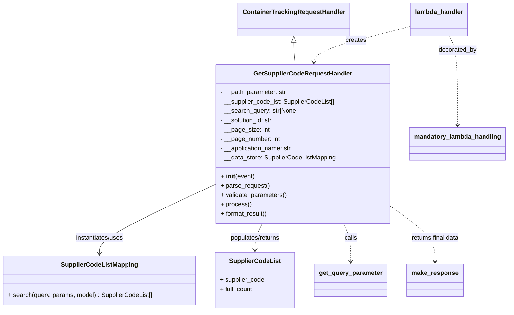

# Diagram: container_tracking_core/container_tracking_service/container_tracking_service/api/advanced_search_filters_dynamic/supplier_code/supplier_code_handler.py


> Auto-generated by Obscura crawlers

## Diagram 1



> SVG rendering failed for this diagram.

## Diagram 2

```mermaid
flowchart TD
    Event["Lambda Event (event, context, audit_refs)"] --> Init[Create GetSupplierCodeRequestHandler(event)]
    Init --> Parse["parse_request() -> read query params\nfilter_name, query, pageSize, pageNumber"]
    Parse --> Validate["validate_parameters() -> type checks\nstring/int validations"]
    Validate --> Process["process() -> build SQL query\ncalls SupplierCodeListMapping.search()"]
    Process --> Format["format_result() -> compute meta\nbuild results list"]
    Format --> MakeResponse["make_response(data, HTTPStatus.OK)"]
    MakeResponse --> Return["Return HTTP response"]
    Event -.-> Decorator["mandatory_lambda_handling(auth_check) (decorator)"] --> Init
```

> SVG rendering failed for this diagram.
