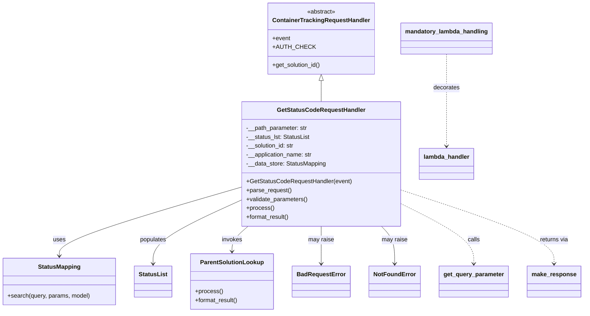

# Diagram: container_tracking_core/container_tracking_service/container_tracking_service/api/advanced_search_filters_static/static_filter_values_handler.py


> Auto-generated by Obscura crawlers

## Diagram 1



### SVG

<svg id="container" width="1538.2265625" xmlns="http://www.w3.org/2000/svg" class="classDiagram" height="842" viewBox="0 0 1538.2265625 842" role="graphics-document document" aria-roledescription="class"><style>#container{font-family:"trebuchet ms",verdana,arial,sans-serif;font-size:16px;fill:#333;}@keyframes edge-animation-frame{from{stroke-dashoffset:0;}}@keyframes dash{to{stroke-dashoffset:0;}}#container .edge-animation-slow{stroke-dasharray:9,5!important;stroke-dashoffset:900;animation:dash 50s linear infinite;stroke-linecap:round;}#container .edge-animation-fast{stroke-dasharray:9,5!important;stroke-dashoffset:900;animation:dash 20s linear infinite;stroke-linecap:round;}#container .error-icon{fill:#552222;}#container .error-text{fill:#552222;stroke:#552222;}#container .edge-thickness-normal{stroke-width:1px;}#container .edge-thickness-thick{stroke-width:3.5px;}#container .edge-pattern-solid{stroke-dasharray:0;}#container .edge-thickness-invisible{stroke-width:0;fill:none;}#container .edge-pattern-dashed{stroke-dasharray:3;}#container .edge-pattern-dotted{stroke-dasharray:2;}#container .marker{fill:#333333;stroke:#333333;}#container .marker.cross{stroke:#333333;}#container svg{font-family:"trebuchet ms",verdana,arial,sans-serif;font-size:16px;}#container p{margin:0;}#container g.classGroup text{fill:#9370DB;stroke:none;font-family:"trebuchet ms",verdana,arial,sans-serif;font-size:10px;}#container g.classGroup text .title{font-weight:bolder;}#container .nodeLabel,#container .edgeLabel{color:#131300;}#container .edgeLabel .label rect{fill:#ECECFF;}#container .label text{fill:#131300;}#container .labelBkg{background:#ECECFF;}#container .edgeLabel .label span{background:#ECECFF;}#container .classTitle{font-weight:bolder;}#container .node rect,#container .node circle,#container .node ellipse,#container .node polygon,#container .node path{fill:#ECECFF;stroke:#9370DB;stroke-width:1px;}#container .divider{stroke:#9370DB;stroke-width:1;}#container g.clickable{cursor:pointer;}#container g.classGroup rect{fill:#ECECFF;stroke:#9370DB;}#container g.classGroup line{stroke:#9370DB;stroke-width:1;}#container .classLabel .box{stroke:none;stroke-width:0;fill:#ECECFF;opacity:0.5;}#container .classLabel .label{fill:#9370DB;font-size:10px;}#container .relation{stroke:#333333;stroke-width:1;fill:none;}#container .dashed-line{stroke-dasharray:3;}#container .dotted-line{stroke-dasharray:1 2;}#container #compositionStart,#container .composition{fill:#333333!important;stroke:#333333!important;stroke-width:1;}#container #compositionEnd,#container .composition{fill:#333333!important;stroke:#333333!important;stroke-width:1;}#container #dependencyStart,#container .dependency{fill:#333333!important;stroke:#333333!important;stroke-width:1;}#container #dependencyStart,#container .dependency{fill:#333333!important;stroke:#333333!important;stroke-width:1;}#container #extensionStart,#container .extension{fill:transparent!important;stroke:#333333!important;stroke-width:1;}#container #extensionEnd,#container .extension{fill:transparent!important;stroke:#333333!important;stroke-width:1;}#container #aggregationStart,#container .aggregation{fill:transparent!important;stroke:#333333!important;stroke-width:1;}#container #aggregationEnd,#container .aggregation{fill:transparent!important;stroke:#333333!important;stroke-width:1;}#container #lollipopStart,#container .lollipop{fill:#ECECFF!important;stroke:#333333!important;stroke-width:1;}#container #lollipopEnd,#container .lollipop{fill:#ECECFF!important;stroke:#333333!important;stroke-width:1;}#container .edgeTerminals{font-size:11px;line-height:initial;}#container .classTitleText{text-anchor:middle;font-size:18px;fill:#333;}#container .label-icon{display:inline-block;height:1em;overflow:visible;vertical-align:-0.125em;}#container .node .label-icon path{fill:currentColor;stroke:revert;stroke-width:revert;}#container :root{--mermaid-font-family:"trebuchet ms",verdana,arial,sans-serif;}</style><g><defs><marker id="container_class-aggregationStart" class="marker aggregation class" refX="18" refY="7" markerWidth="190" markerHeight="240" orient="auto"><path d="M 18,7 L9,13 L1,7 L9,1 Z"></path></marker></defs><defs><marker id="container_class-aggregationEnd" class="marker aggregation class" refX="1" refY="7" markerWidth="20" markerHeight="28" orient="auto"><path d="M 18,7 L9,13 L1,7 L9,1 Z"></path></marker></defs><defs><marker id="container_class-extensionStart" class="marker extension class" refX="18" refY="7" markerWidth="190" markerHeight="240" orient="auto"><path d="M 1,7 L18,13 V 1 Z"></path></marker></defs><defs><marker id="container_class-extensionEnd" class="marker extension class" refX="1" refY="7" markerWidth="20" markerHeight="28" orient="auto"><path d="M 1,1 V 13 L18,7 Z"></path></marker></defs><defs><marker id="container_class-compositionStart" class="marker composition class" refX="18" refY="7" markerWidth="190" markerHeight="240" orient="auto"><path d="M 18,7 L9,13 L1,7 L9,1 Z"></path></marker></defs><defs><marker id="container_class-compositionEnd" class="marker composition class" refX="1" refY="7" markerWidth="20" markerHeight="28" orient="auto"><path d="M 18,7 L9,13 L1,7 L9,1 Z"></path></marker></defs><defs><marker id="container_class-dependencyStart" class="marker dependency class" refX="6" refY="7" markerWidth="190" markerHeight="240" orient="auto"><path d="M 5,7 L9,13 L1,7 L9,1 Z"></path></marker></defs><defs><marker id="container_class-dependencyEnd" class="marker dependency class" refX="13" refY="7" markerWidth="20" markerHeight="28" orient="auto"><path d="M 18,7 L9,13 L14,7 L9,1 Z"></path></marker></defs><defs><marker id="container_class-lollipopStart" class="marker lollipop class" refX="13" refY="7" markerWidth="190" markerHeight="240" orient="auto"><circle stroke="black" fill="transparent" cx="7" cy="7" r="6"></circle></marker></defs><defs><marker id="container_class-lollipopEnd" class="marker lollipop class" refX="1" refY="7" markerWidth="190" markerHeight="240" orient="auto"><circle stroke="black" fill="transparent" cx="7" cy="7" r="6"></circle></marker></defs><g class="root"><g class="clusters"></g><g class="edgePaths"><path d="M854.07,217.25L854.07,220.542C854.07,223.833,854.07,230.417,854.07,239.875C854.07,249.333,854.07,261.667,854.07,267.833L854.07,274" id="id_ContainerTrackingRequestHandler_GetStatusCodeRequestHandler_1" class="edge-thickness-normal edge-pattern-solid relation" style=";;;" data-edge="true" data-et="edge" data-id="id_ContainerTrackingRequestHandler_GetStatusCodeRequestHandler_1" data-points="W3sieCI6ODU0LjA3MDMxMjUsInkiOjIwMH0seyJ4Ijo4NTQuMDcwMzEyNSwieSI6MjM3fSx7IngiOjg1NC4wNzAzMTI1LCJ5IjoyNzR9XQ==" marker-start="url(#container_class-extensionStart)"></path><path d="M644.176,503.885L563.275,527.737C482.375,551.59,320.574,599.295,239.674,630.314C158.773,661.333,158.773,675.667,158.773,682.833L158.773,690" id="id_GetStatusCodeRequestHandler_StatusMapping_2" class="edge-thickness-normal edge-pattern-solid relation" style=";;;" data-edge="true" data-et="edge" data-id="id_GetStatusCodeRequestHandler_StatusMapping_2" data-points="W3sieCI6NjQ0LjE3NTc4MTI1LCJ5Ijo1MDMuODg0OTAxOTA3OTA4MDR9LHsieCI6MTU4Ljc3MzQzNzUsInkiOjY0N30seyJ4IjoxNTguNzczNDM3NSwieSI6Njk2fV0=" marker-end="url(#container_class-dependencyEnd)"></path><path d="M644.176,538.535L604.87,556.613C565.565,574.69,486.954,610.845,447.649,639.589C408.344,668.333,408.344,689.667,408.344,700.333L408.344,711" id="id_GetStatusCodeRequestHandler_StatusList_3" class="edge-thickness-normal edge-pattern-solid relation" style=";;;" data-edge="true" data-et="edge" data-id="id_GetStatusCodeRequestHandler_StatusList_3" data-points="W3sieCI6NjQ0LjE3NTc4MTI1LCJ5Ijo1MzguNTM1MzcwNjIwMzAwNX0seyJ4Ijo0MDguMzQzNzUsInkiOjY0N30seyJ4Ijo0MDguMzQzNzUsInkiOjcxN31d" marker-end="url(#container_class-dependencyEnd)"></path><path d="M660.989,610L653.901,616.167C646.814,622.333,632.639,634.667,625.552,646C618.465,657.333,618.465,667.667,618.465,672.833L618.465,678" id="id_GetStatusCodeRequestHandler_ParentSolutionLookup_4" class="edge-thickness-normal edge-pattern-solid relation" style=";;;" data-edge="true" data-et="edge" data-id="id_GetStatusCodeRequestHandler_ParentSolutionLookup_4" data-points="W3sieCI6NjYwLjk4ODc1NzYyMTk1MTIsInkiOjYxMH0seyJ4Ijo2MTguNDY0ODQzNzUsInkiOjY0N30seyJ4Ijo2MTguNDY0ODQzNzUsInkiOjY4NH1d" marker-end="url(#container_class-dependencyEnd)"></path><path d="M854.07,610L854.07,616.167C854.07,622.333,854.07,634.667,854.07,651.5C854.07,668.333,854.07,689.667,854.07,700.333L854.07,711" id="id_GetStatusCodeRequestHandler_BadRequestError_5" class="edge-thickness-normal edge-pattern-solid relation" style=";;;" data-edge="true" data-et="edge" data-id="id_GetStatusCodeRequestHandler_BadRequestError_5" data-points="W3sieCI6ODU0LjA3MDMxMjUsInkiOjYxMH0seyJ4Ijo4NTQuMDcwMzEyNSwieSI6NjQ3fSx7IngiOjg1NC4wNzAzMTI1LCJ5Ijo3MTd9XQ==" marker-end="url(#container_class-dependencyEnd)"></path><path d="M1009.624,610L1015.334,616.167C1021.044,622.333,1032.463,634.667,1038.173,651.5C1043.883,668.333,1043.883,689.667,1043.883,700.333L1043.883,711" id="id_GetStatusCodeRequestHandler_NotFoundError_6" class="edge-thickness-normal edge-pattern-solid relation" style=";;;" data-edge="true" data-et="edge" data-id="id_GetStatusCodeRequestHandler_NotFoundError_6" data-points="W3sieCI6MTAwOS42MjM5NzEwMzY1ODUzLCJ5Ijo2MTB9LHsieCI6MTA0My44ODI4MTI1LCJ5Ijo2NDd9LHsieCI6MTA0My44ODI4MTI1LCJ5Ijo3MTd9XQ==" marker-end="url(#container_class-dependencyEnd)"></path><path d="M1063.965,550.58L1095.029,566.65C1126.094,582.72,1188.223,614.86,1219.287,641.597C1250.352,668.333,1250.352,689.667,1250.352,700.333L1250.352,711" id="id_GetStatusCodeRequestHandler_get_query_parameter_7" class="edge-thickness-normal edge-pattern-dashed relation" style=";;;" data-edge="true" data-et="edge" data-id="id_GetStatusCodeRequestHandler_get_query_parameter_7" data-points="W3sieCI6MTA2My45NjQ4NDM3NSwieSI6NTUwLjU4MDQwNTcyNTEwMDV9LHsieCI6MTI1MC4zNTE1NjI1LCJ5Ijo2NDd9LHsieCI6MTI1MC4zNTE1NjI1LCJ5Ijo3MTd9XQ==" marker-end="url(#container_class-dependencyEnd)"></path><path d="M1063.965,512.923L1130.097,535.27C1196.229,557.616,1328.493,602.308,1394.626,635.321C1460.758,668.333,1460.758,689.667,1460.758,700.333L1460.758,711" id="id_GetStatusCodeRequestHandler_make_response_8" class="edge-thickness-normal edge-pattern-dashed relation" style=";;;" data-edge="true" data-et="edge" data-id="id_GetStatusCodeRequestHandler_make_response_8" data-points="W3sieCI6MTA2My45NjQ4NDM3NSwieSI6NTEyLjkyMzQ2MzczNzUwOX0seyJ4IjoxNDYwLjc1NzgxMjUsInkiOjY0N30seyJ4IjoxNDYwLjc1NzgxMjUsInkiOjcxN31d" marker-end="url(#container_class-dependencyEnd)"></path><path d="M1185.941,146L1185.941,161.167C1185.941,176.333,1185.941,206.667,1185.941,248C1185.941,289.333,1185.941,341.667,1185.941,367.833L1185.941,394" id="id_mandatory_lambda_handling_lambda_handler_9" class="edge-thickness-normal edge-pattern-dashed relation" style=";;;" data-edge="true" data-et="edge" data-id="id_mandatory_lambda_handling_lambda_handler_9" data-points="W3sieCI6MTE4NS45NDE0MDYyNSwieSI6MTQ2fSx7IngiOjExODUuOTQxNDA2MjUsInkiOjIzN30seyJ4IjoxMTg1Ljk0MTQwNjI1LCJ5Ijo0MDB9XQ==" marker-end="url(#container_class-dependencyEnd)"></path></g><g class="edgeLabels"><g class="edgeLabel"><g class="label" data-id="id_ContainerTrackingRequestHandler_GetStatusCodeRequestHandler_1" transform="translate(0, 0)"><foreignObject width="0" height="0"><div xmlns="http://www.w3.org/1999/xhtml" class="labelBkg" style="display: table-cell; white-space: nowrap; line-height: 1.5; max-width: 200px; text-align: center;"><span class="edgeLabel"></span></div></foreignObject></g></g><g class="edgeLabel" transform="translate(158.7734375, 647)"><g class="label" data-id="id_GetStatusCodeRequestHandler_StatusMapping_2" transform="translate(-16.4921875, -12)"><foreignObject width="32.984375" height="24"><div xmlns="http://www.w3.org/1999/xhtml" class="labelBkg" style="display: table-cell; white-space: nowrap; line-height: 1.5; max-width: 200px; text-align: center;"><span class="edgeLabel"><p>uses</p></span></div></foreignObject></g></g><g class="edgeLabel" transform="translate(408.34375, 647)"><g class="label" data-id="id_GetStatusCodeRequestHandler_StatusList_3" transform="translate(-36.359375, -12)"><foreignObject width="72.71875" height="24"><div xmlns="http://www.w3.org/1999/xhtml" class="labelBkg" style="display: table-cell; white-space: nowrap; line-height: 1.5; max-width: 200px; text-align: center;"><span class="edgeLabel"><p>populates</p></span></div></foreignObject></g></g><g class="edgeLabel" transform="translate(618.46484375, 647)"><g class="label" data-id="id_GetStatusCodeRequestHandler_ParentSolutionLookup_4" transform="translate(-27.5859375, -12)"><foreignObject width="55.171875" height="24"><div xmlns="http://www.w3.org/1999/xhtml" class="labelBkg" style="display: table-cell; white-space: nowrap; line-height: 1.5; max-width: 200px; text-align: center;"><span class="edgeLabel"><p>invokes</p></span></div></foreignObject></g></g><g class="edgeLabel" transform="translate(854.0703125, 647)"><g class="label" data-id="id_GetStatusCodeRequestHandler_BadRequestError_5" transform="translate(-34.65625, -12)"><foreignObject width="69.3125" height="24"><div xmlns="http://www.w3.org/1999/xhtml" class="labelBkg" style="display: table-cell; white-space: nowrap; line-height: 1.5; max-width: 200px; text-align: center;"><span class="edgeLabel"><p>may raise</p></span></div></foreignObject></g></g><g class="edgeLabel" transform="translate(1043.8828125, 647)"><g class="label" data-id="id_GetStatusCodeRequestHandler_NotFoundError_6" transform="translate(-34.65625, -12)"><foreignObject width="69.3125" height="24"><div xmlns="http://www.w3.org/1999/xhtml" class="labelBkg" style="display: table-cell; white-space: nowrap; line-height: 1.5; max-width: 200px; text-align: center;"><span class="edgeLabel"><p>may raise</p></span></div></foreignObject></g></g><g class="edgeLabel" transform="translate(1250.3515625, 647)"><g class="label" data-id="id_GetStatusCodeRequestHandler_get_query_parameter_7" transform="translate(-16.4453125, -12)"><foreignObject width="32.890625" height="24"><div xmlns="http://www.w3.org/1999/xhtml" class="labelBkg" style="display: table-cell; white-space: nowrap; line-height: 1.5; max-width: 200px; text-align: center;"><span class="edgeLabel"><p>calls</p></span></div></foreignObject></g></g><g class="edgeLabel" transform="translate(1460.7578125, 647)"><g class="label" data-id="id_GetStatusCodeRequestHandler_make_response_8" transform="translate(-38.9296875, -12)"><foreignObject width="77.859375" height="24"><div xmlns="http://www.w3.org/1999/xhtml" class="labelBkg" style="display: table-cell; white-space: nowrap; line-height: 1.5; max-width: 200px; text-align: center;"><span class="edgeLabel"><p>returns via</p></span></div></foreignObject></g></g><g class="edgeLabel" transform="translate(1185.94140625, 237)"><g class="label" data-id="id_mandatory_lambda_handling_lambda_handler_9" transform="translate(-35.5078125, -12)"><foreignObject width="71.015625" height="24"><div xmlns="http://www.w3.org/1999/xhtml" class="labelBkg" style="display: table-cell; white-space: nowrap; line-height: 1.5; max-width: 200px; text-align: center;"><span class="edgeLabel"><p>decorates</p></span></div></foreignObject></g></g></g><g class="nodes"><g class="node default" id="classId-ContainerTrackingRequestHandler-0" transform="translate(854.0703125, 104)"><g class="basic label-container"><path d="M-140.52734375 -96 L140.52734375 -96 L140.52734375 96 L-140.52734375 96" stroke="none" stroke-width="0" fill="#ECECFF" style=""></path><path d="M-140.52734375 -96 C-62.83858575903038 -96, 14.85017223193924 -96, 140.52734375 -96 M-140.52734375 -96 C-38.48807448173382 -96, 63.55119478653236 -96, 140.52734375 -96 M140.52734375 -96 C140.52734375 -50.972051738213864, 140.52734375 -5.944103476427728, 140.52734375 96 M140.52734375 -96 C140.52734375 -52.271594835792705, 140.52734375 -8.54318967158541, 140.52734375 96 M140.52734375 96 C54.73604886923678 96, -31.055246011526435 96, -140.52734375 96 M140.52734375 96 C49.665938563323266 96, -41.19546662335347 96, -140.52734375 96 M-140.52734375 96 C-140.52734375 36.49860045022463, -140.52734375 -23.002799099550742, -140.52734375 -96 M-140.52734375 96 C-140.52734375 37.1608670324642, -140.52734375 -21.678265935071593, -140.52734375 -96" stroke="#9370DB" stroke-width="1.3" fill="none" stroke-dasharray="0 0" style=""></path></g><g class="annotation-group text" transform="translate(-38.609375, -72)"><g class="label" style="" transform="translate(0,-12)"><foreignObject width="77.21875" height="24"><div xmlns="http://www.w3.org/1999/xhtml" style="display: table-cell; white-space: nowrap; line-height: 1.5; max-width: 127px; text-align: center;"><span class="nodeLabel markdown-node-label" style=""><p>«abstract»</p></span></div></foreignObject></g></g><g class="label-group text" transform="translate(-125.5859375, -48)"><g class="label" style="font-weight: bolder" transform="translate(0,-12)"><foreignObject width="251.171875" height="24"><div xmlns="http://www.w3.org/1999/xhtml" style="display: table-cell; white-space: nowrap; line-height: 1.5; max-width: 299px; text-align: center;"><span class="nodeLabel markdown-node-label" style=""><p>ContainerTrackingRequestHandler</p></span></div></foreignObject></g></g><g class="members-group text" transform="translate(-128.52734375, 0)"><g class="label" style="" transform="translate(0,-12)"><foreignObject width="48.328125" height="24"><div xmlns="http://www.w3.org/1999/xhtml" style="display: table-cell; white-space: nowrap; line-height: 1.5; max-width: 106px; text-align: center;"><span class="nodeLabel markdown-node-label" style=""><p>+event</p></span></div></foreignObject></g><g class="label" style="" transform="translate(0,12)"><foreignObject width="100.859375" height="24"><div xmlns="http://www.w3.org/1999/xhtml" style="display: table-cell; white-space: nowrap; line-height: 1.5; max-width: 159px; text-align: center;"><span class="nodeLabel markdown-node-label" style=""><p>+AUTH_CHECK</p></span></div></foreignObject></g></g><g class="methods-group text" transform="translate(-128.52734375, 72)"><g class="label" style="" transform="translate(0,-12)"><foreignObject width="131.46875" height="24"><div xmlns="http://www.w3.org/1999/xhtml" style="display: table-cell; white-space: nowrap; line-height: 1.5; max-width: 189px; text-align: center;"><span class="nodeLabel markdown-node-label" style=""><p>+get_solution_id()</p></span></div></foreignObject></g></g><g class="divider" style=""><path d="M-140.52734375 -24 C-36.371058135248774 -24, 67.78522747950245 -24, 140.52734375 -24 M-140.52734375 -24 C-30.203707957875707 -24, 80.11992783424859 -24, 140.52734375 -24" stroke="#9370DB" stroke-width="1.3" fill="none" stroke-dasharray="0 0" style=""></path></g><g class="divider" style=""><path d="M-140.52734375 48 C-35.15548021963707 48, 70.21638331072586 48, 140.52734375 48 M-140.52734375 48 C-28.16623274360549 48, 84.19487826278902 48, 140.52734375 48" stroke="#9370DB" stroke-width="1.3" fill="none" stroke-dasharray="0 0" style=""></path></g></g><g class="node default" id="classId-GetStatusCodeRequestHandler-1" transform="translate(854.0703125, 442)"><g class="basic label-container"><path d="M-209.89453125 -168 L209.89453125 -168 L209.89453125 168 L-209.89453125 168" stroke="none" stroke-width="0" fill="#ECECFF" style=""></path><path d="M-209.89453125 -168 C-124.10705289468977 -168, -38.319574539379545 -168, 209.89453125 -168 M-209.89453125 -168 C-77.0096831932058 -168, 55.875164863588395 -168, 209.89453125 -168 M209.89453125 -168 C209.89453125 -77.47264694505995, 209.89453125 13.054706109880101, 209.89453125 168 M209.89453125 -168 C209.89453125 -47.2320081777539, 209.89453125 73.5359836444922, 209.89453125 168 M209.89453125 168 C110.41026871759678 168, 10.926006185193557 168, -209.89453125 168 M209.89453125 168 C54.8979915445471 168, -100.0985481609058 168, -209.89453125 168 M-209.89453125 168 C-209.89453125 82.44548027482747, -209.89453125 -3.109039450345051, -209.89453125 -168 M-209.89453125 168 C-209.89453125 65.82712524891653, -209.89453125 -36.34574950216694, -209.89453125 -168" stroke="#9370DB" stroke-width="1.3" fill="none" stroke-dasharray="0 0" style=""></path></g><g class="annotation-group text" transform="translate(0, -144)"></g><g class="label-group text" transform="translate(-113.5390625, -144)"><g class="label" style="font-weight: bolder" transform="translate(0,-12)"><foreignObject width="227.078125" height="24"><div xmlns="http://www.w3.org/1999/xhtml" style="display: table-cell; white-space: nowrap; line-height: 1.5; max-width: 274px; text-align: center;"><span class="nodeLabel markdown-node-label" style=""><p>GetStatusCodeRequestHandler</p></span></div></foreignObject></g></g><g class="members-group text" transform="translate(-197.89453125, -96)"><g class="label" style="" transform="translate(0,-12)"><foreignObject width="166.078125" height="24"><div xmlns="http://www.w3.org/1999/xhtml" style="display: table-cell; white-space: nowrap; line-height: 1.5; max-width: 224px; text-align: center;"><span class="nodeLabel markdown-node-label" style=""><p>-__path_parameter: str</p></span></div></foreignObject></g><g class="label" style="" transform="translate(0,12)"><foreignObject width="171.359375" height="24"><div xmlns="http://www.w3.org/1999/xhtml" style="display: table-cell; white-space: nowrap; line-height: 1.5; max-width: 229px; text-align: center;"><span class="nodeLabel markdown-node-label" style=""><p>-__status_lst: StatusList</p></span></div></foreignObject></g><g class="label" style="" transform="translate(0,36)"><foreignObject width="131.390625" height="24"><div xmlns="http://www.w3.org/1999/xhtml" style="display: table-cell; white-space: nowrap; line-height: 1.5; max-width: 190px; text-align: center;"><span class="nodeLabel markdown-node-label" style=""><p>-__solution_id: str</p></span></div></foreignObject></g><g class="label" style="" transform="translate(0,60)"><foreignObject width="179.78125" height="24"><div xmlns="http://www.w3.org/1999/xhtml" style="display: table-cell; white-space: nowrap; line-height: 1.5; max-width: 238px; text-align: center;"><span class="nodeLabel markdown-node-label" style=""><p>-__application_name: str</p></span></div></foreignObject></g><g class="label" style="" transform="translate(0,84)"><foreignObject width="215.15625" height="24"><div xmlns="http://www.w3.org/1999/xhtml" style="display: table-cell; white-space: nowrap; line-height: 1.5; max-width: 273px; text-align: center;"><span class="nodeLabel markdown-node-label" style=""><p>-__data_store: StatusMapping</p></span></div></foreignObject></g></g><g class="methods-group text" transform="translate(-197.89453125, 48)"><g class="label" style="" transform="translate(0,-12)"><foreignObject width="282.25" height="24"><div xmlns="http://www.w3.org/1999/xhtml" style="display: table-cell; white-space: nowrap; line-height: 1.5; max-width: 340px; text-align: center;"><span class="nodeLabel markdown-node-label" style=""><p>+GetStatusCodeRequestHandler(event)</p></span></div></foreignObject></g><g class="label" style="" transform="translate(0,12)"><foreignObject width="121.796875" height="24"><div xmlns="http://www.w3.org/1999/xhtml" style="display: table-cell; white-space: nowrap; line-height: 1.5; max-width: 179px; text-align: center;"><span class="nodeLabel markdown-node-label" style=""><p>+parse_request()</p></span></div></foreignObject></g><g class="label" style="" transform="translate(0,36)"><foreignObject width="166.546875" height="24"><div xmlns="http://www.w3.org/1999/xhtml" style="display: table-cell; white-space: nowrap; line-height: 1.5; max-width: 224px; text-align: center;"><span class="nodeLabel markdown-node-label" style=""><p>+validate_parameters()</p></span></div></foreignObject></g><g class="label" style="" transform="translate(0,60)"><foreignObject width="73.734375" height="24"><div xmlns="http://www.w3.org/1999/xhtml" style="display: table-cell; white-space: nowrap; line-height: 1.5; max-width: 131px; text-align: center;"><span class="nodeLabel markdown-node-label" style=""><p>+process()</p></span></div></foreignObject></g><g class="label" style="" transform="translate(0,84)"><foreignObject width="117.015625" height="24"><div xmlns="http://www.w3.org/1999/xhtml" style="display: table-cell; white-space: nowrap; line-height: 1.5; max-width: 174px; text-align: center;"><span class="nodeLabel markdown-node-label" style=""><p>+format_result()</p></span></div></foreignObject></g></g><g class="divider" style=""><path d="M-209.89453125 -120 C-83.03388287296711 -120, 43.826765504065776 -120, 209.89453125 -120 M-209.89453125 -120 C-51.67196725879111 -120, 106.55059673241777 -120, 209.89453125 -120" stroke="#9370DB" stroke-width="1.3" fill="none" stroke-dasharray="0 0" style=""></path></g><g class="divider" style=""><path d="M-209.89453125 24 C-99.95280603640514 24, 9.988919177189729 24, 209.89453125 24 M-209.89453125 24 C-102.9550435867921 24, 3.984444076415798 24, 209.89453125 24" stroke="#9370DB" stroke-width="1.3" fill="none" stroke-dasharray="0 0" style=""></path></g></g><g class="node default" id="classId-StatusMapping-2" transform="translate(158.7734375, 759)"><g class="basic label-container"><path d="M-150.7734375 -63 L150.7734375 -63 L150.7734375 63 L-150.7734375 63" stroke="none" stroke-width="0" fill="#ECECFF" style=""></path><path d="M-150.7734375 -63 C-76.32106937783435 -63, -1.8687012556686966 -63, 150.7734375 -63 M-150.7734375 -63 C-63.01242919159664 -63, 24.748579116806724 -63, 150.7734375 -63 M150.7734375 -63 C150.7734375 -35.54499194119579, 150.7734375 -8.089983882391586, 150.7734375 63 M150.7734375 -63 C150.7734375 -26.01672568615315, 150.7734375 10.966548627693697, 150.7734375 63 M150.7734375 63 C57.776720458687734 63, -35.21999658262453 63, -150.7734375 63 M150.7734375 63 C86.53498000702176 63, 22.296522514043517 63, -150.7734375 63 M-150.7734375 63 C-150.7734375 25.820545423476574, -150.7734375 -11.358909153046852, -150.7734375 -63 M-150.7734375 63 C-150.7734375 30.142062307272354, -150.7734375 -2.7158753854552913, -150.7734375 -63" stroke="#9370DB" stroke-width="1.3" fill="none" stroke-dasharray="0 0" style=""></path></g><g class="annotation-group text" transform="translate(0, -39)"></g><g class="label-group text" transform="translate(-54.984375, -39)"><g class="label" style="font-weight: bolder" transform="translate(0,-12)"><foreignObject width="109.96875" height="24"><div xmlns="http://www.w3.org/1999/xhtml" style="display: table-cell; white-space: nowrap; line-height: 1.5; max-width: 159px; text-align: center;"><span class="nodeLabel markdown-node-label" style=""><p>StatusMapping</p></span></div></foreignObject></g></g><g class="members-group text" transform="translate(-138.7734375, 9)"></g><g class="methods-group text" transform="translate(-138.7734375, 39)"><g class="label" style="" transform="translate(0,-12)"><foreignObject width="222.5625" height="24"><div xmlns="http://www.w3.org/1999/xhtml" style="display: table-cell; white-space: nowrap; line-height: 1.5; max-width: 280px; text-align: center;"><span class="nodeLabel markdown-node-label" style=""><p>+search(query, params, model)</p></span></div></foreignObject></g></g><g class="divider" style=""><path d="M-150.7734375 -15 C-48.36067386986916 -15, 54.05208976026168 -15, 150.7734375 -15 M-150.7734375 -15 C-64.34983817314891 -15, 22.07376115370218 -15, 150.7734375 -15" stroke="#9370DB" stroke-width="1.3" fill="none" stroke-dasharray="0 0" style=""></path></g><g class="divider" style=""><path d="M-150.7734375 9 C-61.641973360940185 9, 27.48949077811963 9, 150.7734375 9 M-150.7734375 9 C-50.446897359119305 9, 49.87964278176139 9, 150.7734375 9" stroke="#9370DB" stroke-width="1.3" fill="none" stroke-dasharray="0 0" style=""></path></g></g><g class="node default" id="classId-StatusList-3" transform="translate(408.34375, 759)"><g class="basic label-container"><path d="M-48.796875 -42 L48.796875 -42 L48.796875 42 L-48.796875 42" stroke="none" stroke-width="0" fill="#ECECFF" style=""></path><path d="M-48.796875 -42 C-15.95216740559541 -42, 16.89254018880918 -42, 48.796875 -42 M-48.796875 -42 C-18.633984294420763 -42, 11.528906411158474 -42, 48.796875 -42 M48.796875 -42 C48.796875 -24.956357169793698, 48.796875 -7.912714339587396, 48.796875 42 M48.796875 -42 C48.796875 -22.499229134308436, 48.796875 -2.998458268616872, 48.796875 42 M48.796875 42 C12.78793095846855 42, -23.2210130830629 42, -48.796875 42 M48.796875 42 C23.900984025540012 42, -0.9949069489199758 42, -48.796875 42 M-48.796875 42 C-48.796875 21.280058799710783, -48.796875 0.5601175994215666, -48.796875 -42 M-48.796875 42 C-48.796875 10.831423582369961, -48.796875 -20.337152835260078, -48.796875 -42" stroke="#9370DB" stroke-width="1.3" fill="none" stroke-dasharray="0 0" style=""></path></g><g class="annotation-group text" transform="translate(0, -18)"></g><g class="label-group text" transform="translate(-36.796875, -18)"><g class="label" style="font-weight: bolder" transform="translate(0,-12)"><foreignObject width="73.59375" height="24"><div xmlns="http://www.w3.org/1999/xhtml" style="display: table-cell; white-space: nowrap; line-height: 1.5; max-width: 122px; text-align: center;"><span class="nodeLabel markdown-node-label" style=""><p>StatusList</p></span></div></foreignObject></g></g><g class="members-group text" transform="translate(-36.796875, 30)"></g><g class="methods-group text" transform="translate(-36.796875, 60)"></g><g class="divider" style=""><path d="M-48.796875 6 C-25.53937915206217 6, -2.2818833041243423 6, 48.796875 6 M-48.796875 6 C-14.958004129579315 6, 18.88086674084137 6, 48.796875 6" stroke="#9370DB" stroke-width="1.3" fill="none" stroke-dasharray="0 0" style=""></path></g><g class="divider" style=""><path d="M-48.796875 24 C-29.168424407071367 24, -9.539973814142733 24, 48.796875 24 M-48.796875 24 C-16.14621486948193 24, 16.50444526103614 24, 48.796875 24" stroke="#9370DB" stroke-width="1.3" fill="none" stroke-dasharray="0 0" style=""></path></g></g><g class="node default" id="classId-ParentSolutionLookup-4" transform="translate(618.46484375, 759)"><g class="basic label-container"><path d="M-111.32421875 -75 L111.32421875 -75 L111.32421875 75 L-111.32421875 75" stroke="none" stroke-width="0" fill="#ECECFF" style=""></path><path d="M-111.32421875 -75 C-49.32777464842243 -75, 12.668669453155147 -75, 111.32421875 -75 M-111.32421875 -75 C-39.60568001172513 -75, 32.112858726549746 -75, 111.32421875 -75 M111.32421875 -75 C111.32421875 -23.96407560605808, 111.32421875 27.071848787883837, 111.32421875 75 M111.32421875 -75 C111.32421875 -31.745068658323305, 111.32421875 11.50986268335339, 111.32421875 75 M111.32421875 75 C62.161584759490744 75, 12.998950768981487 75, -111.32421875 75 M111.32421875 75 C40.93799898655634 75, -29.448220776887325 75, -111.32421875 75 M-111.32421875 75 C-111.32421875 21.351443794004858, -111.32421875 -32.297112411990284, -111.32421875 -75 M-111.32421875 75 C-111.32421875 31.852661039674636, -111.32421875 -11.294677920650727, -111.32421875 -75" stroke="#9370DB" stroke-width="1.3" fill="none" stroke-dasharray="0 0" style=""></path></g><g class="annotation-group text" transform="translate(0, -51)"></g><g class="label-group text" transform="translate(-81.6328125, -51)"><g class="label" style="font-weight: bolder" transform="translate(0,-12)"><foreignObject width="163.265625" height="24"><div xmlns="http://www.w3.org/1999/xhtml" style="display: table-cell; white-space: nowrap; line-height: 1.5; max-width: 211px; text-align: center;"><span class="nodeLabel markdown-node-label" style=""><p>ParentSolutionLookup</p></span></div></foreignObject></g></g><g class="members-group text" transform="translate(-99.32421875, -3)"></g><g class="methods-group text" transform="translate(-99.32421875, 27)"><g class="label" style="" transform="translate(0,-12)"><foreignObject width="73.734375" height="24"><div xmlns="http://www.w3.org/1999/xhtml" style="display: table-cell; white-space: nowrap; line-height: 1.5; max-width: 131px; text-align: center;"><span class="nodeLabel markdown-node-label" style=""><p>+process()</p></span></div></foreignObject></g><g class="label" style="" transform="translate(0,12)"><foreignObject width="117.015625" height="24"><div xmlns="http://www.w3.org/1999/xhtml" style="display: table-cell; white-space: nowrap; line-height: 1.5; max-width: 174px; text-align: center;"><span class="nodeLabel markdown-node-label" style=""><p>+format_result()</p></span></div></foreignObject></g></g><g class="divider" style=""><path d="M-111.32421875 -27 C-52.13508134606363 -27, 7.054056057872742 -27, 111.32421875 -27 M-111.32421875 -27 C-49.82665891000972 -27, 11.670900929980562 -27, 111.32421875 -27" stroke="#9370DB" stroke-width="1.3" fill="none" stroke-dasharray="0 0" style=""></path></g><g class="divider" style=""><path d="M-111.32421875 -3 C-37.8895166700413 -3, 35.545185409917394 -3, 111.32421875 -3 M-111.32421875 -3 C-44.058338917234366 -3, 23.20754091553127 -3, 111.32421875 -3" stroke="#9370DB" stroke-width="1.3" fill="none" stroke-dasharray="0 0" style=""></path></g></g><g class="node default" id="classId-BadRequestError-5" transform="translate(854.0703125, 759)"><g class="basic label-container"><path d="M-74.28125 -42 L74.28125 -42 L74.28125 42 L-74.28125 42" stroke="none" stroke-width="0" fill="#ECECFF" style=""></path><path d="M-74.28125 -42 C-24.427490255711064 -42, 25.426269488577873 -42, 74.28125 -42 M-74.28125 -42 C-23.128397913141008 -42, 28.024454173717984 -42, 74.28125 -42 M74.28125 -42 C74.28125 -8.582550592962562, 74.28125 24.834898814074876, 74.28125 42 M74.28125 -42 C74.28125 -23.52958950229405, 74.28125 -5.059179004588103, 74.28125 42 M74.28125 42 C39.1936226793396 42, 4.105995358679195 42, -74.28125 42 M74.28125 42 C23.739532024396823 42, -26.802185951206354 42, -74.28125 42 M-74.28125 42 C-74.28125 20.39302618111121, -74.28125 -1.2139476377775793, -74.28125 -42 M-74.28125 42 C-74.28125 9.389207195128158, -74.28125 -23.221585609743684, -74.28125 -42" stroke="#9370DB" stroke-width="1.3" fill="none" stroke-dasharray="0 0" style=""></path></g><g class="annotation-group text" transform="translate(0, -18)"></g><g class="label-group text" transform="translate(-62.28125, -18)"><g class="label" style="font-weight: bolder" transform="translate(0,-12)"><foreignObject width="124.5625" height="24"><div xmlns="http://www.w3.org/1999/xhtml" style="display: table-cell; white-space: nowrap; line-height: 1.5; max-width: 174px; text-align: center;"><span class="nodeLabel markdown-node-label" style=""><p>BadRequestError</p></span></div></foreignObject></g></g><g class="members-group text" transform="translate(-62.28125, 30)"></g><g class="methods-group text" transform="translate(-62.28125, 60)"></g><g class="divider" style=""><path d="M-74.28125 6 C-43.09611592698049 6, -11.910981853960969 6, 74.28125 6 M-74.28125 6 C-43.10880309198332 6, -11.936356183966637 6, 74.28125 6" stroke="#9370DB" stroke-width="1.3" fill="none" stroke-dasharray="0 0" style=""></path></g><g class="divider" style=""><path d="M-74.28125 24 C-19.580590822571125 24, 35.12006835485775 24, 74.28125 24 M-74.28125 24 C-37.07150013020597 24, 0.13824973958806197 24, 74.28125 24" stroke="#9370DB" stroke-width="1.3" fill="none" stroke-dasharray="0 0" style=""></path></g></g><g class="node default" id="classId-NotFoundError-6" transform="translate(1043.8828125, 759)"><g class="basic label-container"><path d="M-65.53125 -42 L65.53125 -42 L65.53125 42 L-65.53125 42" stroke="none" stroke-width="0" fill="#ECECFF" style=""></path><path d="M-65.53125 -42 C-28.771313641851165 -42, 7.9886227162976695 -42, 65.53125 -42 M-65.53125 -42 C-23.320003216723123 -42, 18.891243566553754 -42, 65.53125 -42 M65.53125 -42 C65.53125 -13.842266789041624, 65.53125 14.315466421916753, 65.53125 42 M65.53125 -42 C65.53125 -10.551046958926847, 65.53125 20.897906082146307, 65.53125 42 M65.53125 42 C13.907631889243603 42, -37.71598622151279 42, -65.53125 42 M65.53125 42 C13.831636848512161 42, -37.86797630297568 42, -65.53125 42 M-65.53125 42 C-65.53125 13.294252452006674, -65.53125 -15.411495095986652, -65.53125 -42 M-65.53125 42 C-65.53125 25.1404107833003, -65.53125 8.2808215666006, -65.53125 -42" stroke="#9370DB" stroke-width="1.3" fill="none" stroke-dasharray="0 0" style=""></path></g><g class="annotation-group text" transform="translate(0, -18)"></g><g class="label-group text" transform="translate(-53.53125, -18)"><g class="label" style="font-weight: bolder" transform="translate(0,-12)"><foreignObject width="107.0625" height="24"><div xmlns="http://www.w3.org/1999/xhtml" style="display: table-cell; white-space: nowrap; line-height: 1.5; max-width: 158px; text-align: center;"><span class="nodeLabel markdown-node-label" style=""><p>NotFoundError</p></span></div></foreignObject></g></g><g class="members-group text" transform="translate(-53.53125, 30)"></g><g class="methods-group text" transform="translate(-53.53125, 60)"></g><g class="divider" style=""><path d="M-65.53125 6 C-22.595199352924304 6, 20.340851294151392 6, 65.53125 6 M-65.53125 6 C-17.495446234355633 6, 30.540357531288734 6, 65.53125 6" stroke="#9370DB" stroke-width="1.3" fill="none" stroke-dasharray="0 0" style=""></path></g><g class="divider" style=""><path d="M-65.53125 24 C-29.071246375737637 24, 7.388757248524726 24, 65.53125 24 M-65.53125 24 C-28.968297767172196 24, 7.5946544656556085 24, 65.53125 24" stroke="#9370DB" stroke-width="1.3" fill="none" stroke-dasharray="0 0" style=""></path></g></g><g class="node default" id="classId-get_query_parameter-7" transform="translate(1250.3515625, 759)"><g class="basic label-container"><path d="M-90.9375 -42 L90.9375 -42 L90.9375 42 L-90.9375 42" stroke="none" stroke-width="0" fill="#ECECFF" style=""></path><path d="M-90.9375 -42 C-51.88244621186756 -42, -12.82739242373512 -42, 90.9375 -42 M-90.9375 -42 C-45.94828607291874 -42, -0.9590721458374816 -42, 90.9375 -42 M90.9375 -42 C90.9375 -13.44797236609466, 90.9375 15.10405526781068, 90.9375 42 M90.9375 -42 C90.9375 -17.748146975369906, 90.9375 6.503706049260188, 90.9375 42 M90.9375 42 C21.84772746523859 42, -47.24204506952282 42, -90.9375 42 M90.9375 42 C40.69097758398101 42, -9.555544832037981 42, -90.9375 42 M-90.9375 42 C-90.9375 15.241660613689483, -90.9375 -11.516678772621034, -90.9375 -42 M-90.9375 42 C-90.9375 12.033872499322797, -90.9375 -17.932255001354406, -90.9375 -42" stroke="#9370DB" stroke-width="1.3" fill="none" stroke-dasharray="0 0" style=""></path></g><g class="annotation-group text" transform="translate(0, -18)"></g><g class="label-group text" transform="translate(-78.9375, -18)"><g class="label" style="font-weight: bolder" transform="translate(0,-12)"><foreignObject width="157.875" height="24"><div xmlns="http://www.w3.org/1999/xhtml" style="display: table-cell; white-space: nowrap; line-height: 1.5; max-width: 206px; text-align: center;"><span class="nodeLabel markdown-node-label" style=""><p>get_query_parameter</p></span></div></foreignObject></g></g><g class="members-group text" transform="translate(-78.9375, 30)"></g><g class="methods-group text" transform="translate(-78.9375, 60)"></g><g class="divider" style=""><path d="M-90.9375 6 C-31.192584712815005 6, 28.55233057436999 6, 90.9375 6 M-90.9375 6 C-24.732409723684114 6, 41.47268055263177 6, 90.9375 6" stroke="#9370DB" stroke-width="1.3" fill="none" stroke-dasharray="0 0" style=""></path></g><g class="divider" style=""><path d="M-90.9375 24 C-19.92823685790235 24, 51.0810262841953 24, 90.9375 24 M-90.9375 24 C-22.509543960171612 24, 45.918412079656775 24, 90.9375 24" stroke="#9370DB" stroke-width="1.3" fill="none" stroke-dasharray="0 0" style=""></path></g></g><g class="node default" id="classId-make_response-8" transform="translate(1460.7578125, 759)"><g class="basic label-container"><path d="M-69.46875 -42 L69.46875 -42 L69.46875 42 L-69.46875 42" stroke="none" stroke-width="0" fill="#ECECFF" style=""></path><path d="M-69.46875 -42 C-23.820331163420512 -42, 21.828087673158976 -42, 69.46875 -42 M-69.46875 -42 C-36.41570774454901 -42, -3.3626654890980205 -42, 69.46875 -42 M69.46875 -42 C69.46875 -10.34109906988638, 69.46875 21.31780186022724, 69.46875 42 M69.46875 -42 C69.46875 -15.670414169665491, 69.46875 10.659171660669017, 69.46875 42 M69.46875 42 C26.71702021196745 42, -16.034709576065097 42, -69.46875 42 M69.46875 42 C16.580677363018474 42, -36.30739527396305 42, -69.46875 42 M-69.46875 42 C-69.46875 15.101943997839001, -69.46875 -11.796112004321998, -69.46875 -42 M-69.46875 42 C-69.46875 9.145783199355868, -69.46875 -23.708433601288263, -69.46875 -42" stroke="#9370DB" stroke-width="1.3" fill="none" stroke-dasharray="0 0" style=""></path></g><g class="annotation-group text" transform="translate(0, -18)"></g><g class="label-group text" transform="translate(-57.46875, -18)"><g class="label" style="font-weight: bolder" transform="translate(0,-12)"><foreignObject width="114.9375" height="24"><div xmlns="http://www.w3.org/1999/xhtml" style="display: table-cell; white-space: nowrap; line-height: 1.5; max-width: 164px; text-align: center;"><span class="nodeLabel markdown-node-label" style=""><p>make_response</p></span></div></foreignObject></g></g><g class="members-group text" transform="translate(-57.46875, 30)"></g><g class="methods-group text" transform="translate(-57.46875, 60)"></g><g class="divider" style=""><path d="M-69.46875 6 C-16.831793908949187 6, 35.805162182101625 6, 69.46875 6 M-69.46875 6 C-17.464944210146435 6, 34.53886157970713 6, 69.46875 6" stroke="#9370DB" stroke-width="1.3" fill="none" stroke-dasharray="0 0" style=""></path></g><g class="divider" style=""><path d="M-69.46875 24 C-31.440046500539196 24, 6.588656998921607 24, 69.46875 24 M-69.46875 24 C-30.571517171680007 24, 8.325715656639986 24, 69.46875 24" stroke="#9370DB" stroke-width="1.3" fill="none" stroke-dasharray="0 0" style=""></path></g></g><g class="node default" id="classId-mandatory_lambda_handling-9" transform="translate(1185.94140625, 104)"><g class="basic label-container"><path d="M-119.4296875 -42 L119.4296875 -42 L119.4296875 42 L-119.4296875 42" stroke="none" stroke-width="0" fill="#ECECFF" style=""></path><path d="M-119.4296875 -42 C-26.507320141185645 -42, 66.41504721762871 -42, 119.4296875 -42 M-119.4296875 -42 C-27.758517470227787 -42, 63.912652559544426 -42, 119.4296875 -42 M119.4296875 -42 C119.4296875 -10.380652089242165, 119.4296875 21.23869582151567, 119.4296875 42 M119.4296875 -42 C119.4296875 -12.529656715746263, 119.4296875 16.940686568507473, 119.4296875 42 M119.4296875 42 C57.073545822667015 42, -5.282595854665971 42, -119.4296875 42 M119.4296875 42 C52.45861526651238 42, -14.512456966975236 42, -119.4296875 42 M-119.4296875 42 C-119.4296875 11.411361022964599, -119.4296875 -19.177277954070803, -119.4296875 -42 M-119.4296875 42 C-119.4296875 11.295586019768411, -119.4296875 -19.408827960463178, -119.4296875 -42" stroke="#9370DB" stroke-width="1.3" fill="none" stroke-dasharray="0 0" style=""></path></g><g class="annotation-group text" transform="translate(0, -18)"></g><g class="label-group text" transform="translate(-107.4296875, -18)"><g class="label" style="font-weight: bolder" transform="translate(0,-12)"><foreignObject width="214.859375" height="24"><div xmlns="http://www.w3.org/1999/xhtml" style="display: table-cell; white-space: nowrap; line-height: 1.5; max-width: 264px; text-align: center;"><span class="nodeLabel markdown-node-label" style=""><p>mandatory_lambda_handling</p></span></div></foreignObject></g></g><g class="members-group text" transform="translate(-107.4296875, 30)"></g><g class="methods-group text" transform="translate(-107.4296875, 60)"></g><g class="divider" style=""><path d="M-119.4296875 6 C-45.965517570342 6, 27.498652359315997 6, 119.4296875 6 M-119.4296875 6 C-43.67669839597836 6, 32.076290708043274 6, 119.4296875 6" stroke="#9370DB" stroke-width="1.3" fill="none" stroke-dasharray="0 0" style=""></path></g><g class="divider" style=""><path d="M-119.4296875 24 C-52.93884928785869 24, 13.551988924282625 24, 119.4296875 24 M-119.4296875 24 C-42.12644528695236 24, 35.17679692609528 24, 119.4296875 24" stroke="#9370DB" stroke-width="1.3" fill="none" stroke-dasharray="0 0" style=""></path></g></g><g class="node default" id="classId-lambda_handler-10" transform="translate(1185.94140625, 442)"><g class="basic label-container"><path d="M-71.9765625 -42 L71.9765625 -42 L71.9765625 42 L-71.9765625 42" stroke="none" stroke-width="0" fill="#ECECFF" style=""></path><path d="M-71.9765625 -42 C-41.44445036765276 -42, -10.91233823530552 -42, 71.9765625 -42 M-71.9765625 -42 C-35.05406370945424 -42, 1.8684350810915191 -42, 71.9765625 -42 M71.9765625 -42 C71.9765625 -10.964683547555957, 71.9765625 20.070632904888086, 71.9765625 42 M71.9765625 -42 C71.9765625 -21.375999082840966, 71.9765625 -0.7519981656819326, 71.9765625 42 M71.9765625 42 C30.3632825000863 42, -11.249997499827401 42, -71.9765625 42 M71.9765625 42 C22.06462245625844 42, -27.84731758748312 42, -71.9765625 42 M-71.9765625 42 C-71.9765625 9.432189760447592, -71.9765625 -23.135620479104816, -71.9765625 -42 M-71.9765625 42 C-71.9765625 13.730125530872211, -71.9765625 -14.539748938255578, -71.9765625 -42" stroke="#9370DB" stroke-width="1.3" fill="none" stroke-dasharray="0 0" style=""></path></g><g class="annotation-group text" transform="translate(0, -18)"></g><g class="label-group text" transform="translate(-59.9765625, -18)"><g class="label" style="font-weight: bolder" transform="translate(0,-12)"><foreignObject width="119.953125" height="24"><div xmlns="http://www.w3.org/1999/xhtml" style="display: table-cell; white-space: nowrap; line-height: 1.5; max-width: 170px; text-align: center;"><span class="nodeLabel markdown-node-label" style=""><p>lambda_handler</p></span></div></foreignObject></g></g><g class="members-group text" transform="translate(-59.9765625, 30)"></g><g class="methods-group text" transform="translate(-59.9765625, 60)"></g><g class="divider" style=""><path d="M-71.9765625 6 C-16.738193802494578 6, 38.500174895010844 6, 71.9765625 6 M-71.9765625 6 C-35.301296446702445 6, 1.3739696065951108 6, 71.9765625 6" stroke="#9370DB" stroke-width="1.3" fill="none" stroke-dasharray="0 0" style=""></path></g><g class="divider" style=""><path d="M-71.9765625 24 C-16.599323552403384 24, 38.77791539519323 24, 71.9765625 24 M-71.9765625 24 C-37.698446927292636 24, -3.4203313545852723 24, 71.9765625 24" stroke="#9370DB" stroke-width="1.3" fill="none" stroke-dasharray="0 0" style=""></path></g></g></g></g></g></svg>

## Diagram 2

```mermaid
sequenceDiagram
participant Event as "Event"
participant Lambda as "lambda_handler"
participant Handler as "GetStatusCodeRequestHandler"
participant ParentLookup as "ParentSolutionLookup"
participant DataStore as "StatusMapping"
participant Response as "make_response"

Event->>Lambda: invoke(event, context, audit_refs)
Lambda->>Handler: instantiate with event
Handler->>Handler: parse_request()
Handler->>Handler: validate_parameters()
Handler->>ParentLookup: ParentSolutionLookup(process) -> format_result()
ParentLookup-->>Handler: solution_id (formatted)
alt solution_id not found
Handler-->>Lambda: raise NotFoundError
else solution_id found
Handler->>DataStore: search(query, {}, StatusList)
DataStore-->>Handler: StatusList results
Handler->>Handler: format_result() -> result dict
Handler-->>Lambda: return result
Lambda->>Response: make_response(result, 200)
Response-->>Lambda: HTTP response (200)
Lambda-->>Event: return HTTP response
```

> SVG rendering failed for this diagram.
