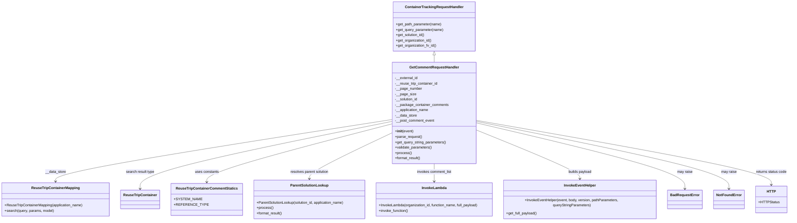

# Diagram: container_tracking_core/container_tracking_service/container_tracking_service/api/comments/handlers/get_comments.py

> Auto-generated by Obscura crawlers

## Mermaid

### SVG

<svg id="container" width="3495.73046875" xmlns="http://www.w3.org/2000/svg" class="classDiagram" height="992" viewBox="0 0 3495.73046875 992" role="graphics-document document" aria-roledescription="class"><g><defs><marker id="container_class-aggregationStart" class="marker aggregation class" refX="18" refY="7" markerWidth="190" markerHeight="240" orient="auto"><path d="M 18,7 L9,13 L1,7 L9,1 Z"></path></marker></defs><defs><marker id="container_class-aggregationEnd" class="marker aggregation class" refX="1" refY="7" markerWidth="20" markerHeight="28" orient="auto"><path d="M 18,7 L9,13 L1,7 L9,1 Z"></path></marker></defs><defs><marker id="container_class-extensionStart" class="marker extension class" refX="18" refY="7" markerWidth="190" markerHeight="240" orient="auto"><path d="M 1,7 L18,13 V 1 Z"></path></marker></defs><defs><marker id="container_class-extensionEnd" class="marker extension class" refX="1" refY="7" markerWidth="20" markerHeight="28" orient="auto"><path d="M 1,1 V 13 L18,7 Z"></path></marker></defs><defs><marker id="container_class-compositionStart" class="marker composition class" refX="18" refY="7" markerWidth="190" markerHeight="240" orient="auto"><path d="M 18,7 L9,13 L1,7 L9,1 Z"></path></marker></defs><defs><marker id="container_class-compositionEnd" class="marker composition class" refX="1" refY="7" markerWidth="20" markerHeight="28" orient="auto"><path d="M 18,7 L9,13 L1,7 L9,1 Z"></path></marker></defs><defs><marker id="container_class-dependencyStart" class="marker dependency class" refX="6" refY="7" markerWidth="190" markerHeight="240" orient="auto"><path d="M 5,7 L9,13 L1,7 L9,1 Z"></path></marker></defs><defs><marker id="container_class-dependencyEnd" class="marker dependency class" refX="13" refY="7" markerWidth="20" markerHeight="28" orient="auto"><path d="M 18,7 L9,13 L14,7 L9,1 Z"></path></marker></defs><defs><marker id="container_class-lollipopStart" class="marker lollipop class" refX="13" refY="7" markerWidth="190" markerHeight="240" orient="auto"><circle stroke="black" fill="transparent" cx="7" cy="7" r="6"></circle></marker></defs><defs><marker id="container_class-lollipopEnd" class="marker lollipop class" refX="1" refY="7" markerWidth="190" markerHeight="240" orient="auto"><circle stroke="black" fill="transparent" cx="7" cy="7" r="6"></circle></marker></defs><g class="root"><g class="clusters"></g><g class="edgePaths"><path d="M1916.141,247.25L1916.141,248.542C1916.141,249.833,1916.141,252.417,1916.141,257.875C1916.141,263.333,1916.141,271.667,1916.141,275.833L1916.141,280" id="id_ContainerTrackingRequestHandler_GetCommentRequestHandler_1" class="edge-thickness-normal edge-pattern-solid relation" style=";;;" data-edge="true" data-et="edge" data-id="id_ContainerTrackingRequestHandler_GetCommentRequestHandler_1" data-points="W3sieCI6MTkxNi4xNDA2MjUsInkiOjIzMH0seyJ4IjoxOTE2LjE0MDYyNSwieSI6MjU1fSx7IngiOjE5MTYuMTQwNjI1LCJ5IjoyODB9XQ==" marker-start="url(#container_class-extensionStart)"></path><path d="M1731.063,537.413L1483.997,576.678C1236.932,615.942,742.802,694.471,495.737,740.902C248.672,787.333,248.672,801.667,248.672,808.833L248.672,816" id="id_GetCommentRequestHandler_ReuseTripContainerMapping_2" class="edge-thickness-normal edge-pattern-solid relation" style=";;;" data-edge="true" data-et="edge" data-id="id_GetCommentRequestHandler_ReuseTripContainerMapping_2" data-points="W3sieCI6MTczMS4wNjI1LCJ5Ijo1MzcuNDEzMjY2NzQwMzgxMn0seyJ4IjoyNDguNjcxODc1LCJ5Ijo3NzN9LHsieCI6MjQ4LjY3MTg3NSwieSI6ODIyfV0=" marker-end="url(#container_class-dependencyEnd)"></path><path d="M1731.063,545.938L1546.445,583.782C1361.828,621.625,992.594,697.313,807.977,747.823C623.359,798.333,623.359,823.667,623.359,836.333L623.359,849" id="id_GetCommentRequestHandler_ReuseTripContainer_3" class="edge-thickness-normal edge-pattern-solid relation" style=";;;" data-edge="true" data-et="edge" data-id="id_GetCommentRequestHandler_ReuseTripContainer_3" data-points="W3sieCI6MTczMS4wNjI1LCJ5Ijo1NDUuOTM4MTMwMDAwNzI1Mn0seyJ4Ijo2MjMuMzU5Mzc1LCJ5Ijo3NzN9LHsieCI6NjIzLjM1OTM3NSwieSI6ODU1fV0=" marker-end="url(#container_class-dependencyEnd)"></path><path d="M1731.063,556.321L1592.743,592.434C1454.423,628.547,1177.784,700.774,1039.464,744.554C901.145,788.333,901.145,803.667,901.145,811.333L901.145,819" id="id_GetCommentRequestHandler_ReuseTripContainerCommentStatics_4" class="edge-thickness-normal edge-pattern-solid relation" style=";;;" data-edge="true" data-et="edge" data-id="id_GetCommentRequestHandler_ReuseTripContainerCommentStatics_4" data-points="W3sieCI6MTczMS4wNjI1LCJ5Ijo1NTYuMzIxMDc1NzQzMDU2M30seyJ4Ijo5MDEuMTQ0NTMxMjUsInkiOjc3M30seyJ4Ijo5MDEuMTQ0NTMxMjUsInkiOjgyNX1d" marker-end="url(#container_class-dependencyEnd)"></path><path d="M1731.063,594.325L1667.217,624.104C1603.371,653.883,1475.68,713.442,1411.834,748.387C1347.988,783.333,1347.988,793.667,1347.988,798.833L1347.988,804" id="id_GetCommentRequestHandler_ParentSolutionLookup_5" class="edge-thickness-normal edge-pattern-solid relation" style=";;;" data-edge="true" data-et="edge" data-id="id_GetCommentRequestHandler_ParentSolutionLookup_5" data-points="W3sieCI6MTczMS4wNjI1LCJ5Ijo1OTQuMzI0OTE1NjA0OTk3fSx7IngiOjEzNDcuOTg4MjgxMjUsInkiOjc3M30seyJ4IjoxMzQ3Ljk4ODI4MTI1LCJ5Ijo4MTB9XQ==" marker-end="url(#container_class-dependencyEnd)"></path><path d="M1916.141,736L1916.141,742.167C1916.141,748.333,1916.141,760.667,1916.141,774C1916.141,787.333,1916.141,801.667,1916.141,808.833L1916.141,816" id="id_GetCommentRequestHandler_InvokeLambda_6" class="edge-thickness-normal edge-pattern-solid relation" style=";;;" data-edge="true" data-et="edge" data-id="id_GetCommentRequestHandler_InvokeLambda_6" data-points="W3sieCI6MTkxNi4xNDA2MjUsInkiOjczNn0seyJ4IjoxOTE2LjE0MDYyNSwieSI6NzczfSx7IngiOjE5MTYuMTQwNjI1LCJ5Ijo4MjJ9XQ==" marker-end="url(#container_class-dependencyEnd)"></path><path d="M2101.219,582.287L2180.41,614.072C2259.6,645.858,2417.982,709.429,2497.173,748.381C2576.363,787.333,2576.363,801.667,2576.363,808.833L2576.363,816" id="id_GetCommentRequestHandler_InvokeEventHelper_7" class="edge-thickness-normal edge-pattern-solid relation" style=";;;" data-edge="true" data-et="edge" data-id="id_GetCommentRequestHandler_InvokeEventHelper_7" data-points="W3sieCI6MjEwMS4yMTg3NSwieSI6NTgyLjI4NjYxMDIyMjY0MDN9LHsieCI6MjU3Ni4zNjMyODEyNSwieSI6NzczfSx7IngiOjI1NzYuMzYzMjgxMjUsInkiOjgyMn1d" marker-end="url(#container_class-dependencyEnd)"></path><path d="M2101.219,551.417L2258.647,588.347C2416.076,625.278,2730.932,699.139,2888.361,748.736C3045.789,798.333,3045.789,823.667,3045.789,836.333L3045.789,849" id="id_GetCommentRequestHandler_BadRequestError_8" class="edge-thickness-normal edge-pattern-solid relation" style=";;;" data-edge="true" data-et="edge" data-id="id_GetCommentRequestHandler_BadRequestError_8" data-points="W3sieCI6MjEwMS4yMTg3NSwieSI6NTUxLjQxNjc4NDgxMjc1Mjl9LHsieCI6MzA0NS43ODkwNjI1LCJ5Ijo3NzN9LHsieCI6MzA0NS43ODkwNjI1LCJ5Ijo4NTV9XQ==" marker-end="url(#container_class-dependencyEnd)"></path><path d="M2101.219,545.171L2290.283,583.143C2479.346,621.114,2857.474,697.057,3046.538,747.695C3235.602,798.333,3235.602,823.667,3235.602,836.333L3235.602,849" id="id_GetCommentRequestHandler_NotFoundError_9" class="edge-thickness-normal edge-pattern-solid relation" style=";;;" data-edge="true" data-et="edge" data-id="id_GetCommentRequestHandler_NotFoundError_9" data-points="W3sieCI6MjEwMS4yMTg3NSwieSI6NTQ1LjE3MTAxNTYyNTQ2MjZ9LHsieCI6MzIzNS42MDE1NjI1LCJ5Ijo3NzN9LHsieCI6MzIzNS42MDE1NjI1LCJ5Ijo4NTV9XQ==" marker-end="url(#container_class-dependencyEnd)"></path><path d="M2101.219,540.667L2320.606,579.389C2539.993,618.111,2978.768,695.556,3198.156,743.944C3417.543,792.333,3417.543,811.667,3417.543,821.333L3417.543,831" id="id_GetCommentRequestHandler_HTTP_10" class="edge-thickness-normal edge-pattern-solid relation" style=";;;" data-edge="true" data-et="edge" data-id="id_GetCommentRequestHandler_HTTP_10" data-points="W3sieCI6MjEwMS4yMTg3NSwieSI6NTQwLjY2NjU5NTU1MjU5NTR9LHsieCI6MzQxNy41NDI5Njg3NSwieSI6NzczfSx7IngiOjM0MTcuNTQyOTY4NzUsInkiOjgzN31d" marker-end="url(#container_class-dependencyEnd)"></path></g><g class="edgeLabels"><g class="edgeLabel"><g class="label" data-id="id_ContainerTrackingRequestHandler_GetCommentRequestHandler_1" transform="translate(0, 0)"><foreignObject width="0" height="0">

</foreignObject></g></g><g class="edgeLabel" transform="translate(248.671875, 773)"><g class="label" data-id="id_GetCommentRequestHandler_ReuseTripContainerMapping_2" transform="translate(-46.9453125, -12)"><foreignObject width="93.890625" height="24">

__data_store

</foreignObject></g></g><g class="edgeLabel" transform="translate(623.359375, 773)"><g class="label" data-id="id_GetCommentRequestHandler_ReuseTripContainer_3" transform="translate(-64.703125, -12)"><foreignObject width="129.40625" height="24">

search result type

</foreignObject></g></g><g class="edgeLabel" transform="translate(901.14453125, 773)"><g class="label" data-id="id_GetCommentRequestHandler_ReuseTripContainerCommentStatics_4" transform="translate(-53.8671875, -12)"><foreignObject width="107.734375" height="24">

uses constants

</foreignObject></g></g><g class="edgeLabel" transform="translate(1347.98828125, 773)"><g class="label" data-id="id_GetCommentRequestHandler_ParentSolutionLookup_5" transform="translate(-87.84375, -12)"><foreignObject width="175.6875" height="24">

resolves parent solution

</foreignObject></g></g><g class="edgeLabel" transform="translate(1916.140625, 773)"><g class="label" data-id="id_GetCommentRequestHandler_InvokeLambda_6" transform="translate(-78.9921875, -12)"><foreignObject width="157.984375" height="24">

invokes comment_list

</foreignObject></g></g><g class="edgeLabel" transform="translate(2576.36328125, 773)"><g class="label" data-id="id_GetCommentRequestHandler_InvokeEventHelper_7" transform="translate(-53.484375, -12)"><foreignObject width="106.96875" height="24">

builds payload

</foreignObject></g></g><g class="edgeLabel" transform="translate(3045.7890625, 773)"><g class="label" data-id="id_GetCommentRequestHandler_BadRequestError_8" transform="translate(-34.65625, -12)"><foreignObject width="69.3125" height="24">

may raise

</foreignObject></g></g><g class="edgeLabel" transform="translate(3235.6015625, 773)"><g class="label" data-id="id_GetCommentRequestHandler_NotFoundError_9" transform="translate(-34.65625, -12)"><foreignObject width="69.3125" height="24">

may raise

</foreignObject></g></g><g class="edgeLabel" transform="translate(3417.54296875, 773)"><g class="label" data-id="id_GetCommentRequestHandler_HTTP_10" transform="translate(-70.1875, -12)"><foreignObject width="140.375" height="24">

returns status code

</foreignObject></g></g></g><g class="nodes"><g class="node default" id="classId-ContainerTrackingRequestHandler-0" transform="translate(1916.140625, 119)"><g class="basic label-container"><path d="M-181.87109375 -111 L181.87109375 -111 L181.87109375 111 L-181.87109375 111" stroke="none" stroke-width="0" fill="#ECECFF" style=""></path><path d="M-181.87109375 -111 C-53.85592831241854 -111, 74.15923712516292 -111, 181.87109375 -111 M-181.87109375 -111 C-105.31984915243017 -111, -28.76860455486033 -111, 181.87109375 -111 M181.87109375 -111 C181.87109375 -30.286371868837392, 181.87109375 50.427256262325216, 181.87109375 111 M181.87109375 -111 C181.87109375 -52.26767475073212, 181.87109375 6.464650498535761, 181.87109375 111 M181.87109375 111 C82.73891568755809 111, -16.393262374883818 111, -181.87109375 111 M181.87109375 111 C44.07496883272174 111, -93.72115608455653 111, -181.87109375 111 M-181.87109375 111 C-181.87109375 62.58117130125362, -181.87109375 14.162342602507238, -181.87109375 -111 M-181.87109375 111 C-181.87109375 47.882869586005505, -181.87109375 -15.23426082798899, -181.87109375 -111" stroke="#9370DB" stroke-width="1.3" fill="none" stroke-dasharray="0 0" style=""></path></g><g class="annotation-group text" transform="translate(0, -87)"></g><g class="label-group text" transform="translate(-125.5859375, -87)"><g class="label" style="font-weight: bolder" transform="translate(0,-12)"><foreignObject width="251.171875" height="24">

ContainerTrackingRequestHandler

</foreignObject></g></g><g class="members-group text" transform="translate(-169.87109375, -39)"></g><g class="methods-group text" transform="translate(-169.87109375, -9)"><g class="label" style="" transform="translate(0,-12)"><foreignObject width="206.5" height="24">

+get_path_parameter(name)

</foreignObject></g><g class="label" style="" transform="translate(0,12)"><foreignObject width="214.15625" height="24">

+get_query_parameter(name)

</foreignObject></g><g class="label" style="" transform="translate(0,36)"><foreignObject width="131.46875" height="24">

+get_solution_id()

</foreignObject></g><g class="label" style="" transform="translate(0,60)"><foreignObject width="161.671875" height="24">

+get_organization_id()

</foreignObject></g><g class="label" style="" transform="translate(0,84)"><foreignObject width="182.421875" height="24">

+get_organization_fv_id()

</foreignObject></g></g><g class="divider" style=""><path d="M-181.87109375 -63 C-93.10527783808223 -63, -4.339461926164461 -63, 181.87109375 -63 M-181.87109375 -63 C-79.02755358061665 -63, 23.81598658876669 -63, 181.87109375 -63" stroke="#9370DB" stroke-width="1.3" fill="none" stroke-dasharray="0 0" style=""></path></g><g class="divider" style=""><path d="M-181.87109375 -39 C-94.57764834885195 -39, -7.284202947703903 -39, 181.87109375 -39 M-181.87109375 -39 C-53.47805306219897 -39, 74.91498762560207 -39, 181.87109375 -39" stroke="#9370DB" stroke-width="1.3" fill="none" stroke-dasharray="0 0" style=""></path></g></g><g class="node default" id="classId-GetCommentRequestHandler-1" transform="translate(1916.140625, 508)"><g class="basic label-container"><path d="M-185.078125 -228 L185.078125 -228 L185.078125 228 L-185.078125 228" stroke="none" stroke-width="0" fill="#ECECFF" style=""></path><path d="M-185.078125 -228 C-105.20564521176962 -228, -25.333165423539242 -228, 185.078125 -228 M-185.078125 -228 C-53.07040180019439 -228, 78.93732139961122 -228, 185.078125 -228 M185.078125 -228 C185.078125 -83.51108143467582, 185.078125 60.97783713064837, 185.078125 228 M185.078125 -228 C185.078125 -71.67396561409444, 185.078125 84.65206877181112, 185.078125 228 M185.078125 228 C90.82094125810748 228, -3.436242483785037 228, -185.078125 228 M185.078125 228 C89.12356551163646 228, -6.830993976727086 228, -185.078125 228 M-185.078125 228 C-185.078125 130.50514301693613, -185.078125 33.01028603387226, -185.078125 -228 M-185.078125 228 C-185.078125 98.51623636212236, -185.078125 -30.967527275755288, -185.078125 -228" stroke="#9370DB" stroke-width="1.3" fill="none" stroke-dasharray="0 0" style=""></path></g><g class="annotation-group text" transform="translate(0, -204)"></g><g class="label-group text" transform="translate(-106.484375, -204)"><g class="label" style="font-weight: bolder" transform="translate(0,-12)"><foreignObject width="212.96875" height="24">

GetCommentRequestHandler

</foreignObject></g></g><g class="members-group text" transform="translate(-173.078125, -156)"><g class="label" style="" transform="translate(0,-12)"><foreignObject width="103.109375" height="24">

-__external_id

</foreignObject></g><g class="label" style="" transform="translate(0,12)"><foreignObject width="193.21875" height="24">

-__reuse_trip_container_id

</foreignObject></g><g class="label" style="" transform="translate(0,36)"><foreignObject width="121.125" height="24">

-__page_number

</foreignObject></g><g class="label" style="" transform="translate(0,60)"><foreignObject width="91.90625" height="24">

-__page_size

</foreignObject></g><g class="label" style="" transform="translate(0,84)"><foreignObject width="103.875" height="24">

-__solution_id

</foreignObject></g><g class="label" style="" transform="translate(0,108)"><foreignObject width="239.671875" height="24">

-__package_container_comments

</foreignObject></g><g class="label" style="" transform="translate(0,132)"><foreignObject width="152.28125" height="24">

-__application_name

</foreignObject></g><g class="label" style="" transform="translate(0,156)"><foreignObject width="99.0625" height="24">

-__data_store

</foreignObject></g><g class="label" style="" transform="translate(0,180)"><foreignObject width="178.0625" height="24">

-__post_comment_event

</foreignObject></g></g><g class="methods-group text" transform="translate(-173.078125, 84)"><g class="label" style="" transform="translate(0,-12)"><foreignObject width="83.140625" height="24">

+<strong>init</strong>(event)

</foreignObject></g><g class="label" style="" transform="translate(0,12)"><foreignObject width="121.796875" height="24">

+parse_request()

</foreignObject></g><g class="label" style="" transform="translate(0,36)"><foreignObject width="230.890625" height="24">

+get_query_string_parameters()

</foreignObject></g><g class="label" style="" transform="translate(0,60)"><foreignObject width="166.546875" height="24">

+validate_parameters()

</foreignObject></g><g class="label" style="" transform="translate(0,84)"><foreignObject width="73.734375" height="24">

+process()

</foreignObject></g><g class="label" style="" transform="translate(0,108)"><foreignObject width="117.015625" height="24">

+format_result()

</foreignObject></g></g><g class="divider" style=""><path d="M-185.078125 -180 C-51.267537735131725 -180, 82.54304952973655 -180, 185.078125 -180 M-185.078125 -180 C-45.751859510631505 -180, 93.57440597873699 -180, 185.078125 -180" stroke="#9370DB" stroke-width="1.3" fill="none" stroke-dasharray="0 0" style=""></path></g><g class="divider" style=""><path d="M-185.078125 60 C-45.57142967485734 60, 93.93526565028532 60, 185.078125 60 M-185.078125 60 C-45.51152707266826 60, 94.05507085466348 60, 185.078125 60" stroke="#9370DB" stroke-width="1.3" fill="none" stroke-dasharray="0 0" style=""></path></g></g><g class="node default" id="classId-ReuseTripContainerMapping-2" transform="translate(248.671875, 897)"><g class="basic label-container"><path d="M-240.671875 -75 L240.671875 -75 L240.671875 75 L-240.671875 75" stroke="none" stroke-width="0" fill="#ECECFF" style=""></path><path d="M-240.671875 -75 C-106.9561409447958 -75, 26.75959311040839 -75, 240.671875 -75 M-240.671875 -75 C-84.89074738246325 -75, 70.89038023507351 -75, 240.671875 -75 M240.671875 -75 C240.671875 -44.79396684431768, 240.671875 -14.58793368863536, 240.671875 75 M240.671875 -75 C240.671875 -22.51283331839204, 240.671875 29.97433336321592, 240.671875 75 M240.671875 75 C118.3427380855219 75, -3.9863988289561973 75, -240.671875 75 M240.671875 75 C78.90513393467714 75, -82.86160713064572 75, -240.671875 75 M-240.671875 75 C-240.671875 35.57893633535954, -240.671875 -3.8421273292809133, -240.671875 -75 M-240.671875 75 C-240.671875 20.91595750291465, -240.671875 -33.1680849941707, -240.671875 -75" stroke="#9370DB" stroke-width="1.3" fill="none" stroke-dasharray="0 0" style=""></path></g><g class="annotation-group text" transform="translate(0, -51)"></g><g class="label-group text" transform="translate(-103.515625, -51)"><g class="label" style="font-weight: bolder" transform="translate(0,-12)"><foreignObject width="207.03125" height="24">

ReuseTripContainerMapping

</foreignObject></g></g><g class="members-group text" transform="translate(-228.671875, -3)"></g><g class="methods-group text" transform="translate(-228.671875, 27)"><g class="label" style="" transform="translate(0,-12)"><foreignObject width="353.828125" height="24">

+ReuseTripContainerMapping(application_name)

</foreignObject></g><g class="label" style="" transform="translate(0,12)"><foreignObject width="222.5625" height="24">

+search(query, params, model)

</foreignObject></g></g><g class="divider" style=""><path d="M-240.671875 -27 C-75.43458600179645 -27, 89.8027029964071 -27, 240.671875 -27 M-240.671875 -27 C-112.76898004251024 -27, 15.133914914979528 -27, 240.671875 -27" stroke="#9370DB" stroke-width="1.3" fill="none" stroke-dasharray="0 0" style=""></path></g><g class="divider" style=""><path d="M-240.671875 -3 C-54.49533570799369 -3, 131.68120358401262 -3, 240.671875 -3 M-240.671875 -3 C-55.98309881757771 -3, 128.70567736484458 -3, 240.671875 -3" stroke="#9370DB" stroke-width="1.3" fill="none" stroke-dasharray="0 0" style=""></path></g></g><g class="node default" id="classId-ReuseTripContainer-3" transform="translate(623.359375, 897)"><g class="basic label-container"><path d="M-84.015625 -42 L84.015625 -42 L84.015625 42 L-84.015625 42" stroke="none" stroke-width="0" fill="#ECECFF" style=""></path><path d="M-84.015625 -42 C-22.607786674134523 -42, 38.80005165173095 -42, 84.015625 -42 M-84.015625 -42 C-17.59797237460573 -42, 48.81968025078854 -42, 84.015625 -42 M84.015625 -42 C84.015625 -24.043108496794332, 84.015625 -6.086216993588664, 84.015625 42 M84.015625 -42 C84.015625 -24.805739855817226, 84.015625 -7.611479711634452, 84.015625 42 M84.015625 42 C23.5646751657831 42, -36.8862746684338 42, -84.015625 42 M84.015625 42 C21.572239269533853 42, -40.871146460932295 42, -84.015625 42 M-84.015625 42 C-84.015625 13.6522689571608, -84.015625 -14.6954620856784, -84.015625 -42 M-84.015625 42 C-84.015625 12.100542464590625, -84.015625 -17.79891507081875, -84.015625 -42" stroke="#9370DB" stroke-width="1.3" fill="none" stroke-dasharray="0 0" style=""></path></g><g class="annotation-group text" transform="translate(0, -18)"></g><g class="label-group text" transform="translate(-72.015625, -18)"><g class="label" style="font-weight: bolder" transform="translate(0,-12)"><foreignObject width="144.03125" height="24">

ReuseTripContainer

</foreignObject></g></g><g class="members-group text" transform="translate(-72.015625, 30)"></g><g class="methods-group text" transform="translate(-72.015625, 60)"></g><g class="divider" style=""><path d="M-84.015625 6 C-18.539001051821188 6, 46.937622896357624 6, 84.015625 6 M-84.015625 6 C-36.2139783715846 6, 11.587668256830796 6, 84.015625 6" stroke="#9370DB" stroke-width="1.3" fill="none" stroke-dasharray="0 0" style=""></path></g><g class="divider" style=""><path d="M-84.015625 24 C-46.58622318236096 24, -9.156821364721921 24, 84.015625 24 M-84.015625 24 C-45.02435012071873 24, -6.033075241437459 24, 84.015625 24" stroke="#9370DB" stroke-width="1.3" fill="none" stroke-dasharray="0 0" style=""></path></g></g><g class="node default" id="classId-ReuseTripContainerCommentStatics-4" transform="translate(901.14453125, 897)"><g class="basic label-container"><path d="M-143.76953125 -72 L143.76953125 -72 L143.76953125 72 L-143.76953125 72" stroke="none" stroke-width="0" fill="#ECECFF" style=""></path><path d="M-143.76953125 -72 C-84.71047863982754 -72, -25.651426029655084 -72, 143.76953125 -72 M-143.76953125 -72 C-63.210189498845196 -72, 17.349152252309608 -72, 143.76953125 -72 M143.76953125 -72 C143.76953125 -36.27298921052937, 143.76953125 -0.5459784210587344, 143.76953125 72 M143.76953125 -72 C143.76953125 -16.4526606543959, 143.76953125 39.0946786912082, 143.76953125 72 M143.76953125 72 C29.29892389610049 72, -85.17168345779902 72, -143.76953125 72 M143.76953125 72 C82.38108648550165 72, 20.99264172100331 72, -143.76953125 72 M-143.76953125 72 C-143.76953125 23.59627125597551, -143.76953125 -24.807457488048982, -143.76953125 -72 M-143.76953125 72 C-143.76953125 30.194462815558822, -143.76953125 -11.611074368882356, -143.76953125 -72" stroke="#9370DB" stroke-width="1.3" fill="none" stroke-dasharray="0 0" style=""></path></g><g class="annotation-group text" transform="translate(0, -48)"></g><g class="label-group text" transform="translate(-131.7578125, -48)"><g class="label" style="font-weight: bolder" transform="translate(0,-12)"><foreignObject width="263.515625" height="24">

ReuseTripContainerCommentStatics

</foreignObject></g></g><g class="members-group text" transform="translate(-131.76953125, 0)"><g class="label" style="" transform="translate(0,-12)"><foreignObject width="111.296875" height="24">

+SYSTEM_NAME

</foreignObject></g><g class="label" style="" transform="translate(0,12)"><foreignObject width="131.78125" height="24">

+REFERENCE_TYPE

</foreignObject></g></g><g class="methods-group text" transform="translate(-131.76953125, 72)"></g><g class="divider" style=""><path d="M-143.76953125 -24 C-43.51752259025088 -24, 56.734486069498246 -24, 143.76953125 -24 M-143.76953125 -24 C-38.11709575513848 -24, 67.53533973972304 -24, 143.76953125 -24" stroke="#9370DB" stroke-width="1.3" fill="none" stroke-dasharray="0 0" style=""></path></g><g class="divider" style=""><path d="M-143.76953125 48 C-70.8831497675395 48, 2.003231714920986 48, 143.76953125 48 M-143.76953125 48 C-59.01087193074798 48, 25.747787388504037 48, 143.76953125 48" stroke="#9370DB" stroke-width="1.3" fill="none" stroke-dasharray="0 0" style=""></path></g></g><g class="node default" id="classId-ParentSolutionLookup-5" transform="translate(1347.98828125, 897)"><g class="basic label-container"><path d="M-253.07421875 -87 L253.07421875 -87 L253.07421875 87 L-253.07421875 87" stroke="none" stroke-width="0" fill="#ECECFF" style=""></path><path d="M-253.07421875 -87 C-121.59084660697604 -87, 9.892525536047913 -87, 253.07421875 -87 M-253.07421875 -87 C-146.30014582560932 -87, -39.52607290121867 -87, 253.07421875 -87 M253.07421875 -87 C253.07421875 -42.0683678533738, 253.07421875 2.8632642932523993, 253.07421875 87 M253.07421875 -87 C253.07421875 -43.568899750606555, 253.07421875 -0.13779950121310947, 253.07421875 87 M253.07421875 87 C57.526625126461255 87, -138.0209684970775 87, -253.07421875 87 M253.07421875 87 C136.77128700948077 87, 20.468355268961574 87, -253.07421875 87 M-253.07421875 87 C-253.07421875 33.93369849684304, -253.07421875 -19.132603006313914, -253.07421875 -87 M-253.07421875 87 C-253.07421875 48.74148871868691, -253.07421875 10.482977437373819, -253.07421875 -87" stroke="#9370DB" stroke-width="1.3" fill="none" stroke-dasharray="0 0" style=""></path></g><g class="annotation-group text" transform="translate(0, -63)"></g><g class="label-group text" transform="translate(-81.6328125, -63)"><g class="label" style="font-weight: bolder" transform="translate(0,-12)"><foreignObject width="163.265625" height="24">

ParentSolutionLookup

</foreignObject></g></g><g class="members-group text" transform="translate(-241.07421875, -15)"></g><g class="methods-group text" transform="translate(-241.07421875, 15)"><g class="label" style="" transform="translate(0,-12)"><foreignObject width="400.515625" height="24">

+ParentSolutionLookup(solution_id, application_name)

</foreignObject></g><g class="label" style="" transform="translate(0,12)"><foreignObject width="73.734375" height="24">

+process()

</foreignObject></g><g class="label" style="" transform="translate(0,36)"><foreignObject width="117.015625" height="24">

+format_result()

</foreignObject></g></g><g class="divider" style=""><path d="M-253.07421875 -39 C-68.60123141261519 -39, 115.87175592476962 -39, 253.07421875 -39 M-253.07421875 -39 C-80.6367604656252 -39, 91.8006978187496 -39, 253.07421875 -39" stroke="#9370DB" stroke-width="1.3" fill="none" stroke-dasharray="0 0" style=""></path></g><g class="divider" style=""><path d="M-253.07421875 -15 C-76.62838018377587 -15, 99.81745838244825 -15, 253.07421875 -15 M-253.07421875 -15 C-78.85681520846717 -15, 95.36058833306566 -15, 253.07421875 -15" stroke="#9370DB" stroke-width="1.3" fill="none" stroke-dasharray="0 0" style=""></path></g></g><g class="node default" id="classId-InvokeLambda-6" transform="translate(1916.140625, 897)"><g class="basic label-container"><path d="M-265.078125 -75 L265.078125 -75 L265.078125 75 L-265.078125 75" stroke="none" stroke-width="0" fill="#ECECFF" style=""></path><path d="M-265.078125 -75 C-79.00500072393251 -75, 107.06812355213498 -75, 265.078125 -75 M-265.078125 -75 C-149.80347889347354 -75, -34.52883278694708 -75, 265.078125 -75 M265.078125 -75 C265.078125 -42.0879241493811, 265.078125 -9.175848298762205, 265.078125 75 M265.078125 -75 C265.078125 -37.13497700084157, 265.078125 0.7300459983168537, 265.078125 75 M265.078125 75 C112.47300765045802 75, -40.13210969908397 75, -265.078125 75 M265.078125 75 C148.45801630803606 75, 31.83790761607213 75, -265.078125 75 M-265.078125 75 C-265.078125 32.952620303196795, -265.078125 -9.09475939360641, -265.078125 -75 M-265.078125 75 C-265.078125 34.724958516745275, -265.078125 -5.55008296650945, -265.078125 -75" stroke="#9370DB" stroke-width="1.3" fill="none" stroke-dasharray="0 0" style=""></path></g><g class="annotation-group text" transform="translate(0, -51)"></g><g class="label-group text" transform="translate(-53.484375, -51)"><g class="label" style="font-weight: bolder" transform="translate(0,-12)"><foreignObject width="106.96875" height="24">

InvokeLambda

</foreignObject></g></g><g class="members-group text" transform="translate(-253.078125, -3)"></g><g class="methods-group text" transform="translate(-253.078125, 27)"><g class="label" style="" transform="translate(0,-12)"><foreignObject width="452.671875" height="24">

+InvokeLambda(organization_id, function_name, full_payload)

</foreignObject></g><g class="label" style="" transform="translate(0,12)"><foreignObject width="134.4375" height="24">

+invoke_function()

</foreignObject></g></g><g class="divider" style=""><path d="M-265.078125 -27 C-102.53302234624311 -27, 60.01208030751377 -27, 265.078125 -27 M-265.078125 -27 C-81.55086817844682 -27, 101.97638864310636 -27, 265.078125 -27" stroke="#9370DB" stroke-width="1.3" fill="none" stroke-dasharray="0 0" style=""></path></g><g class="divider" style=""><path d="M-265.078125 -3 C-102.12472548993796 -3, 60.82867402012408 -3, 265.078125 -3 M-265.078125 -3 C-156.01633653323032 -3, -46.95454806646063 -3, 265.078125 -3" stroke="#9370DB" stroke-width="1.3" fill="none" stroke-dasharray="0 0" style=""></path></g></g><g class="node default" id="classId-InvokeEventHelper-7" transform="translate(2576.36328125, 897)"><g class="basic label-container"><path d="M-345.14453125 -75 L345.14453125 -75 L345.14453125 75 L-345.14453125 75" stroke="none" stroke-width="0" fill="#ECECFF" style=""></path><path d="M-345.14453125 -75 C-88.78213437360313 -75, 167.58026250279374 -75, 345.14453125 -75 M-345.14453125 -75 C-179.822047871329 -75, -14.49956449265801 -75, 345.14453125 -75 M345.14453125 -75 C345.14453125 -20.46282317379606, 345.14453125 34.07435365240788, 345.14453125 75 M345.14453125 -75 C345.14453125 -36.989927996259006, 345.14453125 1.0201440074819885, 345.14453125 75 M345.14453125 75 C87.11549639930399 75, -170.91353845139201 75, -345.14453125 75 M345.14453125 75 C169.80881616651337 75, -5.526898916973266 75, -345.14453125 75 M-345.14453125 75 C-345.14453125 24.794079277732223, -345.14453125 -25.411841444535554, -345.14453125 -75 M-345.14453125 75 C-345.14453125 36.61402313086451, -345.14453125 -1.7719537382709802, -345.14453125 -75" stroke="#9370DB" stroke-width="1.3" fill="none" stroke-dasharray="0 0" style=""></path></g><g class="annotation-group text" transform="translate(0, -51)"></g><g class="label-group text" transform="translate(-69.0859375, -51)"><g class="label" style="font-weight: bolder" transform="translate(0,-12)"><foreignObject width="138.171875" height="24">

InvokeEventHelper

</foreignObject></g></g><g class="members-group text" transform="translate(-333.14453125, -3)"></g><g class="methods-group text" transform="translate(-333.14453125, 27)"><g class="label" style="" transform="translate(0,-12)"><foreignObject width="597.203125" height="24">

+InvokeEventHelper(event, body, version, pathParameters, queryStringParameters)

</foreignObject></g><g class="label" style="" transform="translate(0,12)"><foreignObject width="139.03125" height="24">

+get_full_payload()

</foreignObject></g></g><g class="divider" style=""><path d="M-345.14453125 -27 C-157.35442903607108 -27, 30.435673177857836 -27, 345.14453125 -27 M-345.14453125 -27 C-140.3923476904858 -27, 64.35983586902842 -27, 345.14453125 -27" stroke="#9370DB" stroke-width="1.3" fill="none" stroke-dasharray="0 0" style=""></path></g><g class="divider" style=""><path d="M-345.14453125 -3 C-89.92731536682265 -3, 165.2899005163547 -3, 345.14453125 -3 M-345.14453125 -3 C-126.61828935055493 -3, 91.90795254889014 -3, 345.14453125 -3" stroke="#9370DB" stroke-width="1.3" fill="none" stroke-dasharray="0 0" style=""></path></g></g><g class="node default" id="classId-BadRequestError-8" transform="translate(3045.7890625, 897)"><g class="basic label-container"><path d="M-74.28125 -42 L74.28125 -42 L74.28125 42 L-74.28125 42" stroke="none" stroke-width="0" fill="#ECECFF" style=""></path><path d="M-74.28125 -42 C-41.058022790110556 -42, -7.834795580221112 -42, 74.28125 -42 M-74.28125 -42 C-17.620404542644536 -42, 39.04044091471093 -42, 74.28125 -42 M74.28125 -42 C74.28125 -22.943425537821835, 74.28125 -3.886851075643669, 74.28125 42 M74.28125 -42 C74.28125 -19.279729847144235, 74.28125 3.4405403057115294, 74.28125 42 M74.28125 42 C44.01240711010536 42, 13.743564220210722 42, -74.28125 42 M74.28125 42 C25.44174043339578 42, -23.397769133208442 42, -74.28125 42 M-74.28125 42 C-74.28125 10.768000610119422, -74.28125 -20.463998779761155, -74.28125 -42 M-74.28125 42 C-74.28125 14.565929129800509, -74.28125 -12.868141740398983, -74.28125 -42" stroke="#9370DB" stroke-width="1.3" fill="none" stroke-dasharray="0 0" style=""></path></g><g class="annotation-group text" transform="translate(0, -18)"></g><g class="label-group text" transform="translate(-62.28125, -18)"><g class="label" style="font-weight: bolder" transform="translate(0,-12)"><foreignObject width="124.5625" height="24">

BadRequestError

</foreignObject></g></g><g class="members-group text" transform="translate(-62.28125, 30)"></g><g class="methods-group text" transform="translate(-62.28125, 60)"></g><g class="divider" style=""><path d="M-74.28125 6 C-19.421540191045956 6, 35.43816961790809 6, 74.28125 6 M-74.28125 6 C-22.245625372368117 6, 29.789999255263766 6, 74.28125 6" stroke="#9370DB" stroke-width="1.3" fill="none" stroke-dasharray="0 0" style=""></path></g><g class="divider" style=""><path d="M-74.28125 24 C-30.04431169271985 24, 14.192626614560297 24, 74.28125 24 M-74.28125 24 C-41.53953881858005 24, -8.797827637160097 24, 74.28125 24" stroke="#9370DB" stroke-width="1.3" fill="none" stroke-dasharray="0 0" style=""></path></g></g><g class="node default" id="classId-NotFoundError-9" transform="translate(3235.6015625, 897)"><g class="basic label-container"><path d="M-65.53125 -42 L65.53125 -42 L65.53125 42 L-65.53125 42" stroke="none" stroke-width="0" fill="#ECECFF" style=""></path><path d="M-65.53125 -42 C-30.057929987494674 -42, 5.415390025010652 -42, 65.53125 -42 M-65.53125 -42 C-15.58710071747123 -42, 34.35704856505754 -42, 65.53125 -42 M65.53125 -42 C65.53125 -18.87558028042305, 65.53125 4.2488394391538975, 65.53125 42 M65.53125 -42 C65.53125 -12.641877125981416, 65.53125 16.716245748037167, 65.53125 42 M65.53125 42 C25.061231160056145 42, -15.408787679887709 42, -65.53125 42 M65.53125 42 C39.053254475122515 42, 12.57525895024503 42, -65.53125 42 M-65.53125 42 C-65.53125 15.99642686085894, -65.53125 -10.007146278282121, -65.53125 -42 M-65.53125 42 C-65.53125 20.65663624220953, -65.53125 -0.6867275155809409, -65.53125 -42" stroke="#9370DB" stroke-width="1.3" fill="none" stroke-dasharray="0 0" style=""></path></g><g class="annotation-group text" transform="translate(0, -18)"></g><g class="label-group text" transform="translate(-53.53125, -18)"><g class="label" style="font-weight: bolder" transform="translate(0,-12)"><foreignObject width="107.0625" height="24">

NotFoundError

</foreignObject></g></g><g class="members-group text" transform="translate(-53.53125, 30)"></g><g class="methods-group text" transform="translate(-53.53125, 60)"></g><g class="divider" style=""><path d="M-65.53125 6 C-16.28995412550624 6, 32.95134174898752 6, 65.53125 6 M-65.53125 6 C-21.024321040442288 6, 23.482607919115424 6, 65.53125 6" stroke="#9370DB" stroke-width="1.3" fill="none" stroke-dasharray="0 0" style=""></path></g><g class="divider" style=""><path d="M-65.53125 24 C-22.728423207465646 24, 20.07440358506871 24, 65.53125 24 M-65.53125 24 C-22.12862308918045 24, 21.2740038216391 24, 65.53125 24" stroke="#9370DB" stroke-width="1.3" fill="none" stroke-dasharray="0 0" style=""></path></g></g><g class="node default" id="classId-HTTP-10" transform="translate(3417.54296875, 897)"><g class="basic label-container"><path d="M-66.41015625 -60 L66.41015625 -60 L66.41015625 60 L-66.41015625 60" stroke="none" stroke-width="0" fill="#ECECFF" style=""></path><path d="M-66.41015625 -60 C-26.99214531643662 -60, 12.42586561712676 -60, 66.41015625 -60 M-66.41015625 -60 C-16.383546450851462 -60, 33.643063348297076 -60, 66.41015625 -60 M66.41015625 -60 C66.41015625 -15.184881658835202, 66.41015625 29.630236682329596, 66.41015625 60 M66.41015625 -60 C66.41015625 -23.17005989155676, 66.41015625 13.659880216886478, 66.41015625 60 M66.41015625 60 C31.57503391908903 60, -3.2600884118219398 60, -66.41015625 60 M66.41015625 60 C16.4128892948626 60, -33.5843776602748 60, -66.41015625 60 M-66.41015625 60 C-66.41015625 24.883208542832037, -66.41015625 -10.233582914335926, -66.41015625 -60 M-66.41015625 60 C-66.41015625 22.6514710371123, -66.41015625 -14.697057925775397, -66.41015625 -60" stroke="#9370DB" stroke-width="1.3" fill="none" stroke-dasharray="0 0" style=""></path></g><g class="annotation-group text" transform="translate(0, -36)"></g><g class="label-group text" transform="translate(-18.7734375, -36)"><g class="label" style="font-weight: bolder" transform="translate(0,-12)"><foreignObject width="37.546875" height="24">

HTTP

</foreignObject></g></g><g class="members-group text" transform="translate(-54.41015625, 12)"><g class="label" style="" transform="translate(0,-12)"><foreignObject width="90.046875" height="24">

+HTTPStatus

</foreignObject></g></g><g class="methods-group text" transform="translate(-54.41015625, 60)"></g><g class="divider" style=""><path d="M-66.41015625 -12 C-16.09966376837255 -12, 34.2108287132549 -12, 66.41015625 -12 M-66.41015625 -12 C-18.83133076399843 -12, 28.74749472200314 -12, 66.41015625 -12" stroke="#9370DB" stroke-width="1.3" fill="none" stroke-dasharray="0 0" style=""></path></g><g class="divider" style=""><path d="M-66.41015625 36 C-37.95059189866382 36, -9.491027547327647 36, 66.41015625 36 M-66.41015625 36 C-24.726262385323615 36, 16.95763147935277 36, 66.41015625 36" stroke="#9370DB" stroke-width="1.3" fill="none" stroke-dasharray="0 0" style=""></path></g></g></g></g></g></svg>
