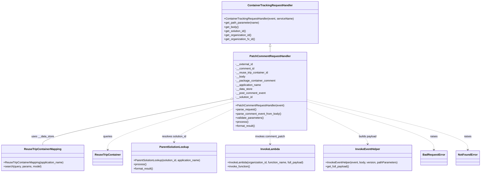

# Diagram: container_tracking_core/container_tracking_service/container_tracking_service/api/comments/handlers/patch_comment.py


> Auto-generated by Obscura crawlers

## Diagram 1



### SVG

<svg id="container" width="2797.453125" xmlns="http://www.w3.org/2000/svg" class="classDiagram" height="1016" viewBox="0 0 2797.453125 1016" role="graphics-document document" aria-roledescription="class"><style>#container{font-family:"trebuchet ms",verdana,arial,sans-serif;font-size:16px;fill:#333;}@keyframes edge-animation-frame{from{stroke-dashoffset:0;}}@keyframes dash{to{stroke-dashoffset:0;}}#container .edge-animation-slow{stroke-dasharray:9,5!important;stroke-dashoffset:900;animation:dash 50s linear infinite;stroke-linecap:round;}#container .edge-animation-fast{stroke-dasharray:9,5!important;stroke-dashoffset:900;animation:dash 20s linear infinite;stroke-linecap:round;}#container .error-icon{fill:#552222;}#container .error-text{fill:#552222;stroke:#552222;}#container .edge-thickness-normal{stroke-width:1px;}#container .edge-thickness-thick{stroke-width:3.5px;}#container .edge-pattern-solid{stroke-dasharray:0;}#container .edge-thickness-invisible{stroke-width:0;fill:none;}#container .edge-pattern-dashed{stroke-dasharray:3;}#container .edge-pattern-dotted{stroke-dasharray:2;}#container .marker{fill:#333333;stroke:#333333;}#container .marker.cross{stroke:#333333;}#container svg{font-family:"trebuchet ms",verdana,arial,sans-serif;font-size:16px;}#container p{margin:0;}#container g.classGroup text{fill:#9370DB;stroke:none;font-family:"trebuchet ms",verdana,arial,sans-serif;font-size:10px;}#container g.classGroup text .title{font-weight:bolder;}#container .nodeLabel,#container .edgeLabel{color:#131300;}#container .edgeLabel .label rect{fill:#ECECFF;}#container .label text{fill:#131300;}#container .labelBkg{background:#ECECFF;}#container .edgeLabel .label span{background:#ECECFF;}#container .classTitle{font-weight:bolder;}#container .node rect,#container .node circle,#container .node ellipse,#container .node polygon,#container .node path{fill:#ECECFF;stroke:#9370DB;stroke-width:1px;}#container .divider{stroke:#9370DB;stroke-width:1;}#container g.clickable{cursor:pointer;}#container g.classGroup rect{fill:#ECECFF;stroke:#9370DB;}#container g.classGroup line{stroke:#9370DB;stroke-width:1;}#container .classLabel .box{stroke:none;stroke-width:0;fill:#ECECFF;opacity:0.5;}#container .classLabel .label{fill:#9370DB;font-size:10px;}#container .relation{stroke:#333333;stroke-width:1;fill:none;}#container .dashed-line{stroke-dasharray:3;}#container .dotted-line{stroke-dasharray:1 2;}#container #compositionStart,#container .composition{fill:#333333!important;stroke:#333333!important;stroke-width:1;}#container #compositionEnd,#container .composition{fill:#333333!important;stroke:#333333!important;stroke-width:1;}#container #dependencyStart,#container .dependency{fill:#333333!important;stroke:#333333!important;stroke-width:1;}#container #dependencyStart,#container .dependency{fill:#333333!important;stroke:#333333!important;stroke-width:1;}#container #extensionStart,#container .extension{fill:transparent!important;stroke:#333333!important;stroke-width:1;}#container #extensionEnd,#container .extension{fill:transparent!important;stroke:#333333!important;stroke-width:1;}#container #aggregationStart,#container .aggregation{fill:transparent!important;stroke:#333333!important;stroke-width:1;}#container #aggregationEnd,#container .aggregation{fill:transparent!important;stroke:#333333!important;stroke-width:1;}#container #lollipopStart,#container .lollipop{fill:#ECECFF!important;stroke:#333333!important;stroke-width:1;}#container #lollipopEnd,#container .lollipop{fill:#ECECFF!important;stroke:#333333!important;stroke-width:1;}#container .edgeTerminals{font-size:11px;line-height:initial;}#container .classTitleText{text-anchor:middle;font-size:18px;fill:#333;}#container .label-icon{display:inline-block;height:1em;overflow:visible;vertical-align:-0.125em;}#container .node .label-icon path{fill:currentColor;stroke:revert;stroke-width:revert;}#container :root{--mermaid-font-family:"trebuchet ms",verdana,arial,sans-serif;}</style><g><defs><marker id="container_class-aggregationStart" class="marker aggregation class" refX="18" refY="7" markerWidth="190" markerHeight="240" orient="auto"><path d="M 18,7 L9,13 L1,7 L9,1 Z"></path></marker></defs><defs><marker id="container_class-aggregationEnd" class="marker aggregation class" refX="1" refY="7" markerWidth="20" markerHeight="28" orient="auto"><path d="M 18,7 L9,13 L1,7 L9,1 Z"></path></marker></defs><defs><marker id="container_class-extensionStart" class="marker extension class" refX="18" refY="7" markerWidth="190" markerHeight="240" orient="auto"><path d="M 1,7 L18,13 V 1 Z"></path></marker></defs><defs><marker id="container_class-extensionEnd" class="marker extension class" refX="1" refY="7" markerWidth="20" markerHeight="28" orient="auto"><path d="M 1,1 V 13 L18,7 Z"></path></marker></defs><defs><marker id="container_class-compositionStart" class="marker composition class" refX="18" refY="7" markerWidth="190" markerHeight="240" orient="auto"><path d="M 18,7 L9,13 L1,7 L9,1 Z"></path></marker></defs><defs><marker id="container_class-compositionEnd" class="marker composition class" refX="1" refY="7" markerWidth="20" markerHeight="28" orient="auto"><path d="M 18,7 L9,13 L1,7 L9,1 Z"></path></marker></defs><defs><marker id="container_class-dependencyStart" class="marker dependency class" refX="6" refY="7" markerWidth="190" markerHeight="240" orient="auto"><path d="M 5,7 L9,13 L1,7 L9,1 Z"></path></marker></defs><defs><marker id="container_class-dependencyEnd" class="marker dependency class" refX="13" refY="7" markerWidth="20" markerHeight="28" orient="auto"><path d="M 18,7 L9,13 L14,7 L9,1 Z"></path></marker></defs><defs><marker id="container_class-lollipopStart" class="marker lollipop class" refX="13" refY="7" markerWidth="190" markerHeight="240" orient="auto"><circle stroke="black" fill="transparent" cx="7" cy="7" r="6"></circle></marker></defs><defs><marker id="container_class-lollipopEnd" class="marker lollipop class" refX="1" refY="7" markerWidth="190" markerHeight="240" orient="auto"><circle stroke="black" fill="transparent" cx="7" cy="7" r="6"></circle></marker></defs><g class="root"><g class="clusters"></g><g class="edgePaths"><path d="M1578.602,271.25L1578.602,272.542C1578.602,273.833,1578.602,276.417,1578.602,281.875C1578.602,287.333,1578.602,295.667,1578.602,299.833L1578.602,304" id="id_ContainerTrackingRequestHandler_PatchCommentRequestHandler_1" class="edge-thickness-normal edge-pattern-solid relation" style=";;;" data-edge="true" data-et="edge" data-id="id_ContainerTrackingRequestHandler_PatchCommentRequestHandler_1" data-points="W3sieCI6MTU3OC42MDE1NjI1LCJ5IjoyNTR9LHsieCI6MTU3OC42MDE1NjI1LCJ5IjoyNzl9LHsieCI6MTU3OC42MDE1NjI1LCJ5IjozMDR9XQ==" marker-start="url(#container_class-extensionStart)"></path><path d="M1350.344,577.482L1166.732,614.069C983.12,650.655,615.896,723.827,432.284,768.58C248.672,813.333,248.672,829.667,248.672,837.833L248.672,846" id="id_PatchCommentRequestHandler_ReuseTripContainerMapping_2" class="edge-thickness-normal edge-pattern-solid relation" style=";;;" data-edge="true" data-et="edge" data-id="id_PatchCommentRequestHandler_ReuseTripContainerMapping_2" data-points="W3sieCI6MTM2Ny4yNjE3MTg3NSwieSI6NTc0LjExMTI5Mjg5MDI0OTJ9LHsieCI6MjQ4LjY3MTg3NSwieSI6Nzk3fSx7IngiOjI0OC42NzE4NzUsInkiOjg0Nn1d" marker-start="url(#container_class-aggregationStart)"></path><path d="M1367.262,590.629L1243.278,625.024C1119.294,659.419,871.327,728.21,747.343,775.272C623.359,822.333,623.359,847.667,623.359,860.333L623.359,873" id="id_PatchCommentRequestHandler_ReuseTripContainer_3" class="edge-thickness-normal edge-pattern-dashed relation" style=";;;" data-edge="true" data-et="edge" data-id="id_PatchCommentRequestHandler_ReuseTripContainer_3" data-points="W3sieCI6MTM2Ny4yNjE3MTg3NSwieSI6NTkwLjYyOTE3MjA4NDk1ODh9LHsieCI6NjIzLjM1OTM3NSwieSI6Nzk3fSx7IngiOjYyMy4zNTkzNzUsInkiOjg3OX1d" marker-end="url(#container_class-dependencyEnd)"></path><path d="M1367.262,630.574L1307.793,658.312C1248.324,686.049,1129.387,741.525,1069.918,774.429C1010.449,807.333,1010.449,817.667,1010.449,822.833L1010.449,828" id="id_PatchCommentRequestHandler_ParentSolutionLookup_4" class="edge-thickness-normal edge-pattern-dashed relation" style=";;;" data-edge="true" data-et="edge" data-id="id_PatchCommentRequestHandler_ParentSolutionLookup_4" data-points="W3sieCI6MTM2Ny4yNjE3MTg3NSwieSI6NjMwLjU3NDAxNjY1MjExMzl9LHsieCI6MTAxMC40NDkyMTg3NSwieSI6Nzk3fSx7IngiOjEwMTAuNDQ5MjE4NzUsInkiOjgzNH1d" marker-end="url(#container_class-dependencyEnd)"></path><path d="M1578.602,760L1578.602,766.167C1578.602,772.333,1578.602,784.667,1578.602,798C1578.602,811.333,1578.602,825.667,1578.602,832.833L1578.602,840" id="id_PatchCommentRequestHandler_InvokeLambda_5" class="edge-thickness-normal edge-pattern-dashed relation" style=";;;" data-edge="true" data-et="edge" data-id="id_PatchCommentRequestHandler_InvokeLambda_5" data-points="W3sieCI6MTU3OC42MDE1NjI1LCJ5Ijo3NjB9LHsieCI6MTU3OC42MDE1NjI1LCJ5Ijo3OTd9LHsieCI6MTU3OC42MDE1NjI1LCJ5Ijo4NDZ9XQ==" marker-end="url(#container_class-dependencyEnd)"></path><path d="M1789.941,629.714L1850.243,657.595C1910.546,685.476,2031.15,741.238,2091.452,776.286C2151.754,811.333,2151.754,825.667,2151.754,832.833L2151.754,840" id="id_PatchCommentRequestHandler_InvokeEventHelper_6" class="edge-thickness-normal edge-pattern-dashed relation" style=";;;" data-edge="true" data-et="edge" data-id="id_PatchCommentRequestHandler_InvokeEventHelper_6" data-points="W3sieCI6MTc4OS45NDE0MDYyNSwieSI6NjI5LjcxNDA4ODA2ODMxNzN9LHsieCI6MjE1MS43NTM5MDYyNSwieSI6Nzk3fSx7IngiOjIxNTEuNzUzOTA2MjUsInkiOjg0Nn1d" marker-end="url(#container_class-dependencyEnd)"></path><path d="M1789.941,590.613L1913.969,625.011C2037.997,659.409,2286.053,728.204,2410.081,775.269C2534.109,822.333,2534.109,847.667,2534.109,860.333L2534.109,873" id="id_PatchCommentRequestHandler_BadRequestError_7" class="edge-thickness-normal edge-pattern-dashed relation" style=";;;" data-edge="true" data-et="edge" data-id="id_PatchCommentRequestHandler_BadRequestError_7" data-points="W3sieCI6MTc4OS45NDE0MDYyNSwieSI6NTkwLjYxMjg3MzU1MzgyMDR9LHsieCI6MjUzNC4xMDkzNzUsInkiOjc5N30seyJ4IjoyNTM0LjEwOTM3NSwieSI6ODc5fV0=" marker-end="url(#container_class-dependencyEnd)"></path><path d="M1789.941,580.899L1945.605,616.916C2101.268,652.933,2412.595,724.966,2568.258,773.65C2723.922,822.333,2723.922,847.667,2723.922,860.333L2723.922,873" id="id_PatchCommentRequestHandler_NotFoundError_8" class="edge-thickness-normal edge-pattern-dashed relation" style=";;;" data-edge="true" data-et="edge" data-id="id_PatchCommentRequestHandler_NotFoundError_8" data-points="W3sieCI6MTc4OS45NDE0MDYyNSwieSI6NTgwLjg5OTAzNTQ3NzI0Nzd9LHsieCI6MjcyMy45MjE4NzUsInkiOjc5N30seyJ4IjoyNzIzLjkyMTg3NSwieSI6ODc5fV0=" marker-end="url(#container_class-dependencyEnd)"></path></g><g class="edgeLabels"><g class="edgeLabel"><g class="label" data-id="id_ContainerTrackingRequestHandler_PatchCommentRequestHandler_1" transform="translate(0, 0)"><foreignObject width="0" height="0"><div xmlns="http://www.w3.org/1999/xhtml" class="labelBkg" style="display: table-cell; white-space: nowrap; line-height: 1.5; max-width: 200px; text-align: center;"><span class="edgeLabel"></span></div></foreignObject></g></g><g class="edgeLabel" transform="translate(248.671875, 797)"><g class="label" data-id="id_PatchCommentRequestHandler_ReuseTripContainerMapping_2" transform="translate(-65.5546875, -12)"><foreignObject width="131.109375" height="24"><div xmlns="http://www.w3.org/1999/xhtml" class="labelBkg" style="display: table-cell; white-space: nowrap; line-height: 1.5; max-width: 200px; text-align: center;"><span class="edgeLabel"><p>uses __data_store</p></span></div></foreignObject></g></g><g class="edgeLabel" transform="translate(623.359375, 797)"><g class="label" data-id="id_PatchCommentRequestHandler_ReuseTripContainer_3" transform="translate(-27.2421875, -12)"><foreignObject width="54.484375" height="24"><div xmlns="http://www.w3.org/1999/xhtml" class="labelBkg" style="display: table-cell; white-space: nowrap; line-height: 1.5; max-width: 200px; text-align: center;"><span class="edgeLabel"><p>queries</p></span></div></foreignObject></g></g><g class="edgeLabel" transform="translate(1010.44921875, 797)"><g class="label" data-id="id_PatchCommentRequestHandler_ParentSolutionLookup_4" transform="translate(-73.1171875, -12)"><foreignObject width="146.234375" height="24"><div xmlns="http://www.w3.org/1999/xhtml" class="labelBkg" style="display: table-cell; white-space: nowrap; line-height: 1.5; max-width: 200px; text-align: center;"><span class="edgeLabel"><p>resolves solution_id</p></span></div></foreignObject></g></g><g class="edgeLabel" transform="translate(1578.6015625, 797)"><g class="label" data-id="id_PatchCommentRequestHandler_InvokeLambda_5" transform="translate(-88.15625, -12)"><foreignObject width="176.3125" height="24"><div xmlns="http://www.w3.org/1999/xhtml" class="labelBkg" style="display: table-cell; white-space: nowrap; line-height: 1.5; max-width: 200px; text-align: center;"><span class="edgeLabel"><p>invokes comment_patch</p></span></div></foreignObject></g></g><g class="edgeLabel" transform="translate(2151.75390625, 797)"><g class="label" data-id="id_PatchCommentRequestHandler_InvokeEventHelper_6" transform="translate(-53.484375, -12)"><foreignObject width="106.96875" height="24"><div xmlns="http://www.w3.org/1999/xhtml" class="labelBkg" style="display: table-cell; white-space: nowrap; line-height: 1.5; max-width: 200px; text-align: center;"><span class="edgeLabel"><p>builds payload</p></span></div></foreignObject></g></g><g class="edgeLabel" transform="translate(2534.109375, 797)"><g class="label" data-id="id_PatchCommentRequestHandler_BadRequestError_7" transform="translate(-21.25, -12)"><foreignObject width="42.5" height="24"><div xmlns="http://www.w3.org/1999/xhtml" class="labelBkg" style="display: table-cell; white-space: nowrap; line-height: 1.5; max-width: 200px; text-align: center;"><span class="edgeLabel"><p>raises</p></span></div></foreignObject></g></g><g class="edgeLabel" transform="translate(2723.921875, 797)"><g class="label" data-id="id_PatchCommentRequestHandler_NotFoundError_8" transform="translate(-21.25, -12)"><foreignObject width="42.5" height="24"><div xmlns="http://www.w3.org/1999/xhtml" class="labelBkg" style="display: table-cell; white-space: nowrap; line-height: 1.5; max-width: 200px; text-align: center;"><span class="edgeLabel"><p>raises</p></span></div></foreignObject></g></g></g><g class="nodes"><g class="node default" id="classId-ContainerTrackingRequestHandler-0" transform="translate(1578.6015625, 131)"><g class="basic label-container"><path d="M-278.50390625 -123 L278.50390625 -123 L278.50390625 123 L-278.50390625 123" stroke="none" stroke-width="0" fill="#ECECFF" style=""></path><path d="M-278.50390625 -123 C-148.52226092619907 -123, -18.540615602398134 -123, 278.50390625 -123 M-278.50390625 -123 C-86.75066861185977 -123, 105.00256902628047 -123, 278.50390625 -123 M278.50390625 -123 C278.50390625 -33.77863553267204, 278.50390625 55.44272893465592, 278.50390625 123 M278.50390625 -123 C278.50390625 -37.673679057290144, 278.50390625 47.65264188541971, 278.50390625 123 M278.50390625 123 C69.2515077626135 123, -140.000890724773 123, -278.50390625 123 M278.50390625 123 C90.1284489684902 123, -98.24700831301959 123, -278.50390625 123 M-278.50390625 123 C-278.50390625 44.593819452350914, -278.50390625 -33.81236109529817, -278.50390625 -123 M-278.50390625 123 C-278.50390625 34.32602790766869, -278.50390625 -54.34794418466262, -278.50390625 -123" stroke="#9370DB" stroke-width="1.3" fill="none" stroke-dasharray="0 0" style=""></path></g><g class="annotation-group text" transform="translate(0, -99)"></g><g class="label-group text" transform="translate(-125.5859375, -99)"><g class="label" style="font-weight: bolder" transform="translate(0,-12)"><foreignObject width="251.171875" height="24"><div xmlns="http://www.w3.org/1999/xhtml" style="display: table-cell; white-space: nowrap; line-height: 1.5; max-width: 299px; text-align: center;"><span class="nodeLabel markdown-node-label" style=""><p>ContainerTrackingRequestHandler</p></span></div></foreignObject></g></g><g class="members-group text" transform="translate(-266.50390625, -51)"></g><g class="methods-group text" transform="translate(-266.50390625, -21)"><g class="label" style="" transform="translate(0,-12)"><foreignObject width="407.421875" height="24"><div xmlns="http://www.w3.org/1999/xhtml" style="display: table-cell; white-space: nowrap; line-height: 1.5; max-width: 465px; text-align: center;"><span class="nodeLabel markdown-node-label" style=""><p>+ContainerTrackingRequestHandler(event, serviceName)</p></span></div></foreignObject></g><g class="label" style="" transform="translate(0,12)"><foreignObject width="206.5" height="24"><div xmlns="http://www.w3.org/1999/xhtml" style="display: table-cell; white-space: nowrap; line-height: 1.5; max-width: 264px; text-align: center;"><span class="nodeLabel markdown-node-label" style=""><p>+get_path_parameter(name)</p></span></div></foreignObject></g><g class="label" style="" transform="translate(0,36)"><foreignObject width="85.53125" height="24"><div xmlns="http://www.w3.org/1999/xhtml" style="display: table-cell; white-space: nowrap; line-height: 1.5; max-width: 143px; text-align: center;"><span class="nodeLabel markdown-node-label" style=""><p>+get_body()</p></span></div></foreignObject></g><g class="label" style="" transform="translate(0,60)"><foreignObject width="131.46875" height="24"><div xmlns="http://www.w3.org/1999/xhtml" style="display: table-cell; white-space: nowrap; line-height: 1.5; max-width: 189px; text-align: center;"><span class="nodeLabel markdown-node-label" style=""><p>+get_solution_id()</p></span></div></foreignObject></g><g class="label" style="" transform="translate(0,84)"><foreignObject width="161.671875" height="24"><div xmlns="http://www.w3.org/1999/xhtml" style="display: table-cell; white-space: nowrap; line-height: 1.5; max-width: 219px; text-align: center;"><span class="nodeLabel markdown-node-label" style=""><p>+get_organization_id()</p></span></div></foreignObject></g><g class="label" style="" transform="translate(0,108)"><foreignObject width="182.421875" height="24"><div xmlns="http://www.w3.org/1999/xhtml" style="display: table-cell; white-space: nowrap; line-height: 1.5; max-width: 240px; text-align: center;"><span class="nodeLabel markdown-node-label" style=""><p>+get_organization_fv_id()</p></span></div></foreignObject></g></g><g class="divider" style=""><path d="M-278.50390625 -75 C-122.02262006685669 -75, 34.45866611628662 -75, 278.50390625 -75 M-278.50390625 -75 C-153.03809289372737 -75, -27.57227953745476 -75, 278.50390625 -75" stroke="#9370DB" stroke-width="1.3" fill="none" stroke-dasharray="0 0" style=""></path></g><g class="divider" style=""><path d="M-278.50390625 -51 C-89.47199310469173 -51, 99.55992004061653 -51, 278.50390625 -51 M-278.50390625 -51 C-157.06212617568758 -51, -35.62034610137519 -51, 278.50390625 -51" stroke="#9370DB" stroke-width="1.3" fill="none" stroke-dasharray="0 0" style=""></path></g></g><g class="node default" id="classId-PatchCommentRequestHandler-1" transform="translate(1578.6015625, 532)"><g class="basic label-container"><path d="M-211.33984375 -228 L211.33984375 -228 L211.33984375 228 L-211.33984375 228" stroke="none" stroke-width="0" fill="#ECECFF" style=""></path><path d="M-211.33984375 -228 C-78.06985889175616 -228, 55.20012596648769 -228, 211.33984375 -228 M-211.33984375 -228 C-68.00020054658498 -228, 75.33944265683004 -228, 211.33984375 -228 M211.33984375 -228 C211.33984375 -98.33762440459071, 211.33984375 31.324751190818574, 211.33984375 228 M211.33984375 -228 C211.33984375 -131.28291267496184, 211.33984375 -34.5658253499237, 211.33984375 228 M211.33984375 228 C106.28329757628912 228, 1.2267514025782305 228, -211.33984375 228 M211.33984375 228 C92.0032533777014 228, -27.333336994597204 228, -211.33984375 228 M-211.33984375 228 C-211.33984375 116.81154506593943, -211.33984375 5.623090131878854, -211.33984375 -228 M-211.33984375 228 C-211.33984375 126.28905198513634, -211.33984375 24.57810397027268, -211.33984375 -228" stroke="#9370DB" stroke-width="1.3" fill="none" stroke-dasharray="0 0" style=""></path></g><g class="annotation-group text" transform="translate(0, -204)"></g><g class="label-group text" transform="translate(-113.9765625, -204)"><g class="label" style="font-weight: bolder" transform="translate(0,-12)"><foreignObject width="227.953125" height="24"><div xmlns="http://www.w3.org/1999/xhtml" style="display: table-cell; white-space: nowrap; line-height: 1.5; max-width: 277px; text-align: center;"><span class="nodeLabel markdown-node-label" style=""><p>PatchCommentRequestHandler</p></span></div></foreignObject></g></g><g class="members-group text" transform="translate(-199.33984375, -156)"><g class="label" style="" transform="translate(0,-12)"><foreignObject width="103.109375" height="24"><div xmlns="http://www.w3.org/1999/xhtml" style="display: table-cell; white-space: nowrap; line-height: 1.5; max-width: 160px; text-align: center;"><span class="nodeLabel markdown-node-label" style=""><p>-__external_id</p></span></div></foreignObject></g><g class="label" style="" transform="translate(0,12)"><foreignObject width="111.703125" height="24"><div xmlns="http://www.w3.org/1999/xhtml" style="display: table-cell; white-space: nowrap; line-height: 1.5; max-width: 169px; text-align: center;"><span class="nodeLabel markdown-node-label" style=""><p>-__comment_id</p></span></div></foreignObject></g><g class="label" style="" transform="translate(0,36)"><foreignObject width="193.21875" height="24"><div xmlns="http://www.w3.org/1999/xhtml" style="display: table-cell; white-space: nowrap; line-height: 1.5; max-width: 251px; text-align: center;"><span class="nodeLabel markdown-node-label" style=""><p>-__reuse_trip_container_id</p></span></div></foreignObject></g><g class="label" style="" transform="translate(0,60)"><foreignObject width="57.9375" height="24"><div xmlns="http://www.w3.org/1999/xhtml" style="display: table-cell; white-space: nowrap; line-height: 1.5; max-width: 115px; text-align: center;"><span class="nodeLabel markdown-node-label" style=""><p>-__body</p></span></div></foreignObject></g><g class="label" style="" transform="translate(0,84)"><foreignObject width="232.203125" height="24"><div xmlns="http://www.w3.org/1999/xhtml" style="display: table-cell; white-space: nowrap; line-height: 1.5; max-width: 290px; text-align: center;"><span class="nodeLabel markdown-node-label" style=""><p>-__package_container_comment</p></span></div></foreignObject></g><g class="label" style="" transform="translate(0,108)"><foreignObject width="152.28125" height="24"><div xmlns="http://www.w3.org/1999/xhtml" style="display: table-cell; white-space: nowrap; line-height: 1.5; max-width: 210px; text-align: center;"><span class="nodeLabel markdown-node-label" style=""><p>-__application_name</p></span></div></foreignObject></g><g class="label" style="" transform="translate(0,132)"><foreignObject width="99.0625" height="24"><div xmlns="http://www.w3.org/1999/xhtml" style="display: table-cell; white-space: nowrap; line-height: 1.5; max-width: 156px; text-align: center;"><span class="nodeLabel markdown-node-label" style=""><p>-__data_store</p></span></div></foreignObject></g><g class="label" style="" transform="translate(0,156)"><foreignObject width="178.0625" height="24"><div xmlns="http://www.w3.org/1999/xhtml" style="display: table-cell; white-space: nowrap; line-height: 1.5; max-width: 236px; text-align: center;"><span class="nodeLabel markdown-node-label" style=""><p>-__post_comment_event</p></span></div></foreignObject></g><g class="label" style="" transform="translate(0,180)"><foreignObject width="103.875" height="24"><div xmlns="http://www.w3.org/1999/xhtml" style="display: table-cell; white-space: nowrap; line-height: 1.5; max-width: 161px; text-align: center;"><span class="nodeLabel markdown-node-label" style=""><p>-__solution_id</p></span></div></foreignObject></g></g><g class="methods-group text" transform="translate(-199.33984375, 84)"><g class="label" style="" transform="translate(0,-12)"><foreignObject width="284.703125" height="24"><div xmlns="http://www.w3.org/1999/xhtml" style="display: table-cell; white-space: nowrap; line-height: 1.5; max-width: 342px; text-align: center;"><span class="nodeLabel markdown-node-label" style=""><p>+PatchCommentRequestHandler(event)</p></span></div></foreignObject></g><g class="label" style="" transform="translate(0,12)"><foreignObject width="121.796875" height="24"><div xmlns="http://www.w3.org/1999/xhtml" style="display: table-cell; white-space: nowrap; line-height: 1.5; max-width: 179px; text-align: center;"><span class="nodeLabel markdown-node-label" style=""><p>+parse_request()</p></span></div></foreignObject></g><g class="label" style="" transform="translate(0,36)"><foreignObject width="269.234375" height="24"><div xmlns="http://www.w3.org/1999/xhtml" style="display: table-cell; white-space: nowrap; line-height: 1.5; max-width: 327px; text-align: center;"><span class="nodeLabel markdown-node-label" style=""><p>+parse_comment_event_from_body()</p></span></div></foreignObject></g><g class="label" style="" transform="translate(0,60)"><foreignObject width="166.546875" height="24"><div xmlns="http://www.w3.org/1999/xhtml" style="display: table-cell; white-space: nowrap; line-height: 1.5; max-width: 224px; text-align: center;"><span class="nodeLabel markdown-node-label" style=""><p>+validate_parameters()</p></span></div></foreignObject></g><g class="label" style="" transform="translate(0,84)"><foreignObject width="73.734375" height="24"><div xmlns="http://www.w3.org/1999/xhtml" style="display: table-cell; white-space: nowrap; line-height: 1.5; max-width: 131px; text-align: center;"><span class="nodeLabel markdown-node-label" style=""><p>+process()</p></span></div></foreignObject></g><g class="label" style="" transform="translate(0,108)"><foreignObject width="117.015625" height="24"><div xmlns="http://www.w3.org/1999/xhtml" style="display: table-cell; white-space: nowrap; line-height: 1.5; max-width: 174px; text-align: center;"><span class="nodeLabel markdown-node-label" style=""><p>+format_result()</p></span></div></foreignObject></g></g><g class="divider" style=""><path d="M-211.33984375 -180 C-62.797552234582554 -180, 85.74473928083489 -180, 211.33984375 -180 M-211.33984375 -180 C-91.00446789720827 -180, 29.330907955583456 -180, 211.33984375 -180" stroke="#9370DB" stroke-width="1.3" fill="none" stroke-dasharray="0 0" style=""></path></g><g class="divider" style=""><path d="M-211.33984375 60 C-102.71456557093252 60, 5.910712608134958 60, 211.33984375 60 M-211.33984375 60 C-77.9440951817914 60, 55.451653386417206 60, 211.33984375 60" stroke="#9370DB" stroke-width="1.3" fill="none" stroke-dasharray="0 0" style=""></path></g></g><g class="node default" id="classId-ReuseTripContainerMapping-2" transform="translate(248.671875, 921)"><g class="basic label-container"><path d="M-240.671875 -75 L240.671875 -75 L240.671875 75 L-240.671875 75" stroke="none" stroke-width="0" fill="#ECECFF" style=""></path><path d="M-240.671875 -75 C-133.41476360796673 -75, -26.157652215933496 -75, 240.671875 -75 M-240.671875 -75 C-133.77789128100846 -75, -26.883907562016958 -75, 240.671875 -75 M240.671875 -75 C240.671875 -31.84774586709341, 240.671875 11.304508265813183, 240.671875 75 M240.671875 -75 C240.671875 -40.94008832976674, 240.671875 -6.8801766595334755, 240.671875 75 M240.671875 75 C94.30084462240552 75, -52.07018575518896 75, -240.671875 75 M240.671875 75 C82.16092644867632 75, -76.35002210264736 75, -240.671875 75 M-240.671875 75 C-240.671875 36.594682909181465, -240.671875 -1.8106341816370701, -240.671875 -75 M-240.671875 75 C-240.671875 41.57230841101951, -240.671875 8.144616822039026, -240.671875 -75" stroke="#9370DB" stroke-width="1.3" fill="none" stroke-dasharray="0 0" style=""></path></g><g class="annotation-group text" transform="translate(0, -51)"></g><g class="label-group text" transform="translate(-103.515625, -51)"><g class="label" style="font-weight: bolder" transform="translate(0,-12)"><foreignObject width="207.03125" height="24"><div xmlns="http://www.w3.org/1999/xhtml" style="display: table-cell; white-space: nowrap; line-height: 1.5; max-width: 255px; text-align: center;"><span class="nodeLabel markdown-node-label" style=""><p>ReuseTripContainerMapping</p></span></div></foreignObject></g></g><g class="members-group text" transform="translate(-228.671875, -3)"></g><g class="methods-group text" transform="translate(-228.671875, 27)"><g class="label" style="" transform="translate(0,-12)"><foreignObject width="353.828125" height="24"><div xmlns="http://www.w3.org/1999/xhtml" style="display: table-cell; white-space: nowrap; line-height: 1.5; max-width: 411px; text-align: center;"><span class="nodeLabel markdown-node-label" style=""><p>+ReuseTripContainerMapping(application_name)</p></span></div></foreignObject></g><g class="label" style="" transform="translate(0,12)"><foreignObject width="222.5625" height="24"><div xmlns="http://www.w3.org/1999/xhtml" style="display: table-cell; white-space: nowrap; line-height: 1.5; max-width: 280px; text-align: center;"><span class="nodeLabel markdown-node-label" style=""><p>+search(query, params, model)</p></span></div></foreignObject></g></g><g class="divider" style=""><path d="M-240.671875 -27 C-134.22521928850855 -27, -27.77856357701711 -27, 240.671875 -27 M-240.671875 -27 C-90.84193557557828 -27, 58.98800384884345 -27, 240.671875 -27" stroke="#9370DB" stroke-width="1.3" fill="none" stroke-dasharray="0 0" style=""></path></g><g class="divider" style=""><path d="M-240.671875 -3 C-119.0268104750179 -3, 2.6182540499642073 -3, 240.671875 -3 M-240.671875 -3 C-84.9592264438152 -3, 70.7534221123696 -3, 240.671875 -3" stroke="#9370DB" stroke-width="1.3" fill="none" stroke-dasharray="0 0" style=""></path></g></g><g class="node default" id="classId-ReuseTripContainer-3" transform="translate(623.359375, 921)"><g class="basic label-container"><path d="M-84.015625 -42 L84.015625 -42 L84.015625 42 L-84.015625 42" stroke="none" stroke-width="0" fill="#ECECFF" style=""></path><path d="M-84.015625 -42 C-23.29313337007668 -42, 37.42935825984664 -42, 84.015625 -42 M-84.015625 -42 C-18.268305224081345 -42, 47.47901455183731 -42, 84.015625 -42 M84.015625 -42 C84.015625 -10.967970671600831, 84.015625 20.064058656798338, 84.015625 42 M84.015625 -42 C84.015625 -16.41476548217465, 84.015625 9.170469035650697, 84.015625 42 M84.015625 42 C48.4890835179404 42, 12.962542035880801 42, -84.015625 42 M84.015625 42 C39.41296577953844 42, -5.189693440923122 42, -84.015625 42 M-84.015625 42 C-84.015625 25.137313982022594, -84.015625 8.274627964045187, -84.015625 -42 M-84.015625 42 C-84.015625 14.566529674941979, -84.015625 -12.866940650116042, -84.015625 -42" stroke="#9370DB" stroke-width="1.3" fill="none" stroke-dasharray="0 0" style=""></path></g><g class="annotation-group text" transform="translate(0, -18)"></g><g class="label-group text" transform="translate(-72.015625, -18)"><g class="label" style="font-weight: bolder" transform="translate(0,-12)"><foreignObject width="144.03125" height="24"><div xmlns="http://www.w3.org/1999/xhtml" style="display: table-cell; white-space: nowrap; line-height: 1.5; max-width: 193px; text-align: center;"><span class="nodeLabel markdown-node-label" style=""><p>ReuseTripContainer</p></span></div></foreignObject></g></g><g class="members-group text" transform="translate(-72.015625, 30)"></g><g class="methods-group text" transform="translate(-72.015625, 60)"></g><g class="divider" style=""><path d="M-84.015625 6 C-19.209840368794644 6, 45.59594426241071 6, 84.015625 6 M-84.015625 6 C-49.78425328347874 6, -15.552881566957481 6, 84.015625 6" stroke="#9370DB" stroke-width="1.3" fill="none" stroke-dasharray="0 0" style=""></path></g><g class="divider" style=""><path d="M-84.015625 24 C-33.49037780775334 24, 17.03486938449332 24, 84.015625 24 M-84.015625 24 C-47.57358238623136 24, -11.131539772462716 24, 84.015625 24" stroke="#9370DB" stroke-width="1.3" fill="none" stroke-dasharray="0 0" style=""></path></g></g><g class="node default" id="classId-ParentSolutionLookup-4" transform="translate(1010.44921875, 921)"><g class="basic label-container"><path d="M-253.07421875 -87 L253.07421875 -87 L253.07421875 87 L-253.07421875 87" stroke="none" stroke-width="0" fill="#ECECFF" style=""></path><path d="M-253.07421875 -87 C-137.16826888993938 -87, -21.26231902987874 -87, 253.07421875 -87 M-253.07421875 -87 C-87.9312537924259 -87, 77.21171116514819 -87, 253.07421875 -87 M253.07421875 -87 C253.07421875 -49.90848605606229, 253.07421875 -12.816972112124574, 253.07421875 87 M253.07421875 -87 C253.07421875 -49.33828417806861, 253.07421875 -11.676568356137224, 253.07421875 87 M253.07421875 87 C75.51171951717359 87, -102.05077971565282 87, -253.07421875 87 M253.07421875 87 C81.83324308673818 87, -89.40773257652364 87, -253.07421875 87 M-253.07421875 87 C-253.07421875 32.09324919873506, -253.07421875 -22.813501602529882, -253.07421875 -87 M-253.07421875 87 C-253.07421875 45.29519858281586, -253.07421875 3.590397165631714, -253.07421875 -87" stroke="#9370DB" stroke-width="1.3" fill="none" stroke-dasharray="0 0" style=""></path></g><g class="annotation-group text" transform="translate(0, -63)"></g><g class="label-group text" transform="translate(-81.6328125, -63)"><g class="label" style="font-weight: bolder" transform="translate(0,-12)"><foreignObject width="163.265625" height="24"><div xmlns="http://www.w3.org/1999/xhtml" style="display: table-cell; white-space: nowrap; line-height: 1.5; max-width: 211px; text-align: center;"><span class="nodeLabel markdown-node-label" style=""><p>ParentSolutionLookup</p></span></div></foreignObject></g></g><g class="members-group text" transform="translate(-241.07421875, -15)"></g><g class="methods-group text" transform="translate(-241.07421875, 15)"><g class="label" style="" transform="translate(0,-12)"><foreignObject width="400.515625" height="24"><div xmlns="http://www.w3.org/1999/xhtml" style="display: table-cell; white-space: nowrap; line-height: 1.5; max-width: 458px; text-align: center;"><span class="nodeLabel markdown-node-label" style=""><p>+ParentSolutionLookup(solution_id, application_name)</p></span></div></foreignObject></g><g class="label" style="" transform="translate(0,12)"><foreignObject width="73.734375" height="24"><div xmlns="http://www.w3.org/1999/xhtml" style="display: table-cell; white-space: nowrap; line-height: 1.5; max-width: 131px; text-align: center;"><span class="nodeLabel markdown-node-label" style=""><p>+process()</p></span></div></foreignObject></g><g class="label" style="" transform="translate(0,36)"><foreignObject width="117.015625" height="24"><div xmlns="http://www.w3.org/1999/xhtml" style="display: table-cell; white-space: nowrap; line-height: 1.5; max-width: 174px; text-align: center;"><span class="nodeLabel markdown-node-label" style=""><p>+format_result()</p></span></div></foreignObject></g></g><g class="divider" style=""><path d="M-253.07421875 -39 C-61.31629520204601 -39, 130.441628345908 -39, 253.07421875 -39 M-253.07421875 -39 C-104.46516836324443 -39, 44.14388202351114 -39, 253.07421875 -39" stroke="#9370DB" stroke-width="1.3" fill="none" stroke-dasharray="0 0" style=""></path></g><g class="divider" style=""><path d="M-253.07421875 -15 C-75.94083690304237 -15, 101.19254494391527 -15, 253.07421875 -15 M-253.07421875 -15 C-130.7553702612971 -15, -8.436521772594176 -15, 253.07421875 -15" stroke="#9370DB" stroke-width="1.3" fill="none" stroke-dasharray="0 0" style=""></path></g></g><g class="node default" id="classId-InvokeLambda-5" transform="translate(1578.6015625, 921)"><g class="basic label-container"><path d="M-265.078125 -75 L265.078125 -75 L265.078125 75 L-265.078125 75" stroke="none" stroke-width="0" fill="#ECECFF" style=""></path><path d="M-265.078125 -75 C-70.57752841293075 -75, 123.9230681741385 -75, 265.078125 -75 M-265.078125 -75 C-55.284604795744 -75, 154.508915408512 -75, 265.078125 -75 M265.078125 -75 C265.078125 -40.75436521362135, 265.078125 -6.508730427242696, 265.078125 75 M265.078125 -75 C265.078125 -33.99308996153153, 265.078125 7.013820076936938, 265.078125 75 M265.078125 75 C145.73520867134044 75, 26.39229234268086 75, -265.078125 75 M265.078125 75 C54.29590052884123 75, -156.48632394231754 75, -265.078125 75 M-265.078125 75 C-265.078125 32.430926354065, -265.078125 -10.138147291869998, -265.078125 -75 M-265.078125 75 C-265.078125 38.81912689610815, -265.078125 2.638253792216304, -265.078125 -75" stroke="#9370DB" stroke-width="1.3" fill="none" stroke-dasharray="0 0" style=""></path></g><g class="annotation-group text" transform="translate(0, -51)"></g><g class="label-group text" transform="translate(-53.484375, -51)"><g class="label" style="font-weight: bolder" transform="translate(0,-12)"><foreignObject width="106.96875" height="24"><div xmlns="http://www.w3.org/1999/xhtml" style="display: table-cell; white-space: nowrap; line-height: 1.5; max-width: 156px; text-align: center;"><span class="nodeLabel markdown-node-label" style=""><p>InvokeLambda</p></span></div></foreignObject></g></g><g class="members-group text" transform="translate(-253.078125, -3)"></g><g class="methods-group text" transform="translate(-253.078125, 27)"><g class="label" style="" transform="translate(0,-12)"><foreignObject width="452.671875" height="24"><div xmlns="http://www.w3.org/1999/xhtml" style="display: table-cell; white-space: nowrap; line-height: 1.5; max-width: 510px; text-align: center;"><span class="nodeLabel markdown-node-label" style=""><p>+InvokeLambda(organization_id, function_name, full_payload)</p></span></div></foreignObject></g><g class="label" style="" transform="translate(0,12)"><foreignObject width="134.4375" height="24"><div xmlns="http://www.w3.org/1999/xhtml" style="display: table-cell; white-space: nowrap; line-height: 1.5; max-width: 192px; text-align: center;"><span class="nodeLabel markdown-node-label" style=""><p>+invoke_function()</p></span></div></foreignObject></g></g><g class="divider" style=""><path d="M-265.078125 -27 C-101.85771491212287 -27, 61.362695175754254 -27, 265.078125 -27 M-265.078125 -27 C-152.4666759639419 -27, -39.85522692788376 -27, 265.078125 -27" stroke="#9370DB" stroke-width="1.3" fill="none" stroke-dasharray="0 0" style=""></path></g><g class="divider" style=""><path d="M-265.078125 -3 C-140.53466134191132 -3, -15.991197683822662 -3, 265.078125 -3 M-265.078125 -3 C-102.46155246243632 -3, 60.15502007512737 -3, 265.078125 -3" stroke="#9370DB" stroke-width="1.3" fill="none" stroke-dasharray="0 0" style=""></path></g></g><g class="node default" id="classId-InvokeEventHelper-6" transform="translate(2151.75390625, 921)"><g class="basic label-container"><path d="M-258.07421875 -75 L258.07421875 -75 L258.07421875 75 L-258.07421875 75" stroke="none" stroke-width="0" fill="#ECECFF" style=""></path><path d="M-258.07421875 -75 C-58.78839153877189 -75, 140.49743567245622 -75, 258.07421875 -75 M-258.07421875 -75 C-138.45905990778166 -75, -18.84390106556333 -75, 258.07421875 -75 M258.07421875 -75 C258.07421875 -40.875410590638, 258.07421875 -6.750821181275995, 258.07421875 75 M258.07421875 -75 C258.07421875 -20.66148511553581, 258.07421875 33.67702976892838, 258.07421875 75 M258.07421875 75 C83.33874314618802 75, -91.39673245762395 75, -258.07421875 75 M258.07421875 75 C57.4193766971986 75, -143.2354653556028 75, -258.07421875 75 M-258.07421875 75 C-258.07421875 21.810054694322616, -258.07421875 -31.379890611354767, -258.07421875 -75 M-258.07421875 75 C-258.07421875 19.404478686044598, -258.07421875 -36.191042627910804, -258.07421875 -75" stroke="#9370DB" stroke-width="1.3" fill="none" stroke-dasharray="0 0" style=""></path></g><g class="annotation-group text" transform="translate(0, -51)"></g><g class="label-group text" transform="translate(-69.0859375, -51)"><g class="label" style="font-weight: bolder" transform="translate(0,-12)"><foreignObject width="138.171875" height="24"><div xmlns="http://www.w3.org/1999/xhtml" style="display: table-cell; white-space: nowrap; line-height: 1.5; max-width: 187px; text-align: center;"><span class="nodeLabel markdown-node-label" style=""><p>InvokeEventHelper</p></span></div></foreignObject></g></g><g class="members-group text" transform="translate(-246.07421875, -3)"></g><g class="methods-group text" transform="translate(-246.07421875, 27)"><g class="label" style="" transform="translate(0,-12)"><foreignObject width="423.0625" height="24"><div xmlns="http://www.w3.org/1999/xhtml" style="display: table-cell; white-space: nowrap; line-height: 1.5; max-width: 480px; text-align: center;"><span class="nodeLabel markdown-node-label" style=""><p>+InvokeEventHelper(event, body, version, pathParameters)</p></span></div></foreignObject></g><g class="label" style="" transform="translate(0,12)"><foreignObject width="139.03125" height="24"><div xmlns="http://www.w3.org/1999/xhtml" style="display: table-cell; white-space: nowrap; line-height: 1.5; max-width: 196px; text-align: center;"><span class="nodeLabel markdown-node-label" style=""><p>+get_full_payload()</p></span></div></foreignObject></g></g><g class="divider" style=""><path d="M-258.07421875 -27 C-128.42487842251765 -27, 1.2244619049646985 -27, 258.07421875 -27 M-258.07421875 -27 C-137.30465047369958 -27, -16.535082197399163 -27, 258.07421875 -27" stroke="#9370DB" stroke-width="1.3" fill="none" stroke-dasharray="0 0" style=""></path></g><g class="divider" style=""><path d="M-258.07421875 -3 C-106.30747288560556 -3, 45.459272978788874 -3, 258.07421875 -3 M-258.07421875 -3 C-83.38330823168548 -3, 91.30760228662905 -3, 258.07421875 -3" stroke="#9370DB" stroke-width="1.3" fill="none" stroke-dasharray="0 0" style=""></path></g></g><g class="node default" id="classId-BadRequestError-7" transform="translate(2534.109375, 921)"><g class="basic label-container"><path d="M-74.28125 -42 L74.28125 -42 L74.28125 42 L-74.28125 42" stroke="none" stroke-width="0" fill="#ECECFF" style=""></path><path d="M-74.28125 -42 C-32.04380281960258 -42, 10.193644360794835 -42, 74.28125 -42 M-74.28125 -42 C-29.206749834968143 -42, 15.867750330063714 -42, 74.28125 -42 M74.28125 -42 C74.28125 -16.803173217357642, 74.28125 8.393653565284716, 74.28125 42 M74.28125 -42 C74.28125 -14.431273679941125, 74.28125 13.13745264011775, 74.28125 42 M74.28125 42 C36.50256549215356 42, -1.2761190156928848 42, -74.28125 42 M74.28125 42 C27.844712642599838 42, -18.591824714800325 42, -74.28125 42 M-74.28125 42 C-74.28125 14.801454289528081, -74.28125 -12.397091420943838, -74.28125 -42 M-74.28125 42 C-74.28125 21.799884363914252, -74.28125 1.5997687278285042, -74.28125 -42" stroke="#9370DB" stroke-width="1.3" fill="none" stroke-dasharray="0 0" style=""></path></g><g class="annotation-group text" transform="translate(0, -18)"></g><g class="label-group text" transform="translate(-62.28125, -18)"><g class="label" style="font-weight: bolder" transform="translate(0,-12)"><foreignObject width="124.5625" height="24"><div xmlns="http://www.w3.org/1999/xhtml" style="display: table-cell; white-space: nowrap; line-height: 1.5; max-width: 174px; text-align: center;"><span class="nodeLabel markdown-node-label" style=""><p>BadRequestError</p></span></div></foreignObject></g></g><g class="members-group text" transform="translate(-62.28125, 30)"></g><g class="methods-group text" transform="translate(-62.28125, 60)"></g><g class="divider" style=""><path d="M-74.28125 6 C-34.89221393272605 6, 4.496822134547898 6, 74.28125 6 M-74.28125 6 C-25.265011977910476 6, 23.75122604417905 6, 74.28125 6" stroke="#9370DB" stroke-width="1.3" fill="none" stroke-dasharray="0 0" style=""></path></g><g class="divider" style=""><path d="M-74.28125 24 C-33.942163470291945 24, 6.39692305941611 24, 74.28125 24 M-74.28125 24 C-20.88857690236106 24, 32.50409619527788 24, 74.28125 24" stroke="#9370DB" stroke-width="1.3" fill="none" stroke-dasharray="0 0" style=""></path></g></g><g class="node default" id="classId-NotFoundError-8" transform="translate(2723.921875, 921)"><g class="basic label-container"><path d="M-65.53125 -42 L65.53125 -42 L65.53125 42 L-65.53125 42" stroke="none" stroke-width="0" fill="#ECECFF" style=""></path><path d="M-65.53125 -42 C-33.27585002831772 -42, -1.0204500566354398 -42, 65.53125 -42 M-65.53125 -42 C-23.53194387677368 -42, 18.467362246452637 -42, 65.53125 -42 M65.53125 -42 C65.53125 -24.08842040119186, 65.53125 -6.1768408023837225, 65.53125 42 M65.53125 -42 C65.53125 -13.840616761608004, 65.53125 14.318766476783992, 65.53125 42 M65.53125 42 C34.50300691085894 42, 3.474763821717879 42, -65.53125 42 M65.53125 42 C35.1661478118225 42, 4.801045623644995 42, -65.53125 42 M-65.53125 42 C-65.53125 21.37294399253699, -65.53125 0.7458879850739777, -65.53125 -42 M-65.53125 42 C-65.53125 10.565161064741005, -65.53125 -20.86967787051799, -65.53125 -42" stroke="#9370DB" stroke-width="1.3" fill="none" stroke-dasharray="0 0" style=""></path></g><g class="annotation-group text" transform="translate(0, -18)"></g><g class="label-group text" transform="translate(-53.53125, -18)"><g class="label" style="font-weight: bolder" transform="translate(0,-12)"><foreignObject width="107.0625" height="24"><div xmlns="http://www.w3.org/1999/xhtml" style="display: table-cell; white-space: nowrap; line-height: 1.5; max-width: 158px; text-align: center;"><span class="nodeLabel markdown-node-label" style=""><p>NotFoundError</p></span></div></foreignObject></g></g><g class="members-group text" transform="translate(-53.53125, 30)"></g><g class="methods-group text" transform="translate(-53.53125, 60)"></g><g class="divider" style=""><path d="M-65.53125 6 C-32.69543746394018 6, 0.14037507211963884 6, 65.53125 6 M-65.53125 6 C-13.214305242792769 6, 39.10263951441446 6, 65.53125 6" stroke="#9370DB" stroke-width="1.3" fill="none" stroke-dasharray="0 0" style=""></path></g><g class="divider" style=""><path d="M-65.53125 24 C-27.26036742759557 24, 11.010515144808863 24, 65.53125 24 M-65.53125 24 C-27.476582103836108 24, 10.578085792327784 24, 65.53125 24" stroke="#9370DB" stroke-width="1.3" fill="none" stroke-dasharray="0 0" style=""></path></g></g></g></g></g></svg>

## Diagram 2

```mermaid
sequenceDiagram
    participant Client
    participant Handler as PatchCommentRequestHandler
    participant Lookup as ParentSolutionLookup
    participant DB as ReuseTripContainerMapping
    participant Helper as InvokeEventHelper
    participant Invoker as InvokeLambda

    Client->>Handler: parse_request()
    Handler->>Lookup: ParentSolutionLookup(solution_id, application_name).process()
    Lookup-->>Handler: formatted solution_id
    alt solution_id not found
        Lookup-->>Handler: none
        Handler-->>Client: raise NotFoundError("Parent solution ID not found")
    else solution_id found
        Handler->>DB: search(query, {}, ReuseTripContainer)
        DB-->>Handler: reuse_trip_container_id or result
        Handler->>Handler: validate_parameters()
        Handler->>Handler: parse_comment_event_from_body() -> body
        Handler->>Helper: InvokeEventHelper(event, body, version="PatchComment", pathParameters).get_full_payload()
        Helper-->>Handler: full_payload
        Handler->>Invoker: InvokeLambda(organization_id, "comment_patch", full_payload).invoke_function()
        Invoker-->>Handler: status_code, response
        Handler-->>Client: format_result() -> (payload, 201)
```

> SVG rendering failed for this diagram.
