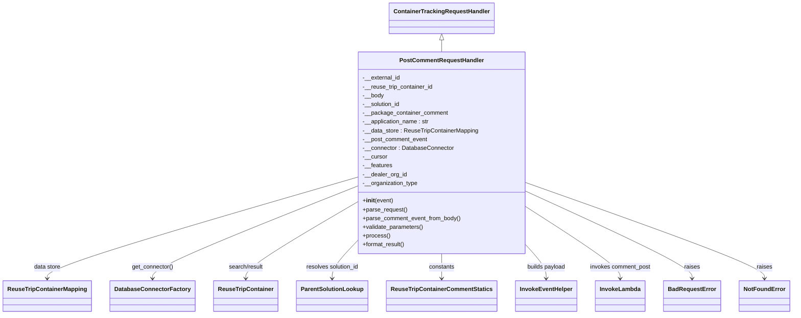

# Diagram: container_tracking_core/container_tracking_service/container_tracking_service/api/comments/handlers/post_comment.py

> Auto-generated by Obscura crawlers

## Mermaid

### SVG

<svg id="container" width="2082.984375" xmlns="http://www.w3.org/2000/svg" class="classDiagram" height="860" viewBox="0 0 2082.984375 860" role="graphics-document document" aria-roledescription="class"><g><defs><marker id="container_class-aggregationStart" class="marker aggregation class" refX="18" refY="7" markerWidth="190" markerHeight="240" orient="auto"><path d="M 18,7 L9,13 L1,7 L9,1 Z"></path></marker></defs><defs><marker id="container_class-aggregationEnd" class="marker aggregation class" refX="1" refY="7" markerWidth="20" markerHeight="28" orient="auto"><path d="M 18,7 L9,13 L1,7 L9,1 Z"></path></marker></defs><defs><marker id="container_class-extensionStart" class="marker extension class" refX="18" refY="7" markerWidth="190" markerHeight="240" orient="auto"><path d="M 1,7 L18,13 V 1 Z"></path></marker></defs><defs><marker id="container_class-extensionEnd" class="marker extension class" refX="1" refY="7" markerWidth="20" markerHeight="28" orient="auto"><path d="M 1,1 V 13 L18,7 Z"></path></marker></defs><defs><marker id="container_class-compositionStart" class="marker composition class" refX="18" refY="7" markerWidth="190" markerHeight="240" orient="auto"><path d="M 18,7 L9,13 L1,7 L9,1 Z"></path></marker></defs><defs><marker id="container_class-compositionEnd" class="marker composition class" refX="1" refY="7" markerWidth="20" markerHeight="28" orient="auto"><path d="M 18,7 L9,13 L1,7 L9,1 Z"></path></marker></defs><defs><marker id="container_class-dependencyStart" class="marker dependency class" refX="6" refY="7" markerWidth="190" markerHeight="240" orient="auto"><path d="M 5,7 L9,13 L1,7 L9,1 Z"></path></marker></defs><defs><marker id="container_class-dependencyEnd" class="marker dependency class" refX="13" refY="7" markerWidth="20" markerHeight="28" orient="auto"><path d="M 18,7 L9,13 L14,7 L9,1 Z"></path></marker></defs><defs><marker id="container_class-lollipopStart" class="marker lollipop class" refX="13" refY="7" markerWidth="190" markerHeight="240" orient="auto"><circle stroke="black" fill="transparent" cx="7" cy="7" r="6"></circle></marker></defs><defs><marker id="container_class-lollipopEnd" class="marker lollipop class" refX="1" refY="7" markerWidth="190" markerHeight="240" orient="auto"><circle stroke="black" fill="transparent" cx="7" cy="7" r="6"></circle></marker></defs><g class="root"><g class="clusters"></g><g class="edgePaths"><path d="M1158.461,109.25L1158.461,110.542C1158.461,111.833,1158.461,114.417,1158.461,119.875C1158.461,125.333,1158.461,133.667,1158.461,137.833L1158.461,142" id="id_ContainerTrackingRequestHandler_PostCommentRequestHandler_1" class="edge-thickness-normal edge-pattern-solid relation" style=";;;" data-edge="true" data-et="edge" data-id="id_ContainerTrackingRequestHandler_PostCommentRequestHandler_1" data-points="W3sieCI6MTE1OC40NjA5Mzc1LCJ5Ijo5Mn0seyJ4IjoxMTU4LjQ2MDkzNzUsInkiOjExN30seyJ4IjoxMTU4LjQ2MDkzNzUsInkiOjE0Mn1d" marker-start="url(#container_class-extensionStart)"></path><path d="M933.504,486.034L798.506,526.862C663.508,567.689,393.512,649.345,258.514,695.339C123.516,741.333,123.516,751.667,123.516,756.833L123.516,762" id="id_PostCommentRequestHandler_ReuseTripContainerMapping_2" class="edge-thickness-normal edge-pattern-solid relation" style=";;;" data-edge="true" data-et="edge" data-id="id_PostCommentRequestHandler_ReuseTripContainerMapping_2" data-points="W3sieCI6OTMzLjUwMzkwNjI1LCJ5Ijo0ODYuMDM0MDc4NjQyNDQwMzZ9LHsieCI6MTIzLjUxNTYyNSwieSI6NzMxfSx7IngiOjEyMy41MTU2MjUsInkiOjc2OH1d" marker-end="url(#container_class-dependencyEnd)"></path><path d="M933.504,510.739L844.456,547.449C755.409,584.159,577.314,657.58,488.266,699.457C399.219,741.333,399.219,751.667,399.219,756.833L399.219,762" id="id_PostCommentRequestHandler_DatabaseConnectorFactory_3" class="edge-thickness-normal edge-pattern-solid relation" style=";;;" data-edge="true" data-et="edge" data-id="id_PostCommentRequestHandler_DatabaseConnectorFactory_3" data-points="W3sieCI6OTMzLjUwMzkwNjI1LCJ5Ijo1MTAuNzM5MjQ5NjYzMDA2OX0seyJ4IjozOTkuMjE4NzUsInkiOjczMX0seyJ4IjozOTkuMjE4NzUsInkiOjc2OH1d" marker-end="url(#container_class-dependencyEnd)"></path><path d="M933.504,554.711L885.157,584.093C836.81,613.474,740.116,672.237,691.769,706.785C643.422,741.333,643.422,751.667,643.422,756.833L643.422,762" id="id_PostCommentRequestHandler_ReuseTripContainer_4" class="edge-thickness-normal edge-pattern-solid relation" style=";;;" data-edge="true" data-et="edge" data-id="id_PostCommentRequestHandler_ReuseTripContainer_4" data-points="W3sieCI6OTMzLjUwMzkwNjI1LCJ5Ijo1NTQuNzExMDg4MzU3OTgyNn0seyJ4Ijo2NDMuNDIxODc1LCJ5Ijo3MzF9LHsieCI6NjQzLjQyMTg3NSwieSI6NzY4fV0=" marker-end="url(#container_class-dependencyEnd)"></path><path d="M933.504,663.003L923.098,674.336C912.693,685.669,891.882,708.334,881.476,724.834C871.07,741.333,871.07,751.667,871.07,756.833L871.07,762" id="id_PostCommentRequestHandler_ParentSolutionLookup_5" class="edge-thickness-normal edge-pattern-solid relation" style=";;;" data-edge="true" data-et="edge" data-id="id_PostCommentRequestHandler_ParentSolutionLookup_5" data-points="W3sieCI6OTMzLjUwMzkwNjI1LCJ5Ijo2NjMuMDAyOTQ5NDkxNjU0NX0seyJ4Ijo4NzEuMDcwMzEyNSwieSI6NzMxfSx7IngiOjg3MS4wNzAzMTI1LCJ5Ijo3Njh9XQ==" marker-end="url(#container_class-dependencyEnd)"></path><path d="M1158.461,694L1158.461,700.167C1158.461,706.333,1158.461,718.667,1158.461,730C1158.461,741.333,1158.461,751.667,1158.461,756.833L1158.461,762" id="id_PostCommentRequestHandler_ReuseTripContainerCommentStatics_6" class="edge-thickness-normal edge-pattern-solid relation" style=";;;" data-edge="true" data-et="edge" data-id="id_PostCommentRequestHandler_ReuseTripContainerCommentStatics_6" data-points="W3sieCI6MTE1OC40NjA5Mzc1LCJ5Ijo2OTR9LHsieCI6MTE1OC40NjA5Mzc1LCJ5Ijo3MzF9LHsieCI6MTE1OC40NjA5Mzc1LCJ5Ijo3Njh9XQ==" marker-end="url(#container_class-dependencyEnd)"></path><path d="M1383.418,674.188L1391.732,683.656C1400.047,693.125,1416.676,712.063,1424.99,726.698C1433.305,741.333,1433.305,751.667,1433.305,756.833L1433.305,762" id="id_PostCommentRequestHandler_InvokeEventHelper_7" class="edge-thickness-normal edge-pattern-solid relation" style=";;;" data-edge="true" data-et="edge" data-id="id_PostCommentRequestHandler_InvokeEventHelper_7" data-points="W3sieCI6MTM4My40MTc5Njg3NSwieSI6Njc0LjE4NzU2Mzk1Njc5MzZ9LHsieCI6MTQzMy4zMDQ2ODc1LCJ5Ijo3MzF9LHsieCI6MTQzMy4zMDQ2ODc1LCJ5Ijo3Njh9XQ==" marker-end="url(#container_class-dependencyEnd)"></path><path d="M1383.418,567.362L1424.494,594.635C1465.57,621.908,1547.723,676.454,1588.799,708.894C1629.875,741.333,1629.875,751.667,1629.875,756.833L1629.875,762" id="id_PostCommentRequestHandler_InvokeLambda_8" class="edge-thickness-normal edge-pattern-solid relation" style=";;;" data-edge="true" data-et="edge" data-id="id_PostCommentRequestHandler_InvokeLambda_8" data-points="W3sieCI6MTM4My40MTc5Njg3NSwieSI6NTY3LjM2MjQzMTg0NTY3NzF9LHsieCI6MTYyOS44NzUsInkiOjczMX0seyJ4IjoxNjI5Ljg3NSwieSI6NzY4fV0=" marker-end="url(#container_class-dependencyEnd)"></path><path d="M1383.418,524.494L1456.122,558.912C1528.826,593.329,1674.233,662.165,1746.937,701.749C1819.641,741.333,1819.641,751.667,1819.641,756.833L1819.641,762" id="id_PostCommentRequestHandler_BadRequestError_9" class="edge-thickness-normal edge-pattern-solid relation" style=";;;" data-edge="true" data-et="edge" data-id="id_PostCommentRequestHandler_BadRequestError_9" data-points="W3sieCI6MTM4My40MTc5Njg3NSwieSI6NTI0LjQ5MzgyMDIzMTM1NzN9LHsieCI6MTgxOS42NDA2MjUsInkiOjczMX0seyJ4IjoxODE5LjY0MDYyNSwieSI6NzY4fV0=" marker-end="url(#container_class-dependencyEnd)"></path><path d="M1383.418,500.741L1487.757,539.117C1592.096,577.494,1800.775,654.247,1905.114,697.79C2009.453,741.333,2009.453,751.667,2009.453,756.833L2009.453,762" id="id_PostCommentRequestHandler_NotFoundError_10" class="edge-thickness-normal edge-pattern-solid relation" style=";;;" data-edge="true" data-et="edge" data-id="id_PostCommentRequestHandler_NotFoundError_10" data-points="W3sieCI6MTM4My40MTc5Njg3NSwieSI6NTAwLjc0MDUzNzI0MDUzNzI2fSx7IngiOjIwMDkuNDUzMTI1LCJ5Ijo3MzF9LHsieCI6MjAwOS40NTMxMjUsInkiOjc2OH1d" marker-end="url(#container_class-dependencyEnd)"></path></g><g class="edgeLabels"><g class="edgeLabel"><g class="label" data-id="id_ContainerTrackingRequestHandler_PostCommentRequestHandler_1" transform="translate(0, 0)"><foreignObject width="0" height="0">

</foreignObject></g></g><g class="edgeLabel" transform="translate(123.515625, 731)"><g class="label" data-id="id_PostCommentRequestHandler_ReuseTripContainerMapping_2" transform="translate(-36.828125, -12)"><foreignObject width="73.65625" height="24">

data store

</foreignObject></g></g><g class="edgeLabel" transform="translate(399.21875, 731)"><g class="label" data-id="id_PostCommentRequestHandler_DatabaseConnectorFactory_3" transform="translate(-56.890625, -12)"><foreignObject width="113.78125" height="24">

get_connector()

</foreignObject></g></g><g class="edgeLabel" transform="translate(643.421875, 731)"><g class="label" data-id="id_PostCommentRequestHandler_ReuseTripContainer_4" transform="translate(-48.484375, -12)"><foreignObject width="96.96875" height="24">

search/result

</foreignObject></g></g><g class="edgeLabel" transform="translate(871.0703125, 731)"><g class="label" data-id="id_PostCommentRequestHandler_ParentSolutionLookup_5" transform="translate(-73.1171875, -12)"><foreignObject width="146.234375" height="24">

resolves solution_id

</foreignObject></g></g><g class="edgeLabel" transform="translate(1158.4609375, 731)"><g class="label" data-id="id_PostCommentRequestHandler_ReuseTripContainerCommentStatics_6" transform="translate(-35.2578125, -12)"><foreignObject width="70.515625" height="24">

constants

</foreignObject></g></g><g class="edgeLabel" transform="translate(1433.3046875, 731)"><g class="label" data-id="id_PostCommentRequestHandler_InvokeEventHelper_7" transform="translate(-53.484375, -12)"><foreignObject width="106.96875" height="24">

builds payload

</foreignObject></g></g><g class="edgeLabel" transform="translate(1629.875, 731)"><g class="label" data-id="id_PostCommentRequestHandler_InvokeLambda_8" transform="translate(-83.8984375, -12)"><foreignObject width="167.796875" height="24">

invokes comment_post

</foreignObject></g></g><g class="edgeLabel" transform="translate(1819.640625, 731)"><g class="label" data-id="id_PostCommentRequestHandler_BadRequestError_9" transform="translate(-21.25, -12)"><foreignObject width="42.5" height="24">

raises

</foreignObject></g></g><g class="edgeLabel" transform="translate(2009.453125, 731)"><g class="label" data-id="id_PostCommentRequestHandler_NotFoundError_10" transform="translate(-21.25, -12)"><foreignObject width="42.5" height="24">

raises

</foreignObject></g></g></g><g class="nodes"><g class="node default" id="classId-ContainerTrackingRequestHandler-0" transform="translate(1158.4609375, 50)"><g class="basic label-container"><path d="M-137.5859375 -42 L137.5859375 -42 L137.5859375 42 L-137.5859375 42" stroke="none" stroke-width="0" fill="#ECECFF" style=""></path><path d="M-137.5859375 -42 C-49.33484927226806 -42, 38.91623895546388 -42, 137.5859375 -42 M-137.5859375 -42 C-35.710238166235925 -42, 66.16546116752815 -42, 137.5859375 -42 M137.5859375 -42 C137.5859375 -21.172978707956645, 137.5859375 -0.3459574159132899, 137.5859375 42 M137.5859375 -42 C137.5859375 -23.17824420148394, 137.5859375 -4.3564884029678765, 137.5859375 42 M137.5859375 42 C57.0136777233718 42, -23.5585820532564 42, -137.5859375 42 M137.5859375 42 C65.1588583405465 42, -7.268220818906997 42, -137.5859375 42 M-137.5859375 42 C-137.5859375 12.771554155444942, -137.5859375 -16.456891689110115, -137.5859375 -42 M-137.5859375 42 C-137.5859375 19.727831532877847, -137.5859375 -2.5443369342443063, -137.5859375 -42" stroke="#9370DB" stroke-width="1.3" fill="none" stroke-dasharray="0 0" style=""></path></g><g class="annotation-group text" transform="translate(0, -18)"></g><g class="label-group text" transform="translate(-125.5859375, -18)"><g class="label" style="font-weight: bolder" transform="translate(0,-12)"><foreignObject width="251.171875" height="24">

ContainerTrackingRequestHandler

</foreignObject></g></g><g class="members-group text" transform="translate(-125.5859375, 30)"></g><g class="methods-group text" transform="translate(-125.5859375, 60)"></g><g class="divider" style=""><path d="M-137.5859375 6 C-74.39113333142444 6, -11.196329162848869 6, 137.5859375 6 M-137.5859375 6 C-81.02496773688495 6, -24.463997973769906 6, 137.5859375 6" stroke="#9370DB" stroke-width="1.3" fill="none" stroke-dasharray="0 0" style=""></path></g><g class="divider" style=""><path d="M-137.5859375 24 C-57.91391475153202 24, 21.758107996935962 24, 137.5859375 24 M-137.5859375 24 C-53.940959706233784 24, 29.704018087532432 24, 137.5859375 24" stroke="#9370DB" stroke-width="1.3" fill="none" stroke-dasharray="0 0" style=""></path></g></g><g class="node default" id="classId-PostCommentRequestHandler-1" transform="translate(1158.4609375, 418)"><g class="basic label-container"><path d="M-224.95703125 -276 L224.95703125 -276 L224.95703125 276 L-224.95703125 276" stroke="none" stroke-width="0" fill="#ECECFF" style=""></path><path d="M-224.95703125 -276 C-104.30132867339842 -276, 16.354373903203168 -276, 224.95703125 -276 M-224.95703125 -276 C-96.41357223252905 -276, 32.1298867849419 -276, 224.95703125 -276 M224.95703125 -276 C224.95703125 -140.85787197391295, 224.95703125 -5.715743947825899, 224.95703125 276 M224.95703125 -276 C224.95703125 -142.62482318022063, 224.95703125 -9.249646360441261, 224.95703125 276 M224.95703125 276 C125.14064305200704 276, 25.32425485401407 276, -224.95703125 276 M224.95703125 276 C50.87092363345468 276, -123.21518398309064 276, -224.95703125 276 M-224.95703125 276 C-224.95703125 147.26865863215994, -224.95703125 18.53731726431988, -224.95703125 -276 M-224.95703125 276 C-224.95703125 146.75729409880122, -224.95703125 17.51458819760245, -224.95703125 -276" stroke="#9370DB" stroke-width="1.3" fill="none" stroke-dasharray="0 0" style=""></path></g><g class="annotation-group text" transform="translate(0, -252)"></g><g class="label-group text" transform="translate(-110.0078125, -252)"><g class="label" style="font-weight: bolder" transform="translate(0,-12)"><foreignObject width="220.015625" height="24">

PostCommentRequestHandler

</foreignObject></g></g><g class="members-group text" transform="translate(-212.95703125, -204)"><g class="label" style="" transform="translate(0,-12)"><foreignObject width="103.109375" height="24">

-__external_id

</foreignObject></g><g class="label" style="" transform="translate(0,12)"><foreignObject width="193.21875" height="24">

-__reuse_trip_container_id

</foreignObject></g><g class="label" style="" transform="translate(0,36)"><foreignObject width="57.9375" height="24">

-__body

</foreignObject></g><g class="label" style="" transform="translate(0,60)"><foreignObject width="103.875" height="24">

-__solution_id

</foreignObject></g><g class="label" style="" transform="translate(0,84)"><foreignObject width="232.203125" height="24">

-__package_container_comment

</foreignObject></g><g class="label" style="" transform="translate(0,108)"><foreignObject width="184.03125" height="24">

-__application_name : str

</foreignObject></g><g class="label" style="" transform="translate(0,132)"><foreignObject width="315.90625" height="24">

-__data_store : ReuseTripContainerMapping

</foreignObject></g><g class="label" style="" transform="translate(0,156)"><foreignObject width="178.0625" height="24">

-__post_comment_event

</foreignObject></g><g class="label" style="" transform="translate(0,180)"><foreignObject width="247.953125" height="24">

-__connector : DatabaseConnector

</foreignObject></g><g class="label" style="" transform="translate(0,204)"><foreignObject width="67.0625" height="24">

-__cursor

</foreignObject></g><g class="label" style="" transform="translate(0,228)"><foreignObject width="80.78125" height="24">

-__features

</foreignObject></g><g class="label" style="" transform="translate(0,252)"><foreignObject width="120.296875" height="24">

-__dealer_org_id

</foreignObject></g><g class="label" style="" transform="translate(0,276)"><foreignObject width="151.484375" height="24">

-__organization_type

</foreignObject></g></g><g class="methods-group text" transform="translate(-212.95703125, 132)"><g class="label" style="" transform="translate(0,-12)"><foreignObject width="83.140625" height="24">

+<strong>init</strong>(event)

</foreignObject></g><g class="label" style="" transform="translate(0,12)"><foreignObject width="121.796875" height="24">

+parse_request()

</foreignObject></g><g class="label" style="" transform="translate(0,36)"><foreignObject width="269.234375" height="24">

+parse_comment_event_from_body()

</foreignObject></g><g class="label" style="" transform="translate(0,60)"><foreignObject width="166.546875" height="24">

+validate_parameters()

</foreignObject></g><g class="label" style="" transform="translate(0,84)"><foreignObject width="73.734375" height="24">

+process()

</foreignObject></g><g class="label" style="" transform="translate(0,108)"><foreignObject width="117.015625" height="24">

+format_result()

</foreignObject></g></g><g class="divider" style=""><path d="M-224.95703125 -228 C-119.49605263316978 -228, -14.035074016339564 -228, 224.95703125 -228 M-224.95703125 -228 C-84.23802502878996 -228, 56.480981192420074 -228, 224.95703125 -228" stroke="#9370DB" stroke-width="1.3" fill="none" stroke-dasharray="0 0" style=""></path></g><g class="divider" style=""><path d="M-224.95703125 108 C-130.16680439644557 108, -35.37657754289114 108, 224.95703125 108 M-224.95703125 108 C-97.39098032776177 108, 30.175070594476466 108, 224.95703125 108" stroke="#9370DB" stroke-width="1.3" fill="none" stroke-dasharray="0 0" style=""></path></g></g><g class="node default" id="classId-ReuseTripContainerMapping-2" transform="translate(123.515625, 810)"><g class="basic label-container"><path d="M-115.515625 -42 L115.515625 -42 L115.515625 42 L-115.515625 42" stroke="none" stroke-width="0" fill="#ECECFF" style=""></path><path d="M-115.515625 -42 C-68.97800811971847 -42, -22.440391239436934 -42, 115.515625 -42 M-115.515625 -42 C-58.368944333676005 -42, -1.22226366735201 -42, 115.515625 -42 M115.515625 -42 C115.515625 -16.27933349294505, 115.515625 9.441333014109901, 115.515625 42 M115.515625 -42 C115.515625 -12.764494497782973, 115.515625 16.471011004434054, 115.515625 42 M115.515625 42 C66.54988128825661 42, 17.584137576513243 42, -115.515625 42 M115.515625 42 C40.38194251934155 42, -34.7517399613169 42, -115.515625 42 M-115.515625 42 C-115.515625 20.096443930197232, -115.515625 -1.807112139605536, -115.515625 -42 M-115.515625 42 C-115.515625 15.066390471786892, -115.515625 -11.867219056426215, -115.515625 -42" stroke="#9370DB" stroke-width="1.3" fill="none" stroke-dasharray="0 0" style=""></path></g><g class="annotation-group text" transform="translate(0, -18)"></g><g class="label-group text" transform="translate(-103.515625, -18)"><g class="label" style="font-weight: bolder" transform="translate(0,-12)"><foreignObject width="207.03125" height="24">

ReuseTripContainerMapping

</foreignObject></g></g><g class="members-group text" transform="translate(-103.515625, 30)"></g><g class="methods-group text" transform="translate(-103.515625, 60)"></g><g class="divider" style=""><path d="M-115.515625 6 C-66.30693654205669 6, -17.098248084113393 6, 115.515625 6 M-115.515625 6 C-51.09738692192727 6, 13.320851156145466 6, 115.515625 6" stroke="#9370DB" stroke-width="1.3" fill="none" stroke-dasharray="0 0" style=""></path></g><g class="divider" style=""><path d="M-115.515625 24 C-67.30012755877198 24, -19.084630117543966 24, 115.515625 24 M-115.515625 24 C-37.049772296211955 24, 41.41608040757609 24, 115.515625 24" stroke="#9370DB" stroke-width="1.3" fill="none" stroke-dasharray="0 0" style=""></path></g></g><g class="node default" id="classId-DatabaseConnectorFactory-3" transform="translate(399.21875, 810)"><g class="basic label-container"><path d="M-110.1875 -42 L110.1875 -42 L110.1875 42 L-110.1875 42" stroke="none" stroke-width="0" fill="#ECECFF" style=""></path><path d="M-110.1875 -42 C-60.80744680049084 -42, -11.427393600981674 -42, 110.1875 -42 M-110.1875 -42 C-40.55526956729588 -42, 29.07696086540824 -42, 110.1875 -42 M110.1875 -42 C110.1875 -10.843622750524347, 110.1875 20.312754498951307, 110.1875 42 M110.1875 -42 C110.1875 -10.270830980150592, 110.1875 21.458338039698816, 110.1875 42 M110.1875 42 C26.133452528812498 42, -57.920594942375004 42, -110.1875 42 M110.1875 42 C27.866328484951268 42, -54.454843030097464 42, -110.1875 42 M-110.1875 42 C-110.1875 22.1033904180892, -110.1875 2.206780836178403, -110.1875 -42 M-110.1875 42 C-110.1875 12.129800328262235, -110.1875 -17.74039934347553, -110.1875 -42" stroke="#9370DB" stroke-width="1.3" fill="none" stroke-dasharray="0 0" style=""></path></g><g class="annotation-group text" transform="translate(0, -18)"></g><g class="label-group text" transform="translate(-98.1875, -18)"><g class="label" style="font-weight: bolder" transform="translate(0,-12)"><foreignObject width="196.375" height="24">

DatabaseConnectorFactory

</foreignObject></g></g><g class="members-group text" transform="translate(-98.1875, 30)"></g><g class="methods-group text" transform="translate(-98.1875, 60)"></g><g class="divider" style=""><path d="M-110.1875 6 C-34.82250280191646 6, 40.542494396167086 6, 110.1875 6 M-110.1875 6 C-54.114772926802594 6, 1.9579541463948118 6, 110.1875 6" stroke="#9370DB" stroke-width="1.3" fill="none" stroke-dasharray="0 0" style=""></path></g><g class="divider" style=""><path d="M-110.1875 24 C-58.13559407426028 24, -6.083688148520565 24, 110.1875 24 M-110.1875 24 C-43.46761441338708 24, 23.252271173225836 24, 110.1875 24" stroke="#9370DB" stroke-width="1.3" fill="none" stroke-dasharray="0 0" style=""></path></g></g><g class="node default" id="classId-ReuseTripContainer-4" transform="translate(643.421875, 810)"><g class="basic label-container"><path d="M-84.015625 -42 L84.015625 -42 L84.015625 42 L-84.015625 42" stroke="none" stroke-width="0" fill="#ECECFF" style=""></path><path d="M-84.015625 -42 C-48.45942001481503 -42, -12.903215029630061 -42, 84.015625 -42 M-84.015625 -42 C-39.71354888711003 -42, 4.588527225779941 -42, 84.015625 -42 M84.015625 -42 C84.015625 -23.330716199981715, 84.015625 -4.661432399963431, 84.015625 42 M84.015625 -42 C84.015625 -14.416908644707831, 84.015625 13.166182710584337, 84.015625 42 M84.015625 42 C29.740390298744977 42, -24.534844402510046 42, -84.015625 42 M84.015625 42 C31.84032572061261 42, -20.334973558774777 42, -84.015625 42 M-84.015625 42 C-84.015625 18.182404787693827, -84.015625 -5.635190424612347, -84.015625 -42 M-84.015625 42 C-84.015625 9.146997302317502, -84.015625 -23.706005395364997, -84.015625 -42" stroke="#9370DB" stroke-width="1.3" fill="none" stroke-dasharray="0 0" style=""></path></g><g class="annotation-group text" transform="translate(0, -18)"></g><g class="label-group text" transform="translate(-72.015625, -18)"><g class="label" style="font-weight: bolder" transform="translate(0,-12)"><foreignObject width="144.03125" height="24">

ReuseTripContainer

</foreignObject></g></g><g class="members-group text" transform="translate(-72.015625, 30)"></g><g class="methods-group text" transform="translate(-72.015625, 60)"></g><g class="divider" style=""><path d="M-84.015625 6 C-43.533694221701 6, -3.0517634434019953 6, 84.015625 6 M-84.015625 6 C-18.47941455438071 6, 47.05679589123858 6, 84.015625 6" stroke="#9370DB" stroke-width="1.3" fill="none" stroke-dasharray="0 0" style=""></path></g><g class="divider" style=""><path d="M-84.015625 24 C-20.400593088072256 24, 43.21443882385549 24, 84.015625 24 M-84.015625 24 C-20.84375267196348 24, 42.32811965607304 24, 84.015625 24" stroke="#9370DB" stroke-width="1.3" fill="none" stroke-dasharray="0 0" style=""></path></g></g><g class="node default" id="classId-ParentSolutionLookup-5" transform="translate(871.0703125, 810)"><g class="basic label-container"><path d="M-93.6328125 -42 L93.6328125 -42 L93.6328125 42 L-93.6328125 42" stroke="none" stroke-width="0" fill="#ECECFF" style=""></path><path d="M-93.6328125 -42 C-40.888389206517154 -42, 11.856034086965693 -42, 93.6328125 -42 M-93.6328125 -42 C-54.917426799700166 -42, -16.202041099400333 -42, 93.6328125 -42 M93.6328125 -42 C93.6328125 -11.332605914579368, 93.6328125 19.334788170841264, 93.6328125 42 M93.6328125 -42 C93.6328125 -18.70744852953245, 93.6328125 4.585102940935101, 93.6328125 42 M93.6328125 42 C19.19284064670296 42, -55.24713120659408 42, -93.6328125 42 M93.6328125 42 C46.55419762245432 42, -0.5244172550913646 42, -93.6328125 42 M-93.6328125 42 C-93.6328125 22.046900422595037, -93.6328125 2.0938008451900743, -93.6328125 -42 M-93.6328125 42 C-93.6328125 23.511744537612472, -93.6328125 5.023489075224944, -93.6328125 -42" stroke="#9370DB" stroke-width="1.3" fill="none" stroke-dasharray="0 0" style=""></path></g><g class="annotation-group text" transform="translate(0, -18)"></g><g class="label-group text" transform="translate(-81.6328125, -18)"><g class="label" style="font-weight: bolder" transform="translate(0,-12)"><foreignObject width="163.265625" height="24">

ParentSolutionLookup

</foreignObject></g></g><g class="members-group text" transform="translate(-81.6328125, 30)"></g><g class="methods-group text" transform="translate(-81.6328125, 60)"></g><g class="divider" style=""><path d="M-93.6328125 6 C-28.31585801984407 6, 37.00109646031186 6, 93.6328125 6 M-93.6328125 6 C-31.000076297273267 6, 31.632659905453465 6, 93.6328125 6" stroke="#9370DB" stroke-width="1.3" fill="none" stroke-dasharray="0 0" style=""></path></g><g class="divider" style=""><path d="M-93.6328125 24 C-48.77612378552225 24, -3.9194350710445036 24, 93.6328125 24 M-93.6328125 24 C-35.72105801121476 24, 22.190696477570484 24, 93.6328125 24" stroke="#9370DB" stroke-width="1.3" fill="none" stroke-dasharray="0 0" style=""></path></g></g><g class="node default" id="classId-InvokeLambda-6" transform="translate(1629.875, 810)"><g class="basic label-container"><path d="M-65.484375 -42 L65.484375 -42 L65.484375 42 L-65.484375 42" stroke="none" stroke-width="0" fill="#ECECFF" style=""></path><path d="M-65.484375 -42 C-38.898510181261614 -42, -12.312645362523234 -42, 65.484375 -42 M-65.484375 -42 C-22.406695478692434 -42, 20.67098404261513 -42, 65.484375 -42 M65.484375 -42 C65.484375 -12.209479274981074, 65.484375 17.58104145003785, 65.484375 42 M65.484375 -42 C65.484375 -22.077252741454597, 65.484375 -2.154505482909194, 65.484375 42 M65.484375 42 C20.85917577855775 42, -23.766023442884503 42, -65.484375 42 M65.484375 42 C29.455351801717043 42, -6.5736713965659135 42, -65.484375 42 M-65.484375 42 C-65.484375 19.90138311668267, -65.484375 -2.1972337666346604, -65.484375 -42 M-65.484375 42 C-65.484375 14.521821912979306, -65.484375 -12.956356174041389, -65.484375 -42" stroke="#9370DB" stroke-width="1.3" fill="none" stroke-dasharray="0 0" style=""></path></g><g class="annotation-group text" transform="translate(0, -18)"></g><g class="label-group text" transform="translate(-53.484375, -18)"><g class="label" style="font-weight: bolder" transform="translate(0,-12)"><foreignObject width="106.96875" height="24">

InvokeLambda

</foreignObject></g></g><g class="members-group text" transform="translate(-53.484375, 30)"></g><g class="methods-group text" transform="translate(-53.484375, 60)"></g><g class="divider" style=""><path d="M-65.484375 6 C-37.37062309883234 6, -9.256871197664687 6, 65.484375 6 M-65.484375 6 C-32.03244901526388 6, 1.4194769694722424 6, 65.484375 6" stroke="#9370DB" stroke-width="1.3" fill="none" stroke-dasharray="0 0" style=""></path></g><g class="divider" style=""><path d="M-65.484375 24 C-23.132563436156744 24, 19.219248127686512 24, 65.484375 24 M-65.484375 24 C-28.490003655108723 24, 8.504367689782555 24, 65.484375 24" stroke="#9370DB" stroke-width="1.3" fill="none" stroke-dasharray="0 0" style=""></path></g></g><g class="node default" id="classId-InvokeEventHelper-7" transform="translate(1433.3046875, 810)"><g class="basic label-container"><path d="M-81.0859375 -42 L81.0859375 -42 L81.0859375 42 L-81.0859375 42" stroke="none" stroke-width="0" fill="#ECECFF" style=""></path><path d="M-81.0859375 -42 C-18.31105026127625 -42, 44.4638369774475 -42, 81.0859375 -42 M-81.0859375 -42 C-32.663453245497415 -42, 15.75903100900517 -42, 81.0859375 -42 M81.0859375 -42 C81.0859375 -21.398092944365207, 81.0859375 -0.7961858887304132, 81.0859375 42 M81.0859375 -42 C81.0859375 -14.26561498469335, 81.0859375 13.4687700306133, 81.0859375 42 M81.0859375 42 C28.069030605998314 42, -24.94787628800337 42, -81.0859375 42 M81.0859375 42 C40.31310575935679 42, -0.45972598128642517 42, -81.0859375 42 M-81.0859375 42 C-81.0859375 24.941929914979685, -81.0859375 7.88385982995937, -81.0859375 -42 M-81.0859375 42 C-81.0859375 17.533456071173944, -81.0859375 -6.9330878576521116, -81.0859375 -42" stroke="#9370DB" stroke-width="1.3" fill="none" stroke-dasharray="0 0" style=""></path></g><g class="annotation-group text" transform="translate(0, -18)"></g><g class="label-group text" transform="translate(-69.0859375, -18)"><g class="label" style="font-weight: bolder" transform="translate(0,-12)"><foreignObject width="138.171875" height="24">

InvokeEventHelper

</foreignObject></g></g><g class="members-group text" transform="translate(-69.0859375, 30)"></g><g class="methods-group text" transform="translate(-69.0859375, 60)"></g><g class="divider" style=""><path d="M-81.0859375 6 C-19.141348162870663 6, 42.80324117425867 6, 81.0859375 6 M-81.0859375 6 C-29.116462968606996 6, 22.85301156278601 6, 81.0859375 6" stroke="#9370DB" stroke-width="1.3" fill="none" stroke-dasharray="0 0" style=""></path></g><g class="divider" style=""><path d="M-81.0859375 24 C-48.40862788461695 24, -15.731318269233896 24, 81.0859375 24 M-81.0859375 24 C-19.262117567209188 24, 42.561702365581624 24, 81.0859375 24" stroke="#9370DB" stroke-width="1.3" fill="none" stroke-dasharray="0 0" style=""></path></g></g><g class="node default" id="classId-ReuseTripContainerCommentStatics-8" transform="translate(1158.4609375, 810)"><g class="basic label-container"><path d="M-143.7578125 -42 L143.7578125 -42 L143.7578125 42 L-143.7578125 42" stroke="none" stroke-width="0" fill="#ECECFF" style=""></path><path d="M-143.7578125 -42 C-48.30498732110841 -42, 47.14783785778317 -42, 143.7578125 -42 M-143.7578125 -42 C-45.186155595444504 -42, 53.38550130911099 -42, 143.7578125 -42 M143.7578125 -42 C143.7578125 -21.847768037088585, 143.7578125 -1.69553607417717, 143.7578125 42 M143.7578125 -42 C143.7578125 -20.399579059847575, 143.7578125 1.20084188030485, 143.7578125 42 M143.7578125 42 C57.15166276931754 42, -29.45448696136492 42, -143.7578125 42 M143.7578125 42 C74.28211146917562 42, 4.806410438351236 42, -143.7578125 42 M-143.7578125 42 C-143.7578125 20.79418855135533, -143.7578125 -0.411622897289341, -143.7578125 -42 M-143.7578125 42 C-143.7578125 17.1223476183454, -143.7578125 -7.755304763309198, -143.7578125 -42" stroke="#9370DB" stroke-width="1.3" fill="none" stroke-dasharray="0 0" style=""></path></g><g class="annotation-group text" transform="translate(0, -18)"></g><g class="label-group text" transform="translate(-131.7578125, -18)"><g class="label" style="font-weight: bolder" transform="translate(0,-12)"><foreignObject width="263.515625" height="24">

ReuseTripContainerCommentStatics

</foreignObject></g></g><g class="members-group text" transform="translate(-131.7578125, 30)"></g><g class="methods-group text" transform="translate(-131.7578125, 60)"></g><g class="divider" style=""><path d="M-143.7578125 6 C-60.60212925417943 6, 22.553553991641138 6, 143.7578125 6 M-143.7578125 6 C-40.491486210025556 6, 62.77484007994889 6, 143.7578125 6" stroke="#9370DB" stroke-width="1.3" fill="none" stroke-dasharray="0 0" style=""></path></g><g class="divider" style=""><path d="M-143.7578125 24 C-65.31793000542675 24, 13.121952489146508 24, 143.7578125 24 M-143.7578125 24 C-31.44362955279375 24, 80.8705533944125 24, 143.7578125 24" stroke="#9370DB" stroke-width="1.3" fill="none" stroke-dasharray="0 0" style=""></path></g></g><g class="node default" id="classId-BadRequestError-9" transform="translate(1819.640625, 810)"><g class="basic label-container"><path d="M-74.28125 -42 L74.28125 -42 L74.28125 42 L-74.28125 42" stroke="none" stroke-width="0" fill="#ECECFF" style=""></path><path d="M-74.28125 -42 C-38.899506141606196 -42, -3.5177622832123916 -42, 74.28125 -42 M-74.28125 -42 C-31.142288783190246 -42, 11.996672433619509 -42, 74.28125 -42 M74.28125 -42 C74.28125 -8.592275740417186, 74.28125 24.815448519165628, 74.28125 42 M74.28125 -42 C74.28125 -22.07986249109117, 74.28125 -2.1597249821823397, 74.28125 42 M74.28125 42 C43.664927910441676 42, 13.048605820883353 42, -74.28125 42 M74.28125 42 C19.576988405753106 42, -35.12727318849379 42, -74.28125 42 M-74.28125 42 C-74.28125 18.867736809763194, -74.28125 -4.264526380473612, -74.28125 -42 M-74.28125 42 C-74.28125 22.65328201092163, -74.28125 3.3065640218432577, -74.28125 -42" stroke="#9370DB" stroke-width="1.3" fill="none" stroke-dasharray="0 0" style=""></path></g><g class="annotation-group text" transform="translate(0, -18)"></g><g class="label-group text" transform="translate(-62.28125, -18)"><g class="label" style="font-weight: bolder" transform="translate(0,-12)"><foreignObject width="124.5625" height="24">

BadRequestError

</foreignObject></g></g><g class="members-group text" transform="translate(-62.28125, 30)"></g><g class="methods-group text" transform="translate(-62.28125, 60)"></g><g class="divider" style=""><path d="M-74.28125 6 C-20.581343673801115 6, 33.11856265239777 6, 74.28125 6 M-74.28125 6 C-35.39119706756303 6, 3.4988558648739456 6, 74.28125 6" stroke="#9370DB" stroke-width="1.3" fill="none" stroke-dasharray="0 0" style=""></path></g><g class="divider" style=""><path d="M-74.28125 24 C-30.417494396319924 24, 13.446261207360152 24, 74.28125 24 M-74.28125 24 C-15.054684151447248 24, 44.171881697105505 24, 74.28125 24" stroke="#9370DB" stroke-width="1.3" fill="none" stroke-dasharray="0 0" style=""></path></g></g><g class="node default" id="classId-NotFoundError-10" transform="translate(2009.453125, 810)"><g class="basic label-container"><path d="M-65.53125 -42 L65.53125 -42 L65.53125 42 L-65.53125 42" stroke="none" stroke-width="0" fill="#ECECFF" style=""></path><path d="M-65.53125 -42 C-19.76434137687145 -42, 26.0025672462571 -42, 65.53125 -42 M-65.53125 -42 C-13.227340397292522 -42, 39.076569205414955 -42, 65.53125 -42 M65.53125 -42 C65.53125 -23.255968499418202, 65.53125 -4.511936998836404, 65.53125 42 M65.53125 -42 C65.53125 -15.872186818876195, 65.53125 10.255626362247611, 65.53125 42 M65.53125 42 C33.3638732201599 42, 1.1964964403198053 42, -65.53125 42 M65.53125 42 C13.450150222029677 42, -38.630949555940646 42, -65.53125 42 M-65.53125 42 C-65.53125 12.39223334803015, -65.53125 -17.2155333039397, -65.53125 -42 M-65.53125 42 C-65.53125 21.984558572436306, -65.53125 1.9691171448726124, -65.53125 -42" stroke="#9370DB" stroke-width="1.3" fill="none" stroke-dasharray="0 0" style=""></path></g><g class="annotation-group text" transform="translate(0, -18)"></g><g class="label-group text" transform="translate(-53.53125, -18)"><g class="label" style="font-weight: bolder" transform="translate(0,-12)"><foreignObject width="107.0625" height="24">

NotFoundError

</foreignObject></g></g><g class="members-group text" transform="translate(-53.53125, 30)"></g><g class="methods-group text" transform="translate(-53.53125, 60)"></g><g class="divider" style=""><path d="M-65.53125 6 C-13.998883759337254 6, 37.53348248132549 6, 65.53125 6 M-65.53125 6 C-16.126816766287362 6, 33.277616467425275 6, 65.53125 6" stroke="#9370DB" stroke-width="1.3" fill="none" stroke-dasharray="0 0" style=""></path></g><g class="divider" style=""><path d="M-65.53125 24 C-26.435200728096135 24, 12.660848543807731 24, 65.53125 24 M-65.53125 24 C-27.198522129592696 24, 11.134205740814608 24, 65.53125 24" stroke="#9370DB" stroke-width="1.3" fill="none" stroke-dasharray="0 0" style=""></path></g></g></g></g></g></svg>
