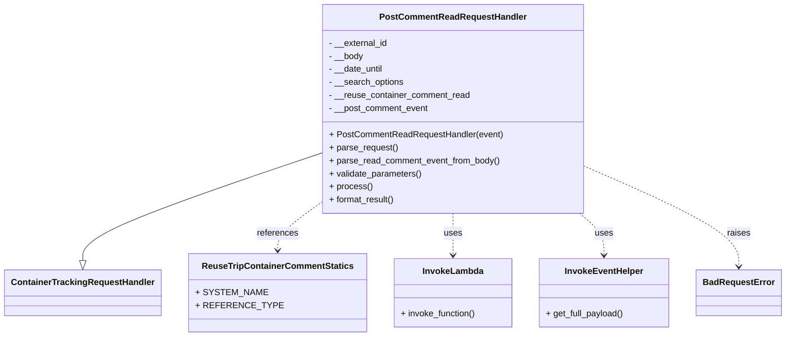
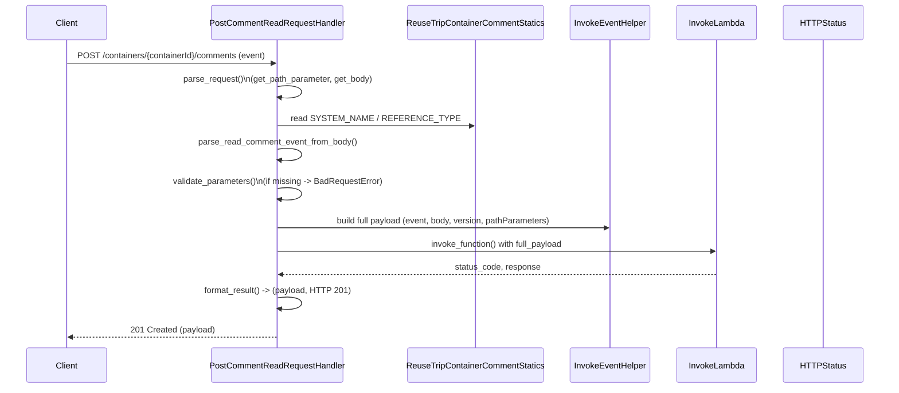

# Diagram: container_tracking_core/container_tracking_service/container_tracking_service/api/comments/handlers/post_comment_read.py


> Auto-generated by Obscura crawlers

## Diagram 1



### SVG

<svg id="container" width="1384.046875" xmlns="http://www.w3.org/2000/svg" class="classDiagram" height="618" viewBox="0 0 1384.046875 618" role="graphics-document document" aria-roledescription="class"><style>#container{font-family:"trebuchet ms",verdana,arial,sans-serif;font-size:16px;fill:#333;}@keyframes edge-animation-frame{from{stroke-dashoffset:0;}}@keyframes dash{to{stroke-dashoffset:0;}}#container .edge-animation-slow{stroke-dasharray:9,5!important;stroke-dashoffset:900;animation:dash 50s linear infinite;stroke-linecap:round;}#container .edge-animation-fast{stroke-dasharray:9,5!important;stroke-dashoffset:900;animation:dash 20s linear infinite;stroke-linecap:round;}#container .error-icon{fill:#552222;}#container .error-text{fill:#552222;stroke:#552222;}#container .edge-thickness-normal{stroke-width:1px;}#container .edge-thickness-thick{stroke-width:3.5px;}#container .edge-pattern-solid{stroke-dasharray:0;}#container .edge-thickness-invisible{stroke-width:0;fill:none;}#container .edge-pattern-dashed{stroke-dasharray:3;}#container .edge-pattern-dotted{stroke-dasharray:2;}#container .marker{fill:#333333;stroke:#333333;}#container .marker.cross{stroke:#333333;}#container svg{font-family:"trebuchet ms",verdana,arial,sans-serif;font-size:16px;}#container p{margin:0;}#container g.classGroup text{fill:#9370DB;stroke:none;font-family:"trebuchet ms",verdana,arial,sans-serif;font-size:10px;}#container g.classGroup text .title{font-weight:bolder;}#container .nodeLabel,#container .edgeLabel{color:#131300;}#container .edgeLabel .label rect{fill:#ECECFF;}#container .label text{fill:#131300;}#container .labelBkg{background:#ECECFF;}#container .edgeLabel .label span{background:#ECECFF;}#container .classTitle{font-weight:bolder;}#container .node rect,#container .node circle,#container .node ellipse,#container .node polygon,#container .node path{fill:#ECECFF;stroke:#9370DB;stroke-width:1px;}#container .divider{stroke:#9370DB;stroke-width:1;}#container g.clickable{cursor:pointer;}#container g.classGroup rect{fill:#ECECFF;stroke:#9370DB;}#container g.classGroup line{stroke:#9370DB;stroke-width:1;}#container .classLabel .box{stroke:none;stroke-width:0;fill:#ECECFF;opacity:0.5;}#container .classLabel .label{fill:#9370DB;font-size:10px;}#container .relation{stroke:#333333;stroke-width:1;fill:none;}#container .dashed-line{stroke-dasharray:3;}#container .dotted-line{stroke-dasharray:1 2;}#container #compositionStart,#container .composition{fill:#333333!important;stroke:#333333!important;stroke-width:1;}#container #compositionEnd,#container .composition{fill:#333333!important;stroke:#333333!important;stroke-width:1;}#container #dependencyStart,#container .dependency{fill:#333333!important;stroke:#333333!important;stroke-width:1;}#container #dependencyStart,#container .dependency{fill:#333333!important;stroke:#333333!important;stroke-width:1;}#container #extensionStart,#container .extension{fill:transparent!important;stroke:#333333!important;stroke-width:1;}#container #extensionEnd,#container .extension{fill:transparent!important;stroke:#333333!important;stroke-width:1;}#container #aggregationStart,#container .aggregation{fill:transparent!important;stroke:#333333!important;stroke-width:1;}#container #aggregationEnd,#container .aggregation{fill:transparent!important;stroke:#333333!important;stroke-width:1;}#container #lollipopStart,#container .lollipop{fill:#ECECFF!important;stroke:#333333!important;stroke-width:1;}#container #lollipopEnd,#container .lollipop{fill:#ECECFF!important;stroke:#333333!important;stroke-width:1;}#container .edgeTerminals{font-size:11px;line-height:initial;}#container .classTitleText{text-anchor:middle;font-size:18px;fill:#333;}#container .label-icon{display:inline-block;height:1em;overflow:visible;vertical-align:-0.125em;}#container .node .label-icon path{fill:currentColor;stroke:revert;stroke-width:revert;}#container :root{--mermaid-font-family:"trebuchet ms",verdana,arial,sans-serif;}</style><g><defs><marker id="container_class-aggregationStart" class="marker aggregation class" refX="18" refY="7" markerWidth="190" markerHeight="240" orient="auto"><path d="M 18,7 L9,13 L1,7 L9,1 Z"></path></marker></defs><defs><marker id="container_class-aggregationEnd" class="marker aggregation class" refX="1" refY="7" markerWidth="20" markerHeight="28" orient="auto"><path d="M 18,7 L9,13 L1,7 L9,1 Z"></path></marker></defs><defs><marker id="container_class-extensionStart" class="marker extension class" refX="18" refY="7" markerWidth="190" markerHeight="240" orient="auto"><path d="M 1,7 L18,13 V 1 Z"></path></marker></defs><defs><marker id="container_class-extensionEnd" class="marker extension class" refX="1" refY="7" markerWidth="20" markerHeight="28" orient="auto"><path d="M 1,1 V 13 L18,7 Z"></path></marker></defs><defs><marker id="container_class-compositionStart" class="marker composition class" refX="18" refY="7" markerWidth="190" markerHeight="240" orient="auto"><path d="M 18,7 L9,13 L1,7 L9,1 Z"></path></marker></defs><defs><marker id="container_class-compositionEnd" class="marker composition class" refX="1" refY="7" markerWidth="20" markerHeight="28" orient="auto"><path d="M 18,7 L9,13 L1,7 L9,1 Z"></path></marker></defs><defs><marker id="container_class-dependencyStart" class="marker dependency class" refX="6" refY="7" markerWidth="190" markerHeight="240" orient="auto"><path d="M 5,7 L9,13 L1,7 L9,1 Z"></path></marker></defs><defs><marker id="container_class-dependencyEnd" class="marker dependency class" refX="13" refY="7" markerWidth="20" markerHeight="28" orient="auto"><path d="M 18,7 L9,13 L14,7 L9,1 Z"></path></marker></defs><defs><marker id="container_class-lollipopStart" class="marker lollipop class" refX="13" refY="7" markerWidth="190" markerHeight="240" orient="auto"><circle stroke="black" fill="transparent" cx="7" cy="7" r="6"></circle></marker></defs><defs><marker id="container_class-lollipopEnd" class="marker lollipop class" refX="1" refY="7" markerWidth="190" markerHeight="240" orient="auto"><circle stroke="black" fill="transparent" cx="7" cy="7" r="6"></circle></marker></defs><g class="root"><g class="clusters"></g><g class="edgePaths"><path d="M548.406,284.292L481.27,308.41C414.133,332.528,279.859,380.764,212.723,413.174C145.586,445.583,145.586,462.167,145.586,470.458L145.586,478.75" id="id_PostCommentReadRequestHandler_ContainerTrackingRequestHandler_1" class="edge-thickness-normal edge-pattern-solid relation" style=";;;" data-edge="true" data-et="edge" data-id="id_PostCommentReadRequestHandler_ContainerTrackingRequestHandler_1" data-points="W3sieCI6NTQ4LjQwNjI1LCJ5IjoyODQuMjkxNzU4MDczNDExMzZ9LHsieCI6MTQ1LjU4NTkzNzUsInkiOjQyOX0seyJ4IjoxNDUuNTg1OTM3NSwieSI6NDk2fV0=" marker-end="url(#container_class-extensionEnd)"></path><path d="M548.406,376.764L536.85,385.47C525.293,394.176,502.18,411.588,490.623,425.461C479.066,439.333,479.066,449.667,479.066,454.833L479.066,460" id="id_PostCommentReadRequestHandler_ReuseTripContainerCommentStatics_2" class="edge-thickness-normal edge-pattern-dashed relation" style=";;;" data-edge="true" data-et="edge" data-id="id_PostCommentReadRequestHandler_ReuseTripContainerCommentStatics_2" data-points="W3sieCI6NTQ4LjQwNjI1LCJ5IjozNzYuNzYzNjY5NTQwODU3Nn0seyJ4Ijo0NzkuMDY2NDA2MjUsInkiOjQyOX0seyJ4Ijo0NzkuMDY2NDA2MjUsInkiOjQ2Nn1d" marker-end="url(#container_class-dependencyEnd)"></path><path d="M783.047,392L783.047,398.167C783.047,404.333,783.047,416.667,783.047,429.5C783.047,442.333,783.047,455.667,783.047,462.333L783.047,469" id="id_PostCommentReadRequestHandler_InvokeLambda_3" class="edge-thickness-normal edge-pattern-dashed relation" style=";;;" data-edge="true" data-et="edge" data-id="id_PostCommentReadRequestHandler_InvokeLambda_3" data-points="W3sieCI6NzgzLjA0Njg3NSwieSI6MzkyfSx7IngiOjc4My4wNDY4NzUsInkiOjQyOX0seyJ4Ijo3ODMuMDQ2ODc1LCJ5Ijo0NzV9XQ==" marker-end="url(#container_class-dependencyEnd)"></path><path d="M1014.672,392L1022.112,398.167C1029.551,404.333,1044.43,416.667,1051.869,429.5C1059.309,442.333,1059.309,455.667,1059.309,462.333L1059.309,469" id="id_PostCommentReadRequestHandler_InvokeEventHelper_4" class="edge-thickness-normal edge-pattern-dashed relation" style=";;;" data-edge="true" data-et="edge" data-id="id_PostCommentReadRequestHandler_InvokeEventHelper_4" data-points="W3sieCI6MTAxNC42NzI0MjA4NTE1Mjg0LCJ5IjozOTJ9LHsieCI6MTA1OS4zMDg1OTM3NSwieSI6NDI5fSx7IngiOjEwNTkuMzA4NTkzNzUsInkiOjQ3NX1d" marker-end="url(#container_class-dependencyEnd)"></path><path d="M1017.688,303.587L1065.034,324.489C1112.38,345.392,1207.073,387.196,1254.419,418.265C1301.766,449.333,1301.766,469.667,1301.766,479.833L1301.766,490" id="id_PostCommentReadRequestHandler_BadRequestError_5" class="edge-thickness-normal edge-pattern-dashed relation" style=";;;" data-edge="true" data-et="edge" data-id="id_PostCommentReadRequestHandler_BadRequestError_5" data-points="W3sieCI6MTAxNy42ODc1LCJ5IjozMDMuNTg3MzU0NjU5OTE5MjR9LHsieCI6MTMwMS43NjU2MjUsInkiOjQyOX0seyJ4IjoxMzAxLjc2NTYyNSwieSI6NDk2fV0=" marker-end="url(#container_class-dependencyEnd)"></path></g><g class="edgeLabels"><g class="edgeLabel"><g class="label" data-id="id_PostCommentReadRequestHandler_ContainerTrackingRequestHandler_1" transform="translate(0, 0)"><foreignObject width="0" height="0"><div xmlns="http://www.w3.org/1999/xhtml" class="labelBkg" style="display: table-cell; white-space: nowrap; line-height: 1.5; max-width: 200px; text-align: center;"><span class="edgeLabel"></span></div></foreignObject></g></g><g class="edgeLabel" transform="translate(479.06640625, 429)"><g class="label" data-id="id_PostCommentReadRequestHandler_ReuseTripContainerCommentStatics_2" transform="translate(-37.828125, -12)"><foreignObject width="75.65625" height="24"><div xmlns="http://www.w3.org/1999/xhtml" class="labelBkg" style="display: table-cell; white-space: nowrap; line-height: 1.5; max-width: 200px; text-align: center;"><span class="edgeLabel"><p>references</p></span></div></foreignObject></g></g><g class="edgeLabel" transform="translate(783.046875, 429)"><g class="label" data-id="id_PostCommentReadRequestHandler_InvokeLambda_3" transform="translate(-16.4921875, -12)"><foreignObject width="32.984375" height="24"><div xmlns="http://www.w3.org/1999/xhtml" class="labelBkg" style="display: table-cell; white-space: nowrap; line-height: 1.5; max-width: 200px; text-align: center;"><span class="edgeLabel"><p>uses</p></span></div></foreignObject></g></g><g class="edgeLabel" transform="translate(1059.30859375, 429)"><g class="label" data-id="id_PostCommentReadRequestHandler_InvokeEventHelper_4" transform="translate(-16.4921875, -12)"><foreignObject width="32.984375" height="24"><div xmlns="http://www.w3.org/1999/xhtml" class="labelBkg" style="display: table-cell; white-space: nowrap; line-height: 1.5; max-width: 200px; text-align: center;"><span class="edgeLabel"><p>uses</p></span></div></foreignObject></g></g><g class="edgeLabel" transform="translate(1301.765625, 429)"><g class="label" data-id="id_PostCommentReadRequestHandler_BadRequestError_5" transform="translate(-21.25, -12)"><foreignObject width="42.5" height="24"><div xmlns="http://www.w3.org/1999/xhtml" class="labelBkg" style="display: table-cell; white-space: nowrap; line-height: 1.5; max-width: 200px; text-align: center;"><span class="edgeLabel"><p>raises</p></span></div></foreignObject></g></g></g><g class="nodes"><g class="node default" id="classId-PostCommentReadRequestHandler-0" transform="translate(783.046875, 200)"><g class="basic label-container"><path d="M-234.640625 -192 L234.640625 -192 L234.640625 192 L-234.640625 192" stroke="none" stroke-width="0" fill="#ECECFF" style=""></path><path d="M-234.640625 -192 C-81.2909057768502 -192, 72.05881344629961 -192, 234.640625 -192 M-234.640625 -192 C-112.92010401882047 -192, 8.800416962359066 -192, 234.640625 -192 M234.640625 -192 C234.640625 -38.69378756782268, 234.640625 114.61242486435464, 234.640625 192 M234.640625 -192 C234.640625 -69.90716952625078, 234.640625 52.185660947498434, 234.640625 192 M234.640625 192 C51.06640960890289 192, -132.50780578219423 192, -234.640625 192 M234.640625 192 C128.3512701505939 192, 22.061915301187838 192, -234.640625 192 M-234.640625 192 C-234.640625 46.303911797004105, -234.640625 -99.39217640599179, -234.640625 -192 M-234.640625 192 C-234.640625 80.63661091247123, -234.640625 -30.726778175057547, -234.640625 -192" stroke="#9370DB" stroke-width="1.3" fill="none" stroke-dasharray="0 0" style=""></path></g><g class="annotation-group text" transform="translate(0, -168)"></g><g class="label-group text" transform="translate(-128.34375, -168)"><g class="label" style="font-weight: bolder" transform="translate(0,-12)"><foreignObject width="256.6875" height="24"><div xmlns="http://www.w3.org/1999/xhtml" style="display: table-cell; white-space: nowrap; line-height: 1.5; max-width: 305px; text-align: center;"><span class="nodeLabel markdown-node-label" style=""><p>PostCommentReadRequestHandler</p></span></div></foreignObject></g></g><g class="members-group text" transform="translate(-222.640625, -120)"><g class="label" style="" transform="translate(0,-12)"><foreignObject width="108.625" height="24"><div xmlns="http://www.w3.org/1999/xhtml" style="display: table-cell; white-space: nowrap; line-height: 1.5; max-width: 166px; text-align: center;"><span class="nodeLabel markdown-node-label" style=""><p>- __external_id</p></span></div></foreignObject></g><g class="label" style="" transform="translate(0,12)"><foreignObject width="63.46875" height="24"><div xmlns="http://www.w3.org/1999/xhtml" style="display: table-cell; white-space: nowrap; line-height: 1.5; max-width: 121px; text-align: center;"><span class="nodeLabel markdown-node-label" style=""><p>- __body</p></span></div></foreignObject></g><g class="label" style="" transform="translate(0,36)"><foreignObject width="100.734375" height="24"><div xmlns="http://www.w3.org/1999/xhtml" style="display: table-cell; white-space: nowrap; line-height: 1.5; max-width: 158px; text-align: center;"><span class="nodeLabel markdown-node-label" style=""><p>- __date_until</p></span></div></foreignObject></g><g class="label" style="" transform="translate(0,60)"><foreignObject width="137.953125" height="24"><div xmlns="http://www.w3.org/1999/xhtml" style="display: table-cell; white-space: nowrap; line-height: 1.5; max-width: 195px; text-align: center;"><span class="nodeLabel markdown-node-label" style=""><p>- __search_options</p></span></div></foreignObject></g><g class="label" style="" transform="translate(0,84)"><foreignObject width="259.515625" height="24"><div xmlns="http://www.w3.org/1999/xhtml" style="display: table-cell; white-space: nowrap; line-height: 1.5; max-width: 317px; text-align: center;"><span class="nodeLabel markdown-node-label" style=""><p>- __reuse_container_comment_read</p></span></div></foreignObject></g><g class="label" style="" transform="translate(0,108)"><foreignObject width="183.578125" height="24"><div xmlns="http://www.w3.org/1999/xhtml" style="display: table-cell; white-space: nowrap; line-height: 1.5; max-width: 241px; text-align: center;"><span class="nodeLabel markdown-node-label" style=""><p>- __post_comment_event</p></span></div></foreignObject></g></g><g class="methods-group text" transform="translate(-222.640625, 48)"><g class="label" style="" transform="translate(0,-12)"><foreignObject width="316.9375" height="24"><div xmlns="http://www.w3.org/1999/xhtml" style="display: table-cell; white-space: nowrap; line-height: 1.5; max-width: 374px; text-align: center;"><span class="nodeLabel markdown-node-label" style=""><p>+ PostCommentReadRequestHandler(event)</p></span></div></foreignObject></g><g class="label" style="" transform="translate(0,12)"><foreignObject width="126.046875" height="24"><div xmlns="http://www.w3.org/1999/xhtml" style="display: table-cell; white-space: nowrap; line-height: 1.5; max-width: 183px; text-align: center;"><span class="nodeLabel markdown-node-label" style=""><p>+ parse_request()</p></span></div></foreignObject></g><g class="label" style="" transform="translate(0,36)"><foreignObject width="314.328125" height="24"><div xmlns="http://www.w3.org/1999/xhtml" style="display: table-cell; white-space: nowrap; line-height: 1.5; max-width: 372px; text-align: center;"><span class="nodeLabel markdown-node-label" style=""><p>+ parse_read_comment_event_from_body()</p></span></div></foreignObject></g><g class="label" style="" transform="translate(0,60)"><foreignObject width="170.953125" height="24"><div xmlns="http://www.w3.org/1999/xhtml" style="display: table-cell; white-space: nowrap; line-height: 1.5; max-width: 228px; text-align: center;"><span class="nodeLabel markdown-node-label" style=""><p>+ validate_parameters()</p></span></div></foreignObject></g><g class="label" style="" transform="translate(0,84)"><foreignObject width="77.96875" height="24"><div xmlns="http://www.w3.org/1999/xhtml" style="display: table-cell; white-space: nowrap; line-height: 1.5; max-width: 135px; text-align: center;"><span class="nodeLabel markdown-node-label" style=""><p>+ process()</p></span></div></foreignObject></g><g class="label" style="" transform="translate(0,108)"><foreignObject width="121.5" height="24"><div xmlns="http://www.w3.org/1999/xhtml" style="display: table-cell; white-space: nowrap; line-height: 1.5; max-width: 179px; text-align: center;"><span class="nodeLabel markdown-node-label" style=""><p>+ format_result()</p></span></div></foreignObject></g></g><g class="divider" style=""><path d="M-234.640625 -144 C-51.28289202640258 -144, 132.07484094719484 -144, 234.640625 -144 M-234.640625 -144 C-107.91755436688499 -144, 18.80551626623003 -144, 234.640625 -144" stroke="#9370DB" stroke-width="1.3" fill="none" stroke-dasharray="0 0" style=""></path></g><g class="divider" style=""><path d="M-234.640625 24 C-91.43519943136201 24, 51.77022613727598 24, 234.640625 24 M-234.640625 24 C-115.37266296528108 24, 3.89529906943784 24, 234.640625 24" stroke="#9370DB" stroke-width="1.3" fill="none" stroke-dasharray="0 0" style=""></path></g></g><g class="node default" id="classId-ContainerTrackingRequestHandler-1" transform="translate(145.5859375, 538)"><g class="basic label-container"><path d="M-137.5859375 -42 L137.5859375 -42 L137.5859375 42 L-137.5859375 42" stroke="none" stroke-width="0" fill="#ECECFF" style=""></path><path d="M-137.5859375 -42 C-44.3925588892768 -42, 48.8008197214464 -42, 137.5859375 -42 M-137.5859375 -42 C-38.70465341392057 -42, 60.176630672158865 -42, 137.5859375 -42 M137.5859375 -42 C137.5859375 -17.861100293164178, 137.5859375 6.277799413671644, 137.5859375 42 M137.5859375 -42 C137.5859375 -16.758284031656757, 137.5859375 8.483431936686486, 137.5859375 42 M137.5859375 42 C39.77950386771704 42, -58.02692976456592 42, -137.5859375 42 M137.5859375 42 C40.66215643544216 42, -56.26162462911569 42, -137.5859375 42 M-137.5859375 42 C-137.5859375 10.781285487566024, -137.5859375 -20.437429024867953, -137.5859375 -42 M-137.5859375 42 C-137.5859375 20.051148778128276, -137.5859375 -1.897702443743448, -137.5859375 -42" stroke="#9370DB" stroke-width="1.3" fill="none" stroke-dasharray="0 0" style=""></path></g><g class="annotation-group text" transform="translate(0, -18)"></g><g class="label-group text" transform="translate(-125.5859375, -18)"><g class="label" style="font-weight: bolder" transform="translate(0,-12)"><foreignObject width="251.171875" height="24"><div xmlns="http://www.w3.org/1999/xhtml" style="display: table-cell; white-space: nowrap; line-height: 1.5; max-width: 299px; text-align: center;"><span class="nodeLabel markdown-node-label" style=""><p>ContainerTrackingRequestHandler</p></span></div></foreignObject></g></g><g class="members-group text" transform="translate(-125.5859375, 30)"></g><g class="methods-group text" transform="translate(-125.5859375, 60)"></g><g class="divider" style=""><path d="M-137.5859375 6 C-52.63239564008984 6, 32.32114621982032 6, 137.5859375 6 M-137.5859375 6 C-75.50298766401303 6, -13.420037828026068 6, 137.5859375 6" stroke="#9370DB" stroke-width="1.3" fill="none" stroke-dasharray="0 0" style=""></path></g><g class="divider" style=""><path d="M-137.5859375 24 C-68.5209688250499 24, 0.5439998499001888 24, 137.5859375 24 M-137.5859375 24 C-75.45539298793317 24, -13.324848475866332 24, 137.5859375 24" stroke="#9370DB" stroke-width="1.3" fill="none" stroke-dasharray="0 0" style=""></path></g></g><g class="node default" id="classId-ReuseTripContainerCommentStatics-2" transform="translate(479.06640625, 538)"><g class="basic label-container"><path d="M-145.89453125 -72 L145.89453125 -72 L145.89453125 72 L-145.89453125 72" stroke="none" stroke-width="0" fill="#ECECFF" style=""></path><path d="M-145.89453125 -72 C-61.64907650983315 -72, 22.5963782303337 -72, 145.89453125 -72 M-145.89453125 -72 C-38.28319081483106 -72, 69.32814962033788 -72, 145.89453125 -72 M145.89453125 -72 C145.89453125 -26.546419821787744, 145.89453125 18.907160356424512, 145.89453125 72 M145.89453125 -72 C145.89453125 -31.58024568736498, 145.89453125 8.839508625270042, 145.89453125 72 M145.89453125 72 C63.125123011430205 72, -19.64428522713959 72, -145.89453125 72 M145.89453125 72 C71.1217829449511 72, -3.650965360097814 72, -145.89453125 72 M-145.89453125 72 C-145.89453125 21.004538579114204, -145.89453125 -29.990922841771592, -145.89453125 -72 M-145.89453125 72 C-145.89453125 25.41848948435694, -145.89453125 -21.16302103128612, -145.89453125 -72" stroke="#9370DB" stroke-width="1.3" fill="none" stroke-dasharray="0 0" style=""></path></g><g class="annotation-group text" transform="translate(0, -48)"></g><g class="label-group text" transform="translate(-131.7578125, -48)"><g class="label" style="font-weight: bolder" transform="translate(0,-12)"><foreignObject width="263.515625" height="24"><div xmlns="http://www.w3.org/1999/xhtml" style="display: table-cell; white-space: nowrap; line-height: 1.5; max-width: 310px; text-align: center;"><span class="nodeLabel markdown-node-label" style=""><p>ReuseTripContainerCommentStatics</p></span></div></foreignObject></g></g><g class="members-group text" transform="translate(-133.89453125, 0)"><g class="label" style="" transform="translate(0,-12)"><foreignObject width="116.1875" height="24"><div xmlns="http://www.w3.org/1999/xhtml" style="display: table-cell; white-space: nowrap; line-height: 1.5; max-width: 174px; text-align: center;"><span class="nodeLabel markdown-node-label" style=""><p>+ SYSTEM_NAME</p></span></div></foreignObject></g><g class="label" style="" transform="translate(0,12)"><foreignObject width="136.03125" height="24"><div xmlns="http://www.w3.org/1999/xhtml" style="display: table-cell; white-space: nowrap; line-height: 1.5; max-width: 193px; text-align: center;"><span class="nodeLabel markdown-node-label" style=""><p>+ REFERENCE_TYPE</p></span></div></foreignObject></g></g><g class="methods-group text" transform="translate(-133.89453125, 72)"></g><g class="divider" style=""><path d="M-145.89453125 -24 C-36.76628539902045 -24, 72.3619604519591 -24, 145.89453125 -24 M-145.89453125 -24 C-75.06937266551026 -24, -4.244214081020516 -24, 145.89453125 -24" stroke="#9370DB" stroke-width="1.3" fill="none" stroke-dasharray="0 0" style=""></path></g><g class="divider" style=""><path d="M-145.89453125 48 C-51.421439615170826 48, 43.05165201965835 48, 145.89453125 48 M-145.89453125 48 C-74.20441589715001 48, -2.5143005443000277 48, 145.89453125 48" stroke="#9370DB" stroke-width="1.3" fill="none" stroke-dasharray="0 0" style=""></path></g></g><g class="node default" id="classId-InvokeLambda-3" transform="translate(783.046875, 538)"><g class="basic label-container"><path d="M-108.0859375 -63 L108.0859375 -63 L108.0859375 63 L-108.0859375 63" stroke="none" stroke-width="0" fill="#ECECFF" style=""></path><path d="M-108.0859375 -63 C-61.71081318846538 -63, -15.33568887693076 -63, 108.0859375 -63 M-108.0859375 -63 C-45.895814530589746 -63, 16.294308438820508 -63, 108.0859375 -63 M108.0859375 -63 C108.0859375 -18.04481170261741, 108.0859375 26.910376594765182, 108.0859375 63 M108.0859375 -63 C108.0859375 -27.416261402034962, 108.0859375 8.167477195930076, 108.0859375 63 M108.0859375 63 C32.85889716795772 63, -42.36814316408456 63, -108.0859375 63 M108.0859375 63 C52.572626282992 63, -2.940684934016005 63, -108.0859375 63 M-108.0859375 63 C-108.0859375 13.901005126412016, -108.0859375 -35.19798974717597, -108.0859375 -63 M-108.0859375 63 C-108.0859375 34.70713317141352, -108.0859375 6.414266342827027, -108.0859375 -63" stroke="#9370DB" stroke-width="1.3" fill="none" stroke-dasharray="0 0" style=""></path></g><g class="annotation-group text" transform="translate(0, -39)"></g><g class="label-group text" transform="translate(-53.484375, -39)"><g class="label" style="font-weight: bolder" transform="translate(0,-12)"><foreignObject width="106.96875" height="24"><div xmlns="http://www.w3.org/1999/xhtml" style="display: table-cell; white-space: nowrap; line-height: 1.5; max-width: 156px; text-align: center;"><span class="nodeLabel markdown-node-label" style=""><p>InvokeLambda</p></span></div></foreignObject></g></g><g class="members-group text" transform="translate(-96.0859375, 9)"></g><g class="methods-group text" transform="translate(-96.0859375, 39)"><g class="label" style="" transform="translate(0,-12)"><foreignObject width="138.6875" height="24"><div xmlns="http://www.w3.org/1999/xhtml" style="display: table-cell; white-space: nowrap; line-height: 1.5; max-width: 196px; text-align: center;"><span class="nodeLabel markdown-node-label" style=""><p>+ invoke_function()</p></span></div></foreignObject></g></g><g class="divider" style=""><path d="M-108.0859375 -15 C-57.50799514136532 -15, -6.930052782730641 -15, 108.0859375 -15 M-108.0859375 -15 C-22.40636913426559 -15, 63.27319923146882 -15, 108.0859375 -15" stroke="#9370DB" stroke-width="1.3" fill="none" stroke-dasharray="0 0" style=""></path></g><g class="divider" style=""><path d="M-108.0859375 9 C-63.23501050645704 9, -18.384083512914074 9, 108.0859375 9 M-108.0859375 9 C-24.790752098623514 9, 58.50443330275297 9, 108.0859375 9" stroke="#9370DB" stroke-width="1.3" fill="none" stroke-dasharray="0 0" style=""></path></g></g><g class="node default" id="classId-InvokeEventHelper-4" transform="translate(1059.30859375, 538)"><g class="basic label-container"><path d="M-118.17578125 -63 L118.17578125 -63 L118.17578125 63 L-118.17578125 63" stroke="none" stroke-width="0" fill="#ECECFF" style=""></path><path d="M-118.17578125 -63 C-68.55790886740468 -63, -18.940036484809355 -63, 118.17578125 -63 M-118.17578125 -63 C-56.38911056058018 -63, 5.397560128839643 -63, 118.17578125 -63 M118.17578125 -63 C118.17578125 -27.36549527849631, 118.17578125 8.269009443007377, 118.17578125 63 M118.17578125 -63 C118.17578125 -31.960068567261207, 118.17578125 -0.9201371345224132, 118.17578125 63 M118.17578125 63 C66.42282951062572 63, 14.669877771251421 63, -118.17578125 63 M118.17578125 63 C36.0317579619968 63, -46.112265326006394 63, -118.17578125 63 M-118.17578125 63 C-118.17578125 28.71238152709649, -118.17578125 -5.575236945807021, -118.17578125 -63 M-118.17578125 63 C-118.17578125 12.70922663076933, -118.17578125 -37.58154673846134, -118.17578125 -63" stroke="#9370DB" stroke-width="1.3" fill="none" stroke-dasharray="0 0" style=""></path></g><g class="annotation-group text" transform="translate(0, -39)"></g><g class="label-group text" transform="translate(-69.0859375, -39)"><g class="label" style="font-weight: bolder" transform="translate(0,-12)"><foreignObject width="138.171875" height="24"><div xmlns="http://www.w3.org/1999/xhtml" style="display: table-cell; white-space: nowrap; line-height: 1.5; max-width: 187px; text-align: center;"><span class="nodeLabel markdown-node-label" style=""><p>InvokeEventHelper</p></span></div></foreignObject></g></g><g class="members-group text" transform="translate(-106.17578125, 9)"></g><g class="methods-group text" transform="translate(-106.17578125, 39)"><g class="label" style="" transform="translate(0,-12)"><foreignObject width="143.265625" height="24"><div xmlns="http://www.w3.org/1999/xhtml" style="display: table-cell; white-space: nowrap; line-height: 1.5; max-width: 201px; text-align: center;"><span class="nodeLabel markdown-node-label" style=""><p>+ get_full_payload()</p></span></div></foreignObject></g></g><g class="divider" style=""><path d="M-118.17578125 -15 C-42.915352475252774 -15, 32.34507629949445 -15, 118.17578125 -15 M-118.17578125 -15 C-41.743991396092184 -15, 34.68779845781563 -15, 118.17578125 -15" stroke="#9370DB" stroke-width="1.3" fill="none" stroke-dasharray="0 0" style=""></path></g><g class="divider" style=""><path d="M-118.17578125 9 C-65.88345594812594 9, -13.591130646251884 9, 118.17578125 9 M-118.17578125 9 C-26.340748264745415 9, 65.49428472050917 9, 118.17578125 9" stroke="#9370DB" stroke-width="1.3" fill="none" stroke-dasharray="0 0" style=""></path></g></g><g class="node default" id="classId-BadRequestError-5" transform="translate(1301.765625, 538)"><g class="basic label-container"><path d="M-74.28125 -42 L74.28125 -42 L74.28125 42 L-74.28125 42" stroke="none" stroke-width="0" fill="#ECECFF" style=""></path><path d="M-74.28125 -42 C-15.106986171988098 -42, 44.067277656023805 -42, 74.28125 -42 M-74.28125 -42 C-34.71642562739692 -42, 4.848398745206154 -42, 74.28125 -42 M74.28125 -42 C74.28125 -24.36641576642177, 74.28125 -6.732831532843541, 74.28125 42 M74.28125 -42 C74.28125 -15.240833073220337, 74.28125 11.518333853559326, 74.28125 42 M74.28125 42 C21.20117880937127 42, -31.878892381257458 42, -74.28125 42 M74.28125 42 C18.61543918586947 42, -37.05037162826106 42, -74.28125 42 M-74.28125 42 C-74.28125 17.72738508377435, -74.28125 -6.545229832451298, -74.28125 -42 M-74.28125 42 C-74.28125 23.72088240080322, -74.28125 5.441764801606439, -74.28125 -42" stroke="#9370DB" stroke-width="1.3" fill="none" stroke-dasharray="0 0" style=""></path></g><g class="annotation-group text" transform="translate(0, -18)"></g><g class="label-group text" transform="translate(-62.28125, -18)"><g class="label" style="font-weight: bolder" transform="translate(0,-12)"><foreignObject width="124.5625" height="24"><div xmlns="http://www.w3.org/1999/xhtml" style="display: table-cell; white-space: nowrap; line-height: 1.5; max-width: 174px; text-align: center;"><span class="nodeLabel markdown-node-label" style=""><p>BadRequestError</p></span></div></foreignObject></g></g><g class="members-group text" transform="translate(-62.28125, 30)"></g><g class="methods-group text" transform="translate(-62.28125, 60)"></g><g class="divider" style=""><path d="M-74.28125 6 C-23.51823678963016 6, 27.244776420739683 6, 74.28125 6 M-74.28125 6 C-35.037786858893554 6, 4.205676282212892 6, 74.28125 6" stroke="#9370DB" stroke-width="1.3" fill="none" stroke-dasharray="0 0" style=""></path></g><g class="divider" style=""><path d="M-74.28125 24 C-18.76456892275111 24, 36.75211215449778 24, 74.28125 24 M-74.28125 24 C-25.993577873321932 24, 22.294094253356135 24, 74.28125 24" stroke="#9370DB" stroke-width="1.3" fill="none" stroke-dasharray="0 0" style=""></path></g></g></g></g></g></svg>

## Diagram 2



> SVG rendering failed for this diagram.

## Diagram 3

```mermaid
flowchart TD
Start([Start]) --> ParseRequest[parse_request()]
ParseRequest --> Validate[validate_parameters()]
Validate -->|valid| BuildEvent[parse_read_comment_event_from_body()]
Validate -->|invalid| Error[BadRequestError: Container ID not found]
BuildEvent --> PrepareInvoke[Prepare InvokeEventHelper payload]
PrepareInvoke --> InvokeCall[InvokeLambda.invoke_function()]
InvokeCall --> StoreResponse[store __reuse_container_comment_read]
StoreResponse --> FormatResult[format_result() -> (payload, 201)]
FormatResult --> End([End])
```

> SVG rendering failed for this diagram.
