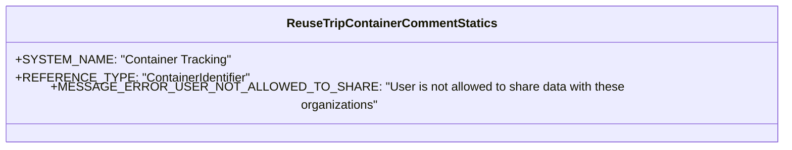

# Diagram: container_tracking_core/container_tracking_service/container_tracking_service/api/comments/handlers/statics/reuse_trip_container_comment_statics.py

> Auto-generated by Obscura crawlers

## Mermaid

> SVG rendering failed for this diagram.
