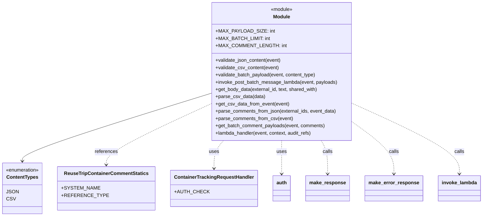

# Diagram: container_tracking_core/container_tracking_service/container_tracking_service/api/comments/reuse_trip_comment_batch_post.py


> Auto-generated by Obscura crawlers

## Diagram 1



> SVG rendering failed for this diagram.

## Diagram 2

```mermaid
flowchart TD
Start([Start]) --> GetHeader{Get "accept" header}
GetHeader --> CheckType{content_type in [JSON, CSV]?}
CheckType -- No --> BadContent[BadRequestError: Invalid content-type]
CheckType -- Yes --> Validate[validate_batch_payload(event, content_type)]
Validate -->|False| InvalidPayload[BadRequestError: Invalid payload format]
Validate -->|True| Branch{content_type == JSON?}
Branch -- Yes --> GetBody[get_event_body(event) & extract ids]
Branch -- No --> ParseCSV[get_csv_data_from_event(event) & parse_csv_data]
GetBody --> ParseJSON[parse_comments_from_json(ids, event_data)]
ParseCSV --> ParseCSVComments[parse_comments_from_csv(event)]
ParseJSON --> BuildPayloads[get_batch_comment_payloads(event, comments)]
ParseCSVComments --> BuildPayloads
BuildPayloads --> InvokePost[invoke_post_batch_message_lambda(event, payloads)]
InvokePost --> ReturnAccepted[make_response(status=202, batch_group_id)]
BadContent --> ErrorReturn[make_error_response(INTERNAL_SERVER_ERROR)]
InvalidPayload --> ErrorReturn
ReturnAccepted --> End([End])
ErrorReturn --> End
```

> SVG rendering failed for this diagram.
