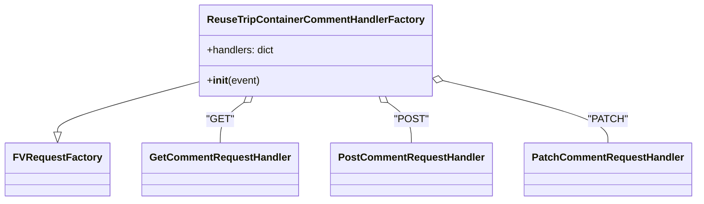

# Diagram: container_tracking_core/container_tracking_service/container_tracking_service/api/comments/reuse_trip_container_comments.py


> Auto-generated by Obscura crawlers

## Diagram 1



> SVG rendering failed for this diagram.

## Diagram 2

```mermaid
flowchart TD
K[mandatory_lambda_handling decorator] --> A([Lambda entry: event, context, audit_refs])
A --> B[ReuseTripContainerCommentHandlerFactory(event)]
B --> C{HTTP method}
C -->|GET| D[GetCommentRequestHandler]
C -->|POST| E[PostCommentRequestHandler]
C -->|PATCH| F[PatchCommentRequestHandler]
D --> G[handler.handle_request()]
E --> G
F --> G
G --> H[reuse_trip_container_comment_data, http_code]
H --> I[make_response(data, http_code)]
I --> J[Return HTTP response]
```

> SVG rendering failed for this diagram.
