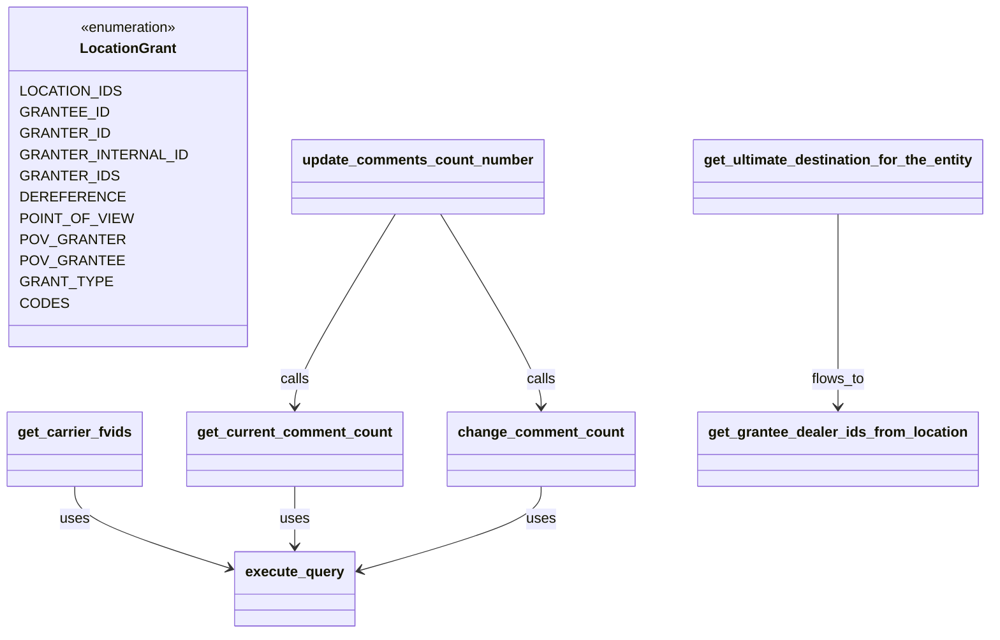
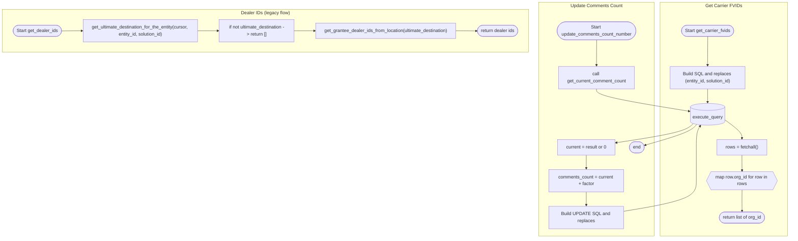

# Diagram: container_tracking_core/container_tracking_service/container_tracking_service/api/comments/utils/db.py

> Auto-generated by Obscura crawlers

## Diagram 1

### SVG

<svg id="container" width="1082.1875" xmlns="http://www.w3.org/2000/svg" class="classDiagram" height="716" viewBox="0 0 1082.1875 716" role="graphics-document document" aria-roledescription="class"><g><defs><marker id="container_class-aggregationStart" class="marker aggregation class" refX="18" refY="7" markerWidth="190" markerHeight="240" orient="auto"><path d="M 18,7 L9,13 L1,7 L9,1 Z"></path></marker></defs><defs><marker id="container_class-aggregationEnd" class="marker aggregation class" refX="1" refY="7" markerWidth="20" markerHeight="28" orient="auto"><path d="M 18,7 L9,13 L1,7 L9,1 Z"></path></marker></defs><defs><marker id="container_class-extensionStart" class="marker extension class" refX="18" refY="7" markerWidth="190" markerHeight="240" orient="auto"><path d="M 1,7 L18,13 V 1 Z"></path></marker></defs><defs><marker id="container_class-extensionEnd" class="marker extension class" refX="1" refY="7" markerWidth="20" markerHeight="28" orient="auto"><path d="M 1,1 V 13 L18,7 Z"></path></marker></defs><defs><marker id="container_class-compositionStart" class="marker composition class" refX="18" refY="7" markerWidth="190" markerHeight="240" orient="auto"><path d="M 18,7 L9,13 L1,7 L9,1 Z"></path></marker></defs><defs><marker id="container_class-compositionEnd" class="marker composition class" refX="1" refY="7" markerWidth="20" markerHeight="28" orient="auto"><path d="M 18,7 L9,13 L1,7 L9,1 Z"></path></marker></defs><defs><marker id="container_class-dependencyStart" class="marker dependency class" refX="6" refY="7" markerWidth="190" markerHeight="240" orient="auto"><path d="M 5,7 L9,13 L1,7 L9,1 Z"></path></marker></defs><defs><marker id="container_class-dependencyEnd" class="marker dependency class" refX="13" refY="7" markerWidth="20" markerHeight="28" orient="auto"><path d="M 18,7 L9,13 L14,7 L9,1 Z"></path></marker></defs><defs><marker id="container_class-lollipopStart" class="marker lollipop class" refX="13" refY="7" markerWidth="190" markerHeight="240" orient="auto"><circle stroke="black" fill="transparent" cx="7" cy="7" r="6"></circle></marker></defs><defs><marker id="container_class-lollipopEnd" class="marker lollipop class" refX="1" refY="7" markerWidth="190" markerHeight="240" orient="auto"><circle stroke="black" fill="transparent" cx="7" cy="7" r="6"></circle></marker></defs><g class="root"><g class="clusters"></g><g class="edgePaths"><path d="M81.406,550L81.406,556.167C81.406,562.333,81.406,574.667,109.619,590.106C137.832,605.544,194.257,624.089,222.47,633.361L250.683,642.633" id="id_get_carrier_fvids_execute_query_1" class="edge-thickness-normal edge-pattern-solid relation" style=";;;" data-edge="true" data-et="edge" data-id="id_get_carrier_fvids_execute_query_1" data-points="W3sieCI6ODEuNDA2MjUsInkiOjU1MH0seyJ4Ijo4MS40MDYyNSwieSI6NTg3fSx7IngiOjI1Ni4zODI4MTI1LCJ5Ijo2NDQuNTA2NTk3NzYzOTEwNn1d" marker-end="url(#container_class-dependencyEnd)"></path><path d="M321.781,550L321.781,556.167C321.781,562.333,321.781,574.667,321.781,586C321.781,597.333,321.781,607.667,321.781,612.833L321.781,618" id="id_get_current_comment_count_execute_query_2" class="edge-thickness-normal edge-pattern-solid relation" style=";;;" data-edge="true" data-et="edge" data-id="id_get_current_comment_count_execute_query_2" data-points="W3sieCI6MzIxLjc4MTI1LCJ5Ijo1NTB9LHsieCI6MzIxLjc4MTI1LCJ5Ijo1ODd9LHsieCI6MzIxLjc4MTI1LCJ5Ijo2MjR9XQ==" marker-end="url(#container_class-dependencyEnd)"></path><path d="M589.297,550L589.297,556.167C589.297,562.333,589.297,574.667,556.57,590.498C523.843,606.329,458.388,625.659,425.661,635.323L392.934,644.988" id="id_change_comment_count_execute_query_3" class="edge-thickness-normal edge-pattern-solid relation" style=";;;" data-edge="true" data-et="edge" data-id="id_change_comment_count_execute_query_3" data-points="W3sieCI6NTg5LjI5Njg3NSwieSI6NTUwfSx7IngiOjU4OS4yOTY4NzUsInkiOjU4N30seyJ4IjozODcuMTc5Njg3NSwieSI6NjQ2LjY4NzE5NzAwOTUyMDR9XQ==" marker-end="url(#container_class-dependencyEnd)"></path><path d="M431.007,242L412.803,273.167C394.598,304.333,358.19,366.667,339.986,403C321.781,439.333,321.781,449.667,321.781,454.833L321.781,460" id="id_update_comments_count_number_get_current_comment_count_4" class="edge-thickness-normal edge-pattern-solid relation" style=";;;" data-edge="true" data-et="edge" data-id="id_update_comments_count_number_get_current_comment_count_4" data-points="W3sieCI6NDMxLjAwNzA2MTk1NDE0ODQ3LCJ5IjoyNDJ9LHsieCI6MzIxLjc4MTI1LCJ5Ijo0Mjl9LHsieCI6MzIxLjc4MTI1LCJ5Ijo0NjZ9XQ==" marker-end="url(#container_class-dependencyEnd)"></path><path d="M480.071,242L498.275,273.167C516.48,304.333,552.888,366.667,571.093,403C589.297,439.333,589.297,449.667,589.297,454.833L589.297,460" id="id_update_comments_count_number_change_comment_count_5" class="edge-thickness-normal edge-pattern-solid relation" style=";;;" data-edge="true" data-et="edge" data-id="id_update_comments_count_number_change_comment_count_5" data-points="W3sieCI6NDgwLjA3MTA2MzA0NTg1MTUzLCJ5IjoyNDJ9LHsieCI6NTg5LjI5Njg3NSwieSI6NDI5fSx7IngiOjU4OS4yOTY4NzUsInkiOjQ2Nn1d" marker-end="url(#container_class-dependencyEnd)"></path><path d="M914.219,242L914.219,273.167C914.219,304.333,914.219,366.667,914.219,403C914.219,439.333,914.219,449.667,914.219,454.833L914.219,460" id="id_get_ultimate_destination_for_the_entity_get_grantee_dealer_ids_from_location_6" class="edge-thickness-normal edge-pattern-solid relation" style=";;;" data-edge="true" data-et="edge" data-id="id_get_ultimate_destination_for_the_entity_get_grantee_dealer_ids_from_location_6" data-points="W3sieCI6OTE0LjIxODc1LCJ5IjoyNDJ9LHsieCI6OTE0LjIxODc1LCJ5Ijo0Mjl9LHsieCI6OTE0LjIxODc1LCJ5Ijo0NjZ9XQ==" marker-end="url(#container_class-dependencyEnd)"></path></g><g class="edgeLabels"><g class="edgeLabel" transform="translate(81.40625, 587)"><g class="label" data-id="id_get_carrier_fvids_execute_query_1" transform="translate(-16.4921875, -12)"><foreignObject width="32.984375" height="24">

uses

</foreignObject></g></g><g class="edgeLabel" transform="translate(321.78125, 587)"><g class="label" data-id="id_get_current_comment_count_execute_query_2" transform="translate(-16.4921875, -12)"><foreignObject width="32.984375" height="24">

uses

</foreignObject></g></g><g class="edgeLabel" transform="translate(589.296875, 587)"><g class="label" data-id="id_change_comment_count_execute_query_3" transform="translate(-16.4921875, -12)"><foreignObject width="32.984375" height="24">

uses

</foreignObject></g></g><g class="edgeLabel" transform="translate(321.78125, 429)"><g class="label" data-id="id_update_comments_count_number_get_current_comment_count_4" transform="translate(-16.4453125, -12)"><foreignObject width="32.890625" height="24">

calls

</foreignObject></g></g><g class="edgeLabel" transform="translate(589.296875, 429)"><g class="label" data-id="id_update_comments_count_number_change_comment_count_5" transform="translate(-16.4453125, -12)"><foreignObject width="32.890625" height="24">

calls

</foreignObject></g></g><g class="edgeLabel" transform="translate(914.21875, 429)"><g class="label" data-id="id_get_ultimate_destination_for_the_entity_get_grantee_dealer_ids_from_location_6" transform="translate(-30.125, -12)"><foreignObject width="60.25" height="24">

flows_to

</foreignObject></g></g></g><g class="nodes"><g class="node default" id="classId-LocationGrant-0" transform="translate(145.05859375, 200)"><g class="basic label-container"><path d="M-123.91796875 -192 L123.91796875 -192 L123.91796875 192 L-123.91796875 192" stroke="none" stroke-width="0" fill="#ECECFF" style=""></path><path d="M-123.91796875 -192 C-50.755830786145296 -192, 22.406307177709408 -192, 123.91796875 -192 M-123.91796875 -192 C-30.799780505628135 -192, 62.31840773874373 -192, 123.91796875 -192 M123.91796875 -192 C123.91796875 -46.956896157635924, 123.91796875 98.08620768472815, 123.91796875 192 M123.91796875 -192 C123.91796875 -86.75315784431899, 123.91796875 18.493684311362017, 123.91796875 192 M123.91796875 192 C63.00230492316649 192, 2.0866410963329827 192, -123.91796875 192 M123.91796875 192 C38.5900677371195 192, -46.737833275761005 192, -123.91796875 192 M-123.91796875 192 C-123.91796875 49.18643417653658, -123.91796875 -93.62713164692684, -123.91796875 -192 M-123.91796875 192 C-123.91796875 53.77882889027211, -123.91796875 -84.44234221945578, -123.91796875 -192" stroke="#9370DB" stroke-width="1.3" fill="none" stroke-dasharray="0 0" style=""></path></g><g class="annotation-group text" transform="translate(-55.5546875, -168)"><g class="label" style="" transform="translate(0,-12)"><foreignObject width="111.109375" height="24">

«enumeration»

</foreignObject></g></g><g class="label-group text" transform="translate(-51.5234375, -144)"><g class="label" style="font-weight: bolder" transform="translate(0,-12)"><foreignObject width="103.046875" height="24">

LocationGrant

</foreignObject></g></g><g class="members-group text" transform="translate(-111.91796875, -96)"><g class="label" style="" transform="translate(0,-12)"><foreignObject width="102.71875" height="24">

LOCATION_IDS

</foreignObject></g><g class="label" style="" transform="translate(0,12)"><foreignObject width="88.609375" height="24">

GRANTEE_ID

</foreignObject></g><g class="label" style="" transform="translate(0,36)"><foreignObject width="89.734375" height="24">

GRANTER_ID

</foreignObject></g><g class="label" style="" transform="translate(0,60)"><foreignObject width="168.28125" height="24">

GRANTER_INTERNAL_ID

</foreignObject></g><g class="label" style="" transform="translate(0,84)"><foreignObject width="98.453125" height="24">

GRANTER_IDS

</foreignObject></g><g class="label" style="" transform="translate(0,108)"><foreignObject width="100.21875" height="24">

DEREFERENCE

</foreignObject></g><g class="label" style="" transform="translate(0,132)"><foreignObject width="111.421875" height="24">

POINT_OF_VIEW

</foreignObject></g><g class="label" style="" transform="translate(0,156)"><foreignObject width="102.453125" height="24">

POV_GRANTER

</foreignObject></g><g class="label" style="" transform="translate(0,180)"><foreignObject width="101.34375" height="24">

POV_GRANTEE

</foreignObject></g><g class="label" style="" transform="translate(0,204)"><foreignObject width="89.796875" height="24">

GRANT_TYPE

</foreignObject></g><g class="label" style="" transform="translate(0,228)"><foreignObject width="47.140625" height="24">

CODES

</foreignObject></g></g><g class="methods-group text" transform="translate(-111.91796875, 192)"></g><g class="divider" style=""><path d="M-123.91796875 -120 C-61.0793243917561 -120, 1.7593199664877943 -120, 123.91796875 -120 M-123.91796875 -120 C-69.06000862522336 -120, -14.202048500446708 -120, 123.91796875 -120" stroke="#9370DB" stroke-width="1.3" fill="none" stroke-dasharray="0 0" style=""></path></g><g class="divider" style=""><path d="M-123.91796875 168 C-43.75140457358411 168, 36.41515960283178 168, 123.91796875 168 M-123.91796875 168 C-36.6474420310156 168, 50.6230846879688 168, 123.91796875 168" stroke="#9370DB" stroke-width="1.3" fill="none" stroke-dasharray="0 0" style=""></path></g></g><g class="node default" id="classId-execute_query-1" transform="translate(321.78125, 666)"><g class="basic label-container"><path d="M-65.3984375 -42 L65.3984375 -42 L65.3984375 42 L-65.3984375 42" stroke="none" stroke-width="0" fill="#ECECFF" style=""></path><path d="M-65.3984375 -42 C-34.2675416892243 -42, -3.136645878448604 -42, 65.3984375 -42 M-65.3984375 -42 C-16.23623857264542 -42, 32.92596035470916 -42, 65.3984375 -42 M65.3984375 -42 C65.3984375 -21.149451154597322, 65.3984375 -0.298902309194645, 65.3984375 42 M65.3984375 -42 C65.3984375 -14.917251236117924, 65.3984375 12.165497527764153, 65.3984375 42 M65.3984375 42 C31.628629884745685 42, -2.1411777305086304 42, -65.3984375 42 M65.3984375 42 C33.468893630278416 42, 1.5393497605568314 42, -65.3984375 42 M-65.3984375 42 C-65.3984375 16.384389758873102, -65.3984375 -9.231220482253796, -65.3984375 -42 M-65.3984375 42 C-65.3984375 16.09131487944405, -65.3984375 -9.817370241111902, -65.3984375 -42" stroke="#9370DB" stroke-width="1.3" fill="none" stroke-dasharray="0 0" style=""></path></g><g class="annotation-group text" transform="translate(0, -18)"></g><g class="label-group text" transform="translate(-53.3984375, -18)"><g class="label" style="font-weight: bolder" transform="translate(0,-12)"><foreignObject width="106.796875" height="24">

execute_query

</foreignObject></g></g><g class="members-group text" transform="translate(-53.3984375, 30)"></g><g class="methods-group text" transform="translate(-53.3984375, 60)"></g><g class="divider" style=""><path d="M-65.3984375 6 C-38.34202485010667 6, -11.285612200213343 6, 65.3984375 6 M-65.3984375 6 C-17.450106627675353 6, 30.498224244649293 6, 65.3984375 6" stroke="#9370DB" stroke-width="1.3" fill="none" stroke-dasharray="0 0" style=""></path></g><g class="divider" style=""><path d="M-65.3984375 24 C-19.611847718668315 24, 26.17474206266337 24, 65.3984375 24 M-65.3984375 24 C-22.47709985557234 24, 20.444237788855318 24, 65.3984375 24" stroke="#9370DB" stroke-width="1.3" fill="none" stroke-dasharray="0 0" style=""></path></g></g><g class="node default" id="classId-get_carrier_fvids-2" transform="translate(81.40625, 508)"><g class="basic label-container"><path d="M-73.40625 -42 L73.40625 -42 L73.40625 42 L-73.40625 42" stroke="none" stroke-width="0" fill="#ECECFF" style=""></path><path d="M-73.40625 -42 C-40.61120906225524 -42, -7.816168124510483 -42, 73.40625 -42 M-73.40625 -42 C-40.99439569202134 -42, -8.582541384042685 -42, 73.40625 -42 M73.40625 -42 C73.40625 -15.708854560874368, 73.40625 10.582290878251264, 73.40625 42 M73.40625 -42 C73.40625 -12.670363961694012, 73.40625 16.659272076611977, 73.40625 42 M73.40625 42 C30.114769408902504 42, -13.176711182194992 42, -73.40625 42 M73.40625 42 C14.776693035871347 42, -43.85286392825731 42, -73.40625 42 M-73.40625 42 C-73.40625 15.200076196960637, -73.40625 -11.599847606078725, -73.40625 -42 M-73.40625 42 C-73.40625 22.066705017187093, -73.40625 2.1334100343741866, -73.40625 -42" stroke="#9370DB" stroke-width="1.3" fill="none" stroke-dasharray="0 0" style=""></path></g><g class="annotation-group text" transform="translate(0, -18)"></g><g class="label-group text" transform="translate(-61.40625, -18)"><g class="label" style="font-weight: bolder" transform="translate(0,-12)"><foreignObject width="122.8125" height="24">

get_carrier_fvids

</foreignObject></g></g><g class="members-group text" transform="translate(-61.40625, 30)"></g><g class="methods-group text" transform="translate(-61.40625, 60)"></g><g class="divider" style=""><path d="M-73.40625 6 C-39.727213746826614 6, -6.0481774936532275 6, 73.40625 6 M-73.40625 6 C-39.22766544218894 6, -5.0490808843778865 6, 73.40625 6" stroke="#9370DB" stroke-width="1.3" fill="none" stroke-dasharray="0 0" style=""></path></g><g class="divider" style=""><path d="M-73.40625 24 C-32.74943036577224 24, 7.907389268455518 24, 73.40625 24 M-73.40625 24 C-29.912316319962095 24, 13.58161736007581 24, 73.40625 24" stroke="#9370DB" stroke-width="1.3" fill="none" stroke-dasharray="0 0" style=""></path></g></g><g class="node default" id="classId-update_comments_count_number-3" transform="translate(455.5390625, 200)"><g class="basic label-container"><path d="M-136.5625 -42 L136.5625 -42 L136.5625 42 L-136.5625 42" stroke="none" stroke-width="0" fill="#ECECFF" style=""></path><path d="M-136.5625 -42 C-77.25236332062622 -42, -17.942226641252432 -42, 136.5625 -42 M-136.5625 -42 C-30.57410167277216 -42, 75.41429665445568 -42, 136.5625 -42 M136.5625 -42 C136.5625 -11.061626641035183, 136.5625 19.876746717929635, 136.5625 42 M136.5625 -42 C136.5625 -14.945883952872837, 136.5625 12.108232094254326, 136.5625 42 M136.5625 42 C43.30783707155453 42, -49.94682585689094 42, -136.5625 42 M136.5625 42 C34.53795179011128 42, -67.48659641977744 42, -136.5625 42 M-136.5625 42 C-136.5625 17.171630604000793, -136.5625 -7.656738791998414, -136.5625 -42 M-136.5625 42 C-136.5625 10.312331943996945, -136.5625 -21.37533611200611, -136.5625 -42" stroke="#9370DB" stroke-width="1.3" fill="none" stroke-dasharray="0 0" style=""></path></g><g class="annotation-group text" transform="translate(0, -18)"></g><g class="label-group text" transform="translate(-124.5625, -18)"><g class="label" style="font-weight: bolder" transform="translate(0,-12)"><foreignObject width="249.125" height="24">

update_comments_count_number

</foreignObject></g></g><g class="members-group text" transform="translate(-124.5625, 30)"></g><g class="methods-group text" transform="translate(-124.5625, 60)"></g><g class="divider" style=""><path d="M-136.5625 6 C-51.39017384959351 6, 33.78215230081298 6, 136.5625 6 M-136.5625 6 C-48.10456684430052 6, 40.35336631139896 6, 136.5625 6" stroke="#9370DB" stroke-width="1.3" fill="none" stroke-dasharray="0 0" style=""></path></g><g class="divider" style=""><path d="M-136.5625 24 C-36.16994788903676 24, 64.22260422192647 24, 136.5625 24 M-136.5625 24 C-48.1252843125412 24, 40.311931374917606 24, 136.5625 24" stroke="#9370DB" stroke-width="1.3" fill="none" stroke-dasharray="0 0" style=""></path></g></g><g class="node default" id="classId-get_current_comment_count-4" transform="translate(321.78125, 508)"><g class="basic label-container"><path d="M-116.96875 -42 L116.96875 -42 L116.96875 42 L-116.96875 42" stroke="none" stroke-width="0" fill="#ECECFF" style=""></path><path d="M-116.96875 -42 C-26.0733901684452 -42, 64.8219696631096 -42, 116.96875 -42 M-116.96875 -42 C-61.958730833500084 -42, -6.948711667000168 -42, 116.96875 -42 M116.96875 -42 C116.96875 -20.552427324154124, 116.96875 0.8951453516917525, 116.96875 42 M116.96875 -42 C116.96875 -11.589303385495839, 116.96875 18.821393229008322, 116.96875 42 M116.96875 42 C44.32279977100704 42, -28.323150457985918 42, -116.96875 42 M116.96875 42 C34.08643655485446 42, -48.79587689029108 42, -116.96875 42 M-116.96875 42 C-116.96875 13.266209214632045, -116.96875 -15.46758157073591, -116.96875 -42 M-116.96875 42 C-116.96875 17.982223831274045, -116.96875 -6.035552337451911, -116.96875 -42" stroke="#9370DB" stroke-width="1.3" fill="none" stroke-dasharray="0 0" style=""></path></g><g class="annotation-group text" transform="translate(0, -18)"></g><g class="label-group text" transform="translate(-104.96875, -18)"><g class="label" style="font-weight: bolder" transform="translate(0,-12)"><foreignObject width="209.9375" height="24">

get_current_comment_count

</foreignObject></g></g><g class="members-group text" transform="translate(-104.96875, 30)"></g><g class="methods-group text" transform="translate(-104.96875, 60)"></g><g class="divider" style=""><path d="M-116.96875 6 C-50.924585715710734 6, 15.119578568578532 6, 116.96875 6 M-116.96875 6 C-53.14365581716856 6, 10.681438365662885 6, 116.96875 6" stroke="#9370DB" stroke-width="1.3" fill="none" stroke-dasharray="0 0" style=""></path></g><g class="divider" style=""><path d="M-116.96875 24 C-61.68145748151675 24, -6.394164963033504 24, 116.96875 24 M-116.96875 24 C-52.85559719642799 24, 11.257555607144013 24, 116.96875 24" stroke="#9370DB" stroke-width="1.3" fill="none" stroke-dasharray="0 0" style=""></path></g></g><g class="node default" id="classId-change_comment_count-5" transform="translate(589.296875, 508)"><g class="basic label-container"><path d="M-100.546875 -42 L100.546875 -42 L100.546875 42 L-100.546875 42" stroke="none" stroke-width="0" fill="#ECECFF" style=""></path><path d="M-100.546875 -42 C-39.08729495836405 -42, 22.372285083271905 -42, 100.546875 -42 M-100.546875 -42 C-43.75775207997766 -42, 13.031370840044687 -42, 100.546875 -42 M100.546875 -42 C100.546875 -15.287948961255776, 100.546875 11.424102077488449, 100.546875 42 M100.546875 -42 C100.546875 -14.764808071396121, 100.546875 12.470383857207757, 100.546875 42 M100.546875 42 C44.43840064389783 42, -11.670073712204342 42, -100.546875 42 M100.546875 42 C56.83969058086722 42, 13.13250616173444 42, -100.546875 42 M-100.546875 42 C-100.546875 23.259938129098394, -100.546875 4.519876258196788, -100.546875 -42 M-100.546875 42 C-100.546875 12.591877946311143, -100.546875 -16.816244107377713, -100.546875 -42" stroke="#9370DB" stroke-width="1.3" fill="none" stroke-dasharray="0 0" style=""></path></g><g class="annotation-group text" transform="translate(0, -18)"></g><g class="label-group text" transform="translate(-88.546875, -18)"><g class="label" style="font-weight: bolder" transform="translate(0,-12)"><foreignObject width="177.09375" height="24">

change_comment_count

</foreignObject></g></g><g class="members-group text" transform="translate(-88.546875, 30)"></g><g class="methods-group text" transform="translate(-88.546875, 60)"></g><g class="divider" style=""><path d="M-100.546875 6 C-22.784634268702106 6, 54.97760646259579 6, 100.546875 6 M-100.546875 6 C-36.63769219532545 6, 27.2714906093491 6, 100.546875 6" stroke="#9370DB" stroke-width="1.3" fill="none" stroke-dasharray="0 0" style=""></path></g><g class="divider" style=""><path d="M-100.546875 24 C-53.726578946395286 24, -6.906282892790571 24, 100.546875 24 M-100.546875 24 C-51.79898794043849 24, -3.051100880876973 24, 100.546875 24" stroke="#9370DB" stroke-width="1.3" fill="none" stroke-dasharray="0 0" style=""></path></g></g><g class="node default" id="classId-get_ultimate_destination_for_the_entity-6" transform="translate(914.21875, 200)"><g class="basic label-container"><path d="M-159.96875 -42 L159.96875 -42 L159.96875 42 L-159.96875 42" stroke="none" stroke-width="0" fill="#ECECFF" style=""></path><path d="M-159.96875 -42 C-39.092696540053055 -42, 81.78335691989389 -42, 159.96875 -42 M-159.96875 -42 C-63.41939267620738 -42, 33.12996464758524 -42, 159.96875 -42 M159.96875 -42 C159.96875 -24.732514146171866, 159.96875 -7.465028292343732, 159.96875 42 M159.96875 -42 C159.96875 -15.072713394033897, 159.96875 11.854573211932205, 159.96875 42 M159.96875 42 C84.63864941182378 42, 9.308548823647556 42, -159.96875 42 M159.96875 42 C81.10416218215963 42, 2.239574364319253 42, -159.96875 42 M-159.96875 42 C-159.96875 17.496843888813157, -159.96875 -7.006312222373687, -159.96875 -42 M-159.96875 42 C-159.96875 8.765144903211905, -159.96875 -24.46971019357619, -159.96875 -42" stroke="#9370DB" stroke-width="1.3" fill="none" stroke-dasharray="0 0" style=""></path></g><g class="annotation-group text" transform="translate(0, -18)"></g><g class="label-group text" transform="translate(-147.96875, -18)"><g class="label" style="font-weight: bolder" transform="translate(0,-12)"><foreignObject width="295.9375" height="24">

get_ultimate_destination_for_the_entity

</foreignObject></g></g><g class="members-group text" transform="translate(-147.96875, 30)"></g><g class="methods-group text" transform="translate(-147.96875, 60)"></g><g class="divider" style=""><path d="M-159.96875 6 C-46.99716406989327 6, 65.97442186021345 6, 159.96875 6 M-159.96875 6 C-34.465851780484485 6, 91.03704643903103 6, 159.96875 6" stroke="#9370DB" stroke-width="1.3" fill="none" stroke-dasharray="0 0" style=""></path></g><g class="divider" style=""><path d="M-159.96875 24 C-88.17242864665886 24, -16.376107293317716 24, 159.96875 24 M-159.96875 24 C-39.88620515120769 24, 80.19633969758462 24, 159.96875 24" stroke="#9370DB" stroke-width="1.3" fill="none" stroke-dasharray="0 0" style=""></path></g></g><g class="node default" id="classId-get_grantee_dealer_ids_from_location-7" transform="translate(914.21875, 508)"><g class="basic label-container"><path d="M-152.765625 -42 L152.765625 -42 L152.765625 42 L-152.765625 42" stroke="none" stroke-width="0" fill="#ECECFF" style=""></path><path d="M-152.765625 -42 C-49.957373224093274 -42, 52.85087855181345 -42, 152.765625 -42 M-152.765625 -42 C-84.00804477335133 -42, -15.25046454670266 -42, 152.765625 -42 M152.765625 -42 C152.765625 -22.128440871366898, 152.765625 -2.256881742733796, 152.765625 42 M152.765625 -42 C152.765625 -17.805890032205497, 152.765625 6.388219935589007, 152.765625 42 M152.765625 42 C36.0547926127054 42, -80.6560397745892 42, -152.765625 42 M152.765625 42 C72.36044502211772 42, -8.044734955764568 42, -152.765625 42 M-152.765625 42 C-152.765625 20.798821211261526, -152.765625 -0.40235757747694834, -152.765625 -42 M-152.765625 42 C-152.765625 11.778920079430886, -152.765625 -18.442159841138228, -152.765625 -42" stroke="#9370DB" stroke-width="1.3" fill="none" stroke-dasharray="0 0" style=""></path></g><g class="annotation-group text" transform="translate(0, -18)"></g><g class="label-group text" transform="translate(-140.765625, -18)"><g class="label" style="font-weight: bolder" transform="translate(0,-12)"><foreignObject width="281.53125" height="24">

get_grantee_dealer_ids_from_location

</foreignObject></g></g><g class="members-group text" transform="translate(-140.765625, 30)"></g><g class="methods-group text" transform="translate(-140.765625, 60)"></g><g class="divider" style=""><path d="M-152.765625 6 C-68.99273204544347 6, 14.78016090911305 6, 152.765625 6 M-152.765625 6 C-52.56648561031068 6, 47.63265377937864 6, 152.765625 6" stroke="#9370DB" stroke-width="1.3" fill="none" stroke-dasharray="0 0" style=""></path></g><g class="divider" style=""><path d="M-152.765625 24 C-88.28413689459784 24, -23.802648789195672 24, 152.765625 24 M-152.765625 24 C-31.878594337623383 24, 89.00843632475323 24, 152.765625 24" stroke="#9370DB" stroke-width="1.3" fill="none" stroke-dasharray="0 0" style=""></path></g></g></g></g></g></svg>

## Diagram 2

> SVG rendering failed for this diagram.
