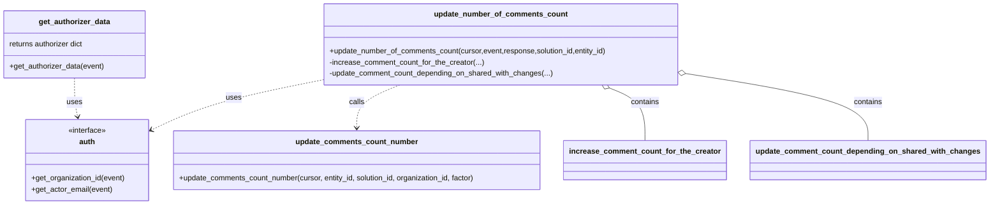

# Diagram: container_tracking_core/container_tracking_service/container_tracking_service/api/comments/utils/utils.py


> Auto-generated by Obscura crawlers

## Diagram 1

```mermaid
flowchart LR
    Event[Lambda event] --> GA[get_authorizer_data(event)]
    GA --> A_org[auth.get_organization_id(event)]
    GA --> A_email[auth.get_actor_email(event)]
    GA --> AuthorizerData["{authorizer: {...}}"]
    Response[HTTP response] --> Check{int(response.statusCode) == HTTPStatus.OK}
    Check -- yes --> Parse[body = json.loads(response.body)]
    Check -- no --> End[No update]
    Parse --> AuthOrg[auth.get_organization_id(event)]
    Parse --> UpdateNumber[update_number_of_comments_count(cursor,event,response,solution_id,entity_id)]
    UpdateNumber --> Increase[increase_comment_count_for_the_creator(...)]
    UpdateNumber --> UpdateShared[update_comment_count_depending_on_shared_with_changes(...)]
    Increase --> CondCreate{body.get('old_shared_with') is None}
    CondCreate -- true --> UCN1[update_comments_count_number(..., factor=1)]
    CondCreate -- false --> Skip1[no action]
    UpdateShared --> OldShared[old_shared_with = set(body.get('old_shared_with', []))]
    UpdateShared --> SharedWith[shared_with = set(body['shared_with'])]
    UpdateShared --> Mandatory[mandatory_shared_with = {organization_id}]
    SharedWith --> NewOrgs[new_organizations_that_have_access = shared_with - old_shared_with - mandatory_shared_with]
    OldShared --> RemovedOrgs[organizations_that_have_no_more_access = old_shared_with - shared_with - mandatory_shared_with]
    NewOrgs --> UCN2[update_comments_count_number(..., factor=1)]
    RemovedOrgs --> UCN3[update_comments_count_number(..., factor=-1)]
```

> SVG rendering failed for this diagram.

## Diagram 2



> SVG rendering failed for this diagram.
