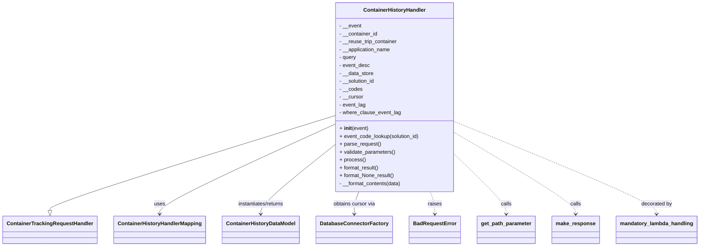
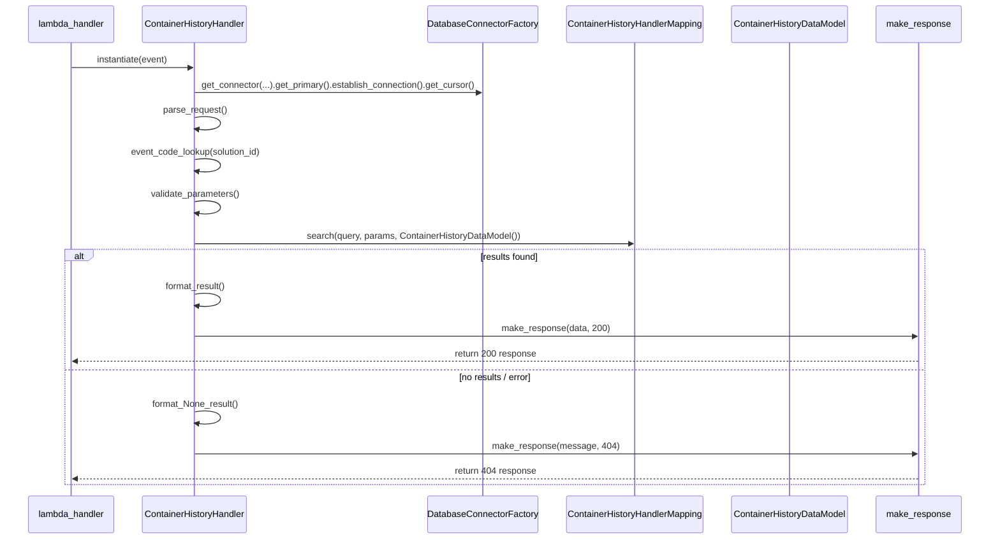

# Diagram: container_tracking_core/container_tracking_service/container_tracking_service/api/container_history/container_history_handler.py

> Auto-generated by Obscura crawlers

## Diagram 1

### SVG

<svg id="container" width="2058" xmlns="http://www.w3.org/2000/svg" class="classDiagram" height="750" viewBox="0 0 2058 750" role="graphics-document document" aria-roledescription="class"><g><defs><marker id="container_class-aggregationStart" class="marker aggregation class" refX="18" refY="7" markerWidth="190" markerHeight="240" orient="auto"><path d="M 18,7 L9,13 L1,7 L9,1 Z"></path></marker></defs><defs><marker id="container_class-aggregationEnd" class="marker aggregation class" refX="1" refY="7" markerWidth="20" markerHeight="28" orient="auto"><path d="M 18,7 L9,13 L1,7 L9,1 Z"></path></marker></defs><defs><marker id="container_class-extensionStart" class="marker extension class" refX="18" refY="7" markerWidth="190" markerHeight="240" orient="auto"><path d="M 1,7 L18,13 V 1 Z"></path></marker></defs><defs><marker id="container_class-extensionEnd" class="marker extension class" refX="1" refY="7" markerWidth="20" markerHeight="28" orient="auto"><path d="M 1,1 V 13 L18,7 Z"></path></marker></defs><defs><marker id="container_class-compositionStart" class="marker composition class" refX="18" refY="7" markerWidth="190" markerHeight="240" orient="auto"><path d="M 18,7 L9,13 L1,7 L9,1 Z"></path></marker></defs><defs><marker id="container_class-compositionEnd" class="marker composition class" refX="1" refY="7" markerWidth="20" markerHeight="28" orient="auto"><path d="M 18,7 L9,13 L1,7 L9,1 Z"></path></marker></defs><defs><marker id="container_class-dependencyStart" class="marker dependency class" refX="6" refY="7" markerWidth="190" markerHeight="240" orient="auto"><path d="M 5,7 L9,13 L1,7 L9,1 Z"></path></marker></defs><defs><marker id="container_class-dependencyEnd" class="marker dependency class" refX="13" refY="7" markerWidth="20" markerHeight="28" orient="auto"><path d="M 18,7 L9,13 L14,7 L9,1 Z"></path></marker></defs><defs><marker id="container_class-lollipopStart" class="marker lollipop class" refX="13" refY="7" markerWidth="190" markerHeight="240" orient="auto"><circle stroke="black" fill="transparent" cx="7" cy="7" r="6"></circle></marker></defs><defs><marker id="container_class-lollipopEnd" class="marker lollipop class" refX="1" refY="7" markerWidth="190" markerHeight="240" orient="auto"><circle stroke="black" fill="transparent" cx="7" cy="7" r="6"></circle></marker></defs><g class="root"><g class="clusters"></g><g class="edgePaths"><path d="M976.102,354.058L837.682,398.549C699.263,443.039,422.424,532.019,284.005,579.801C145.586,627.583,145.586,634.167,145.586,637.458L145.586,640.75" id="id_ContainerHistoryHandler_ContainerTrackingRequestHandler_1" class="edge-thickness-normal edge-pattern-solid relation" style=";;;" data-edge="true" data-et="edge" data-id="id_ContainerHistoryHandler_ContainerTrackingRequestHandler_1" data-points="W3sieCI6OTc2LjEwMTU2MjUsInkiOjM1NC4wNTg0MDM1Nzg4NTE0fSx7IngiOjE0NS41ODU5Mzc1LCJ5Ijo2MjF9LHsieCI6MTQ1LjU4NTkzNzUsInkiOjY1OH1d" marker-end="url(#container_class-extensionEnd)"></path><path d="M976.102,381.21L891.382,421.175C806.661,461.14,637.221,541.07,552.501,586.202C467.781,631.333,467.781,641.667,467.781,646.833L467.781,652" id="id_ContainerHistoryHandler_ContainerHistoryHandlerMapping_2" class="edge-thickness-normal edge-pattern-solid relation" style=";;;" data-edge="true" data-et="edge" data-id="id_ContainerHistoryHandler_ContainerHistoryHandlerMapping_2" data-points="W3sieCI6OTc2LjEwMTU2MjUsInkiOjM4MS4yMDk5NTM5NjA5NDYxN30seyJ4Ijo0NjcuNzgxMjUsInkiOjYyMX0seyJ4Ijo0NjcuNzgxMjUsInkiOjY1OH1d" marker-end="url(#container_class-dependencyEnd)"></path><path d="M976.102,446.187L941.06,475.323C906.018,504.458,835.935,562.729,800.893,597.031C765.852,631.333,765.852,641.667,765.852,646.833L765.852,652" id="id_ContainerHistoryHandler_ContainerHistoryDataModel_3" class="edge-thickness-normal edge-pattern-solid relation" style=";;;" data-edge="true" data-et="edge" data-id="id_ContainerHistoryHandler_ContainerHistoryDataModel_3" data-points="W3sieCI6OTc2LjEwMTU2MjUsInkiOjQ0Ni4xODczNzYzMzE2MjExfSx7IngiOjc2NS44NTE1NjI1LCJ5Ijo2MjF9LHsieCI6NzY1Ljg1MTU2MjUsInkiOjY1OH1d" marker-end="url(#container_class-dependencyEnd)"></path><path d="M1052.847,584L1050.622,590.167C1048.398,596.333,1043.949,608.667,1041.724,620C1039.5,631.333,1039.5,641.667,1039.5,646.833L1039.5,652" id="id_ContainerHistoryHandler_DatabaseConnectorFactory_4" class="edge-thickness-normal edge-pattern-solid relation" style=";;;" data-edge="true" data-et="edge" data-id="id_ContainerHistoryHandler_DatabaseConnectorFactory_4" data-points="W3sieCI6MTA1Mi44NDY2ODI2OTIzMDc3LCJ5Ijo1ODR9LHsieCI6MTAzOS41LCJ5Ijo2MjF9LHsieCI6MTAzOS41LCJ5Ijo2NTh9XQ==" marker-end="url(#container_class-dependencyEnd)"></path><path d="M1260.622,584L1262.847,590.167C1265.071,596.333,1269.52,608.667,1271.744,620C1273.969,631.333,1273.969,641.667,1273.969,646.833L1273.969,652" id="id_ContainerHistoryHandler_BadRequestError_5" class="edge-thickness-normal edge-pattern-dashed relation" style=";;;" data-edge="true" data-et="edge" data-id="id_ContainerHistoryHandler_BadRequestError_5" data-points="W3sieCI6MTI2MC42MjIwNjczMDc2OTIzLCJ5Ijo1ODR9LHsieCI6MTI3My45Njg3NSwieSI6NjIxfSx7IngiOjEyNzMuOTY4NzUsInkiOjY1OH1d" marker-end="url(#container_class-dependencyEnd)"></path><path d="M1337.367,474.713L1362.01,499.094C1386.654,523.475,1435.94,572.238,1460.583,601.785C1485.227,631.333,1485.227,641.667,1485.227,646.833L1485.227,652" id="id_ContainerHistoryHandler_get_path_parameter_6" class="edge-thickness-normal edge-pattern-dashed relation" style=";;;" data-edge="true" data-et="edge" data-id="id_ContainerHistoryHandler_get_path_parameter_6" data-points="W3sieCI6MTMzNy4zNjcxODc1LCJ5Ijo0NzQuNzEyNTEyMTg4NzQxMTN9LHsieCI6MTQ4NS4yMjY1NjI1LCJ5Ijo2MjF9LHsieCI6MTQ4NS4yMjY1NjI1LCJ5Ijo2NTh9XQ==" marker-end="url(#container_class-dependencyEnd)"></path><path d="M1337.367,405.743L1396.418,441.619C1455.469,477.495,1573.57,549.248,1632.621,590.291C1691.672,631.333,1691.672,641.667,1691.672,646.833L1691.672,652" id="id_ContainerHistoryHandler_make_response_7" class="edge-thickness-normal edge-pattern-dashed relation" style=";;;" data-edge="true" data-et="edge" data-id="id_ContainerHistoryHandler_make_response_7" data-points="W3sieCI6MTMzNy4zNjcxODc1LCJ5Ijo0MDUuNzQzMDMzNjQ4NzkwNzR9LHsieCI6MTY5MS42NzE4NzUsInkiOjYyMX0seyJ4IjoxNjkxLjY3MTg3NSwieSI6NjU4fV0=" marker-end="url(#container_class-dependencyEnd)"></path><path d="M1337.367,371.863L1436.234,413.386C1535.102,454.909,1732.836,537.954,1831.703,584.644C1930.57,631.333,1930.57,641.667,1930.57,646.833L1930.57,652" id="id_ContainerHistoryHandler_mandatory_lambda_handling_8" class="edge-thickness-normal edge-pattern-dashed relation" style=";;;" data-edge="true" data-et="edge" data-id="id_ContainerHistoryHandler_mandatory_lambda_handling_8" data-points="W3sieCI6MTMzNy4zNjcxODc1LCJ5IjozNzEuODYzMTkxNjg5MTI5ODV9LHsieCI6MTkzMC41NzAzMTI1LCJ5Ijo2MjF9LHsieCI6MTkzMC41NzAzMTI1LCJ5Ijo2NTh9XQ==" marker-end="url(#container_class-dependencyEnd)"></path></g><g class="edgeLabels"><g class="edgeLabel"><g class="label" data-id="id_ContainerHistoryHandler_ContainerTrackingRequestHandler_1" transform="translate(0, 0)"><foreignObject width="0" height="0">

</foreignObject></g></g><g class="edgeLabel" transform="translate(467.78125, 621)"><g class="label" data-id="id_ContainerHistoryHandler_ContainerHistoryHandlerMapping_2" transform="translate(-16.4921875, -12)"><foreignObject width="32.984375" height="24">

uses

</foreignObject></g></g><g class="edgeLabel" transform="translate(765.8515625, 621)"><g class="label" data-id="id_ContainerHistoryHandler_ContainerHistoryDataModel_3" transform="translate(-73.1015625, -12)"><foreignObject width="146.203125" height="24">

instantiates/returns

</foreignObject></g></g><g class="edgeLabel" transform="translate(1039.5, 621)"><g class="label" data-id="id_ContainerHistoryHandler_DatabaseConnectorFactory_4" transform="translate(-64.9375, -12)"><foreignObject width="129.875" height="24">

obtains cursor via

</foreignObject></g></g><g class="edgeLabel" transform="translate(1273.96875, 621)"><g class="label" data-id="id_ContainerHistoryHandler_BadRequestError_5" transform="translate(-21.25, -12)"><foreignObject width="42.5" height="24">

raises

</foreignObject></g></g><g class="edgeLabel" transform="translate(1485.2265625, 621)"><g class="label" data-id="id_ContainerHistoryHandler_get_path_parameter_6" transform="translate(-16.4453125, -12)"><foreignObject width="32.890625" height="24">

calls

</foreignObject></g></g><g class="edgeLabel" transform="translate(1691.671875, 621)"><g class="label" data-id="id_ContainerHistoryHandler_make_response_7" transform="translate(-16.4453125, -12)"><foreignObject width="32.890625" height="24">

calls

</foreignObject></g></g><g class="edgeLabel" transform="translate(1930.5703125, 621)"><g class="label" data-id="id_ContainerHistoryHandler_mandatory_lambda_handling_8" transform="translate(-47.328125, -12)"><foreignObject width="94.65625" height="24">

decorated by

</foreignObject></g></g></g><g class="nodes"><g class="node default" id="classId-ContainerHistoryHandler-0" transform="translate(1156.734375, 296)"><g class="basic label-container"><path d="M-180.6328125 -288 L180.6328125 -288 L180.6328125 288 L-180.6328125 288" stroke="none" stroke-width="0" fill="#ECECFF" style=""></path><path d="M-180.6328125 -288 C-42.904176136083095 -288, 94.82446022783381 -288, 180.6328125 -288 M-180.6328125 -288 C-96.48170679582827 -288, -12.330601091656547 -288, 180.6328125 -288 M180.6328125 -288 C180.6328125 -148.5654849393173, 180.6328125 -9.130969878634573, 180.6328125 288 M180.6328125 -288 C180.6328125 -157.31675564135853, 180.6328125 -26.633511282717052, 180.6328125 288 M180.6328125 288 C88.00757573179945 288, -4.617661036401103 288, -180.6328125 288 M180.6328125 288 C81.71508457039462 288, -17.202643359210754 288, -180.6328125 288 M-180.6328125 288 C-180.6328125 89.34292083029189, -180.6328125 -109.31415833941622, -180.6328125 -288 M-180.6328125 288 C-180.6328125 113.20381376257447, -180.6328125 -61.59237247485106, -180.6328125 -288" stroke="#9370DB" stroke-width="1.3" fill="none" stroke-dasharray="0 0" style=""></path></g><g class="annotation-group text" transform="translate(0, -264)"></g><g class="label-group text" transform="translate(-91.109375, -264)"><g class="label" style="font-weight: bolder" transform="translate(0,-12)"><foreignObject width="182.21875" height="24">

ContainerHistoryHandler

</foreignObject></g></g><g class="members-group text" transform="translate(-168.6328125, -216)"><g class="label" style="" transform="translate(0,-12)"><foreignObject width="67.1875" height="24">

- __event

</foreignObject></g><g class="label" style="" transform="translate(0,12)"><foreignObject width="117.171875" height="24">

- __container_id

</foreignObject></g><g class="label" style="" transform="translate(0,36)"><foreignObject width="177.625" height="24">

- __reuse_trip_container

</foreignObject></g><g class="label" style="" transform="translate(0,60)"><foreignObject width="157.796875" height="24">

- __application_name

</foreignObject></g><g class="label" style="" transform="translate(0,84)"><foreignObject width="52.34375" height="24">

- query

</foreignObject></g><g class="label" style="" transform="translate(0,108)"><foreignObject width="92.4375" height="24">

- event_desc

</foreignObject></g><g class="label" style="" transform="translate(0,132)"><foreignObject width="104.578125" height="24">

- __data_store

</foreignObject></g><g class="label" style="" transform="translate(0,156)"><foreignObject width="109.40625" height="24">

- __solution_id

</foreignObject></g><g class="label" style="" transform="translate(0,180)"><foreignObject width="69.28125" height="24">

- __codes

</foreignObject></g><g class="label" style="" transform="translate(0,204)"><foreignObject width="72.578125" height="24">

- __cursor

</foreignObject></g><g class="label" style="" transform="translate(0,228)"><foreignObject width="80.65625" height="24">

- event_lag

</foreignObject></g><g class="label" style="" transform="translate(0,252)"><foreignObject width="186.46875" height="24">

- where_clause_event_lag

</foreignObject></g></g><g class="methods-group text" transform="translate(-168.6328125, 96)"><g class="label" style="" transform="translate(0,-12)"><foreignObject width="87.390625" height="24">

+ <strong>init</strong>(event)

</foreignObject></g><g class="label" style="" transform="translate(0,12)"><foreignObject width="246.15625" height="24">

+ event_code_lookup(solution_id)

</foreignObject></g><g class="label" style="" transform="translate(0,36)"><foreignObject width="126.046875" height="24">

+ parse_request()

</foreignObject></g><g class="label" style="" transform="translate(0,60)"><foreignObject width="170.953125" height="24">

+ validate_parameters()

</foreignObject></g><g class="label" style="" transform="translate(0,84)"><foreignObject width="77.96875" height="24">

+ process()

</foreignObject></g><g class="label" style="" transform="translate(0,108)"><foreignObject width="121.5" height="24">

+ format_result()

</foreignObject></g><g class="label" style="" transform="translate(0,132)"><foreignObject width="167.859375" height="24">

+ format_None_result()

</foreignObject></g><g class="label" style="" transform="translate(0,156)"><foreignObject width="189.703125" height="24">

- __format_contents(data)

</foreignObject></g></g><g class="divider" style=""><path d="M-180.6328125 -240 C-97.67777357565001 -240, -14.722734651300016 -240, 180.6328125 -240 M-180.6328125 -240 C-83.94046668855867 -240, 12.751879122882656 -240, 180.6328125 -240" stroke="#9370DB" stroke-width="1.3" fill="none" stroke-dasharray="0 0" style=""></path></g><g class="divider" style=""><path d="M-180.6328125 72 C-92.30706504594404 72, -3.981317591888086 72, 180.6328125 72 M-180.6328125 72 C-72.33452370453726 72, 35.96376509092548 72, 180.6328125 72" stroke="#9370DB" stroke-width="1.3" fill="none" stroke-dasharray="0 0" style=""></path></g></g><g class="node default" id="classId-ContainerTrackingRequestHandler-1" transform="translate(145.5859375, 700)"><g class="basic label-container"><path d="M-137.5859375 -42 L137.5859375 -42 L137.5859375 42 L-137.5859375 42" stroke="none" stroke-width="0" fill="#ECECFF" style=""></path><path d="M-137.5859375 -42 C-34.88412432868179 -42, 67.81768884263641 -42, 137.5859375 -42 M-137.5859375 -42 C-71.86144268938712 -42, -6.136947878774237 -42, 137.5859375 -42 M137.5859375 -42 C137.5859375 -14.475128550613988, 137.5859375 13.049742898772024, 137.5859375 42 M137.5859375 -42 C137.5859375 -17.929569794587945, 137.5859375 6.140860410824111, 137.5859375 42 M137.5859375 42 C60.8785447155099 42, -15.828848068980193 42, -137.5859375 42 M137.5859375 42 C34.194798000056224 42, -69.19634149988755 42, -137.5859375 42 M-137.5859375 42 C-137.5859375 21.32802864721084, -137.5859375 0.6560572944216787, -137.5859375 -42 M-137.5859375 42 C-137.5859375 16.358700726751533, -137.5859375 -9.282598546496935, -137.5859375 -42" stroke="#9370DB" stroke-width="1.3" fill="none" stroke-dasharray="0 0" style=""></path></g><g class="annotation-group text" transform="translate(0, -18)"></g><g class="label-group text" transform="translate(-125.5859375, -18)"><g class="label" style="font-weight: bolder" transform="translate(0,-12)"><foreignObject width="251.171875" height="24">

ContainerTrackingRequestHandler

</foreignObject></g></g><g class="members-group text" transform="translate(-125.5859375, 30)"></g><g class="methods-group text" transform="translate(-125.5859375, 60)"></g><g class="divider" style=""><path d="M-137.5859375 6 C-45.64924970570138 6, 46.28743808859724 6, 137.5859375 6 M-137.5859375 6 C-82.36813521757237 6, -27.150332935144746 6, 137.5859375 6" stroke="#9370DB" stroke-width="1.3" fill="none" stroke-dasharray="0 0" style=""></path></g><g class="divider" style=""><path d="M-137.5859375 24 C-35.888315805405156 24, 65.80930588918969 24, 137.5859375 24 M-137.5859375 24 C-47.11265567868516 24, 43.360626142629684 24, 137.5859375 24" stroke="#9370DB" stroke-width="1.3" fill="none" stroke-dasharray="0 0" style=""></path></g></g><g class="node default" id="classId-ContainerHistoryDataModel-2" transform="translate(765.8515625, 700)"><g class="basic label-container"><path d="M-113.4609375 -42 L113.4609375 -42 L113.4609375 42 L-113.4609375 42" stroke="none" stroke-width="0" fill="#ECECFF" style=""></path><path d="M-113.4609375 -42 C-24.385281841017687 -42, 64.69037381796463 -42, 113.4609375 -42 M-113.4609375 -42 C-39.08943368539471 -42, 35.28207012921058 -42, 113.4609375 -42 M113.4609375 -42 C113.4609375 -22.00227688943939, 113.4609375 -2.0045537788787797, 113.4609375 42 M113.4609375 -42 C113.4609375 -22.083168325016615, 113.4609375 -2.16633665003323, 113.4609375 42 M113.4609375 42 C40.23442910768348 42, -32.992079284633036 42, -113.4609375 42 M113.4609375 42 C24.291314638927872 42, -64.87830822214426 42, -113.4609375 42 M-113.4609375 42 C-113.4609375 18.496555824601348, -113.4609375 -5.006888350797304, -113.4609375 -42 M-113.4609375 42 C-113.4609375 8.535669614557868, -113.4609375 -24.928660770884264, -113.4609375 -42" stroke="#9370DB" stroke-width="1.3" fill="none" stroke-dasharray="0 0" style=""></path></g><g class="annotation-group text" transform="translate(0, -18)"></g><g class="label-group text" transform="translate(-101.4609375, -18)"><g class="label" style="font-weight: bolder" transform="translate(0,-12)"><foreignObject width="202.921875" height="24">

ContainerHistoryDataModel

</foreignObject></g></g><g class="members-group text" transform="translate(-101.4609375, 30)"></g><g class="methods-group text" transform="translate(-101.4609375, 60)"></g><g class="divider" style=""><path d="M-113.4609375 6 C-42.3006109630322 6, 28.859715573935603 6, 113.4609375 6 M-113.4609375 6 C-26.879123563777384 6, 59.70269037244523 6, 113.4609375 6" stroke="#9370DB" stroke-width="1.3" fill="none" stroke-dasharray="0 0" style=""></path></g><g class="divider" style=""><path d="M-113.4609375 24 C-48.173710754871806 24, 17.11351599025639 24, 113.4609375 24 M-113.4609375 24 C-26.262219996169094 24, 60.93649750766181 24, 113.4609375 24" stroke="#9370DB" stroke-width="1.3" fill="none" stroke-dasharray="0 0" style=""></path></g></g><g class="node default" id="classId-ContainerHistoryHandlerMapping-3" transform="translate(467.78125, 700)"><g class="basic label-container"><path d="M-134.609375 -42 L134.609375 -42 L134.609375 42 L-134.609375 42" stroke="none" stroke-width="0" fill="#ECECFF" style=""></path><path d="M-134.609375 -42 C-73.22171215987825 -42, -11.834049319756488 -42, 134.609375 -42 M-134.609375 -42 C-52.47656632309841 -42, 29.65624235380318 -42, 134.609375 -42 M134.609375 -42 C134.609375 -22.739709661074436, 134.609375 -3.479419322148871, 134.609375 42 M134.609375 -42 C134.609375 -11.184463343645369, 134.609375 19.631073312709262, 134.609375 42 M134.609375 42 C51.55586324743557 42, -31.497648505128865 42, -134.609375 42 M134.609375 42 C66.95120463776065 42, -0.7069657244786924 42, -134.609375 42 M-134.609375 42 C-134.609375 9.44202396083832, -134.609375 -23.11595207832336, -134.609375 -42 M-134.609375 42 C-134.609375 22.610581870345055, -134.609375 3.221163740690109, -134.609375 -42" stroke="#9370DB" stroke-width="1.3" fill="none" stroke-dasharray="0 0" style=""></path></g><g class="annotation-group text" transform="translate(0, -18)"></g><g class="label-group text" transform="translate(-122.609375, -18)"><g class="label" style="font-weight: bolder" transform="translate(0,-12)"><foreignObject width="245.21875" height="24">

ContainerHistoryHandlerMapping

</foreignObject></g></g><g class="members-group text" transform="translate(-122.609375, 30)"></g><g class="methods-group text" transform="translate(-122.609375, 60)"></g><g class="divider" style=""><path d="M-134.609375 6 C-60.74821056422306 6, 13.112953871553884 6, 134.609375 6 M-134.609375 6 C-29.469873716042613 6, 75.66962756791477 6, 134.609375 6" stroke="#9370DB" stroke-width="1.3" fill="none" stroke-dasharray="0 0" style=""></path></g><g class="divider" style=""><path d="M-134.609375 24 C-69.00006569382924 24, -3.3907563876584845 24, 134.609375 24 M-134.609375 24 C-27.19598944983204 24, 80.21739610033592 24, 134.609375 24" stroke="#9370DB" stroke-width="1.3" fill="none" stroke-dasharray="0 0" style=""></path></g></g><g class="node default" id="classId-DatabaseConnectorFactory-4" transform="translate(1039.5, 700)"><g class="basic label-container"><path d="M-110.1875 -42 L110.1875 -42 L110.1875 42 L-110.1875 42" stroke="none" stroke-width="0" fill="#ECECFF" style=""></path><path d="M-110.1875 -42 C-43.869540869514026 -42, 22.44841826097195 -42, 110.1875 -42 M-110.1875 -42 C-29.469829022576093 -42, 51.247841954847814 -42, 110.1875 -42 M110.1875 -42 C110.1875 -13.962816628719139, 110.1875 14.074366742561722, 110.1875 42 M110.1875 -42 C110.1875 -9.527105954686448, 110.1875 22.945788090627104, 110.1875 42 M110.1875 42 C34.29314102517853 42, -41.601217949642944 42, -110.1875 42 M110.1875 42 C63.604343607927625 42, 17.02118721585525 42, -110.1875 42 M-110.1875 42 C-110.1875 18.53215610497916, -110.1875 -4.935687790041683, -110.1875 -42 M-110.1875 42 C-110.1875 19.9359657692089, -110.1875 -2.1280684615822025, -110.1875 -42" stroke="#9370DB" stroke-width="1.3" fill="none" stroke-dasharray="0 0" style=""></path></g><g class="annotation-group text" transform="translate(0, -18)"></g><g class="label-group text" transform="translate(-98.1875, -18)"><g class="label" style="font-weight: bolder" transform="translate(0,-12)"><foreignObject width="196.375" height="24">

DatabaseConnectorFactory

</foreignObject></g></g><g class="members-group text" transform="translate(-98.1875, 30)"></g><g class="methods-group text" transform="translate(-98.1875, 60)"></g><g class="divider" style=""><path d="M-110.1875 6 C-62.715966053321026 6, -15.244432106642051 6, 110.1875 6 M-110.1875 6 C-56.995334519724175 6, -3.803169039448349 6, 110.1875 6" stroke="#9370DB" stroke-width="1.3" fill="none" stroke-dasharray="0 0" style=""></path></g><g class="divider" style=""><path d="M-110.1875 24 C-42.00796992090396 24, 26.17156015819208 24, 110.1875 24 M-110.1875 24 C-49.707823327601844 24, 10.771853344796313 24, 110.1875 24" stroke="#9370DB" stroke-width="1.3" fill="none" stroke-dasharray="0 0" style=""></path></g></g><g class="node default" id="classId-BadRequestError-5" transform="translate(1273.96875, 700)"><g class="basic label-container"><path d="M-74.28125 -42 L74.28125 -42 L74.28125 42 L-74.28125 42" stroke="none" stroke-width="0" fill="#ECECFF" style=""></path><path d="M-74.28125 -42 C-17.983875398306473 -42, 38.31349920338705 -42, 74.28125 -42 M-74.28125 -42 C-37.36459141873932 -42, -0.4479328374786462 -42, 74.28125 -42 M74.28125 -42 C74.28125 -22.625078360491834, 74.28125 -3.250156720983668, 74.28125 42 M74.28125 -42 C74.28125 -16.999991015340306, 74.28125 8.000017969319387, 74.28125 42 M74.28125 42 C23.004418382063996 42, -28.27241323587201 42, -74.28125 42 M74.28125 42 C17.33876084226317 42, -39.60372831547366 42, -74.28125 42 M-74.28125 42 C-74.28125 10.242462163447765, -74.28125 -21.51507567310447, -74.28125 -42 M-74.28125 42 C-74.28125 21.73309550740785, -74.28125 1.4661910148156991, -74.28125 -42" stroke="#9370DB" stroke-width="1.3" fill="none" stroke-dasharray="0 0" style=""></path></g><g class="annotation-group text" transform="translate(0, -18)"></g><g class="label-group text" transform="translate(-62.28125, -18)"><g class="label" style="font-weight: bolder" transform="translate(0,-12)"><foreignObject width="124.5625" height="24">

BadRequestError

</foreignObject></g></g><g class="members-group text" transform="translate(-62.28125, 30)"></g><g class="methods-group text" transform="translate(-62.28125, 60)"></g><g class="divider" style=""><path d="M-74.28125 6 C-36.39764741268022 6, 1.4859551746395567 6, 74.28125 6 M-74.28125 6 C-14.941231760938642 6, 44.398786478122716 6, 74.28125 6" stroke="#9370DB" stroke-width="1.3" fill="none" stroke-dasharray="0 0" style=""></path></g><g class="divider" style=""><path d="M-74.28125 24 C-38.69106419128452 24, -3.100878382569036 24, 74.28125 24 M-74.28125 24 C-25.993730450713194 24, 22.293789098573612 24, 74.28125 24" stroke="#9370DB" stroke-width="1.3" fill="none" stroke-dasharray="0 0" style=""></path></g></g><g class="node default" id="classId-get_path_parameter-6" transform="translate(1485.2265625, 700)"><g class="basic label-container"><path d="M-86.9765625 -42 L86.9765625 -42 L86.9765625 42 L-86.9765625 42" stroke="none" stroke-width="0" fill="#ECECFF" style=""></path><path d="M-86.9765625 -42 C-44.96360469767058 -42, -2.9506468953411655 -42, 86.9765625 -42 M-86.9765625 -42 C-24.64737361594149 -42, 37.68181526811702 -42, 86.9765625 -42 M86.9765625 -42 C86.9765625 -22.856284834044427, 86.9765625 -3.712569668088854, 86.9765625 42 M86.9765625 -42 C86.9765625 -15.531818360435818, 86.9765625 10.936363279128365, 86.9765625 42 M86.9765625 42 C50.11818402398354 42, 13.259805547967076 42, -86.9765625 42 M86.9765625 42 C33.30888646461708 42, -20.358789570765836 42, -86.9765625 42 M-86.9765625 42 C-86.9765625 23.076833853510916, -86.9765625 4.153667707021832, -86.9765625 -42 M-86.9765625 42 C-86.9765625 17.752595659168225, -86.9765625 -6.4948086816635495, -86.9765625 -42" stroke="#9370DB" stroke-width="1.3" fill="none" stroke-dasharray="0 0" style=""></path></g><g class="annotation-group text" transform="translate(0, -18)"></g><g class="label-group text" transform="translate(-74.9765625, -18)"><g class="label" style="font-weight: bolder" transform="translate(0,-12)"><foreignObject width="149.953125" height="24">

get_path_parameter

</foreignObject></g></g><g class="members-group text" transform="translate(-74.9765625, 30)"></g><g class="methods-group text" transform="translate(-74.9765625, 60)"></g><g class="divider" style=""><path d="M-86.9765625 6 C-32.13161349823382 6, 22.713335503532363 6, 86.9765625 6 M-86.9765625 6 C-50.01276143944345 6, -13.048960378886903 6, 86.9765625 6" stroke="#9370DB" stroke-width="1.3" fill="none" stroke-dasharray="0 0" style=""></path></g><g class="divider" style=""><path d="M-86.9765625 24 C-20.085376444133203 24, 46.805809611733594 24, 86.9765625 24 M-86.9765625 24 C-28.57150508694223 24, 29.833552326115537 24, 86.9765625 24" stroke="#9370DB" stroke-width="1.3" fill="none" stroke-dasharray="0 0" style=""></path></g></g><g class="node default" id="classId-make_response-7" transform="translate(1691.671875, 700)"><g class="basic label-container"><path d="M-69.46875 -42 L69.46875 -42 L69.46875 42 L-69.46875 42" stroke="none" stroke-width="0" fill="#ECECFF" style=""></path><path d="M-69.46875 -42 C-26.802034002870435 -42, 15.86468199425913 -42, 69.46875 -42 M-69.46875 -42 C-34.561973103354774 -42, 0.34480379329045263 -42, 69.46875 -42 M69.46875 -42 C69.46875 -19.495262669616913, 69.46875 3.0094746607661733, 69.46875 42 M69.46875 -42 C69.46875 -22.400538774412162, 69.46875 -2.801077548824324, 69.46875 42 M69.46875 42 C36.45594664685693 42, 3.4431432937138595 42, -69.46875 42 M69.46875 42 C22.96143838223196 42, -23.545873235536078 42, -69.46875 42 M-69.46875 42 C-69.46875 24.591331925113966, -69.46875 7.182663850227932, -69.46875 -42 M-69.46875 42 C-69.46875 17.331252603119644, -69.46875 -7.337494793760712, -69.46875 -42" stroke="#9370DB" stroke-width="1.3" fill="none" stroke-dasharray="0 0" style=""></path></g><g class="annotation-group text" transform="translate(0, -18)"></g><g class="label-group text" transform="translate(-57.46875, -18)"><g class="label" style="font-weight: bolder" transform="translate(0,-12)"><foreignObject width="114.9375" height="24">

make_response

</foreignObject></g></g><g class="members-group text" transform="translate(-57.46875, 30)"></g><g class="methods-group text" transform="translate(-57.46875, 60)"></g><g class="divider" style=""><path d="M-69.46875 6 C-36.39792709085885 6, -3.3271041817177007 6, 69.46875 6 M-69.46875 6 C-17.410039471786895 6, 34.64867105642621 6, 69.46875 6" stroke="#9370DB" stroke-width="1.3" fill="none" stroke-dasharray="0 0" style=""></path></g><g class="divider" style=""><path d="M-69.46875 24 C-30.536039875466543 24, 8.396670249066915 24, 69.46875 24 M-69.46875 24 C-16.910544062042696 24, 35.64766187591461 24, 69.46875 24" stroke="#9370DB" stroke-width="1.3" fill="none" stroke-dasharray="0 0" style=""></path></g></g><g class="node default" id="classId-mandatory_lambda_handling-8" transform="translate(1930.5703125, 700)"><g class="basic label-container"><path d="M-119.4296875 -42 L119.4296875 -42 L119.4296875 42 L-119.4296875 42" stroke="none" stroke-width="0" fill="#ECECFF" style=""></path><path d="M-119.4296875 -42 C-59.638630077504935 -42, 0.1524273449901301 -42, 119.4296875 -42 M-119.4296875 -42 C-45.47630103523011 -42, 28.477085429539784 -42, 119.4296875 -42 M119.4296875 -42 C119.4296875 -12.605225969507302, 119.4296875 16.789548060985396, 119.4296875 42 M119.4296875 -42 C119.4296875 -21.033323944034013, 119.4296875 -0.0666478880680259, 119.4296875 42 M119.4296875 42 C50.478565896664634 42, -18.472555706670732 42, -119.4296875 42 M119.4296875 42 C66.8233320871393 42, 14.216976674278598 42, -119.4296875 42 M-119.4296875 42 C-119.4296875 11.33689802821533, -119.4296875 -19.32620394356934, -119.4296875 -42 M-119.4296875 42 C-119.4296875 18.42586685743995, -119.4296875 -5.148266285120101, -119.4296875 -42" stroke="#9370DB" stroke-width="1.3" fill="none" stroke-dasharray="0 0" style=""></path></g><g class="annotation-group text" transform="translate(0, -18)"></g><g class="label-group text" transform="translate(-107.4296875, -18)"><g class="label" style="font-weight: bolder" transform="translate(0,-12)"><foreignObject width="214.859375" height="24">

mandatory_lambda_handling

</foreignObject></g></g><g class="members-group text" transform="translate(-107.4296875, 30)"></g><g class="methods-group text" transform="translate(-107.4296875, 60)"></g><g class="divider" style=""><path d="M-119.4296875 6 C-50.823814290459254 6, 17.782058919081493 6, 119.4296875 6 M-119.4296875 6 C-46.401614664812556 6, 26.62645817037489 6, 119.4296875 6" stroke="#9370DB" stroke-width="1.3" fill="none" stroke-dasharray="0 0" style=""></path></g><g class="divider" style=""><path d="M-119.4296875 24 C-62.70959577482998 24, -5.989504049659956 24, 119.4296875 24 M-119.4296875 24 C-70.66442892184702 24, -21.899170343694024 24, 119.4296875 24" stroke="#9370DB" stroke-width="1.3" fill="none" stroke-dasharray="0 0" style=""></path></g></g></g></g></g></svg>

## Diagram 2

### SVG

<svg id="container" width="1847.5" xmlns="http://www.w3.org/2000/svg" height="997" viewBox="-50 -10 1847.5 997" role="graphics-document document" aria-roledescription="sequence"><g><rect x="1597.5" y="911" fill="#eaeaea" stroke="#666" width="150" height="65" name="R" rx="3" ry="3" class="actor actor-bottom"></rect><text x="1672.5" y="943.5" dominant-baseline="central" alignment-baseline="central" class="actor actor-box" style="text-anchor: middle; font-size: 16px; font-weight: 400;"><tspan x="1672.5" dy="0">make_response</tspan></text></g><g><rect x="1326.5" y="911" fill="#eaeaea" stroke="#666" width="221" height="65" name="DM" rx="3" ry="3" class="actor actor-bottom"></rect><text x="1437" y="943.5" dominant-baseline="central" alignment-baseline="central" class="actor actor-box" style="text-anchor: middle; font-size: 16px; font-weight: 400;"><tspan x="1437" dy="0">ContainerHistoryDataModel</tspan></text></g><g><rect x="1013.5" y="911" fill="#eaeaea" stroke="#666" width="263" height="65" name="M" rx="3" ry="3" class="actor actor-bottom"></rect><text x="1145" y="943.5" dominant-baseline="central" alignment-baseline="central" class="actor actor-box" style="text-anchor: middle; font-size: 16px; font-weight: 400;"><tspan x="1145" dy="0">ContainerHistoryHandlerMapping</tspan></text></g><g><rect x="749.5" y="911" fill="#eaeaea" stroke="#666" width="214" height="65" name="D" rx="3" ry="3" class="actor actor-bottom"></rect><text x="856.5" y="943.5" dominant-baseline="central" alignment-baseline="central" class="actor actor-box" style="text-anchor: middle; font-size: 16px; font-weight: 400;"><tspan x="856.5" dy="0">DatabaseConnectorFactory</tspan></text></g><g><rect x="200" y="911" fill="#eaeaea" stroke="#666" width="201" height="65" name="H" rx="3" ry="3" class="actor actor-bottom"></rect><text x="300.5" y="943.5" dominant-baseline="central" alignment-baseline="central" class="actor actor-box" style="text-anchor: middle; font-size: 16px; font-weight: 400;"><tspan x="300.5" dy="0">ContainerHistoryHandler</tspan></text></g><g><rect x="0" y="911" fill="#eaeaea" stroke="#666" width="150" height="65" name="L" rx="3" ry="3" class="actor actor-bottom"></rect><text x="75" y="943.5" dominant-baseline="central" alignment-baseline="central" class="actor actor-box" style="text-anchor: middle; font-size: 16px; font-weight: 400;"><tspan x="75" dy="0">lambda_handler</tspan></text></g><g><line id="actor5" x1="1672.5" y1="65" x2="1672.5" y2="911" class="actor-line 200" stroke-width="0.5px" stroke="#999" name="R"></line><g id="root-5"><rect x="1597.5" y="0" fill="#eaeaea" stroke="#666" width="150" height="65" name="R" rx="3" ry="3" class="actor actor-top"></rect><text x="1672.5" y="32.5" dominant-baseline="central" alignment-baseline="central" class="actor actor-box" style="text-anchor: middle; font-size: 16px; font-weight: 400;"><tspan x="1672.5" dy="0">make_response</tspan></text></g></g><g><line id="actor4" x1="1437" y1="65" x2="1437" y2="911" class="actor-line 200" stroke-width="0.5px" stroke="#999" name="DM"></line><g id="root-4"><rect x="1326.5" y="0" fill="#eaeaea" stroke="#666" width="221" height="65" name="DM" rx="3" ry="3" class="actor actor-top"></rect><text x="1437" y="32.5" dominant-baseline="central" alignment-baseline="central" class="actor actor-box" style="text-anchor: middle; font-size: 16px; font-weight: 400;"><tspan x="1437" dy="0">ContainerHistoryDataModel</tspan></text></g></g><g><line id="actor3" x1="1145" y1="65" x2="1145" y2="911" class="actor-line 200" stroke-width="0.5px" stroke="#999" name="M"></line><g id="root-3"><rect x="1013.5" y="0" fill="#eaeaea" stroke="#666" width="263" height="65" name="M" rx="3" ry="3" class="actor actor-top"></rect><text x="1145" y="32.5" dominant-baseline="central" alignment-baseline="central" class="actor actor-box" style="text-anchor: middle; font-size: 16px; font-weight: 400;"><tspan x="1145" dy="0">ContainerHistoryHandlerMapping</tspan></text></g></g><g><line id="actor2" x1="856.5" y1="65" x2="856.5" y2="911" class="actor-line 200" stroke-width="0.5px" stroke="#999" name="D"></line><g id="root-2"><rect x="749.5" y="0" fill="#eaeaea" stroke="#666" width="214" height="65" name="D" rx="3" ry="3" class="actor actor-top"></rect><text x="856.5" y="32.5" dominant-baseline="central" alignment-baseline="central" class="actor actor-box" style="text-anchor: middle; font-size: 16px; font-weight: 400;"><tspan x="856.5" dy="0">DatabaseConnectorFactory</tspan></text></g></g><g><line id="actor1" x1="300.5" y1="65" x2="300.5" y2="911" class="actor-line 200" stroke-width="0.5px" stroke="#999" name="H"></line><g id="root-1"><rect x="200" y="0" fill="#eaeaea" stroke="#666" width="201" height="65" name="H" rx="3" ry="3" class="actor actor-top"></rect><text x="300.5" y="32.5" dominant-baseline="central" alignment-baseline="central" class="actor actor-box" style="text-anchor: middle; font-size: 16px; font-weight: 400;"><tspan x="300.5" dy="0">ContainerHistoryHandler</tspan></text></g></g><g><line id="actor0" x1="75" y1="65" x2="75" y2="911" class="actor-line 200" stroke-width="0.5px" stroke="#999" name="L"></line><g id="root-0"><rect x="0" y="0" fill="#eaeaea" stroke="#666" width="150" height="65" name="L" rx="3" ry="3" class="actor actor-top"></rect><text x="75" y="32.5" dominant-baseline="central" alignment-baseline="central" class="actor actor-box" style="text-anchor: middle; font-size: 16px; font-weight: 400;"><tspan x="75" dy="0">lambda_handler</tspan></text></g></g><g></g><defs><symbol id="computer" width="24" height="24"><path transform="scale(.5)" d="M2 2v13h20v-13h-20zm18 11h-16v-9h16v9zm-10.228 6l.466-1h3.524l.467 1h-4.457zm14.228 3h-24l2-6h2.104l-1.33 4h18.45l-1.297-4h2.073l2 6zm-5-10h-14v-7h14v7z"></path></symbol></defs><defs><symbol id="database" fill-rule="evenodd" clip-rule="evenodd"><path transform="scale(.5)" d="M12.258.001l.256.004.255.005.253.008.251.01.249.012.247.015.246.016.242.019.241.02.239.023.236.024.233.027.231.028.229.031.225.032.223.034.22.036.217.038.214.04.211.041.208.043.205.045.201.046.198.048.194.05.191.051.187.053.183.054.18.056.175.057.172.059.168.06.163.061.16.063.155.064.15.066.074.033.073.033.071.034.07.034.069.035.068.035.067.035.066.035.064.036.064.036.062.036.06.036.06.037.058.037.058.037.055.038.055.038.053.038.052.038.051.039.05.039.048.039.047.039.045.04.044.04.043.04.041.04.04.041.039.041.037.041.036.041.034.041.033.042.032.042.03.042.029.042.027.042.026.043.024.043.023.043.021.043.02.043.018.044.017.043.015.044.013.044.012.044.011.045.009.044.007.045.006.045.004.045.002.045.001.045v17l-.001.045-.002.045-.004.045-.006.045-.007.045-.009.044-.011.045-.012.044-.013.044-.015.044-.017.043-.018.044-.02.043-.021.043-.023.043-.024.043-.026.043-.027.042-.029.042-.03.042-.032.042-.033.042-.034.041-.036.041-.037.041-.039.041-.04.041-.041.04-.043.04-.044.04-.045.04-.047.039-.048.039-.05.039-.051.039-.052.038-.053.038-.055.038-.055.038-.058.037-.058.037-.06.037-.06.036-.062.036-.064.036-.064.036-.066.035-.067.035-.068.035-.069.035-.07.034-.071.034-.073.033-.074.033-.15.066-.155.064-.16.063-.163.061-.168.06-.172.059-.175.057-.18.056-.183.054-.187.053-.191.051-.194.05-.198.048-.201.046-.205.045-.208.043-.211.041-.214.04-.217.038-.22.036-.223.034-.225.032-.229.031-.231.028-.233.027-.236.024-.239.023-.241.02-.242.019-.246.016-.247.015-.249.012-.251.01-.253.008-.255.005-.256.004-.258.001-.258-.001-.256-.004-.255-.005-.253-.008-.251-.01-.249-.012-.247-.015-.245-.016-.243-.019-.241-.02-.238-.023-.236-.024-.234-.027-.231-.028-.228-.031-.226-.032-.223-.034-.22-.036-.217-.038-.214-.04-.211-.041-.208-.043-.204-.045-.201-.046-.198-.048-.195-.05-.19-.051-.187-.053-.184-.054-.179-.056-.176-.057-.172-.059-.167-.06-.164-.061-.159-.063-.155-.064-.151-.066-.074-.033-.072-.033-.072-.034-.07-.034-.069-.035-.068-.035-.067-.035-.066-.035-.064-.036-.063-.036-.062-.036-.061-.036-.06-.037-.058-.037-.057-.037-.056-.038-.055-.038-.053-.038-.052-.038-.051-.039-.049-.039-.049-.039-.046-.039-.046-.04-.044-.04-.043-.04-.041-.04-.04-.041-.039-.041-.037-.041-.036-.041-.034-.041-.033-.042-.032-.042-.03-.042-.029-.042-.027-.042-.026-.043-.024-.043-.023-.043-.021-.043-.02-.043-.018-.044-.017-.043-.015-.044-.013-.044-.012-.044-.011-.045-.009-.044-.007-.045-.006-.045-.004-.045-.002-.045-.001-.045v-17l.001-.045.002-.045.004-.045.006-.045.007-.045.009-.044.011-.045.012-.044.013-.044.015-.044.017-.043.018-.044.02-.043.021-.043.023-.043.024-.043.026-.043.027-.042.029-.042.03-.042.032-.042.033-.042.034-.041.036-.041.037-.041.039-.041.04-.041.041-.04.043-.04.044-.04.046-.04.046-.039.049-.039.049-.039.051-.039.052-.038.053-.038.055-.038.056-.038.057-.037.058-.037.06-.037.061-.036.062-.036.063-.036.064-.036.066-.035.067-.035.068-.035.069-.035.07-.034.072-.034.072-.033.074-.033.151-.066.155-.064.159-.063.164-.061.167-.06.172-.059.176-.057.179-.056.184-.054.187-.053.19-.051.195-.05.198-.048.201-.046.204-.045.208-.043.211-.041.214-.04.217-.038.22-.036.223-.034.226-.032.228-.031.231-.028.234-.027.236-.024.238-.023.241-.02.243-.019.245-.016.247-.015.249-.012.251-.01.253-.008.255-.005.256-.004.258-.001.258.001zm-9.258 20.499v.01l.001.021.003.021.004.022.005.021.006.022.007.022.009.023.01.022.011.023.012.023.013.023.015.023.016.024.017.023.018.024.019.024.021.024.022.025.023.024.024.025.052.049.056.05.061.051.066.051.07.051.075.051.079.052.084.052.088.052.092.052.097.052.102.051.105.052.11.052.114.051.119.051.123.051.127.05.131.05.135.05.139.048.144.049.147.047.152.047.155.047.16.045.163.045.167.043.171.043.176.041.178.041.183.039.187.039.19.037.194.035.197.035.202.033.204.031.209.03.212.029.216.027.219.025.222.024.226.021.23.02.233.018.236.016.24.015.243.012.246.01.249.008.253.005.256.004.259.001.26-.001.257-.004.254-.005.25-.008.247-.011.244-.012.241-.014.237-.016.233-.018.231-.021.226-.021.224-.024.22-.026.216-.027.212-.028.21-.031.205-.031.202-.034.198-.034.194-.036.191-.037.187-.039.183-.04.179-.04.175-.042.172-.043.168-.044.163-.045.16-.046.155-.046.152-.047.148-.048.143-.049.139-.049.136-.05.131-.05.126-.05.123-.051.118-.052.114-.051.11-.052.106-.052.101-.052.096-.052.092-.052.088-.053.083-.051.079-.052.074-.052.07-.051.065-.051.06-.051.056-.05.051-.05.023-.024.023-.025.021-.024.02-.024.019-.024.018-.024.017-.024.015-.023.014-.024.013-.023.012-.023.01-.023.01-.022.008-.022.006-.022.006-.022.004-.022.004-.021.001-.021.001-.021v-4.127l-.077.055-.08.053-.083.054-.085.053-.087.052-.09.052-.093.051-.095.05-.097.05-.1.049-.102.049-.105.048-.106.047-.109.047-.111.046-.114.045-.115.045-.118.044-.12.043-.122.042-.124.042-.126.041-.128.04-.13.04-.132.038-.134.038-.135.037-.138.037-.139.035-.142.035-.143.034-.144.033-.147.032-.148.031-.15.03-.151.03-.153.029-.154.027-.156.027-.158.026-.159.025-.161.024-.162.023-.163.022-.165.021-.166.02-.167.019-.169.018-.169.017-.171.016-.173.015-.173.014-.175.013-.175.012-.177.011-.178.01-.179.008-.179.008-.181.006-.182.005-.182.004-.184.003-.184.002h-.37l-.184-.002-.184-.003-.182-.004-.182-.005-.181-.006-.179-.008-.179-.008-.178-.01-.176-.011-.176-.012-.175-.013-.173-.014-.172-.015-.171-.016-.17-.017-.169-.018-.167-.019-.166-.02-.165-.021-.163-.022-.162-.023-.161-.024-.159-.025-.157-.026-.156-.027-.155-.027-.153-.029-.151-.03-.15-.03-.148-.031-.146-.032-.145-.033-.143-.034-.141-.035-.14-.035-.137-.037-.136-.037-.134-.038-.132-.038-.13-.04-.128-.04-.126-.041-.124-.042-.122-.042-.12-.044-.117-.043-.116-.045-.113-.045-.112-.046-.109-.047-.106-.047-.105-.048-.102-.049-.1-.049-.097-.05-.095-.05-.093-.052-.09-.051-.087-.052-.085-.053-.083-.054-.08-.054-.077-.054v4.127zm0-5.654v.011l.001.021.003.021.004.021.005.022.006.022.007.022.009.022.01.022.011.023.012.023.013.023.015.024.016.023.017.024.018.024.019.024.021.024.022.024.023.025.024.024.052.05.056.05.061.05.066.051.07.051.075.052.079.051.084.052.088.052.092.052.097.052.102.052.105.052.11.051.114.051.119.052.123.05.127.051.131.05.135.049.139.049.144.048.147.048.152.047.155.046.16.045.163.045.167.044.171.042.176.042.178.04.183.04.187.038.19.037.194.036.197.034.202.033.204.032.209.03.212.028.216.027.219.025.222.024.226.022.23.02.233.018.236.016.24.014.243.012.246.01.249.008.253.006.256.003.259.001.26-.001.257-.003.254-.006.25-.008.247-.01.244-.012.241-.015.237-.016.233-.018.231-.02.226-.022.224-.024.22-.025.216-.027.212-.029.21-.03.205-.032.202-.033.198-.035.194-.036.191-.037.187-.039.183-.039.179-.041.175-.042.172-.043.168-.044.163-.045.16-.045.155-.047.152-.047.148-.048.143-.048.139-.05.136-.049.131-.05.126-.051.123-.051.118-.051.114-.052.11-.052.106-.052.101-.052.096-.052.092-.052.088-.052.083-.052.079-.052.074-.051.07-.052.065-.051.06-.05.056-.051.051-.049.023-.025.023-.024.021-.025.02-.024.019-.024.018-.024.017-.024.015-.023.014-.023.013-.024.012-.022.01-.023.01-.023.008-.022.006-.022.006-.022.004-.021.004-.022.001-.021.001-.021v-4.139l-.077.054-.08.054-.083.054-.085.052-.087.053-.09.051-.093.051-.095.051-.097.05-.1.049-.102.049-.105.048-.106.047-.109.047-.111.046-.114.045-.115.044-.118.044-.12.044-.122.042-.124.042-.126.041-.128.04-.13.039-.132.039-.134.038-.135.037-.138.036-.139.036-.142.035-.143.033-.144.033-.147.033-.148.031-.15.03-.151.03-.153.028-.154.028-.156.027-.158.026-.159.025-.161.024-.162.023-.163.022-.165.021-.166.02-.167.019-.169.018-.169.017-.171.016-.173.015-.173.014-.175.013-.175.012-.177.011-.178.009-.179.009-.179.007-.181.007-.182.005-.182.004-.184.003-.184.002h-.37l-.184-.002-.184-.003-.182-.004-.182-.005-.181-.007-.179-.007-.179-.009-.178-.009-.176-.011-.176-.012-.175-.013-.173-.014-.172-.015-.171-.016-.17-.017-.169-.018-.167-.019-.166-.02-.165-.021-.163-.022-.162-.023-.161-.024-.159-.025-.157-.026-.156-.027-.155-.028-.153-.028-.151-.03-.15-.03-.148-.031-.146-.033-.145-.033-.143-.033-.141-.035-.14-.036-.137-.036-.136-.037-.134-.038-.132-.039-.13-.039-.128-.04-.126-.041-.124-.042-.122-.043-.12-.043-.117-.044-.116-.044-.113-.046-.112-.046-.109-.046-.106-.047-.105-.048-.102-.049-.1-.049-.097-.05-.095-.051-.093-.051-.09-.051-.087-.053-.085-.052-.083-.054-.08-.054-.077-.054v4.139zm0-5.666v.011l.001.02.003.022.004.021.005.022.006.021.007.022.009.023.01.022.011.023.012.023.013.023.015.023.016.024.017.024.018.023.019.024.021.025.022.024.023.024.024.025.052.05.056.05.061.05.066.051.07.051.075.052.079.051.084.052.088.052.092.052.097.052.102.052.105.051.11.052.114.051.119.051.123.051.127.05.131.05.135.05.139.049.144.048.147.048.152.047.155.046.16.045.163.045.167.043.171.043.176.042.178.04.183.04.187.038.19.037.194.036.197.034.202.033.204.032.209.03.212.028.216.027.219.025.222.024.226.021.23.02.233.018.236.017.24.014.243.012.246.01.249.008.253.006.256.003.259.001.26-.001.257-.003.254-.006.25-.008.247-.01.244-.013.241-.014.237-.016.233-.018.231-.02.226-.022.224-.024.22-.025.216-.027.212-.029.21-.03.205-.032.202-.033.198-.035.194-.036.191-.037.187-.039.183-.039.179-.041.175-.042.172-.043.168-.044.163-.045.16-.045.155-.047.152-.047.148-.048.143-.049.139-.049.136-.049.131-.051.126-.05.123-.051.118-.052.114-.051.11-.052.106-.052.101-.052.096-.052.092-.052.088-.052.083-.052.079-.052.074-.052.07-.051.065-.051.06-.051.056-.05.051-.049.023-.025.023-.025.021-.024.02-.024.019-.024.018-.024.017-.024.015-.023.014-.024.013-.023.012-.023.01-.022.01-.023.008-.022.006-.022.006-.022.004-.022.004-.021.001-.021.001-.021v-4.153l-.077.054-.08.054-.083.053-.085.053-.087.053-.09.051-.093.051-.095.051-.097.05-.1.049-.102.048-.105.048-.106.048-.109.046-.111.046-.114.046-.115.044-.118.044-.12.043-.122.043-.124.042-.126.041-.128.04-.13.039-.132.039-.134.038-.135.037-.138.036-.139.036-.142.034-.143.034-.144.033-.147.032-.148.032-.15.03-.151.03-.153.028-.154.028-.156.027-.158.026-.159.024-.161.024-.162.023-.163.023-.165.021-.166.02-.167.019-.169.018-.169.017-.171.016-.173.015-.173.014-.175.013-.175.012-.177.01-.178.01-.179.009-.179.007-.181.006-.182.006-.182.004-.184.003-.184.001-.185.001-.185-.001-.184-.001-.184-.003-.182-.004-.182-.006-.181-.006-.179-.007-.179-.009-.178-.01-.176-.01-.176-.012-.175-.013-.173-.014-.172-.015-.171-.016-.17-.017-.169-.018-.167-.019-.166-.02-.165-.021-.163-.023-.162-.023-.161-.024-.159-.024-.157-.026-.156-.027-.155-.028-.153-.028-.151-.03-.15-.03-.148-.032-.146-.032-.145-.033-.143-.034-.141-.034-.14-.036-.137-.036-.136-.037-.134-.038-.132-.039-.13-.039-.128-.041-.126-.041-.124-.041-.122-.043-.12-.043-.117-.044-.116-.044-.113-.046-.112-.046-.109-.046-.106-.048-.105-.048-.102-.048-.1-.05-.097-.049-.095-.051-.093-.051-.09-.052-.087-.052-.085-.053-.083-.053-.08-.054-.077-.054v4.153zm8.74-8.179l-.257.004-.254.005-.25.008-.247.011-.244.012-.241.014-.237.016-.233.018-.231.021-.226.022-.224.023-.22.026-.216.027-.212.028-.21.031-.205.032-.202.033-.198.034-.194.036-.191.038-.187.038-.183.04-.179.041-.175.042-.172.043-.168.043-.163.045-.16.046-.155.046-.152.048-.148.048-.143.048-.139.049-.136.05-.131.05-.126.051-.123.051-.118.051-.114.052-.11.052-.106.052-.101.052-.096.052-.092.052-.088.052-.083.052-.079.052-.074.051-.07.052-.065.051-.06.05-.056.05-.051.05-.023.025-.023.024-.021.024-.02.025-.019.024-.018.024-.017.023-.015.024-.014.023-.013.023-.012.023-.01.023-.01.022-.008.022-.006.023-.006.021-.004.022-.004.021-.001.021-.001.021.001.021.001.021.004.021.004.022.006.021.006.023.008.022.01.022.01.023.012.023.013.023.014.023.015.024.017.023.018.024.019.024.02.025.021.024.023.024.023.025.051.05.056.05.06.05.065.051.07.052.074.051.079.052.083.052.088.052.092.052.096.052.101.052.106.052.11.052.114.052.118.051.123.051.126.051.131.05.136.05.139.049.143.048.148.048.152.048.155.046.16.046.163.045.168.043.172.043.175.042.179.041.183.04.187.038.191.038.194.036.198.034.202.033.205.032.21.031.212.028.216.027.22.026.224.023.226.022.231.021.233.018.237.016.241.014.244.012.247.011.25.008.254.005.257.004.26.001.26-.001.257-.004.254-.005.25-.008.247-.011.244-.012.241-.014.237-.016.233-.018.231-.021.226-.022.224-.023.22-.026.216-.027.212-.028.21-.031.205-.032.202-.033.198-.034.194-.036.191-.038.187-.038.183-.04.179-.041.175-.042.172-.043.168-.043.163-.045.16-.046.155-.046.152-.048.148-.048.143-.048.139-.049.136-.05.131-.05.126-.051.123-.051.118-.051.114-.052.11-.052.106-.052.101-.052.096-.052.092-.052.088-.052.083-.052.079-.052.074-.051.07-.052.065-.051.06-.05.056-.05.051-.05.023-.025.023-.024.021-.024.02-.025.019-.024.018-.024.017-.023.015-.024.014-.023.013-.023.012-.023.01-.023.01-.022.008-.022.006-.023.006-.021.004-.022.004-.021.001-.021.001-.021-.001-.021-.001-.021-.004-.021-.004-.022-.006-.021-.006-.023-.008-.022-.01-.022-.01-.023-.012-.023-.013-.023-.014-.023-.015-.024-.017-.023-.018-.024-.019-.024-.02-.025-.021-.024-.023-.024-.023-.025-.051-.05-.056-.05-.06-.05-.065-.051-.07-.052-.074-.051-.079-.052-.083-.052-.088-.052-.092-.052-.096-.052-.101-.052-.106-.052-.11-.052-.114-.052-.118-.051-.123-.051-.126-.051-.131-.05-.136-.05-.139-.049-.143-.048-.148-.048-.152-.048-.155-.046-.16-.046-.163-.045-.168-.043-.172-.043-.175-.042-.179-.041-.183-.04-.187-.038-.191-.038-.194-.036-.198-.034-.202-.033-.205-.032-.21-.031-.212-.028-.216-.027-.22-.026-.224-.023-.226-.022-.231-.021-.233-.018-.237-.016-.241-.014-.244-.012-.247-.011-.25-.008-.254-.005-.257-.004-.26-.001-.26.001z"></path></symbol></defs><defs><symbol id="clock" width="24" height="24"><path transform="scale(.5)" d="M12 2c5.514 0 10 4.486 10 10s-4.486 10-10 10-10-4.486-10-10 4.486-10 10-10zm0-2c-6.627 0-12 5.373-12 12s5.373 12 12 12 12-5.373 12-12-5.373-12-12-12zm5.848 12.459c.202.038.202.333.001.372-1.907.361-6.045 1.111-6.547 1.111-.719 0-1.301-.582-1.301-1.301 0-.512.77-5.447 1.125-7.445.034-.192.312-.181.343.014l.985 6.238 5.394 1.011z"></path></symbol></defs><defs><marker id="arrowhead" refX="7.9" refY="5" markerUnits="userSpaceOnUse" markerWidth="12" markerHeight="12" orient="auto-start-reverse"><path d="M -1 0 L 10 5 L 0 10 z"></path></marker></defs><defs><marker id="crosshead" markerWidth="15" markerHeight="8" orient="auto" refX="4" refY="4.5"><path fill="none" stroke="#000000" stroke-width="1pt" d="M 1,2 L 6,7 M 6,2 L 1,7" style="stroke-dasharray: 0, 0;"></path></marker></defs><defs><marker id="filled-head" refX="15.5" refY="7" markerWidth="20" markerHeight="28" orient="auto"><path d="M 18,7 L9,13 L14,7 L9,1 Z"></path></marker></defs><defs><marker id="sequencenumber" refX="15" refY="15" markerWidth="60" markerHeight="40" orient="auto"><circle cx="15" cy="15" r="6"></circle></marker></defs><g><line x1="64" y1="453" x2="1683.5" y2="453" class="loopLine"></line><line x1="1683.5" y1="453" x2="1683.5" y2="891" class="loopLine"></line><line x1="64" y1="891" x2="1683.5" y2="891" class="loopLine"></line><line x1="64" y1="453" x2="64" y2="891" class="loopLine"></line><line x1="64" y1="677" x2="1683.5" y2="677" class="loopLine" style="stroke-dasharray: 3, 3;"></line><polygon points="64,453 114,453 114,466 105.6,473 64,473" class="labelBox"></polygon><text x="89" y="466" text-anchor="middle" dominant-baseline="middle" alignment-baseline="middle" class="labelText" style="font-size: 16px; font-weight: 400;">alt</text><text x="898.75" y="471" text-anchor="middle" class="loopText" style="font-size: 16px; font-weight: 400;"><tspan x="898.75">[results found]</tspan></text><text x="873.75" y="695" text-anchor="middle" class="loopText" style="font-size: 16px; font-weight: 400;">[no results / error]</text></g><text x="186" y="80" text-anchor="middle" dominant-baseline="middle" alignment-baseline="middle" class="messageText" dy="1em" style="font-size: 16px; font-weight: 400;">instantiate(event)</text><line x1="76" y1="113" x2="296.5" y2="113" class="messageLine0" stroke-width="2" stroke="none" marker-end="url(#arrowhead)" style="fill: none;"></line><text x="577" y="128" text-anchor="middle" dominant-baseline="middle" alignment-baseline="middle" class="messageText" dy="1em" style="font-size: 16px; font-weight: 400;">get_connector(...).get_primary().establish_connection().get_cursor()</text><line x1="301.5" y1="161" x2="852.5" y2="161" class="messageLine0" stroke-width="2" stroke="none" marker-end="url(#arrowhead)" style="fill: none;"></line><text x="302" y="176" text-anchor="middle" dominant-baseline="middle" alignment-baseline="middle" class="messageText" dy="1em" style="font-size: 16px; font-weight: 400;">parse_request()</text><path d="M 301.5,209 C 361.5,199 361.5,239 301.5,229" class="messageLine0" stroke-width="2" stroke="none" marker-end="url(#arrowhead)" style="fill: none;"></path><text x="302" y="254" text-anchor="middle" dominant-baseline="middle" alignment-baseline="middle" class="messageText" dy="1em" style="font-size: 16px; font-weight: 400;">event_code_lookup(solution_id)</text><path d="M 301.5,287 C 361.5,277 361.5,317 301.5,307" class="messageLine0" stroke-width="2" stroke="none" marker-end="url(#arrowhead)" style="fill: none;"></path><text x="302" y="332" text-anchor="middle" dominant-baseline="middle" alignment-baseline="middle" class="messageText" dy="1em" style="font-size: 16px; font-weight: 400;">validate_parameters()</text><path d="M 301.5,365 C 361.5,355 361.5,395 301.5,385" class="messageLine0" stroke-width="2" stroke="none" marker-end="url(#arrowhead)" style="fill: none;"></path><text x="721" y="410" text-anchor="middle" dominant-baseline="middle" alignment-baseline="middle" class="messageText" dy="1em" style="font-size: 16px; font-weight: 400;">search(query, params, ContainerHistoryDataModel())</text><line x1="301.5" y1="443" x2="1141" y2="443" class="messageLine0" stroke-width="2" stroke="none" marker-end="url(#arrowhead)" style="fill: none;"></line><text x="302" y="503" text-anchor="middle" dominant-baseline="middle" alignment-baseline="middle" class="messageText" dy="1em" style="font-size: 16px; font-weight: 400;">format_result()</text><path d="M 301.5,536 C 361.5,526 361.5,566 301.5,556" class="messageLine0" stroke-width="2" stroke="none" marker-end="url(#arrowhead)" style="fill: none;"></path><text x="985" y="581" text-anchor="middle" dominant-baseline="middle" alignment-baseline="middle" class="messageText" dy="1em" style="font-size: 16px; font-weight: 400;">make_response(data, 200)</text><line x1="301.5" y1="614" x2="1668.5" y2="614" class="messageLine0" stroke-width="2" stroke="none" marker-end="url(#arrowhead)" style="fill: none;"></line><text x="875" y="629" text-anchor="middle" dominant-baseline="middle" alignment-baseline="middle" class="messageText" dy="1em" style="font-size: 16px; font-weight: 400;">return 200 response</text><line x1="1671.5" y1="662" x2="79" y2="662" class="messageLine1" stroke-width="2" stroke="none" marker-end="url(#arrowhead)" style="stroke-dasharray: 3, 3; fill: none;"></line><text x="302" y="722" text-anchor="middle" dominant-baseline="middle" alignment-baseline="middle" class="messageText" dy="1em" style="font-size: 16px; font-weight: 400;">format_None_result()</text><path d="M 301.5,755 C 361.5,745 361.5,785 301.5,775" class="messageLine0" stroke-width="2" stroke="none" marker-end="url(#arrowhead)" style="fill: none;"></path><text x="985" y="800" text-anchor="middle" dominant-baseline="middle" alignment-baseline="middle" class="messageText" dy="1em" style="font-size: 16px; font-weight: 400;">make_response(message, 404)</text><line x1="301.5" y1="833" x2="1668.5" y2="833" class="messageLine0" stroke-width="2" stroke="none" marker-end="url(#arrowhead)" style="fill: none;"></line><text x="875" y="848" text-anchor="middle" dominant-baseline="middle" alignment-baseline="middle" class="messageText" dy="1em" style="font-size: 16px; font-weight: 400;">return 404 response</text><line x1="1671.5" y1="881" x2="79" y2="881" class="messageLine1" stroke-width="2" stroke="none" marker-end="url(#arrowhead)" style="stroke-dasharray: 3, 3; fill: none;"></line></svg>
