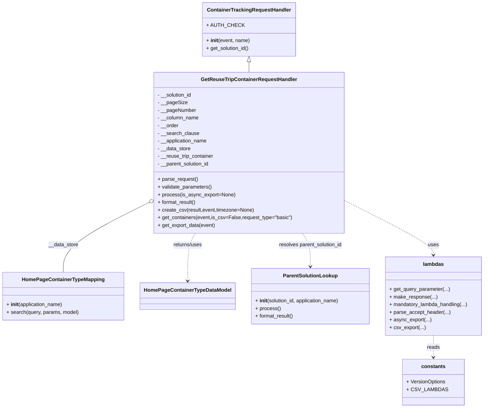
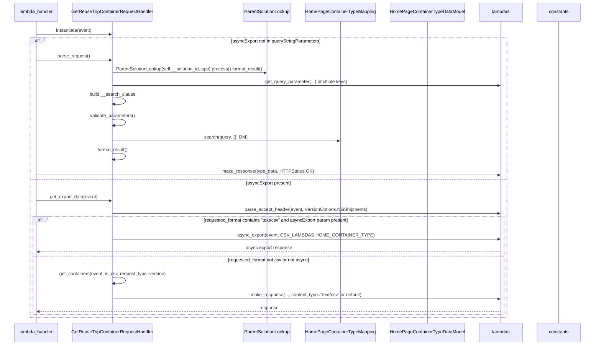

# Diagram: container_tracking_core/container_tracking_service/container_tracking_service/api/container_type_in_homepage/home_page_container_type_handler.py

> Auto-generated by Obscura crawlers

## Diagram 1

### SVG

<svg id="container" width="1502.53125" xmlns="http://www.w3.org/2000/svg" class="classDiagram" height="1300" viewBox="0 0 1502.53125 1300" role="graphics-document document" aria-roledescription="class"><g><defs><marker id="container_class-aggregationStart" class="marker aggregation class" refX="18" refY="7" markerWidth="190" markerHeight="240" orient="auto"><path d="M 18,7 L9,13 L1,7 L9,1 Z"></path></marker></defs><defs><marker id="container_class-aggregationEnd" class="marker aggregation class" refX="1" refY="7" markerWidth="20" markerHeight="28" orient="auto"><path d="M 18,7 L9,13 L1,7 L9,1 Z"></path></marker></defs><defs><marker id="container_class-extensionStart" class="marker extension class" refX="18" refY="7" markerWidth="190" markerHeight="240" orient="auto"><path d="M 1,7 L18,13 V 1 Z"></path></marker></defs><defs><marker id="container_class-extensionEnd" class="marker extension class" refX="1" refY="7" markerWidth="20" markerHeight="28" orient="auto"><path d="M 1,1 V 13 L18,7 Z"></path></marker></defs><defs><marker id="container_class-compositionStart" class="marker composition class" refX="18" refY="7" markerWidth="190" markerHeight="240" orient="auto"><path d="M 18,7 L9,13 L1,7 L9,1 Z"></path></marker></defs><defs><marker id="container_class-compositionEnd" class="marker composition class" refX="1" refY="7" markerWidth="20" markerHeight="28" orient="auto"><path d="M 18,7 L9,13 L1,7 L9,1 Z"></path></marker></defs><defs><marker id="container_class-dependencyStart" class="marker dependency class" refX="6" refY="7" markerWidth="190" markerHeight="240" orient="auto"><path d="M 5,7 L9,13 L1,7 L9,1 Z"></path></marker></defs><defs><marker id="container_class-dependencyEnd" class="marker dependency class" refX="13" refY="7" markerWidth="20" markerHeight="28" orient="auto"><path d="M 18,7 L9,13 L14,7 L9,1 Z"></path></marker></defs><defs><marker id="container_class-lollipopStart" class="marker lollipop class" refX="13" refY="7" markerWidth="190" markerHeight="240" orient="auto"><circle stroke="black" fill="transparent" cx="7" cy="7" r="6"></circle></marker></defs><defs><marker id="container_class-lollipopEnd" class="marker lollipop class" refX="1" refY="7" markerWidth="190" markerHeight="240" orient="auto"><circle stroke="black" fill="transparent" cx="7" cy="7" r="6"></circle></marker></defs><g class="root"><g class="clusters"></g><g class="edgePaths"><path d="M764.584,193.25L764.584,194.542C764.584,195.833,764.584,198.417,764.584,203.875C764.584,209.333,764.584,217.667,764.584,221.833L764.584,226" id="id_ContainerTrackingRequestHandler_GetReuseTripContainerRequestHandler_1" class="edge-thickness-normal edge-pattern-solid relation" style=";;;" data-edge="true" data-et="edge" data-id="id_ContainerTrackingRequestHandler_GetReuseTripContainerRequestHandler_1" data-points="W3sieCI6NzY0LjU4Mzk4NDM3NSwieSI6MTc2fSx7IngiOjc2NC41ODM5ODQzNzUsInkiOjIwMX0seyJ4Ijo3NjQuNTgzOTg0Mzc1LCJ5IjoyMjZ9XQ==" marker-start="url(#container_class-extensionStart)"></path><path d="M456.68,640.68L413.047,663.734C369.414,686.787,282.148,732.893,238.516,772.113C194.883,811.333,194.883,843.667,194.883,859.833L194.883,876" id="id_GetReuseTripContainerRequestHandler_HomePageContainerTypeMapping_2" class="edge-thickness-normal edge-pattern-solid relation" style=";;;" data-edge="true" data-et="edge" data-id="id_GetReuseTripContainerRequestHandler_HomePageContainerTypeMapping_2" data-points="W3sieCI6NDcxLjkzMTY0MDYyNSwieSI6NjMyLjYyMjAzNjYzNTE2MDN9LHsieCI6MTk0Ljg4MjgxMjUsInkiOjc3OX0seyJ4IjoxOTQuODgyODEyNSwieSI6ODc2fV0=" marker-start="url(#container_class-aggregationStart)"></path><path d="M605.575,730L600.422,738.167C595.269,746.333,584.962,762.667,579.809,791.5C574.656,820.333,574.656,861.667,574.656,882.333L574.656,903" id="id_GetReuseTripContainerRequestHandler_HomePageContainerTypeDataModel_3" class="edge-thickness-normal edge-pattern-dashed relation" style=";;;" data-edge="true" data-et="edge" data-id="id_GetReuseTripContainerRequestHandler_HomePageContainerTypeDataModel_3" data-points="W3sieCI6NjA1LjU3NDcxODM4NjYyNzksInkiOjczMH0seyJ4Ijo1NzQuNjU2MjUsInkiOjc3OX0seyJ4Ijo1NzQuNjU2MjUsInkiOjkwOX1d" marker-end="url(#container_class-dependencyEnd)"></path><path d="M923.593,730L928.746,738.167C933.899,746.333,944.206,762.667,949.359,784C954.512,805.333,954.512,831.667,954.512,844.833L954.512,858" id="id_GetReuseTripContainerRequestHandler_ParentSolutionLookup_4" class="edge-thickness-normal edge-pattern-dashed relation" style=";;;" data-edge="true" data-et="edge" data-id="id_GetReuseTripContainerRequestHandler_ParentSolutionLookup_4" data-points="W3sieCI6OTIzLjU5MzI1MDM2MzM3MjEsInkiOjczMH0seyJ4Ijo5NTQuNTExNzE4NzUsInkiOjc3OX0seyJ4Ijo5NTQuNTExNzE4NzUsInkiOjg2NH1d" marker-end="url(#container_class-dependencyEnd)"></path><path d="M1057.236,630.291L1104.864,655.076C1152.492,679.861,1247.748,729.43,1295.376,761.382C1343.004,793.333,1343.004,807.667,1343.004,814.833L1343.004,822" id="id_GetReuseTripContainerRequestHandler_lambdas_5" class="edge-thickness-normal edge-pattern-dashed relation" style=";;;" data-edge="true" data-et="edge" data-id="id_GetReuseTripContainerRequestHandler_lambdas_5" data-points="W3sieCI6MTA1Ny4yMzYzMjgxMjUsInkiOjYzMC4yOTEzNTgxMjQ3NDA0fSx7IngiOjEzNDMuMDAzOTA2MjUsInkiOjc3OX0seyJ4IjoxMzQzLjAwMzkwNjI1LCJ5Ijo4Mjh9XQ==" marker-end="url(#container_class-dependencyEnd)"></path><path d="M1343.004,1074L1343.004,1080.167C1343.004,1086.333,1343.004,1098.667,1343.004,1110C1343.004,1121.333,1343.004,1131.667,1343.004,1136.833L1343.004,1142" id="id_lambdas_constants_6" class="edge-thickness-normal edge-pattern-dashed relation" style=";;;" data-edge="true" data-et="edge" data-id="id_lambdas_constants_6" data-points="W3sieCI6MTM0My4wMDM5MDYyNSwieSI6MTA3NH0seyJ4IjoxMzQzLjAwMzkwNjI1LCJ5IjoxMTExfSx7IngiOjEzNDMuMDAzOTA2MjUsInkiOjExNDh9XQ==" marker-end="url(#container_class-dependencyEnd)"></path></g><g class="edgeLabels"><g class="edgeLabel"><g class="label" data-id="id_ContainerTrackingRequestHandler_GetReuseTripContainerRequestHandler_1" transform="translate(0, 0)"><foreignObject width="0" height="0">

</foreignObject></g></g><g class="edgeLabel" transform="translate(194.8828125, 779)"><g class="label" data-id="id_GetReuseTripContainerRequestHandler_HomePageContainerTypeMapping_2" transform="translate(-46.9453125, -12)"><foreignObject width="93.890625" height="24">

__data_store

</foreignObject></g></g><g class="edgeLabel" transform="translate(574.65625, 779)"><g class="label" data-id="id_GetReuseTripContainerRequestHandler_HomePageContainerTypeDataModel_3" transform="translate(-46.6796875, -12)"><foreignObject width="93.359375" height="24">

returns/uses

</foreignObject></g></g><g class="edgeLabel" transform="translate(954.51171875, 779)"><g class="label" data-id="id_GetReuseTripContainerRequestHandler_ParentSolutionLookup_4" transform="translate(-100, -24)"><foreignObject width="200" height="48">

resolves parent_solution_id

</foreignObject></g></g><g class="edgeLabel" transform="translate(1343.00390625, 779)"><g class="label" data-id="id_GetReuseTripContainerRequestHandler_lambdas_5" transform="translate(-16.4921875, -12)"><foreignObject width="32.984375" height="24">

uses

</foreignObject></g></g><g class="edgeLabel" transform="translate(1343.00390625, 1111)"><g class="label" data-id="id_lambdas_constants_6" transform="translate(-20.0078125, -12)"><foreignObject width="40.015625" height="24">

reads

</foreignObject></g></g></g><g class="nodes"><g class="node default" id="classId-ContainerTrackingRequestHandler-0" transform="translate(764.583984375, 92)"><g class="basic label-container"><path d="M-142.81640625 -84 L142.81640625 -84 L142.81640625 84 L-142.81640625 84" stroke="none" stroke-width="0" fill="#ECECFF" style=""></path><path d="M-142.81640625 -84 C-64.04884893767725 -84, 14.718708374645502 -84, 142.81640625 -84 M-142.81640625 -84 C-68.4524470555613 -84, 5.911512138877413 -84, 142.81640625 -84 M142.81640625 -84 C142.81640625 -29.99062279003234, 142.81640625 24.01875441993532, 142.81640625 84 M142.81640625 -84 C142.81640625 -18.678316772496075, 142.81640625 46.64336645500785, 142.81640625 84 M142.81640625 84 C80.89233574613577 84, 18.968265242271542 84, -142.81640625 84 M142.81640625 84 C75.87085667892374 84, 8.925307107847487 84, -142.81640625 84 M-142.81640625 84 C-142.81640625 40.6094996417302, -142.81640625 -2.7810007165395945, -142.81640625 -84 M-142.81640625 84 C-142.81640625 27.530776984263206, -142.81640625 -28.93844603147359, -142.81640625 -84" stroke="#9370DB" stroke-width="1.3" fill="none" stroke-dasharray="0 0" style=""></path></g><g class="annotation-group text" transform="translate(0, -60)"></g><g class="label-group text" transform="translate(-125.5859375, -60)"><g class="label" style="font-weight: bolder" transform="translate(0,-12)"><foreignObject width="251.171875" height="24">

ContainerTrackingRequestHandler

</foreignObject></g></g><g class="members-group text" transform="translate(-130.81640625, -12)"><g class="label" style="" transform="translate(0,-12)"><foreignObject width="105.25" height="24">

+ AUTH_CHECK

</foreignObject></g></g><g class="methods-group text" transform="translate(-130.81640625, 36)"><g class="label" style="" transform="translate(0,-12)"><foreignObject width="136.046875" height="24">

+ <strong>init</strong>(event, name)

</foreignObject></g><g class="label" style="" transform="translate(0,12)"><foreignObject width="135.703125" height="24">

+ get_solution_id()

</foreignObject></g></g><g class="divider" style=""><path d="M-142.81640625 -36 C-69.49131192736783 -36, 3.833782395264336 -36, 142.81640625 -36 M-142.81640625 -36 C-47.15895639817924 -36, 48.498493453641515 -36, 142.81640625 -36" stroke="#9370DB" stroke-width="1.3" fill="none" stroke-dasharray="0 0" style=""></path></g><g class="divider" style=""><path d="M-142.81640625 12 C-83.6700242397956 12, -24.523642229591175 12, 142.81640625 12 M-142.81640625 12 C-53.48333114875673 12, 35.849743952486534 12, 142.81640625 12" stroke="#9370DB" stroke-width="1.3" fill="none" stroke-dasharray="0 0" style=""></path></g></g><g class="node default" id="classId-GetReuseTripContainerRequestHandler-1" transform="translate(764.583984375, 478)"><g class="basic label-container"><path d="M-292.65234375 -252 L292.65234375 -252 L292.65234375 252 L-292.65234375 252" stroke="none" stroke-width="0" fill="#ECECFF" style=""></path><path d="M-292.65234375 -252 C-110.70779613262232 -252, 71.23675148475536 -252, 292.65234375 -252 M-292.65234375 -252 C-133.7746982332276 -252, 25.10294728354478 -252, 292.65234375 -252 M292.65234375 -252 C292.65234375 -62.87823248370563, 292.65234375 126.24353503258874, 292.65234375 252 M292.65234375 -252 C292.65234375 -84.28060256241281, 292.65234375 83.43879487517438, 292.65234375 252 M292.65234375 252 C157.38646083027186 252, 22.120577910543716 252, -292.65234375 252 M292.65234375 252 C89.62037283851961 252, -113.41159807296077 252, -292.65234375 252 M-292.65234375 252 C-292.65234375 112.3342529030817, -292.65234375 -27.33149419383659, -292.65234375 -252 M-292.65234375 252 C-292.65234375 115.0998691446533, -292.65234375 -21.800261710693405, -292.65234375 -252" stroke="#9370DB" stroke-width="1.3" fill="none" stroke-dasharray="0 0" style=""></path></g><g class="annotation-group text" transform="translate(0, -228)"></g><g class="label-group text" transform="translate(-143.7421875, -228)"><g class="label" style="font-weight: bolder" transform="translate(0,-12)"><foreignObject width="287.484375" height="24">

GetReuseTripContainerRequestHandler

</foreignObject></g></g><g class="members-group text" transform="translate(-280.65234375, -180)"><g class="label" style="" transform="translate(0,-12)"><foreignObject width="109.40625" height="24">

- __solution_id

</foreignObject></g><g class="label" style="" transform="translate(0,12)"><foreignObject width="90.6875" height="24">

- __pageSize

</foreignObject></g><g class="label" style="" transform="translate(0,36)"><foreignObject width="120.203125" height="24">

- __pageNumber

</foreignObject></g><g class="label" style="" transform="translate(0,60)"><foreignObject width="129.453125" height="24">

- __column_name

</foreignObject></g><g class="label" style="" transform="translate(0,84)"><foreignObject width="66.359375" height="24">

- __order

</foreignObject></g><g class="label" style="" transform="translate(0,108)"><foreignObject width="129.09375" height="24">

- __search_clause

</foreignObject></g><g class="label" style="" transform="translate(0,132)"><foreignObject width="157.796875" height="24">

- __application_name

</foreignObject></g><g class="label" style="" transform="translate(0,156)"><foreignObject width="104.578125" height="24">

- __data_store

</foreignObject></g><g class="label" style="" transform="translate(0,180)"><foreignObject width="177.625" height="24">

- __reuse_trip_container

</foreignObject></g><g class="label" style="" transform="translate(0,204)"><foreignObject width="165.34375" height="24">

- __parent_solution_id

</foreignObject></g></g><g class="methods-group text" transform="translate(-280.65234375, 84)"><g class="label" style="" transform="translate(0,-12)"><foreignObject width="126.046875" height="24">

+ parse_request()

</foreignObject></g><g class="label" style="" transform="translate(0,12)"><foreignObject width="170.953125" height="24">

+ validate_parameters()

</foreignObject></g><g class="label" style="" transform="translate(0,36)"><foreignObject width="239.78125" height="24">

+ process(is_async_export=None)

</foreignObject></g><g class="label" style="" transform="translate(0,60)"><foreignObject width="121.5" height="24">

+ format_result()

</foreignObject></g><g class="label" style="" transform="translate(0,84)"><foreignObject width="300.328125" height="24">

+ create_csv(result,event,timezone=None)

</foreignObject></g><g class="label" style="" transform="translate(0,108)"><foreignObject width="417.5625" height="24">

+ get_containers(event,is_csv=False,request_type="basic")

</foreignObject></g><g class="label" style="" transform="translate(0,132)"><foreignObject width="181.265625" height="24">

+ get_export_data(event)

</foreignObject></g></g><g class="divider" style=""><path d="M-292.65234375 -204 C-118.27987205802606 -204, 56.092599633947884 -204, 292.65234375 -204 M-292.65234375 -204 C-85.71079193298303 -204, 121.23075988403394 -204, 292.65234375 -204" stroke="#9370DB" stroke-width="1.3" fill="none" stroke-dasharray="0 0" style=""></path></g><g class="divider" style=""><path d="M-292.65234375 60 C-168.93118594086147 60, -45.210028131722936 60, 292.65234375 60 M-292.65234375 60 C-96.68527885738473 60, 99.28178603523054 60, 292.65234375 60" stroke="#9370DB" stroke-width="1.3" fill="none" stroke-dasharray="0 0" style=""></path></g></g><g class="node default" id="classId-HomePageContainerTypeMapping-2" transform="translate(194.8828125, 951)"><g class="basic label-container"><path d="M-186.8828125 -75 L186.8828125 -75 L186.8828125 75 L-186.8828125 75" stroke="none" stroke-width="0" fill="#ECECFF" style=""></path><path d="M-186.8828125 -75 C-50.88927340889589 -75, 85.10426568220822 -75, 186.8828125 -75 M-186.8828125 -75 C-53.46045915378656 -75, 79.96189419242688 -75, 186.8828125 -75 M186.8828125 -75 C186.8828125 -30.570699909107383, 186.8828125 13.858600181785235, 186.8828125 75 M186.8828125 -75 C186.8828125 -43.75202517357796, 186.8828125 -12.504050347155918, 186.8828125 75 M186.8828125 75 C46.38164751602639 75, -94.11951746794722 75, -186.8828125 75 M186.8828125 75 C66.04221923819881 75, -54.79837402360238 75, -186.8828125 75 M-186.8828125 75 C-186.8828125 15.282373713645548, -186.8828125 -44.435252572708904, -186.8828125 -75 M-186.8828125 75 C-186.8828125 35.78360646305756, -186.8828125 -3.4327870738848816, -186.8828125 -75" stroke="#9370DB" stroke-width="1.3" fill="none" stroke-dasharray="0 0" style=""></path></g><g class="annotation-group text" transform="translate(0, -51)"></g><g class="label-group text" transform="translate(-122.953125, -51)"><g class="label" style="font-weight: bolder" transform="translate(0,-12)"><foreignObject width="245.90625" height="24">

HomePageContainerTypeMapping

</foreignObject></g></g><g class="members-group text" transform="translate(-174.8828125, -3)"></g><g class="methods-group text" transform="translate(-174.8828125, 27)"><g class="label" style="" transform="translate(0,-12)"><foreignObject width="177.984375" height="24">

+ <strong>init</strong>(application_name)

</foreignObject></g><g class="label" style="" transform="translate(0,12)"><foreignObject width="226.8125" height="24">

+ search(query, params, model)

</foreignObject></g></g><g class="divider" style=""><path d="M-186.8828125 -27 C-81.4253865644457 -27, 24.032039371108596 -27, 186.8828125 -27 M-186.8828125 -27 C-110.72493688033622 -27, -34.56706126067243 -27, 186.8828125 -27" stroke="#9370DB" stroke-width="1.3" fill="none" stroke-dasharray="0 0" style=""></path></g><g class="divider" style=""><path d="M-186.8828125 -3 C-72.5680376892989 -3, 41.74673712140219 -3, 186.8828125 -3 M-186.8828125 -3 C-49.124272782773716 -3, 88.63426693445257 -3, 186.8828125 -3" stroke="#9370DB" stroke-width="1.3" fill="none" stroke-dasharray="0 0" style=""></path></g></g><g class="node default" id="classId-HomePageContainerTypeDataModel-3" transform="translate(574.65625, 951)"><g class="basic label-container"><path d="M-142.890625 -42 L142.890625 -42 L142.890625 42 L-142.890625 42" stroke="none" stroke-width="0" fill="#ECECFF" style=""></path><path d="M-142.890625 -42 C-83.43028777462659 -42, -23.969950549253184 -42, 142.890625 -42 M-142.890625 -42 C-65.39960975675473 -42, 12.091405486490544 -42, 142.890625 -42 M142.890625 -42 C142.890625 -12.073960855133365, 142.890625 17.85207828973327, 142.890625 42 M142.890625 -42 C142.890625 -8.852346182906288, 142.890625 24.295307634187424, 142.890625 42 M142.890625 42 C34.05303136669876 42, -74.78456226660248 42, -142.890625 42 M142.890625 42 C41.26165905901158 42, -60.367306881976845 42, -142.890625 42 M-142.890625 42 C-142.890625 15.576177217208727, -142.890625 -10.847645565582546, -142.890625 -42 M-142.890625 42 C-142.890625 15.71333515193518, -142.890625 -10.57332969612964, -142.890625 -42" stroke="#9370DB" stroke-width="1.3" fill="none" stroke-dasharray="0 0" style=""></path></g><g class="annotation-group text" transform="translate(0, -18)"></g><g class="label-group text" transform="translate(-130.890625, -18)"><g class="label" style="font-weight: bolder" transform="translate(0,-12)"><foreignObject width="261.78125" height="24">

HomePageContainerTypeDataModel

</foreignObject></g></g><g class="members-group text" transform="translate(-130.890625, 30)"></g><g class="methods-group text" transform="translate(-130.890625, 60)"></g><g class="divider" style=""><path d="M-142.890625 6 C-73.87103068710869 6, -4.851436374217371 6, 142.890625 6 M-142.890625 6 C-65.41502458264704 6, 12.06057583470593 6, 142.890625 6" stroke="#9370DB" stroke-width="1.3" fill="none" stroke-dasharray="0 0" style=""></path></g><g class="divider" style=""><path d="M-142.890625 24 C-74.94703210178339 24, -7.003439203566785 24, 142.890625 24 M-142.890625 24 C-72.85429878420244 24, -2.8179725684048833 24, 142.890625 24" stroke="#9370DB" stroke-width="1.3" fill="none" stroke-dasharray="0 0" style=""></path></g></g><g class="node default" id="classId-ParentSolutionLookup-4" transform="translate(954.51171875, 951)"><g class="basic label-container"><path d="M-186.96484375 -87 L186.96484375 -87 L186.96484375 87 L-186.96484375 87" stroke="none" stroke-width="0" fill="#ECECFF" style=""></path><path d="M-186.96484375 -87 C-48.39009297877848 -87, 90.18465779244303 -87, 186.96484375 -87 M-186.96484375 -87 C-51.31235530421242 -87, 84.34013314157517 -87, 186.96484375 -87 M186.96484375 -87 C186.96484375 -45.696090675174084, 186.96484375 -4.392181350348167, 186.96484375 87 M186.96484375 -87 C186.96484375 -43.05042275160351, 186.96484375 0.8991544967929741, 186.96484375 87 M186.96484375 87 C80.6063870423621 87, -25.752069665275798 87, -186.96484375 87 M186.96484375 87 C69.37033481828412 87, -48.22417411343176 87, -186.96484375 87 M-186.96484375 87 C-186.96484375 21.98268269061326, -186.96484375 -43.03463461877348, -186.96484375 -87 M-186.96484375 87 C-186.96484375 42.95071140007208, -186.96484375 -1.0985771998558391, -186.96484375 -87" stroke="#9370DB" stroke-width="1.3" fill="none" stroke-dasharray="0 0" style=""></path></g><g class="annotation-group text" transform="translate(0, -63)"></g><g class="label-group text" transform="translate(-81.6328125, -63)"><g class="label" style="font-weight: bolder" transform="translate(0,-12)"><foreignObject width="163.265625" height="24">

ParentSolutionLookup

</foreignObject></g></g><g class="members-group text" transform="translate(-174.96484375, -15)"></g><g class="methods-group text" transform="translate(-174.96484375, 15)"><g class="label" style="" transform="translate(0,-12)"><foreignObject width="268.296875" height="24">

+ <strong>init</strong>(solution_id, application_name)

</foreignObject></g><g class="label" style="" transform="translate(0,12)"><foreignObject width="77.96875" height="24">

+ process()

</foreignObject></g><g class="label" style="" transform="translate(0,36)"><foreignObject width="121.5" height="24">

+ format_result()

</foreignObject></g></g><g class="divider" style=""><path d="M-186.96484375 -39 C-76.78859918696568 -39, 33.38764537606863 -39, 186.96484375 -39 M-186.96484375 -39 C-95.09965789941094 -39, -3.2344720488218854 -39, 186.96484375 -39" stroke="#9370DB" stroke-width="1.3" fill="none" stroke-dasharray="0 0" style=""></path></g><g class="divider" style=""><path d="M-186.96484375 -15 C-91.59974328744359 -15, 3.7653571751128254 -15, 186.96484375 -15 M-186.96484375 -15 C-102.73624147586067 -15, -18.507639201721332 -15, 186.96484375 -15" stroke="#9370DB" stroke-width="1.3" fill="none" stroke-dasharray="0 0" style=""></path></g></g><g class="node default" id="classId-lambdas-5" transform="translate(1343.00390625, 951)"><g class="basic label-container"><path d="M-151.52734375 -123 L151.52734375 -123 L151.52734375 123 L-151.52734375 123" stroke="none" stroke-width="0" fill="#ECECFF" style=""></path><path d="M-151.52734375 -123 C-43.9365974741753 -123, 63.6541488016494 -123, 151.52734375 -123 M-151.52734375 -123 C-46.863866420047756 -123, 57.79961090990449 -123, 151.52734375 -123 M151.52734375 -123 C151.52734375 -26.050294520715994, 151.52734375 70.89941095856801, 151.52734375 123 M151.52734375 -123 C151.52734375 -40.1653065304711, 151.52734375 42.6693869390578, 151.52734375 123 M151.52734375 123 C58.6528265103568 123, -34.221690729286394 123, -151.52734375 123 M151.52734375 123 C33.39597137780551 123, -84.73540099438898 123, -151.52734375 123 M-151.52734375 123 C-151.52734375 57.469986104477144, -151.52734375 -8.060027791045712, -151.52734375 -123 M-151.52734375 123 C-151.52734375 24.755509197222167, -151.52734375 -73.48898160555567, -151.52734375 -123" stroke="#9370DB" stroke-width="1.3" fill="none" stroke-dasharray="0 0" style=""></path></g><g class="annotation-group text" transform="translate(0, -99)"></g><g class="label-group text" transform="translate(-31.2265625, -99)"><g class="label" style="font-weight: bolder" transform="translate(0,-12)"><foreignObject width="62.453125" height="24">

lambdas

</foreignObject></g></g><g class="members-group text" transform="translate(-139.52734375, -51)"></g><g class="methods-group text" transform="translate(-139.52734375, -21)"><g class="label" style="" transform="translate(0,-12)"><foreignObject width="189.40625" height="24">

+ get_query_parameter(...)

</foreignObject></g><g class="label" style="" transform="translate(0,12)"><foreignObject width="147.609375" height="24">

+ make_response(...)

</foreignObject></g><g class="label" style="" transform="translate(0,36)"><foreignObject width="247.828125" height="24">

+ mandatory_lambda_handling(...)

</foreignObject></g><g class="label" style="" transform="translate(0,60)"><foreignObject width="188.765625" height="24">

+ parse_accept_header(...)

</foreignObject></g><g class="label" style="" transform="translate(0,84)"><foreignObject width="129.890625" height="24">

+ async_export(...)

</foreignObject></g><g class="label" style="" transform="translate(0,108)"><foreignObject width="111.5" height="24">

+ csv_export(...)

</foreignObject></g></g><g class="divider" style=""><path d="M-151.52734375 -75 C-89.46919184945709 -75, -27.41103994891418 -75, 151.52734375 -75 M-151.52734375 -75 C-70.13114616630322 -75, 11.26505141739355 -75, 151.52734375 -75" stroke="#9370DB" stroke-width="1.3" fill="none" stroke-dasharray="0 0" style=""></path></g><g class="divider" style=""><path d="M-151.52734375 -51 C-66.01760580468917 -51, 19.492132140621663 -51, 151.52734375 -51 M-151.52734375 -51 C-49.57479296552073 -51, 52.37775781895854 -51, 151.52734375 -51" stroke="#9370DB" stroke-width="1.3" fill="none" stroke-dasharray="0 0" style=""></path></g></g><g class="node default" id="classId-constants-6" transform="translate(1343.00390625, 1220)"><g class="basic label-container"><path d="M-91.45703125 -72 L91.45703125 -72 L91.45703125 72 L-91.45703125 72" stroke="none" stroke-width="0" fill="#ECECFF" style=""></path><path d="M-91.45703125 -72 C-43.46584433006262 -72, 4.525342589874754 -72, 91.45703125 -72 M-91.45703125 -72 C-38.96156884744329 -72, 13.533893555113423 -72, 91.45703125 -72 M91.45703125 -72 C91.45703125 -40.221447723820226, 91.45703125 -8.442895447640453, 91.45703125 72 M91.45703125 -72 C91.45703125 -28.72845744651702, 91.45703125 14.543085106965961, 91.45703125 72 M91.45703125 72 C31.650112198137215 72, -28.15680685372557 72, -91.45703125 72 M91.45703125 72 C28.980155736679635 72, -33.49671977664073 72, -91.45703125 72 M-91.45703125 72 C-91.45703125 24.606466996584828, -91.45703125 -22.787066006830344, -91.45703125 -72 M-91.45703125 72 C-91.45703125 19.75540698942411, -91.45703125 -32.48918602115178, -91.45703125 -72" stroke="#9370DB" stroke-width="1.3" fill="none" stroke-dasharray="0 0" style=""></path></g><g class="annotation-group text" transform="translate(0, -48)"></g><g class="label-group text" transform="translate(-35.7734375, -48)"><g class="label" style="font-weight: bolder" transform="translate(0,-12)"><foreignObject width="71.546875" height="24">

constants

</foreignObject></g></g><g class="members-group text" transform="translate(-79.45703125, 0)"><g class="label" style="" transform="translate(0,-12)"><foreignObject width="123.140625" height="24">

+ VersionOptions

</foreignObject></g><g class="label" style="" transform="translate(0,12)"><foreignObject width="113.1875" height="24">

+ CSV_LAMBDAS

</foreignObject></g></g><g class="methods-group text" transform="translate(-79.45703125, 72)"></g><g class="divider" style=""><path d="M-91.45703125 -24 C-41.53517382328113 -24, 8.386683603437746 -24, 91.45703125 -24 M-91.45703125 -24 C-25.707041871101367 -24, 40.042947507797265 -24, 91.45703125 -24" stroke="#9370DB" stroke-width="1.3" fill="none" stroke-dasharray="0 0" style=""></path></g><g class="divider" style=""><path d="M-91.45703125 48 C-25.21355772041518 48, 41.02991580916964 48, 91.45703125 48 M-91.45703125 48 C-33.913931560328294 48, 23.629168129343412 48, 91.45703125 48" stroke="#9370DB" stroke-width="1.3" fill="none" stroke-dasharray="0 0" style=""></path></g></g></g></g></g></svg>

## Diagram 2

### SVG

<svg id="container" width="2174" xmlns="http://www.w3.org/2000/svg" height="1259" viewBox="-50 -10 2174 1259" role="graphics-document document" aria-roledescription="sequence"><g><rect x="1924" y="1173" fill="#eaeaea" stroke="#666" width="150" height="65" name="CONST" rx="3" ry="3" class="actor actor-bottom"></rect><text x="1999" y="1205.5" dominant-baseline="central" alignment-baseline="central" class="actor actor-box" style="text-anchor: middle; font-size: 16px; font-weight: 400;"><tspan x="1999" dy="0">constants</tspan></text></g><g><rect x="1724" y="1173" fill="#eaeaea" stroke="#666" width="150" height="65" name="UTIL" rx="3" ry="3" class="actor actor-bottom"></rect><text x="1799" y="1205.5" dominant-baseline="central" alignment-baseline="central" class="actor actor-box" style="text-anchor: middle; font-size: 16px; font-weight: 400;"><tspan x="1799" dy="0">lambdas</tspan></text></g><g><rect x="1395" y="1173" fill="#eaeaea" stroke="#666" width="279" height="65" name="DM" rx="3" ry="3" class="actor actor-bottom"></rect><text x="1534.5" y="1205.5" dominant-baseline="central" alignment-baseline="central" class="actor actor-box" style="text-anchor: middle; font-size: 16px; font-weight: 400;"><tspan x="1534.5" dy="0">HomePageContainerTypeDataModel</tspan></text></g><g><rect x="1081" y="1173" fill="#eaeaea" stroke="#666" width="264" height="65" name="DS" rx="3" ry="3" class="actor actor-bottom"></rect><text x="1213" y="1205.5" dominant-baseline="central" alignment-baseline="central" class="actor actor-box" style="text-anchor: middle; font-size: 16px; font-weight: 400;"><tspan x="1213" dy="0">HomePageContainerTypeMapping</tspan></text></g><g><rect x="850" y="1173" fill="#eaeaea" stroke="#666" width="181" height="65" name="P" rx="3" ry="3" class="actor actor-bottom"></rect><text x="940.5" y="1205.5" dominant-baseline="central" alignment-baseline="central" class="actor actor-box" style="text-anchor: middle; font-size: 16px; font-weight: 400;"><tspan x="940.5" dy="0">ParentSolutionLookup</tspan></text></g><g><rect x="200" y="1173" fill="#eaeaea" stroke="#666" width="305" height="65" name="RH" rx="3" ry="3" class="actor actor-bottom"></rect><text x="352.5" y="1205.5" dominant-baseline="central" alignment-baseline="central" class="actor actor-box" style="text-anchor: middle; font-size: 16px; font-weight: 400;"><tspan x="352.5" dy="0">GetReuseTripContainerRequestHandler</tspan></text></g><g><rect x="0" y="1173" fill="#eaeaea" stroke="#666" width="150" height="65" name="LAMBDA" rx="3" ry="3" class="actor actor-bottom"></rect><text x="75" y="1205.5" dominant-baseline="central" alignment-baseline="central" class="actor actor-box" style="text-anchor: middle; font-size: 16px; font-weight: 400;"><tspan x="75" dy="0">lambda_handler</tspan></text></g><g><line id="actor6" x1="1999" y1="65" x2="1999" y2="1173" class="actor-line 200" stroke-width="0.5px" stroke="#999" name="CONST"></line><g id="root-6"><rect x="1924" y="0" fill="#eaeaea" stroke="#666" width="150" height="65" name="CONST" rx="3" ry="3" class="actor actor-top"></rect><text x="1999" y="32.5" dominant-baseline="central" alignment-baseline="central" class="actor actor-box" style="text-anchor: middle; font-size: 16px; font-weight: 400;"><tspan x="1999" dy="0">constants</tspan></text></g></g><g><line id="actor5" x1="1799" y1="65" x2="1799" y2="1173" class="actor-line 200" stroke-width="0.5px" stroke="#999" name="UTIL"></line><g id="root-5"><rect x="1724" y="0" fill="#eaeaea" stroke="#666" width="150" height="65" name="UTIL" rx="3" ry="3" class="actor actor-top"></rect><text x="1799" y="32.5" dominant-baseline="central" alignment-baseline="central" class="actor actor-box" style="text-anchor: middle; font-size: 16px; font-weight: 400;"><tspan x="1799" dy="0">lambdas</tspan></text></g></g><g><line id="actor4" x1="1534.5" y1="65" x2="1534.5" y2="1173" class="actor-line 200" stroke-width="0.5px" stroke="#999" name="DM"></line><g id="root-4"><rect x="1395" y="0" fill="#eaeaea" stroke="#666" width="279" height="65" name="DM" rx="3" ry="3" class="actor actor-top"></rect><text x="1534.5" y="32.5" dominant-baseline="central" alignment-baseline="central" class="actor actor-box" style="text-anchor: middle; font-size: 16px; font-weight: 400;"><tspan x="1534.5" dy="0">HomePageContainerTypeDataModel</tspan></text></g></g><g><line id="actor3" x1="1213" y1="65" x2="1213" y2="1173" class="actor-line 200" stroke-width="0.5px" stroke="#999" name="DS"></line><g id="root-3"><rect x="1081" y="0" fill="#eaeaea" stroke="#666" width="264" height="65" name="DS" rx="3" ry="3" class="actor actor-top"></rect><text x="1213" y="32.5" dominant-baseline="central" alignment-baseline="central" class="actor actor-box" style="text-anchor: middle; font-size: 16px; font-weight: 400;"><tspan x="1213" dy="0">HomePageContainerTypeMapping</tspan></text></g></g><g><line id="actor2" x1="940.5" y1="65" x2="940.5" y2="1173" class="actor-line 200" stroke-width="0.5px" stroke="#999" name="P"></line><g id="root-2"><rect x="850" y="0" fill="#eaeaea" stroke="#666" width="181" height="65" name="P" rx="3" ry="3" class="actor actor-top"></rect><text x="940.5" y="32.5" dominant-baseline="central" alignment-baseline="central" class="actor actor-box" style="text-anchor: middle; font-size: 16px; font-weight: 400;"><tspan x="940.5" dy="0">ParentSolutionLookup</tspan></text></g></g><g><line id="actor1" x1="352.5" y1="65" x2="352.5" y2="1173" class="actor-line 200" stroke-width="0.5px" stroke="#999" name="RH"></line><g id="root-1"><rect x="200" y="0" fill="#eaeaea" stroke="#666" width="305" height="65" name="RH" rx="3" ry="3" class="actor actor-top"></rect><text x="352.5" y="32.5" dominant-baseline="central" alignment-baseline="central" class="actor actor-box" style="text-anchor: middle; font-size: 16px; font-weight: 400;"><tspan x="352.5" dy="0">GetReuseTripContainerRequestHandler</tspan></text></g></g><g><line id="actor0" x1="75" y1="65" x2="75" y2="1173" class="actor-line 200" stroke-width="0.5px" stroke="#999" name="LAMBDA"></line><g id="root-0"><rect x="0" y="0" fill="#eaeaea" stroke="#666" width="150" height="65" name="LAMBDA" rx="3" ry="3" class="actor actor-top"></rect><text x="75" y="32.5" dominant-baseline="central" alignment-baseline="central" class="actor actor-box" style="text-anchor: middle; font-size: 16px; font-weight: 400;"><tspan x="75" dy="0">lambda_handler</tspan></text></g></g><g></g><defs><symbol id="computer" width="24" height="24"><path transform="scale(.5)" d="M2 2v13h20v-13h-20zm18 11h-16v-9h16v9zm-10.228 6l.466-1h3.524l.467 1h-4.457zm14.228 3h-24l2-6h2.104l-1.33 4h18.45l-1.297-4h2.073l2 6zm-5-10h-14v-7h14v7z"></path></symbol></defs><defs><symbol id="database" fill-rule="evenodd" clip-rule="evenodd"><path transform="scale(.5)" d="M12.258.001l.256.004.255.005.253.008.251.01.249.012.247.015.246.016.242.019.241.02.239.023.236.024.233.027.231.028.229.031.225.032.223.034.22.036.217.038.214.04.211.041.208.043.205.045.201.046.198.048.194.05.191.051.187.053.183.054.18.056.175.057.172.059.168.06.163.061.16.063.155.064.15.066.074.033.073.033.071.034.07.034.069.035.068.035.067.035.066.035.064.036.064.036.062.036.06.036.06.037.058.037.058.037.055.038.055.038.053.038.052.038.051.039.05.039.048.039.047.039.045.04.044.04.043.04.041.04.04.041.039.041.037.041.036.041.034.041.033.042.032.042.03.042.029.042.027.042.026.043.024.043.023.043.021.043.02.043.018.044.017.043.015.044.013.044.012.044.011.045.009.044.007.045.006.045.004.045.002.045.001.045v17l-.001.045-.002.045-.004.045-.006.045-.007.045-.009.044-.011.045-.012.044-.013.044-.015.044-.017.043-.018.044-.02.043-.021.043-.023.043-.024.043-.026.043-.027.042-.029.042-.03.042-.032.042-.033.042-.034.041-.036.041-.037.041-.039.041-.04.041-.041.04-.043.04-.044.04-.045.04-.047.039-.048.039-.05.039-.051.039-.052.038-.053.038-.055.038-.055.038-.058.037-.058.037-.06.037-.06.036-.062.036-.064.036-.064.036-.066.035-.067.035-.068.035-.069.035-.07.034-.071.034-.073.033-.074.033-.15.066-.155.064-.16.063-.163.061-.168.06-.172.059-.175.057-.18.056-.183.054-.187.053-.191.051-.194.05-.198.048-.201.046-.205.045-.208.043-.211.041-.214.04-.217.038-.22.036-.223.034-.225.032-.229.031-.231.028-.233.027-.236.024-.239.023-.241.02-.242.019-.246.016-.247.015-.249.012-.251.01-.253.008-.255.005-.256.004-.258.001-.258-.001-.256-.004-.255-.005-.253-.008-.251-.01-.249-.012-.247-.015-.245-.016-.243-.019-.241-.02-.238-.023-.236-.024-.234-.027-.231-.028-.228-.031-.226-.032-.223-.034-.22-.036-.217-.038-.214-.04-.211-.041-.208-.043-.204-.045-.201-.046-.198-.048-.195-.05-.19-.051-.187-.053-.184-.054-.179-.056-.176-.057-.172-.059-.167-.06-.164-.061-.159-.063-.155-.064-.151-.066-.074-.033-.072-.033-.072-.034-.07-.034-.069-.035-.068-.035-.067-.035-.066-.035-.064-.036-.063-.036-.062-.036-.061-.036-.06-.037-.058-.037-.057-.037-.056-.038-.055-.038-.053-.038-.052-.038-.051-.039-.049-.039-.049-.039-.046-.039-.046-.04-.044-.04-.043-.04-.041-.04-.04-.041-.039-.041-.037-.041-.036-.041-.034-.041-.033-.042-.032-.042-.03-.042-.029-.042-.027-.042-.026-.043-.024-.043-.023-.043-.021-.043-.02-.043-.018-.044-.017-.043-.015-.044-.013-.044-.012-.044-.011-.045-.009-.044-.007-.045-.006-.045-.004-.045-.002-.045-.001-.045v-17l.001-.045.002-.045.004-.045.006-.045.007-.045.009-.044.011-.045.012-.044.013-.044.015-.044.017-.043.018-.044.02-.043.021-.043.023-.043.024-.043.026-.043.027-.042.029-.042.03-.042.032-.042.033-.042.034-.041.036-.041.037-.041.039-.041.04-.041.041-.04.043-.04.044-.04.046-.04.046-.039.049-.039.049-.039.051-.039.052-.038.053-.038.055-.038.056-.038.057-.037.058-.037.06-.037.061-.036.062-.036.063-.036.064-.036.066-.035.067-.035.068-.035.069-.035.07-.034.072-.034.072-.033.074-.033.151-.066.155-.064.159-.063.164-.061.167-.06.172-.059.176-.057.179-.056.184-.054.187-.053.19-.051.195-.05.198-.048.201-.046.204-.045.208-.043.211-.041.214-.04.217-.038.22-.036.223-.034.226-.032.228-.031.231-.028.234-.027.236-.024.238-.023.241-.02.243-.019.245-.016.247-.015.249-.012.251-.01.253-.008.255-.005.256-.004.258-.001.258.001zm-9.258 20.499v.01l.001.021.003.021.004.022.005.021.006.022.007.022.009.023.01.022.011.023.012.023.013.023.015.023.016.024.017.023.018.024.019.024.021.024.022.025.023.024.024.025.052.049.056.05.061.051.066.051.07.051.075.051.079.052.084.052.088.052.092.052.097.052.102.051.105.052.11.052.114.051.119.051.123.051.127.05.131.05.135.05.139.048.144.049.147.047.152.047.155.047.16.045.163.045.167.043.171.043.176.041.178.041.183.039.187.039.19.037.194.035.197.035.202.033.204.031.209.03.212.029.216.027.219.025.222.024.226.021.23.02.233.018.236.016.24.015.243.012.246.01.249.008.253.005.256.004.259.001.26-.001.257-.004.254-.005.25-.008.247-.011.244-.012.241-.014.237-.016.233-.018.231-.021.226-.021.224-.024.22-.026.216-.027.212-.028.21-.031.205-.031.202-.034.198-.034.194-.036.191-.037.187-.039.183-.04.179-.04.175-.042.172-.043.168-.044.163-.045.16-.046.155-.046.152-.047.148-.048.143-.049.139-.049.136-.05.131-.05.126-.05.123-.051.118-.052.114-.051.11-.052.106-.052.101-.052.096-.052.092-.052.088-.053.083-.051.079-.052.074-.052.07-.051.065-.051.06-.051.056-.05.051-.05.023-.024.023-.025.021-.024.02-.024.019-.024.018-.024.017-.024.015-.023.014-.024.013-.023.012-.023.01-.023.01-.022.008-.022.006-.022.006-.022.004-.022.004-.021.001-.021.001-.021v-4.127l-.077.055-.08.053-.083.054-.085.053-.087.052-.09.052-.093.051-.095.05-.097.05-.1.049-.102.049-.105.048-.106.047-.109.047-.111.046-.114.045-.115.045-.118.044-.12.043-.122.042-.124.042-.126.041-.128.04-.13.04-.132.038-.134.038-.135.037-.138.037-.139.035-.142.035-.143.034-.144.033-.147.032-.148.031-.15.03-.151.03-.153.029-.154.027-.156.027-.158.026-.159.025-.161.024-.162.023-.163.022-.165.021-.166.02-.167.019-.169.018-.169.017-.171.016-.173.015-.173.014-.175.013-.175.012-.177.011-.178.01-.179.008-.179.008-.181.006-.182.005-.182.004-.184.003-.184.002h-.37l-.184-.002-.184-.003-.182-.004-.182-.005-.181-.006-.179-.008-.179-.008-.178-.01-.176-.011-.176-.012-.175-.013-.173-.014-.172-.015-.171-.016-.17-.017-.169-.018-.167-.019-.166-.02-.165-.021-.163-.022-.162-.023-.161-.024-.159-.025-.157-.026-.156-.027-.155-.027-.153-.029-.151-.03-.15-.03-.148-.031-.146-.032-.145-.033-.143-.034-.141-.035-.14-.035-.137-.037-.136-.037-.134-.038-.132-.038-.13-.04-.128-.04-.126-.041-.124-.042-.122-.042-.12-.044-.117-.043-.116-.045-.113-.045-.112-.046-.109-.047-.106-.047-.105-.048-.102-.049-.1-.049-.097-.05-.095-.05-.093-.052-.09-.051-.087-.052-.085-.053-.083-.054-.08-.054-.077-.054v4.127zm0-5.654v.011l.001.021.003.021.004.021.005.022.006.022.007.022.009.022.01.022.011.023.012.023.013.023.015.024.016.023.017.024.018.024.019.024.021.024.022.024.023.025.024.024.052.05.056.05.061.05.066.051.07.051.075.052.079.051.084.052.088.052.092.052.097.052.102.052.105.052.11.051.114.051.119.052.123.05.127.051.131.05.135.049.139.049.144.048.147.048.152.047.155.046.16.045.163.045.167.044.171.042.176.042.178.04.183.04.187.038.19.037.194.036.197.034.202.033.204.032.209.03.212.028.216.027.219.025.222.024.226.022.23.02.233.018.236.016.24.014.243.012.246.01.249.008.253.006.256.003.259.001.26-.001.257-.003.254-.006.25-.008.247-.01.244-.012.241-.015.237-.016.233-.018.231-.02.226-.022.224-.024.22-.025.216-.027.212-.029.21-.03.205-.032.202-.033.198-.035.194-.036.191-.037.187-.039.183-.039.179-.041.175-.042.172-.043.168-.044.163-.045.16-.045.155-.047.152-.047.148-.048.143-.048.139-.05.136-.049.131-.05.126-.051.123-.051.118-.051.114-.052.11-.052.106-.052.101-.052.096-.052.092-.052.088-.052.083-.052.079-.052.074-.051.07-.052.065-.051.06-.05.056-.051.051-.049.023-.025.023-.024.021-.025.02-.024.019-.024.018-.024.017-.024.015-.023.014-.023.013-.024.012-.022.01-.023.01-.023.008-.022.006-.022.006-.022.004-.021.004-.022.001-.021.001-.021v-4.139l-.077.054-.08.054-.083.054-.085.052-.087.053-.09.051-.093.051-.095.051-.097.05-.1.049-.102.049-.105.048-.106.047-.109.047-.111.046-.114.045-.115.044-.118.044-.12.044-.122.042-.124.042-.126.041-.128.04-.13.039-.132.039-.134.038-.135.037-.138.036-.139.036-.142.035-.143.033-.144.033-.147.033-.148.031-.15.03-.151.03-.153.028-.154.028-.156.027-.158.026-.159.025-.161.024-.162.023-.163.022-.165.021-.166.02-.167.019-.169.018-.169.017-.171.016-.173.015-.173.014-.175.013-.175.012-.177.011-.178.009-.179.009-.179.007-.181.007-.182.005-.182.004-.184.003-.184.002h-.37l-.184-.002-.184-.003-.182-.004-.182-.005-.181-.007-.179-.007-.179-.009-.178-.009-.176-.011-.176-.012-.175-.013-.173-.014-.172-.015-.171-.016-.17-.017-.169-.018-.167-.019-.166-.02-.165-.021-.163-.022-.162-.023-.161-.024-.159-.025-.157-.026-.156-.027-.155-.028-.153-.028-.151-.03-.15-.03-.148-.031-.146-.033-.145-.033-.143-.033-.141-.035-.14-.036-.137-.036-.136-.037-.134-.038-.132-.039-.13-.039-.128-.04-.126-.041-.124-.042-.122-.043-.12-.043-.117-.044-.116-.044-.113-.046-.112-.046-.109-.046-.106-.047-.105-.048-.102-.049-.1-.049-.097-.05-.095-.051-.093-.051-.09-.051-.087-.053-.085-.052-.083-.054-.08-.054-.077-.054v4.139zm0-5.666v.011l.001.02.003.022.004.021.005.022.006.021.007.022.009.023.01.022.011.023.012.023.013.023.015.023.016.024.017.024.018.023.019.024.021.025.022.024.023.024.024.025.052.05.056.05.061.05.066.051.07.051.075.052.079.051.084.052.088.052.092.052.097.052.102.052.105.051.11.052.114.051.119.051.123.051.127.05.131.05.135.05.139.049.144.048.147.048.152.047.155.046.16.045.163.045.167.043.171.043.176.042.178.04.183.04.187.038.19.037.194.036.197.034.202.033.204.032.209.03.212.028.216.027.219.025.222.024.226.021.23.02.233.018.236.017.24.014.243.012.246.01.249.008.253.006.256.003.259.001.26-.001.257-.003.254-.006.25-.008.247-.01.244-.013.241-.014.237-.016.233-.018.231-.02.226-.022.224-.024.22-.025.216-.027.212-.029.21-.03.205-.032.202-.033.198-.035.194-.036.191-.037.187-.039.183-.039.179-.041.175-.042.172-.043.168-.044.163-.045.16-.045.155-.047.152-.047.148-.048.143-.049.139-.049.136-.049.131-.051.126-.05.123-.051.118-.052.114-.051.11-.052.106-.052.101-.052.096-.052.092-.052.088-.052.083-.052.079-.052.074-.052.07-.051.065-.051.06-.051.056-.05.051-.049.023-.025.023-.025.021-.024.02-.024.019-.024.018-.024.017-.024.015-.023.014-.024.013-.023.012-.023.01-.022.01-.023.008-.022.006-.022.006-.022.004-.022.004-.021.001-.021.001-.021v-4.153l-.077.054-.08.054-.083.053-.085.053-.087.053-.09.051-.093.051-.095.051-.097.05-.1.049-.102.048-.105.048-.106.048-.109.046-.111.046-.114.046-.115.044-.118.044-.12.043-.122.043-.124.042-.126.041-.128.04-.13.039-.132.039-.134.038-.135.037-.138.036-.139.036-.142.034-.143.034-.144.033-.147.032-.148.032-.15.03-.151.03-.153.028-.154.028-.156.027-.158.026-.159.024-.161.024-.162.023-.163.023-.165.021-.166.02-.167.019-.169.018-.169.017-.171.016-.173.015-.173.014-.175.013-.175.012-.177.01-.178.01-.179.009-.179.007-.181.006-.182.006-.182.004-.184.003-.184.001-.185.001-.185-.001-.184-.001-.184-.003-.182-.004-.182-.006-.181-.006-.179-.007-.179-.009-.178-.01-.176-.01-.176-.012-.175-.013-.173-.014-.172-.015-.171-.016-.17-.017-.169-.018-.167-.019-.166-.02-.165-.021-.163-.023-.162-.023-.161-.024-.159-.024-.157-.026-.156-.027-.155-.028-.153-.028-.151-.03-.15-.03-.148-.032-.146-.032-.145-.033-.143-.034-.141-.034-.14-.036-.137-.036-.136-.037-.134-.038-.132-.039-.13-.039-.128-.041-.126-.041-.124-.041-.122-.043-.12-.043-.117-.044-.116-.044-.113-.046-.112-.046-.109-.046-.106-.048-.105-.048-.102-.048-.1-.05-.097-.049-.095-.051-.093-.051-.09-.052-.087-.052-.085-.053-.083-.053-.08-.054-.077-.054v4.153zm8.74-8.179l-.257.004-.254.005-.25.008-.247.011-.244.012-.241.014-.237.016-.233.018-.231.021-.226.022-.224.023-.22.026-.216.027-.212.028-.21.031-.205.032-.202.033-.198.034-.194.036-.191.038-.187.038-.183.04-.179.041-.175.042-.172.043-.168.043-.163.045-.16.046-.155.046-.152.048-.148.048-.143.048-.139.049-.136.05-.131.05-.126.051-.123.051-.118.051-.114.052-.11.052-.106.052-.101.052-.096.052-.092.052-.088.052-.083.052-.079.052-.074.051-.07.052-.065.051-.06.05-.056.05-.051.05-.023.025-.023.024-.021.024-.02.025-.019.024-.018.024-.017.023-.015.024-.014.023-.013.023-.012.023-.01.023-.01.022-.008.022-.006.023-.006.021-.004.022-.004.021-.001.021-.001.021.001.021.001.021.004.021.004.022.006.021.006.023.008.022.01.022.01.023.012.023.013.023.014.023.015.024.017.023.018.024.019.024.02.025.021.024.023.024.023.025.051.05.056.05.06.05.065.051.07.052.074.051.079.052.083.052.088.052.092.052.096.052.101.052.106.052.11.052.114.052.118.051.123.051.126.051.131.05.136.05.139.049.143.048.148.048.152.048.155.046.16.046.163.045.168.043.172.043.175.042.179.041.183.04.187.038.191.038.194.036.198.034.202.033.205.032.21.031.212.028.216.027.22.026.224.023.226.022.231.021.233.018.237.016.241.014.244.012.247.011.25.008.254.005.257.004.26.001.26-.001.257-.004.254-.005.25-.008.247-.011.244-.012.241-.014.237-.016.233-.018.231-.021.226-.022.224-.023.22-.026.216-.027.212-.028.21-.031.205-.032.202-.033.198-.034.194-.036.191-.038.187-.038.183-.04.179-.041.175-.042.172-.043.168-.043.163-.045.16-.046.155-.046.152-.048.148-.048.143-.048.139-.049.136-.05.131-.05.126-.051.123-.051.118-.051.114-.052.11-.052.106-.052.101-.052.096-.052.092-.052.088-.052.083-.052.079-.052.074-.051.07-.052.065-.051.06-.05.056-.05.051-.05.023-.025.023-.024.021-.024.02-.025.019-.024.018-.024.017-.023.015-.024.014-.023.013-.023.012-.023.01-.023.01-.022.008-.022.006-.023.006-.021.004-.022.004-.021.001-.021.001-.021-.001-.021-.001-.021-.004-.021-.004-.022-.006-.021-.006-.023-.008-.022-.01-.022-.01-.023-.012-.023-.013-.023-.014-.023-.015-.024-.017-.023-.018-.024-.019-.024-.02-.025-.021-.024-.023-.024-.023-.025-.051-.05-.056-.05-.06-.05-.065-.051-.07-.052-.074-.051-.079-.052-.083-.052-.088-.052-.092-.052-.096-.052-.101-.052-.106-.052-.11-.052-.114-.052-.118-.051-.123-.051-.126-.051-.131-.05-.136-.05-.139-.049-.143-.048-.148-.048-.152-.048-.155-.046-.16-.046-.163-.045-.168-.043-.172-.043-.175-.042-.179-.041-.183-.04-.187-.038-.191-.038-.194-.036-.198-.034-.202-.033-.205-.032-.21-.031-.212-.028-.216-.027-.22-.026-.224-.023-.226-.022-.231-.021-.233-.018-.237-.016-.241-.014-.244-.012-.247-.011-.25-.008-.254-.005-.257-.004-.26-.001-.26.001z"></path></symbol></defs><defs><symbol id="clock" width="24" height="24"><path transform="scale(.5)" d="M12 2c5.514 0 10 4.486 10 10s-4.486 10-10 10-10-4.486-10-10 4.486-10 10-10zm0-2c-6.627 0-12 5.373-12 12s5.373 12 12 12 12-5.373 12-12-5.373-12-12-12zm5.848 12.459c.202.038.202.333.001.372-1.907.361-6.045 1.111-6.547 1.111-.719 0-1.301-.582-1.301-1.301 0-.512.77-5.447 1.125-7.445.034-.192.312-.181.343.014l.985 6.238 5.394 1.011z"></path></symbol></defs><defs><marker id="arrowhead" refX="7.9" refY="5" markerUnits="userSpaceOnUse" markerWidth="12" markerHeight="12" orient="auto-start-reverse"><path d="M -1 0 L 10 5 L 0 10 z"></path></marker></defs><defs><marker id="crosshead" markerWidth="15" markerHeight="8" orient="auto" refX="4" refY="4.5"><path fill="none" stroke="#000000" stroke-width="1pt" d="M 1,2 L 6,7 M 6,2 L 1,7" style="stroke-dasharray: 0, 0;"></path></marker></defs><defs><marker id="filled-head" refX="15.5" refY="7" markerWidth="20" markerHeight="28" orient="auto"><path d="M 18,7 L9,13 L14,7 L9,1 Z"></path></marker></defs><defs><marker id="sequencenumber" refX="15" refY="15" markerWidth="60" markerHeight="40" orient="auto"><circle cx="15" cy="15" r="6"></circle></marker></defs><g><line x1="64" y1="783" x2="1810" y2="783" class="loopLine"></line><line x1="1810" y1="783" x2="1810" y2="1143" class="loopLine"></line><line x1="64" y1="1143" x2="1810" y2="1143" class="loopLine"></line><line x1="64" y1="783" x2="64" y2="1143" class="loopLine"></line><line x1="64" y1="929" x2="1810" y2="929" class="loopLine" style="stroke-dasharray: 3, 3;"></line><polygon points="64,783 114,783 114,796 105.6,803 64,803" class="labelBox"></polygon><text x="89" y="796" text-anchor="middle" dominant-baseline="middle" alignment-baseline="middle" class="labelText" style="font-size: 16px; font-weight: 400;">alt</text><text x="962" y="801" text-anchor="middle" class="loopText" style="font-size: 16px; font-weight: 400;"><tspan x="962">[requested_format contains "text/csv" and asyncExport param present]</tspan></text><text x="937" y="947" text-anchor="middle" class="loopText" style="font-size: 16px; font-weight: 400;">[requested_format not csv or not async]</text></g><g><line x1="54" y1="123" x2="1820" y2="123" class="loopLine"></line><line x1="1820" y1="123" x2="1820" y2="1153" class="loopLine"></line><line x1="54" y1="1153" x2="1820" y2="1153" class="loopLine"></line><line x1="54" y1="123" x2="54" y2="1153" class="loopLine"></line><line x1="54" y1="647" x2="1820" y2="647" class="loopLine" style="stroke-dasharray: 3, 3;"></line><polygon points="54,123 104,123 104,136 95.6,143 54,143" class="labelBox"></polygon><text x="79" y="136" text-anchor="middle" dominant-baseline="middle" alignment-baseline="middle" class="labelText" style="font-size: 16px; font-weight: 400;">alt</text><text x="962" y="141" text-anchor="middle" class="loopText" style="font-size: 16px; font-weight: 400;"><tspan x="962">[asyncExport not in queryStringParameters]</tspan></text><text x="937" y="665" text-anchor="middle" class="loopText" style="font-size: 16px; font-weight: 400;">[asyncExport present]</text></g><text x="212" y="80" text-anchor="middle" dominant-baseline="middle" alignment-baseline="middle" class="messageText" dy="1em" style="font-size: 16px; font-weight: 400;">instantiate(event)</text><line x1="76" y1="113" x2="348.5" y2="113" class="messageLine0" stroke-width="2" stroke="none" marker-end="url(#arrowhead)" style="fill: none;"></line><text x="212" y="173" text-anchor="middle" dominant-baseline="middle" alignment-baseline="middle" class="messageText" dy="1em" style="font-size: 16px; font-weight: 400;">parse_request()</text><line x1="76" y1="206" x2="348.5" y2="206" class="messageLine0" stroke-width="2" stroke="none" marker-end="url(#arrowhead)" style="fill: none;"></line><text x="645" y="221" text-anchor="middle" dominant-baseline="middle" alignment-baseline="middle" class="messageText" dy="1em" style="font-size: 16px; font-weight: 400;">ParentSolutionLookup(self.__solution_id, app).process().format_result()</text><line x1="353.5" y1="254" x2="936.5" y2="254" class="messageLine0" stroke-width="2" stroke="none" marker-end="url(#arrowhead)" style="fill: none;"></line><text x="1074" y="269" text-anchor="middle" dominant-baseline="middle" alignment-baseline="middle" class="messageText" dy="1em" style="font-size: 16px; font-weight: 400;">get_query_parameter(...) [multiple keys]</text><line x1="353.5" y1="302" x2="1795" y2="302" class="messageLine0" stroke-width="2" stroke="none" marker-end="url(#arrowhead)" style="fill: none;"></line><text x="354" y="317" text-anchor="middle" dominant-baseline="middle" alignment-baseline="middle" class="messageText" dy="1em" style="font-size: 16px; font-weight: 400;">build __search_clause</text><path d="M 353.5,350 C 413.5,340 413.5,380 353.5,370" class="messageLine0" stroke-width="2" stroke="none" marker-end="url(#arrowhead)" style="fill: none;"></path><text x="354" y="395" text-anchor="middle" dominant-baseline="middle" alignment-baseline="middle" class="messageText" dy="1em" style="font-size: 16px; font-weight: 400;">validate_parameters()</text><path d="M 353.5,428 C 413.5,418 413.5,458 353.5,448" class="messageLine0" stroke-width="2" stroke="none" marker-end="url(#arrowhead)" style="fill: none;"></path><text x="781" y="473" text-anchor="middle" dominant-baseline="middle" alignment-baseline="middle" class="messageText" dy="1em" style="font-size: 16px; font-weight: 400;">search(query, {}, DM)</text><line x1="353.5" y1="506" x2="1209" y2="506" class="messageLine0" stroke-width="2" stroke="none" marker-end="url(#arrowhead)" style="fill: none;"></line><text x="354" y="521" text-anchor="middle" dominant-baseline="middle" alignment-baseline="middle" class="messageText" dy="1em" style="font-size: 16px; font-weight: 400;">format_result()</text><path d="M 353.5,554 C 413.5,544 413.5,584 353.5,574" class="messageLine0" stroke-width="2" stroke="none" marker-end="url(#arrowhead)" style="fill: none;"></path><text x="936" y="599" text-anchor="middle" dominant-baseline="middle" alignment-baseline="middle" class="messageText" dy="1em" style="font-size: 16px; font-weight: 400;">make_response(type_data, HTTPStatus.OK)</text><line x1="76" y1="632" x2="1795" y2="632" class="messageLine0" stroke-width="2" stroke="none" marker-end="url(#arrowhead)" style="fill: none;"></line><text x="212" y="692" text-anchor="middle" dominant-baseline="middle" alignment-baseline="middle" class="messageText" dy="1em" style="font-size: 16px; font-weight: 400;">get_export_data(event)</text><line x1="76" y1="725" x2="348.5" y2="725" class="messageLine0" stroke-width="2" stroke="none" marker-end="url(#arrowhead)" style="fill: none;"></line><text x="1074" y="740" text-anchor="middle" dominant-baseline="middle" alignment-baseline="middle" class="messageText" dy="1em" style="font-size: 16px; font-weight: 400;">parse_accept_header(event, VersionOptions.NGShipments)</text><line x1="353.5" y1="773" x2="1795" y2="773" class="messageLine0" stroke-width="2" stroke="none" marker-end="url(#arrowhead)" style="fill: none;"></line><text x="1074" y="833" text-anchor="middle" dominant-baseline="middle" alignment-baseline="middle" class="messageText" dy="1em" style="font-size: 16px; font-weight: 400;">async_export(event, CSV_LAMBDAS.HOME_CONTAINER_TYPE)</text><line x1="353.5" y1="866" x2="1795" y2="866" class="messageLine0" stroke-width="2" stroke="none" marker-end="url(#arrowhead)" style="fill: none;"></line><text x="939" y="881" text-anchor="middle" dominant-baseline="middle" alignment-baseline="middle" class="messageText" dy="1em" style="font-size: 16px; font-weight: 400;">async export response</text><line x1="1798" y1="914" x2="79" y2="914" class="messageLine1" stroke-width="2" stroke="none" marker-end="url(#arrowhead)" style="stroke-dasharray: 3, 3; fill: none;"></line><text x="354" y="974" text-anchor="middle" dominant-baseline="middle" alignment-baseline="middle" class="messageText" dy="1em" style="font-size: 16px; font-weight: 400;">get_containers(event, is_csv, request_type=version)</text><path d="M 353.5,1007 C 413.5,997 413.5,1037 353.5,1027" class="messageLine0" stroke-width="2" stroke="none" marker-end="url(#arrowhead)" style="fill: none;"></path><text x="1074" y="1052" text-anchor="middle" dominant-baseline="middle" alignment-baseline="middle" class="messageText" dy="1em" style="font-size: 16px; font-weight: 400;">make_response(..., content_type="text/csv" or default)</text><line x1="353.5" y1="1085" x2="1795" y2="1085" class="messageLine0" stroke-width="2" stroke="none" marker-end="url(#arrowhead)" style="fill: none;"></line><text x="939" y="1100" text-anchor="middle" dominant-baseline="middle" alignment-baseline="middle" class="messageText" dy="1em" style="font-size: 16px; font-weight: 400;">response</text><line x1="1798" y1="1133" x2="79" y2="1133" class="messageLine1" stroke-width="2" stroke="none" marker-end="url(#arrowhead)" style="stroke-dasharray: 3, 3; fill: none;"></line></svg>
