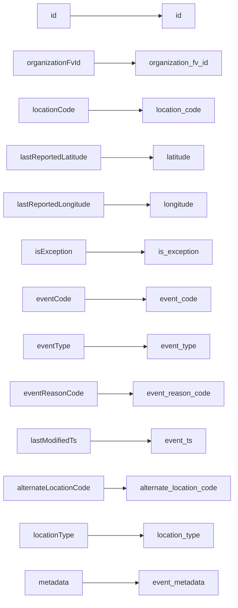
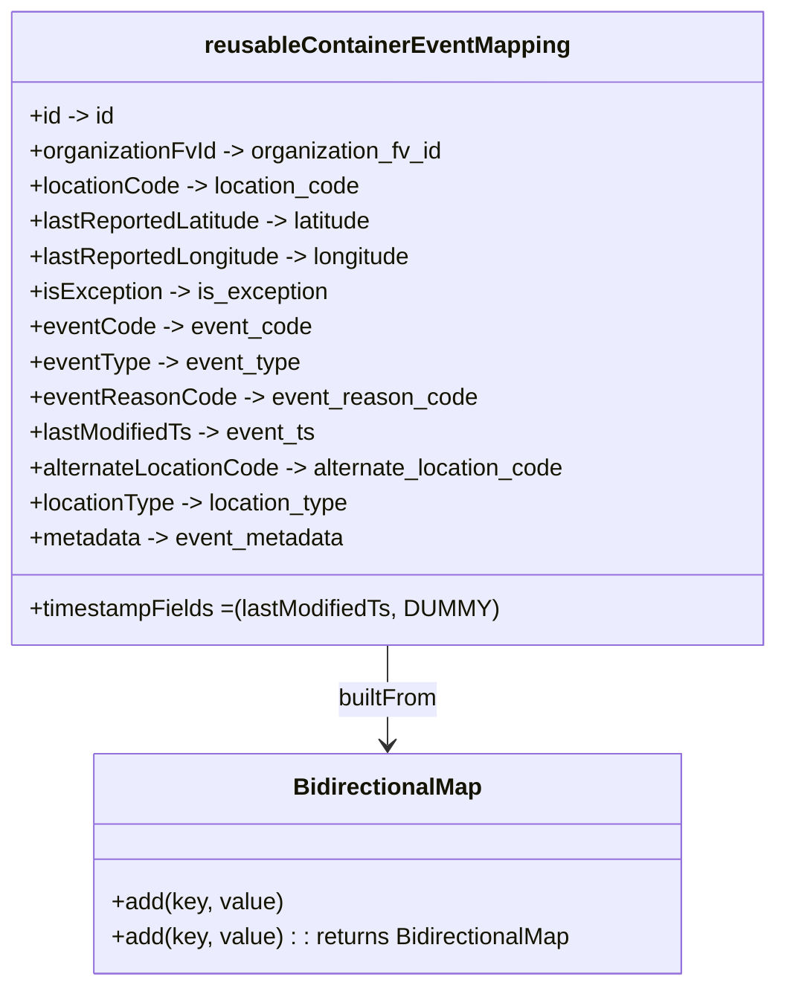

# Diagram: container_tracking_core/container_tracking_service/container_tracking_service/api/event/ReusableContainerEventMapping.py

> Auto-generated by Obscura crawlers

## Diagram 1

### SVG

<svg id="container" width="527.859375" xmlns="http://www.w3.org/2000/svg" class="flowchart" height="1318" viewBox="0 0 527.859375 1318" role="graphics-document document" aria-roledescription="flowchart-v2"><g><marker id="container_flowchart-v2-pointEnd" class="marker flowchart-v2" viewBox="0 0 10 10" refX="5" refY="5" markerUnits="userSpaceOnUse" markerWidth="8" markerHeight="8" orient="auto"><path d="M 0 0 L 10 5 L 0 10 z" class="arrowMarkerPath" style="stroke-width: 1; stroke-dasharray: 1, 0;"></path></marker><marker id="container_flowchart-v2-pointStart" class="marker flowchart-v2" viewBox="0 0 10 10" refX="4.5" refY="5" markerUnits="userSpaceOnUse" markerWidth="8" markerHeight="8" orient="auto"><path d="M 0 5 L 10 10 L 10 0 z" class="arrowMarkerPath" style="stroke-width: 1; stroke-dasharray: 1, 0;"></path></marker><marker id="container_flowchart-v2-circleEnd" class="marker flowchart-v2" viewBox="0 0 10 10" refX="11" refY="5" markerUnits="userSpaceOnUse" markerWidth="11" markerHeight="11" orient="auto"><circle cx="5" cy="5" r="5" class="arrowMarkerPath" style="stroke-width: 1; stroke-dasharray: 1, 0;"></circle></marker><marker id="container_flowchart-v2-circleStart" class="marker flowchart-v2" viewBox="0 0 10 10" refX="-1" refY="5" markerUnits="userSpaceOnUse" markerWidth="11" markerHeight="11" orient="auto"><circle cx="5" cy="5" r="5" class="arrowMarkerPath" style="stroke-width: 1; stroke-dasharray: 1, 0;"></circle></marker><marker id="container_flowchart-v2-crossEnd" class="marker cross flowchart-v2" viewBox="0 0 11 11" refX="12" refY="5.2" markerUnits="userSpaceOnUse" markerWidth="11" markerHeight="11" orient="auto"><path d="M 1,1 l 9,9 M 10,1 l -9,9" class="arrowMarkerPath" style="stroke-width: 2; stroke-dasharray: 1, 0;"></path></marker><marker id="container_flowchart-v2-crossStart" class="marker cross flowchart-v2" viewBox="0 0 11 11" refX="-1" refY="5.2" markerUnits="userSpaceOnUse" markerWidth="11" markerHeight="11" orient="auto"><path d="M 1,1 l 9,9 M 10,1 l -9,9" class="arrowMarkerPath" style="stroke-width: 2; stroke-dasharray: 1, 0;"></path></marker><g class="root"><g class="clusters"></g><g class="edgePaths"><path d="M158,35L174.818,35C191.635,35,225.271,35,259.077,35C292.883,35,326.859,35,343.848,35L360.836,35" id="L_L_id_R_id_0" class="edge-thickness-normal edge-pattern-solid edge-thickness-normal edge-pattern-solid flowchart-link" style=";" data-edge="true" data-et="edge" data-id="L_L_id_R_id_0" data-points="W3sieCI6MTU4LCJ5IjozNX0seyJ4IjoyNTguOTA2MjUsInkiOjM1fSx7IngiOjM2NC44MzU5Mzc1LCJ5IjozNX1d" marker-end="url(#container_flowchart-v2-pointEnd)"></path><path d="M210.859,139L218.867,139C226.875,139,242.891,139,257.935,139C272.979,139,287.052,139,294.089,139L301.125,139" id="L_L_organizationFvId_R_organizationFvId_0" class="edge-thickness-normal edge-pattern-solid edge-thickness-normal edge-pattern-solid flowchart-link" style=";" data-edge="true" data-et="edge" data-id="L_L_organizationFvId_R_organizationFvId_0" data-points="W3sieCI6MjEwLjg1OTM3NSwieSI6MTM5fSx7IngiOjI1OC45MDYyNSwieSI6MTM5fSx7IngiOjMwNS4xMjUsInkiOjEzOX1d" marker-end="url(#container_flowchart-v2-pointEnd)"></path><path d="M198.672,243L208.711,243C218.75,243,238.828,243,258.52,243C278.211,243,297.516,243,307.168,243L316.82,243" id="L_L_locationCode_R_locationCode_0" class="edge-thickness-normal edge-pattern-solid edge-thickness-normal edge-pattern-solid flowchart-link" style=";" data-edge="true" data-et="edge" data-id="L_L_locationCode_R_locationCode_0" data-points="W3sieCI6MTk4LjY3MTg3NSwieSI6MjQzfSx7IngiOjI1OC45MDYyNSwieSI6MjQzfSx7IngiOjMyMC44MjAzMTI1LCJ5IjoyNDN9XQ==" marker-end="url(#container_flowchart-v2-pointEnd)"></path><path d="M227.75,347L232.943,347C238.135,347,248.521,347,267.128,347C285.734,347,312.563,347,325.977,347L339.391,347" id="L_L_lastReportedLatitude_R_lastReportedLatitude_0" class="edge-thickness-normal edge-pattern-solid edge-thickness-normal edge-pattern-solid flowchart-link" style=";" data-edge="true" data-et="edge" data-id="L_L_lastReportedLatitude_R_lastReportedLatitude_0" data-points="W3sieCI6MjI3Ljc1LCJ5IjozNDd9LHsieCI6MjU4LjkwNjI1LCJ5IjozNDd9LHsieCI6MzQzLjM5MDYyNSwieSI6MzQ3fV0=" marker-end="url(#container_flowchart-v2-pointEnd)"></path><path d="M233.906,451L238.073,451C242.24,451,250.573,451,267.107,451C283.641,451,308.375,451,320.742,451L333.109,451" id="L_L_lastReportedLongitude_R_lastReportedLongitude_0" class="edge-thickness-normal edge-pattern-solid edge-thickness-normal edge-pattern-solid flowchart-link" style=";" data-edge="true" data-et="edge" data-id="L_L_lastReportedLongitude_R_lastReportedLongitude_0" data-points="W3sieCI6MjMzLjkwNjI1LCJ5Ijo0NTF9LHsieCI6MjU4LjkwNjI1LCJ5Ijo0NTF9LHsieCI6MzM3LjEwOTM3NSwieSI6NDUxfV0=" marker-end="url(#container_flowchart-v2-pointEnd)"></path><path d="M192.32,555L203.418,555C214.516,555,236.711,555,258.436,555C280.161,555,301.417,555,312.044,555L322.672,555" id="L_L_isException_R_isException_0" class="edge-thickness-normal edge-pattern-solid edge-thickness-normal edge-pattern-solid flowchart-link" style=";" data-edge="true" data-et="edge" data-id="L_L_isException_R_isException_0" data-points="W3sieCI6MTkyLjMyMDMxMjUsInkiOjU1NX0seyJ4IjoyNTguOTA2MjUsInkiOjU1NX0seyJ4IjozMjYuNjcxODc1LCJ5Ijo1NTV9XQ==" marker-end="url(#container_flowchart-v2-pointEnd)"></path><path d="M189.258,659L200.866,659C212.474,659,235.69,659,258.52,659C281.349,659,303.792,659,315.013,659L326.234,659" id="L_L_eventCode_R_eventCode_0" class="edge-thickness-normal edge-pattern-solid edge-thickness-normal edge-pattern-solid flowchart-link" style=";" data-edge="true" data-et="edge" data-id="L_L_eventCode_R_eventCode_0" data-points="W3sieCI6MTg5LjI1NzgxMjUsInkiOjY1OX0seyJ4IjoyNTguOTA2MjUsInkiOjY1OX0seyJ4IjozMzAuMjM0Mzc1LCJ5Ijo2NTl9XQ==" marker-end="url(#container_flowchart-v2-pointEnd)"></path><path d="M187.992,763L199.811,763C211.63,763,235.268,763,258.572,763C281.875,763,304.844,763,316.328,763L327.813,763" id="L_L_eventType_R_eventType_0" class="edge-thickness-normal edge-pattern-solid edge-thickness-normal edge-pattern-solid flowchart-link" style=";" data-edge="true" data-et="edge" data-id="L_L_eventType_R_eventType_0" data-points="W3sieCI6MTg3Ljk5MjE4NzUsInkiOjc2M30seyJ4IjoyNTguOTA2MjUsInkiOjc2M30seyJ4IjozMzEuODEyNSwieSI6NzYzfV0=" marker-end="url(#container_flowchart-v2-pointEnd)"></path><path d="M215.633,867L222.845,867C230.057,867,244.482,867,258.139,867C271.797,867,284.688,867,291.133,867L297.578,867" id="L_L_eventReasonCode_R_eventReasonCode_0" class="edge-thickness-normal edge-pattern-solid edge-thickness-normal edge-pattern-solid flowchart-link" style=";" data-edge="true" data-et="edge" data-id="L_L_eventReasonCode_R_eventReasonCode_0" data-points="W3sieCI6MjE1LjYzMjgxMjUsInkiOjg2N30seyJ4IjoyNTguOTA2MjUsInkiOjg2N30seyJ4IjozMDEuNTc4MTI1LCJ5Ijo4Njd9XQ==" marker-end="url(#container_flowchart-v2-pointEnd)"></path><path d="M203.313,971L212.578,971C221.844,971,240.375,971,262.671,971C284.966,971,311.026,971,324.056,971L337.086,971" id="L_L_lastModifiedTs_R_lastModifiedTs_0" class="edge-thickness-normal edge-pattern-solid edge-thickness-normal edge-pattern-solid flowchart-link" style=";" data-edge="true" data-et="edge" data-id="L_L_lastModifiedTs_R_lastModifiedTs_0" data-points="W3sieCI6MjAzLjMxMjUsInkiOjk3MX0seyJ4IjoyNTguOTA2MjUsInkiOjk3MX0seyJ4IjozNDEuMDg1OTM3NSwieSI6OTcxfV0=" marker-end="url(#container_flowchart-v2-pointEnd)"></path><path d="M233.148,1075L237.441,1075C241.734,1075,250.32,1075,258.113,1075C265.906,1075,272.906,1075,276.406,1075L279.906,1075" id="L_L_alternateLocationCode_R_alternateLocationCode_0" class="edge-thickness-normal edge-pattern-solid edge-thickness-normal edge-pattern-solid flowchart-link" style=";" data-edge="true" data-et="edge" data-id="L_L_alternateLocationCode_R_alternateLocationCode_0" data-points="W3sieCI6MjMzLjE0ODQzNzUsInkiOjEwNzV9LHsieCI6MjU4LjkwNjI1LCJ5IjoxMDc1fSx7IngiOjI4My45MDYyNSwieSI6MTA3NX1d" marker-end="url(#container_flowchart-v2-pointEnd)"></path><path d="M197.398,1179L207.65,1179C217.901,1179,238.404,1179,258.572,1179C278.74,1179,298.573,1179,308.49,1179L318.406,1179" id="L_L_locationType_R_locationType_0" class="edge-thickness-normal edge-pattern-solid edge-thickness-normal edge-pattern-solid flowchart-link" style=";" data-edge="true" data-et="edge" data-id="L_L_locationType_R_locationType_0" data-points="W3sieCI6MTk3LjM5ODQzNzUsInkiOjExNzl9LHsieCI6MjU4LjkwNjI1LCJ5IjoxMTc5fSx7IngiOjMyMi40MDYyNSwieSI6MTE3OX1d" marker-end="url(#container_flowchart-v2-pointEnd)"></path><path d="M185.68,1283L197.884,1283C210.089,1283,234.497,1283,255.022,1283C275.547,1283,292.188,1283,300.508,1283L308.828,1283" id="L_L_metadata_R_metadata_0" class="edge-thickness-normal edge-pattern-solid edge-thickness-normal edge-pattern-solid flowchart-link" style=";" data-edge="true" data-et="edge" data-id="L_L_metadata_R_metadata_0" data-points="W3sieCI6MTg1LjY3OTY4NzUsInkiOjEyODN9LHsieCI6MjU4LjkwNjI1LCJ5IjoxMjgzfSx7IngiOjMxMi44MjgxMjUsInkiOjEyODN9XQ==" marker-end="url(#container_flowchart-v2-pointEnd)"></path></g><g class="edgeLabels"><g class="edgeLabel"><g class="label" data-id="L_L_id_R_id_0" transform="translate(0, 0)"><foreignObject width="0" height="0">

</foreignObject></g></g><g class="edgeLabel"><g class="label" data-id="L_L_organizationFvId_R_organizationFvId_0" transform="translate(0, 0)"><foreignObject width="0" height="0">

</foreignObject></g></g><g class="edgeLabel"><g class="label" data-id="L_L_locationCode_R_locationCode_0" transform="translate(0, 0)"><foreignObject width="0" height="0">

</foreignObject></g></g><g class="edgeLabel"><g class="label" data-id="L_L_lastReportedLatitude_R_lastReportedLatitude_0" transform="translate(0, 0)"><foreignObject width="0" height="0">

</foreignObject></g></g><g class="edgeLabel"><g class="label" data-id="L_L_lastReportedLongitude_R_lastReportedLongitude_0" transform="translate(0, 0)"><foreignObject width="0" height="0">

</foreignObject></g></g><g class="edgeLabel"><g class="label" data-id="L_L_isException_R_isException_0" transform="translate(0, 0)"><foreignObject width="0" height="0">

</foreignObject></g></g><g class="edgeLabel"><g class="label" data-id="L_L_eventCode_R_eventCode_0" transform="translate(0, 0)"><foreignObject width="0" height="0">

</foreignObject></g></g><g class="edgeLabel"><g class="label" data-id="L_L_eventType_R_eventType_0" transform="translate(0, 0)"><foreignObject width="0" height="0">

</foreignObject></g></g><g class="edgeLabel"><g class="label" data-id="L_L_eventReasonCode_R_eventReasonCode_0" transform="translate(0, 0)"><foreignObject width="0" height="0">

</foreignObject></g></g><g class="edgeLabel"><g class="label" data-id="L_L_lastModifiedTs_R_lastModifiedTs_0" transform="translate(0, 0)"><foreignObject width="0" height="0">

</foreignObject></g></g><g class="edgeLabel"><g class="label" data-id="L_L_alternateLocationCode_R_alternateLocationCode_0" transform="translate(0, 0)"><foreignObject width="0" height="0">

</foreignObject></g></g><g class="edgeLabel"><g class="label" data-id="L_L_locationType_R_locationType_0" transform="translate(0, 0)"><foreignObject width="0" height="0">

</foreignObject></g></g><g class="edgeLabel"><g class="label" data-id="L_L_metadata_R_metadata_0" transform="translate(0, 0)"><foreignObject width="0" height="0">

</foreignObject></g></g></g><g class="nodes"><g class="node default" id="flowchart-L_id-0" transform="translate(120.953125, 35)"><rect class="basic label-container" style="" x="-37.046875" y="-27" width="74.09375" height="54"></rect><g class="label" style="" transform="translate(-7.046875, -12)"><rect></rect><foreignObject width="14.09375" height="24">

id

</foreignObject></g></g><g class="node default" id="flowchart-R_id-1" transform="translate(401.8828125, 35)"><rect class="basic label-container" style="" x="-37.046875" y="-27" width="74.09375" height="54"></rect><g class="label" style="" transform="translate(-7.046875, -12)"><rect></rect><foreignObject width="14.09375" height="24">

id

</foreignObject></g></g><g class="node default" id="flowchart-L_organizationFvId-2" transform="translate(120.953125, 139)"><rect class="basic label-container" style="" x="-89.90625" y="-27" width="179.8125" height="54"></rect><g class="label" style="" transform="translate(-59.90625, -12)"><rect></rect><foreignObject width="119.8125" height="24">

organizationFvId

</foreignObject></g></g><g class="node default" id="flowchart-R_organizationFvId-3" transform="translate(401.8828125, 139)"><rect class="basic label-container" style="" x="-96.7578125" y="-27" width="193.515625" height="54"></rect><g class="label" style="" transform="translate(-66.7578125, -12)"><rect></rect><foreignObject width="133.515625" height="24">

organization_fv_id

</foreignObject></g></g><g class="node default" id="flowchart-L_locationCode-4" transform="translate(120.953125, 243)"><rect class="basic label-container" style="" x="-77.71875" y="-27" width="155.4375" height="54"></rect><g class="label" style="" transform="translate(-47.71875, -12)"><rect></rect><foreignObject width="95.4375" height="24">

locationCode

</foreignObject></g></g><g class="node default" id="flowchart-R_locationCode-5" transform="translate(401.8828125, 243)"><rect class="basic label-container" style="" x="-81.0625" y="-27" width="162.125" height="54"></rect><g class="label" style="" transform="translate(-51.0625, -12)"><rect></rect><foreignObject width="102.125" height="24">

location_code

</foreignObject></g></g><g class="node default" id="flowchart-L_lastReportedLatitude-6" transform="translate(120.953125, 347)"><rect class="basic label-container" style="" x="-106.796875" y="-27" width="213.59375" height="54"></rect><g class="label" style="" transform="translate(-76.796875, -12)"><rect></rect><foreignObject width="153.59375" height="24">

lastReportedLatitude

</foreignObject></g></g><g class="node default" id="flowchart-R_lastReportedLatitude-7" transform="translate(401.8828125, 347)"><rect class="basic label-container" style="" x="-58.4921875" y="-27" width="116.984375" height="54"></rect><g class="label" style="" transform="translate(-28.4921875, -12)"><rect></rect><foreignObject width="56.984375" height="24">

latitude

</foreignObject></g></g><g class="node default" id="flowchart-L_lastReportedLongitude-8" transform="translate(120.953125, 451)"><rect class="basic label-container" style="" x="-112.953125" y="-27" width="225.90625" height="54"></rect><g class="label" style="" transform="translate(-82.953125, -12)"><rect></rect><foreignObject width="165.90625" height="24">

lastReportedLongitude

</foreignObject></g></g><g class="node default" id="flowchart-R_lastReportedLongitude-9" transform="translate(401.8828125, 451)"><rect class="basic label-container" style="" x="-64.7734375" y="-27" width="129.546875" height="54"></rect><g class="label" style="" transform="translate(-34.7734375, -12)"><rect></rect><foreignObject width="69.546875" height="24">

longitude

</foreignObject></g></g><g class="node default" id="flowchart-L_isException-10" transform="translate(120.953125, 555)"><rect class="basic label-container" style="" x="-71.3671875" y="-27" width="142.734375" height="54"></rect><g class="label" style="" transform="translate(-41.3671875, -12)"><rect></rect><foreignObject width="82.734375" height="24">

isException

</foreignObject></g></g><g class="node default" id="flowchart-R_isException-11" transform="translate(401.8828125, 555)"><rect class="basic label-container" style="" x="-75.2109375" y="-27" width="150.421875" height="54"></rect><g class="label" style="" transform="translate(-45.2109375, -12)"><rect></rect><foreignObject width="90.421875" height="24">

is_exception

</foreignObject></g></g><g class="node default" id="flowchart-L_eventCode-12" transform="translate(120.953125, 659)"><rect class="basic label-container" style="" x="-68.3046875" y="-27" width="136.609375" height="54"></rect><g class="label" style="" transform="translate(-38.3046875, -12)"><rect></rect><foreignObject width="76.609375" height="24">

eventCode

</foreignObject></g></g><g class="node default" id="flowchart-R_eventCode-13" transform="translate(401.8828125, 659)"><rect class="basic label-container" style="" x="-71.6484375" y="-27" width="143.296875" height="54"></rect><g class="label" style="" transform="translate(-41.6484375, -12)"><rect></rect><foreignObject width="83.296875" height="24">

event_code

</foreignObject></g></g><g class="node default" id="flowchart-L_eventType-14" transform="translate(120.953125, 763)"><rect class="basic label-container" style="" x="-67.0390625" y="-27" width="134.078125" height="54"></rect><g class="label" style="" transform="translate(-37.0390625, -12)"><rect></rect><foreignObject width="74.078125" height="24">

eventType

</foreignObject></g></g><g class="node default" id="flowchart-R_eventType-15" transform="translate(401.8828125, 763)"><rect class="basic label-container" style="" x="-70.0703125" y="-27" width="140.140625" height="54"></rect><g class="label" style="" transform="translate(-40.0703125, -12)"><rect></rect><foreignObject width="80.140625" height="24">

event_type

</foreignObject></g></g><g class="node default" id="flowchart-L_eventReasonCode-16" transform="translate(120.953125, 867)"><rect class="basic label-container" style="" x="-94.6796875" y="-27" width="189.359375" height="54"></rect><g class="label" style="" transform="translate(-64.6796875, -12)"><rect></rect><foreignObject width="129.359375" height="24">

eventReasonCode

</foreignObject></g></g><g class="node default" id="flowchart-R_eventReasonCode-17" transform="translate(401.8828125, 867)"><rect class="basic label-container" style="" x="-100.3046875" y="-27" width="200.609375" height="54"></rect><g class="label" style="" transform="translate(-70.3046875, -12)"><rect></rect><foreignObject width="140.609375" height="24">

event_reason_code

</foreignObject></g></g><g class="node default" id="flowchart-L_lastModifiedTs-18" transform="translate(120.953125, 971)"><rect class="basic label-container" style="" x="-82.359375" y="-27" width="164.71875" height="54"></rect><g class="label" style="" transform="translate(-52.359375, -12)"><rect></rect><foreignObject width="104.71875" height="24">

lastModifiedTs

</foreignObject></g></g><g class="node default" id="flowchart-R_lastModifiedTs-19" transform="translate(401.8828125, 971)"><rect class="basic label-container" style="" x="-60.796875" y="-27" width="121.59375" height="54"></rect><g class="label" style="" transform="translate(-30.796875, -12)"><rect></rect><foreignObject width="61.59375" height="24">

event_ts

</foreignObject></g></g><g class="node default" id="flowchart-L_alternateLocationCode-20" transform="translate(120.953125, 1075)"><rect class="basic label-container" style="" x="-112.1953125" y="-27" width="224.390625" height="54"></rect><g class="label" style="" transform="translate(-82.1953125, -12)"><rect></rect><foreignObject width="164.390625" height="24">

alternateLocationCode

</foreignObject></g></g><g class="node default" id="flowchart-R_alternateLocationCode-21" transform="translate(401.8828125, 1075)"><rect class="basic label-container" style="" x="-117.9765625" y="-27" width="235.953125" height="54"></rect><g class="label" style="" transform="translate(-87.9765625, -12)"><rect></rect><foreignObject width="175.953125" height="24">

alternate_location_code

</foreignObject></g></g><g class="node default" id="flowchart-L_locationType-22" transform="translate(120.953125, 1179)"><rect class="basic label-container" style="" x="-76.4453125" y="-27" width="152.890625" height="54"></rect><g class="label" style="" transform="translate(-46.4453125, -12)"><rect></rect><foreignObject width="92.890625" height="24">

locationType

</foreignObject></g></g><g class="node default" id="flowchart-R_locationType-23" transform="translate(401.8828125, 1179)"><rect class="basic label-container" style="" x="-79.4765625" y="-27" width="158.953125" height="54"></rect><g class="label" style="" transform="translate(-49.4765625, -12)"><rect></rect><foreignObject width="98.953125" height="24">

location_type

</foreignObject></g></g><g class="node default" id="flowchart-L_metadata-24" transform="translate(120.953125, 1283)"><rect class="basic label-container" style="" x="-64.7265625" y="-27" width="129.453125" height="54"></rect><g class="label" style="" transform="translate(-34.7265625, -12)"><rect></rect><foreignObject width="69.453125" height="24">

metadata

</foreignObject></g></g><g class="node default" id="flowchart-R_metadata-25" transform="translate(401.8828125, 1283)"><rect class="basic label-container" style="" x="-89.0546875" y="-27" width="178.109375" height="54"></rect><g class="label" style="" transform="translate(-59.0546875, -12)"><rect></rect><foreignObject width="118.109375" height="24">

event_metadata

</foreignObject></g></g></g></g></g></svg>

## Diagram 2

### SVG

<svg id="container" width="529.984375" xmlns="http://www.w3.org/2000/svg" class="classDiagram" height="672" viewBox="0 0 529.984375 672" role="graphics-document document" aria-roledescription="class"><g><defs><marker id="container_class-aggregationStart" class="marker aggregation class" refX="18" refY="7" markerWidth="190" markerHeight="240" orient="auto"><path d="M 18,7 L9,13 L1,7 L9,1 Z"></path></marker></defs><defs><marker id="container_class-aggregationEnd" class="marker aggregation class" refX="1" refY="7" markerWidth="20" markerHeight="28" orient="auto"><path d="M 18,7 L9,13 L1,7 L9,1 Z"></path></marker></defs><defs><marker id="container_class-extensionStart" class="marker extension class" refX="18" refY="7" markerWidth="190" markerHeight="240" orient="auto"><path d="M 1,7 L18,13 V 1 Z"></path></marker></defs><defs><marker id="container_class-extensionEnd" class="marker extension class" refX="1" refY="7" markerWidth="20" markerHeight="28" orient="auto"><path d="M 1,1 V 13 L18,7 Z"></path></marker></defs><defs><marker id="container_class-compositionStart" class="marker composition class" refX="18" refY="7" markerWidth="190" markerHeight="240" orient="auto"><path d="M 18,7 L9,13 L1,7 L9,1 Z"></path></marker></defs><defs><marker id="container_class-compositionEnd" class="marker composition class" refX="1" refY="7" markerWidth="20" markerHeight="28" orient="auto"><path d="M 18,7 L9,13 L1,7 L9,1 Z"></path></marker></defs><defs><marker id="container_class-dependencyStart" class="marker dependency class" refX="6" refY="7" markerWidth="190" markerHeight="240" orient="auto"><path d="M 5,7 L9,13 L1,7 L9,1 Z"></path></marker></defs><defs><marker id="container_class-dependencyEnd" class="marker dependency class" refX="13" refY="7" markerWidth="20" markerHeight="28" orient="auto"><path d="M 18,7 L9,13 L14,7 L9,1 Z"></path></marker></defs><defs><marker id="container_class-lollipopStart" class="marker lollipop class" refX="13" refY="7" markerWidth="190" markerHeight="240" orient="auto"><circle stroke="black" fill="transparent" cx="7" cy="7" r="6"></circle></marker></defs><defs><marker id="container_class-lollipopEnd" class="marker lollipop class" refX="1" refY="7" markerWidth="190" markerHeight="240" orient="auto"><circle stroke="black" fill="transparent" cx="7" cy="7" r="6"></circle></marker></defs><g class="root"><g class="clusters"></g><g class="edgePaths"><path d="M264.992,440L264.992,446.167C264.992,452.333,264.992,464.667,264.992,476C264.992,487.333,264.992,497.667,264.992,502.833L264.992,508" id="id_reusableContainerEventMapping_BidirectionalMap_1" class="edge-thickness-normal edge-pattern-solid relation" style=";;;" data-edge="true" data-et="edge" data-id="id_reusableContainerEventMapping_BidirectionalMap_1" data-points="W3sieCI6MjY0Ljk5MjE4NzUsInkiOjQ0MH0seyJ4IjoyNjQuOTkyMTg3NSwieSI6NDc3fSx7IngiOjI2NC45OTIxODc1LCJ5Ijo1MTR9XQ==" marker-end="url(#container_class-dependencyEnd)"></path></g><g class="edgeLabels"><g class="edgeLabel" transform="translate(264.9921875, 477)"><g class="label" data-id="id_reusableContainerEventMapping_BidirectionalMap_1" transform="translate(-34.921875, -12)"><foreignObject width="69.84375" height="24">

builtFrom

</foreignObject></g></g></g><g class="nodes"><g class="node default" id="classId-BidirectionalMap-0" transform="translate(264.9921875, 589)"><g class="basic label-container"><path d="M-201.76171875 -75 L201.76171875 -75 L201.76171875 75 L-201.76171875 75" stroke="none" stroke-width="0" fill="#ECECFF" style=""></path><path d="M-201.76171875 -75 C-51.45973662961717 -75, 98.84224549076566 -75, 201.76171875 -75 M-201.76171875 -75 C-90.73230379797461 -75, 20.297111154050782 -75, 201.76171875 -75 M201.76171875 -75 C201.76171875 -16.749175675802533, 201.76171875 41.501648648394934, 201.76171875 75 M201.76171875 -75 C201.76171875 -37.5463763946923, 201.76171875 -0.09275278938460474, 201.76171875 75 M201.76171875 75 C81.86160029673236 75, -38.038518156535275 75, -201.76171875 75 M201.76171875 75 C66.38102307565987 75, -68.99967259868026 75, -201.76171875 75 M-201.76171875 75 C-201.76171875 20.029968051540642, -201.76171875 -34.940063896918716, -201.76171875 -75 M-201.76171875 75 C-201.76171875 19.45907550968299, -201.76171875 -36.08184898063402, -201.76171875 -75" stroke="#9370DB" stroke-width="1.3" fill="none" stroke-dasharray="0 0" style=""></path></g><g class="annotation-group text" transform="translate(0, -51)"></g><g class="label-group text" transform="translate(-62.2265625, -51)"><g class="label" style="font-weight: bolder" transform="translate(0,-12)"><foreignObject width="124.453125" height="24">

BidirectionalMap

</foreignObject></g></g><g class="members-group text" transform="translate(-189.76171875, -3)"></g><g class="methods-group text" transform="translate(-189.76171875, 27)"><g class="label" style="" transform="translate(0,-12)"><foreignObject width="116.859375" height="24">

+add(key, value)

</foreignObject></g><g class="label" style="" transform="translate(0,12)"><foreignObject width="317.296875" height="24">

+add(key, value) : : returns BidirectionalMap

</foreignObject></g></g><g class="divider" style=""><path d="M-201.76171875 -27 C-87.20189241049653 -27, 27.357933929006947 -27, 201.76171875 -27 M-201.76171875 -27 C-51.55256691528666 -27, 98.65658491942668 -27, 201.76171875 -27" stroke="#9370DB" stroke-width="1.3" fill="none" stroke-dasharray="0 0" style=""></path></g><g class="divider" style=""><path d="M-201.76171875 -3 C-83.5667054843906 -3, 34.62830778121881 -3, 201.76171875 -3 M-201.76171875 -3 C-41.88452361491204 -3, 117.99267152017592 -3, 201.76171875 -3" stroke="#9370DB" stroke-width="1.3" fill="none" stroke-dasharray="0 0" style=""></path></g></g><g class="node default" id="classId-reusableContainerEventMapping-1" transform="translate(264.9921875, 224)"><g class="basic label-container"><path d="M-256.9921875 -216 L256.9921875 -216 L256.9921875 216 L-256.9921875 216" stroke="none" stroke-width="0" fill="#ECECFF" style=""></path><path d="M-256.9921875 -216 C-136.965401718845 -216, -16.938615937689974 -216, 256.9921875 -216 M-256.9921875 -216 C-109.7005564740848 -216, 37.59107455183039 -216, 256.9921875 -216 M256.9921875 -216 C256.9921875 -58.09382397150702, 256.9921875 99.81235205698596, 256.9921875 216 M256.9921875 -216 C256.9921875 -80.67687738890365, 256.9921875 54.646245222192704, 256.9921875 216 M256.9921875 216 C142.1699763882899 216, 27.34776527657982 216, -256.9921875 216 M256.9921875 216 C88.59735808907453 216, -79.79747132185094 216, -256.9921875 216 M-256.9921875 216 C-256.9921875 82.39056154030388, -256.9921875 -51.218876919392244, -256.9921875 -216 M-256.9921875 216 C-256.9921875 77.5016797437336, -256.9921875 -60.99664051253279, -256.9921875 -216" stroke="#9370DB" stroke-width="1.3" fill="none" stroke-dasharray="0 0" style=""></path></g><g class="annotation-group text" transform="translate(0, -192)"></g><g class="label-group text" transform="translate(-118.96875, -192)"><g class="label" style="font-weight: bolder" transform="translate(0,-12)"><foreignObject width="237.9375" height="24">

reusableContainerEventMapping

</foreignObject></g></g><g class="members-group text" transform="translate(-244.9921875, -144)"><g class="label" style="" transform="translate(0,-12)"><foreignObject width="59.078125" height="24">

+id -&gt; id

</foreignObject></g><g class="label" style="" transform="translate(0,12)"><foreignObject width="284.234375" height="24">

+organizationFvId -&gt; organization_fv_id

</foreignObject></g><g class="label" style="" transform="translate(0,36)"><foreignObject width="228.453125" height="24">

+locationCode -&gt; location_code

</foreignObject></g><g class="label" style="" transform="translate(0,60)"><foreignObject width="241.484375" height="24">

+lastReportedLatitude -&gt; latitude

</foreignObject></g><g class="label" style="" transform="translate(0,84)"><foreignObject width="266.359375" height="24">

+lastReportedLongitude -&gt; longitude

</foreignObject></g><g class="label" style="" transform="translate(0,108)"><foreignObject width="204.0625" height="24">

+isException -&gt; is_exception

</foreignObject></g><g class="label" style="" transform="translate(0,132)"><foreignObject width="190.828125" height="24">

+eventCode -&gt; event_code

</foreignObject></g><g class="label" style="" transform="translate(0,156)"><foreignObject width="185.109375" height="24">

+eventType -&gt; event_type

</foreignObject></g><g class="label" style="" transform="translate(0,180)"><foreignObject width="300.875" height="24">

+eventReasonCode -&gt; event_reason_code

</foreignObject></g><g class="label" style="" transform="translate(0,204)"><foreignObject width="197.203125" height="24">

+lastModifiedTs -&gt; event_ts

</foreignObject></g><g class="label" style="" transform="translate(0,228)"><foreignObject width="371.015625" height="24">

+alternateLocationCode -&gt; alternate_location_code

</foreignObject></g><g class="label" style="" transform="translate(0,252)"><foreignObject width="222.75" height="24">

+locationType -&gt; location_type

</foreignObject></g><g class="label" style="" transform="translate(0,276)"><foreignObject width="218.453125" height="24">

+metadata -&gt; event_metadata

</foreignObject></g></g><g class="methods-group text" transform="translate(-244.9921875, 192)"><g class="label" style="" transform="translate(0,-12)"><foreignObject width="317.59375" height="24">

+timestampFields =(lastModifiedTs, DUMMY)

</foreignObject></g></g><g class="divider" style=""><path d="M-256.9921875 -168 C-70.21896975657287 -168, 116.55424798685425 -168, 256.9921875 -168 M-256.9921875 -168 C-57.40415758000887 -168, 142.18387233998226 -168, 256.9921875 -168" stroke="#9370DB" stroke-width="1.3" fill="none" stroke-dasharray="0 0" style=""></path></g><g class="divider" style=""><path d="M-256.9921875 168 C-114.59544227417405 168, 27.801302951651905 168, 256.9921875 168 M-256.9921875 168 C-117.24926805931926 168, 22.493651381361474 168, 256.9921875 168" stroke="#9370DB" stroke-width="1.3" fill="none" stroke-dasharray="0 0" style=""></path></g></g></g></g></g></svg>
