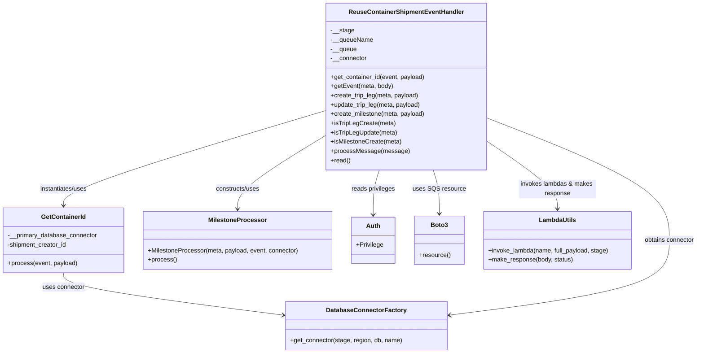

# Diagram: container_tracking_core/container_tracking_service/container_tracking_service/api/event_processor/reuse_trip_container_event_processor.py


> Auto-generated by Obscura crawlers

## Diagram 1



### SVG

<svg id="container" width="1803.1328125" xmlns="http://www.w3.org/2000/svg" class="classDiagram" height="914" viewBox="0 0 1803.1328125 914" role="graphics-document document" aria-roledescription="class"><style>#container{font-family:"trebuchet ms",verdana,arial,sans-serif;font-size:16px;fill:#333;}@keyframes edge-animation-frame{from{stroke-dashoffset:0;}}@keyframes dash{to{stroke-dashoffset:0;}}#container .edge-animation-slow{stroke-dasharray:9,5!important;stroke-dashoffset:900;animation:dash 50s linear infinite;stroke-linecap:round;}#container .edge-animation-fast{stroke-dasharray:9,5!important;stroke-dashoffset:900;animation:dash 20s linear infinite;stroke-linecap:round;}#container .error-icon{fill:#552222;}#container .error-text{fill:#552222;stroke:#552222;}#container .edge-thickness-normal{stroke-width:1px;}#container .edge-thickness-thick{stroke-width:3.5px;}#container .edge-pattern-solid{stroke-dasharray:0;}#container .edge-thickness-invisible{stroke-width:0;fill:none;}#container .edge-pattern-dashed{stroke-dasharray:3;}#container .edge-pattern-dotted{stroke-dasharray:2;}#container .marker{fill:#333333;stroke:#333333;}#container .marker.cross{stroke:#333333;}#container svg{font-family:"trebuchet ms",verdana,arial,sans-serif;font-size:16px;}#container p{margin:0;}#container g.classGroup text{fill:#9370DB;stroke:none;font-family:"trebuchet ms",verdana,arial,sans-serif;font-size:10px;}#container g.classGroup text .title{font-weight:bolder;}#container .nodeLabel,#container .edgeLabel{color:#131300;}#container .edgeLabel .label rect{fill:#ECECFF;}#container .label text{fill:#131300;}#container .labelBkg{background:#ECECFF;}#container .edgeLabel .label span{background:#ECECFF;}#container .classTitle{font-weight:bolder;}#container .node rect,#container .node circle,#container .node ellipse,#container .node polygon,#container .node path{fill:#ECECFF;stroke:#9370DB;stroke-width:1px;}#container .divider{stroke:#9370DB;stroke-width:1;}#container g.clickable{cursor:pointer;}#container g.classGroup rect{fill:#ECECFF;stroke:#9370DB;}#container g.classGroup line{stroke:#9370DB;stroke-width:1;}#container .classLabel .box{stroke:none;stroke-width:0;fill:#ECECFF;opacity:0.5;}#container .classLabel .label{fill:#9370DB;font-size:10px;}#container .relation{stroke:#333333;stroke-width:1;fill:none;}#container .dashed-line{stroke-dasharray:3;}#container .dotted-line{stroke-dasharray:1 2;}#container #compositionStart,#container .composition{fill:#333333!important;stroke:#333333!important;stroke-width:1;}#container #compositionEnd,#container .composition{fill:#333333!important;stroke:#333333!important;stroke-width:1;}#container #dependencyStart,#container .dependency{fill:#333333!important;stroke:#333333!important;stroke-width:1;}#container #dependencyStart,#container .dependency{fill:#333333!important;stroke:#333333!important;stroke-width:1;}#container #extensionStart,#container .extension{fill:transparent!important;stroke:#333333!important;stroke-width:1;}#container #extensionEnd,#container .extension{fill:transparent!important;stroke:#333333!important;stroke-width:1;}#container #aggregationStart,#container .aggregation{fill:transparent!important;stroke:#333333!important;stroke-width:1;}#container #aggregationEnd,#container .aggregation{fill:transparent!important;stroke:#333333!important;stroke-width:1;}#container #lollipopStart,#container .lollipop{fill:#ECECFF!important;stroke:#333333!important;stroke-width:1;}#container #lollipopEnd,#container .lollipop{fill:#ECECFF!important;stroke:#333333!important;stroke-width:1;}#container .edgeTerminals{font-size:11px;line-height:initial;}#container .classTitleText{text-anchor:middle;font-size:18px;fill:#333;}#container .label-icon{display:inline-block;height:1em;overflow:visible;vertical-align:-0.125em;}#container .node .label-icon path{fill:currentColor;stroke:revert;stroke-width:revert;}#container :root{--mermaid-font-family:"trebuchet ms",verdana,arial,sans-serif;}</style><g><defs><marker id="container_class-aggregationStart" class="marker aggregation class" refX="18" refY="7" markerWidth="190" markerHeight="240" orient="auto"><path d="M 18,7 L9,13 L1,7 L9,1 Z"></path></marker></defs><defs><marker id="container_class-aggregationEnd" class="marker aggregation class" refX="1" refY="7" markerWidth="20" markerHeight="28" orient="auto"><path d="M 18,7 L9,13 L1,7 L9,1 Z"></path></marker></defs><defs><marker id="container_class-extensionStart" class="marker extension class" refX="18" refY="7" markerWidth="190" markerHeight="240" orient="auto"><path d="M 1,7 L18,13 V 1 Z"></path></marker></defs><defs><marker id="container_class-extensionEnd" class="marker extension class" refX="1" refY="7" markerWidth="20" markerHeight="28" orient="auto"><path d="M 1,1 V 13 L18,7 Z"></path></marker></defs><defs><marker id="container_class-compositionStart" class="marker composition class" refX="18" refY="7" markerWidth="190" markerHeight="240" orient="auto"><path d="M 18,7 L9,13 L1,7 L9,1 Z"></path></marker></defs><defs><marker id="container_class-compositionEnd" class="marker composition class" refX="1" refY="7" markerWidth="20" markerHeight="28" orient="auto"><path d="M 18,7 L9,13 L1,7 L9,1 Z"></path></marker></defs><defs><marker id="container_class-dependencyStart" class="marker dependency class" refX="6" refY="7" markerWidth="190" markerHeight="240" orient="auto"><path d="M 5,7 L9,13 L1,7 L9,1 Z"></path></marker></defs><defs><marker id="container_class-dependencyEnd" class="marker dependency class" refX="13" refY="7" markerWidth="20" markerHeight="28" orient="auto"><path d="M 18,7 L9,13 L14,7 L9,1 Z"></path></marker></defs><defs><marker id="container_class-lollipopStart" class="marker lollipop class" refX="13" refY="7" markerWidth="190" markerHeight="240" orient="auto"><circle stroke="black" fill="transparent" cx="7" cy="7" r="6"></circle></marker></defs><defs><marker id="container_class-lollipopEnd" class="marker lollipop class" refX="1" refY="7" markerWidth="190" markerHeight="240" orient="auto"><circle stroke="black" fill="transparent" cx="7" cy="7" r="6"></circle></marker></defs><g class="root"><g class="clusters"></g><g class="edgePaths"><path d="M164.246,706L164.246,712.167C164.246,718.333,164.246,730.667,259.351,748.987C354.456,767.307,544.665,791.614,639.77,803.768L734.875,815.921" id="id_GetContainerId_DatabaseConnectorFactory_1" class="edge-thickness-normal edge-pattern-solid relation" style=";;;" data-edge="true" data-et="edge" data-id="id_GetContainerId_DatabaseConnectorFactory_1" data-points="W3sieCI6MTY0LjI0NjA5Mzc1LCJ5Ijo3MDZ9LHsieCI6MTY0LjI0NjA5Mzc1LCJ5Ijo3NDN9LHsieCI6NzQwLjgyNjE3MTg3NSwieSI6ODE2LjY4MTk2NDE5MzQ1NDJ9XQ==" marker-end="url(#container_class-dependencyEnd)"></path><path d="M841.598,285.792L728.706,319.66C615.814,353.528,390.03,421.264,277.138,462.299C164.246,503.333,164.246,517.667,164.246,524.833L164.246,532" id="id_ReuseContainerShipmentEventHandler_GetContainerId_2" class="edge-thickness-normal edge-pattern-solid relation" style=";;;" data-edge="true" data-et="edge" data-id="id_ReuseContainerShipmentEventHandler_GetContainerId_2" data-points="W3sieCI6ODQxLjU5NzY1NjI1LCJ5IjoyODUuNzkxNTM1ODQyMjE0Njd9LHsieCI6MTY0LjI0NjA5Mzc1LCJ5Ijo0ODl9LHsieCI6MTY0LjI0NjA5Mzc1LCJ5Ijo1Mzh9XQ==" marker-end="url(#container_class-dependencyEnd)"></path><path d="M1116.244,440L1118.841,448.167C1121.438,456.333,1126.631,472.667,1129.228,491.5C1131.824,510.333,1131.824,531.667,1131.824,542.333L1131.824,553" id="id_ReuseContainerShipmentEventHandler_Boto3_3" class="edge-thickness-normal edge-pattern-solid relation" style=";;;" data-edge="true" data-et="edge" data-id="id_ReuseContainerShipmentEventHandler_Boto3_3" data-points="W3sieCI6MTExNi4yNDQ0NzIyODc3MzU4LCJ5Ijo0NDB9LHsieCI6MTEzMS44MjQyMTg3NSwieSI6NDg5fSx7IngiOjExMzEuODI0MjE4NzUsInkiOjU1OX1d" marker-end="url(#container_class-dependencyEnd)"></path><path d="M1253.535,304.063L1332.829,334.886C1412.122,365.709,1570.71,427.354,1650.003,480.344C1729.297,533.333,1729.297,577.667,1729.297,620C1729.297,662.333,1729.297,702.667,1634.192,734.987C1539.087,767.307,1348.878,791.614,1253.773,803.768L1158.668,815.921" id="id_ReuseContainerShipmentEventHandler_DatabaseConnectorFactory_4" class="edge-thickness-normal edge-pattern-solid relation" style=";;;" data-edge="true" data-et="edge" data-id="id_ReuseContainerShipmentEventHandler_DatabaseConnectorFactory_4" data-points="W3sieCI6MTI1My41MzUxNTYyNSwieSI6MzA0LjA2MzQ4NzMzNDA0NzY0fSx7IngiOjE3MjkuMjk2ODc1LCJ5Ijo0ODl9LHsieCI6MTcyOS4yOTY4NzUsInkiOjYyMn0seyJ4IjoxNzI5LjI5Njg3NSwieSI6NzQzfSx7IngiOjExNTIuNzE2Nzk2ODc1LCJ5Ijo4MTYuNjgxOTY0MTkzNDU0Mn1d" marker-end="url(#container_class-dependencyEnd)"></path><path d="M841.598,349.922L803.683,373.102C765.768,396.281,689.939,442.641,652.024,474.487C614.109,506.333,614.109,523.667,614.109,532.333L614.109,541" id="id_ReuseContainerShipmentEventHandler_MilestoneProcessor_5" class="edge-thickness-normal edge-pattern-solid relation" style=";;;" data-edge="true" data-et="edge" data-id="id_ReuseContainerShipmentEventHandler_MilestoneProcessor_5" data-points="W3sieCI6ODQxLjU5NzY1NjI1LCJ5IjozNDkuOTIxODY3MjU1NDQwOTN9LHsieCI6NjE0LjEwOTM3NSwieSI6NDg5fSx7IngiOjYxNC4xMDkzNzUsInkiOjU0N31d" marker-end="url(#container_class-dependencyEnd)"></path><path d="M1253.535,364.297L1284.048,385.081C1314.56,405.865,1375.585,447.432,1406.097,476.883C1436.609,506.333,1436.609,523.667,1436.609,532.333L1436.609,541" id="id_ReuseContainerShipmentEventHandler_LambdaUtils_6" class="edge-thickness-normal edge-pattern-solid relation" style=";;;" data-edge="true" data-et="edge" data-id="id_ReuseContainerShipmentEventHandler_LambdaUtils_6" data-points="W3sieCI6MTI1My41MzUxNTYyNSwieSI6MzY0LjI5NzQwNDQ4ODE3NzF9LHsieCI6MTQzNi42MDkzNzUsInkiOjQ4OX0seyJ4IjoxNDM2LjYwOTM3NSwieSI6NTQ3fV0=" marker-end="url(#container_class-dependencyEnd)"></path><path d="M978.888,440L976.292,448.167C973.695,456.333,968.502,472.667,965.905,492C963.309,511.333,963.309,533.667,963.309,544.833L963.309,556" id="id_ReuseContainerShipmentEventHandler_Auth_7" class="edge-thickness-normal edge-pattern-solid relation" style=";;;" data-edge="true" data-et="edge" data-id="id_ReuseContainerShipmentEventHandler_Auth_7" data-points="W3sieCI6OTc4Ljg4ODM0MDIxMjI2NDIsInkiOjQ0MH0seyJ4Ijo5NjMuMzA4NTkzNzUsInkiOjQ4OX0seyJ4Ijo5NjMuMzA4NTkzNzUsInkiOjU2Mn1d" marker-end="url(#container_class-dependencyEnd)"></path></g><g class="edgeLabels"><g class="edgeLabel" transform="translate(164.24609375, 743)"><g class="label" data-id="id_GetContainerId_DatabaseConnectorFactory_1" transform="translate(-55.0390625, -12)"><foreignObject width="110.078125" height="24"><div xmlns="http://www.w3.org/1999/xhtml" class="labelBkg" style="display: table-cell; white-space: nowrap; line-height: 1.5; max-width: 200px; text-align: center;"><span class="edgeLabel"><p>uses connector</p></span></div></foreignObject></g></g><g class="edgeLabel" transform="translate(164.24609375, 489)"><g class="label" data-id="id_ReuseContainerShipmentEventHandler_GetContainerId_2" transform="translate(-63.3203125, -12)"><foreignObject width="126.640625" height="24"><div xmlns="http://www.w3.org/1999/xhtml" class="labelBkg" style="display: table-cell; white-space: nowrap; line-height: 1.5; max-width: 200px; text-align: center;"><span class="edgeLabel"><p>instantiates/uses</p></span></div></foreignObject></g></g><g class="edgeLabel" transform="translate(1131.82421875, 489)"><g class="label" data-id="id_ReuseContainerShipmentEventHandler_Boto3_3" transform="translate(-66.125, -12)"><foreignObject width="132.25" height="24"><div xmlns="http://www.w3.org/1999/xhtml" class="labelBkg" style="display: table-cell; white-space: nowrap; line-height: 1.5; max-width: 200px; text-align: center;"><span class="edgeLabel"><p>uses SQS resource</p></span></div></foreignObject></g></g><g class="edgeLabel" transform="translate(1729.296875, 622)"><g class="label" data-id="id_ReuseContainerShipmentEventHandler_DatabaseConnectorFactory_4" transform="translate(-65.8359375, -12)"><foreignObject width="131.671875" height="24"><div xmlns="http://www.w3.org/1999/xhtml" class="labelBkg" style="display: table-cell; white-space: nowrap; line-height: 1.5; max-width: 200px; text-align: center;"><span class="edgeLabel"><p>obtains connector</p></span></div></foreignObject></g></g><g class="edgeLabel" transform="translate(614.109375, 489)"><g class="label" data-id="id_ReuseContainerShipmentEventHandler_MilestoneProcessor_5" transform="translate(-58.25, -12)"><foreignObject width="116.5" height="24"><div xmlns="http://www.w3.org/1999/xhtml" class="labelBkg" style="display: table-cell; white-space: nowrap; line-height: 1.5; max-width: 200px; text-align: center;"><span class="edgeLabel"><p>constructs/uses</p></span></div></foreignObject></g></g><g class="edgeLabel" transform="translate(1436.609375, 489)"><g class="label" data-id="id_ReuseContainerShipmentEventHandler_LambdaUtils_6" transform="translate(-100, -24)"><foreignObject width="200" height="48"><div xmlns="http://www.w3.org/1999/xhtml" class="labelBkg" style="display: table; white-space: break-spaces; line-height: 1.5; max-width: 200px; text-align: center; width: 200px;"><span class="edgeLabel"><p>invokes lambdas &amp; makes response</p></span></div></foreignObject></g></g><g class="edgeLabel" transform="translate(963.30859375, 489)"><g class="label" data-id="id_ReuseContainerShipmentEventHandler_Auth_7" transform="translate(-57.203125, -12)"><foreignObject width="114.40625" height="24"><div xmlns="http://www.w3.org/1999/xhtml" class="labelBkg" style="display: table-cell; white-space: nowrap; line-height: 1.5; max-width: 200px; text-align: center;"><span class="edgeLabel"><p>reads privileges</p></span></div></foreignObject></g></g></g><g class="nodes"><g class="node default" id="classId-GetContainerId-0" transform="translate(164.24609375, 622)"><g class="basic label-container"><path d="M-156.24609375 -84 L156.24609375 -84 L156.24609375 84 L-156.24609375 84" stroke="none" stroke-width="0" fill="#ECECFF" style=""></path><path d="M-156.24609375 -84 C-84.47942898144669 -84, -12.712764212893376 -84, 156.24609375 -84 M-156.24609375 -84 C-73.27596279979083 -84, 9.694168150418335 -84, 156.24609375 -84 M156.24609375 -84 C156.24609375 -40.50453883975915, 156.24609375 2.990922320481701, 156.24609375 84 M156.24609375 -84 C156.24609375 -43.9556016875927, 156.24609375 -3.9112033751853943, 156.24609375 84 M156.24609375 84 C48.94640853901079 84, -58.35327667197842 84, -156.24609375 84 M156.24609375 84 C92.90400836028611 84, 29.561922970572226 84, -156.24609375 84 M-156.24609375 84 C-156.24609375 44.79075687474343, -156.24609375 5.581513749486859, -156.24609375 -84 M-156.24609375 84 C-156.24609375 23.747548380823943, -156.24609375 -36.504903238352114, -156.24609375 -84" stroke="#9370DB" stroke-width="1.3" fill="none" stroke-dasharray="0 0" style=""></path></g><g class="annotation-group text" transform="translate(0, -60)"></g><g class="label-group text" transform="translate(-55.4140625, -60)"><g class="label" style="font-weight: bolder" transform="translate(0,-12)"><foreignObject width="110.828125" height="24"><div xmlns="http://www.w3.org/1999/xhtml" style="display: table-cell; white-space: nowrap; line-height: 1.5; max-width: 159px; text-align: center;"><span class="nodeLabel markdown-node-label" style=""><p>GetContainerId</p></span></div></foreignObject></g></g><g class="members-group text" transform="translate(-144.24609375, -12)"><g class="label" style="" transform="translate(0,-12)"><foreignObject width="233.078125" height="24"><div xmlns="http://www.w3.org/1999/xhtml" style="display: table-cell; white-space: nowrap; line-height: 1.5; max-width: 291px; text-align: center;"><span class="nodeLabel markdown-node-label" style=""><p>-__primary_database_connector</p></span></div></foreignObject></g><g class="label" style="" transform="translate(0,12)"><foreignObject width="155.6875" height="24"><div xmlns="http://www.w3.org/1999/xhtml" style="display: table-cell; white-space: nowrap; line-height: 1.5; max-width: 213px; text-align: center;"><span class="nodeLabel markdown-node-label" style=""><p>-shipment_creator_id</p></span></div></foreignObject></g></g><g class="methods-group text" transform="translate(-144.24609375, 60)"><g class="label" style="" transform="translate(0,-12)"><foreignObject width="179.953125" height="24"><div xmlns="http://www.w3.org/1999/xhtml" style="display: table-cell; white-space: nowrap; line-height: 1.5; max-width: 237px; text-align: center;"><span class="nodeLabel markdown-node-label" style=""><p>+process(event, payload)</p></span></div></foreignObject></g></g><g class="divider" style=""><path d="M-156.24609375 -36 C-72.58313310398407 -36, 11.079827542031865 -36, 156.24609375 -36 M-156.24609375 -36 C-37.635200005413765 -36, 80.97569373917247 -36, 156.24609375 -36" stroke="#9370DB" stroke-width="1.3" fill="none" stroke-dasharray="0 0" style=""></path></g><g class="divider" style=""><path d="M-156.24609375 36 C-91.95820972231263 36, -27.670325694625262 36, 156.24609375 36 M-156.24609375 36 C-55.553978728879486 36, 45.13813629224103 36, 156.24609375 36" stroke="#9370DB" stroke-width="1.3" fill="none" stroke-dasharray="0 0" style=""></path></g></g><g class="node default" id="classId-ReuseContainerShipmentEventHandler-1" transform="translate(1047.56640625, 224)"><g class="basic label-container"><path d="M-205.96875 -216 L205.96875 -216 L205.96875 216 L-205.96875 216" stroke="none" stroke-width="0" fill="#ECECFF" style=""></path><path d="M-205.96875 -216 C-108.82223586947636 -216, -11.675721738952717 -216, 205.96875 -216 M-205.96875 -216 C-77.12624818712808 -216, 51.71625362574383 -216, 205.96875 -216 M205.96875 -216 C205.96875 -68.9930856193196, 205.96875 78.0138287613608, 205.96875 216 M205.96875 -216 C205.96875 -89.59095620485193, 205.96875 36.81808759029613, 205.96875 216 M205.96875 216 C55.628983667909694 216, -94.71078266418061 216, -205.96875 216 M205.96875 216 C116.79535469156819 216, 27.621959383136385 216, -205.96875 216 M-205.96875 216 C-205.96875 55.46965326577947, -205.96875 -105.06069346844106, -205.96875 -216 M-205.96875 216 C-205.96875 97.6840277032421, -205.96875 -20.63194459351581, -205.96875 -216" stroke="#9370DB" stroke-width="1.3" fill="none" stroke-dasharray="0 0" style=""></path></g><g class="annotation-group text" transform="translate(0, -192)"></g><g class="label-group text" transform="translate(-142.09375, -192)"><g class="label" style="font-weight: bolder" transform="translate(0,-12)"><foreignObject width="284.1875" height="24"><div xmlns="http://www.w3.org/1999/xhtml" style="display: table-cell; white-space: nowrap; line-height: 1.5; max-width: 333px; text-align: center;"><span class="nodeLabel markdown-node-label" style=""><p>ReuseContainerShipmentEventHandler</p></span></div></foreignObject></g></g><g class="members-group text" transform="translate(-193.96875, -144)"><g class="label" style="" transform="translate(0,-12)"><foreignObject width="60.125" height="24"><div xmlns="http://www.w3.org/1999/xhtml" style="display: table-cell; white-space: nowrap; line-height: 1.5; max-width: 117px; text-align: center;"><span class="nodeLabel markdown-node-label" style=""><p>-__stage</p></span></div></foreignObject></g><g class="label" style="" transform="translate(0,12)"><foreignObject width="109.03125" height="24"><div xmlns="http://www.w3.org/1999/xhtml" style="display: table-cell; white-space: nowrap; line-height: 1.5; max-width: 166px; text-align: center;"><span class="nodeLabel markdown-node-label" style=""><p>-__queueName</p></span></div></foreignObject></g><g class="label" style="" transform="translate(0,36)"><foreignObject width="66.96875" height="24"><div xmlns="http://www.w3.org/1999/xhtml" style="display: table-cell; white-space: nowrap; line-height: 1.5; max-width: 124px; text-align: center;"><span class="nodeLabel markdown-node-label" style=""><p>-__queue</p></span></div></foreignObject></g><g class="label" style="" transform="translate(0,60)"><foreignObject width="94.1875" height="24"><div xmlns="http://www.w3.org/1999/xhtml" style="display: table-cell; white-space: nowrap; line-height: 1.5; max-width: 152px; text-align: center;"><span class="nodeLabel markdown-node-label" style=""><p>-__connector</p></span></div></foreignObject></g></g><g class="methods-group text" transform="translate(-193.96875, -24)"><g class="label" style="" transform="translate(0,-12)"><foreignObject width="245.46875" height="24"><div xmlns="http://www.w3.org/1999/xhtml" style="display: table-cell; white-space: nowrap; line-height: 1.5; max-width: 303px; text-align: center;"><span class="nodeLabel markdown-node-label" style=""><p>+get_container_id(event, payload)</p></span></div></foreignObject></g><g class="label" style="" transform="translate(0,12)"><foreignObject width="162.015625" height="24"><div xmlns="http://www.w3.org/1999/xhtml" style="display: table-cell; white-space: nowrap; line-height: 1.5; max-width: 219px; text-align: center;"><span class="nodeLabel markdown-node-label" style=""><p>+getEvent(meta, body)</p></span></div></foreignObject></g><g class="label" style="" transform="translate(0,36)"><foreignObject width="228.984375" height="24"><div xmlns="http://www.w3.org/1999/xhtml" style="display: table-cell; white-space: nowrap; line-height: 1.5; max-width: 286px; text-align: center;"><span class="nodeLabel markdown-node-label" style=""><p>+create_trip_leg(meta, payload)</p></span></div></foreignObject></g><g class="label" style="" transform="translate(0,60)"><foreignObject width="235.46875" height="24"><div xmlns="http://www.w3.org/1999/xhtml" style="display: table-cell; white-space: nowrap; line-height: 1.5; max-width: 293px; text-align: center;"><span class="nodeLabel markdown-node-label" style=""><p>+update_trip_leg(meta, payload)</p></span></div></foreignObject></g><g class="label" style="" transform="translate(0,84)"><foreignObject width="245.84375" height="24"><div xmlns="http://www.w3.org/1999/xhtml" style="display: table-cell; white-space: nowrap; line-height: 1.5; max-width: 303px; text-align: center;"><span class="nodeLabel markdown-node-label" style=""><p>+create_milestone(meta, payload)</p></span></div></foreignObject></g><g class="label" style="" transform="translate(0,108)"><foreignObject width="165.671875" height="24"><div xmlns="http://www.w3.org/1999/xhtml" style="display: table-cell; white-space: nowrap; line-height: 1.5; max-width: 223px; text-align: center;"><span class="nodeLabel markdown-node-label" style=""><p>+isTripLegCreate(meta)</p></span></div></foreignObject></g><g class="label" style="" transform="translate(0,132)"><foreignObject width="172.359375" height="24"><div xmlns="http://www.w3.org/1999/xhtml" style="display: table-cell; white-space: nowrap; line-height: 1.5; max-width: 230px; text-align: center;"><span class="nodeLabel markdown-node-label" style=""><p>+isTripLegUpdate(meta)</p></span></div></foreignObject></g><g class="label" style="" transform="translate(0,156)"><foreignObject width="183.8125" height="24"><div xmlns="http://www.w3.org/1999/xhtml" style="display: table-cell; white-space: nowrap; line-height: 1.5; max-width: 241px; text-align: center;"><span class="nodeLabel markdown-node-label" style=""><p>+isMilestoneCreate(meta)</p></span></div></foreignObject></g><g class="label" style="" transform="translate(0,180)"><foreignObject width="197.234375" height="24"><div xmlns="http://www.w3.org/1999/xhtml" style="display: table-cell; white-space: nowrap; line-height: 1.5; max-width: 255px; text-align: center;"><span class="nodeLabel markdown-node-label" style=""><p>+processMessage(message)</p></span></div></foreignObject></g><g class="label" style="" transform="translate(0,204)"><foreignObject width="50.890625" height="24"><div xmlns="http://www.w3.org/1999/xhtml" style="display: table-cell; white-space: nowrap; line-height: 1.5; max-width: 108px; text-align: center;"><span class="nodeLabel markdown-node-label" style=""><p>+read()</p></span></div></foreignObject></g></g><g class="divider" style=""><path d="M-205.96875 -168 C-63.55757283657334 -168, 78.85360432685331 -168, 205.96875 -168 M-205.96875 -168 C-80.67616670633522 -168, 44.61641658732955 -168, 205.96875 -168" stroke="#9370DB" stroke-width="1.3" fill="none" stroke-dasharray="0 0" style=""></path></g><g class="divider" style=""><path d="M-205.96875 -48 C-85.91840140905829 -48, 34.13194718188342 -48, 205.96875 -48 M-205.96875 -48 C-61.43331362044444 -48, 83.10212275911113 -48, 205.96875 -48" stroke="#9370DB" stroke-width="1.3" fill="none" stroke-dasharray="0 0" style=""></path></g></g><g class="node default" id="classId-DatabaseConnectorFactory-2" transform="translate(946.771484375, 843)"><g class="basic label-container"><path d="M-205.9453125 -63 L205.9453125 -63 L205.9453125 63 L-205.9453125 63" stroke="none" stroke-width="0" fill="#ECECFF" style=""></path><path d="M-205.9453125 -63 C-70.5913709736775 -63, 64.762570552645 -63, 205.9453125 -63 M-205.9453125 -63 C-97.97052639125653 -63, 10.004259717486946 -63, 205.9453125 -63 M205.9453125 -63 C205.9453125 -22.03597324178584, 205.9453125 18.92805351642832, 205.9453125 63 M205.9453125 -63 C205.9453125 -19.472252711795022, 205.9453125 24.055494576409956, 205.9453125 63 M205.9453125 63 C53.83800622529225 63, -98.2693000494155 63, -205.9453125 63 M205.9453125 63 C116.96788088582005 63, 27.990449271640102 63, -205.9453125 63 M-205.9453125 63 C-205.9453125 24.97839879021548, -205.9453125 -13.043202419569042, -205.9453125 -63 M-205.9453125 63 C-205.9453125 29.748041242740328, -205.9453125 -3.503917514519344, -205.9453125 -63" stroke="#9370DB" stroke-width="1.3" fill="none" stroke-dasharray="0 0" style=""></path></g><g class="annotation-group text" transform="translate(0, -39)"></g><g class="label-group text" transform="translate(-98.1875, -39)"><g class="label" style="font-weight: bolder" transform="translate(0,-12)"><foreignObject width="196.375" height="24"><div xmlns="http://www.w3.org/1999/xhtml" style="display: table-cell; white-space: nowrap; line-height: 1.5; max-width: 244px; text-align: center;"><span class="nodeLabel markdown-node-label" style=""><p>DatabaseConnectorFactory</p></span></div></foreignObject></g></g><g class="members-group text" transform="translate(-193.9453125, 9)"></g><g class="methods-group text" transform="translate(-193.9453125, 39)"><g class="label" style="" transform="translate(0,-12)"><foreignObject width="289.703125" height="24"><div xmlns="http://www.w3.org/1999/xhtml" style="display: table-cell; white-space: nowrap; line-height: 1.5; max-width: 347px; text-align: center;"><span class="nodeLabel markdown-node-label" style=""><p>+get_connector(stage, region, db, name)</p></span></div></foreignObject></g></g><g class="divider" style=""><path d="M-205.9453125 -15 C-105.11422729693328 -15, -4.283142093866559 -15, 205.9453125 -15 M-205.9453125 -15 C-77.43758818379447 -15, 51.07013613241105 -15, 205.9453125 -15" stroke="#9370DB" stroke-width="1.3" fill="none" stroke-dasharray="0 0" style=""></path></g><g class="divider" style=""><path d="M-205.9453125 9 C-69.26034955086294 9, 67.42461339827412 9, 205.9453125 9 M-205.9453125 9 C-104.34866983883465 9, -2.752027177669305 9, 205.9453125 9" stroke="#9370DB" stroke-width="1.3" fill="none" stroke-dasharray="0 0" style=""></path></g></g><g class="node default" id="classId-MilestoneProcessor-3" transform="translate(614.109375, 622)"><g class="basic label-container"><path d="M-243.6171875 -75 L243.6171875 -75 L243.6171875 75 L-243.6171875 75" stroke="none" stroke-width="0" fill="#ECECFF" style=""></path><path d="M-243.6171875 -75 C-140.65313242442835 -75, -37.68907734885667 -75, 243.6171875 -75 M-243.6171875 -75 C-74.99888017052629 -75, 93.61942715894742 -75, 243.6171875 -75 M243.6171875 -75 C243.6171875 -37.23576686114437, 243.6171875 0.5284662777112601, 243.6171875 75 M243.6171875 -75 C243.6171875 -29.654129658477366, 243.6171875 15.691740683045268, 243.6171875 75 M243.6171875 75 C102.71959104749897 75, -38.17800540500207 75, -243.6171875 75 M243.6171875 75 C121.70726698254155 75, -0.20265353491689098 75, -243.6171875 75 M-243.6171875 75 C-243.6171875 41.24004545936489, -243.6171875 7.480090918729786, -243.6171875 -75 M-243.6171875 75 C-243.6171875 23.591511383812204, -243.6171875 -27.816977232375592, -243.6171875 -75" stroke="#9370DB" stroke-width="1.3" fill="none" stroke-dasharray="0 0" style=""></path></g><g class="annotation-group text" transform="translate(0, -51)"></g><g class="label-group text" transform="translate(-71.734375, -51)"><g class="label" style="font-weight: bolder" transform="translate(0,-12)"><foreignObject width="143.46875" height="24"><div xmlns="http://www.w3.org/1999/xhtml" style="display: table-cell; white-space: nowrap; line-height: 1.5; max-width: 192px; text-align: center;"><span class="nodeLabel markdown-node-label" style=""><p>MilestoneProcessor</p></span></div></foreignObject></g></g><g class="members-group text" transform="translate(-231.6171875, -3)"></g><g class="methods-group text" transform="translate(-231.6171875, 27)"><g class="label" style="" transform="translate(0,-12)"><foreignObject width="391.5" height="24"><div xmlns="http://www.w3.org/1999/xhtml" style="display: table-cell; white-space: nowrap; line-height: 1.5; max-width: 449px; text-align: center;"><span class="nodeLabel markdown-node-label" style=""><p>+MilestoneProcessor(meta, payload, event, connector)</p></span></div></foreignObject></g><g class="label" style="" transform="translate(0,12)"><foreignObject width="73.734375" height="24"><div xmlns="http://www.w3.org/1999/xhtml" style="display: table-cell; white-space: nowrap; line-height: 1.5; max-width: 131px; text-align: center;"><span class="nodeLabel markdown-node-label" style=""><p>+process()</p></span></div></foreignObject></g></g><g class="divider" style=""><path d="M-243.6171875 -27 C-95.10046553432565 -27, 53.4162564313487 -27, 243.6171875 -27 M-243.6171875 -27 C-75.49216922874771 -27, 92.63284904250457 -27, 243.6171875 -27" stroke="#9370DB" stroke-width="1.3" fill="none" stroke-dasharray="0 0" style=""></path></g><g class="divider" style=""><path d="M-243.6171875 -3 C-66.11539082408999 -3, 111.38640585182003 -3, 243.6171875 -3 M-243.6171875 -3 C-125.66572023354288 -3, -7.71425296708577 -3, 243.6171875 -3" stroke="#9370DB" stroke-width="1.3" fill="none" stroke-dasharray="0 0" style=""></path></g></g><g class="node default" id="classId-Auth-4" transform="translate(963.30859375, 622)"><g class="basic label-container"><path d="M-55.58203125 -60 L55.58203125 -60 L55.58203125 60 L-55.58203125 60" stroke="none" stroke-width="0" fill="#ECECFF" style=""></path><path d="M-55.58203125 -60 C-14.969921348434433 -60, 25.642188553131135 -60, 55.58203125 -60 M-55.58203125 -60 C-25.639191169178503 -60, 4.303648911642995 -60, 55.58203125 -60 M55.58203125 -60 C55.58203125 -20.736589680559334, 55.58203125 18.526820638881333, 55.58203125 60 M55.58203125 -60 C55.58203125 -14.396797591320883, 55.58203125 31.206404817358234, 55.58203125 60 M55.58203125 60 C14.327720309469996 60, -26.92659063106001 60, -55.58203125 60 M55.58203125 60 C21.498905174162637 60, -12.584220901674726 60, -55.58203125 60 M-55.58203125 60 C-55.58203125 30.272234603427815, -55.58203125 0.5444692068556307, -55.58203125 -60 M-55.58203125 60 C-55.58203125 16.33744429950086, -55.58203125 -27.32511140099828, -55.58203125 -60" stroke="#9370DB" stroke-width="1.3" fill="none" stroke-dasharray="0 0" style=""></path></g><g class="annotation-group text" transform="translate(0, -36)"></g><g class="label-group text" transform="translate(-17.0078125, -36)"><g class="label" style="font-weight: bolder" transform="translate(0,-12)"><foreignObject width="34.015625" height="24"><div xmlns="http://www.w3.org/1999/xhtml" style="display: table-cell; white-space: nowrap; line-height: 1.5; max-width: 84px; text-align: center;"><span class="nodeLabel markdown-node-label" style=""><p>Auth</p></span></div></foreignObject></g></g><g class="members-group text" transform="translate(-43.58203125, 12)"><g class="label" style="" transform="translate(0,-12)"><foreignObject width="70.15625" height="24"><div xmlns="http://www.w3.org/1999/xhtml" style="display: table-cell; white-space: nowrap; line-height: 1.5; max-width: 128px; text-align: center;"><span class="nodeLabel markdown-node-label" style=""><p>+Privilege</p></span></div></foreignObject></g></g><g class="methods-group text" transform="translate(-43.58203125, 60)"></g><g class="divider" style=""><path d="M-55.58203125 -12 C-20.491673065919542 -12, 14.598685118160915 -12, 55.58203125 -12 M-55.58203125 -12 C-20.701418153057247 -12, 14.179194943885506 -12, 55.58203125 -12" stroke="#9370DB" stroke-width="1.3" fill="none" stroke-dasharray="0 0" style=""></path></g><g class="divider" style=""><path d="M-55.58203125 36 C-30.410093221015558 36, -5.238155192031115 36, 55.58203125 36 M-55.58203125 36 C-28.05367267633099 36, -0.5253141026619801 36, 55.58203125 36" stroke="#9370DB" stroke-width="1.3" fill="none" stroke-dasharray="0 0" style=""></path></g></g><g class="node default" id="classId-Boto3-5" transform="translate(1131.82421875, 622)"><g class="basic label-container"><path d="M-62.93359375 -63 L62.93359375 -63 L62.93359375 63 L-62.93359375 63" stroke="none" stroke-width="0" fill="#ECECFF" style=""></path><path d="M-62.93359375 -63 C-37.50270332930996 -63, -12.071812908619918 -63, 62.93359375 -63 M-62.93359375 -63 C-27.194588567517705 -63, 8.54441661496459 -63, 62.93359375 -63 M62.93359375 -63 C62.93359375 -19.128102577992067, 62.93359375 24.743794844015866, 62.93359375 63 M62.93359375 -63 C62.93359375 -35.51369590084161, 62.93359375 -8.027391801683216, 62.93359375 63 M62.93359375 63 C13.54934719545384 63, -35.83489935909232 63, -62.93359375 63 M62.93359375 63 C23.997618115076357 63, -14.938357519847287 63, -62.93359375 63 M-62.93359375 63 C-62.93359375 37.173635792921374, -62.93359375 11.347271585842748, -62.93359375 -63 M-62.93359375 63 C-62.93359375 32.47038015483142, -62.93359375 1.9407603096628279, -62.93359375 -63" stroke="#9370DB" stroke-width="1.3" fill="none" stroke-dasharray="0 0" style=""></path></g><g class="annotation-group text" transform="translate(0, -39)"></g><g class="label-group text" transform="translate(-21.2265625, -39)"><g class="label" style="font-weight: bolder" transform="translate(0,-12)"><foreignObject width="42.453125" height="24"><div xmlns="http://www.w3.org/1999/xhtml" style="display: table-cell; white-space: nowrap; line-height: 1.5; max-width: 92px; text-align: center;"><span class="nodeLabel markdown-node-label" style=""><p>Boto3</p></span></div></foreignObject></g></g><g class="members-group text" transform="translate(-50.93359375, 9)"></g><g class="methods-group text" transform="translate(-50.93359375, 39)"><g class="label" style="" transform="translate(0,-12)"><foreignObject width="80.640625" height="24"><div xmlns="http://www.w3.org/1999/xhtml" style="display: table-cell; white-space: nowrap; line-height: 1.5; max-width: 138px; text-align: center;"><span class="nodeLabel markdown-node-label" style=""><p>+resource()</p></span></div></foreignObject></g></g><g class="divider" style=""><path d="M-62.93359375 -15 C-32.4326638734436 -15, -1.9317339968871963 -15, 62.93359375 -15 M-62.93359375 -15 C-14.700159056389985 -15, 33.53327563722003 -15, 62.93359375 -15" stroke="#9370DB" stroke-width="1.3" fill="none" stroke-dasharray="0 0" style=""></path></g><g class="divider" style=""><path d="M-62.93359375 9 C-18.759645541380507 9, 25.414302667238985 9, 62.93359375 9 M-62.93359375 9 C-33.342990156793306 9, -3.7523865635866116 9, 62.93359375 9" stroke="#9370DB" stroke-width="1.3" fill="none" stroke-dasharray="0 0" style=""></path></g></g><g class="node default" id="classId-LambdaUtils-6" transform="translate(1436.609375, 622)"><g class="basic label-container"><path d="M-191.8515625 -75 L191.8515625 -75 L191.8515625 75 L-191.8515625 75" stroke="none" stroke-width="0" fill="#ECECFF" style=""></path><path d="M-191.8515625 -75 C-52.852339567375765 -75, 86.14688336524847 -75, 191.8515625 -75 M-191.8515625 -75 C-69.4523873866176 -75, 52.946787726764796 -75, 191.8515625 -75 M191.8515625 -75 C191.8515625 -31.85604132577067, 191.8515625 11.287917348458663, 191.8515625 75 M191.8515625 -75 C191.8515625 -36.70637611169066, 191.8515625 1.5872477766186819, 191.8515625 75 M191.8515625 75 C51.40840096068084 75, -89.03476057863833 75, -191.8515625 75 M191.8515625 75 C85.21036125136919 75, -21.430839997261614 75, -191.8515625 75 M-191.8515625 75 C-191.8515625 26.315089169908866, -191.8515625 -22.369821660182268, -191.8515625 -75 M-191.8515625 75 C-191.8515625 25.397124266771236, -191.8515625 -24.205751466457528, -191.8515625 -75" stroke="#9370DB" stroke-width="1.3" fill="none" stroke-dasharray="0 0" style=""></path></g><g class="annotation-group text" transform="translate(0, -51)"></g><g class="label-group text" transform="translate(-45.921875, -51)"><g class="label" style="font-weight: bolder" transform="translate(0,-12)"><foreignObject width="91.84375" height="24"><div xmlns="http://www.w3.org/1999/xhtml" style="display: table-cell; white-space: nowrap; line-height: 1.5; max-width: 141px; text-align: center;"><span class="nodeLabel markdown-node-label" style=""><p>LambdaUtils</p></span></div></foreignObject></g></g><g class="members-group text" transform="translate(-179.8515625, -3)"></g><g class="methods-group text" transform="translate(-179.8515625, 27)"><g class="label" style="" transform="translate(0,-12)"><foreignObject width="313.78125" height="24"><div xmlns="http://www.w3.org/1999/xhtml" style="display: table-cell; white-space: nowrap; line-height: 1.5; max-width: 371px; text-align: center;"><span class="nodeLabel markdown-node-label" style=""><p>+invoke_lambda(name, full_payload, stage)</p></span></div></foreignObject></g><g class="label" style="" transform="translate(0,12)"><foreignObject width="219.96875" height="24"><div xmlns="http://www.w3.org/1999/xhtml" style="display: table-cell; white-space: nowrap; line-height: 1.5; max-width: 277px; text-align: center;"><span class="nodeLabel markdown-node-label" style=""><p>+make_response(body, status)</p></span></div></foreignObject></g></g><g class="divider" style=""><path d="M-191.8515625 -27 C-65.56115367377437 -27, 60.72925515245126 -27, 191.8515625 -27 M-191.8515625 -27 C-46.14626484774573 -27, 99.55903280450855 -27, 191.8515625 -27" stroke="#9370DB" stroke-width="1.3" fill="none" stroke-dasharray="0 0" style=""></path></g><g class="divider" style=""><path d="M-191.8515625 -3 C-65.55593088747868 -3, 60.73970072504264 -3, 191.8515625 -3 M-191.8515625 -3 C-77.77720015266624 -3, 36.29716219466752 -3, 191.8515625 -3" stroke="#9370DB" stroke-width="1.3" fill="none" stroke-dasharray="0 0" style=""></path></g></g></g></g></g></svg>

## Diagram 2

```mermaid
flowchart TD
    Start((Start))
    Start --> Poll["SQS.receive_messages(MaxNumberOfMessages=10, WaitTimeSeconds=1)"]
    Poll --> HasMsgs{messages returned?}
    HasMsgs -->|yes| ForEach[For each message]
    ForEach --> ParseJSON[Parse JSON body -> meta, payload]
    ParseJSON --> CheckCreate{action=='CREATE' & target=='TRIPLEG'?}
    CheckCreate -->|yes| Create[create_trip_leg -> getEvent(meta,payload) -> invoke_lambda(reuse-trip-container-trip-leg-handler)]
    CheckCreate -->|no| CheckUpdate{action=='UPDATE' & target=='TRIPLEG'?}
    CheckUpdate -->|yes| Update[update_trip_leg -> getEvent(meta,payload) -> invoke_lambda(reuse-trip-container-trip-leg-handler)]
    CheckUpdate -->|no| CheckMilestone{action=='CREATE' & target=='MILESTONE'?}
    CheckMilestone -->|yes| Milestone[create_milestone -> getEvent(meta,payload) -> MilestoneProcessor.process()]
    CheckMilestone -->|no| Skip[No relevant action]
    ForEach --> TryDelete[try message.delete()]
    TryDelete --> Poll
    HasMsgs -->|no| End((No messages))
    Create --> MaybeGetContainer[get_container_id -> GetContainerId.process -> DB query -> events list]
    Update --> MaybeGetContainer
    MaybeGetContainer --> InvokePerEvent[for each event: invoke_lambda with event message]
    Milestone --> HandleErrors[MilestoneProcessor.process() catches exceptions]
```

> SVG rendering failed for this diagram.
