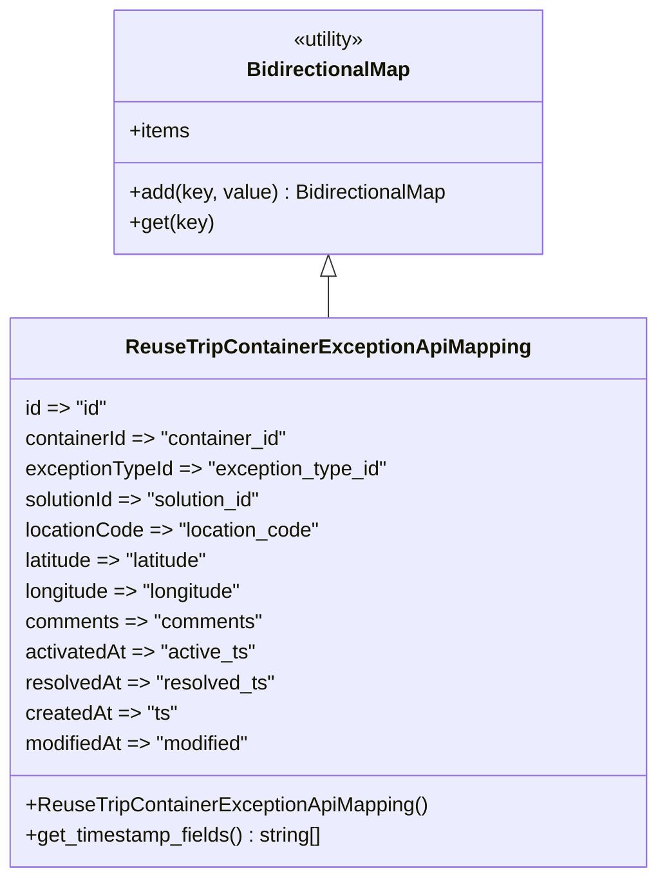

# Diagram: container_tracking_core/container_tracking_service/container_tracking_service/api/exception/ReuseTripContainerExceptionApiMapping.py


> Auto-generated by Obscura crawlers

## Diagram 1



### SVG

<svg id="container" width="507.7734375" xmlns="http://www.w3.org/2000/svg" class="classDiagram" height="690" viewBox="0 0 507.7734375 690" role="graphics-document document" aria-roledescription="class"><style>#container{font-family:"trebuchet ms",verdana,arial,sans-serif;font-size:16px;fill:#333;}@keyframes edge-animation-frame{from{stroke-dashoffset:0;}}@keyframes dash{to{stroke-dashoffset:0;}}#container .edge-animation-slow{stroke-dasharray:9,5!important;stroke-dashoffset:900;animation:dash 50s linear infinite;stroke-linecap:round;}#container .edge-animation-fast{stroke-dasharray:9,5!important;stroke-dashoffset:900;animation:dash 20s linear infinite;stroke-linecap:round;}#container .error-icon{fill:#552222;}#container .error-text{fill:#552222;stroke:#552222;}#container .edge-thickness-normal{stroke-width:1px;}#container .edge-thickness-thick{stroke-width:3.5px;}#container .edge-pattern-solid{stroke-dasharray:0;}#container .edge-thickness-invisible{stroke-width:0;fill:none;}#container .edge-pattern-dashed{stroke-dasharray:3;}#container .edge-pattern-dotted{stroke-dasharray:2;}#container .marker{fill:#333333;stroke:#333333;}#container .marker.cross{stroke:#333333;}#container svg{font-family:"trebuchet ms",verdana,arial,sans-serif;font-size:16px;}#container p{margin:0;}#container g.classGroup text{fill:#9370DB;stroke:none;font-family:"trebuchet ms",verdana,arial,sans-serif;font-size:10px;}#container g.classGroup text .title{font-weight:bolder;}#container .nodeLabel,#container .edgeLabel{color:#131300;}#container .edgeLabel .label rect{fill:#ECECFF;}#container .label text{fill:#131300;}#container .labelBkg{background:#ECECFF;}#container .edgeLabel .label span{background:#ECECFF;}#container .classTitle{font-weight:bolder;}#container .node rect,#container .node circle,#container .node ellipse,#container .node polygon,#container .node path{fill:#ECECFF;stroke:#9370DB;stroke-width:1px;}#container .divider{stroke:#9370DB;stroke-width:1;}#container g.clickable{cursor:pointer;}#container g.classGroup rect{fill:#ECECFF;stroke:#9370DB;}#container g.classGroup line{stroke:#9370DB;stroke-width:1;}#container .classLabel .box{stroke:none;stroke-width:0;fill:#ECECFF;opacity:0.5;}#container .classLabel .label{fill:#9370DB;font-size:10px;}#container .relation{stroke:#333333;stroke-width:1;fill:none;}#container .dashed-line{stroke-dasharray:3;}#container .dotted-line{stroke-dasharray:1 2;}#container #compositionStart,#container .composition{fill:#333333!important;stroke:#333333!important;stroke-width:1;}#container #compositionEnd,#container .composition{fill:#333333!important;stroke:#333333!important;stroke-width:1;}#container #dependencyStart,#container .dependency{fill:#333333!important;stroke:#333333!important;stroke-width:1;}#container #dependencyStart,#container .dependency{fill:#333333!important;stroke:#333333!important;stroke-width:1;}#container #extensionStart,#container .extension{fill:transparent!important;stroke:#333333!important;stroke-width:1;}#container #extensionEnd,#container .extension{fill:transparent!important;stroke:#333333!important;stroke-width:1;}#container #aggregationStart,#container .aggregation{fill:transparent!important;stroke:#333333!important;stroke-width:1;}#container #aggregationEnd,#container .aggregation{fill:transparent!important;stroke:#333333!important;stroke-width:1;}#container #lollipopStart,#container .lollipop{fill:#ECECFF!important;stroke:#333333!important;stroke-width:1;}#container #lollipopEnd,#container .lollipop{fill:#ECECFF!important;stroke:#333333!important;stroke-width:1;}#container .edgeTerminals{font-size:11px;line-height:initial;}#container .classTitleText{text-anchor:middle;font-size:18px;fill:#333;}#container .label-icon{display:inline-block;height:1em;overflow:visible;vertical-align:-0.125em;}#container .node .label-icon path{fill:currentColor;stroke:revert;stroke-width:revert;}#container :root{--mermaid-font-family:"trebuchet ms",verdana,arial,sans-serif;}</style><g><defs><marker id="container_class-aggregationStart" class="marker aggregation class" refX="18" refY="7" markerWidth="190" markerHeight="240" orient="auto"><path d="M 18,7 L9,13 L1,7 L9,1 Z"></path></marker></defs><defs><marker id="container_class-aggregationEnd" class="marker aggregation class" refX="1" refY="7" markerWidth="20" markerHeight="28" orient="auto"><path d="M 18,7 L9,13 L1,7 L9,1 Z"></path></marker></defs><defs><marker id="container_class-extensionStart" class="marker extension class" refX="18" refY="7" markerWidth="190" markerHeight="240" orient="auto"><path d="M 1,7 L18,13 V 1 Z"></path></marker></defs><defs><marker id="container_class-extensionEnd" class="marker extension class" refX="1" refY="7" markerWidth="20" markerHeight="28" orient="auto"><path d="M 1,1 V 13 L18,7 Z"></path></marker></defs><defs><marker id="container_class-compositionStart" class="marker composition class" refX="18" refY="7" markerWidth="190" markerHeight="240" orient="auto"><path d="M 18,7 L9,13 L1,7 L9,1 Z"></path></marker></defs><defs><marker id="container_class-compositionEnd" class="marker composition class" refX="1" refY="7" markerWidth="20" markerHeight="28" orient="auto"><path d="M 18,7 L9,13 L1,7 L9,1 Z"></path></marker></defs><defs><marker id="container_class-dependencyStart" class="marker dependency class" refX="6" refY="7" markerWidth="190" markerHeight="240" orient="auto"><path d="M 5,7 L9,13 L1,7 L9,1 Z"></path></marker></defs><defs><marker id="container_class-dependencyEnd" class="marker dependency class" refX="13" refY="7" markerWidth="20" markerHeight="28" orient="auto"><path d="M 18,7 L9,13 L14,7 L9,1 Z"></path></marker></defs><defs><marker id="container_class-lollipopStart" class="marker lollipop class" refX="13" refY="7" markerWidth="190" markerHeight="240" orient="auto"><circle stroke="black" fill="transparent" cx="7" cy="7" r="6"></circle></marker></defs><defs><marker id="container_class-lollipopEnd" class="marker lollipop class" refX="1" refY="7" markerWidth="190" markerHeight="240" orient="auto"><circle stroke="black" fill="transparent" cx="7" cy="7" r="6"></circle></marker></defs><g class="root"><g class="clusters"></g><g class="edgePaths"><path d="M253.887,217.25L253.887,218.542C253.887,219.833,253.887,222.417,253.887,227.875C253.887,233.333,253.887,241.667,253.887,245.833L253.887,250" id="id_BidirectionalMap_ReuseTripContainerExceptionApiMapping_1" class="edge-thickness-normal edge-pattern-solid relation" style=";;;" data-edge="true" data-et="edge" data-id="id_BidirectionalMap_ReuseTripContainerExceptionApiMapping_1" data-points="W3sieCI6MjUzLjg4NjcxODc1LCJ5IjoyMDB9LHsieCI6MjUzLjg4NjcxODc1LCJ5IjoyMjV9LHsieCI6MjUzLjg4NjcxODc1LCJ5IjoyNTB9XQ==" marker-start="url(#container_class-extensionStart)"></path></g><g class="edgeLabels"><g class="edgeLabel"><g class="label" data-id="id_BidirectionalMap_ReuseTripContainerExceptionApiMapping_1" transform="translate(0, 0)"><foreignObject width="0" height="0"><div xmlns="http://www.w3.org/1999/xhtml" class="labelBkg" style="display: table-cell; white-space: nowrap; line-height: 1.5; max-width: 200px; text-align: center;"><span class="edgeLabel"></span></div></foreignObject></g></g></g><g class="nodes"><g class="node default" id="classId-BidirectionalMap-0" transform="translate(253.88671875, 104)"><g class="basic label-container"><path d="M-169.33984375 -96 L169.33984375 -96 L169.33984375 96 L-169.33984375 96" stroke="none" stroke-width="0" fill="#ECECFF" style=""></path><path d="M-169.33984375 -96 C-80.40906557512709 -96, 8.521712599745825 -96, 169.33984375 -96 M-169.33984375 -96 C-60.36508627386249 -96, 48.609671202275024 -96, 169.33984375 -96 M169.33984375 -96 C169.33984375 -25.28245631158866, 169.33984375 45.43508737682268, 169.33984375 96 M169.33984375 -96 C169.33984375 -19.43915591153828, 169.33984375 57.12168817692344, 169.33984375 96 M169.33984375 96 C98.96349984009672 96, 28.587155930193433 96, -169.33984375 96 M169.33984375 96 C95.29583396293515 96, 21.251824175870297 96, -169.33984375 96 M-169.33984375 96 C-169.33984375 27.521791707237412, -169.33984375 -40.956416585525176, -169.33984375 -96 M-169.33984375 96 C-169.33984375 46.21180351038835, -169.33984375 -3.5763929792233, -169.33984375 -96" stroke="#9370DB" stroke-width="1.3" fill="none" stroke-dasharray="0 0" style=""></path></g><g class="annotation-group text" transform="translate(-30.3125, -72)"><g class="label" style="" transform="translate(0,-12)"><foreignObject width="60.625" height="24"><div xmlns="http://www.w3.org/1999/xhtml" style="display: table-cell; white-space: nowrap; line-height: 1.5; max-width: 111px; text-align: center;"><span class="nodeLabel markdown-node-label" style=""><p>«utility»</p></span></div></foreignObject></g></g><g class="label-group text" transform="translate(-62.2265625, -48)"><g class="label" style="font-weight: bolder" transform="translate(0,-12)"><foreignObject width="124.453125" height="24"><div xmlns="http://www.w3.org/1999/xhtml" style="display: table-cell; white-space: nowrap; line-height: 1.5; max-width: 173px; text-align: center;"><span class="nodeLabel markdown-node-label" style=""><p>BidirectionalMap</p></span></div></foreignObject></g></g><g class="members-group text" transform="translate(-157.33984375, 0)"><g class="label" style="" transform="translate(0,-12)"><foreignObject width="47.9375" height="24"><div xmlns="http://www.w3.org/1999/xhtml" style="display: table-cell; white-space: nowrap; line-height: 1.5; max-width: 105px; text-align: center;"><span class="nodeLabel markdown-node-label" style=""><p>+items</p></span></div></foreignObject></g></g><g class="methods-group text" transform="translate(-157.33984375, 48)"><g class="label" style="" transform="translate(0,-12)"><foreignObject width="252.453125" height="24"><div xmlns="http://www.w3.org/1999/xhtml" style="display: table-cell; white-space: nowrap; line-height: 1.5; max-width: 310px; text-align: center;"><span class="nodeLabel markdown-node-label" style=""><p>+add(key, value) : BidirectionalMap</p></span></div></foreignObject></g><g class="label" style="" transform="translate(0,12)"><foreignObject width="65.5" height="24"><div xmlns="http://www.w3.org/1999/xhtml" style="display: table-cell; white-space: nowrap; line-height: 1.5; max-width: 123px; text-align: center;"><span class="nodeLabel markdown-node-label" style=""><p>+get(key)</p></span></div></foreignObject></g></g><g class="divider" style=""><path d="M-169.33984375 -24 C-65.17243572831663 -24, 38.99497229336674 -24, 169.33984375 -24 M-169.33984375 -24 C-72.21841085046887 -24, 24.90302204906226 -24, 169.33984375 -24" stroke="#9370DB" stroke-width="1.3" fill="none" stroke-dasharray="0 0" style=""></path></g><g class="divider" style=""><path d="M-169.33984375 24 C-100.21141655001573 24, -31.082989350031454 24, 169.33984375 24 M-169.33984375 24 C-81.20121599892627 24, 6.9374117521474545 24, 169.33984375 24" stroke="#9370DB" stroke-width="1.3" fill="none" stroke-dasharray="0 0" style=""></path></g></g><g class="node default" id="classId-ReuseTripContainerExceptionApiMapping-1" transform="translate(253.88671875, 466)"><g class="basic label-container"><path d="M-245.88671875 -216 L245.88671875 -216 L245.88671875 216 L-245.88671875 216" stroke="none" stroke-width="0" fill="#ECECFF" style=""></path><path d="M-245.88671875 -216 C-59.5932426227597 -216, 126.7002335044806 -216, 245.88671875 -216 M-245.88671875 -216 C-124.25019577753967 -216, -2.6136728050793465 -216, 245.88671875 -216 M245.88671875 -216 C245.88671875 -108.54310801697568, 245.88671875 -1.0862160339513593, 245.88671875 216 M245.88671875 -216 C245.88671875 -57.08453776504638, 245.88671875 101.83092446990725, 245.88671875 216 M245.88671875 216 C121.60300323883321 216, -2.6807122723335794 216, -245.88671875 216 M245.88671875 216 C51.66845431021244 216, -142.54981012957512 216, -245.88671875 216 M-245.88671875 216 C-245.88671875 62.092267742391016, -245.88671875 -91.81546451521797, -245.88671875 -216 M-245.88671875 216 C-245.88671875 93.84449085769813, -245.88671875 -28.311018284603733, -245.88671875 -216" stroke="#9370DB" stroke-width="1.3" fill="none" stroke-dasharray="0 0" style=""></path></g><g class="annotation-group text" transform="translate(0, -192)"></g><g class="label-group text" transform="translate(-150.9609375, -192)"><g class="label" style="font-weight: bolder" transform="translate(0,-12)"><foreignObject width="301.921875" height="24"><div xmlns="http://www.w3.org/1999/xhtml" style="display: table-cell; white-space: nowrap; line-height: 1.5; max-width: 349px; text-align: center;"><span class="nodeLabel markdown-node-label" style=""><p>ReuseTripContainerExceptionApiMapping</p></span></div></foreignObject></g></g><g class="members-group text" transform="translate(-233.88671875, -144)"><g class="label" style="" transform="translate(0,-12)"><foreignObject width="65.421875" height="24"><div xmlns="http://www.w3.org/1999/xhtml" style="display: table-cell; white-space: nowrap; line-height: 1.5; max-width: 137px; text-align: center;"><span class="nodeLabel markdown-node-label" style=""><p>id =&gt; "id"</p></span></div></foreignObject></g><g class="label" style="" transform="translate(0,12)"><foreignObject width="210.90625" height="24"><div xmlns="http://www.w3.org/1999/xhtml" style="display: table-cell; white-space: nowrap; line-height: 1.5; max-width: 283px; text-align: center;"><span class="nodeLabel markdown-node-label" style=""><p>containerId =&gt; "container_id"</p></span></div></foreignObject></g><g class="label" style="" transform="translate(0,36)"><foreignObject width="288.484375" height="24"><div xmlns="http://www.w3.org/1999/xhtml" style="display: table-cell; white-space: nowrap; line-height: 1.5; max-width: 360px; text-align: center;"><span class="nodeLabel markdown-node-label" style=""><p>exceptionTypeId =&gt; "exception_type_id"</p></span></div></foreignObject></g><g class="label" style="" transform="translate(0,60)"><foreignObject width="193.4375" height="24"><div xmlns="http://www.w3.org/1999/xhtml" style="display: table-cell; white-space: nowrap; line-height: 1.5; max-width: 265px; text-align: center;"><span class="nodeLabel markdown-node-label" style=""><p>solutionId =&gt; "solution_id"</p></span></div></foreignObject></g><g class="label" style="" transform="translate(0,84)"><foreignObject width="234.625" height="24"><div xmlns="http://www.w3.org/1999/xhtml" style="display: table-cell; white-space: nowrap; line-height: 1.5; max-width: 306px; text-align: center;"><span class="nodeLabel markdown-node-label" style=""><p>locationCode =&gt; "location_code"</p></span></div></foreignObject></g><g class="label" style="" transform="translate(0,108)"><foreignObject width="151.046875" height="24"><div xmlns="http://www.w3.org/1999/xhtml" style="display: table-cell; white-space: nowrap; line-height: 1.5; max-width: 223px; text-align: center;"><span class="nodeLabel markdown-node-label" style=""><p>latitude =&gt; "latitude"</p></span></div></foreignObject></g><g class="label" style="" transform="translate(0,132)"><foreignObject width="176.171875" height="24"><div xmlns="http://www.w3.org/1999/xhtml" style="display: table-cell; white-space: nowrap; line-height: 1.5; max-width: 248px; text-align: center;"><span class="nodeLabel markdown-node-label" style=""><p>longitude =&gt; "longitude"</p></span></div></foreignObject></g><g class="label" style="" transform="translate(0,156)"><foreignObject width="187.734375" height="24"><div xmlns="http://www.w3.org/1999/xhtml" style="display: table-cell; white-space: nowrap; line-height: 1.5; max-width: 259px; text-align: center;"><span class="nodeLabel markdown-node-label" style=""><p>comments =&gt; "comments"</p></span></div></foreignObject></g><g class="label" style="" transform="translate(0,180)"><foreignObject width="182.59375" height="24"><div xmlns="http://www.w3.org/1999/xhtml" style="display: table-cell; white-space: nowrap; line-height: 1.5; max-width: 254px; text-align: center;"><span class="nodeLabel markdown-node-label" style=""><p>activatedAt =&gt; "active_ts"</p></span></div></foreignObject></g><g class="label" style="" transform="translate(0,204)"><foreignObject width="196.921875" height="24"><div xmlns="http://www.w3.org/1999/xhtml" style="display: table-cell; white-space: nowrap; line-height: 1.5; max-width: 269px; text-align: center;"><span class="nodeLabel markdown-node-label" style=""><p>resolvedAt =&gt; "resolved_ts"</p></span></div></foreignObject></g><g class="label" style="" transform="translate(0,228)"><foreignObject width="119.796875" height="24"><div xmlns="http://www.w3.org/1999/xhtml" style="display: table-cell; white-space: nowrap; line-height: 1.5; max-width: 191px; text-align: center;"><span class="nodeLabel markdown-node-label" style=""><p>createdAt =&gt; "ts"</p></span></div></foreignObject></g><g class="label" style="" transform="translate(0,252)"><foreignObject width="181.453125" height="24"><div xmlns="http://www.w3.org/1999/xhtml" style="display: table-cell; white-space: nowrap; line-height: 1.5; max-width: 253px; text-align: center;"><span class="nodeLabel markdown-node-label" style=""><p>modifiedAt =&gt; "modified"</p></span></div></foreignObject></g></g><g class="methods-group text" transform="translate(-233.88671875, 168)"><g class="label" style="" transform="translate(0,-12)"><foreignObject width="316.8125" height="24"><div xmlns="http://www.w3.org/1999/xhtml" style="display: table-cell; white-space: nowrap; line-height: 1.5; max-width: 374px; text-align: center;"><span class="nodeLabel markdown-node-label" style=""><p>+ReuseTripContainerExceptionApiMapping()</p></span></div></foreignObject></g><g class="label" style="" transform="translate(0,12)"><foreignObject width="238.203125" height="24"><div xmlns="http://www.w3.org/1999/xhtml" style="display: table-cell; white-space: nowrap; line-height: 1.5; max-width: 296px; text-align: center;"><span class="nodeLabel markdown-node-label" style=""><p>+get_timestamp_fields() : string[]</p></span></div></foreignObject></g></g><g class="divider" style=""><path d="M-245.88671875 -168 C-77.77364116001317 -168, 90.33943642997366 -168, 245.88671875 -168 M-245.88671875 -168 C-94.12229366093396 -168, 57.642131428132075 -168, 245.88671875 -168" stroke="#9370DB" stroke-width="1.3" fill="none" stroke-dasharray="0 0" style=""></path></g><g class="divider" style=""><path d="M-245.88671875 144 C-55.08497993669039 144, 135.71675887661922 144, 245.88671875 144 M-245.88671875 144 C-82.10968318087026 144, 81.66735238825947 144, 245.88671875 144" stroke="#9370DB" stroke-width="1.3" fill="none" stroke-dasharray="0 0" style=""></path></g></g></g></g></g></svg>

## Diagram 2

```mermaid
flowchart TD
    A[Instantiate ReuseTripContainerExceptionApiMapping] --> B[Call BidirectionalMap.__init__]
    B --> C[Chain .add(...) calls to register mappings]
    C --> D{Mappings registered}
    D --> E[Standard fields: id, containerId, exceptionTypeId, solutionId, locationCode, latitude, longitude, comments]
    D --> F[Timestamp fields: activatedAt, resolvedAt, createdAt, modifiedAt]
    C --> G[Method get_timestamp_fields() called]
    G --> H["returns [\"activatedAt\", \"resolvedAt\", \"createdAt\", \"modifiedAt\"]"]
```

> SVG rendering failed for this diagram.
