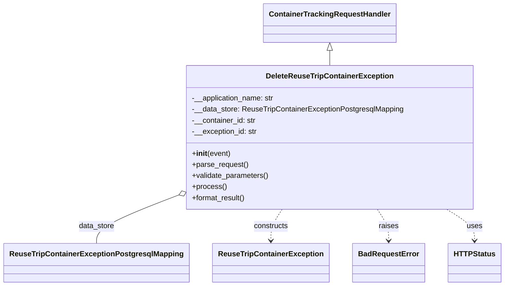

# Diagram: container_tracking_core/container_tracking_service/container_tracking_service/api/exception/handlers/DeleteReuseTripContainerException.py


> Auto-generated by Obscura crawlers

## Diagram 1



### SVG

<svg id="container" width="1042.4375" xmlns="http://www.w3.org/2000/svg" class="classDiagram" height="620" viewBox="0 0 1042.4375 620" role="graphics-document document" aria-roledescription="class"><style>#container{font-family:"trebuchet ms",verdana,arial,sans-serif;font-size:16px;fill:#333;}@keyframes edge-animation-frame{from{stroke-dashoffset:0;}}@keyframes dash{to{stroke-dashoffset:0;}}#container .edge-animation-slow{stroke-dasharray:9,5!important;stroke-dashoffset:900;animation:dash 50s linear infinite;stroke-linecap:round;}#container .edge-animation-fast{stroke-dasharray:9,5!important;stroke-dashoffset:900;animation:dash 20s linear infinite;stroke-linecap:round;}#container .error-icon{fill:#552222;}#container .error-text{fill:#552222;stroke:#552222;}#container .edge-thickness-normal{stroke-width:1px;}#container .edge-thickness-thick{stroke-width:3.5px;}#container .edge-pattern-solid{stroke-dasharray:0;}#container .edge-thickness-invisible{stroke-width:0;fill:none;}#container .edge-pattern-dashed{stroke-dasharray:3;}#container .edge-pattern-dotted{stroke-dasharray:2;}#container .marker{fill:#333333;stroke:#333333;}#container .marker.cross{stroke:#333333;}#container svg{font-family:"trebuchet ms",verdana,arial,sans-serif;font-size:16px;}#container p{margin:0;}#container g.classGroup text{fill:#9370DB;stroke:none;font-family:"trebuchet ms",verdana,arial,sans-serif;font-size:10px;}#container g.classGroup text .title{font-weight:bolder;}#container .nodeLabel,#container .edgeLabel{color:#131300;}#container .edgeLabel .label rect{fill:#ECECFF;}#container .label text{fill:#131300;}#container .labelBkg{background:#ECECFF;}#container .edgeLabel .label span{background:#ECECFF;}#container .classTitle{font-weight:bolder;}#container .node rect,#container .node circle,#container .node ellipse,#container .node polygon,#container .node path{fill:#ECECFF;stroke:#9370DB;stroke-width:1px;}#container .divider{stroke:#9370DB;stroke-width:1;}#container g.clickable{cursor:pointer;}#container g.classGroup rect{fill:#ECECFF;stroke:#9370DB;}#container g.classGroup line{stroke:#9370DB;stroke-width:1;}#container .classLabel .box{stroke:none;stroke-width:0;fill:#ECECFF;opacity:0.5;}#container .classLabel .label{fill:#9370DB;font-size:10px;}#container .relation{stroke:#333333;stroke-width:1;fill:none;}#container .dashed-line{stroke-dasharray:3;}#container .dotted-line{stroke-dasharray:1 2;}#container #compositionStart,#container .composition{fill:#333333!important;stroke:#333333!important;stroke-width:1;}#container #compositionEnd,#container .composition{fill:#333333!important;stroke:#333333!important;stroke-width:1;}#container #dependencyStart,#container .dependency{fill:#333333!important;stroke:#333333!important;stroke-width:1;}#container #dependencyStart,#container .dependency{fill:#333333!important;stroke:#333333!important;stroke-width:1;}#container #extensionStart,#container .extension{fill:transparent!important;stroke:#333333!important;stroke-width:1;}#container #extensionEnd,#container .extension{fill:transparent!important;stroke:#333333!important;stroke-width:1;}#container #aggregationStart,#container .aggregation{fill:transparent!important;stroke:#333333!important;stroke-width:1;}#container #aggregationEnd,#container .aggregation{fill:transparent!important;stroke:#333333!important;stroke-width:1;}#container #lollipopStart,#container .lollipop{fill:#ECECFF!important;stroke:#333333!important;stroke-width:1;}#container #lollipopEnd,#container .lollipop{fill:#ECECFF!important;stroke:#333333!important;stroke-width:1;}#container .edgeTerminals{font-size:11px;line-height:initial;}#container .classTitleText{text-anchor:middle;font-size:18px;fill:#333;}#container .label-icon{display:inline-block;height:1em;overflow:visible;vertical-align:-0.125em;}#container .node .label-icon path{fill:currentColor;stroke:revert;stroke-width:revert;}#container :root{--mermaid-font-family:"trebuchet ms",verdana,arial,sans-serif;}</style><g><defs><marker id="container_class-aggregationStart" class="marker aggregation class" refX="18" refY="7" markerWidth="190" markerHeight="240" orient="auto"><path d="M 18,7 L9,13 L1,7 L9,1 Z"></path></marker></defs><defs><marker id="container_class-aggregationEnd" class="marker aggregation class" refX="1" refY="7" markerWidth="20" markerHeight="28" orient="auto"><path d="M 18,7 L9,13 L1,7 L9,1 Z"></path></marker></defs><defs><marker id="container_class-extensionStart" class="marker extension class" refX="18" refY="7" markerWidth="190" markerHeight="240" orient="auto"><path d="M 1,7 L18,13 V 1 Z"></path></marker></defs><defs><marker id="container_class-extensionEnd" class="marker extension class" refX="1" refY="7" markerWidth="20" markerHeight="28" orient="auto"><path d="M 1,1 V 13 L18,7 Z"></path></marker></defs><defs><marker id="container_class-compositionStart" class="marker composition class" refX="18" refY="7" markerWidth="190" markerHeight="240" orient="auto"><path d="M 18,7 L9,13 L1,7 L9,1 Z"></path></marker></defs><defs><marker id="container_class-compositionEnd" class="marker composition class" refX="1" refY="7" markerWidth="20" markerHeight="28" orient="auto"><path d="M 18,7 L9,13 L1,7 L9,1 Z"></path></marker></defs><defs><marker id="container_class-dependencyStart" class="marker dependency class" refX="6" refY="7" markerWidth="190" markerHeight="240" orient="auto"><path d="M 5,7 L9,13 L1,7 L9,1 Z"></path></marker></defs><defs><marker id="container_class-dependencyEnd" class="marker dependency class" refX="13" refY="7" markerWidth="20" markerHeight="28" orient="auto"><path d="M 18,7 L9,13 L14,7 L9,1 Z"></path></marker></defs><defs><marker id="container_class-lollipopStart" class="marker lollipop class" refX="13" refY="7" markerWidth="190" markerHeight="240" orient="auto"><circle stroke="black" fill="transparent" cx="7" cy="7" r="6"></circle></marker></defs><defs><marker id="container_class-lollipopEnd" class="marker lollipop class" refX="1" refY="7" markerWidth="190" markerHeight="240" orient="auto"><circle stroke="black" fill="transparent" cx="7" cy="7" r="6"></circle></marker></defs><g class="root"><g class="clusters"></g><g class="edgePaths"><path d="M679.926,109.25L679.926,110.542C679.926,111.833,679.926,114.417,679.926,119.875C679.926,125.333,679.926,133.667,679.926,137.833L679.926,142" id="id_ContainerTrackingRequestHandler_DeleteReuseTripContainerException_1" class="edge-thickness-normal edge-pattern-solid relation" style=";;;" data-edge="true" data-et="edge" data-id="id_ContainerTrackingRequestHandler_DeleteReuseTripContainerException_1" data-points="W3sieCI6Njc5LjkyNTc4MTI1LCJ5Ijo5Mn0seyJ4Ijo2NzkuOTI1NzgxMjUsInkiOjExN30seyJ4Ijo2NzkuOTI1NzgxMjUsInkiOjE0Mn1d" marker-start="url(#container_class-extensionStart)"></path><path d="M357.167,427.287L330.657,437.906C304.148,448.525,251.128,469.762,224.619,486.548C198.109,503.333,198.109,515.667,198.109,521.833L198.109,528" id="id_DeleteReuseTripContainerException_ReuseTripContainerExceptionPostgresqlMapping_2" class="edge-thickness-normal edge-pattern-solid relation" style=";;;" data-edge="true" data-et="edge" data-id="id_DeleteReuseTripContainerException_ReuseTripContainerExceptionPostgresqlMapping_2" data-points="W3sieCI6MzczLjE3OTY4NzUsInkiOjQyMC44NzI1MjAxNjcwMTEyfSx7IngiOjE5OC4xMDkzNzUsInkiOjQ5MX0seyJ4IjoxOTguMTA5Mzc1LCJ5Ijo1Mjh9XQ==" marker-start="url(#container_class-aggregationStart)"></path><path d="M581.318,454L577.42,460.167C573.522,466.333,565.726,478.667,561.828,490C557.93,501.333,557.93,511.667,557.93,516.833L557.93,522" id="id_DeleteReuseTripContainerException_ReuseTripContainerException_3" class="edge-thickness-normal edge-pattern-dashed relation" style=";;;" data-edge="true" data-et="edge" data-id="id_DeleteReuseTripContainerException_ReuseTripContainerException_3" data-points="W3sieCI6NTgxLjMxNzUzOTY2OTY4OTIsInkiOjQ1NH0seyJ4Ijo1NTcuOTI5Njg3NSwieSI6NDkxfSx7IngiOjU1Ny45Mjk2ODc1LCJ5Ijo1Mjh9XQ==" marker-end="url(#container_class-dependencyEnd)"></path><path d="M778.534,454L782.432,460.167C786.33,466.333,794.126,478.667,798.024,490C801.922,501.333,801.922,511.667,801.922,516.833L801.922,522" id="id_DeleteReuseTripContainerException_BadRequestError_4" class="edge-thickness-normal edge-pattern-dashed relation" style=";;;" data-edge="true" data-et="edge" data-id="id_DeleteReuseTripContainerException_BadRequestError_4" data-points="W3sieCI6Nzc4LjUzNDAyMjgzMDMxMDgsInkiOjQ1NH0seyJ4Ijo4MDEuOTIxODc1LCJ5Ijo0OTF9LHsieCI6ODAxLjkyMTg3NSwieSI6NTI4fV0=" marker-end="url(#container_class-dependencyEnd)"></path><path d="M922.732,454L932.33,460.167C941.928,466.333,961.124,478.667,970.722,490C980.32,501.333,980.32,511.667,980.32,516.833L980.32,522" id="id_DeleteReuseTripContainerException_HTTPStatus_5" class="edge-thickness-normal edge-pattern-dashed relation" style=";;;" data-edge="true" data-et="edge" data-id="id_DeleteReuseTripContainerException_HTTPStatus_5" data-points="W3sieCI6OTIyLjczMTcyMzYwNzUxMywieSI6NDU0fSx7IngiOjk4MC4zMjAzMTI1LCJ5Ijo0OTF9LHsieCI6OTgwLjMyMDMxMjUsInkiOjUyOH1d" marker-end="url(#container_class-dependencyEnd)"></path></g><g class="edgeLabels"><g class="edgeLabel"><g class="label" data-id="id_ContainerTrackingRequestHandler_DeleteReuseTripContainerException_1" transform="translate(0, 0)"><foreignObject width="0" height="0"><div xmlns="http://www.w3.org/1999/xhtml" class="labelBkg" style="display: table-cell; white-space: nowrap; line-height: 1.5; max-width: 200px; text-align: center;"><span class="edgeLabel"></span></div></foreignObject></g></g><g class="edgeLabel" transform="translate(198.109375, 491)"><g class="label" data-id="id_DeleteReuseTripContainerException_ReuseTripContainerExceptionPostgresqlMapping_2" transform="translate(-38.8671875, -12)"><foreignObject width="77.734375" height="24"><div xmlns="http://www.w3.org/1999/xhtml" class="labelBkg" style="display: table-cell; white-space: nowrap; line-height: 1.5; max-width: 200px; text-align: center;"><span class="edgeLabel"><p>data_store</p></span></div></foreignObject></g></g><g class="edgeLabel" transform="translate(557.9296875, 491)"><g class="label" data-id="id_DeleteReuseTripContainerException_ReuseTripContainerException_3" transform="translate(-37.84375, -12)"><foreignObject width="75.6875" height="24"><div xmlns="http://www.w3.org/1999/xhtml" class="labelBkg" style="display: table-cell; white-space: nowrap; line-height: 1.5; max-width: 200px; text-align: center;"><span class="edgeLabel"><p>constructs</p></span></div></foreignObject></g></g><g class="edgeLabel" transform="translate(801.921875, 491)"><g class="label" data-id="id_DeleteReuseTripContainerException_BadRequestError_4" transform="translate(-21.25, -12)"><foreignObject width="42.5" height="24"><div xmlns="http://www.w3.org/1999/xhtml" class="labelBkg" style="display: table-cell; white-space: nowrap; line-height: 1.5; max-width: 200px; text-align: center;"><span class="edgeLabel"><p>raises</p></span></div></foreignObject></g></g><g class="edgeLabel" transform="translate(980.3203125, 491)"><g class="label" data-id="id_DeleteReuseTripContainerException_HTTPStatus_5" transform="translate(-16.4921875, -12)"><foreignObject width="32.984375" height="24"><div xmlns="http://www.w3.org/1999/xhtml" class="labelBkg" style="display: table-cell; white-space: nowrap; line-height: 1.5; max-width: 200px; text-align: center;"><span class="edgeLabel"><p>uses</p></span></div></foreignObject></g></g></g><g class="nodes"><g class="node default" id="classId-DeleteReuseTripContainerException-0" transform="translate(679.92578125, 298)"><g class="basic label-container"><path d="M-306.74609375 -156 L306.74609375 -156 L306.74609375 156 L-306.74609375 156" stroke="none" stroke-width="0" fill="#ECECFF" style=""></path><path d="M-306.74609375 -156 C-176.66693741672793 -156, -46.587781083455866 -156, 306.74609375 -156 M-306.74609375 -156 C-86.60695155203538 -156, 133.53219064592923 -156, 306.74609375 -156 M306.74609375 -156 C306.74609375 -60.2693979124479, 306.74609375 35.4612041751042, 306.74609375 156 M306.74609375 -156 C306.74609375 -39.62686961137638, 306.74609375 76.74626077724724, 306.74609375 156 M306.74609375 156 C120.46219092608098 156, -65.82171189783804 156, -306.74609375 156 M306.74609375 156 C170.50853853161328 156, 34.270983313226566 156, -306.74609375 156 M-306.74609375 156 C-306.74609375 36.71377475788812, -306.74609375 -82.57245048422376, -306.74609375 -156 M-306.74609375 156 C-306.74609375 59.3804417054903, -306.74609375 -37.2391165890194, -306.74609375 -156" stroke="#9370DB" stroke-width="1.3" fill="none" stroke-dasharray="0 0" style=""></path></g><g class="annotation-group text" transform="translate(0, -132)"></g><g class="label-group text" transform="translate(-131.4453125, -132)"><g class="label" style="font-weight: bolder" transform="translate(0,-12)"><foreignObject width="262.890625" height="24"><div xmlns="http://www.w3.org/1999/xhtml" style="display: table-cell; white-space: nowrap; line-height: 1.5; max-width: 310px; text-align: center;"><span class="nodeLabel markdown-node-label" style=""><p>DeleteReuseTripContainerException</p></span></div></foreignObject></g></g><g class="members-group text" transform="translate(-294.74609375, -84)"><g class="label" style="" transform="translate(0,-12)"><foreignObject width="179.78125" height="24"><div xmlns="http://www.w3.org/1999/xhtml" style="display: table-cell; white-space: nowrap; line-height: 1.5; max-width: 238px; text-align: center;"><span class="nodeLabel markdown-node-label" style=""><p>-__application_name: str</p></span></div></foreignObject></g><g class="label" style="" transform="translate(0,12)"><foreignObject width="458.046875" height="24"><div xmlns="http://www.w3.org/1999/xhtml" style="display: table-cell; white-space: nowrap; line-height: 1.5; max-width: 516px; text-align: center;"><span class="nodeLabel markdown-node-label" style=""><p>-__data_store: ReuseTripContainerExceptionPostgresqlMapping</p></span></div></foreignObject></g><g class="label" style="" transform="translate(0,36)"><foreignObject width="139.15625" height="24"><div xmlns="http://www.w3.org/1999/xhtml" style="display: table-cell; white-space: nowrap; line-height: 1.5; max-width: 197px; text-align: center;"><span class="nodeLabel markdown-node-label" style=""><p>-__container_id: str</p></span></div></foreignObject></g><g class="label" style="" transform="translate(0,60)"><foreignObject width="141.984375" height="24"><div xmlns="http://www.w3.org/1999/xhtml" style="display: table-cell; white-space: nowrap; line-height: 1.5; max-width: 200px; text-align: center;"><span class="nodeLabel markdown-node-label" style=""><p>-__exception_id: str</p></span></div></foreignObject></g></g><g class="methods-group text" transform="translate(-294.74609375, 36)"><g class="label" style="" transform="translate(0,-12)"><foreignObject width="83.140625" height="24"><div xmlns="http://www.w3.org/1999/xhtml" style="display: table-cell; white-space: nowrap; line-height: 1.5; max-width: 172px; text-align: center;"><span class="nodeLabel markdown-node-label" style=""><p>+<strong>init</strong>(event)</p></span></div></foreignObject></g><g class="label" style="" transform="translate(0,12)"><foreignObject width="121.796875" height="24"><div xmlns="http://www.w3.org/1999/xhtml" style="display: table-cell; white-space: nowrap; line-height: 1.5; max-width: 179px; text-align: center;"><span class="nodeLabel markdown-node-label" style=""><p>+parse_request()</p></span></div></foreignObject></g><g class="label" style="" transform="translate(0,36)"><foreignObject width="166.546875" height="24"><div xmlns="http://www.w3.org/1999/xhtml" style="display: table-cell; white-space: nowrap; line-height: 1.5; max-width: 224px; text-align: center;"><span class="nodeLabel markdown-node-label" style=""><p>+validate_parameters()</p></span></div></foreignObject></g><g class="label" style="" transform="translate(0,60)"><foreignObject width="73.734375" height="24"><div xmlns="http://www.w3.org/1999/xhtml" style="display: table-cell; white-space: nowrap; line-height: 1.5; max-width: 131px; text-align: center;"><span class="nodeLabel markdown-node-label" style=""><p>+process()</p></span></div></foreignObject></g><g class="label" style="" transform="translate(0,84)"><foreignObject width="117.015625" height="24"><div xmlns="http://www.w3.org/1999/xhtml" style="display: table-cell; white-space: nowrap; line-height: 1.5; max-width: 174px; text-align: center;"><span class="nodeLabel markdown-node-label" style=""><p>+format_result()</p></span></div></foreignObject></g></g><g class="divider" style=""><path d="M-306.74609375 -108 C-99.66170180967808 -108, 107.42269013064384 -108, 306.74609375 -108 M-306.74609375 -108 C-108.2116963343905 -108, 90.32270108121901 -108, 306.74609375 -108" stroke="#9370DB" stroke-width="1.3" fill="none" stroke-dasharray="0 0" style=""></path></g><g class="divider" style=""><path d="M-306.74609375 12 C-96.7199717182946 12, 113.3061503134108 12, 306.74609375 12 M-306.74609375 12 C-102.4272158365292 12, 101.8916620769416 12, 306.74609375 12" stroke="#9370DB" stroke-width="1.3" fill="none" stroke-dasharray="0 0" style=""></path></g></g><g class="node default" id="classId-ContainerTrackingRequestHandler-1" transform="translate(679.92578125, 50)"><g class="basic label-container"><path d="M-137.5859375 -42 L137.5859375 -42 L137.5859375 42 L-137.5859375 42" stroke="none" stroke-width="0" fill="#ECECFF" style=""></path><path d="M-137.5859375 -42 C-30.118205427607094 -42, 77.34952664478581 -42, 137.5859375 -42 M-137.5859375 -42 C-73.37319970403058 -42, -9.160461908061166 -42, 137.5859375 -42 M137.5859375 -42 C137.5859375 -18.375870170134235, 137.5859375 5.248259659731531, 137.5859375 42 M137.5859375 -42 C137.5859375 -16.289531742998538, 137.5859375 9.420936514002925, 137.5859375 42 M137.5859375 42 C78.15297741518461 42, 18.720017330369203 42, -137.5859375 42 M137.5859375 42 C65.94795228406745 42, -5.69003293186509 42, -137.5859375 42 M-137.5859375 42 C-137.5859375 18.25536934949821, -137.5859375 -5.48926130100358, -137.5859375 -42 M-137.5859375 42 C-137.5859375 16.291794455428832, -137.5859375 -9.416411089142336, -137.5859375 -42" stroke="#9370DB" stroke-width="1.3" fill="none" stroke-dasharray="0 0" style=""></path></g><g class="annotation-group text" transform="translate(0, -18)"></g><g class="label-group text" transform="translate(-125.5859375, -18)"><g class="label" style="font-weight: bolder" transform="translate(0,-12)"><foreignObject width="251.171875" height="24"><div xmlns="http://www.w3.org/1999/xhtml" style="display: table-cell; white-space: nowrap; line-height: 1.5; max-width: 299px; text-align: center;"><span class="nodeLabel markdown-node-label" style=""><p>ContainerTrackingRequestHandler</p></span></div></foreignObject></g></g><g class="members-group text" transform="translate(-125.5859375, 30)"></g><g class="methods-group text" transform="translate(-125.5859375, 60)"></g><g class="divider" style=""><path d="M-137.5859375 6 C-75.5843609989718 6, -13.582784497943607 6, 137.5859375 6 M-137.5859375 6 C-50.268061955497814 6, 37.04981358900437 6, 137.5859375 6" stroke="#9370DB" stroke-width="1.3" fill="none" stroke-dasharray="0 0" style=""></path></g><g class="divider" style=""><path d="M-137.5859375 24 C-50.77095026038286 24, 36.04403697923428 24, 137.5859375 24 M-137.5859375 24 C-32.12791817354112 24, 73.33010115291776 24, 137.5859375 24" stroke="#9370DB" stroke-width="1.3" fill="none" stroke-dasharray="0 0" style=""></path></g></g><g class="node default" id="classId-ReuseTripContainerExceptionPostgresqlMapping-2" transform="translate(198.109375, 570)"><g class="basic label-container"><path d="M-190.109375 -42 L190.109375 -42 L190.109375 42 L-190.109375 42" stroke="none" stroke-width="0" fill="#ECECFF" style=""></path><path d="M-190.109375 -42 C-67.92438692264354 -42, 54.26060115471293 -42, 190.109375 -42 M-190.109375 -42 C-66.62944931275858 -42, 56.85047637448284 -42, 190.109375 -42 M190.109375 -42 C190.109375 -18.904082604839495, 190.109375 4.1918347903210105, 190.109375 42 M190.109375 -42 C190.109375 -11.27320753664047, 190.109375 19.45358492671906, 190.109375 42 M190.109375 42 C64.65476059535996 42, -60.79985380928008 42, -190.109375 42 M190.109375 42 C93.58911304458537 42, -2.9311489108292506 42, -190.109375 42 M-190.109375 42 C-190.109375 10.773004405310534, -190.109375 -20.453991189378932, -190.109375 -42 M-190.109375 42 C-190.109375 21.311577418659738, -190.109375 0.6231548373194755, -190.109375 -42" stroke="#9370DB" stroke-width="1.3" fill="none" stroke-dasharray="0 0" style=""></path></g><g class="annotation-group text" transform="translate(0, -18)"></g><g class="label-group text" transform="translate(-178.109375, -18)"><g class="label" style="font-weight: bolder" transform="translate(0,-12)"><foreignObject width="356.21875" height="24"><div xmlns="http://www.w3.org/1999/xhtml" style="display: table-cell; white-space: nowrap; line-height: 1.5; max-width: 402px; text-align: center;"><span class="nodeLabel markdown-node-label" style=""><p>ReuseTripContainerExceptionPostgresqlMapping</p></span></div></foreignObject></g></g><g class="members-group text" transform="translate(-178.109375, 30)"></g><g class="methods-group text" transform="translate(-178.109375, 60)"></g><g class="divider" style=""><path d="M-190.109375 6 C-51.022782565265175 6, 88.06380986946965 6, 190.109375 6 M-190.109375 6 C-103.45746272304686 6, -16.80555044609372 6, 190.109375 6" stroke="#9370DB" stroke-width="1.3" fill="none" stroke-dasharray="0 0" style=""></path></g><g class="divider" style=""><path d="M-190.109375 24 C-56.48655712522134 24, 77.13626074955732 24, 190.109375 24 M-190.109375 24 C-101.51124966819863 24, -12.91312433639726 24, 190.109375 24" stroke="#9370DB" stroke-width="1.3" fill="none" stroke-dasharray="0 0" style=""></path></g></g><g class="node default" id="classId-ReuseTripContainerException-3" transform="translate(557.9296875, 570)"><g class="basic label-container"><path d="M-119.7109375 -42 L119.7109375 -42 L119.7109375 42 L-119.7109375 42" stroke="none" stroke-width="0" fill="#ECECFF" style=""></path><path d="M-119.7109375 -42 C-57.40762378488741 -42, 4.895689930225174 -42, 119.7109375 -42 M-119.7109375 -42 C-59.908958772254394 -42, -0.10698004450878784 -42, 119.7109375 -42 M119.7109375 -42 C119.7109375 -20.19907929126012, 119.7109375 1.6018414174797613, 119.7109375 42 M119.7109375 -42 C119.7109375 -19.7522287893332, 119.7109375 2.495542421333603, 119.7109375 42 M119.7109375 42 C41.674771957394114 42, -36.36139358521177 42, -119.7109375 42 M119.7109375 42 C36.73617937970889 42, -46.23857874058223 42, -119.7109375 42 M-119.7109375 42 C-119.7109375 22.131887971407416, -119.7109375 2.2637759428148314, -119.7109375 -42 M-119.7109375 42 C-119.7109375 10.443237764411297, -119.7109375 -21.113524471177406, -119.7109375 -42" stroke="#9370DB" stroke-width="1.3" fill="none" stroke-dasharray="0 0" style=""></path></g><g class="annotation-group text" transform="translate(0, -18)"></g><g class="label-group text" transform="translate(-107.7109375, -18)"><g class="label" style="font-weight: bolder" transform="translate(0,-12)"><foreignObject width="215.421875" height="24"><div xmlns="http://www.w3.org/1999/xhtml" style="display: table-cell; white-space: nowrap; line-height: 1.5; max-width: 263px; text-align: center;"><span class="nodeLabel markdown-node-label" style=""><p>ReuseTripContainerException</p></span></div></foreignObject></g></g><g class="members-group text" transform="translate(-107.7109375, 30)"></g><g class="methods-group text" transform="translate(-107.7109375, 60)"></g><g class="divider" style=""><path d="M-119.7109375 6 C-31.024040475699636 6, 57.66285654860073 6, 119.7109375 6 M-119.7109375 6 C-61.68992524298691 6, -3.6689129859738188 6, 119.7109375 6" stroke="#9370DB" stroke-width="1.3" fill="none" stroke-dasharray="0 0" style=""></path></g><g class="divider" style=""><path d="M-119.7109375 24 C-48.56358473227213 24, 22.583768035455734 24, 119.7109375 24 M-119.7109375 24 C-47.32195800799997 24, 25.067021484000065 24, 119.7109375 24" stroke="#9370DB" stroke-width="1.3" fill="none" stroke-dasharray="0 0" style=""></path></g></g><g class="node default" id="classId-BadRequestError-4" transform="translate(801.921875, 570)"><g class="basic label-container"><path d="M-74.28125 -42 L74.28125 -42 L74.28125 42 L-74.28125 42" stroke="none" stroke-width="0" fill="#ECECFF" style=""></path><path d="M-74.28125 -42 C-32.80504584666614 -42, 8.67115830666772 -42, 74.28125 -42 M-74.28125 -42 C-34.97105352776342 -42, 4.339142944473167 -42, 74.28125 -42 M74.28125 -42 C74.28125 -9.871324170313017, 74.28125 22.257351659373967, 74.28125 42 M74.28125 -42 C74.28125 -14.269878367435847, 74.28125 13.460243265128305, 74.28125 42 M74.28125 42 C37.2014300986823 42, 0.12161019736460332 42, -74.28125 42 M74.28125 42 C15.396876740134715 42, -43.48749651973057 42, -74.28125 42 M-74.28125 42 C-74.28125 11.726381140196594, -74.28125 -18.547237719606812, -74.28125 -42 M-74.28125 42 C-74.28125 19.078784303387806, -74.28125 -3.8424313932243876, -74.28125 -42" stroke="#9370DB" stroke-width="1.3" fill="none" stroke-dasharray="0 0" style=""></path></g><g class="annotation-group text" transform="translate(0, -18)"></g><g class="label-group text" transform="translate(-62.28125, -18)"><g class="label" style="font-weight: bolder" transform="translate(0,-12)"><foreignObject width="124.5625" height="24"><div xmlns="http://www.w3.org/1999/xhtml" style="display: table-cell; white-space: nowrap; line-height: 1.5; max-width: 174px; text-align: center;"><span class="nodeLabel markdown-node-label" style=""><p>BadRequestError</p></span></div></foreignObject></g></g><g class="members-group text" transform="translate(-62.28125, 30)"></g><g class="methods-group text" transform="translate(-62.28125, 60)"></g><g class="divider" style=""><path d="M-74.28125 6 C-23.836578680648955 6, 26.60809263870209 6, 74.28125 6 M-74.28125 6 C-32.80676089584293 6, 8.667728208314145 6, 74.28125 6" stroke="#9370DB" stroke-width="1.3" fill="none" stroke-dasharray="0 0" style=""></path></g><g class="divider" style=""><path d="M-74.28125 24 C-32.47575701575418 24, 9.329735968491633 24, 74.28125 24 M-74.28125 24 C-29.424569062290722 24, 15.432111875418556 24, 74.28125 24" stroke="#9370DB" stroke-width="1.3" fill="none" stroke-dasharray="0 0" style=""></path></g></g><g class="node default" id="classId-HTTPStatus-5" transform="translate(980.3203125, 570)"><g class="basic label-container"><path d="M-54.1171875 -42 L54.1171875 -42 L54.1171875 42 L-54.1171875 42" stroke="none" stroke-width="0" fill="#ECECFF" style=""></path><path d="M-54.1171875 -42 C-13.571383311021023 -42, 26.974420877957954 -42, 54.1171875 -42 M-54.1171875 -42 C-18.20922185528191 -42, 17.69874378943618 -42, 54.1171875 -42 M54.1171875 -42 C54.1171875 -16.682888769315856, 54.1171875 8.634222461368289, 54.1171875 42 M54.1171875 -42 C54.1171875 -19.18848249827905, 54.1171875 3.623035003441899, 54.1171875 42 M54.1171875 42 C19.99554158654839 42, -14.126104326903217 42, -54.1171875 42 M54.1171875 42 C27.95308357505472 42, 1.7889796501094395 42, -54.1171875 42 M-54.1171875 42 C-54.1171875 21.36598313556897, -54.1171875 0.7319662711379422, -54.1171875 -42 M-54.1171875 42 C-54.1171875 20.263954004781365, -54.1171875 -1.4720919904372707, -54.1171875 -42" stroke="#9370DB" stroke-width="1.3" fill="none" stroke-dasharray="0 0" style=""></path></g><g class="annotation-group text" transform="translate(0, -18)"></g><g class="label-group text" transform="translate(-42.1171875, -18)"><g class="label" style="font-weight: bolder" transform="translate(0,-12)"><foreignObject width="84.234375" height="24"><div xmlns="http://www.w3.org/1999/xhtml" style="display: table-cell; white-space: nowrap; line-height: 1.5; max-width: 132px; text-align: center;"><span class="nodeLabel markdown-node-label" style=""><p>HTTPStatus</p></span></div></foreignObject></g></g><g class="members-group text" transform="translate(-42.1171875, 30)"></g><g class="methods-group text" transform="translate(-42.1171875, 60)"></g><g class="divider" style=""><path d="M-54.1171875 6 C-31.064479102433886 6, -8.011770704867772 6, 54.1171875 6 M-54.1171875 6 C-15.089059067255121 6, 23.939069365489758 6, 54.1171875 6" stroke="#9370DB" stroke-width="1.3" fill="none" stroke-dasharray="0 0" style=""></path></g><g class="divider" style=""><path d="M-54.1171875 24 C-18.80493238923134 24, 16.50732272153732 24, 54.1171875 24 M-54.1171875 24 C-18.09140350870168 24, 17.934380482596637 24, 54.1171875 24" stroke="#9370DB" stroke-width="1.3" fill="none" stroke-dasharray="0 0" style=""></path></g></g></g></g></g></svg>

## Diagram 2

```mermaid
flowchart TD
    A[Incoming Event] --> B[parse_request()]
    B --> C[validate_parameters()]
    C --> D{Parameters valid UUIDs?}
    D -- No --> E[Raise BadRequestError]
    D -- Yes --> F[Build exception_persistable]
    F --> G[__data_store.read(exception_persistable)]
    G --> H{exception_persistable.resolved_ts?}
    H -- Yes --> E
    H -- No --> I[__data_store.hardDelete(exception_persistable)]
    I --> J[format_result() → return 204 No Content]
```

> SVG rendering failed for this diagram.
