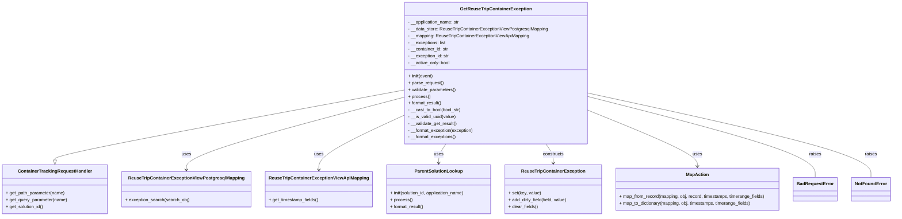

# Diagram: container_tracking_core/container_tracking_service/container_tracking_service/api/exception/handlers/GetReuseTripContainerException.py


> Auto-generated by Obscura crawlers

## Diagram 1



### SVG

<svg id="container" width="3132.7421875" xmlns="http://www.w3.org/2000/svg" class="classDiagram" height="768" viewBox="0 0 3132.7421875 768" role="graphics-document document" aria-roledescription="class"><style>#container{font-family:"trebuchet ms",verdana,arial,sans-serif;font-size:16px;fill:#333;}@keyframes edge-animation-frame{from{stroke-dashoffset:0;}}@keyframes dash{to{stroke-dashoffset:0;}}#container .edge-animation-slow{stroke-dasharray:9,5!important;stroke-dashoffset:900;animation:dash 50s linear infinite;stroke-linecap:round;}#container .edge-animation-fast{stroke-dasharray:9,5!important;stroke-dashoffset:900;animation:dash 20s linear infinite;stroke-linecap:round;}#container .error-icon{fill:#552222;}#container .error-text{fill:#552222;stroke:#552222;}#container .edge-thickness-normal{stroke-width:1px;}#container .edge-thickness-thick{stroke-width:3.5px;}#container .edge-pattern-solid{stroke-dasharray:0;}#container .edge-thickness-invisible{stroke-width:0;fill:none;}#container .edge-pattern-dashed{stroke-dasharray:3;}#container .edge-pattern-dotted{stroke-dasharray:2;}#container .marker{fill:#333333;stroke:#333333;}#container .marker.cross{stroke:#333333;}#container svg{font-family:"trebuchet ms",verdana,arial,sans-serif;font-size:16px;}#container p{margin:0;}#container g.classGroup text{fill:#9370DB;stroke:none;font-family:"trebuchet ms",verdana,arial,sans-serif;font-size:10px;}#container g.classGroup text .title{font-weight:bolder;}#container .nodeLabel,#container .edgeLabel{color:#131300;}#container .edgeLabel .label rect{fill:#ECECFF;}#container .label text{fill:#131300;}#container .labelBkg{background:#ECECFF;}#container .edgeLabel .label span{background:#ECECFF;}#container .classTitle{font-weight:bolder;}#container .node rect,#container .node circle,#container .node ellipse,#container .node polygon,#container .node path{fill:#ECECFF;stroke:#9370DB;stroke-width:1px;}#container .divider{stroke:#9370DB;stroke-width:1;}#container g.clickable{cursor:pointer;}#container g.classGroup rect{fill:#ECECFF;stroke:#9370DB;}#container g.classGroup line{stroke:#9370DB;stroke-width:1;}#container .classLabel .box{stroke:none;stroke-width:0;fill:#ECECFF;opacity:0.5;}#container .classLabel .label{fill:#9370DB;font-size:10px;}#container .relation{stroke:#333333;stroke-width:1;fill:none;}#container .dashed-line{stroke-dasharray:3;}#container .dotted-line{stroke-dasharray:1 2;}#container #compositionStart,#container .composition{fill:#333333!important;stroke:#333333!important;stroke-width:1;}#container #compositionEnd,#container .composition{fill:#333333!important;stroke:#333333!important;stroke-width:1;}#container #dependencyStart,#container .dependency{fill:#333333!important;stroke:#333333!important;stroke-width:1;}#container #dependencyStart,#container .dependency{fill:#333333!important;stroke:#333333!important;stroke-width:1;}#container #extensionStart,#container .extension{fill:transparent!important;stroke:#333333!important;stroke-width:1;}#container #extensionEnd,#container .extension{fill:transparent!important;stroke:#333333!important;stroke-width:1;}#container #aggregationStart,#container .aggregation{fill:transparent!important;stroke:#333333!important;stroke-width:1;}#container #aggregationEnd,#container .aggregation{fill:transparent!important;stroke:#333333!important;stroke-width:1;}#container #lollipopStart,#container .lollipop{fill:#ECECFF!important;stroke:#333333!important;stroke-width:1;}#container #lollipopEnd,#container .lollipop{fill:#ECECFF!important;stroke:#333333!important;stroke-width:1;}#container .edgeTerminals{font-size:11px;line-height:initial;}#container .classTitleText{text-anchor:middle;font-size:18px;fill:#333;}#container .label-icon{display:inline-block;height:1em;overflow:visible;vertical-align:-0.125em;}#container .node .label-icon path{fill:currentColor;stroke:revert;stroke-width:revert;}#container :root{--mermaid-font-family:"trebuchet ms",verdana,arial,sans-serif;}</style><g><defs><marker id="container_class-aggregationStart" class="marker aggregation class" refX="18" refY="7" markerWidth="190" markerHeight="240" orient="auto"><path d="M 18,7 L9,13 L1,7 L9,1 Z"></path></marker></defs><defs><marker id="container_class-aggregationEnd" class="marker aggregation class" refX="1" refY="7" markerWidth="20" markerHeight="28" orient="auto"><path d="M 18,7 L9,13 L1,7 L9,1 Z"></path></marker></defs><defs><marker id="container_class-extensionStart" class="marker extension class" refX="18" refY="7" markerWidth="190" markerHeight="240" orient="auto"><path d="M 1,7 L18,13 V 1 Z"></path></marker></defs><defs><marker id="container_class-extensionEnd" class="marker extension class" refX="1" refY="7" markerWidth="20" markerHeight="28" orient="auto"><path d="M 1,1 V 13 L18,7 Z"></path></marker></defs><defs><marker id="container_class-compositionStart" class="marker composition class" refX="18" refY="7" markerWidth="190" markerHeight="240" orient="auto"><path d="M 18,7 L9,13 L1,7 L9,1 Z"></path></marker></defs><defs><marker id="container_class-compositionEnd" class="marker composition class" refX="1" refY="7" markerWidth="20" markerHeight="28" orient="auto"><path d="M 18,7 L9,13 L1,7 L9,1 Z"></path></marker></defs><defs><marker id="container_class-dependencyStart" class="marker dependency class" refX="6" refY="7" markerWidth="190" markerHeight="240" orient="auto"><path d="M 5,7 L9,13 L1,7 L9,1 Z"></path></marker></defs><defs><marker id="container_class-dependencyEnd" class="marker dependency class" refX="13" refY="7" markerWidth="20" markerHeight="28" orient="auto"><path d="M 18,7 L9,13 L14,7 L9,1 Z"></path></marker></defs><defs><marker id="container_class-lollipopStart" class="marker lollipop class" refX="13" refY="7" markerWidth="190" markerHeight="240" orient="auto"><circle stroke="black" fill="transparent" cx="7" cy="7" r="6"></circle></marker></defs><defs><marker id="container_class-lollipopEnd" class="marker lollipop class" refX="1" refY="7" markerWidth="190" markerHeight="240" orient="auto"><circle stroke="black" fill="transparent" cx="7" cy="7" r="6"></circle></marker></defs><g class="root"><g class="clusters"></g><g class="edgePaths"><path d="M1413.938,320.09L1210.279,358.241C1006.621,396.393,599.305,472.697,395.646,514.14C191.988,555.583,191.988,562.167,191.988,565.458L191.988,568.75" id="id_GetReuseTripContainerException_ContainerTrackingRequestHandler_1" class="edge-thickness-normal edge-pattern-solid relation" style=";;;" data-edge="true" data-et="edge" data-id="id_GetReuseTripContainerException_ContainerTrackingRequestHandler_1" data-points="W3sieCI6MTQxMy45Mzc1LCJ5IjozMjAuMDg5Njk1NzcyNzIyMX0seyJ4IjoxOTEuOTg4MjgxMjUsInkiOjU0OX0seyJ4IjoxOTEuOTg4MjgxMjUsInkiOjU4Nn1d" marker-end="url(#container_class-extensionEnd)"></path><path d="M1413.938,345.431L1286.548,379.359C1159.158,413.287,904.378,481.144,776.988,524.238C649.598,567.333,649.598,585.667,649.598,594.833L649.598,604" id="id_GetReuseTripContainerException_ReuseTripContainerExceptionViewPostgresqlMapping_2" class="edge-thickness-normal edge-pattern-solid relation" style=";;;" data-edge="true" data-et="edge" data-id="id_GetReuseTripContainerException_ReuseTripContainerExceptionViewPostgresqlMapping_2" data-points="W3sieCI6MTQxMy45Mzc1LCJ5IjozNDUuNDMwNjUwMTAyNDE2Nn0seyJ4Ijo2NDkuNTk3NjU2MjUsInkiOjU0OX0seyJ4Ijo2NDkuNTk3NjU2MjUsInkiOjYxMH1d" marker-end="url(#container_class-dependencyEnd)"></path><path d="M1413.938,408.015L1363.016,431.512C1312.094,455.01,1210.25,502.005,1159.328,534.669C1108.406,567.333,1108.406,585.667,1108.406,594.833L1108.406,604" id="id_GetReuseTripContainerException_ReuseTripContainerExceptionViewApiMapping_3" class="edge-thickness-normal edge-pattern-solid relation" style=";;;" data-edge="true" data-et="edge" data-id="id_GetReuseTripContainerException_ReuseTripContainerExceptionViewApiMapping_3" data-points="W3sieCI6MTQxMy45Mzc1LCJ5Ijo0MDguMDE0ODk0MDk0NzUzMzR9LHsieCI6MTEwOC40MDYyNSwieSI6NTQ5fSx7IngiOjExMDguNDA2MjUsInkiOjYxMH1d" marker-end="url(#container_class-dependencyEnd)"></path><path d="M1556.695,512L1552.339,518.167C1547.983,524.333,1539.271,536.667,1534.915,548C1530.559,559.333,1530.559,569.667,1530.559,574.833L1530.559,580" id="id_GetReuseTripContainerException_ParentSolutionLookup_4" class="edge-thickness-normal edge-pattern-solid relation" style=";;;" data-edge="true" data-et="edge" data-id="id_GetReuseTripContainerException_ParentSolutionLookup_4" data-points="W3sieCI6MTU1Ni42OTQ3NDQ4MDk2ODg1LCJ5Ijo1MTJ9LHsieCI6MTUzMC41NTg1OTM3NSwieSI6NTQ5fSx7IngiOjE1MzAuNTU4NTkzNzUsInkiOjU4Nn1d" marker-end="url(#container_class-dependencyEnd)"></path><path d="M1912.712,512L1917.068,518.167C1921.424,524.333,1930.136,536.667,1934.492,548C1938.848,559.333,1938.848,569.667,1938.848,574.833L1938.848,580" id="id_GetReuseTripContainerException_ReuseTripContainerException_5" class="edge-thickness-normal edge-pattern-solid relation" style=";;;" data-edge="true" data-et="edge" data-id="id_GetReuseTripContainerException_ReuseTripContainerException_5" data-points="W3sieCI6MTkxMi43MTE1MDUxOTAzMTE1LCJ5Ijo1MTJ9LHsieCI6MTkzOC44NDc2NTYyNSwieSI6NTQ5fSx7IngiOjE5MzguODQ3NjU2MjUsInkiOjU4Nn1d" marker-end="url(#container_class-dependencyEnd)"></path><path d="M2055.469,389.121L2121.665,415.767C2187.861,442.414,2320.253,495.707,2386.449,529.52C2452.645,563.333,2452.645,577.667,2452.645,584.833L2452.645,592" id="id_GetReuseTripContainerException_MapAction_6" class="edge-thickness-normal edge-pattern-solid relation" style=";;;" data-edge="true" data-et="edge" data-id="id_GetReuseTripContainerException_MapAction_6" data-points="W3sieCI6MjA1NS40Njg3NSwieSI6Mzg5LjEyMDkzNDk2NDg3OX0seyJ4IjoyNDUyLjY0NDUzMTI1LCJ5Ijo1NDl9LHsieCI6MjQ1Mi42NDQ1MzEyNSwieSI6NTk4fV0=" marker-end="url(#container_class-dependencyEnd)"></path><path d="M2055.469,341.697L2191.124,376.248C2326.779,410.798,2598.089,479.899,2733.743,528.116C2869.398,576.333,2869.398,603.667,2869.398,617.333L2869.398,631" id="id_GetReuseTripContainerException_BadRequestError_7" class="edge-thickness-normal edge-pattern-solid relation" style=";;;" data-edge="true" data-et="edge" data-id="id_GetReuseTripContainerException_BadRequestError_7" data-points="W3sieCI6MjA1NS40Njg3NSwieSI6MzQxLjY5NzA1NTIzOTIyMzF9LHsieCI6Mjg2OS4zOTg0Mzc1LCJ5Ijo1NDl9LHsieCI6Mjg2OS4zOTg0Mzc1LCJ5Ijo2MzF9XQ=="></path><path d="M2055.469,329.989L2222.759,366.491C2390.049,402.993,2724.63,475.996,2891.921,526.165C3059.211,576.333,3059.211,603.667,3059.211,617.333L3059.211,631" id="id_GetReuseTripContainerException_NotFoundError_8" class="edge-thickness-normal edge-pattern-solid relation" style=";;;" data-edge="true" data-et="edge" data-id="id_GetReuseTripContainerException_NotFoundError_8" data-points="W3sieCI6MjA1NS40Njg3NSwieSI6MzI5Ljk4OTIxNzY5Mjg5M30seyJ4IjozMDU5LjIxMDkzNzUsInkiOjU0OX0seyJ4IjozMDU5LjIxMDkzNzUsInkiOjYzMX1d"></path></g><g class="edgeLabels"><g class="edgeLabel"><g class="label" data-id="id_GetReuseTripContainerException_ContainerTrackingRequestHandler_1" transform="translate(0, 0)"><foreignObject width="0" height="0"><div xmlns="http://www.w3.org/1999/xhtml" class="labelBkg" style="display: table-cell; white-space: nowrap; line-height: 1.5; max-width: 200px; text-align: center;"><span class="edgeLabel"></span></div></foreignObject></g></g><g class="edgeLabel" transform="translate(649.59765625, 549)"><g class="label" data-id="id_GetReuseTripContainerException_ReuseTripContainerExceptionViewPostgresqlMapping_2" transform="translate(-16.4921875, -12)"><foreignObject width="32.984375" height="24"><div xmlns="http://www.w3.org/1999/xhtml" class="labelBkg" style="display: table-cell; white-space: nowrap; line-height: 1.5; max-width: 200px; text-align: center;"><span class="edgeLabel"><p>uses</p></span></div></foreignObject></g></g><g class="edgeLabel" transform="translate(1108.40625, 549)"><g class="label" data-id="id_GetReuseTripContainerException_ReuseTripContainerExceptionViewApiMapping_3" transform="translate(-16.4921875, -12)"><foreignObject width="32.984375" height="24"><div xmlns="http://www.w3.org/1999/xhtml" class="labelBkg" style="display: table-cell; white-space: nowrap; line-height: 1.5; max-width: 200px; text-align: center;"><span class="edgeLabel"><p>uses</p></span></div></foreignObject></g></g><g class="edgeLabel" transform="translate(1530.55859375, 549)"><g class="label" data-id="id_GetReuseTripContainerException_ParentSolutionLookup_4" transform="translate(-16.4921875, -12)"><foreignObject width="32.984375" height="24"><div xmlns="http://www.w3.org/1999/xhtml" class="labelBkg" style="display: table-cell; white-space: nowrap; line-height: 1.5; max-width: 200px; text-align: center;"><span class="edgeLabel"><p>uses</p></span></div></foreignObject></g></g><g class="edgeLabel" transform="translate(1938.84765625, 549)"><g class="label" data-id="id_GetReuseTripContainerException_ReuseTripContainerException_5" transform="translate(-37.84375, -12)"><foreignObject width="75.6875" height="24"><div xmlns="http://www.w3.org/1999/xhtml" class="labelBkg" style="display: table-cell; white-space: nowrap; line-height: 1.5; max-width: 200px; text-align: center;"><span class="edgeLabel"><p>constructs</p></span></div></foreignObject></g></g><g class="edgeLabel" transform="translate(2452.64453125, 549)"><g class="label" data-id="id_GetReuseTripContainerException_MapAction_6" transform="translate(-16.4921875, -12)"><foreignObject width="32.984375" height="24"><div xmlns="http://www.w3.org/1999/xhtml" class="labelBkg" style="display: table-cell; white-space: nowrap; line-height: 1.5; max-width: 200px; text-align: center;"><span class="edgeLabel"><p>uses</p></span></div></foreignObject></g></g><g class="edgeLabel" transform="translate(2869.3984375, 549)"><g class="label" data-id="id_GetReuseTripContainerException_BadRequestError_7" transform="translate(-21.25, -12)"><foreignObject width="42.5" height="24"><div xmlns="http://www.w3.org/1999/xhtml" class="labelBkg" style="display: table-cell; white-space: nowrap; line-height: 1.5; max-width: 200px; text-align: center;"><span class="edgeLabel"><p>raises</p></span></div></foreignObject></g></g><g class="edgeLabel" transform="translate(3059.2109375, 549)"><g class="label" data-id="id_GetReuseTripContainerException_NotFoundError_8" transform="translate(-21.25, -12)"><foreignObject width="42.5" height="24"><div xmlns="http://www.w3.org/1999/xhtml" class="labelBkg" style="display: table-cell; white-space: nowrap; line-height: 1.5; max-width: 200px; text-align: center;"><span class="edgeLabel"><p>raises</p></span></div></foreignObject></g></g></g><g class="nodes"><g class="node default" id="classId-GetReuseTripContainerException-0" transform="translate(1734.703125, 260)"><g class="basic label-container"><path d="M-320.765625 -252 L320.765625 -252 L320.765625 252 L-320.765625 252" stroke="none" stroke-width="0" fill="#ECECFF" style=""></path><path d="M-320.765625 -252 C-180.0257623879576 -252, -39.2858997759152 -252, 320.765625 -252 M-320.765625 -252 C-91.95007157012651 -252, 136.86548185974698 -252, 320.765625 -252 M320.765625 -252 C320.765625 -112.56702030855553, 320.765625 26.865959382888946, 320.765625 252 M320.765625 -252 C320.765625 -70.1921327377795, 320.765625 111.615734524441, 320.765625 252 M320.765625 252 C104.28401530952064 252, -112.19759438095872 252, -320.765625 252 M320.765625 252 C165.88804112705185 252, 11.010457254103699 252, -320.765625 252 M-320.765625 252 C-320.765625 74.96897461620514, -320.765625 -102.06205076758971, -320.765625 -252 M-320.765625 252 C-320.765625 97.7431634720727, -320.765625 -56.51367305585461, -320.765625 -252" stroke="#9370DB" stroke-width="1.3" fill="none" stroke-dasharray="0 0" style=""></path></g><g class="annotation-group text" transform="translate(0, -228)"></g><g class="label-group text" transform="translate(-120.375, -228)"><g class="label" style="font-weight: bolder" transform="translate(0,-12)"><foreignObject width="240.75" height="24"><div xmlns="http://www.w3.org/1999/xhtml" style="display: table-cell; white-space: nowrap; line-height: 1.5; max-width: 288px; text-align: center;"><span class="nodeLabel markdown-node-label" style=""><p>GetReuseTripContainerException</p></span></div></foreignObject></g></g><g class="members-group text" transform="translate(-308.765625, -180)"><g class="label" style="" transform="translate(0,-12)"><foreignObject width="185.296875" height="24"><div xmlns="http://www.w3.org/1999/xhtml" style="display: table-cell; white-space: nowrap; line-height: 1.5; max-width: 243px; text-align: center;"><span class="nodeLabel markdown-node-label" style=""><p>- __application_name: str</p></span></div></foreignObject></g><g class="label" style="" transform="translate(0,12)"><foreignObject width="497.15625" height="24"><div xmlns="http://www.w3.org/1999/xhtml" style="display: table-cell; white-space: nowrap; line-height: 1.5; max-width: 555px; text-align: center;"><span class="nodeLabel markdown-node-label" style=""><p>- __data_store: ReuseTripContainerExceptionViewPostgresqlMapping</p></span></div></foreignObject></g><g class="label" style="" transform="translate(0,36)"><foreignObject width="430.9375" height="24"><div xmlns="http://www.w3.org/1999/xhtml" style="display: table-cell; white-space: nowrap; line-height: 1.5; max-width: 489px; text-align: center;"><span class="nodeLabel markdown-node-label" style=""><p>- __mapping: ReuseTripContainerExceptionViewApiMapping</p></span></div></foreignObject></g><g class="label" style="" transform="translate(0,60)"><foreignObject width="135.609375" height="24"><div xmlns="http://www.w3.org/1999/xhtml" style="display: table-cell; white-space: nowrap; line-height: 1.5; max-width: 193px; text-align: center;"><span class="nodeLabel markdown-node-label" style=""><p>- __exceptions: list</p></span></div></foreignObject></g><g class="label" style="" transform="translate(0,84)"><foreignObject width="144.6875" height="24"><div xmlns="http://www.w3.org/1999/xhtml" style="display: table-cell; white-space: nowrap; line-height: 1.5; max-width: 203px; text-align: center;"><span class="nodeLabel markdown-node-label" style=""><p>- __container_id: str</p></span></div></foreignObject></g><g class="label" style="" transform="translate(0,108)"><foreignObject width="147.515625" height="24"><div xmlns="http://www.w3.org/1999/xhtml" style="display: table-cell; white-space: nowrap; line-height: 1.5; max-width: 206px; text-align: center;"><span class="nodeLabel markdown-node-label" style=""><p>- __exception_id: str</p></span></div></foreignObject></g><g class="label" style="" transform="translate(0,132)"><foreignObject width="149.84375" height="24"><div xmlns="http://www.w3.org/1999/xhtml" style="display: table-cell; white-space: nowrap; line-height: 1.5; max-width: 208px; text-align: center;"><span class="nodeLabel markdown-node-label" style=""><p>- __active_only: bool</p></span></div></foreignObject></g></g><g class="methods-group text" transform="translate(-308.765625, 12)"><g class="label" style="" transform="translate(0,-12)"><foreignObject width="87.390625" height="24"><div xmlns="http://www.w3.org/1999/xhtml" style="display: table-cell; white-space: nowrap; line-height: 1.5; max-width: 177px; text-align: center;"><span class="nodeLabel markdown-node-label" style=""><p>+ <strong>init</strong>(event)</p></span></div></foreignObject></g><g class="label" style="" transform="translate(0,12)"><foreignObject width="126.046875" height="24"><div xmlns="http://www.w3.org/1999/xhtml" style="display: table-cell; white-space: nowrap; line-height: 1.5; max-width: 183px; text-align: center;"><span class="nodeLabel markdown-node-label" style=""><p>+ parse_request()</p></span></div></foreignObject></g><g class="label" style="" transform="translate(0,36)"><foreignObject width="170.953125" height="24"><div xmlns="http://www.w3.org/1999/xhtml" style="display: table-cell; white-space: nowrap; line-height: 1.5; max-width: 228px; text-align: center;"><span class="nodeLabel markdown-node-label" style=""><p>+ validate_parameters()</p></span></div></foreignObject></g><g class="label" style="" transform="translate(0,60)"><foreignObject width="77.96875" height="24"><div xmlns="http://www.w3.org/1999/xhtml" style="display: table-cell; white-space: nowrap; line-height: 1.5; max-width: 135px; text-align: center;"><span class="nodeLabel markdown-node-label" style=""><p>+ process()</p></span></div></foreignObject></g><g class="label" style="" transform="translate(0,84)"><foreignObject width="121.5" height="24"><div xmlns="http://www.w3.org/1999/xhtml" style="display: table-cell; white-space: nowrap; line-height: 1.5; max-width: 179px; text-align: center;"><span class="nodeLabel markdown-node-label" style=""><p>+ format_result()</p></span></div></foreignObject></g><g class="label" style="" transform="translate(0,108)"><foreignObject width="190.890625" height="24"><div xmlns="http://www.w3.org/1999/xhtml" style="display: table-cell; white-space: nowrap; line-height: 1.5; max-width: 248px; text-align: center;"><span class="nodeLabel markdown-node-label" style=""><p>- __cast_to_bool(bool_str)</p></span></div></foreignObject></g><g class="label" style="" transform="translate(0,132)"><foreignObject width="171.5625" height="24"><div xmlns="http://www.w3.org/1999/xhtml" style="display: table-cell; white-space: nowrap; line-height: 1.5; max-width: 229px; text-align: center;"><span class="nodeLabel markdown-node-label" style=""><p>- __is_valid_uuid(value)</p></span></div></foreignObject></g><g class="label" style="" transform="translate(0,156)"><foreignObject width="175.640625" height="24"><div xmlns="http://www.w3.org/1999/xhtml" style="display: table-cell; white-space: nowrap; line-height: 1.5; max-width: 233px; text-align: center;"><span class="nodeLabel markdown-node-label" style=""><p>- __validate_get_result()</p></span></div></foreignObject></g><g class="label" style="" transform="translate(0,180)"><foreignObject width="235.640625" height="24"><div xmlns="http://www.w3.org/1999/xhtml" style="display: table-cell; white-space: nowrap; line-height: 1.5; max-width: 293px; text-align: center;"><span class="nodeLabel markdown-node-label" style=""><p>- __format_exception(exception)</p></span></div></foreignObject></g><g class="label" style="" transform="translate(0,204)"><foreignObject width="172.359375" height="24"><div xmlns="http://www.w3.org/1999/xhtml" style="display: table-cell; white-space: nowrap; line-height: 1.5; max-width: 230px; text-align: center;"><span class="nodeLabel markdown-node-label" style=""><p>- __format_exceptions()</p></span></div></foreignObject></g></g><g class="divider" style=""><path d="M-320.765625 -204 C-181.47376907821365 -204, -42.1819131564273 -204, 320.765625 -204 M-320.765625 -204 C-145.66700520894884 -204, 29.431614582102327 -204, 320.765625 -204" stroke="#9370DB" stroke-width="1.3" fill="none" stroke-dasharray="0 0" style=""></path></g><g class="divider" style=""><path d="M-320.765625 -12 C-84.43693481627142 -12, 151.89175536745716 -12, 320.765625 -12 M-320.765625 -12 C-65.38684322432812 -12, 189.99193855134376 -12, 320.765625 -12" stroke="#9370DB" stroke-width="1.3" fill="none" stroke-dasharray="0 0" style=""></path></g></g><g class="node default" id="classId-ContainerTrackingRequestHandler-1" transform="translate(191.98828125, 673)"><g class="basic label-container"><path d="M-183.98828125 -87 L183.98828125 -87 L183.98828125 87 L-183.98828125 87" stroke="none" stroke-width="0" fill="#ECECFF" style=""></path><path d="M-183.98828125 -87 C-74.89131332734526 -87, 34.20565459530948 -87, 183.98828125 -87 M-183.98828125 -87 C-77.7100356306105 -87, 28.56820998877899 -87, 183.98828125 -87 M183.98828125 -87 C183.98828125 -40.91202067544392, 183.98828125 5.175958649112161, 183.98828125 87 M183.98828125 -87 C183.98828125 -44.33456674158935, 183.98828125 -1.6691334831786975, 183.98828125 87 M183.98828125 87 C36.94175714528009 87, -110.10476695943981 87, -183.98828125 87 M183.98828125 87 C110.38997328723744 87, 36.79166532447488 87, -183.98828125 87 M-183.98828125 87 C-183.98828125 19.463282413142338, -183.98828125 -48.073435173715325, -183.98828125 -87 M-183.98828125 87 C-183.98828125 35.2378477026779, -183.98828125 -16.524304594644207, -183.98828125 -87" stroke="#9370DB" stroke-width="1.3" fill="none" stroke-dasharray="0 0" style=""></path></g><g class="annotation-group text" transform="translate(0, -63)"></g><g class="label-group text" transform="translate(-125.5859375, -63)"><g class="label" style="font-weight: bolder" transform="translate(0,-12)"><foreignObject width="251.171875" height="24"><div xmlns="http://www.w3.org/1999/xhtml" style="display: table-cell; white-space: nowrap; line-height: 1.5; max-width: 299px; text-align: center;"><span class="nodeLabel markdown-node-label" style=""><p>ContainerTrackingRequestHandler</p></span></div></foreignObject></g></g><g class="members-group text" transform="translate(-171.98828125, -15)"></g><g class="methods-group text" transform="translate(-171.98828125, 15)"><g class="label" style="" transform="translate(0,-12)"><foreignObject width="210.75" height="24"><div xmlns="http://www.w3.org/1999/xhtml" style="display: table-cell; white-space: nowrap; line-height: 1.5; max-width: 268px; text-align: center;"><span class="nodeLabel markdown-node-label" style=""><p>+ get_path_parameter(name)</p></span></div></foreignObject></g><g class="label" style="" transform="translate(0,12)"><foreignObject width="218.390625" height="24"><div xmlns="http://www.w3.org/1999/xhtml" style="display: table-cell; white-space: nowrap; line-height: 1.5; max-width: 276px; text-align: center;"><span class="nodeLabel markdown-node-label" style=""><p>+ get_query_parameter(name)</p></span></div></foreignObject></g><g class="label" style="" transform="translate(0,36)"><foreignObject width="135.703125" height="24"><div xmlns="http://www.w3.org/1999/xhtml" style="display: table-cell; white-space: nowrap; line-height: 1.5; max-width: 193px; text-align: center;"><span class="nodeLabel markdown-node-label" style=""><p>+ get_solution_id()</p></span></div></foreignObject></g></g><g class="divider" style=""><path d="M-183.98828125 -39 C-56.751178021393414 -39, 70.48592520721317 -39, 183.98828125 -39 M-183.98828125 -39 C-97.96773855747041 -39, -11.947195864940824 -39, 183.98828125 -39" stroke="#9370DB" stroke-width="1.3" fill="none" stroke-dasharray="0 0" style=""></path></g><g class="divider" style=""><path d="M-183.98828125 -15 C-52.085633441252384 -15, 79.81701436749523 -15, 183.98828125 -15 M-183.98828125 -15 C-49.389226040592916 -15, 85.20982916881417 -15, 183.98828125 -15" stroke="#9370DB" stroke-width="1.3" fill="none" stroke-dasharray="0 0" style=""></path></g></g><g class="node default" id="classId-ReuseTripContainerException-2" transform="translate(1938.84765625, 673)"><g class="basic label-container"><path d="M-171.32421875 -87 L171.32421875 -87 L171.32421875 87 L-171.32421875 87" stroke="none" stroke-width="0" fill="#ECECFF" style=""></path><path d="M-171.32421875 -87 C-49.177820152450096 -87, 72.96857844509981 -87, 171.32421875 -87 M-171.32421875 -87 C-50.389827872222995 -87, 70.54456300555401 -87, 171.32421875 -87 M171.32421875 -87 C171.32421875 -48.59006096457368, 171.32421875 -10.180121929147361, 171.32421875 87 M171.32421875 -87 C171.32421875 -34.15667058997918, 171.32421875 18.686658820041643, 171.32421875 87 M171.32421875 87 C70.41044806078766 87, -30.503322628424684 87, -171.32421875 87 M171.32421875 87 C35.73534182887093 87, -99.85353509225814 87, -171.32421875 87 M-171.32421875 87 C-171.32421875 31.024712813581417, -171.32421875 -24.950574372837167, -171.32421875 -87 M-171.32421875 87 C-171.32421875 36.53634094718869, -171.32421875 -13.927318105622618, -171.32421875 -87" stroke="#9370DB" stroke-width="1.3" fill="none" stroke-dasharray="0 0" style=""></path></g><g class="annotation-group text" transform="translate(0, -63)"></g><g class="label-group text" transform="translate(-107.7109375, -63)"><g class="label" style="font-weight: bolder" transform="translate(0,-12)"><foreignObject width="215.421875" height="24"><div xmlns="http://www.w3.org/1999/xhtml" style="display: table-cell; white-space: nowrap; line-height: 1.5; max-width: 263px; text-align: center;"><span class="nodeLabel markdown-node-label" style=""><p>ReuseTripContainerException</p></span></div></foreignObject></g></g><g class="members-group text" transform="translate(-159.32421875, -15)"></g><g class="methods-group text" transform="translate(-159.32421875, 15)"><g class="label" style="" transform="translate(0,-12)"><foreignObject width="115.46875" height="24"><div xmlns="http://www.w3.org/1999/xhtml" style="display: table-cell; white-space: nowrap; line-height: 1.5; max-width: 173px; text-align: center;"><span class="nodeLabel markdown-node-label" style=""><p>+ set(key, value)</p></span></div></foreignObject></g><g class="label" style="" transform="translate(0,12)"><foreignObject width="210.9375" height="24"><div xmlns="http://www.w3.org/1999/xhtml" style="display: table-cell; white-space: nowrap; line-height: 1.5; max-width: 268px; text-align: center;"><span class="nodeLabel markdown-node-label" style=""><p>+ add_dirty_field(field, value)</p></span></div></foreignObject></g><g class="label" style="" transform="translate(0,36)"><foreignObject width="104.578125" height="24"><div xmlns="http://www.w3.org/1999/xhtml" style="display: table-cell; white-space: nowrap; line-height: 1.5; max-width: 162px; text-align: center;"><span class="nodeLabel markdown-node-label" style=""><p>+ clear_fields()</p></span></div></foreignObject></g></g><g class="divider" style=""><path d="M-171.32421875 -39 C-71.46427563697812 -39, 28.39566747604377 -39, 171.32421875 -39 M-171.32421875 -39 C-46.10441775630224 -39, 79.11538323739552 -39, 171.32421875 -39" stroke="#9370DB" stroke-width="1.3" fill="none" stroke-dasharray="0 0" style=""></path></g><g class="divider" style=""><path d="M-171.32421875 -15 C-48.78672691957195 -15, 73.7507649108561 -15, 171.32421875 -15 M-171.32421875 -15 C-72.38791669997643 -15, 26.54838535004714 -15, 171.32421875 -15" stroke="#9370DB" stroke-width="1.3" fill="none" stroke-dasharray="0 0" style=""></path></g></g><g class="node default" id="classId-ReuseTripContainerExceptionViewPostgresqlMapping-3" transform="translate(649.59765625, 673)"><g class="basic label-container"><path d="M-223.62109375 -63 L223.62109375 -63 L223.62109375 63 L-223.62109375 63" stroke="none" stroke-width="0" fill="#ECECFF" style=""></path><path d="M-223.62109375 -63 C-114.55801985672048 -63, -5.494945963440955 -63, 223.62109375 -63 M-223.62109375 -63 C-78.77419126575245 -63, 66.0727112184951 -63, 223.62109375 -63 M223.62109375 -63 C223.62109375 -21.156671212132217, 223.62109375 20.686657575735566, 223.62109375 63 M223.62109375 -63 C223.62109375 -17.05069038900468, 223.62109375 28.898619221990643, 223.62109375 63 M223.62109375 63 C109.89978309198246 63, -3.821527566035087 63, -223.62109375 63 M223.62109375 63 C63.2085434586277 63, -97.2040068327446 63, -223.62109375 63 M-223.62109375 63 C-223.62109375 34.10133668067629, -223.62109375 5.202673361352581, -223.62109375 -63 M-223.62109375 63 C-223.62109375 21.29504955695677, -223.62109375 -20.40990088608646, -223.62109375 -63" stroke="#9370DB" stroke-width="1.3" fill="none" stroke-dasharray="0 0" style=""></path></g><g class="annotation-group text" transform="translate(0, -39)"></g><g class="label-group text" transform="translate(-195.3359375, -39)"><g class="label" style="font-weight: bolder" transform="translate(0,-12)"><foreignObject width="390.671875" height="24"><div xmlns="http://www.w3.org/1999/xhtml" style="display: table-cell; white-space: nowrap; line-height: 1.5; max-width: 435px; text-align: center;"><span class="nodeLabel markdown-node-label" style=""><p>ReuseTripContainerExceptionViewPostgresqlMapping</p></span></div></foreignObject></g></g><g class="members-group text" transform="translate(-211.62109375, 9)"></g><g class="methods-group text" transform="translate(-211.62109375, 39)"><g class="label" style="" transform="translate(0,-12)"><foreignObject width="227.90625" height="24"><div xmlns="http://www.w3.org/1999/xhtml" style="display: table-cell; white-space: nowrap; line-height: 1.5; max-width: 285px; text-align: center;"><span class="nodeLabel markdown-node-label" style=""><p>+ exception_search(search_obj)</p></span></div></foreignObject></g></g><g class="divider" style=""><path d="M-223.62109375 -15 C-69.58301663124868 -15, 84.45506048750264 -15, 223.62109375 -15 M-223.62109375 -15 C-58.815540821045886 -15, 105.99001210790823 -15, 223.62109375 -15" stroke="#9370DB" stroke-width="1.3" fill="none" stroke-dasharray="0 0" style=""></path></g><g class="divider" style=""><path d="M-223.62109375 9 C-99.48410739150988 9, 24.65287896698024 9, 223.62109375 9 M-223.62109375 9 C-59.80163565790312 9, 104.01782243419376 9, 223.62109375 9" stroke="#9370DB" stroke-width="1.3" fill="none" stroke-dasharray="0 0" style=""></path></g></g><g class="node default" id="classId-ReuseTripContainerExceptionViewApiMapping-4" transform="translate(1108.40625, 673)"><g class="basic label-container"><path d="M-185.1875 -63 L185.1875 -63 L185.1875 63 L-185.1875 63" stroke="none" stroke-width="0" fill="#ECECFF" style=""></path><path d="M-185.1875 -63 C-63.11066547619386 -63, 58.96616904761228 -63, 185.1875 -63 M-185.1875 -63 C-100.39888652518522 -63, -15.610273050370438 -63, 185.1875 -63 M185.1875 -63 C185.1875 -33.398995909980144, 185.1875 -3.797991819960295, 185.1875 63 M185.1875 -63 C185.1875 -33.73135062440029, 185.1875 -4.4627012488005775, 185.1875 63 M185.1875 63 C65.77038945568407 63, -53.646721088631864 63, -185.1875 63 M185.1875 63 C101.36916521630644 63, 17.550830432612884 63, -185.1875 63 M-185.1875 63 C-185.1875 14.283590644785924, -185.1875 -34.43281871042815, -185.1875 -63 M-185.1875 63 C-185.1875 32.74784130875658, -185.1875 2.495682617513147, -185.1875 -63" stroke="#9370DB" stroke-width="1.3" fill="none" stroke-dasharray="0 0" style=""></path></g><g class="annotation-group text" transform="translate(0, -39)"></g><g class="label-group text" transform="translate(-168.1875, -39)"><g class="label" style="font-weight: bolder" transform="translate(0,-12)"><foreignObject width="336.375" height="24"><div xmlns="http://www.w3.org/1999/xhtml" style="display: table-cell; white-space: nowrap; line-height: 1.5; max-width: 383px; text-align: center;"><span class="nodeLabel markdown-node-label" style=""><p>ReuseTripContainerExceptionViewApiMapping</p></span></div></foreignObject></g></g><g class="members-group text" transform="translate(-173.1875, 9)"></g><g class="methods-group text" transform="translate(-173.1875, 39)"><g class="label" style="" transform="translate(0,-12)"><foreignObject width="178.1875" height="24"><div xmlns="http://www.w3.org/1999/xhtml" style="display: table-cell; white-space: nowrap; line-height: 1.5; max-width: 236px; text-align: center;"><span class="nodeLabel markdown-node-label" style=""><p>+ get_timestamp_fields()</p></span></div></foreignObject></g></g><g class="divider" style=""><path d="M-185.1875 -15 C-109.51594672010943 -15, -33.84439344021885 -15, 185.1875 -15 M-185.1875 -15 C-43.45636621228269 -15, 98.27476757543462 -15, 185.1875 -15" stroke="#9370DB" stroke-width="1.3" fill="none" stroke-dasharray="0 0" style=""></path></g><g class="divider" style=""><path d="M-185.1875 9 C-42.94835932245792 9, 99.29078135508416 9, 185.1875 9 M-185.1875 9 C-108.10558709415216 9, -31.023674188304312 9, 185.1875 9" stroke="#9370DB" stroke-width="1.3" fill="none" stroke-dasharray="0 0" style=""></path></g></g><g class="node default" id="classId-MapAction-5" transform="translate(2452.64453125, 673)"><g class="basic label-container"><path d="M-292.47265625 -75 L292.47265625 -75 L292.47265625 75 L-292.47265625 75" stroke="none" stroke-width="0" fill="#ECECFF" style=""></path><path d="M-292.47265625 -75 C-65.55842805729952 -75, 161.35580013540095 -75, 292.47265625 -75 M-292.47265625 -75 C-96.23242645824934 -75, 100.00780333350133 -75, 292.47265625 -75 M292.47265625 -75 C292.47265625 -22.482277446942284, 292.47265625 30.035445106115432, 292.47265625 75 M292.47265625 -75 C292.47265625 -34.13557222050392, 292.47265625 6.728855558992166, 292.47265625 75 M292.47265625 75 C144.83153382252195 75, -2.8095886049561045 75, -292.47265625 75 M292.47265625 75 C161.85766955922392 75, 31.242682868447844 75, -292.47265625 75 M-292.47265625 75 C-292.47265625 44.13691635749566, -292.47265625 13.273832714991315, -292.47265625 -75 M-292.47265625 75 C-292.47265625 34.56208919077996, -292.47265625 -5.875821618440085, -292.47265625 -75" stroke="#9370DB" stroke-width="1.3" fill="none" stroke-dasharray="0 0" style=""></path></g><g class="annotation-group text" transform="translate(0, -51)"></g><g class="label-group text" transform="translate(-38.6328125, -51)"><g class="label" style="font-weight: bolder" transform="translate(0,-12)"><foreignObject width="77.265625" height="24"><div xmlns="http://www.w3.org/1999/xhtml" style="display: table-cell; white-space: nowrap; line-height: 1.5; max-width: 126px; text-align: center;"><span class="nodeLabel markdown-node-label" style=""><p>MapAction</p></span></div></foreignObject></g></g><g class="members-group text" transform="translate(-280.47265625, -3)"></g><g class="methods-group text" transform="translate(-280.47265625, 27)"><g class="label" style="" transform="translate(0,-12)"><foreignObject width="522.3125" height="24"><div xmlns="http://www.w3.org/1999/xhtml" style="display: table-cell; white-space: nowrap; line-height: 1.5; max-width: 580px; text-align: center;"><span class="nodeLabel markdown-node-label" style=""><p>+ map_from_record(mapping, obj, record, timestamps, timerange_fields)</p></span></div></foreignObject></g><g class="label" style="" transform="translate(0,12)"><foreignObject width="475.140625" height="24"><div xmlns="http://www.w3.org/1999/xhtml" style="display: table-cell; white-space: nowrap; line-height: 1.5; max-width: 533px; text-align: center;"><span class="nodeLabel markdown-node-label" style=""><p>+ map_to_dictionary(mapping, obj, timestamps, timerange_fields)</p></span></div></foreignObject></g></g><g class="divider" style=""><path d="M-292.47265625 -27 C-156.18250697141883 -27, -19.892357692837663 -27, 292.47265625 -27 M-292.47265625 -27 C-92.8279252451756 -27, 106.81680575964879 -27, 292.47265625 -27" stroke="#9370DB" stroke-width="1.3" fill="none" stroke-dasharray="0 0" style=""></path></g><g class="divider" style=""><path d="M-292.47265625 -3 C-89.55231074128699 -3, 113.36803476742602 -3, 292.47265625 -3 M-292.47265625 -3 C-78.38126364863243 -3, 135.71012895273515 -3, 292.47265625 -3" stroke="#9370DB" stroke-width="1.3" fill="none" stroke-dasharray="0 0" style=""></path></g></g><g class="node default" id="classId-ParentSolutionLookup-6" transform="translate(1530.55859375, 673)"><g class="basic label-container"><path d="M-186.96484375 -87 L186.96484375 -87 L186.96484375 87 L-186.96484375 87" stroke="none" stroke-width="0" fill="#ECECFF" style=""></path><path d="M-186.96484375 -87 C-70.51868331970748 -87, 45.927477110585045 -87, 186.96484375 -87 M-186.96484375 -87 C-96.36601248927562 -87, -5.767181228551237 -87, 186.96484375 -87 M186.96484375 -87 C186.96484375 -52.08466335658669, 186.96484375 -17.169326713173376, 186.96484375 87 M186.96484375 -87 C186.96484375 -48.6165647832736, 186.96484375 -10.233129566547206, 186.96484375 87 M186.96484375 87 C63.73884691277473 87, -59.487149924450534 87, -186.96484375 87 M186.96484375 87 C50.04562172422439 87, -86.87360030155122 87, -186.96484375 87 M-186.96484375 87 C-186.96484375 26.430886685973356, -186.96484375 -34.13822662805329, -186.96484375 -87 M-186.96484375 87 C-186.96484375 21.119973698843566, -186.96484375 -44.76005260231287, -186.96484375 -87" stroke="#9370DB" stroke-width="1.3" fill="none" stroke-dasharray="0 0" style=""></path></g><g class="annotation-group text" transform="translate(0, -63)"></g><g class="label-group text" transform="translate(-81.6328125, -63)"><g class="label" style="font-weight: bolder" transform="translate(0,-12)"><foreignObject width="163.265625" height="24"><div xmlns="http://www.w3.org/1999/xhtml" style="display: table-cell; white-space: nowrap; line-height: 1.5; max-width: 211px; text-align: center;"><span class="nodeLabel markdown-node-label" style=""><p>ParentSolutionLookup</p></span></div></foreignObject></g></g><g class="members-group text" transform="translate(-174.96484375, -15)"></g><g class="methods-group text" transform="translate(-174.96484375, 15)"><g class="label" style="" transform="translate(0,-12)"><foreignObject width="268.296875" height="24"><div xmlns="http://www.w3.org/1999/xhtml" style="display: table-cell; white-space: nowrap; line-height: 1.5; max-width: 358px; text-align: center;"><span class="nodeLabel markdown-node-label" style=""><p>+ <strong>init</strong>(solution_id, application_name)</p></span></div></foreignObject></g><g class="label" style="" transform="translate(0,12)"><foreignObject width="77.96875" height="24"><div xmlns="http://www.w3.org/1999/xhtml" style="display: table-cell; white-space: nowrap; line-height: 1.5; max-width: 135px; text-align: center;"><span class="nodeLabel markdown-node-label" style=""><p>+ process()</p></span></div></foreignObject></g><g class="label" style="" transform="translate(0,36)"><foreignObject width="121.5" height="24"><div xmlns="http://www.w3.org/1999/xhtml" style="display: table-cell; white-space: nowrap; line-height: 1.5; max-width: 179px; text-align: center;"><span class="nodeLabel markdown-node-label" style=""><p>+ format_result()</p></span></div></foreignObject></g></g><g class="divider" style=""><path d="M-186.96484375 -39 C-98.67506297177381 -39, -10.385282193547624 -39, 186.96484375 -39 M-186.96484375 -39 C-42.94494091569243 -39, 101.07496191861514 -39, 186.96484375 -39" stroke="#9370DB" stroke-width="1.3" fill="none" stroke-dasharray="0 0" style=""></path></g><g class="divider" style=""><path d="M-186.96484375 -15 C-61.254876253621944 -15, 64.45509124275611 -15, 186.96484375 -15 M-186.96484375 -15 C-108.33126110678047 -15, -29.697678463560948 -15, 186.96484375 -15" stroke="#9370DB" stroke-width="1.3" fill="none" stroke-dasharray="0 0" style=""></path></g></g><g class="node default" id="classId-BadRequestError-7" transform="translate(2869.3984375, 673)"><g class="basic label-container"><path d="M-74.28125 -42 L74.28125 -42 L74.28125 42 L-74.28125 42" stroke="none" stroke-width="0" fill="#ECECFF" style=""></path><path d="M-74.28125 -42 C-43.097903819218615 -42, -11.91455763843723 -42, 74.28125 -42 M-74.28125 -42 C-36.512867907734666 -42, 1.2555141845306679 -42, 74.28125 -42 M74.28125 -42 C74.28125 -14.002211541020369, 74.28125 13.995576917959262, 74.28125 42 M74.28125 -42 C74.28125 -19.92381996700128, 74.28125 2.152360065997442, 74.28125 42 M74.28125 42 C36.834144154835556 42, -0.6129616903288877 42, -74.28125 42 M74.28125 42 C26.570224327302995 42, -21.14080134539401 42, -74.28125 42 M-74.28125 42 C-74.28125 11.693333340819311, -74.28125 -18.613333318361377, -74.28125 -42 M-74.28125 42 C-74.28125 9.99956620909024, -74.28125 -22.00086758181952, -74.28125 -42" stroke="#9370DB" stroke-width="1.3" fill="none" stroke-dasharray="0 0" style=""></path></g><g class="annotation-group text" transform="translate(0, -18)"></g><g class="label-group text" transform="translate(-62.28125, -18)"><g class="label" style="font-weight: bolder" transform="translate(0,-12)"><foreignObject width="124.5625" height="24"><div xmlns="http://www.w3.org/1999/xhtml" style="display: table-cell; white-space: nowrap; line-height: 1.5; max-width: 174px; text-align: center;"><span class="nodeLabel markdown-node-label" style=""><p>BadRequestError</p></span></div></foreignObject></g></g><g class="members-group text" transform="translate(-62.28125, 30)"></g><g class="methods-group text" transform="translate(-62.28125, 60)"></g><g class="divider" style=""><path d="M-74.28125 6 C-16.055743300310134 6, 42.16976339937973 6, 74.28125 6 M-74.28125 6 C-21.10978071431022 6, 32.06168857137956 6, 74.28125 6" stroke="#9370DB" stroke-width="1.3" fill="none" stroke-dasharray="0 0" style=""></path></g><g class="divider" style=""><path d="M-74.28125 24 C-43.621174000882704 24, -12.961098001765414 24, 74.28125 24 M-74.28125 24 C-16.63883656011825 24, 41.0035768797635 24, 74.28125 24" stroke="#9370DB" stroke-width="1.3" fill="none" stroke-dasharray="0 0" style=""></path></g></g><g class="node default" id="classId-NotFoundError-8" transform="translate(3059.2109375, 673)"><g class="basic label-container"><path d="M-65.53125 -42 L65.53125 -42 L65.53125 42 L-65.53125 42" stroke="none" stroke-width="0" fill="#ECECFF" style=""></path><path d="M-65.53125 -42 C-29.22855354965789 -42, 7.0741429006842225 -42, 65.53125 -42 M-65.53125 -42 C-30.272246762966063 -42, 4.9867564740678745 -42, 65.53125 -42 M65.53125 -42 C65.53125 -9.193928122865138, 65.53125 23.612143754269724, 65.53125 42 M65.53125 -42 C65.53125 -16.222578105022695, 65.53125 9.55484378995461, 65.53125 42 M65.53125 42 C24.855261735342495 42, -15.82072652931501 42, -65.53125 42 M65.53125 42 C15.479171133883348 42, -34.572907732233304 42, -65.53125 42 M-65.53125 42 C-65.53125 23.85611403433209, -65.53125 5.7122280686641815, -65.53125 -42 M-65.53125 42 C-65.53125 10.555014610962807, -65.53125 -20.889970778074385, -65.53125 -42" stroke="#9370DB" stroke-width="1.3" fill="none" stroke-dasharray="0 0" style=""></path></g><g class="annotation-group text" transform="translate(0, -18)"></g><g class="label-group text" transform="translate(-53.53125, -18)"><g class="label" style="font-weight: bolder" transform="translate(0,-12)"><foreignObject width="107.0625" height="24"><div xmlns="http://www.w3.org/1999/xhtml" style="display: table-cell; white-space: nowrap; line-height: 1.5; max-width: 158px; text-align: center;"><span class="nodeLabel markdown-node-label" style=""><p>NotFoundError</p></span></div></foreignObject></g></g><g class="members-group text" transform="translate(-53.53125, 30)"></g><g class="methods-group text" transform="translate(-53.53125, 60)"></g><g class="divider" style=""><path d="M-65.53125 6 C-20.083407887590873 6, 25.364434224818254 6, 65.53125 6 M-65.53125 6 C-23.703521627433425 6, 18.12420674513315 6, 65.53125 6" stroke="#9370DB" stroke-width="1.3" fill="none" stroke-dasharray="0 0" style=""></path></g><g class="divider" style=""><path d="M-65.53125 24 C-28.128517350765208 24, 9.274215298469585 24, 65.53125 24 M-65.53125 24 C-31.907076123898513 24, 1.7170977522029744 24, 65.53125 24" stroke="#9370DB" stroke-width="1.3" fill="none" stroke-dasharray="0 0" style=""></path></g></g></g></g></g></svg>

## Diagram 2

```mermaid
sequenceDiagram
    participant Client
    participant Handler as GetReuseTripContainerException
    participant Base as ContainerTrackingRequestHandler
    participant Lookup as ParentSolutionLookup
    participant Store as ReuseTripContainerExceptionViewPostgresqlMapping
    participant Domain as ReuseTripContainerException
    participant Mapping as ReuseTripContainerExceptionViewApiMapping
    participant Mapper as MapAction
    participant Response

    Client->>Handler: HTTP request event
    activate Handler
    Handler->>Base: get_path_parameter("id")
    Base-->>Handler: container_id
    Handler->>Base: get_path_parameter("exceptionId")
    Base-->>Handler: exception_id or None
    Handler->>Base: get_query_parameter("activeOnly")
    Base-->>Handler: activeOnly value
    Handler->>Handler: __cast_to_bool / __is_valid_uuid checks
    alt invalid UUID
        Handler-->>Client: raise BadRequestError
        deactivate Handler
    else valid
        Handler->>Lookup: ParentSolutionLookup(process)
        activate Lookup
        Lookup-->>Handler: solution_id or None
        deactivate Lookup
        alt no solution_id
            Handler-->>Client: raise NotFoundError
            deactivate Handler
        else solution_id found
            Handler->>Domain: instantiate and set(container_id, solution_id, id)
            Domain-->>Handler: search_faux_persistable
            opt activeOnly
                Handler->>Domain: add_dirty_field("resolved_ts", None)
            end
            Handler->>Store: exception_search(search_faux_persistable)
            activate Store
            Store-->>Handler: search_results
            deactivate Store
            loop for each result
                Handler->>Domain: instantiate ReuseTripContainerException(None...)
                Handler->>Mapper: map_from_record(Mapping, exception_obj, result, timestamps, [])
                Mapper-->>Handler: mapped exception_obj
                Handler->>Domain: exception_obj.clear_fields()
                Handler-->>Handler: append to __exceptions
            end
            Handler->>Handler: format_result()
            Handler->>Mapper: map_to_dictionary(Mapping, exception, timestamps, [])
            Mapper-->>Handler: formatted payload
            Handler-->>Response: (payload, 200)
            deactivate Handler
            Response-->>Client: HTTP 200 with payload
```

> SVG rendering failed for this diagram.
