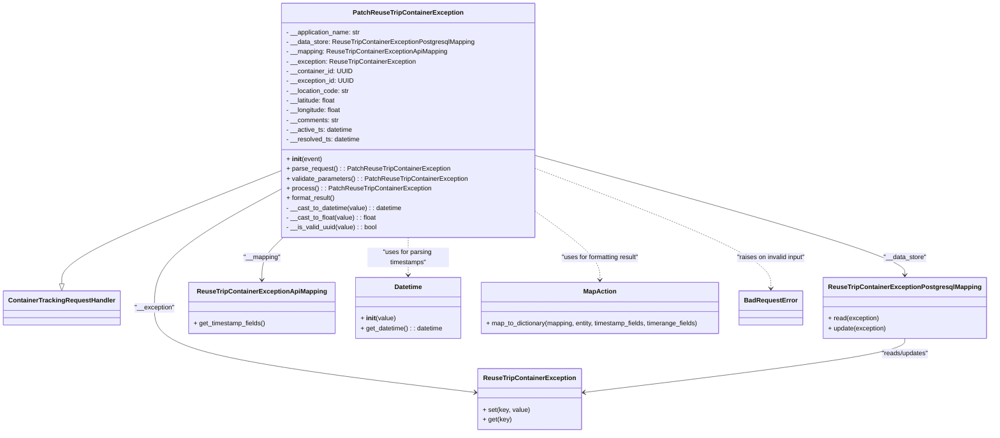

# Diagram: container_tracking_core/container_tracking_service/container_tracking_service/api/exception/handlers/PatchReuseTripContainerException.py

> Auto-generated by Obscura crawlers

## Mermaid

### SVG

<svg id="container" width="2398.0234375" xmlns="http://www.w3.org/2000/svg" class="classDiagram" height="1064" viewBox="0 0 2398.0234375 1064" role="graphics-document document" aria-roledescription="class"><g><defs><marker id="container_class-aggregationStart" class="marker aggregation class" refX="18" refY="7" markerWidth="190" markerHeight="240" orient="auto"><path d="M 18,7 L9,13 L1,7 L9,1 Z"></path></marker></defs><defs><marker id="container_class-aggregationEnd" class="marker aggregation class" refX="1" refY="7" markerWidth="20" markerHeight="28" orient="auto"><path d="M 18,7 L9,13 L1,7 L9,1 Z"></path></marker></defs><defs><marker id="container_class-extensionStart" class="marker extension class" refX="18" refY="7" markerWidth="190" markerHeight="240" orient="auto"><path d="M 1,7 L18,13 V 1 Z"></path></marker></defs><defs><marker id="container_class-extensionEnd" class="marker extension class" refX="1" refY="7" markerWidth="20" markerHeight="28" orient="auto"><path d="M 1,1 V 13 L18,7 Z"></path></marker></defs><defs><marker id="container_class-compositionStart" class="marker composition class" refX="18" refY="7" markerWidth="190" markerHeight="240" orient="auto"><path d="M 18,7 L9,13 L1,7 L9,1 Z"></path></marker></defs><defs><marker id="container_class-compositionEnd" class="marker composition class" refX="1" refY="7" markerWidth="20" markerHeight="28" orient="auto"><path d="M 18,7 L9,13 L1,7 L9,1 Z"></path></marker></defs><defs><marker id="container_class-dependencyStart" class="marker dependency class" refX="6" refY="7" markerWidth="190" markerHeight="240" orient="auto"><path d="M 5,7 L9,13 L1,7 L9,1 Z"></path></marker></defs><defs><marker id="container_class-dependencyEnd" class="marker dependency class" refX="13" refY="7" markerWidth="20" markerHeight="28" orient="auto"><path d="M 18,7 L9,13 L14,7 L9,1 Z"></path></marker></defs><defs><marker id="container_class-lollipopStart" class="marker lollipop class" refX="13" refY="7" markerWidth="190" markerHeight="240" orient="auto"><circle stroke="black" fill="transparent" cx="7" cy="7" r="6"></circle></marker></defs><defs><marker id="container_class-lollipopEnd" class="marker lollipop class" refX="1" refY="7" markerWidth="190" markerHeight="240" orient="auto"><circle stroke="black" fill="transparent" cx="7" cy="7" r="6"></circle></marker></defs><g class="root"><g class="clusters"></g><g class="edgePaths"><path d="M677.258,419.542L588.646,455.119C500.034,490.695,322.81,561.847,234.198,608.215C145.586,654.583,145.586,676.167,145.586,686.958L145.586,697.75" id="id_PatchReuseTripContainerException_ContainerTrackingRequestHandler_1" class="edge-thickness-normal edge-pattern-solid relation" style=";;;" data-edge="true" data-et="edge" data-id="id_PatchReuseTripContainerException_ContainerTrackingRequestHandler_1" data-points="W3sieCI6Njc3LjI1NzgxMjUsInkiOjQxOS41NDI0NjI2NDI0NjEyNn0seyJ4IjoxNDUuNTg1OTM3NSwieSI6NjMzfSx7IngiOjE0NS41ODU5Mzc1LCJ5Ijo3MTV9XQ==" marker-end="url(#container_class-extensionEnd)"></path><path d="M1292.688,381.354L1443.892,423.295C1595.096,465.236,1897.505,549.118,2048.71,598.226C2199.914,647.333,2199.914,661.667,2199.914,668.833L2199.914,676" id="id_PatchReuseTripContainerException_ReuseTripContainerExceptionPostgresqlMapping_2" class="edge-thickness-normal edge-pattern-solid relation" style=";;;" data-edge="true" data-et="edge" data-id="id_PatchReuseTripContainerException_ReuseTripContainerExceptionPostgresqlMapping_2" data-points="W3sieCI6MTI5Mi42ODc1LCJ5IjozODEuMzUzODMwMDc3OTY4MDR9LHsieCI6MjE5OS45MTQwNjI1LCJ5Ijo2MzN9LHsieCI6MjE5OS45MTQwNjI1LCJ5Ijo2ODJ9XQ==" marker-end="url(#container_class-dependencyEnd)"></path><path d="M679.62,584L670.962,592.167C662.303,600.333,644.985,616.667,636.327,634C627.668,651.333,627.668,669.667,627.668,678.833L627.668,688" id="id_PatchReuseTripContainerException_ReuseTripContainerExceptionApiMapping_3" class="edge-thickness-normal edge-pattern-solid relation" style=";;;" data-edge="true" data-et="edge" data-id="id_PatchReuseTripContainerException_ReuseTripContainerExceptionApiMapping_3" data-points="W3sieCI6Njc5LjYyMDI4MjM2Mjc1OTcsInkiOjU4NH0seyJ4Ijo2MjcuNjY3OTY4NzUsInkiOjYzM30seyJ4Ijo2MjcuNjY3OTY4NzUsInkiOjY5NH1d" marker-end="url(#container_class-dependencyEnd)"></path><path d="M677.258,463.843L625.57,492.036C573.883,520.228,470.508,576.614,418.82,625.474C367.133,674.333,367.133,715.667,367.133,755C367.133,794.333,367.133,831.667,498.274,866.361C629.415,901.056,891.696,933.111,1022.837,949.139L1153.978,965.167" id="id_PatchReuseTripContainerException_ReuseTripContainerException_4" class="edge-thickness-normal edge-pattern-solid relation" style=";;;" data-edge="true" data-et="edge" data-id="id_PatchReuseTripContainerException_ReuseTripContainerException_4" data-points="W3sieCI6Njc3LjI1NzgxMjUsInkiOjQ2My44NDI2OTE1ODU0NzYxM30seyJ4IjozNjcuMTMyODEyNSwieSI6NjMzfSx7IngiOjM2Ny4xMzI4MTI1LCJ5Ijo3NTd9LHsieCI6MzY3LjEzMjgxMjUsInkiOjg2OX0seyJ4IjoxMTU5LjkzMzU5Mzc1LCJ5Ijo5NjUuODk1MDE5NTIyOTI0NX1d" marker-end="url(#container_class-dependencyEnd)"></path><path d="M984.973,584L984.973,592.167C984.973,600.333,984.973,616.667,984.973,632C984.973,647.333,984.973,661.667,984.973,668.833L984.973,676" id="id_PatchReuseTripContainerException_Datetime_5" class="edge-thickness-normal edge-pattern-dashed relation" style=";;;" data-edge="true" data-et="edge" data-id="id_PatchReuseTripContainerException_Datetime_5" data-points="W3sieCI6OTg0Ljk3MjY1NjI1LCJ5Ijo1ODR9LHsieCI6OTg0Ljk3MjY1NjI1LCJ5Ijo2MzN9LHsieCI6OTg0Ljk3MjY1NjI1LCJ5Ijo2ODJ9XQ==" marker-end="url(#container_class-dependencyEnd)"></path><path d="M1292.688,512.719L1321.152,532.766C1349.616,552.812,1406.544,592.906,1435.008,622.12C1463.473,651.333,1463.473,669.667,1463.473,678.833L1463.473,688" id="id_PatchReuseTripContainerException_MapAction_6" class="edge-thickness-normal edge-pattern-dashed relation" style=";;;" data-edge="true" data-et="edge" data-id="id_PatchReuseTripContainerException_MapAction_6" data-points="W3sieCI6MTI5Mi42ODc1LCJ5Ijo1MTIuNzE4NzA5MTgyMzQwN30seyJ4IjoxNDYzLjQ3MjY1NjI1LCJ5Ijo2MzN9LHsieCI6MTQ2My40NzI2NTYyNSwieSI6Njk0fV0=" marker-end="url(#container_class-dependencyEnd)"></path><path d="M1292.688,411.152L1391.493,448.126C1490.299,485.101,1687.911,559.051,1786.717,608.692C1885.523,658.333,1885.523,683.667,1885.523,696.333L1885.523,709" id="id_PatchReuseTripContainerException_BadRequestError_7" class="edge-thickness-normal edge-pattern-dashed relation" style=";;;" data-edge="true" data-et="edge" data-id="id_PatchReuseTripContainerException_BadRequestError_7" data-points="W3sieCI6MTI5Mi42ODc1LCJ5Ijo0MTEuMTUxNjQzMzA4NTY1NX0seyJ4IjoxODg1LjUyMzQzNzUsInkiOjYzM30seyJ4IjoxODg1LjUyMzQzNzUsInkiOjcxNX1d" marker-end="url(#container_class-dependencyEnd)"></path><path d="M2199.914,832L2199.914,838.167C2199.914,844.333,2199.914,856.667,2068.773,878.861C1937.632,901.056,1675.351,933.111,1544.21,949.139L1413.069,965.167" id="id_ReuseTripContainerExceptionPostgresqlMapping_ReuseTripContainerException_8" class="edge-thickness-normal edge-pattern-solid relation" style=";;;" data-edge="true" data-et="edge" data-id="id_ReuseTripContainerExceptionPostgresqlMapping_ReuseTripContainerException_8" data-points="W3sieCI6MjE5OS45MTQwNjI1LCJ5Ijo4MzJ9LHsieCI6MjE5OS45MTQwNjI1LCJ5Ijo4Njl9LHsieCI6MTQwNy4xMTMyODEyNSwieSI6OTY1Ljg5NTAxOTUyMjkyNDV9XQ==" marker-end="url(#container_class-dependencyEnd)"></path></g><g class="edgeLabels"><g class="edgeLabel"><g class="label" data-id="id_PatchReuseTripContainerException_ContainerTrackingRequestHandler_1" transform="translate(0, 0)"><foreignObject width="0" height="0">

</foreignObject></g></g><g class="edgeLabel" transform="translate(2199.9140625, 633)"><g class="label" data-id="id_PatchReuseTripContainerException_ReuseTripContainerExceptionPostgresqlMapping_2" transform="translate(-52.453125, -12)"><foreignObject width="104.90625" height="24">

"__data_store"

</foreignObject></g></g><g class="edgeLabel" transform="translate(627.66796875, 633)"><g class="label" data-id="id_PatchReuseTripContainerException_ReuseTripContainerExceptionApiMapping_3" transform="translate(-45.640625, -12)"><foreignObject width="91.28125" height="24">

"__mapping"

</foreignObject></g></g><g class="edgeLabel" transform="translate(367.1328125, 757)"><g class="label" data-id="id_PatchReuseTripContainerException_ReuseTripContainerException_4" transform="translate(-48.9609375, -12)"><foreignObject width="97.921875" height="24">

"__exception"

</foreignObject></g></g><g class="edgeLabel" transform="translate(984.97265625, 633)"><g class="label" data-id="id_PatchReuseTripContainerException_Datetime_5" transform="translate(-100, -24)"><foreignObject width="200" height="48">

"uses for parsing timestamps"

</foreignObject></g></g><g class="edgeLabel" transform="translate(1463.47265625, 633)"><g class="label" data-id="id_PatchReuseTripContainerException_MapAction_6" transform="translate(-98.7578125, -12)"><foreignObject width="197.515625" height="24">

"uses for formatting result"

</foreignObject></g></g><g class="edgeLabel" transform="translate(1885.5234375, 633)"><g class="label" data-id="id_PatchReuseTripContainerException_BadRequestError_7" transform="translate(-86.828125, -12)"><foreignObject width="173.65625" height="24">

"raises on invalid input"

</foreignObject></g></g><g class="edgeLabel" transform="translate(2199.9140625, 869)"><g class="label" data-id="id_ReuseTripContainerExceptionPostgresqlMapping_ReuseTripContainerException_8" transform="translate(-59.59375, -12)"><foreignObject width="119.1875" height="24">

"reads/updates"

</foreignObject></g></g></g><g class="nodes"><g class="node default" id="classId-PatchReuseTripContainerException-0" transform="translate(984.97265625, 296)"><g class="basic label-container"><path d="M-307.71484375 -288 L307.71484375 -288 L307.71484375 288 L-307.71484375 288" stroke="none" stroke-width="0" fill="#ECECFF" style=""></path><path d="M-307.71484375 -288 C-108.43594708485523 -288, 90.84294958028954 -288, 307.71484375 -288 M-307.71484375 -288 C-165.36169570010506 -288, -23.00854765021012 -288, 307.71484375 -288 M307.71484375 -288 C307.71484375 -137.27674834164168, 307.71484375 13.446503316716644, 307.71484375 288 M307.71484375 -288 C307.71484375 -153.91864457036178, 307.71484375 -19.837289140723556, 307.71484375 288 M307.71484375 288 C138.48544393101395 288, -30.743955887972106 288, -307.71484375 288 M307.71484375 288 C133.55454018445513 288, -40.60576338108973 288, -307.71484375 288 M-307.71484375 288 C-307.71484375 165.58600634335136, -307.71484375 43.17201268670274, -307.71484375 -288 M-307.71484375 288 C-307.71484375 99.65979774095226, -307.71484375 -88.68040451809549, -307.71484375 -288" stroke="#9370DB" stroke-width="1.3" fill="none" stroke-dasharray="0 0" style=""></path></g><g class="annotation-group text" transform="translate(0, -264)"></g><g class="label-group text" transform="translate(-127.8671875, -264)"><g class="label" style="font-weight: bolder" transform="translate(0,-12)"><foreignObject width="255.734375" height="24">

PatchReuseTripContainerException

</foreignObject></g></g><g class="members-group text" transform="translate(-295.71484375, -216)"><g class="label" style="" transform="translate(0,-12)"><foreignObject width="185.296875" height="24">

- __application_name: str

</foreignObject></g><g class="label" style="" transform="translate(0,12)"><foreignObject width="463.5625" height="24">

- __data_store: ReuseTripContainerExceptionPostgresqlMapping

</foreignObject></g><g class="label" style="" transform="translate(0,36)"><foreignObject width="397.34375" height="24">

- __mapping: ReuseTripContainerExceptionApiMapping

</foreignObject></g><g class="label" style="" transform="translate(0,60)"><foreignObject width="318.578125" height="24">

- __exception: ReuseTripContainerException

</foreignObject></g><g class="label" style="" transform="translate(0,84)"><foreignObject width="161.46875" height="24">

- __container_id: UUID

</foreignObject></g><g class="label" style="" transform="translate(0,108)"><foreignObject width="164.296875" height="24">

- __exception_id: UUID

</foreignObject></g><g class="label" style="" transform="translate(0,132)"><foreignObject width="156.625" height="24">

- __location_code: str

</foreignObject></g><g class="label" style="" transform="translate(0,156)"><foreignObject width="125.125" height="24">

- __latitude: float

</foreignObject></g><g class="label" style="" transform="translate(0,180)"><foreignObject width="137.6875" height="24">

- __longitude: float

</foreignObject></g><g class="label" style="" transform="translate(0,204)"><foreignObject width="129.796875" height="24">

- __comments: str

</foreignObject></g><g class="label" style="" transform="translate(0,228)"><foreignObject width="164.28125" height="24">

- __active_ts: datetime

</foreignObject></g><g class="label" style="" transform="translate(0,252)"><foreignObject width="183.609375" height="24">

- __resolved_ts: datetime

</foreignObject></g></g><g class="methods-group text" transform="translate(-295.71484375, 96)"><g class="label" style="" transform="translate(0,-12)"><foreignObject width="87.390625" height="24">

+ <strong>init</strong>(event)

</foreignObject></g><g class="label" style="" transform="translate(0,12)"><foreignObject width="399.015625" height="24">

+ parse_request() : : PatchReuseTripContainerException

</foreignObject></g><g class="label" style="" transform="translate(0,36)"><foreignObject width="443.921875" height="24">

+ validate_parameters() : : PatchReuseTripContainerException

</foreignObject></g><g class="label" style="" transform="translate(0,60)"><foreignObject width="350.953125" height="24">

+ process() : : PatchReuseTripContainerException

</foreignObject></g><g class="label" style="" transform="translate(0,84)"><foreignObject width="121.5" height="24">

+ format_result()

</foreignObject></g><g class="label" style="" transform="translate(0,108)"><foreignObject width="286.84375" height="24">

- __cast_to_datetime(value) : : datetime

</foreignObject></g><g class="label" style="" transform="translate(0,132)"><foreignObject width="222.453125" height="24">

- __cast_to_float(value) : : float

</foreignObject></g><g class="label" style="" transform="translate(0,156)"><foreignObject width="224.84375" height="24">

- __is_valid_uuid(value) : : bool

</foreignObject></g></g><g class="divider" style=""><path d="M-307.71484375 -240 C-65.08332913237925 -240, 177.5481854852415 -240, 307.71484375 -240 M-307.71484375 -240 C-174.63362776078625 -240, -41.55241177157251 -240, 307.71484375 -240" stroke="#9370DB" stroke-width="1.3" fill="none" stroke-dasharray="0 0" style=""></path></g><g class="divider" style=""><path d="M-307.71484375 72 C-110.63836686552594 72, 86.43811001894812 72, 307.71484375 72 M-307.71484375 72 C-123.91529236818329 72, 59.884259013633425 72, 307.71484375 72" stroke="#9370DB" stroke-width="1.3" fill="none" stroke-dasharray="0 0" style=""></path></g></g><g class="node default" id="classId-ContainerTrackingRequestHandler-1" transform="translate(145.5859375, 757)"><g class="basic label-container"><path d="M-137.5859375 -42 L137.5859375 -42 L137.5859375 42 L-137.5859375 42" stroke="none" stroke-width="0" fill="#ECECFF" style=""></path><path d="M-137.5859375 -42 C-79.74007450440011 -42, -21.894211508800225 -42, 137.5859375 -42 M-137.5859375 -42 C-71.54478033082628 -42, -5.50362316165257 -42, 137.5859375 -42 M137.5859375 -42 C137.5859375 -19.7081401137164, 137.5859375 2.5837197725672, 137.5859375 42 M137.5859375 -42 C137.5859375 -17.012478109398227, 137.5859375 7.975043781203546, 137.5859375 42 M137.5859375 42 C35.59157058045825 42, -66.4027963390835 42, -137.5859375 42 M137.5859375 42 C80.70185239510187 42, 23.817767290203747 42, -137.5859375 42 M-137.5859375 42 C-137.5859375 25.083007068613984, -137.5859375 8.166014137227968, -137.5859375 -42 M-137.5859375 42 C-137.5859375 21.94289606873538, -137.5859375 1.8857921374707587, -137.5859375 -42" stroke="#9370DB" stroke-width="1.3" fill="none" stroke-dasharray="0 0" style=""></path></g><g class="annotation-group text" transform="translate(0, -18)"></g><g class="label-group text" transform="translate(-125.5859375, -18)"><g class="label" style="font-weight: bolder" transform="translate(0,-12)"><foreignObject width="251.171875" height="24">

ContainerTrackingRequestHandler

</foreignObject></g></g><g class="members-group text" transform="translate(-125.5859375, 30)"></g><g class="methods-group text" transform="translate(-125.5859375, 60)"></g><g class="divider" style=""><path d="M-137.5859375 6 C-72.35966197592097 6, -7.133386451841943 6, 137.5859375 6 M-137.5859375 6 C-80.9901487276075 6, -24.39435995521501 6, 137.5859375 6" stroke="#9370DB" stroke-width="1.3" fill="none" stroke-dasharray="0 0" style=""></path></g><g class="divider" style=""><path d="M-137.5859375 24 C-41.45230694403749 24, 54.68132361192502 24, 137.5859375 24 M-137.5859375 24 C-45.011388244530636 24, 47.56316101093873 24, 137.5859375 24" stroke="#9370DB" stroke-width="1.3" fill="none" stroke-dasharray="0 0" style=""></path></g></g><g class="node default" id="classId-ReuseTripContainerExceptionPostgresqlMapping-2" transform="translate(2199.9140625, 757)"><g class="basic label-container"><path d="M-190.109375 -75 L190.109375 -75 L190.109375 75 L-190.109375 75" stroke="none" stroke-width="0" fill="#ECECFF" style=""></path><path d="M-190.109375 -75 C-90.01653876112718 -75, 10.07629747774564 -75, 190.109375 -75 M-190.109375 -75 C-103.9705433672173 -75, -17.831711734434606 -75, 190.109375 -75 M190.109375 -75 C190.109375 -38.28720102600883, 190.109375 -1.5744020520176605, 190.109375 75 M190.109375 -75 C190.109375 -39.85086795534936, 190.109375 -4.701735910698716, 190.109375 75 M190.109375 75 C38.960018451267445 75, -112.18933809746511 75, -190.109375 75 M190.109375 75 C79.4986667471992 75, -31.11204150560161 75, -190.109375 75 M-190.109375 75 C-190.109375 23.209193120090845, -190.109375 -28.58161375981831, -190.109375 -75 M-190.109375 75 C-190.109375 36.37341757551531, -190.109375 -2.2531648489693765, -190.109375 -75" stroke="#9370DB" stroke-width="1.3" fill="none" stroke-dasharray="0 0" style=""></path></g><g class="annotation-group text" transform="translate(0, -51)"></g><g class="label-group text" transform="translate(-178.109375, -51)"><g class="label" style="font-weight: bolder" transform="translate(0,-12)"><foreignObject width="356.21875" height="24">

ReuseTripContainerExceptionPostgresqlMapping

</foreignObject></g></g><g class="members-group text" transform="translate(-178.109375, -3)"></g><g class="methods-group text" transform="translate(-178.109375, 27)"><g class="label" style="" transform="translate(0,-12)"><foreignObject width="125.875" height="24">

+ read(exception)

</foreignObject></g><g class="label" style="" transform="translate(0,12)"><foreignObject width="144.703125" height="24">

+ update(exception)

</foreignObject></g></g><g class="divider" style=""><path d="M-190.109375 -27 C-93.958837168223 -27, 2.191700663554002 -27, 190.109375 -27 M-190.109375 -27 C-97.3683471816285 -27, -4.627319363256987 -27, 190.109375 -27" stroke="#9370DB" stroke-width="1.3" fill="none" stroke-dasharray="0 0" style=""></path></g><g class="divider" style=""><path d="M-190.109375 -3 C-101.13966394100616 -3, -12.169952882012325 -3, 190.109375 -3 M-190.109375 -3 C-96.76677511603353 -3, -3.424175232067057 -3, 190.109375 -3" stroke="#9370DB" stroke-width="1.3" fill="none" stroke-dasharray="0 0" style=""></path></g></g><g class="node default" id="classId-ReuseTripContainerExceptionApiMapping-3" transform="translate(627.66796875, 757)"><g class="basic label-container"><path d="M-176.57421875 -63 L176.57421875 -63 L176.57421875 63 L-176.57421875 63" stroke="none" stroke-width="0" fill="#ECECFF" style=""></path><path d="M-176.57421875 -63 C-62.74069136750944 -63, 51.09283601498112 -63, 176.57421875 -63 M-176.57421875 -63 C-97.15760274402906 -63, -17.740986738058126 -63, 176.57421875 -63 M176.57421875 -63 C176.57421875 -19.141055157788244, 176.57421875 24.71788968442351, 176.57421875 63 M176.57421875 -63 C176.57421875 -26.258439119963484, 176.57421875 10.483121760073033, 176.57421875 63 M176.57421875 63 C60.49215569779717 63, -55.58990735440565 63, -176.57421875 63 M176.57421875 63 C55.84631216777143 63, -64.88159441445714 63, -176.57421875 63 M-176.57421875 63 C-176.57421875 36.751080037791525, -176.57421875 10.502160075583056, -176.57421875 -63 M-176.57421875 63 C-176.57421875 14.0605844091112, -176.57421875 -34.8788311817776, -176.57421875 -63" stroke="#9370DB" stroke-width="1.3" fill="none" stroke-dasharray="0 0" style=""></path></g><g class="annotation-group text" transform="translate(0, -39)"></g><g class="label-group text" transform="translate(-150.9609375, -39)"><g class="label" style="font-weight: bolder" transform="translate(0,-12)"><foreignObject width="301.921875" height="24">

ReuseTripContainerExceptionApiMapping

</foreignObject></g></g><g class="members-group text" transform="translate(-164.57421875, 9)"></g><g class="methods-group text" transform="translate(-164.57421875, 39)"><g class="label" style="" transform="translate(0,-12)"><foreignObject width="178.1875" height="24">

+ get_timestamp_fields()

</foreignObject></g></g><g class="divider" style=""><path d="M-176.57421875 -15 C-66.0219362238496 -15, 44.53034630230081 -15, 176.57421875 -15 M-176.57421875 -15 C-45.29648538652751 -15, 85.98124797694499 -15, 176.57421875 -15" stroke="#9370DB" stroke-width="1.3" fill="none" stroke-dasharray="0 0" style=""></path></g><g class="divider" style=""><path d="M-176.57421875 9 C-102.79336877841192 9, -29.012518806823834 9, 176.57421875 9 M-176.57421875 9 C-49.717032478255746 9, 77.14015379348851 9, 176.57421875 9" stroke="#9370DB" stroke-width="1.3" fill="none" stroke-dasharray="0 0" style=""></path></g></g><g class="node default" id="classId-ReuseTripContainerException-4" transform="translate(1283.5234375, 981)"><g class="basic label-container"><path d="M-123.58984375 -75 L123.58984375 -75 L123.58984375 75 L-123.58984375 75" stroke="none" stroke-width="0" fill="#ECECFF" style=""></path><path d="M-123.58984375 -75 C-46.97439820180047 -75, 29.641047346399063 -75, 123.58984375 -75 M-123.58984375 -75 C-58.94432274732365 -75, 5.701198255352693 -75, 123.58984375 -75 M123.58984375 -75 C123.58984375 -44.19122261328904, 123.58984375 -13.382445226578085, 123.58984375 75 M123.58984375 -75 C123.58984375 -32.98772385205815, 123.58984375 9.024552295883694, 123.58984375 75 M123.58984375 75 C58.608632564423516 75, -6.372578621152968 75, -123.58984375 75 M123.58984375 75 C60.48800400614226 75, -2.613835737715476 75, -123.58984375 75 M-123.58984375 75 C-123.58984375 16.38129624249227, -123.58984375 -42.23740751501546, -123.58984375 -75 M-123.58984375 75 C-123.58984375 33.14971398886592, -123.58984375 -8.700572022268162, -123.58984375 -75" stroke="#9370DB" stroke-width="1.3" fill="none" stroke-dasharray="0 0" style=""></path></g><g class="annotation-group text" transform="translate(0, -51)"></g><g class="label-group text" transform="translate(-107.7109375, -51)"><g class="label" style="font-weight: bolder" transform="translate(0,-12)"><foreignObject width="215.421875" height="24">

ReuseTripContainerException

</foreignObject></g></g><g class="members-group text" transform="translate(-111.58984375, -3)"></g><g class="methods-group text" transform="translate(-111.58984375, 27)"><g class="label" style="" transform="translate(0,-12)"><foreignObject width="115.46875" height="24">

+ set(key, value)

</foreignObject></g><g class="label" style="" transform="translate(0,12)"><foreignObject width="69.734375" height="24">

+ get(key)

</foreignObject></g></g><g class="divider" style=""><path d="M-123.58984375 -27 C-37.26010028654518 -27, 49.069643176909636 -27, 123.58984375 -27 M-123.58984375 -27 C-59.46633801018292 -27, 4.657167729634153 -27, 123.58984375 -27" stroke="#9370DB" stroke-width="1.3" fill="none" stroke-dasharray="0 0" style=""></path></g><g class="divider" style=""><path d="M-123.58984375 -3 C-33.571750560958606 -3, 56.44634262808279 -3, 123.58984375 -3 M-123.58984375 -3 C-72.99611475977997 -3, -22.402385769559928 -3, 123.58984375 -3" stroke="#9370DB" stroke-width="1.3" fill="none" stroke-dasharray="0 0" style=""></path></g></g><g class="node default" id="classId-Datetime-5" transform="translate(984.97265625, 757)"><g class="basic label-container"><path d="M-130.73046875 -75 L130.73046875 -75 L130.73046875 75 L-130.73046875 75" stroke="none" stroke-width="0" fill="#ECECFF" style=""></path><path d="M-130.73046875 -75 C-46.02394234182654 -75, 38.68258406634692 -75, 130.73046875 -75 M-130.73046875 -75 C-39.421111689234834 -75, 51.88824537153033 -75, 130.73046875 -75 M130.73046875 -75 C130.73046875 -37.61867498034125, 130.73046875 -0.2373499606824936, 130.73046875 75 M130.73046875 -75 C130.73046875 -15.125772527404045, 130.73046875 44.74845494519191, 130.73046875 75 M130.73046875 75 C59.12465571095707 75, -12.481157328085857 75, -130.73046875 75 M130.73046875 75 C73.18789140142732 75, 15.645314052854644 75, -130.73046875 75 M-130.73046875 75 C-130.73046875 19.0808981822315, -130.73046875 -36.838203635537, -130.73046875 -75 M-130.73046875 75 C-130.73046875 19.408679737502815, -130.73046875 -36.18264052499437, -130.73046875 -75" stroke="#9370DB" stroke-width="1.3" fill="none" stroke-dasharray="0 0" style=""></path></g><g class="annotation-group text" transform="translate(0, -51)"></g><g class="label-group text" transform="translate(-33.3984375, -51)"><g class="label" style="font-weight: bolder" transform="translate(0,-12)"><foreignObject width="66.796875" height="24">

Datetime

</foreignObject></g></g><g class="members-group text" transform="translate(-118.73046875, -3)"></g><g class="methods-group text" transform="translate(-118.73046875, 27)"><g class="label" style="" transform="translate(0,-12)"><foreignObject width="85.921875" height="24">

+ <strong>init</strong>(value)

</foreignObject></g><g class="label" style="" transform="translate(0,12)"><foreignObject width="204.0625" height="24">

+ get_datetime() : : datetime

</foreignObject></g></g><g class="divider" style=""><path d="M-130.73046875 -27 C-31.98207813464016 -27, 66.76631248071968 -27, 130.73046875 -27 M-130.73046875 -27 C-29.40820815395601 -27, 71.91405244208798 -27, 130.73046875 -27" stroke="#9370DB" stroke-width="1.3" fill="none" stroke-dasharray="0 0" style=""></path></g><g class="divider" style=""><path d="M-130.73046875 -3 C-62.77329071943875 -3, 5.183887311122504 -3, 130.73046875 -3 M-130.73046875 -3 C-31.115935041638323 -3, 68.49859866672335 -3, 130.73046875 -3" stroke="#9370DB" stroke-width="1.3" fill="none" stroke-dasharray="0 0" style=""></path></g></g><g class="node default" id="classId-MapAction-6" transform="translate(1463.47265625, 757)"><g class="basic label-container"><path d="M-297.76953125 -63 L297.76953125 -63 L297.76953125 63 L-297.76953125 63" stroke="none" stroke-width="0" fill="#ECECFF" style=""></path><path d="M-297.76953125 -63 C-82.38867809010748 -63, 132.99217506978505 -63, 297.76953125 -63 M-297.76953125 -63 C-148.42281556068346 -63, 0.923900128633079 -63, 297.76953125 -63 M297.76953125 -63 C297.76953125 -14.404636641236095, 297.76953125 34.19072671752781, 297.76953125 63 M297.76953125 -63 C297.76953125 -22.094298041822, 297.76953125 18.811403916356, 297.76953125 63 M297.76953125 63 C141.72688627213813 63, -14.315758705723738 63, -297.76953125 63 M297.76953125 63 C93.14082478205816 63, -111.48788168588368 63, -297.76953125 63 M-297.76953125 63 C-297.76953125 34.37104778959383, -297.76953125 5.742095579187669, -297.76953125 -63 M-297.76953125 63 C-297.76953125 25.190035209999117, -297.76953125 -12.619929580001767, -297.76953125 -63" stroke="#9370DB" stroke-width="1.3" fill="none" stroke-dasharray="0 0" style=""></path></g><g class="annotation-group text" transform="translate(0, -39)"></g><g class="label-group text" transform="translate(-38.6328125, -39)"><g class="label" style="font-weight: bolder" transform="translate(0,-12)"><foreignObject width="77.265625" height="24">

MapAction

</foreignObject></g></g><g class="members-group text" transform="translate(-285.76953125, 9)"></g><g class="methods-group text" transform="translate(-285.76953125, 39)"><g class="label" style="" transform="translate(0,-12)"><foreignObject width="532.90625" height="24">

+ map_to_dictionary(mapping, entity, timestamp_fields, timerange_fields)

</foreignObject></g></g><g class="divider" style=""><path d="M-297.76953125 -15 C-140.24003361277278 -15, 17.289464024454446 -15, 297.76953125 -15 M-297.76953125 -15 C-145.7662039473472 -15, 6.2371233553055845 -15, 297.76953125 -15" stroke="#9370DB" stroke-width="1.3" fill="none" stroke-dasharray="0 0" style=""></path></g><g class="divider" style=""><path d="M-297.76953125 9 C-114.47510861591746 9, 68.81931401816507 9, 297.76953125 9 M-297.76953125 9 C-140.88993379981991 9, 15.989663650360171 9, 297.76953125 9" stroke="#9370DB" stroke-width="1.3" fill="none" stroke-dasharray="0 0" style=""></path></g></g><g class="node default" id="classId-BadRequestError-7" transform="translate(1885.5234375, 757)"><g class="basic label-container"><path d="M-74.28125 -42 L74.28125 -42 L74.28125 42 L-74.28125 42" stroke="none" stroke-width="0" fill="#ECECFF" style=""></path><path d="M-74.28125 -42 C-29.74880413104232 -42, 14.78364173791536 -42, 74.28125 -42 M-74.28125 -42 C-31.454899975174747 -42, 11.371450049650505 -42, 74.28125 -42 M74.28125 -42 C74.28125 -15.009292307546996, 74.28125 11.981415384906008, 74.28125 42 M74.28125 -42 C74.28125 -18.936168695977646, 74.28125 4.127662608044709, 74.28125 42 M74.28125 42 C21.73246990099861 42, -30.816310198002782 42, -74.28125 42 M74.28125 42 C16.530161472258136 42, -41.22092705548373 42, -74.28125 42 M-74.28125 42 C-74.28125 15.7719380378986, -74.28125 -10.4561239242028, -74.28125 -42 M-74.28125 42 C-74.28125 15.611517881816713, -74.28125 -10.776964236366574, -74.28125 -42" stroke="#9370DB" stroke-width="1.3" fill="none" stroke-dasharray="0 0" style=""></path></g><g class="annotation-group text" transform="translate(0, -18)"></g><g class="label-group text" transform="translate(-62.28125, -18)"><g class="label" style="font-weight: bolder" transform="translate(0,-12)"><foreignObject width="124.5625" height="24">

BadRequestError

</foreignObject></g></g><g class="members-group text" transform="translate(-62.28125, 30)"></g><g class="methods-group text" transform="translate(-62.28125, 60)"></g><g class="divider" style=""><path d="M-74.28125 6 C-32.06585303846753 6, 10.14954392306494 6, 74.28125 6 M-74.28125 6 C-32.515312127232036 6, 9.250625745535928 6, 74.28125 6" stroke="#9370DB" stroke-width="1.3" fill="none" stroke-dasharray="0 0" style=""></path></g><g class="divider" style=""><path d="M-74.28125 24 C-26.368792118625464 24, 21.54366576274907 24, 74.28125 24 M-74.28125 24 C-44.12550711963111 24, -13.969764239262226 24, 74.28125 24" stroke="#9370DB" stroke-width="1.3" fill="none" stroke-dasharray="0 0" style=""></path></g></g></g></g></g></svg>
